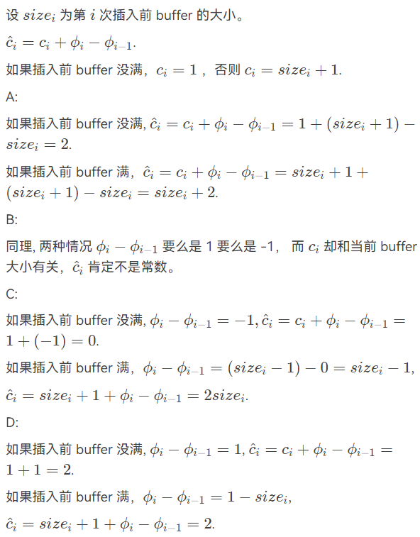

# Homework

!!! Abstract
    数据结构之后的算法分析的学习曲线陡然上升。同样的，以下均为我在学习 ADS 时的作业题与我的个人见解。诸君见笑。

---

## HW1

???+ Question
    If the depth of an AVL tree is 6 (the depth of an empty tree is defined to be -1), then the minimum possible number of nodes in this tree is:

    A.13   B.17   C.20   D.33

??? note "Answer"
    套用公式 $N_{min} = F_{h+3} - 1$ 得到 $N_{min} = F_{9} - 1 = 34 - 1 = 33$ ，故选 D。

---

???+ Question
    Insert 2, 1, 4, 5, 9, 3, 6, 7 into an initially empty AVL tree.  Which one of the following statements is FALSE?

    A.4 is the root
    
    B.3 and 7 are siblings
    
    C.2 and 6 are siblings
    
    D.9 is the parent of 7

??? note "Answer"
    B 最终结果如下
    
    

---

???+ Question
    For the result of accessing the keys 3, 9, 1, 5 in order in the splay tree in the following figure, which one of the following statements is FALSE?
    
    

    A.5 is the root

    B.1 and 9 are siblings

    C.6 and 10 are siblings

    D.3 is the parent of 4

??? note "Answer"
    D


---

???+ Question
    When doing amortized analysis, which one of the following statements is FALSE?

    A.Aggregate analysis shows that for all n, a sequence of n operations takes worst-case time $T(n)$ in total.  Then the amortized cost per operation is therefore $T(n)/n$
    
    B.For potential method, a good potential function should always assume its maximum at the start of the sequence
    
    C.For accounting method, when an operation's amortized cost exceeds its actual cost, we save the difference as credit to pay for later operations whose amortized cost is less than their actual cost
    
    D.The difference between aggregate analysis and accounting method is that the later one assumes that the amortized costs of the operations may differ from each other

??? note "Answer"
    B

    应该是 minimum

---

## HW2

???+ Question
    A 2-3 tree with 3 nonleaf nodes must have 18 keys at most. (T/F)

??? note "Answer"
    T

    根节点节点数 between $2$ and $M$ ,非叶节点 (except root) 节点数 between $\lceil \frac{M}{2} \rceil$ and $M$
    
    所以根节点一个键值两个孩子，两个非叶节点两个键值三个孩子，每个叶节点三个值，一共 $2 \times 3 \times 3 = 18$ 个

---

???+ Question
    In the red-black tree that results after successively inserting the keys 41; 38; 31; 12; 19; 8 into an initially empty red-black tree, which one of the following statements is FALSE?

    A.38 is the root
    
    B.19 and 41 are siblings, and they are both red
    
    C.12 and 31 are siblings, and they are both black
    
    D.8 is red

??? note "Answer"
    B 最终结果如下

    

---

???+ Question
    After deleting 15 from the red-black tree given in the figure, which one of the following statements must be FALSE?

    
    
    A.11 is the parent of 17, and 11 is black
    
    B.17 is the parent of 11, and 11 is red
    
    C.11 is the parent of 17, and 11 is red
    
    D.17 is the parent of 11, and 17 is black

??? note "Answer"
    C

---

???+ Question
    Insert 3, 1, 4, 5, 9, 2, 6, 8, 7, 0 into an initially empty 2-3 tree (with splitting).  Which one of the following statements is FALSE?

    A.7 and 8 are in the same node
    
    B.the parent of the node containing 5 has 3 children
    
    C.the first key stored in the root is 6
    
    D.there are 5 leaf nodes

??? note "Answer"
    A 最终结果如下

    

---

???+ Question
    After deleting 9 from the 2-3 tree given in the figure, which one of the following statements is FALSE?

    
    
    A.the root is full
    
    B.the second key stored in the root is 6
    
    C.6 and 8 are in the same node
    
    D.6 and 5 are in the same node

??? note "Answer"
    D 最终结果有空补上来

---

???+ Question
    Which of the following statements concerning a B+ tree of order M is TRUE?

    A.the root always has between 2 and M children
    
    B.not all leaves are at the same depth
    
    C.leaves and nonleaf nodes have some key values in common
    
    D.all nonleaf nodes have between $\lceil \frac{M}{2} \rceil$ and M children

??? note "Answer"
    C

    A 一个节点时； B 定义为相同深度； D 除了根节点

---

???+ Question
    Consider the following buffer management problem. Initially the buffer size (the number of blocks) is one. Each block can accommodate exactly one item. As soon as a new item arrives, check if there is an available block. If yes, put the item into the block, induced a cost of one. Otherwise, the buffer size is doubled, and then the item is able to put into. Moreover, the old items have to  be moved into the new buffer so it costs $k+1$ to make this insertion, where k is the number of old items. Clearly, if there are $N$ items, the worst-case cost for one insertion can be $\Omega(N)$ .  To show that the average cost is $O(1)$ , let us turn to the amortized analysis. To simplify the problem, assume that the buffer is full after all the N items are placed. Which of the following potential functions works?

    A.The number of items currently in the buffer
    
    B.The opposite number of items currently in the buffer
    
    C.The number of available blocks currently in the buffer
    
    D.The opposite number of available blocks in the buffer

??? note "Answer"
    D

    

---

## HW3

???+ Question
    In distributed indexing, document-partitioned strategy is to store on each node all the documents that contain the terms in a certain range. (T/F)

??? note "Answer"
    F
    

    Term-partitioned index 将倒排表按照单词进行分区，存储一定范围内每个单词的所有文档，更有利于查询。
    
    Document-partitioned index 将倒排表按照文档进行分区，存储一定范围内的文档的倒排表，更有利于安全，即使一部分数据丢失，也不会影响查询。

---

???+ Question
    When evaluating the performance of data retrieval, it is important to measure the relevancy of the answer set. (T/F)

??? note "Answer"
    F

    召回率与数据相关性无关。

---

???+ Question
    Precision is more important than recall when evaluating the explosive detection in airport security.  (T/F)

??? note "Answer"
    F

    爆炸检测中，召回率更重要。不过都高最好。

---

???+ Question
    While accessing a term by hashing in an inverted file index, range searches are expensive.  (T/F)

??? note "Answer"
    T

---

???+ Question
    When measuring the relevancy of the answer set, if the precision is high but the recall is low, it means that:

    A.most of the relevant documents are retrieved, but too many irrelevant documents are returned as well
    
    B.most of the retrieved documents are relevant, but still a lot of relevant documents are missed
    
    C.most of the relevant documents are retrieved, but the benchmark set is not large enough
    
    D.most of the retrieved documents are relevant, but the benchmark set is not large enough

??? note "Answer"
    B

---

???+ Question
    Which of the following is NOT concerned for measuring a search engine?

    A.How fast does it index
    
    B.How fast does it search
    
    C.How friendly is the interface
    
    D.How relevant is the answer set

??? note "Answer"
    C

---

???+ Question
    There are 28000 documents in the database. The statistic data for one query are shown in the following table. The recall is:

    | |Relevant|Irrelevant|
    |:----:|:----:|:----:|
    |Retrieved|4000|12000|
    |Not Retrieved|8000|4000|
    
    A.14%   B.25%   C.33%   D.50%

??? note "Answer"
    C
    
    $recall \ = \frac{4000}{4000+8000} = 0.33$

---

## HW4

???+ Question
    The result of inserting keys 1 to $2^k - 1$ for any $k>4$ in order into an initially empty skew heap is always a full binary tree. (T/F)

??? note "Answer"
    T

---

???+ Question
    The right path of a skew heap can be arbitrarily long. (T/F)

??? note "Answer"
    T

---

???+ Question
    Merge the two leftist heaps in the following figure.  Which one of the following statements is FALSE?

    
    
    A.2 is the root with 11 being its right child
    
    B.the depths of 9 and 12 are the same
    
    C.21 is the deepest node with 11 being its parent
    
    D.the null path length of 4 is less than that of 2

??? note "Answer"
    D 最终结果有空补上来

---

???+ Question
    We can perform BuildHeap for leftist heaps by considering each element as a one-node leftist heap, placing all these heaps on a queue, and performing the following step: Until only one heap is on the queue, dequeue two heaps, merge them, and enqueue the result.  Which one of the following statements is FALSE?

    A.in the k-th run, $\lceil \frac{N}{2^k} \rceil$ leftist heaps are formed, each contains $2^k$ nodes
    
    B.the worst case is when $N=2^K$ for some integer $K$
    
    C.the time complexity $T(N)=O(\frac{N}{2}\log 2^0 + \frac{N}{2^2}\log 2^1 + \frac{N}{2^3} \log 2^2 + \cdots + \frac{N}{2^K} \log 2^{K-1})$ for some integer $K$ so that $N=2^K$
    
    D.the worst case time complexity of this algorithm is $\Theta(N\log N)$

??? note "Answer"
    D

    由 C 可得 $T(N)= O(N \log 2 \sum\limits_{i=0}^{K-1} \frac{i-1}{2^i}) = O(N)$

---

???+ Question
    Insert keys 1 to 15 in order into an initially empty skew heap.  Which one of the following statements is FALSE?

    A.the resulting tree is a complete binary tree
    
    B.there are 6 leaf nodes
    
    C.6 is the left child of 2
    
    D.11 is the right child of 7

??? note "Answer"
    B 最终结果如下

    

---

???+ Question
    Merge the two skew heaps in the following figure.  Which one of the following statements is FALSE?

    
    
    A.15 is the right child of 8
    
    B.14 is the right child of 6
    
    C.1 is the root
    
    D.9 is the right child of 3

??? note "Answer"
    A 最终结果有空补上来

---

???+ Question
    The function is to merge two leftist heaps H1 and H2.

    ```c
    PriorityQueue Merge( PriorityQueue H1, PriorityQueue H2 )
    { 
    if (H1==NULL) return H2;
    if (H2==NULL) return H1;
    if ( `                     ` )
        swap(H1, H2);  //swap H1 and H2
    if ( H1->Left == NULL )
        `               ` ;
    else {
        H1->Right = Merge( H1->Right, H2 );
        if ( H1->Left->Npl < H1->Right->Npl )
        SwapChildren( H1 );  //swap the left child and right child of H1
        `               `;
    }
    return H1;
    }
    ```

??? note "Answer"
    1. `H1->Element > H2->Element`

    2. `H1->Left = H2`
    
    3. `H1->Npl = H1->Right->Npl + 1`

---

## HW5

???+ Question
    Which of the following binomial trees can represent a binomial queue of size 42?

    A. $B_0B_1B_2B_3B_4B_5$
    
    B. $B_1B_3B_5$
    
    C. $B_1B_5$
    
    D. $B_2B_4$

??? note "Answer"
    B

---

???+ Question
    For a binomial queue, __ takes a constant time on average.

    A.merging
    
    B.find-max
    
    C.delete-min
    
    D.insertion

??? note "Answer"
    D

    insertion 的均摊时间复杂度是 $O(1)$ ，所以平均时间复杂度也是 $O(1)$
    
    find-max 较难操作，而 find-min 若有指针记录也可以为 $O(1)$
    
    merging 和 delete-min 均为 $O(\log n)$

---

???+ Question
    Merge the two binomial queues in the following figure.  Which one of the following statements must be FALSE?

    
    
    A.there are two binomial trees after merging, which are $B_2$ and $B_4$
    
    B.13 and 15 are the children of 4
    
    C.if 23 is a child of 2, then 12 must be another child of 2
    
    D.if 4 is a child of 2, then 23 must be another child of 2

??? note "Answer"
    D 最终结果有空补上来

---

???+ Question
    Delete the minimum number from the given binomial queues in the following figure.  Which one of the following statements must be FALSE?

    
    
    A.there are two binomial trees after deletion, which are $B_1$ and $B_2$
    
    B.11 and 15 can be the children of 4
    
    C.29 can never be the root of any resulting binomial tree
    
    D.if 29 is a child of 4, then 15 must be the root of $B_1$

??? note "Answer"
    C 最终结果有空补上来

---

???+ Question
    The functions `BinQueue_Find` and `Recur_Find` are to find `X` in a binomial queue `H`.  Return the node pointer if found, otherwise return NULL.

    ```c
    BinTree BinQueue_Find( BinQueue H, ElementType X )
    {
        BinTree T, result = NULL;
        int i, j; 
    
        for( i=0, j=1; j<=H->CurrentSize; i++, j*=2) {  /* for each tree in H */
            T= H->TheTrees[i];
            if ( X `          `){  /* if need to search inside this tree */
                result = Recur_Find(T, X);
                if ( result != NULL ) return result;
            } 
        }
        return result;
    }
    
    BinTree Recur_Find( BinTree T, ElementType X )
    {
        BinTree result = NULL;
        if ( X==T->Element ) return T;
        if ( T->LeftChild!=NULL ){
            result = Recur_Find(T->LeftChild, X);
            if ( result!=NULL ) return result;
        } 
        if ( `             `)
            result = Recur_Find(T->NextSibling, X);
        return result;
    }
    ```

??? note "Answer"
    1. `>= T->Element`

    2. `T->NextSibling != NULL`

---

## HW6

???+ Question
    In the Tic-tac-toe game, a "goodness" function of a position is defined as $f(P)=W_{computer} - W_{human}$ where W is the number of potential wins at position P.
    
    In the following figure, `O` represents the computer and `X` the human. What is the goodness of the position of the figure?
    
    
    
    A. -1   B. 0   C. 4   D. 5

??? note "Answer"
    B

    $f(P)=W_{computer} - W_{human} = 3 - 3 = 0$

---

???+ Question
    Given the following game tree, which node is the first one to be pruned with $\alpha - \beta$ pruning algorithm?

    
    
    A. a   B. b   C. c   D. d

??? note "Answer"
    C

    首先，会被剪枝的一定是右侧的点。
    
    然后让我们来看，对于 min 行，左子树已经得到 68 ，而右子树左孩子是 86 ，86 上一行取 max ，也即 a 节点一定 $\ge 86$ 。此时我们可以知道 min 行那一个节点一定为 68 ，也即 c 节点被剪枝。

---

## HW7

???+ Question
    When solving a problem with input size $N$ by divide and conquer, if at each stage the problem is divided into 8 sub-problems of equal size N/3, and the conquer step takes $O(N^2\log N)$ to form the solution from the sub-solutions, then the overall time complexity is

    A. $O(N^2\log N)$
    
    B. $O(N^2\log^2 N)$
    
    C. $O(N^3\log N)$
    
    D. $O(N^{\log 8 / log 3})$

??? note "Answer"
    A

    依题有 $T(N) = 8T(N/3) + O(N^2\log N)$ 
    
    由主定理
    
    $\because 8 < 3^2$
    
    $\therefore T(N) = O(N^2\log N)$

---

???+ Question
    To solve a problem with input size N by divide and conquer algorithm, among the following methods, __ is the worst.

    A.divide into 2 sub-problems of equal complexity N/3 and conquer in $O(N)$
    
    B.divide into 2 sub-problems of equal complexity N/3 and conquer in $O(N\log N)$
    
    C.divide into 3 sub-problems of equal complexity N/2 and conquer in $O(N)$
    
    D.divide into 3 sub-problems of equal complexity N/3 and conquer in $O(N\log N)$

??? note "Answer"
    C

    A. $T(N) = 2T(N/3) + O(N) = O(N)$
    
    B. $T(N) = 2T(N/3) + O(N\log N) = O(N\log N)$
    
    C. $T(N) = 3T(N/2) + O(N) = O(N^{\log_2 3})$
    
    D. $T(N) = 3T(N/3) + O(N\log N) = O(N \log^2 N)$

---

???+ Question
    3-way-mergesort : Suppose instead of dividing in two halves at each step of the mergesort, we divide into three one thirds, sort each part, and finally combine all of them using a three-way-merge.  What is the overall time complexity of this algorithm ?

    A. $O(n(\log^2 n))$
    
    B. $O(n^2\log n)$
    
    C. $O(n\log n)$
    
    D. $O(n)$   

??? note "Answer"
    C

    $T(n) = 3T(n/3) + O(n) = O(n\log n)$

---

???+ Question
    Which one of the following is the lowest upper bound of T(n) for the following recursion $T(n) = 2T(\sqrt{n}) + \log n$ ?

    A. $O(\log n\log \log n)$
    
    B. $O(\log^2 n)$
    
    C. $O(n\log n)$
    
    D. $O(n^2)$

??? note "Answer"
    A

    assume $m = \log n$ ,then we could get $T(2^m) = 2T(2^{m/2}) + m$
    
    let $S(m) = T(2^m)$ , then we could get $S(m) = 2S(m/2) + m$
    
    这是我们熟悉的 merge sort 的形式，所以 $S(m) = O(m\log m)$ ，也即 $T(n) = O(\log n \log \log n)$

---

## HW8

???+ Question
    If a problem can be solved by dynamic programming, it must be solved in polynomial time.  (T/F)

??? note "Answer"
    F

    动态规划不一定能在线性时间内解决，例如背包问题其实就是伪多项式。并且能否在多项式时间内解决还取决于问题的输入规模。

---

???+ Question
    To solve a problem by dynamic programming instead of recursions, the key approach is to store the results of computations for the subproblems so that we only have to compute each different subproblem once.  Those solutions can be stored in an array or a hash table.  (T/F)

??? note "Answer"
    T

---

???+ Question
    In dynamic programming, we derive a recurrence relation for the solution to one subproblem in terms of solutions to other subproblems. To turn this relation into a bottom up dynamic programming algorithm, we need an order to fill in the solution cells in a table, such that all needed subproblems are solved before solving a subproblem. Among the following relations, which one is impossible to be computed?

    A. $A(i,j)=min(A(i−1,j),A(i,j−1),A(i−1,j−1))$
    
    B. $A(i,j)=F(A(min{i,j}−1,min{i,j}−1),A(max{i,j}−1,max{i,j}−1))$
    
    C. $A(i,j)=F(A(i,j−1),A(i−1,j−1),A(i−1,j+1))$
    
    D. $A(i,j)=F(A(i−2,j−2),A(i+2,j+2))$

??? note "Answer"
    D

    A B C 按照 i,j 顺序填表即可，可以看到是先填前面再填后面，而对于 D 来说决定因素是前后两者，所以无法填表

---

???+ Question
    Given a recurrence equation $f_{i,j,k} = f_{i,j+1,k} + min_{0 \le l \le k} \{f_{i-1,j,l} + w_{j,l}\}$ . To solve this equation in an iterative way, we cannot fill up a table as follows:

    A. `for k in 0 to n: for i in 0 to n: for j in n to 0`
    
    B. `for i in 0 to n: for j in 0 to n: for k in 0 to n`
    
    C. `for i in 0 to n: for j in n to 0: for k in n to 0`
    
    D. `for i in 0 to n: for j in n to 0: for k in 0 to n`

??? note "Answer"
    B

    依题有 `i` 要升序， `j` 要降序， `k` 无特别要求

---

???+ Question
    Which one of the following problems can be best solved by dynamic programming?

    A.Mergesort
    
    B.Closest pair of points problem
    
    C.Quicksort
    
    D.Longest common subsequence problem

??? note "Answer"
    D

    A B C 适合用分治法解决
---

## HW9

???+ Question
    Let S be the set of activities in Activity Selection Problem.  Then the earliest finish activity $a_m$ must be included in all the maximum-size subset of mutually compatible activities of S.  (T/F)

??? note "Answer"
    F

    虽然选择最早完成的活动 $a_m$ 是一种贪心选择，并且这种选择可以帮助我们构建一个较大的兼容活动子集，但这并不意味着 $a_m$ 必须包含在所有最大规模的兼容活动子集中。可能存在多个最大规模的兼容活动子集，其中一些可能不包括最早完成的活动 $a_m$ .

---

???+ Question
    Let C be an alphabet in which each character c in C has frequency c.freq.  If the size of C is n,  the length of the optimal prefix code for any character c is not greater than n−1.   (T/F)

??? note "Answer"
    T

    霍夫曼编码。在最坏的情况下，一个字符可能会位于霍夫曼树的最深位置，这意味着它经历了所有的 $n−1$ 次合并。所以，任何字符 $c$ 的最优前缀码的长度都不会超过 $n-1$ .

---

???+ Question
    Consider the problem of making change for n cents using the fewest number of coins. Assume that each coin's value is an integer.

    The coins of the lowest denomination（面额） is the cent.
    
    (I) Suppose that the available coins are quarters (25 cents), dimes (10 cents), nickels (5 cents), and pennies (1 cent). The greedy algorithm always yields an optimal solution.
    
    (II) Suppose that the available coins are in the denominations that are powers of c, that is, the denominations are $c^0,c^1,\dots,c^k$ for some integers $c>1$ and $k \ge 1$ . The greedy algorithm always yields an optimal solution.
    
    (III) Given any set of k different coin denominations which includes a penny (1 cent) so that there is a solution for every value of n, greedy algorithm always yields an optimal solution.
    
    Which of the following is correct?
    
    A.Statement (I) is false.
    
    B.Statement (II) is false.
    
    C.Statement (III) is false.
    
    D.All of the three statements are correct.

??? note "Answer"
    C

    A 该算法每次选择尽可能多的最大面值的硬币，直到金额不足以再选这种硬币为止，然后转向次大面值的硬币重复上述过程。
    
    B 如果硬币面额是某个基数 $c$ 的连续幂，则贪心算法同样会产生最优解。这是因为每个面额都是下一个更小面额的倍数，因此在选择较大面额的硬币时不会妨碍后续选择较小面额的硬币来构成剩余的金额。这保证了每次选择最大可能的硬币面额都将导致整体最优解。
    
    C 贪心算法并不总是能够产生最优解，除非硬币面额满足某些特定条件（如前两个陈述所述）。例如，如果我们有面额为1美分、3美分和4美分的硬币，并且需要找零6美分，那么贪心算法会选择一个4美分和两个1美分的硬币（总共3个硬币），而最优解应该是两个3美分的硬币（总共2个硬币）。因此，对于某些非标准的硬币面额集合，贪心算法可能不会找到使用最少硬币数量的解。

---

## HW10

???+ Question
    If $L_1 \le_p L_2$ and $L_2 \in NP$ , then $L_1 \in NP$ . (T/F)

??? note "Answer"
    T

    $L_1$ 在多项式时间内先规约到 $L_2$ , $L_2$ 在多项式时间内可验证，所以 $L_1$ 也可在多项式时间内验证。

---

???+ Question
    All NP-complete problems are NP problems.  (T/F)

??? note "Answer"
    T

---

???+ Question
    All the languages can be decided by a non-deterministic machine.  (T/F)

??? note "Answer"
    F

    非确定性图灵机可以接受某些语言，但不能接受所有语言。例如，存在一些语言，如停机问题，它们不能被任何非确定性图灵机接受。

---

???+ Question
    All NP problems can be solved in polynomial time in a non-deterministic machine.  (T/F)

??? note "Answer"
    T

---

???+ Question
    If a problem can be solved by dynamic programming, it must be solved in polynomial time. (T/F)

??? note "Answer"
    F

    动态规划是一种解决优化问题的方法，它可以用于解决许多 NP 完全问题，但并不保证在多项式时间内解决所有问题。例如，旅行商问题（TSP）可以使用动态规划解决，但它的最坏情况时间复杂度是指数级的。再比如背包问题，也是伪多项式时间的。

---

???+ Question
    Among the following problems, __ is NOT an NP-complete problem.

    A.Vertex cover problem
    
    B.Hamiltonian cycle problem
    
    C.Halting problem
    
    D.Satisfiability problem

??? note "Answer"
    C

---

???+ Question
    Suppose Q is a problem in NP, but not necessarily NP-complete.  Which of the following is FALSE?

    A.A polynomial-time algorithm for SAT would sufficiently imply a polynomial-time algorithm for Q.
    
    B.A polynomial-time algorithm for Q would sufficiently imply a polynomial-time algorithm for SAT.
    
    C.If $Q \notin P$ , then $P \neq NP$ .
    
    D.If Q is NP-hard, then Q is NP-complete.

??? note "Answer"
    B

    如果 Q 不是 NPC 问题就不会有这样的性质。

---

## HW11

???+ Question
    Suppose ALG is an $\alpha$ -approximation algorithm for an optimization problem $\pi$ whose approximation ratio is tight. Then for every $\varepsilon$ >0 there is no ( $\alpha - \varepsilon$ )-approximation algorithm for $\pi$  unless $P = NP$ . (T/F)


??? note "Answer"
    F.

    要注意算法的界和问题的界。对于这个算法来说是这个近似比不代表对于这个问题的其他算法来说也是此近似比。
    
    但是有些算法是有问题的下界的。例如 K-center 问题，没有近似比小于2的算法，除非 $P = NP$ 。

---

???+ Question
    As we know there is a 2-approximation algorithm for the Vertex Cover problem. Then we must be able to obtain a 2-approximation algorithm for the Clique problem, since the Clique problem can be polynomially reduced to the Vertex Cover problem. (T/F)

??? note "Answer"
    F.

    首先，此处有一个 fact。Clique problem 没有常数的近似解，最坏情况下的近似比目前是 $O(\log n)$ 。如果需要详细证明欢迎移步我的课程整理中对于各种问题的整理。当然了在写作业解答时我还没整理，整理好如果我还记得会来做链接跳转的。
    
    我们需要明确的是：归约是“解的转换”，而不是“近似解的转换”。
    
    - 归约的性质：归约意味着通过多项式时间的算法将一个问题转化为另一个问题。对于最大团问题和最小顶点覆盖问题的归约，我们通过求解补图的最小顶点覆盖，间接得到最大团的解。
    
    - 近似算法的限制：对于近似算法来说，最重要的挑战是如何保证算法在有限时间内返回一个接近最优解的解，而不仅仅是转换问题本身。虽然最大团问题和最小顶点覆盖问题之间有解的对应关系，但在进行近似时，这种对应关系并不自动保证从顶点覆盖的近似解能够转化为最大团问题的近似解。

---

???+ Question
    There exists an on-line algorithm for the bin packing problem that uses at most 3/2 the optimal number of bins for any instance. (T/F)

??? note "Answer"
    F.

    根据 PPT "There are inputs that force any on-line bin-packing algorithm to use at least 5/3 the optimal number of bins." 

---

???+ Question
    For the bin-packing problem: let $S=\sum S_i$ . Which of the following statements is FALSE?

    A. The number of bins used by the next-fit heuristic is never more than $\lceil 2S \rceil$
    
    B. The number of bins used by the first-fit heuristic is never more than $\lceil 2S \rceil$
    
    C. The next-fit heuristic leaves at most one bin less than half full
    
    D. The first-fit heuristic leaves at most one bin less than half full

??? note "Answer"
    C.

    对于 next-fit 算法，只要当前要放入的物品无法放入当前箱子，就会开下一个箱子，显然可以有不止一个没装满一半的箱子。
    
    而对于 first-fit 算法，若当前要放入的物品无法放入当前箱子，就会从下一个箱子开始找，直到找到一个能放进去的箱子。不可能存在两个没装满一半的箱子，若有这两个箱子的物品一定会放至于同一个箱子中。

---

???+ Question
    Assume that you are a real world Chinese postman, which have learned an awesome course "Advanced Data Structures and Algorithm Analysis" (ADS). Given a 2-dimensional map indicating $N$ positions $p_i(x_i,y_i)$ of your post office and all the addresses you must visit, you'd like to find a shortest path starting and finishing both at your post office, and visit all the addresses at least once in the circuit. Fortunately, you have a magic item "Bamboo copter & Hopter" from "Doraemon", which makes sure that you can fly between two positions using the directed distance (or displacement).

    However, reviewing the knowledge in the ADS course, it is an NPC problem! Wasting too much time in finding the shortest path is unwise, so you decide to design a 2−approximation algorithm as follows, to achieve an acceptable solution.
    
    ```c
    Compute a minimum spanning tree T connecting all the addresses.
    Regard the post office as the root of T.
    Start at the post office.
    Visit the addresses in order of a _____ of T.
    Finish at the post office.
    ```
    
    There are several methods of traversal which can be filled in the blank of the above algorithm. Assume that $P \neq NP$ , how many methods of traversal listed below can fulfill the requirement?
    
    - Level-Order Traversal
    
    - Pre-Order Traversal
    
    - Post-Order Traversal
    
    A. 0
    
    B. 1
    
    C. 2
    
    D. 3

??? note "Answer"
    这道题相当于n个点构造出一棵树，最小生成树问题，但这道题需要回到原点。这道题目有点小瑕疵，并未指出路的长度之间的关系，具体证明为什么是 2-approximation algorithm，指路yds老师的讲解[链接](https://classroom.zju.edu.cn/livingroom?course_id=64216&sub_id=1453122&tenant_code=112)。

    只要在这棵树上遍历能走出这个圈即可。因此仅 `Level-Order Traversal` 不满足，剩余两者均可。

---

???+ Question
    You have 10 identical cores on which you want to schedule some $n$ jobs. Each job $j\in {1,2,\dots ,n}$ has a processing time $p_j >0$ .  If $S_i$ is the set of jobs assigned to core $i$ ,  let the load be $\sum\limits_{j\in S_i} p_j$ . Now, you want to partition the jobs among the cores to minimize the load of the most-loaded core. 

    We design a greedy algorithm that picks any unassigned job, and assign it to the core with the least current load.
    What is the approximation ratio of the greedy algorithm? (Choose the smallest bound that applies.)
    
    A. 1
    
    B. 1.5
    
    C. 1.9
    
    D. 2

??? note "Answer"
    C.

    当前谁的负载最小就给谁，此为贪心算法。而我们想要最大的负载最小。
    
    只要 $n = 2$ 就是 $NPH$ 问题。因为 partition problem （均分问题）可以归约过来。设有 $m$ 台机器。
    
    $OPT \ge p_{max}$
    
    $OPT \ge \frac{\sum\limits_{i=1}^n P_i}{m}$
    
    要证 $\rho = 2 - \frac{1}{m}$
    
    假设最大的负载在第一台机器。
    
    对于 $p_n$ 来说，$S_j \ge S_1^' \ ,j = 2,3,\dots,n$ (我们记没有放上最后一个也即没有加入 $p_n$ 的第一台机器是 $S_1^'$)
    
    此时结果为 $S_1 + p_n$ 。
    
    $$OPT \ge \frac{\sum\limits_{i=1}^n P_i}{m} \ge \frac{mS_1^' + p_n}{m} = S_1^' + \frac{p_n}{m}$$
    
    $$ALG = S_1^' + p_n = S_1^' + \frac{p_n}{m} + (1 - \frac{1}{m})p_n \le OPT + (1 - \frac{1}{m})p_n = (2 - \frac{1}{m})OPT$$
    
    $$\Rightarrow \rho = 2 - \frac{1}{m}$$
    
    我们可以通过举例证明，这个近似比是可以得到的。
    
    假设我们有 $m$ 台机器，我们有 $(m-1)\cdot m + 1$ 个任务，前 $(m-1)\cdot m$ 个任务大小为 $1$，最后一个任务大小为 $m$。那么根据上述贪心算法我们会得到 $m$ 个机器每个都有放入 $(m-1)$ 个大小为 $1$ 的任务。再考虑最后一个任务，无论给哪个机器均一样。那么我们可以得到该算法的 $ALG = (m-1) + m = 2m-1$。而最优解可以想见是把最后一个大小为 $m$ 的任务放入最后一个机器，剩下 $(m-1)\cdot m$ 个大小为 $1$ 的任务均分到 $m-1$ 个机器。此时可以得到每一个机器的负载均为 $m$ ，也即 $OPT = m$。那么可以得到 $\rho = \frac{2m-1}{m} = 2 - \frac{1}{m}$。
    
    实际上，还可以优化。我们把任务从大到小排序后再放入。可以知道，当 $n > m$ 时负载最多的机器至少有两个任务。此时可以得到
    
    $$p_n \le \frac{1}{2} OPT$$
    
    $$\therefore ALG = OPT + (1-\frac{1}{m})p_n \le OPT + (1 - \frac{1}{m})\frac{1}{2}OPT = (\frac{3}{2}-m)OPT$$
    
    $$\rho = \frac{3}{2} - \frac{1}{m}$$
    
    (LPT) 实际中把任务从大到小排序后可以证明得到 $p_n \le \frac{1}{3} OPT$ 。
    
    $$\rho = \frac{4}{3} - \frac{1}{3m}$$

---

## HW12

???+ question
    For the graph given in the following figure, if we start from deleting the black vertex, then local search can always find the minimum vertex cover.  (T/F)

    

??? note "Answer"
    T

    对于 minimum vertex cover 问题，如果要删除一个点，要保证与该点相连的边的另一个点未被删除。因此，删除黑色点后，与黑色点相连的白色点均不能被删除。剩下最下面两个白色的点可以被删除，确实也就得到了最优解。

---

???+ question
    We are given a set of sites $S=\{s_1,s_2,⋯,s_n\}$ in the plane, and we want to choose a set of k centers $C=\{c_1,c_2,⋯,c_k\}$ so that the maximum distance from a site to the nearest center is minimized. Here $c_i$ can be an arbitrary point in the plane. 
    
    A local search algorithm arbitrarily choose k points in the plane to be the centers, then
    
    - (1) divide $S$ into k sets, where $S_i$ is the set of all sites for which $c_i$ is the nearest center; and
    - (2) for each $S_i$, compute the central position as a new center for all the sites in $S_i$.
    
    If steps (1) and (2) cause the covering radius to strictly decrease, we perform another iteration, otherwise the algorithm stops. 
    
    When the above local search algorithm terminates, the covering radius of its solution is at most 2 times the optimal covering radius.  (T/F)

??? note "Answer"
    F 有空来填坑

    感觉上最终结果与最开始取的点的关系非常大，不一定为 2 .
    
    或是根据结论 "Unless P = NP, there is no approximation algorithm let the ratio less than 2 for k-center problelm". 

---

???+ question
    Local search algorithm can be used to solve lots of classic problems, such as SAT and N-Queen problems.  Define the configuration of SAT to be X = vector of assignments of N boolean variables, and that of N-Queen to be Y =  positions of the N queens in each column.  The sizes of the search spaces of SAT and N-Queen are $O(2^N)$ and $O(N^N)$ , respectively.  (T/F)

??? note "Answer"
    T

---

???+ question
    Spanning Tree Problem: Given an undirected graph $G=(V, E)$, where $|V|=n$ and $|E|=m$. Let $F$ be the set of all spanning trees of $G$. Define $d(u)$ to be the degree of a vertex $u \in V$. Define $w(e)$ to be the weight of an edge $e \in E$.

    We have the following three variants of spanning tree problems:
    
    - (1) Max Leaf Spanning Tree: find a spanning tree $T \in F$ with a maximum number of leaves.
    
    - (2) Minimum Spanning Tree: find a spanning tree $T \in F$ with a minimum total weight of all the edges in $T$.
    
    - (3) Minimum Degree Spanning Tree: find a spanning tree $T \in F$ such that its maximum degree of all the vertices is the smallest.
    
    For a pair of edges $\left(e, e^{\prime}\right)$ where $e \in T$ and $e^{\prime} \in(G-T)$ such that $e$ belongs to the unique cycle of $T \cup e^{\prime}$, we define edge-swap $\left(e, e^{\prime}\right)$ to be $(T-e) \cup e^{\prime}$.
    
    Here is a local search algorithm:
    
    ```pseudocode
    T = any spanning tree in F_i
    while (there is an edge-swap (e, e') which reduces Cost(T)) {
        T = T - e + e';
    }
    return T;
    ```
    
    Here $\operatorname{cost}(T)$ is the number of leaves in $T$ in Max Leaf Spanning Tree; or is the total weight of $T$ in Minimum Spanning Tree; or else is the minimum degree of $T$ in Minimum Degree Spanning Tree.
    
    Which of the following statements is TRUE?
    
    A. The local search always return an optimal solution for Max Leaf Spanning Tree
    
    B. The local search always return an optimal solution for Minimum Spanning Tree
    
    C. The local search always return an optimal solution for Minimum Degree Spanning Tree
    
    D. For neither of the problems that this local search always return an optimal solution

??? note "Answer"
    B 有空填坑

---

???+ question
    There are $n$ jobs, and each job $j$ has a processing time $t_{j}$. We will use a local search algorithm to partition the jobs into two groups A and B, where set A is assigned to machine $M_{1}$ and set $\mathrm{B}$ to $M_{2}$. The time needed to process all of the jobs on the two machines is $T_{1}=\sum\limits_{j \in A} t_{j}, T_{2}=\sum\limits_{j \in B} t_{j}$. The problem is to minimize $\left|T_{1}-T_{2}\right|$.

    Local search: Start by assigning jobs $1, \ldots, n / 2$ to $M_{1}$, and the rest to $M_{2}$.
    
    The local moves are to move a single job from one machine to the other, and we only move a job if the move decreases the absolute difference in the processing times. Which of the following statement is true?
    
    A. The problem is NP-hard and the local search algorithm will not terminate.
    
    B. When there are many candidate jobs that can be moved to reduce the absolute difference, if we always move the job $j$ with maximum $t_j$ , then the local search terminates in at most $n$ moves.
    
    C. The local search algorithm always returns an optimal solution.
    
    D. The local search algorithm always returns a local solution with $\frac{1}{2}T_1 \le T \le 2T_1$.

??? note "Answer"
    B

    A，每次都减小，肯定会减无可减到终止。大概是 NP-hard。
    
    B，一项被移到另一侧之后肯定不会再被移回来，因此最多移$n$次。
    
    C，考虑$\{10,11,12,12,13,14\}=\{10,11,13\}+\{12,12,14\}$，可知无法移动了，但是显然最优解是$\{11,12,13\}+\{10,12,14\}$。
    
    D，考虑$\{1,2,100\}=\{1,2\}+\{100\}$。

---

???+ question
    Max-cut problem: Given an undirected graph $G=(V, E)$ with positive integer edge weights $w_{e}$, find a node partition $(A, B)$ such that $w(A, B)$, the total weight of edges crossing the cut, is maximized. Let us define $S^{\prime}$ be the neighbor of $S$ such that $S^{\prime}$ can be obtained from $S$ by moving one node from $A$ to $B$, or one from $B$ to $A$. only choose a node which, when flipped, increases the cut value by at least $w(A, B) /|V|$. Then which of the following is true?

    A. Upon the termination of the algorithm, the algorithm returns a cut $(A,B)$ so that $2.5w(A,B) \ge w(A^∗, b^*)$, where $(A^∗ ,B^∗)$ is an optimal partition.
    
    B. The algorithm terminates after at most $O(\log|V|\log W)$ flips, where $W$ is the total weight of edges.
    
    C. Upon the termination of the algorithm, the algorithm returns a cut $(A,B)$ so that $2w(A,B) \ge w(A^∗, b^*)$.
    
    D. The algorithm terminates after at most $O(|V|^2)$ flips.

??? note "Answer"
    A

    由 PPT 上结论可得。

---

## HW13

???+ question
    Let $a = (a_1, a_2, \ldots, a_n)$ denote the list of elements we want to sort. In the quicksort algorithm, if the pivot is selected uniformly at random. Then any two elements get compared at most once and the probability of $a_i$ and $a_j$ being compared is $\frac{1}{j-i+1}$ for $j > i$ , given that $a_i$ or $a_j$ is selected as the pivot. (T/F)

??? note "Answer"
    F

    如果 $a$ 是有序数组，那么这个结论正确。具体证明过程可以看笔记内容。

---

???+ question
    Reviewing the randomized QuickSort in our course, we always select a central splitter as a pivot before recursions, make sure that each side contains at least $\frac{n}{4}$ elements.Hence, differing from the deterministic QuickSort, the worst case expected running time of the randomized QuickSort is $\Theta (n \log n)$. (T/F)

??? note "Answer"
    T
    
    具体可以查看 slides 中的内容。

---

???+ question
    Given a linked list containg $N$ nodes.  Our task is to remove all the nodes. At each step, we randomly choose one node in the current list, then delete the selected node together with all the nodes after it. Here we assume that each time we choose one node uniformly among all the remaining nodes. What is the expected number of steps to remove all the nodes?

    A. $\Theta (\log N)$
    
    B. $\frac{N}{e}$
    
    C. $\frac{N}{2}$
    
    D. $\sqrt{N}$

??? note "Answer"
    A. $\Theta (\log N)$

    依题有关系式 $a_n = \frac{1}{N} \sum\limits_{i=1}^{N-1} a_i + 1$
    
    可以通过带入求解得到 B，C，D 均不满足。
    
    可以由归纳法证明得到 A 正确。

---

???+ question
    The Online Hiring Algorithm ( hire only once ) is described as the following:

    ```
    int OnlineHiring ( EventType C[ ], int N, int k )
    {
        int Best = N;
        int BestQ = -INFINITY ;
        for ( i=1; i<=k; i++ ) {
            Qi = interview( i );
            if ( Qi > BestQ )   BestQ = Qi;
        }
        for ( i=k+1; i<=N; i++ ) {
            Qi = interview( i );
            if ( Qi > BestQ ) {
                Best = i;
                break;
            }
        }
        return Best;
    }
    ```
    
    Assume that the quality input C[ ] is uniformly random.
    
    When $N = 271$ and $k=90$ , the probability of hiring the $N \ th$ candidate is ...

??? note "Answer"
    因此前 270 名中最好的那一个必须在前90当中，也即 $P = \frac{90}{270} = \frac{1}{3}$

---

## HW14

???+ question
    While comparing a serial algorithm with its parallel counterpart, we just concentrate on reducing the work load. (T/F)

??? note "Answer"
    F

    可以移步笔记中关于 Measuring the performance 的部分。我们要关注两方面。
    
    Work load - total number of operations: W(n)
    
    Worst-case running time: T(n)

---

???+ question
    To evaluate the Prefix-Sums of a sequence of 16 numbers by the parallel algorithm with Balanced Binary Trees, C(4,1) is found before C(2,2). (T/F)

??? note "Answer"
    T

    先计算 B，B 是自底向上计算的；后计算 C，C 是自顶向下计算的。

---

???+ question
    To evaluate the sum of a sequence of 16 numbers by the parallel algorithm with Balanced Binary Trees, B(1,6) is found before B(2,1). (T/F)

??? note "Answer"
    T

    同上，先计算 B，B 是自底向上计算的；后计算 C，C 是自顶向下计算的。

---

???+ question
    In order to solve the maximum finding problem by a parallel algorithm with $T(n)=O(1)$ , we need work load $W(n)= \Omega (n^2)$ in return. (T/F)

??? note "Answer"
    F

    最最暴力的解法也就 $W(n) = O(n^2)$ ,若是应用 Random Sampling 算法，应该为 $W(n)=O(n)$

---

???+ question
    To solve the Maximum Finding problem with parallel Random Sampling method, $O(n)$ processors are required to get $T(n)=O(1)$ and $W(n)=O(n)$ with very high probability. (T/F)

??? note "Answer"
    T

    笔记中的 Theorem ，证明不要求，感兴趣的小伙伴可以去证明。

---

???+ question
    The prefix-min problem is to find for each i, $1 \le i \le n$ , the smallest element among $A(1), A(2), \cdots , A(i)$ .  What is the run time and work load for the following algorithm?

    ```c
    for i, 1 <= i <= n pardo
        B(0, i) = A(i)
    for h=1 to log(n)
        for i, 1<= i <= n/2^h pardo
            B(h, i) = min {B(h-1, 2i-1), B(h-1, 2i)}
    for h=log(n) to 0
        for i even, 1 <= i <= n/2^h pardo
            C(h, i) = C(h+1, i/2)
        for i=1 pardo
            C(h, 1) = B(h, 1)
        for i odd, 3 <= i <= n/2^h pardo
            C(h, i) = min {C(h + 1, (i - 1)/2), B(h, i)}
    for i, 1 <= i <= n pardo
        Output C(0, i)
    ```

??? note "Answer"
    $T(n)=O(\log n)$ , $W(n)=O(n)$

    和 Prefix-Sums 极度类似。

---

???+ question
    Which one of the following statements about the Maximum Finding problem is true?

    A. There exists a serial algorithm with time complexity being $O(\log N)$
    
    B. No parallel algorithm can solve the problem in $O(1)$ time
    
    C. When partitioning the problem into sub-problems and solving them in parallel, compared with $\sqrt{N}$ ,choosing $\log \log N$ as the size of each sub-problem can reduce the work load and the worst-case time complexity.
    
    D. Parallel random sampling algorithm can run in $O(1)$ time and $O(N)$ work with very high probability.

??? note "Answer"
    D.

    A. 至少也是 $O(N)$
    
    B. all paris 和 Random Sampling 都是 $O(1)$
    
    C. 只能减少 work load，不能减少时间复杂度

---

???+ question
    Sorting-by-merging is a classic serial algorithm.  It can be translated directly into a reasonably efficient parallel algorithm. A recursive description follows.

    $MERGE−SORT( A(1), A(2), \dots, A(n); B(1), B(2), \dots, B(n) )$
    
    Assume that $n = 2^l$ for some integer $l \ge 0$
    
    if n = 1 then return B(1) := A(1)
    
    else call, in parallel, $MERGE−SORT( A(1), \dots, A(n/2); C(1), \dots, C(n/2) )$ and $MERGE−SORT(A(n/2+1), \dots , A(n); C(n/2+1), \dots , C(n) )$
    
    $Merge (C(1),\dots ,C(n/2)) and (C(n/2 + 1),\dots,C(n)) into (B(1), B(2), \dots, B(n)) with time O(\log n)$
    
    Then the MERGE−SORT runs in __ .
    
    A. $O(n\log n)$ work and $O(\log^2 n)$ time
    
    B. $O(n\log n)$ work and $O(\log n)$ time
    
    C. $O(n\log^2 n)$ work and $O(\log^2 n)$ time
    
    D. $O(n\log^2 n)$ work and $O(\log n)$ time

??? note "Answer"
    A

    原题有误，yds老师指出应该更正为 $Merge (C(1),\dots ,C(n/2)) and (C(n/2 + 1),\dots,C(n)) into (B(1), B(2), \dots, B(n)) with time O(\log n)$
    
    - 每次递归调用，问题被分成两个大小为 $n/2$ 的子问题。
    - 递归调用的工作量为：$T_{\text{work}}(n) = 2 \cdot T_{\text{work}}\left(\frac{n}{2}\right) + O(n)$
    其中，$O(n)$ 是合并两个子数组所需的线性时间。
    
    - 根据递归树的分析方法：
        - 每一层的工作量是 $O(n)$（两个子问题的递归调用 + 合并操作）。
        - 递归深度为 $\log n$（因 $n = 2^l$ ，递归会持续对 $n$ 二分直到 $n = 1$ ）。
        - 总工作量为每一层的工作量乘以递归深度：$T_{\text{work}}(n) = O(n \log n)$
    
    - 时间复杂度关注并行算法的**执行时间**，取决于递归调用的时间和并行的合并操作时间。
    - 每一层的递归调用是完全并行的，因此时间只与**合并操作**相关。
    - 合并两个 $n$ 元素数组的时间为 $O(n)$ ，但在并行情况下，我们可以将合并操作分成多步，例如将小部分并行归并，因此合并时间可以减少。
    - 总时间复杂度的递归关系为： $T_{\text{time}}(n) = T_{\text{time}}\left(\frac{n}{2}\right) + O(\log n)$
    - 这里 $O(\log n)$ 是每一层的合并时间。
    - 递归深度为 $\log n$ ，总时间为：$T_{\text{time}}(n) = O(\log^2 n)$

---

???+ question
    Which one of the following statements about the Ranking problem is true? (Assume that both arrays contain N elements.)

    A. There exists a serial algorithm with time complexity being $O(\log N)$
    
    B. Parallel binary search algorithm can solve the problem in $O(1)$ time.
    
    C. When partitioning the problem into sub-problems and solving them in parallel, choosing $\log \log N$ as the size of each sub-problem can reduce the work load and the worst-case time complexity to $O(\log N)$.
    
    D. There is a parallel algorithm that can run in $O(\log N)$ time and $O(N)$ work.

??? note "Answer"
    D

    A. 在最优情况下，可以使用 $O(N\logN)$ 的方法（如排序 + 遍历），或者 $O(N)$ 的方法（如计数排序或桶排序）。由于每个元素都需要处理，串行算法的时间复杂度至少为 $O(N)$ 。
    
    B. 二分查找的时间复杂度为 $O(\log N)$ , 即使并行运行，整个算法的时间仍然取决于每次二分查找的时间。
    
    C. 划分为 $\frac{n}{\log n}$ 个子问题，可以得到 $T = O(\log n)$ , $W = O(n)$ 

---

## HW15

???+ question
    To merge 55 runs using 3 tapes for a 2-way merge, the original distribution (34, 21) is better than (27, 28).  (T/F)

??? note "Answer"
    T

    按照斐波那契数列来分。

---

???+ question
    If only one tape drive is available to perform the external sorting, then the tape access time for any algorithm will be $\Omega (n^2)$. (T/F)

??? note "Answer"
    T

    在单个磁带的情况下，每次读取或写入数据都需要线性扫描磁带，而无法像在内存中那样随机访问数据。也即寻道时间变大。
    
    具体来说，在最简单的情况下，如果要对磁带上 $n$ 个元素进行排序，我们可能会使用一种类似于冒泡排序的策略，其中每一轮都会找到当前未排序部分的最大（或最小）元素，并将其移动到正确的位置。由于磁带上的每一次查找和交换操作都涉及到线性时间的扫描，因此每一轮的复杂度为 $O(n)$ ，而需要进行大约 $n$ 轮这样的操作来确保所有元素都被正确排序。这导致总的时间复杂度为 $O(n^2)$ 。

---

???+ question
    In external sorting, a k-way merging is usually used in order to reduce the number of passes and we will take the k as large as possible as long as we have enough amount of tapes. (T/F)

??? note "Answer"
    F

    k 过大时输入缓存数量会更多，输入缓存大小会小，导致效率降低。

---

???+ question
    In general, for a 3-way merge we need 6 input buffers and 2 output buffers for parallel operations. (T/F)

??? note "Answer"
    T

    In general, for a k-way merge we need 2k input buffers and 2 output buffers for parallel operations in external sorting.

---

???+ question
    Given 100,000,000 records of 256 bytes each, and the size of the internal memory is 128MB. If simple 2-way merges are used, how many passes do we have to do?

    A. 10
    
    B. 9
    
    C. 8
    
    D. 7

??? note "Answer"
    B

    N = 100,000,000 = $10^8$
    
    M = 128 MB / 256 bytes = $2^{19}$
    
    pass = 1 + $\lceil \log_2 \frac{N}{M} \rceil = 9

---

???+ question
    In external sorting, suppose we have 5 runs of lengths 2, 8, 9, 5, and 3, respectively. Which of the following merging orders can obtain the minimum merge time?

    A. merge runs of lengths 2 and 3 to obtain Run#1; merge Run#1 with the one of length 5 to obtain Run#2; merge Run#2 with the one of length 8 to obtain Run#3; merge Run#3 with the one of length 9
    
    B. merge runs of lengths 2 and 3 to obtain Run#1; merge Run#1 with the one of length 5 to obtain Run#2; merge runs of lengths 8 and 9 to obtain Run#3; merge Run#2 and Run#3
    
    C. merge runs of lengths 2 and 3 to obtain Run#1; merge runs of lengths 5 and 8 to obtain Run#2; merge Run#1 and Run#2 to obtain Run#3; merge Run#3 with the one of length 9
    
    D. merge runs of lengths 2 and 3 to obtain Run#1; merge runs of lengths 5 and 8 to obtain Run#2; merge Run#2 with the one of length 9 to obtain Run#3; merge Run#1 and Run#3

??? note "Answer"
    B

    即构建霍夫曼树。

---

???+ question
    In external sorting, in order to reduce the number of passes, minimizing the initial number of runs (i.e. generating longer runs ) is a good idea. Suppose the input record keys are (25, 74, 56, 34, 21, 11, 29, 80, 38, 53) and the internal memery can hold only 3 records, the minimum number of initial runs obtained by replacement selection is__ 。

    A. 1
    
    B. 2
    
    C. 3
    
    D. 4

??? note "Answer"
    B

    25 34 56 74
    
    11 21 29 38 53 80

---

???+ question
    Suppose we have the internal memory that can handle 12 numbers at a time, and the following two runs on the tapes:

    Run 1: 1, 3, 5, 7, 8, 9, 10, 12
    
    Run 2: 2, 4, 6, 15, 20, 25, 30, 32
    
    Use 2-way merge with 4 input buffers and 2 output buffers for parallel operations.  Which of the following three operations are NOT done in parallel?
    
    A. 1 and 2 are written onto the third tape; 3 and 4 are merged into an output buffer; 6 and 15 are read into an input buffer
    
    B. 3 and 4 are written onto the third tape; 5 and 6 are merged into an output buffer; 8 and 9 are read into an input buffer
    
    C. 5 and 6 are written onto the third tape; 7 and 8 are merged into an output buffer; 20 and 25 are read into an input buffer
    
    D. 7 and 8 are written onto the third tape; 9 and 15 are merged into an output buffer; 10 and 12 are read into an input buffer

??? note "Answer"
    D

    D 选项强行想要 parallel ，因此没有管正在读入的 10, 12，直接基于现有 3 个 buffer 块 merge ，因此进行了错误的 merge(9, 15)。事实上这一步无法 parallel ，必须等待 10, 12 读完之后才能进行正确的 merge(9, 10)。

---

???+ question
    Suppose that the replacement selection is applied to generate longer runs with a priority queue of size 4. Given the sequence of numbers { 9, 75, 17, 12, 88, 91, 25, 22, 35, 41, 58, 96, 15 }.  Which of the following gives the second output run?

    A. 22 35 88 91
    
    B. 22 35 41 58 88 91 96
    
    C. 22 35 41 58 96
    
    D. 22 35 41 58

??? note "Answer"
    C

    9  12 17 25 75 88 91
    
    22 35 41 58 96
    
    15

---