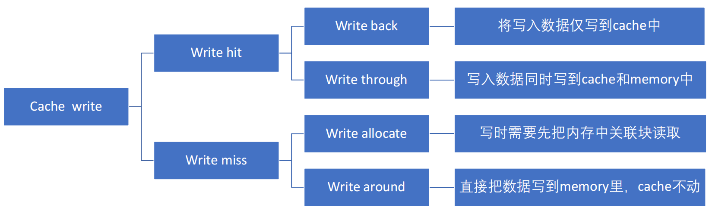
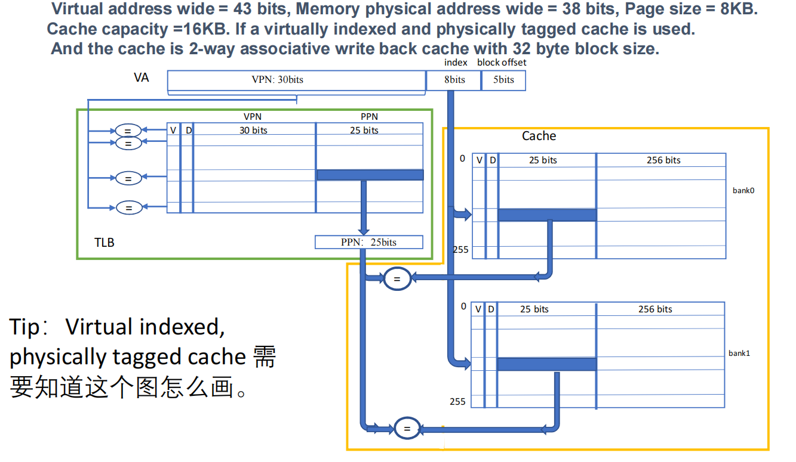
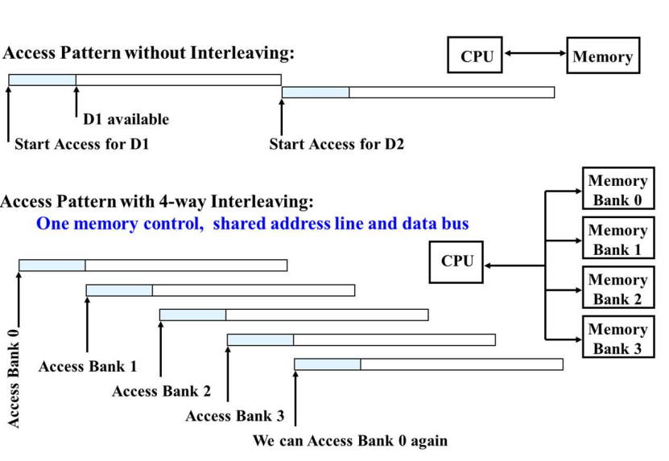
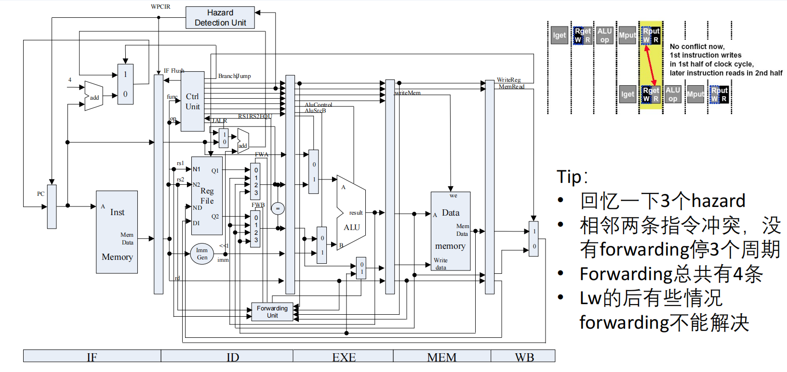
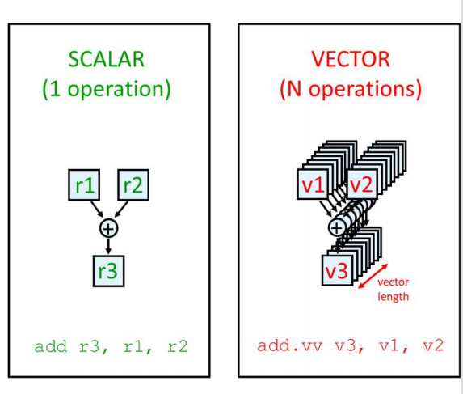
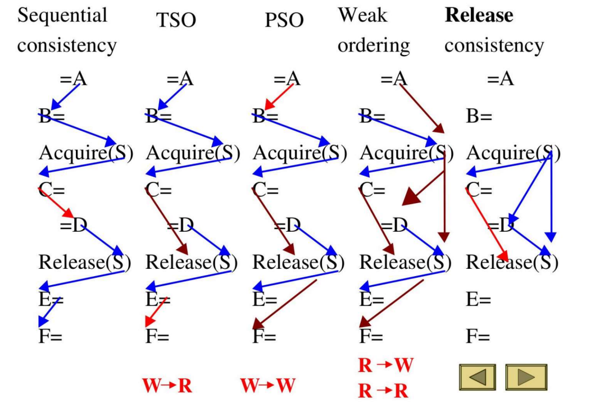
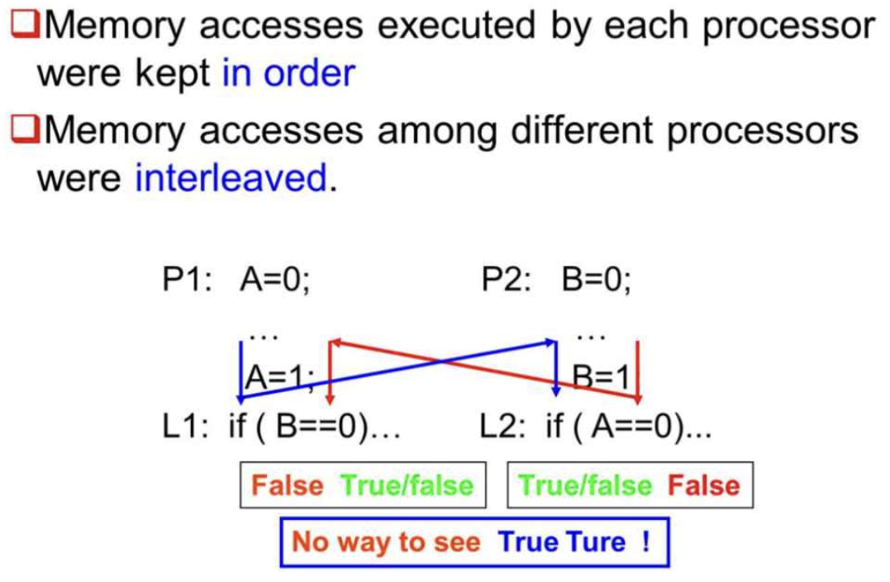

# CA review

## cr's review course

- 题型：
  - 选择题(30分)单选，一题一分
  - 大题(70分)
- Memory Hierarchy 和 ILP 这两章是重点，TLP 里面有大题，看起来分值也多一点。
- 第一章和第四章的SIMD内容会少一点。
- 每一章都有一道主观题。去年量化分析方法出成小题了。
- 重点的内容每年都差不多。

```markmap
### Data Dependences
#### WAR
### Name Dependences
#### Anti-dependence
##### WAR
#### Output-dependence
##### WAW
### Control Dependences
#### Branch Hazards
### Structural Hazards
```

---

## hsb's review course

- 五道大题，一题是 10 ~ 15 分

- ch 2, 3, 5 各出一道大题，ch 1, 4 两个当中有一个大题
- ch 2 动态调度
- ch 3 cache 的替换
- ch 4 关于向量指令的计算
- ch 5 cache 一致性
- 去看一下 scoreboard 和投机执行是如何结合的

---




1. **缓存访问（命中）**: 访问（读或写）缓存非常快，我们假设需要 **1个周期**。
2. **内存访问**: 访问 Memory 非常慢。我们用一个变量 **`M`** 来表示从内存读取一个数据块（Block/Cache Line）或向内存写入一个数据块所需的周期数。
3. **总线**: 内存总线一次只能进行一项操作（要么读，要么写）。
4. `Dirty/Clean`:
   - `Clean`（干净）块：表示缓存中的这个块和内存中的内容完全一致。
   - `Dirty`（脏）块：表示这个块在缓存中被修改过，与内存中的内容不一致。因此，在被替换掉之前，必须先写回内存。

---

- **策略组合一**: `Write Through` (写命中策略) + `Write Around` (写未命中策略)
- **策略组合二**: `Write Back` (写命中策略) + `Write Allocate` (写未命中策略)

---

**第一部分：读操作 (Read Operations)**

**Case 1: 读命中 (Read Hit)**

- **所需周期**: **1**

**Case 2: 读未命中 (Read Miss)，替换一个`Clean`块**

- **所需周期**: `1 (判断miss) + M (从内存读) + 1 (读数据)` = **`M + 2`**

**Case 3: 读未命中 (Read Miss)，替换一个`Dirty`块**

- **所需周期**: `1 (判断miss) + M (写回脏块) + M (读取新块) + 1 (读数据)` = **`2M + 2`**

---

**第二部分：写操作 (Write Operations)**

**策略组合一: 写穿透 (Write Through) + 写绕行 (Write Around)**

**Case 4: 写命中 (Write Hit, 使用 Write-Through 策略)**

- **所需周期**: `1 (写Cache) + M (写Memory)` = **`M + 1`**

**Case 5: 写未命中 (Write Miss, 使用 Write-Around 策略)**

- **所需周期**: **`M`**

---

**策略组合二: 写回 (Write Back) + 写分配 (Write Allocate)**

**Case 6: 写命中 (Write Hit, 使用 Write-Back 策略)**

- **所需周期**: **1**

**Case 7: 写未命中 (Write Miss, 使用 Write-Allocate, 替换`Clean`块)**

- **所需周期**: `1 (判断miss) + M (从内存读) + 1 (执行写命中)` = **`M + 2`**

**Case 8: 写未命中 (Write Miss, 使用 Write-Allocate, 替换`Dirty`块)**

- **所需周期**: `1 (判断miss) + M (写回脏块) + M (读取新块) + 1 (执行写命中)` = **`2M + 2`**

---



这张图展示的是一种非常常见且重要的Cache架构——**虚拟索引物理标签缓存 (Virtual Indexed, Physically Tagged Cache, VIPT)**。我们来一步步拆解图中的所有细节。

- **Virtual address wide = 43 bits**: 虚拟地址总长度为43位。这意味着一个程序理论上可以使用的虚拟内存空间是 $2^{43}$ 字节。
- **Memory physical address wide = 38 bits**: 物理地址总长度为38位。这意味着实际的物理内存（比如你的内存条）大小是 $2^{38}$ 字节。
- **Page size = 8KB**: 页面大小是8KB。操作系统以“页”为单位管理内存。8KB=8×1024B=$2^3$×$2^{10}$B=$2^{13}$ 字节。
- **Cache capacity = 16KB**: Cache的总容量是16KB，即 $2^{14}$ 字节。
- **2-way set associative**: Cache是**2路组相联**的。这意味着每个“组 (set)”里面可以存放两个“缓存行 (cache line)”。图中的 `bank0` 和 `bank1` 就代表了这2路。
- **32 byte block size**: Cache中每个块（也叫缓存行, cache line）的大小是32字节，即 $2^5$ 字节。这是Cache与主存之间数据交换的最小单位。

图中最重要的部分就是虚拟地址（VA）的分解。VIPT Cache的核心思想是：**用虚拟地址的一部分来快速定位Cache中的位置（索引），但用物理地址来最终确认是不是真的命中了（标签匹配）**。

**Block Offset (块内偏移)**

- **计算**: 块大小是32字节 ($2^5$ B)，所以需要5位来表示一个块内的具体是哪个字节。
- **图中位置**: 虚拟地址的最低 **5 bits**。
- **作用**: 定位到缓存行中的具体字节。

**Index (索引)**

- 计算: 这是最关键的一步。索引决定了访问Cache的哪个“组 (set)”。
  - Cache总容量 = 16KB
  - 每路容量 = 16KB / 2 = 8KB
  - 每路中的缓存行数量 = 8KB / 32B = $2^{13}$/$2^5$=$2^8$=256 个。
  - 因此，我们需要 **8 bits** 作为索引，来从256个组中选择一个。
- **图中位置**: 块内偏移之上，占了 **8 bits**。
- **作用**: 快速定位到Cache中的某一个组 (set)。如图所示，索引值从0到255，对应Cache中的256个组。

**VPN (Virtual Page Number, 虚拟页号) & PPN (Physical Page Number, 物理页号)**

- 计算:
  - 页内偏移 (Page Offset) = $\log_2(8KB)$=13 bits。这个偏移在虚拟地址和物理地址中是相同的。我们可以看到 `index` (8 bits) + `block offset` (5 bits) = 13 bits，这部分正好就是页内偏移。
  - 虚拟地址总长43位，所以VPN = 43 - 13 = **30 bits**。这30位用来在页表中查找。
  - 物理地址总长38位，所以PPN = 38 - 13 = **25 bits**。这是物理内存中页的编号。
- **图中位置**: VPN是虚拟地址的最高 **30 bits**，PPN是物理地址的最高 **25 bits**。

**VIPT工作流程详解 (看图中的箭头)**

1. **并行查询**: CPU发出一个43位的虚拟地址。地址被分解后：
   - 高30位的 **VPN** 被送到 **TLB (Translation Lookaside Buffer)** 进行查询。TLB是一个高速缓存，用于存放最近使用的VPN到PPN的映射关系。
   - 中间8位的 **Index** 被送到 **Cache**，用于选择256个组中的一个。如图中箭头所示，这个index同时发往`bank0`和`bank1`。
2. **TLB命中与转换**:
   - 假设TLB命中（图中画的是命中的情况），TLB会根据VPN（30 bits）查找到对应的PPN（25 bits）。这个PPN就是数据所在的**物理页号**。
3. **Cache行读取与标签比较**:
   - 与此同时，Cache根据Index选定了第`index`号组。因为是2路组相联，所以会同时从`bank0`和`bank1`中读出第`index`组的两个缓存行。
   - 每个缓存行都包含：有效位(V), 脏位(D), **物理标签(Tag)**, 和数据块。
   - Cache中存储的**Tag**是什么？就是**物理页号PPN**！
   - **关键一步**：将 **从TLB中获取的PPN (25 bits)** 与 **从Cache两个bank中读出的两个Tag (都是25 bits)** 进行比较。
   - 如图中两个`=`号所示，这个比较是并行的。
4. **最终判断 (Hit or Miss)**:
   - 如果TLB送来的PPN和Cache中某一个bank读出的Tag**匹配**，并且该行的有效位V为1，那么恭喜，**Cache命中 (Cache Hit)**！此时，根据地址中的`block offset`从数据区（256 bits = 32 bytes）取出对应的数据给CPU。
   - 如果两个Tag都不匹配，或者匹配的行的V位是0，那么就是**Cache未命中 (Cache Miss)**。此时需要启动一个完整的内存访问流程（从主存中加载数据到Cache）。

---



1. **延迟和带宽**

- **Latency (延迟)**: 指CPU发出一个内存访问请求后，到它收到第一个字节的数据所需的时间。
  - **"harder to reduce latency"**: 延迟主要受物理限制（信号传播速度、存储单元响应速度）影响，很难通过结构设计大幅缩短。
  - **"Important for caches"**: Cache存在的首要目的就是为了**降低访问延迟**。
- **Bandwidth (带宽)**: 指单位时间内内存系统可以传输的数据量（例如 GB/s）。
  - **"easier to improve bandwidth with new organizations"**: 带宽可以通过并行化等结构设计来提升。比如加宽数据总线，或者使用下面要讲的 Interleaving 技术。
  - **"Important for I/O and larger block sizes"**: 当需要传输大量数据时（如I/O操作、加载大的缓存块），带宽就成了性能瓶颈。

2. **内存访问模式对比**

   1. **无交叉存取 (Without Interleaving)**
   - **结构**: CPU连接一个单一、巨大的内存模块。
   - 访问过程 (看时序图):
     1. `Start Access for D1`: CPU请求数据D1。
     2. 等待一段时间（延迟）后，`D1 available`: D1数据返回。
     3. 在对D1的整个访问周期（从请求到完成）结束**之后**，才能`Start Access for D2`: 开始请求下一个数据D2。
   - **结论**: 这种方式是**串行**的。内存一次只能处理一个请求，后续请求必须排队等待，带宽受限。

   1. **4路交叉存取 (With 4-way Interleaving)**

   - **结构**: 内存系统被分为4个独立的**存储体 (Memory Bank)**（Bank 0, 1, 2, 3）。这4个Bank共享地址和数据总线，但可以**独立工作**。连续的地址被映射到不同的Bank中（例如地址0在Bank0, 地址1在Bank1, ..., 地址4在Bank0）。

   - 访问过程 (看时序图):

     1. `Access Bank 0`: CPU请求在Bank 0中的数据。Bank 0开始处理请求。

     2. 在Bank 0还在处理的时候（在它的延迟周期内），CPU**不需要等待**，马上就可以发出第二个请求 `Access Bank 1`。

     3. 接着发出 `Access Bank 2` 和 `Access Bank 3` 的请求。

     4. 当CPU需要再次访问Bank 0时 (`We can Access Bank 0 again`)，第一次对Bank 0的访问已经完成了。

   - **结论**: 这种方式通过让多个Memory Bank**并行工作**，像一个流水线一样，极大地提高了**带宽**。虽然单次访问的**延迟没有变**，但单位时间内可以完成的访问次数大大增加了。


---



“Hazard”也叫“冒险”，是流水线中可能导致错误结果的潜在问题。主要有三种：

1. **结构冒险 (Structural Hazard)**: 因硬件资源不足导致的冲突。比如，如果你的内存只有一个端口，而流水线同时需要进行“取指令(IF)”和“读写数据(MEM)”，就会发生资源竞争。
2. **数据冒险 (Data Hazard)**: 指令之间因数据依赖关系而导致的冲突。简单说就是“我等着用你还没算完的结果”。这是这张图和Forwarding技术主要解决的问题。
3. **控制冒险 (Control Hazard)**: 由分支、跳转等改变程序执行顺序的指令（PC指针突变）引起的冲突。处理器需要预测下一条指令的地址，如果预测错误，已经进入流水线的指令就得作废。

Tip 2: 相邻指令冲突，没有forwarding停3个周期

Tip 3: Forwarding总共有4条 (重点)

Forwarding（前推/旁路）技术就是为了解决上面的停顿问题。它的核心思想是：**计算结果在ALU或内存操作后就已经产生了，不必等到WB阶段写回寄存器，直接通过“旁路”把它传递给后续需要的指令。**

这张图中，Forwarding Unit会控制ALU输入端的两个多路选择器（Mux），决定ALU的操作数来源。这“4条”路径指的是**两个来源**到**两个目的地**的组合。

- **两个数据来源 (Where the data comes from):**
  1. **EXE/MEM 寄存器**: 存放着上一条指令的ALU计算结果。
  2. **MEM/WB 寄存器**: 存放着上上条指令的ALU计算结果，或者是上上条`Lw`指令从内存中读出的数据。
- **两个使用目的地 (Where the data goes to):**
  1. **ALU的输入A**: 一般对应指令的第一个源操作数（Rs）。
  2. **ALU的输入B**: 一般对应指令的第二个源操作数（Rt）。

因此，4条Forwarding路径分别是：

1. EXE/MEM -> ALU输入A: 将上一条指令的ALU结果，前推给当前指令的第一个操作数。
   - 例子: `add $t0, ...` -> `sub $t3, $t0, ...` (当`sub`在EXE时, `add`在MEM, 结果在EXE/MEM寄存器中)
2. EXE/MEM -> ALU输入B: 将上一条指令的ALU结果，前推给当前指令的第二个操作数。
   - 例子: `add $t0, ...` -> `sub $t3, $t4, $t0`
3. MEM/WB -> ALU输入A: 将上上条指令的结果，前推给当前指令的第一个操作数。
   - 例子: `add $t0, ...` -> `nop` -> `sub $t3, $t0, ...` (当`sub`在EXE时, `add`在WB, 结果在MEM/WB寄存器中)
4. MEM/WB -> ALU输入B: 将上上条指令的结果，前推给当前指令的第二个操作数。
   - 例子: `add $t0, ...` -> `nop` -> `sub $t3, $t4, $t0`

这4条路径覆盖了ALU指令产生结果后，后续两条指令需要使用该结果的所有情况，大大减少了流水线停顿。

Tip 4: Lw的后有些情况forwarding不能解决

这是数据冒险中的一个特例，被称为 **"Load-Use Hazard" (加载-使用冒险)**。Forwarding虽然强大，但它无法把时间倒转。

---



**1. Vector (向量处理)**

- **概念**: 这是最经典的数据并行方法。CPU中包含专门的**向量寄存器**（可以存放很多个数，比如64或128个浮点数）和**向量指令**。

- 图中对比:

  - **SCALAR (标量)**: `add r3, r1, r2`。一条指令只对两个寄存器`r1`, `r2`进行一次加法运算，结果存入`r3`。这是传统的串行计算。
  - **VECTOR (向量)**: `add.vv v3, v1, v2`。一条指令对两个向量寄存器`v1`, `v2`中的**所有元素**（N个元素）进行对应位置的加法运算，结果存入向量寄存器`v3`。一条指令完成了N次操作。
  
- **关键点**: 以整个“向量(vector)”为基本操作粒度。

**2. SIMD (Single Instruction, Multiple Data)**

- **概念**: 这是向量处理思想在现代CPU中的普及形式。它没有专门的巨大向量寄存器，而是利用了扩展的通用寄存器（如128位, 256位的XMM/YMM寄存器）来存放一小段数据。
- **指令集**: `AVX`, `SSE`就是典型的SIMD指令集。一条AVX指令可以同时对8个单精度浮点数进行操作。
- **与Vector的区别**: 可以理解为一种“短向量”或“打包的SIMD”。它的向量长度是固定的，并且比传统向量处理器的向量长度要短得多。

**3. GPU, SIMT (Single Instruction, Multiple Threads)**

- **概念**: 这是GPU采用的核心架构，是SIMD思想的进一步演进和扩展。
- **工作方式**: GPU会派发一条指令给一组线程（在NVIDIA架构中这组线程被称为**Warp**，通常是32个线程）。这一组线程会**同时执行同一条指令**，但是每个线程都在处理**各自不同的数据**。
- **与SIMD的关键区别**: SIMT引入了“线程”的概念，并允许一定程度的**执行路径分化 (Divergence)**。纯粹的SIMD要求所有数据通路的行为完全一致，而SIMT允许一个Warp中的线程根据数据产生不同的执行分支。

Tip解读

- Strip Mining (分条开采): 这是一个非常重要的概念。当你要处理的向量长度（比如一个包含1000个元素的数组）**超过**硬件的向量寄存器长度（比如硬件一次只能处理128个元素）时该怎么办？Strip Mining就是把长向量“切”成符合硬件长度的“条带(strip)”，用一个循环来依次处理这些条带，最后再处理剩下不足一个条带的“尾巴”。这是解决逻辑向量与物理硬件不匹配问题的标准方法。

1. **启动开销 (Startup Latency)**: 执行第一组向量操作的延迟。
2. **后续开销**: 向量流水线“流”起来之后，每个时钟周期能产出多少个结果。
3. **分条处理**: 运用Strip Mining思想，计算处理所有“条带”和“尾巴”的总时间。

---

**A. GPU硬件层次结构 (Hardware Hierarchy)**

从大到，一个GPU的硬件是这样组织的：

1. **Device (设备)**: 指的是一整块GPU显卡。
2. **SM (Streaming Multiprocessor, 流式多处理器)**: 这是GPU的**核心计算单元**，可以理解为一个功能强大的“核”。一块GPU可以有几十个SM。每个SM都有自己的指令调度器、寄存器堆、L1缓存和**共享内存(Shared Memory)**。
3. **SP (Streaming Processor, 流式处理器) / CUDA Core**: 这是最基本的**算术逻辑单元**，负责执行具体的浮点或整数运算。一个SM内部包含很多个（比如128个）SP。这才是真正干活的最小单元。

**总结硬件关系**: **Device(显卡) > 多个 SM > 每个SM内含多个 SP(Core)**。

**B. GPU软件层次结构 (Software Hierarchy)**

当我们在写GPU程序（如CUDA程序）时，我们是这样组织代码的：

1. **Grid (线程格)**: 对应一次完整的内核函数调用（Kernel launch），是最大单位。一个Grid包含很多个Block。
2. **Block (线程块)**: 一个Block包含很多个线程。**同一个Block内的所有线程运行在同一个SM上**，因此它们可以非常高效地通过该SM的**共享内存(Shared Memory)**进行通信和数据交换，并且可以进行同步。
3. **Thread (线程)**: 执行的最小单位，每个线程会被映射到一个SP(Core)上去执行。

**总结软件/硬件映射**: **Grid(整个任务) -> 多个Block(任务块) -> 每个Block包含多个Thread(执行单元)**。GPU调度器会将一个个Block分配到硬件的SM上去执行。

**C. Warp (线程束) - 连接软硬件的桥梁**

- **定义**: 在NVIDIA的GPU中，一个Warp是**32个线程的集合**。
- **调度单位**: SM不是一个一个线程地调度，而是以**Warp为单位**进行调度。SM的指令分发单元在某个时钟周期，会取出**一条指令**，然后广播给一个Warp中的全部32个线程。
- **SIMT的体现**: 这32个线程在**同一时刻、执行同一条指令**，但各自操作的数据可以不同（比如处理数组中不同的元素）。这就是**SIMT (Single Instruction, Multiple Threads)** 的完美体现。

**D. GPU存储架构 (Memory Hierarchy)**

1. **Global Memory (全局内存)**: 相当于GPU的“主存”，容量最大（GB级别），但速度最慢。Grid中的任何线程都可以读写。
2. **L2 Cache**: 在所有SM和Global Memory之间的一层共享缓存，用于加速全局内存的访问。
3. **Shared Memory / L1 Cache (SMEM, 共享内存)**: **每个SM私有**的一块高速片上内存（On-chip）。速度极快，几乎和寄存器一样快。**只能被同一个Block内的线程访问**，是实现Block内线程高效通信的关键。
4. **Registers & Per-thread Local Memory (寄存器/本地内存)**: 每个线程私有的最快存储。

**E. Warp Divergence (线程束分化) 与死锁**

- **什么是分化?**: 当一个Warp中的32个线程遇到一个条件分支（如`if-else`），并且根据各自的数据，**一些线程进入`if`分支，另一些进入`else`分支**时，就发生了Warp Divergence。

- 硬件如何处理?: SM一次只能执行一条指令流。所以它会串行化 (Serialize) 这两个分支：

  1. 先执行`if`分支：此时进入`else`的线程会被**屏蔽 (mask out)**，处于空闲等待状态。
  2. 再执行`else`分支：此时进入`if`的线程被屏蔽，等待`else`分支执行完毕。
  
- **性能影响**: 整个Warp执行该`if-else`结构的总时间是**两个分支执行时间之和**，而不是其中一个。这会严重降低并行效率。

- **死锁 (Deadlock) 例子**: 图中给出的死锁代码 `if(x==0){wait(a);} else {signal(b);}`。如果一个Warp内的线程发生了分化，`if`分支的线程在等待一个信号`a`，而这个信号`a`需要由`else`分支的线程通过`signal(b)`来触发。由于硬件会先执行`if`分支，`else`分支的线程处于被屏蔽状态，永远无法执行`signal(b)`，于是`if`分支的线程就陷入了**永久等待**，造成死锁。

---



这张图展示了从最严格到最宽松的五种主流内存一致性模型，以及它们分别允许哪些内存操作被重排序 (reorder)。

- **为什么要有一致性模型？** 在多核CPU中，每个核都有自己的缓存和Store Buffer（写缓冲）。一个核写入的数据不会立即被所有其他核看到。为了性能，硬件可能会重排一个核内部的读写顺序。一致性模型就是硬件向程序员提供的**“保证”**或**“规则”**，它定义了内存操作的可见性顺序，告诉程序员可以依赖什么，不可以依赖什么。

- 图例解释:

  - **纵向的线**: 代表一个处理器中，程序代码写的内存操作顺序（Program Order）。

  - **A=, B=, ... F=**: 代表不同的内存读写操作。

  - **Acquire(S) / Release(S)**: 代表同步操作，如加锁和解锁。它们是**内存屏障 (Memory Fence)**，用于强制维持一定的顺序。

  - 带颜色的箭头: 代表“放松”（Relaxation），即允许的重排序。一个箭头从操作X指向Y，意味着从其他处理器的视角看，Y操作可能比X操作更早“发生”或“可见”。

    - **W→R (写后读)**: 一个写操作之后紧跟着一个读操作，允许读操作先于写操作完成。
    - **W→W (写后写)**: 两个连续的写操作，允许第二个写操作先于第一个被其他核看到。
    - **R→W / R→R (读后写/读后读)**: 允许读操作之后的写或读操作被重排。

**五种模型详解（从严到松）**

1. **Sequential Consistency (SC, 顺序一致性)**

   - **规则**: 最严格的模型。**不允许任何重排序**。所有处理器的所有操作看起来就像是在一个单一的全局时间线上，以某种顺序交错执行，且每个处理器自身的操作顺序与程序代码顺序一致。
   - **图中表现**: 没有任何带颜色的“捷径”箭头。所有操作严格按照程序顺序（蓝色箭头）执行。这是最符合程序员直觉的模型，但性能最差。

2. **TSO (Total Store Order, 全局存储定序)**
   - **规则**: 对SC的第一次放松。它允许**W→R**重排序。这是因为写操作可以先放入Store Buffer（写缓冲）来隐藏延迟，而后续的读操作可以绕过这个buffer直接从缓存或主存读取。
   - **图中表现**: 在`C=`(写)和`=D`(读)之间出现了一条红色的**W→R**箭头。这意味着读D的操作可能会比写C的操作更早完成。

3. **PSO (Partial Store Order, 部分存储定序)**

   - **规则**: 在TSO的基础上进一步放松，允许**W→W**重排序。
   - **图中表现**: 除了TSO的W→R箭头，`E=`和`F=`之间还增加了一条棕色的**W→W**箭头，表示写F的操作可能比写E的操作更早被其他核看到。

4. **Weak Ordering (WO, 弱定序)**
   - **规则**: 更加宽松。它将操作分为“数据操作”和“同步操作”。它允许**数据操作之间进行任意的重排序**。只有同步操作（如Acquire/Release）像一个屏障，保证在它之前的所有操作都完成后，它才能执行；且它执行完后，它之后的操作才能开始。
   - **图中表现**: 在Acquire和Release的“临界区”内外，出现了所有类型的重排序箭头。数据操作可以被随意打乱，但它们不能跨越Acquire和Release屏障。

5. **Release Consistency (RC, 释放一致性)**

   - 规则: 对弱定序的优化，它把同步操作分为两种更具体的屏障：

     - **Acquire (获取)**: 像一个“入口”屏障。它保证在Acquire**之后**的所有读写操作，都不能重排到Acquire**之前**。这确保了进入临界区时，能看到其他处理器“释放”的所有更新。
     - **Release (释放)**: 像一个“出口”屏障。它保证在Release**之前**的所有读写操作，都必须在Release完成**之前**完成。这确保了离开临界区时，你做的所有修改都对其他处理器可见。

   - **图中表现**: 这种非对称的屏障允许了更多的重排序，是现代处理器中常见的高性能模型。

---



**1. 在顺序一致性 (SC) 下的分析 (符合直觉)**

在SC模型下，所有操作都有一个全局的先后顺序。我们来分析所有可能的执行序列：

- **序列1**: P1跑完再P2跑。 `A=1` -> `if(B==0)` (True) -> P1进入。然后P2执行 `B=1` -> `if(A==0)` (False)。**结果: P1进入，P2不进入**。
- **序列2**: P2跑完再P1跑。 `B=1` -> `if(A==0)` (True) -> P2进入。然后P1执行 `A=1` -> `if(B==0)` (False)。**结果: P2进入，P1不进入**。
- **序列3**: 交错执行。 `A=1` -> `B=1` -> `if(B==0)` (False) -> `if(A==0)` (False)。**结果: 谁都进不去**。

**2. 在宽松模型 (如TSO) 下的分析 (现代处理器的现实)**

现代处理器有Store Buffer，会进行W→R重排序。我们来看会发生什么：

1. **P1执行 `A=1`**。这个写操作被放入P1的Store Buffer中，**还没有真正写入主存**，所以P2此时还看不到A的变化。
2. **P2执行 `B=1`**。同样，这个写操作被放入P2的Store Buffer中，P1也看不到B的变化。
3. **P1执行 `if (B==0)`**。P1去内存读B的值，由于P2的写操作还在Buffer里，P1读到的是初始值0。**因此条件为True！P1准备进入临界区。**
4. **P2执行 `if (A==0)`**。P2去内存读A的值，由于P1的写操作还在Buffer里，P2读到的是初始值0。**因此条件也为True！P2也准备进入临界区。**

**意外结果**: P1和P2**都进入了临界区**，互斥被破坏了！这个`True/True`的结果在宽松模型下是可能发生的。

---
