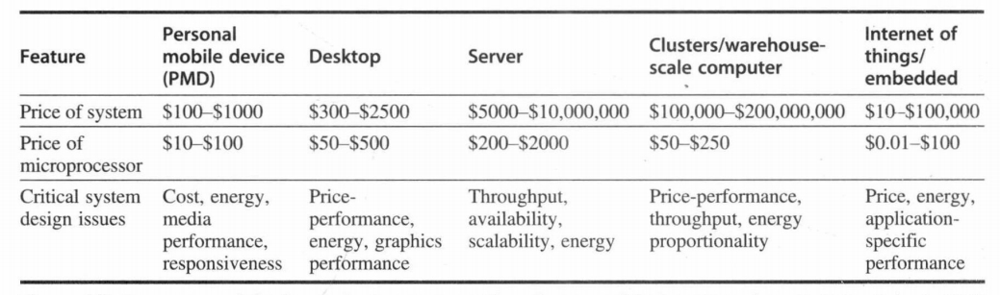

# Ch1 | Fundamentals of Computer Design

## Classes of Computers

A summary of the five mainstream computing classes and their system characteristics.

---

### Internet of Things / Embedded Computers

- **Embedded computers** : microwaves, washing machines, most printers, networking weitches, and all automobiles.

嵌入式计算机在日用电器中随处可见，比如微波炉、洗衣机、大多数打印机、网络交换机和所有汽车。

- **IoT** (Internet of Things) refers to embedded computers that are connected to the Internet, typically wirelessly.

物联网(Intermet of Things，loT)指的是通常以无线方式连接到互联网的嵌入式计算机。

---

### personal mobile device (PMD)

Personal mobile device (PMD) is the term we apply to a collection of wireless devices with multimedia user interfaces such as cell phones, tablet computers, and so on.

The processors in a PMD are often considered embedded computers, but we are keeping them as a separate category because PMDs are platforms that can run externally developed software, and they share many of the characteristics of desktop computers.

key characteristics for media applications: 

- **responsiveness** and **predictability**
- real-time performance : a segment of the application has an absolute maximum execution time
- the need to minimize memory
- the need to use energy efficiently

---

### Desktop Computing

Throughout this range in price and capability, the desktop market tends to be driven to optimize price-performance.

---

### Servers

- **availability**
- scalability
- efficient throughput

---

### Clusters/Warehouse-Scale Computers

Clusters are collections of desktop computers or servers connected by local area networks to act as a single larger computer. Each node runs its own operating system, and nodes communicate using a networking protocol (网络协议). 

WSCs are the largest of the clusters, in that they are designed so that tens of thousands of servers can act as one.

- Price-performance and power are critical
- availability
- scalability for a WSC is handled by the local area network connecting the computers and not by integrated computer hardware, as in the case of servers.

!!! note "the difference between WSCs and servers"
    WSCs use redundant, inexpensive components as the building blocks, relying on a software layer to catch and isolate the many failures that will happen with computing at this scale to deliver the availability needed for such applications.

Supercomputers differ by emphasizing floating-point performance and by running large, communication-intensive batch programs that can run for weeks at a time. In contrast, WSCs emphasize interactive applications, large-scale storage, dependability, and high Internet bandwidth.

超级计算机强调浮点性能，运行大型的、通信密集的批程序，这些程序可能会一次运行几个星期;而 WSC 强调交互式应用程序、大规模存储、可靠性和高互联网带宽。

---

### Classes of Parallelism and Parallel Architectures

在应用程序中：

- 数据级并行(data-levle parallelism DLP) 有许多数据项可以同时操作。
- 任务级并行(task-level parallelism TLP) 创建的工作任务可以单独执行并且主要采用并行方式执行。

计算机硬件又以如下4种主要方式来利用这两种类型的应用并行。

1. 指令级并行在两个层面对数据级并行进行了利用，首先在编译器的帮助下,借助流水线之类的思想适度利用，其次借助推测执行(speculative execution)之类的思想进一步利用。
2. 向量体系结构、图形处理器(graphic processor unit，GPU)和多媒体指令集(multimedia instruction set)将单条指令并行应用于一组数据，以利用数据级并行。
3. 线程级并行在一种紧耦合硬件模型中利用数据级并行或任务级并行,这种模型允许并行线程之间进行交互。
4. 请求级并行利用程序员或操作系统指定的大量解耦任务之间的并行性。

Michael Flynn 将并行计算机体系结构分类为四种类型，这些类型基于指令流和数据流之间的并行性。

- SISD：单指令流单数据流
- SIMD：单指令流多数据流
- MISD：多指令流单数据流
- MIMD：多指令流多数据流

---

## Computer Architecture (⭐)

ISA 的七个维度

1. ISA 的类别

- register-memory ISAs —— x86
- load-store ISAs —— ARM, RISC-V

2. 存储器寻址

Byte addressing to access memory operands, some architectures, require that objects must be aligned.

3. 寻址模式

-  RISC-V addressing modes are Register, Immediate (for constants), and Displacement, where a constant offset is added to a register to form the memory address.
- The 80x86 supports those three modes, plus three variations of displacement: no register(absolute), two registers (based indexed with displacement), and two registers where one register is multiplied by the size of the operand in bytes (based with scaled index and displacement).
- ARMv8 has the three RISC-V addressing modes plus PC-relative addressing, the sum of two registers, and the sum of two registers where one register is multiplied by the size of the operand in bytes. It also has autoincrement and autodecrement addressing, where the calculated address replaces the contents of one of the registers used in forming the address.

4. 操作数的类型和大小

- 8-bit (ASCII character)
- 16-bit (Unicode character or half word)
- 32-bit (integer or word)
- 64-bit (double word or long integer)
- IEEE 754 floating point in 32-bit (single precision) and 64-bit (double precision)
- The 80x86 also supports 80-bit floating point (extended double
precision).

5. 操作指令

-  data transfer
- arithmetic logical
- control (discussed next)
- floating point

6. 控制流指令

- branches
- unconditional jumps
- procedure calls and returns

7. ISA 的编码

There are two basic choices on encoding: fixed length and variable length.

- All ARMv8 and RISC-V instructions are 32 bits long, which simplifies instruction decoding.
- The 80x86 encoding is variable length, ranging from 1 to 18 bytes.

---

组成/微体系结构 : 包含了计算机设计的高阶内容，比如存储器系统、存储器互连、内部处理器或CPU(中央处理器——算术、逻辑、分支和数据输送功能都在这里实现)的设计。

硬件/系统设计 : 计算机系统内所有的硬件组件，包括逻辑实现、电路实现和物理实现。

---

## Trends in Technology

计算机的技术实现:

1. 集成电路逻辑技术
2. 半导体 DRAM (动态随机访问存储器)
3. 半导体闪存 SRAM (电可擦编程只读存储器)
4. 磁盘技术
5. 网络技术

---

集成电路的制造工艺是用特征尺寸(feature size)来衡量的，所谓特征尺寸就是一个晶体管或一条连线在 x 轴方向或 y 轴方向的最小尺寸。

特征尺寸越小，线路变得更短，但是电阻和电容变得更糟，因此时延会变得更长。

还有功率消耗的问题。

---

## Trends in Power and Energy in Integrated Circuits

1. 最大功耗

满足功耗要求对于确保操作正确非常重要。

例如，如果处理器的预期功耗大于电源系统能够提供的功耗(也就是试图汲取的电流大于电源系统能够提供的电流)，通常会导致电压下降，而电压下降可能会导致器件无法正常工作。

2. 持续功耗

这个指标通常称为热设计功耗(thermal design power，TDP)因为它是对系统散热提出的要求。

TDP既不是峰值功耗(峰值功耗通常要高1.5倍)，也不是在给定计算期间的(可能更低的)实际平均功耗。

如果散热能力不足，处理器中的结点温度可能会超出最大值,导致器件故障,甚至永久损坏。由于最大功耗可能超出 TDP 指定的长期平均值(从而使热量和温度上升),所以现代处理器提供了两项功能来帮助管理热量：

- 当温度接近结点温度上限时，电路降低时钟频率，从而减小功耗。
- 如果上述不管用，则启用热过载保护装置强制芯片断电。

3. 能耗和能效

能耗与特定任务以及该任务所需要的时间相关联——用于对比处理器。

执行一项工作负载的能耗 = 平均功耗 $\times$ 工作负载的执行时间

每个晶体管所需要的功耗 $\text{功耗}_{\text{动态}} \propto \frac{1}{2} \times \text{容性负载} \times \text{电压}^2 \times \text{开关频率}$

---

现代微处理器提供了许多技术，试图在时钟频率和电源电压保持不变的情况下，提高能效。

1. 以逸待劳

关闭非活动模块的时钟，以降低能耗和动态功耗。

2. 动态电压-频率调整(dynamic voltage-frequency scaling，DVFS)。

PMD、笔记本计算机，甚至服务器都会有一些活跃程度较低的时期，在此期间不需要以最高时钟频率和电压运转。

3. 针对典型情景的设计

由于 PMD 和笔记本计算机经常空闲，所以内外存储器都提供了低功耗模式，以减少能耗。

4. 超频

Intel 芯片提供涡轮模式 (Turbo mode)：芯片判断可以在短时间内在确保安全的情况下处在更高的时钟频率，可能只在部分核上实现，直到温度开始上升为止。

5. 竞相暂停

使用一个速度较快但能效较低的处理器，使系统的其他部分能够进入睡眠模式。

---

## Trends in Cost

决定成本的因素：

1. 制造成本

- 学习曲线随时间的推移降低，而学习曲线由良率(yield) (成功通过测试的器件占所生产器件总数的百分比) 的变化测得。

2. 产量

- 产量的提高可以减少完成学习曲线需要的时间，同时提高购买与制造效率。

---

$$\text{集成电路的成本} = \frac{\text{晶片成本} + \text{晶片测试成本} + \text{封装与最终测试成本}}{\text{最终测试良率}}$$

$$\text{晶片成本} = \frac{\text{晶圆成本}}{\text{每个晶圆上的晶片数} \times \text{晶片良率}}$$

$$\text{每个晶圆上的晶片数} = \frac{\pi \times (\frac{\text{晶圆直径}}{2})^2}{\text{晶片面积}} - \frac{\pi \times \text{晶片直径}}{\sqrt{2 \times \text{晶片面积}}}$$

---

## Dependability

基础设施供应商开始提供服务等级协议(servicelevelagreement，SLA)或服务等级目标(service levelobiective，SLO)，以保证他们的网络或电源服务是可靠的。因此，可以使用 SLA来判断系统是正常运行还是已经宕机。

系统在 SLA 规定的两种服务状态之间切换。

- 服务完成，即提供了指定服务
- 服务中断，即所提供的服务与 SLA 不符

- MTTF：平均无故障时间 (mean time to failure)是一种可靠性度量，其倒数即故障率。
- 模块可用性 = $\frac{MTTF}{MTTF + MTTR}$

---

## Measuring, Reporting, and Summarizing Performance

- 响应时间/执行时间
- 吞吐量

$$n = \frac{\text{Execution time}_Y}{\text{Execution time}_X} = \frac{\frac{1}{\text{Performance}_Y}}{\frac{1}{\text{Performance}_X}} = \frac{\text{Performance}_X}{\text{Performance}_Y}$$

---

## Benchmarks

Examples include

- Kernels, which are small, key pieces of real applications.
- Toy programs, which are 100-line programs from beginning programming assignments, such as Quicksort.
- Synthetic benchmarks, which are fake programs invented to try to match the profile and behavior of real applications, such as Dhrystone.

All three are discredited today!

Another issue is the conditions under which the benchmarks are run. One way to improve the performance of a benchmark has been with benchmark-specific compiler flags; these flags often caused transformations that would be illegal on many programs or would slow down performance on others.

To restrict this process and increase the significance of the results, benchmark developers typically require the vendor to use one compiler and one set of flags for all the programs in the same language (such as C++ or C).

还有另外一个问题:是否允许修改源代码?

解决这一问题有3种方法:

1. 不允许修改源代码。
2. 允许修改源代码，但基本没有修改的可能。例如，数据库基准测试依赖于拥有数千万行代码的标准数据库程序。数据库公司几乎不可能为了提高一台特定计算机的性能而进行修改。
3. 允许修改源代码，只要修改后的版本能够给出相同输出结果即可。

一种流行的做法是采用基准测试应用程序集(称为基准测试套件)来测量处理器处理各种应用程序时的性能。

- 准确率不会超过组成该套件的各个基准测试。
- 任何一个基准测试的弱点都会因为其他基准测试的存在而淡化。
- 目的是描述两台计算机的实际相对性能，特别是对于客户可能会运行的不在该套件中的程序。
- SPEC(标准性能评估机构)尝试较为成功
- 针对运行 Windows 操作系统的 PC ，人们也开发了许多基准测试
    - 桌面基准测试
    - 服务器基准测试

- 在报告性能测试结果时，应当遵循一条指导原则——可再现性。

$$n = \frac{SPECRatio_A}{SPECRatio_B} = \frac{Performance_A}{Performance_B}$$

因为 SPECRatio 是一个比值，而不是绝对执行时间，所以必须用几何平均值来计算它的均值。(由于 SPECRatio 没有单位，所以以算术方式比较 SPECRatio 是没有意义的。)几何平均值的公式是:

$$Geometric \ mean = (\prod\limits_{i=1}^{n}sample_i)^{\frac{1}{n}}$$

---

## Quantitative Principles of Computer Design (⭐)

### Take Advantage of Parallelism

充分利用并行是提高性能的重要方法之一。

1. 系统级别利用并行。

可扩展性：拓展内存以及增加处理器和存储设备数目的能力。

为了提高典型服务器基准测试上的吞吐量性能，可以使用多个处理器和多个存储设备。

- 单个处理器(指令级并行) -> 最简单的方式是流水线
- 数字设计(数据级并行) -> 组相联/ALU 先行进位

2. 局部性原理

- 时间局部性：如果一个数据项在某个时间点被引用，那么在不久的将来它很可能会被再次引用。
- 空间局部性：如果一个数据项在某个时间点被引用，那么在不久的将来它很可能会被其附近的项引用。

3. 重点关注常见情形

常见情形要优先于非常见情形。

4. Amdahl' s Law

$$Speedup = \frac{Performance for entire task using the enhancement when possible}{Performance for entire task without using the enhancement}$$

5. 处理器性能公式

详见[CO](https://melody12020831.github.io/Notebook/Computer_Science/CO/Chapter%201/#cpi-and-cycle-times)

---

## Fallacies and Pitfalls

!!! Example "Pitfall"
    1. All exponential laws must come to an end.

    2. Falling prey to Amdahl’s heartbreaking law.

    3. A single point of failure.

    4. Fault detection can lower availability.

!!! Example "Fallacy"
    1. Multiprocessors are a silver bullet.

    2. Hardware enhancements that increase performance also improve energy efficiency, or are at worst energy neutral.

    3. Benchmarks remain valid indefinitely.

    4. The rated mean time to failure of disks is 1,200,000 hours or almost 140 years, so disks practically never fail.

    5. Peak performance tracks observed performance.

---