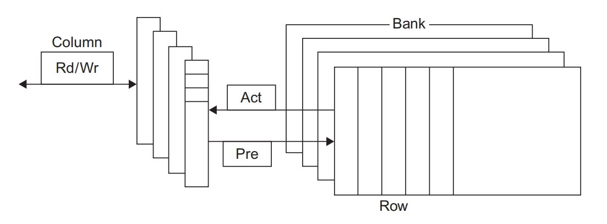
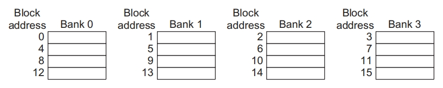

# Ch2 | Memory Hierarchy Design

Basics of Memory Hierarchies:

大多数已经在[CO📖](https://melody12020831.github.io/Notebook/Computer_Science/CO/Chapter%205/)当中提及过，因此这里不再赘述。

To gain insights into the causes of high miss rates, which can inspire better cache designs, the three Cs model sorts all misses into three simple categories:

为了深入理解造成高缺失率的原因，从而更好地设计缓存，"3C"模型将所有这些缺失情景分为以下3个简单的类别。

- **Compulsory miss** ：对数据块的第一次访问肯定不会在缓存中，所以必须将这个块放入缓存中。即使拥有无限大的缓存，也会发生强制缺失。
- **capacity miss** ：如果缓存不能包含程序运行期间所需要的全部块，就会因为有些块先被丢弃之后再被调人而导致容量缺失(除了强制缺失之外)。
- **conflict miss** ：如果块放置策略不是全相联的，并且多个块映射到一个块的组中，对不同块的访问混杂在一起，那么一个块可能会被丢弃，之后再被调人，从而发生冲突缺失(除强制缺失和容量缺失之外)。

---

## Memory Technology and Optimizations

### SRAM (static random access memory)

The first letter of SRAM stands for *static*.

DRAM 电路的动态本质要求在读取数据之后将其写回，因此在访问时间和周期时间之间存在差异，并需要进行刷新。

- SRAM不需要刷新，所以访问时间与周期时间非常接近。
- SRAM通常使用 6 个品体管保存 1 位数据，以防止在读取信息时对信息造成干扰。
- 在待机模式下，SRAM只需要很少的功耗来维持电荷。

??? note "about access time and the cycle time"
    访问时间是从发出读取请求到收到所需字之间的时间。
    
    周期时间是指对存储器发出的两次不相关请求之间的最短时间间隔。

片上缓存 SRAM 的宽度通常与缓存的块大小相匹配，每个块对应的标签都与其并行存储。这样就可以在单个时钟周期内读取或写入整个块。在将缺失后获取的数据写人缓存时，或在写回一个必须从缓存中清除的块时，此功能特别有用。

??? note "并行存储"
    数据存储时，多个数据单元可以同时被访问或传输。在片上缓存 SRAM 中，每个缓存块的数据和标签信息被存储在不同的存储单元中，但在访问时能够同时读取或写入。

---

### DRAM (dynamic random access memory)

在早期 DRAM 的容量增大时，由于封装需要提供所有必要的地址线，所以封装成本较高。解决方案是复用地址线，从而将地址管脚数减半。

先在行选通(row access strobe,**RAS**)期间发送一半地址，然后在列选通(column access strobe,**CAS**)期间发送另一半地址。行选通和列选通这两个名字源于芯片的内部结构，这些存储器的内部是一个按行和列寻址的长方形矩阵。



对 DRAM 的另一要求来自其第一个字母 D 表示的特性，即 dynamic。

为了在每个芯片中容纳更多的位，DRAM 仅使用一个晶体管(实际上相当于一个电容器)来存储一位数据。

这有两层含意：

1. 用来检测电荷的传感线必须进行预充电，使其设定为介于逻辑 0 和逻辑 1 之间的'中间”状态，这样，只需在单元中存储很少量的电荷就可以使灵敏放大器(sense amplifier)检测到逻辑 0 或 1 。
2. 在读取时，将一行放入行缓冲器中，CAS 信号可以在这里选择从 DRAM 中读取该行的一部分。因为对数据行的读取过程会破坏其中的信息，所以当不再需要该行时，必须将其写回。这一写回过程以重叠方式进行，但在早期的DRAM中，这意味着在读取一行并访问该行的一部分之后，还需要等待一定的时间才能读取一个新行。
此外，为了防止单元中的电荷泄漏(假设既没有读取它，也没有写人它)而导致信息丢失必须定期“刷新”每个位。幸运的是，只需对一行进行读取并将其写回，就可以同时刷新该行中的所有位。因此，存储器系统中的每个DRAM必须在特定时间窗口内(比如64ms)访问每一行。存储器控制器包括定期刷新 DRAM 的硬件。

### SDRAM (synchronous DRAM) | DDR (double data rate)

设计人员向 DRAM 接口中增加了一个时钟信号,这样重复进行的传输就不再需要额外的同步时间,这就是同步DRAM(synchronous DRAM, SDRAM)。

21世纪早期又推出了另外一项创新:双倍数据速率(double data rate，DDR)，它使 DRAM 在存储器时钟周期的上升沿和下降沿都能传输数据，从而使峰值数据传输速率翻了一番。

最后，SDRAM引入了体(bank，即存储体)，用于帮助功耗管理、缩短访问时间，并允许对不同存储体进行相互交织、重叠的访问。对不同存储体的访问可以相互重叠，每个存储体都有自己的行缓冲区。在一个 DRAM 中创建多个存储体实际上是为该地址又增加了一个段，现在的地址由存储体编号、行地址和列地址组成。在发出一个新存储体的地址时，必须打开这个存储体，从而增加延迟时间。存储体和行缓冲区的管理完全由现代存储器控制接口处理，所以当后续地址指定的是一个已打开存储体中的相同行时，只需发送列地址，从而可以快速进行访问。要发起一次新的访问过程，DRAM 控制器发送一个存储体编号和一个行号(在SDRAM中称为**激活**—— Activate ，之前称为 RAS ——行选通)。这个命令会打开该行，并将整行数据读人一个缓冲区中。然后会发送一个列地址，SDRAM 可以传送一个或多个数据项，具体取决于是单个请求还是突发请求。在访问新行之前，必须对存储体进行预充电。如果该行位于同一存储体内，则会感觉到预充电导致的延迟;但如果这个新行位于另一个存储体中，那么行的关闭和存储体的预充电可以与新行的访问重叠进行。在 SDRAM 中，这些命令周期中的每一个都需要整数个时钟周期。

**Reducing Power Consumption in SDRAMs**

动态存储芯片中的功耗由静态(或待机)功耗和读写期间消耗的动态功耗构成，这两者都取决于工作电压。存储体的增加也降低了功耗，这是因为每次仅读取一个存储体中的行。

除了这些变化之外，所有最新 SDRAM 都支持一种断电模式,通知 DRAM 忽略时钟即可进人这一模式。断电模式会禁用 SDRAM，但内部自动刷新除外(如果没有自动刷新，当进人省电模式的时间长于刷新时间时，将会导致存储器内容丢失)。从低功耗模式返回正常模式所需的确切延迟时间取决于 SDRAM .但一般的延迟为 200 个 SDRAM 时钟周期。

---

### Flash Memory

闪存是一种 EEPROM(电可擦可编程只读存储器)，它通常是只读的，但可以擦除。闪存的另一个重要特性是能在没有供电的情况下保存其内容。

Flash uses a very different architecture and has different properties than standard DRAM. The most important differences are

1. Reads to Flash are sequential and read an entire page.
2. Flash memory must be erased before it is overwritten, and it is erased **in blocks** rather than individual bytes or words.
3. Flash memory is nonvolatile. (非易失性的)
4. Flash memory limits the number of times that any given block can be written, typically at least 100,000.

---

### Phase-Change Memory (PCM)

这种技术通常使用一种小型的发热元件，使块状基底的状态在晶态和非晶态之间变化，这两种状态拥有不同的电阻特性。基底上覆盖了一个二维网络，每个比特与这个网络中的一个交叉点相对应。通过感测一个 x、y交叉点的电阻就可以完成读取，它也因此有了另一个名字——忆阻器(memristor)，而写入过程则是通过施加电流来改变材料的相态而完成的。由于不存在有源器件(比如晶体管)，所以与 NAND 闪存相比，有可能做到成本更低而密度更大。

---

### Enhancing Dependability in Memory Systems

大型缓存和主存储器显著增加了制造过程和操作过程中动态发生错误的可能性。

- 由电路变化引起的可重复的错误称为**硬错误**(hard error)或**永久性故障**(permanent fault )。
    - 硬错误可能发生在制造过程中，也可能发生在操作过程中的电路更改中(例如，在多次写人之后闪存单元发生故障 )。
    - 所有 DRAM、闪存和大多数 SRAM在制造时都留有备用行，因此通过编程用备用行替换有缺陷的行可以解决少量的制造缺陷。
- 动态错误是指在电路不改变的前提下存储单元内容发生改变的情况，被称为**软错误**(soft error)或**瞬态故障**(transient fault)。

动态错误可以使用奇偶校验检测，可以使用纠错码(ECC)检测和纠正。

- 因为指令缓存是只读的，所以用奇偶校验就够了。奇偶校验只需要占用一个数据位就可以检测一系列数据位中的一个错误。由于无法使用奇偶校验来检测多位错误，所以必须限制用奇偶校验提供保护的位数。典型的比例是每8个数据位使用一个奇偶校验位。
- 在更大型的数据缓存和主存储器中，则使用ECC技术来检测和纠正错误。ECC 可以检测两个错误并纠正一个错误，代价是每 64 个数据位占用 8 位的开销。

---

## Ten Advanced Optimizations of Cache Performance

1. Reducing the hit time
2. Increasing cache bandwidth
3. Reducing the miss penalty
4. Reducing the miss rate
5. Reducing the miss penalty or miss rate via parallelism

Average Memory Access Time (AMAT) = (1 - Miss Rate) × Hit Time + Miss Rate × Miss Penalty(Miss Time)

---

### 1 Small and Simple First-Level Caches to Reduce Hit Time and Power

缓存命中过程中的关键计时路径由3个步骤组成:

1. 使用地址中的索引确定标签存储器的地址;
2. 将读取的标签值与地址进行比较;
3. 如果缓存为组相联缓存，则设置多路选择器以选择正确的数据项。

- 直接映射的缓存可以将标签检查与数据传输重叠，有效缩短命中时间。
- 此外，在采用低相联度时，由于减少了必须访问的缓存行，所以通常还可以降低功耗。

---

### 2 Way Prediction to Reduce Hit Time

这是一种可以减少冲突缺失，同时又能保持直接映射缓存命中速度的方法。

在路预测技术(**way prediction**)中，缓存中另外保存了一些位，用于预测下一次缓存访问中的路(即组中的块)。这种预测意味着要提前设定多路选择器，以选择所需要的块，并且在这个时钟周期中在读取缓存数据的同时，只需要并行执行一次标签比较。如果缺失，则会在下一个时钟周期中再查看其他块，以找出匹配项。

在一个缓存的每个块中添加块预测位。根据这些位选定要在下一次缓存访问中尝试哪些块。如果预测正确，则缓存访问延迟就等于这一快速命中时间。如果预测错误，则尝试其他块，改变路预测器，并且延迟会增加一个时钟周期。

还有一种扩展形式的路预测，它使用路预测位(本质上就是附加地址位)来判断实际访问的缓存块，也可以用来降低功耗。这种方法也可称为路选择(**way selection**)，当路预测正确时它可以节省功耗，但在路预测错误时则会显著增加时间，这是因为需要重复进行访问，而不仅是重复标签匹配与选择过程。这种优化方法只有在低功耗处理器中才可能有意义。

---

### 3  Pipelined Access and Multibanked Caches to Increase Bandwidth

这类优化方法通过实现缓存访问的流水化，或者通过拓宽多体缓存，实现**在每个时钟周期内进行多次访问，从而提高缓存的带宽**。这类优化方法可同时用于实现提高指令吞吐率的超流水化和超标量技术。这些优化方法主要面向 L1 ，这里的访问带宽限制了指令吞吐率。 L2 和 L3 缓存中也会使用多个存储体，但主要是作为一种功耗管理技术。

L1 缓存实现流水化后，可以采用更高的时钟频率，但代价是会增加延迟。指令缓存访问的流水化实现上增加了流水线的段数，增加了分支预测错误的代价。相应地，数据缓存的流水化增加了从发出载入指令到使用数据之间的时钟周期数。如今，即使只是为了分开访问和命中检测这种简单的情况，所有处理器都会使用某种一级缓存流水化方法，而许多高速处理器则会采用三级或更多级缓存流水化方法。

指令缓存的流水化要比数据缓存容易一些，因为处理器可以依赖于高性能的分支预测来减轻延迟造成的影响。许多超标量处理器可以在一个时钟周期内发出和执行一个以上的存储器访问(允许一次载入或存储操作是常见情况，一些处理器允许进行多次载入)。为了在每个时钟周期内处理多个数据缓存访问，可以将缓存划分为独立的存储体，**每个存储体为一次独立的访问提供支持**。分体方式最初用于提高主存储器的性能,现在也用于现代 DRAM 芯片和缓存中。

显然，当访问请求均匀分布在缓存组之间时，分体方式的效果最佳，所以将地址映射到存储体的方式会影响存储器系统的行为。一种简单有效的映射方式是将缓存块地址按顺序分散在这些存储体中，这种方式称为顺序交错(sequential interleaving)。

例如，如果有4个存储体0号存储体中的所有缓存块地址都是4的倍数，1号存储体中的所有缓存块地址都是模4余1以此类推。



---

### 4 Nonblocking Caches to Increase Cache Bandwidth

例如，在等待数据缓存返回缺失数据时，处理器可以继续从指令缓存中取指。**非阻塞缓存**(nonblocking cache，或称**无锁缓存**，1ockup-free cache)允许数据缓存在一次缺失期间继续提供缓存命中，从而进一步强化了这种方案的潜在优势。

这种"缺失时仍然命中"优化方法在缺失期间非常有用，它虽然并没有真正忽略处理器的请求，但降低了实际的缺失代价。

还有一种精巧而复杂的选择: 如果能够重叠多个缺失，缓存就能进一步降低实际的缺失代价。这被称为"多次缺失时仍然命中"(hit under multiple miss)或者"缺失时缺失"(miss under miss)优化方法。只有当存储器系统可以为多次缺失提供服务时，第二种优化方法才有好处。

大多数高性能处理器通常支持这两种优化方法，而很多低端处理器仅在 L2 中提供了有限的非阻塞支持。

???+ question
    Which is more important for floating-point programs: two-way set associativity or hit under one miss for the primary data caches? What about integer programs?

    Assume the following average miss rates for 32 KiB data caches: 5.2% for floating-point programs with a direct-mapped cache, 4.9% for the programs with a two-way set associative cache, 3.5% for integer programs with a direct-mapped cache, and 3.2% for integer programs with a two-way set associative cache. Assume the miss penalty to L2 is 10 cycles, and the L2 misses and penalties are the same.

??? note "answer"
    For floating-point programs, the average memory stall times are

    $$Miss \ rate_{DM} \times Miss \ penalty = 5.2\% \times 10 = 0.52$$

    $$Miss \ rate_{2-way} \times Miss \ penalty = 4.9\% \times 10 = 0.49$$

    The cache access latency (including stalls) for two-way associativity is 0.49/0.52 or 94% of direct-mapped cache.

    Therefore, for floating-point programs, the direct-mapped data cache supporting one hit under one miss gives better performance than a two-way set-associative cache that blocks on a miss.

    For integer programs, the calculation is

    $$Miss \ rate_{DM} \times Miss \ penalty = 3.5\% \times 10 = 0.35$$

    $$Miss \ rate_{2-way} \times Miss \ penalty = 3.2\% \times 10 = 0.32$$

    The data cache access latency of a two-way set associative cache is thus 0.32/0.35 or 91% of direct-mapped cache, while the reduction in access latency when allowing a hit under one miss is 9%, making the two choices about equal.

对非阻塞缓存进行性能评估时，真正的难度在于一次缓存缺失不一定会使处理器停顿。在这种情况下，很难判断一次缺失造成的影响，因此也就难以计算存储器平均访问时间。实际缺失代价并不等于这些缺失之和，而是等于处理器停顿的非重叠时间。非阻塞缓存的优势非常复杂，因为它取决于存在多次缺失时的缺失代价、存储器访问模式以及处理器在处理单次缺失时能够执行多少条指令。

通常，乱序处理器能够隐藏在 L2 缓存中命中但在 L1 数据缓存中缺失的大部分缺失代价，但无法隐藏更低层次缓存中缺失的大部分代价。

在决定要支持多少个未处理缺失时，需要考虑多种因素，如下所述。

- 缺失流中的时间与空间局部性，它决定了一次缺失能否触发对低级缓存或对存储器的新访问操作。
- 对访问请求做出回应的存储器或缓存的带宽，
- 为了允许最低级别的缓存(这一级别的缺失时间是最长的)中出现更多的未处理缺失需要在较高级别上支持至少同等数量的缺失，这是因为这些缺失必须在最高级别的缓存上启动。
- 存储器系统的延迟。

???+ quetion
    Assume a main memory access time of 36 ns and a memory system capable of a sustained transfer rate of 16 GiB/s. If the block size is 64 bytes, what is the maximum number of outstanding misses we need to support assuming that we can maintain the peak bandwidth given the request stream and that accesses never conflict. If the probability of a reference colliding with one of the previous four is 50%, and we assume that the access has to wait until the earlier access completes, estimate the number of maximum outstanding references. For simplicity, ignore the time between misses.

??? note "answer"
    In the first case, assuming that we can maintain the peak bandwidth, the memory system can support $(16 \times 10)^9 /64  = 250$ million references per second. Because each reference takes 36 ns, we can support $250 \times 10^6 \times 36 \times 10^{-9} = 9$ references.

    If the probability of a collision is greater than 0, then we need more outstanding references, because we cannot start work on those colliding references; the memory system needs more independent references, not fewer! To approximate, we can simply assume that half the memory references do not have to be issued to the memory.

    This means that we must support twice as many outstanding references, or 18.

因此，当出现错误时，我们分配一个 MSHR(错过状态处理寄存) 来处理该错误，输入关于错误的适当信息，并使用 MSHR 的索引标记内存请求。内存系统在返回数据时使用该标记，允许缓存系统将数据和标记信息传输到适当的缓存块，并"通知"生成丢失的加载或存储，即数据现在是可用的，它可以恢复操作。

非阻塞缓存显然需要额外的逻辑，因此有一定的能源成本。然而，很难准确地评估它们的能源成本，因为它们可能会减少停滞时间，从而减少执行时间和由此产生的能源消耗。

除了前面的问题之外，多处理器内存系统，无论是在单个芯片内还是在多个芯片上，还必须处理与内存一致性和一致性相关的复杂实现问题。此外，由于缓存丢失不再是原子性的（因为请求和响应是分割的，并且可能在多个请求之间交错），因此有可能出现死锁。

---

### 5 Critical Word First and Early Restart to Reduce Miss Penalty

这种技术的基础是处理器通常一次仅需要缓存块中的一个字。这一策略显得"缺乏耐心"无须等待整个块载入完成，就可以发送请求的字并重新执行处理器。

下面是两种具体策略 :

- 关键字优先: 首先从存储器中请求缺失的字，在其到达缓存之后立即发给处理器;让处理器能够在载入块中其他的字时继续执行。
- 提前重新执行: 以正常顺序提取字，但只要块中的被请求字到达缓存，就立即将其发送给处理器，让处理器继续执行。

关键字优先和提前重新执行的好处取决于块的大小以及对块中尚未获取的部分进行另一次访问的可能性。

---

### 6 Merging Write Buffer to Reduce Miss Penalty

因为所有存储内容都必须发送到层次结构的下一级，所以写直达缓存依赖于写缓冲区。即使是写回缓存，在替代一个块时也会使用一个简单的缓冲区。如果写缓冲区为空，则数据和整个地址被写到缓冲区中，从处理器的角度来看，写操作已经完成;在写缓冲区准备将字写入存储器时，处理器继续自己的工作。

如果缓冲区中包含其他经过修改的块，则可以检查它们的地址，看看新数据的地址是否匹配写缓冲区某个条目的有效地址。如果匹配，则将新数据与这个条目合并在一起。

这种优化方法称为写合并(write merging)。

这种优化方法还会减少因为写缓冲区已满而导致的停顿。

注意，输入/输出设备寄存器经常被映射到物理地址空间。这些 IO 地址不允许写合并，因为单独的 IO 寄存器不能像存储器中的字数组那样操作。例如,它们可能要求为每个 IO 寄存器提供一个地址和一个数据字，而不能只提供一个地址进行多字写入。这些副作用通常是通过将页面的属性在页表中标记为"requiring nonmerging write through by the caches" 。

---

### 7 Compiler Optimizations to Reduce Miss Rate

研究包括两个方面:指令缓存缺失的性能改进和数据缓存缺失的性能改进。

1. 循环交换

一些程序中存在嵌套循环，它们会以非连续顺序访问存储器中的数据。只要交换一下这些循环的嵌套顺序，就可以使程序代码按照数据的存储顺序来访问它们。如果缓存中无法容纳这些数组，这一技术可以通过改善空间局部性来减少缺失;通过重新排序，可以使缓存块中的数据在被替换之前，得到最大限度的利用。

2. 分块

这种优化方法通过改善时间局部性来减少缓存缺失。我们还是要处理多个数组，其中有的数组按行访问，有的按列访问。由于在每个循环迭代中都用到了行与列，所以按行或按列来存储数组并不能解决问题[按行存储称为行主序(row major order )，按列存储称为列主序(column maior order)]。这种正交访问方式意味着在进行循环交换之类的转换操作之后，仍然有很大的改进空间。

---

### 8 Hardware Prefetching of Instructions and Data to Reduce Miss Penalty or Miss Rate

通过将执行过程与访存过程重叠，非阻塞缓存能有效地降低缺失代价。另一种方法是在处理器真正需要某个数据之前，预先获取它们。指令和数据都可以预先提取，既可以直接放在缓存中，也可以放在一个访问速度快于主存储器的外部缓冲区中。

指令预取经常在缓存外部的硬件中完成。通常，处理器在一次缺失时提取两个块:被请求的块和下一个相邻块。被请求的块放在它返回时的指令缓存中,预取块被放在指令流缓冲区中。如果被请求的块当前存在于指令流缓冲区中，则取消该缓存请求，从流缓冲区中读取这个块并发出下一条预取请求。

预取操作需要利用空闲的存储带宽，但如果它干扰了其他关键路径缺失内容的访问，反而会导致性能下降。在编译器的帮助下，可以减少无用预取。当预取操作正常执行时，它对功耗的影响可以忽略。如果预取的数据并未被用到或者替换了有用数据，预取操作会对功耗产生负面影响。

---

### 9 Compiler-Controlled Prefetching to Reduce Miss Penalty or Miss Rate

硬件预取之外的另一种方法是，编译器插入预取指令，以便在处理器需要数据之前请求数据。共有以下两种预取。

- 寄存器预取将数据值载入一个寄存器。
- 缓存预取仅将数据载入缓存，而不载入寄存器

这两种预取都可能触发异常，也可能不触发;也就是说，其地址可能会也可能不会导致虚拟地址错误异常和保护冲突异常。按照这一概念划分，普通的载入指令可被视为"故障性寄存器预取指令"。如果一次预取可能导致异常,那么就把它转为空操作,空操作不会触发缺页错误这样的非故障性预取是我们想要的。

最有效的预取对程序来说是"语义上不可见的":它不会改变寄存器和存储器的内容，也不会导致虚拟存储器错误。今天的大多数处理器提供非故障性缓存预取能力。本节采用非故障性缓存预取，也称为非绑定(nonbinding)预取。

只有当处理器在预取数据时能够继续工作的情况下，预取才有意义;也就是说，缓存在等待返回预取数据时不会停顿，而是继续提供指令和数据。可以想见，这些计算机的数据缓存通常是非阻塞性的。

与硬件控制的预取操作类似，这里的目标也是将执行过程与数据预取过程重叠。循环是重要的预取优化目标，因为它们本身很适合进行预取优化。如果缺失代价很小，编译器只需将循环展开一两次，在执行时调度这些预取操作。如果缺失代价很大，它会使用软件流水线或者将循环展开多次，以预先提取数据，供后续选代使用。

不过，发出预取指令会带来指令开销，所以编译器必须确保这些开销不会大于所得到的好处。如果程序能够将注意力放在那些可能导致缓存缺失的访问上，就可以避免不必要的预取操作，同时大大缩短存储器平均访问时间。

???+ question
    For the following code, determine which accesses are likely to cause data cache misses. Next, insert prefetch instructions to reduce misses. Finally, calculate the number of prefetch instructions executed and the misses avoided by prefetching.
    
    Let's assume we have an 8 KiB direct-mapped data cache with 16-byte blocks, and it is a write-back cache that does write allocate. The elements of a and b are 8 bytes long because they are double-precision floating-point arrays. There are 3 rows and 100 columns for a and 101 rows and 3 columns for b. Let’s also assume they are not in the cache at the start of the program.

    ```c
    for (i = 0; i < 3; i ¼ i + 1)
        for (j = 0; j < 100; j ¼ j + 1)
            a[i][j] = b[j][0] * b[j + 1][0];
    ```

??? note "answer"
    The compiler will first determine which accesses are likely to cause cache misses; otherwise, we will waste time on issuing prefetch instructions for data that would be hits. Elements of a are written in the order that they are stored in memory, so a will benefit from spatial locality: The even values of j will miss and the odd values will hit. Because a has 3 rows and 100 columns, its accesses will lead to 3 $\times$ (100/2), or 150 misses.

    The array b does not benefit from spatial locality because the accesses are not in the order it is stored. The array b does benefit twice from temporal locality: the same elements are accessed for each iteration of i, and each iteration of j uses the same value of b as the last iteration. Ignoring potential conflict misses, the misses because of b will be for b[j + 1][0] accesses when i = 0, and also the first access to b[j][0] when j = 0. Because j goes from 0 to 99 when i = 0, accesses to b lead to 100 + 1, or 101 misses.

    Thus this loop will miss the data cache approximately 150 times for a plus 101 times for b, or 251 misses.

---

### 10  Using HBM to Extend the Memory Hierarchy

首先，如果许多块中的内容都不会用到，那么缓存的使用效率可能会比较低下;这称为**碎片化问题**，它也出现于虚拟存储器系统中。此外，如果许多数据都是没用的，那么传送这样大的数据块也是效率低下的。其次，由于数据块比较大，所以 DRAM 缓存中保存的不同数据块的数目就要少得多了，这样会导致更多的缺失，尤其是冲突缺失和一致性缺失。

第一个问题的部分解决方法是增加子块。子块允许一个缓存行中只有部分数据是有效的，当发生缺失时，可以只获取其中有效的子块。但对于解决第二个问题，子块无能为力。

使用较小的数据块时，标签存储是一个主要缺陷。该问题有一个可能有效的解决方案，就是直接把 HBM 作为 L4 缓存的标签存储到 HBM 中。

---

## Virtual Memory and Virtual Machines

操作系统和体系结构联合起来就能使进程共享硬件而不会相互干扰。为此，在运行一个用户进程时，体系结构必须限制用户进程能够访问的资源，但要允许操作系统进程访问更多资源。体系结构至少要做到以下几点

(1) 提供至少两种模式，指出正在运行的进程是用户进程还是操作系统进程。后者有时被称为内核(kernel)进程或管理(supervisor)进程。

(2) 提供用户进程可以使用但不能写入的处理器状态的一部分。这种状态包括用户/管理模式位、异常启用/禁用位和存储器访问权限信息。之所以禁止用户写入这些状态信息，是因为如果用户可以授予自己管理员权限、禁用异常或者改变存储器访问权限，操作系统就不能控制用户进程了。

(3) 提供处理器借以从用户模式转为管理模式及反向转换的机制。前一种转换通常通过系统调用(system call)完成，使用一种特殊指令将控制传递到管理代码空间的一个专用位置。保存系统调用时刻的程序计数器，处理器转入管理模式。返回用户模式的过程类似于子程序返回过程，恢复到先前的用户/管理模式。

(4) 提供限制存储器访问的机制,这样在上下文切换时不需要将进程切换到磁盘就能保护该进程的存储器状态。

---

到目前为止，最流行的机制还是添加对虚拟存储器各个页面的保护性限制。固定大小的页面(通常长4KiB或8KiB)通过一个页表由虚拟地址空间映射到物理地址空间。这些保护性限制就包含在每个页表项中。保护性限制可以决定一个用户进程能否读取/写入这个页面，以及能否从这个页面执行代码。此外，如果一个进程没有包含在页表中，那它就既不能读取也不能写入一个页面。由于只有操作系统才能更新页表，所以分页机制提供了全面的访问保护。

分页虚拟存储器意味着每次存储器访问在逻辑上都要花费至少两倍的时间，一次存储器访问用于获取物理地址，第二次访问用于获取数据。这种操作成本太高了。解决方案是依靠局部性原理。如果这些访问具有局部性，那么访问操作的地址变换(address translation)也肯定具有局部性。只要将这些地址变换放在一个特殊的缓存中，存储器访问就很少需要第二次访问操作来变换地址了。这种特殊的地址变换缓存被称为变换旁路缓冲区(TLB)。

TLB条目类似于缓存条目,其中的标签保存虚拟地址的一部分,数据部分保存物理页地址保护字段、有效位，通常还有一个使用位和一个脏位(dirty bit)。操作系统在改变这些位时，首先改变页表中的值，然后使相应的TLB项失效。当从页表重新载入这个条目时，TLB 即获得这些位的准确副本。

---

### Protection via Virtual Machines

VM 使用的ISA与其底层硬件相匹配。这种虚拟机称为(操作)系统虚拟机(system virtual machine)。

在传统平台上，一个操作系统"拥有"所有硬件资源，但在使用虚拟机时，多个操作系统一起共享硬件资源。

为虚拟机提供支持的软件称为虚拟机监视器(VMM)或管理程序(hypervisor)，VMM是虚拟机技术的核心。

底层硬件平台称为宿主机(host)，其资源在客户 VM 之间共享。

VMM 决定了如何将虚拟资源映射到物理资源:物理资源可以分时共享、划分，甚至可以在软件内模拟。VMM 比传统操作系统小得多，VMM 的一个隔离部分大约只有 10000 行代码。

---

### Requirements of a Virtual Machine Monitor

VM 监视器必须完成哪些任务?它向客户软件提供一个软件接口，必须使不同客户软件的状态相互隔离，还必须保护自己以免受客户软件的破坏(包括客户操作系统)。

定性需求包括:

- 客户软件在 VM 上的运行情况应当与在原始硬件上完全相同，当然，与性能相关的行为或者因为多个 VM 共享固定资源所造成的局限除外;
- 客户软件应当不能直接修改实际系统资源的分配。

为了实现处理器的"虚拟化"，VMM 必须控制几乎所有操作——对特权状态的访问、地址变换、I/0、异常和中断，即使当前运行的客户 VM 和操作系统只是临时使用它们也是如此。

为了进行管理，VMM 的管理权限必须高于客户 VM ,后者通常以用户模式运行；这样还能确保任何特权指令的执行都由 VMM 处理。系统虚拟机的基本需求几乎与上述分页虚拟存储器的需求相同。

- 至少两种处理器模式：系统模式和用户模式。
- 仅在系统模式下可用的指令的一些特权子集，如果在用户模式下执行将会导致异常。所有系统资源都只能通过这些指令进行控制。

---