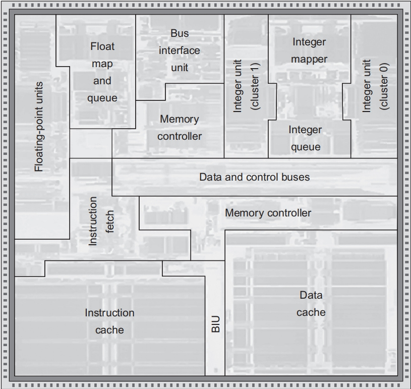
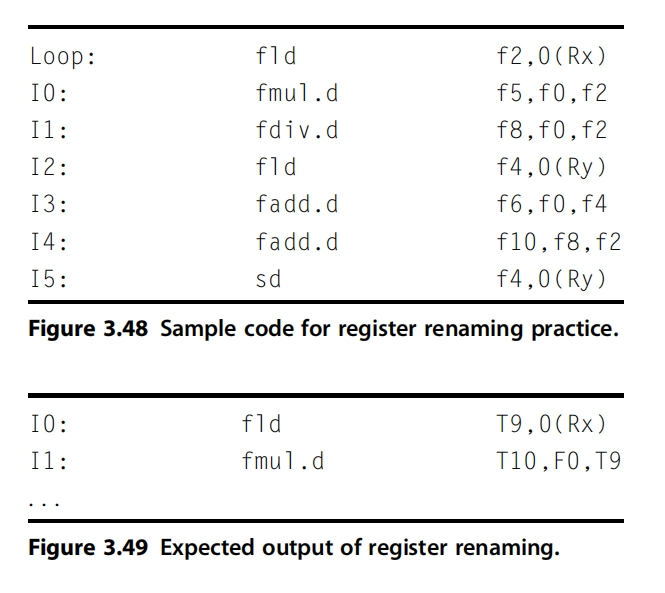
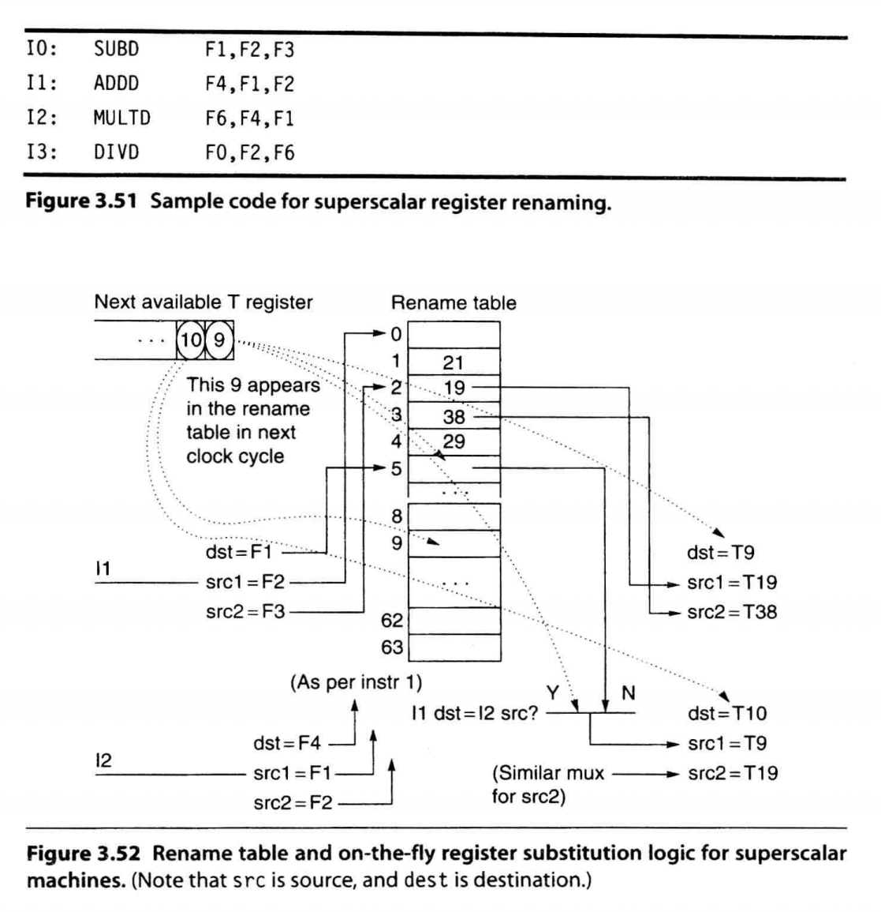
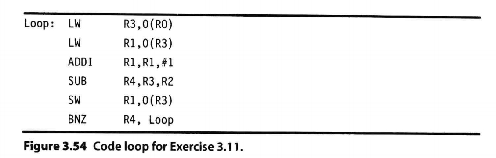
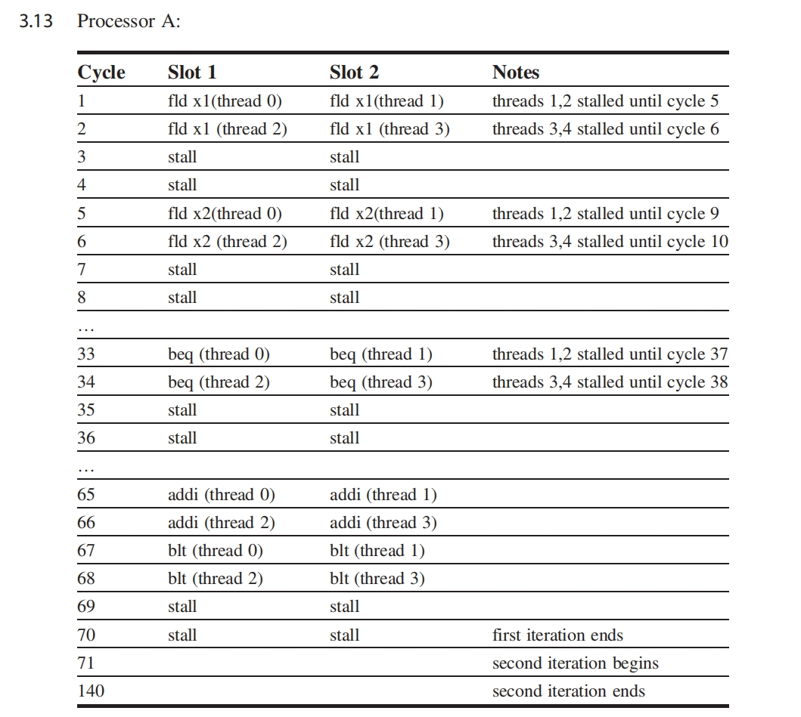
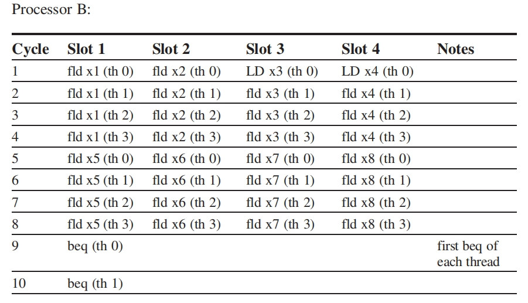
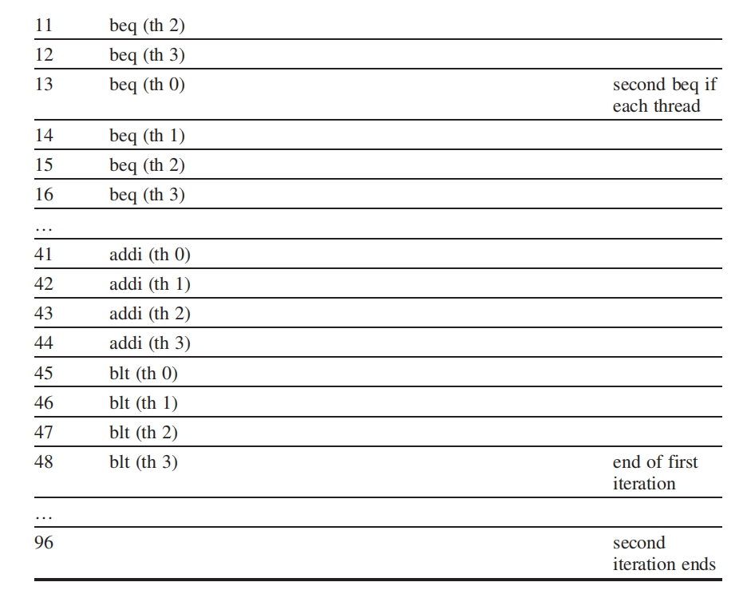
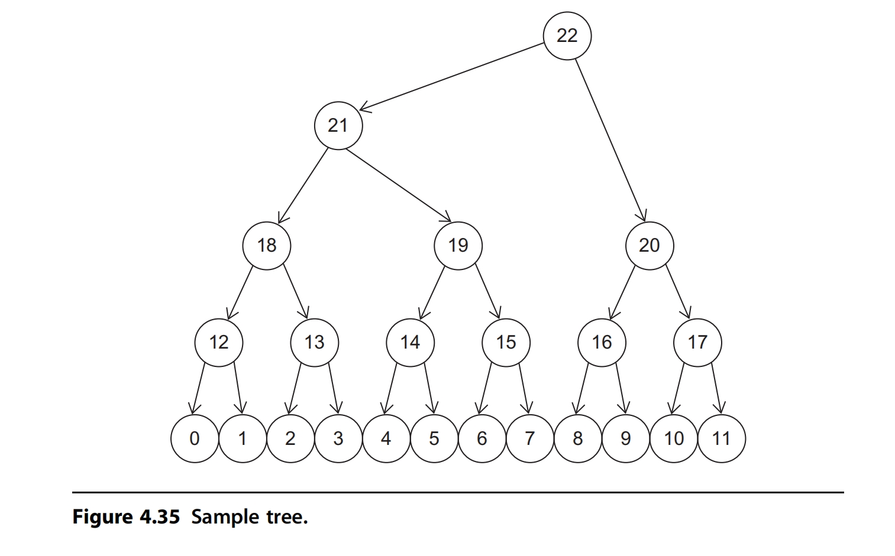
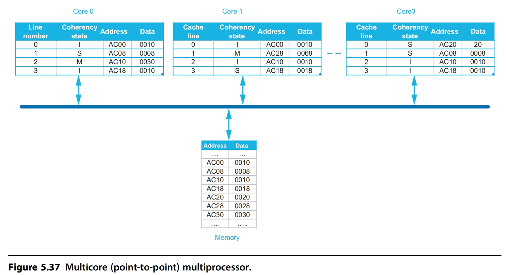
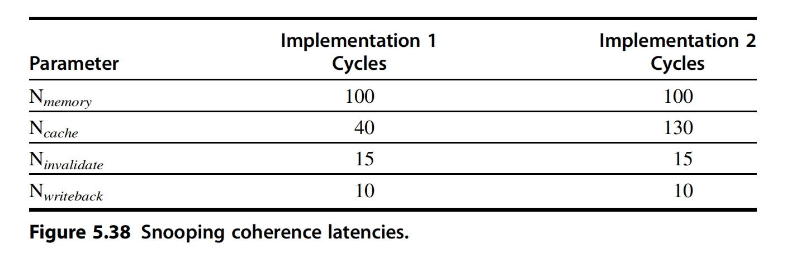

# Homework

## 第一次作业

### 1.9

???+ question
    Server farms such as Google and Yahoo! provide enough compute capacity for the highest request rate of the day. Imagine that most of the time these servers operate at only 60% capacity. Assume further that the power does not scale linearly with the load; that is, when the servers are operating at 60% capacity, they consume 90% of maximum power. The servers could be turned off, but they would take too long to restart in response to more load. A new system has been proposed that allows for a quick restart but requires 20% of the maximum power while in this "barely alive" state.

    a. How much power savings would be achieved by turning off 60% of the servers?
    
    b. How much power savings would be achieved by placing 60% of the servers in the "barely alive" state?
    
    c. How much power savings would be achieved by reducing the voltage by 20% and frequency by 40%?
    
    d. How much power savings would be achieved by placing 30% of the servers in the "barely alive" state and 30% off?

??? note "answer"
    a. 
    
    关掉 60% 的服务器，所以是 40% 的服务器在运行。此时总功率是 $40\% \times 90\% \times \text{最大功率} = 36\% \times \text{最大功率}$。
    
    原来的总功率是 $100\% \times 90\% \times \text{最大功率} = 90\% \times \text{最大功率}$。
    
    节省的功率是 $90\% \times \text{最大功率} - 36\% \times \text{最大功率} = 54\% \times \text{最大功率}$。
    
    所以节省的比例为 $\frac{54\% \times \text{最大功率}}{90\% \times \text{最大功率}} = 60\%$。
    
    b. 
    
    $60\% \times 20\% \times \text{最大功率} + 40\% \times 90\% \times \text{最大功率} = 48\%$。
    
    节省的功率为 $90\% \times \text{最大功率} - 48\% \times \text{最大功率} = 42\% \times \text{最大功率}$。
    
    所以节省的比例为 $\frac{42\% \times \text{最大功率}}{90\% \times \text{最大功率}} = 46.67\%$。
    
    c. 
    
    每个晶体管所需要的功耗 $\text{功耗}_{\text{动态}} \propto \frac{1}{2} \times \text{容性负载} \times \text{电压}^2 \times \text{开关频率}$
    
    80% * 80% * 60% = 38.4%
    
    所以节省了 61.6% 的功耗。
    
    d. 
    
    $30\% \times 20\% \times \text{最大功率} + 40\% \times 90\% \times \text{最大功率} = 42\%$。
    
    节省的功率为 $90\% \times \text{最大功率} - 42\% \times \text{最大功率} = 48\% \times \text{最大功率}$。
    
    所以节省的比例为 $\frac{48\% \times \text{最大功率}}{90\% \times \text{最大功率}} = 53.33\%$。

---

### 1.11 ab

???+ question
    In a server farm such as that used by Amazon or eBay, a single failure does not cause the entire system to crash. Instead, it will reduce the number of requests that can be satisfied at any one time.

    a. If a company has 10,000 computers, each with an MTTF of 35 days, and it experiences catastrophic failure only if 1/3 of the computers fail, what is the MTTF for the system?
    
    b. If it costs an extra $1000, per computer, to double the MTTF, would this be a good business decision? Show your work.

??? note "answer"
    a. 

    假设每台服务器的故障时间服从指数分布，故障率 $\lambda = \frac{1}{35}$ 每天。系统崩溃需至少 $\frac{1}{3}$ 服务器故障。
    
    总故障过程为泊松过程，系统 MTTF 为第 $\frac{10000}{3}$ 次故障的期望时间：
    
    $$\text{系统}_{MTTF} = \frac{k}{n\lambda} = \frac{\frac{10000}{3}}{10000 \times 35} \approx 11.67 \text{天}$$


    b. 
    
    若每台服务器 MTT F翻倍至 70 天，则 $\lambda = \frac{1}{70}$，系统 MTTF 为第 $\frac{10000}{3}$ 次故障的期望时间：
    
    $$\text{系统}_{MTTF} = \frac{k}{n\lambda} = \frac{\frac{10000}{3}}{10000 \times 70} \approx 23.33 \text{天}$$
    
    总成本增加 $1000 \times 10000 = 1000000$ 美元。
    
    如果设每次损失成本为 $X$ 而这一整套系统寿命为 $Y$ 那么每年可以减少维修 $\frac{365}{11.67} - \frac{365}{23.33} = 15.63$ 次。
    
    那么只要 $X \times Y \times 15.63$ > 1000000 美元，也即 $X \times Y > 639795$ 美元，那么这个决策就是值得的。

---

### 1.16

???+ question
    When parallelizing an application, the ideal speedup is speeding up by the number of processors. This is limited by two things: percentage of the application that can be parallelized and the cost of communication. Amdahl's Law takes into account the former but not the latter.

    a. What is the speedup with N processors if 80% of the application is parallelizable, ignoring the cost of communication?
    
    b. What is the speedup with eight processors if, for every processor added, the communication overhead is 0.5% of the original execution time.
    
    c. What is the speedup with eight processors if, for every time the number of processors is doubled, the communication overhead is increased by 0.5% of the original execution time?
    
    d. What is the speedup with N processors if, for every time the number of processors is doubled, the communication overhead is increased by 0.5% of the original execution time?
    
    e. Write the general equation that solves this question: What is the number of processors with the highest speedup in an application in which P% of the original execution time is parallelizable, and, for every time the number of processors is doubled, the communication is increased by 0.5% of the original execution time?

??? note "answer"
    a. 

    加速后是原来的 $20\% + \frac{80\%}{N}$
    
    所以加速比是 $\frac{1}{20\% + \frac{80\%}{N}}$
    
    b. 
    
    加速后是原来的 $S = 20\% + \frac{80\%}{8} + 0.5\% \times (8 - 1) = 33.5\%$
    
    所以加速比是 $\frac{1}{33.5\%} = 2.985$
    
    c.
    
    加速后是原来的 $S = 20\% + \frac{80\%}{8} + 0.5\% \times log_2(8) = 31.5\%$
    
    所以加速比是 $\frac{1}{31.5\%} = 3.1746$
    
    d. 
    
    加速后是原来的 $S = 20\% + \frac{80\%}{N} + 0.5\% \times log_2(N)$
    
    所以加速比是 $\frac{1}{20\% + \frac{80\%}{N} + 0.5\% \times log_2(N)}$
    
    e. 
    
    总时间是 $T = (1 - P)\% + \frac{P\%}{N} + 0.5\% \times log_2(N)$
    
    那么求解 $\frac{\mathrm{d}T}{\mathrm{d}N} = 0$ 可以得到
    
    $$N = \frac{P\% \times ln2}{0.5\%}$$

---

## 第二次作业

### 2.17

???+ question
    The following questions investigate the impact of small and simple caches using CACTI and assume a 65 nm (0.065 ms) technology. ([CACTI is available in an online form at](http://quid.hpl.hp.com:9081/cacti/).)

    a. Compare the access times of 64 KB caches with 64-byte blocks and a single bank. What are the relative access times of two-way and four-way set associative caches compared to a direct mapped organization?

    b. Compare the access times of four-way set associative caches with 64-byte blocks and a single bank. What are the relative access times of 32 and 64 KB caches compared to a 16 KB cache?

    c. For a 64 KB cache, find the cache associativity between 1 and 8 with the lowest average memory access time given that misses per instruction for a certain workload suite is 0.00664 for direct-mapped, 0.00366 for two-way set associative, 0.000987 for four-way set associative, and 0.000266 for eight-way set associative cache. Overall, there are 0.3 data references per instruction. Assume cache misses take 10 ns in all models. To calculate the hit time in cycles, assume the cycle time output using CACTI, which corresponds to the maximum frequency a cache can operate without any bubbles in the pipeline.

??? note "answer"
    a. 由 CACTI 模拟结果 得到
    
    a direct mapped organization : 0.86 ns

    a two-way set associative organization : 1.12 ns

    a four-way set associative organization : 1.37 ns

    relatively, the access time

    $$\frac{\text{two-way}}{\text{direct mapped}} = \frac{1.12}{0.86} = 1.30 \ ns$$

    $$\frac{\text{four-way}}{\text{direct mapped}} = \frac{1.37}{0.86} = 1.59 \ ns$$

    b. 由 CACTI 模拟结果 得到

    a 16 KB direct-mapped organization : 1.27 ns

    a 32 KB two-way set associative organization : 1.35 ns

    a 64 KB four-way set associative organization : 1.37 ns

    relatively, the access time

    $$\frac{\text{two-way}}{\text{direct mapped}} = \frac{1.35}{1.27} = 1.06 \ ns$$

    $$\frac{\text{four-way}}{\text{direct mapped}} = \frac{1.37}{1.27} = 1.08 \ ns$$

    c. 

    先计算缺失率

    $$\text{direct mapped} = \frac{0.00664}{0.3} \approx 2.21\%$$

    $$\text{two-way} = \frac{0.00366}{0.3} \approx 1.22\%$$

    $$\text{four-way} = \frac{0.000987}{0.3} \approx 3.29\%$$

    $$\text{eight-way} = \frac{0.000266}{0.3} \approx 0.09\%$$

    再把命中时间转换成周期（周期要向上取整）

    $$\text{direct mapped} = \lceil \frac{0.86}{0.5} \rceil = 2 \ ns$$

    $$\text{two-way} = \lceil \frac{1.12}{0.5} \rceil = 3\ ns$$

    $$\text{four-way} = \lceil \frac{1.37}{0.83} \rceil = 2 \ ns$$

    $$\text{eight-way} = \lceil \frac{2.03}{0.79} \rceil = 3 \ ns$$

    再把 miss penalty 转换成周期（周期要向上取整）

    $$\text{direct mapped} = \lceil \frac{10}{0.5} \rceil = 20 \ ns$$

    $$\text{two-way} = \lceil \frac{10}{0.5} \rceil = 20 \ ns$$

    $$\text{four-way} = \lceil \frac{10}{0.83} \rceil = 13 \ ns$$

    $$\text{eight-way} = \lceil \frac{10}{0.79} \rceil = 13 \ ns$$

    最后计算 AMAT

    $$AMAT = \text{hit time} + \text{miss rate} \times \text{miss penalty}$$

    1. 直接映射 $((1 - 2.21\%) \times 2 + 2.21\% \times 20 ) \times 0.5 \approx 1.20 \ ns$

    2. 两路 $((1 - 1.22\%) \times 3 + 1.22\% \times 20 ) \times 0.5 \approx 1.59 \ ns$

    3. 四路 $((1 - 3.29\%) \times 2 + 3.29\% \times 13 ) \times 0.83 \approx 1.96 \ ns$

    4. 八路 $((1 - 0.09\%) \times 3 + 0.09\% \times 13 ) \times 0.79 \approx 2.38 \ ns$

    直接映射的 cache 的 AMAT 最小

---

### 2.18

???+ question
    You are investigating the possible benefits of a way-predicting L1 cache. Assume that a 64 KB four-way set associative single-banked L1 data cache is the cycle time limiter in a system. For an alternative cache organization, you are considering a way-predicted cache modeled as a 64 KB direct-mapped cache with 80% prediction accuracy. Unless stated otherwise, assume that a mispredicted way access that hits in the cache takes one more cycle. Assume the miss rates and the miss penalties in question 2.8 part (c).

    a. What is the average memory access time of the current cache (in cycles) versus the way-predicted cache?

    b. If all other components could operate with the faster way-predicted cache cycle time (including the main memory), what would be the impact on performance from using the way-predicted cache?

    c. Way-predicted caches have usually been used only for instruction caches that feed an instruction queue or buffer. Imagine that you want to try out way prediction on a data cache. Assume that you have 80% prediction accuracy and that subsequent operations (e.g., data cache access of other instructions, dependent operations) are issued assuming a correct way prediction. Thus a way misprediction necessitates a pipe flush and replay trap, which requires 15 cycles. Is the change in average memory access time per load instruction with data cache way prediction positive or negative, and how much is it?

    d. As an alternative to way prediction, many large associative L2 caches serialize tag and data access so that only the required dataset array needs to be activated. This saves power but increases the access time. Use CACTI's detailed web interface for a 0.065 m process 1 MB four-way set associative cache with 64-byte blocks, 144 bits read out, 1 bank, only 1 read/write port, 30 bit tags, and ITRS-HP technology with global wires. What is the ratio of the access times for serializing tag and data access compared to parallel access?

??? note "answer"
    a. current cache

    $$AMAT = (\lceil \frac{1.37}{0.83} \rceil \times (1 - 0.33\%) + 0.33\% \times \lceil \frac{10}{0.83} \rceil) \times 0.83 \approx 1.69 \ ns$$

    way-predicted cache

    $$AMAT = ((\lceil \frac{0.86}{0.5} \rceil \times 80\% + (\lceil \frac{0.86}{0.5} \rceil + 1) \times 20 \% ) \times (1 - 0.33\%) + 0.33\% \times \lceil \frac{10}{0.5} \rceil) \times 0.5 \approx 1.13 \ ns$$

    b. 

    the max frequency of the four-way set associative cache $\frac{1}{0.83} \approx 1.20 GHz$

    the max frequency of the way-predicted cache $\frac{1}{0.5} \approx 2.00 GHz$

    the ratio of the access times is $ \frac{2.00}{1.20} \approx 1.67$

    c. 

    way-predicted cache

    $$AMAT = ((\lceil \frac{0.86}{0.5} \rceil \times 80\% + 15 \times 20 \% ) \times (1 - 0.33\%) + 0.33\% \times \lceil \frac{10}{0.5} \rceil) \times 0.5 \approx 2.33 \ ns$$

    so, negative

    the ratio is $\frac{1.69}{2.33} \approx 0.73$

    d.

    Parallel access: Tags and data are read at the same time with an access time of 1.59 ns.

    Serial access: read the tag first, hit and then read the data, and the access time is 2.4 ns.

    the ratio is $\frac{2.4}{1.59} \approx 1.51$

---

### 2.26

???+ question
    The ways of a set can be viewed as a priority list, ordered from high priority to low priority. Every time the set is touched, the list can be reorganized to change block priorities. With this view, cache management policies can be decomposed into three sub-policies: Insertion, Promotion, and Victim Selection. Insertion defines where newly fetched blocks are placed in the priority list. Promotion defines how a block’s position in the list is changed every time it is touched (a cache hit). Victim Selection defines which entry of the list is evicted to make room for a new block when there is a cache miss.

    a. Can you frame the LRU cache policy in terms of the Insertion, Promotion, and Victim Selection sub-policies?

    b. Can you define other Insertion and Promotion policies that may be competitive and worth exploring further?

??? note "answer"
    a.

    **Insertion**: 
    
    The newly acquired block is inserted into the head of the priority list (the highest priority position).

    **Promotion**:

    Whenever a block is hit (accessed), it is immediately moved to the head of the priority list.

    **Victim Selection**:

    When it's time to retire, select the tail of the priority list (the block that hasn't been visited for the longest time).

    b.

    **Insertion**:

    1. A new block is inserted in the middle of the priority list or the penultimate bit.
    2. Adjust the insertion position based on the block type or prefetch information. The prefetched data is inserted near the tail. Hot data is inserted directly into the head.

    **Promotion**:

    1. After each hit, the block moves forward by a fixed step.
    2. Adjust the lift based on the cumulative number of visits to the block.
    3. Raised to the head only with multiple hits in a short period of time.

    **Victim Selection**:

    No need to change.

---

### 2.27

???+ question
    In a processor that is running multiple programs, the last-level cache is typically shared by all the programs. This leads to interference, where one program's behavior and cache footprint can impact the cache available to other programs. First, this is a problem from a quality-of-service (QoS) perspective, where the interference leads to a program receiving fewer resources and lower performance than promised, say by the operator of a cloud service. Second, this is a problem in terms of privacy. Based on the interference it sees, a program can infer the memory access patterns of other programs. This is referred to as a timing channel, a form of information leakage from one program to others that can be exploited to compromise data privacy or to reverse-engineer a competitor's algorithm. What policies can you add to your last-level cache so that the behavior of one program is immune to the behavior of other programs sharing the cache?

??? note "answer"
    在多程序共享LLC的场景中，以下两种问题尤为突出：

    1. 服务质量（QoS）问题：某个程序占用过多缓存资源，导致其他程序无法达到性能承诺。

    2. 隐私泄露问题：通过缓存访问的时间差异（时间通道），推断其他程序的内存访问模式，可能导致数据泄露或算法逆向工程。

    解决方案：缓存策略设计

    1. 缓存分区，将缓存划分为多个独立区域，每个程序独占一部分。可以是预先固定分配每个程序的缓存 way 数量，或者根据程序行为动态调整分配。
    
    2. 配额管理，限制每个程序可占用的缓存块数量。

    3. 替换策略优化，比如可以为每个程序独立维护替换队列，仅在本程序分配的缓存区域内淘汰。

    4. 使用程序独有的密钥生成缓存索引，使其他程序无法通过地址推断缓存位置，用于实现实现地址混淆。

---

### 2.28

???+ question
    A large multimegabyte L3 cache can take tens of cycles to access because of the long wires that have to be traversed. For example, it may take 20 cycles to access a 16 MB L3 cache. Instead of organizing the 16 MB cache such that every access takes 20 cycles, we can organize the cache so that it is an array of smaller cache banks. Some of these banks may be closer to the processor core, while others may be further. This leads to nonuniform cache access (NUCA), where 2 MB of the cache may be accessible in 8 cycles, the next 2 MB in 10 cycles, and so on until the last 2 MB is accessed in 22 cycles. What new policies can you introduce to maximize performance in a NUCA cache?

??? note "answer"
    1. Record the frequency of access or the most recent access time for each cache block. Blocks of high-frequency access are gradually migrated to the nearest bank. Blocks that have not been accessed within the period are migrated to the remote bank to free up near-end space.

    2. Each bank maintains the tags of the local block, reducing the delay of global tag lookup. Send requests to multiple banks at the same time and take advantage of physical distribution to reduce response times.

---

### 2.32

???+ question
    You are provisioning a server with eight-core 3 GHz CMP that can execute a workload with an overall CPI of 2.0 (assuming that L2 cache miss refills are not delayed). The L2 cache line size is 32 bytes. Assuming the system uses DDR2-667 DIMMs, how many independent memory channels should be provided so the system is not limited by memory bandwidth if the bandwidth required is sometimes twice the average? The workloads incur, on average, 6.67 L2 misses per 1 K instructions.

??? note "answer"
    $$\text{指令吞吐量} = \frac{\text{核心数} \times \text{频率}}{\text{CPI}} = \frac{8 \times 3 \times 10^9}{2.0} = 12 \times 10^9\ \text{指令/秒}$$

    $$\text{平均L2未命中次数/秒} = 12 \times 10^9\ \text{指令/秒} \times \frac{6.67}{1000} = 8 \times 10^7\ \text{次/秒}$$

    $$\text{平均带宽} = 8 \times 10^7\ \text{次/秒} \times 32\ \text{字节/次} = 2560\ \text{MB/秒}$$

    $$\text{峰值带宽} = 2 \times 2560\ \text{MB/秒} = 5120\ \text{MB/秒}$$

    由 DDR2-667 DIMMs :
    
    $$\text{带宽} = 667 \times 10^6\ \text{次/秒} \times 8\ \text{字节/次} = 5336\ \text{MB/秒} > 5120\ \text{MB/秒}$$

    So, one memory channel is enough.

---

### 2.33

???+ question
    Consider a processor that has four memory channels. Should consecutive memory blocks be placed in the same bank, or should they be placed in different banks on different channels?

??? note "answer"
    In a four-channel memory system, the placement strategy for contiguous memory blocks needs to weigh row buffer hits (low latency) with parallel access (high throughput).

    be placed in the same bank: 

    After the first access to the active row, subsequent visits directly read the row buffer to reduce latency. But, sequential requests need to be processed serially, and multi-channel parallelism cannot be leveraged. And if continuous access is intensive, the channel bandwidth utilization is low.

    be placed in different banks on different channels:

    Requests from different channels/banks can be processed at the same time, improving throughput, which take advantage of multi-channel parallelism and make it suitable for burst access. And each visit may require the activation of a new line, adding a single delay.

    In summary, in a four-channel memory system, sequential memory blocks should be distributed across different channels and banks. Although each access may face latency from row buffer misses, the overall throughput and system performance by processing multiple requests in parallel can result in significant overall throughput and system performance, especially for high-concurrency workloads.

---

### 2.36

???+ question
    Whenever a computer is idle, we can either put it in standby (where DRAM is still active) or we can let it hibernate. Assume that, to hibernate, we have to copy just the contents of DRAM to a nonvolatile medium such as Flash. If reading or writing a cache line of size 64 bytes to Flash requires 2.56 $\mu$ J and DRAM requires 0.5 nJ, and if idle power consumption for DRAM is 1.6 W (for 8 GB), how long should a system be idle to benefit from hibernating? Assume a main memory of size 8 GB.

??? note "answer"
    8 GB = 8 * $2^{30}$ bytes = $2^{33}$ bytes = $2^{27}$ cache lines

    读 + 写一次的总功耗是一次 flash 的能耗 $2 \times 2.56 \ J$ = 5.12 J

    待机功耗 1.6 W = 1.6 J/s

    $\therefore \ t = \frac{2^{27} \times 5.12 \ \mu J}{1.6 \ J/s} \approx 429.50 \ s$

    When the system is idle for more than 429.50 seconds, sleep is more energy-efficient than standby.

---

### 2.37

???+ question
    Virtual machines (VMs) have the potential for adding many beneficial capabilities to computer systems, such as improved total cost of ownership (TCO) or availability. Could VMs be used to provide the following capabilities? If so, how could they facilitate this?

    a. Test applications in production environments using development machines?

    b. Quick redeployment of applications in case of disaster or failure?

    c. Higher performance in I/O-intensive applications?

    d. Fault isolation between different applications, resulting in higher availability for services?

    e. Performing software maintenance on systems while applications are running without significant interruption?

??? note "answer"
    a. Yes. Create a virtual machine (such as an operating system, dependent libraries, and network settings) on the development machine that is consistent with the configuration of the production environment, and deploy the application to be tested on the VM for testing.

    b. Yes. Package the application and its runtime environment as a virtual machine image and load the image on the standby hardware to boot the virtual machine for rapid recovery.

    c. No. The hypervisor needs to intercept I/O requests, resulting in additional context switching and latency.

    d. Yes. Each application runs on an independent virtual machine, allocating exclusive CPU, memory, and disk resources. A single VM crash or resource exhaustion does not affect other VMs.

    e. Yes. Migrate running virtual machines from one physical host to another without service interruption.

---

### 2.38

???+ question
    Virtualmachines canlose performance froma number of events, such as the execution of privileged instructions, TLB misses, traps, and I/O. These events are usually handled in system code. Thus one way of estimating the slowdown when running under a VM is the percentage of application execution time in system versus user mode. For example, an application spending 10% of its execution in system mode might slow down by 60% when running on a VM. Figure 2.35 lists the early performance of various system calls under native execution, pure virtualization, and paravirtualization for LMbench using Xen on an Itanium system with times measured in microseconds (courtesy of Matthew Chapman of the University of New South Wales).

    a. What types of programs would be expected to have smaller slowdowns when running under VMs?

    b. If slowdowns were linear as a function of system time, given the preceding slowdown, how much slower would a program spending 20% of its execution in system time be expected to run?

    c. What is the median slowdown of the system calls in the table above under pure virtualization and paravirtualization?

    d. Which functions in the table above have the largest slowdowns? What do you think the cause of this could be?

    |Benchmark|Native|Pure|Para|
    |:---|:---:|:---:|:---:|
    |Null call|0.04|0.96|0.50|
    |Null I/O|0.27|6.32|2.91|
    |Stat|1.10|10.69|4.14|
    |Open/close|1.99|20.43|7.71|
    |Install signal handler|0.33|7.34|2.89|
    |Handle signal|1.69|19.26|2.36|
    |Fork|56.00|513.00|164.00|
    |Exec|316.00|2084.00|578.00|
    |Fork + exec sh|1451.00|7790.00|2360.00|

    **Figure 2.35 Early performance of various system calls under native execution, pure virtualization, and paravirtualization.**

??? note "answer"
    a. 计算密集型（大部分时间执行用户态指令）、内存工作集小（减少因虚拟内存管理导致的性能损失）、且较少进行I/O或系统调用的程序。

    b. According to "an application spending 10% of its execution in system mode might slow down by 60% when running on a VM."

    $$60 \% \times \frac{20 \%}{10 \%} = 120 \%$$

    so the total times is $100\% + 120\% = 220\%$.

    c. 

    | Benchmark          | 纯虚拟化减速比 | 半虚拟化减速比 |
    |:------------------:|:--------------:|:--------------:|
    | Null call          | 0.96/0.04 = 24   | 0.50/0.04 = 12.5 |
    | Null I/O           | 6.32/0.27 $\approx$ 23.41| 2.91/0.27 $\approx$ 9.67|
    | Stat               | 10.69/1.10 $\approx$ 9.72| 4.14/1.10 $\approx$ 3.76 |
    | Open/close         | 20.43/1.99 $\approx$ 10.27|7.71/1.99 $\approx$ 3.87 |
    | Install signal     |7.34/0.33 $\approx$ 22.24 |2.89/0.33 $\approx$ 8.76 |
    | Handle signal      |19.26/1.69 $\approx$ 11.40|2.36/1.69 $\approx$ 1.40 |
    | Fork               |513/56 $\approx$ 9.16     |164/56 $\approx$ 2.93    |
    | Exec               |2084/316 $\approx$ 6.59   |578/316 $\approx$ 1.83   |
    | Fork + exec sh     |7790/1451 $\approx$ 5.37  |2360/1451 $\approx$ 1.63 |

    排序后得到:纯虚拟化中位减速比为 **10.27**，半虚拟化中位减速比为 **3.76**。

    d. Null call and Null I/O, because they have no actual work, the virtualization overhead is very high.

---

### 2.41

???+ question
    Since instruction-level parallelism can also be effectively exploited on in-order superscalar processors and very long instruction word (VLIW) processors with speculation, one important reason for building an out-of-order (OOO) superscalar processor is the ability to tolerate unpredictable memory latency caused by cache misses. Thus you can think about hardware supporting OOO issue as being part of the memory system. Look at the floorplan of the Alpha 21264 in Figure 2.36 to find the relative area of the integer and floating-point issue queues and mappers versus the caches. The queues schedule instructions for issue, and the mappers rename register specifiers. Therefore these are necessary additions to support OOO issue. The 21264 only has L1 data and instruction caches on chip, and they are both 64 KB two-way set associative. Use an OOO superscalar simulator such as [SimpleScalar](http://www.cs.wisc.edu/~mscalar/simplescalar.html) on memory-intensive benchmarks to find out how much performance is lost if the area of the issue queues and mappers is used for additional L1 data cache area in an in-order superscalar processor, instead of OOO issue in a model of the 21264. Make sure the other aspects of the machine are as similar as possible to make the comparison fair. Ignore any increase in access or cycle time from larger caches and effects of the larger data cache on the floorplan of the chip. (Note that this comparison will not be totally fair, as the code will not have been scheduled for the in-order processor by the compiler.)

    

    **Figure 2.36 Floorplan of the Alpha 21264 [Kessler 1999].**

??? note "answer"
    1. 假设 Issue Queues 和 Mappers 的面积占芯片总逻辑面积的 15%。将 15% 的面积用于扩大 L1 数据缓存，假设面积与容量线性相关，则新缓存容量为：  
    
    $$64\ \text{KB} \times \left(1 + \frac{15\%}{\text{原缓存面积占比}}\right)$$

    若原缓存面积占比为20%，则新容量为：  
    
    $$64\ \text{KB} \times \left(1 + \frac{15\%}{20\%}\right) = 64 \times 1.75 = 112\ \text{KB}.$$

    2. for OOO L1 cache ：64 KB，2-way。
    
    for In-Order L1 cache ：112 KB  

    3. 假设模拟结果：

    | **配置**       | IPC  | L1缺失率 | 执行时间（秒） |
    |:-------------:|:----:|:--------:|:-------------:|
    | 乱序（64 KB）  | 2.0  | 5%       | 100           |
    | 顺序（112 KB） | 1.5  | 3%       | 133           |

    4. 
    
    $$\text{性能损失} = \frac{133 - 100}{100} \times 100\% = 33\%$$
    
---

## 第三次作业

### 3.7

??? question
    Computers spend most of their time in loops, so multiple loop iterations are great places to speculatively find more work to keep CPU resources busy. Nothing is ever easy, though; the compiler emitted only one copy of that loop's code, so even though multiple iterations are handling distinct data, they will appear to use the same registers. To keep multiple iterations' register usages from colliding, we rename their registers. Figure 3.48 shows example code that we would like our hardware to rename. A compiler could have simply unrolled the loop and used different registers to avoid conflicts, but if we expect our hardware to unroll the loop, it must also do the register renaming. How? Assume your hardware has a pool of temporary registers (call them T registers, and assume that there are 64 of them, T0 through T63) that it can substitute for those registers designated by the compiler. This rename hardware is indexed by the src (source) register designation, and the value in the table is the T register of the last destination that targeted that register. (Think of these table values as producers, and the src registers are the consumers; it doesn't much matter where the producer puts its result as long as its consumers can find it.) Consider the code sequence in Figure 3.48. Every time you see a destination register in the code, substitute the next available T, beginning with T9. Then update all the src registers accordingly, so that true data dependences are maintained. Show the resulting code. (Hint: see Figure 3.49.)

    

??? note "answer"
    ```
    Loop:

        fld   T9,0(Rx)

        fmul.d T10,f0,T9

        fdiv.d T11,f0,T9

        fld   T12,0(Ry)

        fadd.d T13,f0,T12

        fadd.d T14,T11,T9

        sd    T12,0(Ry)
    ```

---

### 3.8

??? question
    Exercise 3.7 explored simple register renaming: when the hardware register renamer sees a source register, it substitutes the destination T register ofthe last instruction to have targeted that source register, When the rename table sees a destination register, it substitutes the next available T for it, but superscalar designs need to handle multiple instructions per clock cycle at every stage in the machine, including the register renaming. A simple scalar processor would therefore look up both src register mappings for each instruction and allocate a new dest mapping per clock cycle. Superscalar processors must be able to do that as well, but they must also ensure that any dest-to-src relationships between the two concurrent instructions are handled correctly. Consider the sample codesequence in Figure 3.5l. Assume that we would like to simultaneously renamethe first two instructions. Further assume that the next two available T registers to be used are known at the beginning of the clock cycle in which these two instructions are being renamed. Conceptually, what we want is for the first instruction to do its rename table lookups and then update the table per its destination's T register. Then the second instruction would do exactly the same thing, and any interinstruction dependency would thereby be handled correctly. But there's not enough time to write that T register designation into the renaming table and then look it up again for the second instruction, all in the same clock cycle. That register substitution must instead be done live (in parallel with the register rename table update). Figure 3.52 shows a circuit diagram, using multiplexers and comparators, that will accomplish the necessary on-the-fly register renaming. Your task is to show the cycle-by-cycle state of the rename table for every instructionof the code shown in Figure 3.5l. Assume the table starts out with every entry equal to its index(T0 = 0; T1 = 1,...).

    

??? note "answer"
    对于电路图的解释：

    1. **核心问题:** 就像前面解释的，超标量处理器在一个时钟周期内同时处理（比如重命名）多条指令。如果紧跟着的两条指令存在依赖（例如，第一条指令计算一个结果并写入寄存器 F1，第二条指令需要读取寄存器 F1），那么在同一个周期内，第二条指令需要知道 F1 被重命名成了哪个新的 T 寄存器，才能正确获取到第一条指令即将产生的结果。简单的"先查表、再更新表"对第二条指令来说太慢了，它需要“即时”地获取这个新的映射关系。
    2. **电路目标:** 这个电路就是为了实现这种"即时"（on-the-fly）的寄存器替代。它在重命名表查找的同时，检查两条（或多条）并发指令之间的依赖，并根据检查结果选择正确的重命名。
    3. **图中的组件和连接 (以同时处理 Figure 3.51 的前两条指令 I0 和 I1 为例，图中标签为 I1 和 I2):**

    - **Rename table (重命名表):** 这个表存储了逻辑寄存器（例如 F0, F1, F2...）当前被映射到哪个物理的 T 寄存器。表中有 64 个条目，对应可能的 64 个逻辑寄存器（例如，如果使用 RISC-V 的浮点寄存器 F0-F31 或整数寄存器 x0-x31，则表中条目数会不同，这里是通用示例，假设对应 F0-F63 或类似）。每个条目里存的是一个 T 寄存器的编号。图中的示例显示了一些映射，比如逻辑寄存器 1 映射到 T21，2 映射到 T19，3 映射到 T38，4 映射到 T29 等。
    - **Next available T register (下一个可用 T 寄存器):** 这表示一个 T 寄存器池，用于为目标寄存器分配新的物理寄存器。图中显示 T10 和 T9 是接下来要分配的 T 寄存器。

        - **I1 输入 (对应 Figure 3.51 I0: SUBD F1,F2,F3):**
            
            - `dst=F1`: 第一条指令的目标寄存器是 F1。
            - `src1=F2`: 第一条指令的第一个源寄存器是 F2。
            - `src2=F3`: 第一条指令的第二个源寄存器是 F3。
        
        - **I2 输入 (对应 Figure 3.51 I1: ADDD F4,F1,F2):**
            
            - `dst=F4`: 第二条指令的目标寄存器是 F4。
            - `src1=F1`: 第二条指令的第一个源寄存器是 F1。
            - `src2=F2`: 第二条指令的第二个源寄存器是 F2。

        - **I1 输出:**

            - `dst=T9`: F1 被分配了新的 T 寄存器 T9。这个 T9 在下一个周期会更新到重命名表中对应 F1 的条目。
            - `src1=T19`: F2 通过查重命名表得到映射 T19。
            - `src2=T38`: F3 通过查重命名表得到映射 T38。

        - **I2 输出:**

            - `dst=T10`: F4 被分配了新的 T 寄存器 T10。这个 T10 在下一个周期会更新到重命名表中对应 F4 的条目。
            - `src1=T9`: F1 被重命名为 T9。注意，这里不是查表得到的旧值（如果 F1 在表中有旧映射的话），而是直接使用了 I1 的新目标寄存器 T9。
            - `src2=T19`: F2 被重命名为 T19。

    4. **即时重命名的逻辑 (以处理 I2 的 src1 和 src2 为例):**

        - 对于 I2 的每个源寄存器 (src1=F1, src2=F2)，都需要决定它应该被重命名为什么 T 寄存器。
        - **判断依赖:** 需要检查 I2 的源寄存器是否与 I1 的目标寄存器相同。图中使用了一个比较器来实现这个功能 (`I1 dst = I2 src?`)。例如，对于 I2 的 src1 (F1)，比较器会检查 F1 是否等于 I1 的 dst (F1)。
        - **多路复用器 (Multiplexer/Mux):** 根据比较器的结果，一个多路复用器会选择最终的 T 寄存器。
            
            - 如果 I2 的源寄存器 **等于** I1 的目标寄存器 (比较结果为 Y)，那么 I2 的这个源寄存器就被重命名为 **I1 的新目标 T 寄存器** (即 T9)。
            - 如果 I2 的源寄存器 **不等于** I1 的目标寄存器 (比较结果为 N)，那么 I2 的这个源寄存器就被重命名为 **通过查重命名表得到的当前映射** (例如 F2 查表得到 T19)。
        
        - 图中的虚线箭头形象地展示了这个过程：

            - 对于 I2 的 src1 (F1)，因为 `F1 == I1 dst (F1)`，所以通过比较器和多路复用器，它被导向了 I1 的新目标寄存器 T9。
            - 对于 I2 的 src2 (F2)，因为 `F2 != I1 dst (F1)`，所以它通过查重命名表，被导向了 F2 对应的 T 寄存器（图中示例是 T19）。

    5. **重命名表的更新:** I1 的目标寄存器 F1 被分配了 T9，I2 的目标寄存器 F4 被分配了 T10。这些新的映射（F1 -> T9, F4 -> T10）会在**下一个**时钟周期末写入重命名表中，以便后续的指令能够查到最新的映射关系。

    1. **初始状态**：

    ```
    F0 -> T0

    F1 -> T1

    F2 -> T2

    F3 -> T3

    F4 -> T4

    F5 -> T5

    F6 -> T6
    
    ...

    (其他 Fi -> Ti)
    ```

    下一个可用的 T 寄存器池: 从 T9 开始

    2. **周期 1**: 同时重命名指令 I0 和 I1

    如电路图所示，我们可以得到。

    处理 **I0** (SUBD F1, F2, F3):
    
    - 目标寄存器 F1: 分配 T9。新的映射: F1 $\rightarrow$ T9。
    - 源寄存器 F2: 查找重命名表 $\rightarrow$ T2。
    - 源寄存器 F3: 查找重命名表 $\rightarrow$ T3。
    - 重命名后的 I0: `SUBD T9, T2, T3`

    处理 **I1** (ADDD F4, F1, F2):

    - 目标寄存器 F4: 分配 T10。新的映射: F4 $\rightarrow$ T10。
    - 源寄存器 F1: 依赖于 I0 的目标寄存器 (F1)。因此 F1 重命名为 I0 的新目标 T 寄存器 T9。
    - 源寄存器 F2: 不依赖于 I0 的目标寄存器 (F1)。查找重命名表 $\rightarrow$ T2。
    - 重命名后的 I1: `ADDD T10, T9, T2`

    周期 1 结束时的重命名表状态 (Cycle 2 开始前):

    ```
    F0 -> T0

    F1 -> T9 (更新)

    F2 -> T2

    F3 -> T3

    F4 -> T10 (更新)

    F5 -> T5

    F6 -> T6

    ...

    (其他 Fi -> Ti)
    ```

    下一个可用的 T 寄存器池: 从 T11 开始

    3. **周期 2**: 同时重命名指令 I2 和 I3

    处理 I2 (MULTD F6, F4, F1):

    - 目标寄存器 F6: 分配 T11。新的映射: F6 $\rightarrow$ T11。
    - 源寄存器 F4: 查找重命名表 $\rightarrow$ T10。
    - 源寄存器 F1: 查找重命名表 $\rightarrow$ T9。
    - 重命名后的 I2: `MULTD T11, T10, T9`

    处理 I3 (DIVD F0, F2, F6):

    - 目标寄存器 F0: 分配 T12。新的映射: F0 $\rightarrow$ T12。
    - 源寄存器 F2: 不依赖于 I2 的目标寄存器 (F6)。查找重命名表 $\rightarrow$ T2。
    - 源寄存器 F6: 依赖于 I2 的目标寄存器 (F6)。因此 F6 重命名为 I2 的新目标 T 寄存器 T11。
    - 重命名后的 I3: `DIVD T12, T2, T11`

    周期 2 结束时的重命名表状态 (Cycle 3 开始前):

    ```
    F0 -> T12 (更新)

    F1 -> T9

    F2 -> T2

    F3 -> T3

    F4 -> T10

    F5 -> T5

    F6 -> T11 (更新)

    ...

    (其他 Fi -> Ti)
    ```

    下一个可用的 T 寄存器池: 从 T13 开始

    综上所述：

    ```
    SUBD T9, T2, T3
    ADDD T10, T9, T2
    MULTD T11, T10, T9
    DIVD T12, T2, T11
    ```

---

### 3.11

??? question
    Assume a five-stage single-pipeline micro architecture (fetch, decode, execute, memory, write-back) and the code in Figure 3.54. All ops are one cycle except LW and SW, which are 1 + 2 cycles, and branches, which are 1 + 1 cycles. There is no forwarding. Show the phases of each instruction per clock cycle for one iteration of the loop.

    a. How many clock cycles per loop iteration are lost to branch overhead?

    b. Assume a static branch predictor, capable of recognizing a back-wards branch in the Decode stage. Now how many clock cycles are wasten to branch overhead?

    c. Assume a dynamic branch predictor. How many cycles are lost ona correct prediction?

    

??? note "answer"
    | 时钟周期 | I1 (LW) | I2 (LW) | I3 (ADDI) | I4 (SUB) | I5 (SW) | I6 (BNZ) | 备注 |
    | :----: | :-----: | :-----: | :-------: | :------: | :-----: | :------: | :------: |
    | 1 | IF | | | | | | |
    | 2 | ID | IF | | | | | |
    | 3 | EXE | ID | IF | | | | I2 需要 I1 的 R3 (周期 6 写回) 所以后面开始 stall |
    | 4 | M1 | ID | IF | | | | I2 停顿等待 R3。 |
    | 5 | M2 | ID | IF | | | | I2 停顿。 |
    | 6 | WB | ID | ID | | | | I1 写回 R3。 |
    | 7 | | EXE | ID | IF | | | I3 停顿等待 R1。 |
    | 8 | | M1 | ID | IF | | | I3 停顿等待。 |
    | 9 | | M2 | ID | IF | | | I3 停顿。 |
    | 10 | | WB | ID | IF | | | I2 写回 R1。 |
    | 11 | | | EXE | ID | IF | | |
    | 12 | | | WB | EXE | ID | IF | |
    | 13 | IF | | | WB | EXE | ID | 假设下一条指令与 I1 相同 |
    | 14 | ID | IF | | | M1 | E1 | 假设下一条指令与 I2 相同 |
    | 15 | M1 | ID | IF | | M2 | E2 | 假设下一条指令与 I3 相同。这里决定是否跳转。 |

    a. 在没有分支预测的情况下，BNZ 指令在周期 15 判断结束后决定是否跳转。此时，流水线已经顺序取指并处理了 BNZ 之后的指令。由于发生跳转，这些指令需要被 flush。可以知道的是，如果不存在分支，那么在周期 13 时就可以取到正确的下一条指令，而现在是在周期 15 时才取出这个指令。由于总开销从 BNZ 的 E 开始算起是 2 个周期，再加上这里的 (15 - 13 = 2) 周期，一共是 4 个周期。

    b. 静态预测器在译码阶段（ID）就可以根据分支类型和目标地址进行预测。对于向后跳转（循环），通常预测为 taken。如果预测在 ID 阶段完成并预测 taken，流水线可以在分支进入 E1 阶段的同时就开始从预测的目标地址取指。如果预测正确，就不会有作废。所以这里和没有分支相比缺少了 2 个周期(因为静态预测器需要 IF 和 ID 阶段)。

    c. 如果动态预测器非常高效，能够在分支指令被取指的同一个周期就预测为 taken 并提供目标地址，那么流水线可以在下一个周期立即从目标地址取指。在这种理想情况下，分支指令的取指和后续目标指令的取指可以紧密衔接，不会产生额外的 bubble 或 flush（因为预测正确）。所以在在预测完美情况下的理想结果是 0 分支开销。

---

### 3.13(前两点)

??? question
    In this exercise, you will explore performance trade-offs between three processors that each employ different types of multithreading (MT). Each of these processors is superscalar, uses in-order pipelines, requires a fixed three-cycle stall following all loads and branches, and has identical L1 caches. Instructions from the same thread issued in the same cycle are read in program order and must not contain any data or control dependences.

    - Processor A is a superscalar simultaneous MT architecture, capable of issuing up to two instructions per cycle from two threads.

    - Processor B is a fine-grained MT architecture, capable of issuing up to four instructions per cycle from a single thread and switches threads on any pipeline stall.

    Our application is a list searcher, which scans a region of memory for a specific value stored in R9 between the address range specified in R16 and R17. It is parallelized by evenly dividing the search space into four equal-sized contiguous blocks and assigning one search thread to each block (yielding four threads). Most of each thread's runtime is spent in the following unrolled loop body:

    ```
    loop:   lw x1,0(x16)

            lw x2,8(x16)

            lw x3,16(x16)

            lw x4,24(x16)

            lw x5,32(x16)

            lw x6,40(x16)

            lw x7,48(x16)

            lw x8,56(x16)

            beq x9,x1,match0

            beq x9,x2,match1

            beq x9,x3,match2

            beq x9,x4,match3

            beq x9,x5,match4

            beq x9,x6,match5

            beq x9,x7,match6

            beq x9,x8,match7

            DADDIU x16,x16,#64

            blt x16,x17,loop
    ```

    Assume the following:

    - A barrier is used to ensure that all threads begin simultaneously.

    - The first L1 cache miss occurs after two iterations of the loop.

    - None of the BEQAL branches is taken.
    
    - The BLT is always taken.

    - All three processors schedule threads in a round-robin fashion.

    Determine how many cycles are required for each processor to complete the first two iterations of the loop.

??? note "answer"
    由于无数据转发，一条指令需要使用前一条指令的结果，必须等到前一条指令将结果写回寄存器文件后才能在执行阶段使用。又因为题目中给出对于 LW 和分支指令，在指令完成后，同一个线程的下一条指令需要额外等待 3 个周期才能发射或进入流水线。因此可以得到：

    Processor A. 超标量同时多线程 (SMT)，每周期最多发出 2 条指令，来自两个不同线程。周期 1 使用线程 1 和线程 2 一共是处理两条指令，而这两个线程下一次是在周期 5 时才能再发射指令。周期 2 同理可以得到下一次时周期 6 时再发射指令。也就是说周期 3 和周期 4 都是停顿的。而这样的 LW 指令一共有 4 组 8 个。同理可得，在进入 BEQ 指令后与 LW 指令的停顿情况相同，也是四个周期一组，这样的 BEQ 指令一共也是 4 组 8 个。对于 ADDI 指令只需要 1 个周期，而有 4 个线程，一次可以发射两条指令，即使用两个线程。也就是说这里需要 2 个周期。最后的 BLT 指令与前述的 BEQ 指令类似，在 BLT 这个指令所在周期之后 3 个周期，也就是第 4 个周期就结束了一轮循环。所以计算可得:

    $$2 \times (4 \times 8 + 4 \times 8 + 2 + 4) = 140$$

    

    Processor B. 细粒度多线程 (Fine-grained MT)，每周期最多发出 4 条指令，来自一个线程，并在任何流水线停顿时切换线程。能力虽然"只能来自一个线程"，但在细粒度多线程隐藏了单指令停顿后，它可以在线程切换回来时，尝试从该线程发射多条就绪且无依赖的指令。更重要的是，即使每次只能发射一条指令，细粒度多线程通过快速切换保证了流水线能持续接收来自不同线程的指令，避免了 Processor A 在单个线程停顿时的流水线空闲。

    也就是对于 Processor B 来说 LW 指令可以在一个周期中发射 4 条。而需要等待 3 个周期，也就是在周期 5 时线程 1 又可以发射指令了。而周期 2 3 4 正好可以让线程 2 3 4 用于发射 4 条指令。因此把 LW 指令发射完全只需要 8 个周期。而接下来的 BEQ 指令也是同理需要 8 个周期。 Processor B 不能在同一个周期内像 Processor A 那样同时发射来自不同线程的 BEQ 指令，只能在每个周期从一个线程中选择指令发射，而单周期可以发射 4 条来自同一个线程的指令（如果它们独立且就绪）。因此对于 Processor B 来说，线程 1 发射了一个 BEQ 指令后，下一周期切换到线程 2 发射一个 BEQ 指令(因为 BEQ 指令之间存在 control hazard 所以一次只能发射一条)。因此发射 BEQ 指令一共需要 $4 \times 8 = 32$ 个周期。接下来的 ADDI 和 BLT 指令之间存在数据依赖，因此也不能在一个周期内发射出去。所以对于 ADDI 指令需要 4 个周期，而对于 BLT 指令同样也需要 4 个周期。所以计算可得:

    $$2 \times (8 + 32 + 4 + 4) = 96$$

    

    

---

### 3.16

??? question
    Tomasulo's algorithm has a disadvantage: only one result can compute per clock per CDB. Use the hardware configuration and latencies from the previous question and find a code sequence of no more than 10 instructions where Tomasulo's algorithm must stall due to CDB contention. Indicate where this occurs in your sequence.

??? note "answer"
    | 指令 | 发出周期 | 执行/访存开始周期 | 写回CDB周期 |
    |:----:|:------:|:------------:|:-------------:|
    | fsub.d F12,F10,F11| 1 | 2 | 12 |
    | addi x1,x1,100 | 2 | 3 | 4 |
    | addi x1,x1,200 | 3 | 5 | 6 |
    | addi x1,x1,200 | 4 | 7 | 8 |
    | addi x1,x1,200 | 5 | 9 | 10 |
    | addi x1,x1,200 | 6 | 11 | 12 (CDB竞争) |

---

## 第四次作业

### 4.1

??? question
    Assume the constants shown as follows.

    |Constants|Values|
    |:----:|:----:|
    |AA,AC,AG,AT|0,1,2,3|
    |CA,CC,CG,CT|4,5,6,7|
    |GA,GC,GG,GT|8,9,10,11|
    |TA,TC,TG,TT|12,13,14,15|
    |A,C,G,T|0,1,2,3|

    Write code for RISC-V and RV64V. Assume the starting addresses of tiPL, tiPR, clL, clR, and clP are in RtiPL, RtiPR, RclL, RclR, and RclP, respectively. Do not unroll the loop. To facilitate vector addition reductions, assume that we add the following instructions to RV64V: Vector Summation Reduction Single Precision:

    vsum Fd, Vs

    This instruction performs a summation reduction on a vector register Vs, writing to the sum into scalar register Fd.

??? note "answer"
    假设我们需要计算 N 个结果，存放在 RclP 指向的数组中。对于第 k 个结果 (0 <= k < N):

    1. 计算 `SumL`:

    - 从 `RtiPL` 读取 4 个浮点数: `L₀, L₁, L₂, L₃` (始于 `RtiPL_base + k * 16` 字节处)。
    - 从 `RclL` 读取 4 个浮点数: `CL₀, CL₁, CL₂, CL₃` (始于 `RclL_base + k * 16` 字节处)。
    - `SumL = L₀*CL₀ + L₁*CL₁ + L₂*CL₂ + L₃*CL₃`。
    
    2. 计算 `SumR`:

    - 从 `RtiPR` 读取 4 个浮点数: `R₀, R₁, R₂, R₃` (始于 `RtiPR_base + k * 16` 字节处)。
    - 从 `RclR` 读取 4 个浮点数: `CR₀, CR₁, CR₂, CR₃` (始于 `RclR_base + k * 16` 字节处)。
    - `SumR = R₀*CR₀ + R₁*CR₁ + R₂*CR₂ + R₃*CR₃`。
    
    3. `Result = SumL * SumR`。
    
    4. 将 `Result` 存入 `RclP` (位置 `RclP_base + k * 4` 字节处)。

    -` RISC-V`

    ```assembly
    # 假设的寄存器分配:
    # x5 (RtiPL_ptr): 指向 RtiPL 当前数据块的指针
    # x6 (RtiPR_ptr): 指向 RtiPR 当前数据块的指针
    # x7 (RclL_ptr):  指向 RclL  当前数据块的指针
    # x8 (RclR_ptr):  指向 RclR  当前数据块的指针
    # x9 (RclP_ptr):  指向 RclP  当前存储位置的指针
    # x10 (N):        要计算的结果总数 (循环次数)
    # x11 (k):        循环计数器 (0 to N-1)

    # 浮点寄存器:
    # f0-f7: 加载 L0-L3, CL0-CL3 或 R0-R3, CR0-CR3
    # f16-f19: 临时乘积
    # f20: SumL
    # f21: SumR
    # f22: Result (SumL * SumR)

    calculate_scalar_new_task:
        mv   x15, x5   # RtiPL_base
        mv   x16, x6   # RtiPR_base
        mv   x17, x7   # RclL_base
        mv   x18, x8   # RclR_base
        mv   x19, x9   # RclP_base

        mv   x11, zero # k = 0

    loop_scalar_outer:
        bge  x11, x10, loop_scalar_outer_end # 检查 k < N

        # 计算 SumL , RtiPL_curr = RtiPL_base + k*16
        slli x20, x11, 4      # x20 = k * 16 (16 bytes = 4 floats)
        add  x21, x15, x20   # x21 = RtiPL_base + k*16
        add  x22, x17, x20   # x22 = RclL_base + k*16

        flw  f0, 0(x21)      # L0 = RtiPL[k*4+0]
        flw  f1, 0(x22)      # CL0 = RclL[k*4+0]
        flw  f2, 4(x21)      # L1 = RtiPL[k*4+1]
        flw  f3, 4(x22)      # CL1 = RclL[k*4+1]
        flw  f4, 8(x21)      # L2 = RtiPL[k*4+2]
        flw  f5, 8(x22)      # CL2 = RclL[k*4+2]
        flw  f6, 12(x21)     # L3 = RtiPL[k*4+3]
        flw  f7, 12(x22)     # CL3 = RclL[k*4+3]

        fmul.s f16, f0, f1    # L0*CL0
        fmul.s f17, f2, f3    # L1*CL1
        fmul.s f18, f4, f5    # L2*CL2
        fmul.s f19, f6, f7    # L3*CL3

        fadd.s f20, f16, f17  # (L0*CL0) + (L1*CL1)
        fadd.s f20, f20, f18  # SumL_tmp + (L2*CL2)
        fadd.s f20, f20, f19  # SumL = SumL_tmp + (L3*CL3)

        # 计算 SumR
        # RtiPR_curr = RtiPR_base + k*16
        # RclR_curr  = RclR_base + k*16
        add  x21, x16, x20   # x21 = RtiPR_base + k*16
        add  x22, x18, x20   # x22 = RclR_base + k*16

        flw  f0, 0(x21)      # R0
        flw  f1, 0(x22)      # CR0
        flw  f2, 4(x21)      # R1
        flw  f3, 4(x22)      # CR1
        flw  f4, 8(x21)      # R2
        flw  f5, 8(x22)      # CR2
        flw  f6, 12(x21)     # R3
        flw  f7, 12(x22)     # CR3

        fmul.s f16, f0, f1    # R0*CR0
        fmul.s f17, f2, f3    # R1*CR1
        fmul.s f18, f4, f5    # R2*CR2
        fmul.s f19, f6, f7    # R3*CR3

        fadd.s f21, f16, f17
        fadd.s f21, f21, f18
        fadd.s f21, f21, f19  # SumR

        # 计算 Result = SumL * SumR
        fmul.s f22, f20, f21  # Result

        # 存储 Result
        # RclP_curr = RclP_base + k*4
        slli x20, x11, 2      # x20 = k * 4 (4 bytes per float result)
        add  x21, x19, x20   # x21 = RclP_base + k*4
        fsw  f22, 0(x21)     # RclP[k] = Result

        # 更新循环计数器
        addi x11, x11, 1      # k++
        jal    loop_scalar_outer

    loop_scalar_outer_end:
        ret
    ```

    - RV64V

    ```assembly
    # 假设的寄存器分配:
    # x5 (RtiPL_base): RtiPL 的基地址
    # x6 (RtiPR_base): RtiPR 的基地址
    # x7 (RclL_base):  RclL  的基地址
    # x8 (RclR_base):  RclR  的基地址
    # x9 (RclP_base):  RclP  的基地址
    # x10 (N):         要计算的结果总数 (循环次数)
    # x11 (k):         循环计数器 (0 to N-1)

    # 向量寄存器:
    # v0: 用于加载 L0-L3 或 R0-R3
    # v1: 用于加载 CL0-CL3 或 CR0-CR3
    # v2: 用于存储 v0 * v1 (元素乘积)

    # 浮点寄存器:
    # f20: SumL
    # f21: SumR
    # f22: Result (SumL * SumR)

    calculate_vector_new_task:
        mv   x11, zero # k = 0
        li   t0, 4             # 我们要处理4个元素

    loop_vector_outer:
        bge  x11, x10, loop_vector_outer_end # 检查 k < N

        # 计算 SumL
        # 地址计算: RtiPL_curr = RtiPL_base + k*16
        slli x20, x11, 4      # x20 = k * 16 (bytes)
        add  x21, x5, x20    # x21 = RtiPL_base + k*16
        add  x22, x7, x20    # x22 = RclL_base + k*16

        vld v0, (x21)     # v0 = {L0, L1, L2, L3}
        vld v1, (x22)     # v1 = {CL0, CL1, CL2, CL3}

        vfmul v2, v0, v1   # v2 = {L0*CL0, L1*CL1, L2*CL2, L3*CL3}
        vsum f20, v2          # f20 = SumL = sum(v2 elements)

        # 计算 SumR
        # 地址计算: RtiPR_curr = RtiPR_base + k*16
        add  x21, x6, x20    # x21 = RtiPR_base + k*16
        add  x22, x8, x20    # x22 = RclR_base + k*16

        vld v0, (x21)     # v0 = {R0, R1, R2, R3}
        vld v1, (x22)     # v1 = {CR0, CR1, CR2, CR3}

        vfmul v2, v0, v1   # v2[i] = v0[i] * v1[i]
        vsum f21, v2          # f21 = SumR = sum(v2 elements)

        # 计算 Result = SumL * SumR
        fmul.s f22, f20, f21  # Result

        # 存储 Result
        # RclP_curr = RclP_base + k*4
        slli x20, x11, 2      # x20 = k * 4 (bytes)
        add  x21, x9, x20    # x21 = RclP_base + k*4
        fsw  f22, 0(x21)     # RclP[k] = Result

        # 更新循环计数器
        addi x11, x11, 1      # k++
        jal    loop_vector_outer

    loop_vector_outer_end:
        ret
    ```

---

### 4.3

??? question
    Assume that the vector reduction instruction is executed on the vector functional unit, similar to a vector add instruction. Show how the code sequence lays out in convoys assuming a single instance of each vector functional unit. How many chimes will the code require? How many cycles per FLOP are needed, ignoring vector instruction issue overhead?

??? note "answer"
    一个 convoy 包含在同一个 chime 内开始执行的指令。、所以同一 convoy 内的指令不能有数据依赖。由于每种 VFU 只有一个实例，所以同一 convoy 内最多只能有一条指令使用特定类型的 VFU。

    |Chime|指令|使用的 VFU|
    |:---:|:---:|:---:|
    |1|I1: vld v_L0_data, (addr_L0)|VLU|
    |2|I2: vld v_CL0_data, (addr_CL0)|VLU|
    | |I3: vfmul v_ProdL, v_L0_data, v_CL0_data|VMU|
    | |I4: vsum f20, v_ProdL|VRU|
    |3|I5: vld v_R0_data, (addr_R0)|VLU|
    |4|I6: vld v_CR0_data, (addr_CR0)|VLU|
    | |I7: vfmul v_ProdR, v_R0_data, v_CR0_data|VMU|
    | |I8: vsum f21, v_ProdR|VRU|

    这样的循环是 4 次，然后再加上两个 vld 指令把原始数据 load 进来。所以一共是 4 * 4 + 2 = 18 个 Chime。

    在每个外层循环迭代中（即计算一个最终 `Result` 的过程），执行的浮点运算如下：

    - I3 是一个向量乘法。向量长度是4，则执行 4 次浮点乘法。 (4 FLOPs)
    - I4 是一个向量归约求和。将 4 个元素相加需要 3 次浮点加法。 (3 FLOPs)
    - I7 同 I3，执行 4 次浮点乘法。 (4 FLOPs)
    - I8 同 I4，执行 3 次浮点加法。 (3 FLOPs)
    - 在这些向量操作之后，还有一个标量浮点乘法用于计算最终结果。 (1 FLOP)
    
    因此，每次外层循环迭代的总 FLOPs = 4 (vfmul) + 3 (vsum) + 4 (vfmul) + 3 (vsum) + 1 (fmul.s) = 15 FLOPs。

    由此可以计算出 18 / 15 = 1.2 个 Chime 可以并行执行，即每个 Chime 可以执行 15/18 = 5/6 个 FLOPs。

---

### 4.5

??? question
    Now assume we want to implement the MrBayes kernel on a GPU using a single thread block. Rewrite the C code of the kernel using CUDA. Assume that pointers to the conditional likelihood and transition probability tables are specified as parameters to the kernel. Invoke one thread for each iteration of the loop. Load any reused values into shared memory before performing operations on it.

??? note "answer"
    我们需要把一个串行的 C 循环，并行化到 GPU 的一个线程块中，每个线程处理原循环的一次迭代，并利用共享内存优化数据访问。

    ```assembly
    #define N_STATES 4

    int k = threadIdx.x; // 每个线程处理一个 k

    __shared__ float s_clL_cache[MAX_THREADS_PER_BLOCK_DEFINE * N_STATES];
    __shared__ float s_clR_cache[MAX_THREADS_PER_BLOCK_DEFINE * N_STATES];

    float local_clL[N_STATES];
    float local_clR[N_STATES];

    # 1. 每个线程加载其所需的 clL 和 clR 值到局部数组
    for (int i = 0; i < N_STATES; ++i) {
        local_clL[i] = clL_global[k * N_STATES + i];
        local_clR[i] = clR_global[k * N_STATES + i];
    }

    # 根据 4.1 得知
    const int A_idx = 0, C_idx = 1, G_idx = 2, T_idx = 3;
    const int AA = 0, AC = 1, AG = 2, AT = 3;
    const int CA = 4, CC = 5, CG = 6, CT = 7;
    const int GA = 8, GC = 9, GG = 10, GT = 11;
    const int TA = 12, TC = 13, TG = 14, TT = 15;

    # 2. 计算 clP 的四个部分
    float sumL, sumR;

    # 计算 clP[k*4 + A_idx] (父状态 A)
    sumL = tiPL_global[k * (N_STATES*N_STATES) + AA] * local_clL[A_idx] +
           tiPL_global[k * (N_STATES*N_STATES) + AC] * local_clL[C_idx] +
           tiPL_global[k * (N_STATES*N_STATES) + AG] * local_clL[G_idx] +
           tiPL_global[k * (N_STATES*N_STATES) + AT] * local_clL[T_idx];
    sumR = tiPR_global[k * (N_STATES*N_STATES) + AA] * local_clR[A_idx] +
           tiPR_global[k * (N_STATES*N_STATES) + AC] * local_clR[C_idx] +
           tiPR_global[k * (N_STATES*N_STATES) + AG] * local_clR[G_idx] +
           tiPR_global[k * (N_STATES*N_STATES) + AT] * local_clR[T_idx];
    clP_global[k * N_STATES + A_idx] = sumL * sumR;

    # 计算 clP[k*4 + C_idx] (父状态 C)
    sumL = tiPL_global[k * (N_STATES*N_STATES) + CA] * local_clL[A_idx] +
           tiPL_global[k * (N_STATES*N_STATES) + CC] * local_clL[C_idx] +
           tiPL_global[k * (N_STATES*N_STATES) + CG] * local_clL[G_idx] +
           tiPL_global[k * (N_STATES*N_STATES) + CT] * local_clL[T_idx];
    sumR = tiPR_global[k * (N_STATES*N_STATES) + CA] * local_clR[A_idx] +
           tiPR_global[k * (N_STATES*N_STATES) + CC] * local_clR[C_idx] +
           tiPR_global[k * (N_STATES*N_STATES) + CG] * local_clR[G_idx] +
           tiPR_global[k * (N_STATES*N_STATES) + CT] * local_clR[T_idx];
    clP_global[k * N_STATES + C_idx] = sumL * sumR;

    # 计算 clP[k*4 + G_idx] (父状态 G)
    sumL = tiPL_global[k * (N_STATES*N_STATES) + GA] * local_clL[A_idx] +
           tiPL_global[k * (N_STATES*N_STATES) + GC] * local_clL[C_idx] +
           tiPL_global[k * (N_STATES*N_STATES) + GG] * local_clL[G_idx] +
           tiPL_global[k * (N_STATES*N_STATES) + GT] * local_clL[T_idx];
    sumR = tiPR_global[k * (N_STATES*N_STATES) + GA] * local_clR[A_idx] +
           tiPR_global[k * (N_STATES*N_STATES) + GC] * local_clR[C_idx] +
           tiPR_global[k * (N_STATES*N_STATES) + GG] * local_clR[G_idx] +
           tiPR_global[k * (N_STATES*N_STATES) + GT] * local_clR[T_idx];
    clP_global[k * N_STATES + G_idx] = sumL * sumR;

    # 计算 clP[k*4 + T_idx] (父状态 T)
    sumL = tiPL_global[k * (N_STATES*N_STATES) + TA] * local_clL[A_idx] +
           tiPL_global[k * (N_STATES*N_STATES) + TC] * local_clL[C_idx] +
           tiPL_global[k * (N_STATES*N_STATES) + TG] * local_clL[G_idx] +
           tiPL_global[k * (N_STATES*N_STATES) + TT] * local_clL[T_idx];
    sumR = tiPR_global[k * (N_STATES*N_STATES) + TA] * local_clR[A_idx] +
           tiPR_global[k * (N_STATES*N_STATES) + TC] * local_clR[C_idx] +
           tiPR_global[k * (N_STATES*N_STATES) + TG] * local_clR[G_idx] +
           tiPR_global[k * (N_STATES*N_STATES) + TT] * local_clR[T_idx];
    clP_global[k * N_STATES + T_idx] = sumL * sumR;
    ```

    假设 `tiPL_global` 和 `tiPR_global` 是这样组织的：对于每个 `k` (位点/节点)，都有一张 `N_STATES x N_STATES` 的转移概率表。因此，第 `k` 个这样的表（展平后）的起始位置是 `k * (N_STATES*N_STATES)`。然后，`AA, AC, ..., TT` (即 0 到 15) 是这张小表内的索引。

    所以，`tiPL_global[k * (N_STATES*N_STATES) + AA]` 意味着跳转到第 k 张转移概率子表。在该子表中，使用像 `AA` (parent_state_A_to_child_state_A) 这样的索引。

---

### 4.7

??? question
    Convert your code from Exercise 4.6 into PTX code. How many instructions are needed for the kernel?

    > 4.6
    > 
    > With CUDA we can use coarse-grain parallelism at the block level to compute the conditional likelihood of multiple nodes in parallel. Assume that we want to compute the conditional likelihood from the bottom of the tree up. Assume seq_length ¼¼ 500 for all notes and that the group of tables for each of the 12 leaf nodes is stored in consecutive memory locations in the order of node number (e.g., the mth element of clP on node n is at clP [n*4*seq_length +m*4]). Assume that we want to compute the conditional likelihood for nodes 12–17, as shown in Figure 4.35. Change the method by which you compute the array indices in your answer from Exercise 4.5 to include the block number.
    > 
    > 4.5 
    > 
    > Now assume we want to implement the MrBayes kernel on a GPU using a single thread block. Rewrite the C code of the kernel using CUDA. Assume that pointers to the conditional likelihood and transition probability tables are specified as parameters to the kernel. Invoke one thread for each iteration of the loop. Load any reused values into shared memory before performing operations on it.
    
    

??? note "answer"
    对于 4.6

    ```
    // 每个块计算一个节点 (12-17)
    int node_index_in_batch = blockIdx.x; // 0 to 5
    int actual_node_id = 12 + node_index_in_batch; // 当前块处理的实际节点ID (12 to 17)

    // 共享内存：用于存储当前节点对应的 tiPL 和 tiPR (每个16个float)。这对于一个节点的所有位点计算是复用的。
    __shared__ float s_tiPL_branch[N_STATES * N_STATES];
    __shared__ float s_tiPR_branch[N_STATES * N_STATES];

    // 第一个线程 (threadIdx.x == 0) 或块内少量线程负责加载
    if (threadIdx.x < (N_STATES * N_STATES)) {
        int offset = threadIdx.x;

        // 需要知道如何从 tiP_L_all_branches 中为当前 node_index_in_batch 提取正确的16个浮点数。假设 tiP_L_all_branches[branch_idx * 16 + offset]。branch_idx 可以是 node_index_in_batch
        s_tiPL_branch[offset] = tiP_L_all_branches[node_index_in_batch * (N_STATES*N_STATES) + offset];
        s_tiPR_branch[offset] = tiP_R_all_branches[node_index_in_batch * (N_STATES*N_STATES) + offset];
    }
    __syncthreads(); // 确保所有线程看到加载到共享内存的转移概率

    if (site_idx < seq_length) {
        // 计算当前节点、当前位点的 clP, clL, clR 的地址
        // 索引公式：clP[n*4*seq_length + m*4] -> clP[actual_node_id * N_STATES * seq_length + site_idx * N_STATES]

        long long clP_node_base_offset = (long long)actual_node_id * N_STATES * seq_length;
        float* clP_site_ptr = clP_global_base + clP_node_base_offset + (long long)site_idx * N_STATES;

        // 获取子节点的 ID
        int left_child_node_id  = child_node_indices[node_index_in_batch * 2 + 0];
        int right_child_node_id = child_node_indices[node_index_in_batch * 2 + 1];

        long long clL_node_base_offset = (long long)left_child_node_id * N_STATES * seq_length;
        const float* clL_site_ptr = clL_global_base + clL_node_base_offset + (long long)site_idx * N_STATES;

        long long clR_node_base_offset = (long long)right_child_node_id * N_STATES * seq_length;
        const float* clR_site_ptr = clR_global_base + clR_node_base_offset + (long long)site_idx * N_STATES;

        // 调用单一位点计算函数，传入共享内存中的转移概率
        calculate_one_site_likelihoods(clP_site_ptr, clL_site_ptr, clR_site_ptr,s_tiPL_branch, s_tiPR_branch);
    }
    ```

    对于 4.7

    1. 加载 clL[k*4] 到 clL[k*4+3] 和 clR[k*4] 到 clR[k*4+3] 到共享内存 clL_s[0..3] 和 clR_s[0..3]。

    - 计算 clL 的基地址： 5条 mul, add, ld 指令。
    - 计算 clR 的基地址： 5 条指令。
    - 从全局内存加载4个 clL float 并存入共享内存：4 * (ld.global.f32 + st.shared.f32) = 8条指令。
    - 从全局内存加载4个 clR float 并存入共享内存：4 * (ld.global.f32 + st.shared.f32) = 8条指令。
    - 5 + 5 + 8 + 8 = 26 条 PTX 指令。

    2. 加载 tiPL 和 tiPR (各16个float) 到寄存器，并从共享内存加载 clL_s, clR_s 到寄存器。

    - 计算 tiPL 的基地址： 5 条指令。
    - 计算 tiPR 的基地址： 5 条指令。
    - 从全局内存加载16个 tiPL float 到寄存器：16条 ld.global.f32 指令。
    - 从全局内存加载16个 tiPR float 到寄存器：16条 ld.global.f32 指令。
    - 从共享内存 clL_s 加载4个float到寄存器：4条 ld.shared.f32 指令。
    - 从共享内存 clR_s 加载4个float到寄存器：4条 ld.shared.f32 指令。
    - 5 + 5 + 16 + 16 + 4 + 4 = 50 条 PTX 指令。

    3. 核心计算与存储（计算4个父状态的 clP 值）：对于每一个父节点状态

    - 计算 sumL ： 4次乘法 (mul.f32) 和3次加法 (add.f32)。共7条指令。
    - 计算 sumR ：同样是4次乘法和3次加法。共7条指令。
    - 计算 sumL * sumR：1条 mul.f32 指令。
    - 将结果存储到全局内存 clP：1条 st.global.f32 指令。
    - 每个父状态的计算和存储总计：7 + 7 + 1 + 1 = 16 条 PTX 指令。
    - 由于有4个父状态：4 * 16 = 64 条 PTX 指令。

    PTX 片段的总指令数估算：

    总计 = 26 + 50 + 64 = 140 条 PTX 指令。

---

### 4.11

??? question
    Section 4.5 discussed the reduction operation that reduces a vector down to a scalar by repeated application of an operation. A reduction is a special type of a loop recurrence. An example is shown as follows:

    dot=0.0;

    for (i=0; i < 64 ; i++) dot = dot + a[i] * b[i];

    A vectorizing compiler might apply a transformation called scalar expansion, which expands dot into a vector and splits the loop such that the multiply can be performed with a vector operation, leaving the reduction as a separate scalar operation:

    for (i=0; i < 64;i++) dot[i] = a[i] * b[i];
    
    for (i=1; i < 64; i++) dot[0] = dot[0] + dot[i];

    As mentioned in Section 4.5, if we allow the floating-point addition to be associative, there are several techniques available for parallelizing the reduction.

    a. One technique is called recurrence doubling, which adds sequences of progressively shorter vectors (ie, two 32-element vectors, then two 16-element vectors, and so on). Show how the C code would look for executing the second loop in this way.

    b. In some vector processors, the individual elements withinthe vector registers are addressable. In this case, the operands to a vector operation may be two different parts of the same vector register. This allows another solution for the reduction called partial sums. The idea is to reduce the vectortom sums wherem is the total latency through the vector functional unit, including the operand read and write times. Assume that the VMIPS vector registers are addressable (e.g., you can initiate a vector operation with the operand V1(16), indicating that the input operand begins with element 16). Also, assume that the total latency for adds, including the operand read and result write, is eight cycles. Write a VMIPS code sequence that reduces the contents of V1 to eight partial sums.

??? note "answer"
    a. 我们要对 dot 数组（假设长度为64，`dot[0]` 到 `dot[63]`）进行归约求和，并将最终结果累加到 `dot[0]`。使用递归倍增法，每次我们将向量的"前半部分"与"后半部分"对应相加。

    ```c
    // 初始向量长度
    int N = 64;

    // 递归倍增的归约求和部分，stride 代表当前相加的两个元素之间的距离，或者说每次操作后有效数据减半的步长
    for (int stride = 1; stride < N; stride *= 2) {
        int current_len = N;
        while (current_len > 1) {
            int stride = current_len / 2;
            for (int i = 0; i < stride; ++i) {
                dot[i] = dot[i] + dot[i + stride];
            }
            current_len /= 2; // 有效数据长度减半
        }
    }
    ```

    b. 我们要将向量寄存器 V1（假设包含64个元素）的内容归约为 8 个部分和。VMIPS 加法操作的总延迟是 8 个周期。思路是利用向量寄存器的可寻址性，将 V1 分成 8 段，每段包含 8 个元素。然后，我们将 V1 的不同部分进行错位相加，经过多次迭代，使得每个"部分和"累积其对应段的元素。由于延迟是 8，我们可以同时启动 8 路不相关的加法流，并将它们的结果最终累加到 V1 的前 8 个元素中。

    ```assembly
    SETVL 8
    ADDV V1(0), V1(0), V1(8) # V1[i] = V1[i] + V1[i+8]
    ADDV V1(0), V1(0), V1(16) # V1[i] = V1[i] + V1[i+16]
    ADDV V1(0), V1(0), V1(24) # V1[i] = V1[i] + V1[i+24]
    ADDV V1(0), V1(0), V1(32) # V1[i] = V1[i] + V1[i+32]
    ADDV V1(0), V1(0), V1(40) # V1[i] = V1[i] + V1[i+40]
    ADDV V1(0), V1(0), V1(48) # V1[i] = V1[i] + V1[i+48]
    ADDV V1(0), V1(0), V1(56) # V1[i] = V1[i] + V1[i+56]
    ```

    执行完这几条语句后，V1(0) 到 V1(7) 就包含了所需的8个部分和。

---

### 4.14

??? question
    In this exercise, we will examine several loops and analyze their potential for parallelization.

    a. Does the following loop have a loop-carried dependency?

    ```c
    for (i = 0;i < 100;i++) {
        A[i] = B[2*i+4];
        B[4*i+5] = A[i];
    }
    ```

    b. In the following loop, find all the true dependences, output dependences, and antidependences. Eliminate the output dependences and antidependences by renaming.

    ```c
    for (i=0;i <100;i++) {
        A[i] = A[i] * B[i]; /* S1 */
        B[i] = A[i] + c; /* S2 */
        A[i] = C[i] * c; /* S3 */
        C[i] = D[i] * A[i]; /* S4 */
    }
    ```

    c. Consider the following loop:

    ```c
    for (i=0;i < 100;i++) {
        A[i] = A[i] + B[i]; /* S1 */
        B[i+1] = C[i] + D[i]; /* S2 */
    }
    ```

    Are there dependences between S1 and S2? Is this loop parallel? If not, show how to make it parallel.

??? note "answer"
    是否可以并行化，主要取决于是否存在不同类型的数据依赖。

    数据依赖的类型：

    1. 真依赖 (True Dependence / Flow Dependence / RAW: Read After Write)：一条语句写入一个内存位置，后续的另一条语句（或同一语句的后续迭代）读取该位置。

    2. 反依赖 (Anti-Dependence / WAR: Write After Read)：一条语句读取一个内存位置，后续的另一条语句（或同一语句的后续迭代）写入该位置。

    3. 输出依赖 (Output Dependence / WAW: Write After Write)：两条语句（或同一语句的不同迭代）写入同一个内存位置。

    4. 输入依赖 (Input Dependence / RAR: Read After Read)：两条语句（或同一语句的不同迭代）读取同一个内存位置。这通常不影响并行性，因为读取操作可以并行进行。

    5. 循环携带依赖 (Loop-carried Dependence)：如果依赖关系跨越了循环的不同迭代，则称为循环携带依赖。例如，第 i 次迭代写入的值被第 i+1 次迭代读取。

    综合上述来看，循环携带的真依赖是并行化的主要障碍。那么接下来看上述三种情况下。

    a. 由于 `4*i+5 = 2*j+4` 无整数解，写入 `B` 的位置与读取 `B` 的位置总是不同的（即使在不同迭代中）。因此，不存在由数组 `B` 引起的循环携带依赖。所以可以并行化。

    b. 
    
    RAW:

    1. `S1 -> S2`: `S1` 写入` A[i]`，`S2` 读取 `A[i]`。

    2. `S3 -> S4`: `S3` 写入 A[i]，`S4` 读取 A[i]。

    WAR:

    1. `S1 -> S3`: `S1` 读取 `A[i]` ，`S3` 写入 `A[i]`。

    2. `S2 -> S1` (对于 `B[i]`): `S1` (在下一次迭代) 读取 `B[i]`，`S2` 写入 `B[i]`。但这里 `S1` 读取的是迭代开始时的 `B[i]`，`S2` 写入的是本迭代的 `B[i]`，这个 `B[i]` 会被下一次迭代的 `S1` 读取。所以，`S2` (迭代 `i`) 和 `S1` (迭代 `i+1`) 之间存在循环携带的 RAW 关于 `B[i]`。我们这里先关注迭代内。如果只看迭代内，`S1` 读取 `B[i]` (输入值)，`S2` 写入 `B[i]`，这是迭代内的 `S1 -> S2` 反依赖。

    3. `S3 -> S2` (对于 `A[i]`): `S2` 读取 `A[i]` (`S1` 的结果)，`S3` 写入 `A[i]`。

    4. `S4 -> S3` (对于 `C[i]`): `S3` 读取 `C[i]` ，`S4` 写入 `C[i]`。

    WAW:

    `S1 -> S3` (对于 `A[i]`): `S1` 写入 `A[i]`，`S3` 写入 `A[i]`。

    ```c
    // 对于每个 i
    A1_i = A_orig_i * B_orig_i; /* S1' (A_orig_i 是循环开始时的 A[i]) */
    B1_i = A1_i + c;            /* S2' */
    A2_i = C_orig_i * c;        /* S3' (C_orig_i 是循环开始时的 C[i]) */
    C1_i = D_orig_i * A2_i;     /* S4' (D_orig_i 是循环开始时的 D[i]) */

    // 更新原始数组
    A[i] = A2_i; // 最终 A[i] 的值来自 S3'
    B[i] = B1_i; // 最终 B[i] 的值来自 S2'
    C[i] = C1_i; // 最终 C[i] 的值来自 S4'
    ```

    c. 这里存在一个循环携带的真依赖：`S2` 在第 `i` 次迭代写入 `B[i+1]`，而 `S1` 在第 `i+1` 次迭代会读取这个由前一次迭代的 `S2` 写入的 `B[i+1]`。

    由于存在循环携带的真依赖，该循环本身不能直接完全并行化。第 `i+1` 次迭代的 `S1` 必须等待第 `i` 次迭代的 `S2` 完成。但是我们可以用寄存器重命名的方式来消除这个依赖。

---

## 第五次作业

### 5.1

??? question
    For each part of this exercise, the initial cache and memory state are assumed to initially have the contents shown in Figure 5.37. Each part of this exercise specifies a sequence of one or more CPU operations of the form

    

    ```
    Ccore#: R, <address> for reads

    and

    Ccore#: W, <address> <-- <value written> for writes.

    For example,

    C3: R, AC10 & C0: W, AC18 <-- 0018
    ```

    Read and write operations are for 1 byte at a time. Show the resulting state (i.e., coherence state, tags, and data) of the caches and memory after the actions given below. Show only the cache lines that experience some state change; for example:

    `C0.L0: (I, AC20, 0001)` indicates that line 0 in core 0 assumes an "invalid" coherence state (I), stores `AC20` from the memory, and has data contents 0001. Furthermore, represent any changes to the memory state as `M: <address> <– value`.

    Different parts (a) through (g) do not depend on one another: assume the actions in all parts are applied to the initial cache and memory states.

    a. `C0: R, AC20`

    b. `C0: W, AC20 <-- 80`

    c. `C3: W, AC20 <-- 80`

    d. `C1: R, AC10`

    e. `C0: W, AC08 <-- 48`

    f. `C0: W, AC30 <-- 78`

    g. `C3: W, AC30 <-- 78`

??? note "answer"
    对于所有操作：

    **读命中**：如果数据在缓存中且状态为 `M` 或 `S`，直接读取。状态不变。

    **读未命中**：

    - 如果其他缓存有 `M` 状态的副本：该缓存将数据写回内存，状态变为 `S` ，请求核心从内存读取数据，状态置为 `S`。
    - 如果其他缓存有 `S` 状态的副本或无副本：从内存读取数据，状态置为 `S`。其他 `S` 状态副本保持 `S`。

    **写命中**：

    - 如果状态是 `M`：直接写入。状态保持 M。
    - 如果状态是 `S`：需要获得独占权。向总线广播一个"作废"或"请求独占"消息，其他拥有该数据副本的缓存将其状态置为 `I`。本核心缓存状态变为 `M`，然后写入。

    **写未命中**：

    - 首先需要将包含该地址的缓存块加载到缓存中。这类似于一次读未命中（可能从内存或其他缓存获取数据）。
    - 获取数据后，行为类似于写命中状态 `S` 的情况：将其他副本置为 `I`，本核心状态置为 `M`，然后写入。
    - 如果其他核心有 `M` 状态副本：该核心写回数据到内存，状态变为 `I`。请求核心从内存读取，然后状态变为 `M` 并写入。

    a. 

    1. `Core 0` 缓存未命中。

    2. 读请求 `AC20`。

    3. `Core 0` 将数据加载到其一个缓存行中。假设替换 `L0` (因为它当前是 `I` )。

    4. `Core 0` 中该行的状态变为 `S`。

    5. `Core 3` 中 `C3.L0` 的状态保持 `S`。

    - `C0.L0: (S, AC20, 0020)`

    b. 

    1. `Core 0` 缓存未命中。

    2. 读意图修改 `AC20`。

    3. `C3.L0 (S, AC20, 0020)`。收到作废请求后，`C3.L0` 状态变为 `I`。

    4. `Core 0` 从内存加载 `AC20` 的数据 (0020)。

    5. `Core 0` 将其缓存行 (假设 L0) 状态置为 `M`，并将数据写入。

    - `C0.L0: (M, AC20, 0080)`
    - `C3.L0: (I, AC20, 0020)`

    c. 

    1. `C3.L0 (S, AC20, 0020)`。写命中并且是 `S` 状态。

    2. `Core 3` 需要将此行升级为 `M` 状态，并使其他核心的副本无效。

    3. `Core 3` 的 `C3.L0` 状态从 `S` 变为 `M`，并将数据 `80` 写入 `C3.L0`。

    - `C3.L0: (M, AC20, 0080)`

    d.

    1. `Core 1` 缓存未命中。

    2. `C0.L2 (M, AC10, 0030)`。命中` M` 状态。

    3. `M: AC10 <-- 0030` 将内存中 `AC10` 从 `0010` 更新为 `0030`。

    4. `Core 0` 的 `C0.L2` 状态从 `M` 变为 `S`。

    5. `Core 1` 从内存加载数据，将数据加载到其一个缓存行中，替换原来的无效行，该行的状态变为 `S`。

    - `M: AC10 <-- 0030`
    - `C0.L2: (S, AC10, 0030)`
    - `C1.L2: (S, AC10, 0030)`

    e. 

    1. `C0.L1 (S, AC08, 0008)`。命中 `S` 状态。

    2. `Core 0` 将此行升级为 `M` 状态，并使其他核心的副本无效。`Core 3` 收到作废请求后，`C3.L1` 状态变为 `I`。

    3. `Core 0` 的 `C0.L1` 状态从 `S` 变为 `M`，并将数据 `48` 写入 `C0.L1`。

    - `C0.L1: (M, AC08, 0048)`
    - `C3.L1: (I, AC08, 0008)`

    f. 

    1. `Core 0` 缓存未命中。

    2. `Core 0` 从内存加载 `AC30` 的数据，将其缓存行 (假设替换 `L0`，因为它初始是 `I` ) 状态置为 `M`，并将数据 `0078` 写入。
    
    - `C0.L0: (M, AC30, 0078)`

    g. 

    1. `Core 3` 缓存未命中。

    2. `Core 3` 从内存加载 `AC30` 的数据，将其缓存行 (假设替换 `L2`，因为它初始是 `I` ) 状态置为 `M`，并将数据 `0078` 写入。

    - `C3.L2: (M, AC30, 0078)`

---

### 5.2

??? question
    The performance of a snooping cache-coherent multiprocessor depends on many detailed implementation issues that determine how quickly a cache responds with data in an exclusive or M state block. In some implementations, a processor read miss to a cache block that is exclusive in another processor's cache is faster than a miss to a block in memory. This is because caches are smaller, and thus faster, than main memory. Conversely, in some implementations, misses satisfied by memory are faster than those satisfied by caches. This is because caches are generally optimized for "front side" or CPU references, rather than "back side" or snooping accesses. For the multiprocessor illustrated in Figure 5.37, consider the execution of a sequence of operations on a single processor core where

    

    - read and write hits generate no stall cycles;

    - read and write misses generate $N_{memory}$ and $N_{cache}$ stall cycles if satisfied by memory and cache , respectively;

    - write hits that generate an invalidate incur $N_{invalidate}$ stall cycles; and

    - a write-back of a block, either due to a conflict or another processor's request to an exclusive block, incurs an additional $N_{writeback}$ stall cycles.

    Consider two implementations with different performance characteristics summarized in Figure 5.38.

    

    To observe how these cycle values are used, we illustrate how the following sequence of operations, assuming the initial caches’ states in Figure 5.37, behave under implementation 1.

    C1: R, AC10

    C3: R, AC10

    For simplicity, assume that the second operation begins after the first completes, even though they are on different processor cores.

    For Implementation 1,

    - the first read generates 50 stall cycles because the read is satisfied by `C0`'s cache: `C1` stalls for 40 cycles while it waits for the block, and `C0` stalls for 10 cycles while it writes the block back to memory in response to `C1`'s request; and

    - the second read by `C3` generates 100 stall cycles because its miss is satisfied by memory.

    Therefore this sequence generates a total of 150 stall cycles.

    For the following sequences of operations, how many stall cycles are generated by each implementation?

    a. 

    ```
    C0: R, AC20
    C0: R, AC28
    C0: R, AC30
    ```

    b.

    ```
    C0: R, AC00
    C0: W, AC08 <-- 48
    C0: W, AC30 <-- 78
    ```

    c. 

    ```
    C1: R, AC20
    C1: R, AC28
    C1: R, AC30
    ```

    d. 

    ```
    C1: R, AC00
    C1: W, AC08 <-- 48
    C1: W, AC30 <-- 78
    ```

??? note "answer"
    a. 

    1. `C0` 读未命中。`C0` 从内存加载 `AC20`。停顿 `N_memory` 。

    2. `C0` 读未命中。`C1` 将 `AC28 (0068)` 写回内存。`M: AC28 <-- 0068`。`C1.L1` 状态变为 `S`。停顿 `N_writeback` 。`C0` 从（现在更新的）内存或 `C1` 缓存加载 `AC28 (0068)`。停顿 `N_cache` 与 `N_writeback` 。

    3. `C0` 读未命中。从内存加载 `AC30`。停顿 `N_memory` 。

    - 对于实现 1 来说总共 100 + 50 + 10 + 100 = 260 周期。
    - 对于实现 2 来说总共 100 + 140 + 10 + 100 = 350 周期。

    b. 

    1. `C0` 读未命中。从内存加载 `AC00`。停顿 `N_memory` 。

    2. `C0` 写命中 `S` 态。`C0` 发送 `Invalidate` 信号。`C3.L1` 变为 `I` 态。停顿 `N_writeback` 。`C0.L1` 变为 `M` 态并写入数据。停顿 `N_invalidate` 。

    3. `C0` 写未命中。从内存加载 `AC30`。停顿 `N_memory` 。

    - 对于实现 1 来说总共 100 + 15 + 10 + 100 = 225 周期。
    - 对于实现 2 来说总共 100 + 15 + 10 + 100 = 225 周期。

    c. 

    1. `C1` 读未命中。`C1` 从内存加载 `AC20`。停顿 `N_memory` 。

    2. `C1` 读命中 `M` 态。

    3. `C1` 读未命中。从内存加载 `AC30`。停顿 `N_memory` 。

    - 对于实现 1 来说总共 100 + 0 + 100 = 200 周期。
    - 对于实现 2 来说总共 100 + 0 + 100 = 200 周期。

    d. 

    1. `C1` 读未命中。从内存加载 `AC00`。停顿 `N_memory` 。

    2. `C1` 写未命中。`C0.L1` 变为 `I`。`C3.L1` 变为 `I`。停顿 `N_writeback` 。`C1` 从内存加载 `AC08`，并变为 `M` 态。停顿 `N_memory` 。

    3. `C1` 写未命中。从内存加载 `AC30`。停顿 `N_memory` 。

    - 对于实现 1 来说总共 100 + 100 + 10 + 100 = 310 周期。
    - 对于实现 2 来说总共 100 + 100 + 10 + 100 = 310 周期。

---

### 5.9

??? question
    For each part of this exercise, assume that initially all caches lines are invalid, and the data in memory `Mi` is the byte `i (0X00 <= i <= 0x07)` repeated as many times as the block size. Assume that successive requests are completely serialized. That is, no core will issue a coherency request until the previous request (by same or different core) is completed.

    For each of the following parts,

    - show the final state (i.e., coherence state, sharers/owners, tags, and data) of the caches and directory controller (including data values) after the given transaction sequence has completed; and

    - show the messages transferred (choose a suitable format for message types).

    a. 

    ```
    C3: R, M4
    C3: R, M2
    C7: W, M4 <--0xaaaa
    C1: W, M4 <--0xbbbb
    ```

    b. 

    ```
    C3: R, M0
    C3: R, M2
    C6: W, M4 <--0xaaaa
    C3: W, M4 <--0xbbbb
    ```

    c. 

    ```
    C0: R, M7
    C3: R, M4
    C6: W, M2 <--0xaaaa
    C2: W, M2 <--0xbbbb
    ```

??? note "answer"
    定义消息类型：

    - `ReqCore -> Dir: GetS(Address)` (请求共享副本)
    - `ReqCore -> Dir: GetM(Address)` (请求独占/修改副本)
    - `Dir -> ReqCore: DataResp(Address, Data, [Sharers])` (目录响应数据，可能是共享的)
    - `Dir -> ReqCore: DataOwnerResp(Address, Data, OwnerID)` (目录响应数据，告知所有者，用于修改)
    - `Dir -> OwnerCore: FwdGetS(Address, ReqCore)` (目录将 `GetS` 请求转发给当前所有者)
    - `Dir -> OwnerCore: FwdGetM(Address, ReqCore)` (目录将 `GetM` 请求转发给当前所有者)
    - `Dir -> SharerCore: InvReq(Address)` (目录发送无效化请求给共享者)
    - `SharerCore/OwnerCore -> Dir: InvAck(Address)` (共享者/所有者回应无效化确认)
    - `OwnerCore -> Dir: WbReq(Address, Data)` (所有者将脏块写回内存的请求，并告知目录)
     `OwnerCore -> ReqCore: DataFwd(Address, Data)` (所有者直接转发数据给请求者 - 某些协议支持)

    初始系统状态:

    - **所有核心 (C0-C7) 的所有缓存行**: 状态 `I` (无效), Tag: `-`, Data: `-`
    - **目录控制器 (Directory)**: 对于所有相关内存块 `M0, M1, M2, M3, M4, M5, M6, M7`:

        - `Dir[Mi]`: State = `U` (Uncached), Sharers/Owner = `null`

    - **内存 (Memory)**: 

        - `Mem[M0] = Data_M0_orig`
        - `Mem[M1] = Data_M1_orig`
        - `Mem[M2] = Data_M2_orig`
        - `Mem[M3] = Data_M3_orig`
        - `Mem[M4] = Data_M4_orig`
        - `Mem[M7] = Data_M7_orig`

    a. 序列: `C3: R, M4` ; `C3: R, M2` ; `C7: W, M4 <--0xaaaa` ; `C1: W, M4 <--0xbbbb`

    1. C3 缓存 M4 Miss。
    
    消息: `C3 -> Dir: GetS(M4)`

    目录 `Dir[M4]`: 状态 U。目录从内存获取 M4 (Data_M4_orig)。
    
    消息: `Dir -> C3: DataResp(M4, Data_M4_orig)`
    
    `Dir[M4]` 更新: State = `S`, Sharers = `{C3}`

    C3 缓存 M4: Line `Lx` 状态变为 `S`, Tag = `M4`, Data = `Data_M4_orig`

    2. C3 缓存 M2: Miss。
    
    消息: `C3 -> Dir: GetS(M2)`
    
    目录 `Dir[M2]`: 状态 U。目录从内存获取 M2 (Data_M2_orig)。

    消息: `Dir -> C3: DataResp(M2, Data_M2_orig)`

    `Dir[M2]` 更新: State = `S`, Sharers = `{C3}`

    C3 缓存 M2: Line `Ly` 状态变为 `S`, Tag = `M2`, Data = `Data_M2_orig`

    3. C7 缓存 M4: Miss。

    消息: `C7 -> Dir: GetM(M4)`

    目录 `Dir[M4]`: 状态 `S`, Sharers = `{C3}`.

    目录需要使 C3 中的副本无效。

    消息: `Dir -> C3: InvReq(M4)`

    C3 收到 InvReq: C3.Lx (M4) 状态变为 `I`
    
    消息: `C3 -> Dir: InvAck(M4)`

    目录收到 C3 的 InvAck。从内存获取 M4 (Data_M4_orig) 提供给 C7（因为C7是写未命中，需要数据块进行修改）。

    消息： `Dir -> C7: DataOwnerResp(M4, Data_M4_orig, C7)`

    Dir[M4] 更新: State = `EM`, Owner = `C7`

    C7 缓存 M4: Line 状态变为 `M`, Tag = `M4`, Data = `Data_M4_aaaa` (写入新值)，内存 `Mem[M4]` 此时是 `Data_M4_orig` (过时)。

    4. C1 缓存 M4: Miss。

    消息: `C1 -> Dir: GetM(M4)`

    目录 `Dir[M4]`: 状态 `EM`, Owner = `C7`.

    目录需要从当前所有者 C7 获取最新数据并使其无效。

    消息： `Dir -> C7: FwdGetM(M4, C1)`

    C7 收到 `FwdGetM`: 将 `M4 (Data_M4_aaaa)` 写回内存。 `Mem[M4]` 更新为 `Data_M4_aaaa`.

    消息： `C7 -> Dir: WbReq(M4, Data_M4_aaaa)` 

    C7.Lz (M4) 状态变为 `I`.

    消息： `C7 -> Dir: InvAck(M4)`
    
    目录收到 C7 的响应和/或确认写回。现在内存拥有 `Data_M4_aaaa`。目录将写权限和最新数据（现在从内存读取的是 `Data_M4_aaaa`）授予 C1。
    
    消息: `Dir -> C1: DataOwnerResp(M4, Data_M4_aaaa, C1)`
    
    Dir[M4] 更新: State = `EM`, Owner = `C1`

    C1 缓存 M4: Line `Lw` 状态变为 `M`, Tag = `M4`, Data = `Data_M4_bbbb` (写入新值)

    内存 Mem[M4] 此时是 `Data_M4_aaaa` (在C1写入前是这个，C1写入后，内存相对于C1的M副本又过时了)。

    **最终状态 (a):**

    - `C1` : `Lw: (M, M4, Data_M4_bbbb)`
    - `C3` : `Lx: (I, M4, Data_M4_orig)`, `Ly: (S, M2, Data_M4_orig)`
    - `C7` : `Lz: (I, M4, Data_M4_aaaa)`
    - 其他核心缓存 `M2`, `M4` 均为 `I`
    - `Dir[M2]`: (S, {C3})
    - `Dir[M4]`: (EM, Owner=C1)
    - `Mem[M4]`: `Data_M4_aaaa`
    - `Mem[M2]`: `Data_M2_orig`

    总结消息列表：

    1. `C3->Dir: GetS(M4)`

    2. `Dir->C3: DataResp(M4, Data_M4_orig)`

    3. `C3->Dir: GetM(M2)`

    4. `Dir->C3: DataResp(M2, Data_M2_orig)`

    5. `C7->Dir: GetM(M4)`

    6. `Dir->C3: InvReq(M4)`

    7. `C3->Dir: InvAck(M4)`

    8. `Dir->C7: DataOwnerResp(M4, Data_M4_orig, C7)`

    9. `C1->Dir: GetM(M4)`

    10. `Dir->C7: FwdGetM(M4, C1)`

    11. `C7->Dir: WbReq(M4, Data_M4_aaaa)`

    12. `Dir->C1: DataOwnerResp(M4, Data_M4_aaaa, C1)`

    b. 序列: `C3: R, M0` ; `C3: R, M2` ; `C6: W, M4 <--0xaaaa` ; `C3: W, M4 <--0xbbbb`

    1. C3 缓存 M0: Miss

    消息： `C3 -> Dir: GetS(M0)`

    `Dir[M0]: U -> S, Sharers={C3}`

    消息： `Dir -> C3: DataResp(M0, Data_M0_orig)`

    `C3.Lx: (S, M0, Data_M0_orig)`

    2. C3 缓存 M2: Miss

    消息： `C3 -> Dir: GetS(M2)`

    `Dir[M2]: U -> S, Sharers={C3}`

    消息： `Dir -> C3: DataResp(M2, Data_M2_orig)`

    `C3.Ly: (S, M2, Data_M2_orig)`

    3. C6 缓存 M4: Miss

    消息： `C6 -> Dir: GetM(M4)`

    `Dir[M4]: U` (M4此时未被任何核心缓存)

    消息： `Dir -> C6: DataOwnerResp(M4, Data_M4_orig, C6)`

    `Dir[M4]: U -> EM, Owner=C6`

    `C6.Lz: (M, M4, Data_M4_aaaa)`

    `Mem[M4] = Data_M4_orig (stale)`

    4. C3 缓存 M4: Miss

    消息： `C3 -> Dir: GetM(M4)`

    `Dir[M4]: EM, Owner=C6`

    消息： `Dir -> C6: FwdGetM(M4, C3)`

    `C6` 收到 `FwdGetM`: 写回 `M4 (Data_M4_aaaa)` 到内存。`Mem[M4]` 更新为 `Data_M4_aaaa`

    消息： `C6 -> Dir: WbReq(M4, Data_M4_aaaa)`

    `C6.Lz (M4)` 状态变为 `I`

    目录收到 `C6` 写回。

    消息： `Dir -> C3: DataOwnerResp(M4, Data_M4_aaaa, C3)`

    `Dir[M4]: Owner C6 -> C3. (State remains EM)`

    `C3.Lw: (M, M4, Data_M4_bbbb)`

    `Mem[M4] = Data_M4_aaaa (stale relative to C3's copy)`

    最终状态 (b):

    - `C3` : `Lx: (S, M0, Data_M0_orig)`, `Ly: (S, M2, Data_M2_orig)`, `Lw: (M, M4, Data_M4_bbbb)`
    - `C6` : `Lz: (I, M4, Data_M4_aaaa)`
    - 其他核心缓存 `M0` , `M2` , `M4` 均为 `I`
    - `Dir[M0]`: (S, {C3})
    - `Dir[M2]`: (S, {C3})
    - `Dir[M4]`: (EM, Owner=C3)
    - `Mem[M0] = Data_M0_orig`
    - `Mem[M2] = Data_M2_orig`
    - `Mem[M4] = Data_M4_aaaa`

    总结消息列表：

    1. `C3->Dir: GetS(M0)`

    2. `Dir->C3: DataResp(M0, Data_M0_orig)`

    3. `C3->Dir: GetS(M2)`

    4. `Dir->C3: DataResp(M2, Data_M2_orig)`

    5. `C6->Dir: GetM(M4)`

    6. `Dir->C6: DataOwnerResp(M4, Data_M4_orig, C6)`

    7. `C3->Dir: GetM(M4)`

    8. `Dir->C6: FwdGetM(M4, C3)`

    9. `C6->Dir: WbReq(M4, Data_M4_aaaa)`

    10. `Dir->C3: DataOwnerResp(M4, Data_M4_aaaa, C3)`

    c. 序列: `C0: R, M7` ; `C3: R, M4` ; `C6: W, M2 <--0xaaaa` ; `C2: W, M2 <--0xbbbb`

    1. C0 缓存 M7: Miss

    消息： `C0 -> Dir: GetS(M7)`

    `Dir[M7]: U -> S, Sharers={C0}`

    消息： `Dir -> C0: DataResp(M7, Data_M7_orig)`

    `C0.Lx: (S, M7, Data_M7_orig)`

    2. C3 缓存 M4: Miss

    消息： `C3 -> Dir: GetS(M4)`

    `Dir[M4]: U -> S, Sharers={C3}`

    消息： `Dir -> C3: DataResp(M4, Data_M4_orig)`

    `C3.Ly: (S, M4, Data_M4_orig)`

    3. C6 缓存 M2: Miss

    消息： `C6 -> Dir: GetM(M2)`

    `Dir[M2]: U`

    消息： `Dir -> C6: DataOwnerResp(M2, Data_M2_orig, C6)`

    `Dir[M2]: U -> EM, Owner=C6`

    `C6.Lz: (M, M2, Data_M2_aaaa)`

    `Mem[M2] = Data_M2_orig (stale)`

    4. C2 缓存 M2: Miss

    消息： `C2 -> Dir: GetM(M2)`

    `Dir[M2]: EM, Owner=C6`

    消息： `Dir -> C6: FwdGetM(M2, C2)`

    `C6` 收到 `FwdGetM`: 写回 `M2 (Data_M2_aaaa)` 到内存。`Mem[M2]` 更新为 `Data_M2_aaaa`

    消息： `C6 -> Dir: WbReq(M2, Data_M2_aaaa)`

    `C6.Lz (M2)` 状态变为 `I`

    目录收到 `C6` 写回。

    消息： `Dir -> C2: DataOwnerResp(M2, Data_M2_aaaa, C2)`

    `Dir[M2]: Owner C6 -> C2. (State remains EM)`

    `C2.Lw: (M, M2, Data_M2_bbbb)`

    `Mem[M2] = Data_M2_aaaa (stale relative to C2's copy)`

    最终状态 (c):

    - `C0` : `Lx: (S, M7, Data_M7_orig)`
    - `C2` : `Lw: (M, M2, Data_M2_bbbb)`
    - `C3` : `Ly: (S, M4, Data_M4_orig)`
    - `C6` : `Lz: (I, M2, Data_M2_aaaa)`
    - 其他核心相关缓存行均为 `I`
    - `Dir[M7]`: (S, {C0})
    - `Dir[M4]`: (S, {C3})
    - `Dir[M2]`: (EM, Owner=C2)
    - `Mem[M2]`: `Data_M2_aaaa` (stale relative to C2's copy)
    - `Mem[M7]`: `Data_M7_orig`
    - `Mem[M4]`: `Data_M4_orig`
    - `Mem[M2]`: `Data_M2_aaaa`

    总结消息列表：

    1. `C0->Dir: GetS(M7)`

    2. `Dir->C0: DataResp(M7, Data_M7_orig)`

    3. `C3->Dir: GetS(M4)`

    4. `Dir->C3: DataResp(M4, Data_M4_orig)`

    5. `C6->Dir: GetM(M2)`

    6. `Dir->C6: DataOwnerResp(M2, Data_M2_orig, C6)`

    7. `C2->Dir: GetM(M2)`

    8. `Dir->C6: FwdGetM(M2, C2)`

    9. `C6->Dir: WbReq(M2, Data_M2_aaaa)`

    10. `Dir->C2: DataOwnerResp(M2, Data_M2_aaaa, C2)`

---