# Chapter 1 | 概述

## 网络、互连网（互联网）与因特网的区别与关系

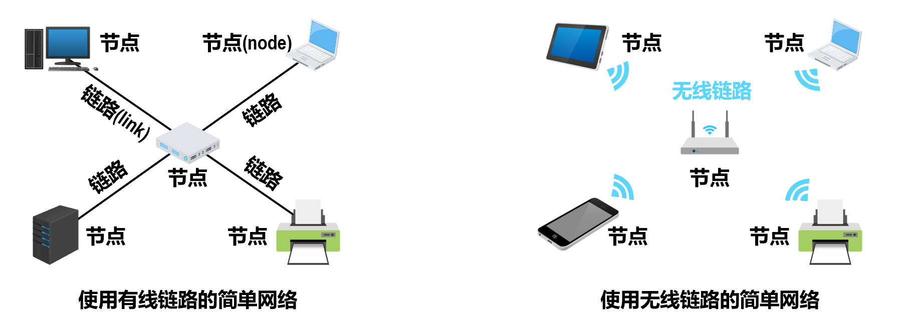

计算机网络（简称网络）：指的是由若干节点（如计算机、打印机等）和连接这些节点的链路（有线或无线）组成的集合。一个网络通常覆盖范围有限，比如一个家庭、办公室或校园内部的局域网（LAN）。

互连网（互联网）（internet）：是指由多个网络通过路由器等设备互连起来形成的更大范围的网络。互连网可以是企业内部多个局域网的互联，也可以是全球范围的网络互联。因特网（Internet）就是最大的互连网。

因特网（Internet）：专指全球范围内采用TCP/IP协议族互连起来的、覆盖全球的特定互连网。它是目前世界上最大的、开放的、公共的互连网。

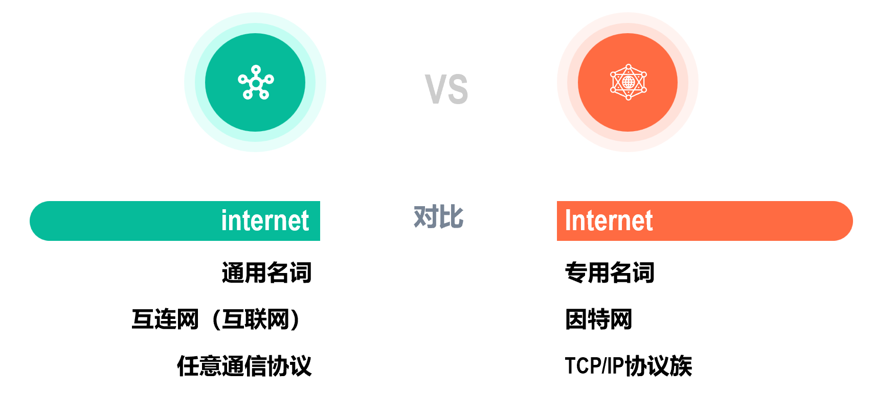

!!! info
    因特网的前身是 1969 年创建的第一个分组交换网 **ARPANET**。

---

## 因特网简介

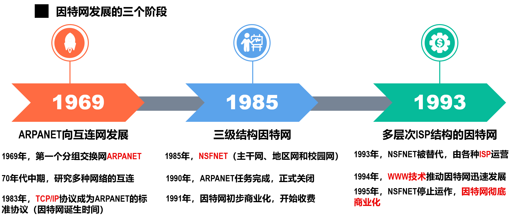

因特网服务提供者（Internet Service Provider，**ISP**）

---

### 因特网的标准化工作

因特网的标准化工作是面向公众的，其任何一个建议标准在成为因特网标准之前都以RFC技术文档的形式在因特网上发表。

RFC（Request For Comments）的意思是“请求评论”。任何人都可以从因特网上免费下载RFC文档（http://www.ietf.org/rfc.html），并随时对某个RFC文档发表意见和建议。

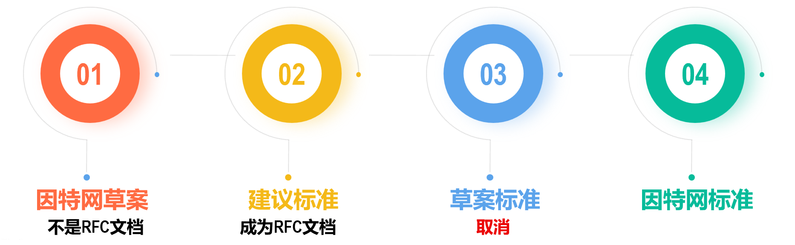

---

### 因特网的组成

从不同的角度看，可将计算机网络的组成分为如下几类。

1) 从组成部分看，计算机网络主要由硬件、软件、协议三大部分组成。硬件主要由主机(也称端系统)、通信链路(如双绞线、光纤)、交换设备(如路由器、交换机等)和通信处理机(如网卡)等组成。软件主要包括各种实现资源共享的软件和方便用户使用的各种工具软件(如E-mail程序、FTP程序、聊天程序等)。协议是计算机网络的核心，如同交通规则制约汽车驾驶一样，协议规定了网络传输数据时所遵循的规范。

2) 从工作方式看，计算机网络(这里主要指Internet,即互联网)可分为边缘部分和核心部分。边缘部分由所有连接到互联网上的供用户直接使用的主机组成，用来进行通信(如传输数据、音频或视频)和资源共享；核心部分由大量网络和连接这些网络的路由器组成，它为边缘部分提供连通性和交换服务。图1.1给出了互联网核心部分与边缘部分的示意图。

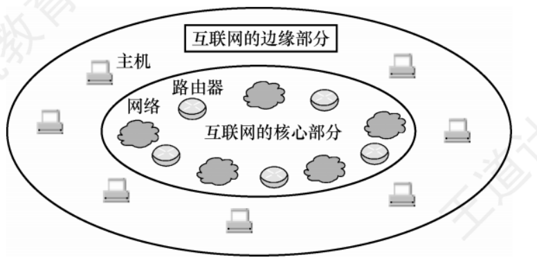

---

## 电路交换、报文交换和分组交换

### 电路交换

电路交换分为三步：**建立连接**(开始占用通信资源)、**传输数据**(一直占用通信资源)和**释放连接**(归还通信资源)。

在进行数据传输前，两个用户之间必须先建立一条专用的物理通信路径(由通信双方之间的交换设备和链路逐段连接而成)。在数据传输过程中，这一物理通信路径始终被两个用户独占，直到通信结束后才被释放。

电路交换技术的优点：

1. **通信时延小**。因为通信线路为通信双方专用，数据直达，所以传输速率高。
2. 有序传输。双方通信时按发送顺序传送数据，不存在失序问题。
3. 没有冲突。不同的通信双方拥有不同的信道，不会出现争用物理信道的问题。
4. **实时性强**。通信双方之间的物理通路一旦建立，双方就可随时通信。

电路交换技术的缺点：

1. **建立连接时间长**。电路交换的平均连接建立时间对计算机通信来说太长。
2. **线路利用率低**。物理通路被通信双方独占，即使线路空闲，也不能供其他用户使用。
3. **灵活性差**。物理通路中的任何一点出现故障，就必须重新拨号建立新的连接。
4. 难以实现差错控制。中间节点不具备存储和检验数据的能力，**无法发现并纠正错误**。

计算机之间的数据传送往往是突发式(高频、少量)的，当使用电路交换来传送数据时，已被用户占用的通信线路资源在绝大部分时间里都是空闲的，其利用率往往不到 10% 甚至 1% 。

---

### 报文交换

数据交换的单位是报文，用户数据加上源地址、目的地址等信息后，后封装成报文(Message)。报文交换采用存储转发技术，整个报文先传送到相邻的节点，全部存储后查找转发表，转发到下一个节点，如此重复，直至到达目的节点。每个报文都可单独选择到达目的端的路径。

报文交换技术的优点：

1. 无建立连接时延。通信前无须建立连接，没有建立连接时延，用户可随时发送报文。
2. **灵活分配线路**。交换节点存储整个报文后，选择一条合适的空闲线路，转发报文。若某条传输路径发生故障，则可重新选择另一条路径传输数据。
3. **线路利用率高**。报文在一段链路上传送时才占用这段链路的通信资源。
4. **支持差错控制**。交换节点可对缓存下来的报文进行差错检验。

报文交换技术的缺点：

1. **转发时延高**。交换节点要将报文整体接收完后，才能查找转发表转发到下一个节点。
2. **缓存开销大**。报文的大小没有限制，这就要求交换节点拥有较大的缓存空间。
3. 错误处理低效。报文较长时，发生错误的概率相对更大，**重传整个报文的代价也很大**。

---

### 分组交换

分组交换也采用存储转发技术，但解决了报文交换中报文过长的问题。若报文太长，则对交换节点的缓存容量就有很大的需求，在错误处理方面也比较低效。源主机在发送之前，先把较长的报文划分成若干较小的等长数据段，在每个数据段前面添加一些由必要控制信息(如源地址、目的地址和编号信息等)组成的首部，构成分组(Packet)。

分组交换除继承报文交换的诸多优点外，还有如下优点：

1. 方便存储管理，**存储转发开销小**。因为分组的长度固定，所以相应缓冲区的大小也固定。
2. **传输效率高**。分组是逐个传输的，可以使后一个分组的存储操作与前一个分组的转发操作并行，这种流水线方式减少了报文的传输时间。
3. **减少了出错概率和重传代价**。因为分组较短，其出错概率必然减小，所以每次重发的数据量也就大大减少，这样不仅提高了可靠性，还减小了传输时延。

分组交换技术的缺点：

1. 存在存储转发时延。尽管分组交换比报文交换的传输时延小，但相对于电路交换仍存在存储转发时延，且其节点交换机必须具有更强的处理能力。
2. **需要传输额外的信息量**。每个小数据段都要加上控制信息以构成分组，这使得传送的信息量增大了5%～10%,进而使得控制复杂，降低了通信效率。
3. 当分组交换网采用数据报服务时，可能出现失序、丢失或重复分组的情况，分组到达目的主机时，要对分组按编号进行排序等工作，而这些工作很麻烦。若采用虚电路服务，则虽然没有失序问题，但有呼叫建立、数据传输和虚电路释放三个过程。

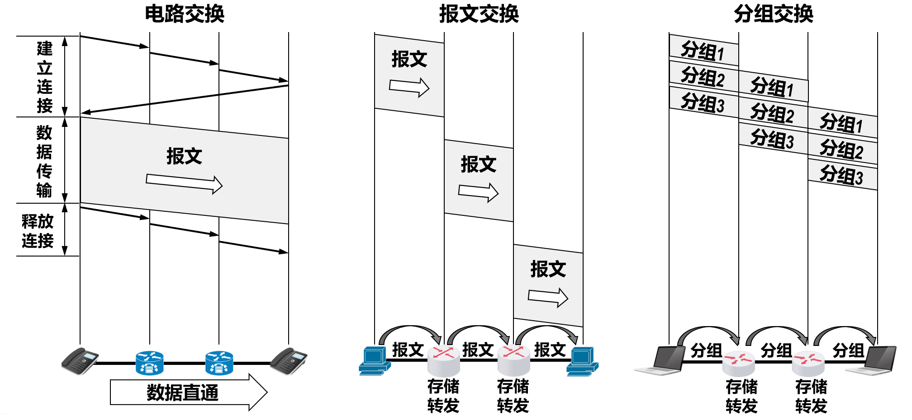

???+ example "question"
    下列()是分组交换网络的缺点。
    
    A.信道利用率低
    
    B.附加信息开销大
    
    C.传播时延大
    
    D.不同规格的终端很难相互通信

??? note "answer"
    B

???+ example "question"
    不同的数据交换方式有不同的性能。为了使数据在传输期间的时延最小，首选的交换方式是(①);为保证数据无差错地传送，不应选用的交换方式是(②);分组交换对报文交换的主要改进是(③),这种改进产生的直接结果是(④)。
    
    ①A.电路交换 B.报文交换 C.分组交换

    ②A.电路交换 B.报文交换 C.分组交换

    ③A.传输单位更小且有固定的最大长度 B.传输单位更大且有固定的最大长度 C.差错控制更完善 D.路由算法更简单

    ④A.降低了误码率 B.提高了数据传输速率 C.减少传输时延 D.增加传输时延

??? note "answer"
    A A A C

???+ example "question"
    下列说法中，()是数据报方式的特点。
    
    A.同一报文的不同分组可以经过不同的传输路径通过通信子网
    
    B.同一报文的不同分组到达目的节点时顺序是确定的
    
    C.适合于短报文的通信
    
    D.同一报文的不同分组在路由选择时只需要进行一次

??? note "answer"
    A

    B 错误。由于分组可能走不同路径，网络中转发和排队时延不同，分组到达目的地的顺序可能会乱序，顺序不确定。

    C 错误。适合短报文的通信是分组交换（尤其是数据报方式）的一种应用场景，但不是定义性特征。

    D 错误。数据报方式下，每个分组独立进行路由选择，每到一个节点都可能重新选择下一跳，而不是只选择一次。

---

## 计算机网络的定义

计算机网络早期的一个最简单定义：

1. 互连：指网络中的各个计算机或设备通过物理链路（如网线、光纤、无线等）连接起来，能够相互通信和交换数据。
2. 自治：每台计算机在网络中都是独立的、自治的系统，可以自主运行自己的操作系统和应用程序。
3. 计算机集合：网络是由多台计算机构成的集合体，而不是单一的计算机。

现阶段计算机网络的一个较好的定义：

计算机网络主要是由一些**通用的**、**可编程的**硬件互连而成的，而这些硬件并非专门用来实现某一特定目的（例如，传送数据或视频信号）。这些可编程的硬件能够用来传送多种不同类型的数据，并能支持广泛的和日益增长的应用。

???+ example "question"
    计算机网络可被理解为()。
    
    A.执行计算机数据处理的软件模块
    
    B.由自治的计算机互连起来的集合体
    
    C.多个处理器通过共享内存实现的紧耦合系统
    
    D.用于共同完成一项任务的分布式系统

??? note "answer"
    B

    A错误。计算机网络不仅包括软件模块，还包括硬件组件，如路由器、交换机和通信链路。

    C错误。紧耦合系统通常指的是多处理器系统，而计算机网络是由独立的计算机通过通信链路连接而成的。

    D错误。分布式系统强调的是协同工作以完成任务，而计算机网络更侧重于连接和通信。

???+ example "question"
    计算机网络最基本的功能是()。

    A.数据通信
    
    B.资源共享
    
    C.分布式处理
    
    D.信息综合处理

??? note "answer"
    A

    计算机网络的功能包括数据通信、资源共享、分布式处理、信息综合处理、负载均衡、提高可靠性等，但其中最基本的功能是数据通信功能，数据通信功能也是实现其他功能的基础。

???+ example "question"
    下列不属于计算机网络功能的是()。
    
    A.提高系统可靠性
    
    B.提高工作效率
    
    C.分散数据的综合处理
    
    D.使各计算机相对独立

??? note "answer"
    计算机网络的三大主要功能是数据通信、资源共享和分布式处理。计算机网络使各计算机之间的联系更加紧密而非相对独立。

???+ example "questioin"
    下列关于网络中的计算机的描述，正确的是()。
    
    A.各自独立，没有联系
    
    B.拥有独立的操作系统
    
    C.互相干扰
    
    D.拥有共同的操作系统

??? note "answer"
    B

---

## 计算机网络的分类

### 按分布范围分类

1. 广域网(WAN)。广域网的任务是提供长距离通信，运送主机所发送的数据，其覆盖范围通常是直径为几十米到几千千米的区域。广域网是互联网的核心部分。连接广域网的各节点交换机的链路一般都是高速链路，具有较大的通信容量。
2. 城域网(MAN)。城域网的覆盖范围可以跨越几个街区甚至整个城市，覆盖区域的直径为5~50km。城域网大多采用以太网技术，因此有时也常并入局域网的范围讨论。
3. 局域网(LAN)。局域网一般用主机通过高速线路相连，覆盖范围较小，通常是直径为几十到几千米的区域。传统上，局域网使用广播技术，而广域网使用交换技术。
4. 个人区域网(PAN)。个人区域网是指在个人工作的地方将消费电子设备(如平板电脑、智能手机等)用无线技术连接起来的网络，也称无线个人区域网(WPAN)。

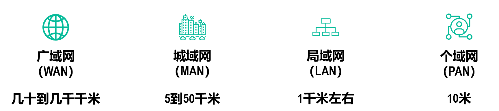

???+ example "answer"
    计算机网络分为广域网、城域网和局域网，其划分的主要依据是()。
    
    A.网络的作用范围
    
    B.网络的拓扑结构
    
    C.网络的通信方式
    
    D.网络的传输介质

??? note "answer"
    A

---

### 按传输技术分类

1. 广播式网络。所有联网计算机都共享一个公共通信信道。当一台计算机利用共享通信信道发送报文分组时，所有其他计算机都会“收听”到这个分组。“收听”到该分组的计算机将通过检查目的地址来决定是否接收该分组。局域网基本上都采用广播式通信技术广域网中的无线、卫星通信网络也采用广播式通信技术。
2. 点对点网络。每条物理线路连接一对计算机。若通信的两台主机之间没有直接连接的线路，则它们之间的分组传输就要通过中间节点进行存储和转发，直至目的主机。

---

### 按拓扑结构分类

网络拓扑结构是指由网中节点(路由器、主机等)与通信线路之间的几何关系表示的网络结构，主要指通信子网的拓扑结构。按拓扑结构，网络可分为总线形、星形、环形和网状网络等。

星形、总线形和环形网络多用于局域网，网状网络多用于广域网。

??? info "原因"
    星形、总线形和环形网络多用于局域网: 局域网覆盖范围小，节点数量有限，通常在一个办公室、楼宇或校园内部。这些拓扑结构布线简单、成本低、易于管理和维护，适合小范围、节点数量不多的环境。星形结构便于集中管理，总线结构布线经济，环形结构易于实现令牌环协议。

    网状网络多用于广域网: 广域网覆盖范围大，节点数量多，通常跨越城市、地区甚至国家。网状结构具有高可靠性和冗余性，任意两个节点之间可以有多条路径，适合大规模、复杂的网络环境。当某条链路或节点出现故障时，数据可以通过其他路径绕行，提高了网络的健壮性和容错能力。这对于广域网这种需要高可用性和大规模互联的场景非常重要。

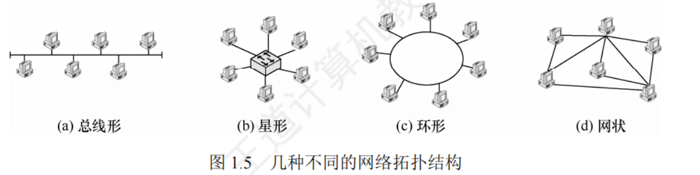

1. 总线形网络。用单根传输线把计算机连接起来。优点是建网容易、增/减节点方便、节省线路。缺点是重负载时通信效率不高、总线任意一处对故障敏感。
2. 星形网络。每个终端或计算机都以单独的线路与中央设备相连。中央设备一般是交换机或路由器。优点是便于集中控制和管理。缺点是成本高、中央设备对故障敏感。
3. 环形网络。所有计算机接口设备连接成一个环。环形网络最典型的例子是令牌环局域网。环既可以是单环，又可以是双环，环中信号是单向传输的。
4. 网状网络。一般情况下，每个节点至少有两条路径与其他节点相连，多用在广域网中。其有规则型和非规则型两种。优点是可靠性高。缺点是控制复杂、线路成本高。

以上4种基本的网络拓扑结构可以互连为更复杂的网络。

---

### 按使用者分类

1. 公用网(Public Network)。指电信公司出资建造的大型网络。“公用”的意思是指所有愿意按电信公司的规定缴纳费用的人都可使用这种网络。
2. 专用网(Private Network)。指某个单位为满足本单位特殊业务的需要而建造的网络。这种网络不向本单位外的人提供服务，如铁路、电力、军队等部门的专用网。

---

### 按传输介质分类

传输介质可分为有线和无线两大类，因此网络可分为**有线网络**和**无线网络**。

有线网络又可分为双绞线网络、同轴电缆网络等。

而无线网络又可分为蓝牙、微波、无线电等类型。

---

## 计算机网络的性能指标

### 速率(Speed)

指连接到网络上的节点在数字信道上传送数据的速率，也称数据传输速率、数据率或比特率，单位为 b/s（比特/秒）或 bit/s（有时也写做bps）。

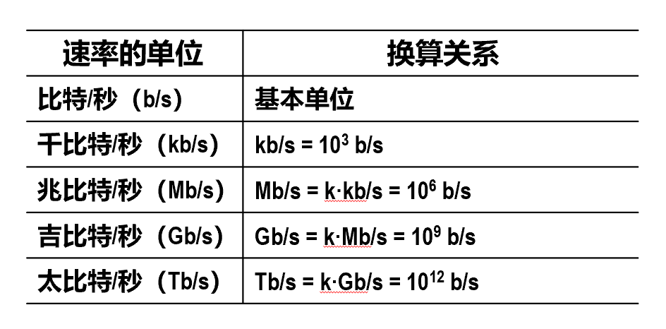

???+ example "question"
    有一个待发送的数据块，大小为100MB，网卡的发送速率为100Mbps，则网卡发送完该数据块需要多长时间？

??? note "answer"
    $\frac{100MB}{100Mbps} = \frac{100 \times 2^{20} \times 8}{100 \times 10^6} s = \frac{2^{23}}{10^6} s \approx 8 s$

???+ example "question"
    假设主机A和B之间的链路带宽为100Mb/s,主机A的网卡速率为1Gb/s,主机B的网卡速率为10Mb/s,主机A给主机B发送数据的最高理论速率为()。
    
    A.1Mb/s
    
    B.10Mb/s
    
    C.100Mb/s
    
    D.1Gb/s

??? note "answer"
    B

???+ example "question"
    某点对点链路的长度为100km,若数据在该链路上的传播输速率为 $10^8$ m/s,链路带宽为20Mbps,已知一个已发送的分组的发送时延和传播时延相等，则该分组的大小为()。
    
    A.20Kb
    
    B.30Kb
    
    C.40Kb
    
    D.50Kb

??? note "answer"
    传播时延  = $\frac{100 \times 10^3}{10^8} s = 10^{-3} s$

    发送时延 = $\frac{分组大小}{链路宽度}$

    得到分组大小 A

???+ example "question"
    在下图所示的采用存储转发方式的分组交换网中，主机A向B发送两个长度为 1000B 的分组，路由器处理单个分组的时延为10ms(假设路由器同时最多只能处理一个分组，若在处理某个分组时有新的分组到达，则存入缓存区),忽略链路的传播时延，所有链路的数据传输速率为1Mb/s,则分组从A发送开始到B接收完为止，需要的时间至少是()。

    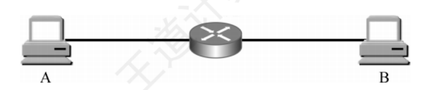

    A. 34 ms B. 36ms C. 38ms D. 52ms

??? note "answer"
    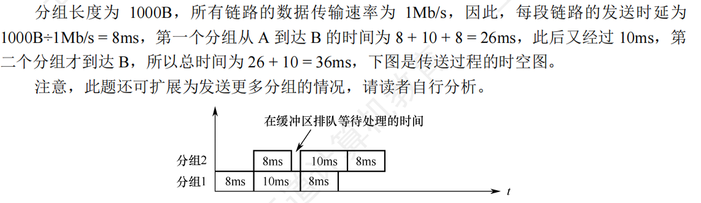

---

### 带宽(Bandwidth)

带宽原本表示通信线路允许通过的信号频率范围，单位是赫兹(Hz)。但在计算机网络中，带宽表示网络的通信线路所能传送数据的能力，是数字信道所能传送的“最高数据传输速率”的同义语，单位是比特/秒(b/s)。

数据传送速率 = min [ 主机接口速率，线路带宽，交换机或路由器的接口速率 ]

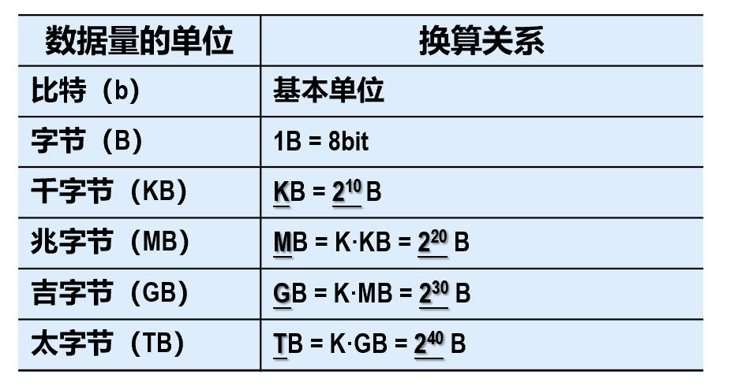

---

### 吞吐量(Throughput)

指单位时间内通过某个网络(或信道、接口)的实际数据量。吞吐量常用于对实际网络的测量，以便获知到底有多少数据量能够通过网络。

吞吐量受网络带宽的限制。

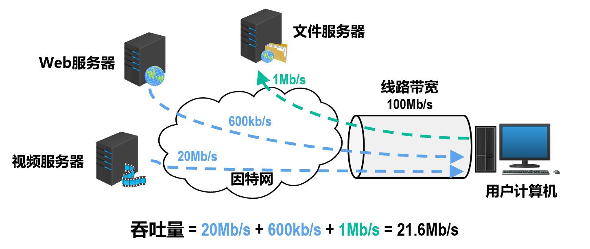

---

### 时延(Delay)

指数据(一个报文或分组)从网络(或链路)的一端传送到另一端所需的总时间，它由4部分构成:发送时延、传播时延、处理时延和排队时延。

1. 发送时延，也称传输时延。节点将分组的所有比特推向链路所花的时间，即从发送分组的第一个比特算起，到该分组的最后一个比特发送完毕所花的时间。

$$\text{发送时延}=\frac{\text{分组长度}}{\text{发送速率}}

2. 传播时延。电磁波在信道(传输介质)中传播一定的距离所花的时间，即一个比特从链路的一端传播到另一端所需的时间。

$$\text{传播时延}=\frac{\text{信道长度}}{\text{电磁波在信道上的传播速率}}$$

所以距离越远，传播时延越大。所以同步卫星链路的传播时延很大。

!!! tip "区分传输时延和传播时延"
    传输时延是节点将分组推向网络所需的时间，它取决于分组长度和发送速率。
    
    传播时延是一个比特从一个节点传播至另一节点所需的时间，它取决干两个节点之间距离和信道所使用的传输介质，而与分组长度或发送速率无关。

- 自由空间： $3.0 \times 10^8 m/s$
- 光纤： $2.0 \times 10^8 m/s$
- 铜缆： $2.3 \times 10^8 m/s$

3. 处理时延。分组在交换节点为存储转发而进行的一些必要处理所花的时间。例如，分析分组的首部、差错检验或查找合适的路由等。

4. 排队时延。分组在路由器的输入队列或输出队列中排队等待所花的时间。

因此，数据在网络中经历的总时延就是以上4部分时延之和:

$$\text{总时延}=\text{发送时延}+\text{传播时延}+\text{处理时延}+\text{排队时延}$$

在考试中，通常不用考虑处理时延和排队时延(除非另有说明)。

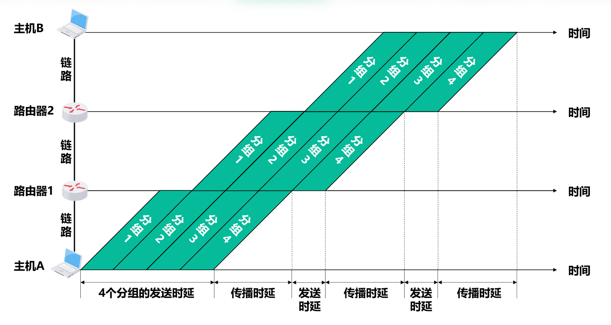

???+ example "question"
    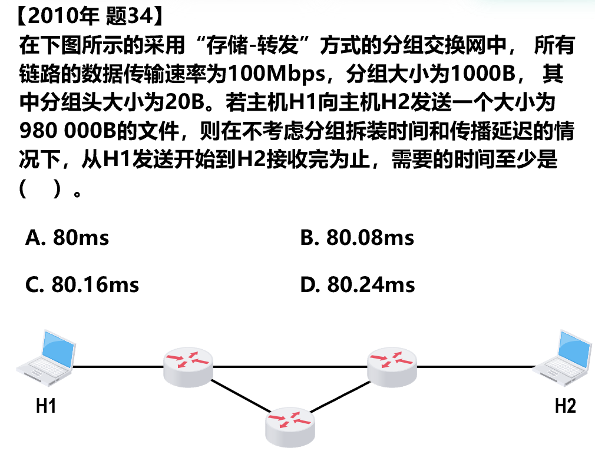

??? note "answer"
    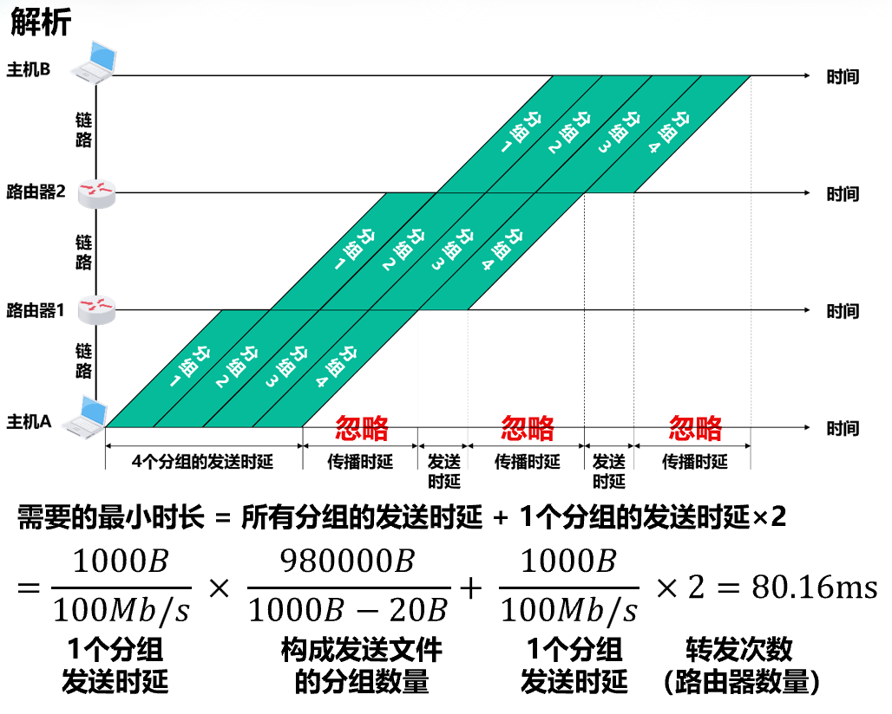

???+ example "question"
    数据块长度为100MB，信道带宽为1Mb/s，传送距离为1000KM，传输介质为光纤，计算发送时延和传播时延。

??? note "answer"
    发送时延 = $\frac{100MB}{1Mb/s} = \frac{100 \times 2^{20}}{10^6} s \approx 104.86 s$

    传播时延 = $\frac{1000KM}{2 \times 10^8 m/s} = \frac{1000 \times 10^3}{2 \times 10^8} s = 5 ms$

???+ example "question"
    数据块长度为1B，信道带宽为1Mb/s，传送距离为1000KM，传输介质为光纤，计算发送时延和传播时延。
    
??? note "answer"
    发送时延 = $\frac{1B}{1Mb/s} = \frac{1}{10^6} s = 10^{-6} s$

    传播时延 = $\frac{1000KM}{2 \times 10^8 m/s} = \frac{1000 \times 10^3}{2 \times 10^8} s = 5ms$

???+ example "question"
    如下图所示，主机H1和H2之间有三种可选的交换方式一电路交换、报文交换和分组交换，其中电路交换建立电路连接的时间为2s,报文交换和分组交换都要经过由一个路由器连接的链路，分组大小为5kb。三种交换方式的数据传输速率均为2.5kb/s,忽略所有的传播时延、分组开销和不可预料的线路延迟，则下列说法中正确的是()。

    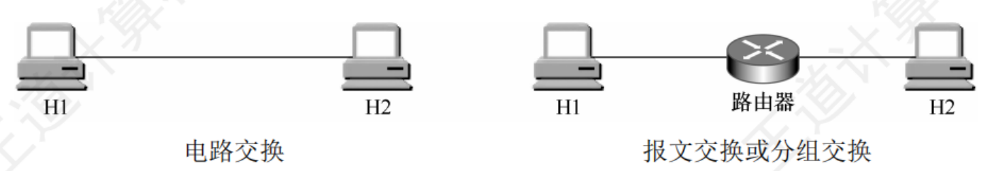

    A.若H1向H2发送5kb的数据，则电路交换最节省时间

    B.若H1向H2发送500kb的数据，则电路交换和分组交换的时间相同
    
    C.若H1向H2发送10kb的数据，则报文交换比分组交换更节省时间
    
    D.若H1向H2发送15kb的数据，则报文交换比电路交换更节省时间

??? note "answer"
    选项 A 错误。若 H1 向 H2 发送 5kb 的数据，则电路交换的时间为2+5kb/2.5kb/s=4s，分组交换和报文交换的时间均为 5kb/2.5kb/s+ 5kb/2.5kb/s=4s。
    
    选项B正确。若 H1 向 H2 发送 500kb 的数据，则电路交换的时间为 2+500kb/2.5kb/s=202s，分组交换的时间为 500kb/2.5kb/s+5kb/2.5kb/s=202s。
    
    选项 C 错误。若 H1 向 H2 发送 10kb 的数据,则报文交换的时间为 10kb/2.5kb/s+ 10kb/2.5kb/s=8s分组交换的时间为 10kb/2.5kb/s+ 5kb/2.5kb/s=6s。
    
    选项 D 错误。若 H1 向 H2 发送 15kb 的数据，则电路交换的时间为2+15kb/2.5kb/s=8s，报文交换的时间为 15kb/2.5kb/s+15kb/2.5kb/s=12s。

???+ example "question"
    【统考真题】在下图所示的采用“存储-转发”方式的分组交换网络中，所有链路的数据传输速率为100Mb/s,分组大小为1000B,其中分组头大小为20B。若主机H1向主机H2发送一个大小为980000B的文件，则在不考虑分组拆装时间和传播延迟的情况下，从H1发送开始到H2接收完为止，需要的时间至少是()。

    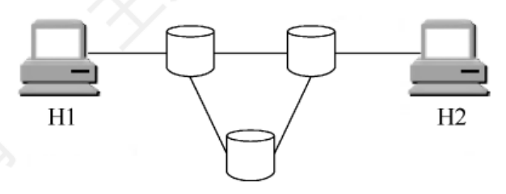

    A.80ms B.80.08ms C.80.16ms D.80.24ms

??? note "answer"
    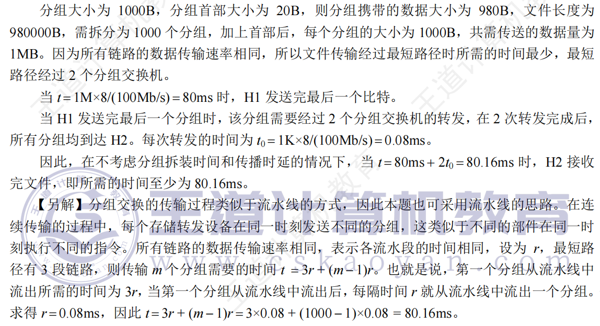

???+ example "question"
    【统考真题】主机甲通过一个路由器(存储转发方式)与主机乙互连，两段链路的数据传输速率均为10Mb/s,主机甲分别采用报文交换和分组大小为10kb的分组交换向主机乙发送一个大小为8Mb(1M= $10^6$ )的报文。若忽略链路传播延迟、分组头开销和分组拆装时间，则两种交换方式完成该报文传输所需的总时间分别为()。
    
    A.800ms、1600ms
    
    B.801ms、1600ms
    
    C.1600ms、800ms
    
    D.1600ms、801ms

??? note "answer"
    D

    对于报文交换： $\text{总时间}=\frac{8Mb}{10Mb/s} \times 2 =\frac{8 \times 10^6}{10 \times 10^6} \times 2 s= 1600 ms$

    对于分组交换：

    一组的传输时间为： $\frac{10kb}{10Mb/s} = 1 ms$

    一共有 $\frac{8Mb}{10kb} = 800$ 组

    一共需要 $(800 + 1) \times 1 ms = 801 ms$

---

### 时延带宽积

指发送端发送的第一个比特即将到达终点时，发送端已发出了多少比特，也称以比特为单位的链路长度，即:

$$\text{时延带宽积=传播时延x信道带宽}$$

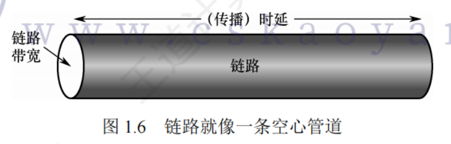

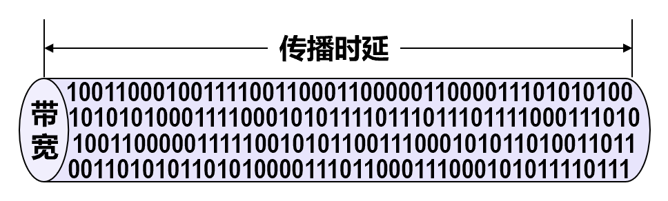

???+ example "question"
    主机A和B之间采用光纤链路，链路长1km，链路带宽为1Gb/s，请计算该链路的时延带宽积。

??? note "answer"
    时延带宽积 = $\frac{1km}{2 \times 10^8 m/s} \times 1 \times 10^9 b/s = 5000 b$

???+ example "question"
    【2023 统考真题】在下图所示的分组交换网络中，主机H1和H2 通过路由器互连，2 段链路的带宽均为 100Mb/s，时延带宽积(单向传播时延x带宽)均为 1000b。若 H1向H2发送一个大小为 1MB 的文件，分组长度为 1000B，则从H1 开始发送的时刻起到 H2 收到文件全部数据时刻止，所需的时间至少是()。

    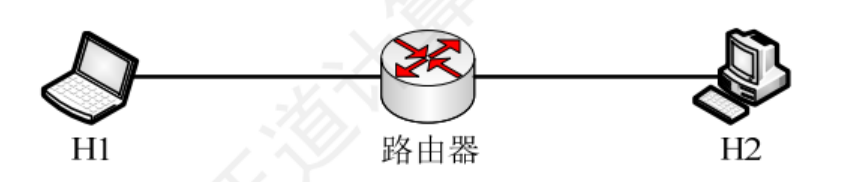

    A. 80.02ms  B. 80.08ms  C.80.09ms  D.80.10ms

??? note "answer"
    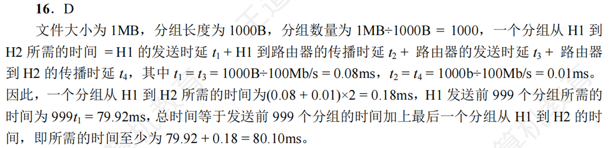

---

### 往返时间(Round-Trip Time，RTT)

指从发送端发出一个短分组，到发送端收到来自接收端的确认(接收端收到数据后立即发送确认)总共经历的时间。

在互联网中，往返时间还包括各中间节点的处理时延、排队时延及转发数据时的发送时延。

---

### 信道利用率（链路利用率）

用来指出某个信道（链路）有百分之多少的时间是有数据通过的。完全空闲的链路的利用率为零。

$$\text{信道利用率}=\frac{\text{有数据通过的时间}}{\text{有数据通过的时间}+\text{无数据通过的时间}}$$

信道利用率并非越高越好，信道利用率太低会浪费网络资源;信道利用率太高会产生较大的时延，导致网络拥塞。这就好比当公路上的车流量很大时，容易出现拥堵。

**网络利用率**

网络利用率是指网络中所有链路的链路利用率的加权平均。

- 根据排队论可知，当某链路的利用率增大时，该链路引起的时延就会迅速增加。
- 当网络的通信量较少时，产生的时延并不大，但在网络通信量不断增大时，分组在交换节点（路由器或交换机）中的排队时延会随之增大，因此网络引起的时延就会增大。
- 令 $D_0$ 表示网络空闲时的时延，D表示网络当前的时延，那么在理想的假定条件下，可用下式来表示D、 $D_0$ 和网络利用率U之间的关系。

$$D = \frac{D_0}{1 - U}$$

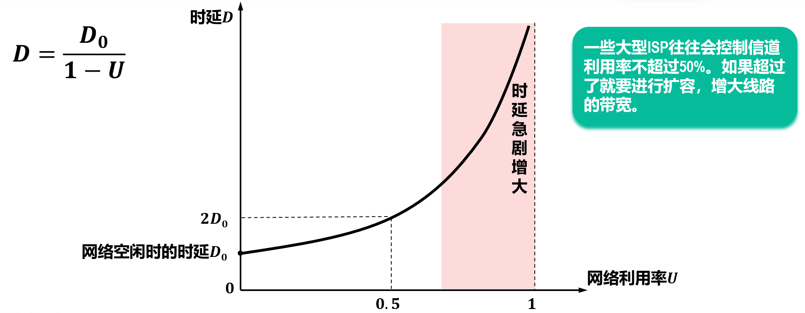

---

### 丢包率

丢包率是指在一定的时间范围内，传输过程中**丢失的分组数量与总分组数量的比率**。

分组丢失主要有以下两种情况：

1. 分组在传输过程中出现**误码**，被传输路径中的**节点交换机**（例如路由器）或**目的主机**检测出误码而**丢弃**。
2. 节点交换机根据**丢弃策略**主动丢弃分组。

??? note "丢包率可以反映网络的拥塞情况"
    无拥塞时路径丢包率为0。
    
    轻度拥塞时路径丢包率为1%~4%。
    
    严重拥塞时路径丢包率为5%~15%。

---

## 计算机网络体系结构

### 常见的三种计算机网络体系结构

OSI 参考标准（法律标准）：应用层(Application Layer)、表示层(Presentation Layer)、会话层(Session Layer)、运输层(Transport Layer)、网络层(Network Layer)、数据链路层(Data Link Layer)、物理层(Physical Layer)

TCP/IP 参考模型（事实标准）：应用层(Application Layer)、运输层(Transport Layer)、网际层(Internet Layer)、网络接口层(Network Interface Layer)

???+ example "question"
    下列选项中，不属于对网络模型进行分层的目标的是()。
    
    A.提供标准语言
    
    B.定义功能执行的方法
    
    C.定义标准界面
    
    D.增加功能之间的独立性

??? note "answer"
    B

???+ example "question"
    将用户数据分成一个个数据块传输的优点不包括()。
    
    A.减少延迟时间
    
    B.提高错误控制效率
    
    C.使多个应用更公平地使用共享通信介质
    
    D.有效数据在协议数据单元(PDU)中所占比例更大

??? note "answer"
    D

    将用户数据分成一个个数据块传输，因为每块均需加入控制信息，所以实际上会使有效数据在 PDU 中所占的比例更小。其他各项均为其优点。

    将用户数据分成一个个数据块（即“分组”）传输可以减少延迟时间，其核心原因在于实现了**“存储转发”的流水线效应**，避免了“报文交换”中每个节点必须完整接收整个数据才能转发的巨大耗时。

???+ example "question"
    协议是指在()之间进行通信的规则或约定。
    
    A.同一节点的上下层
    
    B.不同节点
    
    C.相邻实体
    
    D.不同节点对等实体

??? note "answer"
    D

    协议是为对等层实体之间进行逻辑通信而定义的规则的集合。

???+ example "question"
    OSI参考模型中的实体指的是()。
    
    A.实现各层功能的规则
    
    B.上下层之间进行交互时所要的信息
    
    C.各层中实现该层功能的软件或硬件  
    
    D.同一节点中相邻两层相互作用的地方

??? note "answer"
    C

    实体是指每一层中实现该层功能的软件或硬件，可以是程序、块、子程序或设备。

---

### 计算机网络体系结构分层的必要性

计算机网络是一个极其复杂的系统，为了有效处理各种问题，必须采用“分而治之”的思想，将复杂的问题分解成一个个更小、更易于管理和解决的子问题。 

#### 物理层的必要性

物理层的传输单位是比特，功能是在物理介质上为数据端设备透明地传输原始比特流。

1. 采用什么传输媒体 (介质) (物理层之下)

数据不能凭空传输，它必须依赖于一个物理的载体或媒介。物理层首先要解决的就是选择用什么“路”来传输信号。这个选择会直接影响到通信的速率、距离、成本和抗干扰能力。

2. 采用什么物理接口

选好了“路”（传输媒体），还需要定义设备如何连接到这条路上。物理接口规定了连接器的机械规格（形状、尺寸、引脚数量）和电气规格（每个引脚上的电压、电流标准）。

3. 采用什么信号表示比特0和1

计算机内部处理的是抽象的数字信号0和1。但在物理介质上传输时，必须将这些数字信号转换成具体的物理信号，如电压、光脉冲或电磁波。物理层必须精确定义这种转换规则。

---

#### 数据链路层的必要性

数据链路层的传输单位是**帧**。两台主机之间的数据传输总是在一段一段的链路上进行的，这就需要使用专门的链路层协议。主要作用是加强物理层传输原始比特流的功能，将物理层提供的可能出错的物理连接改造为逻辑上无差错的数据链路。数据链路层将网络层交来的 IP 分组封装成帧，并且可靠地传输到相邻节点的网络层，实现**节点之间的差错控制和流量控制**的功能。

1. 标识网络中各主机 (主机编址)

在一个网络中，网络中的设备也需要唯一的地址。

2. 从比特流中区分出地址和数据 (数据封装格式)

网络中传输的是一连串的0和1（比特流）。接收方如何知道哪些比特是地址，哪些是真正的有用数据？这就需要一个约定好的格式，就像信封一样，收件人地址写在固定位置，寄件人地址写在另一个位置，信件内容放在里面。这个“信封”就是数据帧（Frame）。

3. 协调各主机争用总线 (媒体接入控制)

在无线网络或早期的有线网络中，所有设备共享同一个通信信道（总线）。如果大家同时说话，信号就会冲突、混乱，谁也听不清。因此需要一套规则（协议）来决定谁可以在什么时候发送数据。

4. 以太网交换机的实现 (自学习和转发帧)

交换机比集线器（Hub）更智能。它内部有一张表，记录了哪个 MAC 地址的设备连接在哪个端口上。当它收到一个数据帧时，会查看目标 MAC 地址，然后只从对应的端口把数据转发出去，而不是像 Hub 那样广播给所有端口。这张表是交换机通过“自学习”建立起来的。

5. 检测数据是否误码 (差错检测)

数据在传输中可能出错。我们需要一种数学方法来校验数据。发送方在发送数据时会根据数据内容计算一个校验码（例如CRC循环冗余校验码），并附在数据后面。接收方收到后用同样的方法再算一遍，如果两个校验码不一致，就说明数据出错了。

6. 出现传输差错如何处理 (可靠传输和不可靠传输)

检测到错误后，下一步怎么办？这就引出了两种服务模型：

- **可靠传输**: 保证数据一定、正确、按序到达。如果发现数据丢失或错误，会自动请求重传。例如下载文件、发邮件时，一个字节都不能错，必须使用可靠传输。
- **不可靠传输**: “尽力而为”，数据发出去就不管了，错了或丢了就由它去。例如视频直播、在线会议。偶尔丢一帧画面影响不大，但如果为了重传一个旧的画面而让整个直播卡顿，是得不偿失的。

7. 接收方控制发送方注入网络的数据量 (流量控制)

发送方（A）可能性能很好，网络空闲，可以高速发送数据。但接收方（B）可能正忙于CPU密集型任务，处理数据的速度跟不上接收速度。如果A不管不顾地持续发送，B来不及处理的数据就会被丢弃，造成浪费和重传。

所以需要通过一种机制，让接收方告诉发送方自己还能接收多少数据，从而调节发送方的发送速度，防止因接收方处理不过来而导致数据丢失。

---

#### 网络层的必要性

网络层的传输单位是**数据报**。它关心的是通信子网的运行控制，主要任务是将网络层的协议数据单元(分组)从**源主机**传输到**目的主机**，为分组交换网上的不同主机提供通信服务。关键问题是对分组进行**路由选择**，并实现**流量控制**、**拥塞控制**、**差错控制**和**网际互联**等功能。网络层既提供有连接可靠的虚电路服务，又提供无连接不可靠的数据报服务。

1. 标识网络和网络中的各主机 (例如IP地址)

在数据链路层中，我们讨论了用 MAC 地址来标识同一个局域网内的设备。但如果 H1 (192.168.0.1) 要给 H3 (192.168.1.1) 发送数据，它们不在同一个局域网内，仅靠 MAC 地址是无法找到对方的。我们需要一种更高层次的、能够区分不同网络的地址方案。这就是 IP 地址的作用。

**IP地址的结构**: 一个IP地址被分为“网络号”和“主机号”两部分。例如，192.168.0.254，192.168.1.254。

2. 路由器转发分组 (路由选择协议、路由表和转发表)

既然H1和H3不在同一个网络，数据包就必须由中间的设备——路由器（Router）——来进行转发。但网络路径可能不止一条（例如图中H1到H3可以通过 R1->R2，也可以通过 R1->R3->R2），路由器如何知道走哪条路最快、最好呢？

工作原理:

- **路由选择协议**: 路由器之间会运行特定的协议（如OSPF, BGP），互相交换信息，学习整个网络的拓扑结构。
- **路由表**: 每个路由器根据学到的信息，生成一张“地图”，即路由表。这张表记录着“要去往某个目的网络，应该把数据包发给下一个哪个路由器”。
- **转发分组**: 当路由器收到一个数据包时，它会查看包头中的目标IP地址，根据其网络号查询自己的路由表，然后将数据包从最合适的端口转发出去。
- **举例**: H1 发往 H3 的数据包到达路由器 R1 。R1 查看目标IP是 192.168.1.1，查询路由表发现要去 192.168.1.0 这个网络，下一跳应该发给 R2。于是 R1 就把数据包转发给了 R2。R2 收到后发现目标主机就在自己所连接的网络 N2 上，于是直接将数据包发给 H3。

---

#### 运输层的必要性

传输层也称运输层，负责主机中两个进程之间的通信，提供**端到端的流量控制**、**差错控制**、**连接建立与释放**、**可靠传输管理**等服务，传输层仅提供有连接可靠的服务。

数据链路层提供的是点到点通信，传输层提供的是端到端通信，两者不同。通俗地说，点到点可理解为主机和主机之间的通信，一个点是指一个硬件地址或 IP 地址，网络中参与通信的主机是通过硬件地址或 IP 地址来标识的;端到端通信是指运行在不同主机内的两个进程之间的通信，一个进程由一个端口来标识，因此称为端到端通信。

1. 进程之间基于网络的通信 (进程的标识, 例如端口号)

网络层（IP协议）只负责把数据包送到正确的主机（例如IP地址为 192.168.1.1 的 H3 电脑）。但是，一台电脑上可能同时运行着多个需要联网的程序，比如你一边开着 Chrome 浏览器上网，一边用 QQ 聊天，还开着邮件客户端。当一个数据包到达H3时，操作系统该把它交给哪个程序呢？

运输层为每个应用进程分配一个唯一的**端口号**。**IP地址+端口号**才能唯一确定网络中的一个通信进程。

2. 出现传输差错如何处理 (可靠传输和不可靠传输)

- **可靠传输** (以TCP协议为代表): 像发送重要文件、浏览网页等应用，一个字节都不能错、不能丢。TCP 协议会通过序列号、确认应答、超时重传等机制，确保所有数据包都能完整、按序地到达。如果发送方没收到接收方的确认，就会重新发送那个丢失的数据包。
- **不可靠传输** (以UDP协议为代表): 像视频直播、语音通话等应用，对实时性要求很高。偶尔丢失一两个数据包（比如画面出现一个短暂的马赛克）是可以接受的，但如果为了重传一个旧的数据包而让整个画面卡顿，则体验更差。UDP 协议只管尽力发送，不保证送达。

---

#### 会话层（OSI）

会话层允许不同主机上的**各个进程之间进行会话**。这种服务主要为表示层实体或用户进程建立连接，并在连接上有序地传输数据，这就是会话，也称**建立同步**(SYN)。会话层负责管理主机间的会话进程，包括建立、管理和终止进程间的会话。会话层包含一种称为**检查点**的机制来维持可靠会话，使通信会话在通信失效时从检查点继续恢复通信，即断点下载的原理。

---

#### 表示层（OSI）

表示层主要处理在不同主机中交换信息的表示方式。不同机器采用的**编码**和表示方法不同，为了使不同表示方法的数据和信息之间能够互相交换，表示层采用抽象的标准方法定义数据结构，并采用标准的编码形式。此外，**数据压缩、加密和解密**也是表示层的功能。

---

#### 应用层的必要性

应用层是 OSI 参考模型的最高层，是**用户**与**网络**的接口。应用层为特定类型的网络应用提供访问 OSI 参考模型环境的手段。用户的实际应用多种多样，这就要求应用层采用不同的应用协议来满足不同类型的应用要求，因此应用层是最复杂的一层，**使用的协议也最多**。

1. 通过应用进程间的交互来完成特定的网络应用

底层网络已经为我们解决了数据传输的问题，但具体要传输什么内容、以什么格式传输，是由应用程序自己决定的。应用层定义了这些应用程序之间沟通的“语言”和“规则”，即应用层协议。

2. 进行会话管理和数据表示

这两点在严格的 OSI 七层模型中属于会话层和表示层，但在我们常见的五层模型中，它们的功能被归入了应用层。

**会话管理** (Session Management): 负责建立、管理和终止应用程序之间的会话（或称连接）。例如，你登录一个网站，服务器需要记住你的登录状态，这就是一种会话管理。

**数据表示** (Data Representation): 确保通信双方能够理解彼此的数据格式。比如，数据是文本（用什么字符编码，ASCII还是UTF-8？）、是图片（JPEG还是PNG？）、是否需要加密或压缩等。应用层协议需要处理这些问题，以保证数据能被正确解析。

---

#### TCP/IP 特殊的

网络接口层的功能类似于 OSI 参考模型的物理层和数据链路层,其作用是从主机或节点接收IP分组，并将它们发送到指定的物理网络上。但 TCP/IP 并未具体描述网络接口层的功能和协议,只是指出主机必须使用某种协议与网络连接，以便在其上传送IP分组。

网际层(主机-主机)是 TCP/IP 体系结构的关键部分，功能上它与 OSI 参考模型的网络层非常相似。网际层将分组发往任何网络，并为其独立地选择合适的路由，但不保证各个分组有序地到达，**各个分组的有序和可靠交付由高层负责**。

传输层(应用-应用或进程-进程)的功能同样与 OSI 参考模型中的传输层类似，即使得**发送端和目的端主机上的对等实体进行会话**。

    传输层主要使用以下两种协议：

    1) 传输控制协议(Transmission Control Protocol，**TCP**)。它是面向连接的，传输数据之前必须先建立连接，能够提供可靠的交付。数据传输的单位是报文段。
    
    2)用户数据报协议(User Datagram Protocol，**UDP**)。它是无连接的，不保证提供可靠的交付，只能提供“尽最大努力交付”。数据传输的单位是用户数据报。

应用层(用户-用户)包含所有的高层协议。

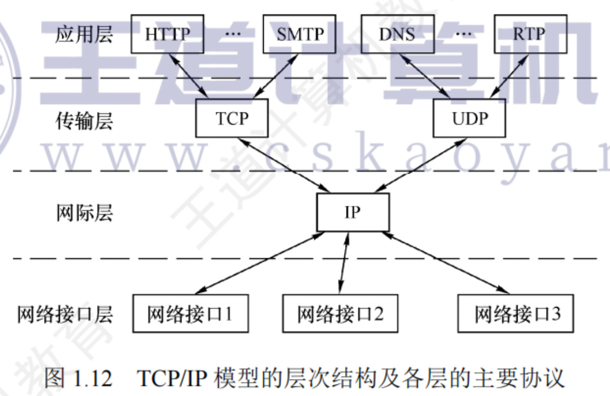

---

???+ example "question"
    OSI参考模型中的数据链路层不具有()功能。
    
    A.物理寻址
    
    B.流量控制
    
    C.差错检验
    
    D.拥塞控制

??? note "answer"
    D

    拥塞控制的最终目的是**防止过多的数据注入到网络中**，以免网络中的路由器或链路过载。这个控制行为是由发送方来执行的，即动态调整其发送数据的速率。

    TCP协议作为运输层的核心协议，实现了一整套复杂的拥塞控制机制（例如慢启动、拥塞避免、快重传、快恢复等算法）。TCP通过观察网络状况的“反馈”（如是否发生丢包、往返时间是否增加）来判断网络是否拥塞，并据此调整自己的发送窗口大小，从而控制发送速率。

    因为只有端到端的发送方和接收方才知道总共发送了多少数据，所以这种全局性的流量调控自然就落在了负责端到端通信的运输层。

    网络拥塞实际发生的地方是在网络层的设备——路由器上。当大量数据包到达路由器，并且其处理速度或转发速度跟不上数据包的到达速度时，路由器内部的缓存队列就会被填满，最终导致后来的数据包被丢弃。

    路由器的这种丢包行为，就是给发送方运输层提供的一个最强烈的“网络拥塞信号”。TCP正是通过检测到这种丢包，来判断网络发生了拥塞，并立刻降低发送速率。

    因此，网络层虽然不执行具体的控制算法，但它通过其行为（丢包、增加排队时延）向运输层“报告”了网络的拥塞状况。

???+ example "question"
    下列能够最好地描述OSI参考模型的数据链路层功能的是()。
    
    A.提供用户和网络的接口
    
    B.处理信号通过介质的传输
    
    C.控制报文通过网络的路由选择
    
    D.保证数据正确的顺序和完整性

??? note "answer"
    D

    OSI参考模型的数据链路层向上提供可靠的传输服务，在差错检测的基础上,增加了帧编号、确认和重传机制，因此保证了数据正确的顺序和完整性。选项A是应用层的功能，选项B是物理层的功能，选项C是网络层的功能。

???+ example "question"
    当数据由端系统A传送至端系统B时，不参与数据封装工作的是()。
    
    A.物理层
    
    B.数据链路层
    
    C.网络层
    
    D.表示层

??? note "answer"
    A

    物理层以 0、1比特流的形式透明地传输数据链路层提交的帧。网络层和表示层都为上层提交的数据加上首部，数据链路层为上层提交的数据加上首部和尾部，然后提交给下一层。物理层不存在下一层，自然也就不用封装。

???+ example "question"
    在OSI参考模型中，实现端到端的应答、分组排序和流量控制功能的协议层是()。
    
    A.会话层
    
    B.网络层
    
    C.传输层
    
    D.数据链路层

??? note "answer"
    C

    只有传输层及以上各层的通信才能称为端到端，选项 B、D错。会话层管理不同主机间进程的对话，而传输层实现应答、分组排序和流量控制功能。

    网络层及以下的通信是“点到点”或“主机到主机”的，中间的每一个网络节点（如路由器）都参与其中。而从传输层开始，通信的端点变成了**具体的应用程序进程**，通信是逻辑上直接在这两个进程之间进行的，中间的网络设备对这一层是透明的 ，因此被称为“端到端”通信。

???+ example "question"
    在OSI参考模型中，当两台计算机进行文件传输时，为防止中间出现网络故障而重传整个文件的情况，可通过在文件中插入同步点来解决，这个动作发生在()。
    
    A.表示层
    
    B.会话层
    
    C.网络层
    
    D.应用层

??? note "answer"
    B

    在 OSI 参考模型中，会话层的两个主要服务是会话管理和同步。会话层使用检验点使通信会话在通信失效时从检验点继续恢复通信，实现数据同步。

???+ example "question"
    【2016统考真题】在OSI参考模型中，路由器、交换机(Switch)、集线器(Hub)实现的最高功能层分别是()。
    
    A.2、2、1
    
    B.2、2、2
    
    C.3、2、1
    
    D.3、2、2

??? note "answer"
    C

    1. 集线器 (Hub):

    **工作原理**：集线器是这三种设备中最简单的一种。当一个信号从它的某个端口进入时，它会简单地将这个信号进行物理上的放大和再生，然后不加分辨地广播到所有其他端口。

    **处理对象**：它处理的是最原始的电信号，也就是一串串的比特流（0和1），它完全不理解这些比特流组成的帧结构，更不认识MAC地址或IP地址。

    **对应层次**：由于集线器只在比特（bit）层面进行操作，它实现的功能属于物理层（Layer 1）。

    2. 交换机 (Switch):

    **工作原理**：交换机比集线器更智能。当一个数据帧从它的某个端口进入时，交换机会读取这个帧头部的目的MAC地址 。它内部维护着一张MAC地址表，这张表记录了MAC地址与交换机端口的对应关系。通过查询这张表，交换机可以将该数据帧仅转发到连接着目的设备的那个特定端口，而不是广播给所有端口。

    **处理对象**：交换机处理的基本单位是数据帧（Frame），并且能够识别和使用MAC地址进行寻址 。

    **对应层次**：帧和MAC地址是数据链路层的核心概念。因此，交换机实现的最高功能层是数据链路层（Layer 2）。

    3. 路由器 (Router):

    **工作原理**：路由器的主要功能是连接不同的网络（例如，连接您家的局域网和广阔的因特网），并在这些网络之间转发数据包。当一个数据包（Packet）到达路由器时，路由器会解开数据链路层的封装，查看网络层的IP地址 。它会根据数据包中的

    **目的IP地址**，查询自己的路由表，然后为这个数据包选择一条最佳的路径，转发给下一个路由器或最终的目的地 。

    **处理对象**：路由器处理的基本单位是数据包（Packet），它必须能够理解IP地址并执行路由选择算法 。

    **对应层次**：IP地址和路由选择是网络层的核心功能。因此，路由器实现的最高功能层是网络层（Layer 3）。

???+ example "question"
    【2021统考真题】在TCP/IP模型中，由传输层相邻的下一层实现的主要功能是()。
    
    A.对话管理
    
    B.路由选择
    
    C.端到端报文段传输
    
    D.节点到节点流量控制

??? note "answer"
    B

    TCP/IP 模型中与传输层相邻的下一层是网际层。TCP/IP 的网际层使用一种尽力而为的服务,它将分组发往任何网络，并为其独立选择合适的路由，但不保证各个分组有序到达。

???+ example "question"
    【2022统考真题】在ISO/OSI参考模型中，实现两个相邻节点间流量控制功能的是()。
    
    A.物理层
    
    B.数据链路层
    
    C.网络层
    
    D.传输层

??? note "answer"
    B

    两个节点之间的流量控制是数据链路层的功能，端到端的流量控制是传输层的功能。

---

当一个发送方应用进程（如浏览器）要发送数据时，它首先将**数据**（如HTTP请求报文）交给应用层，应用层进行**协议处理后**向下传递给运输层 ；运输层会为其**加上TCP头部**以区分进程并实现可靠传输，将数据封装成TCP报文段后，再向下交给网络层 ；网络层继续**添加包含目标IP地址的IP头部**，将数据封装成IP数据报用于寻址和路由，然后传递给数据链路层 ；数据链路层则会**添加帧头和帧尾**，将数据封装成帧，用于在单一链路上传输 ；最后，物理层将帧转换成比特流并**通过物理介质**（如网线）以电信号的形式发送出去 。数据在网络中经过路由器时，路由器会**解封装**到网络层，根据IP地址决定下一跳路径并**重新封装** 。当数据到达接收方主机（如Web服务器）后，这个过程将逆向进行：从物理层开始**逐层解封装**，每一层都剥掉相应的头部信息并根据头部信息执行相应操作，最终将最原始的应用层数据（HTTP请求报文）准确无误地递交给目标应用进程 。

---

### 计算机网络体系结构中的专用术语

#### 实体

**实体**是指任何可发送或接收信息的**硬件**或**软件进程**。

**对等实体**是指通信双方**相同层次中的实体**。

---

#### 协议

**协议**是控制两个对等实体在“**水平方向**” 进行“**逻辑通信**”的**规则**的集合。

协议由语法、语义和同步三部分组成。

1. **语法**。数据与控制信息的**格式**。例如，TCP报文段格式就是由TCP的语法定义的。
2. **语义**。通信双方所要完成的**操作**。即需要发出何种控制信息、完成何种动作及做出何种应答。例如，在建立TCP连接时每次握手所执行的操作就是由TCP的语义定义的。
3. **同步(或时序)**。执行各种操作的条件、**时序关系**等，即事件实现顺序的详细说明。例如，建立TCP连接的三次握手操作的时序关系就是由TCP的同步定义的。

---

#### 服务

服务是指下层为紧邻的上层提供的功能调用，是垂直的。在协议的控制下，**两个对等实体在水平方向的逻辑通信使得本层能够向上一层提供服务**。

要实现本层协议，还需要使用下面一层所提供的服务。

!!! note "区别协议和服务"
    注意，协议和服务概念上是不一样的。
    
    首先，只有本层协议的实现才能保证向上一层提供服务。本层的服务用户只能看见服务而无法看见下面的协议，即下面的协议对上层的服务用户是透明的。
    
    其次，协议是“水平的”，即协议是控制对等实体之间通信的规则。但是，服务是“垂直的”，即服务是由下层通过层间接口向上层提供的。
    
    另外，并非在一层内完成的全部功能都称为服务，只有那些能够被高一层实体“看得见”的功能才称为服务。

在同一系统中**相邻两层的实体交换信息的逻辑接口**称为**服务访问点SAP**，它被用于区分不同的服务类型。帧的“类型”字段、IP数据报的“协议”字段，TCP报文段或UDP用户数据报的“端口号”字段都是SAP。

上层要使用下层所提供的服务，必须通过与下层交换一些命令，这些命令称为**服务原语**。

- 对等层次之间传送的数据包称为该层的协议数据单元（Protocol Data Unit，PDU）。
- 同一系统内层与层之间交换的数据包称为服务数据单元（Service Data Unit，SDU）。

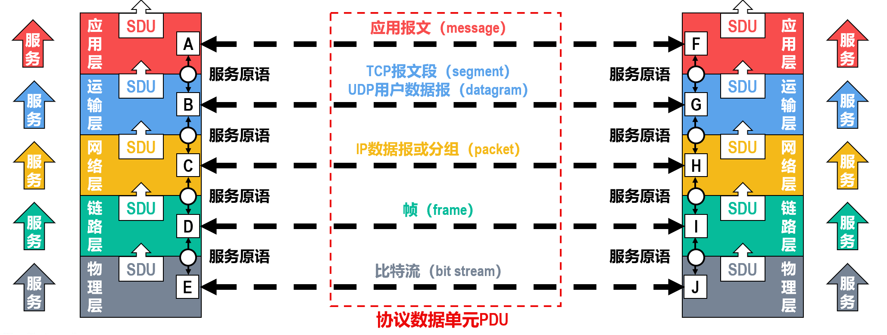

???+ example "question"
    【2010年 题33】下列选项中，不属于网络体系结构所描述的内容是（      ）。
    
    A. 网络的层次
    
    B. 每一层使用的协议

    C. 协议的内部实现细节
    
    D. 每一层必须完成的功能

??? note "answer"
    C

???+ example "question"
    【2020年 题33】下图描述的协议要素是（      ）。
    
    I. 语法    II. 语义      III. 时序
    
    A. 仅 I       B. 仅 II      C. 仅 III      D. I、II 和 III

    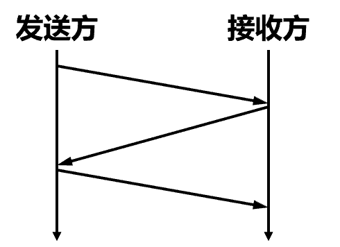

??? note "answer"
    C

---

一些综合应用题

???+ example "question"
    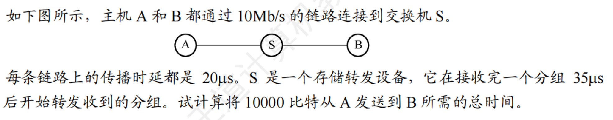

    

??? note "answer"
    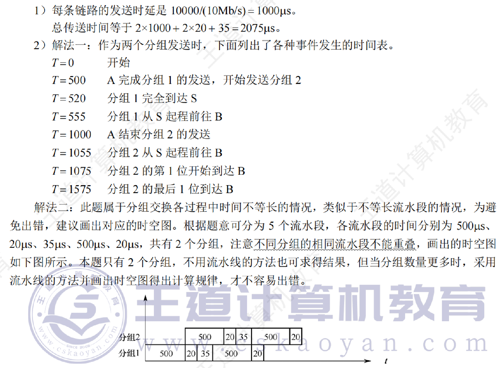

???+ example "question"
    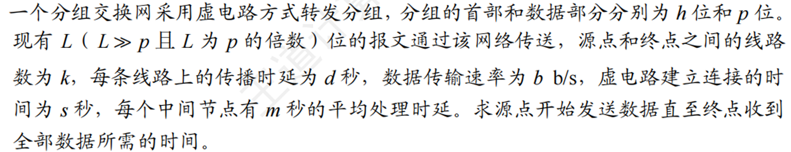

??? note "answer"
    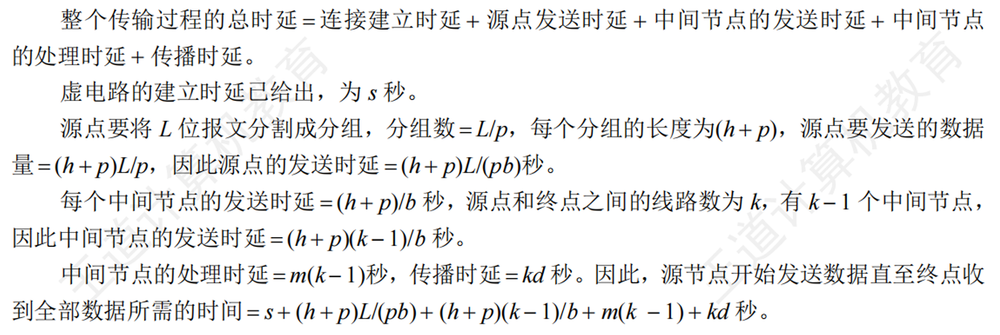

---