# Chapter 2 | 物理层

## 物理层接口特性

### 机械特性 (Mechanical Characteristics)

这部分定义了接口的物理结构。

1. 形状和尺寸：例如，规定RJ45接口的宽度、高度和外形。
2. 引脚数目和排列：规定接口有多少个引脚，以及它们的排列顺序。
3. 固定和锁定装置：规定如何将插头固定在插座上。

---

### 电气特性 (Electrical Characteristics)

这部分定义了信号在线缆上传输时的电气标准。

1. 信号电压的范围：规定在线缆上用多高的电压表示“1”，用多低的电压（或另一种电平）表示“0”。
2. 阻抗匹配：规定线缆的阻抗特性，以确保信号能有效传输并减少反射。
3. 传输速率：规定信号在线缆上的传输速率，例如100Mbps或1000Mbps。
4. 距离限制：规定了在信号衰减到不可识别之前，线缆的最大长度，例如普通网线的传输距离限制为100米。

---

### 功能特性 (Functional Characteristics)

这部分指明了接口的每一条线（每一个引脚）是用来做什么的。

规定各条信号线的作用：例如，在8芯网线中，哪几根线是用来发送数据的（TX+ / TX-），哪几根是用来接收数据的（RX+ / RX-），哪些可能在特定标准下是用于供电（PoE）或未被使用的。

---

### 过程特性 (Procedural Characteristics)

这部分定义了利用这些信号线进行通信时，一系列事件发生的先后顺序和时序关系。

规定信号间的时序关系：它描述了通信双方如何建立连接、如何传输数据、如何结束通信的完整过程。例如，在发送数据前，需要先在哪条线上发出一个请求信号，在另一条线上收到一个允许信号后，才能开始在数据线上发送比特流。

---

## 物理层下面的传输媒体

**传输媒体**是计算机网络设备之间的物理通路，也称为传输介质或传输媒介。

传输媒体并**不包含**在计算机网络体系结构中。

传输介质可分为：

1. 导向传输介质，指铜线或光纤等，电磁波被导向为沿固体介质传播；
2. 非导向传输介质，指自由空间(空气、真空或海水),电磁波在非导向传输介质中的传输称为无线传输。

---

### 导向型传输媒体

#### 双绞线 (Twisted Pair)

双绞线由两根采用一定规则并排绞合、相互绝缘的铜导线组成。

- 绞合可减少对相邻导线的电磁干扰；还能抵御部分来自外界的电磁干扰

**屏蔽双绞线**(STP)的外面还有一层金属丝编织成的屏蔽层，可以进一步提高抗电磁干扰的能力。

无屏蔽层的双绞线称为**非屏蔽双绞线**(UTP)。

双绞线的价格便宜，模拟传输和数字传输都可使用双绞线，通信距离一般为几千米到数十千米。双绞线的带宽取决于铜线的粗细和传输的距离。距离太远时，对于模拟传输，要用放大器放大衰减的信号；对于数字传输，要用中继器来对失真的信号进行整形。

!!! info
    100 BaseT 快速以太网使用的导向传输介质是双绞线。

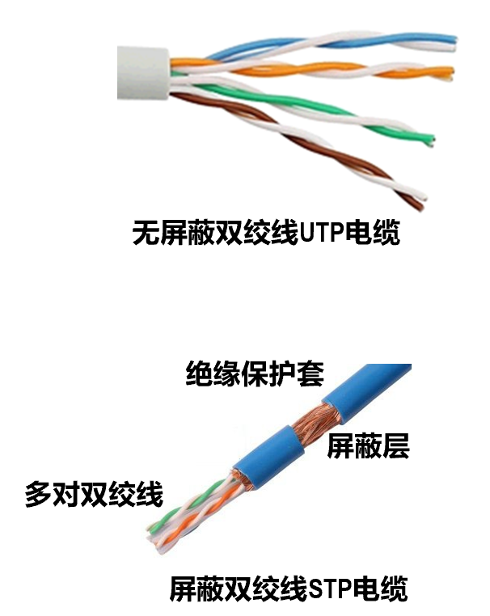

---

#### 同轴电缆 (Coaxial Cable)

同轴电缆由内导体、绝缘层、外导体屏蔽层和绝缘保护套层构成。

同轴电缆一般分为两类: 50Ω同轴电缆，主要用于传送基带**数字**信号，在早期局域网中应用广泛；75Ω同轴电缆，主要用于传送**宽带**信号，在有线电视系统中应用广泛。

因为外导体屏蔽层的作用，所以同轴电缆具有良好的**抗干扰**特性而被广泛用于传输**较高速率**的数据。

???+ example "question"
    利用一根同轴电缆互连主机构成以太网，则主机间的通信方式为()。

    A.全双工  B.半双工  C.单工  D.不确定

??? + note "answer"
    B

    传统以太网采用广播的方式发送信息，同一时间只允许一台主机发送信息，否则各主机之间就形成冲突，因此主机间的通信方式是半双工。

???+ example "question"
    同轴电缆比双绞线的传输速率更快，得益于()。
    
    A.同轴电缆的铜芯比双绞线粗，能通过更大的电流
    
    B.同轴电缆的阻抗比较标准，减少了信号的衰减
    
    C.同轴电缆具有更高的屏蔽性，同时有更好的抗噪声性
    
    D.以上都正确

??? note "answer"
    同轴电缆以硬铜线为芯，外面包一层绝缘材料，绝缘材料的外面再包一层密织的网状导体，导体的外面又覆盖一层保护性的塑料外壳。这种结构使得它具有更高的屏蔽性，从而既有很高的带宽，又有很好的抗噪性。因此，同轴电缆的带宽更高得益于它的高屏蔽性。

    高屏蔽性 → 外部噪声被阻挡 → 噪声功率N极低 → 信噪比S/N极高 → 根据香农公式，最大数据传输速率C更高。

---

#### 光纤 (Optical Fiber)

光纤通信是指利用光导纤维(简称光纤)传递光脉冲来进行通信。有光脉冲表示1,无光脉冲表示0。可见光的频率约为 $10^8$ MHz,因此一个光纤通信系统的传输带宽**远大于**目前其他各种传输媒体的带宽。

光纤主要由纤芯和包层构成,纤芯很细，直径仅为8～100μm,包层较纤芯有较低的折射率，光波通过纤芯进行传导。当光线从高折射率的介质射向低折射率的介质时，其折射角将大于入射角。因此，只要入射角大于某个临界角，就会出现全反射，即光线碰到包层时就会折射回纤芯，这个过程不断重复，光也就沿着光纤传输下去。

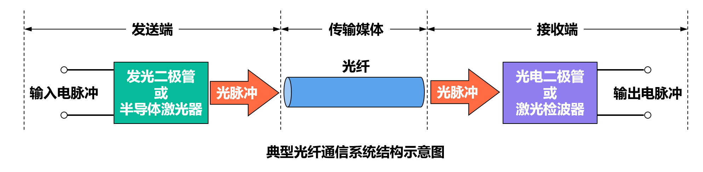

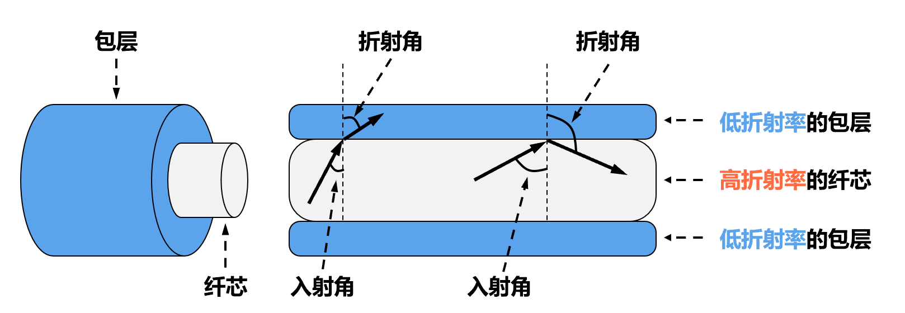

利用光的全反射特性，可让从不同角度入射的多条光线在一根光纤中传输，这种光纤称为多模光纤。光脉冲在多模光纤中传输的损耗更高，因此较适合**近**距离传输。

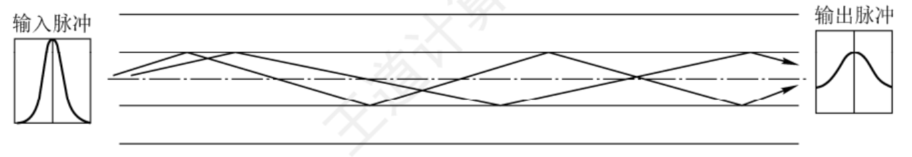

当光纤的直径减小到只有一个光的波长时，光纤就像一根波导那样，可使光线一直向前传播，而不产生多次反射，这样的光纤就是单模光纤。单模光纤的纤芯很细，直径只有几微米，制造成本较高。同时，单模光纤的光源是定向性很好的半导体激光器，因此单模光纤的衰减较小，可传输数千米甚至数十千米而不必采用中继器，适合**远**距离传输。

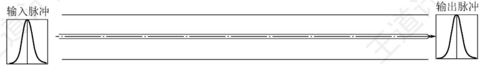

**光纤的优点**

- 通信容量非常大
- 抗雷电和电磁干扰性能好
- 传输损耗小，中继距离长
- 无串音干扰，保密性好
- 体积小，重量轻

**光纤的缺点**

- 切割光纤需要较贵的专用设备
- 目前光电接口还比较昂贵

???+ example "question"
    以下关于单模光纤的说法中，正确的是()。
    
    A.光纤越粗，数据传输速率越高
    
    B.若光纤的直径减小到只有光的一个波长大小，则光沿直线传播
    
    C.光源是发光二极管或激光
    
    D.光纤是中空的

??? note "answer"
    B

    A. 光纤越粗，允许存在的“模式”（路径）就越多，模式色散就越严重，信号在长距离传输后就会变得模糊不清，这反而限制了数据传输速率。

    C. 这个说法错在**或**字上。发光二极管产生的光比较发散，通常用于纤芯较粗的多模光纤。激光产生的光非常集中、方向性好，且波长单一（光谱窄），适合用于单模光纤。

    D. 标准的光纤是实心的。它的工作原理是全内反射，光纤由两部分实心玻璃构成，纤芯是中心的、折射率稍高的玻璃，是光主要传播的区域；包层是包裹在纤芯外层的、折射率稍低的玻璃。光之所以能被“囚禁”在纤芯里不断向前传播，就是因为它在“纤芯”和“包层”的边界上发生了全内反射，像镜子一样被反射回了纤芯内部。这个原理成立的前提就是，纤芯和包层都是实心的，并且有不同的折射率。如果是中空的，就无法形成这种传统的全内反射结构。

---

### 非导向型传输媒体

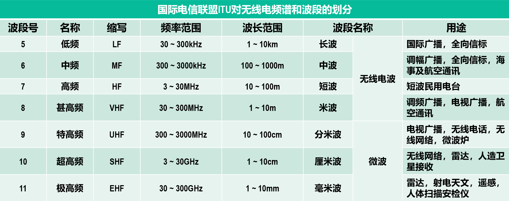

#### 无线电波

无线电波具有较强的穿透能力，可以传输很长的距离，因此广泛用于通信领域，如无线手机通信、计算机网络中的无线局域网(WLAN)等。

因为无线电波使信号向所有方向散播，所以有效距离范围内的接收设备**无须对准某个方向**，就可与无线电波发射者进行通信连接，大大简化了通信连接。这也是无线电波传输的最重要优点之一。

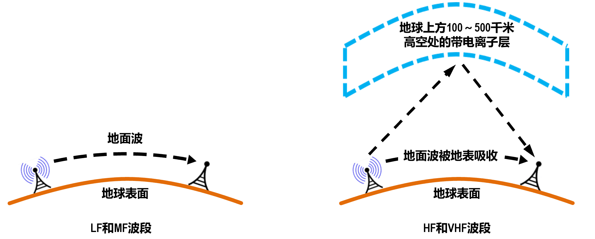

---

#### 微波、红外线和激光

目前高带宽的无线通信主要使用三种技术：微波、红外线和激光，它们都需要在发送方和接收方之间有一条视线通路，有很强的指向性。不同的是，红外线通信和激光通信将要传输的信号分别转换为各自的信号格式，即红外线信号和激光信号，再直接在空间中传播。

微波通信的频率较高，频段范围也很宽，载波频率通常为2～40GHz,因此通信信道的容量大。与通常的无线电波不同，微波通信的信号是沿**直线**传播的，因此在地面上的传播距离有限，超过一定距离后就要使用中继站来接力。

卫星通信利用**地球同步卫星**作为**中继站**来转发微波信号，可以突破地面微波通信距离的限制。三颗相隔120°的同步卫星几乎就能覆盖整个地球表面，因此基本能实现全球通信。卫星通信的优点是通信容量大、距离远、覆盖广，缺点是成本高、受气候影响大、保密性差、误码率较高、保密性差、端到端传播时延长。

!!! info
    我们平常使用的 Wi-Fi 是利用微波进行通信的。

---

## 传输方式

### 串行传输和并行传输

数据传输方式分为串行传输和并行传输。

- **串行传输**是指逐比特地按序依次传输，适用于长距离通信，如计算机网络。
- **并行传输**是指若干比特通过多个通信信道同时传输，适用于近距离通信，常用于计算机内部，如CPU与主存之间。

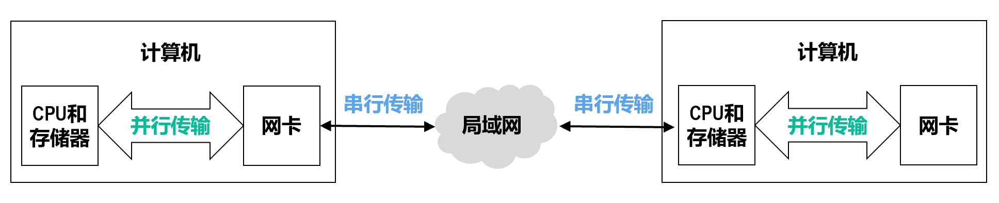

---

### 同步传输和异步传输

#### 同步传输

要求发送方和接收方在数据传输过程中保持时钟信号的同步。也就是说，双方必须在同一时间单位内对数据进行发送和接收，这样才能正确识别每一个比特。

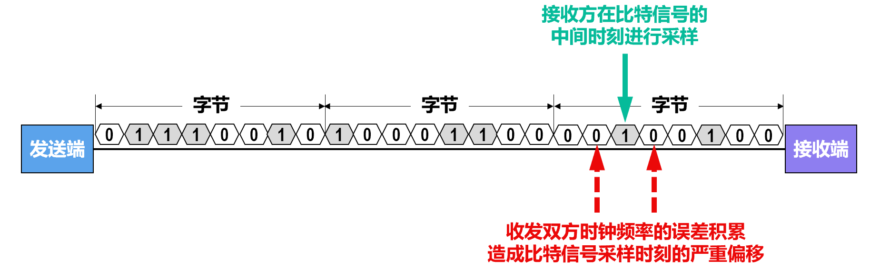

**收发双方时钟同步的方法**

- 外同步：在收发双方之间增加一条时钟信号线。
- 内同步：发送端将时钟信号编码到发送数据中一起发送（例如曼彻斯特编码）。

---

#### 异步传输

数据以字符（通常是字节）为单位进行传输。每个字符的传输是独立的，字符之间的时间间隔可以不固定。

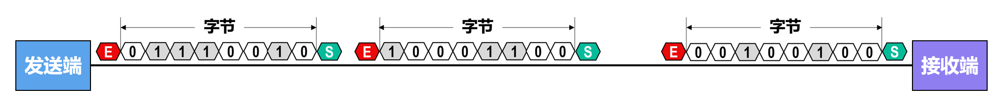

- 字节之间异步，即字节之间的时间间隔不固定。
- 字节中的每个比特仍然要同步，即各比特的持续时间是相同的。

---

### 单向通信、双向交替通信和双向同时通信

从通信双方信息的交互方式看，可分为三种基本方式：

1. 单向通信。只有一个方向的通信而没有反方向的交互，如无线电广播、电视广播等。
2. 半双工通信。通信双方都可发送或接收信息，但任何一方都不能同时发送和接收信息，如对讲机等。
3. 全双工通信。通信双方都可同时发送和接收信息，如电话通信等。

单向通信只需一个信道，而半双工通信或全双工通信都需要两个信道，每个方向一个信道。

---

## 编码与调制

### 编码与调制的基本概念

通信的目的是传输**信息**，如文字、图像和视频等。

**数据**是指传送信息的实体。（也就是二进制）

**信号**则是数据的电气或电磁表现，是数据在传输过程中的存在形式。

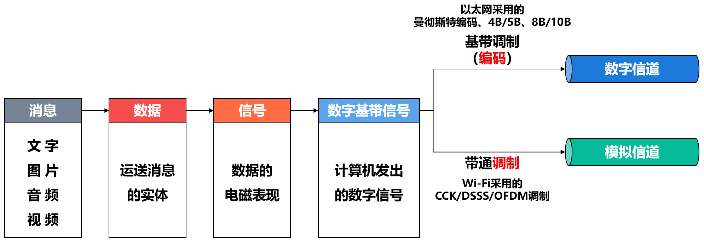

将数据转换为数字信号的过程称为**编码**，将数据转换为模拟信号的过程称为**调制**。

数据和信号都有模拟或数字之分：①模拟数据(或模拟信号)的取值是连续的；②数字数据(或数字信号)的取值是离散的。

在通信系统中，常用一个固定时长的**信号波形**表示一个k进制数，这个时长内的信号称为**码元**(可称k进制码元),而该时长称为**码元宽度**(也称**信号周期**)。1码元可携带若干比特的信息量。

---

### 常用编码方式

编码的规则有很多种，只要能够有效区分 0 和 1 就行。

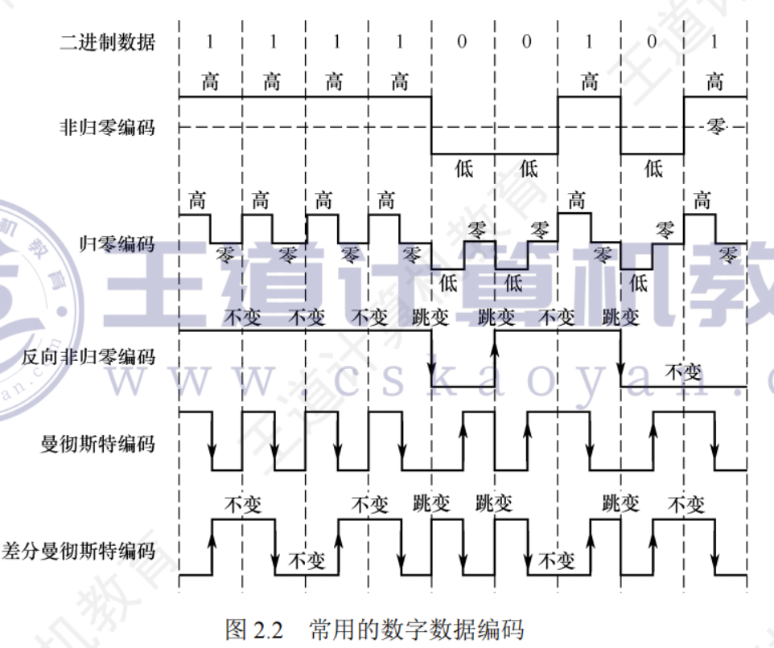

1. **归零(RZ)编码**。用高电平表示1、低电平表示0(或者相反),每个码元的**中间均跳变到零电平**(归零),接收方根据该跳变调整本方的时钟基准，这就为收发双方提供了自同步机制。因为归零需要占用一部分带宽，所以传输效率受到了一定的影响。
2. **非归零(NRZ)编码**。与RZ编码的区别是不用归零，一个时钟全部用来传输数据，编码效率最高。但NRZ编码的收发双方存在**同步**问题，为此需要双方都带有时钟线。
3. **反向非归零(NRZI)编码**。与NRZ编码的区别是用电平的跳变表示0、电平保持不变表示1。跳变信号本身可作为一种通知机制。这种编码方式集成了前两种编码的优点，既能传输时钟信号，又能尽量不损失系统带宽。
4. **曼彻斯特编码**。每个码元的中间都发生电平跳变，**电平跳变**既作为**时钟信号**(用于同步),又作为**数据信号**。可用向下跳变表示 1、向上跳变表示 0，或者采用相反的规定。
5. **差分曼彻斯特编码**。每个码元的中间都发生电平跳变，与曼彻斯特编码不同的是，电平跳变仅表示时钟信号，而不表示数据。数据的表示在于每个码元开始处是否有电平跳变：无跳变表示1,有跳变表示0。差分曼彻斯特编码拥有**更强的抗干扰能力**。

!!! note
    在传输大量连续1或连续0的情况下，差分曼彻斯特编码信号比曼彻斯特编码信号的变化少。

    在噪声干扰环境下，检测有无跳变比检测跳变方向更不容易出错，因此差分曼彻斯特编码信号比曼彻斯特编码信号更易于检测。

    在传输介质接线错误导致高低电平翻转的情况下，差分曼彻斯特编码仍然有效。

标准以太网使用的就是曼彻斯特编码，而差分曼彻斯特编码则被广泛用于宽带高速网中。

??? note "为什么标准以太网不用差分曼彻斯特编码？"
    1. **实现复杂度**：差分曼彻斯特编码的解码电路比曼彻斯特编码更复杂，早期以太网设备对硬件成本和实现难度非常敏感，曼彻斯特编码更易于实现和推广。

    2. **标准历史**：以太网标准（IEEE 802.3）最初制定时，曼彻斯特编码已经广泛应用且技术成熟，优先考虑了兼容性和普及性。

    3. **性能需求**：曼彻斯特编码已经能很好地满足以太网的抗干扰、同步和传输距离等需求，差分曼彻斯特编码的额外优势（如更强抗干扰能力）在标准以太网场景下并非刚需。

    4. **带宽利用率**：两者的带宽利用率相近，曼彻斯特编码已经能保证足够的效率。

??? example "一些PPT例题"
    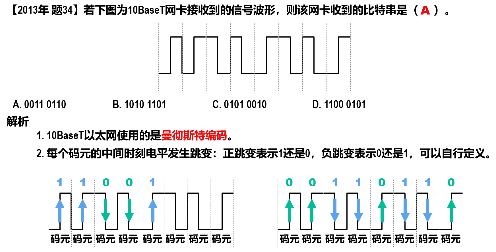

    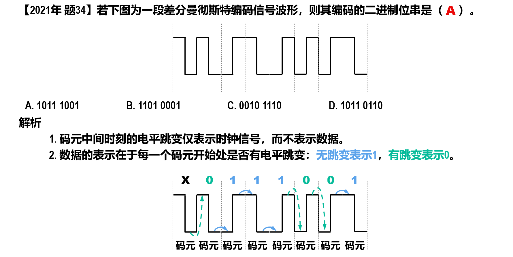

---

### 基本的带通调制方法和混合调制方法

#### 基本的带通调制方法

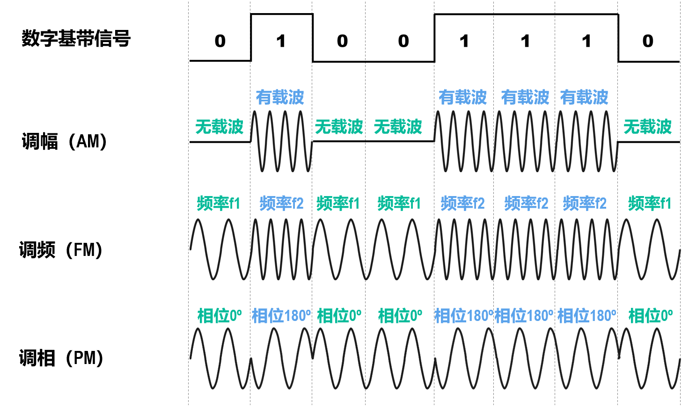

使用基本调制方法，1个码元只能包含1个比特信息。

1. **调幅**(AM)或幅移键控(ASK)。通过改变载波的振幅来表示数字信号1和0。例如，用有载波和无载波输出分别表示1和0。这种方式比较容易实现，但抗干扰能力差。
2. **调频**(FM)或频移键控(FSK)。通过改变载波的频率来表示数字信号1和0。例如，用频率f和频率f₂分别表示1和0。这种方式容易实现，抗干扰能力强，目前应用较广泛。
3. **调相**(PM)或相移键控(PSK)。通过改变载波的相位来表示数字信号1和0。例如，用相位0和π分别表示1和0，是一种绝对调相方式。
4. 与PSK不同，DPSK(**差分相移键控**)是一种相对调相方式，它通过检测当前码元与前一个码元的载波相位差来传输数字信息。例如，使用相位有无变化分别表示1和0。

---

#### 混合调制方法

因为载波的**频率**和**相位**是相关的，即频率是相位随时间的变化率，所以载波的频率和相位不能进行混合调制。通常情况下，载波的相位和振幅可以结合起来一起调制，例如正交振幅调制QAM。

**正交幅度调制**(QAM)。在频率相同的前提下，将AM与PM结合起来，形成叠加信号。

> **通过对两个相互正交（相位相差90度）的载波，分别进行振幅调制，然后将它们叠加在一起进行传输的一种高级调制技术。**

???+ question
    每个码元与4个比特的对应关系可以随便定义吗？

??? note "answer"
    如果随便定义，通信系统的抗干扰能力会变得极差，效率极低。

    在实际通信中，信号会受到各种噪声和干扰。接收端收到的信号点可能不会完美地落在A点上，而是落在A点附近的一个模糊区域里。**最常见的错误**，就是接收端把本应是A点的信号，误判成了它**物理位置上最接近的邻居B**。最糟糕的情况是仅仅一个微小的物理位置偏移，就导致了解码出的比特**全部出错**！这种“小错误引发大灾难”的情况是我们极力要避免的。

    因此，比特的分配方式必须经过精心设计，使得**物理位置上相邻的码元（符号），其对应的比特组合也应该尽可能相似**。而实现这一目标的最佳方式，就是**格雷码 (Gray Code)**。

---

## 信道的极限容量

### 造成信号失真的主要因素

1. 码元的传输速率。传输速率越高，信号经过传输后的失真就越严重。
2. 信号的传输距离。传输距离越远，信号经过传输后的失真就越严重。
3. 噪声干扰。噪声干扰越大，信号经过传输后的失真就越严重。
4. 传输媒体的质量。传输媒体质量越差，信号经过传输后的失真就越严重。

**信道上传输的数字信号，可以看做是多个频率的模拟信号进行多次叠加后形成的方波。**

**“期望得到的数字信号”**：这就是我们的目标——一个完美的方波。它有平坦的顶部和底部，以及几乎垂直的陡峭边缘。

**“基波 (Fundamental Wave)”**：这是我们能找到的**第一块积木**。它是一个频率与方波完全相同的正弦波。

但是只用“基波”这一块积木，搭出来的形状（虚线）和我们想要的完美方波（实线）**差别很大**。它的高度和时间节奏是对的，但外形太圆滑了，完全没有方波“棱角分明”的特征。

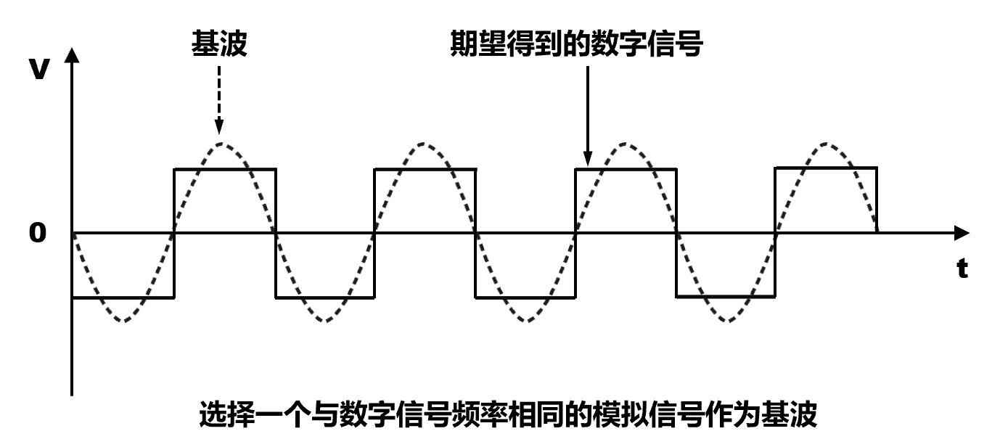

为了让我们的波形更加**接近方波**，我们需要添加更多、更小的积木来填充那些圆滑的边角。

**“3次谐波 (3rd Harmonic)”**：这就是我们新加入的**小号积木**。它的特点是：频率是基波的3倍，振幅（高度）更小。我们将“基波”（大积木）和“3次谐波”（小积木）**叠加在一起**。

观察叠加后的实线波形，**它比单纯的基波更接近方波了！** 它的顶部开始变得平坦，两侧的边缘也开始变得陡峭。

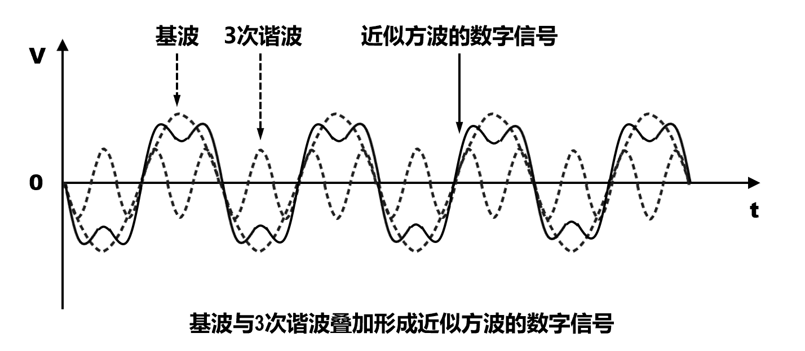

**“高度近似的数字信号”**：这就是我们叠加了**许多许多**谐波之后得到的结果。您可以看到，它已经非常接近完美的方波了，只是在边缘处还有一些微小的“涟漪”或“振铃”（这被称为吉布斯现象）。理论上，只有叠加**无穷多个**谐波，这些涟漪才会彻底消失。

**小结：一个“干净”的数字方波信号，其本质是由无数个不同频率的正弦波（基波+高频谐波）构成的。频率越高的谐波，负责勾勒出方波越陡峭的边缘细节。**

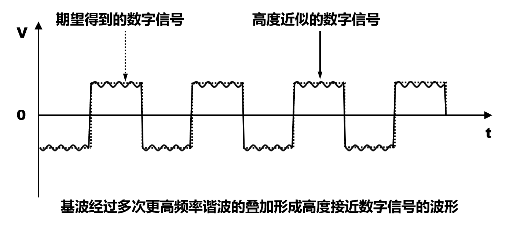

??? note "原理"
    **傅里叶分析原理**：法国数学家傅里叶发现一个惊人的事实：**任何周期性波形（包括完美的方波），都可以看作是由一个基波和无数个更高频率的谐波（3次、5次、7次…无穷无尽）叠加而成的。**

    那么为什么一定是 3， 5， 7次呢？

    答案的核心在于两个字：**对称性 (Symmetry)**。

    首先，我们仔细观察一下我们想要构建的理想方波。它有一种非常特殊的对称性，叫做**半波对称**或**奇对称**。这是什么意思呢？

    > 如果截取方波的**前半个周期**（例如上图中0到T/2的部分，即那个凸起的“正”半部分），然后把它**上下翻转180度**，你会发现它和**后半个周期**（T/2到T的部分，即凹下去的“负”半部分）的形状**完全一样**。这个“上下翻转后完美重合”的特性，就是我们必须保持的**核心对称性**。

    * **基波 (1次谐波)**：它是一个标准正弦波。它的前半部分（正半轴）上下翻转后，和后半部分（负半轴）完全一样。**（满足对称性）**

    * **3次谐波**：它的频率是基波的3倍。在一个基波周期内，它会完成3个完整的振荡。您会发现，它整体来看，前半周期（0到T/2）的波形上下翻转后，也和后半周期（T/2到T）完全一样。**（满足对称性）**

    * **5次、7次谐波...**：所有奇数次谐波都拥有这个完美的半波对称特性。
    
    * **2次谐波**：它的频率是基波的2倍。在一个基波周期内，它会完成2个完整的振荡。在基波的前半个周期（0到T/2），2次谐波自己完成了一个完整的“上凸下凹”周期。在基波的后半个周期（T/2到T），它**又重复了一遍**一模一样的“上凸下凹”周期。它的后半段波形，是前半段的**简单重复**，而**不是上下翻转**！因此，2次谐波**不具备**我们方波所需要的那种半波对称性。4次、6次等所有偶数次谐波都存在同样的问题。

    这在数学上，是通过傅里叶级数展开的积分计算得出的。计算结果表明，对于一个理想方波，所有偶数次谐波的系数（振幅）都恰好为零，因此它们在合成中不占任何比重。您所观察到的现象，正是这个深刻数学原理的直观体现。

如果数字信号中的高频分量在传输时受到衰减甚至不能通过信道，则接收端接收到的波形前沿和后沿就变得不那么陡峭，每一个码元所占的时间界限也不再明确。这样，在接收端接收到的信号波形就失去了码元之间的清晰界限，这种现象称为**码间串扰**。

??? note "码间串扰的详细解释"
    **码间串扰 (ISI) 的本质就是：** 前一个信号码元（比如代表“1”的脉冲）由于传输过程中的拖尾和展宽，其能量“泄露”或“侵占”到了后一个码元的时间段内，对后一个码元的识别造成了干扰。

    为什么信号会“拖尾”和“展宽”呢？主要有两个原因：

    **1. 有限的信道带宽**这是最根本的原因。一个完美的方波脉冲需要无限的带宽来传输。但所有现实中的信道（网线、光纤、无线空间）带宽都是有限的。这个有限的信道就像一个过滤器，会“砍掉”信号中对于维持陡峭边缘至关重要的高频成分。失去了高频成分，信号脉冲在时间上就不再是“瘦高个”，而是变成了一个“矮胖子”——它的形状会**展宽 (Dispersion)**，能量会向前后扩散。这个“矮胖子”自然就更容易侵占到邻居的地盘里。

    **2. 多径传播 (Multipath Propagation)**这在无线通信（如Wi-Fi, 5G）中非常常见。您手机发出的信号并不仅仅是直线到达路由器。它会经过多条路径：一部分直接到达（最快），一部分撞到墙壁、天花板、家具后再反射到达（稍慢），还有一部分可能经过多次反射才到达（更慢）。这就导致接收端在不同时刻收到了同一个信号的多个“副本”（就像回声）。前一个码元的“回声”就会叠加在当前码元上，形成干扰。

    码间串扰如何导致错误？

    为了理解这一点，我们需要知道接收端是如何工作的。接收端的工作很简单：它会在**每个码元规定时间段的正中心**进行一次“快照”（采样），测量此刻的信号电压。如果电压高于一个门限值（比如0.5V），就判决为“1”。如果电压低于门限值，就判决为“0”。

    假设我们要传输 `101` 这三个比特。

    * **理想情况**：在第二个时间段的中心采样时，由于发送的是“0”，电压应该是0V。接收端准确判决为“0”。

    * **现实情况（有ISI）**：第一个“1”的脉冲展宽了，它的“正能量尾巴”延伸到了第二个时间段。第三个“1”的脉冲也展宽了，它的“正能量前锋”也可能提前影响到第二个时间段。于是，在第二个时间段中心采样时，本来应该是0V的电压，被前后两个“1”的“拖尾”和“前锋”给**抬高**了。如果这个被抬高的电压不幸超过了0.5V的门限，接收端就会**错误地**把它判决为“1”！一个**比特错误 (Bit Error)** 就这样发生了。

    如何观察和解决码间串扰？

    **1. 观察工具：眼图 (Eye Diagram)**工程师们使用一种叫“眼图”的工具来直观地评估码间串扰的严重程度。它将信号的许多片段叠加在一起显示。

    * **“眼睛”睁得越大**：表示在采样时刻，代表“1”的电平和代表“0”的电平区分得非常清晰，信号质量好，码间串扰小。

    * **“眼睛”睁得越小（甚至闭合）**：表示“1”和“0”的电平界限模糊，信号质量差，码间t串扰严重，误码率会非常高。

    **2. 解决方法**码间串扰是通信工程中永恒的课题，主要有两大类解决思路：

    * **发送端 - 脉冲成形 (Pulse Shaping)**：既然方波“太霸道”容易干扰邻居，我们就不发送方波了。我们主动把脉冲整形成一种“更懂礼貌”的形状（如升余弦滚降波形），这种波形的特点是：在它自己的采样中心点达到峰值，而在**所有其他邻居的采样中心点，它的值正好为零**！这样就不会对邻居的判决造成干扰。

    * **接收端 - 均衡 (Equalization)**：在接收端加一个“反向滤波器”（均衡器），它的作用是补偿信道带来的失真。均衡器试图“逆转”信道对信号造成的展宽效应，把“矮胖子”信号尽可能地恢复成“瘦高个”。

如果信道的**频带越宽**，则能够通过的信号的**高频分量就越多**，那么**码元的传输速率就可以更高**，而不会导致码间串扰。

然而，信道的频率带宽是有上限的，不可能无限大。因此，码元的传输速率也**有上限**。

---

### 奈氏准则

奈奎斯特定理规定:在理想**低通**(没有噪声、带宽有限)**信道**中，为了避免码间串扰，极限码元传输速率为 2W 波特，其中 W 是信道的频率带宽(单位为 Hz)。

$$\text{理想低通信道的最高码元传输速率} = 2W Baud = 2W \text{ 码元/秒}$$

!!! info
    要注意 $2W$ 算出来的是**码元传输速率**，而不是**信息传输速率**。也就是说， $2W$ 算出来的单位是**波特 (Baud)**。

- 使用奈氏准则给出的公式，就可以根据信道的频率带宽，计算出信道的最高码元传输速率。
- 只要码元传输速率不超过根据奈氏准则计算出的上限，就可以避免码间串扰。
- 奈氏准则给出的是理想低通信道的最高码元传输速率，它和实际信道有较大的差别。因此，一个实际的信道所能传输的最高码元传输速率，要明显低于奈氏准则给出的上限值。
- 奈氏准则给出了码元传输速率的限制，但并未限制信息传输速率，即未对一个码元最多可以携带多少比特给出限制。

码元传输速率又称为**波特率**、调制速率、波形速率或符号速率。

波特率与比特率有一定的关系：

$$\text{比特率} = \text{波特率} \times \text{每个码元携带的比特数}$$

???+ example "question"
    有一个无噪声的8kHz信道，每个信号包含8级，每秒采样24k次，那么可以获得的最大传输速率是()。
    
    A.24kb/s  B.32kb/s  C.48kb/s  D.72kb/s

??? note "answer"
    8kHz信道的最高码元传输速率为 $2 \times 8000 = 16000$ 波特。

    每个码元携带的比特数为 $log_2(8) = 3$ 比特。

    因此，最大传输速率为 $16000 \times 3 = 48000$ b/s，即48kb/s，选C。

    注意题中给出的每秒采样 24kHz是无意义的，因为超过了波特率的上限 2W=16kBaud。

???+ example "question"
    一个信道每1/8s采样一次，传输信号共有16种变化状态，最大数据传输速率是()。
    
    A.16b/s  B.32b/s  C.48b/s  D.64b/s

??? note "answer"
    采样一次的时间间隔为1/8秒，因此码元传输速率为 $8$ 波特。

    每个码元携带的比特数为 $log_2(16) = 4$ 比特。

    因此，最大传输速率为 $8 \times 4 = 32$ b/s，选B。

---

### 香农公式

在实际的信道中会有噪声，噪声是随机产生的，其瞬时值有时会很大，这会影响接收端对码元的识别，并且噪声功率相对于信号功率越大，影响就越大。**也就是说码元携带越多的比特，不同的码元之间的差异也就越小，越容易被噪声干扰。**所以其实码元不能够携带任意多的比特。

实际的信道会有噪声，噪声是随机产生的。香农定理给出了**带宽受限**且有**高斯噪声**干扰的信道的极限数据传输速率，当用该速率传输数据时，不会产生误差。香农定理定义为

$$C = W \log_2(1 + \frac{S}{N}) \text{ 单位为 b/s}$$

- C：信道的极限信息传输速率（单位为b/s）
- W：信道的频率带宽（单位为Hz）
- S：信道内所传信号的平均功率
- N：信道内的高斯噪声功率
- S/N：信噪比

??? note "关于信噪比"
    **第一种：$S/N$ （公式里的信噪比）**这代表一个**纯粹的线性比值**，是一个“倍数”。它的意思是：“信号的功率**是**噪声功率的**多少倍**？”我们称它为**线性值 (Linear Value)**。

    **第二种：$SNR_{dB}$ （用分贝dB表示的信噪比）**这代表一个**对数等级**，是一个“级别”或“分数”。它把那个可能非常大或非常小的“倍数”关系，转换成一个更方便人们读写和计算的“等级”。我们称它为**分贝值 (Decibel Value)**。它的意思是：“信号功率比噪声功率高出了多少个‘等级’？”

    既然$S/N$这么直观，为什么工程师们还非要用一个看起来更复杂的dB呢？主要有两大好处：

    1.  **方便表示巨大或微小的范围**：在通信中，信号和噪声的功率差异可能极其悬殊。一个强信号的信噪比可能是 $S/N = 1,000,000$。一个淹没在噪声里的弱信号，信噪比可能是 $S/N = 0.000001$。用线性值来读写和比较这些数字非常不方便。但换算成dB后：$10 \log_{10}(1,000,000) = 60 \text{ dB}$，$10 \log_{10}(0.000001) = -60 \text{ dB}$

    2.  **简化计算**：当信号经过多个设备（如放大器、衰减器、电缆）时，每个设备都会对信噪比产生影响。如果用线性值，你需要进行连乘和连除，非常复杂。如果用dB值，你只需要进行**简单的加减法**。比如，经过一个增益为10dB的放大器，信噪比就增加10dB；经过一段损耗为3dB的电缆，信噪比就减去3dB。这极大地简化了工程计算。

    而**在香农公式 $C = W \log_2(1 + S/N)$ 中，必须、也只能使用第一种——线性的比值 $S/N$。**

信道的频率带宽W或信道中的信噪比S/N越大，信道的极限信息传输速率C就越高。实际信道不可能无限制地提高频率带宽W或信道中的信噪比S/N。

实际信道中能够达到的信息传输速率，要比香农公式给出的极限传输速率低不少。这是因为在实际信道中，信号还要受到其他一些损伤，例如各种脉冲干扰和信号衰减等，这些因素在香农公式中并未考虑。

??? question "一些PPT例题"
    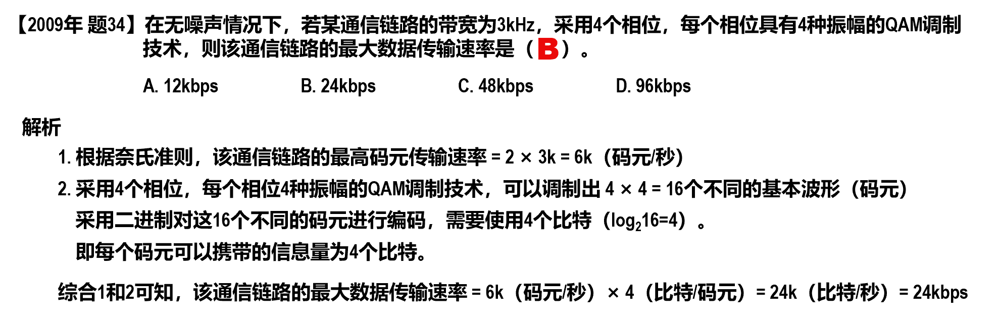

    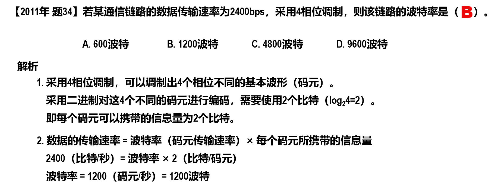

    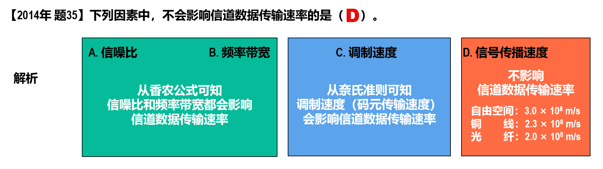

    - **数据传输速率** (Data Transmission Rate): 信道在单位时间内可以传输的数据总量（速率）。

    - **信号传播速度** (Signal Propagation Speed): 影响的是信号从发送端到接收端所需的时间（时延）。

    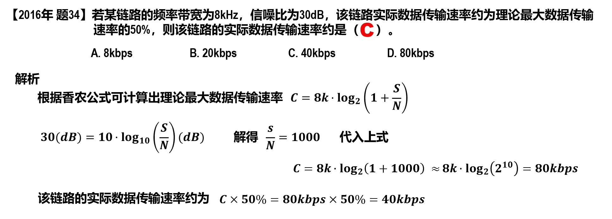

    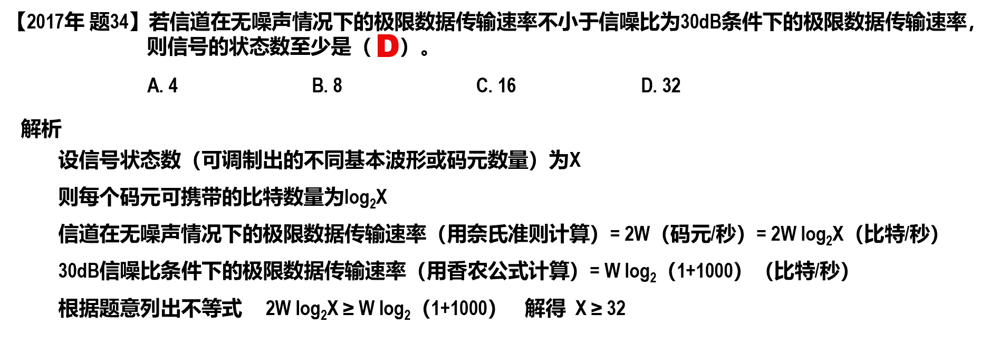

??? note "奈氏准则与香农公式的推导"
    奈氏准则和香农公式都是经过非常严谨的数学推导得出的理论定理。

    奈氏准则的推导是纯粹的信号处理数学，主要基于傅里叶变换和采样定理。其核心思想与我们之前讨论的**码间串扰**紧密相关。为了避免码间串扰，我们要求一个码元脉冲在它自己的抽样时刻达到峰值，而在**所有其他码元的抽样时刻，它的值必须正好为零**。数学家们发现，一种叫做**Sinc函数** ($\frac{\sin(x)}{x}$) 的波形，拥有完美的这种特性。它的频谱（频率成分）恰好是一个宽度为B的理想矩形（即占用的带宽恰好是B）。通过数学分析Sinc函数的波形，可以精确地计算出，要满足“在邻居的采样点上值为零”这个条件，每秒最多只能发送 $2B$ 个这样的Sinc脉冲。如果你试图发送得再快一点，这些脉冲就会“挤”在一起，峰值就会落到邻居的非零点上，从而产生码间串扰。

    所以，**$R_s = 2B$** 这个结论，是从理想脉冲波形（Sinc函数）的数学特性中**直接推导**出来的。

    对于香农公式，香农首先认识到，噪声的存在使得信号的电平变得不确定。比如，你发送一个1V的信号，由于噪声的随机叠加，接收端可能收到0.9V, 1.1V, 甚至1.2V。信噪比 ($S/N$) 决定了我们能在多大程度上“看清”信号。如果信号功率(S)远大于噪声功率(N)，那么即使有噪声干扰，我们也能清晰地分辨出许多个不同的信号等级。反之，如果信号被噪声淹没，我们可能连两个等级都分不清。香农天才地将“信息”与“不确定性的消除”联系起来。他通过极其复杂的数学证明，推导出一个信道能够承载的最大信息量，恰好与它的带宽 $B$ 以及信噪比 $S/N$ 有关。公式中的 $\log_2(1 + S/N)$ 这一部分，可以直观地理解为：在给定的信噪比下，每个信号码元**最多可以携带多少个比特的信息**。再乘以奈氏准则启示的每秒可发送的码元数量（与带宽 $B$ 成正比），就得到了最终的极限信息速率 $C$。

???+ example "question"
    二进制信号在信噪比为127:1的4kHz信道上传输，最大数据传输速率可以达到()。
    
    A.28000b/s  B.8000b/s  C.4000b/s  D.无限大

??? note "answer"
    根据香农定理，最大数据率 C = W log₂(1 + S/N) = 28000 b/s，很容易误选。

    注意题目中的“二进制信号”的限制后，依据奈奎斯特定理，最大数据传输速率 = 2W $log_2$(M) = 8000 b/s。

    两个当中取小的，选B。

???+ example "question"
    一个信道的信号功率是0.14W,噪声功率是0.02W,频率范围为3.5～3.9MHz,则该信道的最高数据传输速率是()。
    
    A.1.2Mb/s  B.2.4Mb/s  C.11.7Mb/s  D.23.4Mb/s

??? note "answer"
    **频率带宽** W = 3.9MHz - 3.5MHz = 0.4MHz = 400000Hz。

    信噪比 S/N = 0.14/0.02 = 7。

    根据香农定理，最高数据传输速率 C = W log₂(1 + S/N) = 400000 × log₂(8) = 1200000 b/s = 1.2Mb/s，选A。

---

## 信道复用技术

### 信道复用技术的基本原理

复用（Multiplexing）就是在**一条传输媒体**上**同时传输多路用户**的信号。

当一条传输媒体的传输容量大于多条信道传输的总容量时，就可以通过复用技术，在这条传输媒体上建立多条通信信道，以便**充分利用传输媒体的带宽**。

尽管实现信道复用会增加通信成本（需要复用器、分用器以及费用较高的大容量共享信道），但如果复用的**信道数量较大**，还是比较划算的。

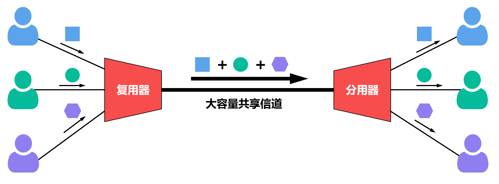

---

### 常见的信道复用技术

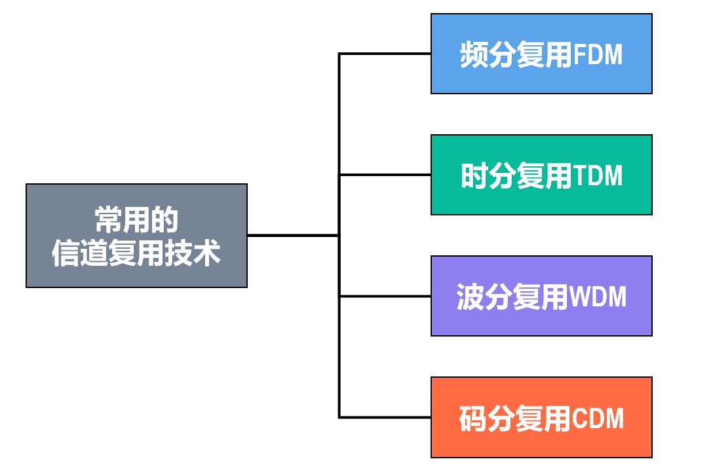

---

#### 频分复用(FDM)

频分复用的所有用户同时占用不同的频带资源并行通信。

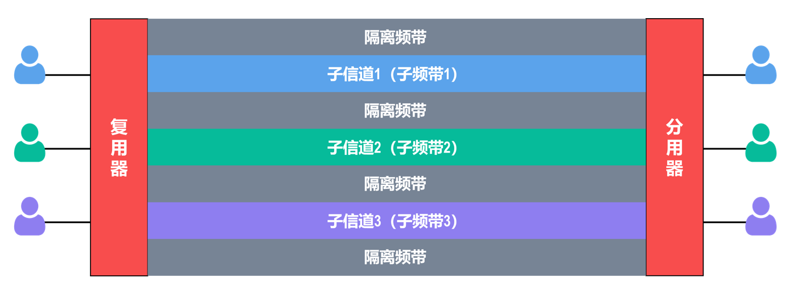

---

#### 时分复用(TDM)

时分复用的所有用户在不同的时间占用同样的频带。

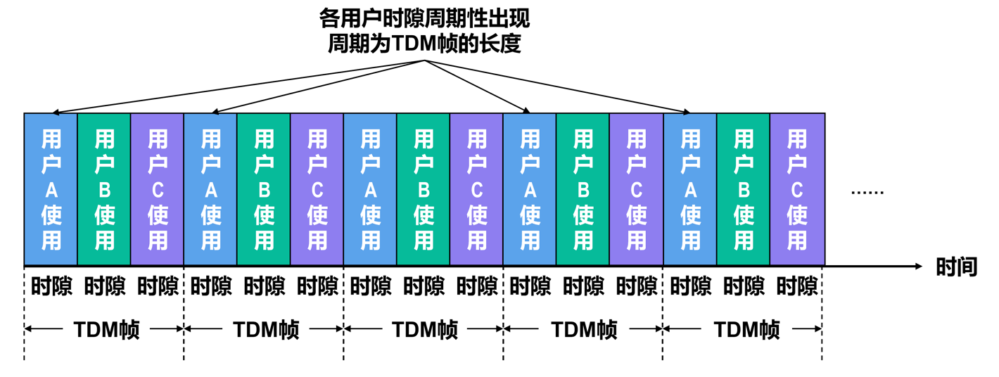

---

#### 波分复用(WDM)

**光**的频分复用FDM。根据频分复用的设计思想，可在一根光纤上**同时传输多个频率（波长）相近的光载波信号**，实现基于光纤的频分复用技术。

目前可以在一根光纤上复用80路或更多路的光载波信号。因此，这种复用技术也称为**密集波分复用DWDM**。

铺设光缆的工程耗资巨大，应尽量在一根光缆中放入尽可能多的光纤，然后对每一根光纤使用密集波分复用技术。

例如，在一根光缆中放入100根速率为2.5Gb/s的光纤，对每根光纤采用40倍的密集波分复用，则这根光缆的总数据速率为（2.5Gb/s × 40）× 100 = 10000Gb/s = 10Tb/s。

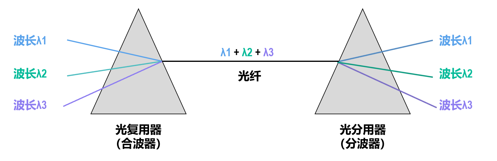

---

#### 码分复用(CDM)

码分复用（Code Division Multiplexing，**CDM**）常称为码分多址（Code Division Multiple Access，**CDMA**），它是在扩频通信技术的基础上发展起来的一种无线通信技术。

与FDM和TDM不同，CDMA的每个用户可以在**相同的时间使用相同的频带进行通信**。

CDMA最初用于军事通信，这种系统发送的信号有很强的抗干扰能力，其频谱类似于白噪声，不易被敌人发现。随着技术的进步，CDMA设备的价格和体积都大幅度下降，因而现在已广泛用于民用的移动通信中。

CDMA将每个比特时间划分为m个更短的时间片，称为**码片**（Chip）。m的取值通常为64或128。为了简单起见，在后续的举例中，我们假设m的取值为8。

CDMA中的**每个站点**都被指派一个**唯一**的m比特码片序列（Chip Sequence）。

- 某个站要发送比特1，则发送它自己的m比特码片**序列**；
- 某个站要发送比特0，则发送它自己的m比特码片序列的**反码**。

如果有两个或多个站同时发送数据，则信道中的信号就是这些站各自所发送一系列码片序列或码片序列反码的**叠加**。为了从信道中**分离**出每个站的信号，给每个站**指派码片序列**时，必须遵循以下规则：

1. 分配给每个站的码片序列必须**各不相同**，实际常采用伪随机码序列。
2. 分配给每个站的码片序列必须**相互正交**，即各码片序列相应的码片向量之间的**规格化内积为0**。

$$A \cdot B = \frac{1}{m} \sum_{i=1}^{m} A_i B_i = 0$$

而有以下性质：

$$A \cdot B = \frac{1}{m} \sum_{i=1}^{m} A_i B_i = 0$$

$$A \cdot \overline{B} = \frac{1}{m} \sum_{i=1}^{m} A_i \overline{B_i} = - \frac{1}{m} \sum_{i=1}^{m} A_i B_i = 0$$

$$A \cdot A = \frac{1}{m} \sum_{i=1}^{m} (A_i)^2 = \frac{1}{m} \sum_{i=1}^{m} (\pm 1)^2 = 1$$

$$A \cdot \overline{A} = \frac{1}{m} \sum_{i=1}^{m} A_i \overline{A_i} = - \frac{1}{m} \sum_{i=1}^{m} (A_i)^2 = -1$$

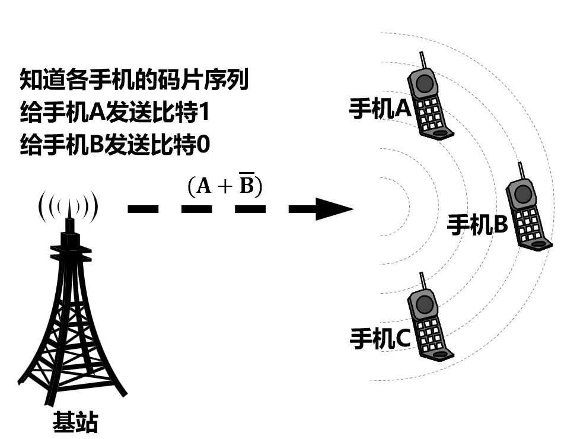

对于基站发的信号，根据自己的码片序列进行解码。只需要把该码片序列与接收到的信号进行**规格化内积**，就可以得到该基站发送的比特。

而再比如手机 C 想要解密共享链路内接受信号中的手机 A 的信号，只需要把手机 A 的码片序列与接收到的信号进行规格化内积，内积后的结果除以 m（码片数），如果结果为正，则判定为比特 1；如果结果为负，则判定为比特 0。这样，就可以得到手机 A 发送的比特。

??? note "为什么是用手机 A 的码片序列来解锁手机 A 发出的信号？"
    C接收，为什么不用C的码片序列？**核心思想**：码片序列是“身份证”或“专用语言”，而不是“收件箱的钥匙”。在CDMA系统中，分配给每个站点（A, B, C）的码片序列，其作用并**不是**用来解密自己收到的所有信息。相反，它的作用是：**作为一个独一无二的“身份标识符”或“专用语言”，附加在从该站点发出的每一比特数据上。**

    收到的混合信号其实是 `(A发的信号 + B发的信号 + C发的信号)`。所以这个计算实际上是：`(A发的 + B发的 + C发的) ⋅ A的码片序列`根据分配律，展开后就是：` (A发的 ⋅ A的) + (B发的 ⋅ A的) + (C发的 ⋅ A的) `由于正交性：`B发的 ⋅ A的`  →  结果为 0 （语言不通，被过滤掉）；`C发的 ⋅ A的`  →  结果为 0 （语言不通，被过滤掉）；`A发的 ⋅ A的`  →  **结果被保留并放大！**

    所以，当C想要解码A发送的数据时，它必须使用A的码片序列作为“过滤器”或“解码语言”，去和收到的混合信号做内积运算。这样才能准确地将A的信号从混合信号中分离出来，同时屏蔽掉B和C的信号干扰。

    所以说到这里你可以发现，其实发送规则就是，A 确定需要发送的内容后，将比特转换成数值，再用这个数值去乘自己的码片序列，得到最终发送的信号。因为最后解码时会再乘 A 的码片序列，所以 A 的码片序列会被乘两次，变成 1，从而恢复出原始比特。

??? question "一些PPT例题"
    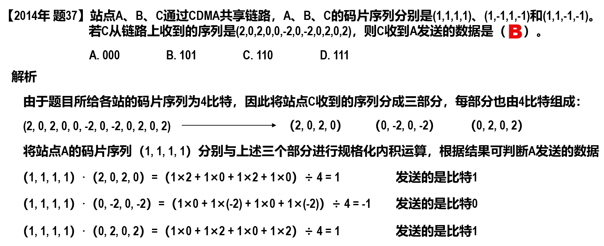

---