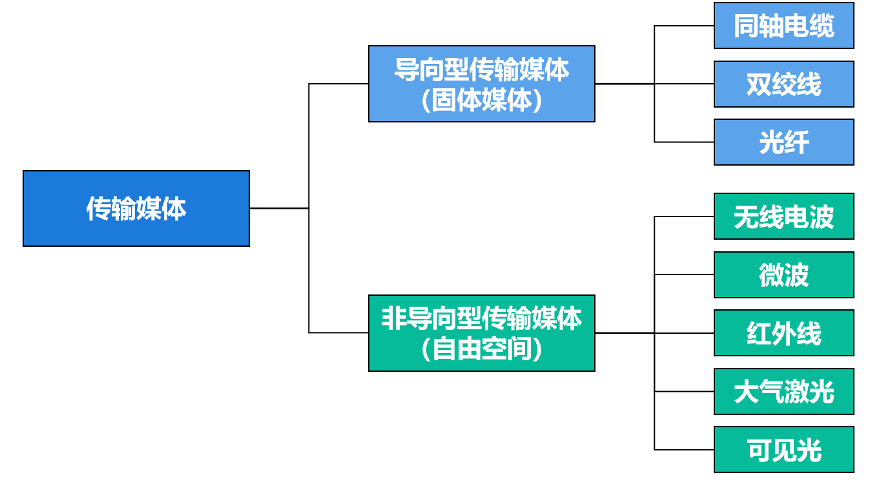
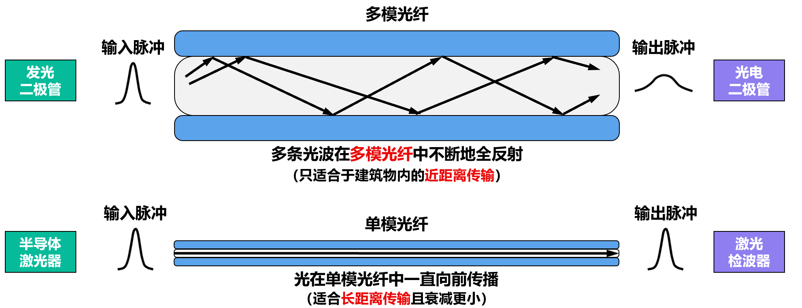

# Chapter 2

## 物理层

### 物理层接口特性

#### 机械特性 (Mechanical Characteristics)

这部分定义了接口的物理结构。

1. 形状和尺寸：例如，规定RJ45接口的宽度、高度和外形。
2. 引脚数目和排列：规定接口有多少个引脚，以及它们的排列顺序。
3. 固定和锁定装置：规定如何将插头固定在插座上。

---

#### 电气特性 (Electrical Characteristics)

这部分定义了信号在线缆上传输时的电气标准。

1. 信号电压的范围：规定在线缆上用多高的电压表示“1”，用多低的电压（或另一种电平）表示“0”。
2. 阻抗匹配：规定线缆的阻抗特性，以确保信号能有效传输并减少反射。
3. 传输速率：规定信号在线缆上的传输速率，例如100Mbps或1000Mbps。
4. 距离限制：规定了在信号衰减到不可识别之前，线缆的最大长度，例如普通网线的传输距离限制为100米。

---

#### 功能特性 (Functional Characteristics)

这部分指明了接口的每一条线（每一个引脚）是用来做什么的。

规定各条信号线的作用：例如，在8芯网线中，哪几根线是用来发送数据的（TX+ / TX-），哪几根是用来接收数据的（RX+ / RX-），哪些可能在特定标准下是用于供电（PoE）或未被使用的。

---

#### 过程特性 (Procedural Characteristics)

这部分定义了利用这些信号线进行通信时，一系列事件发生的先后顺序和时序关系。

规定信号间的时序关系：它描述了通信双方如何建立连接、如何传输数据、如何结束通信的完整过程。例如，在发送数据前，需要先在哪条线上发出一个请求信号，在另一条线上收到一个允许信号后，才能开始在数据线上发送比特流。

---

### 物理层下面的传输媒体

**传输媒体**是计算机网络设备之间的物理通路，也称为传输介质或传输媒介。

传输媒体并**不包含**在计算机网络体系结构中。

---