# Chapter 3 数据链路层

## 数据链路层概述

### 数据链路层在网络体系结构中所处的地位

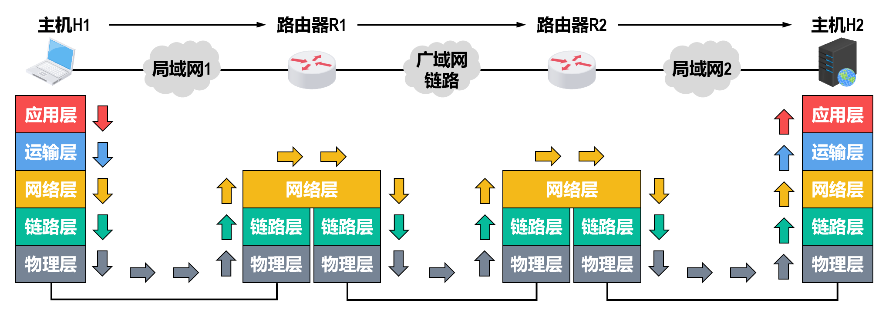

!!! info
    虽然在计算机网络中，发送信息时是通过主机层层封装数据并发送到物理介质上，但在学习中，为了简化，我们认为是数据链路层直接传送。

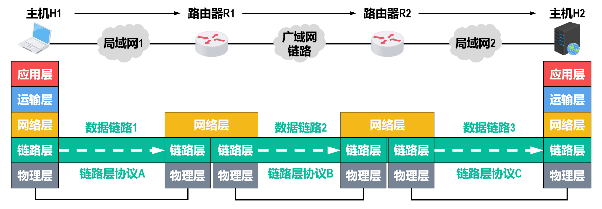

??? note "主机为什么已经要从局域网先到路由器才能到广域网链路"
    主机需要先通过局域网到达路由器，是因为路由器充当了局域网与广域网之间的“网关”。局域网内的主机只能直接通信于同一局域网内，而要访问广域网（如互联网）时，必须将数据包发送到路由器，由路由器负责转发到广域网链路。路由器具有不同网络之间的转发和寻址能力，能够根据目标地址选择合适的广域网链路进行转发。

    主机不能直接通过广域网发送数据，是因为广域网（如互联网）通常不直接连接终端主机，而是连接各个网络（如局域网、运营商网络等）。主机需要通过路由器或网关设备，将数据从局域网转发到广域网。路由器负责地址转换、路由选择和安全管理，确保数据能够正确、安全地到达广域网中的目标。没有路由器，主机无法与广域网建立直接通信。

---

### 链路、数据链路和帧

**链路**（Link）是指从一个节点到相邻节点的一段物理线路（有线或无线，例如网线、光纤、无线信号等），而**中间没有任何其他的交换节点**。比如主机和路由器之间的网线，就是一条链路。

**数据链路**（Data Link）是在链路的基础上，加上了控制数据传输的协议和硬件/软件。比如**网卡**和**驱动程序**，它们负责把数据按照一定的规则封装、校验、发送和接收。数据链路层保证数据能可靠地在一条链路上传输。

**计算机中的网络适配器**（俗称**网卡**）和其相应的**软件驱动程序**就实现了这些协议。**一般的网络适配器都包含了物理层和数据链路层这两层的功能。**

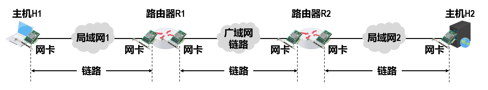

**帧**（Frame）是**数据链路层**对等实体之间在水平方向进行逻辑通信的**协议数据单元PDU**。每次发送的数据都会被封装成一个帧，里面包含了数据和控制信息（如地址、校验码等）。数据链路层的设备（如网卡）之间就是通过帧来通信的。

---

## 数据链路层的三个重要问题

**封装成帧**

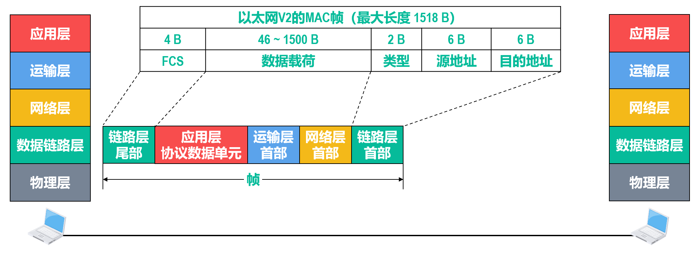

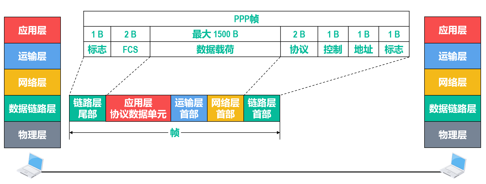

**透明传输**

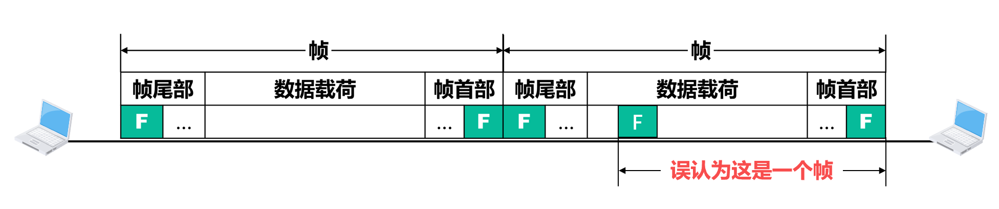

如果不解决上述问题，则数据链路层就会对上层交付的PDU的内容有所限制，即PDU中不能包含帧定界符。显然，这样的数据链路层没有什么应用价值。如果能够采取措施，使得数据链路层对上层交付的PDU的内容没有任何限制，就好像数据链路层不存在一样，就称其为**透明传输**。

**差错检查**

例如 PPP 帧上的 FCS(Frame Check Sequence)，用于检测数据在传输过程中是否出错。

**不可靠传输服务**：直接丢弃有误码的帧

**可靠传输服务**：实现发送方发送什么，接收方最终都能正确收到。

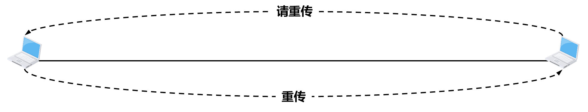

---

### 封装成帧和透明传输

#### 封装成帧

封装成帧是指数据链路层给上层交付下来的协议数据单元PDU添加一个首部和一个尾部，使之成为帧。

- 帧的首部和尾部中包含有一些重要的**控制信息**。

??? note "帧的首部尾部包含内容"
    帧首部通常包含：

    - **地址字段**：标识帧的接收方和发送方（如以太网帧中的源地址和目的地址）。

    - **控制字段**：用于链路管理、帧编号、流量控制等（如PPP协议中的控制字段）。

    - **协议类型字段**：指明上层协议类型（如以太网帧中的Type字段）。

    帧尾部最常见的内容是检错码。

    不同协议的帧结构略有差异，但首部和尾部的核心作用都是标识、控制和检错，保证数据链路层的可靠传输。

- 帧首部和尾部的作用之一就是**帧定界**。然而，并不是每一种数据链路层协议的帧都包含有帧定界标志，例如以太网V2的MAC帧中，首部和尾部中并没有帧定界标志。

??? note "以太网v2的MAC帧传输时如何区分不同帧"
    

    1. 帧的定界

    **帧的开始：Preamble + SFD**

    当一个设备准备发送一个以太网帧时，它不会直接就发送目标MAC地址。它会先发送8个字节的特殊信号：

    * **前同步码 (Preamble)**: 7个字节，内容固定为 `10101010 10101010 ...` (共56位)。这个交替的 `1` 和 `0` 构成了一个稳定的方波信号。接收方的网络接口卡（NIC）可以利用这个信号来**同步时钟** (Clock Synchronization)。这确保了发送方和接收方能以完全相同的速率来解读后续的比特流。

    * **帧起始定界符 (Start Frame Delimiter, SFD)**: 1个字节，内容固定为 `10101011`。它紧跟在前同步码后面，模式与前同步码非常相似，但最后两位是 `11`。告诉接收方下一个比特就是以太网帧的第一个比特（即目标MAC地址的第一个比特）。

    2. **帧的结束：帧间隙 (Interframe Gap, IFG)**

    以太网不像某些协议那样在帧的末尾有一个明确的“结束符”。它是通过“沉默”，也就是**帧间隙**来表示结束的。

    * 在发送完一个完整的帧（从目标MAC到FCS校验和）之后，发送方必须在物理线路上保持一段静默时间，才能发送下一个帧。这个静默时间至少相当于传输96个比特所需的时间。例如，在100Mbps的网络中，这个间隙是960纳秒（ns）。当接收方的NIC在成功接收到一个帧后，检测到线路进入了这种“静默”状态，它就知道这个帧已经完整地结束了。这个间隙也给了NIC硬件一点时间来处理刚刚接收到的帧，并为下一个帧的到来做准备。

    3. **完整流程**如下：

    -  **监听沉默 (IFG)**：NIC在空闲的线路上等待信号。

    -  **时钟同步 (Preamble)**：检测到 `10101010...` 信号，开始与发送方同步时钟。

    -  **侦测帧头 (SFD)**：检测到 `10101011`，知道一个新帧正式开始，准备接收数据。

    -  **接收数据**：将后续的比特流存入缓冲区，直到信号中断。

    -  **侦测帧尾 (IFG)**：线路恢复沉默，确认一个完整的帧已接收完毕。

    -  **校验完整性 (FCS)**：计算接收到数据的CRC校验和，与帧末尾的FCS字段比较。不匹配则丢弃帧。

    -  **识别内容 (EtherType)**：如果FCS校验通过，检查EtherType字段，确定载荷类型（如IPv4）。

    -  **向上交付**：剥离以太网的头部和尾部（MAC地址、EtherType、FCS），将中间的Payload数据交给操作系统中对应的上层协议（如IP协议栈）进行下一步处理。

为了提高数据链路层传输帧的效率，应当使帧的数据载荷的长度尽可能地大于首部和尾部的长度。

考虑到对缓存空间的需求以及差错控制等诸多因素，每一种数据链路层协议都规定了帧的数据载荷的长度上限，即**最大传送单元**（Maximum Transfer Unit，MTU）。例如，以太网的MTU为1500个字节。

---

#### 透明传输

1. 面向字节的物理链路使用**字节填充**的方法实现透明传输。

适用于面向字节的链路协议（如PPP）。协议用某个特殊字节（如0x7E）作为帧的定界符。如果数据中出现了0x7E或其他特殊控制字节（如转义字节0x7D），发送方就在这些字节前插入一个转义字节（如0x7D），并对原字节做特殊处理（如异或0x20）。接收方收到数据后，遇到转义字节就知道下一个字节是被“填充”的，需要还原。

例如：

- 数据：`... 0x7E ...`
- 发送方变成：`... 0x7D 0x5E ...`
- 接收方还原为：`... 0x7E ...`

2. 面向比特的物理链路使用**比特填充**的方法实现透明传输。

适用于面向比特的链路协议（如HDLC）。协议用一组比特（如01111110）作为帧定界符。如果数据中出现连续5个1，发送方自动在后面插入一个0，避免出现定界符的比特模式。接收方收到数据时，遇到连续5个1后跟着0，就把这个0去掉，还原原始数据。

例如：

- 数据：`... 0111111 ...`
- 发送方变成：`... 01111110 ...`
- 接收方还原为：`... 0111111 ...`

???+ question "PPT例题"
    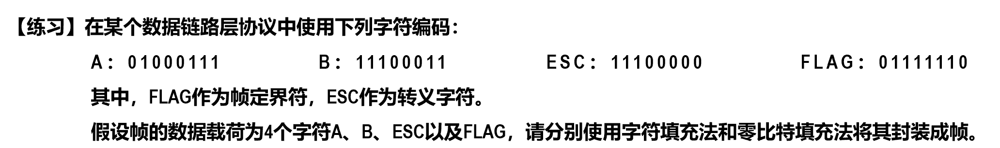

??? note "answer"
    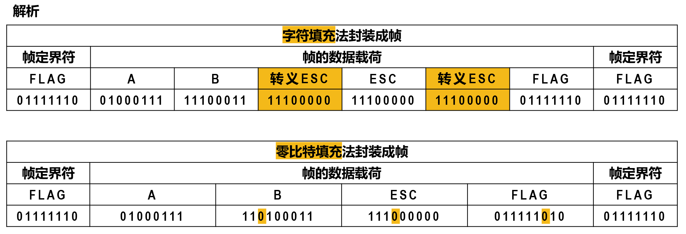

    其实这就涉及到零比特填充法”（Bit Stuffing）的核心规则和目的。

    首先，本协议中的帧定界符 **FLAG** 是 `01111110`。然后我们来明确“零比特填充法”的操作规则：**在发送端，扫描整个数据载荷（作为一个连续的比特流，不关心字节边界），只要检测到有连续的5个`1`，就立即在其后填充一个`0`。**这样，接收端就可以毫无歧义地根据 `01111110` 来识别帧的开始和结束。

---

### 差错检测

#### 误码的相关概念

实际的通信链路都不是理想的，比特在传输过程中可能会产生差错（称为**比特差错**）。

在一段时间内，传输错误的比特数量占所传输比特总数的比率称为**误码率**（Bit Error Rate，BER）。

提高链路的**信噪比**，可以**降低误码率**。但在实际的通信链路上，不可能使误码率下降为零。

使用**差错检测技术**来检测数据在传输过程中是否产生了比特差错，是数据链路层所要解决的重要问题之一。

---

#### 奇偶校验

奇校验是在待发送的数据后面添加1个校验位，使得添加该校验位后的整个数据中**比特1的个数**为**奇数**。

偶校验是在待发送的数据后面添加1个校验位，使得添加该校验位后的整个数据中**比特1的个数**为**偶数**。

但是，在所传输的数据中，如果有奇数个位发生误码，则所包含比特1的数量的奇偶性会发生改变，**可以检测出误码**。在所传输的数据中，如果有偶数个位发生误码，则所包含比特1的数量的奇偶性不会发生改变，**无法检测出误码**（漏检）。

在实际使用时，奇偶校验又可分为垂直奇偶校验、水平奇偶校验以及水平垂直奇偶校验。

---

#### 循环冗余校验

数据链路层广泛使用**漏检率极低**的循环冗余校验（Cyclic Redundancy Check，CRC）检错技术。

循环冗余校验CRC的基本思想：

- 收发双方约定好一个**生成多项式G**(X)。
- 发送方基于待发送的数据和生成多项式G(X)，计算出差错检测码（冗余码），将冗余码添加到待发送数据的后面一起传输。
- 接收方收到数据和冗余码后，通过生成多项式G(X)来计算收到的数据和冗余码是否产生了误码。

CRC的核心思想非常巧妙，可以类比于我们生活中的除法：

* **发送方**：我有一份重要数据（**被除数**），我用一个大家事先约定好的特殊数字（**除数**）去除它，会得到一个**余数**。我把这份“余数”作为校验码，附在原始数据的后面一起发给你。
* **接收方**：我收到了你发来的“原始数据+余数”。为了确认数据在路上有没有损坏，我也用那个事先约定好的“除数”去除你发来的**整个数据包**（原始数据+余数）。
* **判断**：如果我算出来的余数是**0**，说明数据大概率是完好无损的。如果余数**不是0**，那么数据在传输过程中一定出错了！

CRC使用的不是普通的算术除法，而是一种异或XOR运算，那个约定的“除数”则被称为**生成多项式**。

* **生成多项式 (Generator Polynomial)**：收发双方预先约定好的一个二进制数，是CRC算法的核心。例如，一个常用的生成多项式是 $CRC-8$ 的 $x^8 + x^2 + x + 1$，对应的二进制就是 `100000111`。
* **CRC校验码 (CRC Checksum)**：也叫**冗余码**或**余数 (Remainder)**。是通过模2除法计算出来的，附加在原始数据末尾的比特序列。

??? note "CRC的计算过程"
    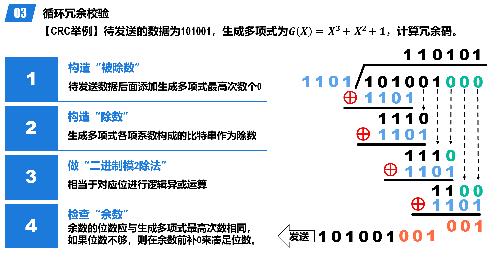

    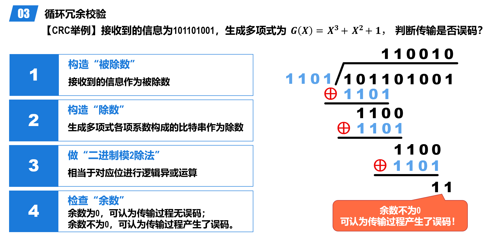

??? note "为什么余数为0就代表正确"
    这背后是多项式数学的原理。发送的数据帧可以表示为 $T(x) = M(x) \cdot x^r + R(x)$。由于 $R(x)$ 是 $M(x) \cdot x^r$ 除以 $G(x)$ 的余数，所以 $M(x) \cdot x^r = Q(x)G(x) + R(x)$。

    那么 $T(x) = Q(x)G(x) + R(x) + R(x)$。在模2运算中，$R(x)+R(x) = 0$，所以 $T(x) = Q(x)G(x)$。

    这意味着最终的帧 $T(x)$ 一定能被 $G(x)$ 整除，所以只要没出错，余数必然是0。

奇偶校验、循环冗余校验等差错检测技术，只能检测出传输过程中出现了差错，但并不能定位错误，因此无法纠正错误。

要想纠正传输中的差错，可以使用冗余信息更多的**纠错码**(例如海明码)进行前向纠错。但纠错码的开销比较大，在计算机网络中较少使用。

在计算机网络中，通常采用**检错重传方式来纠正传输中的差错**，或者**仅仅丢弃检测到差错的帧**，这取决于数据链路层向其上层提供的是**可靠传输服务**还是**不可靠传输服务**。

循环冗余校验CRC具有很好的检错能力(**漏检率极低**)，虽然计算比较复杂，但非常易于用硬件实现，因此被广泛应用于数据链路层，是一种检错方式。

??? note "海明码"
    海明码通过设置多个**交叉重叠**的校验位，使得任何一位数据出错，都会导致一组**特定组合**的校验位出错。通过分析是“哪些”校验位出错了，我们就能反推出错误的确切位置。

    **如何构建一个海明码？**以 (15, 11)海明码为例。

    **(15, 11)海明码** 的意思是：最终的码字（Codeword）总长度为 $n=15$ 位。其中包含原始数据 $k=11$ 位。剩下的 $n-k=4$ 位是校验位（Parity Bits），记为 $p$。

    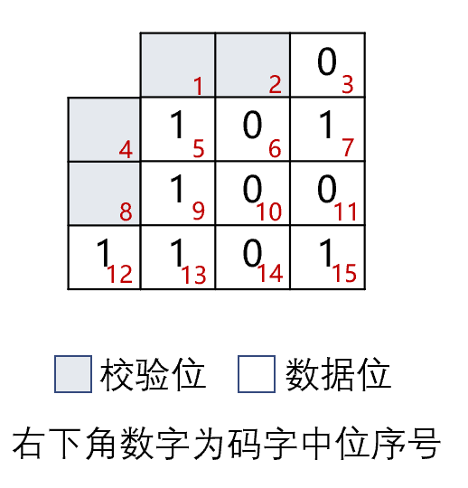

    1. 确定校验位的位置和数量

    * **数量**：设校验位有 $r$ 个，数据位有 $k$ 个。$r$ 个校验位能产生 $2^r$ 种不同的状态（校验结果）。其中一种状态表示“无错误”，剩下的 $2^r-1$ 种状态必须能唯一指向每一个可能出错的位置（包括数据位和校验位本身）。因此，必须满足不等式：
        
    $$2^r \ge (k+r) + 1$$

    在本例中，$k=11$，$r=4$。$2^4 = 16$，而 $k+r+1 = 11+4+1=16$。所以 $16 \ge 16$ 成立，4个校验位刚刚好。

    * **位置**：海明码规定，校验位必须放在总码字中**第 $2^i$ 的位置**上（$i=0, 1, 2, ...$）。

    2. 填充数据位

    将11位的数据 `01011001101` 依次填入剩下的**数据位**,校验位暂时为空。

    3. 计算校验位的值

    每一个校验位 $p_i$ 负责校验一组特定的数据位。这组数据位的选择不是随意的，而是根据它们的**位置编号的二进制表示**来确定的。

    * 校验位 $p_1$ ：负责校验所有位置编号的二进制表示中，**最低位（第0位）是1**的那些位。也就是对应的数据：$p_1$, D3, D5, D7, D9, D11, D13, D15

    * 校验位 $p_2$ ：负责校验所有位置编号的二进制表示中，**第1位是1**的那些位。也就是对应的数据：$p_2$, D3, D6, D7, D10, D11, D14, D15

    对于校验位 $p_4$ 和 $p_8$ 也是类似的。

    **计算（使用偶校验）**：可以得到 $p_1 = 1, p_2 = 0, p_4 = 1, p_8 = 0$。

    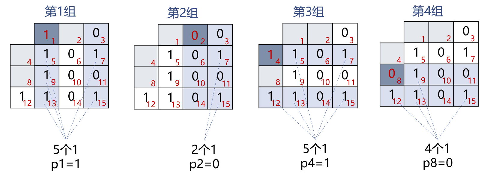

    4. 形成最终码字并发送

    将计算出的校验位填回码字中，得到最终要发送的15位码字。

    **接收方如何定位错误？**假设在传输过程中，**第7位**发生了错误，从`1`变成了`0`。

    接收方不知道哪个位错了，于是它执行与发送方完全一样的校验流程：

    1.  **重新计算校验关系，生成“纠错码”（Syndrome）**

    * **校验第1组**：`1`的个数为5（奇数）。**校验失败！** 结果记为 **1**。

    * **校验第2组**：`1`的个数为1（奇数）。**校验失败！** 结果记为 **1**。

    * **校验第3组**：`1`的个数为5（奇数）。**校验失败！** 结果记为 **1**。

    * **校验第4组**：`1`的个数为4（偶数）。**校验通过！** 结果记为 **0**。

    2.  **定位错误**

    将上面得到的4个校验结果，按 $p_8, p_4, p_2, p_1$ 的顺序组合成一个二进制数：

    $$S = (\text{第4组结果})(\text{第3组结果})(\text{第2组结果})(\text{第1组结果})$$

    $$S = 0111_2$$

    将这个二进制数转换为十进制：$0*8 + 1*4 + 1*2 + 1*1 = 7$。

    **结论：出错的位置就是第7位！**

    或者可以使用**行列定位法**。

    第1组和第2组都出错了，根据第一组的1，3，5，7，9，11，13，15列中有错误，根据第二组的2，3，6，7，10，11，14，15列中有错误，因此错误在4列。

    第3组出错了，第4组没错，根据第三组的4，5，6，7，12，13，14，15行中有错误，根据第四组的8，9，10，11，12，13，14，15行中没有错误，因此错误在2行。

    3.  **纠正错误**接收方只需将第7位的数据反转，即可恢复出原始的正确数据。

    **总结：**海明码的精髓在于其巧妙设计的**交叉校验体系**。每一个数据位都被不止一个校验位所管理，因此当它出错时，会留下一串独特的“校验失败”的纠错码。这个二进制值，恰好就是错误位的地址，从而实现了精准的定位与纠错。

---

### 可靠传输

#### 可靠传输的相关基本概念

使用**差错检测技术**（例如循环冗余校验CRC），接收方的数据链路层就可检测出帧在传输过程中是否产生了**误码**（比特差错）。

数据链路层向其上层提供的服务类型

- 不可靠传输服务：仅仅丢弃有误码的帧，其他什么也不做；
- 可靠传输服务：通过某种机制实现发送方发送什么，接收方最终就能收到什么。

一般情况下，**有线链路的误码率比较低**。为了减小开销，并不要求**数据链路层向其上层提供可靠传输服务**。即使出现了误码，可靠传输的问题由其上层处理。

**无线链路**易受干扰，误码率比较高，因此**要求数据链路层必须向其上层提供可靠传输服务**。

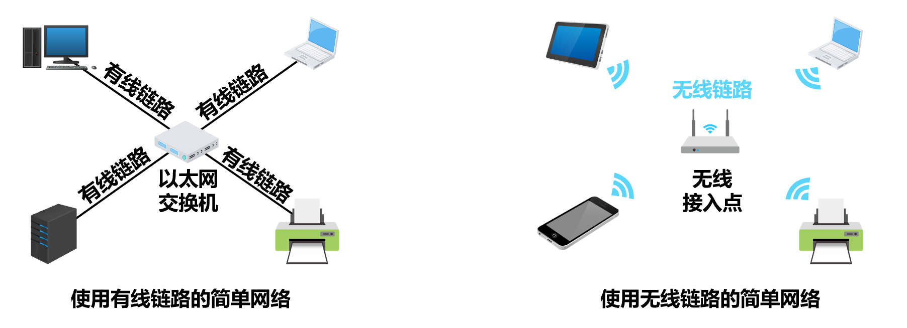

传输差错分为：

- **误码**（比特差错）
- **分组丢失**：输入队列快满了，主动丢弃收到的分组
- **分组失序**：分组到达顺序与发送顺序不同
- **分组重复**：由于路由器繁忙，分组在输入队列中等待较长时间，超时重发后接收器可能会收到重复的分组。

误码会出现在出现在数据链路层及其下层；而分组丢失、分组失序和分组重复通常出现在数据链路层的上层。

---

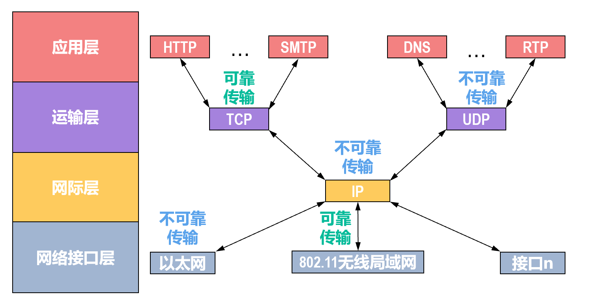

- **可靠传输服务**并不局限于数据链路层，其他各层均可选择实现可靠传输。
- 可靠传输的实现比较复杂，开销比较大，是否使用可靠传输取决于应用需求。

---

### 停止-等待协议的实现原理

停止-等待协议属于**自动请求重传**（Automatic Repeat reQuest，ARQ）协议。即重传的请求是发送方自动进行的，而不是接收方请求发送方重传某个误码的数据分组。

停止-等待协议的核心思想非常简单：

发送方每发送一个数据分组（Packet），就必须停下来，等待接收方的确认（Acknowledgment, ACK），收到确认后才能发送下一个数据分组。

1. 在最理想的情况下，发送方发送数据，接收方完美接收，然后发回一个确认，发送方收到确认后再发下一个数据，如此往复。

但在真实的网络环境中，情况要复杂得多，主要会遇到以下几种问题：

* **数据分组丢失**
* **确认分组（ACK）丢失**
* **数据或确认分组迟到**
* **数据分组出错**

2. 问题与解决方案

2.1 **数据分组丢失**

发送方发送了数据，但数据在网络中丢失了。接收方根本没收到，所以它不会发送任何确认（ACK）。此时如果没有其他措施，发送方将永远地等待下去。

**解决方案：超时重传 (Timeout Retransmission)**

* 发送方在发送完一个数据分组后，会启动一个 **超时计时器 (Timeout Timer)**。
* 如果在计时器设定的时间——即 **超时重传时间 (Retransmission Time-Out, RTO)**——内没有收到接收方的确认，发送方就会认为数据丢失了，并重新发送之前那个数据分组。

* RTO 的值一般会被设置为略大于数据在两端之间的平均往返时间 **(Round-Trip Time, RTT)**。RTT 指的是从发送方发出数据，到接收方收到并返回确认，这一整个来回所花费的时间。如果 RTO 小于 RTT ，发送方会过早地认为数据丢失并进行不必要的重传。

!!! info
    在数据链路层，点对点的往返时间RTT比较固定，RTO就比较好设定。
    
    在运输层，由于端到端往返时间非常不确定，设置合适的超时重传时间RTO有时并不容易。

2.2 **确认分组（ACK）丢失**

接收方成功收到了数据（DATA0），也发送了确认（ACK），但这个ACK在网络中丢失了。此时发送方因为没收到ACK，会在超时后重传 DATA0 。这样一来，接收方就会收到两次完全相同的 DATA0 。接收方如何知道这是个重复的分组，而不是一个新的、内容恰好也叫“DATA0”的分组呢？

**解决方案：给数据分组编号 (Sequence Number)**

* 为了让接收方能识别重复的分组，我们必须给每个数据分组带上序号。
* 对于停止-等待协议，因为每次只发送一个，所以只需要 **1个比特** 的编号就足够了，即 **0** 和 **1**。
* 发送顺序是 DATA0, DATA1, DATA0, DATA1, ... 如此循环。
* 当接收方期待收到DATA1，但却收到了一个序号为0的分组时，它就知道这是对DATA0的重复发送。此时，接收方的策略是：

1.  **丢弃** 这个重复的数据分组。
2.  **重新发送** 一个对0号分组的确认（ACK）。

2.3 **确认分组（ACK）迟到**

对DATA0的确认ACK0没有丢失，但在网络中“堵车”了，延迟了很久才到达。发送方因为超时，已经重传了DATA0，并且在收到对重传DATA0的确认后，发送了新的DATA1。这时，那个迟到的ACK0才终于抵达发送方。此时发送方此时已经发送了DATA1，它正在等待对DATA1的确认。如果收到了这个迟到的ACK0，它会误以为这是对DATA1的确认。

**解决方案：给确认分组也编号 (Acknowledgment Number)**

* 为了让发送方能识别迟到或重复的ACK，确认分组也需要编号。
* 对 **DATA0** 的确认是 **ACK0**，对 **DATA1** 的确认是 **ACK1**。
* 这样，当发送方发送了DATA1后，它期待的是ACK1。如果此时收到了一个迟到的ACK0，它就能通过编号识别出这是对之前0号分组的重复确认，直接 **忽略** 即可。

!!! info
    数据链路层一般不会出现确认分组迟到的情况，因此在**数据链路层实现停止-等待协议可以不用给确认分组编号**。

2.4 **数据分组出错**

数据分组在传输过程中发生了比特错误。

**解决方案：差错检测和否认分组 (NAK)**

* 接收方通过 **差错检测** 机制（如CRC校验）发现数据有误。
* 接收方会 **丢弃** 这个错误的分组。
* 同时，为了不让发送方傻等超时，接收方可以主动发送一个 **否认分组 (Negative Acknowledgment, NAK)**，明确告知发送方“刚才那个数据坏了，请重发”。
* 发送方收到NAK后，会立即重传相应的数据，而无需等待超时计时器结束，提高了效率。

---

#### 停止-等待协议的信道利用率

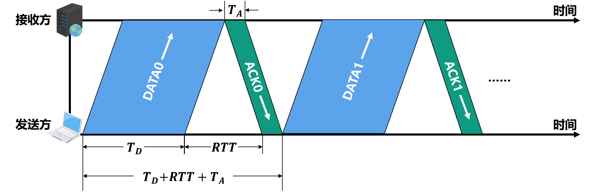

$$\text{信道利用率 U } = \frac{T_{D}}{T_{D} + RTT + T_{A}} \xrightarrows{T_{A} \ll T{D}} U \approx \frac{T_{D}}{T_{D} + RTT}$$

$$U \approx \frac{T_{D}}{T_{D} + RTT} \xrightarrows{RTT \gg T_{D}} \text{ U 很低}$$

$$U \approx \frac{T_{D}}{RTT} \xrightarrows{RTT \ll T_{D}} \text{ U 比较高}$$

- $T_{A} \ll T_{D}$ : 确认分组的传输时间远小于数据分组的传输时间，可以忽略不计。
- $RTT \gg T_{D}$ : 例如，卫星链路的RTT很大。
- $RTT \ll T_{D}$ : 例如，无线局域网链路的RTT远小于 $T_D$ 。
- 若出现超时重传，对于传送有用的数据信息来说，信道利用率还要降低。
- 在往返时间RTT相对较大的情况下，为了提高信道利用率，收发双方不适合采用停止-等待协议，而可以选择使用回退N帧（GBN）协议或选择重传（SR）协议。

??? note "PPT 例题"
    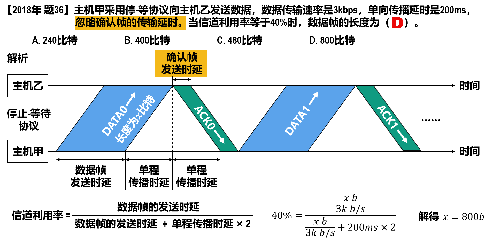

---

### 回退N帧协议(Go-Back-N , GBN)

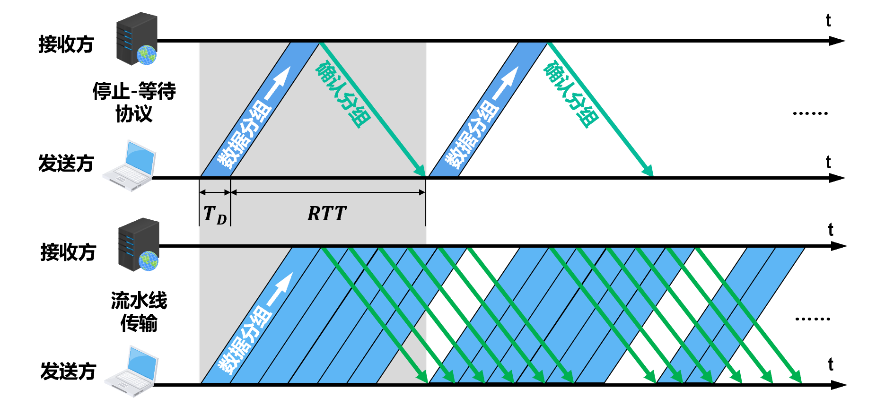

因为对于 $RTT \gg T_{D}$ 的链路，停止-等待协议的信道利用率很低，所以收发双方可以采用**流水线技术**，可以显著提高信道利用率。

- 在使用流水线传输方式时，发送方**不能无限制地连续发送数据分组**，否则可能会导致网络中的路由器或接收方来不及处理这些数据分组，进而导致数据分组的丢失，这实际上是对网络资源的浪费。
- 回退N帧协议采用流水线传输方式，并且利用**发送窗口**来限制发送方连续发送数据分组的数量，这属于**连续ARQ协议**。

---

#### 回退N帧协议的基本原理

采用 $n$ 个比特给分组编序号，序号范围是 $0 \sim (2^n-1)$ 。

发送方需要维护一个**发送窗口** $W_t$ ，在未收到接收方确认分组的情况下，发送方可将序号落入 $W_t$ 内的所有数据分组连续发送出去。并且 $W_t$ 的取值范围是 $0 \sim (2^n-1)$ 。

准备接收时，接收方需要维护一个**接收窗口** $W_R$ ，只有正确到达接收方（**无误码**）且序号落入 $W_R$ 内的数据分组才被接收方接收。其中 $W_R$ 的取值**只能是1**，这一点与停止-等待协议是相同的。

**接收方**每正确收到一个序号落入接收窗口的数据分组，就将接收窗口**向前滑动**一个位置，这样就有一个新的序号落入接收窗口。与此同时，接收方还要给发送方发送针对该数据分组的**确认分组**。

**发送方**每收到一个按序确认的确认分组，就将发送窗口**向前滑动**一个位置，这样就有一个新的序号落入发送窗口，序号落入发送窗口内的数据分组可**继续被发送**。

在回退N帧协议的工作过程中，发送方的发送窗口和接收方的接收窗口按上述规则不断向前滑动。因此，这类协议又称为**滑动窗口协议**。

!!! note
    在无传输差错的情况下，回退N帧协议的信道利用率比停止-等待协议的信道利用率有显著提高。提高的程度取决于发送窗口的大小。

**超时重传、回退N帧的情况**

如果某一帧出错或丢失，接收方会丢弃后续所有帧，发送方在超时或收到否认后，会“回退”并重传该帧及其之后的所有帧。

!!! note
    一个数据分组的差错就可能引起大量数据分组的重传。
    
    在信道质量较差（容易出现误码）的情况下，回退N帧协议的信道利用率并不比停止-等待协议的信道利用率高。

回退N帧协议的接收方采用**累积确认**方式。

- 接收方不必对收到的每一个数据分组都发送一个确认分组，而是可以在收到几个序号连续的数据分组后，对按序到达的**最后一个数据分组**发送确认分组。
- 接收方何时发送累积确认分组，由具体实现决定。
- 确认分组 `ACKn` 表明序号为 `n` 及之前的所有数据分组都已正确接收。

累积确认的**优点**

- 减少向网络中注入确认分组的数量。
- 即使确认分组丢失，也可能不必重传数据分组。

累积确认的**缺点**

- 不能向发送方及时准确地反映出接收方已正确接收的所有数据分组的数量。

??? note "PPT 例题"
    

    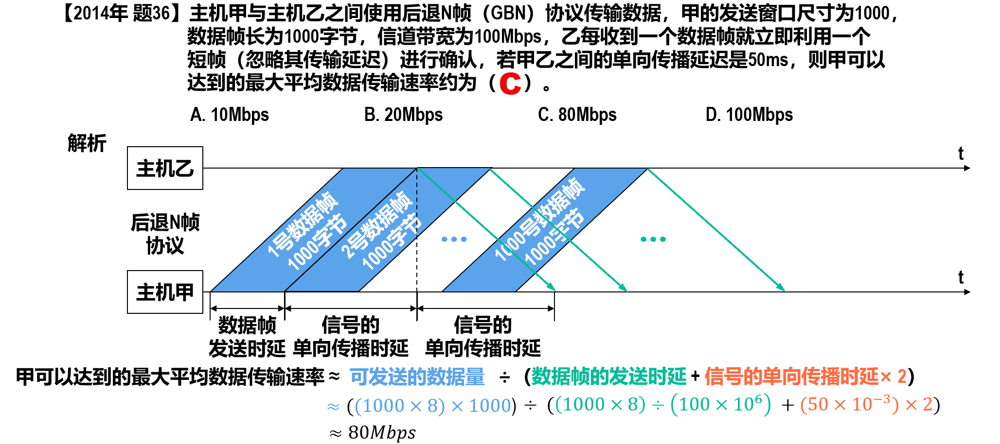

??? note "关于若 $W_T$ 超过取值范围会出现什么情况？"
    其实，只要最后一个ACK（或中途任何一个ACK）成功抵达，并且抵达时间早于 S 的定时器超时，协议就可以正常使用，即使 $W_T = k$。

    例如中途任何一个 ACK 成功抵达，后面的 ACK 都丢失了，但是接收方已经接收到了数据包，此时发送方重传时，接收方会丢弃这个帧，并且重新发送它上一次成功接收并发送过的 ACK。而对于只要最后一个 ACK 成功抵达，那么根据累积确认的原理，发送方就能知道所有数据包都已经成功接收了。

    只有当所有的 `ACK` 都丢失了，此时发生了超时，发送方才会因为没有收到 ACK 而重传数据包。但是此时接收方的窗口序号因为比特数不够而已经在期盼这个比特序列的第一个了。例如2位比特传送4个数据，前一组(0,1,2,3)已经传送失败了，但是此时接收方期待的序号依旧是0，所以发送方重传0号数据包时，接收方会认为这是符合预期序号的第一个数据包，从而导致这个数据包被接收，进而后续数据包也被接收，从而导致数据错误。

- 如果 $W_T = 1$ ，就变成了停止-等待协议。如果 $W_T > 2^n - 1$ ，那么接收方就无法分辨新旧数据分组。

---

#### GBN 协议下信道利用率与发送窗口大小的关系

假设连续 ARO 协议的发送窗口为 n，即发送方可连续发送 n 个分组，分为两种情况:

1. $nT_D < T_D + RTT + T_A$ : 即在一个发送周期内可以发送完个分组，信道利用率为

$$U = \frac{nT_D}{T_D + RTT + T_A} \xrightarrows{T_A \ll T{D}} U \approx \frac{nT_D}{T_D + RTT}$$

2. $nT_D \geq T_D + RTT + T_A$ : 即在一个发送周期内不能发送完 n 个分组，对于这种情况，只要不发生差错，发送方就可不间断地发送分组，信道利用率为1。

---

### 选择重传协议(Selective Repeat, SR)

1. 接收方 (Receiver)： 会设置缓冲区，接收并缓存那些“失序到达”但在其接收窗口内的帧。
2. 发送方 (Sender)： 只会重传那些它确认“真正丢失”或“损坏”的帧（通常是定时器超时）。

接收方拥有一个缓冲区，用于暂存那些失序到达、但序号在其接收窗口内的帧。

用 $n$ (n > 1)个比特给分组编号。

因为 $W_R$ 的取值超过 $W_T$ 是没有意义的。所以：

$$1 < W_R \leq W_T $$

$$W_R + W_T \leq 2^n $$

$$\therefore 1 < W_T \leq 2^{n-1}$$

这是为了确保接收窗口向前滑动后，落入接收窗口内的新序号与之前的旧序号没有重叠，避免无法分辨新旧数据分组。

而为了使发送方仅重传出现差错的数据分组，接收方不再采用累积确认，而需要**对每一个正确接收的数据分组进行逐一确认**。如果发送方收到未按序到达的确认分组，应对其进行记录，以防止其相应数据分组的超时重发，但发送窗口**不能**向前滑动。

??? note "PPT 例题"
    

---

## 点对点协议

点对点协议（Point-to-Point Protocol，PPP）是目前使用最广泛的点对点数据链路层协议。

点对点协议PPP主要有两种应用：

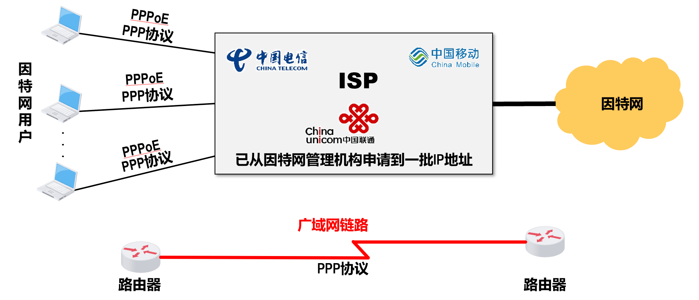

---

???+ example "question"
    采用滑动窗口机制对两个相邻节点A和B的通信过程进行流量控制。A和B之间的数据传输速率为20kb/s,数据帧和确认帧的长度都为2000B,往返传播时延为1400ms,采用3比特给数据帧编号，测得在A和B的通信过程中信道利用率大于80%,则()。(注：在SR协议中，默认发送窗口大小等于接收窗口大小。)
    
    A.节点A、B之间只能采用停止等待协议
    
    B.节点A、B之间只能采用GBN协议
    
    C.节点A、B之间只能采用SR协议
    
    D.节点A、B之间可以采用GBN协议或SR协议

??? note "answer"
    无论采用哪种滑动窗口协议，信道利用率的计算方法都是: $\frac{\text{发送窗口内所有数据的发送时延}}{一个数据帧的发送时延 + RTT + 一个确认帧的发送时延}$ 。分母记为 T = 一个数据帧的发送时延 + RTT + 一个确认帧的发送时延，其中数据帧或确认帧的发送时延 = 2000B/(20kb/s)=800ms，RTT=1400ms，即T=800+800+1400=3000ms。假设发送窗口大小为x，则 800x/3000>0.8，即发送窗口大小 x 要大于 3，GBN 协议的发送窗口为 $2^3$-1=7，满足要求: SR 协议的发送窗口为 $2^2$=4，也满足要求。因此，A 和 B 之间可以采用 GBN 协议或 SR 协议。

???+ example "question"
    两台主机之间的数据链路层采用后退N帧协议(GBN)传输数据，数据传输速率为16kb/s,单向传播时延为270ms,数据帧长范围是128～512字节，接收方总是以与数据帧等长的帧进行确认。为使信道利用率达到最高，帧序号的比特数至少为()。
    
    A.5
    
    B.4
    
    C.3
    
    D.2

??? note "answer"
    B

    连续 ARQ 的信道利用率:

    $$\frac{\text{发送窗口大小} \times \text{数据帧长} / \text{数据传输速率} }{(\text{数据帧长} /  \text{数据传输速率}) \times 2 + RTT} = \frac{\text{发送窗口大小} / \text{数据传输速率} }{ 2 / \text{数据传输速率} + RTT / \text{数据传输帧长} }$$

    从上述公式可知,数据帧长越大,信道利用率就越高。数据帧长是不确定的,范围 128~512B,在计算最小窗口数时,为了保证无论数据帧长如何变化,信道利用率都能达到 100%,应以 128B的帧长计算。因此，当最短的帧长都能达到 100%的信道利用率时，发送更长的数据帧也都能达到 100%的信道利用率。若以 512B 的帧长计算，则求得的最小窗口数在 128B 的帧长下，达不到100%的信道利用率。首先计算出发送一个帧的时间 $128 \times 8 / 16kb/s = 64ms$，RTT = 270ms × 2 = 540ms，发送一个帧到收到确认帧为止的总时间 64+270x2+64=668ms;这段时间总共可发送 668/64=10.4帧,即发送窗口>11,而接收窗口 =1，所以至少需要用4位比特进行编号。

---

### PPP的帧格式

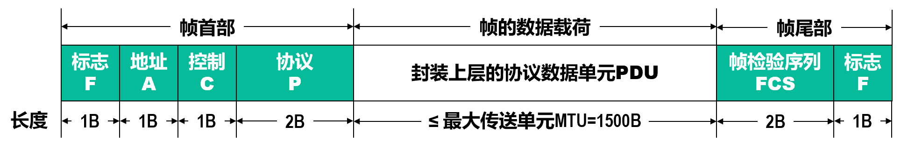

- **标志**（Flag）字段：PPP帧的定界符，取值为0x7E。
- **地址**（Address）字段：取值为0xFF，预留（目前没有什么作用）。
- **控制**（Control）字段：取值为0x03，预留（目前没有什么作用）。
- **协议**（Protocol）字段：其值用来指明帧的数据载荷应向上交付给哪个协议处理。

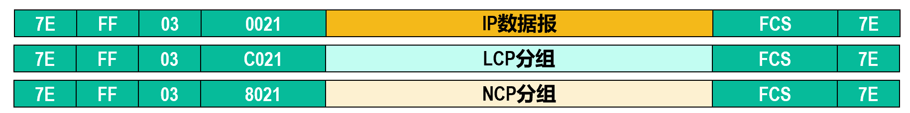

- **帧检验序列**（Frame Check Sequence，FCS）字段：其值是使用循环冗余校验CRC计算出的检错码。

---

### PPP帧的透明传输

#### 字节填充 (Byte Stuffing)

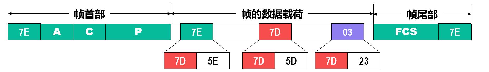

发送方的处理：

1. 将数据载荷中出现的每一个 `0x7E` 减去 `0x20` （相当于异或 `0x20` ），然后在其前面插入转义字符 `0x7D` 。
2. 若数据载荷中原来就含有 `0x7D` ，则把每一个 `0x7D` 减去 `0x20` ，然后在其前面插入转义字符 `0x7D` 。
3. 将数据载荷中出现的每一个ASCII码控制字符（即数值小于 `0x20` 的字符），加上 `0x20` （相当于异或 `0x20` ，将其转换成非控制字符），然后在其前面插入转义字符 `0x7D` 。

接收方的处理：

进行与发送方相反的变换，就可以正确地恢复出未经过字节填充的原始数据载荷。例如当它看到 `0x7D` 时，就知道下一个字节是“被转义过”的，它会把下一个字节拿过来，恢复成原始数据（比如把 `0x5E` 变回 `0x7D`）。

??? note "为什么要转义ASCII控制字符"
    这主要是一个历史遗留问题，与PPP设计时需要兼容的**老式串行端口（Serial Ports）和调制解调器（Modem）**有关。

    在 `PPP` 出现之前，这些串行端口和 `Modem` 就已经有它们自己的“控制语言”了，它们会“偷听”传输的数据，寻找特定的**控制字符**来执行某些操作。

    所以是为了避免 `Modem` 等拦截数据传输，防止 `PPP`协议下方的硬件或软件出错。

---

#### 比特填充 (Bit Stuffing)

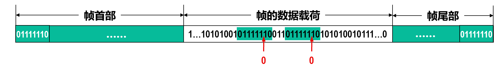

发送方的处理：

对帧的数据载荷进行扫描（一般由硬件完成），每出现**5个连续的比特1**，则在其后**填充一个比特0**。

接收方的处理：

对帧的数据载荷进行扫描，每出现**5个连续的比特1**时，就把其后的一个**比特0删除**。

---

#### 字符计数法 (Character Counting)

字符计数法是指在帧首部使用一个计数字段来记录该帧所含的字节数(包括计数字段自身所占用的1字节)。

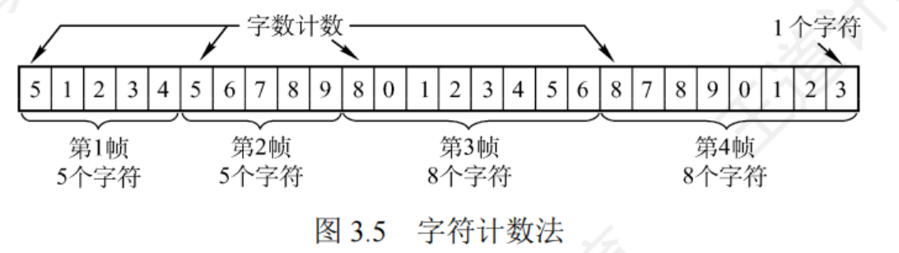

这种方法最大的问题在于若计数字段出错，即失去帧边界划分的依据，则接收方就无法判断所传输帧的结束位和下一帧的开始位，收发双方将失去同步，造成灾难性后果。

---

### PPP帧的差错检测

**帧检验序列** `FCS` 字段：其值是使用循环冗余校验CRC计算出的检错码。

CRC采用的生成多项式为 $\text{CRC-CCITT} = X^{16} + X^{12} + X^{5} + 1$

> [RFC1662]文档的附录部分给出了FCS的计算方法的C语言实现（查表法）

接收方每收到一个PPP帧，就进行CRC检验。若CRC检验正确，就收下这个帧；否则，就丢弃这个帧。所以使用PPP的数据链路层，**向上提供的是不可靠数据传输服务**。

---

## 共享式以太网

**以太网**（Ethernet）以曾经被假想的电磁波传播介质——以太（Ether）来命名。

以太网最初采用**无源电缆**（不包含电源线）作为**共享总线**来传输帧，属于**基带总线局域网**，传输速率为2.94Mb/s。

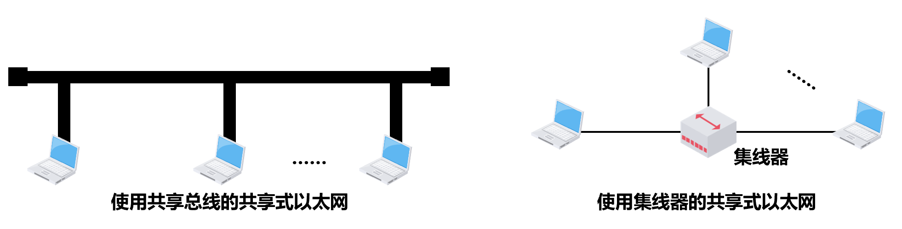

以太网目前已经从传统的共享式以太网发展到交换式以太网，传输速率已经从10Mb/s提高到100Mb/s、1Gb/s甚至10Gb/s。

---

### 网络适配器

要将计算机连接到以太网，需要使用相应的**网络适配器**（Adapter），网络适配器一般简称为“网卡”。

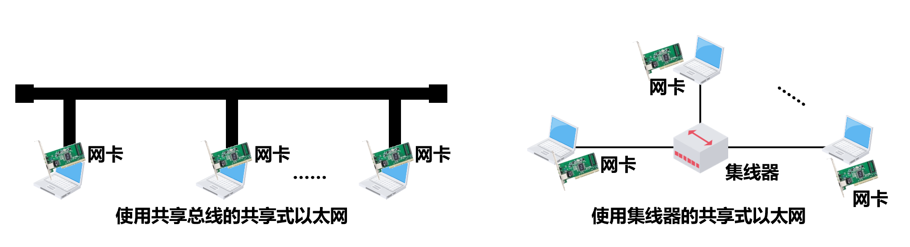

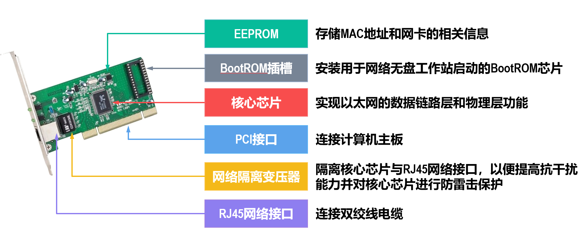

在计算机内部，**网卡与CPU**之间的通信，一般是通过计算机主板上的 `I/O` 总线以**并行**传输方式进行。

**网卡与外部以太网**（局域网）之间的通信，一般是通过传输媒体（同轴电缆、双绞线电缆、光纤）以**串行方式**进行的。

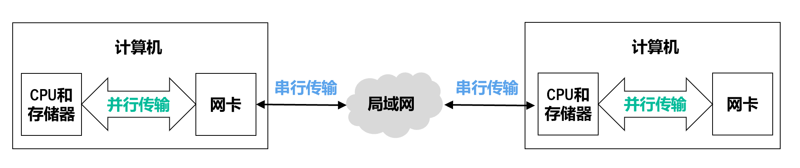

网卡除要实现物理层和数据链路层功能，其另外一个重要功能就是要进行**并行传输和串行传输**的转换。由于网络的传输速率和计算机内部总线上的传输速率并不相同，因此在网卡的核心芯片中都会包含用于缓存数据的存储器。

在确保网卡硬件正确的情况下，为了使网卡正常工作，还必须要在计算机的操作系统中为网卡安装相应的设备驱动程序。**驱动程序**负责驱动网卡发送和接收帧。

---

### MAC地址

对于点对点信道，数据链路层不需要使用地址。但是对于广播信道，当一个节点发送数据时，其他所有节点都能收到该数据，因此需要使用地址来区分不同的节点。

当多个主机连接在同一个广播信道上，要想实现两个主机之间的通信，则每个主机都必须有一个**唯一的标识**，即一个**数据链路层地址**。

在每个主机发送的**帧的首部**中，都携带有发送主机（源主机）和接收主机（目的主机）的**数据链路层地址**。由于这类地址是用于**媒体接入控制**（Medium Access Control，MAC）的，因此被称为 `MAC` 地址。

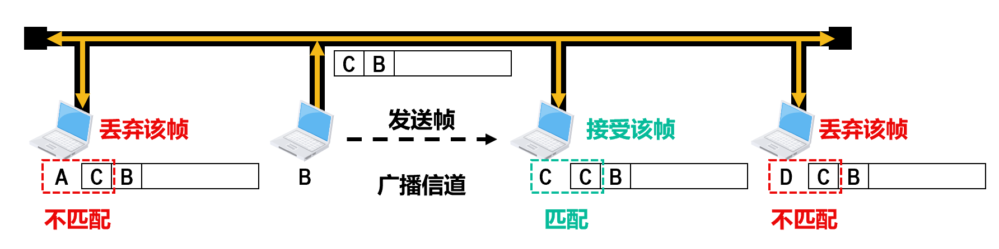

**MAC地址**一般被固化在网卡的电可擦可编程只读存储器EEPROM中，因此MAC地址也被称为**硬件地址**。

MAC地址有时也被称为**物理地址**。

!!! info "attention"
    虽然这里说物理地址，但是这个物理地址属于数据链路层范畴。

一般情况下，普通用户计算机中往往会包含两块网卡：

- 一块是用于接入有线局域网的**以太网卡**
- 另一块是用于接入无线局域网的**Wi-Fi网卡**

每块网卡都有一个**全球唯一**的MAC地址。

交换机和路由器往往具有更多的网络接口，所以会拥有更多的MAC地址。

!!! note
    综上所述，严格来说，MAC地址是对网络上**各接口的唯一标识**，而不是对网络上各设备的唯一标识。

---

### MAC地址格式

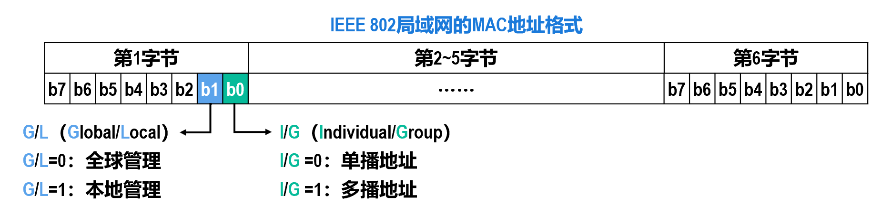

MAC地址是一个6字节（48位）的数字。为了方便人看，通常写成12个十六进制数。因为是48位，所以总共有 $2^{48} $ 个不同的MAC地址。

在这6个字节中，第1个字节是用来表示**地址类型**的。

1. 第1个字节的**最低有效位**（即第0位）(I/G)用来表示**单播地址**（Unicast Address）还是**多播地址**（Multicast Address）。单播地址的该位为0，表示该地址是分配给某个单一设备的；多播地址的该位为1，表示该地址是分配给一组设备的。

例如当一台电脑A要给另一台电脑B发信息时，它会使用电脑B的“单播”地址。这是网络中最常见的通信方式。而当一个视频会议服务器想把画面同时发给会议室里的10台电脑，它就可以把数据发送到一个“多播”地址。这10台电脑都会“订阅”这个地址并接收数据，而会议室外的其他电脑则会忽略它。

2. 第1个字节的**次低有效位**（即第1位）(G/L)用来表示**全局唯一地址**（Globally Unique Address）还是**本地管理地址**（Locally Administered Address）。全局唯一地址的该位为0，表示该地址是由IEEE统一分配的，全球唯一；本地管理地址的该位为1，表示该地址是由本地管理员自行分配的，可能不是全球唯一的。

字节的发送顺序是：低地址字节先发送，高地址字节后发送。从第一字节的 `b0` 位到 `b7` 位，从第一字节到第六字节。

---

#### 多播MAC地址举例

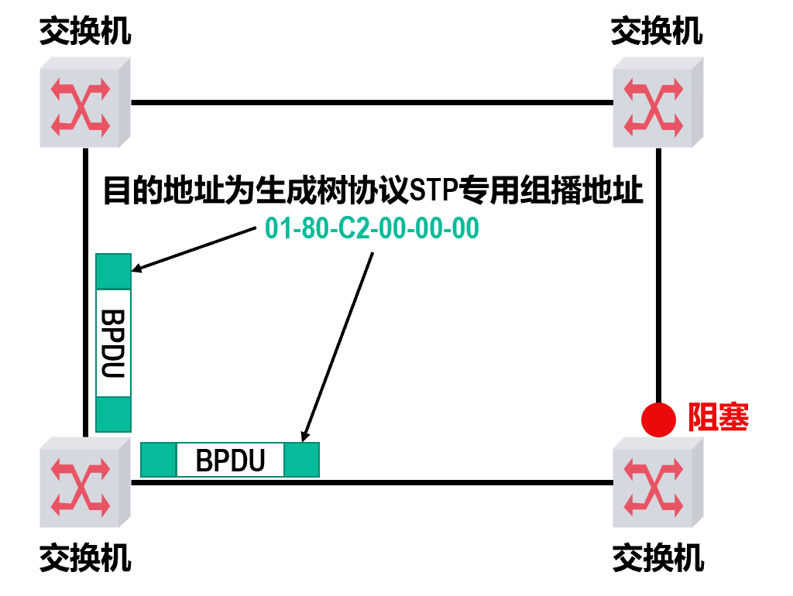

四台“交换机”被连接成了一个环形。如果左下角的交换机收到了一个“广播帧”。它会把这个帧转发给所有其他端口，于是这个帧会像“幽灵”一样永无休止地在这个环路里疯狂循环，并且被无限复制。这会在1秒钟内耗尽所有网络带宽，导致所有交换机CPU占满，网络彻底瘫痪。这种情况被称为“**广播风暴**”。

为了防止这种“环路灾难”，STP（Spanning Tree Protocol，生成树协议）应运而生。

STP协议的唯一目的就是：在物理上允许环路（用于备份），但在逻辑上“剪断”环路。为了防止环路，它会**阻塞（禁用）**一个端口，逻辑上把这个环“剪开”。所以右下角那条被阻塞的链路变成了“备份链路”。如果其他任何一条链路（比如左上角和右上角之间）断了，STP会自动重新计算，并在几秒钟内激活那个被阻塞的端口，恢复网络通信。

而交换机是通过**多播MAC地址**来识别STP协议帧的。交换机之间传递的是 BPDU（Bridge Protocol Data Unit，网桥协议数据单元）。这个 BPDU 需要被所有交换机识别，所以既不能使用单播地址，也不能使用广播地址（因为广播地址会被所有设备接收，增加不必要的负担）。

---

网卡从网络上每收到一个帧，就检查帧首部中的目的MAC地址，按以下情况处理：

1. 如果目的MAC地址是广播地址（FF-FF-FF-FF-FF-FF），则接受该帧。
2. 如果目的MAC地址与网卡上固化的全球单播MAC地址相同，则接受该帧。
3. 如果目的MAC地址是网卡支持的多播地址，则接受该帧。
4. 除上述情况外，丢弃该帧。

网卡还可被设置为一种特殊的工作方式：**混杂方式**（Promiscuous Mode）。工作在混杂方式的网卡，只要收到共享媒体上传来的帧就会收下，而不管帧的目的MAC地址是什么。

- 对于网络维护和管理人员，这种方式可以监视和分析局域网上的流量，以便找出提高网络性能的具体措施。
- **嗅探器**（Sniffer）就是一种工作在混杂方式的网卡，再配合相应的工具软件（WireShark），就可以作为一种非常有用的网络工具来学习和分析网络。
- 混杂方式就像一把“双刃剑”，黑客常利用这种方式非法获取网络用户的口令。

全球单播MAC地址就如同身份证上的身份证号码，具有唯一性，它往往与**用户个人信息**绑定在一起。因此，用户应尽量**确保自己拥有的全球单播MAC地址不被泄露**。

为了避免用户设备连接Wi-Fi热点时MAC地址泄露的安全问题，目前大多数移动设备都已经采用了**随机MAC地址技术**。

---

### CSMA/CD协议

#### CSMA/CD协议的基本原理

在以太网的发展初期，人们普遍认为“无源的电缆线比有源器件可靠”，因此将多个站点连接在一条总线上来构建**共享总线以太网**。

共享总线以太网具有**天然的广播特性**，即使总线上某个站点给另一个站点发送单播帧，表示帧的信号也会沿着总线传播到总线上的其他各站点。

当某个站点在总线上发送帧时，总线资源会被该站点独占。此时，如果总线上的其他站点也要在总线上发送帧，就会产生信号**碰撞**。当两个或多个站点同时使用总线发送帧时，就会产生信号碰撞。

为了解决各站点争用总线的问题，共享总线以太网使用了一种专用协议 `CSMA/CD` ，它是**载波监听多址接入/碰撞检测**（Carrier Sense Multiple Access Collision Detection）的英文缩写词。

1. 多址接入

多个站点连接在一条总线上，竞争使用总线。

2. 载波监听

每个站点在发送帧之前，先要检测一下总线上是否有其他站点在发送帧（“**先听后说**”）：

- 若检测到总线空闲96比特时间（发送96比特所耗费的时间，也称为帧间最小间隔），则发送这个帧；
- 若检测到总线忙，则继续检测并等待总线转为空闲96比特时间，然后发送这个帧。

3. 每个正在发送帧的站点边发送边检测碰撞（“**边说边听**”）：

- 一旦发现总线上出现碰撞，立即停止发送，退避一段随机时间后再次从载波监听开始进行发送（“一旦冲突，立即停说，等待时机，重新再说”）。
- 发送帧的站点一旦检测到碰撞，除了立即停止发送帧外，还要再继续发送**32比特或48比特的人为干扰信号**（Jamming Signal），以便**有足够多的碰撞信号使所有站点都能检测出碰撞**。

??? note "小summary"
    载波监听检测到总线空闲，但**总线并不一定空闲**。因为载波监听是指每个站点在发送数据前，先“听”总线上有没有其他站点正在发送数据。如果检测到总线空闲，就开始发送。但实际上，即使检测到空闲，也可能有其他站点几乎同时开始发送，导致信号在总线上发生碰撞。所以载波监听不能完全保证总线真的空闲。

    使用CSMA/CD协议的共享总线以太网上的各站点，只是尽量避免碰撞并在出现碰撞时做出退避后重发的处理，但**不能完全避免碰撞**。

在使用CSMA/CD协议时，由于正在发送帧的站点必须“边发送帧边检测碰撞”，因此站点不可能同时进行发送和接收，也就是不可能进行全双工通信，而只能进行**半双工通信**（双向交替通信）。

??? note "PPT 例题"
    

---

#### 共享式以太网的争用期

使用CSMA/CD协议的共享总线以太网上的任意站点在发送帧的过程中都可能会遭遇碰撞。

所以，从 A 站的角度看，从它开始发送 (T=0)，到它检测到最晚的碰撞 (T=2 $\tau$ )，所经历的最长时间就是 $2\tau$。

也就是说站点从发送帧开始，最多经过时长 $2\tau$ （即 $𝜹$ → 0 ）就可检测出所发送的帧是否遭遇了碰撞。

因此，共享总线以太网的**端到端往返时间** $2\tau$ 被称为**争用期**（Contention Period）或**碰撞窗口**（Collision Window），它是一个非常重要的参数。

- 站点从发送帧开始，**经过争用期 $2\tau$ 这段时间还没有检测到碰撞，就可以肯定这次发送不会产生碰撞**。

从争用期的概念可以看出，共享总线以太网上的每一个站点从发送帧开始，到之后的一小段时间内，都有可能遭遇碰撞，而**这一小段时间的长短是不确定的**，它**取决于另一个发送帧的站点与本站点的距离**，但不会超过总线的端到端往返传播时延，即一个争用期 $2\tau$ 。

- 很显然，总线的长度越长（单程端到端传播时延越大），网络中站点数量越多，发生碰撞的概率就越大。
- 因此，共享以太网的总线长度不能太长，接入的站点数量也不能太多。

---

𝟏𝟎𝑴𝒃/𝒔共享总线以太网（传统以太网）规定：争用期 $2\tau$ 的值为𝟓𝟏𝟐比特的发送时间，即𝟓𝟏.𝟐 $\mu s$ 。

争用期 $2\tau = 51.2 \mu s$ 对应的单程端到端传播时延为 $\tau = 25.6 \mu s$ 。

假设信号的传播速度为 $\nu = 2 \times 10^8 m/s$ ，则共享总线以太网的最大总线长度为：

$$L = \nu \times \tau = 2 \times 10^8 m/s \times 25.6 \mu s = 5120 m = 5.12 km$$

??? note "PPT 例题"
    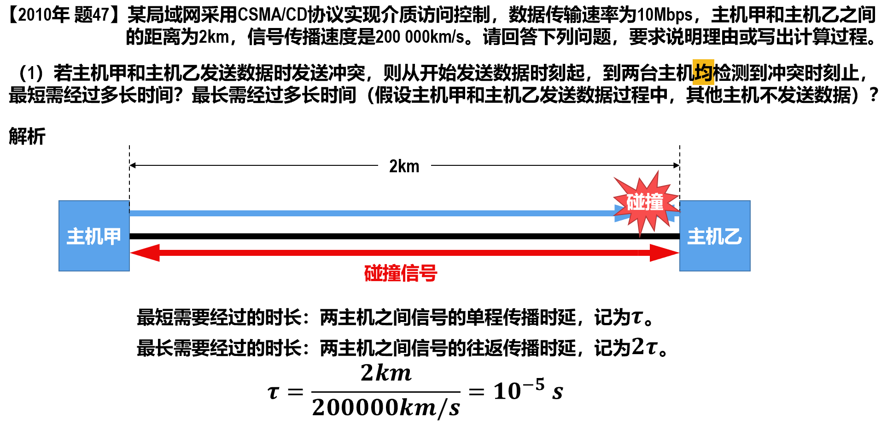

---

#### 共享式以太网的最小帧长和最大帧长

由于可能存在因为发送的帧过短而无法在发送完该帧之前检测出碰撞的情况，因此共享总线以太网规定了**最小帧长**。

为了确保共享总线以太网上的每一个站点在发送完一个完整的帧之前，能够检测出是否产生了碰撞，**帧的发送时延就不能少于共享总线以太网端到端的往返时间**，即一个争用期 $2\tau$ 。

对于𝟏𝟎𝑴𝒃/𝒔的共享总线以太网，其争用期 $2\tau$ 的值规定为𝟓𝟏.𝟐 $\mu s$，因此其**最小帧长**为𝟓𝟏𝟐𝒃，即𝟔𝟒𝑩。

- 当某个站点在发送帧时，如果帧的前𝟔𝟒𝑩没有遭遇碰撞，那么帧的后续部分也就不会遭遇碰撞。也就是说，如果遭遇碰撞，就一定是在帧的前𝟔𝟒𝑩之内。
- 由于发送帧的站点边发送帧边检测碰撞，一旦检测到碰撞就立即中止帧的发送，此时已发送的数据量一定小于𝟔𝟒𝑩。因此，接收站点**收到长度小于𝟔𝟒𝑩的帧**，就可判定这是一个**遭遇了碰撞而异常中止的无效帧**，将其丢弃即可。

一般来说，帧的数据载荷的长度应**远大于**帧首部和尾部的总长度，这样可以提高帧的传输效率。

然而，如果不限制数据载荷的长度上限，就可能使得**帧的长度太长**，这会带来一些问题。

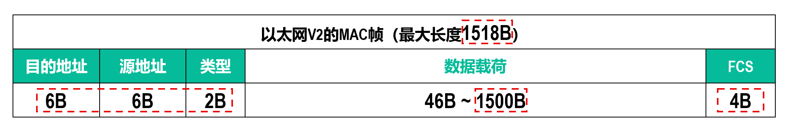

这是满足最小帧长的要求的，因为 6 + 6 + 2 + 46 + 4 = 64 字节。

??? note "PPT 例题"
    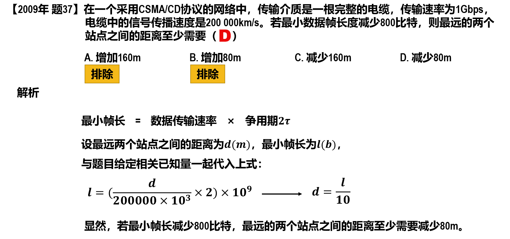

---

#### 共享式以太网的退避算法

在使用CSMA/CD协议的共享总线以太网中，正在发送帧的站点一边发送帧一边检测碰撞，当检测到碰撞时就立即停止发送，**退避一段随机时间**后再重新发送。

共享总线以太网中的各站点采用**截断二进制指数退避**（Truncated Binary Exponential Backoff）算法来选择退避的随机时间。

$$\text{退避时间 } = \text{ 基本退避时间 } \times \text{ 随机数 } r$$

- 基本退避时间：$2 \tau$ ，即一个**争用期**的时长。
- 随机数 $r$ ：r 从离散整数集合 $\{0,1,2, \ldots , 2^k -1\}$ 中**随机选出**一个数，$k = \min (\text{重传次数},10)$ 。这是该算法名称中“截断二进制指数”这种称谓的由来。

如果连续多次发送碰撞，就表明可能有较多的站点参与竞争信道。但使用上述退避算法可**使重传需要推迟的平均时间随重传次数而增大**（即**动态退避**），因而减小产生碰撞的概率。

当**重传达16次仍不能成功**时，就表明同时打算发送帧的站点太多，以至于连续产生碰撞，此时应**放弃重传**并向高层报告。

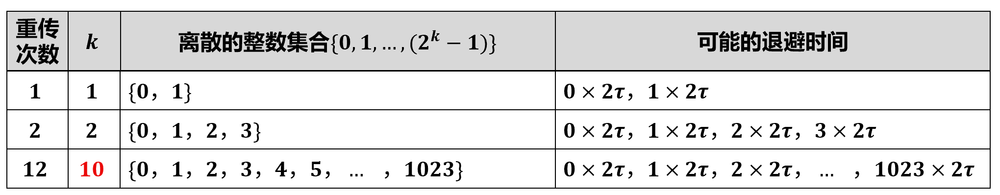

---

#### 共享式以太网的信道利用率

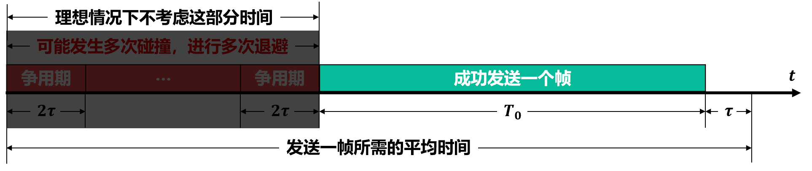

考虑以下这种理想情况：

- 总线一旦空闲就有某个站点立即发送帧
- 各站点发送帧都不会产生碰撞
- 发送一帧占用总线的时间为 $T_0 + \tau$ ，而帧本身的发送时间是 $T_0$

$$\text{极限信道利用率 } S_{max} = \frac{T_{0}}{T_{0} + \tau} = \frac{1}{1 + \frac{\tau}{T_{0}}} = \frac{1}{1 + \alpha}$$

- 参数 $\alpha$ 的值应尽量小，以提高信道利用率。
- 共享总线以太网端到端的距离不应太长
- 帧的长度应尽量大

??? note "PPT 例题"
    

    - 信号传播延迟也就是 $\tau$ , $\tau$ 越小，信道利用率越高。
    - CSMA/CD (Carrier Sense Multiple Access / Collision Detection) ：用在有线以太网。边发边听。在无线环境中无法工作。
    - CSMA/CA (Carrier Sense Multiple Access / Collision Avoidance) ：用在无线以太网。因为无线信道的特殊性，无法边发边听，所以采用避免碰撞的方法。发送前，先听信道是否空闲。如果信道空闲，不能马上发。必须先等待一个固定的帧间间隔 (DIFS)。等完 DIFS 后，再等待一个随机退避时间（在一个“竞争窗口”内随机选个数）。当随机计时器倒数到 0 时，发送数据。由于无法检测碰撞，发送方必须依赖接收方显式地回复一个 ACK (确认) 帧。

---

### 使用集线器的共享式以太网

早期的传统以太网是使用**粗同轴电缆**的共享**总线**以太网，后来发展到使用价格相对便宜的**细同轴电缆**。

当初认为这种连接方法既简单又可靠，因为在那个时代普遍认为**有源器件不可靠**，而**无源的电缆线**才是最可靠的。

- 然而，实践证明这种使用**无源电缆线和大量机械接口**的总线型以太网并不像人们想象的那么**可靠**。

- 若总线上的某个机械连接点接触不良或断开，则整个网络通信就不稳定或彻底断网。

在使用细同轴电缆的共享总线以太网之后，以太网发展出来了一种使用大规模集成电路来替代总线、并且可靠性非常高的设备，叫作**集线器**（Hub）。

站点连接到集线器的传输媒体也转而使用更便宜、更灵活的**双绞线电缆**。

集线器的一些主要特点如下：

1. 使用集线器的以太网虽然**物理拓扑是星型**的，但在**逻辑**上仍然是一个**总线网**。总线上的各站点共享总线资源，使用的还是**CSMA/CD协议**。
2. 集线器只工作在**物理层**，它的每个接口仅简单地转发比特，并不进行碰撞检测。碰撞检测的任务由各站点中的网卡负责。
3. 集线器一般都有**少量的容错能力和网络管理功能**。例如，若网络中某个站点的网卡出现了故障而不停地发送帧，集线器可以检测到这个问题，在内部断开与出故障网卡的连线，使整个以太网能正常工作。

IEEE于1990年制定了**10BASE-T**星型以太网的标准802.3i，这种以太网是局域网发展史上的一座非常重要的里程碑，它为**以太网在局域网中的统治地位**奠定了牢固的基础。

- 10BASE-T以太网的通信距离较短，每个**站点到集线器**的距离**不能超过100m**。
- IEEE 802.3以太网还可使用光纤作为传输媒体，相应的标准为10BASE-F，“F”表示光纤。光纤主要用作集线器之间的远程连接。

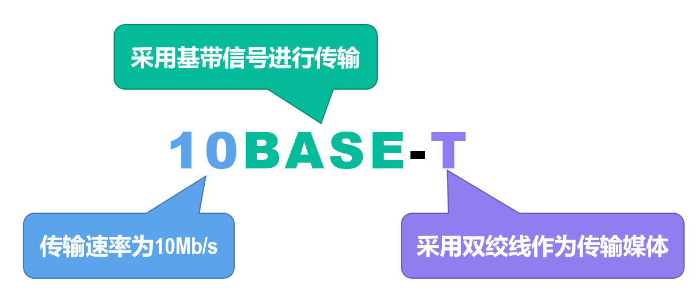

??? note "PPT 例题"
    

???+ example "question"
    在某CSMA/CD局域网中，使用一个Hub连接所有站点，且限定站点到Hub的最长距离为100m,信号的传播速率为200000km/s,则站点的最长冲突检测时间是()。
    
    A.2μs
    
    B.2ms
    
    C.1μs
    
    D.1ms

??? note "answer"
    答案：A

    限定站点到集线器(Hub)的最长距离为 100m，则两个站点之间的最长距离为200m，最长冲突检测时间等于信号在两个最远站点之间的往返传输时间，即 2x200m/200000km/s=2us。

???+ example "question"
    如下图所示，在Hub再生比特流的过程中会产生1.535μs的时延(Switch和Hub均为100Base-T设备),信号传播速率为200m/μs,不考虑以太网帧的前导码，则H3和H4之间理论上可以相距的最远距离是()。

    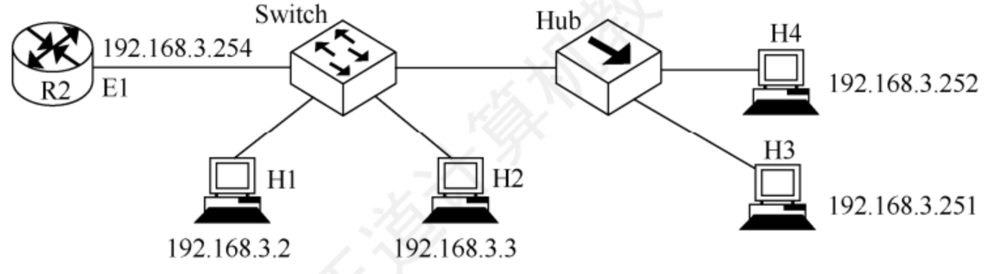
    
    A.200m
    
    B.205m
    
    C.359m
    
    D.512m

??? note "answer"
    B

    有关最短帧长的题要抓住两个公式来分析:
    
    1. 发送帧的时间>争用期的时间;
    
    2. 最短帧长数据传输速率x争用期时间。要使公式1恒成立，就要考虑在最短帧长的情况下公式1仍成立。
    
    对于本题，发送最短帧的时间为 64B-100Mb=5.12 $\mu$ s，根据公式 1 可知，该时间即为争用期时间(往返时延)的最大值。

    本题的特点在于往返时延由两部分组成，即传播时延和 Hub,产生的转发时延单程总时延为 2.56 $\mu$ s，Hub 产生的转发时延为 1.535 $\mu$ s，所以传播时延为 2.56-1.535 = 1.025 $\mu$ s，从而 H3 与 H4 之间理论上可以相距的最大距离为 200m/$\mu$s x 1.025 $\mu$ s=205m。

---

### 在物理层扩展以太网

#### 扩展站点与集线器之间的距离(转发器太古早了不需要记忆)

共享总线以太网中两站点之间的**距离不能太远**，否则它们之间所传输的**信号就会衰减到使CSMA/CD协议无法正常工作**。

在早期广泛使用粗同轴电缆或细同轴电缆共享总线以太网时，为了提高网络的地理覆盖范围，常用的是**工作在物理层的转发器**。

IEEE 802.3标准规定，两个网段可用一个转发器连接起来，任意两个站点之间最多可以经过三个网段。

随着使用双绞线和集线器的10BASE-T星型以太网成为以太网的主流类型，扩展网络覆盖范围就很少使用转发器了。

10BASE-T星型以太网中每个站点到集线器的距离不能超过100m，因此两站点间的通信距离最大不能超过200m。

在10BASE-T星型以太网中，可使用**光纤**和一对**光纤调制解调器**来扩展站点与集线器之间的距离。

- 这种扩展方法比较简单，所需付出的代价是：为站点和集线器各增加一个用于电信号和光信号转换的光纤调制解调器，以及它们之间的一对通信光纤。

信号在光纤中的衰减和失真很小，因此使用这种方法可以很简单地将站点与集线器之间的距离扩展到1000以上。

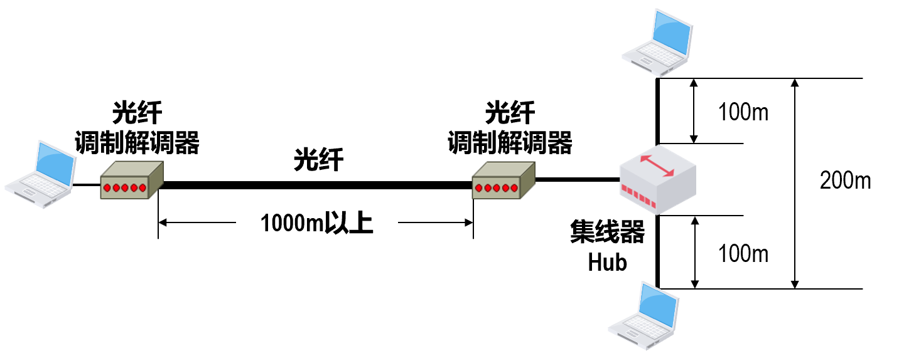

---

#### 扩展共享式以太网的覆盖范围和站点数量

以太网集线器一般具有8~32个接口，如果要连接的站点数量超过了单个集线器能够提供的接口数量，就需要使用多个集线器，这样就可以连接成覆盖更大范围、连接更多站点的多级星型以太网。

采用多个集线器连接而成的多级星型以太网，在扩展了网络覆盖范围和站点数量的同时，也带来了一些负面因素。

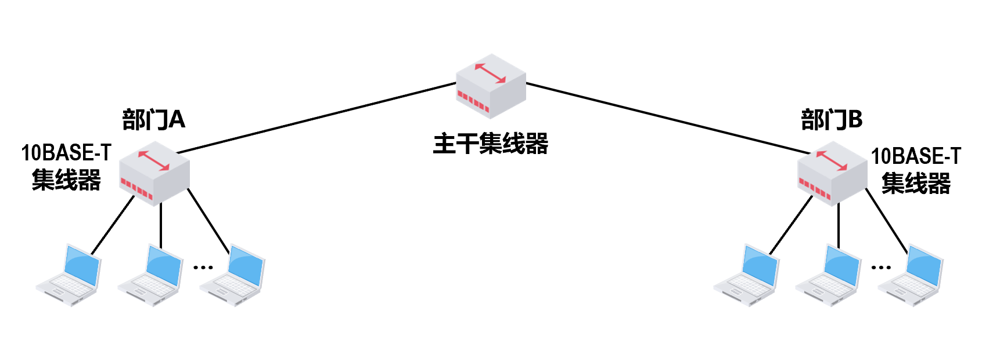

- 本来是部门A一个碰撞域，部门B一个碰撞域，现在变成了一个大的碰撞域，碰撞概率增大，信道利用率降低。
- 在物理层扩展的共享式以太网仍然是一个碰撞域，不能连接太多的站点，否则可能会出现大量的碰撞，导致平均吞吐量太低。

---

### 在数据链路层扩展以太网

#### 使用网桥在数据链路层扩展以太网

网桥（bridge）工作在数据链路层（包含其下的物理层），因此**网桥具备属于数据链路层范畴的相关能力**。

- 网桥可以识别帧的结构。
- 网桥可以根据帧首部中的**目的MAC地址**和网桥自身的**帧转发表**来转发或丢弃所收到的帧。

网桥会把连接的每个网段作为独立的碰撞域，只有需要跨网段通信时才转发帧。所以，使用网桥可以**减少碰撞域的大小**，从而**降低碰撞概率，提高信道利用率**。

---

#### 网桥的主要结构和基本工作原理

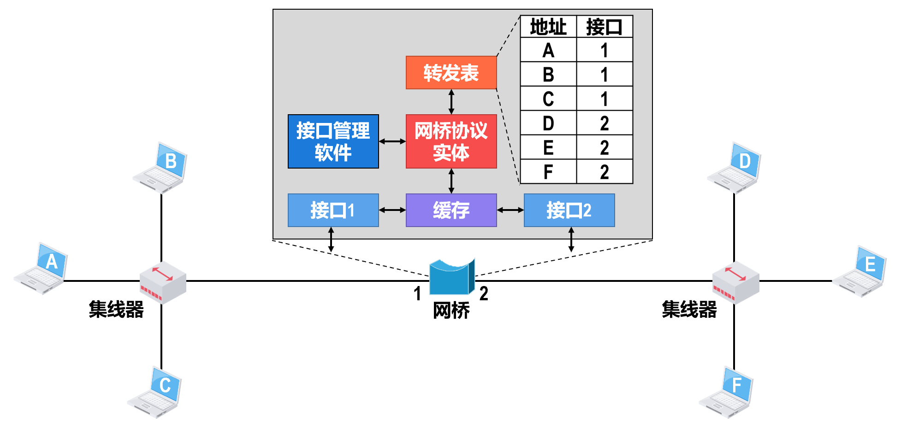

- 网桥的接口在向其连接的网段转发帧时，会执行相应的媒体接入控制协议，对于共享式以太网就是CSMA/CD协议。

工作原理:

1. 网桥收到一个帧后，检查帧的目的MAC地址。
2. 查找转发表，判断该地址属于哪个接口（哪个网段）。

- 如果目的地址在本地网段（如A发给B），网桥不转发，直接丢弃，减少不必要的流量。
- 如果目的地址在另一个网段（如A发给E），网桥转发该帧到对应接口，实现跨网段通信。

3. 网桥会自动学习：每收到一个帧，就把源MAC地址和收到的接口记入转发表，实现自适应。

---

#### 透明网桥的自学习和转发帧的流程

透明网桥（Transparent Bridge）通过**自学习**算法建立转发表。

透明网桥中的“**透明**”，是指以太网中的各站点并不知道自己所发送的帧将会经过哪些网桥的转发，最终到达目的站点。也就是说，**以太网中的各网桥对于各站点而言是看不见的**。

透明网桥的标准是IEEE 802.1D，它通过一种自学习算法**基于以太网中各站点间的相互通信**逐步建立起自己的转发表。

流程：

1. 网桥收到帧后进行**登记**（即**自学习**），登记的内容为帧的源MAC地址和进入网桥的接口号。
2. 网桥根据帧的**目的MAC地址**和网桥的**转发表**对帧进行**转发**，包含以下三种情况：

- **明确转发**：网桥知道应当从哪个接口转发帧。
- **盲目转发**：网桥不知道应当从哪个接口转发帧，只能将其通过除进入网桥的接口外的其他所有接口转发。
- **丢弃**：网桥知道不应该转发该帧，将其丢弃。

!!! info "attention"
    1. 如果网桥收到有误码的帧则直接丢弃。

    2. 如果网桥收到一个无误码的广播帧，则不用进行查表，而是直接从除接收该广播帧的接口的其他接口转发该广播帧。

    3. 转发表中的每条记录都有其有效时间，到期自动删除！这是因为各站点的MAC地址与网桥接口的对应关系并不是永久性的，例如某个站点更换了网卡，其MAC地址就会改变。

---

#### 透明网桥的生成树协议STP

为了提高以太网的**可靠性**，有时需要在两个以太网之间使用多个透明网桥来提供**冗余链路**。在增加冗余链路提高以太网可靠性的同时，却给网络引入了**环路**。

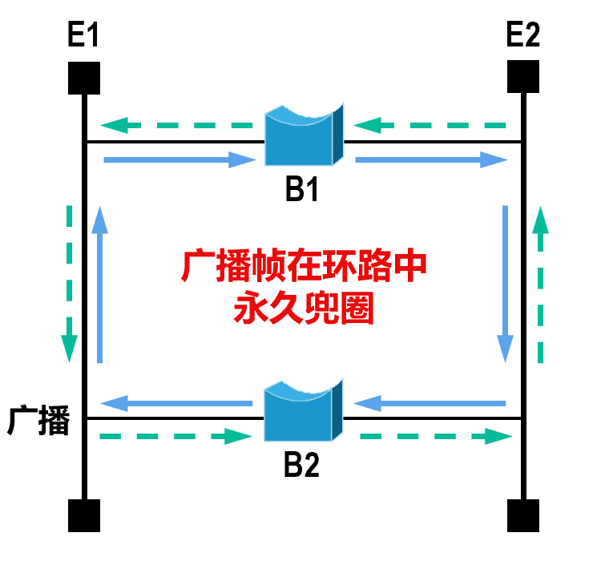

- 若网桥B1和B2的转发表中都没有待转发单播帧目的MAC地址的相关记录，则该单播帧也会引起类似的情况。
- 为了简单起见，未考虑信号在总线上碰撞的情况。

网络中的**广播帧将在环路中永久兜圈**，造成广播帧充斥整个网络，**网络资源被白白浪费**，而网络中的主机之间无法正常通信！

为了避免广播帧在环路中永久兜圈，透明网桥使用**生成树协议**（Spanning Tree Protocol，STP），可以在增加冗余链路提高网络可靠性的同时，又避免环路带来的问题。

- 不管网桥之间连接成了怎样复杂的带环拓扑，网桥之间通过**交互网桥协议单元**（Bridge Protocol Data Unit，BPDU），**找出原网络拓扑的一个连通子集**（即生成树），在这个子集里整个连通的网络中**不存在环路**。
- 当首次连接网桥或网络拓扑发生变化时（人为改变或出现故障），网桥都会重新构造生成树，以确保网络的连通。

---

## 交换式以太网

网桥的**接口数量很少**，通常只有2~4个，一般只用来**连接不同的网段**。

1990年面世的**交换式集线器**（Switching Hub），实质上是**具有多个接口的网桥**，常称为**以太网交换机**（Switch）或二层交换机。

- “二层”是指以太网交换机工作在数据链路层（包括物理层）。
- 与网桥相同，交换机内部的转发表也是通过自学习算法，基于网络中各主机间的通信，自动地逐步建立起来的。
- 另外，交换机也使用生成树协议STP，来产生能够连通全网但不产生环路的通信路径。

仅使用交换机（而不使用集线器）的以太网就是交换式以太网。

---

### 以太网交换机

以太网**交换机**（以下简称交换机）本质上就是一个**多接口的网桥**：

- 交换机自学习和转发帧的流程与网桥是相同的。
- 另外，交换机也使用生成树协议STP，来产生能够连通全网但不产生环路的通信路径。

交换机的每个接口可以连接**计算机**，也可以连接**集线器**或另一个**交换机**。

- 当交换机的**接口与计算机或交换机连接**时，可以工作在**全双工方式**，并能**在自身内部同时连通多对接口**，使每一对相互通信的计算机都能像独占传输媒体那样，无碰撞地传输数据，这样就**不需要使用CSMA/CD协议**了。
- 当交换机的**接口连接的是集线器**时，该接口就**只能使用CSMA/CD协议**并只能工作在**半双工方式**。
- 现在的交换机和计算机中的网卡都能自动识别上述两种情况，并自动切换到相应的工作方式。

交换机一般都具有多种速率的接口，例如10Mb/s、100Mb/s、1Gb/s甚至10Gb/s的接口，大部分接口支持多速率自适应。

??? note "PPT 例题"
    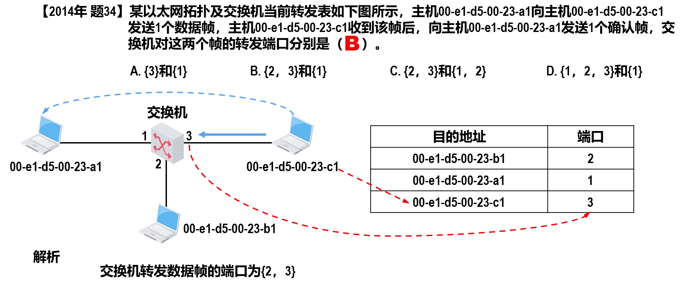

    

一般的交换机都采用“**存储转发**”方式，为了减小交换机的转发时延，某些交换机采用了**直通**（Cut-Through）交换方式。

采用**直通交换方式**的交换机，在**接收帧的同时就立即按帧的目的MAC地址决定该帧的转发接口**，然后通过其内部**基于硬件的交叉矩阵**进行转发，而不必把整个帧先缓存后再进行处理。

- 直通交换的**时延非常小**。
- 直通交换**不检查差错就直接将帧转发出去**，有可能会将一些无效帧转发给其他主机。

??? note "PPT 例题"
    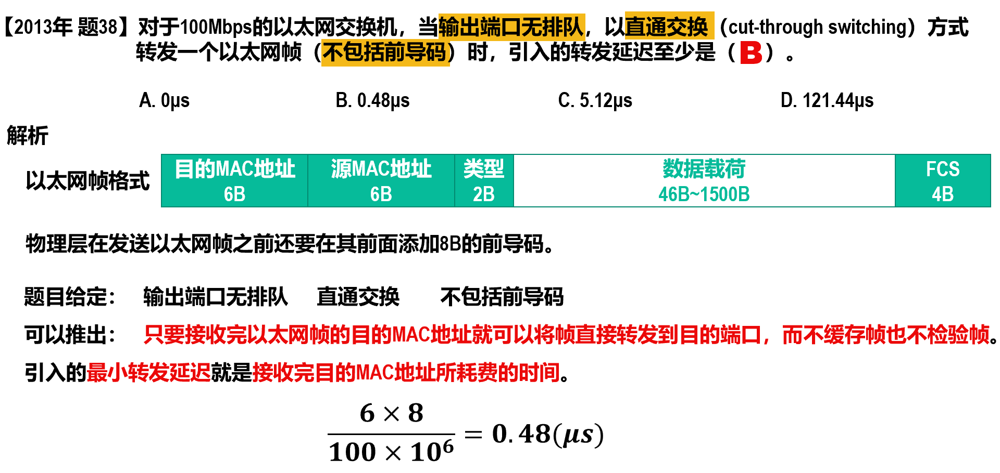

---

### 共享式以太网与交换式以太网的对比(集线器与交换机的对比)

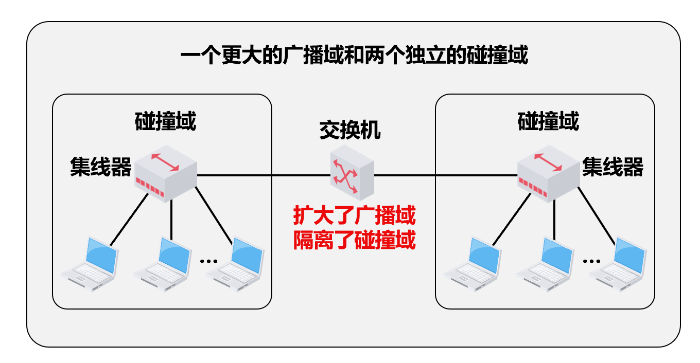

**集线器**（Hub）——共享式以太网

- **碰撞域**：所有连接在同一个集线器上的主机属于**同一个碰撞域**。多个集线器级联后，碰撞域会变得更大，所有主机争用同一带宽，容易发生冲突。
- **广播域**：集线器不隔离广播域，所有主机都能收到广播帧。

**交换机**（Switch）——交换式以太网

- **碰撞域**：每个端口是一个独立的碰撞域。即使多个主机通过交换机互联，每对通信主机之间互不干扰，大大减少了碰撞。
- **广播域**：默认情况下，交换机不隔离广播域，所有端口收到广播帧都会转发（除非划分VLAN）。

交换式以太网的网络性能远高于共享式以太网，集线器早已被交换机取代。

??? note "PPT 例题"
    

    - 以太网交换机工作在数据链路层（包含其下的物理层），因此以太网交换机**具备属于数据链路层范畴的相关能力**。但不同网络层协议的网络互联属于网络层范畴，以太网交换机无法处理。

    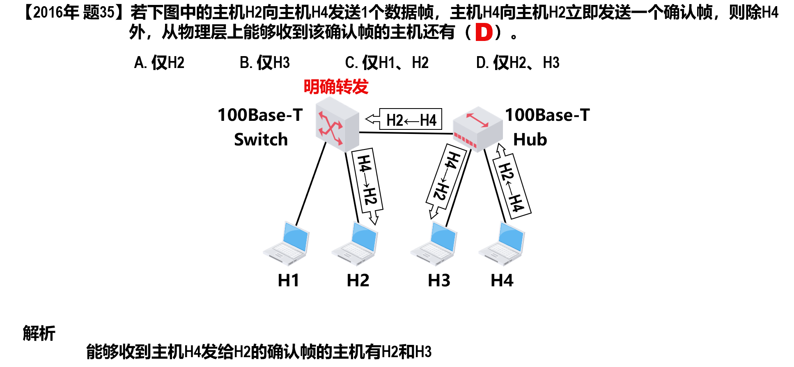

    

---

## 以太网的MAC帧格式

- 目的地址：6字节，表示接收该帧的设备的MAC地址。如果是广播帧，则该字段为FF-FF-FF-FF-FF-FF。
- 源地址：6字节，表示发送该帧的设备的MAC地址。
- 类型：2字节，其值用来指明数据载荷中的内容是由上一层的哪个协议封装的，以便将收到的MAC帧的数据载荷上交给上一层的这个协议。例如 `0x0800` 表示数据载荷中封装的是TCP/IP网际层IP协议封装的PDU，`0x8137` 表示数据载荷中封装的是由Novell网络层IPX协议封装的PDU。
- FCS：4字节，帧校验序列，用于差错检测。使用**CRC**生成的帧检验序列FCS，接收方的网卡通过FCS的内容就可**检测**出帧在传输过程中是否产生了**误码**。(CRC的检测范围是从目的MAC地址开始，到数据载荷的最后一个字节为止的所有字节)。

接收方可能收到的无效MAC帧包括以下几种：

1. MAC帧的长度不是整数个字节
2. 通过MAC帧的FCS字段的值检测出帧有误码
3. MAC帧的长度不在64~1518字节之间

接收方收到无效的MAC帧时，就简单将其丢弃，以太网的数据链路层没有重传机制。

---

## 虚拟局域网

---