# Chapter 4 | 网络层

## 网络层概述

### 分组转发和路由选择

网络层的主要任务就是将分组**从源主机经过多个网络和多段链路传输到目的主机**，可以将该任务划分为**分组转发**和**路由选择**两种重要的功能。

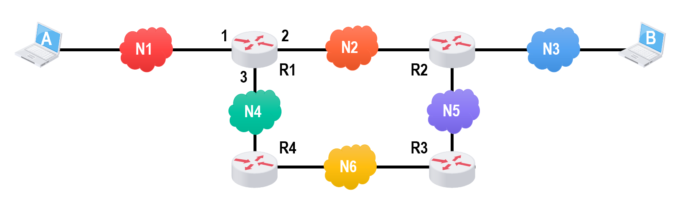

> R1如何知道应从自己的哪个接口转发分组？
> 
> R1通过查阅自己的**转发表**来决定分组的转发接口。转发表中列出了到达各个目的地的路径信息，包括目的地地址前缀、下一跳路由器地址以及应使用的接口等。
> 
> 转发表如何得来？
> 
> 路由器通过**路由选择算法**来动态地构建和维护路由表。路由选择算法根据网络拓扑结构、链路状态和其他因素，计算出到达各个目的地的最佳路径，并将这些路径信息存储在路由表中。转发表则是路由表的一部分，专门用于指导分组的转发。
> 
> 路由表又如何得来？
> 
> 路由表可以通过**静态配置**或**动态路由协议**来获得。静态配置是由网络管理员手动设置的，而动态路由协议（如RIP、OSPF、BGP等）则允许路由器自动交换路由信息，动态更新路由表。
>
> 
> 
> 转发表是地图，路由选择算法是导航系统，路由表是导航系统中的路线数据库。
> 
> 总的来说，路由表是根据路由选择算法得出的，而转发表是从路由表得出的。转发表的结构应使查找过程最优化，路由表则需要最优化网络拓扑变化的计算。在讨论路由选择的原理时，往往不区分转发表和路由表，而笼统地使用路由表一词。

??? note "中继系统分类"
    1. 物理层中继系统:转发器，集线器
    
    2. 数据链路层中继系统:网桥或交换机。
    
    3. 网络层中继系统:路由器。
    
    4. 网络层以上的中继系统:网关。

???+ example
    在路由器互连的多个局域网的结构中，要求每个局域网( )。
    
    A.物理层协议可以不同，而数据链路层及其以上的高层协议必须相同
    
    B.物理层、数据链路层协议可以不同，而数据链路层以上的高层协议必须相同
    
    C.物理层、数据链路层、网络层协议可以不同，而网络层以上的高层协议必须相同
    
    D.物理层、数据链路层、网络层及高层协议都可以不同

??? note "answer"
    C

    路由器是第三层设备，向传输层及以上层隐藏下层的具体实现，所以物理层、数据链路层、网络层协议可以不同。而网络层之上的协议数据是路由器所不能处理的，因此网络层以上的高层协议必须相同。本题容易误选 B，主要原因是在目前的互联网中广泛使用的是 TCP/IP 族，在网络层用的多是IPv4,所以误认为网络层协议必须相同。实际上，使用特定的路由器连接 IPv4 与 PPv6网络，就是典型的网络层协议不同而实现互连的例子。

---

### 网络层向其上层提供的两种服务

- 面向连接的虚电路服务
- 无连接的数据报服务

---

#### 面向连接的虚电路服务

核心思想是“**可靠通信应由网络自身来保证**”。

必须首先建立**网络层连接**—— **虚电路**（Virtual Circuit，VC），以保证通信双方所需的一切网络资源。

通信双方**沿着已建立的虚电路发送分组**。

- 虚电路表示这是一条逻辑上的连接，分组沿着这条逻辑连接按照存储转发方式传送，而不是真正建立了一条物理连接。
- 而采用电路交换的电话通信，则是先建立一条真正的物理连接。因此，分组交换的虚连接与电路交换的连接只是类似，但并不完全一样。
- 分组的首部仅在连接建立阶段使用完整的目的主机地址，之后每个分组的首部只需要携带一条虚电路编号即可。

通信结束后，需要**释放**之前所建立的虚电路。

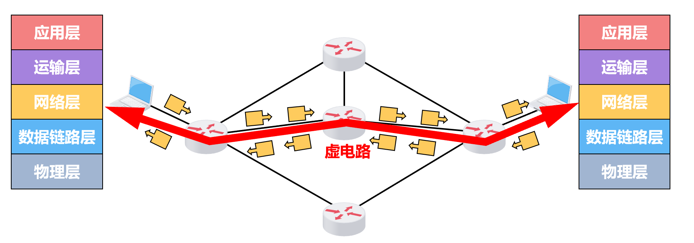

这种通信方式如果再使用**可靠传输的网络协议**，就可使所发送的分组最终正确（无差错按序到达、不丢失、不重复）到达接收方。

很多广域分组交换网都使用面向连接的虚电路服务。例如，曾经的X.25和逐渐过时的帧中继（Frame Relay，FR）、异步传输模式（Asynchronnous Transfer Mode，ATM）。

然而，因特网的先驱者并没有采用这种设计思想，而是采用了无连接的数据报服务。

---

#### 无连接的数据报服务

核心思想是“**可靠通信应由用户主机来保证**”。

**不需要建立网络层连接。**

**每个分组可走不同的路径。**因此，每个分组的首部都必须携带目的主机的完整地址。

通信结束后，**没有需要释放的连接**。

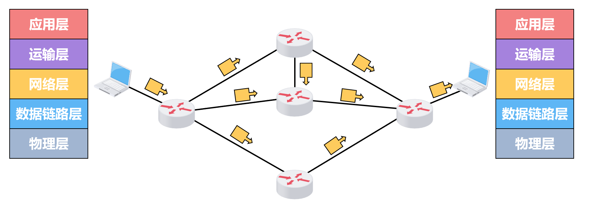

这种通信方式所传送的分组可能**误码、丢失、重复和失序**。

所以:

- 将复杂的网络处理功能置于因特网的边缘（即用户主机和其内部的运输层）
- 将相对简单的尽最大努力（即不可靠）的分组交付功能置于因特网核心。

由于网络自身不提供端到端的可靠传输服务，这就使得网络中的路由器可以做得比较简单，大大降低了网络造价。

另外，这种设计思想的运行方式灵活、能够适应多种应用。因特网能够发展到今日的规模，充分证明了当初采取这种设计思想的正确性。

那么对于 TCP/IP体系结构来说，网际层可以提供简单灵活的、无连接的不可靠的数据报服务。

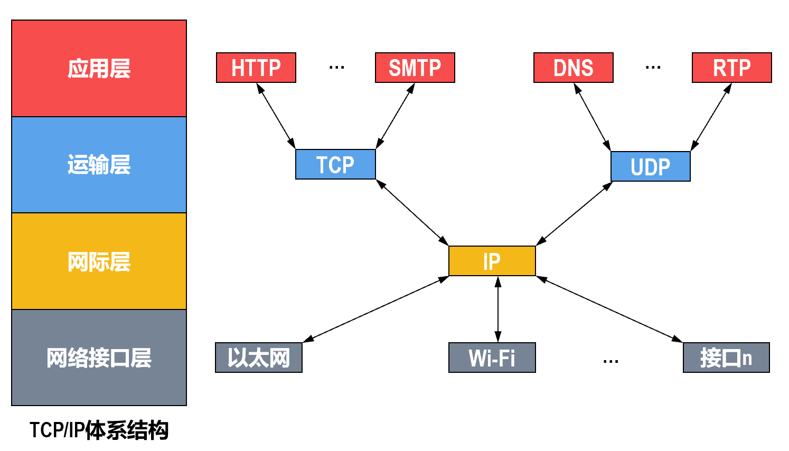

???+ example
    路由器在能够开始向输出链路传输分组的第一位之前，必须先接收到整个分组，这种机制称为()。
    
    A.存储转发机制  B.直通交换机制  C.分组交换机制   D.分组检测机制

??? note "answer"
    A

    路由器转发一个分组的过程如下:先接收整个分组，然后对分组进行错误检查，若出错，则丢弃错误的分组:否则存储这个正确的分组。最后根据路由选择协议，将正确的分组转发到合适的端口，这种机制称为存储转发机制。

    分组交换机制：泛指网络层采用分组方式进行数据交换，不特指分组的转发方式。

???+ example
    下列关于虚电路和数据报的叙述中，正确的是()。
    
    A.虚电路是一种分组交换技术，但不能按照存储转发的方式工作
    
    B.虚电路的连接是临时性连接，当会话结束时就释放这种连接
    
    C.数据报服务不提供可靠传输，但可以保证分组的有序到达
    
    D.数据报服务中，每个分组都必须携带源地址和目的地址

??? note "answer"
    D

    虚电路是一种分组交换技术，它可以采用存储转发的方式工作，选项A错误。虚电路不只是临时性的，它提供的服务包括永久性虚电路(PVC)和交换型虚电路(SVC)，其中前者是一种提前定义好的、基本上不需要任何建立时间的端点之间的连接,而后者是端点之间的一种临时性连接,这些连接只持续所需的时间，且在会话结束时就取消这种连接，选项B错误。数据报服务是无连接的，既不提供可靠性保障，又不保证分组的有序到达，选项C错误。在数据报服务中，每个分组都必须携带源地址和目的地址;而虚电路服务中，建立连接后，分组只需携带虚电路标识。

---

## 网际协议（IP）

### 异构网络互连

#### 网际协议IP

网际协议（Internet Protocol，IP）是TCP/IP体系结构**网际层中的核心协议**。

网际协议IP、传输控制协议TCP、TCP/IP体系结构是由“因特网之父” Robert Kalm 和 Vint Cerf 二人共同研发的，1974年5月发布了TCP/IP的第一个版本。

---

#### 异构网络互连

要将众多的异构型网络都互连起来，并且能够互相通信，则会面临许多需要解决的问题。不同的网络接入机制、不同的差错恢复方法、不同的路由选择技术、不同的寻址方案、不同的最大分组长度、不同的服务（面向连接服务和无连接服务）。

这些网络的拓扑、性能以及所使用的网络协议都不尽相同，这是由用户需求的多样性造成的，**没有一种单一的网络**能够适应所有用户的需求。

当IP网上的主机进行通信时，就好像在一个单个网络上通信一样，它们看不见互连的各网络的具体异构细节。

---

### IPv4地址及其编址方法

#### IPv4地址概述

IPv4地址是给因特网（Internet）上的**每一个主机（或路由器）的每一个接口**分配的一个在全世界范围内**唯一的32比特的标识符**。

??? note "something about 唯一(MAC & IPv4)"
    MAC地址唯一：MAC地址是网卡的物理地址，用于局域网内设备识别。唯一性保证同一网络内不会有地址冲突，数据能准确送达目标设备。

    IPv4地址唯一：IPv4地址是网络层的逻辑地址，用于全球范围内设备通信。唯一性保证因特网中每个主机都能被正确定位和访问。

    还有什么是**唯一**的？

    - 端口号（在同一主机上）：用于区分同一IP下不同应用进程。

    - 域名（全球唯一）：用于人类友好访问网站，DNS系统保证唯一。

    - UUID（通用唯一标识符）：用于软件、数据库等场景唯一标识对象。

    - 设备序列号：硬件厂商分配，用于唯一标识设备。

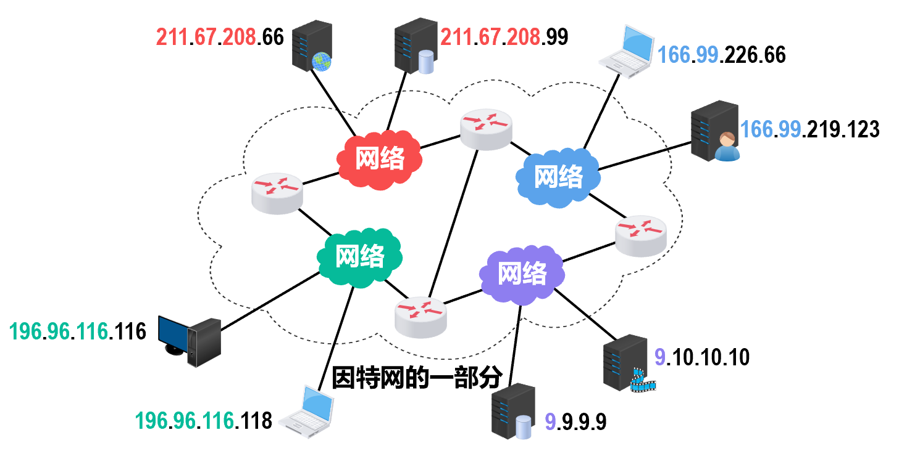

IPv4地址由**因特网名字和数字分配机构**（Internet Corporation for Assigned Names and Numbers，ICANN）进行分配。

- 我国用户可向**亚太网络信息中心**（Asia Pacific Network Information Center，APNIC）申请IP地址，需要缴纳相应的费用，一般不接受个人申请。
- 2011年2月3日，因特网号码分配管理局（Internet Assigned Numbers Authority，IANA）（由ICANN行使职能）宣布，IPv4地址已经分配完毕。
- 我国在2014至2015年也逐步停止了向新用户和应用分配IPv4地址，同时全面开展商用部署IPv6。

IPv4地址的编址方法经历了三个历史阶段：

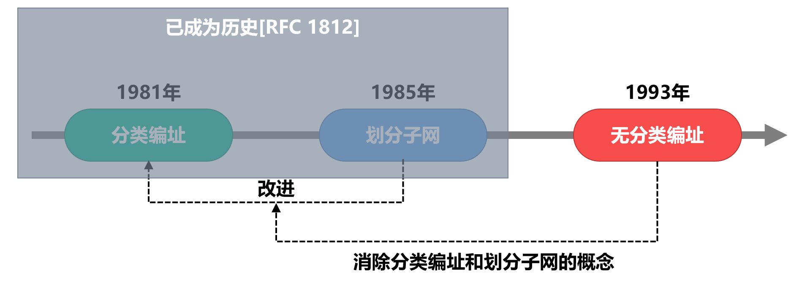

??? note "具体解释"
    1. 分类编址（Classful Addressing）

    最早的IPv4地址分配方法，将IP地址分为A、B、C、D、E五类（主要用A/B/C）。

    类地址有固定的网络号和主机号长度。例如：

    - A类：网络号8位，主机号24位，适合大型网络

    - B类：网络号16位，主机号16位

    - C类：网络号24位，主机号8位，适合小型网络

    优点：简单，易于实现。

    缺点：地址利用率低，容易造成浪费。例如一个单位可能只需要几十个主机，却被分配了一个C类地址（最多支持254主机）。

    2. 划分子网（Subnetting）

    为了提高地址利用率，引入了子网划分的概念。

    在原有的网络号和主机号之间，增加了“子网号”字段。

    网络管理员可以根据实际需求，把一个网络进一步划分为多个子网，每个子网有自己的主机号范围。

    优点：灵活分配地址，便于网络管理和扩展。

    缺点：依然受限于分类编址的结构，不能彻底解决地址浪费问题。

    3. 无分类编址（Classless Addressing，CIDR）

    1993年提出无分类域间路由（CIDR），彻底消除了分类编址和子网划分的概念。

    IP地址不再固定分为A/B/C类，而是用“前缀长度”来表示网络部分和主机部分（如192.168.1.0/24）。

    地址分配更加灵活，可以根据实际需要分配任意数量的地址块。

    优点：极大提高了地址利用率、支持更高效的路由聚合（路由表更小）、适应互联网规模快速增长。

    CIDR成为现代IPv4地址分配和路由的标准方法。

---

#### IPv4地址的表示方法

由于IPv4地址由32比特构成，不方便阅读、记录以及输入等，因此IPv4地址采用**点分十进制**表示方法以方便用户使用。

- 把32位二进制数每8位分为一组，共4组。每组称为一个“字节”（octet）。
- 每组8位二进制数转换为十进制数。四个十进制数之间用“.”分隔。

??? note "PPT 上的练习"
    

??? note "转换方式"
    **8位无符号二进制整数转十进制数**

    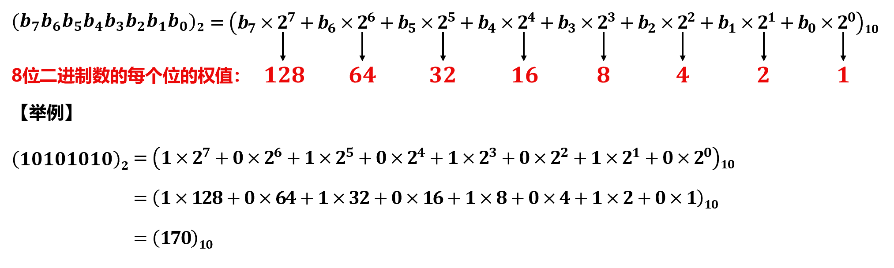

    

    **十进制正整数转8位无符号二进制数**

    

---

### IPv4地址的分类编址方法

**网络号**: 

- 标志主机（或路由器）的接口所连接到的**网络**
- **同一个网络中**，**不同**主机（或路由器）的**接口**的IPv4地址的**网络号必须相同**，表示它们属于同一个网络。

**主机号**:

- 标志主机（或路由器）的**接口**
- **同一个网络中**，**不同**主机（或路由器）的**接口**的IPv4地址的**主机号必须各不相同**，以便区分各主机（或路由器）的接口。

- **A类**、**B类**和**C类**地址都是**单播地址**，只有单播地址可以**分配给网络中的主机（或路由器）的各接口**。
- **主机号为“全0”**的地址是**网络地址**，**不能分配**给主机（或路由器）的各接口。
- **主机号为“全1”**的地址是**广播地址**，**不能分配**给主机（或路由器）的各接口。

---

#### A类地址

最小网络号为0，表示本网络，不能分配给实际网络使用。

最小可指派网络号为1，网络地址为 1.0.0.0。

最大网络号为127，作为本地环回测试地址，不能指派配给实际网络使用。

- 最小的本地环回测试地址为127.0.0.1
- 最大的本地环回测试地址为127.255.255.254

最大可指派的网络号为126，网络地址为 126.0.0.0。

可指派的 A 类网络数量为 $2^{7}-2=126$ 个。**（减2是去掉最小网络号0和最大网络号127）**

每个 A 类网络中可分配的地址数量为 $2^{24}-2=16,777,214$ 个。**（减2是去掉主机号为全0的网络地址和全1的广播地址）**

---

#### B类地址

最小可指派的网络号为128.0，网络地址为 128.0.0.0。

最大可指派的网络号为191.255，网络地址为 191.255.0.0。

可指派的 B 类网络数量为 $2^{16-2}=16,384$ 个。

每个 B 类网络中可分配的地址数量为 $2^{16}-2=65,534$ 个。

---

#### C类地址

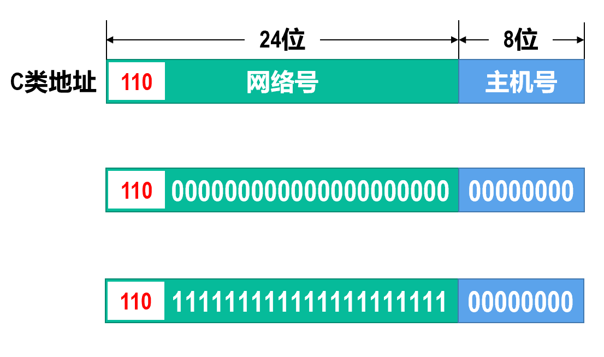

最小可指派的网络号为192.0.0，网络地址为 192.0.0.0。

最大可指派的网络号为223.255.255，网络地址为 223.255.255.0。

可指派的 C 类网络数量为 $2^{24-2}=2,097,152$ 个。

每个 C 类网络中可分配的地址数量为 $2^{8}-2=254$ 个。

??? note "为什么 B 和 C 类地址没有本网络和本地环回测试地址？"
    B类和C类的环回测试和本地网络功能都统一用A类的127和0来实现。这大概是历史遗留问题。

??? note "PPT 上的练习"
    

??? note "PPT 上的练习"
    

    

---

### IPv4地址的划分子网编址方法

随着更多的中小网络加入因特网，**IPv4分类编址方法不够灵活**、**容易造成大量IPv4地址资源浪费的缺点**就暴露出来了。

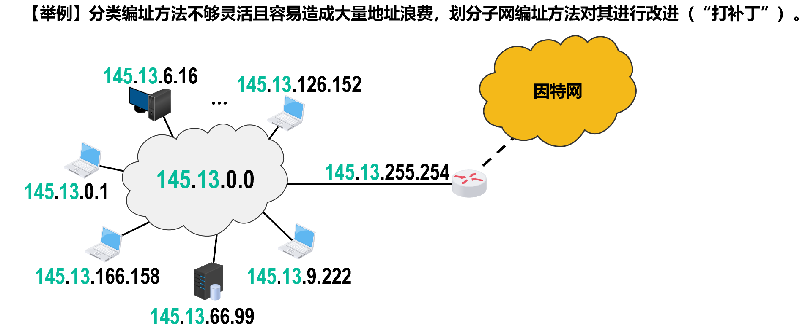

还剩余大量地址：只能由该单位的同一个网络使用，而其他单位的网络不能使用。

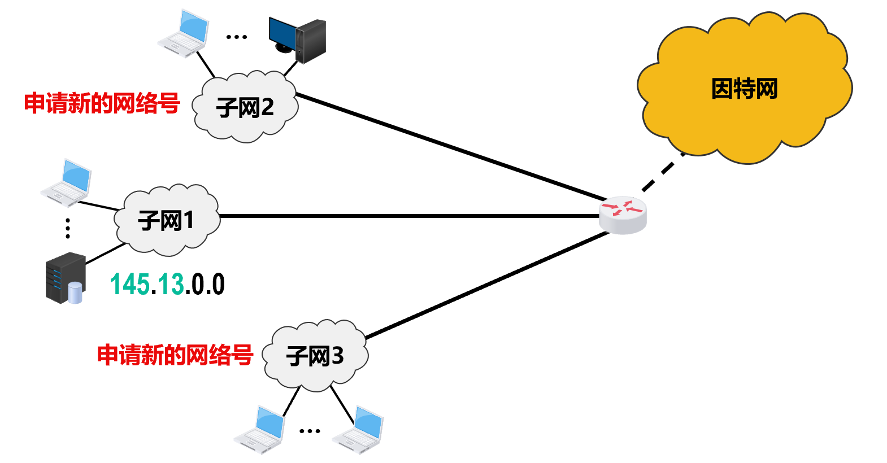

申请新的网络号存在以下弊端：

- 需要等待很长的时间，并且要花费更多的费用。
- 即便申请到了两个新的网络号，其他路由器的路由表还需要新增针对这两个新的网络的路由条目。
- 浪费原来已申请到的B类网络中剩余的大量地址。

如果可以从IPv4地址的主机号部分借用一些比特作为子网号来区分不同的子网，就可以利用原有网络中剩余的大量IPv4地址，而不用申请新的网络地址了。

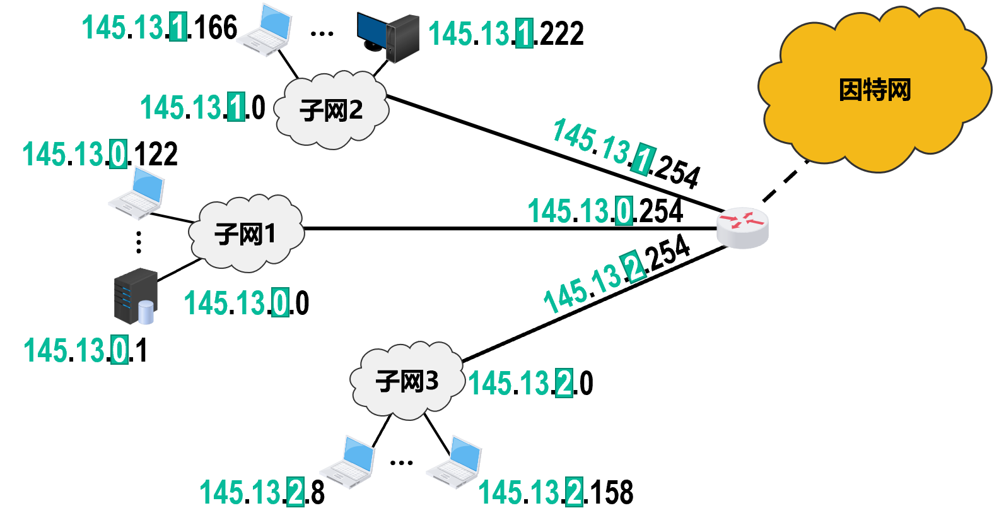

借用16比特主机号中的前8个比特作为子网号。

> 如果未在图中标记子网号部分，那么我们或计算机又如何知道在分类地址中，主机号有多少比特被借用作为子网号了呢？

**子网掩码**可以表明分类IPv4地址的主机号部分被借用了几个比特作为子网号。

与IPv4地址类似，子网掩码也是由**32比特**构成的。

- 用左起多个**连续的比特1**对应IPv4地址中的**网络号**和**子网号**；
- 之后的多个**连续的比特0**对应IPv4地址中的**主机号**。

将划分子网的**IPv4地址与相应的子网掩码**进行逐比特的**逻辑与运算**，就可**得到**该IPv4地址所在**子网的网络地址**。

**只要给定了一个分类的IPv4地址及其相应的子网掩码，就可以得出子网划分的全部细节。**

已知某个网络的地址为 `218.75.230.0` ，使用子网掩码 `255.255.255.128` 对其进行子网划分，请给出划分细节。

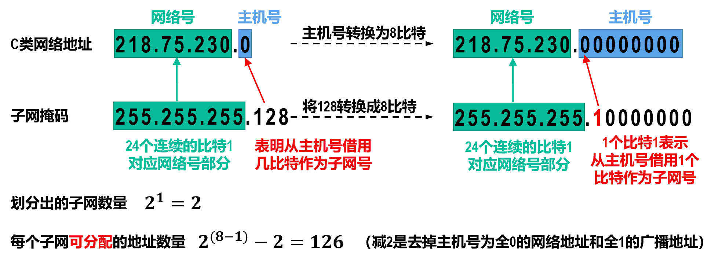

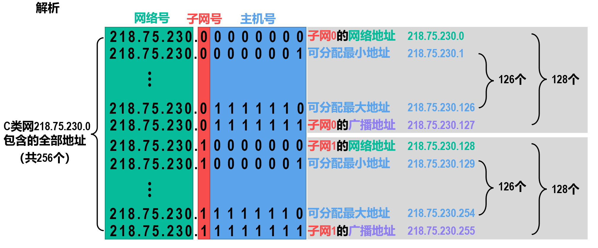

??? note "PPT 上的练习"
    

    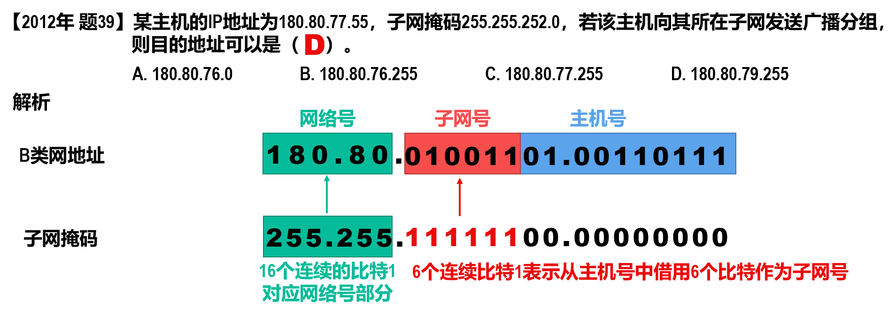

    

**默认子网掩码**是指在**未划分子网的情况下使用的子网掩码**。

---

### IPv4地址的无分类编址方法

IPv4地址的划分子网编址方法在一定程度上缓解了因特网在发展中遇到的困难，但是**数量巨大的C类网**($2^{24-3} =2097152$个)由于其每个网络所包含的地址数量太小($2^{8}-2=254$个)，因此**并没有得到充分使用**，而因特网的IPv4地址仍在加速消耗，**整个IPv4地址空间面临全部耗尽的威胁**。

为此，因特网工程任务组IETF又提出了采用**无分类编址**的方法，来解决IPv4地址资源紧张的问题，同时还专门成立IPv6工作组负责研究新版本的IP，以彻底解决IPv4地址耗尽问题。

1993年，因特网工程任务组IETF发布了**无分类域间路由选择**（Classless Inter-Domain Routing，**CIDR** ）的RFC文档[RFC1517~1519，RFC1520]。

- **CIDR消除了传统A类、B类和C类地址以及划分子网的概念。**
- **CIDR可以更加有效地分配IPv4地址资源，并且可以在IPv6使用之前允许因特网的规模继续增长。**

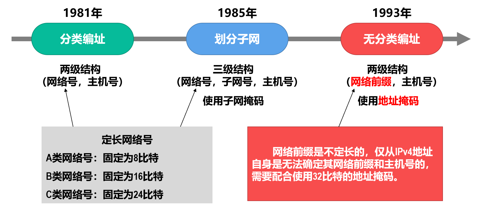

无分类编址方法使用的**地址掩码**与划分子网使用的**子网掩码**类似，由32比特构成。

- 用左起多个**连续的比特1**对应IPv4地址中的**网络前缀**；
- 之后的多个**连续的比特0**对应IPv4地址中的**主机号**。

??? note "举例"
    

    为了简便起见，可以不明确给出配套的地址掩码的点分十进制形式，而是在无分类编址的IPv4地址后面加上斜线“/”，在斜线之后写上网络前缀所占的比特数量（也就是地址掩码中左起连续比特1的数量），这种记法称为**斜线记法**。

    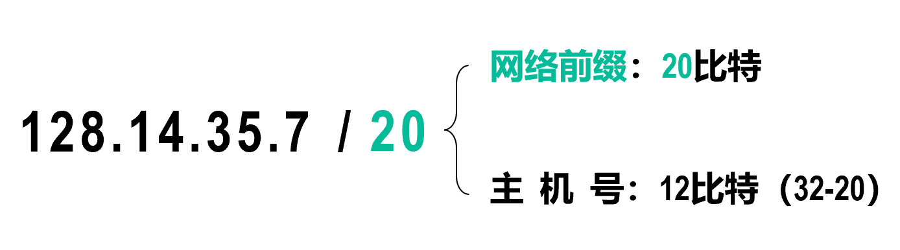

实际上，无分类域间路由选择CIDR是将网络前缀都相同的、连续的多个无分类IPv4地址，组成一个**CIDR地址块**，只要知道CIDR地址块中的任何一个地址，就可以知道该地址块的以下全部细节：

- 地址块中的**最小地址**
- 地址块中的**最大地址**
- 地址块中的**地址数量**
- 地址块中**聚合某类网络（A类、B类、C类）的数量**
- **地址掩码**

??? note "PPT 上的练习"
    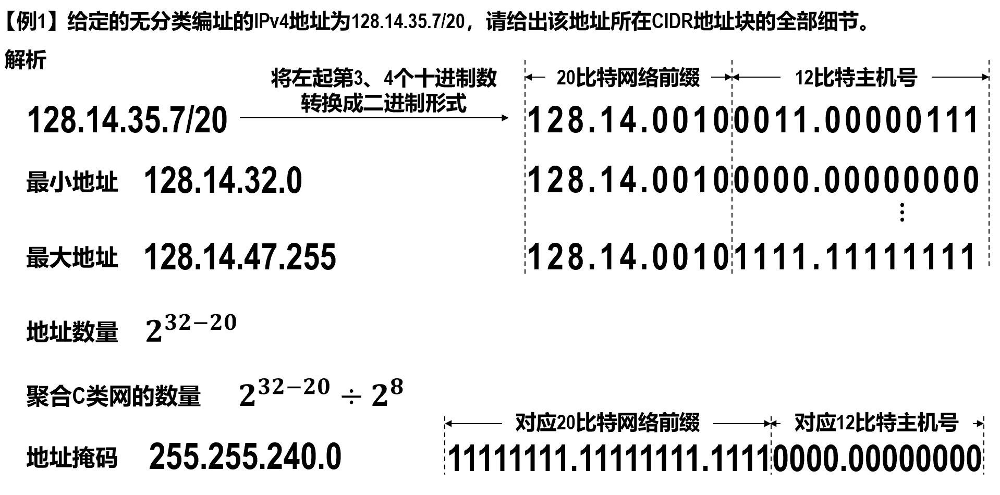

    一个C类网络有256个地址（ $2^{8}=256$ ），即主机号8位。

    该CIDR地址块的地址数量是 $2^{32-20}=4096$ （主机号12位）。

    所以，该CIDR地址块**聚合了16个C类网络**（ $4096/256=16$ ）。

    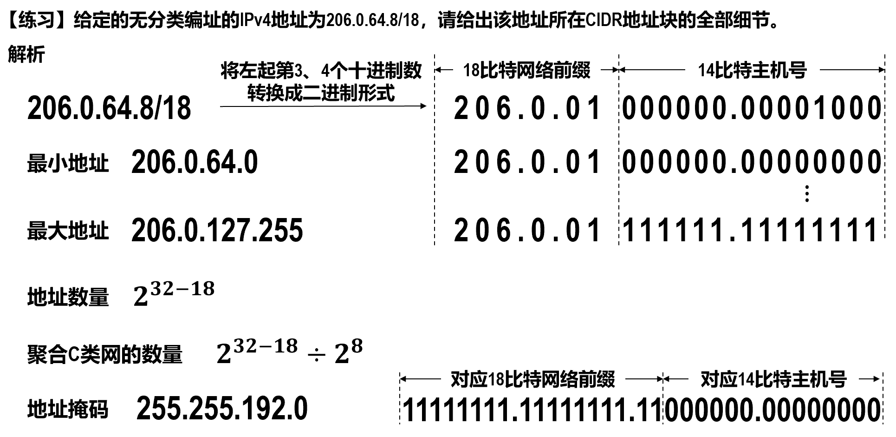

使用无分类编址方法，可以根据客户的需要**分配适当大小的CIDR地址块**，因此可以更加有效地分配IPv4的地址空间。

使用无分类编址方法的另一个好处是**路由聚合**（也称为**构造超网**）。

- 网络前缀越长，地址块越小，路由越具体；
- 若路由器查表转发分组时发现有多条路由条目匹配，则选择网络前缀最长的那条路由条目，这称为**最长前缀匹配**，因为这样的路由更具体。

??? note "PPT 上的练习"
    

    

---

### IPv4地址的应用规划

IPv4地址的应用规划是指将给定的IPv4地址块（或分类网络）划分成若干个更小的地址块（或子网），并将这些地址块（或子网）分配给互联网中的不同网络，进而可以给各网络中的主机和路由器的接口分配IPv4地址。

**定长的子网掩码**（Fixed Length Subnet Mask，FLSM）

- 所划分出的每一个子网**都使用同一个子网掩码**。
- 每个子网所分配的IP地址数量相同，容易造成**地址资源的浪费**。

**变长的子网掩码**（Variable Length Subnet Mask，VLSM）

- 所划分出的每一个子网**可以使用不同的子网掩码**。
- 每个子网所分配的IP地址数量可以不同，尽可能**减少对地址资源的浪费**。

---

#### 使用定长子网掩码划分子网

应用需求：网络1需要IP地址数量为9，网络2需要IP地址数量为28，网络3需要IP地址数量为15，网络4需要IP地址数量为13，网络5需要IP地址数量为4。

---

#### 使用变长子网掩码划分子网

**在地址块中选取子块的原则**：每个子块的起点位置不能随便选取，只能选取主机号部分是块大小整数倍的地址作为起点。建议先为大的子块选取。

例如：“218.75.230.16 可作为块大小为4、8、16的子块的起点，因为这些块大小能被主机号16整除”。

它指的是当前考虑的起始 IP 地址 `218.75.230.16` 的最后一个八位组（Last Octet），即数字 **16**。

块大小（Block Size）是指一个子网包含的 IP 总数（包括网络号和广播号）。

* **/30** 的块大小是 $2^2 = 4$
* **/29** 的块大小是 $2^3 = 8$
* **/28** 的块大小是 $2^4 = 16$
* **/27** 的块大小是 $2^5 = 32$

我们要看起始位置 **16** 能否容纳不同大小的块：

* **对于大小为 4 的块 (/30)：**$16 \div 4 = 4$ (整数)。**可以**。这意味着你可以从 `.16` 开始分配一个 `/30` (范围是 `.16` ~ `.19`)。
* **对于大小为 8 的块 (/29)：**$16 \div 8 = 2$ (整数)。**可以**。这意味着你可以从 `.16` 开始分配一个 `/29` (范围是 `.16` ~ `.23`)。
* **对于大小为 16 的块 (/28)：**$16 \div 16 = 1$ (整数)。**可以**。这意味着你可以从 `.16` 开始分配一个 `/28` (范围是 `.16` ~ `.31`)。
* **对于大小为 32 的块 (/27)：**$16 \div 32 = 0.5$ (不是整数)。**不可以**！你不能从 `.16` 开始分配一个 `/27` 的网络。因为 `/27` 的块大小是32，它只能从 $0, 32, 64...$ 开始。如果强行从 `.16` 写成 `/27`，其网络地址实际上会回落到 `.0`，导致与前面的地址冲突。

这句话的意思是告诉你在规划子网时，**起始地址不能随意选取**。既然当前的空闲起始地址是 `.16`，那么你接下来的选择只能是大小为 4、8 或 16 的子网，而不能是一个大小为 32 的子网（因为 16 不能被 32 整除）。

???+ example
    若将101.200.16.0/20划分为5个子网，则可能的最小子网的可分配IP地址数是（      ）。

    A. 126  B. 254  C. 510  D. 1022

??? note "answer"
    B

    

    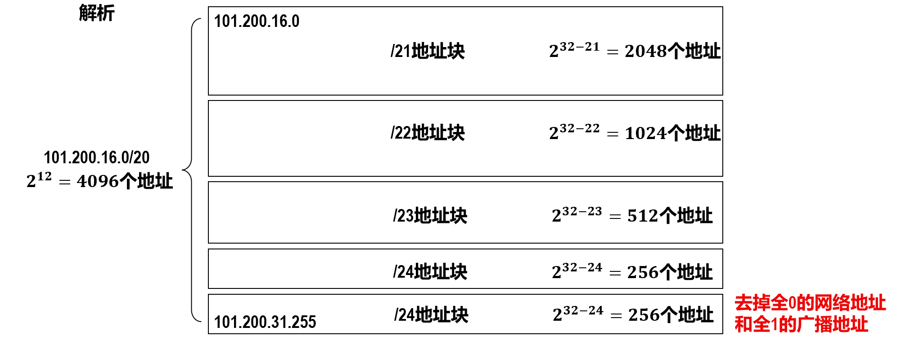

---

### IPv4地址与MAC地址

#### IPv4地址与MAC地址的封装位置

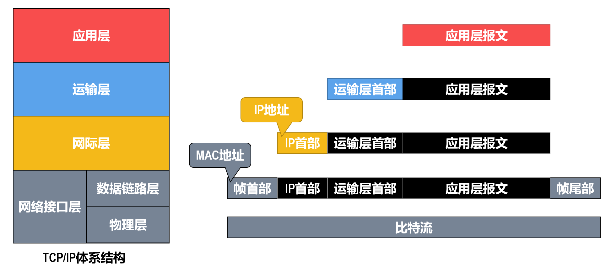

---

#### 数据报传送过程中IPv4地址与MAC地址的变化情况

- 在数据包的传送过程中，数据包的**源IP地址和目的IP地址保持不变**；
- 在数据包的传送过程中，数据包的**源MAC地址**和**目的MAC地址**逐链路（或逐网络）改变。

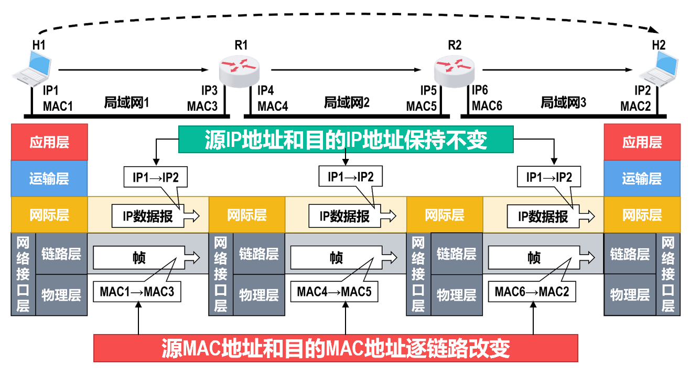

如何通过IP地址找出其相应的MAC地址？

- 地址解析协议ARP

??? example "PPT 上的练习"
    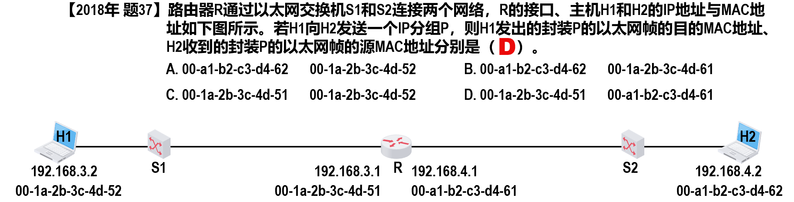

---

#### IPv4地址与MAC地址的关系

如果仅使用MAC地址进行通信，则会出现以下主要问题：

- 因特网中的每台路由器的**路由表**中就必须记录因特网上**所有主机和路由器各接口的MAC地址**。
- 手工给各路由器配置路由表几乎是不可能完成的任务，即使使用路由协议让路由器通过相互交换路由信息来自动构建路由表，也会因为**路由信息需要包含海量的MAC地址信息而严重占用通信资源**。
- **包含海量MAC地址的路由信息需要路由器具备极大的存储空间**，并且会给**分组的查表转发**带来非常大的**时延**。

因特网的网际层**使用IP地址进行寻址**，就可使因特网中各**路由器**的路由表中的路由记录的数量大大减少，因为只需记录**部分网络**的网络地址，而不是记录每个网络中各通信设备的各接口的MAC地址。

- 路由器收到IP数据报后，根据其首部中的目的IP地址的网络号部分，基于自己的路由表进行查表转发。

查表转发的结果可以指明IP数据报的下一跳路由器的IP地址，但无法指明该IP地址所对应的MAC地址。因此，在数据链路层封装该IP数据报成为帧时，帧首部中的目的MAC地址字段就无法填写，该问题需要使用网际层中的**地址解析协议ARP**来解决。

???+ example "question"
    一台主机有两个IP地址，一个地址是192.168.11.25,另一个地址可能是()。

    A.192.168.11.0 B.192.168.11.26 C.192.168.13.25 D.192.168.11.24

??? note "answer"
    C

    在网络中，允许一台主机有两个或两个以上的 IP 地址，若一台主机有两个或两个以上 IP 地址，则说明这台主机属于两个或两个以上的网络。地址 192.168.11.25属于 C 类地址，所以与 A、B 和 D 属于同一个网络;只有 C 的网络号不同，表明它属于不同的网络。

---

### 地址解析协议

- A知道B的IP地址
- A不知道B的MAC地址
- A的数据链路层封装MAC帧时，**无法填写目的MAC地址**！

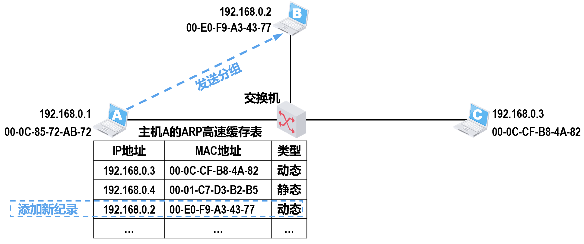

通过ARP自动获取，生命周期默认为两分钟。

手工配置，不同操作系统下的生命周期不同，例如系统重启后不存在或系统重启后依然有效。

- 转发表中的MAC地址与交换机接口号的对应关系记录也要周期性删除，因为这种对应关系并不是永久不变的。
- 同理，ARP高速缓存表中的IP地址与MAC地址的对应关系也并不是永久不变的。例如，主机更换了一块新网卡。

ARP协议的相关注意事项：

- 由于ARP协议的主要用途是从网际层使用的IP地址解析出在数据链路层使用的MAC地址。因此，有的教材将ARP协议划归在**网际层**，而有的教材将ARP协议划归在**数据链路层**。这两种做法都是可以的。
- 除了本节课介绍的ARP请求报文和响应报文，**ARP协议还有其他类型的报文**，例如用于检查IP地址冲突的“无故ARP”（Gratuitous ARP）。
- 由于ARP协议很早就制定出来了（1982年11月），当时并没有考虑网络安全问题。因此，ARP协议没有安全验证机制，存在**ARP欺骗和攻击**等问题。

???+ example "question"
    某网络拓扑如下图所示，H1与H2的默认网关和子网掩码都分别配置为192.168.3.1和255.255.255.0,H3和H4的默认网关和子网掩码都分别配置为192.168.3.254和255.255.255.128,初始时所有设备的ARP缓存均为空。则下列说法中错误的是()。

    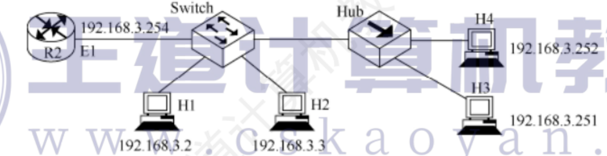

    A.若H1向H3发送数据，则H2、H3、H4都能收到H1发来的ARP请求报文
    
    B.若H3向H1发送数据，则H3能收到H1发来的ARP响应报文
    
    C.若H1向H2发送数据，则H2、H3、H4都能收到H1发来的ARP请求报文
    
    D.若H3向H4发送数据，则H3能收到H4发来的ARP响应报文

??? note "answer"
    B

    图中 H1, H2, H3, H4 以及路由器 R2 的接口 E1，通过交换机（Switch）和集线器（Hub）连接在一起。在物理链路层（Layer 2），它们都在同一个**广播域**中。这意味着，任何一台主机发送的 ARP 请求（广播帧），其他所有主机都能在物理上收到。

    A. 若 H1 向 H3 发送数据，则 H2、H3、H4 都能收到 H1 发来的 ARP 请求报文

    1. **源主机判断：** H1 (`192.168.3.2/24`) 想要找 H3 (`192.168.3.251`)。
    2. **子网匹配：** H1 用自己的掩码 (`/24`) 计算，发现 H3 的 IP `192.168.3.251` 和自己在同一个网段内（都属于 `192.168.3.X`）。
    3. **行为：** H1 认为 H3 是直连的，于是直接发送 **ARP 请求**，询问“谁是 192.168.3.251？”。
    4. **传播：** ARP 请求是**广播帧**。

    * 交换机收到后，转发给 H2 和 Hub。
    * Hub 收到后，转发给 H3 和 H4。

    5. **结论：** H2、H3、H4 确实都能收到这个广播报文。

    B. 若 H3 向 H1 发送数据，则 H3 能收到 H1 发来的 ARP 响应报文

    1. **源主机判断：** H3 (`192.168.3.251/25`) 想要找 H1 (`192.168.3.2`)。
    2. **子网匹配：** H3 用自己的掩码 (`255.255.255.128`) 计算：

    * H3 的网络号是 `192.168.3.128`。
    * H1 的 IP `192.168.3.2` 显然不在 `129~254` 这个范围内。

    3. **行为：** **H3 判定 H1 在“局域网外部”**。因此，H3 **不会**直接去请求 H1 的 MAC 地址。
    4. **实际操作：** H3 会去请求**默认网关**的 MAC 地址。H3 的网关是 `192.168.3.254`（R2 的 E1 接口）。

    * H3 发送 ARP 请求：“谁是 192.168.3.254？”
    * R2 回复 ARP 响应。

    5. **数据发送：** H3 将发往 H1 的 IP 数据报封装在 MAC 帧中，目的 MAC 地址写的是**网关 R2 的地址**，而不是 H1 的地址。
    6. **结论：** H3 根本就没有向 H1 发送 ARP 请求，H1 自然也不会给 H3 发送 ARP 响应。H3 得到的是网关 R2 的 ARP 响应。

    C. 若 H1 向 H2 发送数据，则 H2、H3、H4 都能收到 H1 发来的 ARP 请求报文

    1. **源主机判断：** H1 (`192.168.3.2/24`) 找 H2 (`192.168.3.3`)。
    2. **子网匹配：** 同一网段 (`/24`)。
    3. **行为：** H1 发送 ARP 广播请求：“谁是 192.168.3.3？”
    4. **传播：** 同样因为是广播帧，交换机和 Hub 会将其洪泛到整个网络。
    5. **结论：** H2、H3、H4 都会在物理层收到这个信号（虽然 H3 和 H4 解析后发现不是找自己的，会丢弃，但确实“收到”了）。

    D. 若 H3 向 H4 发送数据，则 H3 能收到 H4 发来的 ARP 响应报文

    1. **源主机判断：** H3 (`192.168.3.251/25`) 找 H4 (`192.168.3.252`)。
    2. **子网匹配：** H4 的 IP 在 H3 的子网范围 `192.168.3.128/25` 内。
    3. **行为：** H3 判定 H4 是局域网邻居，直接发送 ARP 请求：“谁是 192.168.3.252？”
    4. **传播与响应：**

    * Hub 将请求发给 H4。
    * H4 收到请求，发现是找自己的，于是发送 **ARP 响应报文**（单播）给 H3。

    5. **结论：** H3 能够收到 H4 的响应，并完成通信。

---

### IP数据报的发送和转发流程

IP数据报的发送和转发过程包含以下两个过程：

- **主机**发送IP数据报
- **路由器**转发IP数据报

!!! info
    为了将重点放在TCP/IP体系结构的网际层发送和转发IP数据报的过程上，在之后的举例中，将忽略以下过程：
    
    1. 使用ARP协议来获取目的主机或路由器接口的MAC地址的过程。

    2. 以太网交换机自学习和转发帧的过程。

---

#### 第一阶段：源主机的判断与发送（出发）

当源主机（例如图中的 **主机 C：192.168.0.3**）想要发送数据给目的主机（例如图中的 **主机 F：192.168.0.131**）时，它不会盲目发送，而是先进行一次内部计算。

1.  **判断是否在同一个网络（直接交付 vs 间接交付）：**

源主机 C 知道目的主机 F 的 IP 地址。

源主机 C 取出 F 的 IP 地址与 **C 自己的子网掩码（/25）** 进行“与运算（AND）”。

源主机 C 比较这个结果与 **自己的网络地址（192.168.0.0）**。

* **结论：** 结果**不相同**（`192.168.0.128` ≠ `192.168.0.0`）。这意味着目的主机 F 在另一个网络，必须进行 **间接交付**。

2.  **寻找默认网关：**

* 既然需要间接交付，源主机 C 就需要找“帮手”。这个帮手就是配置在主机 C 里的 **默认网关（Default Gateway）**。

* 主机 C 的默认网关指向了路由器 R 的接口 0：`192.168.0.126`。
* 于是，主机 C 将数据报封装成帧，发送给路由器 R。

---

#### 第二阶段：路由器的处理与查表（中转）

当路由器 R 从接口 0 收到这个 IP 数据报后，会执行一系列严谨的操作（以图中 **主机 A -> 主机 D** 为例）：

1.  **检查数据报的有效性：**

* 路由器首先检查 IP 首部。
* **生存时间（TTL）：** 是否已经减为 0？如果结束则丢弃。
* **首部校验和：** 是否有误码？如果有错则丢弃。
* *注：如果丢弃，路由器会向源主机发送 ICMP 差错报告。*

2.  **查路由表（核心步骤）：**

* 如果数据报有效，路由器提取出首部中的 **目的 IP 地址**（例如 `192.168.0.129`）。
* 路由器用这个目的 IP 与路由表中每一行的 **子网掩码** 进行“与运算”。

**比对过程：**

* 用 `192.168.0.129` AND `255.255.255.128` = `192.168.0.128`。
* 查看路由表，发现有一行记录：目的网络 `192.168.0.128`，下一跳为 `接口 1 直连`。

* **匹配成功！** 路由器知道了该数据包应该从 **接口 1** 转发出去。

---

#### 第三阶段：转发与隔离（到达与防护）

1.  **转发给目的主机：**

* 路由器将数据包通过 **接口 1** 发送到右边的网络（交换式以太网 2）。
* 因为接口 1 与目的主机 D 在同一个网络（直连），路由器可以通过 ARP 协议找到主机 D 的 MAC 地址，直接将数据帧交付给主机 D。

2.  **特殊情况：广播隔离（Broadcast Isolation）：**

* 最后特别提到了一种情况：如果源主机发送的是 **广播包**（目的地址为本网段广播地址，如 `192.168.0.127`）。
* 该广播包会传遍左边的网络（主机 A、B、C 都能收到）。
* 但是，**路由器不会转发广播包**。路由器就像一道防火墙，将广播限制在左边的网络内，防止了“广播风暴”波及到右边的网络。这就是**路由器隔离广播域**的作用。

??? example "PPT 上的练习"
    

    (1) 设备1、设备2和设备3分别应选择什么类型网络设备？

    **答案：**

    * **设备1：路由器 (Router)**

    * **设备2：以太网交换机 (Ethernet Switch)**

    * **设备3：以太网交换机 (Ethernet Switch)**

    连接在设备2上的主机 H1 和 H2 的 IP 地址分别为 `192.168.1.2/26` 和 `192.168.1.3/26`。它们的子网掩码都是 `/26`（即 `255.255.255.192`）。计算可知，H1 和 H2 处于同一个子网（网络号均为 `192.168.1.0`）。在同一个子网内的主机通信，通常只需要二层设备互联即可。此外，它们的默认网关都是 `192.168.1.1`，指向了上级设备。因此，设备2起到了汇聚同一网段主机的作用，应选择 **以太网交换机**。

    同理，主机 H3 (`192.168.1.66/26`) 和 H4 (`192.168.1.67/26`) 的网络号均为 `192.168.1.64`。它们也处于同一个子网，且网关相同 (`192.168.1.65`)。因此，设备3也应选择 **以太网交换机**。

    设备1连接了三个不同的部分：

    * 接口 IF1 连接路由器 R（子网 `192.168.1.252/30`）。

    * 接口 IF2 连接左侧子网（`192.168.1.0/26`）。

    * 接口 IF3 连接右侧子网（`192.168.1.64/26`）。

    因为设备1需要连接三个**不同**的逻辑网段（子网），并实现这些不同网段之间的数据转发，这正是路由器的功能（隔离广播域、三层转发）。交换机无法隔离广播域，也无法连接不同网段（除非是三层交换机，但题目选项明确给了“路由器”和“交换机”两类，且语境为基础网络互联），因此设备1必须是 **路由器**。

    (2) 设备1、设备2和设备3中，哪几个设备的接口需要配置IP地址？并为对应的接口配置正确的IP地址。

    **答案：**

    * 需要配置IP地址的设备是：**设备1**。

    * 设备2和设备3是二层交换机，其接口无需配置IP地址。

    **设备1的接口IP配置如下：**

    * **IF1:** `192.168.1.254` (掩码 `255.255.255.252` 或 `/30`)

    * **IF2:** `192.168.1.1` (掩码 `255.255.255.192` 或 `/26`)

    * **IF3:** `192.168.1.65` (掩码 `255.255.255.192` 或 `/26`)

    1.  **确定 IF2 的地址（面向 H1/H2）：**查看主机 H1 和 H2 的配置，它们的**默认网关**是 `192.168.1.1`。默认网关就是路由器（设备1）连接该子网的接口地址。因此，设备1的 IF2 接口地址为 `192.168.1.1`。

    2.  **确定 IF3 的地址（面向 H3/H4）：**查看主机 H3 和 H4 的配置，它们的**默认网关**是 `192.168.1.65`。同理，设备1的 IF3 接口地址为 `192.168.1.65`。

    3.  **确定 IF1 的地址（面向 路由器R）：**设备1的 IF1 与路由器 R 的接口相连。路由器 R 的接口地址是 `192.168.1.253/30`。`/30` 子网只有 2 个可用主机地址。

    计算该子网范围：

    * 网络号：`192.168.1.252`
    * 第一个可用IP：`192.168.1.253`（已被 R 占用）
    * 第二个可用IP：`192.168.1.254`
    * 广播地址：`192.168.1.255`

    因此，设备1的 IF1 必须使用剩下的那个有效IP，即 `192.168.1.254`。

    (3) 若主机H3发送一个目的地址为192.168.1.127的IP数据报，网络中哪几个主机会收到该数据报？

    **答案：****主机 H4** 会收到该数据报。

    源主机 H3 的 IP 是 `192.168.1.66/26`，属于子网 `192.168.1.64/26`。

    该子网的地址范围计算如下：

    * 块大小 = $2^{(32-26)} = 2^6 = 64$。

    * 子网起始：`192.168.1.64`

    * 子网结束：`192.168.1.64 + 63 = 192.168.1.127`

    由此可见，目的地址 `192.168.1.127` 是 H3 所在子网的 **广播地址 (Directed Broadcast Address)**。

    H3 发出的是一个广播帧。

    **设备3（交换机）：** 收到广播帧后，会向除了接收端口以外的所有端口泛洪（转发）。因此，连接在设备3上的 **主机 H4** 会收到这个数据报。

    **设备1（路由器）：** 也会在接口 IF3 收到这个广播报文。但是，路由器的重要特性是 **隔离广播域**（Do not forward broadcasts）。默认情况下，路由器不会将广播报文转发到其他网络（如左边的设备2网络或上边的路由器R网络）。

???+ example "question"
    不考虑NAT,在Internet中，IP数据报从源节点到目的节点可能需要经过多个网络和路由器。在整个传输过程中，IP数据报首部中的()。
    
    A.源地址和目的地址都不会发生变化
    
    B.源地址有可能发生变化而目的地址不会发生变化

    C.源地址不会发生变化而目的地址有可能发生变化
    
    D.源地址和目的地址都有可能发生变化

??? note "answer"
    A

    在 Intermet 中，IP 数据报从源节点到目的节点可能需要经过多个网络和路由器。当一个路由器接收到一个数据报时，路由器根据 IP 数据报首部的目的 IP 地址进行路由选择，并不改变源地址的取值。即使数据报被分片时，原 IP 数据报的源地址和目的地址也将复制到每个分片的首部，因此在整个传输过程中，IP 数据报首部的源 IP 地址和目的 IP 地址都不发生变化。

???+ example "question"
    当下列IP地址作为IP数据报的目的地址时，互联网上的路由器不会正常转发的是()。

    A.192.172.56.23 B.172.15.34.128 C.192.168.32.17 D.172.128.45.34

??? note "answer"
    C

    互联网的路由器对目的地址是私有地址的 IP 数据报一律不进行转发。有3个私有地址段:
    
    - 10.0.0.0/8，即 10.0.0.0~10.255.255.255，相当于1个 A 类网络。
    
    - 172.16.0.0/12，即 172.16.0.0~172.31.255.255，相当于 16 个连续的 B 类网络
    
    - 192.168.0.0/16，即 192.168.0.0~192.168.255.255，相当于 256 个连续的 C 类网络

    所以只有选项C是内部地址，不允许出现在互联网(公网)上。

???+ example "question"
    现将一个IP网络划分为4个子网，若其中一个子网是192.168.1.130/26,则下列网络中不可能是另外3个子网之一的是()。

    A.192.168.1.0/25 B.192.168.1.64/26 C.192.168.1.96/27 D.192.168.1.224/27

??? note "answer"
    C

    

???+ example "question"
    某网络拓扑如下图所示，路由器R1只有到达子网192.168.1.0/24的路由。为使R1可以将IP分组正确地路由到图中的所有子网，在R1中需要增加的一条路由(目的网络，子网掩码，下一跳)是

    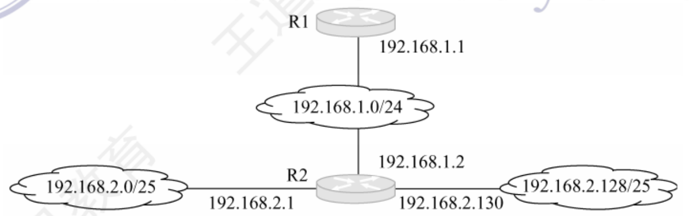 

    A.192.168.2.0  255.255.255.128  192.168.1.1

    B.192.168.2.0  255.255.255.0  192.168.1.1

    C.192.168.2.0  255.255.255.128  192.168.1.2

    D.192.168.2.0  255.255.255.0  192.168.1.2

??? note "answer"
    D

    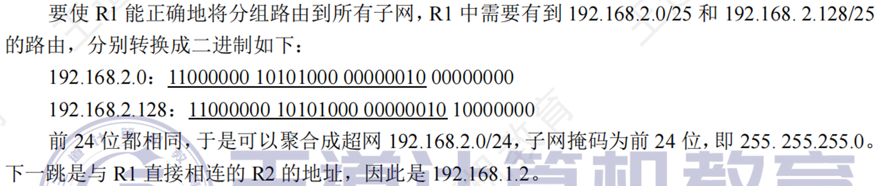

???+ example "question"
    如下图所示，假设H1与H2的默认网关和子网掩码均分别配置为192.168.3.1和255.255.255.128,H3和H4的默认网关和子网掩码均分别配置为192.168.3.254和255.255.255.128,则下列现象中可能发生的是()。

    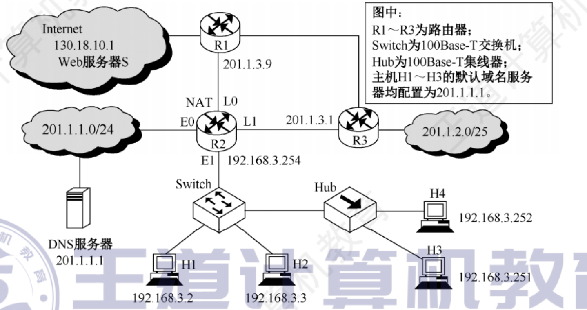

    A.H1不能与H2进行正常IP通信
    
    B.H2与H4均不能访问Internet
    
    C.H1不能与H3进行正常IP通信
    
    D.H3不能与H4进行正常IP通信

??? note "answer"
    C

    从子网掩码可知 H1 和 H2 处于同一网络，H3 和 H4 处于同一网络，因此 H1 和 H2、H3 和H3 和 H4 处于不同的网络，因此需要通过路由器才H4 分别可以进行正常的 IP 通信。H1 和 H2分组时，H1 用目的 IP 地址、子网掩码逐位“与”H1能进行正常的 IP 通信，当 H1 向 H3 发送 I禹于不同的网络，需要将该 IP 分组发送到默认网关,自身的网络前缀不同，于是判定H3与H1而 H1 配置的默认网关为 192.168.3.1，但 R的 E1 接口的 IP 地址为 192.168.3.254，因此 H1 不能与 H3 进行正常的 IP 通信。注意，即使 H1的默认网关配置正确，但因为路由器不会从分组入进行转发，所以 H1 和 H3 也无法进行正常IP 通信。H2 的默认网关为 192.168.3.1，因此 H2 也不能访问 Internet;H4 的默认网关为 192.168.3.254，因此 H4 可以正常访问 Internet。

???+ example "question"
    在上题的图中，假设连接R1、R2和R3之间的点对点链路使用地址201.1.3.x/30,当H3访问Web服务器S时，R2转发出去的封装HTTP请求报文的IP分组是源IP地址和目的IP地址，它们分别是()。
    
    A.192.168.3.251,130.18.10.1
    
    B.192.168.3.251,201.1.3.9
    
    C.201.1.3.8,130.18.10.1
    
    D.201.1.3.10,130.18.10.1

??? note "answer"
    D

    当内网用户向公网发送 IP 分组时，NAT路由器会更改 IP 分组的源地址，因此下一步就是求 R1 的公网 IP 地址。连接 R1、R2 和 R3 之司的点对点链路使用 201.1.3.x/30 地址，可知该地址块的 IP 地址的后两位为主机号，而主机号全0和全1的 IP 地址不能分配，因此若已知路由器之间上，就可求出另一路由器接口的 IP 地址。在 R1 和 R2的点对点链路中的一个路由器接口的 IP 地相连的链路中，已知 R1端接口的 IP 地址头201.1.3.9/30，将其后8位展开成二进制为 0000 1001 .所以可分配给 R2 的 L0 接口的 IP 地址为 201.1.3.10。同理，也可求出 R2 的L1 接口的 IP 地址为的接口 L0 或 L1 转发，所以经过 R2 转发后，IP 分组 201.1.3.2。访问 Web 服务器，只能通过 R2的源地址可能为 201.1.3.10 或 201.1.3.2，目的地址为 Web 服务器的 IP 地址 130.18.10.1。

---

### IPv4数据报的首部格式

IPv4数据报的首部格式及其内容是**实现IPv4协议各种功能的基础**。

在TCP/IP标准中，各种数据格式常常以**32比特（即4字节）**为单位来描述。

**固定部分**是指每个IPv4数据报都必须要包含的部分。

某些IPv4数据报的首部，除了包含20字节的固定部分，还包含一些可选的字段来**增加IPv4数据报的功能**。

IPv4数据报首部中的各字段或某些字段的组合，用来表达IPv4协议的相关功能。

- 版本

长度为4个比特，用来表示IP协议的版本。

**通信双方使用的IP协议的版本必须一致。目前广泛使用的IP协议的版本号为4（即IPv4）**。

- 首部长度

长度为4个比特，该字段的取值**以4字节为单位**，用来表示IPv4数据报的首部长度。

**最小取值**为二进制的0101，即十进制的5，再乘以4字节单位，**表示IPv4数据报首部只有20字节固定部分**。

**最大取值**为二进制的1111，即十进制的15，再乘以4字节单位，**表示IPv4数据报首部包含20字节固定部分和最大40字节可变部分**。

- 可选字段

长度从1字节到40字节不等，用来支持排错、测量以及安全措施等功能。

虽然可选字段增加了IPv4数据报的功能，但这同时也使得IPv4数据报的首部长度成为可变的，这就增加了因特网中每一个路由器处理IPv4数据报的开销。

实际上，可选字段很少被使用。

- 填充

**用来确保IPv4数据报的首部长度是4字节的整数倍**，使用全0进行填充。

- 区分服务

长度为8个比特，用来获得更好的服务。

该字段在旧标准中叫作服务类型，但实际上一直没有被使用过。

1998年，因特网工程任务组IETF把这个字段改名为区分服务。利用该字段的不同取值可提供不同等级的服务质量。只有在使用区分服务时该字段才起作用，一般情况下都不使用该字段。

- 总长度（重要）

长度为16个比特，该字段的取值**以字节为单位**，用来表示**IPv4数据报的长度**（**首部长度+数据载荷长度**）。

最大取值为二进制的16个比特1，即十进制的65535（很少传输这么长的IPv4数据报）。

???+ example "question"
    下列关于IP分组的首部检验和字段的说法中，正确的是()。
    
    A.检验和字段检查的范围是整个IP分组

    B.计算检验和的方法是对首部的每个16比特按反码运算求和再取反码

    C.若网络层发现检验和错误，则丢弃该IP分组并发送ICMP差错报文
    
    D.IP分组的检验和的计算需要加入一个伪首部

??? note "answer"
    B

    计算检验和的方法是:检验和字段只检查 IP 数据报的首部，不包括数据部分，选项A错误。
    
    先把 IP 数据报的首部划分为许多 16 比特的列，用反码算术运算把所有 16 比特相加后，将得到IP 并不要求源主机重传有差错的IP 数据报，保证无的和的反码写入检验和字段，选项 B正确。
    
    差错传输是由 TCP 完成的。另一方面，首音检验和只能检验 I 数据报的首部是否出错，但不知出现差错，则将差错报文传送到错误的地址是没有任道首部中的源地址字段是否出错，若源地址出错后，就丢弃该数据报，但不会发送差错报文，选何意义的，因此接收方的网络层发现检验和选项 C 错误。
    
    数据报的检验和的计算不需要加入伪首部，伪首部用于计算 UDP 或 TCP 检验和:选项 D 错误。

---

#### IPv4 数据报的分片（Fragmentation）

为什么需要分片？根本原因在于链路层的 **MTU（最大传送单元）** 限制。

* **MTU 的限制：** 不同的数据链路层协议（如以太网、Wi-Fi等）对数据帧的数据载荷都有一个最大长度限制，这个限制被称为 **MTU (Maximum Transmission Unit)**。*例如：常用以太网的 MTU 值为 $1500$ 字节。*
* **分片的必要性：** 当一个 IPv4 数据报的总长度（首部 + 数据）超过了链路层的 MTU 时，无法直接封装成一个帧进行发送。
* **处理方法：** IP 协议必须将这个原始的长数据报切割成若干个更小的 IPv4 数据报，这些小数据报被称为 **分片 (Fragments)**。

1. 标识 (Identification)

长度为16个比特，属于同一个IPv4数据报的各分片数据报应该具有相同的标识。

IP软件会维持一个计数器，每产生一个IPv4数据报，计数器值就加1，并将此值赋给标识字段。

* **关键点：** 当一个数据报被分片时，**所有分片都必须复制原始数据报的标识字段**。这样，接收端（目的主机）在收到一堆乱序的分片时，查看“标识”字段，只要数值相同，就知道它们属于同一个原始数据报，从而将它们重新组装。

2. 标志 (Flags)

**最低位 —— MF (More Fragments)：**

* $MF = 1$：表示后面 **还有分片**（即这不是最后一个分片）。
* $MF = 0$：表示这是 **最后一个分片**。

**中间位 —— DF (Don't Fragment)：**

* $DF = 1$：表示 **不允许分片**。如果数据报长度超过 MTU 且 $DF=1$，路由器会丢弃该包并向源主机发送 ICMP 差错报告。
* $DF = 0$：表示 **允许分片**。

3. 片偏移 (Fragment Offset)

长度为13个比特，该字段的取值**以8字节为单位**，用来指出分片IPv4数据报的数据载荷偏移其在原IPv4数据报的位置有多远。

* 这意味着，片偏移字段的数值 $= \text{实际字节偏移量} / 8$。
* *解释：因为片偏移字段只有 $13$ 位，而 IP 数据报总长度可达 $2^{16} - 1$ 字节。为了能用 $13$ 位表示更大的范围，设计者规定该值的单位是 $8$ 字节。*
* 这也隐含了一个约束：**除了最后一个分片外，其他每个分片的数据载荷长度必须是 $8$ 的整数倍。**

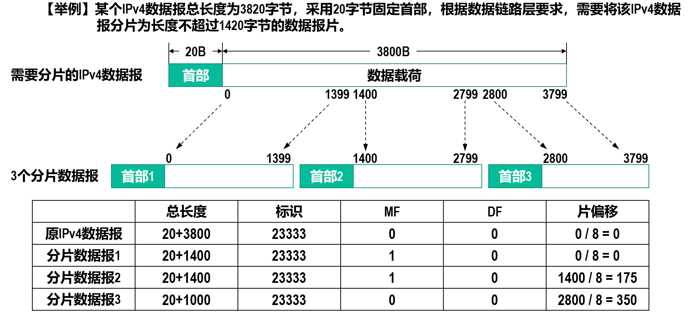

??? example "PPT 上的练习"
    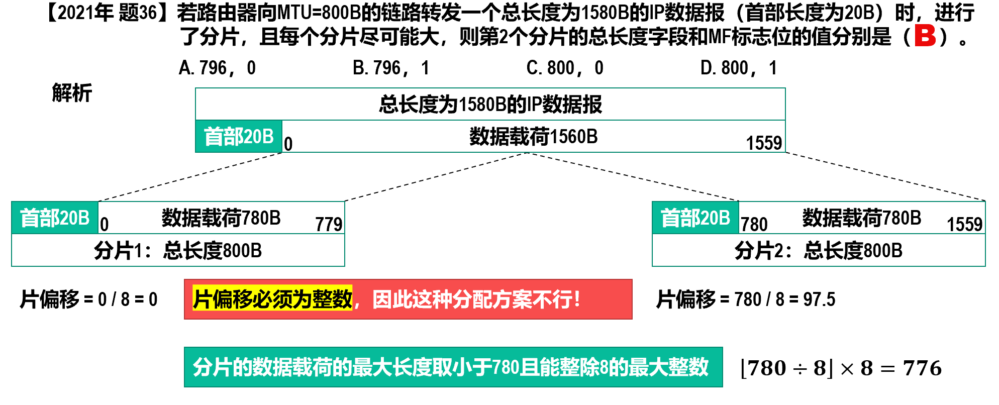

    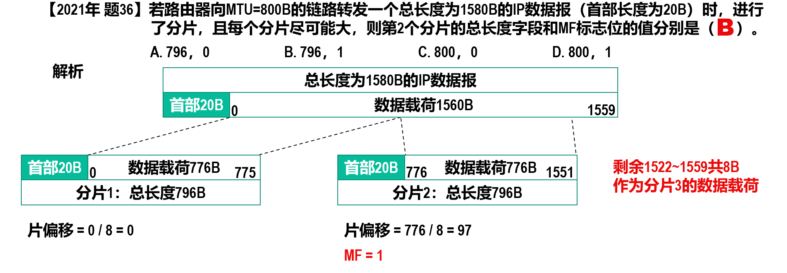

---

- 生存时间（Time To Live，TTL）

长度为8个比特，最大取值为二进制的11111111，即十进制的255。该字段的取值最初以秒为单位。因此，IPv4数据报的最大生存时间最初为255秒。路由器转发IPv4数据报时，将其首部中该字段的值减去该数据报在路由器上所耗费的时间，若结果不为0就转发，否则就丢弃。

生存时间字段后来改为以“**跳数**”为单位，**路由器收到待转发的IPv4数据报时，将其首部中的该字段的值减1，若结果不为0就转发，否则就丢弃**。

生存时间TTL字段的**作用** —— 防止被错误路由的IPv4数据报无限制地在因特网中兜圈。

- 协议

长度为8个比特，用来指明IPv4数据报的**数据载荷是何种协议数据单元PDU**。

常用的一些协议和相应的协议字段值

| 协议名称  | 协议字段值 |
|:---------:|:----------:|
| ICMP | 1   |
| IGMP | 2  |
| TCP | 6 |
| UDP | 17  |
| IPv6 | 41  |
| OSPF | 89  |

- 首部检验和

长度为16个比特，用于检测IPv4数据报在传输过程中其**首部是否出现了差错**。

IPv4数据报每经过一个路由器，其首部中的某些字段的值（例如生存时间TTL、标志以及片偏移等）都可能发生变化，因此**路由器都要重新计算一下首部检验和**。

1. 核心算法基础：二进制反码求和

**基本单位：** 将数据划分为若干个 **16位（16-bit）** 的字序列。

**运算规则（反码算术运算）：**

* **普通加法：** $0+0=0, 0+1=1, 1+1=0$ (进位)。
* **循环进位（核心点）：** 如果最高位（第16位）相加后产生了进位（Overflow），**不能丢弃这个进位，而是要将这个进位加到结果的最低位（加1）**。
* 这就是所谓的“反码算术运算求和”。

2. 发送端的计算流程（生成检验和）

发送方负责生成检验和，流程如下：

1.  **置零：** 首先将 IP 首部中的“首部检验和”字段 **置为全 0**。
2.  **分段：** 将整个 IP 首部（包括刚才置为 0 的检验和字段）看作是一串由 **16位** 数据组成的序列（字1, 字2, ..., 字n）。
3.  **求和：** 对这些 16 位的二进制数进行 **二进制反码算术运算求和**。
4.  **取反：** 将计算出来的结果进行 **取反码** 运算（即 0 变 1，1 变 0）。
5.  **填入：** 将取反后的结果写入 IP 首部的“首部检验和”字段中。

3. 接收端的验证流程（检查错误）

接收方（包括路由器和目的主机）收到数据报后，需要检查首部是否出错，流程如下（对应图片1）：

1.  **分段：** 将收到的整个 IP 首部（此时检验和字段里已经是发送方填好的数值了）划分为 16 位的序列。
2.  **求和：** 对所有 16 位的字进行 **二进制反码算术运算求和**。
3.  **取反：** 对求和结果进行 **取反码**。
4.  **判断：**

* **结果为 0：** 表示首部 **没有差错**，保留数据报，进行后续处理。
* **结果不为 0：** 表示首部 **出现差错**，路由器或主机将 **直接丢弃** 该数据报（IP 协议不负责重传，那是 TCP 的事）。

**为什么要这样设计？**

* 假设发送方计算的原始和是 $S$，那么发送的检验和就是 $\sim S$（$S$ 的反码）。
* 接收方在计算时，实际上是将首部所有数据（和为 $S$）与检验和字段（$\sim S$）相加。
* 在二进制反码运算中，一个数和它的反码相加，$A + (\sim A) = 111...1$（全 1，在反码算术中代表 -0）。
* 最后接收方再对结果取反：$\sim (111...1) = 000...0$。
* 所以，如果结果是 0，证明传输过程中没有比特发生翻转。

上述检验和的计算方法不仅用于IP协议，还用于运输层的用户数据报协议UDP和传输控制协议TCP，常被称为**因特网检验和**（Internet Checksum）。这种检验和的检错性能虽然不如CRC，但更易用软件实现。

!!! info
    由于网际层并不向其高层提供可靠传输的服务，并且计算首部检验和是一项耗时的操作，因此在IPv6中，路由器不再计算首部检验和，从而更快转发IP数据报。

- 源IP地址

长度为32个比特，用来填写发送IPv4数据报的源主机的IPv4地址。

- 目的IP地址

长度为32个比特，用来填写接收IPv4数据报的目的主机的IPv4地址。

---

## 静态路由配置

静态路由配置是指用户或网络运维人员使用路由器的相关命令给路由器**人工配置路由表**。

人工配置方式**简单、开销小**、但**不能及时适应网络状态（流量、拓扑等）的变化**，一般只在小规模网络中采用。

使用一条默认路由条目，替代了去往因特网中众多网络的海量路由条目。

默认路由条目中的目的网络0.0.0.0/0，其中0.0.0.0表示任意网络，而网络前缀“/0”（相应的地址掩码为0.0.0.0）是最短的网络前缀。

路由器在查找转发表转发IP数据报时，遵循“最长前缀匹配”的原则，因此默认路由条目的**匹配优先级最低**。

---

### **特定主机路由**

出于某种安全问题的考虑，同时为了使网络运维人员更方便地控制网络和测试网络，特别是在对网络的连接或路由表进行排错时，指明到某一台主机的特定主机路由是十分有用的。

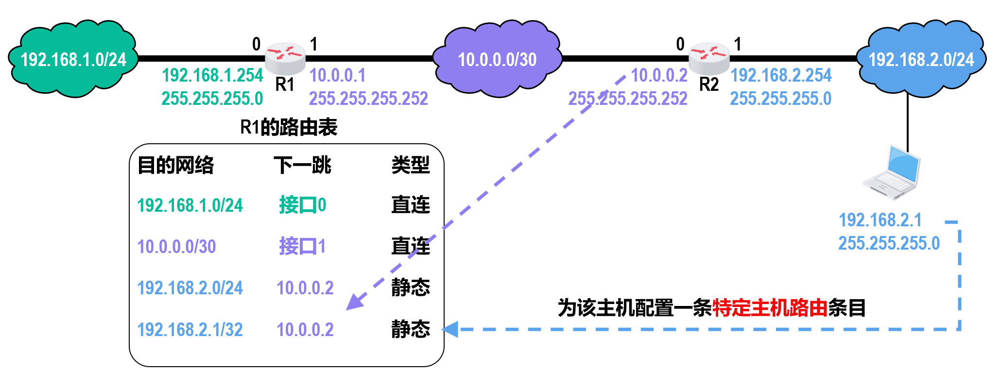

特定主机路由条目中的目的网络192.168.2.1/32，其中192.168.2.1是特定主机的IP地址，而网络前缀“/32”（相应地址掩码为255.255.255.255）是最长的网络前缀。

路由器在查找转发表转发IP数据报时，遵循“最长前缀匹配”的原则，因此特定主机路由条目的**匹配优先级最高**。

在查表转发去往192.168.2.1这台特定主机的IP数据报时，这两个路由条目都可以匹配，遵循“**最长前缀匹配**”的原则，按照**匹配优先级最高**的特定主机路由条目进行转发。

---

进行静态路由配置需要认真考虑和谨慎操作，否则可能出现以下问题：

- 路由条目**配置错误**，甚至导致出现**路由环路**。
- 聚合路由条目时可能**引入不存在的网络**。

---

## 因特网的路由选择协议

### 路由选择分类

**静态路由选择**

- 采用**人工配置**的方式给路由器添加网络路由、默认路由和特定主机路由等路由条目。
- 静态路由选择**简单、开销小**，但**不能及时适应网络状态**（流量、拓扑等）的变化。
- 静态路由选择一般只在**小规模网络**中采用。

**动态路由选择**

- 路由器通过**路由选择协议**自动获取路由信息。
- 动态路由选择**比较复杂、开销比较大**，但能**较好地适应**网络状态的变化。
- 动态路由选择适用于**大规模网络**。

---

### 因特网采用分层次的路由选择协议

因特网是全球最大的互联网，它所采取的路由选择协议具有以下三个主要特点：

1. 自适应

因特网采用**动态路由**选择，能较好地适应网络状态的变化。

2. 分布式

因特网中的**各路由器**通过相互间的信息交互，**共同完成路由信息的获取和更新**。

3. 分层次

将整个因特网划分为许多较小的**自治系统**（Autonomous System，AS）。

在自治系统内部和外部采用不同类别的路由选择协议，分别进行路由选择。

---

### 路由信息协议

#### 路由信息协议RIP的相关基本概念

路由信息协议（Routing Information Protocol，RIP）是内部网关协议中最先得到广泛使用的协议之一，其相关标准文档为[RFC 1058]。

RIP要求自治系统AS内的每一个路由器，都要维护从它自己到AS内其他每一个网络的距离记录。这是一组距离，称为**距离向量**（Distance-Vector，D-V）。

RIP使用**跳数**（Hop Count）作为度量（Metric）来衡量到达目的网络的**距离**。

- RIP将路由器到**直连网络**的距离定义为1。
- RIP将路由器到**非直连网络**的距离定义为所经过的**路由器数加1**。
- RIP允许一条路径最多只能包含15个路由器，**距离等于16时相当于不可达**。因此**RIP只适用于小型互联网**。

RIP认为**好的路由**就是“距离短”的路由，也就是所**通过路由器数量最少**的路由。

当到达同一目的网络有多条RIP距离相等的路由时，可以进行**等价负载均衡**，也就是将通信量均衡地分布到多条等价的路径上。

RIP具有以下三个重要特点：

- 和谁交换信息：仅和**相邻路由器**交换信息。
- 交换什么信息：路由器自己的**路由表**。即本路由器到所在自治系统AS中各网络的最短RIP距离，以及到各网络应经过的下一跳路由器。
- 何时交换信息：**周期性交换**（例如，每个约30秒）。为了加快RIP的收敛速度，当网络拓扑发生变化时，路由器要及时向相邻路由器通告拓扑变化后的路由信息，这称为**触发更新**。

---

#### RIP的基本工作过程

1. 路由器刚开始工作时，**只知道自己到直连网络的RIP距离为1**。
2. 每个路由器**仅和相邻路由器周期性地交换并更新路由信息**。
3. 若干次交换和更新后，每个路由器都知道到达本自治系统AS内各网络的最短距离和下一跳路由器，称为**收敛**。

---

#### RIP的距离向量算法

当路由器 D 收到邻居 C 发来的路由表时，D 不能直接用，必须先对这张表进行“修改”。因为数据包要先从 D 走到 C（经过 1 跳），才能利用 C 的路由信息。

**修改规则：**

1.  **所有距离 +1：** 把 C 发来的所有目的网络的距离都加 $1$（代表 D 到 C 的这一跳距离）。
2.  **下一跳改为 C：** 因为 D 是通过 C 获得这些信息的，所以对于 D 来说，这些网络的下一跳自然就是 C。

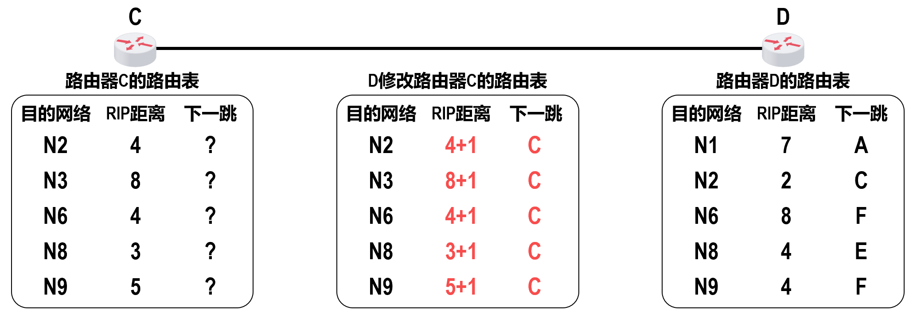

D 将“修改后的 C 表”（以下简称**新表**）与自己原本的路由表（以下简称**旧表**）逐条进行对比。这里涉及 **5 种不同的更新逻辑**：

1. 相同的下一跳，必须更新（哪怕距离变远）

虽然新距离 ($5$) 比旧距离 ($2$) 变大了，看起来是“坏消息”，但因为旧路由的下一跳**就是 C**。这说明 D 之前就是依靠 C 去往 N2 的。现在 C 告诉你路变远了（可能是网络拓扑发生了变化），D 别无选择，必须听信 C 的最新消息。

2. 发现了新的网络，添加路由

这是一个 D 之前不知道的目的地。既然 C 能到达，D 就可以通过 C 到达。

3. 不同的下一跳，新路由更短，更新（择优）

D 原本走 F 去 N6 需要 $8$ 跳，现在发现走 C 去 N6 只需要 $5$ 跳。显然 $5 < 8$，走 C 更快。

4. 不同的下一跳，距离相等，负载均衡

走 E 需要 $4$ 跳，走 C 也需要 $4$ 跳。两条路一样近。所以**不替换，但可添加**。通常 RIP 协议支持等价负载均衡，即保留两条路径，让数据包交替走，以分担流量。

5. 不同的下一跳，新路由更远，不更新（忽略）

D 原本走 F 只需要 $4$ 跳，C 建议走它那边，但需要 $6$ 跳。既然下一跳不同（不是必须听信的情况），且新路更远，D 当然选择维持现状，不走冤枉路。所以**不更新**。保留原有的 N9 路由信息。

除了上述RIP路由条目更新规则，在RIP的距离向量算法中还包含以下一些**时间参数**：

- 路由器每隔**大约30秒**向其所有相邻路由器发送路由更新报文。
- 若**180秒**（默认）没有收到某条路由条目的更新报文，则把该路由条目标记为无效（即把RIP距离设置为16，表示不可达），若再过一段时间（如120秒），还没有收到该路由条目的更新报文，则将该路由条目从路由表中删除。

??? example "PPT 上的练习"
    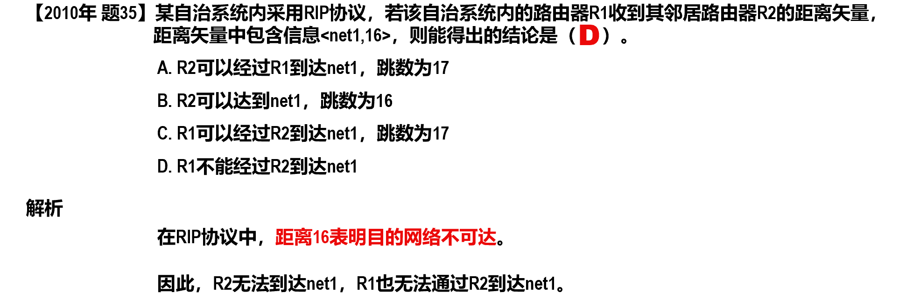

    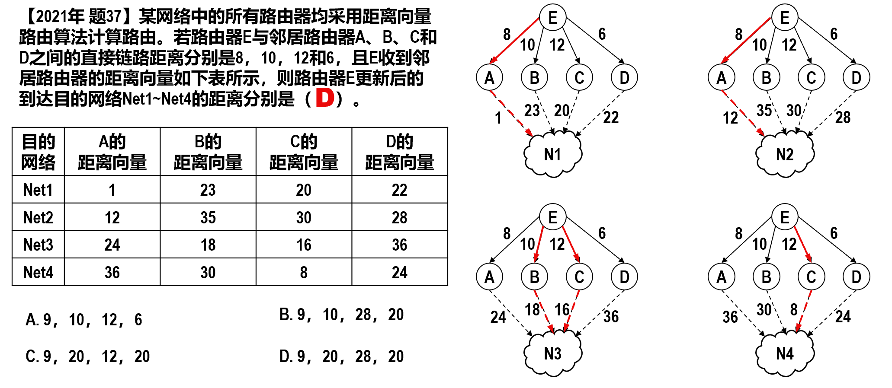

---

#### RIP存在的问题

这个问题的核心在于：**当网络出现故障时，错误的路由信息（谣言）可能会在路由器之间反复传递，导致网络在很长一段时间内无法稳定（收敛）。**

1. **故障突发：** 路由器 **R1** 直连的网络 **N1** 突然发生故障。
2. **R1 感知：** R1 立刻检测到了故障，将到达 N1 的距离（跳数）修改为 **16**（在 RIP 协议中，16 代表不可达/无穷大）。
3. **关键的时间差：** 按照正常逻辑，R1 应该告诉 R2 “N1 挂了”。但是，**很不凑巧**，在 R1 发送更新报文之前，**R2 的周期性更新时间（30秒一次）先到了**。
4. **过时的信息：** R2 并不知道 N1 出事了，它按照自己旧的路由表，向 R1 发送了一条更新报文：“我有办法去 N1，距离是 2 跳（经过 R1）”。
5. **R1 收到更新：** R1 收到了 R2 发来的“好消息”（其实是过时的谣言）。
6. **错误的计算：** R1 心想：“我现在去不了 N1 了（直连断了），但邻居 R2 说它能去，而且距离只有 2。那我就通过 R2 去吧！”
7. **更新路由表：** R1 按照 RIP 算法（下一跳距离+1），将自己去往 N1 的路由更新为：**下一跳 R2，距离 3** ($2+1=3$)。

* *此时，路由环路形成了：R1 把数据发给 R2，R2 其实又要发回给 R1，因为 R2 的下一跳还是 R1。*

8. **R1 传播谣言：** 又过了约 30 秒，轮到 R1 发送更新报文了。R1 告诉 R2：“我现在去 N1 的距离是 3”。
9. **R2 更新路由表：** R2 收到后计算：“既然 R1 去 N1 是 3 跳，那我经过 R1 去 N1 就是 $3+1=4$ 跳”。
10. **结果：** R2 将距离更新为 **4**，下一跳仍然是 R1。
11. **恶性循环：**

* R2 告诉 R1：“我是 4”。 -> R1 更新为 **5**。
* R1 告诉 R2：“我是 5”。 -> R2 更新为 **6**。
* ......

12. **网络拥塞：** 在这个过程中，如果有发往 N1 的数据包，会在 R1 和 R2 之间无限转圈（路由环路），浪费网络带宽。
13. **最终结局：** 这样的循环会一直持续下去，直到距离数值增加到 **16**。
14. **收敛：** 当距离变成 16 时，R1 和 R2 终于意识到 N1 是“不可达”的，停止更新。路由表终于恢复正确（虽然 N1 确实不可达了）。

“坏消息传播得慢”的问题又被称为路由环路或**RIP距离无穷计数问题**。这是距离向量算法的一个固有问题。可以采取以下多种措施**减少**出现该问题的概率或减小该问题带来的危害：

- 限制**最大RIP距离为15**（16表示不可达）。
- 当路由表发生变化时就立即发送路由更新报文（即“**触发更新**”），而不仅是周期性发送。
- 让路由器记录收到某个特定路由信息的接口，而不让同一路由信息再通过此接口向反方向传送（即“**水平分割**”）。

??? note "什么是水平分割"
    水平分割（Split Horizon） 就是路由器的一种自我约束机制：

    - 规则： 从接口 A 学到的路由，绝不再从接口 A 发回去。

    - 目的： 阻止无用的路由信息回环，从根本上避免了两台路由器之间的“谣言”互传。

!!! info
    使用上述措施仍无法彻底解决问题。因为在距离向量算法中，每个路由器都缺少到目的网络整个路径的完整信息，无法判断所选的路由是否出现了环路。

---

#### RIP版本和相关报文的封装

现在较新的RIP版本是1998年11月公布的**RIP2**[RFC 2453]，已经成为因特网标准协议。与RIP1相比，RIP2可以支持**变长子网掩码和CIDR**。另外，RIP2还提供**简单的鉴别**过程并支持**多播**。

RIP相关报文使用运输层的用户数据报协议UDP进行封装，使用的**UDP端口号为520**。

- 从**RIP报文封装**的角度看，RIP属于TCP/IP体系结构的**应用层**。
- 但RIP的核心功能是**路由选择**，这属于TCP/IP体系结构的**网际层**。

----

#### RIP的优缺点

**优点**

- 实现**简单**，路由器开销小。
- 如果一个路由器发现了RIP距离更短的路由，那么这种更新信息就传播得很快，即“**好消息传播得快**”。

**缺点**

- RIP限制了**最大RIP距离为15**，这就限制了使用RIP的自治系统AS的规模。
- 相邻路由器之间交换的路由信息是路由器中的**完整路由表**，因而随着网络规模的扩大，开销也随之增大。
- “**坏消息传播得慢**”，使更新过程的收敛时间过长。因此，对于规模较大的自治系统AS，应当使用OSPF协议。

---

### 开放最短路径优先协议

#### 开放最短路径优先OSPF的相关基本概念

开放最短路径优先（Open Shortest Path First，OSPF）协议是为了**克服路由信息协议RIP的缺点**在1989年开发出来的。

- “**开放**”表明OSPF协议不是受某一厂商控制，而是**公开发表**的。
- “**最短路径优先**”是因为使用了Dijkstra提出的**最短路径算法**（Shortest Path First，SPF）。

!!! info
    “开放最短路径优先”只是一个路由选择协议的名称，但这**并不表示其他的路由选择协议不是“最短路径优先”**。实际上，用于自治系统AS内部的各种路由选择协议（例如RIP），都要寻找一条“最短”的路径。

- OSPF是基于**链路状态**的，而不像RIP是基于距离向量的。
- OSPF基于链路状态并采用最短路径算法计算路由，从算法上保证了**不会产生路由环路**。
- OSPF**不限制网络规模，更新效率高，收敛速度快**。

---

##### 链路状态

链路状态（Link State，LS）是指本路由器都和**哪些路由器相邻**，以及**相应链路的“代价（cost）”**。

- “**代价**”用来表示费用、距离、时延和带宽等，这些都由网络管理人员来决定。

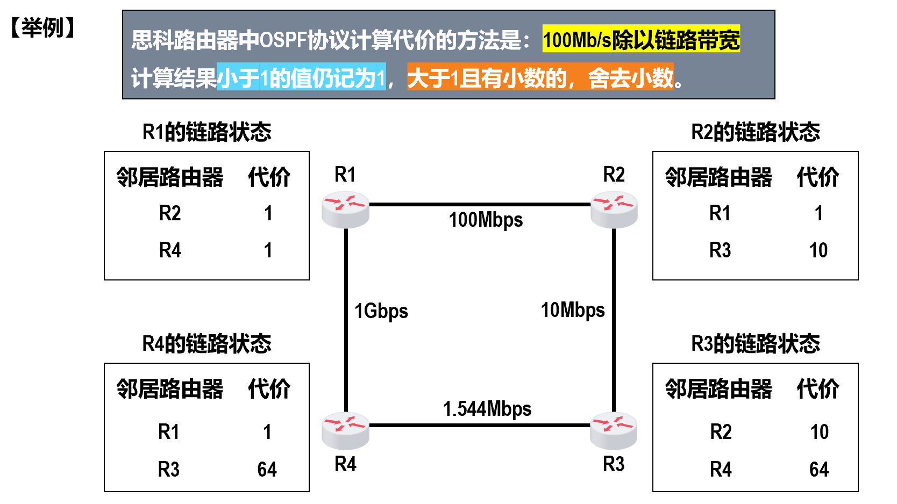

---

##### OSPF路由器邻居关系的建立和维护

OSPF相邻路由器之间通过**交互问候**（Hello）分组来**建立和维护邻居关系**。

- 问候（Hello）分组封装在**IP数据报**中，发往**组播地址224.0.0.5**。IP数据报首部中的**协议号**字段的取值为**89**，表明IP数据报的数据载荷为OSPF分组。

!!! info
    OSPF分组直接使用网际层的IP数据报进行封装，而不像RIP报文需要使用运输层用户数据报协议UDP封装。从数据包按网络体系结构逐层封装的角度看，OSPF属于网际层协议，而RIP属于应用层协议（但其核心功能是路由选择，属于网际层）。

- 问候（Hello）分组的**发送周期为10秒**。
- 若**40秒**未收到来自邻居路由器的问候（Hello）分组，则认为邻居路由器不可达。
- 每个路由器都会建立一张**邻居表**。

---

##### 链路状态通告

使用OSPF的每个路由器都会产生**链路状态通告**（Link State Advertisement，LSA）。

LSA中包含以下两类链路状态信息：

- **直连网络**的链路状态信息
- **邻居路由器**的链路状态信息

---

##### 链路状态更新分组

链路状态通告LSA被封装在**链路状态更新**（Link State Update，LSU）分组中，采用**可靠的洪泛法**（Flooding）进行发送。

- 洪泛法的要点是路由器**向自己所有的邻居路由器发送链路状态更新分组**，收到该分组的各路由器又将该分组转发给自己所有的邻居路由器（但其上游路由器除外），以此类推。
- 可靠是指收到链路状态更新分组后要发送确认，**收到重复的更新分组无需再次转发**，但要发送一次确认。

---

##### 链路状态数据库

使用OSPF的每一个路由器都有一个**链路状态数据库**（Link State Database，LSDB），用于**存储链路状态通告LSA**。

**通过各路由器洪泛发送封装有各自链路状态通告LSA的链路状态更新分组LSU，各路由器的链路状态数据库LSDB最终将达到一致。**

---

##### 基于链路状态数据库进行最短路径优先计算

使用OSPF的各路由器，**基于链路状态数据库LSDB进行最短路径优先计算**，构建出各自到达其他各路由器的最短路径，即**构建各自的路由表**。

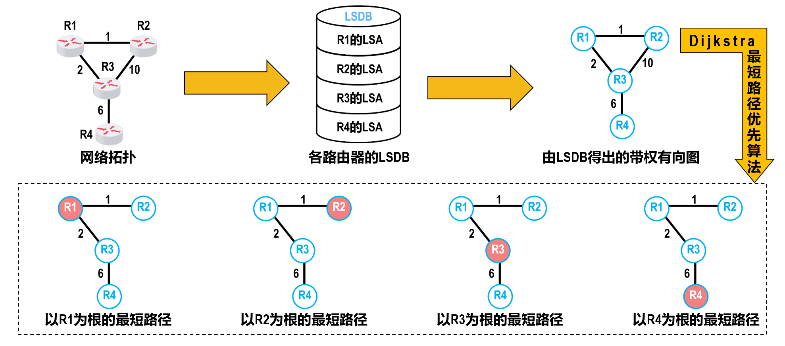

---

#### OSPF的五种分组类型

1. **问候（Hello）** : 用来发现和维护邻居路由器的可达性。
2. **数据库描述（Database Description，DBD）** : 用来向邻居路由器给出自己的链路状态数据库中的所有链路状态项目的摘要信息。
3. **链路状态请求（Link State Request，LSR）** : 用来向邻居路由器请求发送某些链路状态项目的详细信息。
4. **链路状态更新（Link State Update，LSU）** : 路由器使用链路状态更新分组将其链路状态信息进行洪泛发送，即用洪泛法对整个系统更新链路状态。
5. **链路状态确认（Link State Acknowledgment，LSAck）** : 对链路状态更新分组的确认分组。

---

#### OSPF的基本工作过程

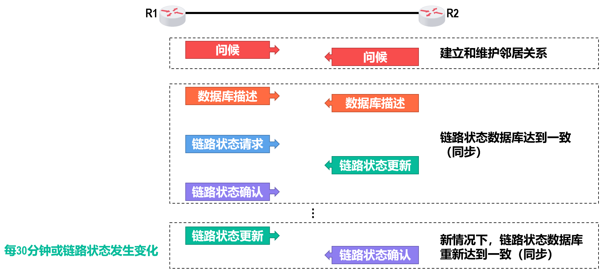

---

#### 多点接入网络中的OSPF路由器

在多点接入网络中OSPF路由器邻居关系的建立

为了**减少洪泛发送问候分组和链路状态更新分组的数量**，OSPF采用以下措施：

- 选举**指定路由器**（Designated Router，DR）和**备用的指定路由器**（Backup Designated Router，BDR）
- **所有的非DR/BDR只与DR/BDR建立邻居关系**
- **非DR/BDR之间通过DR/BDR交换信息**

---

#### OSPF划分区域

为了使OSPF协议能够用于**规模很大的网络**，OSPF**把一个自治系统AS再划分为若干个更小的范围**，称为**区域**（area）。

划分区域的好处就是把利用洪泛法交换链路状态信息的范围局限于每一个区域，而不是整个自治系统AS，这样就减少了整个网络上的通信量。

- 自治系统边界路由器（AS Border Router，ASBR）：R6
- 主干路由器（Backbone Router，BBR）：R3、R4、R5、R6和R7
- 区域内路由器（Internal Router，IR）：区域1内的R1和R2，区域2内的R8，区域3内的R9
- 区域边界路由器（Area Border Router，ABR）：R3、R4和R7

采用划分区域的方法，虽然使交换信息的种类增多了，同时也使OSPF协议更加复杂了，但这样做能使每一个区域内部交换路由信息的通信量大大减小，因而使OSPF协议能够用于规模更大的自治系统AS。

??? example "PPT 上的练习"
    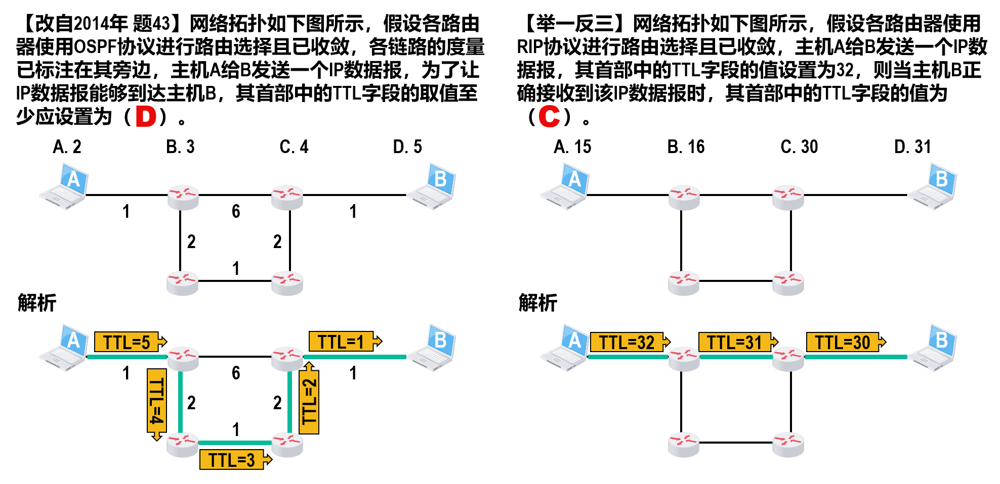

---

### 边界网关协议

#### 边界网关协议BGP的相关基本概念

边界网关协议（Border Gateway Protocol，**BGP**）属于外部网关协议EGP这个类别，用于**自治系统AS之间的路由选择协议**。

由于在不同AS内度量路由的“代价”（距离、带宽、费用等）可能不同，因此**对于AS之间的路由选择**，**使用统一的“代价”作为度量来寻找最佳路由是不行的**。

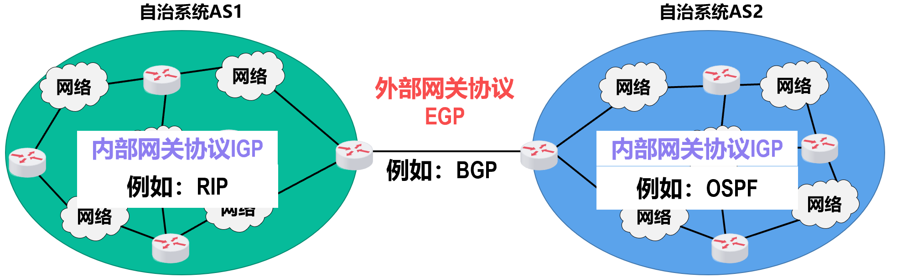

AS之间的路由选择还必须考虑**相关策略**（政治、经济、安全等）。

!!! info
    自治系统之间的路由选择协议应当允许使用多种路由选择策略。这些策略包括政治、经济、安全等，它们都是由网络管理人员对每一个路由器进行设置的。但这些策略并不是自治系统之间的路由选择协议本身。
    
    BGP只能是力求寻找一条能够到达目的网络且比较好的路由（即不能兜圈子），而并非要寻找一条最佳路由。

在配置BGP时，每个AS的管理员要选择至少一个路由器作为该AS的“**BGP发言人**”。

一般来说，两个BGP发言人都是通过一个共享网络连接在一起的，而BGP发言人往往就是**BGP边界路由器**。

使用TCP连接交换路由信息的两个BGP发言人，彼此称为对方的**邻站**（neighbor）或**对等站**（peer）。

BGP发言人除了运行BGP协议外，还必须运行自己所在AS所使用的内部网关协议IGP，例如RIP或OSPF。

BGP发言人交换网络可达性的信息，也就是要**到达某个网络所要经过的一系列自治系统**。

当BGP发言人相互交换了网络可达性的信息后，各BGP发言人就**根据**所采用的**策略**，从收到的路由信息中**找出到达各自治系统的较好的路由**，也就是构造出树形结构且**不存在环路的自治系统连通图**。

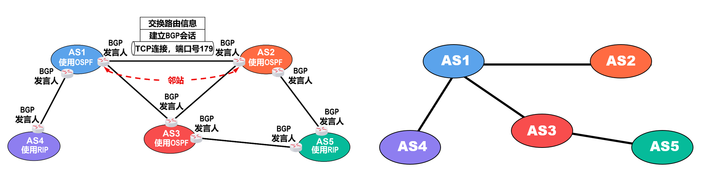

BGP适用于多级结构的因特网。

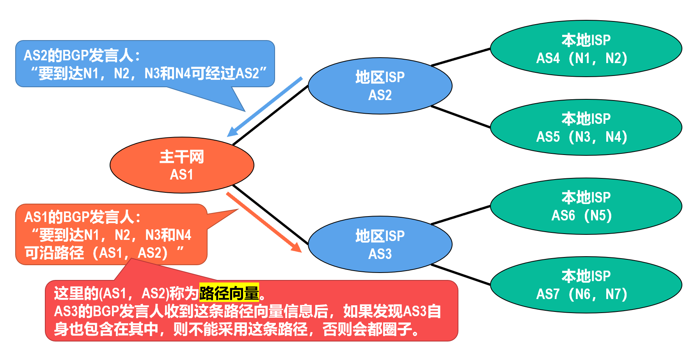

---

#### BGP-4的四种报文

BGP-4是目前使用得最多的版本，在[RFC 4271]中规定了BGP-4的四种报文：

- **打开（Open）** : 用来与相邻的另一个BGP发言人建立关系，使通信初始化。
- **更新（Update）** : 用来通告某一条路由的信息，以及列出要撤销的多条路由。
- **保活（Keepalive）** : 用来周期性地证实邻站的连通性。
- **通知（Notification）** : 用来发送检测到的差错。

??? example "PPT 上的练习"
    

    从实现功能（路由选择）的角度看，这三个路由选择协议都属于网络层。
    
    从数据包按网络体系结构逐层封装的角度看，RIP和BGP属于应用层，OSPF属于网络层。

---

### 路由器的基本工作原理

**路由器**是一种具有多个输入端口和输出端口的**专用计算机**，其任务是**转发分组**。

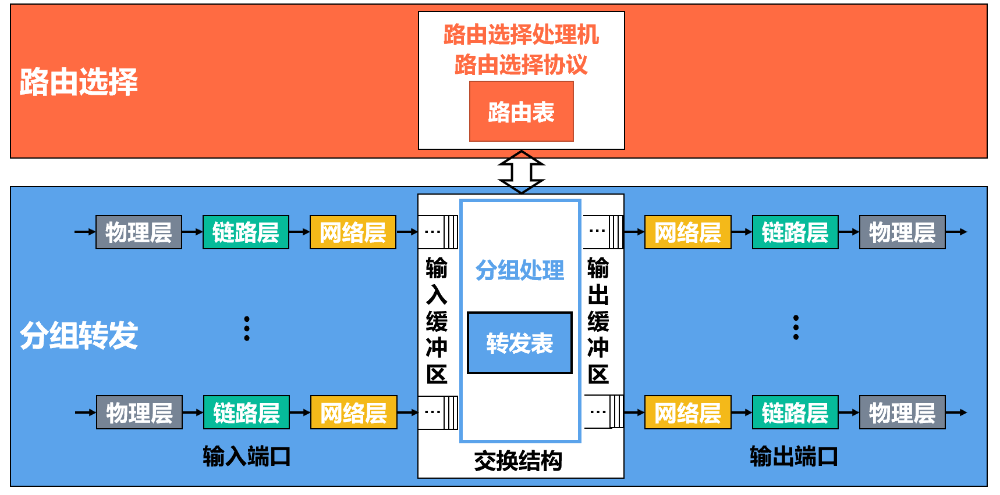

它的体系结构主要由四个部分组成：

* **输入端口（Input Ports）：** 负责接收信号，进行物理层和链路层处理，并进行查找。
* **输出端口（Output Ports）：** 负责将分组存储并在链路层和物理层处理后发送出去。
* **交换结构（Switching Fabric）：** 连接输入与输出的核心组件，负责将分组从输入端口快速交换到合适的输出端口。
* **路由选择处理机（Routing Processor）：** 路由器的“大脑”，执行路由选择协议。

**控制层面：路由表的生成 (Control Plane)**

在数据分组到达之前，路由器首先需要知道网络拓扑结构。这主要由**路由选择处理机**完成：

1. **运行路由协议：** 路由选择处理机运行各种路由选择协议（如OSPF, BGP等），与其他路由器交换**路由报文**（Routing Packets）。
2. **生成路由表：** 路由表（Routing Table）包含从目的网络到下一跳（Next Hop）的映射。它需要根据网络拓扑的变化进行计算并保持最优。
3. **生成转发表：** 路由表通常针对软件查找优化，而**转发表**（Forwarding Table）是从路由表得出的，其**结构专门针对硬件查找速度进行了优化**。转发表会被下发到**交换结构**或输入端口中，用于实际的数据转发。

**数据层面：分组转发流程 (Data Plane)**

当一个普通的数据信号到达路由器时，会经历以下详细的“流水线”处理：

**第一阶段：输入端口处理 (Input Processing)**:

这是数据进入路由器的第一站，包含物理层、链路层和网络层的处理：

1. **物理层接收：** 比特流（Bit stream）或信号作为脉冲波形进入物理层。
2. **链路层处理：** 数据被还原为**帧**（Frame），进行解封装（去掉帧头/帧尾）。
3. **网络层处理与分类：**

* 如果是**路由报文**，它会被送往上层的路由选择处理机，用于更新路由表。

??? note "路由报文接下来的处理"
    解包与分析：处理器会解析报文内容。这些报文通常包含网络拓扑的变化信息（例如：“某条链路断开了”或“发现了一条通往网络X的新路径”）。

    运行路由算法： 处理器运行具体的路由选择协议（如 OSPF, RIP, BGP 等）。根据报文中的新信息，结合已知的网络拓扑，重新运行路径算法（例如 Dijkstra 最短路径算法）。

    更新路由表 (RIB Update)： 计算完成后，处理器会更新主路由表（Routing Information Base, RIB）。

    生成转发表： 路由表（Routing Table）通常包含全面的网络信息，结构复杂，不适合硬件快速查找。处理器会从更新后的路由表中提取关键信息，生成结构更简单、经过优化的转发表（Forwarding Information Base, FIB）。

    下发（Download）： 处理器将新的转发表复制/下发到每个输入端口的交换接口卡上。

    虽然原来的路由报文已经被“消费”了，但流程往往还会继续影响外部网络：

    - 生成新的路由报文： 如果路由计算发现最佳路径发生了改变，或者网络拓扑确实变了，路由选择处理机会生成新的路由报文。
    
    - 发送给邻居： 这些新报文会通过输出端口发送给相邻的路由器，告知它们网络结构的变化，从而触发整个网络的路由收敛。

* 如果是**数据分组**，则进入缓冲区等待转发。

4.  **查找与决策：** 输入端口根据分组首部中的目的地址，查询**转发表**，决定该分组应当被发送到哪个输出端口。

**第二阶段：通过交换结构 (Switching)**:

这是路由器的核心性能**瓶颈**所在：

* 分组通过**交换结构**从输入端口传输到指定的输出端口。
* **三种交换方式：** 为了提高速度，交换结构通常采用以下三种方式之一：

1. **通过存储器** (Memory)
2. **通过总线** (Bus)
3. **通过互连网络** (Interconnection Network) - *这是高性能路由器常用的方式。*

* 在此过程中，分组可能会在输入缓冲区排队（如果交换结构繁忙），或者在输出缓冲区排队（如果发送速率低于交换速率）。

**第三阶段：输出端口处理 (Output Processing)**:

当分组到达输出端口后，进行反向操作：

1. **排队与缓存：** 分组进入输出缓冲区。
2. **网络层操作：** 此时会执行关键的数据修改操作，包括**修改TTL（生存时间）值**（通常减1）以及**重新计算首部检验和**。
3. **链路层封装：** 将网络层分组重新封装成**帧**。
4. **物理层发送：** 将帧转换为比特流/信号，传输到物理链路上，发往下一跳路由器或目标主机。

---

## 网际控制报文协议

### 网际控制报文协议概述

为了更**有效地转发IP数据报**以及提高IP数据报交付成功的机会，TCP/IP体系结构的**网际层**使用了**网际控制报文协议**（Internet Control Message Protocol，ICMP）[RFC 792]。

**主机**或**路由器**使用ICMP来发送**差错报告报文**和**询问报文**。

**ICMP报文被封装在IP数据报中发送**。

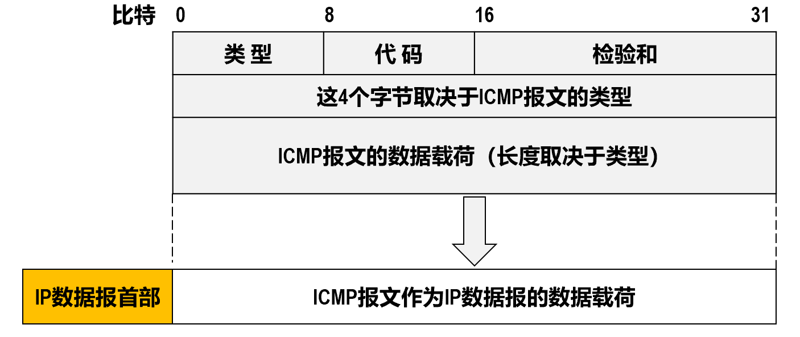

---

### ICMP报文类型

ICMP报文分为以下两大类：

1. **差错报告报文**: 用来向主机或路由器报告差错情况。
2. **询问报文**: 用来向主机或路由器询问情况。

---

#### 差错报告报文

常见的ICMP差错报告报文有以下五种：

1. **目的不可达（Destination Unreachable）**

**当路由器或主机不能交付IP数据报时，就向源点发送重点不可达报文**。具体可再根据ICMP的代码字段细分为目的网络不可达、目的主机不可达、目的协议不可达、目的端口不可达、目的网络未知、目的主机未知等13种。

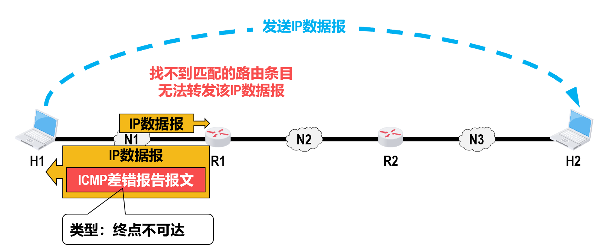

2. **时间超过（Time Exceeded）**

当路由器收到一个目的IP地址不是自己的IP数据报时，会将其**首部中生存时间TTL字段的值减1**。若结果不为0，则路由器将该数据报转发出去；**若结果为0，路由器不但要丢弃该数据报，还要向发送该IP数据报的源点发送时间超过（超时）报文**。

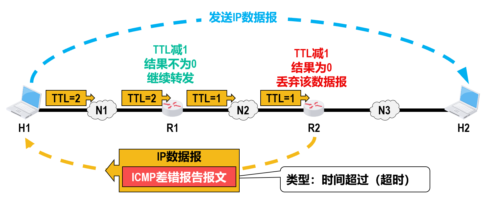

另外，**当终点在预先规定的时间内未能收到一个数据报的全部数据报分片时，就把已收到的数据报片都丢弃，也会向源点发送时间超过（超时）报文**。

3. **参数问题（Parameter Problem）**

当路由器或目的主机收到IP数据报后，根据其首部中的检验和字段的值发现**首部**在传送过程中出现了**误码**，就**丢弃该数据报**，并**向发送该数据报的源点发送参数问题报文**。

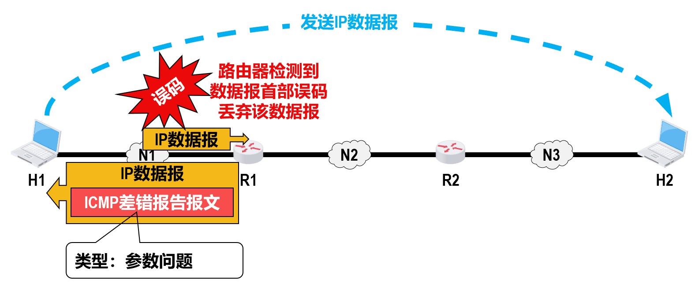

4. **源点抑制（Source Quench）**

**当路由器或主机由于拥塞而丢弃IP数据报时，就向发送该IP数据报的源点发送源点抑制报文**，使源点知道应当把IP数据报的发送速率放慢。

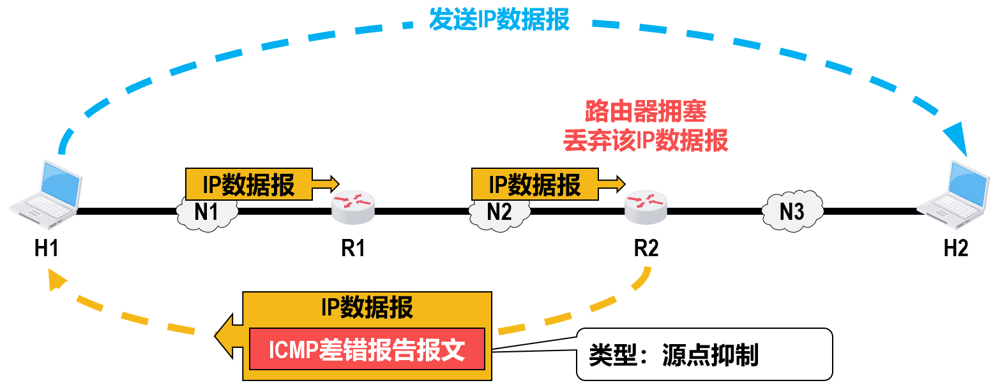

5. **重定向（Redirect）**

路由器把改变路由报文发送给主机，**让主机知道下次应将IP数据报发送给另外的路由器**，这样可以**通过更好的路由到达目的主机**。

以下情况**不应发送ICMP差错报告报文**：

- 对ICMP差错报告报文不再发送ICMP差错报告报文。
- 对第一个分片的IP数据报片的所有后续数据报片都不发送ICMP差错报告报文。
- 对具有多播地址的IP数据报都不发送ICMP差错报告报文。
- 对具有特殊地址（例如127.0.0.0或0.0.0.0）的IP数据报不发送ICMP差错报告报文。

---

#### 询问报文

常用的ICMP询问报文有以下两种：

1. **回送请求和回答**: 由主机或路由器向一个特定的目的主机或路由器发出。收到此报文的主机或路由器必须给发送该报文的源主机或路由器发送ICMP回送回答报文。这种询问报文用来测试**目的站是否可达以及了解其有关状态**。
2. **时间戳请求和回答**: 用来请求某个主机或路由器回答当前的日期和时间。在ICMP时间戳回答报文中有一个32比特的字段，其中写入的整数代表从1900年1月1日起到当前时刻一共有多少秒。这种询问报文用来进行**时钟同步和测量时间**。

---

### ICMP的典型应用

#### 分组网间探测PING

分组网间探测PING用来**测试主机或路由器之间的连通性**。

- PING是TCP/IP体系结构的**应用层直接使用网际层ICMP**的一个例子，它并不使用运输层的TCP或UDP。
- PING应用所**使用的ICMP报文类型为回送请求和回答**。

!!! info
    某些主机或服务器为了防止恶意攻击，并会不理睬外界发来的ICMP回送请求报文。

---

#### 跟踪路由

跟踪路由应用traceroute，用于**探测IP数据报从源主机到达目的主机要经过哪些路由器**。

在不同操作系统中，traceroute应用的命令和实现机制有所不同：

- 在**UNIX**版本中，具体命令为“**traceroute**”，其在运输层使用**UDP协议**，在网络层使用**ICMP报文类型只有差错报告报文**。
- 在**Windows**版本中，具体命令为“**tracert**”，其**应用层直接使用网际层的ICMP协议**，所使用的**ICMP报文类型有回送请求和回答报文以及差错报告报文**。

| 步骤 | 发送的 TTL 值 | 谁会丢弃包? | 返回的报文类型 | 获知的信息 |
| :---: | :---: | :--- | :---: | :---: |
| **Round 1** | $TTL=1$ | 第 1 个路由器 (R1) | ICMP 差错报告 (超时) | 第 1 跳路由器的 IP |
| **Round 2** | $TTL=2$ | 第 2 个路由器 (R2) | ICMP 差错报告 (超时) | 第 2 跳路由器的 IP |
| ... | ... | ... | ... | ... |
| **Round N** | $TTL=N$ | 目的主机 (H2) | **ICMP 回送回答 (Echo Reply)** | 到达目的地，探测结束 |

---

## 虚拟专用网和网络地址转换

### 虚拟专用网

虚拟专用网（Virtual Private Network，VPN）：**利用公用的因特网**作为本机构各专用网之间的通信载体，这样形成的网络又称为虚拟专用网。

出于安全考虑，**专用网内的各主机并不应该直接“暴露”于公用的因特网上**。因此，给专用网内各主机配置的IP地址应使各主机在专用网内可以相互通信，而不能直接与公用的因特网通信。

* **“虚拟” (Virtual)：** 表示它并不是真正铺设了物理上的专用线缆，而是通过软件技术在公网中构建了一条逻辑上的“隧道”。
* **“专用” (Private)：** 表示通信是加密的、隔离的，效果上如同在专用网络中传输一样。

在理解VPN原理前，必须先理解IP地址的限制：

给专用网内各主机配置的IP地址应该是该**专用网所在机构可以自行分配的IP地址**，这类IP地址仅在机构内部有效，称为**专用地址**（Private Address），不需要向因特网的管理机构申请。

!!! info
    [RFC 1918]规定了以下三个CIDR地址块中的地址作为专用地址：

    * `10.0.0.0 ~ 10.255.255.255` (CIDR 10/8)

    * `172.16.0.0 ~ 172.31.255.255` (CIDR 172.16/12)
    
    * `192.168.0.0 ~ 192.168.255.255` (CIDR 192.168/16)

**传输限制：** 在因特网中的所有路由器，对目的地址是专用地址的IP数据报一律不进行转发，这需要由因特网服务提供者ISP对其拥有的因特网路由器进行设置来实现。

IP隧道技术是VPN最关键的部分，以一个位于北京的部门A主机（H1）如何安全地向位于上海的部门B主机（H2）发送数据为例。

* **发送方 H1 (北京):** 私有IP `10.1.0.3`
* **接收方 H2 (上海):** 私有IP `10.2.0.3`
* **北京网关 R1:** 公网IP `106.38.0.1`
* **上海网关 R2:** 公网IP `101.80.0.1`

**1. 发起通信 (内部数据报)**

* H1 生成一个**内部IP数据报**。
* **源地址：** `10.1.0.3` (H1)
* **目的地址：** `10.2.0.3` (H2)
* 数据报发送到北京的网关路由器 R1。

**2. 封装与加密 (IP隧道起点)**

* R1 收到数据报后，发现目的地址是专用地址，根据VPN配置，它进行**封装**。
* **加密：** 将整个内部IP数据报（载荷+首部）进行加密。
* **添加外部首部：** R1 给加密后的数据包加上一个新的**外部IP首部**。

a. **新源地址：** `106.38.0.1` (R1的公网IP)
b. **新目的地址：** `101.80.0.1` (R2的公网IP)

**3. 公网传输 (隧道中)**

* 这个“封装后”的数据报进入因特网。
* 因特网的路由器只看**外部首部**。因为 `101.80.0.1` 是合法的公网地址，所以路由器会正常转发该数据报，直到它到达上海的路由器 R2。
* *注意：* 对于因特网上的其他路人来说，他们只能看到这是 R1 发给 R2 的包，无法看到内部真正的原始数据（因为被加密了）。

**4. 解封与转发 (IP隧道终点)**

* R2 收到数据报，剥去外部首部。
* **解密：** R2 对数据部分进行解密，还原出原始的**内部IP数据报**（源 `10.1.0.3` -> 目 `10.2.0.3`）。
* R2 根据内部数据报的目的地址，将其转发给局域网内的 H2。

**VPN 的三种类型**

1. **内联网 VPN (Intranet VPN):**连接同一机构内不同部门的局域网（例如本例中的北京部门和上海部门）。
2. **外联网 VPN (Extranet VPN):**扩展到外部机构，允许合作伙伴或供应商安全接入特定的内部网络资源。
3. **远程接入 VPN (Remote Access VPN):**用于在外地工作的员工。员工在PC上运行VPN软件，通过因特网与公司主机建立隧道，访问公司内网。

---

### 网络地址转换

尽管因特网采用了无分类编址方法来减缓IPv4地址空间耗尽的速度，但由于**因特网用户数量的急剧增长**，特别是**大量小型办公室**和**家庭网络**接入因特网的需求不断增加，**IPv4地址空间即将耗尽的危险然仍没有解除**（实际上，因特网号码分配管理局IANN于2011年2月3日宣布，IPv4地址已经分配完毕）。

**网络地址转换**（Network Address Translation，**NAT**）技术于1994年被提出，用来缓解IPv4地址空间即将耗尽的问题。

- NAT能**使大量使用内部专用地址的专用网络用户共享少量外部全球地址来访问因特网上的主机和资源**。
- 这种方法需要在专用网络连接到因特网的路由器上**安装NAT软件**。装有NAT软件的路由器称为**NAT路由器**，它**至少要有一个有效的外部全球地址** $IP_G$ 。这样，所有使用内部专用地址的主机在和外部因特网通信时，都要在**NAT路由器上将其内部专用地址转换成$IP_G$**。

---

#### 最基本的NAT方法

* **主机 A (Host A)：** 位于专用网（局域网）内，使用**专用地址** $IP_A$。
* **主机 B (Host B)：** 位于因特网上，使用**全球地址** $IP_B$。
* **NAT 路由器：** 连接专用网和因特网的网关。它至少拥有一个有效的**外部全球地址** $IP_G$。
* **NAT 转换表：** 路由器内部维护着一张表，记录了内网 IP 和外网 IP 的映射关系（例如：$IP_A \leftrightarrow IP_G$）。

当主机 A 想要访问主机 B 时，数据包的处理流程如下：

**第一步：主机 A 发送数据**

* 主机 A 生成一个 IP 数据报。
* **源地址：** $IP_A$ （内网私有地址）
* **目的地址：** $IP_B$ （外网全球地址）
* 数据报被发送给网关（NAT 路由器）。

**第二步：NAT 路由器进行地址转换（源地址替换）**

* NAT 路由器收到数据报后，查找其 **NAT 转换表**。
* 它发现 $IP_A$ 对应的外网地址是 $IP_G$。
* **关键操作：** 路由器将数据报首部中的**源地址**从 $IP_A$ 修改为 $IP_G$。
* *此时数据报变为：源 $IP_G$ -> 目 $IP_B$。*
* 数据报被转发到因特网上。

当主机 B 收到数据并进行回复时，流程是反向的：

**第三步：主机 B 发送响应**

* 主机 B 收到数据包时，它看到的发送者是 $IP_G$（它并不知道 $IP_A$ 的存在）。
* 主机 B 生成响应数据报。
* **源地址：** $IP_B$
* **目的地址：** $IP_G$ （路由器的全球地址）
* 数据报通过因特网传回到 NAT 路由器。

**第四步：NAT 路由器进行地址转换（目的地址替换）**

* NAT 路由器收到目的地址为 $IP_G$ 的数据报。
* 它再次查找 **NAT 转换表**，找到 $IP_G$ 对应的内网主机是 $IP_A$。
* **关键操作：** 路由器将数据报首部中的**目的地址**从 $IP_G$ 修改为 $IP_A$。
* *此时数据报变为：源 $IP_B$ -> 目 $IP_A$。*
* 数据报被转发到专用网内，最终送达主机 A。

如果NAT路由器拥有n（n比较小）个全球IP地址，那么专用网内**最多可以同时**有n台主机接入因特网。若专用网内的主机数量大于n，则需要轮流使用NAT路由器中数量较少的全球IP地址。

---

#### 网络地址与端口号转换方法

由于目前绝大多数基于TCP/IP协议栈的网络应用，都使用运输层的传输控制协议TCP或用户数据报协议UDP，为了**更加有效地利用NAT路由器中的全球IP地址**，现在常**将NAT转换和运输层端口号结合使用**。

- 这样就可以使内部专用网中使用专用地址的**大量主机**，**共用NAT路由器上的1个全球IP地址**，因而可以同时与因特网中的不同主机进行通信。

将NAT和运输层端口号结合使用，称为**网络地址与端口号转换**（Network Address and Port Translation，NAPT）

- 现在很多家用路由器将家中各种智能设备（手机、平板、笔记本电脑、台式电脑、物联网设备等）接入因特网，这种路由器实际上就是一个**NAPT路由器**，但往往并不运行路由选择协议。

**场景说明**：

* **专用网内：** 有两台主机，主机 A (`192.168.0.6`) 和主机 B (`192.168.0.9`)。
* **网关（NAPT 路由器）：** 只有一个全球 IP 地址 `113.218.175.235`。
* **目的主机：** 因特网上的服务器 C (`218.75.230.30`)。
* **关键的“巧合”：** 特别设计了主机 A 和主机 B 正好都在使用**相同的源端口号** `30000` 来发起连接。这在局域网中是很常见的，因为端口号是本地有效的。特意这样举例，就是为了能更好地说明NAPT路由器还会对源端口号重新动态分配。

当主机 A 和主机 B 同时向服务器 C 发送数据时，NAPT 路由器会进行如下操作：

主机 A 的处理流程：

1. **发送：** 主机 A 发出数据报 `{源 IP: 192.168.0.6, 源端口: 30000}`。
2. **转换：** 路由器接收后，查找或创建映射。它将源 IP 替换为路由器的全球 IP，并将源端口替换为一个**新的、未被使用的端口号**（例如 `50001`）。
3. **结果：** 发往因特网的数据报变为 `{源 IP: 113.218.175.235, 源端口: 50001}`。
4. **记录：** 路由器在 NAPT 转换表中记录：`192.168.0.6:30000 <---> 113.218.175.235:50001`。

主机 B 的处理流程：

1. **发送：** 主机 B 发出数据报 `{源 IP: 192.168.0.9, 源端口: 30000}`。
2. **转换：** 路由器发现端口 `30000` 在内网重复了，但这不重要。重要的是路由器必须为它分配一个**不同的全球端口号**（例如 `50002`）来区分身份。
3. **结果：** 发往因特网的数据报变为 `{源 IP: 113.218.175.235, 源端口: 50002}`。
4. **记录：** 路由器在表里新增一条：`192.168.0.9:30000 <---> 113.218.175.235:50002`。

当服务器 C 回复数据时，它只能看到路由器的全球 IP 和端口号。路由器通过查看**目的端口号**来决定转发给谁。

服务器回复给 A 的数据：

1. **到达：** 数据报到达路由器，目的地址是 `{IP: 113.218.175.235, 端口: 50001}`。
2. **查表：** 路由器查找 NAPT 表，找到外网端口 `50001` 对应的内网地址是 `192.168.0.6:30000`。
3. **转发：** 路由器修改目的 IP 和端口，将数据准确发回给**主机 A**。

服务器回复给 B 的数据

1. **到达：** 数据报到达路由器，目的地址是 `{IP: 113.218.175.235, 端口: 50002}`。
2. **查表：** 路由器查找 NAPT 表，找到外网端口 `50002` 对应的内网地址是 `192.168.0.9:30000`。
3. **转发：** 路由器修改目的 IP 和端口，将数据准确发回给**主机 B**。

尽管NAT（和NAPT）的出现在很大程度上缓解了IPv4地址资源紧张的局面，但**NAT（和NAPT）对网络应用并不完全透明**，会对某些网络应用产生影响。

NAT（和NAPT）的一个重要特点就是**通信必须由专用网内部发起**，**因此拥有内部专用地址的主机不能直接充当因特网中的服务器**。

对于目前P2P这类需要外网主机主动与内网主机进行通信的网络应用，在通过NAT时会遇到问题，需要网络应用自身使用一些**特殊的NAT穿透技术**来解决。

---

## IP多播

### IP多播技术的相关基本概念

**多播**（Multicast，也称为组播）是一种实现“**一对多**”通信的技术，与传统单播“一对一”通信相比，多播可以极大地**节省网络资源**。

在**因特网**上进行的多播，称为**IP多播**。

当多播组的成员数量很大时，采用多播方式可以显著地减少网络中各种资源的消耗。

---

### IP多播地址和多播组

在**IPv4**中，**D类**地址被作为**多播地址**。

**多播地址**只能用作**目的地址**，而不能用作源地址。

用每一个D类地址来标识一个多播组，**使用同一个IP多播地址接收IP多播数据报的所有主机就构成了一个多播组**。

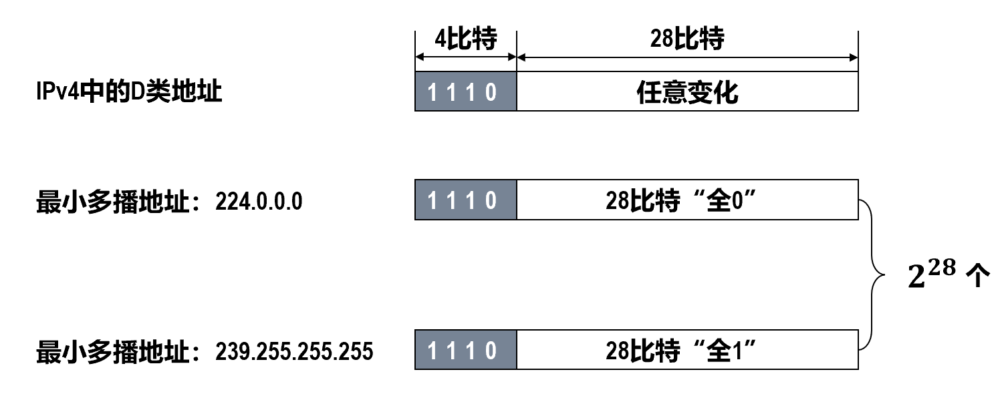

- **每个多播组的成员是可以随时变动的**，一台主机可以随时加入或离开多播组。
- **多播组成员的数量和所在的地理位置也不受限制，一台主机可以属于几个多播组**。

非多播组成员也可以向多播组发送IP多播数据报。

与IP数据报相同，IP多播数据报也是“**尽最大努力交付**”，不保证一定能够交付给多播组内的所有成员。

IPv4多播地址又可分为**预留的多播地址**（永久多播地址）、**全球范围可用的多播地址**以及**本地管理的多播地址**[RFC 3330]。

IP多播可以分为以下两种：

- 只在**本局域网**上进行的**硬件多播**。
- 在**因特网**上进行的**多播**。

目前大部分主机都是通过局域网接入因特网的。因此，在因特网上进行多播的最后阶段，还是要把IP多播数据报在局域网上用硬件多播交付给多播组的所有成员。

---

### 在局域网上进行硬件多播

由于MAC地址（也称为硬件地址）有多播MAC地址这种类型，因此只要**把IPv4多播地址映射成多播MAC地址**，即可将IP多播数据报封装在局域网的MAC帧中，而MAC帧首部中的目的MAC地址字段的值，就设置为由IPv4多播地址映射成的多播MAC地址。这样，可以很**方便地利用硬件多播来实现局域网内的IP多播**。

当给某个多播组的成员主机配置其所属多播组的IP多播地址时，系统就会根据映射规则从该IP多播地址生成相应的局域网多播MAC地址。

因特网号码指派管理局IANA，将自己从IEEE注册管理机构申请到的以太网MAC地址块中从**01-00-5E-00-00-00到01-00-5E-7F-FF-FF**的多播MAC地址，用于映射IPv4多播地址。

- 这些多播MAC地址的左起前25个比特都是相同的，剩余23个比特可以任意变化，因此共有 $2^{23}$ 个。

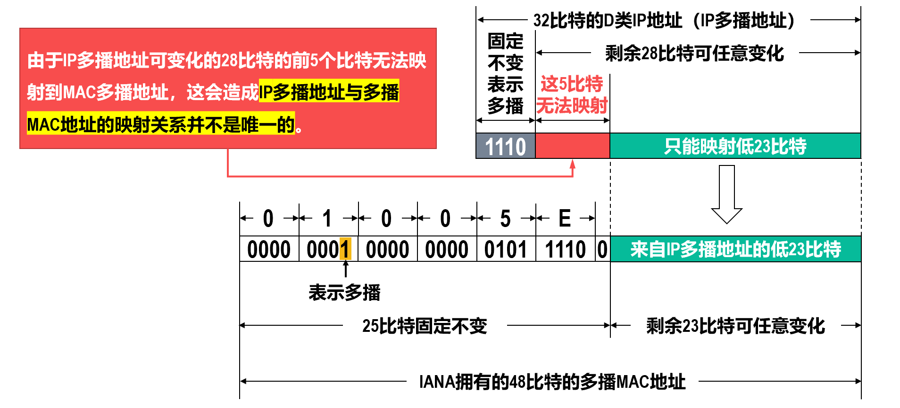

由于IP多播地址与多播MAC地址的映射关系不是唯一的，因此**收到IP多播数据报的主机还要在网际层利用软件进行过滤**，把不是主机要接收的IP多播数据报丢弃。

---

### 在因特网上进行IP多播需要的两种协议

要在因特网上进行IP多播，就必须要考虑**IP多播数据报经过多个多播路由器进行转发**的问题。

- **多播路由器**必须**根据**IP多播数据报首部中的**IP多播地址**，将其**转发**到有该多播组成员的局域网。

网际组管理协议（Internet Group Management Protocol，**IGMP**）是TCP/IP体系结构网际层中的协议，其作用是**让连接在本地局域网上的多播路由器知道本局域网上是否有主机**（实际上是主机中的某个进程）**加入或退出了某个多播组**。

**IGMP仅在本网络有效**，使用IGMP**并不能知道**多播组所包含的**成员数量**，**也不能知道**多播组的**成员都分布**在哪些网络中。

仅使用IGMP并不能在因特网上进行IP多播。连接在局域网上的多播路由器还必须和因特网上的其他多播路由器协同工作，以便把IP多播数据报用最小的代价传送给所有的多播组成员，这就需要使用**多播路由选择协议**。

**多播路由选择协议**的主要任务是：在多播路由器之间为每个多播组建立一个**多播转发树**。

- 多播转发树**连接多播源和所有拥有该多播组成员的路由器**。
- **IP多播数据报只要沿着多播转发树进行洪泛**，就能被传送到所有拥有该多播组成员的多播路由器。
- 之后，在**多播路由器所直连的局域网内**，多播路由器通过**硬件多播**，将IP多播数据报发送给该多播组的所有成员。

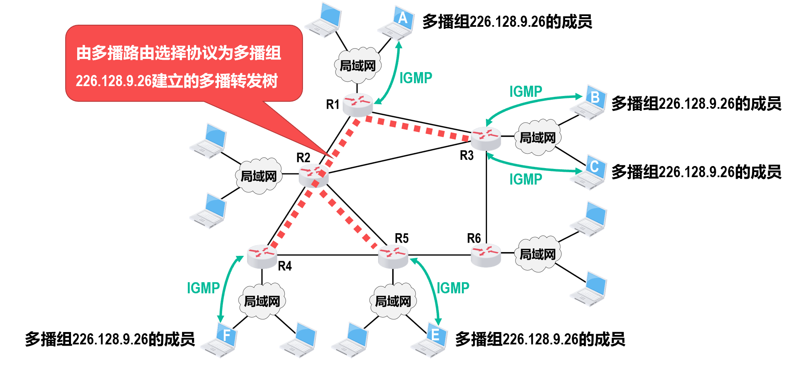

- 针对**不同的多播组需要维护不同的多播转发树**，而且必须**动态地适应多播组成员的变化**，但此时网络拓扑并不一定发生变化，因此**多播路由选择协议要比单播路由选择协议（例如RIP、OSPF等）复杂得多**。
- 即使某个**主机不是任何多播组的成员**，它**也可以向任何多播组发送多播数据报**。
- 为了覆盖多播组的所有成员，**多播转发树可能要经过一些没有多播组成员的路由器**（例如上图中的R2）。

---

### 网际组管理协议

#### 网际组管理协议IGMP的三种报文类型

网际组管理协议IGMP目前的最新版本是2002年10月公布的IGMPv3[RFC 3376]。

IGMP有三种报文类型：

1. **成员查询报文（Membership Query Message）**：由多播路由器周期性地发送到本局域网内，用来询问本局域网上是否有主机加入了某个多播组。
2. **成员报告报文（Membership Report Message）**：由主机发送给多播路由器，用来报告主机加入了某个多播组。
3. **离开组报文（Leave Group Message）**：由主机发送给多播路由器，用来报告主机离开了某个多播组。

IGMP报文被封装在IP数据报中传送

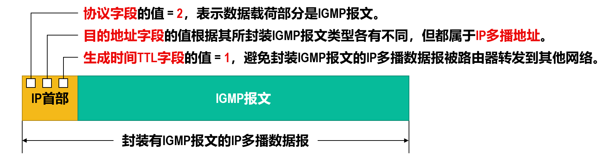

---

#### 网际组管理协议IGMP的基本工作原理

##### 加入多播组

当一台主机想要开始接收某个特定多播组的数据时，它需要主动“举手”报名。

1. **发送成员报告报文：**

假设主机 B 想要加入多播组 `226.0.9.26`。

主机 B 会主动发送一个 **IGMP 成员报告报文**。

**封装细节：**

* 该报文封装在 IP 多播数据报中。
* **IP 目的地址：** 设置为要加入的多播组地址 `226.0.9.26`（而不是路由器的地址）。
* **MAC 目的地址：** 对应的以太网多播地址 `01-00-5E-00-09-1A`。

2. **路由器更新列表：**

* 多播路由器 R1 默认被设置为接收所有的 IP 多播数据报。
* 收到主机 B 的报告后，R1 解析内容，发现有主机想加入 `226.0.9.26`。
* R1 在其**多播组列表**中添加 `226.0.9.26`。此时，R1 就知道需要将该组的数据转发到这个局域网了。

3.  **其他主机的反应：**

* 由于目的 MAC 地址是特定的多播地址，不属于该组的主机（如主机 C、D）会在 MAC 层直接丢弃该帧。
* 属于其他多播组的主机（如主机 C 在 `228.1.1.1`），检查 IP 地址发现不匹配后，也会丢弃该报文。

---

##### 监视多播组的成员变化

路由器需要定期确认“这个局域网里还有没有人听这个频道？”如果没有了，它就要停止转发数据以节省带宽。这是通过**探询（Query）**与**响应（Response）**机制完成的。

1. 路由器发送查询 (Query)

* 路由器 R1 默认每隔 **125秒** 发送一个 **IGMP 成员查询报文**。内容是要查询的多播组（也可以是所有组）。
* **目的地址：** 发送给本网络中**所有**参加多播的主机，IP 地址为特殊的 `224.0.0.1`（表示“所有系统”）。
* **MAC 地址：** 对应的 `01-00-5E-00-00-01`。
* 此报文会被网段内所有开启多播功能的主机（A, B, C）接收，只有不参与任何多播的主机 D 会在硬件层面（MAC层）丢弃它。

2. 主机的随机延时响应 (Random Delay)

收到查询后，主机不会立即一拥而上地回复（这会造成网络风暴），而是采用一种**随机延时响应**机制：

* 主机 A（属于 `226.0.9.26`）随机设定一个计时器，例如 8秒后响应。
* 主机 B（属于 `226.0.9.26`）随机设定一个计时器，例如 2秒后响应。
* 主机 C（属于 `228.1.1.1`）也设定自己的计时器。

3. 响应与抑制 (Report Suppression) —— IGMP 的精髓

这是 IGMP 协议最聪明的设计，目的是减少网络上的重复报文。

* 主机 B 的计时器（2秒）最先到期。主机 B 发送针对 `226.0.9.26` 的 **IGMP 成员报告报文**。
* 这个报告报文是广播给全网段听的（基于多播地址）。
* **主机 A** 听到了主机 B 的报告。A 发现：“哦，B 已经报告了 `226.0.9.26`，那路由器已经知道有人在听这个组了，我就不用多嘴了。”
* 于是，主机 A **取消发送**它原本准备好的报告。这叫做**响应抑制**。
* **主机 C 的行为：** 主机 C 听到了 B 的报告，但发现 B 报告的是 `226.0.9.26`，而自己属于 `228.1.1.1`。这是不同的组，所以 C 必须继续等待自己的计时器到期，然后发送自己的报告。

4. 路由器更新状态

* R1 收到了来自 B 的报告（确认 `226.0.9.26` 有人）和来自 C 的报告（确认 `228.1.1.1` 有人）。
* R1 **重置**这两个组的超时计时器，继续转发这两个组的数据。

**超时与删除 (Leave Group)**

如果在多次探询周期后，路由器**长时间收不到**某个多播组的任何成员响应（意味着最后一个成员也离开了，或者下线了）：

1. R1 发送查询报文。
2. 没有任何主机对组 `228.1.1.1` 进行响应（所有原成员都离开了）。
3. 超时后，R1 将 `228.1.1.1` 从多播组列表中**删除**。
4. R1 停止向该局域网转发 `228.1.1.1` 的数据，从而节省网络资源。

!!! info
    同一网络中的多播路由器可能不止一个，但没有必要每个多播路由器都周期性地发送IGMP成员查询报文。
    
    只要在这些多播路由器中选择一个作为**查询路由器**，由查询路由器发送IGMP成员查询报文，而其他的多播路由器仅被动接收响应并更新自己的多播组列表即可。

    选择查询路由器的方法：
    
    - 每个多播路由器若监听到源IP地址比自己的IP地址小的IGMP成员查询报文则退出选举。
    
    - 最后，网络中只有**IP地址最小的多播路由器成为查询路由器**。

---

##### 退出多播组

IGMPv2在IGMPv1的基础上增加了一个可选项：当主机要退出某个多播组时，可主动发送一个**离开组报文**而不必等待多播路由器的查询。这样**可使多播路由器能够更快地发现某个组有成员离开**。

---

## 移动IP技术

---

## 下一代网际协议IPv6

---

## 软件定义网络

---