# Chapter 5 | 运输层

## 运输层概述

### 进程间基于网络的通信

第2~4章依次介绍了计算机网络体系结构中的物理层、数据链路层和网络层，它们共同解决了将主机通过异构网络互联起来所面临的问题，实现了**主机到主机**的通信。

然而在计算机网络中实际进行通信的真正实体，是位于**通信两端主机中的进程**。

如何**为运行在不同主机上的应用进程提供直接的逻辑通信服务**，就是**运输层的主要任务**。运输层协议又称为**端到端**协议。

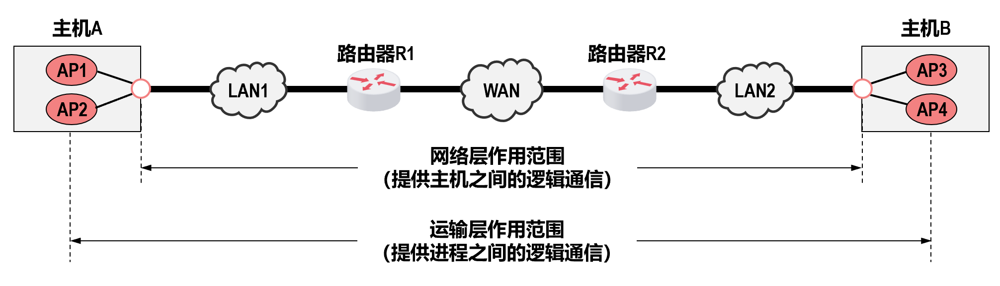

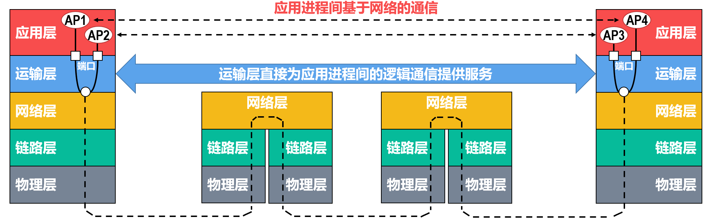

注意：这里的“端口”并不是看得见、摸得着的物理端口，而是用来区分不同应用进程的标识符。

运输层向应用层实体屏蔽了下面网络核心的细节（例如网络拓扑、所采用的路由选择协议等），它使应用进程看见的就**好像是在两个运输层实体之间有一条端到端的逻辑通信信道**。

根据应用需求的不同，**因特网的运输层**为应用层提供了两种不同的运输层协议，即**面向连接的TCP**和**无连接的UDP**。

---

### TCP/IP运输层中的两个重要协议

---

#### **TCP**

传输控制协议（Transmission Control Protocol，TCP）为其上层提供的是面向连接的**可靠**的数据传输服务。

使用TCP通信的双方，在传送数据之前必须**首先建立TCP连接**（逻辑连接，而非物理连接）。数据传输结束后**必须要释放TCP连接**。

TCP为了实现可靠传输，就必须使用很多措施，例如**TCP连接管理、确认机制、超时重传、流量控制以及拥塞控制**等。

TCP的**实现复杂**，TCP报文段的**首部比较大**，占用处理机**资源比较多**。

---

#### **UDP**

用户数据报协议（User Datagram Protocol，UDP）为其上层提供的是**无连接**的**不可靠**的数据传输服务。

使用UDP通信的双方，在传送数据之前不需要建立连接。

UDP不需要实现可靠传输，因此不需要使用实现可靠传输的各种机制。

UDP的**实现简单**，UDP用户数据报的**首部比较小**。

???+ example "question"
    下列关于UDP的描述中，错误的是()。
    
    A.UDP报头主要包括端口号、长度、检验和等字段
    
    B.UDP长度字段是UDP数据报的长度，包括伪首部的长度
    
    C.UDP检验和对伪首部、UDP报文头及应用层数据进行检验
    
    D.伪首部包括IP分组报头的一部分

??? note "answer"
    B.UDP长度字段是UDP数据报的长度，但不包括伪首部的长度。

    伪首部只是在计算检验和时临时添加的，不计入 UDP的长度。对于选项 D，伪首部包括源IP 和目的 IP，这是 IP 分组报头的一部分。

???+ example "question"
    下列关于UDP检验和的说法中，错误的是()。
    
    A.计算检验和时需按2字节对齐，若数据部分不足，则需用一个全0字节填充
    
    B.若UDP检验和计算结果为0,则在检验和字段填充0
    
    C.UDP检验和字段的计算包括一个伪首部、UDP首部和携带的用户数据
    
    D.UDP检验和的计算方法是二进制反码运算求和再取反

??? note "answer"
    B
    
    UDP 检验和不是必需的，若不使用检验和，则将检验和字段设置为0。而若检验和的计算结果恰好为 0，则将检验和字段置为全1(这个结论了解即可)。

???+ example "question"
    下列关于UDP检验的描述中，错误的是()。
    
    A.UDP检验和段的使用是可选的，若源主机不想计算检验和，则该检验和段应为全0
    
    B.在计算检验和的过程中，需要生成一个伪首部，源主机需要把该伪首部发送给目的主机
    
    C.检验出UDP数据报出错时，可以丢弃或交付给上层
    
    D.UDP检验和还能检验IP数据报的源IP地址和目的IP地址

??? note "answer"
    B
    
    UDP 数据报的伪首部包含了 IP 地址信息,目的是通过数据检验保证 UDP 数据报正确到达目的主机。伪首部是临时添加的，只是为了计算检验和，既不向下传送，又不向上递交。若检验出UDP 数据报出错，则可以丢弃，也可以交付给上层，但是需要告诉上层这是错误的数据报。

???+ example "question"
    一个UDP数据报的数据字段长度为9192B,如在数据链路层要采用以太网来传送，则应当将其划分为IP数据报片的片数是()。
    
    A.6    B.7    C.8    D.9

??? note "answer"
    C
    
    UDP 数据字段长度 9192B，加上 UDP 首部长度 8B，共 9200B。每个 IP 数据报片的最大长度为 1500B，减去 IP 首部 20B,剩下 1480B 用来存放 UDP 数据报。因此需要将 UDP 数据报划分为 $\lceil 9200/1480 \rceil$ = 7 个数据报片。每个IP 数据报片的数据字段长度为 1480B，除了最后一个为320B。每个 IP 数据报片的偏移字段的值依次为 0,185,370,555,740,925,1110。

???+ example "question"
    某应用层数据大小为200B,传输层使用UDP,网际层使用IP(采用最大首部长度),使用以太网进行传输(不考虑前导码和VLAN),则该应用层数据的传输效率是()。

    A.82.6%    B.77.5%    C.69.9%    D.67.1%

??? note "answer"
    C
    
    以太网 MAC 帧首部和尾部为 18B,网际层 IP 首部为 60B(采用最大首部长度),传输层 UDP首部为 8B，所以该应用层数据的传输效率为200 $\div$ (200+18+60+8)=69.9%。

???+ example "question"
    在进行跨网络的IP通信时，不考虑NAT,传输层使用UDP进行封装，数据链路层采用以太网MAC帧进行封装，则下列字段中一定保持不变的是()。
    
    I.UDP总长度    II.UDP检验和    ⅢI.FCS帧检验序列    IV.目的MAC地址    V.目的IP地址    VI.IP检验和
    
    A.V    B.I、Ⅱ、V    C.IV、VI    D.Ⅲ、IV、V

??? note "answer"
    A

    UDP 提供的是无连接服务，选项1正确;同时 UDP也提供复用/分用服务，选项I正确;UDP虽然有差错检验机制，但 UDP 的差错检验只是检査数据在传输的过程中有没有出错，出错则直接丢弃，没有重传等机制，不保证可靠传输。使用 UDP 时，可靠传输必须由应用层实现，选项错误。

---

### 运输层端口号

运行在计算机上的进程是使用**进程标识符**（Process Identification，**PID**）来标识的。

- 然而，因特网上的计算机并不是使用统一的操作系统，而**不同操作系统**（Windows、Linux、MacOS）又使用**不同格式的进程标识符**。
- 为了使运行不同操作系统的计算机的应用进程之间能够基于网络进行通信，就必须使用**统一**的方法对TCP/IP体系的应用进程进行标识。

TCP/IP体系结构的运输层使用**端口号**来标识和区分应用层的不同应用进程。端口号的长度为16比特，取值范围是0~65535。

端口号只具有本地意义，即端口号只是为了标识本计算机网络协议栈应用层中的各应用进程。在因特网中，不同计算机中的相同端口号是没有关系的，即相互独立。另外，TCP和UDP端口号之间也是没有关系的。

---

### 发送方的复用和接收方的分用

**发送方的复用** (Multiplexing at Sender)

**复用**是指发送方不同的应用进程都可以使用同一个传输层协议（TCP 或 UDP）来传送数据。这就像许多不同的人（应用进程）都通过同一个邮局（传输层）来寄信。

流程如下：

1. **应用层产生数据：** 各种应用层进程（红色方块）生成应用报文。
2. **端口映射：** 每个应用进程通过特定的 **端口 (Port)** 将数据传递给传输层。端口号就是用来区分不同应用进程的标识。
3. **传输层复用 (UDP/TCP复用)：**

* **UDP复用：** 多个应用进程的数据块被封装成 UDP 用户数据报。
* **TCP复用：** 多个应用进程的数据流被封装成 TCP 报文段。
* 传输层会在头部加上 **源端口** 和 **目的端口**，以便接收方知道是谁发的、发给谁。

4. **IP 复用：** 这是网络层的复用。无论是 UDP 用户数据报还是 TCP 报文段，最终都会被送到 IP 层，封装成 **IP 数据报** 发送出去。

* **关键标识：** 为了让接收方知道这个 IP 数据报里装的是 UDP 还是 TCP，IP 首部中有一个 **协议字段 (Protocol Field)**。

* 如果值为 **17**，表示数据部分是 UDP。
* 如果值为 **6**，表示数据部分是 TCP。

**接收方的分用** (Demultiplexing at Receiver)

**分用**是复用的逆过程。它是指接收方的传输层在剥去报文首部后，能够根据首部中的信息，把数据正确地交付给目的应用进程。

流程如下：

1. **IP 分用：**

* 接收方收到 IP 数据报后，IP 层首先检查 **协议字段值**。
* 如果协议字段是 **17**，IP 层就把数据部分上交给 **UDP 分用** 处理。
* 如果协议字段是 **6**，IP 层就把数据部分上交给 **TCP 分用** 处理。

2. **传输层分用 (UDP/TCP分用)：**

* UDP 或 TCP 协议收到数据后，会检查首部中的 **目的端口号**。
* 根据端口号，传输层找到对应的应用进程（例如端口 80 对应 Web 服务，端口 53 对应 DNS）。

3.  **交付应用：** 最终，应用报文被准确地投递给目标应用进程（红色方块）。

---

## UDP和TCP的对比

### 无连接的UDP和面向连接的TCP

“连接”指逻辑连接关系，而不是物理连接。

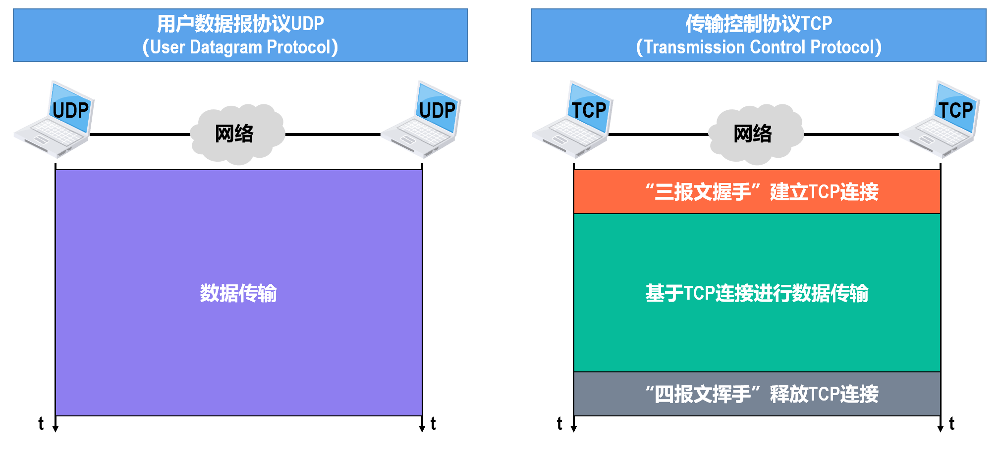

---

### UDP和TCP对单播、多播和广播的支持情况

---

### UDP和TCP应用层报文的处理

---

### UDP和TCP对数据传输可靠性的支持情况

---

### UDP首部和TCP首部的对比

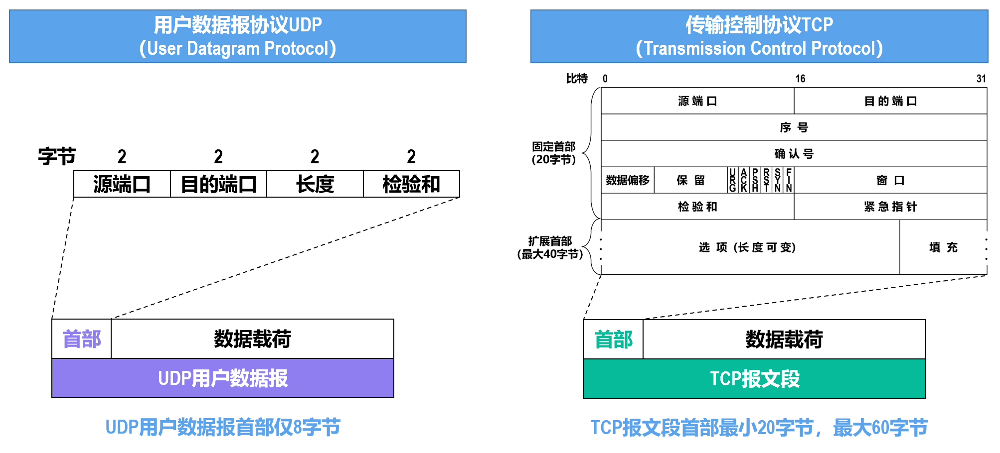

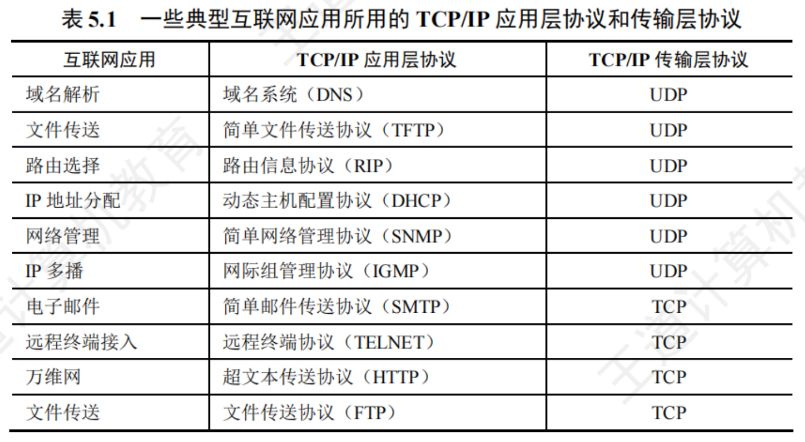

---

## TCP报文段的首部格式

- **序号**: 占32比特，取值范围为 0 ~ $2^{32}-1$ 。当序号增加到最后一个时，下一个序号又回到0。用来指出本TCP报文段数据载荷的第一个字节的序号。
- **确认号**: 占32比特，取值范围为 0 ~ $2^{32}-1$ 。当确认号增加到最后一个时，下一个确认号又回到0。用来指出期望收到对方下一个TCP报文段的数据载荷的第一个字节的序号，同时也是对之前收到的所有数据的确认。
- **确认标志位ACK**: 当ACK标志位置1时，确认号字段有效。ACK取值为0时，确认号字段无效。TCP规定：在TCP连接建立后，所有传送的TCP报文段都必须把ACK置1。

??? example "PPT上例题"
    

    

    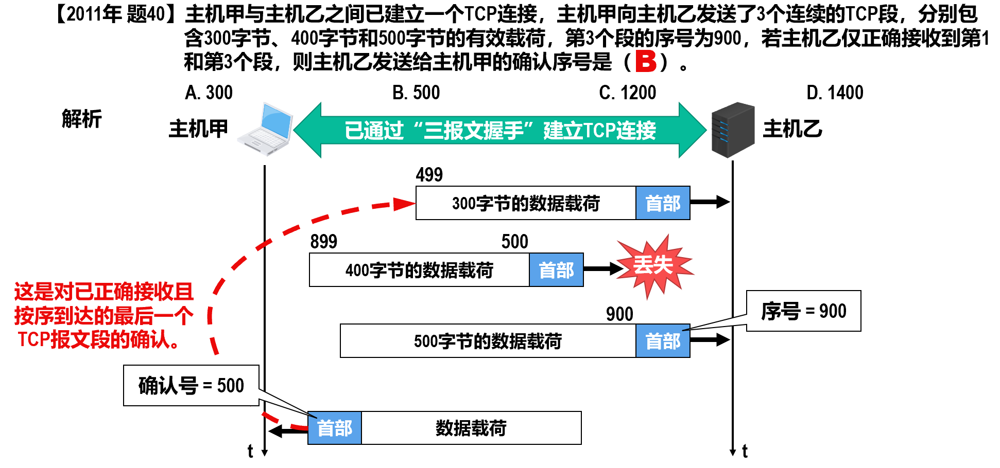

- **数据偏移**: 占4比特，该字段的取值以4字节为单位。指出TCP报文段的数据载荷部分的起始处距离TCP报文段的起始处有多远，这实际上指出了TCP报文段的首部长度。

- **保留**: 占6比特，保留供将来使用，当前必须置0。
- **窗口**: 占16比特，该字段的取值以字节为单位。指出发送本报文段的一方的接收窗口的大小，即接收缓存的可用空间大小，这用来表征接收方的接收能力。在计算机网络中，经常用接收方的接收能力的大小来控制发送方的数据发送量，这就是所谓的流量控制。
- **检验和**: 占16比特。用来检查整个TCP报文段在传输过程中是否出现了误码。

**伪首部的内容**(就是网络层的一些信息):

??? note "发送方检验和计算方法"
    1. 将TCP首部中检验和字段的值置为0。
    
    2. 将伪首部、TCP首部以及数据载荷这三部分划分成若干个2字节的字。若伪首部、TCP首部以及数据载荷这三部分的总长度不是偶数个字节，则在最后添加1个“全0”字节。
    
    3. 对划分出的全部2字节的字进行**反码算数运算求和**，并将**求和结果取反码**。
    
    4. 将步骤 3 得到的结果写入TCP首部中的检验和字段。

    与IPv4数据报首部检验和的计算方法类似，差别仅在于前者只对首部进行检验。

??? note "接收方通过检验和字段的值判断TCP报文段在传输过程中是否误码的方法"
    1. 给接收到的TCP报文段前面添加一个12字节的伪首部。
    
    2. 将伪首部、TCP首部以及数据载荷这三部分划分成若干个2字节的字。
    
    3. 对划分出的全部2字节的字进行反码算数运算求和，并将求和结果取反码。
    
    4. 若步骤 3 得到的结果为0，则表示TCP报文段在传输过程中没有误码。否则，表示出现了误码。
    
- **同步标志位SYN**: 用于TCP“三报文握手”**建立连接**。当**SYN=1且ACK=0**时，表明这是一个**TCP连接请求报文段**。对方若**同意建立连接**，则应在**响应**的TCP报文段的首部中**使SYN=1且ACK=1**。综上所述，SYN为1的TCP报文段要么是一个连接请求报文段，要么是一个连接响应报文段。
- **终止标志位FIN**: 用于TCP“四报文挥手”**释放连接**。当**FIN=1**时，表明此TCP报文段的发送方已经将全部数据发送完毕，现在**要求释放TCP连接**。
- **复位标志位RST**: **用于复位TCP连接**。当**RST=1**时，表明**TCP连接中出现严重差错，必须释放连接，然后再重新建立连接**。RST置1还用来**拒绝一个非法的TCP报文段**或**拒绝打开一个TCP连接**。
- **推送标志位PSH**: 发送方TCP把PSH置1，并立即创建一个TCP报文段发送出去，而不需要积累到足够多的数据再发送。接收方TCP收到PSH为1的TCP报文段，就尽快地交付给应用进程，而不再等到接收到足够多的数据才向上交付。

??? note
    出于效率的考虑，TCP的发送方可能会延迟发送数据，而TCP的接收方可能会延迟向应用进程交付数据。这样可以一次处理更多的数据。
    
    但是当两个应用进程进行交互式通信时，有时在一端的应用进程希望在键入一个命令后立即就能够收到对方的响应。在这种情况下，应用进程可以通知TCP使用推送（PUSH）操作。
    
- **紧急标志位URG**: 当URG=1时，紧急指针字段有效。当URG=0时，紧急指针字段无效。

??? note
    占16比特，以字节为单位，用来指明紧急数据的长度。当发送方有**紧急数据**时，可将紧急数据“**插队**”到发送缓存的最前面，并立刻封装到一个TCP报文段中进行发送。**紧急指针会指出本报文段数据载荷部分包含了多长的紧急数据**，紧急数据之后是普通数据。**接收方收到紧急标志位为1的TCP报文段**，会按照紧急指针字段的值从报文段数据载荷中取出**紧急数据**并直接上交应用进程，而**不必在接收缓存中排队**。

- **选项**（长度可变，最大40字节）: 

    - 最大报文段长度MSS选项：指出TCP报文段数据载荷部分的最大长度，而不是整个TCP报文段的长度。
    - 窗口扩大选项：用来扩大窗口，提高吞吐率。
    - 时间戳选项：用来测量往返时间RTT，改进超时重传算法。用于处理序号超范围的情况，又称为防止序号绕回PAWS。
    - 选择确认SACK选项：用来实现选择确认功能。

!!! info
    数据偏移: 用来实现选择确认功能。

    选项: 长度可变（0~40字节）
    
    填充: 若选项字段的长度加上20字节固定首部的长度不能被4字节整除时，需要填充相应数量的比特0，以确保首部长度能被4字节整除。

???+ example "question"
    TCP在 40Gb/s的线路上传送数据，若TCP充分利用了线路的带宽，则经过()的时间TCP会发生序号绕回(使用了之前用过的字节序号，已知$2^{32} / 5×10^9 = 0.859$)。
    
    A.859ms    B.85.9ms    C.8.59ms    D.0.859ms

??? note "answer"
    A

    序号字段占32比特，因此TCP序号的取值范围是0~$2^{32}-1$。当TCP发送的数据量达到$2^{32}$字节时，序号就会发生绕回，重新使用之前用过的字节序号。要计算发生序号绕回所需的时间，只需将序号的取值范围除以线路的传输速率，即可得到答案：$2^{32} \div 40×10^9 = 0.859$秒 = 859毫秒。

---

## TCP的运输连接管理

### “三报文握手”建立TCP连接

TCP是**面向连接**的协议，它基于运输连接来传送TCP报文段。

- TCP运输连接的建立和释放，是**每一次面向连接的通信中必不可少的过程**。

TCP运输连接有以下三个阶段：

1. 通过“三报文握手”来建立TCP连接。
2. 基于已建立的TCP连接进行可靠的数据传输。
3. 在数据传输结束后，还要通过“四报文挥手”来释放TCP连接。

“三报文握手”建立TCP连接的目的在于解决以下三个主要问题：

1. 使TCP双方能够**确知对方的存在**。
2. 使TCP双方能够**协商一些参数**（例如最大报文段长度、最大窗口大小、时间戳选项等）。
3. 使TCP双方能够**对运输实体资源进行分配和初始化**。运输实体资源包括缓存大小、各状态变量、连接表中的项目等。

---

### TCP“三报文握手”过程

0. 准备阶段：传输控制块 (TCB) 与被动打开

在连接建立之前，通信双方（TCP 客户和 TCP 服务器）都需要进行初始化。

**传输控制块 (TCB):** 主机在建立连接前会创建 **传输控制块 (TCB, Transmission Control Block)**。TCB 中存储了重要信息，包括：

* TCP 连接表
* 指向发送和接收缓存的指针
* 指向重传队列的指针
* 当前的发送和接收序号

**服务器状态:** TCP 服务器进程首先创建 TCB，然后进入 **LISTEN (监听)** 状态，准备接受客户进程的连接请求。这被称为 **“被动打开”**。

**客户状态:** TCP 客户进程最初处于 **CLOSED (关闭)** 状态，随后准备发起主动连接。

1. 第一次握手：客户发送连接请求 (Client $\to$ Server)

TCP 客户进程打算建立连接时，会执行 **“主动打开”**。

**报文段内容:**

* **标志位:** 同步标志位 $SYN=1$。

    * *注意:* TCP 规定，$SYN=1$ 的报文段不能携带数据，但要**消耗掉一个序号**。

* **序号 (Sequence Number):** $seq=x$。

    * 这里 $x$ 是 TCP 客户进程所选择的初始序号。

**状态变化:**

* 发送完该报文段后，TCP 客户进程进入 **SYN-SENT (同步已发送)** 状态。

**关键点:** 此时客户端已经消耗了序号 $x$，所以下一个数据载荷的第一个字节序号应该是 $x+1$。

2. 第二次握手：服务器确认并请求同步 (Server $\to$ Client)

TCP 服务器收到连接请求报文段后，如果同意建立连接，会向客户发送确认。

**报文段内容:**

* **标志位:**

    * $SYN=1$: 表示这也是一个同步报文段，用于同步服务器端的序号。
    * $ACK=1$: 表示确认号字段有效。

* **确认号 (Acknowledgment Number):** $ack=x+1$。这表示服务器已经收到了序号为 $x$ 的报文，期望收到的下一个序号是 $x+1$。这也是对第一次握手的确认。
* **序号 (Sequence Number):** $seq=y$。这里 $y$ 是 TCP 服务器进程所选择的初始序号。

**状态变化:** 发送完该报文段后，TCP 服务器进程进入 **SYN-RCVD (同步已接收)** 状态。

**关键点:** 同样地，$SYN=1$ 的报文段虽然不能携带数据，但也要**消耗掉一个序号**。

3. 第三次握手：客户确认服务器的同步 (Client $\to$ Server)

TCP 客户进程收到服务器的确认后，还要向服务器给出确认。

* **报文段内容:**

* **标志位:**

    * $ACK=1$: 表示确认号字段有效。
    * *注意:* 此时 $SYN$ 标志位已归 0，这是一个普通的 TCP 确认报文段。

* **确认号 (Acknowledgment Number):** $ack=y+1$。这表示客户已经收到了序号为 $y$ 的报文，期望收到的下一个序号是 $y+1$。这是对服务器初始序号 $y$ 的确认。
* **序号 (Sequence Number):** $seq=x+1$。因为第一次握手的 SYN 报文消耗了序号 $x$，所以这一步的序号是 $x+1$。

**关于序号消耗的特殊规则:**

* TCP 规定普通的 TCP 确认报文段（$ACK=1, SYN=0$）**可以携带数据**。
* **如果不携带数据:** 则**不消耗序号**。这意味着，如果该报文段不带数据，下一个发送的数据报文段的序号**仍然是 $x+1$**。

**状态变化:**

* **TCP 客户:** 发送该报文段后，进入 **ESTABLISHED (连接已建立)** 状态。
* **TCP 服务器:** 收到该确认报文段后，也进入 **ESTABLISHED (连接已建立)** 状态。

??? example "PPT上例题"
    

    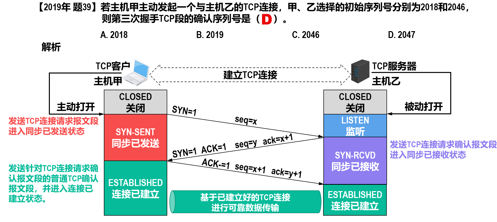

??? note "第三个 TCP 报文是否多余"
    **第一步：** TCP 客户进程发送了一个 `TCP连接请求报文段`。

    * **异常情况：** 这个报文段并没有立即到达服务器，而是滞留在了网络中的某个节点（比如网络拥塞），经历了长时间的延迟。
    * **超时重传：** 客户端因为迟迟没有收到确认，以为刚才的报文丢失了，于是触发了 **“超时重传”** 机制，发送了一个新的连接请求。

    **第二步：** 第二个（重传的）请求顺利到达服务器。双方完成了交互（如果是两报文握手）：

    1.  服务器确认。
    2.  连接建立（进入“连接已建立状态”）。
    3.  数据传输。
    4.  释放连接（双方进入“关闭状态”）。

    * **当前状态：** 此时，客户端和服务器都已经完成了任务，处于 `CLOSED`（关闭）状态。

    **第三步：**意外发生。那个早在第一步就滞留在网络中的、**已失效的** `TCP连接请求报文段`，在连接已经结束后，竟然“姗姗来迟”，到达了 TCP 服务器。

    如果 TCP 使用“两报文握手”，服务器会做出以下错误判断：

    1.  **误判：** 服务器收到这个失效的报文，误认为客户端又发起了一个**新的**连接请求。
    2.  **直接建立连接：** 服务器发送 `TCP连接请求确认报文段`，并**立刻进入“连接已建立状态”**。
    3.  **资源浪费：**

    * **服务端视角：** 我已经建立了连接，我在等客户端发数据过来。
    * **客户端视角：** 我处于 `CLOSED` 状态，并没有发出请求，所以我不会理睬服务器的确认，也不会发送任何数据。
    * **结局：** 服务器会一直挂着这个“僵尸连接”，白白消耗内存和端口资源，一直等待那个永远不会到来的数据。

    采用“三报文握手”就是为了解决这个问题。如果是三报文握手，会变成这样：

    1.  服务器收到那个失效的报文，发出确认（第二次握手）。
    2.  服务器**不会**立即进入“连接已建立状态”，而是进入 `SYN-RCVD`（同步已接收）状态，等待客户端的**再次确认（第三次握手）**。
    3.  客户端收到服务器的确认后，发现自己并没有请求连接，就不会发送第三次握手的确认（或者发送一个 RST 复位报文）。
    4.  服务器收不到第三次握手，就知道连接建立失败，从而回收资源，避免了浪费。

???+ example "question"
    TCP使用三次握手协议来建立连接，设A、B双方发送报文的初始序列号分别为X和Y,A发送(①)的报文给B,B接收到报文后发送(②)的报文给A,然后A发送一个确认报文给B便建立了连接(注意，ACK的下标为捎带的序号)。
    
    ①A.SYN=1,序号=X    B.SYN=1,序号=X+1,ACKx=1    C.SYN=1,序号=Y    D.SYN=1,序号=Y,ACKy+1=1
    
    ②A.SYN=1,序号=X+1    B.SYN=1,序号=X+1,ACKx=1    C.SYN=1,序号=Y,ACKx+1=1     D.SYN=1,序号=Y,ACKy+1=1

??? note "answer"
    ① A ② C

    TCP 使用三次握手来建立连接,第一次握手 A 发给 B 的 TCP 报文中应置其首部 SYN 位为 1,并选择序号 seq=X,表明传送数据时的第一个数据字节的序号是 X ;在第二次握手中，即 B 接收到报文后，发给 A 的确认报文段中应使 SYN=1，使 ACK=1，且确认号 ACK=X+1，即 $ACK_{x+1}$ = 1 (ACK 的下标为捎带的序号)，同时告诉自己选择的序号 seq=Y。

---

### TCP“四报文挥手”释放连接

0. 初始状态

* **TCP 客户** 和 **TCP 服务器** 最初都处于 **ESTABLISHED (连接已建立)** 状态，双方正在进行双向的数据传输。

1. 客户发起连接释放 (Client $\to$ Server)

TCP 客户进程决定结束数据传输，执行 **“主动关闭”**。

* **动作:** 客户向服务器发送 **TCP 连接释放报文段**。
* **报文段细节:**

* **标志位:**

    * $FIN=1$: 表示这是一个连接释放报文段。
    * *注意:* TCP 规定，$FIN=1$ 的报文段即使不携带数据，也要**消耗掉一个序号**。
    * $ACK=1$: 表示确认号有效，同时也对之前收到的报文进行确认。

* **序号:** $seq=u$。这里的 $u$ 等于 TCP 客户进程之前**已传送过的数据的最后一个字节的序号加 1**。
* **确认号:** $ack=v$。这里的 $v$ 等于 TCP 客户进程之前**已收到的数据的最后一个字节的序号加 1**。

* **状态变化:**发送后，TCP 客户进程进入 **FIN-WAIT-1 (终止等待 1)** 状态。

2. 服务器确认收到 (Server $\to$ Client)

TCP 服务器收到连接释放报文段后，执行 **“被动关闭”**。

* **动作:** 服务器发送 **TCP 普通确认报文段**。
* **报文段细节:**

    * **标志位:** $ACK=1$ (这是一个普通的确认报文)。
    * **序号:** $seq=v$。这与之前客户端发来的确认号 $v$ 相匹配。
    * **确认号:** $ack=u+1$。这是对客户端发来的 $seq=u$ 的确认。

* **状态变化:**

    * **服务器:** 进入 **CLOSE-WAIT (关闭等待)** 状态。此时，TCP 服务器进程会**通知高层应用进程**：连接正在释放。
    * **客户:** 收到该确认后，从 `FIN-WAIT-1` 进入 **FIN-WAIT-2 (终止等待 2)** 状态。

!!! info "半关闭 (Half-Close) 状态"
    在服务器发送了确认报文段后，连接处于 **“半关闭”** 状态：

    * **客户端 $\to$ 服务器:** 连接已释放。客户端没有数据要发了。

    * **服务器 $\to$ 客户端:** 连接**未关闭**。如果服务器还有数据，客户端仍需接收。

    * 在这个阶段，服务器发送的数据序号假设为 $seq=w$，确认号**依然维持** $ack=u+1$。

3. 服务器发起连接释放 (Server $\to$ Client)

当服务器将剩余的数据发送完毕，应用进程通知 TCP 释放连接。

* **动作:** 服务器发送 **TCP 连接释放报文段**。
* **报文段细节:**

    * **标志位:**

        * $FIN=1$: 再次置位，表示服务器也要结束发送了。*注意:* 同样，这个报文段也要**消耗掉一个序号**。
        * $ACK=1$: 确认号有效。

    * **序号:** $seq=w$。*注意:* 这里的 $w$ 不一定等于 $v$。如果在“半关闭”状态下服务器发送了一些数据，$w$ 就会变大；如果没有发送数据，则 $w=v$。
    * **确认号:** $ack=u+1$。这是对之前收到的客户端释放报文段的**重复确认**。

* **状态变化:**发送后，TCP 服务器进程进入 **LAST-ACK (最后确认)** 状态。

4. 客户确认并进入时间等待 (Client $\to$ Server)

TCP 客户收到服务器的释放报文段后，必须对此发出确认。

* **动作:** 客户发送 **TCP 普通确认报文段**。
* **报文段细节:**

    * **标志位:** $ACK=1$。
    * **序号:** $seq=u+1$。这是因为第一步中的 $FIN$ 报文消耗了序号 $u$，所以现在的序号是 $u+1$。
    * **确认号:** $ack=w+1$。这是对服务器 $seq=w$ 的确认。

* **状态变化:**

    * **服务器:** 收到该确认后，进入 **CLOSED (关闭)** 状态，并撤销相应的传输控制块 TCB。
    * **客户:** 发送后，**并没有立即关闭**，而是进入 **TIME-WAIT (时间等待)** 状态。

!!! info "TIME-WAIT 与 2MSL"
    客户进程进入 `TIME-WAIT` 状态后，需要等待 **2MSL** 的时长。

    * **MSL (Maximum Segment Lifetime):** 最长报文段寿命。[RFC793] 建议为 2 分钟，但工程实现上允许使用更小的值。因此 2MSL 通常为 4 分钟。

    **为什么要等待 2MSL？**

    1.  **确保服务器收到最后的确认 (可靠性):**

    * 如果客户端发送的最后一个 $ACK$ 报文段在网络中**丢失**，服务器因为收不到确认，会触发**超时重传**，再次发送 `FIN+ACK` 报文。

    * 如果客户端已经关闭（CLOSED），就无法响应这个重传。

    * 通过等待，客户端可以收到重传的 `FIN`，并重新发送 `ACK`，确保服务器顺利进入 `CLOSED` 状态。

    2.  **防止“已失效的连接请求”干扰新连接 (网络净化):**

    * 等待 2MSL 可以确保本次连接持续时间内所产生的所有报文段都从网络中消失。

    * 这样可以保证在建立下一个新的 TCP 连接时，不会出现旧连接中“游荡”的失效报文段。

5. **最终结果**

经过 2MSL 时间后，TCP 客户进程进入 **CLOSED (关闭)** 状态，并撤销传输控制块 TCB。至此，TCP 连接彻底释放。

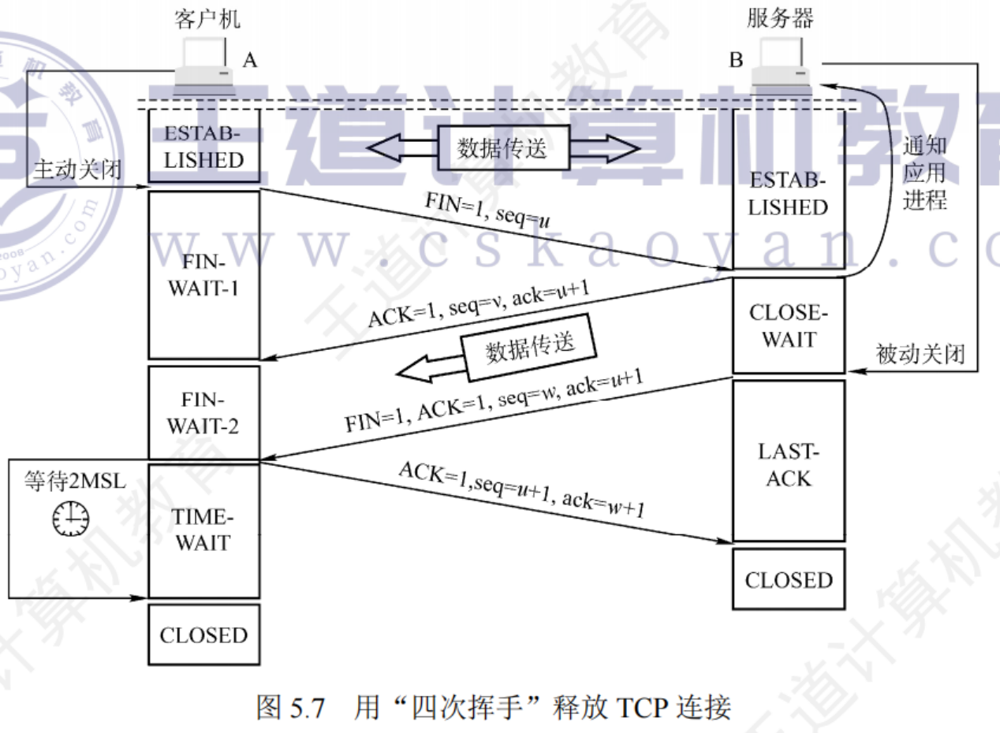

??? example "PPT上例题"
    

**异常处理** —— TCP 保活计时器 (Keep-Alive Timer)

**问题场景:** TCP 连接已建立，但客户端突然故障（主机断电等）。此时服务器如果没有数据要发，就会一直傻等，浪费资源。

**解决机制:** **保活计时器 (Keep-Alive Timer)**。

1.  服务器每收到一次客户的数据，就重置保活计时器（通常设置为 **2小时**）。
2.  若 2 小时没有收到客户数据，服务器发送一个 **探测报文段**。
3.  之后每隔 **75秒** 发送一次。
4.  若一连发送 **10个** 探测报文段后仍无响应，服务器就认为客户端出了故障，自动关闭连接。

???+ example "question"
    主机A和B之间建立了一个TCP连接，A向B发送的第一个SYN报文段中的序号值(seq)等于211,数据传输结束在释放连接时，A向B发送的第4次挥手报文段的seq等于985,则在本次通信过程中，A向B总共发送了()字节的数据。

    A.771    B.772    C.773    D.774

??? note "answer"
    B

    比较细节，做的时候需要注意一下。注意哪里是消耗了序号，哪里是不消耗序号的。

    A 向 B发送的第一个 SYN 段虽然不携带数据,但仍会消耗一个序号 211,A 向B发送的第 4 次挥手报文段的 seq 等于 985，说明之前发送的数据的序号为 212~984，因为在断开连接时发送的第一个 FIN 段会消耗一个序号，因此发送的总数据量为 984-212=772B。

???+ example "question"
    假设客户 C 和服务器 S 已建立一个 TCP 连接，通信往返时间 RTT=50ms ,最长报文段寿命 MSL=800ms ,数据传输结束后，C 主动请求断开连接。若从 C 主动向 S 发出 FIN 段时刻算起，则 C 和 S 进入 CLOSED 状态所需的时间至少分别是()。
    
    A.850 ms, 50 ms    B.1650 ms, 50 ms    C.850 ms, 75 ms    D.1650 ms, 75ms

??? note "answer"
    D

    题目问的是最少时间，所以当服务器 S 收到客户 C 发送的 FIN 请求后不再发送数据,即服务器 S 同时发出确认 ACK 报文段和连接释放 FIN 报文段，忽略 FIN-WAIT-2和 CLOSE-WAIT 状态。客户 C 收到服务器 S 发来的 FIN 报文段后,进入 CLOSED 状态还需等到 TIME-WAIT 结束，总用时至少为 1RTT + 2MSL = 50 + 800 x 2= 1650 ms。服务器 S 进入 CLOSED 状态需要经过 3 次报文段的传输时间，即 1.5RTT=75ms。

???+ example "question"
    假设主机 H 通过 TCP 向服务器发送长度为 3000B 的报文，往返时间 RTT = 10 ms ,最长报文段寿命 MSL = 30 s ,最大报文段长度 MSS = 1000 B ,忽略 TCP 段的传输时延，报文传输结束后 H 首先请求断开连接，则从 H 请求建立 TCP 连接时刻起，到 H 进入 CLOSED 状态为止，所需的时间至少是()。
    
    A.30.03s    B.30.04s    C.60.03s    D.60.04s

??? note "answer"
    D

    建立 TCP 连接的前两次握手需要 1 RTT ,第三次握手的报文段可以携带 MSS = 1000 B 的数据, H 收到该报文段的确认后，发送窗口增大到 2000 B ，因此第 3 个 RTT 可以发送 2000 B 的数据，经过 3RTT 后，3000 B 的报文传输结束。第 4 个 RTT 开始时，H 向服务器发送 FIN 报文段请求断开连接，题目问的是最少时间，因此服务器收到 FIN 请求后不再发送数据，即服务器同时发出连接释放 ACK 报文段和 FIN 报文段。H 收到服务器发来的 FIN 报文段后开启时间等待计时器，等待 2 MSL 的时间(60 s)，进入 CLOSED 状态，总时间为 40 ms + 60 s = 60.04 s。

    

---

## TCP的流量控制

### TCP流量控制的基本概念

**问题**: 如果发送方发得太快，接收方来不及处理，接收缓存就会溢出，导致丢包。

**机制**: 接收方根据自己 接收缓存的可用空间大小，动态调整发送方的发送速率。

TCP为应用程序提供了**流量控制**（Flow Control）机制，以解**决因发送方发送数据太快而导致接收方来不及接收**，**造成接收方的接收缓存溢出的问题**。

**流量控制的基本方法**：接收方根据自己的接收能力（接收缓存的可用空间大小）控制发送方的发送速率。

---

### TCP的流量控制方法

1. 初始状态与数据丢包 (Initial State & Packet Loss)

**前提假设**：

1.  网络不会发生拥塞（不考虑拥塞控制）。
2.  连接建立时，B 告诉 A 其接收窗口 $rwnd=400$。因此 A 将发送窗口 $swnd$ 设置为 400。

**发送过程**：

A 连续发送了三个数据报文段：

* $seq=1$ (数据字节 1-100) [已到达]
* $seq=101$ (数据字节 101-200) [已到达]
* $seq=201$ (数据字节 201-300) [**在传输中丢失**]

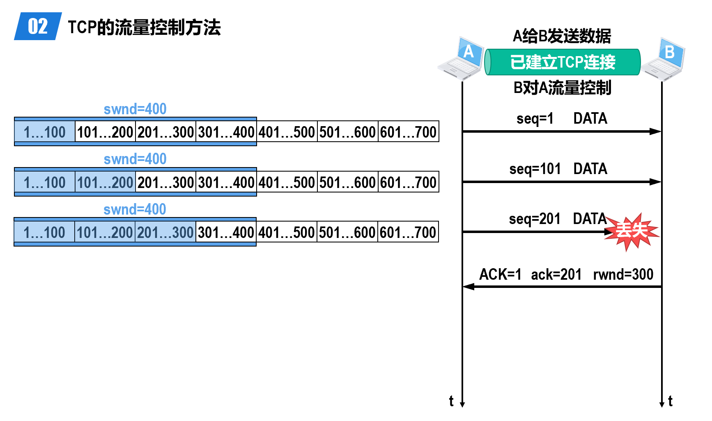

**第一次流量控制**：

* B 收到了 seq=1 和 seq=101，但没收到 seq=201。因此 B 发回确认报文：

    * $ACK=1, ack=201$（期待收到 201）。
    * $rwnd=300$（B 的接收缓存减少，通知 A 将窗口调整为 300）。

* A 收到确认后，将发送窗口 $swnd$ 调整为 300（当前窗口范围为 201-500）。
* A 继续发送 $seq=301$ (301-400)。

2. 超时重传与窗口收缩 (Retransmission & Window Shrinking)

**继续发送**：A 发送 $seq=401$ (401-500)。此时 A 的发送窗口内数据（201-500）已全部发出，无法再发送新数据。
**超时重传**：

* A 针对 $seq=201$ 的 **重传计时器超时**。
* A **重传** $seq=201$ (数据字节 201-300)。

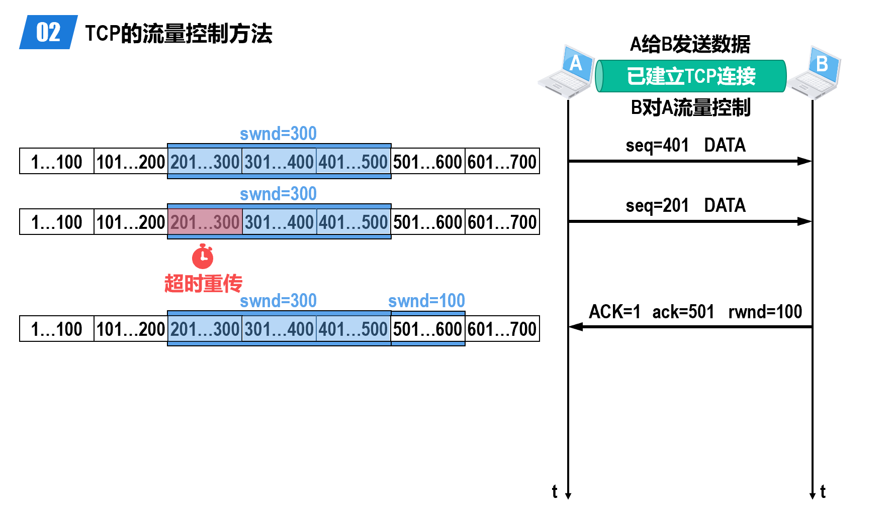

**第二次流量控制**：

* B 收到了重传的 seq=201。由于 B 之前已经收到了 seq=301 和 seq=401（被暂时缓存在接收窗口中），现在数据连续了。
* B 发回确认报文：

    * $ACK=1, ack=501$（确认收到了 500 为止的所有数据，期待 501）。
    * $rwnd=100$（B 的接收缓存进一步减少，通知 A 窗口减小为 100）。

* A 收到后，将 $swnd$ 调整为 100（当前窗口范围 501-600）。

3. 零窗口通知 (Zero Window Advertisement)

**发送最后一段数据**：A 发送 $seq=501$ (501-600)。

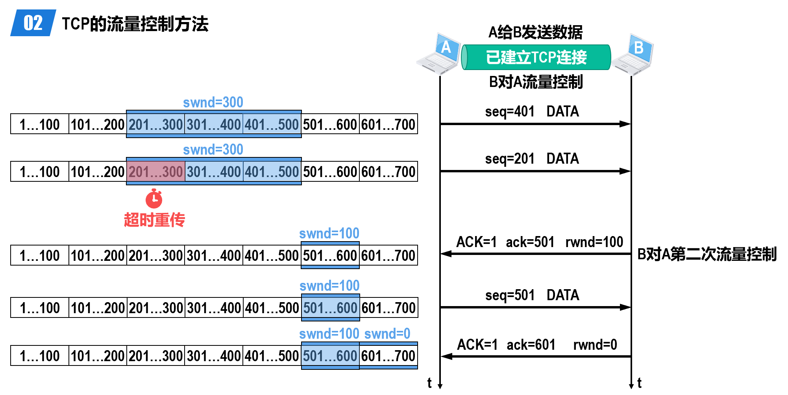

**第三次流量控制**：

* B 收到 seq=501。此时 B 的接收缓存已完全填满。
* B 发回确认报文：

    * $ACK=1, ack=601$。
    * $rwnd=0$（**零窗口通知**，告诉 A 停止发送）。

* A 收到后，将 $swnd$ 设置为 0，停止发送数据。

4. 死锁局面的形成 (The Deadlock Scenario)

**非零窗口通知丢失**：

* 过了一段时间，B 的应用层读取了数据，接收窗口腾出了 300 字节的空间。
* B 向 A 发送一个通知报文：$rwnd=300$。
* **关键事件**：这个非零窗口通知报文在传输过程中 **丢失** 了。

**死锁 (Deadlock)**：

* **B 在等**：B 以为通知发过去了，等待 A 发送数据。
* **A 在等**：A 一直以为 B 的窗口是 0，在等待 B 发送非零窗口通知。
* 如果不采取措施，双方将一直互相等待下去。

5. 持续计时器与零窗口探测 (Persistence Timer & Zero Window Probe)

为了打破死锁，TCP 为每一个连接设有一个 **持续计时器 (Persistence Timer)**。

**启动机制**：只要 TCP 连接的一方（A）收到对方（B）的零窗口通知，就启动持续计时器。

**探测过程**：

1. 当持续计时器 **超时** 时，A 发送一个 **零窗口探测报文段**（仅携带 1 字节数据）。
2. **情况一：B 的窗口仍为 0**

* B 收到探测报文，确认该报文（$ACK=1, rwnd=0$）。
* A 收到确认后，**重新启动** 持续计时器，等待下一次超时再探测。

3. **情况二：探测报文丢失**

* 问题：如果零窗口探测报文段丢失了怎么办？
* 答案：零窗口探测报文段也有 **重传计时器**。当重传计时器超时后，该探测报文段会被 **重传**。因此即使丢失也能打破僵局。

4. **情况三：B 的窗口有空间了**

* B 处理了数据，腾出了空间。
* 当 A 发送探测报文时，B 回复：$ACK=1, rwnd=300$（举例）。
* **死锁被打破**，A 恢复数据发送。

??? note
    A发送的零窗口探测报文段到达B时，如果B此时的接收窗口值仍然为0，那么B根本就无法接受该报文段，又怎么会针对该报文段给A发回确认呢？

    实际上TCP规定：即使接收窗口值为0，也必须接受**零窗口探测报文段**、**确认报文段**以及**携带有紧急数据的报文段**。

??? example "PPT上例题"
    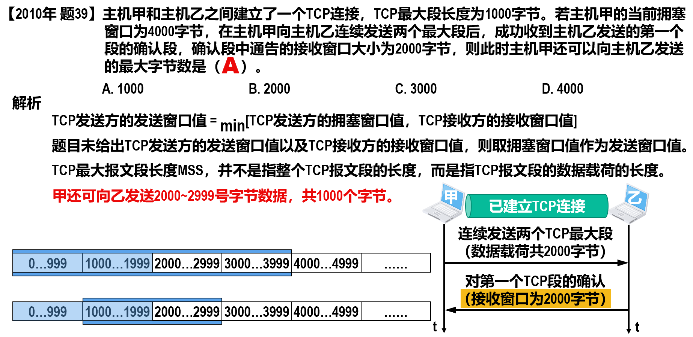

???+ example "question"
    主机甲和主机乙之间已建立一个TCP连接，TCP最大段长为1000B。若主机甲的当前拥塞窗口为4000B,在主机甲向主机乙连续发送两个最大段后，成功收到主机乙发送的第一个段的确认段，确认段中通告的接收窗口大小为2000B,则此时主机甲还可以向主机乙发送的最大字节数是()。

    A.1000    B.2000    C.3000    D.4000

??? note "answer"
    A

    发送方的发送窗口的上限值取接收窗口和拥塞窗口这两个值中的较小一个，于是此时发送方的发送窗口为 min{4000,2000}=2000B。因为确认段是对第一个段的确认，所以 2000B 的含义是甲发送第一个段后还能再发送 2000B，又因为之前甲连续发送了两个最大段，也就是说，第二个段还未收到确认，所以甲还能继续向乙发送的最大字节数是 2000-1000=1000B。

---

## TCP的拥塞控制

### 拥塞控制的基本概念

在某段时间，若对网络中**某一资源的需求超过了该资源所能提供的可用部分**，**网络性能就要变坏**，这种情况就叫作**拥塞**（congestion）。

- 计算机网络中的链路容量（带宽）、交换节点中的缓存和处理机等都是网络的资源。

若出现拥塞而***不进行控制***，整个网络的吞吐量将随输入负荷的增大而**下降**。

- **流量控制**: 应用程序可能正忙于其他任务，并不一定能够立刻取走数据。以**接收方的接收能力**控制发送方（源点）的发送速率。只与特定的点对点通信的发送方和接收方之间的流量有关。
- **拥塞控制**: 防止过多的数据注入到网络中，使网络能够承受现有的网络负荷。源点根据**各方面因素**，按拥塞控制算法自行控制发送速率。全局性问题，涉及网络中所有的主机、路由器等。

---

### 拥塞控制的基本方法

1. 开环控制

- 试图用良好的设计来解决问题。
- 从一开始就保证问题不会发生。
- 一旦系统启动并运行起来，就不需要中途修正。

当网络的流量特征可以准确规定且性能要求可以事先获得时，适合使用开环控制。

2. 闭环控制

- 基于反馈的控制方法，包括以下三个部分：

a. 监测网络拥塞在何时、何地发生。

b. 把拥塞发生的相关信息传送到可以采取行动的地方。

c. 调整网络的运行以解决拥塞问题。

当网络的流量特征不能准确描述或者当网络不提供资源预留时，适合使用闭环控制。

**因特网采用的就是闭环控制方法**。

**衡量网络拥塞的指标**

- 由于缓存溢出而丢弃的分组的百分比
- 路由器的平均队列长度
- 超时重传的分组数量
- 平均分组时延和分组时延的标准差

根据**拥塞信息的反馈形式**，可将闭环拥塞控制算法分为

- 显式反馈算法: 从**拥塞节点**（即路由器）向源点提供关于网络中拥塞状态的显式反馈信息。

- 隐式反馈算法: **源点自身**通过对网络行为的观察（例如超时重传或往返时间RTT）来推断网络是否发生了拥塞。**TCP采用的就是隐式反馈算法**。

!!! info
    拥塞控制并不仅仅是运输层要考虑的问题。显式反馈算法就必须涉及网络层。虽然一些网络体系结构（如ATM网络）主要在网络层实现拥塞控制，但因特网主要利用隐式反馈在运输层实现拥塞控制。

进行拥塞控制是需要付出代价的:

- 可能需要在节点之间**交换信息和各种命令**，以便选择拥塞控制的策略并实施控制，这样会产生额外开销。
- 可能需要**预留一些资源**用于特殊用户或特殊情况，这样就降低了网络资源的共享程度。

然而，为了确保网络性能的稳定，不会因为输入负载的增长而导致网络性能的恶化甚至出现崩溃，使用拥塞控制而付出一定的代价是值得的。

---

### TCP的四种拥塞控制方法

为了集中精力讨论拥塞控制算法的基本原理，假定如下条件

1. **数据是单方向传送的**，而另一个方向只传送确认。
2. 接收方总是有足够大的接收缓存空间，因而发送方的发送窗口的大小仅由网络的拥塞程度来决定，也就是**不考虑接收方对发送方的流量控制**。
3. **以TCP最大报文段MSS**（即TCP报文段的数据载荷部分）的个数作为讨论问题的单位，而不是以字节为单位（尽管TCP是面向字节流的）。

---

#### **基础概念与变量**

* **$cwnd$ (Congestion Window，拥塞窗口)：** 发送方维护的一个状态变量，其值取决于网络的拥塞程度。
* **$rwnd$ (Receive Window，接收窗口)：** 接收方通告给发送方的接收缓存的可用空间大小。
* **$ssthresh$ (Slow Start Threshold，慢开始门限)：** 一个阈值，用于决定使用慢开始算法还是拥塞避免算法。
* **传输轮次 (Transmission Round, RTT)：** 往返时间，指发送方发送数据到接收到确认为止经历的时间。
* **$swnd$ (Send Window，发送窗口)：** 发送方当前可以发送的数据量。公式为：

$$swnd = \min(cwnd, rwnd)$$

我们假设 $rwnd$ 很大，因此忽略流量控制，直接认为 $swnd = cwnd$

cwnd的**维护原则**：只要网络没有出现拥塞，拥塞窗口就再增大一些，但只要网络出现拥塞，拥塞窗口就减少一些。

**判断网络出现拥塞的依据**：没有按时收到应当到达的TCP确认报文段而产生了**超时重传**。

* 当 $cwnd < ssthresh$ 时，使用**慢开始**算法。
* 当 $cwnd > ssthresh$ 时，停止慢开始，改用**拥塞避免**算法。
* 当 $cwnd = ssthresh$ 时，既可使用慢开始也可使用拥塞避免。

---

#### **第一阶段**：慢开始 (Slow Start)

**启动条件：** TCP 连接建立初期，或者发生超时重传（RTO）后，或者 $cwnd < ssthresh$ 时。

**初始状态：**

* $cwnd$ 设置为 1 个最大报文段。
* $ssthresh$ 设置为一个较大的初始值。

**增长规律（指数增长）：**

* 每经过一个传输轮次（RTT），只要收到确认，$cwnd$ 就加倍（$1 \to 2 \to 4 \to 8 \dots$）。
* 虽然名字叫“慢开始”，但这仅指起始值小（从 1 开始），其增长速度非常快（指数级）。

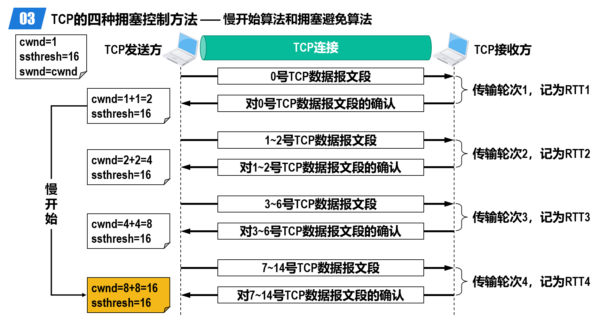

---

#### 第二阶段：拥塞避免 (Congestion Avoidance)

**启动条件：** 当 $cwnd \ge ssthresh$ 时进入此阶段。

**增长规律（加法增大）：**

* “加法增大” (Additive Increase)：每经过一个传输轮次（RTT），$cwnd$ 的值只增加 1 ($cwnd = cwnd + 1$)。
* 这是一种线性增长，目的是让拥塞窗口缓慢增大，探测网络的带宽上限，避免过早引发网络拥塞。

* **说明：** “拥塞避免”**并非指完全能够避免拥塞**，而是指将 $cwnd$ 控制为按线性规律增长，使网络不容易出现拥塞。

---

#### 第三阶段：网络拥塞的处理

##### 情况 A：严重拥塞（超时重传 RTO）

这是 TCP Tahoe 版本（早期版本）的主要处理方式，或者在现代 TCP 中当发生严重丢包导致超时时的回退机制。

1. **判断依据：** 重传计时器超时（Timeout），发送方迟迟没有收到确认。
2. **处理措施：**

* **调整门限：** 将 $ssthresh$ 更新为发生拥塞时 $cwnd$ 值的一半。公式：

$$ssthresh_{new} = cwnd_{old} / 2$$

* **重置窗口：** 将 $cwnd$ 重置为 1。
* **重新开始：** 重新执行**慢开始**算法。

3.  **缺点：** 网络可能并没有发生严重拥塞，只是个别报文丢失，但由于超时重传的机制，发送方不得不将 $cwnd$ 降到 1，重新开始慢开始阶段。这种方式将传输效率突然降到最低，对网络性能影响较大。

---

##### 情况 B：个别报文丢失（3 个重复确认）

这是 TCP Reno 版本（改进版本）引入的机制，包含**快重传**和**快恢复**。

---

#### 第四阶段：快重传 (Fast Retransmit)

* **目的：** 让发送方尽早知道发生了个别报文段的丢失，而不是等待超时的发生。
* **机制要求：**

1. **接收方：** 即使收到了失序的报文段，也要**立即**发出对已收到报文段的重复确认（Duplicate ACK），而不要等待自己发送数据时进行捎带确认。
2. **发送方：** 一旦收到 **3 个连续的重复确认**，就立即重传该丢失的报文段，而不需要等待重传计时器超时。

* 发送方发送 M1, M2, M3, M4, M5, M6。
* M1, M2 到达，接收方确认。
* **M3 丢失**。
* M4 到达（失序），接收方重复确认 M2。
* M5 到达（失序），接收方再次重复确认 M2。
* M6 到达（失序），接收方第三次重复确认 M2。
* 发送方收到 3 个对 M2 的重复确认，**立即重传 M3**。

!!! info
    对于个别丢失的报文段，发送方不会出现超时重传，也就不会误认为出现了拥塞而错误地把拥塞窗口cwnd的值减为1。实践证明，使用快重传可以使整个网络的吞吐量提高约20%。

---

#### 第五阶段：快恢复 (Fast Recovery)

* **启动条件：** 发送方收到 3 个重复确认，执行快重传之后，**不启动慢开始**，而是执行**快恢复**算法。
* **逻辑：** 既然能收到 3 个重复确认，说明网络只是丢失了个别报文，并没有发生严重的拥塞（因为后续报文 M4, M5, M6 依然到达了接收方），因此不需要像超时那样把 $cwnd$ 降为 1。
* **处理措施：**

1. **乘法减小 (Multiplicative Decrease)：** 将慢开始门限 $ssthresh$ 和拥塞窗口 $cwnd$ 都调整为当前 $cwnd$ 的一半。

$$ssthresh_{new} = cwnd_{old} / 2$$

$$cwnd_{new} = ssthresh_{new}$$

部分实现会将 $cwnd$ 设置为 $ssthresh_{new} + 3$，考虑到那 3 个已离开网络进入缓存的报文。这3个报文段不再消耗网络资源而是停留在接收方的接收缓存中。可见现在网络中不是堆积了报文段而是减少了3个报文段，因此可以适当把cwnd值增大一些。

2. **执行拥塞避免：** 设置好新的参数后，直接进入**拥塞避免**阶段（线性增长），而不是慢开始。

??? note "完整流程"
    1. **慢开始阶段 (Round 0-4)：**

    * 初始 $cwnd=1, ssthresh=16$。

    * 指数增长：$1 \to 2 \to 4 \to 8 \to 16$。

    2. **拥塞避免阶段 (Round 4-12)：**

    * 达到 $ssthresh=16$，转为线性增长。

    * $16 \to 17 \to \dots \to 24$。

    3. **超时重传 (Round 12)：**

    * 在 $cwnd=24$ 时发生**超时**（图中红色点）。

    **动作：**

    * $ssthresh = 24 / 2 = 12$

    * $cwnd = 1$

    * 重新进入慢开始。

    4. **慢开始重启 (Round 13-17)：**

    * $cwnd$ 从 1 开始指数增长：$1 \to 2 \to 4 \to 8 \to 12$。

    * 注意：这里增长到新的 $ssthresh=12$ 就停止慢开始了。

    5. **拥塞避免重启 (Round 17-22)：**

    * 从 12 开始线性增长：$12 \to 13 \to 14 \to 15 \to 16$。

    6.  **快重传与快恢复 (Round 22)：**

    * 在 $cwnd=16$ 时，发送方收到了 **3 个重复确认**（图中紫色三角）。

    **动作 (快恢复)：**

    * $ssthresh = 16 / 2 = 8$

    * $cwnd = ssthresh = 8$ (直接降到新的门限值，而不是 1)。

    * **动作 (拥塞避免)：** 从 $cwnd=8$ 开始执行拥塞避免（线性增长 $8 \to 9 \to \dots$）。

??? example "PPT上例题"
    

    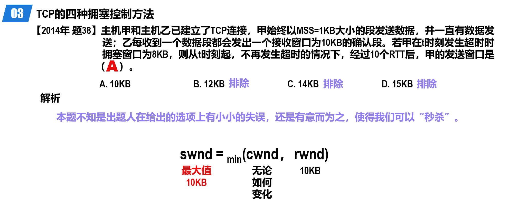

    

    

    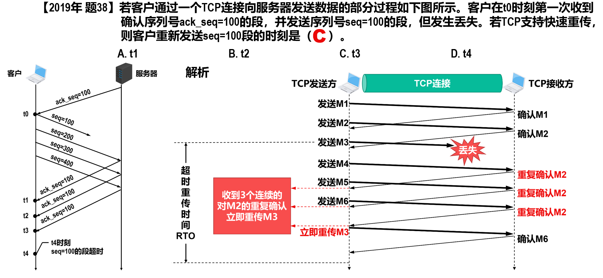

    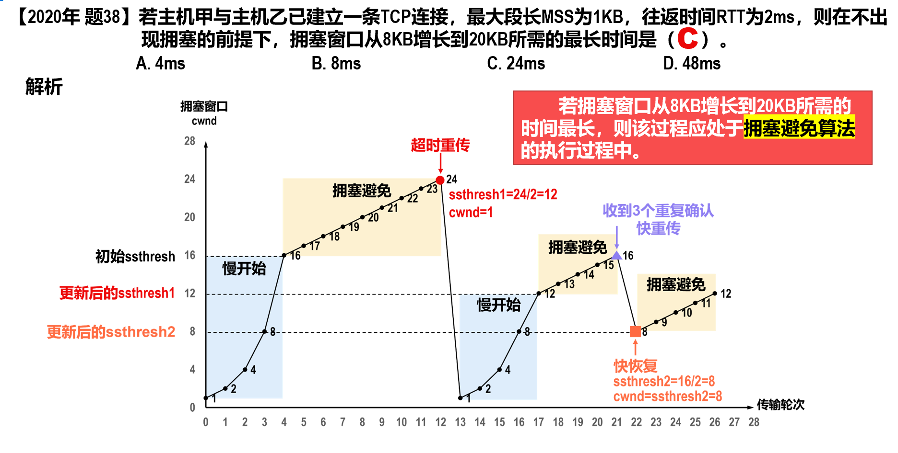

    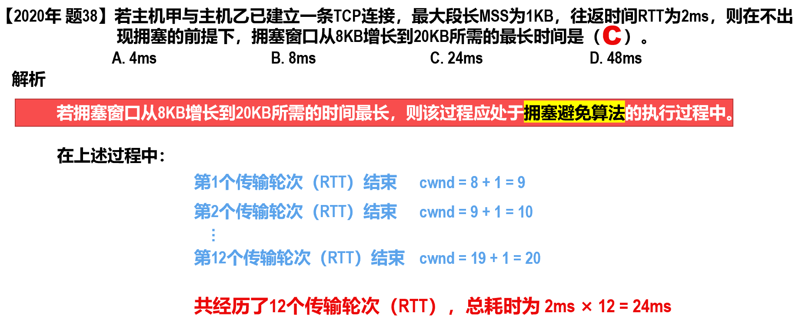

???+ example "question"
    甲和乙刚建立TCP连接，并约定最大段长为2KB,假设乙总是及时清空缓存，保证接收窗口始终为20KB,ssthresh为16KB,若双向传输时间为10ms,发送时延忽略不计，且没有发生拥塞的情况，则经过()甲的发送窗口第一次达到20KB。

    A.40ms    B.50ms    C.60ms    D.70ms

??? note "answer"
    B

    这里需要注意的是后面增加的是 1 MSS。并且需要注意的是这里说的是发送窗口第一次为多少。我们需要注意当发完这一次之后发送窗口即变大了。这里会有一个相差一次的 RTT 的问题，需要注意。下一题即这个坑。

    当拥塞窗口小于 ssthresh 时，拥塞窗口以指数方式增长，拥塞窗口从 2KB 到 16KB 需经过 3RTT，超过 16KB 后，每经过 1RTT，拥塞窗口加 1MSS，所以从 16KB 到 20KB 经过了 2RTT共经过 5RTT，RTT=10ms，故经过 50ms 后甲的发送窗口第一次为 20KB。

???+ example "question"
    在一个TCP连接中，MSS为1KB,当拥塞窗口为34KB时收到了3个冗余ACK报文。若在接下来的4RTT内报文段传输都是成功的，则当这些报文段均得到确认后，拥塞窗口的大小是()。

    A.8KB    B.16KB    C.20KB    D.21KB

??? note "answer"
    D

    条件“收到了3个冗余 ACK报文”说明此时应执行快恢复算法,因此慢开始门限值设为17KB,并且此时 cwnd 也被设为 17KB，第1个RTT后cwnd=18KB，第2个RTT后cwnd=19KB，第3个 RTT 后 cwnd=20KB,第4个 RTT后,发出的报文全部得到确认,cwnd 再增加 1KB,变为 21KB。注意 cwd 的增加都发生在收到确认报文后。

???+ example "question"
    某客户通过一个TCP连接向服务器发送数据的部分过程如下图所示。客户在to时刻第一次收到确认序列号ack_seq=100的段，并发送序列号seq=100的段，但发生丢失。若TCP支持快速重传，则客户重新发送seq=100段的时刻是()。

    A. $t_1$    B. $t_2$    C. $t_3$    D. $t_4$

    

??? note "answer"
    C

    这里需要注意的是，这里是立即执行快速重传算法，也就是马上就重新发送丢失的报文段。

    TCP 规定当发送方收到对同一个报文段的3个重复确认时,就可以认为这个被确认报文段之后的报文已丢失，立即执行快速重传算法。$t_3$ 时刻连续收到来自服务器的三个确认序号 ack_seq=100 的段(注意，如时刻首次收到的 ack_seq=100 的段并不计入冗余 ACK)，发送方认为 seg=100 的段已经丢失，执行快速重传算法，重新发送 seq=100 的段。

---

### TCP拥塞控制与网际层拥塞控制的关系

路由器的输入缓存（可看作缓存队列，以下简称为队列）通常都按照“先进先出FIFO” 的规则来处理到达的IP数据报。由于队列长度总是有限的，因此当队列已满时，之后再到达的所有IP数据报都将被丢弃，这就叫作**尾部丢弃策略**。

1. 接收缓存溢出而导致尾部丢弃
2. TCP报文段的这些发送方产生超时重传，这将导致它们将拥塞窗口cwnd的值陡降为1，因此发送窗口swnd的值也降低为1，并且进入TCP拥塞控制的慢开始阶段，称为全局同步。
3. 全网的通信量骤降，而在网络恢复正常后，其通信量又突然增大很多。

为了避免网络中出现全局同步问题，在1998年提出了**主动队列管理**（Active Queue Management，AQM）。

- 所谓“主动”，就是在**路由器的队列长度达到某个阈值但还未满时就主动丢弃IP数据报**，而不是要等到路由器的队列已满时才不得不丢弃后面到达的IP数据报，这样就太被动了。
- 应当在**路由器队列长度达到某个值得警惕的数值**时，也就是**网络出现了某些拥塞征兆**时，就**主动丢弃到达的IP数据报来造成发送方的超时重传**，进而**降低发送方的发送速率**，因而**有可能减轻网络的拥塞程度**，甚至不出现网络拥塞。 

主动队列管理AQM可以有不同的实现方法，其中曾流行多年的就是随机早期检测（Random Early Detection，RED），也称为**随机早期丢弃**（Random Early Drop，RED 或 Random Early Discard，RED）。

- 路由器需要维护**两个参数**来实现RED：**队列长度最小门限**和**最大门限**。当每一个IP数据报到达路由器时，RED就按照规定的算法计算出当前的平均队列长度。

1. 若平均队列长度小于最小门限，则把新到达的IP数据报存入队列进行排队。
2. 若平均队列长度大于最大门限，则把新到达的IP数据报丢弃。
3. 若平均队列长度在最小门限和最大门限之间，则按照某一丢弃概率p把新到达的IP数据报丢弃（这体现了丢弃IP数据报的随机性）。

但多年的实践证明，RED的使用效果并不理想。

---

## TCP可靠传输的实现

### 1. 基本假定与概念

为了简化讨论，首先设定了以下前提条件：

* **忽略拥塞控制**：假定网络不存在拥塞问题，发送方的发送窗口 (`swnd`) 大小直接等于接收方告知的接收窗口 (`rwnd`) 大小。
* **以字节为单位**：TCP的滑动窗口是基于字节序号的，而不是基于报文段个数 。

---

### 2. 滑动窗口的结构与指针

TCP发送方的窗口状态通常用三个指针 $P_1$ 、$P_2$ 、$P_3$ 来描述和维护 。

发送窗口的三个指针含义 ：

* **P_1 (后沿)**：指向发送窗口内**已发送但尚未收到确认**的第一个字节的序号。
* 小于 P_1 的部分：代表**已发送且已收到确认**的数据，可以从缓存中删除。

* **P_2**：指向发送窗口内**允许发送但尚未发送**的第一个字节的序号。
* P_2 与 P_1 之间的部分：**已发送但未收到确认**的字节数（$P_2 - P_1$）。

* **P_3 (前沿)**：指向发送窗口外**不允许发送**的第一个字节的序号。
* P_3 与 P_1 之间的部分：**发送窗口的大小**（$P_3 - P_1 = \text{swnd}$）。
* P_3 与 P_2 之间的部分：**可用窗口**或**有效窗口**，即允许发送但当前还未发送的字节数量（$P_3 - P_2$）。

---

### 3. 可靠传输的工作流程

#### Step 1: 初始状态 

* **接收方**：通知发送方 `rwnd=20`，并发送确认号 `ack=31`。这意味着序号30及以前的数据都已正确接收，期望收到的下一个序号是31。
* **发送方**：设置发送窗口 `swnd=20`。窗口范围覆盖序号 `31~50` 。此时，$P_1$ =31，$P_2$ =31（假设还没开始发新数据），$P_3$ =51。

!!! info
    注意：
    
    $ack_n$ 在选择重传协议与TCP协议中并不完全相同。

    在选择重传协议中，$ack_n$表明序号到 n 为止的数据已正确接收，现在期望收到序号为 n+1 的数据。

    在TCP协议中， $ack_n$表明序号到 n-1 为止的数据已正确接收，现在期望收到序号为 n 的数据。
    
---

#### Step 2: 发送数据 

* 发送方发送了序号 **31~41** 的数据。
* **指针变化**：
* $P_1$ 保持 31（因为还没收到新的确认）。
* $P_2$ 移至 42（指向下一个要发送的字节）。
* 此时发送窗口内有已发送未确认数据（31~41）和可用窗口（42~50）。

!!! info
    发送方在没有收到接收方确认的情况下，可以把序号落入发送窗口内的数据依次全部发送出去。

    凡是已经发送过的数据，在未收到确认之前都必须暂时保留，以便在超时重传时使用。

---

#### Step 3: 接收方确认与窗口滑动

* **累计确认机制**：TCP接收方只能对**按序收到**的数据中的最高序号给出确认。

**场景A：收到新的确认** 

* 假设接收方收到了序号31~33的数据，发送确认报文 `ack=34`，并维持 `rwnd=20`。
* **发送方处理**：收到 `ack=34` 后，发送窗口后沿（$P_1$）向前移动到 34。发送窗口前沿（$P_3$）也相应向前移动，新的发送窗口范围变为 34~53。

**场景B：收到不连续的数据（乱序）** 

* 如果发送方发送了31~41，但接收方未收到31，却收到了32~33。

**处理**：接收方不能发送 `ack=34`，只能重复发送 `ack=31`（期望收到31）。未按序到达的数据（32~33）通常会先**临时存放**在接收窗口中，等缺失字节收到后再按序交付，而不是直接丢弃 。

---

#### Step 4: 异常情况处理

**超时重传** ：如果发送方发送的数据（如序号31）在规定时间内没有收到确认，重传计时器超时，发送方会重传这部分已发送但未确认的数据。

**窗口耗尽** ：如果 $P_2$ 追上了 $P_3$，意味着可用窗口为0。此时发送方必须停止发送，等待接收方新的确认到来以腾出窗口空间。

---

### 4. 补充说明

- 虽然发送方的发送窗口是根据接收方的接收窗口设置的，但在同一时刻，**发送方的发送窗口并不总是和接收方的接收窗口一样大**，这是因为：

1. 网络传送窗口值需要经历一定的时间滞后，并且这个时间还是不确定的。
2. 发送方还可能根据网络当时的拥塞情况适当减小自己的发送窗口尺寸。

- **对于不按序到达的数据应如何处理，TCP并无明确规定。**

1. 如果接收方把不按序到达的数据一律丢弃，那么接收窗口的管理将会比较简单，但这样做对网络资源的利用不利，因为发送方会重复传送较多的数据。
2. TCP通常对不按序到达的数据先临时存放在接收窗口中，等到字节流中所缺少的字节收到后，再按序交付上层的应用进程。

- TCP要求接收方必须**有累积确认**（这一点与选择重传协议不同）和**捎带确认机制**。这样可以减小传输开销。接收方可以在合适的时候发送确认，也可以在自己有数据要发送时把确认信息顺便捎带上。

1. **接收方不应过分推迟发送确认**，否则会导致发送方不必要的超时重传，这反而浪费了网络资源。TCP标准规定，确认推迟的时间不应超过0.5秒。若收到一连串具有最大长度的报文段，则必须每隔一个报文段就发送一个确认。
2. **捎带确认**实际上并不经常发生，因为大多数应用程序很少同时在两个方向上发送数据。

- **TCP的通信是全双工通信**。通信中的每一方都在发送和接收报文段。因此，每一方都有自己的发送窗口和接收窗口。在谈到这些窗口时，一定要弄清楚是哪一方的窗口。

??? example "PPT上例题"
    

---

## TCP超时重传时间的选择

### 1. 为什么选择RTO很复杂？

**网络环境复杂**：TCP报文段可能经过高速局域网，也可能经过低速广域网，且每次路由路径可能不同。

**两难境地**：

* 若 **RTO 太短**：会引起不必要的重传，增加网络负荷。
* 若 **RTO 太长**：会导致网络空闲时间增加，降低传输效率。

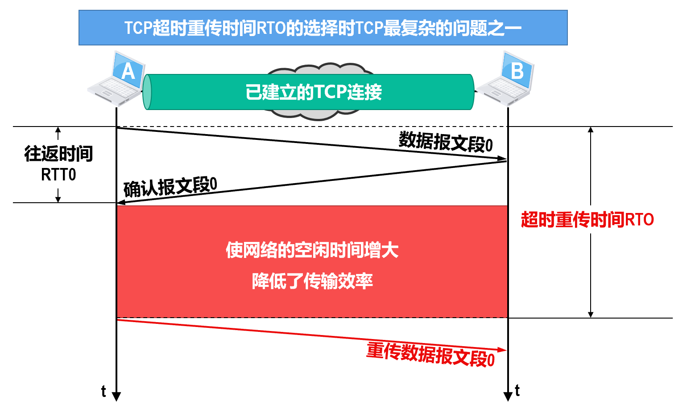

* **基本原则**：RTO 应略大于往返时间 (RTT)。

---

### 2. RTO 的计算方法 (RFC 6298标准)

**不能直接使用略大于某次测量得到的往返时间RTT样本的值**作为超时重传时间RTO。而是需要计算**加权平均往返时间** ($RTT_S$) 和 **RTT的偏差加权平均值** ($RTT_D$)。

---

#### (1) 加权平均往返时间 RTT_S (Smoothed RTT)

* **首次测量**：

$$RTT_{S1} = RTT_1$$

* **后续测量**：

$$RTT_{S_{new}} = (1 - \alpha) \times RTT_{S_{old}} + \alpha \times RTT_{样本}$$

* **参数说明**：$\alpha$ 推荐值为 **0.125 (1/8)**。$\alpha$ 越小，新样本对平均值影响越小，数值越平滑。

---

#### (2) RTT偏差的加权平均值 RTT_D (RTT Deviation)

显然，超时重传时间RTO的值应略大于加权平均往返时间RTTs的值（而不是某个RTT样本的值）。

$RTT_D$ 用于衡量 RTT 的波动情况。

* **首次测量**：

$$RTT_{D1} = RTT_1 \div 2$$

* **后续测量**：

$$RTT_{D_{new}} = (1 - \beta) \times RTT_{D_{old}} + \beta \times |RTT_{S_{old}} - RTT_{样本}|$$

* **参数说明**：$\beta$ 推荐值为 **0.25 (1/4)**。

#### (3) 超时重传时间 RTO 的计算公式

[RFC 6298]建议使用下式来计算超时重传时间RTO：

$$RTO = RTT_S + 4 \times RTT_D$$

---

### 3. RTT 测量的困境与 Karn 算法

!!! info
    如果所测量到的RTT样本不正确，那么所计算出的RTTS和RTTD自然就不正确，进而所计算出的RTO也就不正确。
    
    然而，RTT的测量确实是比较复杂的。

在发生重传时，测量 RTT 会遇到歧义问题：

**问题**：发送方发出报文段，超时未收到确认，于是重传。当收到确认报文（ACK）时，无法判断这个ACK是对**原报文段**的确认，还是对**重传报文段**的确认。

* 若误认为是原报文段的确认：会导致计算出的 RTT 偏大。
* 若误认为是重传报文段的确认：会导致计算出的 RTT 偏小。

---

#### (1) Karn 算法

为了解决上述问题，Karn 提出了一个规则：

**规则**：在计算加权平均 RTT_S 时，**只要报文段重传了，就不采用其 RTT 样本**。即出现重传时，不更新 $RTT_S$ 和 $RTT_D$。

---

#### (2) 修正的 Karn 算法 (指数退避)

设想出现这样的情况：报文段的时延突然增大很多，并且之后很长一段时间都会保持这种时延（这可能是因为网络拓扑发生了变化）。因此在原来得出的RTO内，不会收到确认报文段，于是就重传报文段。但根据Karn算法，不考虑重传的报文段的RTT样本，因此RTO就无法更新，这会导致报文段反复被重传。

因此引入了修正策略：

* **策略**：报文段每重传一次，就将 RTO 值**增大一倍**（ $RTO_{new} = 2 \times RTO_{old}$ ）。
* **恢复**：直到当不再发生重传时，才重新根据计算公式更新 RTO。

---

### 4. 实例演示

**设定**：\alpha = 0.1, \beta = 0.1（注意：这里为了计算方便取了0.1，标准推荐是0.125和0.25）。
**测量序列**：RTT依次为 30ms, 26ms, 32ms, 24ms。**第5次测量时出现超时重传**。

**Step 1: 第一次测量 (RTT_1 = 30ms)**

* $RTT_{S1}$ = 30ms
* $RTT_{D1} = 30 \div 2 = 15ms$
* $RTO_1 = 30 + 4 \times 15 = \mathbf{90ms}$

**Step 2: 第二次测量 (RTT_2 = 26ms)**

* $RTT_{S2} = 0.9 \times 30 + 0.1 \times 26 = 29.6ms$
* $RTT_{D2} = 0.9 \times 15 + 0.1 \times |29.6 - 26| = 13.86ms$
* $RTO_2 = 29.6 + 4 \times 13.86 = \mathbf{85.04ms}$

**Step 3: 第三次测量 (RTT_3 = 32ms)**

* $RTT_{S3} = 0.9 \times 29.6 + 0.1 \times 32 = 29.84ms$
* $RTT_{D3} = 0.9 \times 13.86 + 0.1 \times |29.84 - 32| = 12.69ms$
* $RTO_3 = 29.84 + 4 \times 12.69 = \mathbf{80.6ms}$

**Step 4: 第四次测量 (RTT_4 = 24ms)**

* $RTT_{S4} = 0.9 \times 29.84 + 0.1 \times 24 = 29.256ms$
* $RTT_{D4} = 0.9 \times 12.69 + 0.1 \times |29.256 - 24| = 11.9466ms$
* $RTO_4 = 29.256 + 4 \times 11.9466 = \mathbf{77.0424ms}$

**Step 5: 第五次出现超时重传**

* **处理**：根据修正的 Karn 算法，不计算 $RTT_{S5}$ 和 $RTT_{D5}$。
* **RTO更新**：直接将旧的 RTO 翻倍。
* $RTO_5 = 2 \times RTO_4 = 2 \times 77.0424 = \mathbf{154.0848ms}$

---

## TCP的选择确认

在之前介绍TCP的快重传和可靠传输时，TCP接收方**只能对按序收到的数据中的最高序号给出确认**。当发送方**超时重传**时，接收方之前**已收到的未按序到达的数据也会被重传**。

能否设法只传送缺少的数据而不重传已经正确到达、只是未按序到达的数据呢？

TCP可以使用**选择确认**（Selective ACK，**SACK**）

假设这些字节的序号都在接收窗口内，那么接收方就先收下这些数据，但要把这些信息准确地告诉发送方，使发送方不再重复发送这些数据。

SACK相关文档并没有指明发送方应当怎样响应SACK。因此大多数的TCP实现还是重传所有未被确认的数据块。

---