# Chapter 6 | 应用层

## 应用层概述

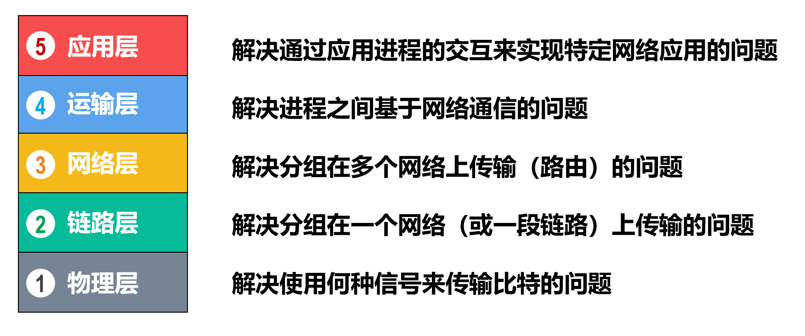

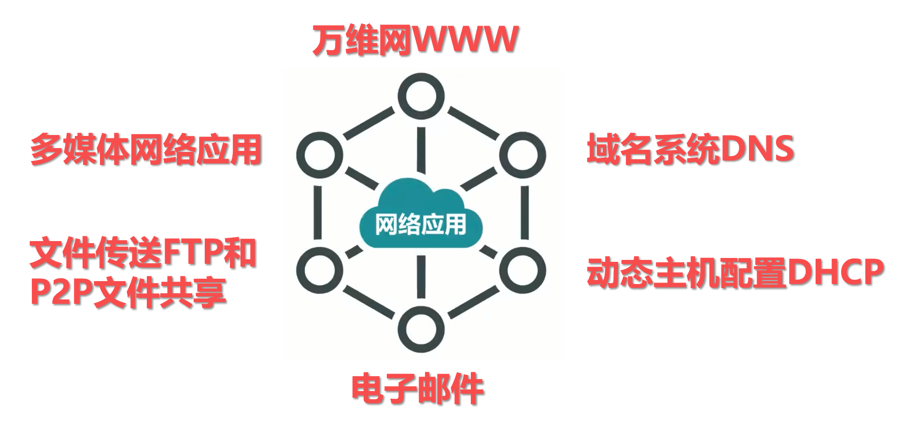

---

## 客户/服务器方式和对等方式

网络应用程序运行在处于网络边缘的不同的端系统上，通过彼此间的通信来共同完成某项任务。

开发一种新的网络应用，首先要考虑的问题就是**网络应用程序在各种端系统上的组织方式和它们之间的关系**。目前流行的主要有以下两种：

- 客户/服务器（Client/Server，C/S）方式
- 对等（Peer-to-Peer，P2P）方式

---

### 客户/服务器方式

**客户**和**服务器**是指通信中所涉及的两个应用进程。

客户/服务器方式所描述的是**进程之间服务和被服务的关系**。

**客户是服务请求方，服务器是服务提供方**。

**服务器总是处于运行状态，并等待客户的服务请求**。

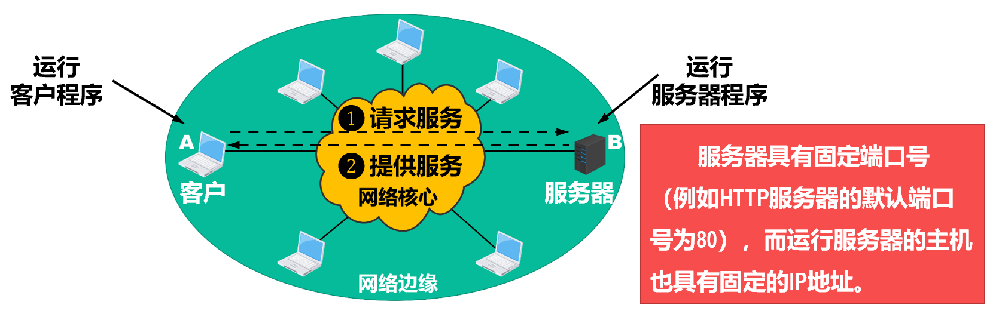

C/S方式是因特网上传统的、同时也是最成熟的方式，很多我们熟悉的网络应用采用的都是C/S方式。包括万维网WWW、电子邮件、文件传输FTP等。

基于C/S方式的应用服务通常是**服务集中型**的，即应用服务集中在网络中比客户计算机少得多的服务器计算机上。

- 由于一台服务器计算机要为多个客户机提供服务，在C/S应用中，常会出现**服务器计算机跟不上众多客户机请求的情况**。
- 为此，在C/S应用中，常用**计算机群集**（或服务器场）构建一个强大的**虚拟服务器**。

---

### 对等方式

- 在P2P方式中，**没有固定的服务请求者和服务提供者**，分布在网络边缘各端系统中的应用进程是对等的，被称为**对等方**。**对等方相互之间直接通信**，每个对等方既是服务的请求者，又是服务的提供者。

目前，在因特网上流行的P2P应用主要包括P2P文件共享、即时通信、P2P流媒体、分布式存储等。

基于P2P的应用是**服务分散型**的，因为服务不是集中在少数几个服务器计算机中，而是分散在大量对等计算机中，这些计算机并不为服务提供商所有，而是为个人控制的桌面计算机和笔记本电脑，它们通常位于住宅、校园和办公室中。

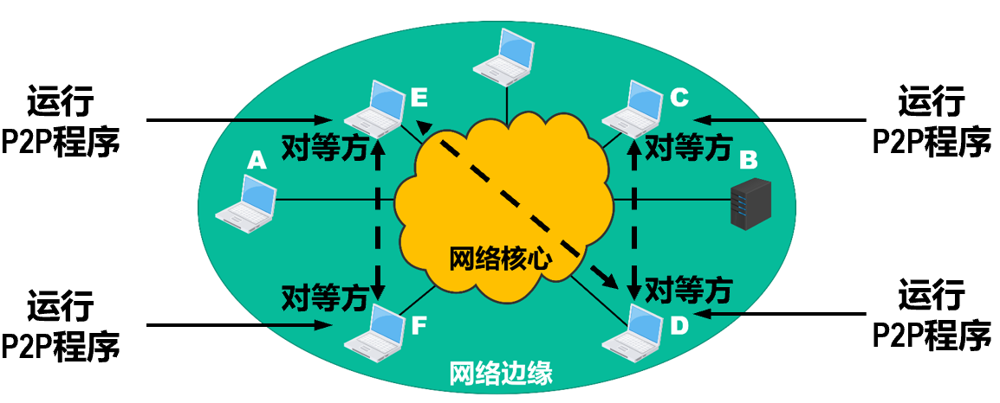

P2P方式的最突出特性之一就是它的**可扩展性**。因为系统每增加一个对等方，不仅增加的是服务的请求者，同时也增加了服务的提供者，**系统性能不会因规模的增大而降低**。

P2P方式具有**成本上的优势**，因为它通常不需要庞大的服务器设置和服务器带宽。为了降低成本，服务提供商对于将P2P方式用于应用的兴趣越来越大。

---

## 动态主机配置协议

### 动态主机配置协议DHCP的作用

手动配置：工作量大且容易出错

开机启动DHCP：自动获取网络配置参数

动态主机配置协议 DHCP 可为计算机自动配置网络参数，使得计算机“即插即联网”（Plug-and-Play Networking）。DHCP目前是因特网草案标准[RFC 2131，RFC 2132]。

---

### 动态主机配置协议DHCP的基本工作过程

#### DHCP 建立连接的交互过程

这是 DHCP 最核心的工作过程，通常被称为 **DORA** (Discover, Offer, Request, Acknowledge) 过程。在此过程中，DHCP 客户机和服务器使用 UDP 协议进行通信，服务器端使用端口 **67**，客户端使用端口 **68**。

1. DHCP 发现 (DHCP DISCOVER)

**动作**：DHCP 客户机启动时，广播发送发现报文，寻找网络中的 DHCP 服务器。

**报文细节**：

* **源 IP**：0.0.0.0（因为客户机此时还没有 IP 地址）。
* **目的 IP**：255.255.255.255（广播地址，发送给本局域网内所有主机）。
* **包含信息**：事务 ID、DHCP 客户端的 MAC 地址。

**意图**：“我是新来的，有人能给我分配个 IP 吗？”

2. DHCP 提供 (DHCP OFFER)

**动作**：网络中的 DHCP 服务器收到发现报文后，如果同意租用，会响应一个提供报文。

**前期检测**：服务器在提供 IP 前，通常会使用 ARP 确保该 IP 未被网络中其他主机占用。

**报文细节**：

* **源 IP**：DHCP 服务器的 IP 地址。
* **目的 IP**：255.255.255.255（广播发送）。
* **包含信息**：事务 ID、客户端 MAC 地址、**配置信息**（提供的 IP 地址、子网掩码、地址租期、默认网关、DNS 服务器等）。

**意图**：“我是服务器 [IP]，我可以租给你这个 IP，租期是 [时间]。”

3. DHCP 请求 (DHCP REQUEST)

**动作**：客户机可能会收到多个服务器的 Offer，它通常选择最先到达的那个，并广播发送请求报文。

**报文细节**：

* **源 IP**：0.0.0.0（客户机此时仍未正式使用该 IP）。
* **目的 IP**：255.255.255.255（广播发送）。
* **包含信息**：事务 ID、客户端 MAC 地址、**接受的租约中的 IP 地址**、**提供此租约的服务器 IP 地址**。

**为什么广播？**：为了通知所有 DHCP 服务器。告知被选中的服务器“我接受你的 Offer”，同时告知其他服务器“我拒绝了你们的 Offer”，以便它们收回刚才预留的 IP。

4. DHCP 确认 (DHCP ACK)

**动作**：被选中的 DHCP 服务器收到请求后，发送确认报文，正式将 IP 分配给客户机。

**报文细节**：

* **源 IP**：DHCP 服务器的 IP 地址。
* **目的 IP**：255.255.255.255（广播发送）。

**包含信息**：确认有效的网络配置参数。

**后期检测**：客户机收到 ACK 后，会再次使用 ARP 检测分配到的 IP 是否已被占用。

* **若被占用**：发送 **DHCP DECLINE**（谢绝）报文，并重新开始发送 Discover 报文。
* **若未占用**：绑定 IP 地址，开始正常通信。

---

#### IP 地址的租约更新与释放

IP 地址是有“保质期”（租期）的，客户机需要定期续约。

---

##### 1. 租约更新 (Rebinding)

**0.5 倍租用期时**：

客户机向 DHCP 服务器发送 **DHCP REQUEST**（单播）。

* **情况 1 (ACK)**：服务器同意，发回 ACK，客户机获得新的租用期。
* **情况 2 (NACK)**：服务器不同意（例如客户机移动到了新子网），发回 NACK。客户机必须立即停止使用该 IP，并重新发送 DISCOVER 报文。
* **情况 3 (无响应)**：客户机继续使用该 IP，等待下一轮尝试。

**0.875 倍租用期时**：

* 若之前的单播未获响应，客户机此时会**广播**发送 **DHCP REQUEST**，试图联系任何一台能提供服务的 DHCP 服务器进行续约。
* 若收到 ACK 则续约成功；若直到租期结束仍无响应，客户机必须停止使用该 IP。

---

#### 2. 释放租约 (Release)

* **动作**：客户机可以随时通过发送 **DHCP RELEASE** 报文来解除租约（例如关机或断开网络时）。
* **报文细节**：源 IP 为 0.0.0.0，目的 IP 为 255.255.255.255。
* **结果**：服务器回收该 IP 地址，可供其他主机使用。

---

#### DHCP 中继代理 (DHCP Relay Agent)

当 DHCP 服务器和客户机不在同一个局域网（子网）时，由于广播报文（DISCOVER）默认无法穿过路由器，客户机无法直接联系服务器。

* **解决方案**：在连接客户机子网的路由器上配置 **DHCP 中继代理**。

* **工作过程**：

1. 中继代理（路由器）收到客户机的广播 DISCOVER 报文。
2. 中继代理将报文**单播**转发给位于另一个网段的 DHCP 服务器。
3. DHCP 服务器将回应报文发送给中继代理，再由中继代理转发给客户机。

**意义**：使 DHCP 服务器可以跨网段为不同子网的主机提供服务，避免了每个子网都必须部署一台 DHCP 服务器的浪费。

---

## 域名系统

### 域名系统的作用

DNS（Domain Name System）的主要作用是**实现域名与 IP 地址之间的转换**。它是因特网的基础设施之一，解决了人类记忆习惯与机器处理方式之间的矛盾。

#### 1. 核心功能：域名到 IP 地址的解析

在网络通信中，存在两种标识主机的方式：

**域名 (Domain Name)**：如 `cnnic.cn`、`www.hnust.cn`。

* **特点**：便于人类记忆，具有助记符性质。

**IP 地址**：如 `159.226.6.133`、`218.75.230.30`。

* **特点**：便于机器（路由器）处理，固定长度，用于寻址。

**DNS 的作用**就是充当一个“翻译官”或“分布式数据库”，将用户输入的便于记忆的**域名**翻译成计算机网络能够理解的**IP 地址** 。

---

#### 2. 基本工作流程

通过 `cnnic.cn` 的例子展示基本的解析流程 ：

1. **用户发起请求**：用户在主机（例如浏览器）中输入域名（如 `cnnic.cn`）。
2. **查询 DNS 缓存**：主机首先会在自己的 **DNS 缓存** 中查找该域名对应的 IP 地址。

* 如果找到：直接使用该 IP 进行通信。
* 如果未找到：则需要向 DNS 服务器发起查询。

3. **查询 DNS 数据库**：DNS 服务器在自己的**域名数据库**中查找记录。

数据库结构示例：

* `ietf.org` \rightarrow `104.20.1.85`
* `hnust.cn` \rightarrow `218.75.230.30`
* `cnnic.cn` \rightarrow `159.226.6.133`

4. **返回结果**：DNS 服务器找到对应的 IP 地址（`159.226.6.133`）并返回给用户主机。
5. **建立连接**：用户主机使用获得的 IP 地址与 Web 服务器建立连接并访问网页。

---

#### 3. 为什么要使用分布式的 DNS 系统？

因特网是否可以只使用一台 DNS 服务器？

**答案是：这种做法并不可取。**

如果整个因特网只使用一台中心化的 DNS 服务器，会面临以下严重问题 ：

* **超负荷**：因特网规模巨大，单一服务器无法处理全球海量的查询请求。
* **单点故障**：一旦这台服务器出现故障，整个因特网将陷入瘫痪。

**解决方案：分布式与层次结构**

早在 1983 年，因特网就开始采用**层次结构的命名树**作为主机的名字（即域名），并使用**分布式的域名系统 DNS**。

**分布式系统的优势** ：

* **高效率**：DNS 使大多数域名解析都可以在**本地**完成（通过本地域名服务器和缓存），只有少量解析需要跨越因特网通信。
* **高可靠性**：由于是分布式系统，即使单个计算机（服务器）出现故障，也不会妨碍整个系统的正常运行。

总结来说，域名系统的作用不仅仅是简单的地址翻译，它通过分布式的架构设计，保证了全球互联网的高效、稳定运行。

---

### 因特网的域名结构

因特网采用了**层次树状结构**的命名方法。这种结构不仅保证了域名的全球唯一性，也便于域名的管理和查找。

---

#### 层次树状结构的特点

1. **结构形态**：

* 域名的结构就像一棵“倒长的树”，**根**（Root）在最上面，没有名字。
* 根下面是**顶级域名**（TLD），再往下是**二级域名**（SLD），依次类推。

2. **域名的组成**：

* 域名由若干个**分量**（Label，也称标号）组成。
* 各分量之间用**点**（`.`）隔开。
* **书写顺序**：从左到右，级别**从低到高**。

例如：`mail.cctv.com`

* `mail`：三级域名（最低级）
* `cctv`：二级域名
* `com`：顶级域名（最高级）

3. **命名规则**：

* **字符限制**：只能使用英文大小写字母、数字和连字符（`-`）。
* **不区分大小写**：例如 `CCTV.com` 和 `cctv.com` 是同一个域名。
* **长度限制**：

1. 每个标号不超过 **63** 个字符。
2. 完整域名的总长度不超过 **255** 个字符。

* **管理原则**：级别最低的域名由所属的上一级机构管理，这种分层管理保证了域名的唯一性。

---

#### 顶级域名 (TLD) 的分类

顶级域名（Top Level Domain, TLD）是域名系统中最高级别的域名。

1. 国家顶级域名 (nTLD / ccTLD)

* 采用 ISO 3166 的规定，由两个字母组成。

**示例**：

* `.cn`：中国
* `.us`：美国
* `.uk`：英国
* `.kp`：朝鲜

2. 通用顶级域名 (gTLD)

**传统通用顶级域名**（最早的7个）：

* `.com`：公司和企业（Commercial）
* `.net`：网络服务机构（Network）
* `.org`：非营利性组织（Organization）
* `.edu`：美国专用的教育机构（Education）
* `.gov`：美国专用的政府部门（Government）
* `.mil`：美国专用的军事部门（Military）
* `.int`：国际组织（International）

**新通用顶级域名**（后续增加）：

* `.aero`（航空运输企业）、`.biz`（公司和企业）、`.cat`（加泰罗尼亚语言文化群体）、`.coop`（合作团体）、`.info`（各种情况）、`.jobs`（人力资源管理者）、`.mobi`（移动产品与服务）、`.museum`（博物馆）、`.name`（个人）、`.pro`（会计、医生和律师等人员）、`.tel`（业务）、`.travel`（旅游业）等。

3. 基础结构域名 (Infrastructure TLD)

* 只有一个：`.arpa`。
* **作用**：专门用于**反向域名解析**（即根据 IP 地址查找对应的域名），因此也称为反向域名。

---

#### 我国的域名结构 (以 .cn 为例)

在国家顶级域名 `.cn` 下，我国采用了类似于通用顶级域名的划分方式，将其划分为“类别域名”和“行政区域名”：

1. **类别域名**（共 7 个）：

* `.ac`：科研机构
* `.com`：工、商、金融等企业
* `.edu`：教育机构（如 `tsinghua.edu.cn`）
* `.gov`：政府部门
* `.mil`：国防机构
* `.net`：互联网络、接入网络的信息中心
* `.org`：各种非营利性组织

2. **行政区域名**（共 34 个）：

* 对应我国的各省、自治区、直辖市。

**示例**：
* `.bj`：北京市
* `.js`：江苏省
* `.hn`：湖南省（注意：不要与国家顶级域名混淆）

???+ example "question"
    域名与()具有一一对应的关系。
    
    A.IP地址    B.MAC地址    C.主机    D.以上都不是

??? note "answer"
    D

    若一台主机通过两块网卡连接到两个网络(如服务器双线接入)，则就具有两个IP 地址，每个网卡对应一个 MAC 地址，显然这两个 IP地址可以映射到同一个域名上。此外，多台主机也可以映射到同一个域名上(如负载均衡)，一台主机也可以映射到多个域名上(如虚拟主机)。因此, A、B 和 C 和域名均不具有一一对应的关系。

???+ example "question"
    下列说法错误的是()。
    
    A.Internet上提供客户访问的主机一定要有域名
    
    B.同一域名在不同时间可能解析出不同的IP地址
    
    C.多个域名可以指向同一台主机IP地址
    
    D.IP子网中的主机可以由不同的域名服务器来维护其映射

??? note "answer"
    A

    Internet 上提供访问的主机一一定要有 IP 地址，而不一定要有域名，A错误。域名在不同的时间可以解析出不同的 IP 地址，因此可以用多台服务器来分担负载，B正确。可以把多个域名指向同一台主机 IP 地址，C 正确。IP 子网中主机也可以由不同的域名服务器来维护其映射，D 正确。

---

### 因特网上的域名服务器

为了解决互联网上单一 DNS 服务器无法支撑的负载和可靠性问题，DNS 系统采用了**分布式、层次化**的架构。这使得整个域名系统的解析工作分布在很多台服务器上。

根据域名服务器在 DNS 层次结构中所起的作用不同，通常将其分为以下四种类型：

---

#### 1. 根域名服务器 (Root Name Server)

**地位**：它是最高层次的域名服务器，也是**最重要**的域名服务器。

**知识范围**：所有的根域名服务器都知道所有的**顶级域名服务器**的域名和 IP 地址。

**作用**：当本地域名服务器无法解析域名时（例如缓存中没有），首先求助的就是根域名服务器。

**数量**：

* 历史上著名的“13 台”根服务器（从 `a.root-servers.net` 到 `m.root-servers.net`）。
* 实际上，这 13 个不是物理机器的数量，而是 **13 个不同的 IP 地址**。通过**任播 (Anycast)** 技术，实际上全球有成百上千台物理服务器在运行，共同分担这 13 个 IP 的负载，保证了极高的可靠性。

**行为**：根域名服务器通常**不直接**对域名进行解析（不直接告诉你最终 IP），而是告诉你“你去问问管理 `.com` 的那个顶级域名服务器，它的 IP 是 xxx”。

---

#### 2. 顶级域名服务器 (Top-Level Domain Server, TLD Server)

**管理范围**：负责管理在该服务器上注册的所有二级域名。

**分类**：管理 `.com`、`.net` 等通用顶级域名，以及 `.cn`、`.uk` 等国家/地区顶级域名。

**行为**：收到 DNS 查询请求时，它可能直接给出最终结果（如果它自己就是该域名的权限服务器），但更多时候是给出下一步应该找的**权限域名服务器**的 IP 地址。

---

#### 3. 权限域名服务器 (Authoritative Name Server)

**别名**：也称为**授权域名服务器**。

**地位**：这是负责一个“区”（Zone）的域名服务器。

**作用**：它拥有该区内所有主机的**最终**域名到 IP 地址的映射记录。

**特点**：当一个权限域名服务器收到对自己管辖区内的域名查询时，它能给出**权威的**（Authoritative）肯定回答（即最终的 IP 地址）。

* *注：每个连接到互联网的主机，都必须在某个权限域名服务器上注册。*

---

#### 4. 本地域名服务器 (Local Name Server)

**别名**：也称为**默认域名服务器**。

**地位**：它在逻辑上不属于 DNS 的层次结构（因为任何层次都可能有本地域名服务器），但它对用户来说**最重要**。

**作用**：

* 当一台主机（如你的电脑）发出 DNS 查询请求时，这个查询报文首先是发送给**本地域名服务器**的。
* 本地域名服务器通常由你的 ISP（互联网服务提供商，如电信、移动）或学校/公司提供。
* 它起着“代理”的作用，如果它的缓存里有结果，就直接回复你；如果没有，它会代替你去向根、顶级、权限服务器一个个询问。

---

### 因特网的域名解析过程

#### 递归查询 (Recursive Query)

**场景**：通常发生在 **主机** $\rightarrow$ **本地域名服务器** 之间。

**含义**：“我把任务交给你了，你直接给我最终结果。”

**过程**：主机问本地域名服务器：“`www.baidu.com` 的 IP 是多少？”本地域名服务器必须承担起责任，如果它不知道，它就自己去问别人，直到问到结果再回复给主机。主机只需等待最终答案。

---

#### 迭代查询 (Iterative Query)

**场景**：通常发生在 **本地域名服务器** $\rightarrow$ **根/顶级/权限域名服务器** 之间。

**含义**：“我不知道，但我知道你可以去问谁。”

**过程**：

1. 本地域名服务器问根服务器：“`www.baidu.com` 是多少？”
2. 根服务器回答：“我不知道，但 `com` 归顶级服务器 A 管，他的 IP 是 X，你去问他。”（**这是第一次迭代**）
3. 本地域名服务器这就去找顶级服务器 A：“`www.baidu.com` 是多少？”
4. 顶级服务器 A 回答：“我不知道，但 `baidu.com` 归权限服务器 B 管，他的 IP 是 Y，你去问他。”（**这是第二次迭代**）
5. 本地域名服务器最后去找权限服务器 B，得到了最终 IP。

在实际运行中，**高速缓存**起着至关重要的作用。

- 目的：为了减少网络流量和减轻根/顶级服务器的负担。
- 机制：本地域名服务器不仅缓存最终结果（IP），还会缓存中间结果（例如顶级域名服务器的地址）。
- 时效性：缓存中的数据都有一个 TTL（Time to Live，生存时间），过期后必须重新查询，以确保数据的一致性。

不但在本地域名服务器中需要高速缓存，在用户**主机**中也很需要。许多用户主机在启动时从本地域名服务器下载域名和IP地址的全部数据库，维护存放自己最近使用的域名的高速缓存，并且只在从缓存中找不到域名时才向域名服务器查询。同理，主机也需要**保持高速缓存中内容的正确性**。

??? example "PPT 上例题"
    

    

???+ example "question"
    互联网中域名解析依赖于由域名服务器组成的逻辑树。在域名解析过程中，主机上请求域名解析的软件不需要知道()信息。
    
    I.本地域名服务器的IP
    
    Ⅱ.本地域名服务器父节点的IP
    
    Ⅲ.域名服务器树根节点的IP
    
    A.I和Ⅱ    B.I和Ⅲ    C.Ⅱ和Ⅲ    D.I、Ⅱ和Ⅲ

??? note "answer"
    C

    正常情况下，客户机只需把域名解析请求发往本地域名服务器，其他事情都由本地域名服务器完成，并把最后结果返回给客户机。所以主机只需要知道本地域名服务器的IP。

???+ example "question"
    ()可以将其管辖的主机名转换为主机的IP地址。
    
    A.本地域名服务器    B.根域名服务器    C.权限域名服务器    D.代理域名服务器

??? note "answer"
    C

    每台主机都必须在权限域名服务器处注册登记，权限域名服务器一定能够将其管辖的主机名转换为该主机的 IP 地址。

???+ example "question"
    下列TCP/IP应用层协议中，可以使用传输层无连接服务的是()。
    
    A.FTP    B.DNS    C.SMTP    D.HTTP

??? note "answer"
    B

    FTP 用来传输文件，SMTP 用来发送电子邮件，HTTP 用来传输网页文件，都对可靠性的要求较高，因此在传输层都采用有连接的 TCP 服务。无连接的 UDP 服务效率更高、开销小，DNS在传输层采用无连接的 UDP 服务。

---

## 文件传送协议

### 文件传送协议FTP的作用

将某台计算机中的文件通过网络传送到可能相距很远的另一台计算机中，是一项基本的网络应用，即文件传送。

**文件传送协议**（File Transfer Protocol，FTP）是因特网上使用得最广泛的文件传送协议。

- FTP**提供交互式的访问**，允许客户**指明文件的类型与格式**（如指明是否使用ASCII码），并允许**文件具有存取权限**（如访问文件的用户必须经过授权，并输入有效的口令）。
- **FTP屏蔽了各计算机系统的细节，因而适合于在异构网络中任意计算机之间传送文件**。

在因特网发展的早期阶段，用FTP传送文件约占整个因特网的通信量的三分之一，而由电子邮件和域名系统所产生的通信量还要小于FTP所产生的通信量。只是到了1995年，万维网WWW的通信量才首次超过了FTP。

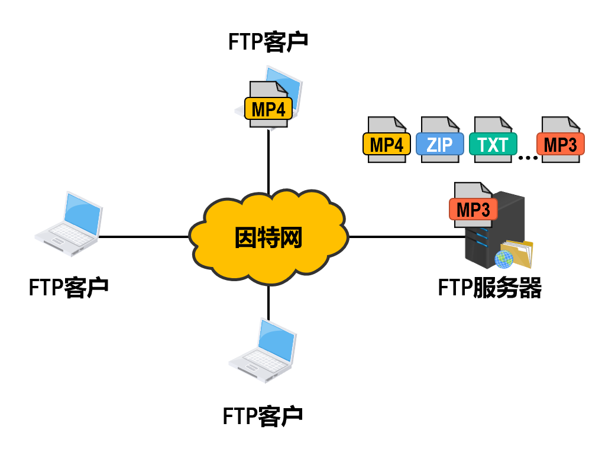

根据应用需求的不同，FTP服务器可能需要一台高性能和高可靠性的服务器计算机，也可能只需要一台普通的个人计算机即可。

FTP的常见用途是在计算机之间传输文件，尤其是用于批量传输文件。

FTP的另一个常见用途是让网站设计者将构成网站内容的大量文件批量上传到他们的Web服务器。

---

## 文件传送协议FTP的基本工作原理

### 通用基础：双通道机制

在介绍两种模式之前，有一个共同的基础架构需要理解：

**控制连接 (Control Connection):**

* 这是客户端与服务器之间建立的第一个连接。
* **方向：** 总是由 **FTP 客户** 发起，连接到 **FTP 服务器** 的 **熟知端口 21**。
* **生命周期：** 在整个会话期间**一直保持打开**，用于传送登录、目录切换、上传下载指令等控制命令。

**数据连接 (Data Connection):**

* **用途：** 专门用于传输文件数据（如具体的 .mp4 或 .txt 内容）。
* **生命周期：** 它是**临时**的。每当有文件需要传输时才建立，传输结束后立即关闭。

---

### 主动模式 (Active Mode)

**核心定义：** 建立数据通道时，**FTP 服务器主动**连接 FTP 客户。

**详细步骤：**

1. **建立控制连接：** FTP 客户使用一个随机端口（例如 N），向 FTP 服务器的 **端口 21** 发起 TCP 连接请求。
2. **协商端口：** 当客户需要传输数据时，它通过控制连接告诉服务器：“我已经打开了一个新的临时端口（例如 M），请你来连接我”。
3. **建立数据连接：**

* FTP 服务器收到指令后，会从自己的 **熟知端口 20** 出发。
* **主动**向客户刚才告知的临时端口（M）发起 TCP 连接。

---

### 被动模式 (Passive Mode)

**核心定义：** 建立数据通道时，**FTP 服务器被动等待** FTP 客户的连接。

**详细步骤：**

1. **建立控制连接：** 同样，FTP 客户首先连接服务器的 **端口 21** 建立控制通道。
2. **协商端口：** 当需要传输数据时，客户端通过控制通道告诉服务器：“我要传数据了，请你开个门”。
3. **服务器响应：** 服务器开启一个**临时端口**（例如 P，而不是端口 20），并通过控制通道告诉客户端：“我在端口 P 等你”。
4. **建立数据连接：**

* FTP 客户从自己的另一个临时端口出发。
* **主动**向服务器告知的端口（P）发起 TCP 连接。

??? example "PPT 上例题"
    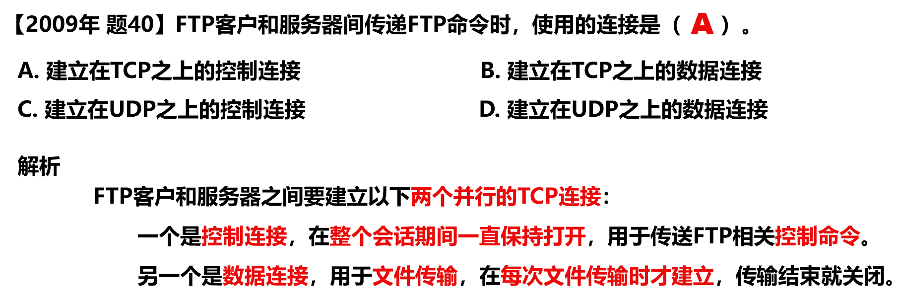

    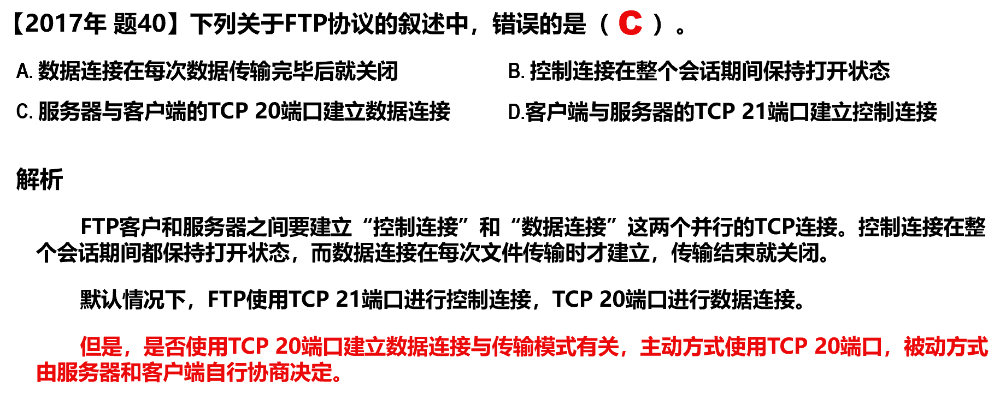

???+ example "question"
    当一台计算机从FTP服务器下载文件时，在该FTP服务器上对数据进行封装的5个转换步骤是()。
    
    A.比特，数据帧，数据报，数据段，数据
    
    B.数据，数据段，数据报，数据帧，比特
    
    C.数据报，数据段，数据，比特，数据帧
    
    D.数据段，数据报，数据帧，比特，数据

??? note "answer"
    B

    FTP 服务器的数据要经过应用层、传输层、网络层、数据链路层及物理层。因此，对应的封装是数据、数据段、数据报、数据帧，最后是比特。

???+ example "question"
    直接封装FTP、DNS、DHCP报文的协议分别是()。
    
    A.TCP、UDP、UDP    B.UDP、TCP、TCP    C.TCP、UDP、IP    D.UDP、UDP、UDP

??? note "answer"
    A

    FTP 需要保证数据传输的可靠性，因此采用 TCP 作为传输层协议。在 DHCP 的应用中，客户在分配到 IP 地址前无法使用 TCP 建立连接，因此只能利用 UDP 进行无连接的交互。UDP 具有简化通信、更高效、低延迟的特性，能满足 DNS 查询对快速响应和高并发的需求。

???+ example "question"
    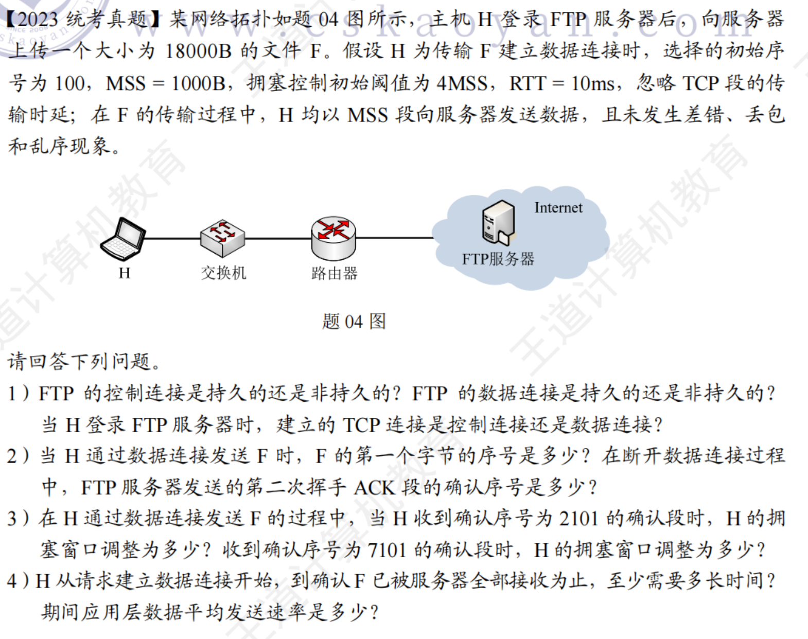

??? note "answer"
    

    

---

## 电子邮件

### 电子邮件的作用

电子邮件E-mail是因特网上**最早流行的一种应用**，并且仍然是当今因特网上最重要、最实用的应用之一。

---

### 电子邮件系统的组成

电子邮件系统采用**客户/服务器方式**。

电子邮件系统的三个主要组成构件：**用户代理**，**邮件服务器**，以及**电子邮件所需的协议**。

- **用户代理**是用户与电子邮件系统的接口，又称为**电子邮件客户端软件**。
- **邮件服务器**是电子邮件系统的基础设施。因特网上所有的因特网服务提供者ISP都有邮件服务器，其功能是**发送和接收邮件**，同时还要负责维护用户的邮箱。
- 协议包括邮件**发送协议**（例如SMTP）和**邮件读取协议**（例如POP3，IMAP）。

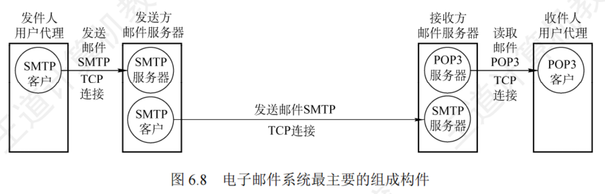

---

### 简单邮件传送协议（Simple Mail Transfer Protocol，SMTP）的基本工作过程

**SMTP 客户 (发送方)：** 负责发送邮件的服务器。它会周期性扫描邮件缓存（例如每 30 分钟），一旦发现有邮件要发送，就会通过 TCP 连接目标服务器。

**SMTP 服务器 (接收方)：** 负责接收邮件的服务器。它监听在熟知端口 **25** 上，等待连接。

---

#### 第一阶段：连接建立 (握手)

在传输具体的邮件内容之前，发送方和接收方必须先“打招呼”，确认双方身份和状态。

1. **建立 TCP 连接：** SMTP 客户主动与 SMTP 服务器的端口 **25** 建立 TCP 连接。
2. **服务器服务就绪 (220)：** 连接一旦通畅，SMTP 服务器会主动推送代码 **220**，表示“服务就绪 (Service Ready)”。这后面通常会跟一些描述信息（如反垃圾邮件系统的标识）。
3. **客户表明身份 (HELO)：** SMTP 客户发送命令 `HELO` 加上自己的域名（例如 `HELO hnust.edu.cn`），告诉服务器“我是谁”。
4. **身份确认 (250)：** 如果服务器认为身份有效，会回复代码 **250**，表示“请求的动作已完成 (OK)”。

---

#### 第二阶段：邮件传送 (核心交互)

这是最核心的部分，类似于写信封和塞信纸的过程。

1. **告知发件人 (MAIL FROM)：**

* **命令：** `MAIL FROM:<jgao1@hnust.edu.cn>`。
* **作用：** 告诉服务器这封信是从哪里来的（类似于信封上的寄件人地址）。
* **响应：** 如果合理，服务器回复 **250** (OK)。

2. **告知收件人 (RCPT TO)：**

* **命令：** `RCPT TO:<收件人地址>`。
* **作用：** 告诉服务器这封信要发给谁。
* **响应：** 服务器会检查该邮箱是否存在。如果存在，回复 **250** (OK)。

3. **准备发送内容 (DATA)：**

* **命令：** `DATA`。
* **作用：** 告诉服务器：“信封写好了，我现在要开始传具体的信件内容了”。
* **响应：** 服务器回复 **354**，意思大致是“准备好了，请开始输入邮件内容，以单独一行的点号结束”。

4. **发送邮件内容：**

* 客户端发送具体的邮件正文（Body）。
* **结束符：** 发送完毕后，客户端会发送一个特定的结束符号（通常是单独占一行的一个点 `.`）。
* **响应：** 如果服务器成功接收并存储了邮件，回复 **250** (OK)。

---

### 第三阶段：连接释放 (挥手)

邮件发送完毕后，需要优雅地断开连接。

1. **请求断开 (QUIT)：** SMTP 客户发送命令 `QUIT`，请求断开 TCP 连接。
2. **确认断开 (221)：** SMTP 服务器回复代码 **221**（表示服务关闭传输通道），并主动断开连接。

---

### 电子邮件的信息格式

电子邮件的信息格式并不是由SMTP定义的，而是在[RFC 822]中单独定义的。这个RFC文档已在2008年更新为[RFC 5322]。一个电子邮件有**信封**和**内容**两部分。而内容又由**首部**和**主体**两部分构成。

---

### 多用途因特网邮件扩展

**SMTP协议只能传送ASCII码文本数据**，不能传送可执行文件或其他的二进制对象。

SMTP不能满足传送多媒体邮件（例如带有图片、音频或视频数据）的需要。并且许多其他非英语国家的文字（例如中文、俄文、甚至带有重音符号的法文或德文）也无法用SMTP传送。

为解决SMTP传送非ASCII码文本的问题，提出了**多用途因特网邮件扩展** (Multipurpose Internet Mail Extensions，MIME)。

- 增加了5个新的邮件首部字段，这些字段提供了有关邮件主体的信息。
- 定义了许多邮件内容的格式，对多媒体电子邮件的表示方法进行了标准化。
- 定义了传送编码，可对任何内容格式进行转换，而不会被邮件系统改变。

**实际上，MIME不仅仅用于SMTP，也用于后来的同样面向ASCII字符的HTTP。**

---

### 常用的邮件读取协议

邮局协议（Post Office Protocol，POP）

- POP3是其第三个版本，是因特网正式标准。
- 非常简单、功能有限的邮件读取协议。
- 用户只能以**下载并删除方式**或**下载并保留方式**从邮件服务器下载邮件到用户方计算机。
- **不允许用户在邮件服务器上管理自己的邮件**。（例如创建文件夹，对邮件进行分类管理等）。
- 端口号为110

因特网邮件访问协议（Internet Message Access Protocol，IMAP）

- IMAP4是其第四个版本，是因特网建议标准。
- 功能比POP3强大的邮件读取协议。
- **用户在自己的计算机上就可以操控邮件服务器中的邮箱**，就像在本地操控一样，因此IMAP是一个联机协议。
- 端口号为143

POP3和IMAP4都采用基于TCP连接的客户/服务器方式

---

### 基于万维网的电子邮件

通过**浏览器**登录（提供用户名和口令）**邮件服务器万维网网站**就可以撰写、收发、阅读和管理电子邮件。这种工作模式**与IMAP很类似**，**不同的是用户计算机无需安装专门的用户代理程序，只需要使用通用的万维网浏览器。**

邮件服务器网站通常都提供非常强大和方便的邮件管理功能，用户可以在邮件服务器网站上管理和处理自己的邮件，而不需要将邮件下载到本地进行管理。

??? example "PPT 上例题"
    

    

???+ example "question"
    下列关于电子邮件格式的说法中，错误的是()。
    
    A.电子邮件内容包括邮件头与邮件体两部分
    
    B.邮件头中发信人地址(From:)、发送时间、收信人地址(To:)及邮件主题(Subject:)是由系统自动生成的
    
    C.邮件体是实际要传送的信函内容
    
    D.MIME允许电子邮件系统传输文字、图像、语音与视频等多种信息

??? note "answer"
    B

    邮件头是由多项内容构成的，其中一部分是由系统自动生成的，如发信人地址(From:)、发送时间;另一部分是由发件人输入的，如收信人地址(To:)、邮件主题(Subiect:)等。

???+ example "question"
    下列关于POP3协议的说法，()是错误的。
    
    A.由客户端而非服务器选择接收后是否将邮件保存在服务器上
    
    B.登录到服务器后，发送的密码是加密的
    
    C.协议是基于ASCII码的，不能发送二进制数据
    
    D.一个账号在服务器上只能有一个邮件接收目录

??? note "answer"
    B

    POP3 协议在传输层是使用明文来传输密码的，并不对密码进行加密。所以 B错误。POP3 协议基于 ASCII 码，若要传输非 ACSI 码的数据，则要使用 MIME 将数据转换成 ASCII 码形式。

---

## 万维网

### 万维网概述

万维网（World Wide Web，WWW）**并非某种特殊的计算机网络**。它是一个大规模的、联机式的信息储藏所，是运行在因特网上的一个分布式应用。

万维网利用网页之间的**超链接**将不同网站的网页链接成一张逻辑上的信息网。

万维网是欧洲粒子物理实验室的Tim Berners-Lee最初于1989年3月提出的。

浏览器最重要的部分是**渲染引擎**，也就是**浏览器内核**。负责对网页内容进行解析和显示。

- 不同的浏览器内核对网页内容的解析也有不同，因此同一网页在不同内核的浏览器里的显示效果可能不同；
- 网页编写者需要在不同内核的浏览器中测试网页显示效果。

---

### 统一资源定位符

为了方便地访问在世界范围的文档，万维网使用**统一资源定位符URL**来指明因特网上任何种类“资源”的位置。

URL的一般形式由以下四个部分组成：

`<协议>://<主机>:<端口>/<路径>`

---

### 万维网文档

1. 超文本标记语言 (HyperText Markup Language，HTML)：使用多种“标签”来描述**网页的结构和内容**
2. 层叠样式表 (Cascading Style Sheets，CSS)：从审美的角度来描述**网页的样式**
3. 一种脚本语言（和Java没有任何关系）：控制网页的行为

---

### 超文本传输协议HTTP(HyperText Transfer Protocol)

HTTP定义了浏览器（即万维网客户进程）怎样向万维网服务器请求万维网文档，以及万维网服务器怎样把万维网文档传送给浏览器。

---

#### HTTP/1.0：非持续连接 (Non-persistent Connection)

这是早期 HTTP 协议采用的方式，其核心特点是“一次请求，一次连接”。

**工作机制：**

* 每当浏览器需要请求一个文件（例如一个 HTML 网页或一张图片），都必须先与服务器建立一个新的 TCP 连接。
* 一旦服务器发送完响应数据，该连接就会立即关闭。
* 这意味着，如果一个网页包含 10 张图片，浏览器必须重复建立和断开 TCP 连接 11 次（1 次 HTML + 10 次图片）。

* **时间开销分析：**

1. **建立连接耗时 ($1 \times$ RTT)：** 客户端与服务器进行 TCP“三报文握手”，这一步需要往返一次，耗时一个 RTT (Round-Trip Time, 往返时间)。
2. **请求与响应耗时 ($1 \times$ RTT)：** 连接建立后，客户端发送 HTTP 请求报文，服务器处理并返回响应报文的前几个字节，这又需要往返一次，耗时一个 RTT。
3. **文档传输时延：** 服务器持续发送文档数据所需的时间。

* **结论：** 在非持续连接模式下，**每请求一个文档** 至少需要 **$2 \times$ RTT 的开销**（加上文档本身的传输时间）。

**缺点与弥补：**

* 如果网页引用了大量对象（如很多小图标），每个对象都要花费 $2 \times$ RTT，会导致网页加载非常慢。
* 为了减少用户等待时延，浏览器通常会建立 **多个并行的 TCP 连接** 同时请求多个对象。但这会大量占用万维网服务器的资源，给服务器带来沉重负担。

---

#### HTTP/1.1：持续连接 (Persistent Connection)

为了解决上述效率低下的问题，HTTP/1.1 引入了持续连接方式。

**工作机制：**

* 服务器在发送完响应后，**仍然保持这条 TCP 连接打开**，不立即关闭。
* 同一个客户（浏览器）和该服务器之间后续的 HTTP 请求和响应，都可以继续在这条已经建立好的连接上传送。
* 这不仅限于同一个页面上的对象，只要是同一个服务器上的文档，都可以复用这条连接。

HTTP/1.1 的持续连接还可以配合 **流水线 (Pipelining)** 技术使用：

* **非流水线：** 发一个请求，等一个响应；再发一个请求，再等一个响应。
* **流水线方式：** 浏览器不需要等待收到上一个请求的响应，就可以**连续发送多个请求报文**。
* **优势：** 服务器收到请求后，会依次发回响应。这样大大减少了 TCP 连接中的空闲时间，节省了多个 RTT 时间，显著提高了下载大量文档的效率。

---

#### HTTP 报文的通用结构

无论是请求还是响应，HTTP 报文都由四个部分组成：

1. **开始行 (Start Line)：** 区分是请求还是响应的核心行。
2. **首部行 (Header Lines)：** 包含若干属性字段，用来说明报文的特征（如 `Content-Type`, `Host`）。
3. **空行 (Blank Line/CRLF)：** **非常重要**，用来分隔“首部”和“实体主体”。
4. **实体主体 (Entity Body)：** 实际传输的数据（如 HTML 网页代码或图片数据），在某些报文中可以省略。

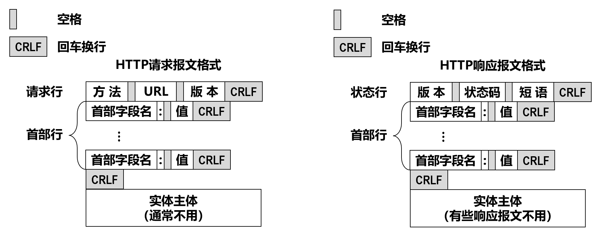

---

#### HTTP 请求报文 (Request Message)

##### 请求行 (Request Line)

这是报文的第一行，包含三个字段，用空格分隔：

* **方法 (Method)：** 对所请求对象进行的操作。
* **GET：** 最常用，请求获取某个资源（如打开网页）。
* **POST：** 向服务器发送数据（如提交表单）。
* **HEAD：** 类似于 GET，但只请求头部，不返回主体（用于调试或检查）。
* 其他还有 PUT, DELETE, CONNECT, OPTIONS, TRACE, PATCH 等。

**URL：** 请求资源的地址（例如 `/index.htm`）。

**版本 (Version)：** 使用的 HTTP 版本（例如 `HTTP/1.1`）。

---

##### 请求首部 (Request Headers)

* `Host: www.hnust.cn` —— 指明服务器的域名。
* `Connection: close` —— 告诉服务器发送完文档后就断开连接（非持续连接）。
* `User-Agent: Mozilla/5.0` —— 告诉服务器浏览器的类型和操作系统信息。
* `Accept-Language: cn` —— 告诉服务器用户希望优先得到中文版本的网页。

---

#### HTTP 响应报文 (Response Message)

##### 状态行 (Status Line)

这是报文的第一行，包含三个字段：

* **版本 (Version)：** 如 `HTTP/1.1`。
* **状态码 (Status Code)：** 3 位数字，表示请求的处理结果。
* **短语 (Phrase)：** 状态码的文字解释（如 `Not Found`）。

---

##### 状态码详解 (Status Codes)

1. **1$\text{xx}$ (通知)：** 请求收到了，正在处理。
2. **2$\text{xx}$ (成功)：** 最常见的是 `200 OK`（图片示例为 `202 Accepted`，表示接受请求但未处理完）。
3. **3$\text{xx}$ (重定向)：** 资源位置变了，需要去别的地方找（Redirect）。
4. **4$\text{xx}$ (客户端差错)：** 你的请求有问题。

* `400 Bad Request`：请求语法错误。
* `404 Not Found`：找不到页面（图片展示了经典的 404 错误页面）。

5. **5$\text{xx}$ (服务器差错)：** 服务器坏了或无法完成请求。

---

##### 响应首部与实体

与请求报文类似，响应首部会包含 `Date` (时间), `Server` (服务器软件信息) 等信息。而**实体主体**里装的就是我们看到的网页源码。

---

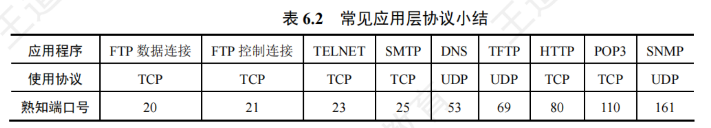

---

???+ example "question"
    下面的()协议中，客户机与服务器之间采用面向无连接的协议进行通信。
    
    A.FTP    B.SMTP    C.DNS    D.HTTP

??? note "answer"
    C

    DNS 协议在传输层采用的是无连接的 UDP 协议，而 FTP、SMTP 和 HTTP 协议在传输层都采用面向连接的 TCP 协议。

???+ example "question"
    从协议分析的角度，WWW服务的第一步操作是浏览器对服务器的()。
    
    A.请求地址解析    B.传输连接建立    C.请求域名解析    D.会话连接建立

??? note "answer"
    C

    建立浏览器与服务器之间的连接需要知道服务器的 IP 地址和端口号(80 端口是熟知端口),而访问站点时浏览器从用户那里得到的是 WWW 站点的域名，所以浏览器必须首先向 DNS 请求域名解析，获得服务器的 IP 地址后，才能请求建立 TCP 连接。

???+ example "question"
    TCP和UDP的一些端口保留给一些特定的应用使用。为HTTP保留的端口号为()。
    
    A.TCP的80端口    B.UDP的80端口    C.TCP的25端口    D.UDP的25端口

??? note "answer"
    A

    HTTP 在传输层使用 TCP，端口号为 80。TCP 的 25 号端口是为 SMTP 保留的。

???+ example "question"
    万维网上的每个页面都有一个唯一的地址，这些地址统称()。
    
    A.IP地址    B.域名地址    C.统一资源定位符    D.WWW地址

??? note "answer"
    C

    统一资源定位符(URL)负责标识万维网上的各种文档，并使每个文档在整个万维网的范围内具有唯的标识符 URL。

???+ example "question"
    仅需Web服务器对HTTP报文进行响应，但不需要返回请求对象时，HTTP请求报文应该使用的方法是()。
    
    A.GET    B.PUT    C.POST    D.HEAD

??? note "answer"
    D

    使用 HEAD 方法时服务器可对 HTTP 报文进行响应，但不会返回请求对象,其作用主要是调试。

???+ example "question"
    以下关于非持续连接HTTP特点的描述中，错误的是()。
    
    A.HTTP支持非持续连接与持续连接
    
    B.HTTP/1.0使用非持续连接，而HTTP/1.1默认使用持续连接
    
    C.非持续连接中对每次请求/响应都要建立一次TCP连接
    
    D.非持续连接中读取一个包含100个图片对象的Web页面，需要打开和关闭100次TCP连接

??? note "answer"
    D

    非持续连接对每次请求/响应都建立一次 TCP 连接。在浏览器请求一个包含 100 个图片对象的 Web 页面时，服务器需要传输1个基本 HTML 文件和 100 个图片对象，因此共有 101个对象,需要打开和关闭 TCP 连接 101 次。

???+ example "question"
    若浏览器支持并行TCP连接，使用非持久的HTTP/1.0协议请求浏览1个Web页，该页中引用同一网站上的7个小图像文件，则从浏览器为传输Web页请求建立TCP连接开始，到接收完所有内容为止，所需的往返时间RTT数至少是()。
    
    A.3    B.4    C.8    D.9

??? note "answer"
    B

    建立第一个 TCP 连接需要 IRTT,请求并接收 Web 页需要 1RTT。浏览器支持并行 TCP 连接,因此在收到 wWeb 页后可同时建立7个并行的 TCP 连接，以请求和接收7个小图像文件。因此,总往返时间 RTT 数 = 1RTT(建立第一个 TCP 连接)+ 1RTT(请求 Web 页)+ 1RTT(建立7个并行的 TCP 连接)+1RTT(请求7个小图像文件)= 4RTT。

???+ example "question"
    假设主机通过HTTP/1.1(流水线方式)请求浏览某个Web服务器S上的Web页rfc.html,rfc.html引用了同目录下的3个JPEG小图像(假设只有在收到rfc.html后才能发送对其引用图像的请求),一次请求响应的时间为RTT,忽略其他各种时延，不考虑拥塞控制和流量控制，则从发出HTTP请求报文开始到收到全部内容为止，所耗费的时间是()。
    
    A.2RTT    B.2.5RTT    C.4RTT    D.4.5RTT

??? note "answer"
    A

    从发出 HTTP 请求报文开始，所以此时 TCP 连接已经建立。本题采用了流水线的持久连接第1个 RTT 请求并收到 html 页面，收到 html 页面后才能发送对其引用小图像的请求，所以第 2 个RTT 请求并收到3幅小图像，合计耗费 2RTT。

???+ example "question"
    主机通过超链接 http://www.cskaoyan.com/index.html 请求浏览Web页index.html,若浏览器使用流水线方式的HTTP/1.1协议，该Web页引用了同一网站上的7个小图像文件，假设主机到本地域名服务器和互联网上各服务器的往返时延均为1RTT。本地域名服务器只提供递归查询服务，其他域名服务器只提供迭代查询服务，忽略其他所有时延，则从点击超链接开始到浏览器接收到所有内容为止，所需的往返时间RTT数最多是()。
    
    A.5    B.6    C.7    D.8

??? note "answer"
    C

    主机点击超链接获取 html 页面，大致分以下过程:
    
    ① 向本地域名服务器发送递归查询请求，若本地域名服务器中有相应的 IP 地址缓存，只直接向主机返回相应的 IP 地址，只需 1RTT。否则:本地域名服务器还需要依次向根域名服务器、com 顶级域名服务器、cskaoyan.com 域名服务器发送迭代查询请求，查询到相应的 IP 地址最多需要 4RTT。
    
    ② 建立初始 TCP 连接需要 1RTT，请求并接收 Web 页需要 1RTT，支持流水线传输方式，因此在收到 Web 页后可以同时发送 7 个小图像文件的请求，第 ② 步的总往返时间是 1RTT(建立连接)+ 1RTT(请求 Web 页)+ 1RTT(请求7个小图像)= 3RTT。综上所述，所需的 RTT 数最多是4+3=7RTT。

???+ example "question"
    主机H通过持久的HTTP/1.1协议请求服务器S上的5KB数据，最大段长MSS=1KB,往返时间RTT=50ms,最长报文段寿命MSL=800ms,假设双方的接收窗口都足够大，当H收到来自S的第一个携带数据的报文段后，立即向S发送连接释放报文段(注：连接释放报文段可以携带数据信息或确认信息)。从H请求与S建立TCP连接时刻起，到H进入CLOSED状态为止，所需的时间至少是()。
    
    A.1000ms    B.1200ms    C.1600ms    D.1800ms

??? note "answer"
    D

    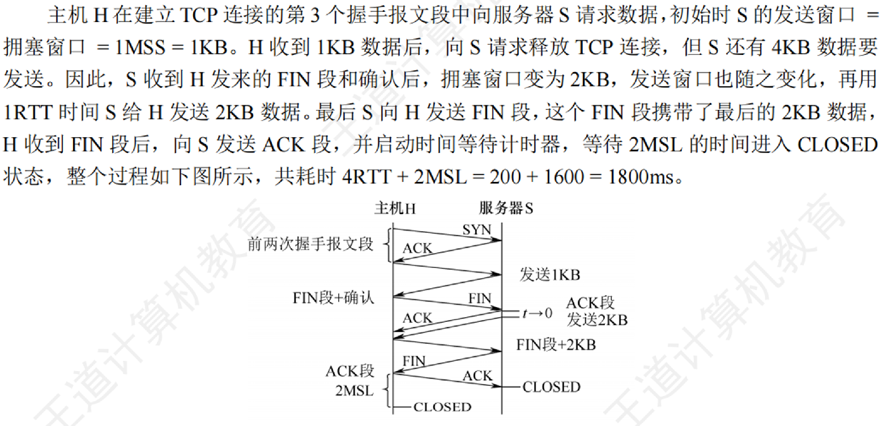

???+ example "question"
    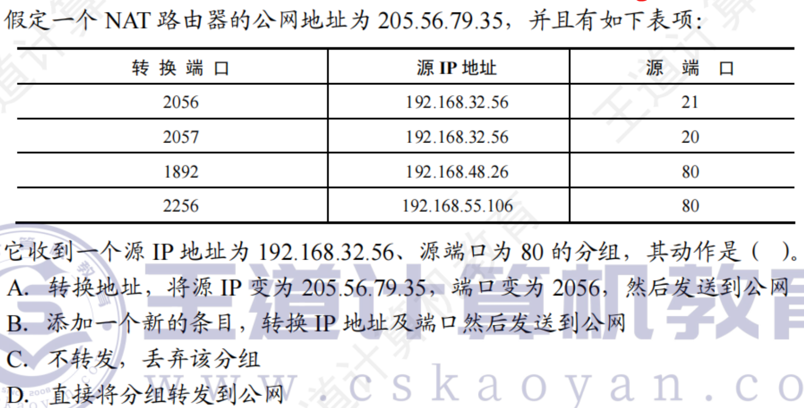

??? note "answer"
    C

    熟知端口号 80 是 HTTP 的服务器端口号，因此说明 IP 地址为 192.168.32.56(私有地址)的主机是 Web 服务器，源端口号为 80 说明该分组是 Web 服务器发出的 HTTP 响应分组。若该 HTTP 响应分组是对外网主机发出的 HTTP 请求的响应，则 NAT 表中一定存在相应的表项(否则 HTTP 请求分组不可能到达 Web 服务器)，但在 NAT 表中找不到。所以只可能是对内网主机发出的 HTTP 请求的响应，该分组不需要通过路由器转发，因此路由器丢弃该分组。

???+ example "question"
    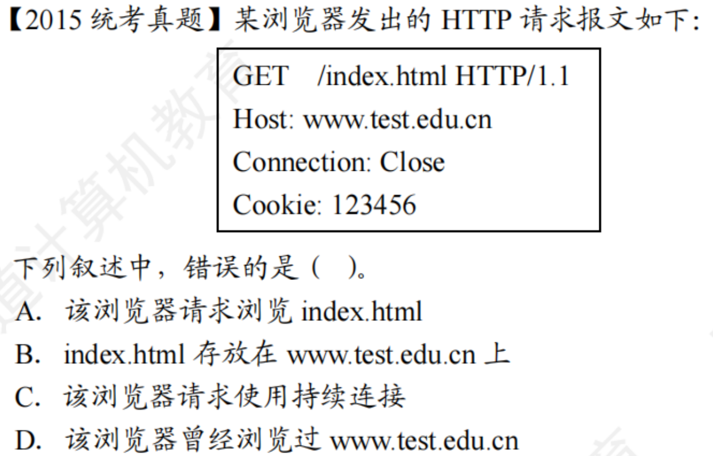

??? note "answer"
    Connection:连接方式，Close表示非持续连接方式，keep-alive 表示持续连接方式。Cookie 值由服务器产生，HTTP 请求报文中有 Cookie 方法表示曾访问过 wwwtest.edu.cn 服务器。

???+ example "question"
    假设主机 H 通过 HTTP/1.1 请求浏览某 Web 服务器S上的 Web 页 news408.html , news408.html 引用了同目录下的 1 幅图像，news408.html文件大小为 1MSS (最大段长),图像文件大小为3MSS, H 访问 S 的往返时间 RTT=10 ms,忽略 HTTP 响应报文的首部开销和 TCP 段传输时延。若 H 已完成域名解析，则从 H 请求与 S 建立 TCP 连接时刻起，到接收到全部内容止，所需的时间至少是()。
    
    A.30ms    B.40ms    C.50ms    D.60ms

??? note "answer"
    B

    HTTP/1.1默认使用持续连接，所有请求都是连续发送的。要求最少时间，理想的情况是 TCP 在第 3 次握手的报文段中捎带了 HTTP 请求，以及传输过程中的慢开始阶段不考虑拥塞。假设接收方有足够大的缓存空间，即发送窗口等同于拥塞窗口，共需要经过:第 1 个 RIT，进行 TCP 连接建立的前两次握手;第 2 个 RTT,主机 C 发送第 3 次握手报文并捎带了对 html 文件的 HTTP 请求，TCP 连接刚建立时服务器 S 的发送窗口=1MSS,服务器S发送大小为 1MSS 的 html 文件:第 3 个 RIT，主机 C发送对 html 文件的确认并捎带了对图形文件的 HTTP 请求，服务器 S 收到确认后发送窗口变为 2MSS，然后服务器S发送大小为 2MSS 的图像文件;第 4 个RTT，主机 C 向服务器 S 发送对收到的部分图像文件的确认，服务器S收到确认后发送窗口变为 4MSS，然后服务器S发送剩下的 1MSS 图像文件，完成传输，共需要 4RTT，即 40ms。整个传输过程如下图所示。

    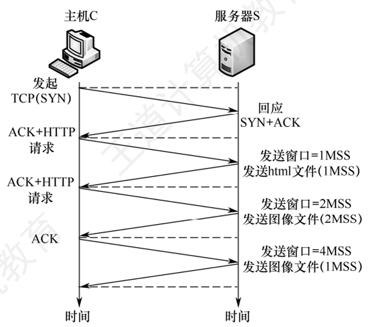

???+ example "question"
    若浏览器不支持并行TCP连接，使用非持久的HTTP/1.0协议请求浏览1个Web页，该页中引用同一网站上的7个小图像文件，则从浏览器为传输Web页请求建立TCP连接开始，到接收完所有内容为止，所需要的往返时间RTT数至少是()。
    
    A.4    B.9    C.14    D.16

??? note "answer"
    D

    浏览器不支持并行 TCP 连接，使用非持续的 HTTP/1.0 协议，因此每传输一个 Web 页和小图像文件都要建立一次 TCP 连接。第一次建立 TCP 连接时，前两次握手花 1RTT，第三次握手报文段中可以携带 HTTP 请求，服务器收到请求后返回 Web 页，共花 2RTT。之后，每传输一个图像文件都要花 2RTT。因此，到接收完所有内容，需要的总时间至少是2x8=16 RTT。注意，若浏览器支持并行 TCP 连接，则请求 Web 页仍要花 2RTT，但收到 Web 页后，可建立7个并行的 TCP连接请求图像文件，传输图像的过程仅花 2RTT，总时间为 4RTT。

???+ example "question"
    

    

??? note "answer"
    

    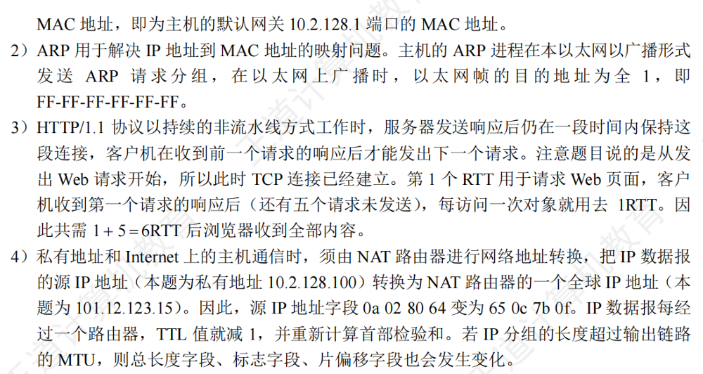

???+ example "question"
    

??? note "answer"
    

    

---

### 使用Cookie在服务器上记录用户信息

早期的万维网应用非常简单，仅仅是用户查看存放在不同服务器上的各种静态的文档。因此HTTP被设计为一种**无状态**的协议。这样可以简化服务器的设计。

现在，用户可以通过万维网进行各种复杂的应用，如网上购物、电子商务等。这些应用往往需要万维网服务器能够识别用户。

Cookie提供了一种机制使得万维网服务器能够“记住”用户，而无需用户主动提供用户标识信息。也就是说，**Cookie是一种对无状态的HTTP进行状态化的技术**。

---

#### **HTTP Cookie 的工作机制**

##### 第一阶段：首次访问（建立身份）

1. **发送请求**：万维网客户（浏览器）向万维网服务器发送一个初始的 **HTTP 请求**。此时客户端还没有该网站的 Cookie。
2. **生成识别码**：服务器接收到请求后，为该客户生成一个**唯一的 Cookie 识别码**（例如 `12345678`）。同时，服务器会在后端数据库中创建一个以该 ID 为索引的项目，用于记录该用户的访问偏好、购物车等信息。
3. **返回识别码**：服务器在返回的 **HTTP 响应报文**中，通过 `Set-Cookie: 12345678` 首部行将该识别码发送给客户端。
4. **本地存储**：客户端浏览器接收到响应后，将该 Cookie 信息**存入本地文件**（通常是浏览器的缓存目录中）。

---

##### 第二阶段：后续访问（识别身份）

5. **读取信息**：当用户再次访问该网站时，浏览器会自动从本地文件中**读取**之前存储的 Cookie 信息。
6. **携带 Cookie**：浏览器在发送新的 **HTTP 请求报文**时，会自动包含 `Cookie: 12345678` 首部行。
7. **服务器识别**：服务器接收到请求，提取出 Cookie 识别码，并在后端数据库中检索该 ID。这样服务器就能**识别出该用户**，并获取其历史记录。
8. **个性化响应**：服务器根据识别出的用户信息，返回**个性化的 HTTP 响应**（如欢迎语、推荐内容等）。

---

### 万维网缓存与代理服务器

在万维网中还可以使用缓存机制以提高万维网的效率。

万维网缓存又称为**Web缓存**（Web Cache），可位于客户机，也可位于中间系统上，位于中间系统上的Web缓存又称为**代理服务器**（Proxy Server）。

Web缓存把最近的一些请求和响应暂存在本地磁盘中。**当新请求到达时，若发现这个请求与暂时存放的请求相同，就返回暂存的响应，而不需要按URL的地址再次去因特网访问该资源。**

---

#### **Web 缓存（代理服务器）的工作原理**

##### 代理服务器中“没有”请求的对象

当主机首次请求某个资源，且代理服务器（Web 缓存）本地尚未存储该对象时：

1. 主机向代理服务器发送 HTTP 请求。
2. 代理服务器发现本地没有该对象，于是代表主机向原始服务器发送请求。
3. 原始服务器返回对象给代理服务器。
4. 代理服务器将对象**存入本地缓存**，并同时转发给主机。

---

##### 代理服务器中“已有”对象且“未过期”

当主机再次请求同一资源，且代理服务器发现本地缓存的对象仍处于有效期内（未过期）时：

1. 主机向代理服务器发送 HTTP 请求。
2. 代理服务器检查该对象的 `Expires`（到期时间）或 `Cache-Control` 字段，确认其**未过期**。
3. 代理服务器直接从本地缓存读取对象并返回响应给主机，**无需访问原始服务器**。这种情况下“命中率”高，能显著减少因特网链路的时延。

---

##### 条件 GET 验证：对象已过期但内容未修改

当缓存的对象**已过期**，代理服务器需要向原始服务器确认该对象是否真的被更改了：

1. 主机请求对象。
2. 代理服务器向原始服务器发送一个特殊的请求，包含 `If-modified-since` 首部行（其值为本地缓存对象的 `Last-Modified` 时间）。

**场景 A：内容未更改**

3. 原始服务器发现自该时间以来对象未被修改，返回 **304 Not Modified** 响应，不包含对象实体。
4. 代理服务器更新本地缓存的有效期，并将缓存的对象返回给主机。

**场景 B：内容已更改**

3. 原始服务器返回 **200 OK**，并附带**已更改的新对象实体**。
4. 代理服务器用新对象替换旧对象，并转发给主机。

???+ example "PPT 上例题"
    

    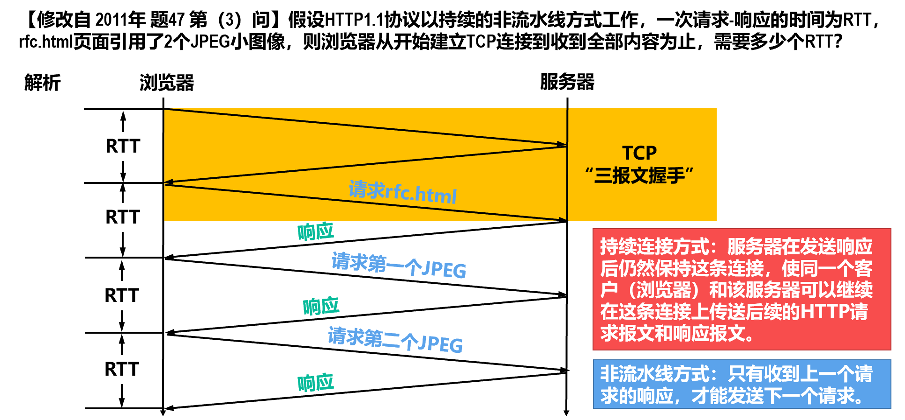

---