# Chapter 7 | 网络安全

## 网络安全概述

---

### 安全威胁

安全威胁分为被动攻击和主动攻击两大类。

- **被动攻击（Passive Attacks）**：攻击者通过**窃听**手段仅观察和分析网络中传输数据流中的敏感信息，而**不对其进行干扰**。

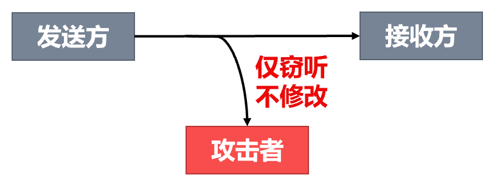

- **主动攻击（Active Attacks）**：攻击者对网络中传输着的数据流进行**各种处理**。

---

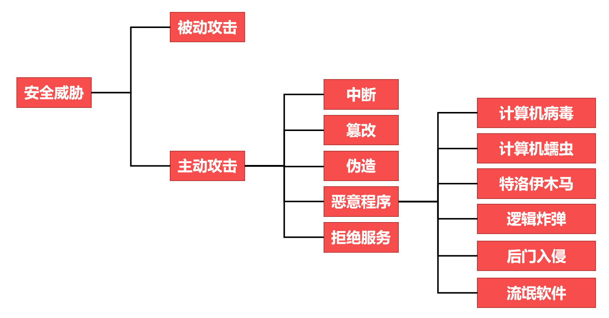

1. 拒绝服务攻击 (DoS, Denial of Service)

* **流程**：单一攻击者通过因特网向目标服务器发送**大量恶意请求**。
* **后果**：导致服务器因处理这些请求而过度“忙碌”，从而对正常用户的请求**拒绝服务**。

2. 分布式拒绝服务攻击 (DDoS, Distributed Denial of Service)

* **流程**：攻击者控制大量遍布网络的“僵尸”主机，同时向目标服务器发送恶意请求。
* **后果**：由于攻击源极多且分散，力量远超单机 DoS，会导致服务器彻底**“瘫痪”**。

3. 交换机中毒 (Switch Poisoning/MAC Flooding)

这种攻击旨在破坏以太网交换机的正常转发功能：

* **攻击行为**：攻击者向交换机端口（如端口 1）快速发送大量**伪造了不同源 MAC 地址的帧**。
* **结果**：交换机的**转发表被填满**，记录了大量指向攻击者端口的虚假 MAC 地址（如伪造的 MAC1 到 MACn 对应端口 1）。
* **影响**：当正常通信流量进入时，交换机因转发表溢出无法正确查找目标端口，可能被迫退化为“广播”模式，使攻击者能窃听数据。

---

**主动攻击**容易检测。

对付主动攻击除要采取数据加密技术、访问控制技术等**预防措施**，还需要采取**各种检测技术**及时发现并阻止攻击，同时还要对攻击源进行追踪，并利用**法律手段**对其进行打击。

**被动攻击**不涉及对数据的更改，**很难被发现**。

对付被动攻击主要采用**各种数据加密技术进行预防**，而不是主动检测。

为了防止上述各种安全威胁，一个安全的计算机网络应设法提供相应的安全服务。

---

### 安全服务

| 安全服务 | 说明 |
| :---: | :---: |
| **保密性** | 确保网络中传输的信息只有其发送方和接收方才能懂得其含义，而信息的截获者则看不懂所截获的数据。显然，保密性是计算机网络中最基本的安全服务，也是对付被动攻击所必须具备的功能 |
| **报文完整性** | 确保网络中传输的信息不被攻击者篡改或伪造，它在应对主动攻击时也是必不可少的 |
| **实体鉴别** | 通信两端的实体能够相互验证对方的真实身份，确保不会与冒充者进行通信。目前频发的网络诈骗，多数情况都是由于在网络上不能鉴别出对方的真实身份。实体鉴别在对付主动攻击时是非常重要的 |
| **不可否认性** | 用来防止发送方或接收方否认发送或接收过某信息。在电子商务中这是一种非常重要的安全服务 |
| **访问控制** | 可以限制和控制不同实体对信息源或其他系统资源进行访问的能力。必须在鉴别实体身份的基础上对实体的访问权限进行控制 |
| **可用性** | 确保授权用户能够正常访问系统信息和资源。很多攻击都会导致系统可用性的损失，拒绝服务DoS攻击就是可用性最直接的威胁 |

---

## 密码学与保密性

### 密码学相关基本概念

将发送的数据变换成对任何不知道如何做逆变换的人都不可理解的形式，从而保证数据的机密性，这种变换称为**加密**（Encryption）。

- 加密前的数据被称为**明文**（Plaintext）。
- 加密后的数据被称为**密文**（Ciphertext）。

通过某种逆变换将密文重新变换回明文，这种逆变换称为**解密**（Decryption）。

加密和解密过程可以使用**密钥**（Key）作为参数。

- **密钥必须保密，但加密和解密的过程可以公开。**
- **只有知道密钥的人才能解密密文，否则即使知道加密或解密算法也无法解密密文。**

???+ info "为什么依靠密钥进行保密而不依靠密码算法进行保密呢"
    一旦**算法失密就必须放弃该算法**，这意味着需要频繁地修改密码算法，而开发一个新的密码算法是非常困难的事情。
    
    密钥空间可以很大，用密钥将密码算法参数化，同一个密码算法可以为大量用户提供加密服务。
    
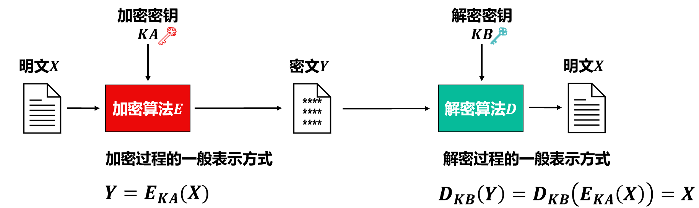

加密密钥和解密密钥**可以相同**，也**可以不同**（即使不同，这两个密钥也必然有某种相关性），这取决于采用的是对称密钥密码体制还是公开密钥（公钥）密码体制。

**密钥长度的影响**：

* 一般情况下，使用**长密钥**可以有效增加破解密文的难度。
* 代价是会增加加密方和解密方的**计算量**。

**两种安全性定义**：

1. **无条件安全（理论上不可破）**：无论攻击者截获了多少密文，密文中都没有足够的信息来唯一地确定出对应的明文。
2. **计算上安全**：在现实中，几乎所有实用的密码体制在无限制条件下都是可破的。因此，人们追求的是在**计算上不可破**，即：如果一个密码不能在一定时间内被可以使用的计算资源破解，则称之为计算上是安全的。

---

### 对称密钥密码体制

#### 对称密钥密码体制

对称密钥密码体制是指**加密密钥与解密密钥相同的密码体制**。

---

#### 数据加密标准DES

DES的保密性仅取决于对密钥的保密和密钥的长度，而算法是公开的。

- 20世纪70年代设计的DES，经过了世界上无数优秀学者几十年的密码分析，除了其56比特密钥长度太短，没有发现其任何大的设计缺陷。
- 56比特长的密钥，可用密钥数量为 $2^{56} \approx 7.6 \times 10^{16}$ 。

**1μs**执行一次DES加密，平均只需要**搜索密钥空间的一半**即可找到密码，则破译DES要超过**1000年**。

为了**解决56比特DES密钥太短**的问题，学者们提出了**三重DES**（Triple DES，3DES）。3DES在1985年成为美国的一个商用加密标准[RFC 2420]。

3DES使用**3个密钥执行三次DES算法**。

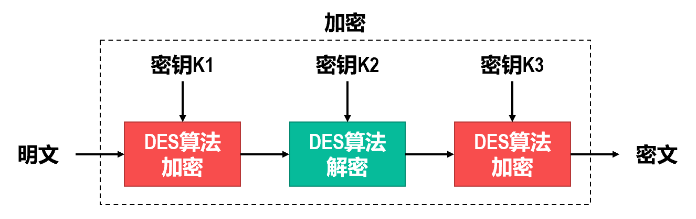

---

#### 高级加密标准AES

**高级加密标准**（Advanced Encryption Standard，AES）支持128比特、192比特和256比特的密钥长度，**用硬件和软件都可以快速实现**。

AES不需要太多内存，因此适用于**小型移动设备**。

---

### 公钥密码体制

#### 公钥密码体制的产生原因

在对称密钥密码体制中，加解密双方要共享同一个密钥。给密钥的管理和更换带来极大的不便

尽管使用复杂但高度安全的**密钥分配中心**（Key Distribution Center，KDC）可以解决该问题，但是采用**公钥密码体制**可以比较容易地解决该问题。

---

#### 公钥密码体制

**公钥密码体制使用不同的加密密钥和解密密钥**，其概念是由Stanford大学的研究人员Diffie和Hellman于1976年提出的。

- **加密密钥**是向公众**公开**的，称为**公钥**（Public Key，𝑷𝑲）。
- **解密密钥**是需要**保密**的，称为**私钥**或**密钥**（Secret Key，𝑺𝑲）。
- **加密算法** 𝑬 和**解密算法** 𝑫 都是公开的。

由于从公钥𝑷𝑲不能推导出私钥𝑺𝑲，并且𝑷𝑲不能用来解密，因此𝑷𝑲可以是公开的。

显然，采用**公钥密码体制更易解决密钥分发的问题**。

公钥密码体制提出不久，研究人员就找到了三种公钥密码算法。1976年由美国三位科学家Rivest、Shamir和Adleman提出，并在1978年正式发表的**RSA**（Rivest、Shamir and Adleman）算法，就是目前最著名的公钥密码算法，它是基于数论中大数分解问题的算法。

公钥密码体制不仅用于加密，还可以很方便地用于**鉴别**和**数字签名**。

目前的公钥密码算法比对称密钥密码算法慢好几个数量级。

- 公钥密码体制通常用于**会话密钥**的建立；
- 对称密钥密码体制被用于其他大多数情况下的加密。

**混合加密体制**（Hybrid Cryptosystem）的工作流程：

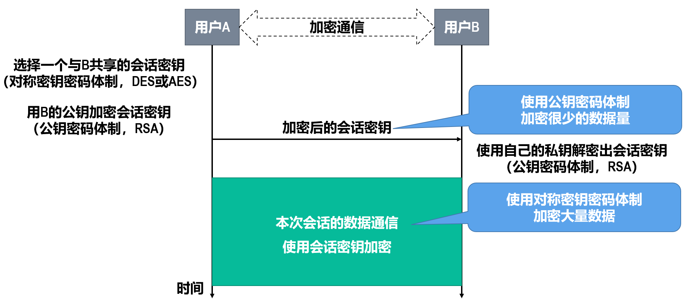

| 阶段 | 任务 | 使用算法类型 | 操作细节 | 目的 |
| :---: | :---: | :---: | :---: | :---:  |
| **第一步** | 密钥分发 | **公钥密码 (RSA)** | 用B的公钥加密会话密钥 | 保证密钥安全传递 |
| **第二步** | 密钥获取 | **公钥密码 (RSA)** | 用B的私钥解密会话密钥 | 双方安全共享密钥 |
| **第三步** | 数据通信 | **对称密码 (DES/AES)** | 使用会话密钥加密大量数据 | 保证通信效率与安全 |

!!! info
    任何加密方法的安全性取决于密钥的长度和攻破密文所需的计算量，而不是简单地取决于加密体制。因此不能简单地判断，对称密钥密码体制与公钥密码体制相比，哪个密码体制的安全性更好。

---

## 报文完整性与鉴别

### 报文摘要和报文鉴别码

#### 报文完整性与鉴别的概念

如果报文被攻击者篡改或伪造，则报文就不具备**完整性**。

**对报文进行完整性验证就是进行报文鉴别**，也就是鉴别报文的真伪。

**使用加密技术通常就可以达到报文鉴别的目的**，因为被篡改的报文解密后一般不能得到可理解的内容。

- 然而，对于不需要保密而只需要报文鉴别的网络应用（例如从因特网的某个网站下载一个应用软件，用户只关心该软件是否与官方发布的一致），对整个报文进行加密和解密，会使计算机花费相当多的CPU时间。
- 使用报文摘要（Message Digest，MD）进行报文鉴别是一种更有效的方法。

---

#### 报文摘要和报文鉴别码

使用报文摘要对报文进行鉴别的好处是：只对长度固定且比整个报文长度短得多的报文摘要𝑯(𝒎)进行加密，比对整个报文𝒎进行加密要简单得多。

密钥𝑲仅在通信双方之间共享，没有第三方能用伪造报文产生出使用密钥𝑲加密的伪造报文摘要。

附加在报文后面用于报文鉴别的码串（即加密后的报文摘要），称为**报文鉴别码**（Message Authentication Code，MAC）。

---

#### 密码散列函数

报文摘要MD实际上与之前介绍过的帧检验序列（第3章）、首部检验和（第4章）等都是**散列函数**（Hash Function）的一种应用，用于接收方对收到的数据进行检查以便发现是否有误码。

散列函数具有以下两个特点：

1. 散列函数的输入长度是可变的，并且可以很长，但其**输出长度是固定的**，并且较短。散列函数的输出称为**散列值**，也可简称为散列。
2. 不同的散列值对应不同的输入，但不同的输入却可能得出相同的散列值。换句话说，散列函数的输入和输出并非一一对应，而是**多对一**的。

为了抵御攻击者的篡改，报文摘要算法必须满足以下条件：

1. 对于任意给定的某个报文摘要值𝑯(𝒙)，若想找到一个报文y使得𝑯(𝒚)=𝑯(𝒙)，在计算上是不可行的。
2. 若想找到任意两个报文𝒙和𝒚，使得𝑯(𝒚)=𝑯(𝒙)，在计算上是不可行的。

满足上述两个条件表明：对于发送方产生的报文𝒙和其相应的报文摘要𝑯(𝒙)，攻击者不可能伪造出另一个报文𝒚，使得𝒚与𝒙具有同样的报文摘要。

满足上述条件的散列函数就称为**密码散列函数**或**安全散列函数**。密码散列函数实际上是一种**单向函数**，由于无法通过报文摘要还原出原文，因此**可把密码散列函数运算看作没有密钥的加密运算**。

---

#### 实用的报文摘要算法

最有名的报文摘要算法（或称密码散列函数或散列算法）有MD5（Message Digest，MD-5）和安全散列算法1（Secure Hash Algorithm，SHA-1）。

---

#### 散列报文鉴别码

利用密码散列函数的特殊性质，可以设计出**无需对报文摘要进行加密的报文鉴别方法**，只要通信双方共享一个称为**鉴别密钥**的秘密比特串𝒔即可。

直接使用密码散列函数实现报文鉴别的技术又称为**散列报文鉴别码**（Hashed MAC，HMAC）。

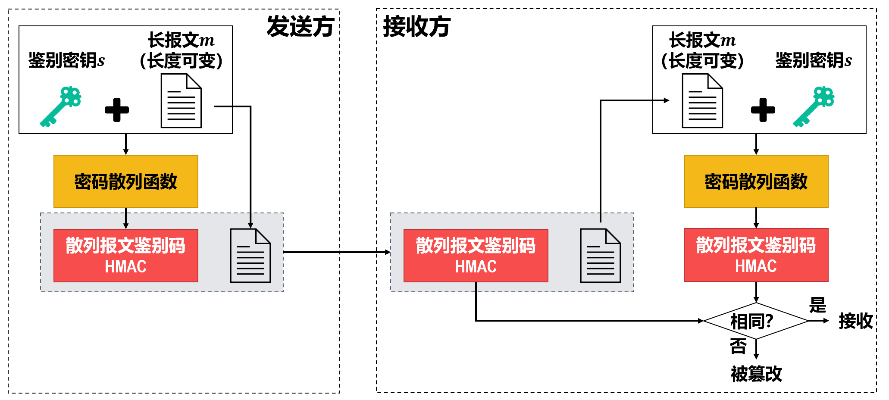

攻击者不知道仅由通信双方共享的鉴别密钥𝒔，也不能从截获的散列报文鉴别码HMAC中计算出𝒔，因此不能伪造报文 m' 产生（ m' + s ）的HMAC。

---

### 数字签名

#### 数字签名概述

在计算机网络中传送的报文可以使用**数字签名**（Digital Signature）来证明其真实来源。

数字签名必须保证以下三点：

1. 接收方能够**核实**发送方对报文的数字签名。
2. 包括接收方在内的任何人都**不能伪造**对报文的数字签名。
3. 发送方事后**不能抵赖**对报文的数字签名。

---

#### 数字签名的实现

现在已有多种实现数字签名的方法。采用**公钥密码算法**比采用对称密钥密码算法更**容易实现数字签名**。

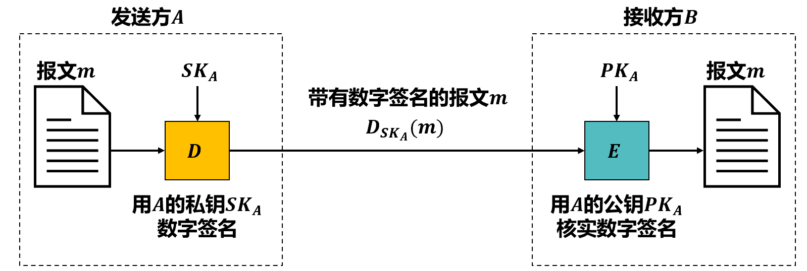

???+ info "报文𝒎还没有加密怎么就进行解密呢"
    其实这并没有什么关系。因为解密运算𝑫仅仅是一个数学运算，运算结果只是将报文𝒎变成了某种不可读的密文。此时的运算并非想将报文𝒎加密而是为了数字签名。

由于除 A 外的其他任何人都没有 A 的私钥 $SK_A$ ，所以除 A 外没有其他任何人能产生带有数字签名的报文 $D_{SK_A}(m)$，而任何伪造的报文经过 $E_{PK_A}$ 运算后都不会得到可理解的内容。因此，B 就通过这种方式核实了报文 m 的确是 A 签名发送的。

如果 A 要**抵赖**曾发送报文 m 给 B ，B 可以把报文 m 和带有数字签名的报文 $D_{SK_A}(m)$ 出具给第三方。第三方很容易用 A 的公钥 $PK_A$ 去证实 A 确实发送过报文 m 给 B 。

反之，若 B 把报文 m 伪造成 m′，则 B 不能在第三方前出示带有数字签名的报文 $D_{SK_A}(m′)$ ，因为 B 不可能具有 A 的私钥 $SK_A$ 。这样就证明 B 伪造了报文。

需要说明的是，由于公钥密码算法的计算代价非常高，对整个报文进行数字签名是一件非常耗时的事情，更有效的方法是仅对**报文摘要**进行数字签名。

---

#### 具有保密性的数字签名

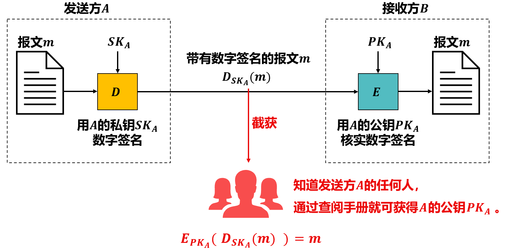

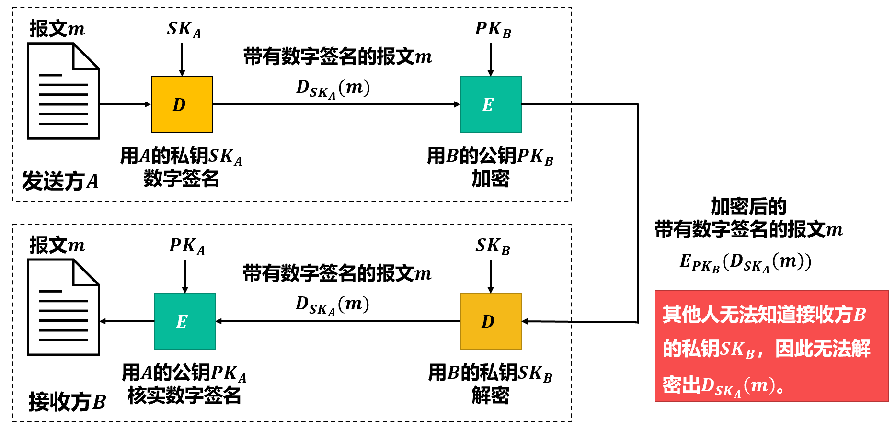

---

## 实体鉴别

实体鉴别就是通信双方的一方验证另一方身份的技术，常简称为鉴别。

**通信实体的鉴别**通常是两个通信实体之间传输实际数据之前或进行访问控制之前的**必要过程**，这是很多安全协议的重要组成部分。

实体鉴别的最简单方法就是使用用户名和口令。为了应对用户名和口令被攻击者截获的安全威胁，需要对用户名和口令进行加密。

为了应对重放攻击，可以使用**不重数**（nonce）。所谓“不重数”，就是指一个不重复使用的大随机数。

在实体鉴别过程中，**不重数可以使用户把重复的实体鉴别请求和新的实体鉴别请求区分开**。

使用公钥密码体制也可以实现实体鉴别。

---

## 密钥分发

### 密钥分发的相关概念

在对称密钥密码体制中，通信双方共享的密钥是需要保密的。

在公钥密码体制中，公钥是公开的，但私钥仍然需要保密。

密钥分发是密钥系统中一个非常重要的问题。密钥必须通过安全的通路进行分发。

**密钥系统的安全性完全依赖于对密钥的安全保护！**

---

### 对称密钥的分发

对于对称密钥密码体制，目前常用的密钥分发方式是建立**密钥分配中心**（Key Distribution Center，KDC）。

KDC是一个公众都信任的机构，其任务就是给需要**进行秘密通信的用户临时分配一个会话密钥**。

假设用户 A 和 B 都是 KDC 的登记用户，他们在 KDC 登记时就分别拥有了与 KDC 通信的主密钥 $K_A$ 和 $K_B$ 。

1. 假设用户 A 和 B 都是 KDC 的登记用户，他们在 KDC 登记时就分别拥有了与 KDC 通信的主密钥 $K_A$ 和 $K_B$ 。
2. 假设用户 A 和 B 都是 KDC 的登记用户，他们在 KDC 登记时就分别拥有了与 KDC 通信的主密钥 $K_A$ 和 $K_B$ 。
3.  KDC可以在报文中加入时间戳，以防止报文的截获者利用之前已记录下的报文进行重放攻击。

如果每个用户都知道其他用户的公钥，用户之间就可以实现安全通信。然而，如果通过网络来随意公布用户的公钥，会面临极大的安全风险。

因此，需要有一个值得信赖的机构**将公钥与其对应的实体（人或机器）进行绑定**（binding）。这种机构被称为认证中心（Certification Authority，CA），一般由政府出资建立。

需要发布公钥的用户可以让CA为其公钥签发一个**证书**（Certification），证书中**包含有公钥及其拥有者的身份标识信息**（人名、公司名或IP地址等）。

---

### 公钥的分发

如果全世界仅使用一个CA来签发证书，则会出现负载过重和单点故障等问题。

因特网采用的是[RFC 5280]（现在是建议标准）给出的、在全球范围内为所有因特网用户提供证书签发与认证服务的公钥基础结构（Public Key Infrastructure，PKI）。

---

## 访问控制

### 访问控制的基本概念

对合法用户访问权限的授予一般遵循**最小特权原则**。

- 最小特权是指能够满足用户完成工作所需的权限，用户不会被赋予超出其实际需求的权限。
- 最小特权原则可以**有效防范合法用户滥用权限所带来的安全风险**。

访问控制包含以下基本要素：

| 要素 | 说明 |
| :---: | :---: |
| **主体** | 访问活动的发起者，可以是某个用户，也可以是代表用户执行操作的进程、服务和设备等 |
| **客体** | 访问活动中被访问的对象，凡是可以被操作的信息、文件、设备、服务等资源都可以认为是客体 |
| **访问** | 主体对客体的各种操作类型。例如创建、读取、修改、删除、执行、发送、接收等操作。不同的系统有不同的访问类型 |
| **访问策略** | 访问控制的核心，访问控制根据访问策略限制主体对客体的访问 |

- 访问控制策略可用三元组（S、O、P）来描述，其中S表示主体，O表示客体，P表示许可（Permission）。许可P明确了允许主体S对客体O所进行的访问类型。访问策略通常存储在系统的授权服务器中。

---

### 三类典型的访问控制策略

#### 自主访问控制策略 (Discretionary Access Control，DAC)

DAC策略中“自主”的意思是客体的拥有者可以自主地决定其他主体对其拥有的客体所进行访问的权限。

- 优点：具有很强的灵活性
- 缺点：权限管理过于分散，容易出现漏洞，并且无法有效地控制被攻击主体破坏系统安全性的行为。

木马程序利用自主访问控制策略的上述缺点，可以很容易地破坏系统的安全性。

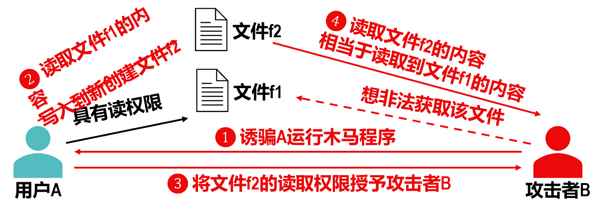

自主访问控制策略的最大特点是“自主”，也就是资源的拥有者对资源的访问策略具有决策权，因此是一种限制比较弱的访问控制策略。这种访问控制策略给用户带来灵活性的同时，也带来了安全隐患。

---

#### 强制访问控制策略 (Mandatory Access Control，MAC)

强制访问控制策略与自主访问控制策略不同，它**不允许**一般的主体进行访问权限的设置。

在强制访问控制策略中，主体和客体被赋予一定的**安全级别**。通常只有系统的**安全管理员**可以进行安全级别的设定，而普通用户不能改变自己或任何客体的安全级别。

- 系统通过比较主体和客体的安全级别来决定某个主体是否能够访问某个客体。

在强制访问控制策略中广泛使用以下两项原则：

“下读”和“上写”原则限制了信息只能由低级别的对象流向高级别或同级别的对象，这样能够有效防止木马等恶意程序的窃密攻击。

---

#### 角色访问控制策略 (Role-Based Access Control，RBAC)

基于角色的访问控制策略的核心思想是：根据安全策略划分不同的角色，用户不再直接与许可关联，而是通过**角色与许可**关联。

基于角色的访问控制策略**通过角色将用户和访问权限进行了逻辑隔离**。

- 给**角色配置许可**的工作一般比较复杂，需要一定的专业知识，可以由专门的技术人员来完成。
- 为用户赋予角色则较为简单，可以由一般的**系统管理员**来完成。

角色与许可之间的关系比角色与用户的关系要更加稳定。

很显然，将用户和访问权限通过角色进行逻辑隔离能够减小授权的复杂性、增强权限的可管理性、减少因授权失误导致安全漏洞的风险。

---

## 网络体系结构各层采取的安全措施

### 网络体系结构各层采取的安全措施 —— 网络层

#### IPSec协议族概述

目前，在因特网的网际层、运输层和应用层都有相应的网络安全协议。

IPSec是“IP Security”（IP安全）的缩写词，它是为**因特网的网际层提供安全服务的协议族**（也有人不太严格地称其为“IPSec协议” ）[RFC 4301，RFC6071]。

**IPSec并不限定用户使用何种特定的加密和鉴别算法**，通信双方可以选择合适的算法和参数（例如，密钥长度）。

- 为了保证互操作性，IPSec也包含了一套加密算法，所有IPSec的实现都必须实现这套加密算法。

IPSec包含两种不同的工作方式：**运输方式**和**隧道方式**。

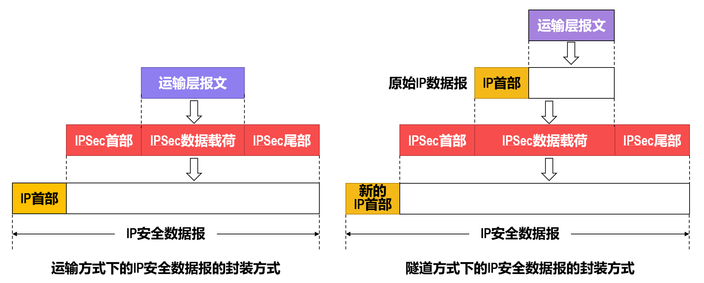

无论使用上述哪种方式，所封装出的IP安全数据报的首部都是不加密的。这是为了使因特网中的各路由器能够识别IP安全数据报首部中的相关信息，进而可以将IP安全数据报在不安全的因特网中从源点安全地转发到终点。所谓“IP安全数据报”，是指数据报的数据载荷是经过加密并能够被鉴别的。

---

#### 安全关联

在使用隧道方式传送IP安全数据报之前，应当首先为通信双方建立一条网际层的**逻辑连接**（即**安全隧道**），称为**安全关联**（Security Association，SA）。

- 这样，**传统因特网无连接的网际层就变成了具有逻辑连接的一个层**。

提供安全服务的**安全关联SA是从源点到终点的单向连接**。如果需要进行双向安全通信，则两个方向都需要建立SA。IP安全数据报就在这些SA中传送。

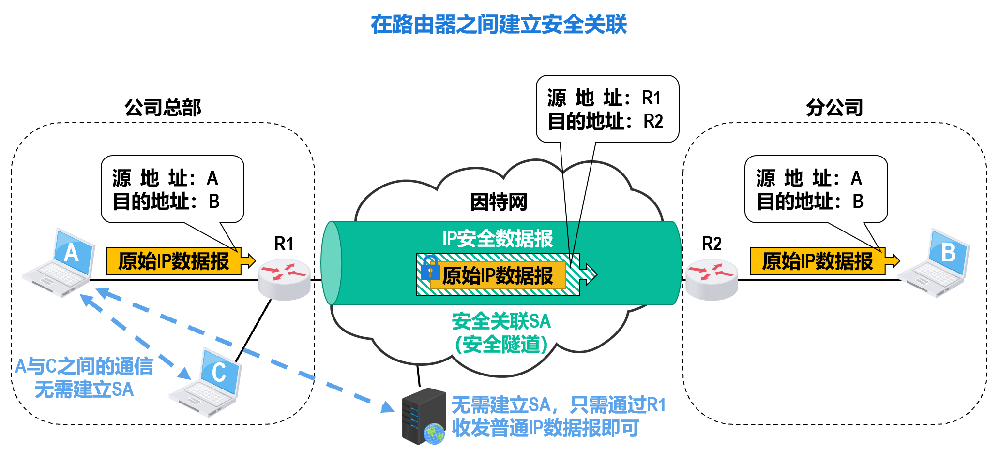

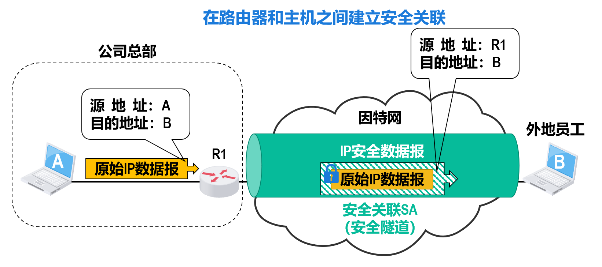

---

#### IP安全数据报的格式

在IPSec协议族中有两个主要的协议：**鉴别首部**（Authentication Header，AH）协议和**封装安全有效载荷**（Encapsulation Security Payload，ESP）协议。

- AH协议提供源点鉴别和数据完整性服务，但不能提供保密性服务。
- ESP协议比AH协议复杂得多，它提供源点鉴别、数据完整性和保密性服务。

由于AH协议的功能都已包含在ESP协议中，因此使用ESP协议就无须使用AH协议。

使用ESP或AH协议的IP数据报称为**IP安全数据报**（或**IPSec数据报**），它可以在两台主机之间、两台路由器之间或一台主机和一台路由器之间的安全关联SA（安全隧道）中传送。

---

#### IPSec的其他构件

安全关联数据库（Security Association Database，SAD）发送IP安全数据报的实体（路由器或主机）使用安全关联数据库SAD来存储可能要用到的很多条安全关联SA。

安全策略数据库（Security Policy Database，SPD）安全策略数据库SPD指明了什么样的IP数据报需要进行IPSec处理。

因特网密钥交换协议（Internet Key Exchange，IKE）因特网密钥交换IKE协议为IP安全数据报自动创建安全关联SA（而无需人工配置）。

---

### 网络体系结构各层采取的安全措施 —— 运输层

现在广泛使用的运输层安全协议有以下两个：

SSL/TLS作用于TCP/IP体系结构的应用层与运输层之间，在应用层中使用SSL/TLS最多的协议是HTTP。

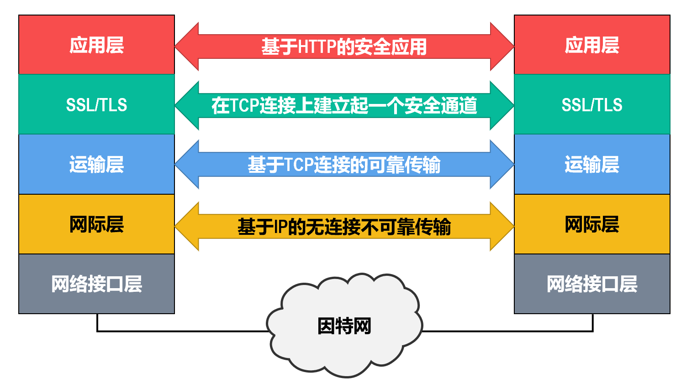

SSL提供以下三种安全服务：

1. **SSL服务器鉴别**：支持SSL的客户端通过**验证**来自服务器的证书，来鉴别服务器的真实身份并**获得服务器的公钥**。
2. **SSL客户鉴别**：用于服务器**证实客户**的身份，这是SSL的可选安全服务。
3. **加密的SSL会话**：**加密客户和服务器之间传送的所有报文**，并检测报文是否被篡改。

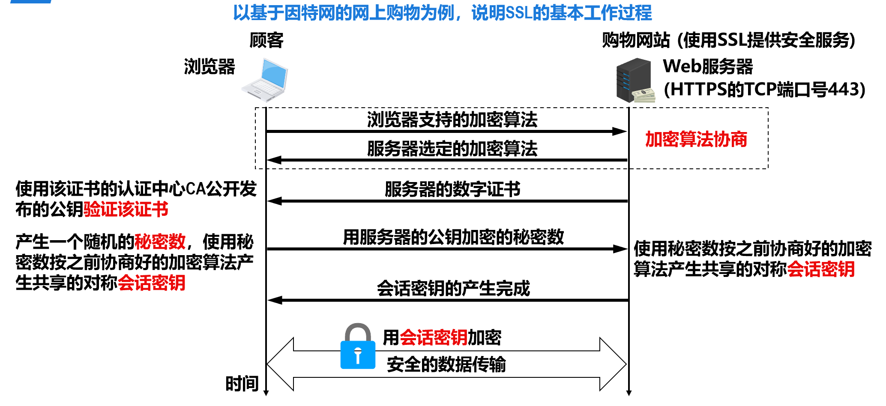

---

### 网络体系结构各层采取的安全措施 —— 应用层

以电子邮件相关安全协议为例。

**PGP**（Pretty Good Privacy）是已被广泛应用的，为电子邮件提供加密、鉴别、电子签名和压缩等技术的电子邮件安全软件包，它是Zimmermann于1995年开发的。

- PGP使用**对称密钥和公钥的组合**进行加密，为电子邮件提供**保密性**。
- PGP通过**报文摘要**和**数字签名**技术为电子邮件提供**完整性和不可否认性**。

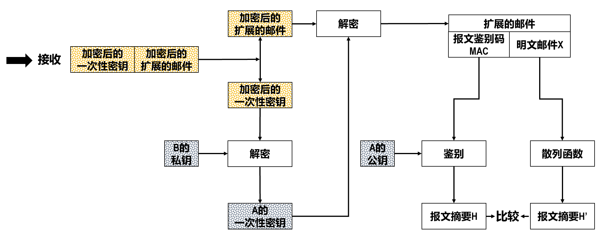

---

## 防火墙访问控制与入侵检测系统

### 防火墙

防火墙（Firewall）属于一种**访问控制技术**，具体实现为一种可编程的特殊路由器。

- 防火墙把一个单位（机构或公司）的**内部网络**与**其他网络**（一般为因特网）进行**安全隔离**。
- 根据防火墙中配置的**访问控制策略**，某些分组允许通过防火墙，而某些分组则被禁止通过。
- 访问控制策略由使用防火墙的单位根据自己的安全需要自行制定。

实现防火墙技术的设备: 分组过滤路由器和应用网关。

---

#### 分组过滤路由器

分组过滤路由器是一种具有分组过滤功能的路由器，它根据所配置的**分组过滤规则**对出入内部网络的分组执行转发或丢弃（即分组过滤）。

分组过滤规则所采用的各参数来自分组的网际层和/或运输层首部中的某些字段的值。

- 网际层：源IP地址和目的IP地址
- 运输层：源端口和目的端口、以及协议类型（TCP或UDP）

通常，分组过滤规则以**访问控制列表**（Access Control List，ACL）的形式存储在分组过滤路由器中。

- 网络管理人员可以通过**命令行**或**图形界面**来配置ACL中的规则。

该ACL所进行的分组过滤是**无状态**的，也就是独立地处理每一个分组。

功能更强的分组过滤路由器还支持**有状态**的分组过滤，也就是要跟踪每个连接或会话的通信状态，并根据这些状态信息来决定是否转发分组。

分组过滤路由器**简单高效**，对用户是**透明**的（用户感觉不到分组过滤路由器的存在）。

然而，**分组过滤路由器不能对应用层数据进行过滤**。

- 不能禁止某个用户对某个特定网络应用进行某个特定的操作。
- 不支持应用层用户鉴别。

**需要使用应用网关来实现**。

---

#### 应用网关

**应用网关**又称为**代理服务器**（Proxy Server），它可以实现**应用层数据的过滤**和**高层用户的鉴别**。

当用户通过应用网关访问内网或外网资源时，应用网关可以要求用户进行身份鉴别，然后**根据用户身份对用户做出相应的访问控制**。

应用网关也有一些**局限**：

- **每种网络应用都需要一个专用的应用网关**。当然，多个不同的应用网关可以运行在同一台主机上。
- 在应用层处理和转发报文，**处理负担较重**。
- **应用网关对应用程序是不透明的**，用户需要在应用程序客户端指明应用网关（代理服务器）的地址。

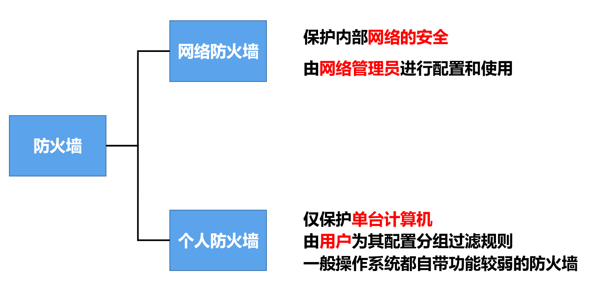

尽管**防火墙**提高了内部网络的安全防护程度，但仍存在以下**局限**：

1. 对防火墙的配置是否**正确和完善**，在很大程度上决定了防火墙可以发挥的**安全防护作用**。
2. 防火墙对**恶意代码**（病毒、木马等）的查杀能力非常有限，因此不能有效地防止恶意代码通过网络的传播。

- 由于查杀恶意代码的计算开销非常大，若提高防火墙的查杀力度，则会降低防火墙的处理速度，进而降低用户的网络带宽。

3. 防火墙**对于一些利用系统漏洞或网络协议漏洞进行的攻击是无法防范的**。

- 攻击者通过分组过滤规则中允许的端口对某个服务器的漏洞进行攻击，这对于一般的分组过滤路由器是无法防护的。
- 即使使用应用网关，也必须具有能够识别该特定漏洞的应用网关才能阻断攻击。

4. 防火墙技术自身存在不足。

- 分组过滤路由器不能防止IP地址和端口号欺骗。
- 应用软件自身也可能有软件漏洞而存在被渗透攻击的风险。

---

### 入侵检测系统

防火墙并不能阻止所有的入侵行为。

在入侵已经开始但还未造成危害或在造成更大危害之前，**及时检测到入侵并尽快阻止入侵**，尽量把危害降到最小，就是非常有必要的。**入侵检测系统**（Intrusion Detection System，IDS）正是这样一种技术。

IDS对出入网络的分组执行**深度检查**，当**检查到可疑分组**时，会**及时向网络管理员发出警报或进行阻断**。

- 由于IDS的误报率较高，因此**一般情况下不建议对可疑分组进行自动阻断**。

IDS能够检测多种网络攻击：

- 端口扫描
- 拒绝服务攻击
- 网络映射
- 恶意代码
- 系统漏洞

---

#### 基于**特征**的入侵检测系统

只能检测已知攻击，对于未知攻击则无法防范。

- 维护一个**已知各类攻击的标志性特征的数据库**。
- 检测到**与某种攻击特征匹配的分组或分组序列时**，就判断可能出现了某种入侵行为。
- 标志性特征必须具有很好的**区分度**。
- **标志性特征一般由网络安全专家提供**，由单位的网络管理员定制并将其加入到数据库中。

---

#### 基于**异常**的入侵检测系统

- 通过观察正常运行的网络流量来学习正常网络流量的**统计特性和规律**。
- 检测到网络流量的某种统计规律**不符合正常情况**时，则判断可能发生了入侵行为。
- 区分正常流量和统计异常流量是非常困难的。
- 现在很多研究致力于将**机器学习方法**应用于入侵检测，减少对网络安全专家的依赖。

---

## 常见的网络攻击及其防范

### 网络扫描

网络扫描是获取**攻击目标信息**的一种重要技术。

- 攻击目标信息包括目的主机的IP地址、操作系统、运行的程序及存在的漏洞等。
- 在进行网络攻击之前，对攻击目标的信息掌握得越全面和具体，就越能有效合理地制定出攻击策略和攻击方法，进而提高网络攻击的成功率。

网络扫描主要有四种类型：

1. 主机发现
2. 端口扫描
3. 操作系统检测
4. 漏洞扫描

---

#### 主机发现

主机发现是指搜索要攻击的主机，这是对其进行攻击的前提。搜索要攻击的主机，实际上是要**确定该目标主机的IP地址**。

进行主机发现的主要方法是利用**网际控制报文协议ICMP**。

攻击者：使用ping命令对某个IP地址范围内的所有IP地址进行连通性测试，来发现正在运行的目标主机。

对于主机：可以**配置防火墙**，禁止ICMP回显请求报文通过防火墙。

一般情况下，防火墙不会阻断**ICMP差错报告报文**，否则目标主机将失去进行ICMP差错报告的功能，而影响正常的网络通信。

---

#### 端口扫描

在进行主机发现确定了要攻击的目标主机后，攻击者可以进一步通过**端口扫描来获取目标主机所有端口的工作状态**，进而得出目标主机上开放了哪些网络服务。

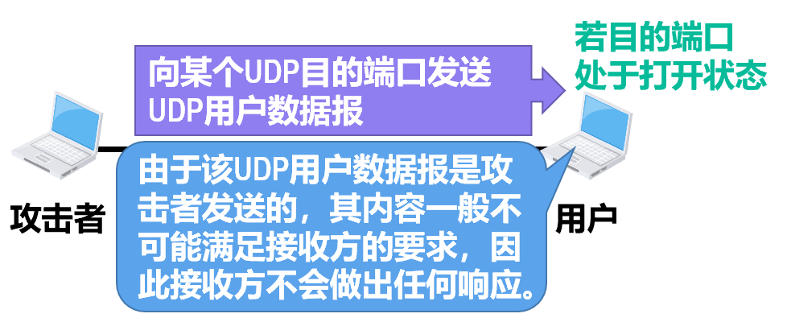

---

#### 操作系统检测

不同的操作系统所存在的安全漏洞可能有很多不同。要利用这些安全漏洞进行攻击，首先必须检测远程目标主机所使用的操作系统类型，通常有三种方法：

1. 获取操作系统旗标信息

- 在客户机与服务器建立连接的过程中，服务器往往会返回**各种独特的欢迎信息**。
- 攻击者可根据这些信息来推断出服务器的操作系统类型。

2. 获取主机端口状态信息

- **操作系统通常会默认开启一些常用的网络服务，这些服务会打开各自特定的端口进行网络监听**。
- 攻击者可对目标主机进行端口扫描，根据端口扫描结果来推断目标主机的操作系统类型。

3. 获取TCP/IP协议栈指纹

- 尽管RFC文档严格规定了各种协议的三要素（语法、语义和同步），但并没有规定各种协议的具体实现。
- **同一个协议在不同操作系统中的实现细节可能会有所不同**，攻击者可据此推断目标主机的操作系统类型。

---

**防范上述各种类型的网络扫描，可采取以下措施**

- 仅打开确实需要使用的端口，关闭闲置和危险端口。
- 限制因特网（不可信网络）中的主机主动与内部网络（可信网络）中的主机进行通信。
- 设置防火墙，根据安全要求设置分组过滤策略（例如过滤不必要的ICMP报文）。
- 使用入侵检测系统IDS及时发现网络扫描行为和攻击者IP地址，配置防火墙对来自该地址的分组进行阻断。

1. 网络扫描的行为特征是比较明显的，例如在短时间内对某一IP地址范围内的每个地址和端口发起连接等。
2. 目前，大部分防火墙都具有识别简单的网络扫描行为的功能。
3. 然而，很多攻击者也在研究如何隐蔽自己的网络攻击行为。例如利用虚假源地址、减缓扫描速度、动态调整扫描顺序、分布式扫描等。

---

### 网络监听

网络中传输的数据大部分都是**明文**形式。如果攻击者对网络进行监听并截获了包含有大量明文信息的一系列分组，则可从这些分组中直接分析出**账号、密码**等敏感信息。

常见的网络监听类型有：

1. 分组嗅探器
2. 交换机毒化攻击
3. ARP欺骗

---

#### 分组嗅探器

分组嗅探器（Packet Sniffer）是一种网络监听工具软件，它运行在网络中的某台主机上，**被动接收所有出入该主机的网络适配器**（网卡）**的数据链路层协议数据单元**（即帧）。

如果将网络适配器配置为混杂方式，网络适配器就会接收所有进入自己接口的MAC帧，而不管这些帧的目的MAC地址是否指向该网络适配器。

**环境差异**：

* 在**共享式以太网（集线器）**中，所有数据会广播到每个接口，嗅探非常容易。
* 在**交换式以太网**中，交换机会通过自学习只把数据发给目标主机，普通嗅探较难实现。

---

#### 交换机毒化攻击

为了在交换机环境下也能偷听，攻击者会采取主动出击：

* **填满转发表**：攻击者 A 发送大量伪造不同源 MAC 地址的帧给交换机。
* **强制泛洪**：当交换机的 MAC 地址表被填满后，它无法学习新地址，对于找不到目标的数据包就会退化成“集线器”模式进行**盲目转发（泛洪）**。这样攻击者 A 就能接收到本不属于它的数据。

---

#### ARP 欺骗

这是最危险的攻击方式：

* **欺骗原理**：攻击者 C 发送错误的 ARP 响应。告诉 A：“我是 B”，同时告诉 B：“我是 A”。
* **截获流量**：A 和 B 都会误以为 C 是对方，从而把数据都发给 C。
* **伪装网关**：如果攻击者对网络内所有主机进行 ARP 欺骗，可以将自己**伪装成路由器**，从而监听到全网的所有通信。

---

**防范上述各种类型的网络监听，可采取以下措施**

- 使用交换机替代集线器，这不但可以提高网络性能，还能使攻击者在交换机环境中更难实施监听。
- 禁用交换机的自学习功能，将IP地址、MAC地址与交换机的接口进行静态绑定，这样可以限制非法主机的接入，使攻击者无法实施交换机毒化攻击，也使ARP欺骗难以实施。
- 对于ARP欺骗，主机或路由器可以仅使用静态ARP表，而不再依据ARP请求报文或响应报文动态更新。
- 划分VLAN可以限制攻击者的监听范围，因为分组嗅探器只能在单个局域网范围内进行。
- 防范网络监听的最有效的方法是进行数据加密和实体鉴别技术。

---

### 拒绝服务攻击

拒绝服务DoS攻击是**最容易实现却又最难防范**的攻击手段。

DoS攻击类型有：

1. 基于漏洞的DoS攻击
2. 基于资源消耗的DoS攻击
3. 分布式DoS攻击

---

#### 防范拒绝服务攻击

主要利用**网络协议漏洞**或**操作系统漏洞**。攻击者向目标系统发送一些特殊分组，使目标系统在处理这些分组时出现异常，甚至崩溃。这种攻击又称为**剧毒包**或**杀手包**（Killer Packet）攻击。

**“死亡之 ping” 攻击**：

* 攻击者发送长度超过 65535 字节的超长 IP 数据报（超大 ICMP 回送请求报文）。
* **后果**：目标主机在重组这些超长报文时，会导致内存分配错误、堆栈崩溃，最终系统死机。

---

#### 基于资源消耗的DoS攻击

这种攻击是DoS攻击中采用**最多的一种攻击**。攻击者通过**向目标系统发送大量的分组**，从而**耗尽目标系统的资源**，致使目标系统崩溃而**无法向正常用户提供服务**。

1. **TCP SYN 洪泛**：攻击者发送大量伪造源 IP 的 TCP 连接请求（SYN），但不响应服务器的回应（SYN+ACK）。

* **后果**：当**半连接**的数量超过了系统允许的上限时，系统就不会再接受任何TCP连接请求，这将导致TCP服务器无法为正常客户提供服务。

2. **分片攻击**：攻击者发送大量 IP 数据报分片，但故意不发完所有分片。服务器会一直缓存已收到部分，导致系统缓存耗尽崩溃。

3. **反射攻击 (Smurf 攻击)**：攻击者伪造目标主机 C 的源 IP 地址，向网络广播地址发送 ICMP 请求报文。

* **流量放大**：网络中所有主机（反射节点）都会向目标主机 C 发送响应报文。
* **后果**：攻击流量被成倍放大，导致目标主机崩溃或网络拥塞。

---

#### 分布式DoS攻击

基于资源消耗的DoS攻击是由攻击者向目标主机发送大量的分组来实现的。但是仅靠一个攻击源很难达到效果，所以产生了**分布式Dos攻击**。

攻击者通过漏洞、木马等手段控制因特网上大量“僵尸”主机，同时向目标服务器发送恶意请求，导致其瘫痪。

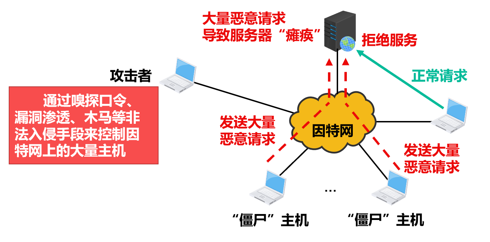

---

**防范上述各种类型的拒绝服务攻击，可采取以下措施**

- **利用防火墙对恶意分组进行过滤**，例如过滤掉所有ICMP回送请求报文可以防范Smurf攻击。然而，对于像“TCP SYN洪泛”这类攻击，一般很难区分哪些TCP连接请求报文是恶意的。
- **使用支持源端过滤的路由器**，尽量减少IP地址伪造的现象。如果要通过源端过滤来防范DoS攻击，则必须使因特网上所有的路由器都具有源端过滤的功能。然而，目前源端过滤并不是路由器的强制功能，支持源端过滤的路由器还是少数。
- **追溯DoS攻击源**。路由器对通过自己的IP数据报的首部进行标记，通过该标记可追溯到DoS攻击源。这个过程通常很慢，并且需要人工干预，因此目前主要用于事后追查以及采取相应的法律手段提供依据。
- **进行DoS攻击检测**，通过分析分组首部特征和流量特征来检测正在发生的DoS攻击并发出警报。

**上述措施并不能彻底防范DoS攻击，DoS攻击是目前最容易实现却又最难防范的攻击手段。**

---