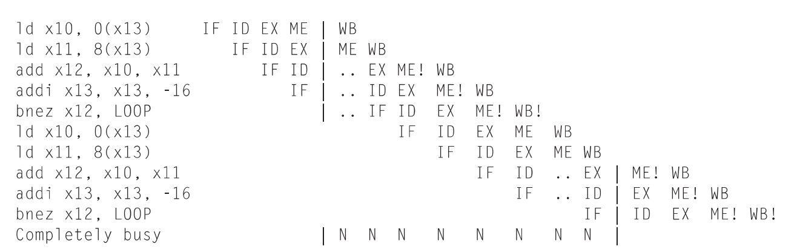
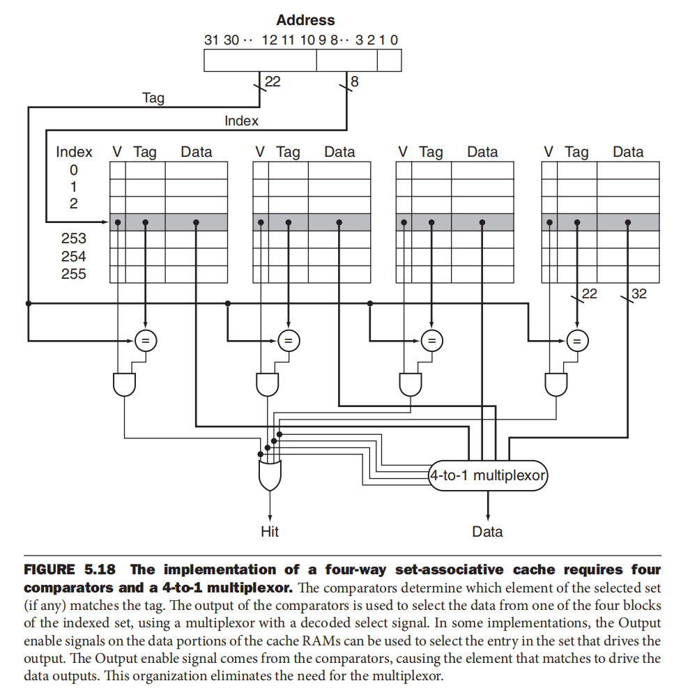

# CO homework 

!!! Info "Abstract"
    这里是老师布置的题目，我会附上答案与我自己的答案(因为原书答案有误)，应该基本上没有错了吧。

<div class="card file-block" markdown="1">
<div class="file-icon"></div>
<div class="file-body">
<div class="file-title"> answer </div>
<div class="file-meta"> 10,364 KB / 2024-10-29</div>
</div>
<a class="down-button" target="_blank" href="/Notebook/docs/Computer_Science/CO/answer.pdf" markdown="1">:fontawesome-solid-download: 下载</a>
</div>

## 1 introduction

### 1.2

**question**

The eight great ideas in computer architecture are similar to ideas  from other fields. Match the eight ideas from computer architecture, “Design for  Moore’s Law,” “Use Abstraction to Simplify Design,” “Make the Common Case  Fast,” “Performance via Parallelism,” “Performance via Pipelining,” “Performance  via Prediction,” “Hierarchy of Memories,” and “Dependability via Redundancy” to  the following ideas from other fields: 

- a. Assembly lines in automobile manufacturing 
- b. Suspension bridge cables 
- c. Aircraft and marine navigation systems that incorporate wind information 
- d. Express elevators in buildings
- e. Library reserve desk
- f. Increasing the gate area on a CMOS transistor to decrease its switching time
- g. Adding electromagnetic aircraft catapults (which are electrically powered as opposed to current steam-powered models), allowed by the increased power generation offered by the new reactor technology
- h. Building self-driving cars whose control systems partially rely on existing sensor systems already installed into the base vehicle, such as lane departure systems and smart cruise control systems

**answer**

- a. Performance via Pipelining 

- b. Dependability via Redundancy 

- **c. Performance via Prediction** 

- **d. Make the Common Case Fast** 

- **e. Hierarchy of Memories**

- **f. Performance via Parallelism**

- **g.** Design for Moore’s Law

- **h.** Use Abstraction to Simplify Design

**解释**：

- **a. 装配线生产（Performance via Pipelining）**：装配线通过将任务分解成多个阶段，使每个阶段都可以同时运行，以提高效率。这类似于流水线技术，它将计算任务分解为多个阶段，从而提高处理器的吞吐量和性能。

- **b. 悬索桥电缆（Dependability via Redundancy）**：悬索桥电缆会有多条电缆共同支撑桥体，以增加安全性和可靠性，确保即使其中一条电缆失效，其他电缆可以继续承重。这个概念与计算机系统中通过冗余设计来提高可靠性一致，确保在部件失效时系统仍然可用。

- **c. 飞行和航海导航系统结合风力信息（Performance via Prediction）**：飞行和航海导航系统利用风力信息来预测和优化航行路径，以提高效率和安全性。这类似于计算机系统中的“预测执行”技术，通过预测未来的指令或数据访问来提高性能。

- **d. 大楼的快捷电梯（Make the Common Case Fast）**：快捷电梯直接将人们送到常用的高楼层，优化了日常通行的效率。这对应于“让常见情况更快”的理念，即优化系统中的常用情况以提高整体性能。

- **e. 图书馆的预留台（Hierarchy of Memories）**：图书馆预留台保存一些热门书籍，方便读者取用，而不需要深入书架寻找。类似于计算机中的存储层次结构，较快的缓存层存放常用数据，从而减少数据访问的延迟。

- **f. 增大CMOS晶体管的门面积以减少切换时间（Performance via Parallelism）**：增大晶体管的面积可以支持更多的并行操作，从而提高系统性能，这类似于通过增加并行性来提升计算机的处理速度。

- **g. 新反应堆技术支持的电磁弹射装置（Design for Moore’s Law）**：新的反应堆技术提升了电力供应，从而允许使用电磁弹射装置。这个例子展示了技术进步带来的设计可能性，与摩尔定律推动计算机设计的进步类似。

- **h. 部分依赖于现有传感器的自动驾驶汽车（Use Abstraction to Simplify Design）**：自动驾驶系统利用了已经安装在车辆上的传感器（如车道偏离系统、智能巡航控制系统），通过抽象减少了设计的复杂性。

---

### 1.5

**question**

Consider three different processors P1, P2, and P3 executing  the same instruction set. P1 has a 3GHz clock rate and a CPI of 1.5. P2 has a  2.5GHz clock rate and a CPI of 1.0. P3 has a 4.0GHz clock rate and has a CPI  of 2.2. 

- a. Which processor has the highest performance expressed in instructions per second? 
- b. If the processors each execute a program in 10 seconds, find the number of cycles and the number of instructions. 
- c. We are trying to reduce the execution time by 30%, but this leads to an increase  of 20% in the CPI. What clock rate should we have to get this time reduction?

**answer**

- a. **CPU time 的倒数**

  performance of P1 (instructions/sec) = 3 × 10$^9$ /1.5 = 2 × 10$^9$

  performance of P2 (instructions/sec) = 2.5 × 10$^9$ /1.0 = 2.5 × 10$^9$

  performance of P3 (instructions/sec) = 4 × 10$^9$ /2.2 = 1.8 × 10$^9$

- b.  **CPI 是每条指令的平均周期数**

  cycles(P1) = 10 × 3 × 10$^9$ = 30 × 10$^9$ 

  cycles(P2) = 10 × 2.5 × 10$^9$ = 25 × 10$^9$ 

  cycles(P3) = 10 × 4 × 10$^9$ = 40 × 10$^9$ 

  No. instructions(P1) = 30 × 10$^9$ /1.5= 20 × 10$^9$

  No. instructions(P2) = 25 × 10$^9$ /1 = 25 × 10$^9$

  No. instructions(P3) = 40 × 10$^9$ /2.2 = 18.18 × 10$^9$

- c. execution from 10 to 7

   $CPI_{new} = CPI_{old} × 1.2$    then CPI(P1) = 1.8, CPI(P2) = 1.2, CPI(P3) = 2.6 

  $f = No. instr. × CPI/time$   then

  $f(P1) = 20 × 10^9 × 1.8 / 7 = 5.14 GHz $

  $f(P2) = 25 × 10^9 × 1.2 / 7 = 4.28 GHz $

  $f(P1) = 18.18 × 10^9 × 2.6 / 7 = 6.75 GHz$

---

### 1.6

**question**

Consider two different implementations of the same instruction  set architecture. The instructions can be divided into four classes according to  their CPI (classes A, B, C, and D). P1 with a clock rate of 2.5GHz and CPIs of 1, 2,  3, and 3, and P2 with a clock rate of 3GHz and CPIs of 2, 2, 2, and 2. Given a program with a dynamic instruction count of 1.0E6 instructions divided  into classes as follows: 10% class A, 20% class B, 50% class C, and 20% class D,  which is faster: P1 or P2? 

- a. What is the global CPI for **each implementation**? 
- b. Find the clock cycles required in both cases.

**answer**

- a.

    Class A: 10$^5$ instr. Class B: 2× 10$^5$ instr. Class C: 5 × 10$^5$ instr. Class D: 2 × 10$^5$

    instr.  Time = No. instr. × CPI/clock rate 

    Total time P1 = (10$^5$  + 2 × 10$^5$ × 2 + 5 × 10$^5$ × 3 + 2 × 10$^5$× 3)/(2.5 × 10$^9$ ) =  10.4 × 10$^{-4}$s 

    Total time P2 = (10$^5$ × 2 + 2 × 10$^5$ × 2 + 5 × 10$^5$ × 2 + 2 × 10$^5$ × 2)/(3 × 10$^9$ ) = 6.66 × 10$^{-4}$ s 

    CPI(P1) = 10.4 × 10$^{-4}$ × 2.5 × 10$^9$ /10$^6$ = 2.6 

    CPI(P2) = 6.66 × 10$^{-4}$ × 3 × 10$^9$ /10$^6$ = 2.0 

- b.

    clock cycles(P1) = 10$^5$ × 1 +2 × 10$^5$ × 2 + 5 × 10$^5$× 3 +2 × 10$^5$ × 3 = 26 × 10$^5$

    clock cycles(P2) = 10$^5$× 2 + 2 × 10$^5$ × 2 + 5 × 10$^5$× 2 + 2 × 10$^5$ × 2 = 20× 10$^5$

---

### 1.7

**question**

Compilers can have a profound impact on the performance  of an application. Assume that for a program, compiler A results in a dynamic  instruction count of 1.0E9 and has an execution time of 1.1 s, while compiler B  results in a dynamic instruction count of 1.2E9 and an execution time of 1.5 s. 

- a. Find the average CPI for each program given that the processor has a clock cycle  time of 1ns. 
- b. Assume the compiled programs run on two different processors. If the execution times on the two processors are the same, how much faster is the clock of the processor running compiler A’s code versus the clock of the processor running  compiler B’s code? 
- c. A new compiler is developed that uses only 6.0E8 instructions and has an  average CPI of 1.1. What is the speedup of using this new compiler versus using  compiler A or B on the original processor?

**answer**

- a.

  $CPI = T_{exec} × f / No. instr. $

  Compiler A CPI = 1.1 

  Compiler B CPI  = 1.25 

- b.

  $f_B /f_A = (No. instr.(B) × CPI(B))/(No. instr.(A) × CPI(A)) = 1.37$

- c.

  $T_A /T_{new} = 1.67 $

  $T_B /T_{new} = 2.27 $

---

### 1.13

**question**

Another pitfall cited in Section 1.10 is expecting to improve the overall  performance of a computer by improving only one aspect of the computer. Consider  a computer running a program that requires 250 s, with 70 s spent executing FP instructions, 85 s executed L/S instructions, and 40 s spent executing branch instructions. 

- 1.13.1. By how much is the total time reduced if the time for FP operations is reduced by 20%? 
- 1.13.2 . By how much is the time for INT operations reduced if the total time is reduced by 20%? 
- 1.13.3. Can the total time can be reduced by 20% by reducing only  the time for branch instructions?

**answer**

- 1.13.1

  > 超级无敌歹毒，还有一个55s的隐藏！要先加一加才知道！

  $T_{fp} = 70 × 0.8 = 56 s. T_{new} = 56 + 85 + 55 + 40 = 236 s. Reduction: 5.6 $%

- 1.13.2

  $250 \times 0.2 = 50s$ ，这 $50s$ 全部出在 $INT \ operation$ 里面 

- 1.13.3

  NO

  $T_{new} = 250 × 0.8 = 200 s, T_{fp} + T_{int} + T_{l/s} = 210 s. $

---

## 2 Instructions : language of the computer

### 2.4

**question**

For the RISC-V assembly instructions below, what is the corresponding C statement? Assume that the variables f, g, h, i, and j are assigned to registers x5, x6, x7, x28, and x29, respectively. Assume that the base address of the arrays A and B are in registers x10 and x11, respectively.

```
slli x30, x5, 3 			// x30 = f*8

add x30, x10, x30	        // x30 = &A[f]

slli x31, x6, 3 		    // x31 = g*8

add x31, x11, x31          	// x31 = &B[g]

ld x5, 0(x30) 		       // f = A[f]

addi x12, x30, 8

ld x30, 0(x12)

add x30, x30, x5

sd x30, 0(x31)
```

**answer**

`B[g] = A[f] + A[f + 1];`

---

### 2.8

**question**

Translate the following RISC-V code to C. Assume that the variables f, g, h, i, and j are assigned to registers x5, x6, x7, x28, and x29, respectively. Assume that the base address of the arrays A and B are in registers x10 and x11, respectively.

```addi x30, x10, 8
addi x30, x10, 8

addi x31, x10, 0

sd x31, 0(x30)

ld x30, 0(x30)

add x5, x30, x31
```

**answer**

第一步 x$30 = \& A[1]$

第二步 x$31 = \&A[0]$

第三步 x$30 = \&A[0]$

第四步 x$30 = \&A[0]$

第五步 x$5 = 2 * \&A$

所以得到`f = 2 * &A`

---

### 2.12

**question**

Provide the instruction type and assembly language instruction for the following binary value:

$0000 0000 0001 0000 1000 0000 1011 0011_{two}$

**answer**

The opcode is $0110011$, so it's R-type.

function 7 is $0000000$, function 3 is $000$, rd is $00001$, rs 2 is $00001$, rs 1 is $00001$

add x1, x1, x1 

---

### 2.14

**question**

Provide the instruction type, assembly language instruction, and binary representation of instruction described by the following RISC-V fields:

opcode=0x33, funct3=0x0, funct7=0x20, rs2=5, rs1=7, rd=6

**answer**

R-type, sub x6, x7, x5 

$0100 0000 0101 0011 1000 0011 0011 0011$

---

### 2.17

**question**

Assume the following register contents:

$x5 = 0$x$ 0000 0000 AAAA AAAA, x6 = 0$x$ 1234 5678 1234 5678$

- 2.17.1 For the register values shown above, what is the value of x7 for the following sequence of instructions?

  ​			slli x7, x5, 4

  ​			or x7, x7, x6

- 2.17.2 For the register values shown above, what is the value of x7 for the following sequence of instructions?

  ​			slli x7, x6, 4

- 2.17.3 For the register values shown above, what is the value of x7 for the following sequence of instructions?

  ​			srli x7, x5, 3

  ​			addi x7, x7, 0xFEF

**answer**

- 2.17.1 

  $x7 = 0$x$ 1234 567A BABE FEF8$ 

- 2.17.2

  $x7 = 0$x$2345678123456780$ 

- 2.17.3

  在 `addi` 指令中立即数是 12 位的

  第一步$x7 = 0$x$0000 0000 1555 5555$
  
  第二步$x7 = 0$x$F000 0000 1555 6544$

---

### 2.22

**question**

Suppose the *program counter* (PC) is set to 0x20000000.

- 2.22.1 What range of addresses can be reached using the RISC-V *jump-and-link* (jal) instruction? (In other words, what is the set of possible values for the PC after the jump instruction executes?)
- 2.22.2 What range of addresses can be reached using the RISC-V *branch if equal* (beq) instruction? (In other words, what is the set of possible values for the PC after the branch instruction executes?)

**answer**

- 2.22.1

  `jal` 属于 `UJ-type` ,立即数为20位，但最后一位不表示，而 `jal` 是有符号的。因此，立即数表示的数范围为 $-2^{19} \to 2^{19} - 1$。因此最远距离为$-2^{20} \to 2^{20}-2$，也即$-0$x$0010 0000 \ 到\ 0$x$000F FFFE$。所以可以到的地址为$0$x$1FF0 0000$到$0$x$200F FFFE$。

- 2.22.2

  `beq` 属于 `SB-type` ,立即数为12位，但最后一位不表示，而 `beq` 是有符号的。因此，立即数表示的数范围为 $-2^{11} \to 2^{11}-1$。因此最远距离为$-2^{12} \ 到 \ 2^{12}-2$，也即$-0$x$0000 1000$到$0$x$0000 0FFE$。所以可以到的地址为$0$x$1FFF F000$到$0$x$2000 0FFE$。

---

### 2.24

**question**

Consider the following RISC-V loop:

LOOP: beq x6, x0, DONE

​			addi x6, x6, -1

​			addi x5, x5, 2

​			jal x0, LOOP

DONE:

- 2.24.1 Assume that the register x6 is initialized to the value 10. What is the final value in register x5 assuming the x5 is initially zero?
- 2.24.2 For the loop above, write the equivalent C code. Assume that the registers x5 and x6 are integers acc and i, respectively.
- 2.24.3 For the loop written in RISC-V assembly above, assume that the register x6 is initialized to the value N. How many RISC-V instructions are executed?
- 2.24.4 For the loop written in RISC-V assembly above, replace the instruction “beq x6, x0, DONE” with the instruction “blt x6, x0, DONE” and write the equivalent C code.

**answer**

- 2.24.1 

  20

- 2.24.2

  ```c
  while(i != 0){
      i = i - 1;
      acc = acc + 2;
  }
  ```

- 2.24.3

  4N+1

- 2.24.4

  ```c
  while(i >= 0){
      i = i - 1;
      acc = acc + 2;
  }
  ```

---

### 2.29

**question**

Implement the following C code in RISC-V assembly. Hint: Remember that the stack pointer must remain aligned on a multiple of 16.

```c
int fib(int n){
    if (n==0)
        return 0;
    else if (n == 1)
        return 1;
    else
        return fib(n−1) + fib(n−2);
}
```

**answer**

```
fib:    addi    sp, sp, -16          # 调整栈空间，为 2 个 8 字节的项预留空间
        sd      ra, 8(sp)            # 保存返回地址寄存器 ra 到 sp +8
        sd      a0, 0(sp)            # 保存函数参数 n (a0) 到 sp +0

        # 检查是否为基准情况 n == 0
        beq     a0, x0, fib_zero     # 如果 n == 0，跳转到 fib_zero

        # 检查是否为基准情况 n == 1
        li      t0, 1                # 将立即数 1 加载到 t0
        beq     a0, t0, fib_one      # 如果 n ==1，跳转到 fib_one

        # 递归情况: return fib(n-1) + fib(n-2)

        # 计算 fib(n-1)
        addi    a0, a0, -1           # a0 = n -1
        jal     ra, fib              # 调用 fib(n-1)
        addi    t1, a0, 0            # 将 fib(n-1) 的返回值保存到 t1

        ld      a0, 0(sp)            # 恢复原始的 n 值

        # 计算 fib(n-2)
        addi    a0, a0, -2           # a0 = n -2
        jal     ra, fib              # 调用 fib(n-2)
        addi    t2, a0, 0            # 将 fib(n-2) 的返回值保存到 t2

        # 将 fib(n-1) 和 fib(n-2) 相加
        add     a0, t1, t2           # a0 = fib(n-1) + fib(n-2)
        
        ld      ra, 8(sp)             # 从栈中恢复返回地址 ra
        addi    sp, sp, 16            # 恢复栈指针 sp
        jalr    zero, 0(ra)           # 返回到调用者
        
fib_zero:
        li      a0, 0                 # 设置返回值 a0 = 0
        ld      ra, 8(sp)             # 从栈中恢复返回地址 ra
        addi    sp, sp, 16            # 恢复栈指针 sp
        jalr    zero, 0(ra)           # 返回到调用者

fib_one:
        li      a0, 1                # 设置返回值 a0 = 1
        ld      ra, 8(sp)             # 从栈中恢复返回地址 ra
        addi    sp, sp, 16            # 恢复栈指针 sp
        jalr    zero, 0(ra)           # 返回到调用者 
	 
```

---

## 3 Arithmetic for Computers

### 3.7

**question**

Assume 185 and 122 are signed 8-bit decimal integers stored in sign-magnitude format. Calculate 185 + 122. Is there overflow, underflow, or neither?

**answer**

$185 =1011 1001 \ and \ 122 = 0111 1010$

由于 in sign-magnitude format 得到 $-57 + 122 = 65$ 

neither

---

### 3.20

**question**

What decimal number does the bit pattern $0 × 0C000000$ represent if it is a two’s complement integer? An unsigned integer?

**answer**

both the same

$16^6 * 12 = 201326592$

---

### 3.26

**question**

Write down the binary bit pattern to represent $−1.5625 × 10^{−1}$ assuming a format similar to that employed by the DEC PDP-8 (the leftmost 12 bits are the exponent stored as a two’s complement number, and the rightmost 24 bits are the fraction stored as a two’s complement number). No hidden 1 is used. Comment on how the range and accuracy of this 36-bit pattern compares to the single and double precision IEEE 754 standards.

**answer**

$-1.5625_{10} × 10^{-1} = -0.15625_{10} × 10^0= 0.00101_2 × 2^{0} = -1.01_2 × 2^{-3}$

所以应该是

$ -0.101_2 × 2^{-2} $

- fraction $-0.10100000000000000000000 = 101100000000000000000000$
- exponent $-2 = -000000000010 = 111111111110$ 

没有 bias

所以答案是

$1111 1111 1110 1011 0000 0000 0000 0000 0000$


**与IEEE 754标准的比较：**

- **范围：** DEC PDP-8格式由于指数位较少且没有隐藏位，因此范围有限，无法表示更大的数值。
  
- **精度：** DEC PDP-8的24位尾数提供了合理的精度，但相比于IEEE单精度（23位加隐藏位）和双精度（52位加隐藏位），精度较低。因此，在表示接近零的数字时，DEC PDP-8格式可能会引入更多的舍入误差，导致精度下降。

总体来说，DEC PDP-8格式虽然简单，但在范围和精度上不及IEEE 754标准，后者能够支持更广泛的数值范围和更高的表示精度。

---

### 3.27

**question**

IEEE 754-2008 contains a half precision that is only 16 bits wide. The leftmost bit is still the **sign bit**, the exponent is 5 bits wide and has **a bias of 15**, and the mantissa is 10 bits long. A **hidden 1** is assumed. Write down the bit pattern to represent $−1.5625 × 10^{−1 }$assuming a version of this format, which uses an excess-16 format to store the exponent. Comment on how the range and accuracy of this 16-bit floating point format compares to the single precision IEEE 754 standard.

**answer**

$-1.5625_{10} × 10^{-1} = -0.15625_{10} × 10^0= 0.00101_2 × 2^{0} = -1.01_2 × 2^{-3}$

hidden one

- exponent $ -3 = -11 \quad -3 + 15 = 12 \quad 12 = 01100$ so $01100$
- fraction $-.01$ so $0100000000$

所以答案是

$1 01100 0100000000$


**与IEEE 754单精度标准的比较：**

- **范围：** 半精度格式的指数范围相对较小，能够表示的数值范围有限，最大值约为65504，而单精度的范围更广，约为$3.4×  10^{38}$。
- **精度：** 半精度格式的尾数只有10位，相比单精度的23位（加上隐含的1），精度较低。在表示小数时，半精度格式可能会引入更多的舍入误差，尤其是在接近零的值时。

综上所述，半精度格式在范围和精度上都不如单精度IEEE 754标准，适用于对存储空间要求较高的场景，但在精度要求较高的应用中可能不足。

---

### 3.32

**question**

Calculate $(3.984375 × 10^{−1} + 3.4375 × 10^{−1} ) + 1.771 × 10^3 $by hand, assuming each of the values is stored in the 16-bit half precision format  described in Exercise 3.27 (and also described in the text). Assume 1 guard, 1 round bit, and 1 sticky bit, and round to the nearest even. Show all the steps, and write your answer in both the 16-bit floating point format and in decimal.

**answer**

- $3.984375 × 10^{−1} = 0.394375 = 0.0110011_2 = 1.1001100000 × 2^{-2} $
- $ 3.4375 × 10^{−1} = 0.34375 = 0.01011_2 = 1.0110000000 × 2^{-2} $
- $1.771 × 10^3 = 1771 = 11011101011$

$1.1001100000 × 2^{-2} + 1.0110000000 × 2^{-2} = 10.1111100000 × 2^{-2} = 1.0111 1100 00 × 2^{-1}$

   $1.1011101011 \times 2^{10}$

$+0.0000 0000 0010 1111 10 000   \quad guard = 1  \quad  round = 0  \quad  sticky = 1$

$=1.1011101011 \ 101 \quad round \ up$

$=1.1011101100 × 2^{10}$

$ 10 + 15 = 25 = 11001_2$

所以答案是

$0 11001 1011101100_2 = 1772$

---

## 4 The Processor

### 4.1

**question**

Consider the following instruction:

Instruction: and rd, rs1, rs2

Interpretation: Reg[rd] = Reg[rs1] AND Reg[rs2]

- 4.1.1 What are the values of control signals generated by the control in Figure 4.10 for this instruction?
- 4.1.2 Which resources (blocks) perform a useful function for this instruction?
- 4.1.3 Which resources (blocks) produce no output for this instruction? Which resources produce output that is not used?

**answer**

- 4.1.1

  | RegWrite | ALUSrc |   ALUOp   | Memwrite | Memread | MemToReg |
  | :------: | :----: | :-------: | :------: | :-----: | :------: |
  |    1     |   0    | and对应的 |    0     |    0    |    0     |

  Mathematically, the `MemRead` control wire is a "don't care": the instruction will run correctly regardless of the chosen value. Practically, however, `MemRead` should be set to false to prevent causing a segment fault or cache miss.

- 4.1.2

  PC, Add, Registers, ALUsrc MUX, ALU, MemToReg MUX.

- 4.1.3

  no one doesn't have output

  Imm Gen and Data Memory

---

### 4.4

**question**

When silicon chips are fabricated, defects in materials (e.g., silicon) and manufacturing errors can result in defective circuits. A very common defect is for one signal wire to get “broken” and always register a logical 0. This is often called a “stuck-at-0” fault.

- 4.4.1 Which instructions fail to operate correctly if the MemToReg wire is stuck at 0?
- 4.4.2 Which instructions fail to operate correctly if the ALUSrc wire is stuck at 0?

**answer**

- 4.4.1

  load

- 4.4.2

  load 、 store 、 I-type

---

### 4.6

**question**

Section 4.4 does not discuss I-type instructions like addi or andi.

- 4.6.1 What additional logic blocks, if any, are needed to add I-type instructions to the CPU shown in Figure 4.21? Add any necessary logic blocks to Figure 4.21 and explain their purpose.
- 4.6.2 List the values of the signals generated by the control unit for addi. Explain the reasoning for any “don’t care” control signals.

**answer**

- 4.6.1

  No any additional blocks needed.

- 4.6.2
	
	| RegWrite | ALUSrc |   ALUOp   | Memwrite | Memread | MemToReg | Branch |
	| :------: | :----: | :-------: | :------: | :-----: | :------: | :----: |
	|    1     |   1    | add对应的 |    0     |    0    |    0     |   0    |

---

### 4.7

**question**

Problems in this exercise assume that the logic blocks used to implement a processor’s datapath have the following latencies:

|I-Mem/D-Mem|Register File|Mux|ALU|Adder|Single gate|Register Read|Register Setup|Sign extend|Control|
|:-------:|:-----------:|:--:|:--:|:---:|:--------:|:-----------:|:------------:|:---------:|:-----:|
|250 ps|150 ps|25 ps|200 ps|150 ps|5 ps|30 ps|20 ps|50 ps|50 ps|

“Register read” is the time needed after the rising clock edge for the new register value to appear on the output. This value applies to the PC only. “Register setup” is the amount of time a register’s data input must be stable before the rising edge of the clock. This value applies to both the PC and Register File.

- 4.7.1 What is the latency of an R-type instruction (i.e., how long must the clock period be to ensure that this instruction works correctly)?
- 4.7.2 What is the latency of ld? (Check your answer carefully. Many students place extra muxes on the critical path.)
- 4.7.3 What is the latency of sd? (Check your answer carefully. Many students place extra muxes on the critical path.)
- 4.7.4 What is the latency of beq?
- 4.7.5 What is the latency of an I-type instruction?
- 4.7.6 What is the minimum clock period for this CPU?

**answer**

- 4.7.1

  30 + 250 + 150 + 25 + 200 + 25 + 20 = 700 ps

- 4.7.2

  30 + 250 + 150 + 25 + 200 + 250 + 25 + 20 = 950 ps

- 4.7.3

  30 + 250 + 150 + 25 + 200 + 250 = 905 ps

- 4.7.4

  30 + 250 + 150 + 25 + 200 + 5 + 25 + 20 = 705 ps

- 4.7.5

  30 + 250 + 150 + 25 + 200 + 25 + 20 = 700 ps

- 4.7.6

  950 ps

---

### 4.9

**question**

Consider the addition of a multiplier to the CPU shown in Figure 4.21. This addition will add 300ps to the latency of the ALU, but will reduce the number of instructions by 5% (because there will no longer be a need to emulate the multiply instruction).

- 4.9.1 What is the clock cycle time with and without this improvement?
- 4.9.2 What is the speedup achieved by adding this improvement?
- 4.9.3 What is the slowest the new ALU can be and still result in improved performance?

**answer**

- 4.9.1

  without 950ps

  with 1250 ps

- 4.9.2

  $$\frac{950}{0.95 \times 1250} = 0.8$$

- 4.9.3

  $$950 - \frac{950}{0.95} = 50$$

  So, from 200 ps to 250 ps

---

### 4.11

**question**

Examine the difficulty of adding a proposed lwi.d rd, rs1, rs2 (“Load With Increment”) instruction to RISC-V.

Interpretation: Reg[rd]=Mem[Reg[rs1]+Reg[rs2]]

- 4.11.1 Which new functional blocks (if any) do we need for this instruction?
- 4.11.2 Which existing functional blocks (if any) require modification?
- 4.11.3 Which new data paths (if any) do we need for this instruction?
- 4.11.4 What new signals do we need (if any) from the control unit to support this instruction?

**answer**

- 4.11.1 

  no

- 4.11.2 

  the control signals 需要增加在 lwi 下的信号选择

- 4.11.3 

  no

- 4.11.4 

  no

---

### 4.16

**question**

In this exercise, we examine how pipelining affects the clock cycle time of the processor. Problems in this exercise assume that individual stages of the datapath have the following latencies:

|IF|ID|EX|MEM|WB|
|:-:|:-:|:-:|:-:|:-:|
|250 ps|350 ps|150 ps|300 ps|200 ps|

Also, assume that instructions executed by the processor are broken down as follows:

|ALU/Logic|Jump/Branch|Load|Store|
|:-:|:-:|:-:|:-:|
|45%|20%|20%|15%|

- 4.16.1 What is the clock cycle time in a pipelined and non-pipelined processor?
- 4.16.2 What is the total latency of an ld instruction in a pipelined and non-pipelined processor?
- 4.16.3 If we can split one stage of the pipelined datapath into two new stages, each with half the latency of the original stage, which stage would you split and what is the new clock cycle time of the processor?
- 4.16.4 Assuming there are no stalls or hazards, what is the utilization of the data memory?
- 4.16.5 Assuming there are no stalls or hazards, what is the utilization of the write-register port of the “Registers” unit?

**answer**

- 4.16.1 

  non-pipelined : 250 + 350 + 150 + 300 + 200 = 1250 ps

  pipelined : 350 ps

- 4.16.2

  non-pipelined : 1250 ps

  pipelined : 1250 ps

- 4.16.3

  Split the ID

  300 ps

- 4.16.4

  20% + 15% = 35%

- 4.16.5

  45% + 20% = 65%
  
  (或许应该是65%-85%之间，但是考试的时候题目里会隐含信息，比如会不会支持jal啥的，或许是只支持R型指令的)

---

### 4.18

**question**

Assume that x11 is initialized to 11 and x12 is initialized to 22. Suppose you executed the code below on a version of the pipeline from Section 4.5 that does not handle data hazards (i.e., the programmer is responsible for addressing data hazards by inserting NOP instructions where necessary). What would the final values of registers x13 and x14 be?

```
addi x11, x12, 5
add x13, x11, x12
addi x14, x11, 15
```

**answer**

```
x13 11 + 22 = 33
x14 11 + 15 = 26
```

---

### 4.20

**question**

Add NOP instructions to the code below so that it will run correctly on a pipeline that does not handle data hazards.

```
addi x11, x12, 5
add x13, x11, x12
addi x14, x11, 15
add x15, x13, x12
```

**answer**

```
addi x11, x12, 5
NOP
NOP
add x13, x11, x12
addi x14, x11, 15
NOP
add x15, x13, x12
```

---

### 4.25

**question**

Consider the following loop.

```
LOOP : ld x10, 0(x13)
	   ld x11, 8(x13)
 	   add x12, x10, x11
       subi x13, x13, 16
       bnez x12, LOOP
```

Assume that perfect branch prediction is used (no stalls due to control hazards), that there are no delay slots, that the pipeline has full forwarding support, and that branches are resolved in the EX (as opposed to the ID) stage.

- 4.25.1 Show a pipeline execution diagram for the first two iterations of this loop.
- 4.25.2 Mark pipeline stages that do not perform useful work. How often while the pipeline is full do we have a cycle in which all five pipeline stages are doing useful work? (Begin with the cycle during which the subi is in the IF stage. End with the cycle during which the bnez is in the IF stage.)

**answer**

- 4.25.1

  

  上面是答案给出的解答。注意此处答案有误，第一个 `stall` 之后应该不是 `EX` 而是 `ID` ，所以可以直接写一行 `NOP` 最保险， `data hazard` 只要不是 `load use data hazard` 只要不是上一个 `ld` 的 `rd` 不是下一个的 `rs` （前提是必须要支持 `forwarding` 否则要挺两个周期）

  所以可以写成

  ```assembly
  ld x10, 0(x13)
  ld x11, 8(x13)
  add x12, x10, x11
  addi x13, x13, -16
  bnez x12, LOOP
  ld x10, 0(x13)
  ld x11, 8(x13)
  add x12, x10, x11
  addi x13, x13, -16
  bnez x12, LOOP
  ```

- 4.25.2

  In a particular clock cycle,a pipeline stage is not doing useful work if it is stalled or if the instruction going through that stage is not doing any useful work there. As the diagram above shows,there are not any cycles during which every pipeline stage is doing useful work.

---

## 5 Large and Fast: Exploiting Memory Hierarchy

### 5.3

**question**

By convention, a cache is named according to the amount of data it contains (i.e., a 4 KiB cache can hold 4 KiB of data); however, caches also require SRAM to store metadata such as tags and valid bits. For this exercise, you will examine how a cache’s configuration affects the total amount of SRAM needed to implement it as well as the performance of the cache. For all parts, assume that the caches are byte addressable, and that addresses and words are 64 bits.

- 5.3.1 Calculate the total number of bits required to implement a 32 KiB cache with two-word blocks.
- 5.3.2 Calculate the total number of bits required to implement a 64 KiB cache with 16-word blocks. How much bigger is this cache than the 32 KiB cache described in Exercise 5.3.1? (Notice that, by changing the block size, we doubled the amount of data without doubling the total size of the cache.)
- 5.3.3 Explain why this 64 KiB cache, despite its larger data size, might provide slower performance than the first cache.
- 5.3.4 Generate a series of read requests that have a lower miss rate on a 32 KiB two-way set associative cache than on the cache described in Exercise 5.3.1.

**answer**

- 5.3.1 

  each block $64 \times 2 = 2^{7}$bits

  cache contains $32 \times 2^{10} \times 8= 2^{18}$bits

  so there are $\frac{2^{18}}{2^7} = 2^{11}$blocks

  word offset $3$, block offset $1$, index $11$, so the tag $64-3-1-11 = 49$

  $total \ = 2^{18} + 2^{11} \times (49+1) = 2^{18} + 25 \times 2^{12} =364544 $ bits

- 5.3.2

  each block $64 \times 16 = 2^{10}$ bits
  
  cache contains $64 \times 2^{10} \times 8 = 2^{19}$ bits
  
  so there are $2^{9}$ blocks
  
  word offset 3, block offset 4, index 9, so the tag $64-3-4-9 = 48$
  
  $total = 2^{19}+ 2^{9} \times (48 + 1) = 549376$ bits
  
  $\frac{549376}{364544} \approx 1.507$
  
- 5.3.3

  当 `cache` 的大小变大后对于 `cache` 的寻址需要花的时间也会变多，所以 `hit time` 花费的时间也会变多。而第二个 `cache` 的 `block` 的数量比第一个 `cache` 要少，这也意味着对于第二个 `cache` 的 `miss rate` 会更高，那么 `might provide slower performance` .

- 5.3.4

  访问 $0,2^{15},0,2^{15},\dots$ 即可。在直接映射缓存中地址会映射到同一个内存中而在 `2-way associative` 中会存入 `set` 中的两个位置

---

### 5.4

**question**

Section 5.3 shows the typical method to index a direct-mapped cache, specifically (Block address) modulo (Number of blocks in the cache). Assuming a 64-bit address and 1024 blocks in the cache, consider a different indexing function, specifically (Block address[63:54] XOR Block address[53:44]). Is it possible to use this to index a direct-mapped cache? If so, explain why and discuss any changes that might need to be made to the cache. If it is not possible, explain why.

**answer**

$2^{10}$ blocks

index 10

[63:54] XOR [53:44] 会产生 10 bits 可以用作 index

所以理论上是可行的

需要增加支持异或操作的硬件

---

### 5.5

**question**

For a direct-mapped cache design with a 64-bit address, the following bits of the address are used to access the cache.

|  Tag  | Index | Offset |
| :---: | :---: | :----: |
| 63-10 |  9-5  |  4-0   |

- 5.5.1 What is the cache block size (in words)?

- 5.5.2 How many blocks does the cache have?

- 5.5.3 What is the ratio between total bits required for such a cache implementation over the data storage bits? 

  Beginning from power on, the following byte-addressed cache references are recorded. 

  **Address**
  
  | Hex  |  00  |  04  |  10  |  84  |  E8  |  A0  | 400  |  1E  |  8C  | C1C  |  B4  | 884  |
  | :--: | :--: | :--: | :--: | :--: | :--: | :--: | :--: | :--: | :--: | :--: | :--: | :--: |
  | Dec  |  0   |  4   |  16  | 132  | 232  | 160  | 1024 |  30  | 140  | 3100 | 180  | 2180 |
  
- 5.5.4 For each reference, list (1) its tag, index, and offset, (2) whether it is a hit or a miss, and (3) which bytes were replaced (if any).

- 5.5.5 What is the hit ratio?

- 5.5.6 List the final state of the cache, with each valid entry represented as a record of <index, tag, data>. For example, `<0, 3, Mem[0xC00]-Mem[0xC1F]>` 

**answer**

- 5.5.1

  5位 `offset` ， 一个 `word` 8个 byte ，`word offset` 是 3 位，所以 `block offset` 是 2 位，也就是 `block size` $= 2^2=4$ words

- 5.5.2

  有 5 位 `index` ，所以一共 $2^5=32$ 个 `blocks`.

- 5.5.3

  $ 2^{5} \times 2^{5} \times 2^{3} = 8192 $ bits
  
  ` total` $ = 2^{5} \times (54 + 1)  + 2^{5} \times 2^{5} \times 2^{3} =  9952$ bits
  
  $\frac{9952}{8192} \approx 1.21$
  
- 5.5.4

| binary address | Tag  | index | offset | hit or miss | if replaced(对应的block) |
| :------------: | :--: | :---: | :----: | :---------: | :----------------------: |
| 0000 0000 0000 |  00  | 00000 | 00000  |    miss     |                          |
| 0000 0000 0100 |  00  | 00000 | 00100  |     hit     |                          |
| 0000 0001 0000 |  00  | 00000 | 10000  |     hit     |                          |
| 0000 1000 0100 |  00  | 00100 | 00100  |    miss     |                          |
| 0000 1110 1000 |  00  | 00111 | 01000  |    miss     |                          |
| 0000 1010 0000 |  00  | 00101 | 00000  |    miss     |                          |
| 0100 0000 0000 |  01  | 00000 | 00000  |    miss     |      0000 0000 0000      |
| 0000 0001 1110 |  00  | 00000 | 11110  |    miss     |      0100 0000 0000      |
| 0000 1000 1100 |  00  | 00100 | 01100  |     hit     |                          |
| 1100 0001 1100 |  11  | 00000 | 11100  |    miss     |      0000 0000 0000      |
| 0000 1011 0100 |  00  | 00101 | 10100  |     hit     |                          |
| 1000 1000 0100 |  10  | 00100 | 00100  |    miss     |      0000 1000 1100      |

- 5.5.5

  $\frac{4}{12} \approx 33\%$

- 5.5.6

  `<4,2,Mem[Ox 880] - Mem[Ox89f]`

  `<5,0,Mem[Ox 0A0] - Mem[Ox 0Bf]`

  `<0,3,Mem[Ox C00] - Mem[Ox C1f]`

  `<7,0,Mem[Ox 0e0] - Mem[Ox 0ff]`

---

### 5.6

**question**

Recall that we have two write policies and two write allocation policies, and their combinations can be implemented either in L1 or L2 cache. Assume the following choices for L1 and L2 caches:

|                L1                 |             L2             |
| :-------------------------------: | :------------------------: |
| Write through, non-write allocate | Write back, write allocate |

- 5.6.1 Buffers are employed between different levels of memory hierarchy to reduce access latency. For this given configuration, list the possible buffers needed between L1 and L2 caches, as well as L2 cache and memory.
- 5.6.2 Describe the procedure of handling an L1 write-miss, considering the components involved and the possibility of replacing a dirty block.
- 5.6.3 For a multilevel exclusive cache configuration (a block can only reside in one of the L1 and L2 caches), describe the procedures of handling an L1 write-miss and an L1 read-miss, considering the components involved and the possibility of replacing a dirty block.

**answer**

- 5.6.1

  between L1 and L2  : the buffer for write miss penalty for L2 

  (这个 `write buffer` 是为了降低上一级往下一级去写的开销，比如 `write through` 不管是不是 `miss` 都要往回写。并且，如果发生了 `write miss` ，那么 L1 和 L2 之间的 `write buffer` 降低的是 L1 的 `penalty` )

  between L2 and memory : the buffer for write back

- 5.6.2

  For non-write allocate, the word will be written into L2 directly. If write miss doesn't happen, just write into L2 cache because of the "Write back". And if write miss happens, since L2 is Write back, first check the dirty bit. If the dirty bit is 0, just read from memory and write. If the dirty bit is 1, we need write this block to memory and then read and write.

- 5.6.3

  For L1 write-miss, the block will be written into L2, and let its dirty bit to be 1.

  For L1 read-miss, if L2 doesn't read miss, the block will be written to memory (if dirty bit is 1) and read into L1 and will not in L2. If L2 also read miss, it will read from memory and transfer to L1 but not saved in L2.

---

### 5.10

**question**

In this exercise, we will look at the different ways capacity affects overall performance. In general, cache access time is proportional to capacity. Assume that main memory accesses take 70ns and that 36% of all instructions access data memory. The following table shows data for L1 caches attached to each of two processors, P1 and P2.

|      | L1 Size | L1 Miss Rate | L1 Hit Time |
| :--: | :-----: | :----------: | :---------: |
|  P1  |  2 KiB  |     8.0%     |   0.66 ns   |
|  P2  |  4 KiB  |     6.0%     |   0.90 ns   |

- 5.10.1 Assuming that the L1 hit time determines the cycle times for P1 and P2, what are their respective clock rates?

- 5.10.2 What is the Average Memory Access Time for P1 and P2 (in cycles)?

- 5.10.3 Assuming a base CPI of 1.0 without any memory stalls, what is the total CPI for P1 and P2? Which processor is faster? (When we say a “base CPI of 1.0”, we mean that instructions complete in one cycle, unless either the instruction access or the data access causes a cache miss.)

  For the next three problems, we will consider the addition of an L2 cache to P1 (to presumably make up for its limited L1 cache capacity). Use the L1 cache capacities and hit times from the previous table when solving these problems. The L2 miss rate indicated is its local miss rate.

  | L2 Size | L2 Miss Rate | L2 Hit Time |
  | :-----: | :----------: | :---------: |
  |  1 MiB  |     95%      |   5.62 ns   |

- 5.10.4 What is the AMAT for P1 with the addition of an L2 cache? Is the AMAT better or worse with the L2 cache?

- 5.10.5 Assuming a base CPI of 1.0 without any memory stalls, what is the total CPI for P1 with the addition of an L2 cache?

- 5.10.6 What would the L2 miss rate need to be in order for P1 with an L2 cache to be faster than P1 without an L2 cache?

- 5.10.7 What would the L2 miss rate need to be in order for P1 with an L2 cache to be faster than P2 without an L2 cache?

**answer**

- 5.10.1

  P1 : $\frac{1}{0.66 ns} = 1.52 \times 10^{9} Hz$

  P2 : $\frac{1}{0.90 ns} = 1.11 \times 10^{9} Hz$

- 5.10.2

  P1 : 

  If miss $\lceil \frac{70 ns}{0.66 ns} \rceil = 107 cycles$

  AMAT : $8\% \times 107 + 1 = 9.56 cycles$

  P2 : 

  If miss $\lceil \frac{70ns}{0.90ns} \rceil = 78cycles$

  AMAT : $6\% \times 78 + 1 = 5.68cycles$

- 5.10.3

  P1 CPI : 

  $1 + 8\% \times 107 + 36\% \times 8\% \times 107 = 12.6416$

  P2 CPI :

  $1 + 6\% \times 78 + 36\% \times 6\% \times 78 = 7.3648$

  $T_{P1} = 12.6416 \times 0.66 = 8.343456 ns$ and $T_{P2} = 6.62832 ns$

  so, P2 is faster

- 5.10.4

  If miss and could be found in L2 : $\lceil \frac{5.62}{0.66} \rceil = 9cycles$
  
  If miss and couldn't be found in L2 : $\lceil \frac{70}{0.66} \rceil = 107cycles$
  
  AMAT : $1 + 8\% \times 9 + 8\% \times 95\% \times 107 = 9.852cycles$ 
  
  worse
  
- 5.10.5
  
  CPI : $1 + 8\% \times (9 + 95\% \times 107) + 36\% \times 8\% \times (9 + 95\% \times 107) = 13.03872$
  
- 5.10.6
  
  so $ 1 + 8\% \times (9 + x \times 107) + 36\% \times 8\% (9 + x \times 107) \le 12.6416$
  
  we could get $ x \le 91.59\% $
  
- 5.10.7 
  
  so $[1 + 8\% \times (9 + x \times 107) + 36\% \times 8\% (9 + x \times 107)] \times 0.66 \le 6.62832$
  
  we could get $x \le 69.27\%$
  
  (这里要注意已经不是同一个 `CPU` 了，也就是说 `clock cycle time` 是不同的，因此计算的适合不能再由 `cycle` 的数量来计算了)

---

### 5.11

**question**

This exercise examines the effect of different cache designs, specifically comparing associative caches to the direct-mapped caches from Section 5.4. For these exercises, refer to the sequence of word address shown below.

`0x03, 0xb4, 0x2b, 0x02, 0xbe, 0x58, 0xbf, 0x0e, 0x1f, 0xb5, 0xbf, 0xba, 0x2e, 0xce`

- 5.11.1 Sketch the organization of a three-way set associative cache with two-word blocks and a total size of 48 words. Your sketch should have a style similar to Figure 5.18, but clearly show the width of the tag and data fields.
- 5.11.2 Trace the behavior of the cache from Exercise 5.11.1. Assume a true LRU replacement policy. For each reference, identify
  - the binary word address,
  - the tag
  - the index
  - the offset
  - whether the reference is a hit or a miss, and
  - which tags are in each way of the cache after the reference has been handled.
- 5.11.3 Sketch the organization of a fully associative cache with one-word blocks and a total size of eight words. Your sketch should have a style similar to Figure 5.18, but clearly show the width of the tag and data fields.
- 5.11.4 Trace the behavior of the cache from Exercise 5.11.3. Assume a true LRU replacement policy. For each reference, identify
  - the binary word address,
  - the tag
  - the index
  - the offset
  - whether the reference is a hit or a miss, and
  - the contents of the cache after each reference has been handled.
- 5.11.5 Sketch the organization of a fully associative cache with two-word blocks and a total size of eight words. Your sketch should have a style similar to Figure 5.18, but clearly show the width of the tag and data fields.
- 5.11.6 Trace the behavior of the cache from Exercise 5.11.5. Assume an LRU replacement policy. For each reference, identify
  - the binary word address,
  - the tag
  - the index
  - the offset
  - whether the reference is a hit or a miss, and
  - the contents of the cache after each reference has been handled.
- 5.11.7 Repeat Exercise 5.11.6 using MRU (*most recently used*) replacement.
- 5.11.8 Repeat Exercise 5.11.6 using the optimal replacement policy (i.e., the one that gives the lowest miss rate).

**answer**

- 5.11.1

  与之类似

  

- 5.11.2

  | Binary Address | tag  | index | word offset | hit or miss | way0 | way1 | way2 |
  | :-----: | :--: | :--: | :---: | :---: | :---: | :---: | :---: |
  | 0000 0011 | 0000 | 001 | 1 | miss | T(1)=0 |  |  |
  | 1011 0100 | 1011 | 010 | 0 | miss | T(1) = 0<br />T(2) = b | | |
  | 0010 1011 | 0010 | 101 | 1 | miss | T(1) = 0<br />T(2)=b<br />T(5) = 2 | | |
  | 0000 0010 | 0000 | 001 | 0 | hit | T(1) = 0<br />T(2)=b<br />T(5) = 2 | | |
  | 1011 1110 | 1011 | 111 | 0 | miss | T(1) = 0<br />T(2)=b<br />T(5) = 2<br />T(7) = b | | |
  | 0101 1000 | 0101 | 100 | 0 | miss | T(1) = 0<br />T(2)=b<br />T(5) = 2<br />T(7) = b<br />T(4) = 5 | | |
  | 1011 1111 | 1011 | 111 | 1 | hit |T(1) = 0<br />T(2)=b<br />T(5) = 2<br />T(7) = b<br />T(4) = 5| | |
  | 0000 1110 | 0000 | 111 | 0 | miss |T(1) = 0<br />T(2)=b<br />T(5) = 2<br />T(7) = b<br />T(4) = 5| T(7) = 0 | |
  | 0001 1111 | 0001 | 111 | 1 | miss |T(1) = 0<br />T(2)=b<br />T(5) = 2<br />T(7) = b<br />T(4) = 5|T(7)=0 | T(7) = 1 |
  | 1011 0101 | 1011 | 010 | 1 | hit |T(1) = 0<br />T(2)=b<br />T(5) = 2<br />T(7) = b<br />T(4) = 5|T(7)=0 | T(7) = 1 |
  | 1011 1111 | 1011 | 111 | 1 | hit |T(1) = 0<br />T(2)=b<br />T(5) = 2<br />T(7) = b<br />T(4) = 5|T(7)=0 | T(7) = 1 |
  | 1011 1010 | 1011 | 101 | 0 | miss |T(1) = 0<br />T(2)=b<br />T(5) = 2<br />T(7) = b<br />T(4) = 5|T(7)=0<br />T(5) = b | T(7) = 1 |
  | 0010 1110 | 0010 | 111 | 0 | miss |T(1) = 0<br />T(2)=b<br />T(5) = 2<br />T(7) = b<br />T(4) = 5|T(7)=2<br />T(5) = b | T(7) = 1 |
  | 1100 1110 | 1100 | 111 | 0 | miss |T(1) = 0<br />T(2)=b<br />T(5) = 2<br />T(7) = b<br />T(4) = 5|T(7)=2<br />T(5) = b | T(7) = c |
  
- 5.11.3

- 5.11.4

  没有 index

  没有 word offset

  | Binary Address |    tag    | hit or miss |                             data                             |
  | :------------: | :-------: | :---------: | :----------------------------------------------------------: |
  |   0000 0011    | 0000 0011 |    miss     |                          0000 0011                           |
  |   1011 0100    | 1011 0100 |    miss     |                   0000 0011<br />1011 0100                   |
  |   0010 1011    | 0010 1011 |    miss     |           0000 0011<br />1011 0100<br />0010 1011            |
  |   0000 0010    | 0000 0010 |    miss     |    0000 0011<br />1011 0100<br />0010 1011<br />0000 0010    |
  |   1011 1110    | 1011 1110 |    miss     | 0000 0011<br />1011 0100<br />0010 1011<br />0000 0010<br />1011 1110 |
  |   0101 1000    | 0101 1000 |    miss     | 0000 0011<br />1011 0100<br />0010 1011<br />0000 0010<br />1011 1110<br />0101 1000 |
  |   1011 1111    | 1011 1111 |    miss     | 0000 0011<br />1011 0100<br />0010 1011<br />0000 0010<br />1011 1110<br />0101 1000<br />1011 1111 |
  |   0000 1110    | 0000 1110 |    miss     | 0000 0011<br />1011 0100<br />0010 1011<br />0000 0010<br />1011 1110<br />0101 1000<br />1011 1111<br />0000 1110 |
  |   0001 1111    | 0001 1111 |    miss     | 1011 0100<br />0010 1011<br />0000 0010<br />1011 1110<br />0101 1000<br />1011 1111<br />0000 1110<br />0001 1111 |
  |   1011 0101    | 1011 0101 |    miss     | 0010 1011<br />0000 0010<br />1011 1110<br />0101 1000<br />1011 1111<br />0000 1110<br />0001 1111<br />1011 0101 |
  |   1011 1111    | 1011 1111 |     hit     | 0010 1011<br />0000 0010<br />1011 1110<br />0101 1000<br />0000 1110<br />0001 1111<br />1011 0101<br />1011 1111 |
  |   1011 1010    | 1011 1010 |    miss     | 0000 0010<br />1011 1110<br />0101 1000<br />0000 1110<br />0001 1111<br />1011 0101<br />1011 1111<br />1011 1010 |
  |   0010 1110    | 0010 1110 |    miss     | 1011 1110<br />0101 1000<br />0000 1110<br />0001 1111<br />1011 0101<br />1011 1111<br />1011 1010<br />0010 1110 |
  |   1100 1110    | 1100 1110 |    miss     | 0101 1000<br />0000 1110<br />0001 1111<br />1011 0101<br />1011 1111<br />1011 1010<br />0010 1110<br />1100 1110 |
  
- 5.11.5 

- 5.11.6

  没有 index

  | Binary Address |   tag    | word offset | hit or miss |              data               |
  | :------------: | :------: | :---------: | :---------: | :-----------------------------: |
  |   0000 0011    | 0000 001 |      1      |    miss     |              [2,3]              |
  |   1011 0100    | 1011 010 |      0      |    miss     |          [2,3],[b4,b5]          |
  |   0010 1011    | 0010 101 |      1      |    miss     |      [2,3],[b4,b5],[2a,2b]      |
  |   0000 0010    | 0000 001 |      0      |     hit     |      [b4,b5],[2a,2b],[2,3]      |
  |   1011 1110    | 1011 111 |      0      |    miss     |  [b4,b5],[2a,2b],[2,3],[be,bf]  |
  |   0101 1000    | 0101 100 |      0      |    miss     |  [2a,2b],[2,3],[be,bf],[58,59]  |
  |   1011 1111    | 1011 111 |      1      |     hit     |  [2a,2b],[2,3],[58,59],[be,bf]  |
  |   0000 1110    | 0000 111 |      0      |    miss     |   [2,3],[58,59],[be,bf],[e,f]   |
  |   0001 1111    | 0001 111 |      1      |    miss     |  [58,59],[be,bf],[e,f],[1e,1f]  |
  |   1011 0101    | 1011 010 |      1      |    miss     |  [be,bf],[e,f],[1e,1f],[b4,b5]  |
  |   1011 1111    | 1011 111 |      1      |     hit     |  [e,f],[1e,1f],[b4,b5],[be,bf]  |
  |   1011 1010    | 1011 101 |      0      |    miss     | [1e,1f],[b4,b5],[be,bf],[ba,bb] |
  |   0010 1110    | 0010 111 |      0      |    miss     | [b4,b5],[be,bf],[ba,bb],[2e,2f] |
  |   1100 1110    | 1100 111 |      0      |    miss     | [be,bf],[ba,bb],[2e,2f,[ce,cf]  |

- 5.11.7

  没有 index

  | Binary Address |   tag    | word offset | hit or miss |             data              |
  | :------------: | :------: | :---------: | :---------: | :---------------------------: |
  |   0000 0011    | 0000 001 |      1      |    miss     |             [2,3]             |
  |   1011 0100    | 1011 010 |      0      |    miss     |         [2,3],[b4,b5]         |
  |   0010 1011    | 0010 101 |      1      |    miss     |     [2,3],[b4,b5],[2a,2b]     |
  |   0000 0010    | 0000 001 |      0      |     hit     |     [b4,b5],[2a,2b],[2,3]     |
  |   1011 1110    | 1011 111 |      0      |    miss     | [b4,b5],[2a,2b],[2,3],[be,bf] |
  |   0101 1000    | 0101 100 |      0      |    miss     | [b4,b5],[2a,2b],[2,3],[58,59] |
  |   1011 1111    | 1011 111 |      1      |    miss     | [b4,b5],[2a,2b],[2,3],[be,bf] |
  |   0000 1110    | 0000 111 |      0      |    miss     |  [b4,b5],[2a,2b],[2,3],[e,f]  |
  |   0001 1111    | 0001 111 |      1      |    miss     | [b4,b5],[2a,2b],[2,3],[1e,1f] |
  |   1011 0101    | 1011 010 |      1      |     hit     | [2a,2b],[2,3],[1e,1f],[b4,b5] |
  |   1011 1111    | 1011 111 |      1      |    miss     | [2a,2b],[2,3],[1e,1f],[be,bf] |
  |   1011 1010    | 1011 101 |      0      |    miss     | [2a,2b],[2,3],[1e,1f],[ba,bb] |
  |   0010 1110    | 0010 111 |      0      |    miss     | [2a,2b],[2,3],[1e,1f],[2e,2f] |
  |   1100 1110    | 1100 111 |      0      |    miss     | [2a,2b],[2,3],[1e,1f],[ce,cf] |

- 5.11.8 

  上帝视角，减少替换次数(后面如果要用那就不替换出去)

---

### 5.16

**question**

As described in Section 5.7, virtual memory uses a page table to track the mapping of virtual addresses to physical addresses. This exercise shows how this table must be updated as addresses are accessed. The following data constitute a stream of virtual byte addresses as seen on a system. Assume 4 KiB pages, a four entry fully associative TLB, and true LRU replacement. If pages must be brought in from disk, increment the next largest page number.

| Decimal | 4669 | 2227 | 13916 | 34587 | 48870 | 12608 | 49225 |
| :-----: | :--: | :--: | :---: | :---: | :---: | :---: | :---: |
| hex  | 0x123d | 0x08b3 | 0x365c | 0x871b | 0xbee6 | 0x3140 | 0xc049 |

TLB

| Valid | Tag  | Physical Page Number | Time Since Last  Access |
| :-----: | :--: | :--: | :---: |
| 1    | 0xb  | 12   | 4    |
| 1 | 0x7 | 4 |  1|
|1|0x3 | 6 |3|
|0 |0x4 |9 |7|

Page table

| Index | Valid | Physical Page or in Disk |
| :-----: | :--: | :--: |
|0 |1 |5|
|1|0 |Disk|
|2 |0 |Disk|
|3 |1 |6|
|4 |1 |9|
|5 |1 |11|
|6 |0 |Disk|
|7 |1 |4|
|8 |0 |Disk|
|9 |0 |Disk|
|a |1 |3|
|b |1 |12|

- 5.16.1 For each access shown above, list
  - whether the access is a hit or miss in the TLB,
  - whether the access is a hit or miss in the page table,
  - whether the access is a page fault,
  - the updated state of the TLB.
- 5.16.2 Repeat Exercise 5.16.1, but this time use 16 KiB pages instead of 4 KiB pages. What would be some of the advantages of having a larger page size? What are some of the disadvantages?
- 5.16.3 Repeat Exercise 5.16.1, but this time use 4 KiB pages and a two-way set associative TLB.
- 5.16.4 Repeat Exercise 5.16.1, but this time use 4 KiB pages and a direct mapped TLB.
- 5.16.5 Discuss why a CPU must have a TLB for high performance. How would virtual memory accesses be handled if there were no TLB?

**answer**

- 5.16.1

​		Page size: 4 KiB ($2^{12} = 4096$ bytes)

​		Page offset : 12 位

​		virtual address : 16 位

​		$\therefore$ virtual page number 4 位

| Address(0x) | Virtual page(0x) | TLB \| Page table |  valid  | Tag(0x) | Physical Page |
| :---------: | :--------------: | :---------------: | :-----: | :-----: | :-----------: |
|    123d     |        1         |       M/PF        | 1/1/1/1 | 1/7/3/b |   13/4/6/12   |
|    08b3     |        0         |        M/H        | 1/1/1/1 | 0/1/7/3 |   5/13/4/6    |
|    365c     |        3         |         H         | 1/1/1/1 | 3/0/1/7 |   6/5/13/4    |
|    871b     |        8         |       M/PF        | 1/1/1/1 | 8/3/0/1 |   14/6/5/13   |
|    bee6     |        b         |        M/H        | 1/1/1/1 | b/8/3/0 |   12/14/6/5   |
|    3140     |        3         |         H         | 1/1/1/1 | 3/b/8/0 |   6/12/14/5   |
|    c049     |        c         |       M/PF        | 1/1/1/1 | c/3/b/8 |  15/6/12/14   |

- 5.16.2

  Page size: 16 KiB ($2^{14}$ bytes)

  Page offset : 14 位

  virtual address : 16 位

  $\therefore$ virtual page number 2 位

| Address(0x) | Virtual page(0x) | TLB \| Page table |  valid  | Tag(0x) | Physical Page |
| :---------: | :--------------: | :---------------: | :-----: | :-----: | :-----------: |
|    123d     |        0         |        M/H        | 1/1/1/1 | 0/7/3/b |   5/4/6/12    |
|    08b3     |        0         |         H         | 1/1/1/1 | 0/7/3/b |   5/4/6/12    |
|    365c     |        0         |         H         | 1/1/1/1 | 0/7/3/b |   5/4/6/12    |
|    871b     |        2         |       M/PF        | 1/1/1/1 | 2/0/7/3 |   13/5/4/6    |
|    bee6     |        2         |         H         | 1/1/1/1 | 2/0/7/3 |   13/5/4/6    |
|    3140     |        0         |         H         | 1/1/1/1 | 0/2/7/3 |   5/13/4/6    |
|    c049     |        3         |         H         | 1/1/1/1 | 3/0/2/7 |   6/5/13/4    |

  更大的页面意味着每个页面映射更多的内存，减少了需要在页表中维护的条目数量。由于页表项更少，查找页表的次数减少，提高了访问效率。每次加载更大的页面，可以覆盖更多的数据，减少page fault。同时降低了 TLB 的 miss rate 。

  大页面可能导致页面没有被完全利用，浪费内存。如果缓存未命中，导致更多的内存访问。

- 5.16.3

  2-way set associate

  virtual page number % n way = index

  virtual page number / n way = tag

| Address(0x) | Virtual page(0x) | TLB \| Page table |  valid  |  Tag(0x)   | Physical Page |
| :---------: | :--------------: | :---------------: | :-----: | :--------: | :-----------: |
|    123d     |        1         |       M/PF        | 1/1/1/1 | 3/b \| 0/7 | 6/12 \| 13/4  |
|    08b3     |        0         |        M/H        | 1/1/1/1 | 0/3 \| 0/7 |  5/6 \| 13/4  |
|    365c     |        3         |        M/H        | 1/1/1/1 | 0/3 \| 1/0 |  5/6 \| 6/13  |
|    871b     |        8         |       M/PF        | 1/1/1/1 | 4/0 \| 1/0 | 14/5 \| 6/13  |
|    bee6     |        b         |        M/H        | 1/1/1/1 | 4/0 \| 5/1 | 14/5 \| 12/6  |
|    3140     |        3         |         H         | 1/1/1/1 | 4/0 \| 1/5 | 14/5 \| 6/12  |
|    c049     |        c         |       M/PF        | 1/1/1/1 | 6/4 \| 1/5 | 15/14 \| 6/12 |

- 5.16.4

  direct map

  index = 4 也即两位

  tag 也两位

| Address(0x) | Virtual page(0x) | TLB \| Page table |  valid  | Tag(0x) | Physical Page |
| :---------: | :--------------: | :---------------: | :-----: | :-----: | :-----------: |
|    123d     |        1         |       M/PF        | 1/1/1/1 | b/0/3/4 |   12/13/6/9   |
|    08b3     |        0         |        M/H        | 1/1/1/1 | 0/0/3/4 |   5/13/6/9    |
|    365c     |        3         |        M/H        | 1/1/1/1 | 0/0/3/0 |   5/13/6/6    |
|    871b     |        8         |       M/PF        | 1/1/1/1 | 1/0/3/0 |   14/13/6/6   |
|    bee6     |        b         |        M/H        | 1/1/1/1 | 1/0/3/2 |  14/13/6/12   |
|    3140     |        3         |        M/H        | 1/1/1/1 | 1/0/3/0 |   14/13/6/6   |
|    c049     |        c         |       M/PF        | 1/1/1/1 | 3/0/3/0 |   15/13/6/6   |

- 5.16.5

  每次访问都需要查找页表，hit time 比较大。同时 CPU 的缓存未命中率较高，严重影响性能。

---

### 5.17

**question**

There are several parameters that affect the overall size of the page table. Listed below are key page table parameters.

|Virtual Address Size |Page Size |Page Table Entry Size|
| :-----: | :--: | :--: |
|32 bits |8 KiB |4 bytes|

- 5.17.1 Given the parameters shown above, calculate the maximum possible page table size for a system running five processes.
- 5.17.2 Given the parameters shown above, calculate the total page table size for a system running five applications that each utilize **half of the virtual memory available**, given a two-level page table approach with up to 256 entries at the 1st level. Assume each entry of the main page table is 6 bytes. Calculate the minimum and maximum amount of memory required for this page table.
- 5.17.3 A cache designer wants to increase the size of a 4 KiB virtually indexed, physically tagged cache. Given the page size shown above, is it possible to make a 16 KiB direct-mapped cache, assuming two 64-bit words per block? How would the designer increase the data size of the cache?

**answer**

- 5.17.1

  $ 8 \times 2^{10} = 2^{13}bytes$

  32-13=19 pages

  $\therefore 2^{19} \times 4 \times 5 = $ 10MiB

- 5.17.2

  一共 19 页

  $256 = 2^8$ 所以一级页表8页

  for level 2 :  $2^{19-8} = 2^{11}$ entries 那么二级页表11页

  每一页所覆盖的内存 8 KB

  每个2级页表的覆盖内存的 $2^{11} \times 2^{13} = 2^{24}$bytes

  half means $2^{32-1} = 2^{31}$bytes

  每个应用需要的2级页表的数目为 $2^{31-24} = 2^{7}$ 个

  每个2级页表自身的大小占据内存 $2^{11} \times 4 bytes = 8KB$

  每个应用程序的二级页表总内存为 $2^7 \cdot 8KB = 1MB$

  使用 $2^7$ 个二级页表那么使用 $2^7$ 个一级页表

  每个应用程序的一级页表占用内存 $2^7 \cdot 6 \ bytes = 3 \times 2^8$ bytes

  min :  $5 \times (2^{20} + 3 \times 2^8)$ bytes

  max : 也即一级页表全部用上  $5 \times (2^{20} + 3 \times 2^9)$ bytes

- 5.17.3

  $16 \times 2^{10} = 2^{14}$ bytes

  $2^{14-1-3} = 2^{10}$ blocks

  10 index , 4 offset

  for page , 8 KB page offset  13 < 10 + 4 = 14

  increase the cache's associativity and then the index will reduce
  
--- 

### 5.20

**question**

In this exercise, we will examine how replacement policies affect miss rate. Assume a two-way set associative cache with four one-word blocks. Consider the following word address sequence: 0, 1, 2, 3, 4, 2, 3, 4, 5, 6, 7, 0, 1, 2, 3, 4, 5, 6, 7, 0.

// Consider the following address sequence: 0, 2, 4, 8, 10, 12, 14, 16, 0

- 5.20.1 Assuming an LRU replacement policy, which accesses are hits?
- 5.20.2 Assuming an MRU (*most recently used*) replacement policy, which accesses are hits?
- 5.20.3 Simulate a random replacement policy by flipping a coin. For example, “heads” means to evict the first block in a set and “tails” means to evict the second block in a set. How many hits does this address sequence exhibit?
- 5.20.4 Describe an optimal replacement policy for this sequence. Which accesses are hits using this policy?
- 5.20.5 Describe why it is difficult to implement a cache replacement policy that is optimal for all address sequences.
- 5.20.6 Assume you could make a decision upon each memory reference whether or not you want the requested address to be cached. What effect could this have on miss rate?

**answer**

- 5.20.1

  00 00，00 01，00 10，00 11，01 00，00 10，00 11，01 00，0101，0110，0111，0000，0001，0010，0011，0100，0101，0110，0111，0000

  index 为 1

  M,M,M,M,M,H,H,H,M,M,M,M,M,M,M,M,M,M,M,M

- 5.20.2

  M,M,M,M,M,M,H,M,M,M,M,H,H,M,M,M,M,H,H,M

- 5.20.3 不能确定

- 5.20.4 MRU

- 5.20.5 预测未来的数据是非常难的

- 5.20.6 如果已知一个地址具有有限的时间局部性，并且会在缓存中与另一个块产生冲突，选择不缓存它。可能会改善缺失率。

---