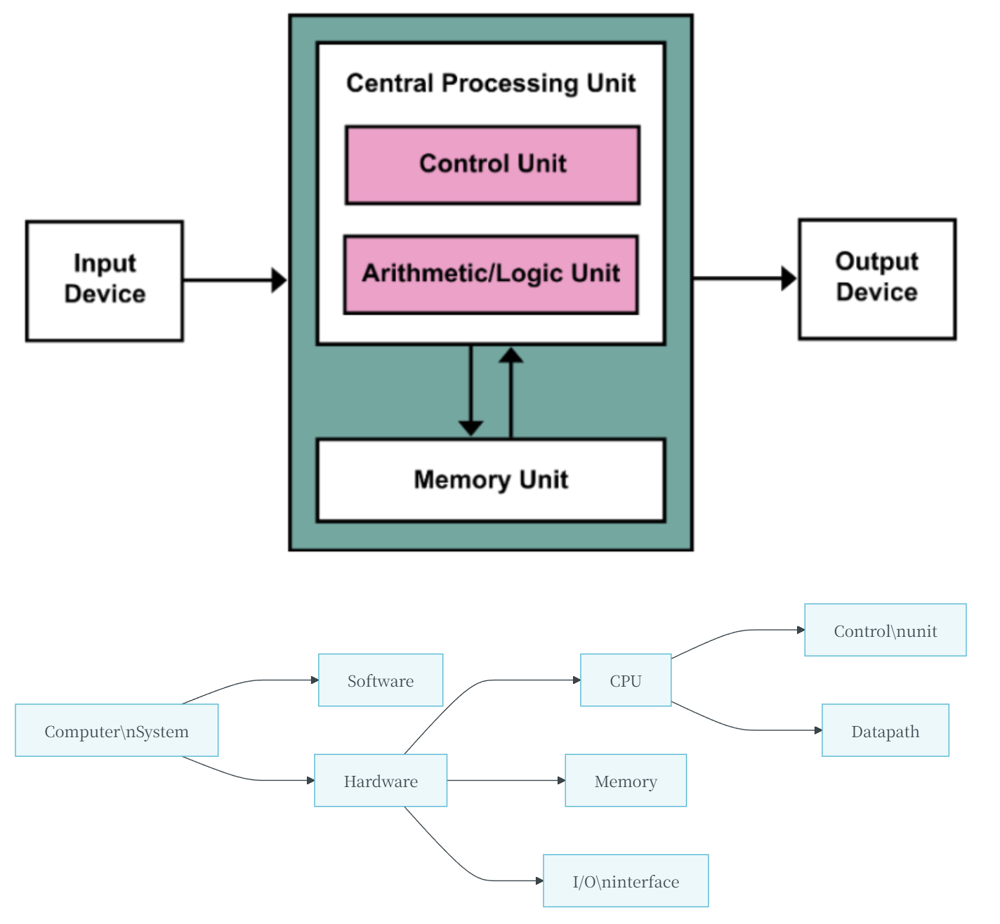

# Chapter 1

## 吞吐率和响应时间

???+ question "吞吐率和响应时间"
    下面两种改进计算机系统的方式能否增加其吞吐率或减少其响应时间，或可二者兼得?

    1.将计算机中的处理器更换为更高速的型号。
    
    2.为系统增加额外的处理器，使用多处理器来分别处理独立的任务，如搜索万维网等

??? note "Answer"
    一般来说，降低响应时间几乎总是可以增加吞吐率。因此，方式1同时改进了响应时间和吞吐率。方式2不会使任务完成得更快，只有吞吐率得到提高。
    
    但是，如果方式2对处理任务的需求和吞吐率一样大，系统可能强制后续请求进行排队。在这种情况下，改善吞吐率可同时改进响应时间，因为这会减少队列中的等待时间。所以，在实际的计算机系统中，响应时间和吞吐率往往相互影响。

---

## CPI and cycle times

$$1 G = 10^{9}$$

$$CPU \ Time = CPU \ Clock \ Cycles \times Clock \ Cycle \ Time = \frac{CPU \ Clock \ Cycles}{Clock \ Rate}$$

$$Clock \ Cycles = Instuction \ Count \times Cycles \ per \ Instruction(CPI)$$

$$CPU \ Time = Instruction \ Count \times CPI \times Clock \ Cycle \ Time = \frac{Instruction \ Count \times CPI}{Clock \ Rate}$$

$$CPI = \frac{Clock \ Cycles}{Instruction \ Count} = \sum\limits_{i=1}^{n} (CPI_i \times \frac{Instruction \ Count_i}{Instruction \ Count})$$

$$CPU \ Time = \frac{Instructions}{Program} \times \frac{Clock \ Cycles}{Instruction} \times \frac{Seconds}{Clock \ cycle}$$

---

## relative performance

- Define Performance = $\frac{1}{Execution \ Time}$

- X is n time faster than Y: 

$$\frac{Performance_X}{Performance_Y} = \frac{Execution \ Time_Y}{Execution \ Time_X} = n$$

!!! Example
    10s on A, 15s on B

    $$\frac{Execution \ Time_B}{Execution \ Time_A} = \frac{15}{10} = 1.5$$
    
    So A is 1.5 times faster than B

---

## the power

The dominant technologyfor integrated circuits is called CMOS (complementarymetal oxide semiconductor). For CMOS, the primary source ofenergy consumptionis so-called dynamic energy-that is, energy that is consumed when transistorsswitch states from 0 to l and vice versa. The dynamic energy depends on thecapacitive loading of each transistor and the voltage applied:

$$Energy \propto Capacitive \ load \times Voltage^2$$

This equation is the energy of a pulse during the logic transition of $0 \rightarrow 1 \rightarrow 0$ or $1 \rightarrow 0 \rightarrow 1$ . The energy of a single transition is then

$$Energy \propto \frac{1}{2} Capacitive \ load \times Voltage^2$$

The power required per transistor is just the product of energy of a transition and the frequency of transitions:

$$Power \propto \frac{1}{2} Capacitive \ load \times Voltage^2 \times Frequency \ switched$$

???+ question
    Suppose we developed a new, simpler processor that has 85% ofthe capacitiveload of the more complex older processor, Further, assume that it can adjustvoltage so that it can reduce voltage 15% compared to processor B, whichresults in a 15% shrink in frequency. What is the impact on dynamic power?

??? note "Answer"
    $$\frac{Power_{new}}{Power_{old}} = \frac{(Capacitive \ load \times 0.85) \times (Voltage \times 0.85)^2 \times (Frequency \times 0.85)}{(Capacitive \ load \times Voltage^2 \times Frequency \ switched)}$$

    Thus the power ratio is $0.85^4 = 0.52$
    
    Hence, the new processor uses about half the power of the old processor.

---

## Amdahl’s Law

$$T_{improved} = \frac{T_{affected}}{improvement \ factor} + T_{unaffected}$$

针对特定情况的性能提升，受到被改进的特征所占比例的限制。这个概念在日常生活中被称为边际收益递减定律。

---

## Eight Great Ideas

1. **Design for Moore’s Law** （设计紧跟摩尔定律）

   - **Moore's Law**: Integrated circuit resources double every 18-24 months.

   - Design for where it will be when finishes rather than design for where it starts.

2. **Use Abstraction to Simplify Design** (采用抽象简化设计)
   - 层次化、模块化的设计

3. **Make the Common Case Fast** (加速大概率事件)

4. **Performance via Parallelism** (通过并行提高性能)

5. **Performance via Pipelining** (通过流水线提高性能)

   - 换句话说就是，每个流程同时进行，只不过每一个流程工作的对象是时间上相邻的若干产品；

   - 相比于等一个产品完全生产完再开始下一个产品的生产，会快很多；

   - 希望每一个流程的时间是相对均匀的；

6. **Performance via Prediction** (通过预测提高性能)

   - 例如先当作 `if()` 条件成立，执行完内部内容，如果后来发现确实成立，那么直接 apply，否则就再重新正常做；

   - 这么做就好在（又或者说只有这种情况适合预测），预测成功了就加速了，预测失败了纠正的成本也不高；

7. **Hierarchy of Memories** (存储器层次)
     - Disk / Tape -> Main Memory(DRAM) -> L2-Cache(SRAM) -> L1-Cache(On-Chip) -> Registers

8. **Dependability via Redundancy** (通过冗余提高可靠性)
   - 类似于卡车的多个轮胎，一个模块 down 了以后不会剧烈影响整个系统；

---

## 冯·偌伊曼架构

- 计算与存储分离
- 数据和指令放在同一个存储器

---