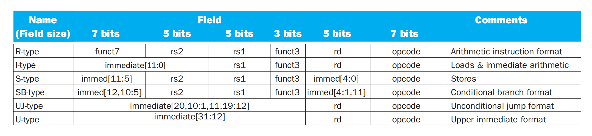

# Chapter 2

## RISC-V operands

|Name|Example|Comments|
|:---|:---|:---|
|32 registers|x0-x31|Fast locations for data. In RiSC-V, data must be in registers to perform arithmetic. Register xO always equals 0.|
|$2^{61}$memory words|Memory[0],Memory[8],...,Memory[18,446,744,073,709,511,608]|Accessed only by data transfer instructions. RiSC-V uses byte addresses, sosequential doubleword accesses differ by 8. Memory holds data structures,arrays, and spilled registers.|

---

### regs

**32个64位寄存器**

|x0(zero)|0|The constant value 0|


RISC-V 约定：

- `x5` - `x7` 以及 `x28` - `x31` 是 temp reg，如果需要的话 caller 保存；也就是说，不保证在经过过程调用之后这些寄存器的值不变。
- `x8` - `x9` 和 `x18` - `x27` 是 saved reg，callee 需要保证调用前后这些寄存器的值不变；也就是说，如果 callee 要用到这些寄存器，必须保存一份，返回前恢复。
- `x10` - `x17` 是 8 个参数寄存器，函数调用的前 8 个参数会放在这些寄存器中；如果参数超过 8 个的话就需要放到栈上（放在 `fp` 上方， `fp + 8` 是第 9 个参数， `fp + 16` 的第 10 个，以此类推）。同时，过程的结果也会放到这些寄存器中（当然，对于 C 语言这种只能有一个返回值的语言，可能只会用到 `x10` ）。
- `x1` 用来保存返回地址，所以也叫 `ra` 。因此，伪指令 `ret` 其实就是 `jalr x0, 0(x1)` 。
- 栈指针是 `x2`，也叫`sp`；始终指向栈顶元素。栈从高地址向低地址增长。
  - `addi sp, sp, -24` , `sd x5, 16(sp)` , `sd x6, 8(sp)` , `sd x20, 0(sp)` 可以实现将 x5, x6, x20 压栈。
- 一些 RISC-V 编译器保留寄存器 `x3` 用来指向静态变量区，称为 global pointer `gp` 。
- 一些 RISC-V 编译器使用 `x8` 指向 activation record 的第一个 dword，方便访问局部变量；因此 `x8` 也称为 `frame pointer(fp)`。在进入函数时，用 `sp` 将 `fp`初始化。
  - `fp` 的方便性在于在整个过程中对局部变量的所有引用相对于 `fp` 的偏移都是固定的，但是对 `sp` 不一定。当然，如果过程中没有什么栈的变化或者根本没有局部变量，那就没有必要用 `fp` 了。

---

### 寻址

RISC-V architecture 的地址是 64 位的，地址为字节地址，因此总共可以寻址 $2^{64}$ 个字节，即 $2^{61}$ 个 dword (doubleword, 下同)，因为一个 dword 占 $log_2\frac{⁡64}{8}=3$ 位。

在一些 architecture 中，word 的起始地址必须是 word 大小的整倍数，dword 也一样，这种要求称为 **alignment restriction**。RISC-V 允许不对齐的寻址，但是效率会低。

RISC-V 使用 **little endian** 小端编址。

**以 int 类型的 0x12345678 为例，在内存中的分布情况为（假设从地址 0x 4000 开始存放）**

- Little-endian

```
内存地址 0x4000 0x4001 0x4002 0x4003
存放内容 0x78 0x56 0x34 0x12
```

- Big-endian

```
内存地址 0x4000 0x4001 0x4002 0x4003
存放内容 0x12 0x34 0x56 0x78
```

如果你将地址横着写，即从左到右递增，那么对于大端来说是比较自然的，但是对于小端来说会比较不自然。

---

## RISC-V assembly language


- 逻辑移不考虑符号位，左移时高位补0，右移时低位补0
- 算数移考虑符号位

---

## C转汇编例题

???+ Question "f = (g + h) - (i + j);"
    变量 `f、g、h、i` 和 `j` 分别分配给寄存器 `x19、x20、x21、x22` 和 `x23` 。编译后的 RISC-V 代码是什么?

??? note "Answer"
    ```assembly
    add x5, x20, x21 // register x5 contains g + h
    add x6, x22, x23 // register x6 contains i + j
    sub x19, x5, x6 // f gets x5 - x6, which is (g + h) - (i + j)
    ```

???+ Question "A[12] = h + A[8];"
    假设变量 `h` 存放在寄存器 `x21` 中，数组 `A` 的基址存放在寄存器 `x22` 中。C 赋值语句的 RISC-V 汇编代码是什么?

??? note "Answer"
    ```assembly
    ld x9, 64(x22) // Temporary reg x9 gets A[8]
    add x9, x9, x21 // Temporary reg x9 gets A[8] + h
    ```

???+ Question "if (i == j) f = g + h; else f = g - h;"
    在下面的代码段中， `f、g、h、i` 和 `j` 是变量。如果五个变量 `f` 到 `j` 对应于 `x19` 到 `x23` 这5个寄存器，这个C语言的 `if` 语句编译后的 RISC-V 代码是什么?

??? note "Answer"
    ```assembly
    bne x22, x23, Else // go to Else if i != j
    add x19, x20, x21 // f = g + h (skipped if i != j)
    beq x0, x0, Exit // if 0 == 0, go to Exit
    Else: sub x19, x20, x21 // f = g - h (skipped if i == j)
    ```

???+ Question "while ( save[i] == k) i += 1;"
    假设 `i` 和 `k` 对应于寄存器 `x22` 和 `x24` ，数组的基址保存在 `x25` 中。与此C语言代码相对应的 RISC-V 汇编代码是什么?

??? note "Answer"
    ```assembly
    Loop: slli x10, x22, 3 // Temp reg x10 = i * 8
    add x10, x10, x25 // x10 = address of save[i]
    ld x9, 0(x10) // Temp reg x9 = save[i]
    bne x9, x24, Exit // go to Exit if save[i] != k
    addi x22, x22, 1 // i += 1
    beq x0, x0, Loop // go to Loop
    ```

???+ Question "没有调用其他过程的C"
    ```c
    long long int leaf_example(long long int g, long long int h, long long int i, long long int j) {
        long long int f;

        f = (g + h) - (i + j);
        return f;
    }
    ```
    
    编译成 RISC-V 代码是什么?参数变量 `g、h、i` 和 `j` 对应于参数寄存器 `x10、x11、x12` 和 `x13` ， `f` 对应于 `x20` 。

??? note "Answer"
    ```assembly
    addi sp, sp, -24 // adjust stack to make room for 3 items
    sd x5, 16(sp) // save register x5 for use afterwards
    sd x6, 8(sp) // save register x6 for use afterwards
    sd x20, 0(sp) // save register x20 for use afterwards
    add x5, x10, x11 // x5 = g + h
    add x6, x12, x13 // x6 = i + j
    sub x20, x5, x6 // x20 = f = g + h - i - j
    addi x10, x20, 0 // return f (x10 = x20 + 0)
    ld x20, 0(sp) // restore register x20 for caller
    ld x6, 8(sp) // restore register x6 for caller
    ld x5, 16(sp) // restore register x5 for caller
    addi sp, sp, 24 // adjust stack to delete 3 items
    jalr x0, 0(x1) // branch back to calling routine
    ```

???+ Question "编译一个递归（嵌套）C过程"
    ```c
    long long int fact (long long int n) {
        if (n < 1) return 1;
        else return n * fact (n - 1);
    }
    ```

    编译成 RISC-V 代码是什么?参数变量 `n` 对应于参数寄存器 `x10` 。

??? note "Answer"
    ```assembly
    addi sp, sp, -16 // adjust stack for 2 items
    sd x1, 8(sp) // save the return address
    sd x10, 0(sp) // save the argument n
    addi x5, x10, -1 // x5 = n - 1
    bge x5, x0, L1 // if n >= 1, go to L1
    addi x10, x0, 1 // return 1
    addi sp, sp, 16 // pop 2 items off stack
    jalr x0, 0(x1) // return to caller
    L1: addi x10, x10, -1 // n >= 1: argument gets (n - 1)
    jal x1, fact // call fact with (n - 1)
    addi x6, x10, 0 // return from jal: move result of fact(n - 1) to x6
    ld x10, 0(sp) // restore argument n
    ld x1, 8(sp) // restore return address
    addi sp, sp, 16 // adjust stack pointer to pop 2 items
    mul x10, x6, x10 // return n * fact(n - 1)
    jalr x0, 0(x1) // return to caller
    ```

???+ Question "一些递归（尾调用）可以不用递归而通过迭代实现"
    ```c
    long long int sum (long long int n, long long int acc){
        if (n > 0)
            return sum (n - 1, n + acc);
        else return acc;
    }
    ```

??? note "Answer"
    ```assembly
    sum: ble x10, x0, sum_exit // go to sum_exit if n <= 0
    add x11, x11, x10 // add n to acc
    addi x10, x10, -1 // n = n - 1
    jal x0, sum // jump to sum
    sum_exit: addi x12, x11, 0 // return acc
    jalr x0, 0(x1) // return to caller
    ```

???+ Question "复制字符串"
    ```c
    void strcpy (char x[], char y[]){
        size_t i;
        i = 0;
        while ((x[i] = y[i]) != '\0') /* copy & test byte */
            i++;
    }
    ```

    编译成 RISC-V 代码是什么?假设数组 `x` 和 `y` 的基址存放在 `x10` 和 `x11` 中，而 `i` 在 `x19` 中。

??? note "Answer"
    ```assembly
    strcpy: addi sp, sp, -8 // adjust stack for 1 more item
    sd x19, 0(sp) // save x19
    add x19, x0, x0 // i = 0
    L1: add x5, x19, x11 // address of y[i] in x5
    lbu x6, 0(x5) // x6 = y[i]
    add x7, x19, x10 // address of x[i] in x7
    sb x6, 0(x7) // x[i] = y[i]
    beq x6, x0, L2
    addi x19, x19, 1 // i++
    jal x0, L1 // go to L1
    L2: ld x19, 0(sp) // restore old x19
    addi sp, sp, 8 // pop 1 doubleword off stack
    jalr x0, 0(x1) // return
    ```

???+ Question "Swap"
    ```c
    void swap (long long int v[], size_t k){
        long long int temp;
        temp = v[k];
        v[k] = v[k+1];
        v[k+1] = temp;
    }
    ```

    编译成 RISC-V 代码是什么?

??? note "Answer"
    ```assembly
    swap: slli x6, x11, 3 // reg x6 = k * 8
    add x6, x10, x6 // reg x6 = v + (k * 8)
    ld x5, 0(x6) // reg x5 (temp) = v[k]
    ld x7, 8(x6) // reg x7 = v[k+1]
    sd x7, 0(x6) // v[k] = reg x7
    sd x5, 8(x6) // v[k+1] = reg x5 (temp)
    jalr x0, 0(x1) // return to calling routine
    ```

???+ Question "Sort"
    ```c
    void sort (long long int v[], size_t n){
        size_t i, j;
        for (i = 0; i < n; i += 1){
            for (j = i - 1; j >= 0 && v[j] > v[j+1]; j -= 1){
                swap(v, j);
            }
        }
    }
    ```

    编译成 RISC-V 代码是什么?

??? note "Answer"
    ```assembly
    sort: addi sp, sp, -40
    sd x1, 32(sp)
    sd x22, 24(sp)
    sd x21, 16(sp)
    sd x20, 8(sp)
    sd x19, 0(sp)
    mv x21, x10
    mv x22, x11
    li x19, 0
    for1tst: bge x19, x22, exit1
    addi x20, x19, -1
    for2tst: blt x20, 0, exit2
    slli x5, x20, 3
    add x5, x21, x5
    ld x6, 0(x5)
    ld x7, 8(x5)
    ble x6, x7, exit2
    mv x10, x21
    mv x11, x20
    jal x1, swap
    addi x20, x20, -1
    j for2tst
    exit2: addi x19, x19, 1
    j for1tst
    exit1: ld x19, 0(sp)
    ld x20, 8(sp)
    ld x21, 16(sp)
    ld x22, 24(sp)
    ld x1, 32(sp)
    addi sp, sp, 40
    jalr x0, 0(x1)
    ```

???+ Question "数组和指针"
    ```c
    clear1(long long int array[], size_t int size){
        size_t i;
        for (i = 0; i < size; i += 1){
            array[i] = 0;
        }
    }
    clear2(long long int *array, size_t int size){
        long long int *p;
        for (p = &array[0]; p < &array[size]; p += 1){
            *p = 0;
        }
    }
    ```

    编译成 RISC-V 代码是什么?

??? note "Answer"
    ```assembly
    li x5, 0
    loop1: slli x6, x5, 3
    add x7, x10, x6
    sd x0, 0(x7)
    addi x5, x5, 1
    blt x5, x11, loop1
    mv x5, x10
    slli x6, x11, 3
    add x7, x10, x6
    loop2: sd x0, 0(x5)
    addi x5, x5, 8
    bltu x5, x7, loop2
    ```

---

## 大立即数

RISC-V指令中存在`load upper immediate`(取立即数高位，`lui`)，用于将20 位常数加载到寄存器的第31位到第12位。将第31位的值复制填充到最左边32位，最右边的12位用0填充。（也即有符号）。

???+ Question "大立即数"
    

??? note "Answer"
    

    

??? note "Further"
    因为 `addi` 是有符号的。

    
    
    
    
    因此我们在进行大立即数运算时，可以先使用 `lui` 将高20位加载到寄存器，再使用 `slli` 移位后再加上低12位，但是需要注意 `addi` 是有符号的。

---

## RISC-V寻址模式


---

## Decoding Machine Language



---

## 原子交换

在计算中，同步机制通常由用户级的软件例程所构建，而这依赖于硬件提供的同步指令。在本节中，我们将重点介绍加锁(lock)和解锁(unlock)同步操作的实现。加锁和解锁可直接用于创建只有单个处理器可以操作的区域，称为互斥(mutual exclusion)区，以及实现更复杂的同步机制。

在多处理器中实现同步所需的关键是一组硬件原语，能够提供以原子方式读取和修改内存单元的能力。也就是说，在内存单元的读取和写入之间不能插入其他任何操作。如果没有这样的能力，构建基本同步原语的成本将会很高，并会随着处理器数量的增加而急剧增加。有许多基本硬件原语的实现方案，所有这些都提供了原子读和原子写的能力，以及一些判断读写是否是原子操作的方法。

我们从原子交换(atomic exchange或atomic swap)原语开始，展示如何使用它来构建基本同步原语。它是构建同步机制的一种典型操作，它将寄存器中的值与存储器中的值进行交换。

为了了解如何使用它来构建基本同步原语，假设要构建一个简单的锁变量，其中值0用于表示锁变量可用，值1用于表示锁变量已被占用。处理器尝试通过将寄存器中的1与该锁变量对应的内存地址的值进行交换来设置加锁。如果某个其他处理器已声明访问该锁变量，则交换指令的返回值为1,表明该锁已被其他处理器占用，否则为0,表示加锁成功。在后一种情况下，锁变量的值变为1,以防止其他处理器也加锁成功。

例如，考虑两个处理器尝试同时进行交换操作：这种竞争会被阻止，因为其中一个处理器将首先执行交换，并返回0,而第二个处理器在进行交换时将返回1。使用交换原语实现同步的关键是操作的原子性：交换是不可分割的，硬件将对两个同时发生的交换进行排序。尝试以这种方式设置同步变量的两个处理器都不可能认为它们同时设置了变量。

实现单个的原子存储操作为处理器的设计带来了一些挑战，因为它要求在单条不可中断的指令中完成存储器的读和写操作。

另一种方法是使用指令对，其中第二条指令返回一个值，该值表示该指令对是否被原子执行。如果任何处理器执行的所有其他操作都发生在该对指令之前或之后，则该指令对实际上是原子的。因此，当指令对实际上是原子操作时，没有其他处理器可以在指令对之间改变值。

在RISC-V中，这对指令指的是一个称为保留加载(load-reserved)双字(1r.d)的特殊加载指令和一个称为条件存储(`store-conditional`)双字(`sc.d`)的特殊存储指令。这些指令按序使用：如果保留加载指令指定的内存位置的内容在条件存储指令执行到同一地址之前发生了变化，则条件存储指令失败且不会将值写入内存。条件存储指令定义为将(可能是不同的)寄存器的值存储在内存中，如果成功则将另一个寄存器的值更改为0,如果失败则更改为非零值。因此，sc.d指定了三个寄存器：一个用于保存地址，一个用于指示原子操作失败或成功，还有一个用于如果成功则将值存储在内存中。由于保留加载指令返回初始值，并且条件存储指令仅在成功时返回0，因此以下序列在寄存器`x20`中指定的内存位置上实现原子交换：

!!! note "原子交换"
    ```assembly
    again: 1r.d x10, (x20) // load-reserved
    sc.d x11, x23, (x20) // store-conditional
    bne x11, x0, again // branch if store fails
    addi x23, x20, 0 // put loaded value in x23
    ```

每当处理器干预并修改`lr.d`和`sc.d`指令之间的内存中的值时，`sc.d`就会将非零值写入`x11`,从而导致代码序列重新执行。在此序列结束时，`×23`的值和`×20`指向的内存位置的值发生了原子交换。	

!!! note "Further"
    虽然上面的代码实现了原子交换，但下面的代码可以更有效地获取寄存器 `x20` 对应存储中的锁变量，其中值 0 表示锁变量是空闲的，值 1 表示锁变量被占用：

    ```assembly
    addi x12, x0, 1 // copy locked value
    again: 1r.d x10, (x20) // load-reserved to read lock
    bne x10, x0, again // check if it is 0 yet
    sc.d x11, x12, (x20) // attempt to store new value 
    bne x11, x0, again // branch if store fails
    sd x0, 0(x20) // free lock by writing 0
    ```

---

## 补充

- 检查 index out of bounds：如果 `x20 = i, x11 = size` ，那么 `bgeu x20, x11, IndexOutOfBounds` ，即 `x20 >= x11 || x20 < 0`
- ASCII，是 8 位的，可以用 `lbu`
- Unicode，是 16 位的，可以用 `lhu`

---

## Translating and Starting a Program


### Compiler

The assembler turns the assembly language program into an object file, which is a combination of machine language instructions, data, and information needed to place instructions properly in memory.

### Linker

What we have presented so far suggests that a single change to one line of one procedure requires compiling and assembling the whole program. Complete retranslation is a terrible waste of computing resources. This repetition is particularly wasteful for standard library routines, because programmers would be compiling and assembling routines that by definition almost never change. An alternative is to compile and assemble each procedure independently, so that a change to one line would require compiling and assembling only one procedure. This alternative requires a new systems program, called a **link editor** or **linker**, which takes all the independently assembled machine language programs and “stitches” them together. The reason a linker is useful is that it is much faster to patch code than it is to recompile and reassemble.

链接器的工作有三个步骤：

1. 将代码和数据模块按符号特征放入内存。
2. 决定数据和指令标签的地址。
3. 修正内部和外部引用。

链接器生成可在计算机上运行的可执行文件。通常，此文件具有与目标文件相同的格式，但它不包含任何未解析的引用。具有部分链接的文件是可能的，例如库程序，在目标文件中仍然有未解析的地址。

### Loader

Now that the executable file is on disk, the operating system reads it to memory and starts it. 

加载器的操作：

1. 读取可执行文件首部以确定正文段和数据段的大小。
2. 为正文和数据创建足够大的地址空间。
3. 将可执行文件中的指令和数据复制到内存中。
4. 将主程序的参数(如果有)复制到栈顶。
5. 初始化处理器寄存器并将栈指针指向第一个空闲位置。
6. 跳转到启动例程，将参数复制到参数寄存器中并调用程序的主例程。当主例程返回时，启动例程通过exit系统调用终止程序。

### Dynamically Linked Libraries

动态链接库(`dynamically linked libraries`,`DLL`),其库例程在程序运行之前不会被链接和加载。程序和库例程都保存有关非局部过程及其名字的额外信息。

---