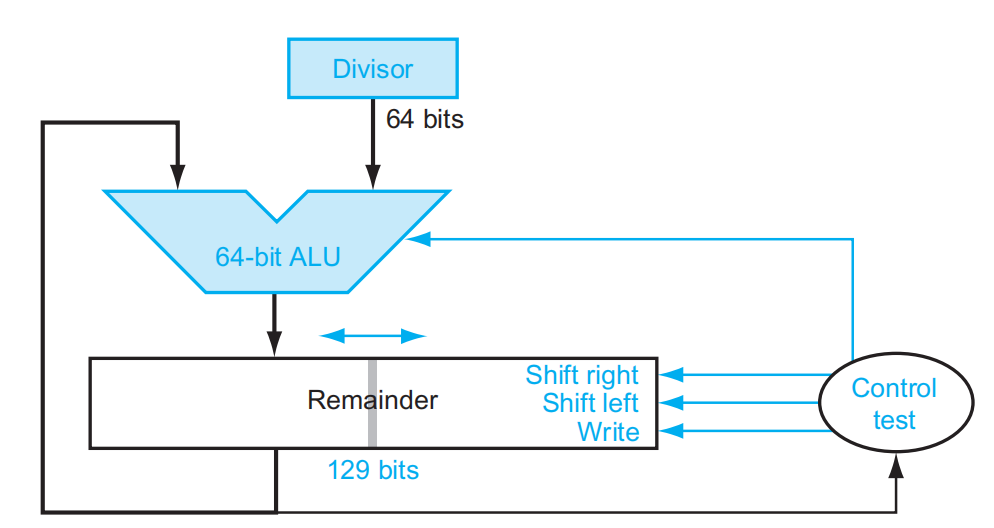

# Chapter 3

## Multiplication -- v3

其流程大概是，一共进行 64 次：

1. 判断 Product 寄存器的最低位是否是 1：
2. 如果是，则将 Multiplicand 寄存器的值加到 Product 寄存器的左半部分里；
3. 如果否，进入下一步；
4. 将 Product 寄存器的值右移一位；
5. 判断是否做满 64 次，决定是否终止；

---

## Booth's Algorithm

- Assumes: Z = $y \times 10111100$

$$Z = y(10000000 + 111100 + 100 - 100)$$

$$ = y(1 \times 2^7 + 1000000 - 100)$$

$$ = y(1 \times 2^7 + 1 \times 2^6 - 2^2)$$

$$ = y(1\times 2^7 + 1 \times 2^6 + 0 \times 2^5 + 0 \times 2^4 + 0 \times 2^3 + 0 \times 2^2 + 0 \times 2^1 + 0 \times 2^0 - 1 \times 2^2)$$

$$ = y(1 \times 2^7 + 1 \times 2^6 + 0 \times 2^5 + 0 \times 2^4 + 0 \times 2^3 - 1 \times 2^2 + 0 \times 2^1 + 0 \times 2^0)$$

$$ = y \times 2^7 + \mathop{y \times 1 \times 2^6}\limits_{add} + \mathop{0 \times 2^5 + 0\times 2^4 + 0 \times 2^3 + 0 \times 2^2}\limits_{Only shift} - \mathop{y \times 2^2}\limits_{sub} + \mathop{0 \times 2^1 + 0 \times 2^0}\limits_{Only shift}$$

- Action

|1|0|subtract Multiplicand from left|
|:-:|:--:|:--:|
|1|1|no arithmetic operation-shift|
|0|1|add multiplicand to left half|
|0|0|no arithmetic operation-shift|

- $Bit_{-1} = '0'$

---

## Division -- v3

其流程大概是，一共进行64次（v1版本要进行65次）：

1. Remainder 寄存器左移一位，移出来空位置给商；
2. 将 Divisor 寄存器中的数从 Remainder 寄存器的左边减掉，并把结果放在左半边；
3. 判断 Remainder 寄存器与 0 的大小；
4. 如果大于等于 0 那么将 Remainder 寄存器左移一位并把最右一位（也即刚移出来的0）改为1，进入第6步；
5. 如果小于 0 那么将 Divisor 寄存器中的数再加到 Remainder 寄存器的左边，再将 Remainder 寄存器左移一位，进入第6步；
6. 判断是否做满64次，决定是否终止；

---

## Signed Division

---

## IEEE 754 浮点表示

我们将小数点左边只有 1 位数字的表示数的方法称为 **科学记数法, scientific notation**，而如果小数点左边的数字不是 0，我们称这个数的表示是一个 **规格化数, normalized number**。科学记数法能用来表示十进制数，当然也能用来表示二进制数。

IEEE 754 规定了一种浮点数标准：我们将浮点数表示为 $(−1)^S \times F \times 2^E$ 的形式，这里的 $F \times 2^E$ 是一个规格化数，而 $(−1)^S$ 用来表示符号位：S 为 0 说明该浮点数为正数，为 1 则为负数；F 和 E 也用若干 bits 表示，分别表示尾数和指数，我们稍后讨论。也就是说，我们将其表示为 $1.xxxxx_2 \times 2^{yyyy}$ 的形式这意味着我们没法直接通过这种表达形式表示 0（为什么小数点左边是 1 呢？因为二进制只有 0 和 1，而规格化要求小数点左边不能为 0）。我们通过科学记数法调整了小数点的位置使其满足规格化的要求，因此我们称这种数的表示方法为 **浮点, floating point**。

小数点的英文是 decimal point，但是我们这种表示方法不再是 decimal 的了，因此我们起个新名字：**二进制小数点, binary point**。

IEEE 754 规定了两种精度的浮点数格式，分别是 single precision 和 double precision（分别对应 C 语言中的 `float` 和 `double` ），RISC-V 这两种都支持：

在上表中：

- 第 1 条表示 0；
- 第 2 条表示非规格化数，这种数主要是为了用来表示一些很小的数，它的取值为 $(−1)^S \times (0+fraction) \times 2^{−bias}$；但是并非所有机器都支持这种表示，有的机器会直接抛出一个 exception。我们不考虑非规格数的存在；
- 第 3 条表示正常的浮点数；
- 第 4 条表示无穷大或者无穷小，出现在 exponent overflow 或者浮点数运算中非 0 数除以 0 的情况；
- 第 5 条表示非数，出现在 0/0, inf / inf, inf - inf, inf * 0 的情况

（如果数字过大不能表示，即 overflow，则结果置为 inf；如果数字过小不能表示，即 underflow，则结果置为 0。）

这两种表示法的范围和精度分别是多少呢？

- 范围
  - 能表示值的 **绝对值** 的范围是 $1.0_2 \times 2^{1−bias} ∼ 1.11\dots11_2 \times 2^{11 \dots 11_2 − 1 − bias}$，即 $1 \times 2^{1−bias} ∼ (2 − 2^{-Fra\#}) \times 2^{(2^{Exp\#} - 1) - 1 - bias}$，其中 `Fra#` 和 `Exp#` 分别表示 fraction 和 exponent 的位数；
  - 单精度浮点数：$±1 \times 2^{−126}∼±(2−2^{−23}) \times 2^{127}$
  - 双精度浮点数：$±1 \times 2^{−1022}∼±(2−2^{−52}) \times 2^{1023}$
- 精度
  - $2^{-Fra\#}$
  - 单精度浮点数：$2^{−23}$
  - 双精度浮点数：$2^{-52}$

---

## Binary Floating-Point Addition

以 $1.000_2 \times 2^{−1} − 1.110_2 \times 2{−2}$ 为例， 浮点数的加减法分为以下几步：

1. Alignment: 指数对齐，将小指数对齐到大指数：

   $−1.110_2 \times 2^{−2} = −0.111_2 \times 2^{−1}$

   1. 为什么是小对大？首先，小对大的过程是在小指数的 fraction 前补 `0`，可能导致末尾数据丢失；大对小的过程是在大指数的 fraction 后补 `0`，可能导致前面的数据丢失。在计算过程中，我们保持的精确位数是有限的，而在迫不得已丢去精度的过程中，让小的那个数的末几位被丢掉的代价比大的前几位丢失要小太多了；

2. Addiction Fraction 部分相加减：$1.000−0.111=0.001$

3. Normalization: 将结果规格化：$0.001 \times 2^{−1} = 1.000 \times 2^{−4}$；同时需要检查是否出现 overflow 或者 underflow，如果出现则触发 Exception

4. Rounding: 将 Fraction 部分舍入到正确位数；舍入结果可能还需要规格化，此时回到步骤 3 继续运行

---

## Binary Floating-Point Multiplication

分别处理符号位、exponent 和 fraction：

- 将两个 Exponent 相加并 **减去一个 bias**，因为 bias 加了 2 次
- 将两个 (1 + Fraction) 相乘，并将其规格化；此时同样要考虑 overflow 和 underflow；然后舍入，如果还需要规格化则重复执行
- 根据两个操作数的符号决定结果的符号

---

## **Accurate Arithmetic**

Extra bits of precision (`guard`, `round`, `sticky`)

- `guard` 和 `round` 就是正常后面两位
- `sticky`是 `round`是否还有非0数。 `round` 后面全为0则 `sticky` 为0。 `round` 后面有非0则 `sticky`为1。

### Round to nearest even

Rounding to nearest even(Keep LSB to 0 when extra bits are 100)

$0101010100|011 -> 0101010100 (+0)$
$0101010101|011 -> 0101010101 (+0)$
$0101010100|100 -> 0101010100 (+0,keep LSB to 0)$
$0101010101|100 -> 0101010110 (+1,keep LSB to 0)$
$0101010100|101 -> 0101010101 (+1)$
$0101010101|101 -> 0101010110 (+1)$

**三舍五入四成双**

**Units in the last place(ulp)**：精度损失的最小单位

则该精度为 `0.5 ulp`。

---