# Chapter 4

## Simple Data Path with Control Unit

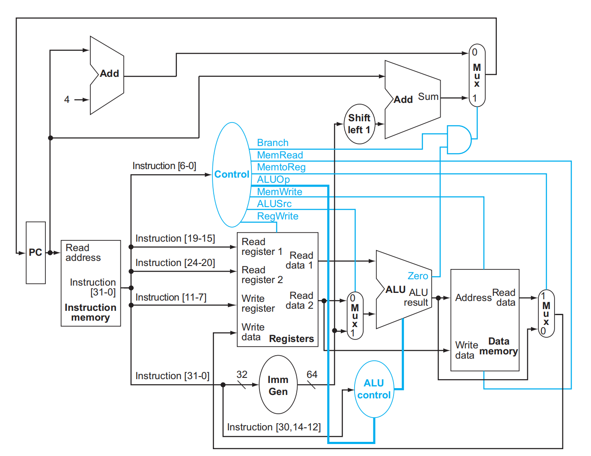

### control signal

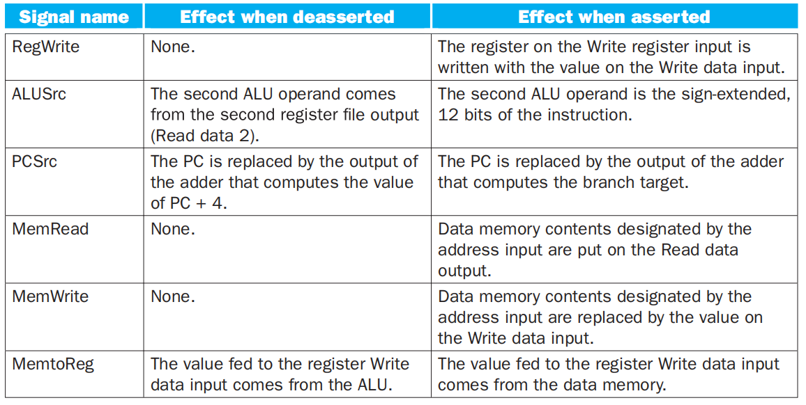

​	6个控制信号的功能。当两路多选器的1位控制信号有效时，多选器选择对应于1的输入。否则选择对应于0的输入。请记住，所有状态单元都将时钟信号作为隐式输入，而且时钟控制写操作。**时钟信号从来不在状态单元之外通过任何门电路**，因为这样可能导致时序问题。

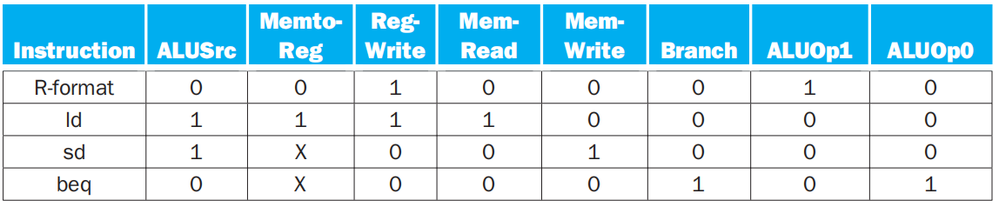

|     指令     | ALUSrc |   MemtoReg   |   RegWrite   | Memread  | MemWrite | Branch | ALUop |
| :----------: | :----: | :----------: | :----------: | :------: | :------: | :----: | :---: |
|   R型指令    | 寄存器 | ALU计算结果  |  写回寄存器  | 不读内存 | 不写内存 | 不分支 |  10   |
|  ld(I-type)  | 立即数 | 内存读出结果 |  写回寄存器  |  读内存  | 不写内存 | 不分支 |  00   |
|  sd(S-type)  | 立即数 |      X       | 不写回寄存器 | 不读内存 |  写内存  | 不分支 |  00   |
| beq(SB-type) | 寄存器 |      X       | 不写回寄存器 | 不读内存 | 不写内存 |  分支  |  01   |

---

## 数据通路操作

### `add rd,rs1,rs2`

1. 取出指令，PC自增。
2. 从寄存器堆读出两个寄存器 `rs1` 和 `rs2` ,同时主控制单元在此步骤计算控制信号。
3. 根据部分操作码确定ALU的功能，对从寄存器堆读出的数据进行操作。
4. 将ALU的结果写入寄存器堆中的目标寄存器 `rd`。

灰色部分为不必用的单元

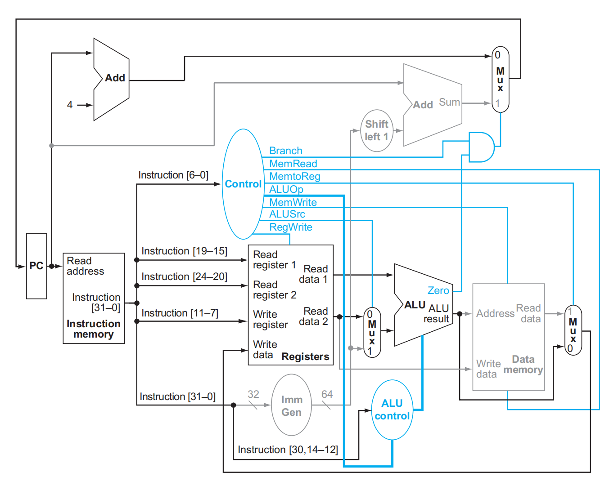

---

### `ld rd,offset(rs1)`

1. 从指令存储器中取出指令，PC自增。
2. 从寄存器堆读出寄存器 `rs1` 的值。
3. ALU将从寄存器堆中读出的值和符号扩展后的指令中的12位(偏移量)相加。
4. 将ALU的结果用作数据存储器的地址。
5. 将从存储器读出的数据写入寄存器堆 `rd` 。

灰色部分为不必要单元

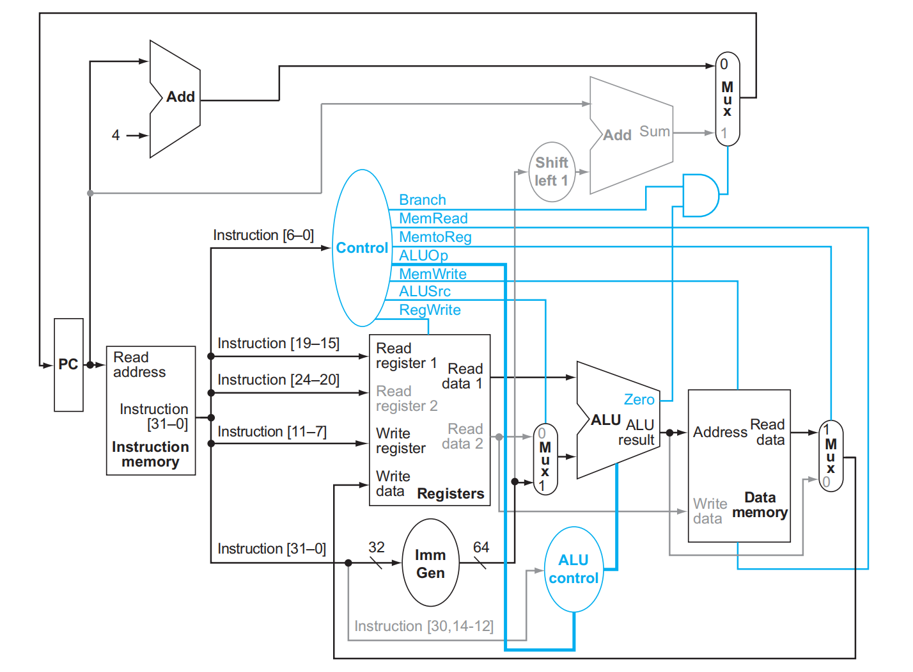

---

### `sd rs2,offset(rs1)`

1. 从指令存储器中取出指令，PC自增。
2. 从寄存器堆读出寄存器 `rs1` 和 `rs2` 的值。
3. ALU将从寄存器堆中读出的值 `rs1` 和符号扩展后的指令中的12位(偏移量)相加。
4. 将ALU的结果用作数据存储器的存储地址。
5. 将从寄存器读出的数据 `rs2` 写入存储器 `rs1 +  offset`的位置 。**不存在**将数据存储器的内容写入寄存器堆的操作

---

### `beq rs1,rs2,offset`

1. 从指令存储器中取出指令，PC自增。
2. 从寄存器堆中读出两个寄存器 `rs1` 和 `rs2` 。
3. ALU将从寄存器堆读出的两数相减。PC与左移一位、符号扩展的指令中的12位(偏移)相加，结果是分支目标地址。
4. ALU的零输出决定将哪个加法器的结果写入PC。

灰色部分为不必要单元

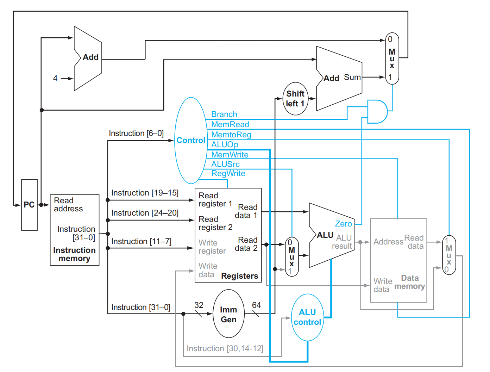

---

### 更复杂一点(带上`jal`)

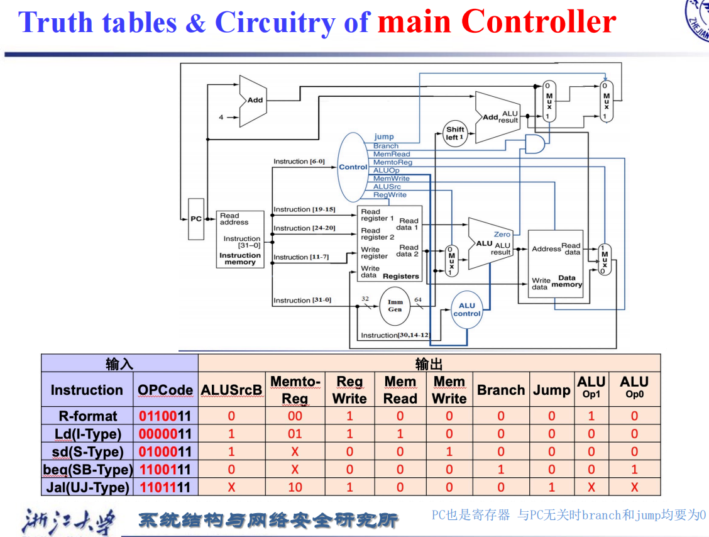

---

### `jal x1,procedure`

1. 从指令存储器中取出指令。
2. ALU将PC与左移一位、符号扩展的指令中的12位(偏移)相加，结果是跳转目标地址。再更新PC。
3. 存储返回地址`PC+4`至寄存器`rd`中。

灰色部分是不必要单元

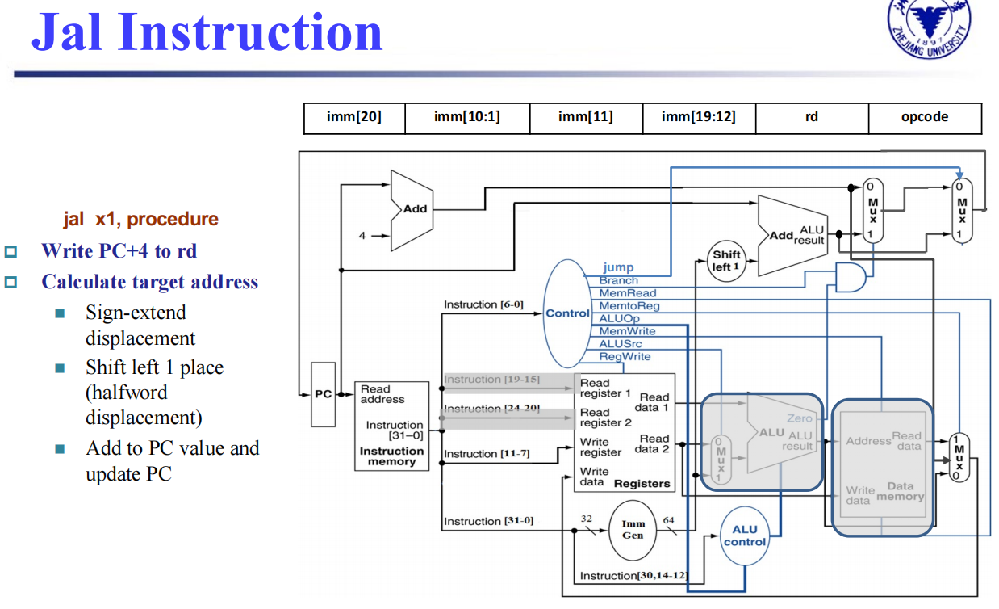

---

### `jalr ra , offset(rs1)`

1. 从指令存储器中取出指令。
2. `PC + 4`保存到`ra`这个寄存器中。
3. 计算 `rs1` 中读出的地址在ALU中加上立即数得到最终要跳转的地址。去跳转。

因此相较于 `jal` 而言 `jalr` 多的线有两条。第一条是 ALU 计算后得出的数到 MUX 返回至 `PC` ，第二条是 `PC+4` 存至 `register` 中的一条。

---

## Pipeline

### Five stages

RISC-V指令通常包含五个步骤：

1. Fetch instruction from memory.(**IF**)
2. Read registers and decode the instruction.(**ID**)
3. Execute the operation or calculate an address.(**EX**)
4. Access an operand in data memory (if necessary).(**MEM**)
5. Write the result into a register (if necessary).(**WB**)

---

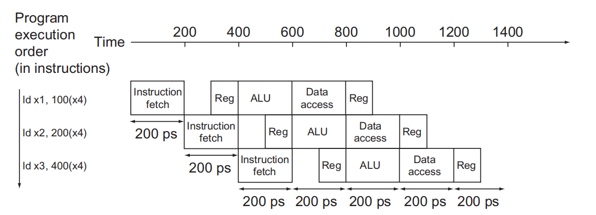

1. 前半周期用来写后半周期用来读，有可能在下一条指令产生数据依赖关系时可以赶上。
2. 流水线技术通过提高指令吞吐率来提高性能，而不是减少单个指令的执行时间。
3. Reg files 的写入均发生在上半周期，也就是上升沿；而 Pipeline registers 和 `PC` 的写入均发生在下半周期，也就是下降沿。如果 `PC` 在上升沿写入，也就是在上升沿更新到下一条指令的位置，那么在下降沿要将当前指令写入 `IF/ID` 的时候，从 inst mem 中读出的指令已经是下一条而不是当前指令了！所以我们必须让 `PC` 在下降沿写入，这样才能读取到正确的指令。

---

## Hazards

1. Structural Hazard : 硬件不支持多条指令在同一时钟周期执行。
2. Data Hazards : 由于一个步骤必须等待另一个步骤完成而导致的流水线停顿。
3. Control Hazards : 需要根据一条指令的结果做出决定，而其他指令正在执行。

---

### Data Hazard Forwarding/Bypassing

向内部资源添加额外的硬件以尽快找到缺少的运算项的办法。

将 `add` 执行阶段后 `x1` 中的值，前递给 `sub` 指令作为执行阶段的输入。

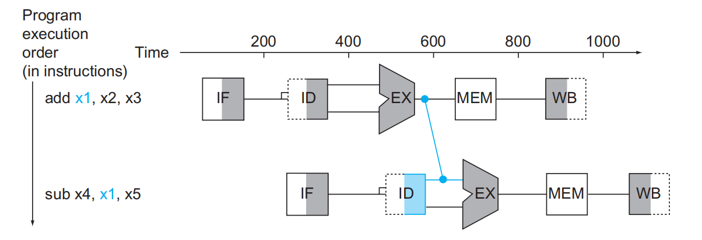

#### bubble(`pipeline stall`)

在第一个指令的第四个阶段后，`sub` 指令所需的数据才可用。

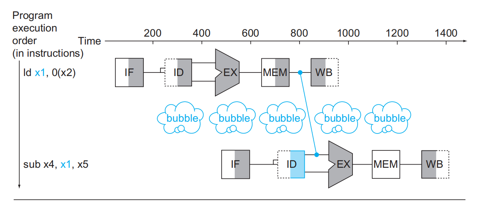

---

#### recording

???+ Question
    ```c
    a = b + e;
    c = b + f;
    ```

    Here is the generated RISC-V code for this segment, assuming all variables are in memory and are addressable as offsets from x31:
    
    ```assemble
    ld x1, 0(x31) // Load b
    ld x2, 8(x31) // Load e
    add x3, x1, x2 // b + e
    sd x3, 24(x31) // Store a
    ld x4, 16(x31) // Load f
    add x5, x1, x4 // b + f
    sd x5, 32(x31) // Store c
    ```
    
    Find the hazard in the preceding code segment and reorder the instructions to avoid any pipeline stalls. 

??? note "Answer"
    ```assemble
    ld x1, 0(x31)
    ld x2, 8(x31)
    ld x4, 16(x31)
    add x3, x1, x2
    sd x3, 24(x31)
    add x5, x1, x4
    sd x5, 32(x31)
    ```

---

### Control Hazards

控制冒险有三种解决办法:

1. 停顿 : 保守方法，有效但速度很慢
2. 预测

---

### Predict

Computers do indeed use **prediction** to handle conditional branches. 

动态预测的一种常用实现方法是保存每个条件分支是否发生分支的历史记录，然后根据最近的过去行为来预测未来。当预测错误时，流水线控制必须确保预测错误的条件分支指令之后的指令执行不会生效，并且必须从正确的分支地址处重新启动流水线。

---

## 流水线的指令

There are, however, two exceptions to this left-to-right flow of instructions:

- The write-back stage, which places the result back into the register file in the middle of the datapath. 
- The selection of the next value of the PC, choosing between the incremented PC and the branch address from the MEM stage.

然而，在从左到右的指令流动过程中存在两个特殊情况：

- 在写回阶段，它将结果写回位于数据通路中段的寄存器堆中。

- 在选择下一PC值时，在自增PC值与MEM阶段的分支地址之间进行选择。

从右到左的数据流向不会对当前的指令造成影响，这种反向的数据流动只会影响流水线中的后续指令。

需要注意的是，第一种特殊情况会导致数据冒险，第二种会导致控制冒险。

一种表示流水线数据通路如何执行的方法是假定每一条指令都有独立的数据通路，然后将这些数据通路放在同一时间轴上来表示它们之间的关系。但事实上，我们可以通过引入寄存器保存数据的方式，使得部分数据通路可以在指令执行的过程中被共享。举例来说，指令存储器只在指令的五个阶段中的一个阶段被使用，而在其他四个阶段中允许被其他指令共享。为了保留在其他四个阶段中的指令的值，必须把从指令存储器中读取的数据保存在寄存器中。

### 数据通路(非最终版)

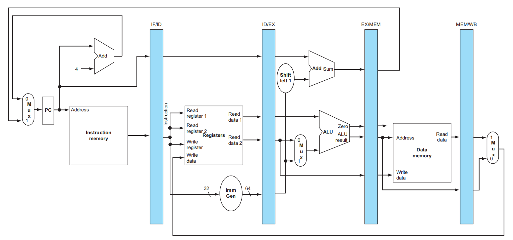

---

### `ld`

`NOTE` : 尽管在阶段二中加载指令只需要寄存器1中的值，但是处理器此时并不知道当前是哪一条指令正在被译码，因此处理器将符号扩展后的16位常量以及两个寄存器中的值都存入 `ID/EX` 流水线寄存器中。我们并不一定需要全部的这三个操作数，但是保留全部三个操作数可以简化控制。

`ld` 指令的五个阶段 : 

1. 取指：

   使用PC中的地址从存储器中读取指令，然后将指令放入 `IF/ID` 流水线寄存器中。PC中的地址自增4,然后写回PC,以为下一时钟周期做准备。这个PC值也保存在 `IF/ID` 流水线寄存器中，以备后续的指令使用(例如beq)。计算机并不知道当前正在提取的是哪一种指令，因此它必须为任何一种指令做好准备，并且将所有可能有用的信息沿流水线传递出去。

2. 指令译码和读寄存器堆：

   该指令提供一个64位符号扩展的立即数字段，以及两个将要读取的寄存器编号。所有这三个值都与PC地址一起存储在 `ID/EX` 流水线寄存器中。在这里我们再次向右传递在之后的时钟周期里指令可能用到的所有信息。

3. 执行或地址计算：

   加载指令从 `ID/EX` 流水线寄存器中读取一个寄存器的值和一个符号扩展的立即数，并且使用ALU部件将它们相加，它们的和被存储在 `EX/MEM` 流水线寄存器中。

4. 存储器访问：

   加载指令使用来自 `EX/MEM` 流水线寄存器中的地址读取数据存储器，并将数据存入 `MEM/WB` 流水线寄存器中。

5. 写回：

   从 `MEM/WB` 流水线寄存器中读取数据，并将它写入图中间的寄存器堆中。

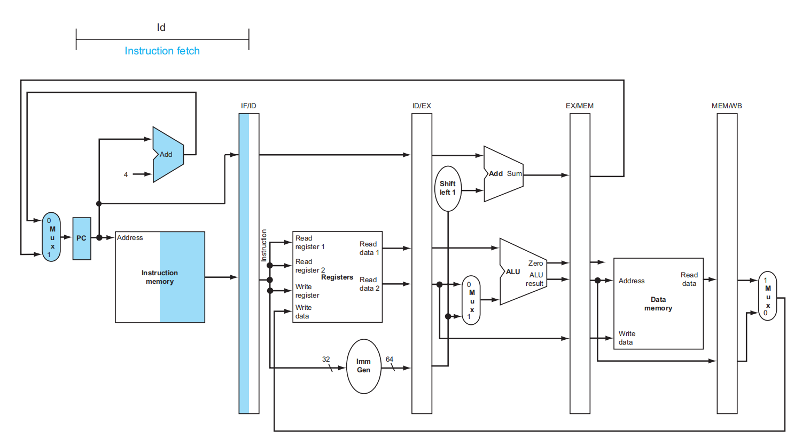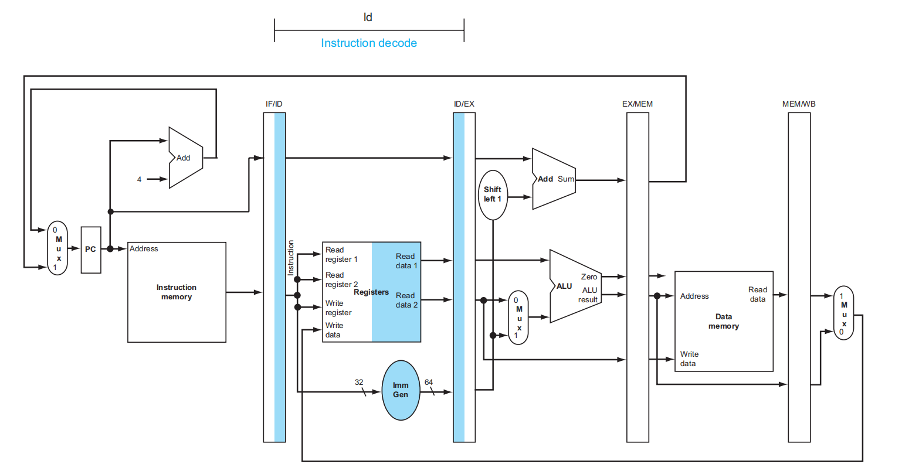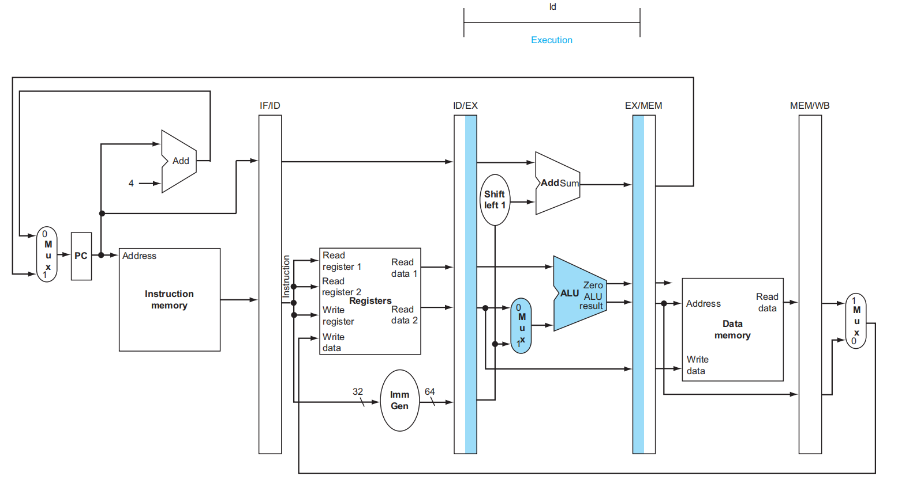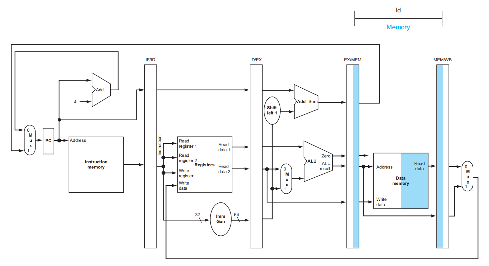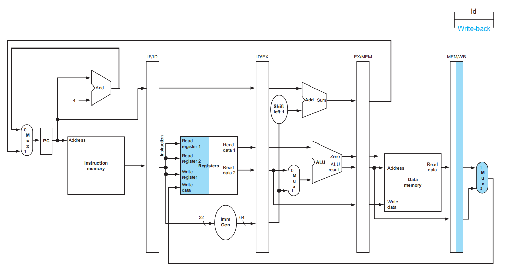

---

### `sd`

`sd` 指令的五个阶段 : 

1. 取指：

   使用PC中的地址从存储器中读取指令，然后将其放入 `IF/ID` 流水线寄存器中。该阶段发生在指令被识别之前，加载和存储指令这一阶段相同。

2. 指令译码和读寄存器堆：

    `IF/ID` 流水线寄存器中的指令提供了用于读取寄存器的两个寄存器编号以及一个符号扩展的立即数。这三个64位的值都存储在 `ID/EX` 流水线寄存器中。加载指令和存储指令的第二个流水阶段也相同。因为此时还不知道指令的类型，所以所有的指令都会执行这两个阶段。(虽然存储指令使用 `rs2` 字段读取本流水线阶段中的第二个寄存器，但是该流水线图中并未显示这个细节，因此我们可以使用相同的图表。)

3. 指令执行和地址计算：

   指令流水线中的第三步，有效地址被存放在 `EX/MEM` 流水线寄存器中。

4. 存储器访问：

   被写入存储器的数据。需要注意，包含要被存储的数据的寄存器在较早的流水线阶段就已经被读取并存储在 `ID/EX` 流水线寄存器中。在 `MEM`阶段获得这个数据的唯一方法就是在EX阶段中将该数据放入 `EX/MEM` 流水线寄存器中，就像我们将有效地址存储在 `EX/MEM` 中那样。

5. 写回：

   存储指令的最后一步。对存储指令来说，在写回阶段不会发生任何事情。由于存储指令之后的每一条指令都已经进入流水线中，所以我们无法加速这些指令。因此，任何指令都要经过流水线中的每一个阶段，即使它在这个阶段没有任何事情要做，因为后续指令已经按照最大速率在流水线中进行处理了。


存储指令再次说明了如果要将相关信息从之前的流水线阶段传递到后续的流水线阶段，就必须将它们放置在流水线寄存器中。否则，当下一条指令进入流水线时，该信息就会丢失。对于存储指令来说，我们需要将在 `ID` 阶段读取的寄存器信息传递到 `MEM` 阶段，然后写入存储器中。这些数据最初放置在 `ID/EX` 流水线寄存器中，之后被传送到 `EX/MEM` 流水线寄存器中。

其次，加载和存储指令还说明了第二个关键点：在流水线数据通路设计中的每一个逻辑部件(例如指令存储器、寄存器读端口、ALU、数据存储器、寄存器写端口等)只能在单个流水线阶段中被使用，否则就会发生结构冒险。因此，这些部件以及对它们的控制只能与一个流水线阶段相关联。

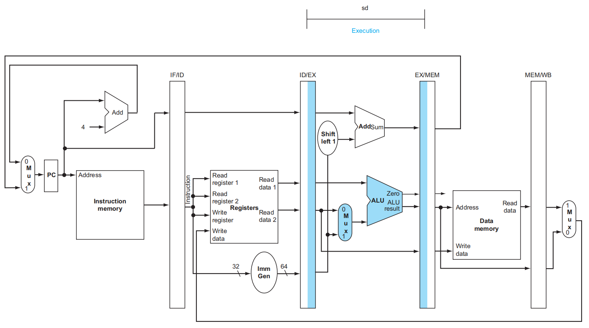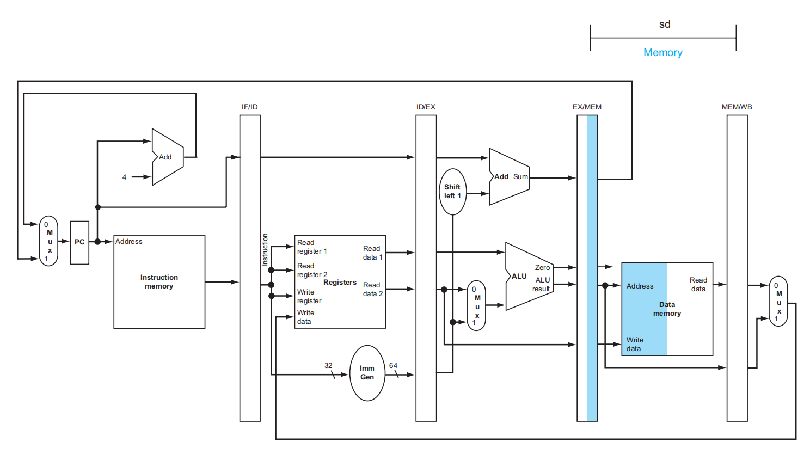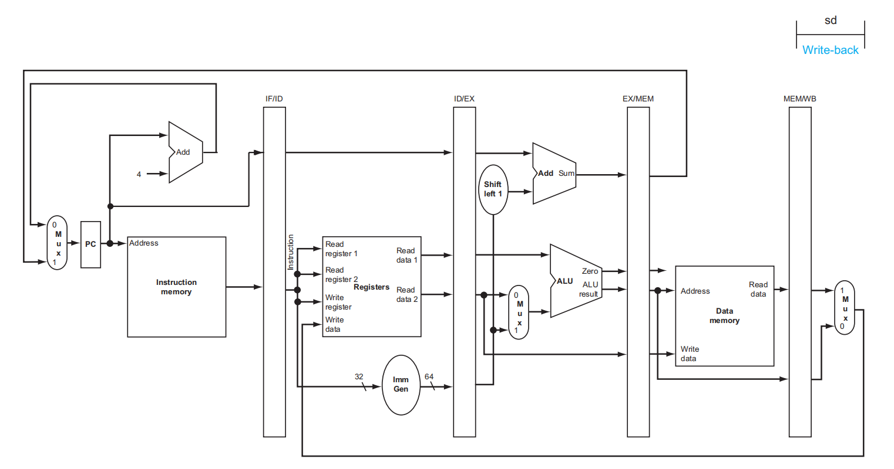

修复错误后的版本 : 

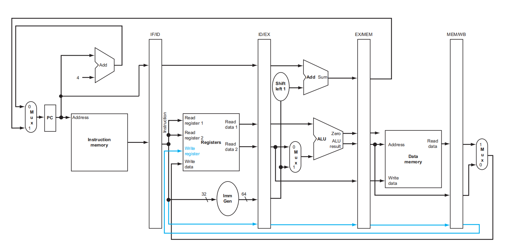

现在我们就可以发现加载指令设计中的一个错误。在加载指令流水的 `WB` 阶段改写了哪个寄存器?更具体地说，此时的寄存器号是哪条指令提供的?

`IF/ID` 流水线寄存器中的指令提供了写入寄存器编号。但是，这条指令是加载指令之后的指令了(这就是错误所在)。因此，我们需要在加载指令的流水线寄存器中保留目标寄存器编号。就像存储指令为了 `MEM` 阶段的使用而将寄存器值从 `ID/EX` 中传递到 `EX/MEM` 流水线寄存器中那样，加载指令需要为了 `WB` 阶段的使用而将寄存器编号从 `ID/EX` 通过 `EX/MEM` 传递到 `MEM/WB` 流水线寄存器。换一个角度来看，为了共享流水线数据通路，我们需要在 `IF` 阶段保存读取的指令，因此每个流水线寄存器都要保存当前阶段和后续阶段所需的部分指令信息。

修正后的数据通路将写入寄存器编号先传递到 `ID/EX` 寄存器中，然后传送到 `EX/MEM` 寄存器，最后传送到 `MEM/WB` 寄存器。寄存器编号在 `WB` 阶段被使用，指定了要写入的寄存器。修正后数据通路图，它高亮显示了加载指令在所有五个流水线阶段中用到的硬件。

### 数据通路(更新版)

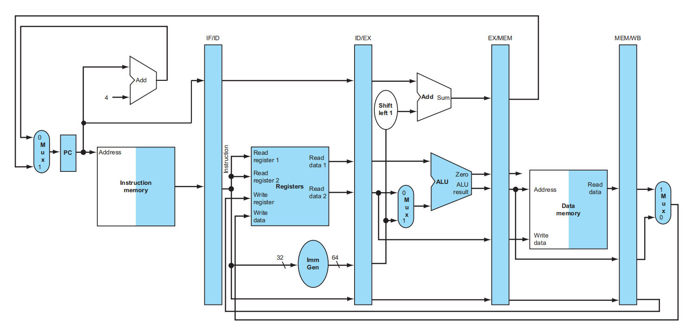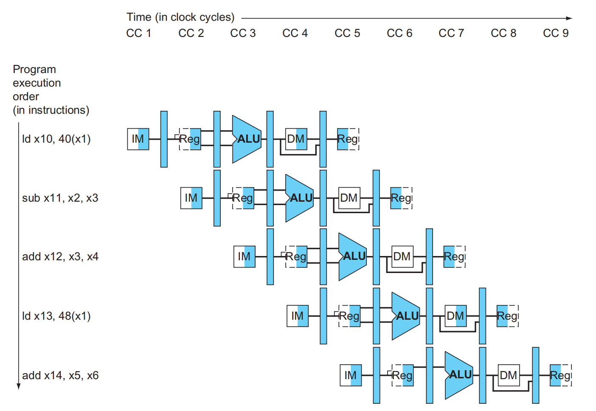

---

## Pipeline Control

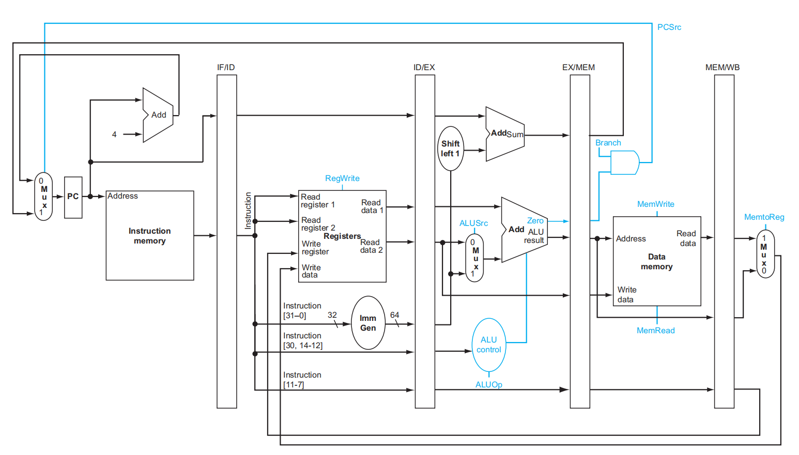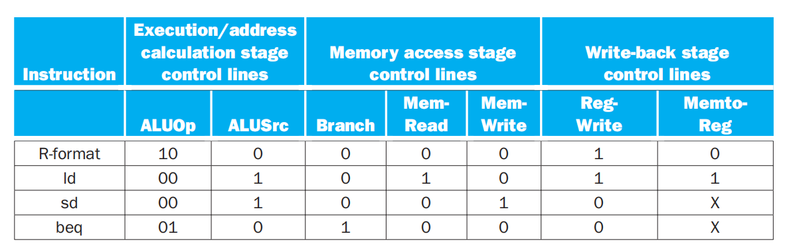

`NOTE` : 与单周期实现的情况一样，我们假定PC在每个时钟周期被写入，因此PC没有单独的写入信号。同理，流水线寄存器(`IF /ID、ID/EX、EX/MEM和MEM/WB`)也没有单独的写入信号，因为流水线寄存器也在每个时钟周期内都被写入。

1. 取指：

   读指令存储器和写PC的控制信号总是有效的，因此在这个阶段没有什么需要特别控制的内容。

2. 指令译码/读寄存器堆：

   在RISC-V指令格式中两个源寄存器总是位于相同的位置，因此在这个阶段也没有什么需要特别控制的内容。

3. 执行/地址计算：

   要设置的信号是 `ALUOp` 和 `ALUSrc` ,这个信号选择ALU操作，并将读数据2或者符号扩展的立即数作为ALU的输入。

4. 存储器访问：

   本阶段要设置的控制线是 `Branch`、 `MemRead` 和 `MemWrite`。这些信号分别由相等则分支、加载和存储指令设置。除非控制电路标示这是一条分支指令并且ALU的输出为0,否则将选择线性地址的下一条指令作为 `PCSrc` 信号。

5. 写回：

   两条控制线是 `MemtoReg` 和 `RegWrite` , `MemtoReg` 决定是将ALU结果还是将存储器值发送到寄存器堆中，`RegWrite` 写入所选值。

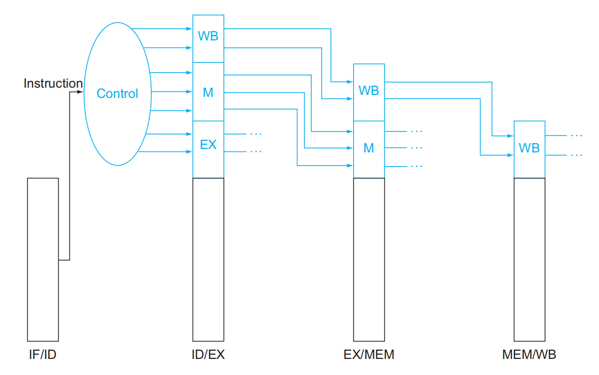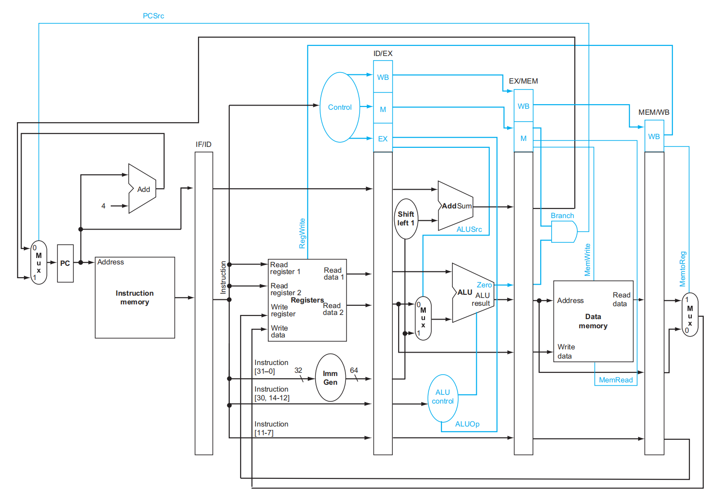

---

## Data Hazard : forwarding

两对冒险的条件 : 

```
1a. EX/MEM.RegisterRd = ID/EX.RegisterRs1
1b. EX/MEM.RegisterRd = ID/EX.RegisterRs2
2a. MEM/WB.RegisterRd = ID/EX.RegisterRs1
2b. MEM/WB.RegisterRd = ID/EX.RegisterRs2
```

因为并不是所有的指令都会写回寄存器，所以这个策略是不正确的，它有时会在不应该前递的时候也将数据前递出去。一种简单的解决方案是检查 `RegWrite` 信号是否是有效的：检查流水线寄存器在 `EX` 和 `MEM` 阶段的 `WB` 控制字段以确定 `RegWrite` 信号是否有效。

可以从流水线寄存器获得数据而非等待 `WB` 阶段写入寄存器堆。因此，只要流水线寄存器保存了需要被前递的数据，后续的指令就可以得到所需的数据。

### with forwarding version(示意图 | 未加立即数版)

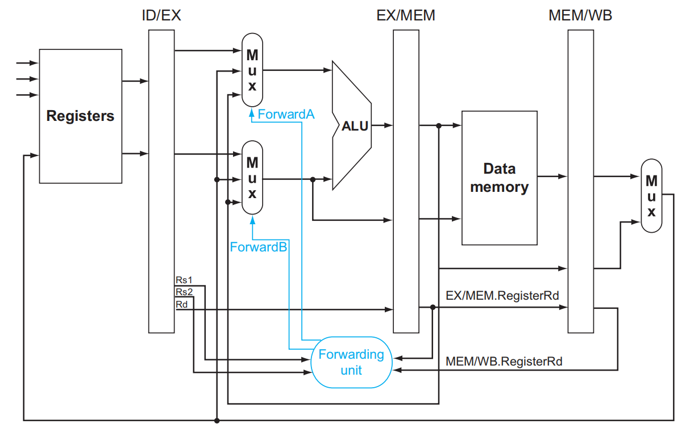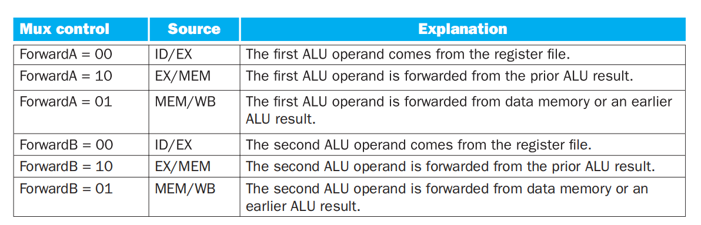

#### EX hazard

```
if (EX/MEM.RegWrite
and (EX/MEM.RegisterRd ≠ 0)
and (EX/MEM.RegisterRd = ID/EX.RegisterRs1)) ForwardA = 10

if (EX/MEM.RegWrite
and (EX/MEM.RegisterRd ≠ 0)
and (EX/MEM.RegisterRd = ID/EX.RegisterRs2)) ForwardB = 10
```

#### MEM hazard

一种复杂的潜在数据冒险是在 `WB` 阶段指令的结果、 `MEM` 阶段指令的结果和 `ALU` 阶段指令的源操作数之间发生的。例如，在一个寄存器中对一组数据做求和操作时，一系列的指令将会读和写一个相同的寄存器：

```
add x1,x1,x2
add x1,x1,x3
add x1,x1,x4
......
```

在这种情况下，结果应该是来自 `MEM` 阶段前递的数据，因为 `MEM` 阶段中的结果就是最近的结果。因此，`MEM` 冒险的控制应该是:

```
if (MEM/WB.RegWrite
and (MEM/WB.RegisterRd ≠ 0)
and not(EX/MEM.RegWrite and (EX/MEM.RegisterRd ≠ 0) and (EX/MEM.RegisterRd = ID/EX.RegisterRs1))
and (MEM/WB.RegisterRd = ID/EX.RegisterRs1)) ForwardA = 01

if (MEM/WB.RegWrite
and (MEM/WB.RegisterRd ≠ 0)
and not(EX/MEM.RegWrite and (EX/MEM.RegisterRd ≠ 0) and (EX/MEM.RegisterRd = ID/EX.RegisterRs2))
and (MEM/WB.RegisterRd = ID/EX.RegisterRs2)) ForwardB = 01
```

---

### with ALUSrc MUX version

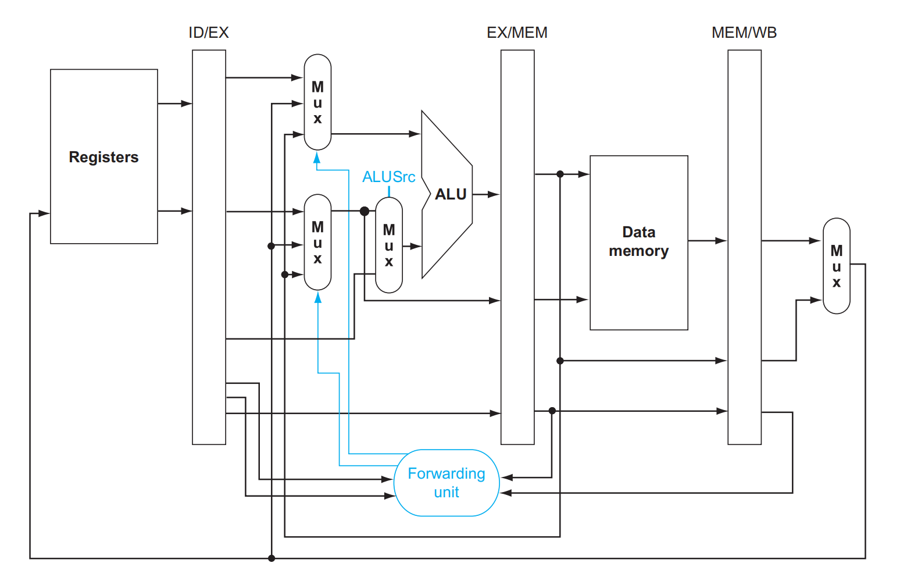

---

## Stall( `ld` Hazard)

```
if (ID/EX.MemRead and
((ID/EX.RegisterRd = IF/ID.RegisterRs1) or
(ID/EX.RegisterRd = IF/ID.RegisterRs2)))
stall the pipeline
```

**空指令**

解除 `EX`、`MEM`和`WB` 阶段的七个控制信号(将它们设置为0)就可以产生一个“没有任何操作”的指令，也就是空指令。

---

## 控制冒险(branch)

​	阻塞流水线直到分支完成的策略非常耗时。一种提升分支阻塞效率的方法是预测条件分支不发生并持续执行顺序指令流。一旦条件分支发生，已经被读取和译码的指令就将被丢弃，流水线继续从分支目标处开始执行。如果条件分支不发生的概率是50%,同时丢弃指令的代价又很小，那么这种优化方式可以减少一半由控制冒险带来的代价。

丢弃指令需要改变当分支到达 `MEM` 阶段时 `IF`、`ID`和`EX` 阶段的三条指令。而在加载-使用的数据冒险中，只需要将 `ID` 阶段的控制信号变成 0 并且将该阶段的指令从流水线中过滤出去即可。

**仔细阅读...**

```
    一种提升条件分支性能的方式是减少发生分支时所需的代价。到目前为止，我们假定分支所需的下一PC值在 MEM 阶段才能被获取，但如果我们将流水线中的条件分支指令提早移动执行，就可以刷新更少的指令。要将分支决定向前移动，需要两个操作提早发生:计算分支目标地址和判断分支条件。其中，将分支地址提前进行计算是相对简单的。在IF/ID流水线寄存器中已经得到了PC值和立即数字段，所以只需将分支地址从EX阶段移动到ID阶段即可。当然，分支地址的目标计算将会在所有指令中都执行，但只有在需要时才会被使用。
    困难的部分是分支决定本身。对于相等时跳转指令，需要在ID阶段比较两个寄存器中的值是否相等。相等的判断方法可以是先将相应位进行异或操作，再对结果按位进行或操作。将分支检测移动到ID阶段还需要额外的前递和冒险检测硬件，因为分支可能依赖还在流水线中的结果，在优化后依然要保证运行正确。例如，为了实现相等时跳转指令(或者不等时跳转指令)，需要在ID阶段将结果前递给相等测试逻辑。这里存在两个复杂的因素:
    1.在ID阶段需要将指令译码，决定是否需要将指令旁路至相等检测单元，并且完成相等测试以防指令是一条分支指令，此时可以将PC设置为分支目标地址。对分支指令的操作数进行前递的操作原先是由ALU前递逻辑处理的，但是在ID阶段引入相等检测单元后就需要添加新的前递逻辑。需要注意的是，旁路获得的分支指令的源操作数既可以从EX/MEM流水线寄存器中获得，也可以从MEM/WB流水线寄存器中获得。
    2.在ID阶段分支比较所需的值可能在之后才会产生，因此可能会产生数据冒险，所以指令停顿也是必需的。例如，如果一条 ALU指令恰好在分支指令之前，并且这条 ALU 指令产生条件分支检测时所需的操作数，那么一次指令停顿就是必需的，因为ALU指令的EX阶段将发生在分支指令的ID阶段之后。又例如，如果一条加载指令恰好在条件分支指令之后，并且条件分支指令依赖加载指令的结果，那么两个时钟周期的停顿就是必需的，因为加载指令的结果要在 MEM 阶段的最后才能产生，但是在分支指令的ID阶段的开始就需要了。
    尽管这很困难，但是将条件分支指令的执行移动到 ID 阶段的确是一个有效的优化，因为这将分支发生时的代价减轻至只有一条指令，也就是分支发生时正在取的那条指令。
    为了清除 IF 阶段的指令，我们添加了一条称为 IF.Flush 的控制线，它将 IF/IF 流水线寄存器中的指令字段设置为 0 。将寄存器清空的结果是将已经取到的指令转换成一条 nop 指令，该指令不进行任何操作，也不改变任何状态。
```

### 动态分支预测

一种方法是检查指令中的地址，查看上一次该指令执行时条件分支是否发生了跳转，如果答案是肯定的，则从上一次执行的地址中取出指令。这种技术称为动态分支预测。
​这种方法的一种实现方案是采用**分支预测缓存**或分支历史表，分支预测缓存是一块按照分支指令的低位地址定位的小容量存储器。这块存储器包含了一个比特，用于表明一个分支最近是否发生了跳转。

???+ Question "循环与预测"
    现在考虑一个循环分支，它在一行代码中发生了9次跳转，之后产生1次未跳转。假定这个分支的预测位在预测缓存中，请计算这条分支指令的预测正确率。

??? note "Answer"
    稳定状态的预测行为会在第一次以及最后一次预测循环中预测失效。其中，最后一次迭代的预测失效是不可避免的，因为此时该分支的预测位会设置为跳转，因为分支在这行代码上已经发生了9次跳转。在第一次迭代时分支预测错误是因为在循环的上一次迭代执行中该预测位被设置为不跳转。因此，这个实际发生跳转率为90%的分支的分支预测正确率只有80%(2次不正确的预测，8次正确预测)。

---

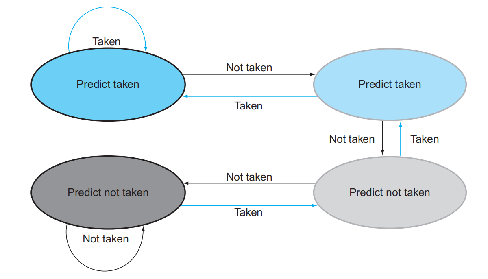

NOTE : 2位预测机制的状态转换图。通过使用2位而不是1位的预测位，在一个分支经常发生跳转或经常不跳转的情况下(大多数分支都是这样的)只会发生一次预测失效。2位预测位在系统中可以被编码为四个状态。2位预测机制是基于计数器的预测器的一个实例，该预测器在分支跳转时加1，在分支不跳转时减1，并且使用表示范围的中位数作为预测分支跳转与不跳转之间的分界点。

---

## Exceptions and Interrupts

### Exceptions

​在目前所讲过的实现中，只存在两种例外类型：**未定义指令**和**硬件故障**。例如，假设在指令 `add x1,x2,x1` 执行时出现硬件故障。当例外发生时，处理器必须执行的基本动作是：在系统例外程序计数器(Supervisor Exception Program Counter,**SEPC**)中保存发生例外的指令地址，同时将控制权转交给操作系统。
​之后，操作系统将做出相应动作，包括为用户程序提供系统服务，硬件故障时执行预先定义好的操作，或者停止当前程序的执行并报告错误。完成例外处理的所有操作后，操作系统使用SEPC寄存器中的内容重启程序的正常执行。可能是继续执行原程序，也可能是终止程序。

​操作系统进行例外处理，除了引发例外的指令外，还必须获得例外发生的原因。目前使用两种方法来通知操作系统。

1. (RISC-V)**系统例外原因寄存器**(Supervisor Exception Cause Register，**SCAUSE**)，该寄存器中记录了例外原因。

   为所有例外提供统一的入口地址，由操作系统解析状态寄存器来确定例外原因。

2. 向量式中断(vectored interrupt)。该方法用基址寄存器加上例外原因(作为偏移)作为目标地址来完成控制流转换。

   每个例外入口需要提供比如32字节或8条指令大小的区域，供操作系统记录例外原因并进行简单处理。

---

## Parallelism via Instructions(了解 maybe)

Pipelining exploits the potential parallelism among instructions. This parallelism is called, naturally enough, **instruction-level parallelism (ILP)**.

两种办法:

1.  increasing the depth of the pipeline to overlap more instructions
2.  launch multiple instructions in every pipeline stage

### Static Multiple Issue

???+ Question "Simple Multiple-Issue Code Scheduling"
    How would this loop be scheduled on a static two-issue pipeline for RISC-V?

    ```assembly
    loop: ld x31, 0(x20) // x31 = array element
    add x31, x31, x21 // add scalar in x21
    sd x31, 0(x20) // store result
    addi x20, x20, -8 // decrement pointer
    blt x22, x20, Loop // compare to loop limits, branch if x20 > x22
    ```

??? note "Answer"
    | | ALU or branch instruction | Data transfer instruction | Clock cycle|
    |:-:|:--:|:--:|:--:|
    | Loop:| | ld x31, 0(x20) | 1 |
    | | addi x20, x20, -8 | | 2 |
    | | add x31, x31, x21 | | 3 |
    | | blt x22, x20, Loop | sd x31, 8(x20) | 4 |

### Dynamic Multiple-Issue

乱序多发顺序执行先都跑了但是写到寄存器里面的时候需要顺序

比如ALU计算结果push到队列里面再去取

---