# chapter 5

## principle of locality

### **Temporal locality** (locality in time)

时间局部性：该原理表明如果某个数据项被访问，那么在不久的将来它可能再次被访问。

### **Spatial locality** (locality in space)

空间局部性：该原理表明如果某个数据项被访问，与它地址相邻的数据项可能很快也将被访问。

---

## **memory hierarchy**

- **块或行**：在相邻两层之间进行信息交换的最小单元
- **命中(hit)**：处理器所需的数据在本层的存储中找到
- **失效(miss)**：处理器所需的数据没有在本层的存储中找到
- **命中率(hit rate或hit ratio)**：在访问本层存储时命中的次数占总次数的比例，通常作为存储层次结构的性能衡量指标之一。
- **失效率(missrate,即1-hit rate)**：在访问本层存储时失效的次数占总次数的比例。
- **命中时间(hit time)**：访问某个存储层次所需的时间，包括判断命中或失效的时间。
- **失效损失(miss penalty)**：将数据块从下层存储复制至某层所需的时间，包括数据块的访问时间、传输时间、写入目标层的时间和将数据块返回给请求者的时间。
- 在大多数系统中，层次化存储是真实存在的。这意味着数据只有先在第`i+1`层出现，才能在第`i`层出现。

---

## Memory Technologies

### static random access memory (SRAM)(易失性)

​	SRAM存储是一种存储阵列结构的简单集成电路，通常有一个读写端口。虽然读写操作的访问时间不同，但对于任意位置的数据，SRAM的访问时间是固定的。
​	SRAM不需要刷新电路，所以访问时间可以和处理器的时钟周期接近。为防止读操作时信息丢失，典型的SRAM每比特采用6个或8个晶体管来实现。在待机模式下，SRAM只需要最小的功率来保持电荷。

### dynamic random access memory (DRAM)(易失性)

​	在SRAM中，只要提供电源，数值会被一直保存。而在DRAM中，使用电容保存电荷的方式来存储数据。采用单个晶体管来访问存储的电荷，或者读取它，或者改写它。DRAM的每个比特仅使用单个晶体管来存储数据。由于DRAM在单个晶体管上存储电荷，因此不能长久保持数据，必须进行周期性的刷新。与SRAM相比，这也是该结构被称为动态的原因。

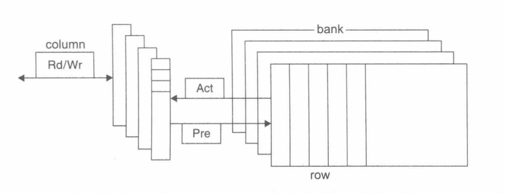

### flash memory(非易失性)

闪存是一种**电可擦除**的可编程只读存储器(Electrically Erasable Programmable Read-onlyMemory,EEPROM)。

与磁盘和DRAM不同，但与其他EEPROM技术相似，闪存的写操作会对器件本身产生磨损。为应对这种限制，大多数闪存产品都包括一个控制器，用来将发生多次写的块重新映射到较少被写的块，从而使得写操作尽量分散。该技术被称为**耗损均衡**(wearleveling)。

### magnetic disk

- 磁道(track)：磁盘表面上千同心圆中的一个。
- 扇区(sector)：磁盘磁道上的一段，扇区是读写磁盘信息的最小单位。
- 柱面(cylinder)：表示某磁头在给定点能够访问到的所有磁道集合。
- 寻道(seek)：将读写头（磁头）定位到磁盘上正确的磁道上方的过程。
- 寻道时间(seek time)：将磁头移动到所需磁道上方的时间。
- 旋转延时：也称为旋转延迟(rotational delay),即磁盘上所需扇区旋转到读写磁头下的时间。通常假设为旋转半周的时间。
- 传输时间(transfer time)：传输数据块(block)的时间。

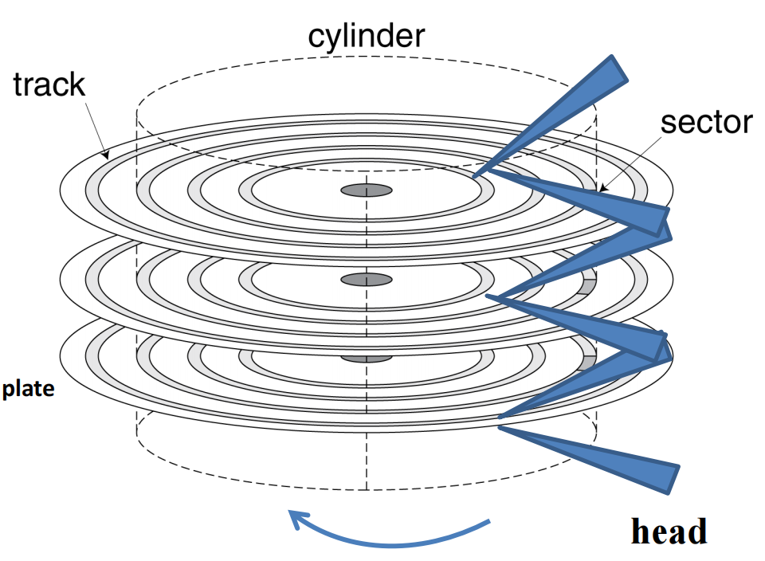

???+ Question
    512B sector, 15,000rpm, 4ms average seek time, 100 MB/s transfer rate, 0.2ms controller overhead, idle disk, what's average read time?

??? note "Answer"
    $4ms+\frac{1}{2} \times [1/\frac{15000}{60}] + \frac{512B}{100MB/s} + 0.2ms = 6.2 ms$

---

## 直接映射( `direct mapped cache` )

直接映射的cache使用下述映射方法来找到对应的数据块

$$(块地址) mod (cache中的数据块数量)$$

$$块地址 = \frac{字节地址}{每块中的字节数}$$

- 标签：存储层次中的表项位，用来记录对应请求字的地址信息，保存了所需要的地址信息，这些信息用来确定所需数据块是否在该存储层次中。
- 找到 `block index` 用于寻址，再进行 `tag` 位和 `valid bit` 位的比较，再给出 `hit` 信号。
   -  `m` 是一个 `block` 多少字
   - `byte offset` 是一个字多少字节
   - `m + byte offset` 也就是 `offset` 代表的是数据在 `block` 中的偏移，可以理解为 `offset` 是以字节为单位的
   - 去掉 `m` 和 `byte offset` 后知道 `block address` 是多少
   - 如果是 `direct mapped cache` 算出 `block index` 再去查表根据 `index` 查找
   - 看 `valid bit` 以及与 `tag` 比较是否是需要寻找的，再给出 `hit` 信号。

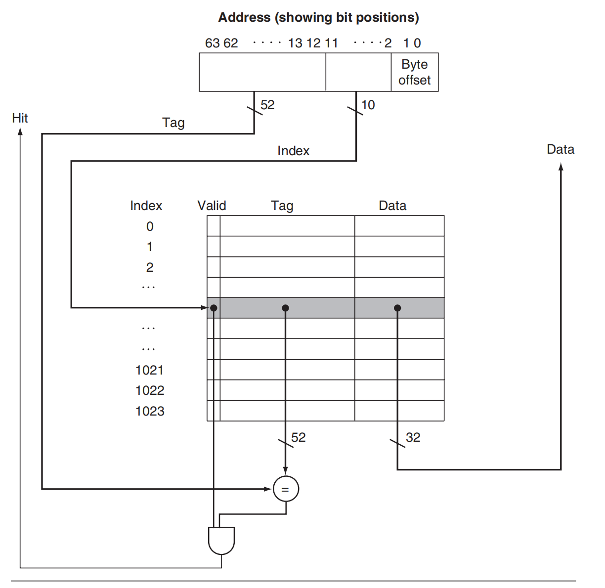

对于一个 64 位操作系统而言，地址是 64 位， `n` 位 `index` 且一个 `word` 为 8 bytes(但是在教材前文定下此处计算时 一个 `word` 算作 4 bytes)，因此可以得到 `tag` 的大小为 (64 - n - m - 2)，那么 `direct mapped cache` 的总容量为:

$$2^{n} \times (2^{m+5} +(64 - n - m - 2) + 1)$$

???+ question
    

??? note answer
    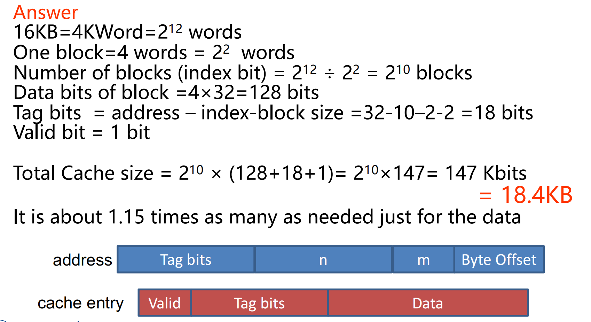

???+ question "那么如果地址变大呢"
    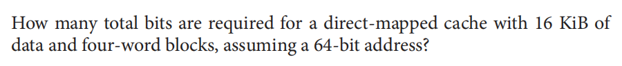

???+ question
    

??? note answer
    每块中的字节数为16，则字节地址1200对应的块地址为 $\frac{1200}{16} = 75$ , 该块地址映射到的 `cache` 块号为 $(75 \text{mod} 64) = 11$
    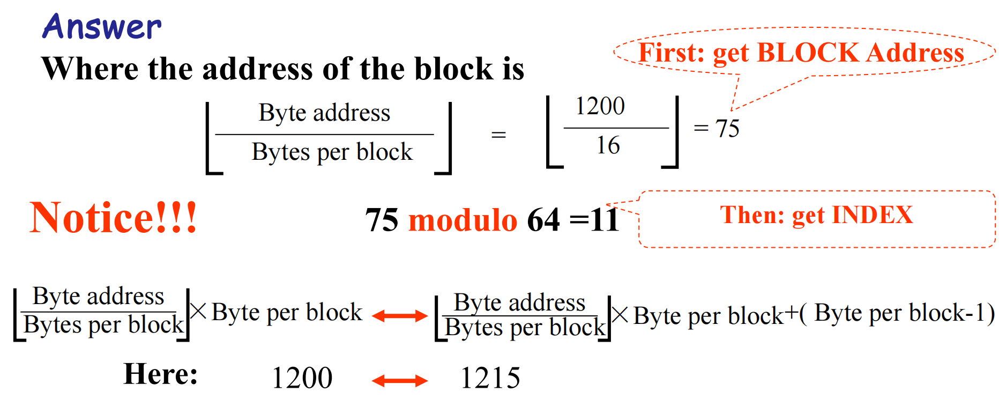

---

容量更大的块可以通过挖掘空间局部性来降低失效率，因为此时更大容量的数据块会降低失效率，减少 `cache` 中与数据存储相关的标签存储，提高 `cache` 的效率。

!!! note
    时间局部性是指被引用过一次的内存位置很可能在不远的将来再被多次引用。
    
    空间局部性是指如果一个内存位置被引用了一次，那么程序很可能在不远的将来引用其附近的一个内存位置。

下图中，随着块大小的增长，失效率通常都在下降。如果单个块大小占 `cache` 容量的比例增加到一定程度，失效率最终会随之上升。这是因为 `cache` 中可存放的块数变少了。最终，某个数据块会在它的大量数据被访问之前就被挤出 `cache` 。另一方面，对于一个较大的数据块，块中各字之间的空间局部性也会随之降低，失效率降低带来的好处也就随之减少。

增大块容量时，另一个更严重的问题是**失效损失**。失效损失是从下一级存储获得数据块并加载到 `cache` 的时间。该时间分为两部分：访问命中的时间和数据的传输时间。很明显，除非我们改变存储系统，否则传输时间(也可以说是失效损失)将随着数据块容量的增大而增大。而且，随着数据块容量的增大，失效率改善带来的收益开始降低。最终的结果是，失效损失增大引起的性能下降超过了失效率降低带来的收益，cache性能当然随之下降。

  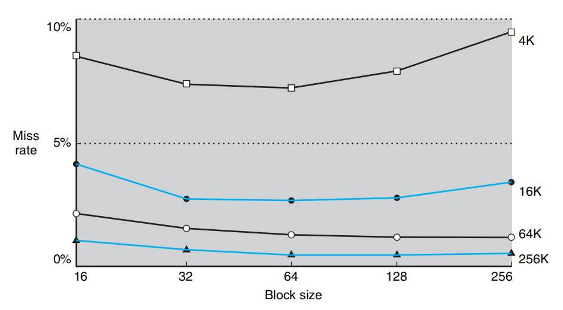

---

## Set associative

**组相联cache** : cache 的一种组织结构，每个数据块在cache中存放的位置数量具有固定值(至少为2)。

包含主存块的组号为 ：

$$(\text{数据块号}) \text{mod} (cache \text{中的组数})$$

由于数据块可以放置在该组内的任意位置，组内所有元素的所有标签都必须被检查。提高相联度的好处是通常可以降低失效率，主要的问题在于可能会增加命中时间。

!!! note
    可以想见的是在考虑 `cache` 的性能时，容量和相联度并不是互相独立的。

---

## cache失效

- **定义**：由于所需数据不在cache中，对cache发出的数据请求不能被响应。

`Stall the CPU, fetch block from memory, deliver to cache, restart CPU read`

1. Send the original PC value (current PC-4) to the memory.
1. Instruct main memory to perform a read and wait for the memory to complete its access.

3. Write the cache entry, putting the data from memory in the data portion of the entry, writing the upper bits of the address (from the ALU) into the tag field, and turning the valid bit on.
3. Restart the instruction execution at the first step, which will refetch the instruction again, this time finding it in the cache.

一旦发生指令cache失效，可以定义如下处理步骤：

1. 将PC的原始值(当前PC-4)发送到内存。
2. 对主存进行读操作，等待主存完成本次访问。
3. 写cache表项，将从内存获得的数据写入到该表项的数据部分，将地址的高位(来自于ALU)写入标签字段，并将有效位置为有效。
4. 重启指令执行。这将会重新取指，本次取指将在指令cache中命中。

---

## Write

### Block Placement

#### Direct mapped

address MOD Number of blocks in cache

很容易建立对应关系，也易于查找，但是因为只有一个 `cache` ，会产生竞争。

#### Fully associate

Block can go anywhere in cache

可以减少竞争，但是查找十分麻烦。

#### Set associate

Block can go in one of a set of places in the cache. Block address MOD Number of sets in the cache. 

If sets have n blocks, the cache is said to be **n-way set** associative.

把可用的打包成一个 `set` 。

!!! note "注意到"
    Direct mapped is the same as 1-way set associative， and fully associative is m-way set associative(for a cache with m blocks).

---

### Block Identification

#### Tag

- Every block has an **address tag** that stores the main memory address of the data stored in the block.
- When checking the cache, the processor will **compare** the requested **memory address to the cache tag** -- if the two are equal, then there is a cache hit and the data is present in the cache

#### Valid bit

- Often, each cache block also has a **valid bit** that tells if the contents of the cache block are valid

---

### Block Replacement

- **Random replacement** **-** *randomly pick any block*
  - 硬件上很容易实现，只需要一个随机数生成器即可
  - 在高速缓存中均匀分配
  - 可能会驱逐即将被访问的区块
- **Least-recently used (LRU)** **-** *pick the block in the set which was least recently accessed*
  - 假设最近被访问的区块有更大的可能再次被引用
  - 需要更多的空间来存储更多的信息
- **First in,first out(FIFO)** - *Choose a block from the set which was first came into the cache*
  - 类似于队列

---

### Write Strategy

- **写回(write-back)**:Write the data into only the data cache
  - 只更新 `cache` 所以速度足够快，之后再写回 `memory`
  - 缺点是 `cause inconsistence` ，因此此时内存和 `cache` 不同
  - 此时不能直接丢弃 `cache` 中的数据了，可能需要先把这个数据写回 `memory`
  - `cache control bits` : both `valid` and `dirty` bits
    - `valid bit` 指示该位置的数据是否是内存读入的，避免该处是初始化内容而对操作带来干扰。
    - `dirty bit` 指示该位置是否被更新过而储存内存中还未被更新。
  - much lower bandwidth : 因为被改写的数据块在替换出 `cache` 时才被写到下一级存储。
- **写穿透/写直达(write-through)**: Write the data into both the memory and the cache
  - 同步更新内存与下游存储器。
  - 缺点是很慢，因为要到下游存储器就会变慢。
  - 总是可以直接丢弃 `cache` 中的数据
  - `cache control bit` : only a valid bit
  - memory (or other processors) always have latest data
  - 此时，读失效不会对写造成影响，因为 `memory hierarchy` is consistent
  - 在硬件上易于实现

!!! Info
    写操作总是同时更新 `cache` 和下一级存储，保证两者之间的数据一致。不过是迟或者早的问题。

---

### Write stall

- **定义**：当 `CPU` 必须等待写入完成时就需要 `stall`

此时可以采取的策略是使用 `write buffer` ，一个保存等待写入主存的数据的队列。

具体来说，数据在写入 `cache` 的同时也写入写缓冲(buffer) 中，之后处理器继续执行。当写入主存的操作完成后，写缓冲中的表项将被释放。

---

### write misses

- **定义**：写失效也即 `CPU` 算完不在 `cache` 中。换句话说也就是要写的 `block` 不在 `cache` 里面。

此时我们拥有两种策略。

1. `Write allocate` (写分配)

   将该数据块从内存取入 `cache` 中，改写该数据块中相应部分的数据。

2. `Write around (no write allocate)`

   在内存中更新相应部分的数据，并不将其取入 `cache` 。

   这一策略的动机是有时候程序需要写整个数据块(例如初始化时)，此时每次失效取入 `cache` 的操作是不必要的。

   其实这是一个非常好的策略，因为就算猜错了(也即其实我下一次确实需要再次用到这个数据)，那么我其实也只需要去取一次就可以了，这个开销并不大。

!!! note
    In general, write-back caches use write-allocate , and  write-through caches use write-around .
    可以想见， write-back 和 write around 并不会组合。前者需要把数据仅写入 `cache` 而后者选择并不把数据写入 `cache` 中。
    
!!! Info "ATTENTION"
    当发生 `Write misses` 时，我们需要 read the entire block into the cache, then write the word 。这是由于CPU只往 `cache` 中写一个字，但是我们要保证整个 `block` 都在 `cache` 里面，也即需要保证 `block` 的完整性。否则 `block` 该数据边上剩下三个位置都是空的。那么下次往内存传时就把内存中该位置对应的数据清空了。
    
    简单来说，就是一个 `write` 只改变一个 `block` 中的一个字，因此需要将 `block` 内数据读过来再只改一个字。

???+ question
    Assume
    
    1 clock cycles to send the address
    
    15 memory bus clock cycles for each DRAM access initiated
    
    1 bus clock cycles to send a word of data
    
    Block size is 4 words
    
    Every word is 4 bytes
    
    请分别计算 With a main memory width of 4，2，1 words 以及 With 4 banks Interleaved Memory 的 `Bandwidth`

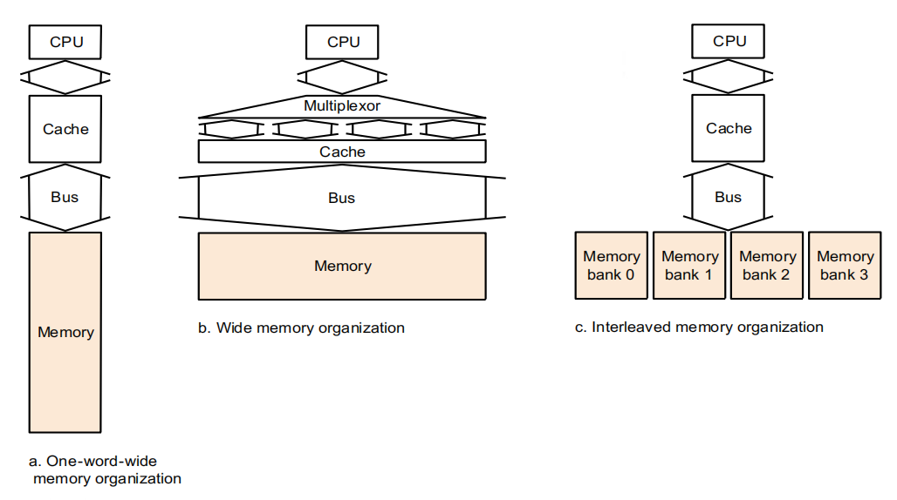

??? note "Answer"
    1. 先找到这个字在内存中的位置并读出对应 `data` ，而 `cache` 和主存中传输的最小单元是 `block` ，此时可以得到：
    
    The miss penalty (The time to transfer one block is):
    
    $$1+4\times (1+15)＝65 CLKs$$
    
    那么一共由四个 `block` ，每个 `block` 是四个 `byte` ，可以得到带宽：
    
    Bandwidth : $\frac{4\times 4}{65} \apppox \frac{1}{4}$
    
    2. With a main memory width of 2 words
     
    The miss penalty
    
    $$1+2\times (15+1) = 33 CLKs$$
    
    Bandwidth : $\frac{4\times 4}{33} = \frac{16}{33} \approx 0.48$
    
    3. With a main memory width of 4 words
    
    The miss penalty
    
    $$1+1\times (15+1) = 17 CLKs$$
    
    Bandwidth : $\frac{4\times 4}{17} = \frac{16}{17} \approx 0.98$
    
    4. With 4 banks Interleaved Memory
    
    The miss penalty
    
    $$1 + 15 + (4\times 1) = 20$$
    
    Bandwidth : $\frac{4\times 4}{20} = 0.8$

---

## cache performance

  在本节中，先从评估和分析cache性能的方法开始，之后介绍两种不同的改善cache性能的技术。第一项技术主要关注通过减少两个不同的内存块争夺同一缓存位置的发生概率来降低失效率。第二项技术是通过添加额外的一个存储层次来减少失效代价。这项技术被称为多级缓存(multilevel caching)。

  $$Average \ Memory \  Assess \ time \ (AMTI) \ = hit \ time \ + \ miss \ time$$

也即：

$$Average \ Memory \  Assess \ time \ (AMTI) \ = hit \ time \ + \ miss \ ratio \times miss \ penalty$$

We use CPU time to measure cache performance.

`CPU` 时间可以被分成 `CPU` 用于执行程序的时间和 `CPU` 用来等待访存的时间。通常假设 `cache` 命中的访问时间只是正常 `CPU` 执行时间的一部分，因此：

$$CPU \ time \ = (CPU \ execution \ clock \ cycles \ + \ Memory-stall \ clock \ cycles) \times Clock \ cycle \ time$$

假设等待存储访问的时钟周期数主要来自于 `cache` 的失效。那么等待存储访问的时钟周期数可以被定义为，读操作带来的停顿周期数加上写操作带来的停顿周期数。

$$Memory-stall \ clock \ cycles \ = \ \# \ of \ instructions \times miss \ ratio \times miss \ penalty$$

$$= \ Read-stall \ cycles \ + \ Write-stall \ cycles$$

For **Read-stall**

$$Read-stall \ cycles = \frac{Read}{Program}(\text{读操作次数}) \times Read \ miss \ rate \times Read \ miss penalty$$

For a **write-through plus write buffer** scheme:

$$Write-stall \ cycles \ = \frac{Write}{Program}(\text{写操作次数}) \times Write \ miss \ rate \times Write \ miss \ penalty \ + \ Write \ buffer \ stalls$$

!!! Info
    由于写缓冲停顿主要依赖于写操作的密集度，而不只是它的频度，不可能给出一个简单的计算此类停顿的等式。幸运的是，如果系统中有一个容量合理的写缓冲(例如，四个或者更多字),同时主存接收写请求的速度能够大于程序的平均写速度，写缓冲引起的停顿将会很少，几乎能够忽略。如果系统不能满足这些要求，那么这个设计可能不合理。设计者要么使用更深的写缓冲，要么使用写返回策略。

    写返回策略也会额外增加停顿，主要来源于当数据块被替换并需要将其写回到主存时。
    
    同时，如果 `cache block size` 是一个字，那么在 `write-through` 下 `write miss penalty is 0` 。写操作直接同时发生在缓存和主存上，不需要额外加载整个块到缓存中。

在大多数写穿透 `cache` 的结构中，读和写的失效代价是相同的(都是将数据块从内存取至cache所花的时间)。假设写缓冲停顿是可以忽略不计的，就可以使用失效率和失效代价来同时刻画读操作和写操作：

$$Memory-stall \ clock \ cycles \ ＝ \ \frac{Memory \ accesses}{Program} \times Miss \ rate \times Miss \ penalty$$

这个公式也可以记作

$$Memory-stall \ clock \ cycles \ ＝ \ \frac{Instructions}{Program} \times \frac{Misses}{Instructions} \times Miss \ penalty$$

!!! note
    由此我们不难发现，对于提高性能来说，目标不只是降低 `miss rate` 而是 `miss` 产生的时间，也即 $miss \ rate \times miss \ penalty$ 。

???+ question
    Assume the miss rate of an instruction cache is 2% and the miss rate of the data cache is 4%. If a processor has a CPI of 2 without any memory stalls, and the miss penalty is 100 cycles for all misses, determine how much faster a processor would run with a perfect cache that never missed. Assume the frequency of all loads and stores is 36%.

??? note "Answer"
    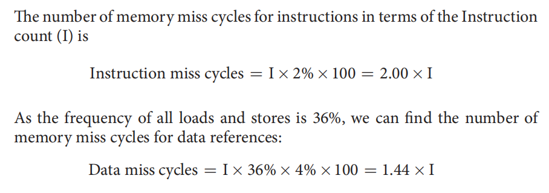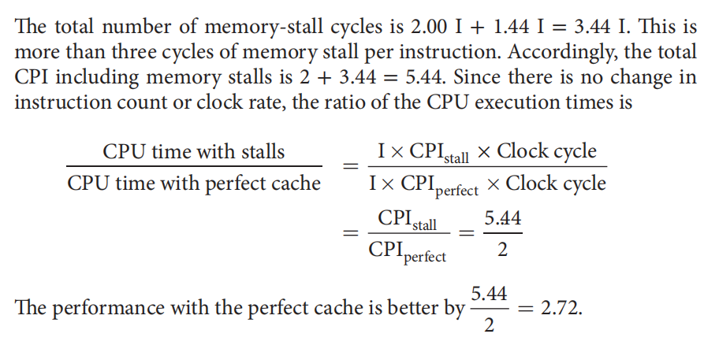

???+ question "FURTHER"
    Suppose we speed-up the computer in the previous example by reducing its CPI from 2 to 1 without changing the clock rate, which might be done with an improved pipeline.

??? note "Answer"
    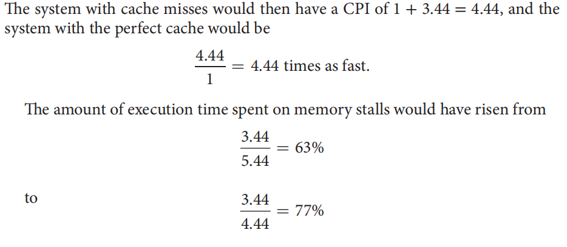

???+ question "FURTHER"
    Suppose we increase the performance of the computer in the previous example by doublingits clock rate for same memory system. How much faster will the computer be with the faster clock to slow clock?

??? note "Answer"
    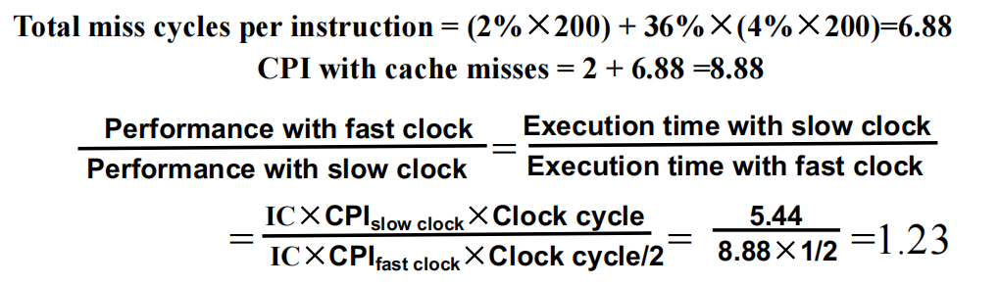
    
    This, the computer with the faster clock is about 1.2 times faster rather than 2 time faster.

之前的例子和等式都假设命中时间不是影响cache性能的重要因素。很清楚，如果命中时间增加，在存储系统中访问一个字所花的时间也在增加。这可能引起处理器时钟周期的增大。例如增大 `cache` 的容量。更大的 `cache` 自然会有更长的访问时间。命中时间的增加可能会为流水线增加一个流水级，这样即使 `cache` 命中也会花费多个时钟周期。计算加深流水线对性能的影响则更为复杂。在某些情况下，对于大容量 `cache` 来说，相比命中率的提升，命中时间的增加反而会更占优势，这将会导致处理器性能的下降。

???+ question
    Assume 

    Cache size is 4K Block 
    
    Block size is 4 words
    
    Physical address is 32bits
    
    Question:Find the total number of set and total number of tag bits for variety associativity?

??? note "Answer"
    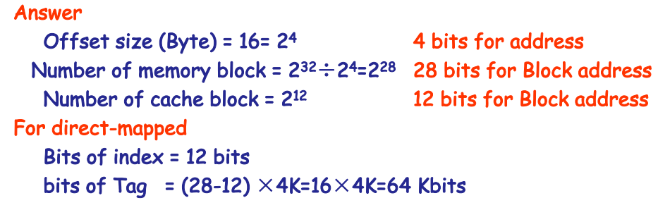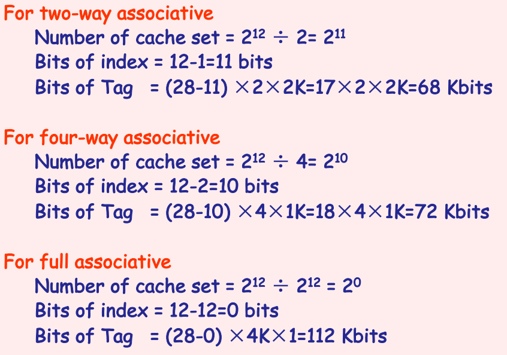

---

### Decreasing miss penalty with multilevel caches

**Add a second level cache:**

我们做32个寄存器而非128个，是因为后者需要多级译码寻址，那么需要时间更长了。我们一方面希望寄存器多，另一方面如果寄存器数量增加后寻址时间会变长。而 cache 本质是为了处理器服务，也即希望一周期 `load` 便能读上来。所以先做一个 `L1` 缓存为了快， `L2` 为了“大”。事实上是 `cache` 和 `DRAM` 之间有一个显着的速度差，希望能兜住使得 `MISS RATE` 足够低此时 `CPU` 会认为内存空间是无限大的，此时可以称为“大”。

???+ question
    CPI of 1.0 on a 5GHz machine with a 2% miss rate, 100ns DRAM access
    
    Adding 2nd level cache with 5ns access time decreases miss rate to 0.5%
    
    The processor with secondary cache is faster by？

??? note "Answer"
    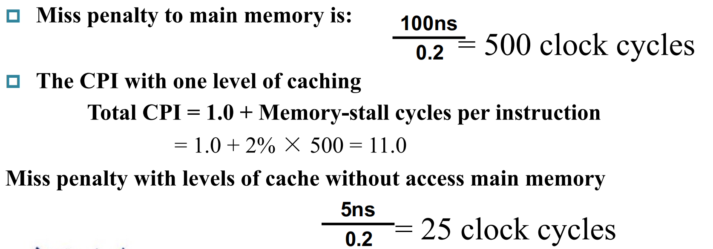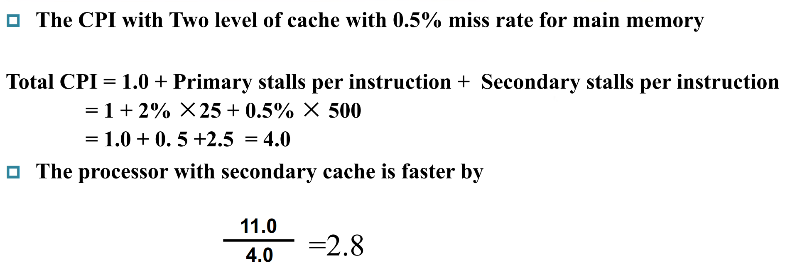

---

## Miss Penalties

无论是 `read` 还是 `write` ，当发生 `miss` 时都需要去 `fetch data` 。这对于 `read` 来说很好理解，不在所以需要读过来。而对于 `write` 来说（在前文也提到过）由于处理器 `access` 的数据的大小和 `block` 不一定匹配，而内存中的数据传递都是以 `block` 的形式。当然了，如果一个 `block` 是一个 `word` ，那么此时对于 `write miss` 来说可以不需要 `fetch` 。

### Read Miss

1. Need to fetch data from memory to cache.
2. 判断 `Write-back Cache & Dirty bit` :
   - 如果 `Yes` ，那么先把此时 `cache` 里的东西写回主存( `Save dirty block first` )，再去 `Fetch Memory (Block)` 。
   - 如果 `No` ，那么可以直接 `Fetch Memory (Block) ` 。

!!! Info "Attention"
    在题目中如果是 `write back` 策略的话，当 `cache` 满了之后就需要先存回去，也就是存在两倍的 `penalty` 。

### Write Miss

1. 如果 `block` 不是一个 `word` ，那么 `need to fetch data from memory to cache`。
2. 判断 `Write Allocate` :
   - 如果 `No` ，也就是说采用的策略是 `Write Around` ，那么的开销是 `write buffer` 未满时直接丢进去； `write buffer` 满时的 `stall` 。
   - 如果 `Yes` ，那么 `Need to  write to cache` ，此时再判断 `Write-back Cache & Dirty?`
     - 如果 `No` ，那么可以直接 `Fetch Memory (Block) ` 。
     - 如果 `Yes` ，那么先把此时 `cache` 里的东西写回主存( `Save dirty block first` )，再去 `Fetch Memory (Block)` 。

### 图片版总结

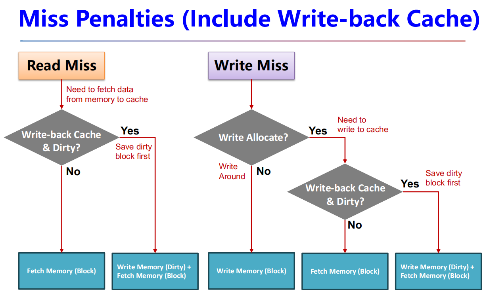

- If the write buffer stalls are small, we can safely ignore them. (No penalty on Write Memory)
- If the cache block size is one word, the write miss penalty is 0. (Except the block is dirty)

---

## Virtual Memory

提出虚拟存储的主要动机有两个：

（1）允许在多个程序之间高效安全地共享内存，例如云计算的多个虚拟机所需的内存。

（2）消除小而受限的主存容量对程序设计造成的影响。

在编译虚拟机时，无法知道哪些虚拟机将与其他虚拟机共享存储。事实上，共享存储的虚拟机在运行时会动态变化。由于这种动态的交互作用，我们希望将每个程序都编译到它自己的地址空间中——只有这个程序能访问的一系列存储位置。虚拟存储实现了将程序地址空间转换为**物理地址**。这种地址转换处理加强了各个程序地址空间之间的**保护**。

---

左边是虚拟地址，右边是实体，上面是内存，下面是磁盘。

灰色是在磁盘中，白色在内存中。而在内存中的最终都会在磁盘中。

这样用映射表来，那么可以得到虚拟地址但很难得到另一个用户的物理地址，因此遭到攻击的可能减小了。

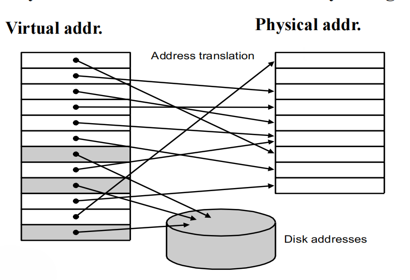

---

### Pages: virtual memory blocks

Page faults: the data is not in memory, retrieve it from disk. 也就相当于 `miss` 。

需要考虑的事情：

1. huge miss penalty, thus pages should be fairly large (e.g., 4KB)

   好处有很多

   - 利用时空局部性，短期内在一个大的 `page` 里可能访问的东西会多。
   - 在磁盘中很多时间会花费在寻址上，那么我们如果有更大的 `page` ，那么找到后这附近的数据都能读到一个较大 `page` 里，希望减少来寻址的次数。

2. reducing page faults is important (LRU is worth the price)

   - 也是利用了时间相关性，最近最少用的再删去，也是为了降低 `page faults` 。

3. can handle the faults in software instead of hardware

   - 因为停一次会停将近一百万个周期，那么我们可以设计各种各样的软件的程序去处理，不需要专门的电路，有足够的时间让软件去做。也就是用操作系统来解决 `page faults` 而不是使用硬件加速。
   - 缺页失效可以由软件处理，因为与磁盘访问时间相比，这样的开销将很小。此外，软件可以用巧妙的算法来选择如何放置页面，只要失效率减少很小一部分就足以弥补算法的开销。

4. using write-through is too expensive so we use write back

   - 往磁盘中写的数据是很大的，设计 `buffer` 也不现实
   -  `write buffer` 的容量会不会写满由两件事决定， 写的数量与 `buffer` 中的数据写一次到磁盘中需要的时间。
   -  写穿透策略对于虚拟存储不合适，因为写入时间过长。相反，虚拟存储系统采用写回策略。

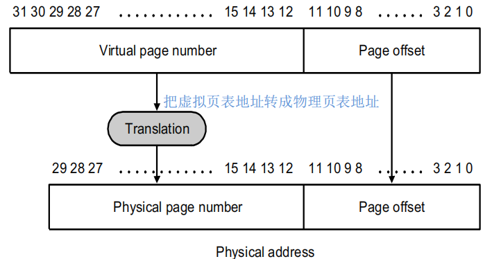

---

### Page Table

由上图也可以看出我们使用的是 `fully associate` 。所以不再遵循简单的取模操作。而是在内存中存放这一映射关系，这就是我们的 `Page Table` 。

**页表 (page table)**：在虚拟存储系统中，保存着虚拟地址和物理地址之间转换关系的表。页表保存在内存中，通常使用虚拟页号来索引，如果这个页在内存中，页表中的对应项包含该页对应的物理页号。

这张表每一行的地址是虚拟地址直接寻址，行里面存的就是物理页表地址，以及是否在主存里(类似于 `valid bit` )。

可以看到其实我们访问了两次内存，当然这一过程可以使用 `cache` 来加速。

`page table register` 当中存放的是不同进程页表的起始地址，指向页表第一行。取虚拟页表地址来寻址找到特定的页表的行，再与 `page offset` 拼一下就可以得到物理地址 。

---

### Page fault

When the OS creates a process, it usually creates the space on disk for all the pages of a process.

- When a page fault occurs, the OS will be given control through exception mechanism.
- The OS will find the page in the disk by the page table.
- Next, the OS will bring the requested page into main memory. If all the pages in main memory are in use, the OS will use LRU strategy to choose a page to replace.

???+ Question
    How larger page table?

    Assume: 
    
    - Virtual address is 32 bits
    
    - page size is 4KB
    
    - Entry size is 4 Bytes

??? note "Answer"
    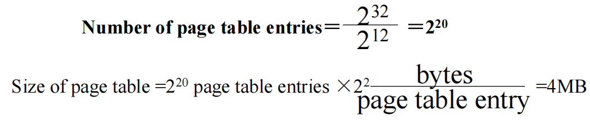

---

### TLB

The TLB (Translation-lookaside Buffer) acts as Cache on the page table.

给页表一个 `cache` ，那么不直接在内存的页表中查而是用 `cache` 来读，就可以提速。

这个 `cache` 中的 `ref` 是定期打一个时间戳，每隔一段时间清零时间戳，一段时间后新进来的 `ref` 是1，旧的 `ref` 为0。

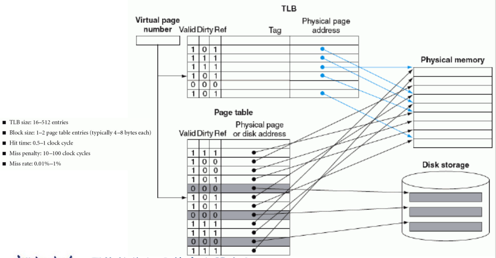

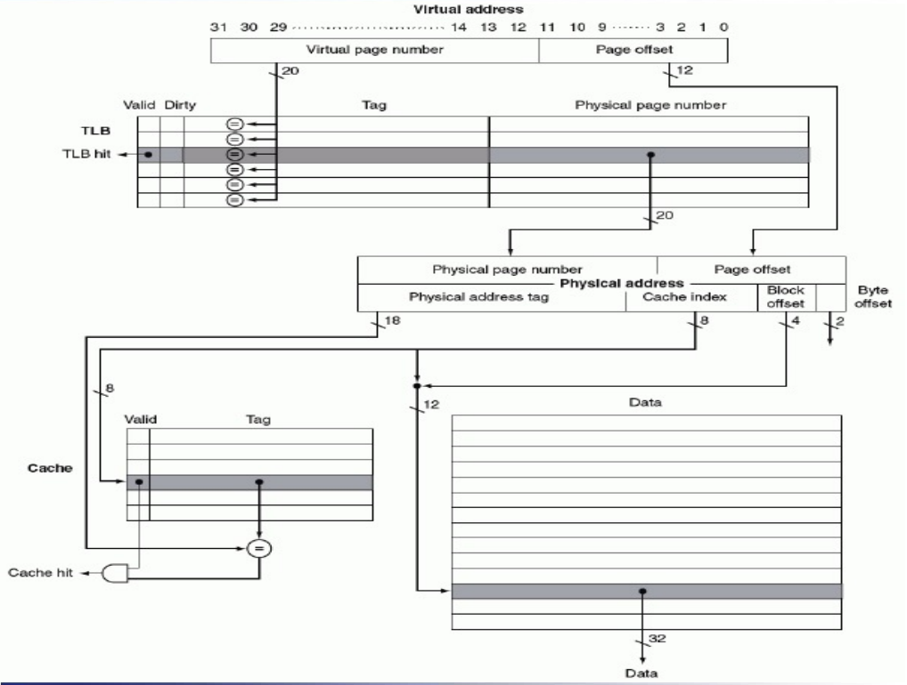

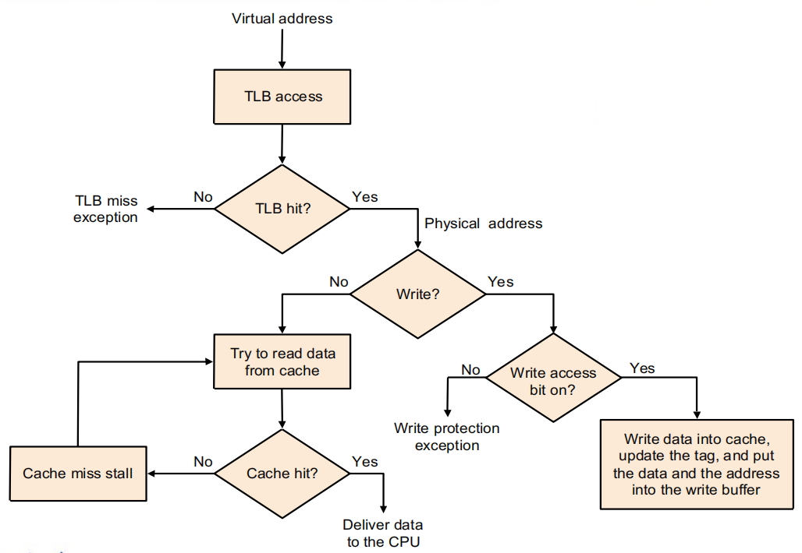

**TLB失效**：

1. 页在内存中，只需创建缺少的TLB表项。

2. 页不在内存中，需要将控制转移给操作系统来处理缺页失效。

处理TLB失效或缺页失效需要使用例外机制来中断活跃进程，将控制转移到操作系统，然后再恢复执行被中断的进程。缺页将在主存访问时钟周期的某一时刻被发现。为了在缺页失效处理结束后重启指令，必须保存导致缺页失效的指令的程序计数器。管理态例外程序计数器(SEPC)用于保存该值。

此外，TLB失效或缺页失效例外必须在访存发生的**同一个时钟周期的末尾**被判定，这样下一个时钟周期将开始进行例外处理而不是继续正常的指令执行。如果在此时钟周期内未识别出缺页失效，一条 `load` 指令可能会改写寄存器，而当我们尝试重新启动指令时，这可能是灾难性的错误。例如，考虑指令 `lb x10,0(x10)` : 计算机必须防止写流水线阶段的发生；否则，就无法正确重启指令，因为 `x10` 的内容会被破坏。store指令也有类似的复杂情况。当发生缺页失效时，我们必须阻止写内存的操作的完成，这通常是通过令到内存的写控制线为无效来完成的。

一旦操作系统知道引起缺页失效的虚拟地址，它必须完成以下三个步骤：

1. 使用虚拟地址找到对应的页表表项，并在辅助存储中找到引用页的位置。
2. 选择要替换的物理页；如果所选页是脏的，则必须先将其写入辅助内存，然后才能将新的虚拟页写到此物理页中。
3. 启动读操作，将被访问的页从磁盘上取回到所选择的物理页的位置上。

数据访问引起的缺页失效例外很难处理，是由于以下三个特征：

1. 它们发生在指令的中间，与指令缺页失效不同。
2. 在例外处理结束之前无法完成指令。
3. 例外处理结束后，指令必须重新启动，就像什么都没发生过一样。

---

### Possible combinations of Event

- `TLB hit` 代表数据在内存里
- 如果 `TLB` hit 那么 `page table` 里面也会 hit ，而 `TLB` miss ，`page table` 也是可以 hit的
- 但是是否在 `cache` 里面却是不一定的

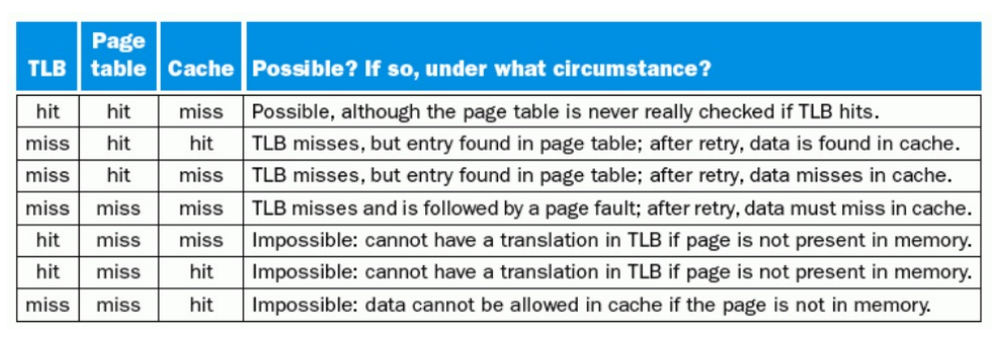

---