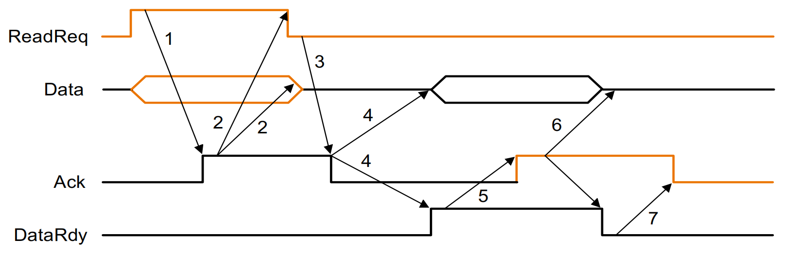

# Chapter 6

I/O 需要有可扩展性（种类、交互的数据量、频率），可靠性。

如何评估 `I/O system performance` 是很困难的。

---

## Typical collection of I/O device

- 磁盘不是内存，是外设。
- 显示器，键盘鼠标等外设。
- 网络。

---

## Three characters of I/O

- **Behavior**

  - 输入设备或输出设备

    输入是只读，输出是只写不读，存储是可以被重复读重复写。

- **Partner**

  - 可以和人打交道（键盘鼠标），也可以和机器（例如网络）。

- **Data rate**

  - 数据在 `I/O` 设备与主存或存储器之间传输的峰值速度。

  - 数据量在不同的 `I/O` 设备里差别也很大。

**I/O Performance Depends on the Application**

- **Throughput**

  我们如何评测I/O性能常常取决于具体应用。在某些环境下，我们注重系统的吞吐量。在这种情况下，`I/O` 带宽将是最重要的。但即便是 `I/O` 带宽又有两种不同的方法来测量：

  1. 在某一时间内我们能从系统中传出多少数据?

  2. 在每个单位时间内我们能够做多少I/O操作?

  最好的性能测量方法的确定取决于实际的工作环境。

- **Response time** 

  - 完成特定任务总共需要的时间

  - 例如使用鼠标时注重考虑

- **both throughput and response time**

---

## The Organization of Hard Disk

- **柱面(cylinder)**：在所有盘面的某一给定位置下，所有读/写头下面的轨道所形成的柱面。为了读/写信息，读/写头必须被移动到正确的位置上。读写每张表面的磁头都被连在一起并且一起移动，因此每个头处在相应表面的相同的轨道上。
- **轨道(track)**：共同组成磁盘的表面的上千个同心圆中的一个。
- **扇区(sector)**：组成磁盘轨道的多个段中的一个;扇区是磁盘读写信息的最小单位。

---

为了存取数据，操作系统必须通过一个三步过程来指引磁盘。

1. **寻道**：把磁头定位到正确的磁道上。磁头找到正确磁道花费的时间为**寻道时间** (seek time) 。

2. **旋转时延/旋转延迟**：磁头到达正确磁道后，需要等待正确的扇区转到读写头下所花费的时间。取得所需要信息的平均时延是磁盘旋转半周所需要的时间。

3. **传输时间**：传输一块（一般是一个扇区）数据位所需要的时间。传输时间是扇区大小、旋转速度和磁道记录密度的函数。

4. **控制器时间(controller time)**：磁盘控制器(disk controller)通常用来精细地控制磁盘以及磁盘与内存之间的数据传输，它是在进行I/0存取操作时控制器带来的开销。

执行 `I/O` 操作的平均时间将由这四段时间组成，此外还有因其他程序使用磁盘而带来的等待时间。

---

## Dependability, Reliability, Availability

### 可依赖性

计算机系统的可依赖性指所提供的服务质量达到有理由给予信任的水平。系统提供的服务是指其他系统与本系统用户交互时观察到的本系统的实际行为。每一个模块均有指定的理想行为，其中服务说明应是对期望行为广泛认同的描述。当实际行为偏离指定行为时，系统发生错误。

能够看到系统在说明书所述的如下两种服务状态之间变化：

1. **服务实现(Service accomplishment)**：这里服务按照预定方式提供。

2. **服务中断(Service interruption)**：这里提供的服务不同于预定服务。

状态1至状态2的转换是由故障引起的，而状态2至状态1的转换被称为恢复(restorations)。故障可以是永久或间歇的。后者是更难分析的情况，因为此时系统在两种状态之间抖动；相比较而言，永久故障的分析要容易得多。

### 可靠性

**连续服务时间的度量**——或者从参考点至出现故障所需时间的量度。

**MTTF**（磁盘平均故障时间）

**MTTR**（服务中断用修理的平均时间）

**MTBF**（故障间的平均时间） = MTTF  + MTTR

### 可用性

服务实现的量度。

$$\text{可用性} = \frac{MTTF}{MTTF + MTTR}$$

### 三种改进MTTF 的方法

!!! tip ""
    人的操作是错误的主要来源。

1. **错误避免**(fault avoidance):通过构建技术防止错误的发生。

2. **错误承受**(fault tolerance):利用冗余技术允许服务在错误发生时仍能照常工作，这里错误主要指硬件错误。

3. **错误预测**(fault forecasting):预测错误的存在与产生，包括硬件错误和软件错误。

缩短MTTR可以和增大MTTF一样提高可用性。比如，用于错误探测、诊断和修复的工具有助于减少人、软件和硬件修复错误的时间。

---

## RAID

利用冗余来增加磁盘存储的可用性，这一技术被用于廉价磁盘冗余阵列。

Files are "striped" across multiple disks. Redundancy yields high data availability. Disks will still fail. Contents reconstructed from data redundantly stored in the array.

---

### RAID 0: No Redundancy

仅仅把数据分散到多个磁盘，称为条带化，自动把访问分到几个磁盘上。在一组磁盘上进行条带化使得这一组磁盘对于软件来说是一个大磁盘，从而简化了存储管理。这样对大规模访问来说也改进了性能，因为多个磁盘可以同时操作。

`RAID0` 说法有些不妥，因为根本没有冗余。然而，RAID的级别通常由操作员在创建存储系统时设置，而RAID0经常被列为其中一个选项。因此，RAIDO的说法就被广泛使用了。

---

### RAID 1: Disk Mirroring/Shadowing

使用比RAID0多一倍的磁盘数。数据写入某个盘时，同样的数据会写入其冗余盘，因此始终存在信息的两份副本。如果一个磁盘出现故障，系统就转向其“镜像”读取内容以获得所需信息。镜像是最昂贵的RAID方案，因为它需要最多的磁盘。

---

### RAID 2

RAID2借用了主存常用的错误检查和恢复技术。RAID2已经不再使用了，因此我们这里不做介绍。

---

### RAID 3: Bit-Interleaved Parity Disk

增加可用性的开销可以减至 $\frac{1}{N}$ ,这里N为保护组内磁盘的数目。

我们不再为每块磁盘做一个原始数据的完全拷贝，而只需要加入足够的冗余信息以便在出错的时候恢复丢失的信息。读写操作在组内所有磁盘上进行，一个额外的磁盘存有校验信息以防错误的发生。例如使用奇偶校验(parity)策略来实现。

与RAID1不同，RAID 3必须读很多磁盘才能确定丢失的数据。该技术背后的假定就是用更长时间来恢复错误但使用更少的冗余存储是一种好的权衡。

---

### RAID 4: Block-Interleaved Parity

`RAID4` 使用同 `RAID3` 一样的数据磁盘和校验盘的比率，但访问数据的方式不同。奇偶校验码以块为单位存储，与一组数据块相关。

在RAID3中，每一次访问都用到所有磁盘。然而某些应用偏重于较小的数据访问，允许并行地发生多个独立访问。

这就是RAID 4~6级的目的。由于读操作时需要检查每个扇区的错误检测信息来判断数据正确与否，只要最小访问数据量仍为一个扇区，各磁盘上这些“小数据量的读操作”就可以独立地进行。在RAID环境中，小数据量访问在保护组中的一个磁盘中发生，而大数据量访问需要用到保护组中的所有磁盘。

写操作是另一个麻烦。看上去似乎每一次小数据量的写操作都需要访问其他磁盘来读取重新计算新的奇偶校验所需的其他信息。一次“小数据量的写操作”,需要读取旧数据和奇偶校验，添加新信息，接着把新的奇偶校验和写入校验盘，把新的数据写入数据盘。

而在进行写操作时，由于 `RAID 4` 是一个整个的校验盘, 在 `small read` 的情况下速度会变快，因为可以同时读。 `large write` 也高效。 而 `large read` 要排队，对于 `small write` 会要求实时算出 `p` 的值。因为都要写校验盘就又要排队而又要同一行全读才能写校验盘。

减小开销的关键在于校验码不过是信息的一个总和；通过观察写入新信息后哪些位发生了变化，就只需改变校验盘上的对应位信息即可。我们必须从要写的磁盘读取旧数据，用旧数据与新数据比较，看哪些位发生了变化。读旧奇偶校验和，改变对应的位，然后写入新数据以及新的校验和。这样，一次小数据量的写操作包含对两个磁盘的4次访问，而不是访问所有的磁盘。

---

### RAID 5: High I/O Rate Interleaved Parity

在RAID 5中数据块的每行的校验信息不再限定于单个磁盘。这种组织方式使得多个写操作可以同时发生，只要校验块不在相同的磁盘上。

---

### RAID 6: P+Q Redundancy

基于奇偶校验的机制可使系统免受单个可自动识别的错误的破坏。当单个错误纠正机制不足以保护系统时，可利用奇偶校验对数据和另一个校验盘的信息进行二次计算。二次校验块机制可使系统从二次错误中恢复过来。因此，它的存储开销是RAID 5的两倍。

小数据写操作捷径还成立，只是现在要访问6个盘(而不是4个盘)以更新P和Q信息。

---

## Buses

在计算机系统中，不同的子系统必须具有连接彼此的接口。比如，内存和处理器需要通信，处理器和I/O设备也需要通信。多年以来，这些工作都是由总线来完成的。总线是一条共享的通信链路，它用一套线路来连接多个子系统。总线结构的两个主要优点是功能多和成本低。通过定义一种连接方案，就能够方便地添加新设备，外围设备也可以在使用同类总线的计算机系统之间移动。而且，因为同一套线路被多个路径共享，所以总线具有较好的成本效益。

总线的主要缺点是它会产生通信瓶颈，这可能会限制 `I/O` 的最大吞吐量。当 `I/O` 数据传输必须通过单个总线的时候，这条总线的带宽就会限制 `I/O` 的最大吞吐量。

总线设计非常困难，其中的一个原因是最高总线速度在很大程度上被如下物理因素所限制：总线长度、设备数量。这种物理上的限制使我们不能任意快地运行总线。另外，要支持一系列延迟和数据传输率各不相同的设备也使得总线设计极富挑战性。

---

### Bus Basics

A bus contains two **types of lines**

  - Control lines: signal requests and acknowledgments, and to indicate what types of information is on the data lines.

  控制线路用来传输请求和确认信号，并指出数据线上的信息类型。

  - Data lines: carry information (e.g., data, addresses, and complex commands) between the source and the destination.

  总线的数据线在源和目的之间传递信息。这种信息可能包括数据、复杂指令或者地址。

一个典型的总线事务包括两个部分：发送地址和接收/发送数据。

**Two operations**

- input: receiving data from the device to memory

输入设备是外设到**内存**，去内存的，不是去CPU的。

- output: sending data to a device from memory

输出设备是内存去外设

总线可分为 处理器-内存总线 和 `I/O` 总线。

处理器-内存总线长度短，速度通常很高，而且配合内存系统使内存-处理器的带宽达到最大。

`I/O` 总线它可以很长，可以连接很多类型的设备，且经常要连接多种具有不同数据带宽的设备。 `I/O` 总线一般不和内存直接连接而是通过处理器-内存总线或背板总线连接到内存上。

---

总线通信的两种基本方式是同步和异步。

如果总线是同步的，控制线上就有一个时钟以及一个与该时钟相关的固定的通信协议。例如，为了使处理器-内存总线执行一个从内存读的操作，我们需要一个协议能够在第一个时钟周期传输地址和读操作命令，并使用控制线来指明请求的类型。内存可能被要求在第五个时钟周期做出响应，提供数据字。这种协议在小型有限状态机上很容易实现。由于这种协议是预先确定的，涉及的逻辑控制很少，所以总线可以运行得很快且接口上的逻辑电路也会很小。

然而同步总线有两个主要的缺点。第一，总线上的每一设备都必须运行在同一个时钟频率下。第二，由于时钟偏差问题，速度很快的同步总线，长度不能太大。处理器-内存总线通常是同步的，这是因为设备间通信的距离短、数量少，而且准备在快的时钟频率上操作。

异步总线不需要时钟。正因为它不需要时钟，所以异步总线可以适应很多不同的设备，异步总线可以延长而不用担心时钟偏差或其他同步问题。为了协调发送者和接收者之间的数据传输，异步总线采用握手协议。握手协议由一系列步骤组成，只有当发送者和接收者达成一致时，才能进行下一步。这种协议通过一套附加的控制线路来实现。

一个简单的例子会说明异步总线是如何工作的。考虑设备从内存系统请求数据字的情况。假定有三条控制线：

1. **读请求**(ReadReq):用来向内存发出一个读请求。并同时把地址放到数据线上。

2. **数据就绪**(DataRdy):用来指明数据字已经在数据线上就绪。在输出事务中，内存将发出这个信号，因为它是数据提供者。在输入事务中，由 `I/O` 设备提供数据，所以将由 `I/O` 设备来发出这个信号。在这两种情况中，数据都会同时放在数据线上。

3. **应答**(Ack):用来应答另一方的读请求和数据就绪信号。

在异步协议中，读请求和数据就绪的控制信号将一直维持，直到另一通信方(内存或设备)指明控制线已访问且数据线已读取；这种指示由应答线发出信号来完成。以上全过程称为握手(handshaking)。

1.  When memory sees the ReadReq line, it reads the address from the data bus, begin the memory read operation，then raises Ack to tell the device that the ReadReq signal has been seen.

2. I/O device sees the Ack line high and releases the ReadReq data lines.

3. Memory sees that ReadReq is low and drops the Ack line.

4. When the memory has the data ready, it places the data on the data lines and raises DataRdy.

5. The I/O device sees DataRdy, reads the data from the bus , and signals that it has the data by raising ACK. 

6. The memory sees Ack signals, drops DataRdy, and releases the data lines.

7. Finally, the I/O device, seeing DataRdy go low, drops the ACK line, which indicates that the transmission is completed.

!!! Tip "ATTENTION"
    1 表示信号传过来有延迟所以是斜的。
    
    4 这部分在取数据其实在 `ack` 变成 1 时就开始取了,代表的是取数据的延迟。而若取数据的时间很短，那么可能会没有 4 这部分。
    
    6和7把总线释放出来

---

## Bus Arbitration

没有控制很多设备访问就会有冲突。

So, a bus master is needed. Bus masters initiate and control all bus requests.

Deciding which bus master gets to use the bus next. In a bus arbitration scheme, a device wanting to use the bus signals a bus request and is later granted the bus.

I/O的拓扑结构也会影响总线仲裁的公平性。因此我们会考虑总线的连接。

Four bus arbitration schemes:

- daisy chain arbitration (not very fair)
- centralized, parallel arbitration (requires an arbiter)
- self selection
- collision detection

Two factors in choosing which device to grant the bus:

- bus priority 设备自身的优先级
- fairness 公平性(避免物理连接上造成的不公平而影响性能)

---

## Increasing the Bus Bandwidth

- Increasing data bus width
- Use separate address and data lines
- Transfer multiple words

---

## Interfacing I/O Devices

Three characteristics of I/O systems

- shared by multiple programs using the processor. 
  由使用该处理器的多个程序共享
- often use interrupts to communicate information about I/O operations. 
  通常使用中断来通信有关I/O操作的信息
- The low-level control of an I/O devices is complex. 
  输入/输出设备的低级控制是复杂的

Three types of communication are required:

- The OS must be able to give commands to the I/O devices. 
  该操作系统必须能够向I/O设备发出命令
- The device must be able to notify the OS, when I/O device completed an operation or has encountered an error. 
  当I/O设备完成操作或遇到错误时，该设备必须能够通知操作系统
- Data must be transferred between memory and an I/O device
  数据必须在内存和I/O设备之间传输

---

## Communication with the Processor

- Polling: The processor periodically checks status bit to see if it is time for the next I/O operation. 

- Interrupt: When an I/O device wants to notify processor that it has completed some operation or needs attentions, it causes processor to be 
interrupted.

- DMA (direct memory access): the device controller transfer data directly to or from memory without involving processor.

直接从内存传数据内存和磁盘之间的通讯方式是一个特别的技术，但是发起这个方式也需要中断。剩下的事是 DMA 做，不用DMA就是都是处理器来控制。

The processor sets up the DMA by supplying some information, including the identity of the device, the operation, the memory address that is the source or destination of the data to be transferred, and the number of bytes to transfer. 

The DMA starts the operation on the device and arbitrates for the bus. If the request requires more than one transfer on the bus, the DMA unit generates the next memory address and initiates the next transfer.

Once the DMA transfer is complete, the controller interrupts the  processor, which then examines whether errors occur.

---

### Compare

The disadvantage of polling is that it wastes a lot of processor time. When the CPU polls the I/O devices periodically, the I/O devices maybe have no request or have not get ready.

If the I/O operations is interrupt driven, the OS can work on other tasks while data is being read from or written to the device.

Because DMA doesn’t need the control of processor, it will not consume much of processor time.

!!! info
    此处例题建议浏览一遍 PPT 。~~（听说考试也不大考。）~~ 

---