# Chapter 10 | Liveness Analysis

## 为什么需要活跃变量分析？

* **中间代码（IR）的特点**：在中间表示阶段，我们可以使用无限数量的临时变量（Temporaries），如 $t1, t2, \dots, t910$。
* **真实机器的局限**：物理 CPU 的寄存器数量是有限的（如 RISC-V 只有 32 个通用寄存器）。
* **核心问题**：如何将无限的临时变量映射到有限的寄存器上？如果不做处理，多出来的变量只能存放在内存（Stack）中，这会极大地降低程序运行速度。

---

### 基本概念

什么是“活跃（Live）”。

* **寄存器复用**：如果两个变量 $a$ 和 $b$ 永远不会在同一时间被“使用”，那么它们就可以共享同一个寄存器。
* **活跃的定义**：一个变量在某一点是活跃（Live）的，当且仅当它保存的值在未来可能会被读取。
* **目标**：通过活跃变量分析，找出每个变量的活跃区间，从而决定哪些变量可以“挤一挤”用同一个寄存器。

---

### 如何进行分析？

这一页介绍了分析的逻辑框架。

**两个核心问题**：

1. 哪些语句会在当前语句 $n$ 之后执行？（需要构建**控制流图 CFG**）
2. 这些后续语句会用到变量 $x$ 吗？（需要分析语句的**语义**）

* **逆向分析（Backward Analysis）**：这是活跃分析的关键特点。我们从程序的“未来”（Exit）向“过去”（Entry）反向推导。因为只有知道了未来谁要用这个值，才能确定现在它活不活着。

---

### 构建控制流图

在实际分析前，必须把代码转换成图结构。

* **节点（Node）**：每一条语句或基本块。
* **边（Edge）**：表示执行顺序。例如，如果有 `goto L1` 或 `if` 跳转，就会产生分支和循环边。
* 图示展示了一个包含循环的简单程序如何转换成带有 6 个节点的 CFG。

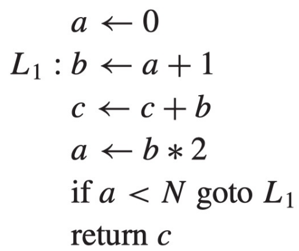

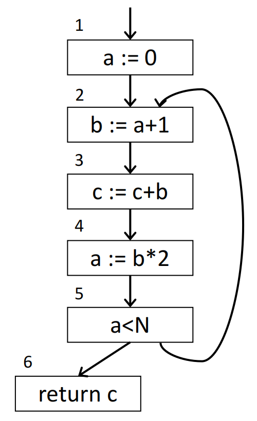

---

#### 变量 b 的活跃性示例

观察变量 `b`。

* **观察点**：在语句 4 (`a := b * 2`) 中，变量 `b` 被读取了。
* **推导**：这意味着在语句 4 之前，`b` 必须是活跃的。
* 图中蓝线标出了 `b` 的活跃路径：它在语句 2 被定义（写入），在语句 3 和 4 被使用。在这些点之间，`b` 必须占据一个寄存器。

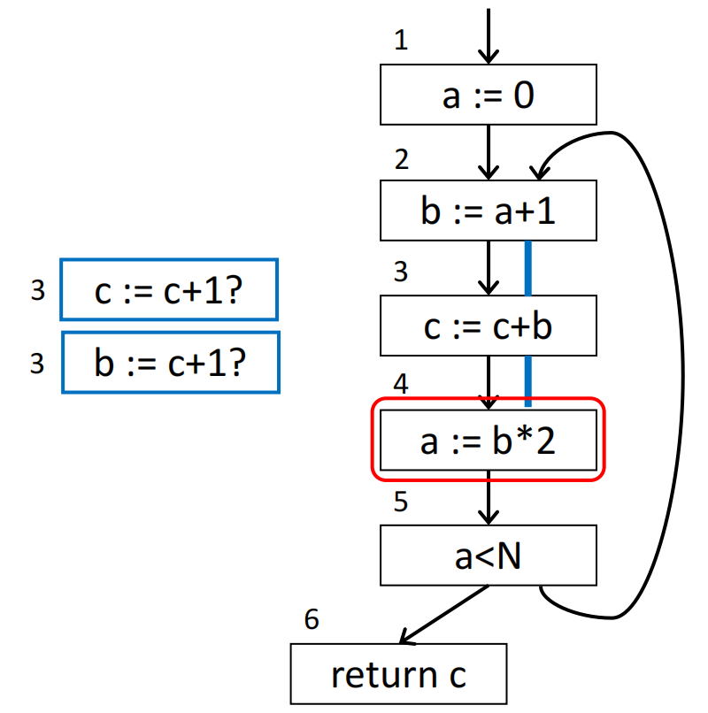

---

#### 变量 a 的活跃性示例

接下来观察变量 `a`。

* **复杂性**：`a` 在语句 5 (`a < N`) 被使用，也在语句 2 (`b := a + 1`) 被使用。
* **分析**：因为存在循环（5 到 2 的回边），`a` 的活跃区间会跨越这个循环。图中用粗蓝线标出了 `a` 活跃的范围。注意，在语句 4 `a := b * 2` 之后，旧的 `a` 死掉了，新的 `a` 诞生了。

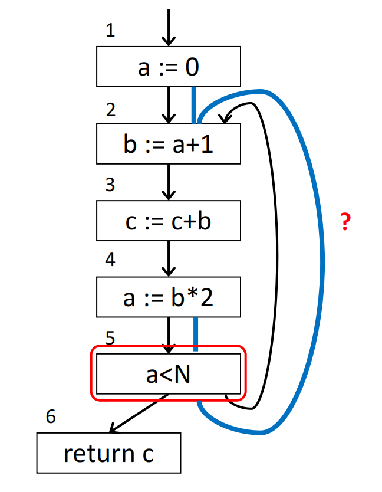

---

#### 变量 c 的活跃性示例

观察变量 `c`。

* **特殊性**：`c` 是程序的返回值（语句 6 `return c`）。
* **结果**：这意味着 `c` 在整个程序的执行路径中几乎都是活跃的。
* **未定义变量风险**：如果 `c` 在第一条语句之前就已经是活跃的（即程序一进来就假设它有值），说明它可能是一个**函数参数**或者是**未定义的非法变量**。

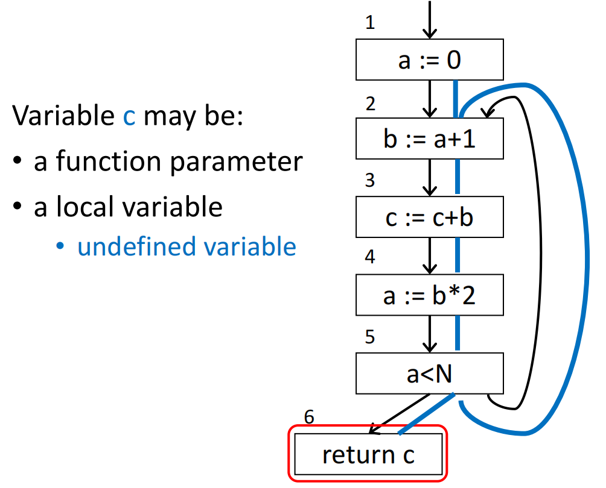

---

#### 总结与寄存器分配

观察发现，在程序的某些点，$a$ 活跃而 $b$ 不活跃；在另一些点，$b$ 活跃而 $a$ 不活跃。**如果它们两者的活跃路径完全不重叠**，它们就可以存放在**同一个物理寄存器**中。

这大大减少了程序对寄存器的总需求量。

---

## 流图术语（Flow Graph Terminology）

### 基本定义

介绍流图的核心术语，它是活跃变量分析这种数据流问题（dataflow problem）的基础。

* **流的概念**：变量的活跃性沿着控制流图（CFG）的边进行“流动”。
* **出边（out-edges）**：从当前节点指向其后继节点（successor nodes）的边。
* **入边（in-edges）**：从前驱节点（predecessor nodes）指向当前节点的边。
* **pred[n]**：节点 $n$ 的所有前驱节点的集合。
* **succ[n]**：节点 $n$ 的所有后继节点的集合。

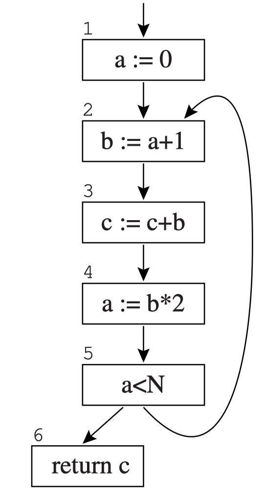

* **观察节点 5**：节点 5 是一个条件判断语句 `a < N`。

**分析路径**：

* 一条边向下指向节点 6 (`return c`)，表示条件为假时的流向。
* 另一条边向上绕回节点 2 (`b := a + 1`)，表示循环的跳转。

节点 5 的出边是 **$5 \rightarrow 6$** 和 **$5 \rightarrow 2$**。

在确定了出边之后，我们可以轻松定义后继集合。

* **后继节点定义**：通过出边直接到达的节点。
* **结论**：节点 5 的后继集合 **succ[5] = {2, 6}**。
* 注意：在集合表示法中，通常按节点编号顺序排列，所以写成 {2, 6}。

现在我们将视角切换到入边分析，观察节点 2。

* **观察节点 2**：节点 2 是赋值语句 `b := a + 1`。

**分析来源**：

* 从上方的节点 1 指向节点 2。
* 从下方的节点 5 绕回并指向节点 2。

节点 2 的入边是 **$1 \rightarrow 2$** 和 **$5 \rightarrow 2$**。

最后一步是确定节点 2 的所有前驱。

* **前驱节点定义**：通过入边直接指向当前节点的节点。
* **结论**：节点 2 的前驱集合 **pred[2] = {1, 5}**。

---

## Uses and Defs

### 定义与使用的基本概念

* **定义（Def）**：当一个变量出现在赋值号的**左侧**时，我们说该语句“定义”了这个变量。例如 `a := 0` 定义了 `a`。
* **使用（Use）**：当一个变量出现在赋值号的**右侧**或出现在表达式中时，我们说该语句“使用”了该变量。例如 `b := a + 1` 使用了 `a`。

**集合的视角**：

* **变量的 def**：定义该变量的所有图节点的集合。
* **节点的 def**：该节点所定义的所有变量的集合。
* **use** 的定义以此类推。

通过节点 3来展示如何确定节点的定义集合。

* **观察节点 3**：语句为 `c := c + b`。
* **寻找赋值左侧**：赋值号左边是变量 `c`。
* **结论**：因此，**def(3) = {c}**。这表示节点 3 产生了一个新值并存入了变量 `c`。

观察整个控制流图中变量 `a` 在哪里被定义。

* **扫描所有节点**：
* 节点 1：`a := 0`（左侧有 `a`）
* 节点 4：`a := b * 2`（左侧有 `a`）
* **结论**：变量 `a` 在节点 1 和节点 4 被定义。因此，**def(a) = {1, 4}**。

回到节点 3，这次我们看它“读取”了哪些变量。

* **观察节点 3**：语句为 `c := c + b`。
* **寻找表达式内部/右侧**：赋值号右侧出现了变量 `c` 和变量 `b`。
* **结论**：为了执行加法，节点 3 必须读取 `c` 和 `b` 的旧值。因此，**use(3) = {b, c}**。

最后，我们扫描整个流图，看变量 `a` 在哪里被“消费”了。

* **扫描所有节点**：
* 节点 2：`b := a + 1`（右侧使用了 `a`）
* 节点 5：`a < N`（表达式中使用了 `a`）

* **结论**：变量 `a` 在节点 2 和节点 5 被使用。因此，**use(a) = {2, 5}**。

---

## 活跃变量（Liveness）

### 活跃变量的严格定义 (Liveness)

一个变量在某条**边**上是活跃的，必须满足以下条件：

* **存在有向路径**：从该边出发，可以到达一个该变量被使用（use）的点。
* **路径不经过定义点**：在到达这个“使用点”之前，该变量没有经过任何定义（def）点。
* **直观理解**：这意味着该变量当前保存的值在未来会被用到，且在被用到之前其值不会被新的赋值所覆盖。

---

### Live-in 与 Live-out 的区分

为了方便进行节点分析，我们将活跃性细化到节点的入口和出口：

* **Live-in（入活跃）**：如果一个变量在该节点的**任何一条入边**上是活跃的，那么它在该节点就是 Live-in 的。
* **Live-out（出活跃）**：如果一个变量在该节点的**任何一条出边**上是活跃的，那么它在该节点就是 Live-out 的。
* **关键点**：这里使用了 **"any"（任何一个）**。这意味着在分支结构中，只要变量在其中一条路径上还需要被使用，它在当前节点就是活跃的。

---

### 符号表示 (Notions)

为了建立数学模型引入了标准符号：

* **$in[n]$**：节点 $n$ 的 **live-in 集合**。它包含了所有在进入节点 $n$ 之前必须保持活跃的变量。
* **$out[n]$**：节点 $n$ 的 **live-out 集合**。它包含了所有在离开节点 $n$ 之后仍需保持活跃的变量。

---

## Calculation of Liveness

### 活跃性计算规则

活跃信息通过 `in[n]`（进入节点 $n$ 时的活跃变量集合）和 `out[n]`（离开节点 $n$ 时的活跃变量集合）来表示。

**规则 1**：如果一个变量在某节点的**任何一个后继节点**的入口处是活跃的，那么它在该节点的出口处也是活跃的。

* 公式表达：若 $a \in in[m]$ 且 $m \in succ[n]$，则 $a \in out[n]$。

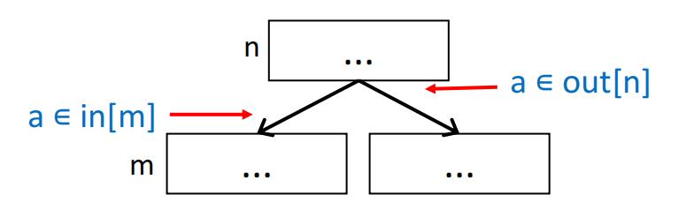

**规则 2**：如果节点 $n$ **使用**了变量 $a$，那么 $a$ 在进入该节点时必须是活跃的。

* 例如在语句 `n: b < 10` 中，使用了变量 `b`，因此 $\{b\} \subseteq in[n]$。

**规则 3**：如果一个变量在节点出口处是活跃的，且该节点**没有重新定义**该变量，那么它在进入该节点时也是活跃的。

* 这意味着该变量的值“穿过”了此节点，需要在更早的地方被定义。

---

### 实例演练

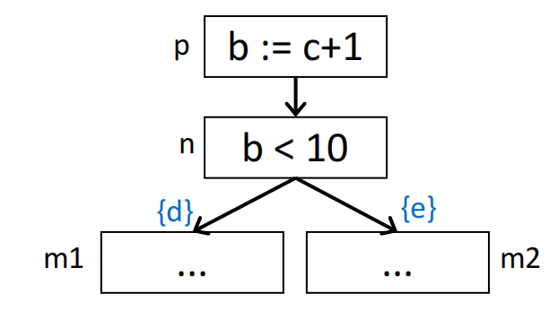

假设 $in[m1] = \{d\}$ 且 $in[m2] = \{e\}$：

1. **计算 $out[n]$**：根据规则 1，节点 $n$ 的后继是 $m1$ 和 $m2$，所以 $out[n] = \{d, e\}$。
2. **计算 $in[n]$**：根据规则 2 和 3，节点 $n$ 使用了 $b$ 且未定义 $d, e$，故 $in[n] = \{b, d, e\}$。
3. **计算 $out[p]$**：根据规则 1，由于 $p$ 的后继是 $n$，所以 $out[p] = in[n] = \{b, d, e\}$。
4. **计算 $in[p]$**：节点 $p$ 语句为 `b := c + 1`。

* 它使用了 $c$（加入 $in$ 集合）。
* 它定义了 $b$（从 $out$ 集合中移除 $b$）。
* 结果：$in[p] = \{c\} \cup (\{b, d, e\} - \{b\}) = \{c, d, e\}$。

---

### 数据流方程总结

最后，所有的规则被总结为两个数学方程，这是编写编译器自动分析程序的基础：

$$in[n] = use[n] \cup (out[n] - def[n])$$

$$out[n] = \bigcup_{s \in succ[n]} in[s]$$

这些方程揭示了活跃变量分析是一个**逆向分析**过程：我们通过后继节点的 `in` 集合来决定当前节点的 `out` 集合，再据此推导出当前节点的 `in` 集合。

---

### 活跃变量计算算法

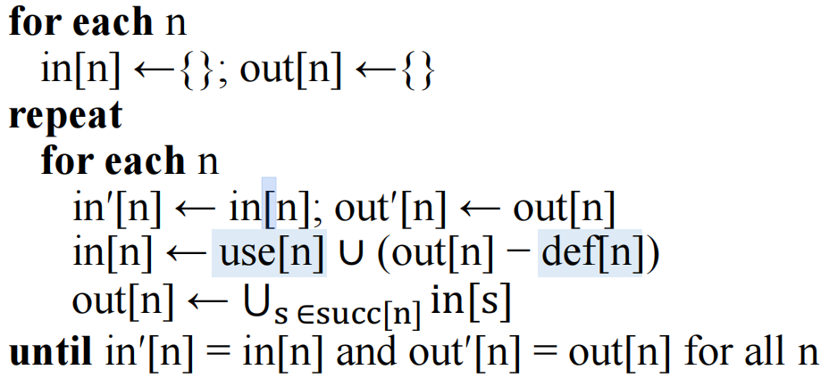

**算法逻辑**：

* **初始化**：将所有节点的 $in$ 和 $out$ 集合初始设为空集 $\{\}$。
* **分析已知量**：$use[n]$ 和 $def[n]$ 可以通过直接分析语句 $n$ 获得，在计算中被视为已知常数。
* **迭代过程**：使用 `repeat...until` 循环，不断更新每个节点的活跃变量集合，直到所有节点的 $in$ 和 $out$ 集合不再发生变化为止。

1. 粗略初始化

* **初始近似**：算法从一个“粗略”的答案近似值开始。
* **具体操作**：在进入循环之前，首先对流图中的每一个节点 $n$，将其 $in[n]$ 和 $out[n]$ 全部初始化为空集。这是迭代寻找固定点（Fixed Point）的起点。

2. 迭代重算与固定点

* **迭代重算**：算法会不断地重新计算每个节点的 $in[n]$ 和 $out[n]$。

**单调递增性**：

* 在每一次迭代中，由于使用的是并集运算（$\cup$），活跃变量集合只会增加而不会减少。
* 也就是说，活跃变量集合是单调增加的。

**固定点（Fixed Point）**：

* 算法会一直运行，直到达到一个“固定点”，即再一次迭代后，结果与上一次完全相同（$in'[n] = in[n]$ 且 $out'[n] = out[n]$）。
* 此时获得的集合就是方程组的最小不动点解，代表了最精确的活跃变量信息。

---

### 正向顺序迭代

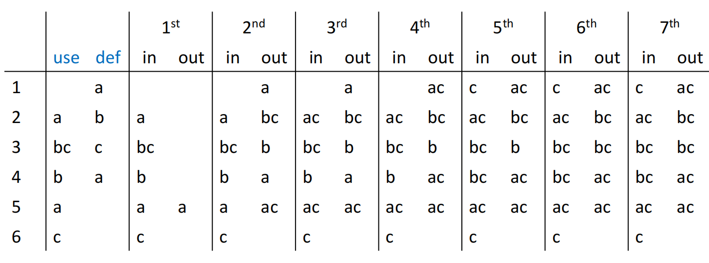

我们尝试按照控制流正向顺序进行计算。

1. **准备工作**：首先列出每个节点的 `use`（使用的变量）和 `def`（定义的变量）。例如，节点 2 语句是 `b := a + 1`，所以 `use(2) = {a}, def(2) = {b}`。
2. **第一轮迭代（1st Iteration）**：

* 根据公式 $in[n] = use[n] \cup (out[n] - def[n])$。由于初始时所有 $out$ 都是空集，第一轮计算出的 $in$ 实际上就等于该节点的 $use$。
* 可以看到表格中 $in$ 列填入了 $a, bc, b, a$ 等。

3. **问题显现**：直到第 7 轮迭代，数据才最终稳定（达到固定点）。

* **原因**：活跃变量信息是**逆向流动**的（从后继节点的 $in$ 流向当前节点的 $out$）。如果按正向顺序计算，信息每次迭代只能向上传递一个节点，导致收敛非常缓慢。

---

### 逆向顺序迭代（从 6 到 1）

为了加速收敛，从程序出口反向计算的过程。

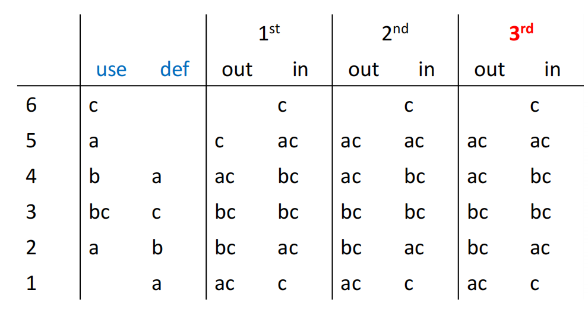

1. **逆向计算逻辑**：

* 我们先看节点 6 (`return c`)，它的 $in[6]$ 显然包含 $c$。
* 接着计算节点 5，由于它的后继包含 6 和 2，它的 $out[5]$ 会整合这两个节点的 $in$ 信息。

2. **收敛速度对比**：

* 可以看到，采用逆向顺序（从 6 到 1）和“先算 out 再算 in”的策略，仅仅经过 **3 轮**迭代，所有数据就都稳定了！
* 这比之前的 7 轮效率提高了一倍多。

---

### 核心结论

数据流分析的黄金法则：

* **顺应“流”的方向**：求解迭代方程时，计算顺序应当追随信息的流动方向。
* **活跃变量的特性**：活跃变量信息是沿着控制流箭头逆向（backward）流动的，且是从节点的 `out` 流向 `in`。
* **实践指导**：因此，在编写编译器时，活跃变量分析的代码应当从程序的最后一个基本块开始倒着往前循环。

---

## 计算的变体

* **基本块（Basic blocks）**：如果一个节点只有一个前驱和一个后继，它在分析中并不“有趣”。通过将这些节点与其前后节点合并，可以得到节点数更少的流图，其中每个节点代表一个基本块，从而减少计算量。
* **一次处理一个变量**：可以根据需求一次只为一个变量计算数据流信息。由于许多临时变量的活跃区间（live ranges）非常短，这种方法在实践中非常实用。

---

### 集合的表示方法

在代码实现中如何高效地表示 $in[n]$ 和 $out[n]$ 集合：

* **位数组（Bit Arrays）**：适用于**稠密集合**。假设有 $N$ 个变量，每个字（word） $K$ 位，则每个集合需要 $N$ 位。并集操作通过按位“或（OR）”实现，耗时为 $N/K$ 次操作。
* **排序列表（Sorted Lists）**：适用于**稀疏集合**。通过变量名等全序键进行排序，并集操作通过合并列表实现。
* **选择依据**：当集合平均元素个数少于 $N/K$ 时，排序列表通常更快。

---

## 时间复杂度

假设程序的大小为 $N$，其中包含最多 $N$ 个节点和最多 $N$ 个变量。

1. 每轮 `for` 循环耗时 $O(N^2)$

* **节点处理**：每一轮 `for` 循环需要遍历所有节点，节点数为 $N$。
* **集合操作**：在每个节点上，我们需要进行并集（$\cup$）或差集（$-$）操作。
* **变量规模**：因为程序中最多有 $N$ 个变量，使用位图等方式表示集合时，一次集合运算的时间复杂度是 $O(N)$。
* **综合**：$N$ 个节点 $\times$ 每个节点 $O(N)$ 的运算，导致一轮循环的总耗时为 $O(N^2)$。

2. `repeat` 循环最多迭代 $2N^2$ 次

* **单调性**：算法从空集开始，由于使用并集运算，`in` 和 `out` 集合只能增加，不能减少。
* **上限限制**：每个节点的 `in` 或 `out` 集合最大容量是 $N$（即包含所有变量）。
* **总空间**：全图共有 $N$ 个节点，每个节点有 `in` 和 `out` 两个集合，因此所有集合能容纳的元素总上限是 $2 \times N \times N = 2N^2$。
* **最坏情况**：在最极端的情况下，每次 `repeat` 迭代只往全图的某个集合里增加了一个变量，那么填满所有集合最多需要 $2N^2$ 次迭代。

3. 最坏情况运行时间为 $O(N^4)$

* **计算**：最坏迭代次数 $O(N^2) \times$ 每轮耗时 $O(N^2) = O(N^4)$。
* **实际情况**：在实践中，如果我们采用**逆向计算顺序**，信息流动更符合活跃变量的特性，通常只需很少次数的迭代就能达到固定点，复杂度会降至 $O(N)$ 到 $O(N^2)$ 之间。

---

## 保守近似与正确性

* **保守近似（Conservative Approximation）**：数据流方程的任何解都是一种保守的近似。
* **原则**：在活跃变量分析中，我们宁愿错误地认为一个变量是“活”的（这只会导致多占用一个寄存器），也绝不能错误地认为它是“死”的（这会导致程序计算错误）。
* **结论**：只要保证解是保守的，编译出的代码可能不够优化（浪费寄存器），但结果一定是正确的。

---

### 解的冲突与后果

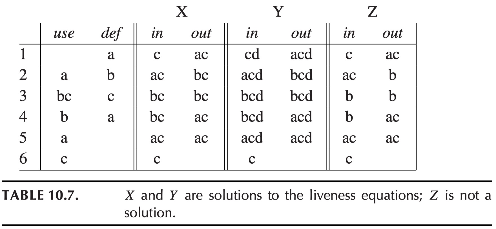

通过 TABLE 10.7 比较了三种情况：

* **解 X 和 Y**：都是方程的合法解。其中 $X$ 是最小解。
* **集合 Z**：**不是**方程的解，因为它违反了数据流方程。
* **严重后果**：如果使用非解的 $Z$，可能会错误地认为变量 $b$ 和 $c$ 不同时活跃从而将它们分配到同一个寄存器，最终导致程序计算出**错误答案**。
* **准则**：编译器优化所使用的方程必须确保任何解都能提供保守信息，即“可以不精确，但绝不能不正确”。

---

### 最小不动点定理

* **多解性**：活跃变量方程（方程 10.3）可能存在多个解（如前述的 $X$ 和 $Y$）。
* **最小不动点（Least Fixed Point）**：如果解 $X$ 被包含在所有其他解中，则 $X$ 就是最小解。
* **核心定理**：方程 10.3 存在唯一的最小不动点，并且我们之前讨论的**迭代算法总能计算出这个最小不动点**。

---

## 静态与动态活跃性

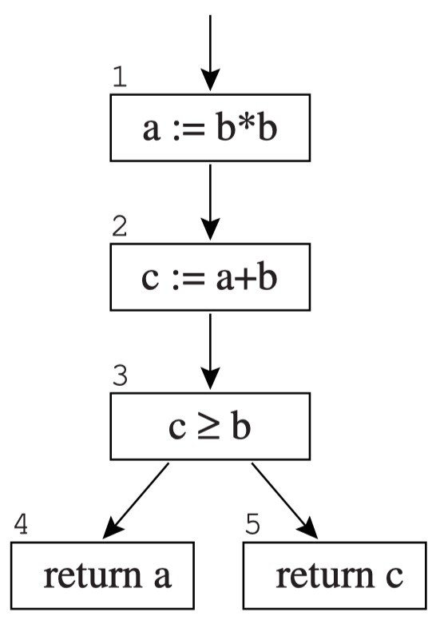

**代码逻辑分析**：

* 节点 1 计算 $a := b \times b$，因此 $a$ 一定 $\ge 0$。
* 节点 2 计算 $c := a + b$，由于 $a \ge 0$，所以 $c$ 一定 $\ge b$。
* 节点 3 进行判断 $c \ge b$，根据前两步的逻辑，这个条件**永远为真**。
* 因此，程序实际上只会走左侧的分支（返回 $c$），**节点 4（返回 $a$）永远不会被执行**。

**编译器的问题**：标准的数据流方程并不知道条件跳转的具体走向，它会假设左右两条路都有可能走。

**后果**：由于编译器认为节点 4 可能被到达，它会认为 $a$ 在整个路径中都是活跃的。如果编译器足够“聪明”，它就能发现 $a$ 和 $c$ 其实可以共享同一个寄存器。

---

### 不可判定性定理

为什么编译器不能做到完美的分析？**停机问题（Halting Problem）**。

* **核心定理**：不存在一个通用的程序 $H$，能够判定任意程序 $P$ 在输入 $X$ 时是否会进入死循环或正常停机。
* **推论**：同样不存在一个通用的程序，能够准确判断程序中的某个标签（Label） $L$ 在执行过程中是否**一定会被到达**。
* **结论**：没有任何编译器能够完全理解每一个程序中所有控制流的真实工作方式。

---

### 保守近似

既然无法做到百分之百准确，编译器该怎么办？答案是采用**保守近似（Conservative Approximation）**。

* **原则**：虽然没有通用算法能解决所有情况，但在某些特定场景下我们可以优化。
* **现实妥协**：由于无法确知变量是否“真的”会被用到，编译器必须假设**所有的条件分支都有可能发生**。
* **安全第一**：在这种近似下，我们宁可认为一个变量是活跃的（即使它实际不活），也绝对不能认为它是死的（如果它实际上还活着，程序就会崩溃）。

---

### 动态与静态的对比

* **动态活跃性（Dynamic Liveness）**：如果程序的**某次实际执行**从节点 $n$ 到达了对 $a$ 的使用，且中间没经过定义，那么 $a$ 就是动态活跃的。这是程序运行时的真实状态。
* **静态活跃性（Static Liveness）**：如果在控制流图中存在**某条路径**（无论实际是否能走通）从 $n$ 到达了对 $a$ 的使用，那么 $a$ 就是静态活跃的。这是编译器能看到的状态。
* **关键关系**：如果一个变量是动态活跃的，它**一定**也是静态活跃的。

---

## 冲突图（Interference Graphs）

### 冲突图的基本定义

* **核心用途**：活跃变量分析最重要应用之一就是进行**寄存器分配**。我们有一组临时变量（$a, b, c, \dots$）和有限的物理寄存器（$r1, \dots, rk$）。
* **什么是冲突**：如果某种条件阻止两个变量 $a$ 和 $b$ 被分配到同一个寄存器，我们就称它们之间存在**冲突（Interference）**。

**两种冲突类型**：

1. **活跃区间重叠**：这是最常见的情况，即两个变量在同一时刻都是活跃的。
2. **特殊指令限制**：当变量 $a$ 必须由某条无法访问寄存器 $r1$ 的指令生成时，我们就说 $a$ 和 $r1$ 之间存在冲突。

---

### 冲突的表达方式

**矩阵表达 (a) Matrix**：使用一个对称矩阵，如果变量 $i$ 和 $j$ 冲突，就在对应的格子里打上 **x**。例如图中 $a$ 与 $c$ 冲突，$b$ 与 $c$ 冲突。

**无向图表达 (b) Graph**：这是最直观的方式。

* **节点**：代表每一个变量。
* **边**：连接相互冲突的变量。

* 图中 $a-c$ 和 $b-c$ 之间有连线，表示它们不能共享寄存器，但 $a$ 和 $b$ 之间没有线，说明它们**可以**使用同一个寄存器。

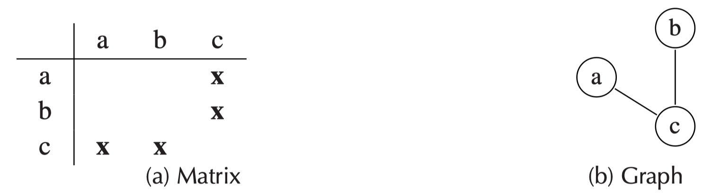

---

### MOVE 指令的特殊处理

如何处理 `t := s` 这样的复制指令。

* **问题**：通常情况下，在定义 $t$ 的时刻 $s$ 也是活跃的，按理说应该建立冲突边 $(s, t)$。
* **洞察**：但在 `MOVE` 指令中，$s$ 和 $t$ 包含**相同的值**，我们其实希望它们占用**同一个**寄存器，这样连指令都可以省掉。
* **解决方案**：在 `MOVE` 指令处**不要**添加 $s$ 和 $t$ 之间的冲突边。
* **例外情况**：如果后面有另一条非 MOVE 指令重新定义了 $t$，而此时 $s$ 仍然活跃，那么那条指令会自然地创建出 $(t, s)$ 的冲突边。

---

### 添加冲突边的具体规则

构建冲突图的具体算法逻辑是基于每个指令 $n$ 处的出口活跃变量集合 $out[n]$。

* **非 MOVE 指令**：如果指令 $n$ 定义了变量 $a$，且此时出口处活跃变量集合为 $\{b1, \dots, bj\}$，则添加边 $(a, b1), \dots, (a, bj)$。
* **MOVE 指令 ($a := c$)**：如果此时出口活跃变量集合为 $\{b1, \dots, bk\}$，则为所有**不等于 $c$** 的活跃变量 $bi$ 添加冲突边 $(a, bi)$。
* 这印证了前一页的逻辑：故意避开 $(a, c)$ 这条边，为后续的寄存器合并留出空间。

---

### 零长度活跃区间的冲突

* **场景**：如果一个变量被定义了但从未被使用（刚出生就死了），它还需要占寄存器吗？
* **分析**：即使它没用，定义它的那条指令仍然会执行并写入某个寄存器。
* **结论**：为了安全起见，这个写入的寄存器**绝对不能**包含当时任何其他的活跃变量。
* **规则**：因此，即使是“零长度”的活跃区间，也会与在该点重叠的所有其他活跃区间产生冲突。

---