# Chapter 11 | Register Allocation

## Register Allocation

### 核心定义

在编写中间代码（IR）或进行抽象语法树（AST）构建时，编译器可以假设有无限个临时变量（如 $t_1, t_2, t_{908}, t_{910}$ 等）可以使用。

但真实的硬件（如 RISC-V、x86 等）只有固定数量的物理寄存器。寄存器分配器的任务就是完成这个“多对一（或多对少）”的映射。

---

## Register Allocator

### 任务（What）

* **核心工作：** 将海量的临时变量（temporaries）塞进数量很少的物理寄存器（machine registers）里。
* **一个重要的优化点（MOVE 的消除）：**

如果有一条赋值语句（比如中间代码里的 `a = b`，在机器码里表现为 `MOVE` 或者是 `addi a, b, 0`），如果寄存器分配器能巧妙地让变量 `a` 和变量 `b` **分配到同一个物理寄存器**，那么这一行搬运数据的机器指令就可以直接**删掉**。这在编译器优化中被称为**寄存器合并（Coalescing）**。

---

### 方法（How）：图着色问题（Graph Coloring）

这是现代编译器（如 GCC、LLVM）中最经典的寄存器分配方法，由 Chaitin 等人提出，将寄存器分配问题等价于数学中的**图着色问题**：

**步骤 1：构建冲突图（Derive an interference graph）**

* 编译器会先进行**活跃性分析（Liveness Analysis）**，算出每个变量在哪些代码位置是“活着”的。
* 如果两个变量在同一个时间点都活着（也就是说，它们的数据都在被使用，不能互相覆盖），那么它们之间就存在**冲突（Interference）**。
* 我们在它们之间连一条边，这就构成了一张**冲突图（Interference Graph）**。

**步骤 2：对冲突图进行着色（Coloring the interference graph）**

* **规则：** 任何由冲突边相连的两个节点，**不能被染成相同的颜色**。
* **映射：** 这里的**颜色（Colors）**就对应着硬件里的**物理寄存器（Registers）**。

---

### 示意图

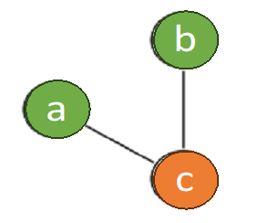

* 图中有三个节点 `a`, `b`, `c`。
* 节点 `c` 与 `a` 和 `b` 都有连边（说明变量 `c` 与 `a`、`b` 的生命周期有重叠，不能用同一个寄存器）。
* 因此，`a` 和 `b` 被染成了**绿色**，而 `c` 必须染成不同的**橙色**。
* 这意味着变量 `a` 和 `b` 在机器码中可以安全地共享同一个物理寄存器，而 `c` 必须独占另一个。

---

## Coloring by Simplification（启发式着色概述）

### NP-完全问题（NP-Complete）

* **寄存器分配（Register allocation）是一个 NP-完全问题**，因为它可以被完美规约到图的 $K$-着色问题（Graph coloring）。

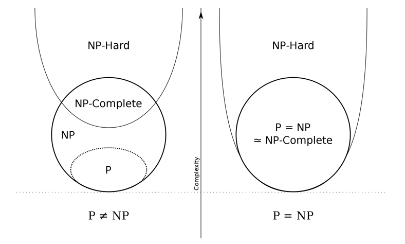

* 左图（$P \neq NP$ 的主流观点）：NP-Complete 问题处于 P 之外，随着输入规模增大，寻找完美最优解的时间开销会呈指数级爆炸。
* 右图（$P = NP$ 的极端理论情况）。

**结论：** 既然无法在有限时间内算得绝对最优解，编译器就必须采用**线性时间复杂度（Linear-time）的近似/启发式算法**，以在编译速度和生成代码质量之间取得完美平衡。

---

### 四大核心阶段

这个线性时间近似算法包含以下主要阶段：

1. **Build**（构建冲突图）
2. **Simplify**（移除低度数节点简化图）
3. **Spill**（处理高度数节点，决定谁下放到内存）
4. **Select**（从栈中弹出节点，逆向尝试上色）

---

#### Build（构建阶段）

##### 构建冲突图（Interference Graph）

* 编译器利用前期活跃性分析（Liveness Analysis）的结果来绘制这张图。
* **节点（Node）：** 图中的每一个节点都代表 IR 中的一个临时变量（Temporary value，如 $a, b, c, d, e, f$）。
* **边（Edge）：** 如果两个节点之间有一条边 $(t_1, t_2)$，表示这两个临时变量**不能被分配到同一个物理寄存器**。

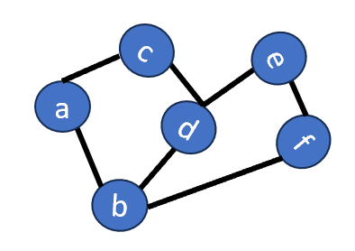

冲突发生的根本原因：如果它们同时活着，说明它们都保存着对后续计算有用的不同数据，一旦强行共享寄存器，数据就会被彼此覆盖破坏。

---

#### Simplify（简化阶段）

##### 简化的核心假设

* 假设当前目标机器有 **$K$ 个可用寄存器**（即我们有 $K$ 种颜色）。
* 如果在冲突图 $G$ 中，存在一个节点 $b$ 的度数（邻居数量）**小于 $K$**（即 $\text{deg}(b) < K$）。
* 当我们把节点 $b$ 从图里拿掉，剩下的图 $G' = G - \{b\}$ 能够成功用 $K$ 种颜色着色，那么**原图 $G$ 也一定可以用 $K$ 种颜色着色**。
* **为什么？** 

因为即使 $b$ 的所有邻居在后续上色时都占用了互不相同的颜色，由于 $b$ 的邻居总数小于 $K$，所以留给 $b$ 的至少还能剩下一轴干净的颜色。

---

##### 基于栈（Stack-based）的算法

这催生了一个非常优雅的、基于栈（或递归）的消除算法：

1. **不断寻找**图中度数小于 $K$ 的节点。
2. 将该节点从冲突图里**剥离（Remove）**，并压入栈（Push）中。
3. **连锁反应：** 节点被移除后，与它相连的边的度数也会随之减少。这使得原本度数 $\ge K$ 的邻居节点，其度数也有可能降到 $K$ 以下，从而创造了更多持续简化的机会。

---

#### Spill（溢出处理阶段）

##### 什么是潜在溢出？

* 当图简化到某一时刻，发现剩下的所有节点的度数都**大于等于 $K$**（即 $\text{deg} \ge K$，被称为 **Significant degree**）。
* 此时，算法无法继续无损简化。我们必须悲观地做出抉择：选择其中一个节点（例如图中的 $b$ 节点），决定把它溢出（Spill）到内存中，而不是留在寄存器里。

---

##### 乐观着色法（Optimistic Approximation）

* 现代编译器采用**乐观着色（Optimistic Coloring）**策略：我们虽然选定 $b$ 作为溢出候选人，但并不急着重写代码，而是**依然把它从图里拆下来，假装没事一样把它也压入栈中**！
* 我们的乐观假设是：*虽然 $b$ 现在的邻居数 $\ge K$，但由于它的邻居们之间也互有冲突，说不定等会儿上色时，它的邻居们会撞车合并、共享某些颜色，从而在最后关头给 $b$ 留出一个空位呢？*
* 压栈后，图的度数整体下降，算法得以继续返回 **Simplify** 阶段。

---

#### Select（选择与着色阶段）

##### 弹出普通简化节点（Simplified Node）

* 从栈里弹出一个当时因为“度数 $< K$”而被剥离的节点。根据前述定理，由于它的邻居们还没把颜色占满，此时**必定能给它找到一种合法颜色**。

---

##### 弹出潜在溢出节点（Potential Spill Node）

* 当我们弹到当年那个不幸的潜在溢出节点 $n$（比如栈底的 $b$ 节点）时，会出现两种命运：

1. **命运 A —— 实际溢出（Actual Spill）：**

不幸言中。节点 $n$ 被弹出时，发现它的邻居们真的极其不合，已经把 $K$ 种颜色**完完全全占满了**。此时我们**无法为 $n$ 分配任何颜色**。我们先不给它染色，继续把栈里剩下的节点弹完，来抓出所有真正没救的“实际溢出节点”。

2. **命运 B —— 侥幸逃生（Optimistic Success）：**

乐观成功！节点 $n$ 被弹出时，发现邻居们由于彼此冲突严重，相互妥协合并后只用到了**少于 $K$ 种**颜色。太棒了！我们直接抓起剩下的一种颜色染给 $n$。它不用被驱逐到内存了！

---

### Start Over（重头来过）

当真的发生“命运 A（实际溢出）”时，编译器如何给算法收尾。

#### 重写程序（Rewrite Program）

* 如果 **Select** 阶段结束，发现确实有几个节点完全没染上颜色，就说明这几个临时变量彻底无法进驻寄存器了。
* 编译器必须在这个时候重写（Rewrite）中间代码：
* 在这个变量每一次被定义/赋值（def）之后，立刻插入一条 **STORE** 指令，把值强行写回内存（栈帧）。
* 在这个变量每一次被读取/使用（use）之前，立刻插入一条 **LOAD** 指令，把值从内存里临时抓上来。

---

##### 微小活跃区间（Tiny Live Ranges）

* 经过这样的 STORE/LOAD 改造后，原来的那个横跨大半个函数的“长寿命”临时变量，被粉碎成了好几个只活在“LOAD 到使用”或“赋值到 STORE”之间的**极短寿命的全新临时变量**。
* 因为它们的生命周期极短（Tiny live ranges），它们在图里的冲突边会急剧减少。

---

##### 重新迭代（Repeat）

* 代码重写后，整个冲突图发生了改变。算法需要**完全重头来过（Start Over）**：从 Build 阶段开始重新构建冲突图，再次 Simplify。
* 由于每一次溢出都把长周期变量打碎成了极短变量，图的着色难度会断崖式下跌。在实际工程中，整个循环通常只需要跑 1 到 2 次，就能实现所有变量的完美寄存器分配。

---

## Coalescing（合并的核心概念）

1. 基本原理

* 如果在冲突图中，一条 `MOVE` 指令的**源节点（Source）**和**目的节点（Destination）**之间**没有冲突边（No edge）**，那么它们就可以被安全地**合并（Coalesced）**。
* 合并后，这条 `MOVE` 指令就可以直接从生成的代码中**彻底删除（Eliminated）**。

2. 图结构的变化

* 源节点和目的节点会融合成一个**全新的复合节点**。
* 关键规则：新节点的冲突边集合，是原本两个独立节点冲突边的**并集（Union）**。

---

### Reckless Coalescing（鲁莽合并的代价）

1. 鲁莽合并带来的潜在危机

* 因为新节点继承了两个节点的全部冲突边（并集），它的约束力会显著增强。一个原本在合并前可以用 $K$ 种颜色轻松上色的图，在经历了鲁莽合并（Reckless coalescing）后，由于度数激增，可能直接变成一个**无法着色（Uncolorable）的图。这反而会引发代价高昂的内存溢出（Spill）。

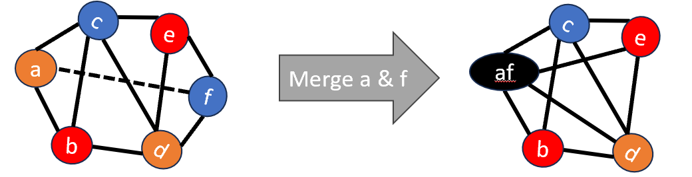

* **左图：** 节点 $a$（橙色）和节点 $f$（蓝色）之间有一条虚线（MOVE 指令）。此时整个图是可以成功上色的。
* **右图：** 强行将 $a$ 和 $f$ 合并成新节点 **$af$**（黑色）。
* **结果：** 合并后的 $af$ 同时继承了 $a$ 和 $f$ 的所有邻居（连接了 $b, c, d, e$），导致 $af$ 的度数变得非常高。这种变化破坏了图原有的可着色性，使得算法卡死。
* **结论：** 我们必须实施**保守合并（Conservative Coalescing）**。只有当合并被证明是安全（Safe，即不破坏可着色性）的时候，才允许执行。

为了判断合并是否安全，业界有两种最著名的经典策略：**Briggs 策略** 和 **George 策略**。

---

### Briggs 策略

这是由 Briggs 提出的安全合并判定准则，从**合并后的新节点**角度出发：

* **核心定理：** 节点 $a$ 和 $b$ 可以合并，只要合并后产生的新节点 $ab$，其**高度数邻居（Significant degree，即度数 $\ge K$ 的邻居）的数量小于 $K$**。

**为什么安全？（证明逻辑）：**

1. 在后期的 **Simplify（简化）** 阶段，所有低度数（$< K$）的邻居都会被优先剥离压栈。
2. 当这些低度数邻居全部被剥离后，新节点 $ab$ 剩余的邻居全都是高度数邻居。
3. 因为条件限制了高度数邻居的数量**小于 $K$**，这就意味着此时 $ab$ 的剩余度数一定也小于 $K$！
4. 既然它的度数降到了 $K$ 以下，Simplify 阶段就一定能把 $ab$ 也安全地剥离压栈，绝不会导致图无法着色。

---

### George 策略

这是由 George 提出的另一种判定准则，它非常适合在图已经经过部分简化后，从**原本节点**的邻居视角进行增量检查：

* **核心定理：** 节点 $a$ 和 $b$ 可以合并，只要对于 $a$ 的**每一个邻居 $t$**，满足以下两个条件之一即可：

1. $t$ 本来就与 $b$ 存在冲突（即 $t$ 已经是 $b$ 的邻居了，合并不会增加 $b$ 的负担）。
2. $t$ 是一个低度数节点（Insignificant degree，即 $\text{deg}(t) < K$）。

**为什么安全？（证明逻辑）：**

* 对于本来就冲突的邻居，合并后并集不会增加总边数。
* 对于低度数邻居 $t$，在接下来的 Simplify 阶段中，它反正会被优先安全地移走，移除后它对合并节点造成的度数威胁会自动解除，因此同样不会导致整个图劣化。

---

### Coloring with Coalescing（带合并的完整流水线）

现代寄存器分配器不是单纯地先合并再着色，而是将它们变成一个循环迭代的过程（直到图变为空）。

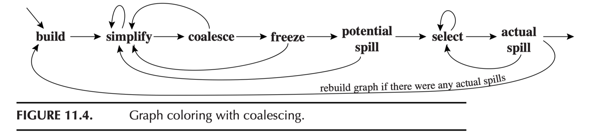

1. Build（构建）

* 建立冲突图，并把所有节点分类为：
* **Move-related（移动相关节点）：** 它是某条 `MOVE` 指令的源或目的（比如图里有 `a = b`，那 $a$ 和 $b$ 就是 move-related）。
* **Non-move-related（非移动相关节点）：** 自由节点，与任何复制操作无关。

2. Simplify（简化）

* 每次只挑选非移动相关（Non-move-related）**且**低度数（$< K$）的节点进行常规移走压栈。

*为什么要避开 move-related 节点？* 

因为我们要把它留给下一步，看看能不能合并它，过早移走就失去优化 MOVE 的机会了。

3. Coalesce（合并）

* 当图里没有非移动相关的低度数节点后，启动合并。在剩下的简化图上，使用 **Briggs** 或 **George** 策略进行**保守合并**。
* 合并成功后的新节点如果不再涉及其他 MOVE，它就会退化为 Non-move-related，在下一轮循环中就可以被 `Simplify` 阶段大步流星地移走。

4. Freeze（冻结）

* **什么时候触发：** 如果既没有非移动相关的低度数节点可以 `Simplify`，剩下的移动相关节点又因为不满足 Briggs/George 策略而无法安全 `Coalesce`（陷入死锁僵局）。
* **动作：** 算法被迫做出妥协，寻找一个低度数的移动相关节点，将其上的合并期望**放弃**。这就是 **Freeze（冻结）**。
* 放弃后，这些涉及的节点被重新降级视为正常的 Non-move-related 节点。僵局被打破，算法又可以重新愉快地回到 **Simplify** 阶段继续运转。

5. Spill（溢出准备）

* 如果场上只剩下高度数节点（$\ge K$），且无任何 MOVE 关系可冻结。算法选出一个高度数节点作为**潜在溢出**压入栈中（使用前文提到的乐观着色）。

6. Select（出栈着色）

* 弹出整个栈，为节点指定颜色。
* 如果在弹出时发现某个潜在溢出节点被真正卡死（邻居占满了 $K$ 种颜色），产生 **Actual Spill（真实溢出）** $\to$ 重写代码插入 LOAD/STORE $\to$ 整个大流程回到 `Build` 重新开始。

---

## Precolored Nodes（预着色节点）

1. 什么是预着色节点？

* **特殊用途的寄存器**：比如参数寄存器（Argument registers，如 `a0-a7`）、帧指针（Frame pointer，`fp`）、返回值寄存器（Return-value register）等。
* 在编译器前端生成中间代码（IR）时，会有一些特殊的虚拟变量，它们在生成的那一刻就注定**必须绑定到这些特定的物理寄存器**。
* **图论抽象**：这些特殊的临时变量在冲突图中对应的节点，就叫做**预着色节点（Precolored Nodes）**。

2. 预着色节点的硬性规则

* **独一无二**：每种颜色（即每个真实的物理寄存器）只能有一个对应的预着色节点。
* **全连接冲突**：所有的预着色节点之间**全部两两互相连有冲突边**。
* **不可简化（Cannot simplify）**：算法绝对不能把预着色节点剥离并压入栈中。
* **绝不能溢出（Should not spill）**：预着色节点代表的就是硬件本身，没有更上一层的物理寄存器让它溢出了，因此它们必须驻留在寄存器中。

---

### Temporary Copies of Machine Registers（寄存器的局部副本）

既然预着色节点既不能 Simplify 又不能 Spill，如果函数内对这些寄存器的压力很大，算法就会卡死。

---

#### 核心策略：缩短活跃区间（Live Range）

* 为了防止预着色节点霸占颜色导致其他变量没地方放，编译器前端会非常小心地**缩短它们的寿命（Live ranges）**。
* **实现手段**：在函数一进场（Enter）时，立刻生成一条 `MOVE` 指令，把预着色节点（如物理寄存器 `r7`）的值复制到一个普通的、临时的虚拟变量（如 $t_{231}$）中。在函数准备退出（Exit）前，再用一条 `MOVE` 把值从 $t_{231}$ 还原给 `r7`。

---

#### Callee-save 寄存器保护

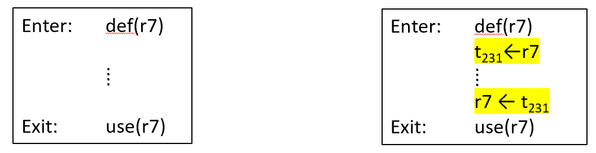

**左框（原始情况）**：进入函数定义 `def(r7)`，退出函数使用 `use(r7)`。这意味着整个函数执行期间，物理寄存器 `r7` 都是活着的，冲突图里它会和所有变量连满边，造成巨大的寄存器压力。

**右框（优化副本）**：

* 进入时：执行 $t_{231} \leftarrow r7$。
* 退出时：执行 $r7 \leftarrow t_{231}$。
* **收益**：`r7` 本身的生命周期被压缩到了极短的边界。而长周期保留数据的任务交给了普通的虚拟变量 $t_{231}$。由于 $t_{231}$ 是普通节点，它可以参与后续的 `Simplify`、`Coalesce`（如果不拥挤就重新和 `r7` 合并消去 MOVE）或者 `Spill`（如果拥挤就把 $t_{231}$ 溢出到内存栈帧中）。

??? note "实际用处"
    乍一看，你可能会觉得：“这不就是脱了裤子放屁吗？原来由 `r7` 承担的压力，现在全转嫁给了 $t_{231}$，总的冲突和拥挤程度不是一点没变吗？”

    但实际上，**不一样，而且性质发生了根本性的改变**。编译器之所以要把 `r7` 的数据倒手给虚拟变量 $t_{231}$，是因为 **`r7`（物理寄存器）和 $t_{231}$（虚拟寄存器）在编译器眼里的“人权”是完全不对等的**。

    这种做法带来的质变主要体现在以下三个方面：

    1. 物理寄存器 `r7` 摆脱了“死锁预警”

    物理寄存器在冲突图里是**预有着色节点（Pre-colored Nodes）**。它们的特点是：

    * **数量恒定、不可替代**：硬件里就那么几个。

    * **度数无穷大**：在算法中，物理寄存器之间是两两相互冲突的，且它们不能被 `Simplify`（你不能把物理寄存器给剥离压栈）。

    如果让 `r7` 横跨整个长周期，它就会像一堵高墙，跟这期间诞生的**所有**其他变量产生冲突边。因为 `r7` 不能被简化，这会导致整个图的度数迅速飙升，极易触发大规模的硬溢出（Spill）。

    而把生命周期转移给 $t_{231}$ 后：

    > **`r7` 瞬间自由了。** 它只在函数开头和结尾活了两个极短的片刻。在这个函数中间的广阔区域里，`r7` 干净得像一张白纸。其他变量可以毫无顾忌地复用 `r7`，这就极大地缓解了中间区域的寄存器压力。

    2. $t_{231}$ 拥有物理寄存器没有的“退路”

    现在压力确实全在 $t_{231}$ 身上了。但 $t_{231}$ 是一个**普通虚拟节点**，它拥有极高的自由度。

    面对同样的“拥挤”，`r7` 没办法，只能硬扛。而 $t_{231}$ 可以根据图的松紧度，灵活选择三条完全不同的退路：

    退路 A：如果不拥挤 $\rightarrow$ 完美闭环（零成本）

    如果中间这段代码变量不多，寄存器够用。那么在 `Coalesce`（合并）阶段，算法会发现：$t_{231}$ 和 `r7` 之间有 `MOVE` 关系，且由于此时图很空旷，合并它们不会引发危机（满足 Briggs 准则）。

    * **结果：** $t_{231}$ 重新和 `r7` 合并。那两句倒手的指令被无形消去。

    * **代价：** **0**。跟原本不拆分的效果一模一样。

    退路 B：如果有点挤 $\rightarrow$ 借尸还魂（换个物理寄存器）

    如果中间 `r7` 被迫要给更重要的紧急变量用，但还有其他空闲的物理寄存器（比如 `r0`）。

    * **结果：** $t_{231}$ 在最后着色时，被分配给了 `r0`。
    * **代码演变成：**

    ```assembly
    r0 ← r7    ; 进入时
    ...        ; 中间 r7 可以挪作他用，数据安全地躺在 r0 里
    r7 ← r0    ; 退出时

    ```

    * **代价：** 只是换了个物理寄存器存着，依然没有产生内存读写！

    退路 C：如果极端拥挤 $\rightarrow$ 优雅降级（Spill 到内存）

    如果真到了生死存亡的时刻，连一个空闲物理寄存器都没了图无法着色。

    * **结果：** 算法选择将 $t_{231}$ 溢出（Spill）到内存。

    * **代码演变成：**

    ```assembly
    STORE r7, [sp, #8]  ; 进入时，直接把 r7 压入内存栈
    ...                 ; 中间 r7 彻底释放，随便怎么造都行
    LOAD r7, [sp, #8]   ; 退出时，从内存恢复 r7

    ```

    * **代价：** 这时候确实发生内存读写了。但请注意，这个内存读写**只发生在函数的入口和出口**！

    3. 核心差异：局部溢出 vs 全局崩溃

    如果你不拆分，让 `r7` 顶着长周期硬扛，一旦触发 Spill，因为 `r7` 贯穿了整个函数，编译器为了释放它，可能需要在中间的**每一个循环、每一次使用 `r7` 的地方**都插入 `LOAD` 和 `STORE`。

    而通过 $t_{231}$ 倒手这一把：

    * **最坏的情况（退路 C）**：也就是在函数的开头和结尾各执行一次内存读写。这恰好就是标准 **Callee-Saves（被调用者保存）** 寄存器的正常开销。

    * **最好的情况（退路 A 和 B）**：完全不花任何内存代价，白嫖了中间区域对 `r7` 的使用权。

    所以，这并不是“换汤不换药”的无用功。**拆分的本质，是把一个性质恶劣的“物理寄存器长周期冲突”，转化为了一个可以通过图着色算法弹性优化的“虚拟寄存器冲突问题”，给算法留出了巨大的操作和转圜空间。**

---

#### Caller-Save 与 Callee-Save 寄存器策略

1. 两类寄存器的分配倾向

**Caller-save（调用者保存寄存器）**：

* **特点**：跨函数调用（Procedure call）时，里面的值可能会被冲掉。
* **分配倾向**：如果一个局部变量的生命周期**没有跨越任何函数调用**（即在调用 `f()` 前就用完了，或者在 `g()` 之后才出生），应该优先分配到 Caller-save 寄存器。因为不需要在跨调用时对其写内存保护。

**Callee-save（被调用者保存寄存器）**：

* **特点**：跨函数调用时，被调用的子函数承诺会保护好它的值不变。
* **分配倾向**：如果一个变量的生命周期**跨越了多个子函数调用**（如图中橙色的变量 $s$），为了防止频繁地在外面做内存换入换出，应该优先将其安置在 Callee-save 寄存器中。

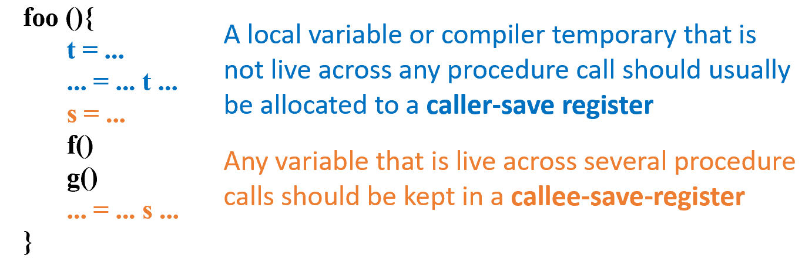

* 如果一个变量 $x$ 跨越了函数调用，它就会与所有的 Caller-save（预着色）寄存器以及 Callee-save 的局部副本（如 $t_{231}$）发生严重冲突，从而导致寄存器极度饥饿（高压力）。
* 此时势必会发生**溢出（Spill）**。那么问题来了：**我们应该优先选择溢出变量 $x$，还是优先溢出副本 $t_{231}$ 呢？** 接下来就需要定量计算。

---

### Example with Precolored Nodes（具体代码上下文）

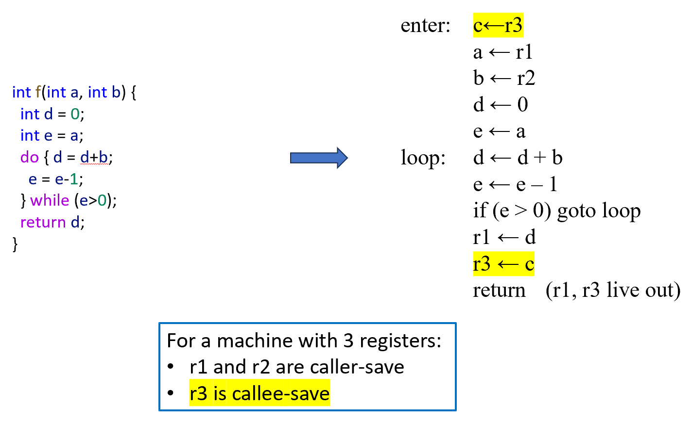

左侧给出了一个带有循环的简单函数 `f(int a, int b)`。

编译器为其生成了带物理硬件绑定的序列：

`enter:` 阶段：

* 参数和返回值使用的是预着色寄存器 `r1`, `r2`, `r3`。
* 执行 $c \leftarrow r3$ 备份寄存器（$c$ 成了 $r3$ 的临时副本）。
* 分别执行输入参数的加载：$a \leftarrow r1$, $b \leftarrow r2$。

`loop:` 循环体：

* 执行循环内的加减和跳转。

函数准备返回：

* 将结果送回返回值寄存器：$r1 \leftarrow d$。
* 恢复原有的被调用者保存寄存器：$r3 \leftarrow c$。
* 最终返回 `return (r1, r3 live out)`。

下方机器约束说明

* 假设当前目标机器非常极端，**只有 $K=3$ 个寄存器**。
* `r1`, `r2` 被指定为 **Caller-save** 寄存器。
* `r3` 被指定为 **Callee-save** 寄存器。

---

#### 构建出的冲突图与算法卡死状态

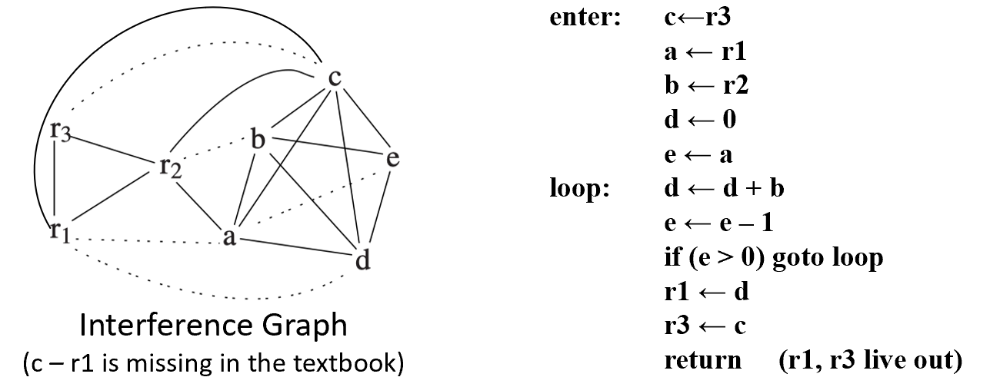

* **预着色节点**：$r1, r2, r3$ 形成了一个天然的全连接核心三角形（实线全连）。
* **虚拟变量节点**：$a, b, c, d, e$ 散落在周围，并根据活跃性分析与 $r_s$ 及彼此连线。

当 $K=3$ 时，算法尝试运行状态机：

* **Simplify 失败**：所有普通节点（$a, b, c, d, e$）当前的度数（Degree）全都 **$\ge 3$**。没有低度数节点可拆。
* **Coalesce 失败**：没有任何一个移动相关的连线满足保守合并（Briggs/George）策略。
* **Freeze 失败**：即使强行冻结，所有节点的度数依然 $\ge K$。
* **唯一出路**：全线卡死，我们**必须选择一个节点执行 Spill（溢出到内存）**。
* **启发式准则**：应该选择度数很高（妨碍了别人），但是在程序里很少被读写（性价比低）的节点溢出。

---

#### Spill Priority（溢出优先级的定量计算）

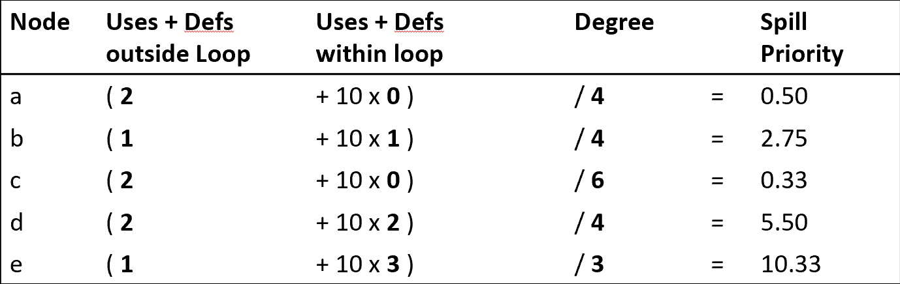

1. 溢出优先级的计算公式

现代编译器通常采用 Chaitin 的启发式代价公式来计算每个节点的**溢出优先级（Spill Priority）**：

$$\text{Spill Priority} = \frac{\text{静态循环嵌套权重下的读写次数 (Uses + Defs)}}{\text{节点的度数 (Degree)}}$$

为了体现循环的开销，**在循环内部（within loop）执行一次指令，其权重通常放大 10 倍（或更加暴烈地以 $10^{\text{循环嵌套深度}}$ 放大）**。

我们来看表格里每一个变量的静态开销是怎么算出来的：

**节点 $a$**：

* 循环外：只在 Enter 时执行了 $a \leftarrow r1$（1次 def），在 Enter 下方执行了 $e \leftarrow a$（1次 use），共 2 次。
* 循环内：无（$10 \times 0$）。
* 静态代价 = $2$。度数 = $4$。**优先级 = $2 / 4 = 0.50$**。

**节点 $b$**：

* 循环外：Enter 阶段加载 $b \leftarrow r2$（1次）。
* 循环内：在 `d \leftarrow d + b` 中被读取（1次，乘权重 10）。
* 静态代价 = $1 + 10 = 11$。度数 = $4$。**优先级 = $11 / 4 = 2.75$**。

**节点 $d$**：

* 循环外：初始化 `d \leftarrow 0`（1次 def），退出前 `r1 \leftarrow d`（1次 use），共 2 次。
* 循环内：在 `d \leftarrow d + b` 中，既被读又被写（1次 use + 1次 def = 2次，乘权重 10）。
* 静态代价 = $2 + 10 \times 2 = 22$。度数 = $4$。**优先级 = $22 / 4 = 5.50$**。

**节点 $e$**：

* 循环外：Enter 阶段 $e \leftarrow a$（1次）。
* 循环内：`e \leftarrow e - 1`（1次 use + 1次 def）以及循环条件 `if (e > 0)`（1次 use），共 3 次，乘权重 10。
* 静态代价 = $1 + 10 \times 3 = 31$。度数 = $3$。**优先级 = $31 / 3 = 10.33$**。

最终的终局判决：节点 $c$ 胜出

* 循环外：进场备份 $c \leftarrow r3$（1次 def），出场恢复 $r3 \leftarrow c$（1次 use），共 2 次。
* 循环内：**完全没有被使用过**（$10 \times 0$）。
* **最终得分**：它的静态总代价只有 2。而它的度数高达 6（因为它在整个长寿命周期里跟周围所有人冲突）。
* 计算优先级：

$$\text{Spill Priority}(c) = \frac{2}{6} = 0.33$$

---

##### Spill node $c$（对 $c$ 痛下杀手）

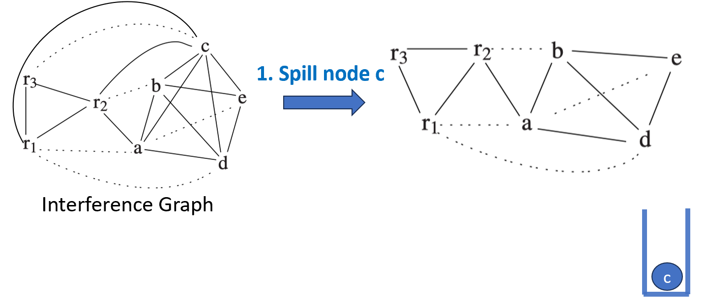

* **执行溢出**：算法决定将 **$c$** 作为溢出节点剥离。如图所示，$c$ 被彻底从左侧冲突图中擦除，并**孤零零地压入栈底**。
* **连锁反应**：随着 $c$ 的离开，它带走了整整 6 条冲突边！右侧剩下的图顿时结构大变，变量 $a, b, d, e$ 的度数出现断崖式下跌。
* **再次陷入僵局**：尽管图变简单了，但此时仔细检查剩下的非预着色节点，发现**依然无法进行常规的 Simplify**。
* **原因**：剩下的普通节点全都和虚线（MOVE 关系）死死绑定在一起，为了防止破坏合并机会，算法不能对它们进行鲁莽的 Simplify 压栈。
* **大流程导向**：既然无法 Simplify，根据漏斗模型，算法接下来将自动流转到 **Coalescing（合并）** 阶段。

---

##### 第一轮合并优化（Coalescing）

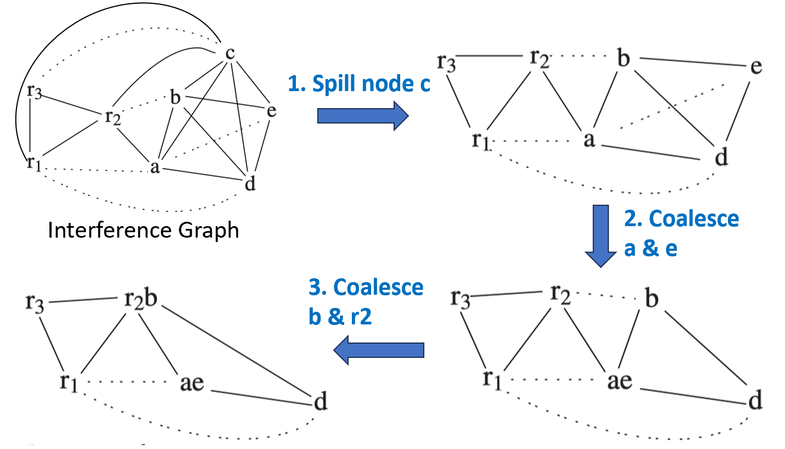

有了干净的精简子图，合并优化大刀阔斧地展开：

**2. Coalesce $a$ & $e$**：

* 我们观察右上角的图，虚拟变量 $a$ 和 $e$ 之间有一条 `MOVE` 虚线。
* 经过安全策略判定合规，它们被强行融合成复合节点 **`ae`**（见右下角图）。

**3. Coalesce $b$ & $r2$（与预着色节点合并）**：

* 紧接着，算法发现变量 $b$ 和预着色物理寄存器 $r2$ 之间存在一条虚线。
* 满足安全合并规则，这意味着 $b$ 可以直接借用物理寄存器 $r2$ 的身份。它们融合成复合节点 **`r2b`**（见左下角图）。

---

##### 第二轮合并与 Freeze 冻结

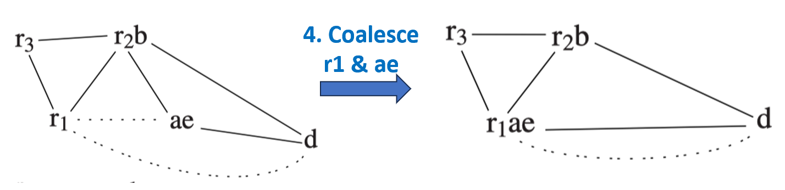

算法继续在图上进行更激进的融合：

**4. Coalesce $r1$ & $ae$**：

* 场上还剩下预着色节点 $r1$ 与复合节点 $ae$ 之间的虚线。
* 算法将其强行合体，诞生了超大复合节点 **`r1ae`**（见右上角图）。

**冲突死锁与 Freeze（冻结）**：

* 此时，全场只剩下一个普通虚拟变量 **$d$** 了，它和超大复合节点 `r1ae` 之间存在一条虚线（代表代码里的 `r1 <- d` 赋值）。
* **问题来了**：我们可以合并 `r1ae` 和 $d$ 吗？
* 检查发现：在原图里，$d$ 已经和 `r1ae` 连有实线冲突边了。
* **结论**：这条移动边被判定为**受限的（constrained）**，**无法合并**。
* **执行 Freeze**：算法果断选择放弃治疗，**冻结（Freeze）**这条虚线，把它擦除。从此，**$d$ 恢复了自由身，不再是移动相关节点**。

---

##### Simplify $d$（最后的压栈）

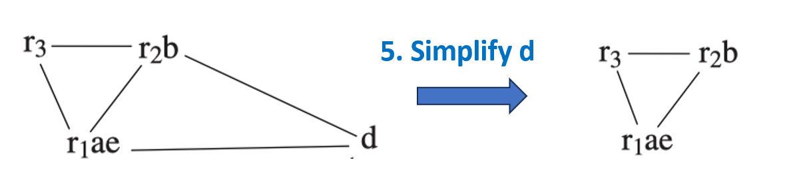

* **清除战场**：虚线被冻结擦除后，节点 **$d$** 彻底变成了孤立的 Non-move-related 节点。
* 此时它的度数（只连着 $r2b$ 和 $r3$）为 2，小于 $K=3$。
* **执行 Simplify**：算法轻松抓起 $d$，将其**压入栈中**（当前栈自底向上为 `[c, d]`）。
* **终局状态**：全场所有的普通虚拟变量全部被清理干净，**只剩下了由硬件固化的预着色核心三角形**。图变为空，简化压栈阶段圆满结束。

---

##### Select（逆向出栈染色与抓出真溢出）

现在，我们把漏斗反过来，开始从栈顶（`[d, c]`）弹出节点，尝试分配真实的物理寄存器：

* **已经合并的节点**：$a, b, e$ 由于在前面分别和物理寄存器成功双宿双飞，它们已经不需要额外染色了（自动继承 $a \to r1, b \to r2, e \to r1$）。
* **Pop $d$**：
* 弹出 $d$，恢复它的连线：它连接着 $r2b$ 和 $r1ae$。
* 此时邻居占用了物理寄存器 $r2$ 和 $r1$。
* 4 种颜色里剩下物理寄存器 **`r3`** 是干净的。于是算法挑出 **`r3`** 恩赐给 $d$。

**Pop $c$ —— 真相大白（Actual Spill）**：

* 当弹出栈底那个当年由于短视而被悲观溢出的 **$c$** 时，不幸发生了。
* 恢复 $c$ 在原图中的全连接冲突：发现它的邻居们已经把 $r1, r2, r3$ 这 3 种颜色**完完全全、密不透风地占满了**。
* 留给 $c$ 的可用颜色数量为 0。**$c$ 变成了无可挽回的实际溢出（Actual Spill）**！

---

##### Rewrite（重写程序，插入内存存取）

既然 $c$ 彻底没救了，编译器后端正式执行“外科手术”，对最初的汇编代码进行**内存级别的重写（Rewrite）**：

**规则**：

* 在每一个 $c$ 的定义（def）后面，插入一条 **STORE** 指令，把值写进内存的栈帧地址 $M[c_{\text{loc}}]$。
* 在每一个 $c$ 的读取（use）前面，插入一条 **LOAD** 指令，从 $M[c_{\text{loc}}]$ 临时把数据抓上来。

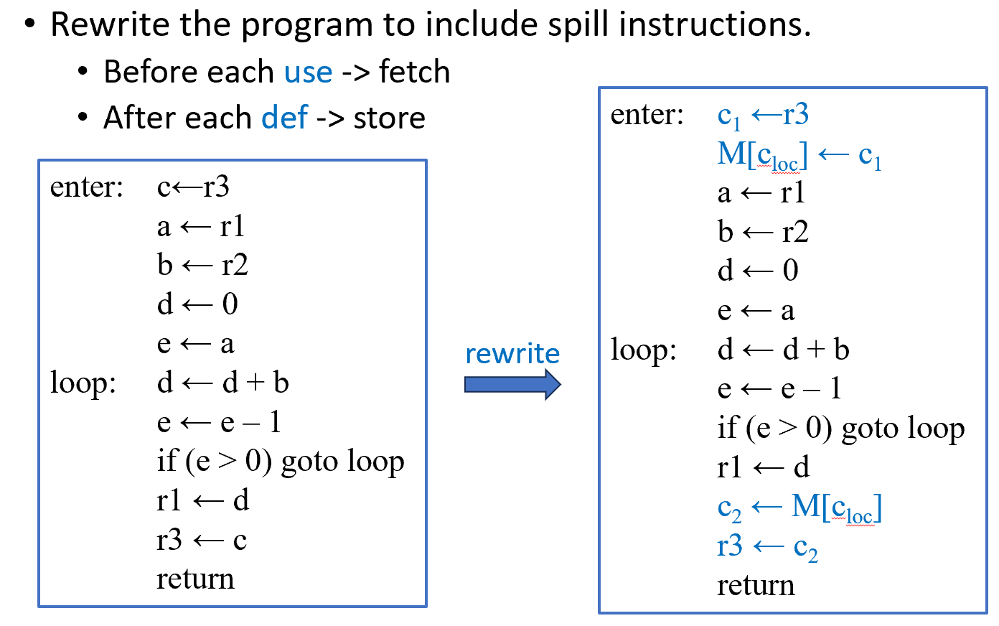

**重写成果（右框）**：

原本开头的 `c <- r3` 被粉碎改写成了两步：

1. 用一个生命周期极短的全新临时变量 $c_1$ 承接：$c_1 \leftarrow r3$。
2. 立刻塞进内存：$M[c_{\text{loc}}] \leftarrow c_1$。

原本结尾的 `r3 <- c` 同样被粉碎改写成了两步：

1. 从内存里临时抓到新变量 $c_2$ 中：$c_2 \leftarrow M[c_{\text{loc}}]$。
2. 送给目标硬件：$r3 \leftarrow c_2$。

* **核心变化**：原来那个横跨整个函数的巨型长寿变量 $c$，被粉碎成了两个只活了“一瞬间”的微小局部变量 **$c_1$** 和 **$c_2$**。

---

##### 开启第二轮全新迭代（Start Over）

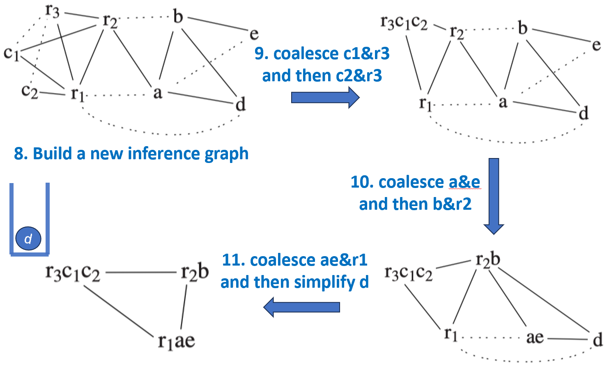

程序重写完毕，原来的冲突图作废。整个寄存器分配算法满血复活，回到第一阶段 **Start Over 重新构建冲突图**！

**构建新图（左上图）**：

* 新图里增加了微小节点 $c_1$ 和 $c_2$。因为它们寿命极短，所以它们在图里的冲突线非常少，极其温和。

**新一轮合并（右上图）**：

* 算法惊喜地发现：$c_1$ 与 $r3$ 之间存在虚线，且完全满足 George 安全策略！立刻合并成 $r3c1c2$。

**连环大合并（下两图）**：

* 接下来，由于阻碍被扫清，图结构发生了多米诺骨牌式的塌方：$a\&e$、$b\&r2$、`ae&r1` 势如破竹般全部成功安全合并。
* 剩下的唯一变量 $d$ 也符合条件，顺利通过 Simplify 压入栈中。

---

##### Select

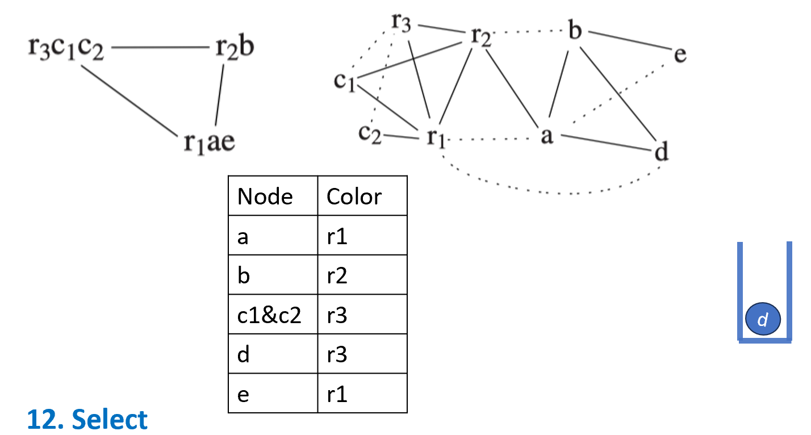

* 从新的栈里弹出唯一需要染色的节点 **$d$**。
* 算法为 $d$ 分配了物理寄存器 **`r3`**。
* **大表定格**：全场所有变量（包括重写后的 $c_1, c_2$）无一例外，在第二轮迭代中**全部拿到了属于自己的物理寄存器绿卡**！

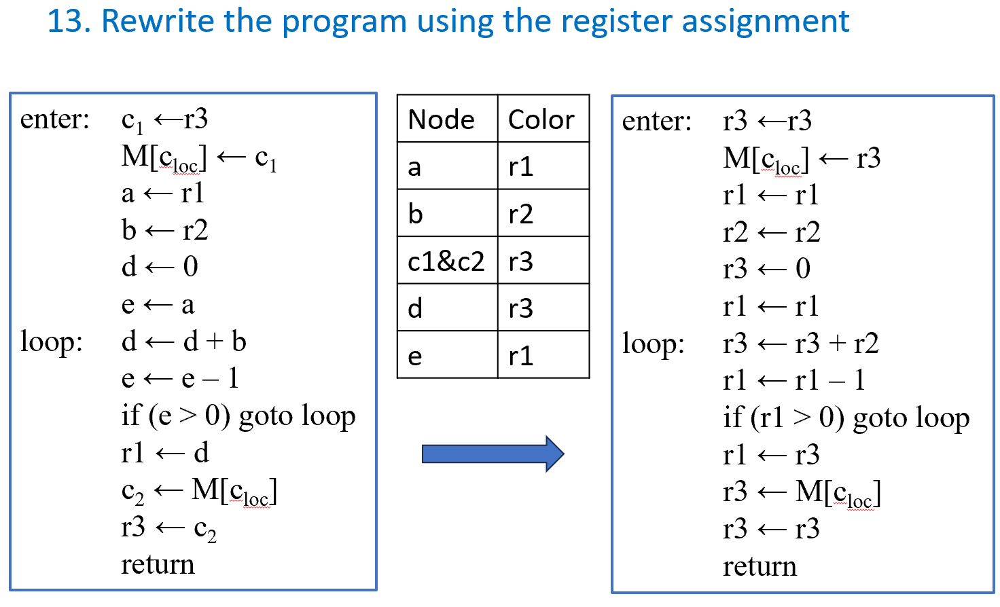

拿到了这张完美的映射表（Node -> Color），编译器把表格中的真实物理寄存器套入第60页重写后的程序中（左框变右框）：

* 例如：将所有的 $a$ 和 $e$ 直接替换为 **`r1`**；将所有的 $b$ 替换为 **`r2`**；将所有的 $d$ 和 $c_1/c_2$ 替换为 **`r3`**。

得到右框的代码后，我们赫然发现了大量极其荒谬的“原地打转指令”（高亮部分）：

* `r3 <- r3` （自己赋值给自己？删掉！）
* `r1 <- r1` （自己赋值给自己？删掉！）
* `r2 <- r2` （自己赋值给自己？删掉！）

将所有这些由于同色合并而失去存在意义的垃圾 `MOVE` 指令**全部一笔抹杀**后，最终交付给 CPU 执行的纯净机器指令序列如下图。

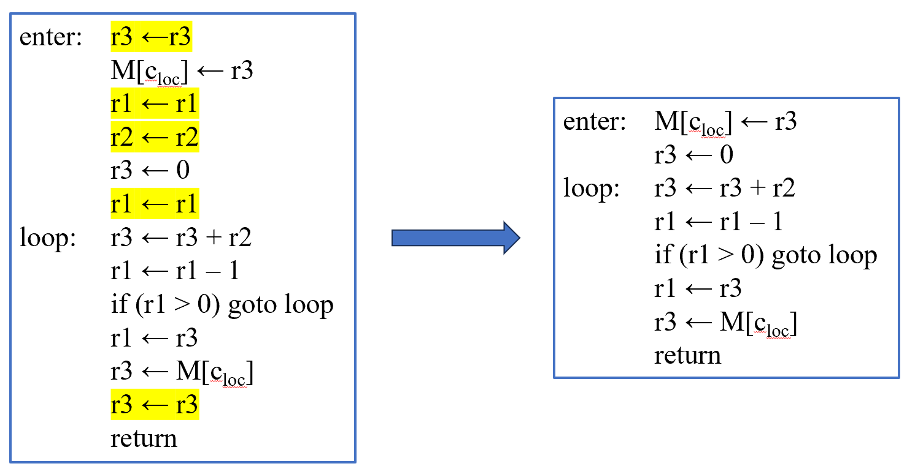

---

**在第一轮面对初始冲突图时，既然 $r3$ 的所有高度数邻居都已与 $c$ 存在冲突，为什么不能依照 George 条件将 $r3$ 和 $c$ 合并？**

. 核心规则：涉及预着色节点时，谁来接受 George 测试？

当我们要检查两个节点是否能合并时，如果其中一个是**预着色节点**（本例中是 $r3$），另一个是**普通虚拟变量节点**（本例中是 $c$），George 策略的使用有极其严格的“方向性”：

> **“When applying George to pairs involving a pre-colored node, always pick the one that is not pre-colored to test the rule.”**
> （当对包含预着色节点的对子应用 George 策略时，**永远挑出那个非预着色的普通节点来接受规则测试**。）

正确的做法：在普通节点 $c$ 上测试 George

我们要判断能否合并 $c$ 到 $r3$，必须去检查 **$c$ 的每一个冲突邻居 $t$**，看 $t$ 是否满足“要么与 $r3$ 冲突，要么是低度数节点”。

* **结果**：检查后发现 $c$ 的邻居（比如 $e$ 或 $d$）并不满足这些条件，因此在 $c$ 上测试 George 会**宣告失败**，判定不能合并。

2. 致命的思维陷阱：为什么不能反过来在 $r3$ 上测试 George？

你可能会问：George 策略在普通图里不是对称的吗？既然在 $c$ 上卡不过去，那我们**反过来**，站在 $r3$ 的视角去数 $r3$ 的邻居行不行？

* 如果我们盯着 $r3$ 的邻居看，会发现 $r3$ 的所有高度数邻居确实都已经和 $c$ 存在冲突了。如果允许在 $r3$ 上套用 George 公式，数学形式上它**居然能够完美通过验证**！

为什么编译器实现必须严格禁止在 $r3$ 上做测试？

1. **预着色节点不能溢出（Spill）**：预着色节点（如 $r3$）代表的是真实的硬件寄存器，它的度数在算法里被视为**无穷大**。这意味着它绝对不能被 Simplify，也绝对没有退路去执行 Spill。
2. **强行合并会制造“假合法”的炸弹**：节点 $c$ 在全图里是一个长寿命、强冲突的节点（度数高达 6，且循环外只有 2 次微小的读写开销）。正如我们前面定量计算所见，**$c$ 其实是全场最应该被驱逐到内存的“头号战犯”**。
3. **毁灭性的后果**：如果编译器允许在 $r3$ 上测试 George 并批准了 $r3$ 和 $c$ 的合并，那就意味着把 $c$ 强行绑定到了硬件寄存器 $r3$ 上。由于 $r3$ 具有“不可溢出、不可简化”的免死金牌，**这会导致原本在这个 $K=3$ 的极度饥饿的图里最应该被 spill 掉的 $c$，丧失掉它被 spill 的机会**！

长寿命的 $c$ 一旦霸占了 $r3$，整个图的冲突网络将被彻底锁死，后续的 $a, b, d, e$ 将连环爆炸，产生大量极其不必要的 Actual Spills，生成极其低效的代码。

---