# Chapter 13 | Garbage Collection

## Manual Memory Management (手动内存管理)

**手动管理方法（Manual method）**：

* 这是 **C 和 C++** 等底层语言所采用的经典方式。
* 程序员需要显式地使用 `malloc` 来在堆（Heap）上动态分配内存，并使用 `free` 来手动释放指针指向的内存。

**手动管理带来的问题（Problems with manual management）** 极其容易引发三大致命 Bug：

* **内存泄漏（Memory leaks）**：分配了内存却忘记释放，导致可用内存越来越少。
* **双重释放（Double frees）**：对同一块内存块执行了两次 `free`，容易破坏内存管理器的内部结构。
* **释放后使用（Use after frees / 悬空指针）**：内存已经被释放了，程序却还在尝试读写这块内存，这会导致数据损坏或严重的安全漏洞。

**类型安全问题（Type-safe problems）**：由于指针可以被强转或自由操作，手动管理很难保证类型的绝对安全。

**为什么这些 Bug 极难排查（Storage bugs are hard to find）**：“一个 Bug 产生的影响，往往在**时间**和空间（代码位置）上都距离其出错的源头非常遥远。” 比如你在第 10 行错误地释放了内存，程序可能在运行了半小时后、在第 10000 行代码处才突然崩溃，这给调试带来了巨大的痛苦。

---

## Automatic Memory Management (自动内存管理)

* **自动化释放**：内存的回收完全由系统自动完成。
* **什么是垃圾（Garbage）**：定义非常简单直接——**已经分配了空间、但程序不再使用的内存**。

**理想状态 vs 现实工程**：

* **理想状态**：如果一个对象在**未来的计算中绝对不会再被用到**（即非动态活跃，not dynamically live），我们就应该把它当作垃圾回收掉。
* **不可判定性（Undecidable）**：然而，在计算机科学中，准确预测一段代码未来还会不会读写某个对象是**不可判定**的（类似于停机问题）。
* **保守的近似方案（Conservative approximation）**：既然无法完美预测未来，工程上就必须采用一个安全的近似标准——**可达性（Reachability）**。

**基于可达性的垃圾判定**：

* 如果从程序变量出发的任何指针链都**无法到达**堆中的某个记录，那么它就彻底和程序失联了，此时它**绝对是垃圾**（Not reachable $\rightarrow$ Garbage）。
* **反向逻辑注意**：如果一个对象已经是垃圾（程序未来不再用它），它在当前**有可能仍然是可达的**（指针还连着，但代码再也不会去读它）。因此，自动内存管理只能确保回收“不可达”的垃圾。

---

### Automatic Memory Management (可达性的定义)

一个对象 `x` 被判定为**可达（reachable）**，当且仅当满足以下两种情况之一：

1. **基本情况（Base Case）**：寄存器（或栈上的局部变量、全局变量等根集 Root Set）中直接包含指向 `x` 的指针。
2. **归纳情况（Inductive Case）**：另一个**已经确定可达**的对象 `y` 的内部包含指向 `x` 的指针。

* 通过这种递归关系，整个运行时的内存对象就形成了一张有向图。垃圾回收器的任务就是从“根节点”开始遍历这张图。

---

### Garbage Collection: What (什么是垃圾回收)

**垃圾回收（Garbage Collection, GC）的定义**：

* 它是一种自动化的过程，旨在**无需程序显式调用 `free**` 的情况下，自动回收那些已分配但不再使用的存储空间。

**谁来执行 GC？**

* 垃圾回收**并不是由编译器（Compiler）在编译时完成的**。
* 它是由**运行时系统（Runtime System）**（即与编译后的代码链接在一起的底层支持程序、垃圾回收器引擎或虚拟机）在程序运行期间动态执行的。

---

### Garbage Collection: Example (垃圾回收示例)

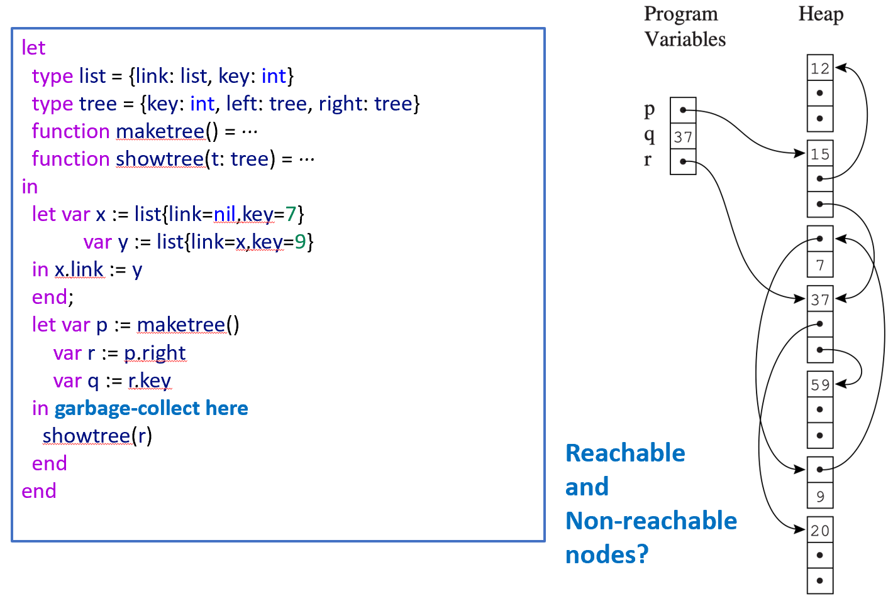

**代码逻辑与作用域（Scope）分析**：

* 代码定义了链表 `list` 和树 `tree` 的结构。
* **第一个代码块**：在内部作用域中，创建了变量 `x` 和 `y`（它们互相连接形成了环状链表），但这个 `let...in...end` 块在执行到下面之前就**已经结束并关闭了**。这意味着当程序运行到 `garbage-collect here` 时，局部变量 `x` 和 `y` 已经退栈失效。
* **第二个代码块**：创建了树结构，当前活跃的程序变量（Roots）有 `p`（指向树根）、`r`（指向 `p.right`）以及整型变量 `q`。

**可达节点（Reachable Nodes）**：

* 看最左侧的 **Program Variables**（根集）：变量 `p` 和 `r` 包含有效的指针。
* 从 `p` 出发，顺着箭头可以到达堆中的 `15` 号节点，从 `15` 号节点又可以到达顶部的 `12` 号节点和下方的 `37` 号节点。
* 从 `r` 出发，直接指向了下方的 `37` 号节点，从该节点继续向下可以遍历到 `59`、`9`、`20` 等节点。
* 这些可以通过 `p` 或 `r` 顺藤摸瓜找到的节点都是**可达节点**，GC 会保留它们。

**不可达节点（Non-reachable Nodes / 垃圾）**：

* 图中的 `7` 号节点（以及它上方带有箭头的相关节点，它们对应之前作用域里被孤立的 `x` 和 `y` 链表）。
* 尽管这些节点内部可能还有指针互相指着，但由于 **Program Variables 中没有任何一个活着的变量能指向它们**，它们成了内存中的“孤岛”。
* 因此，这些节点就是**不可达节点**，在这次 `garbage-collect` 中会被runtime系统彻底清空并回收。

---

## Mark-and-Sweep Collection (标记-清除：图论抽象)

**图的构建**：程序中的变量（Program Variables，即栈和寄存器）以及堆中分配的记录（Heap-allocated records）共同组合成了一个**有向图**。

* 堆中的每个内存块（对象/记录）就是图中的一个**节点（Node）**。
* 对象之间的指针、以及变量指向对象的指针就是图中的**有向边（Directed Edge）**。
* **根节点（Roots）**：程序变量就是这个有向图的**根节点（Roots）**。垃圾回收的搜索必须从这些根节点出发。
* **可达性的图论定义**：一个节点 $n$ 是**可达的（reachable）**，当且仅当存在一条从某个根节点 $r$ 出发、顺着有向边指引的路径，即：

$$r \rightarrow \dots \rightarrow n$$

如果找不到这样一条路径，说明该节点已经和程序彻底断开，属于垃圾。

---

### Mark-and-Sweep Collection (标记阶段)

* **核心思想**：使用图搜索算法（例如**深度优先搜索 DFS**）从所有根节点出发，遍历整个图，并标记（mark）所有能够被访问到的可达节点。

**DFS 伪代码解析**：

```pascal
function DFS(x)
  if x is a pointer into the heap          // 如果 x 是一个指向堆的指针
    if record x is not marked              // 并且 x 指向的记录还没有被标记
      mark x                               // 那么标记记录 x
      for each field fi of record x        // 遍历记录 x 内部的每一个字段 fi
        DFS(x.fi)                          // 递归地对每一个字段进行深度优先搜索
```

---

### Mark-and-Sweep Collection (清除阶段)

* **基本原则**：任何在标记阶段**没有被标记**的节点必然是垃圾，应该被系统重新收回。

**具体如何执行（How?）**：

* **线性扫描（Sweep the entire heap）**：运行时系统会从堆的**第一个内存地址一直扫描到最后一个内存地址**（在物理内存上做一次全盘大扫除）。
* **寻找未标记节点**：如果发现某个节点没有标记（如图中的节点 `7`），说明它是垃圾。
* **构建空闲链表（Freelist）**：垃圾回收器会将这些被回收的垃圾内存块通过指针串联起来，组成一个单链表，称为**空闲链表（Freelist）**。后续程序需要新分配内存时，直接从 `freelist` 中切块即可。
* **重置标记（Unmark）**：在扫描的过程中，如果遇到了**已被标记**的存活节点，清除阶段必须**去掉它的标记（unmark）**。这是为了下一次垃圾回收时，所有对象都能重新从零开始判定。

---

### Mark-and-Sweep Collection - Algorithm (完整算法与运行机制)

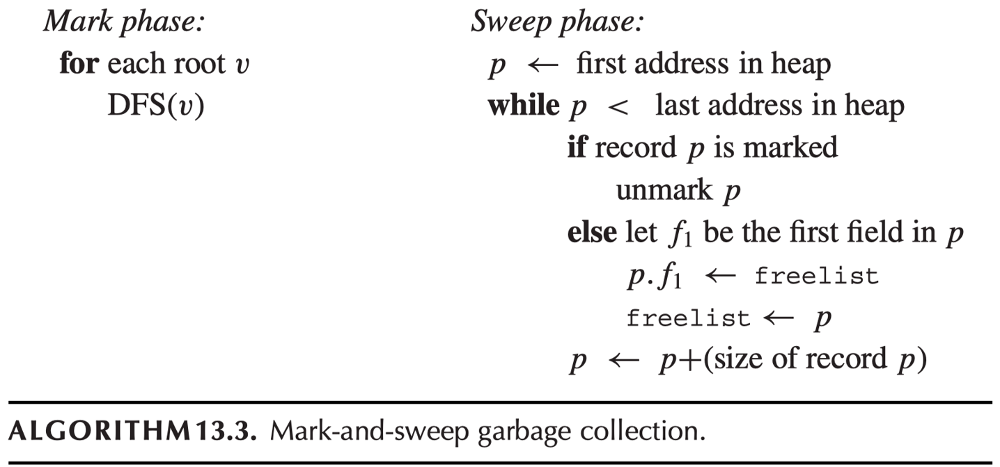

**完整算法伪代码分析**：

**Mark 阶段**：遍历每一个根变量 $v$，对其调用 `DFS(v)` 启动标记。

**Sweep 阶段**：

* 让指针 $p$ 指向堆的起始地址。
* 通过循环 `while p < last address` 推进。
* 如果 $p$ 处的记录被标记了，则重置它：`unmark p`。
* 否则（说明是垃圾），将其头插法插入空闲链表：让 $p$ 的第一个字段 $p.f_1$ 指向当前的 `freelist` 头，然后让 `freelist` 重新指向 $p$。
* 最后，将指针 $p$ 移动到下一个记录的地址：`p <- p + (size of record p)`。

**垃圾回收与程序的交替运行**：

1. **Stop-the-World**：当垃圾回收（GC）发生时，主程序暂停，GC 开始工作。
2. **恢复执行**：GC 完成后，编译后的用户程序恢复执行（resumes execution）。
3. **内存分配流程**：此后，当程序在堆上需要分配新对象（heap-allocate）时，它会直接从刚刚构建好的 `freelist` 中获取。如果某天 `freelist` 再次被用空了（empty），程序就会再次触发另一次 GC 来补充（replenish）空闲内存。

---

### Cost of Garbage Collection (垃圾回收的开销分析)

**时间开销（Time Cost）**：

* **DFS 搜索（标记阶段）**：其耗时与**它成功标记的节点数量（即存活对象的数量）成正比**。如果堆里活对象很少，标记会非常快。
* **Sweep 阶段（清除阶段）**：其耗时与**整个堆的大小 $H$（Size of the heap）成正比**。因为不管里面有多少垃圾，GC 都必须把整个堆从头到尾线性扫描一遍。这也是该算法的一个主要缺点（堆越大，清除越慢）。

**空间风险（Space Cost）与内存崩溃隐患**：

* 标准的 DFS 算法是基于递归（recursive）实现的。
* **最坏情况灾难**：如果堆中的对象连成了一条极长的单向链表，在最坏情况下，递归所需的运行时**激活记录（Activation Records，即调用栈帧）的长度甚至会超过整个堆的大小**。这会导致极其讽刺的后果：程序为了回收内存而运行 GC，结果 GC 自己因为递归导致了栈溢出（Stack Overflow）而崩溃。

**解决方案**：不要使用系统自带的函数递归，而是在代码中**引入一个显式的栈（Explicit Stack）结构**来代替递归。这样只需要付出 $H$ 个字的紧凑空间（只存指针），而不是 $H$ 个沉重的系统激活记录（激活记录包含返回地址、参数、寄存器等，开销极大）。

---

#### Using an Explicit Stack (使用显式栈优化标记算法)

**优化后的伪代码分析**：

```pascal
function DFS(x)
  if x is a pointer and record x is not marked
    mark x
    t <- 1                // t 是显式栈的栈顶指针（index of the stack top）
    stack[t] <- x         // stack 是一个显式的工作列表（worklist）
    while t > 0           // 只要栈不为空
      x <- stack[t]; t <- t - 1    // 出栈一个节点 x
      for each field fi of record x
        if x.fi is a pointer and record x.fi is not marked
          mark x.fi       // 关键优化：在压栈前先进行标记，防止重复压栈
          t <- t + 1; stack[t] <- x.fi   // 将子节点压入显式栈

```

**核心改进点**：

* 引入了数组 `stack`（工作列表）和栈顶变量 `t`。
* 通过 `while t > 0` 循环消除了函数的递归调用。
* **前置标记优化**：在把子节点 `x.f_i` 压入栈之前，立刻执行 `mark x.f_i`。这样可以确保即使一个对象被多个其他对象引用，它也只会被压栈一次，极大地控制了栈的最大深度，完美解决了栈溢出风险。

---

## Pointer Reversal (指针逆转)

* **核心目标**：在深度优先搜索（DFS）中**彻底丢弃栈（Leave the stack out）**，从而最大化地节约内存。

**关键洞察（Insight）**：

* 在标准的 DFS 中，当我们沿着一个指针字段 $x.f_i$ 深入向下探索子节点时，直到我们完成了对该子节点完整子树的遍历并准备“回溯（Backtrack）”之前，程序是**绝对不会**再次读取原位置 $x.f_i$ 的。
* 既然这个指针字段在一来一回的这段时间里处于“闲置”状态，我们为什么不拿它来做点别的事呢？

**逆转机制（Pointer Reversal）**：

* 为了省下记录“来时路”的栈空间，算法在沿着 $x.f_i$ 向下走的时候，**会顺手把 $x.f_i$ 这个指针反向，让它指向 $x$ 的父节点（即带我们来到 $x$ 的那个节点）**。
* 这样一来，当前的堆结构本身就变成了一个隐式的、串联起来的“回溯链表”。
* **回溯与还原**：当子树全部遍历完毕，算法需要向上回溯时，只需沿着这个反向的指针顺藤摸瓜退回到父节点。在退回的同时，再把该指针**扭转回原始方向**。这样，既完成了遍历，又完美复原了内存，没有浪费一个字节的额外空间。

---

### Pointer Reversal (算法核心术语与伪代码)

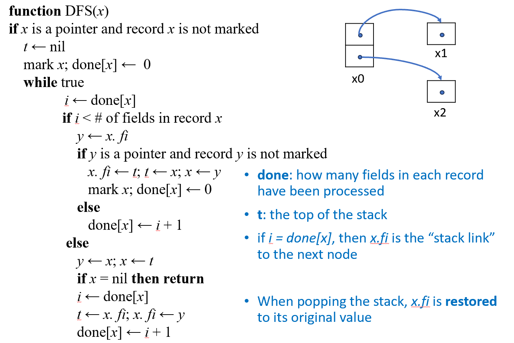

1. $x$：**当前正在访问的节点指针**（相当于传统 DFS 里的当前活跃变量）。
2. $t$：**“模拟栈顶”指针（Top of the stack）**。它并不指向一个真正的栈，而是指向当前节点 $x$ 的**父节点**。通过各个节点被逆转的字段，从 $t$ 出发可以一路连回最初的根节点。
3. $done[x]$：**计数器数组**。用于记录节点 $x$ 内部的**第几个指针字段正在被处理**。例如，$done[x] = 0$ 意味着准备处理第一个字段 $f_0$；处理完后 $done[x]$ 变成 1，准备处理 $f_1$。

---

#### 核心逻辑分支

**向下探索（前进）分支**：如果 $i < \text{\# of fields in record } x$，说明 $x$ 还有未遍历的子节点。

* 改写指针实现逆转：$x.f_i \leftarrow t$（让当前字段指向父节点）。
* 移动指针：$t \leftarrow x$（当前节点变成新的父节点），$x \leftarrow y$（走向子节点 $y$）。

**向上回溯（后退）分支**（`else` 部分）：如果 $x$ 的所有字段都处理完了。

* 顺着逆转的指针往回走：$y \leftarrow x; x \leftarrow t; t \leftarrow x.f_i$。
* **还原指针**：$x.f_i \leftarrow y$（把指针调转回来，复原内存）。

---

### 算法执行过程单步追踪 (Trace)

#### 步骤 1 —— 初始化并标记根节点 $x_0$

**初始状态**：

* $t = \text{nil}$ （栈顶为空，因为 $x_0$ 是根，它没有父节点）。
* $x = x_0$ （当前位于 $x_0$）。
* **动作**：标记 $x_0$（贴上小蓝块），并将它的处理进度初始化为 $done[x_0] = 0$。
* **此时图示**：内存完好无损，$x_0$ 的两个指针正常指向 $x_1$ 和 $x_2$。

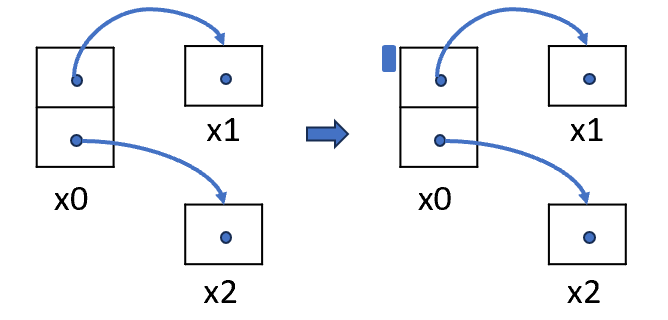

---

#### 步骤 2 —— 向下探索第一个字段 $f_0$，指针逆转

* **状态检查**：$i = done[x_0] = 0$。因为 $0 < 2$（有两个字段），进入前进分支。

**关键动作（指针逆转）**：

1. 暂存子节点：$y = x_0.f_0 = x_1$。
2. **逆转指针**：$x_0.f_0 \leftarrow t = \text{nil}$。此时 $x_0$ 的第一个指针不再指向 $x_1$，而是反过来指向了 $\text{nil}$（看图右侧，箭头被掰向了左边的 $\text{nil}$）。
3. **指针前移**：$t \leftarrow x_0$（$t$ 现在指向父节点 $x_0$），$x \leftarrow y = x_1$（当前节点变为 $x_1$）。
4. 标记新节点：标记 $x_1$，初始化 $done[x_1] = 0$。

---

#### 步骤 3 —— 从 $x_1$ 回溯，复原指针

* **状态检查**：当前在 $x = x_1$。因为 $x_1$ 是叶子节点（没有子指针字段，$\text{\# of fields} = 0$），$i = done[x_1] = 0$ 不满足 $i < 0$，直接进入 `else` 后退分支。

**关键动作（回溯与复原）**：

1. 进入内部的 `else`（因为此时 $x_1$ 本身处理完了）：
2. 准备回退：$y = x_1; x = t = x_0$（当前指针 $x$ 成功退回到了父节点 $x_0$）。
3. **取回老栈顶**：$t \leftarrow x_0.f_0$ （此时 $x_0.f_0$ 里面存的是当年的 $t$，即 $\text{nil}$，于是 $t$ 变回了 $\text{nil}$）。
4. **完美复原**：$x_0.f_0 \leftarrow y = x_1$（把 $x_0$ 的第一个指针重新指回 $x_1$，黑魔法解除！内存恢复如初）。
5. 进度推进：$done[x_0] \leftarrow i + 1 = 1$。

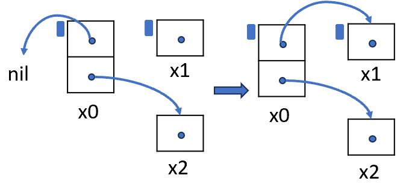

---

#### 步骤 4 —— 向下探索第二个字段 $f_1$，再次逆转

* **状态检查**：当前回到了 $x = x_0$。此时 $i = done[x_0] = 1$。因为 $1 < 2$，继续沿着第二个字段探索。

**关键动作**：

1. 暂存子节点：$y = x_0.f_1 = x_2$。
2. **逆转指针**：$x_0.f_1 \leftarrow t = \text{nil}$（让第二个指针指向父节点链 $t$）。
3. **指针前移**：$t \leftarrow x_0$, $x \leftarrow x_2$。
4. 标记新节点：标记 $x_2$，初始化 $done[x_2] = 0$。
5. **此时图示**：看右侧图，此时 $x_0$ 的下方指针被掰向了左边，指向了 $\text{nil}$。

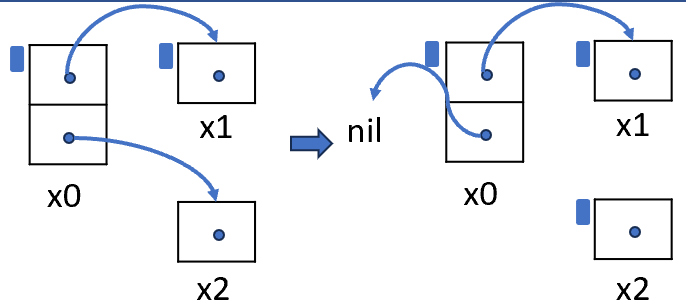

---

#### 步骤 5 —— 从 $x_2$ 回溯，二次复原

* **状态检查**：当前在 $x = x_2$。叶子节点无处可去，触发后退分支。

**关键动作**：

1. 执行回溯逻辑：$y = x_2; x = t = x_0$（当前指针再次退回 $x_0$）。
2. **取回老栈顶**：$t \leftarrow x_0.f_1$ （变回 $\text{nil}$）。
3. **复原指针**：$x_0.f_1 \leftarrow y = x_2$（将 $x_0$ 的第二个指针重新指回 $x_2$，内存全部复原）。
4. 进度推进：$done[x_0] \leftarrow i + 1 = 2$。

---

#### 步骤 6 —— 根节点 $x_0$ 彻底完成，算法安全退出

* **状态检查**：当前在 $x = x_0$。此时 $i = done[x_0] = 2$。因为不满足 $2 < 2$，进入后退分支。

**关键动作**：

1. 此时执行外层 `else` 里的：$y = x_0; x = t = \text{nil}$。
2. 紧接着触发安全退出条件判断：`if x = nil then return`。
3. **大功告成**：算法检测到 $x$ 变成了 $\text{nil}$，说明已经回溯过了最初的根节点，整张图的深度优先标记全部结束，函数退出。

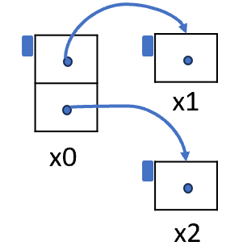

---

### Fragmentation (内存碎片问题)

**外部碎片（External fragmentation）**：

* **定义**：程序此时想要分配一个大小为 $n$ 的连续空间。虽然此时堆里所有空闲内存的总和远大于 $n$，但它们都是一小块一小块**散落在各处**的（如图中的那些带有点的白色小方块），没有任何单块连续空间能塞得下 $n$。
* **后果**：明明有空闲内存，却会眼睁睁看着程序报出 `Out of Memory`（内存不足）。

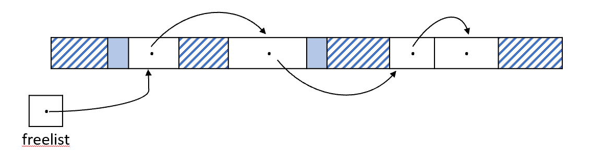

**内部碎片（Internal fragmentation）**：

* **定义**：分配器为了图省事或者为了内存对齐，把一块“过大”的空闲块直接塞给了程序，且**没有进行切分**。
* **后果**：这部分被浪费的死内存被锁死在了分配记录的**内部**，外部无法利用。

---

##  Reference Counts (引用计数)

* **换个思路**：“标记-清除”就像是定期的大扫除，必须先停下程序，把所有可达的对象翻个遍。
* **什么是引用计数（Reference Counting）**：这是一种“实时监控”策略。它不关心全局的图结构，而是直接在暗中盯着每一个独立的对象，看当前**有多少个指针正指向它**。
* **存储机制**：这个计数值（Reference Count）被直接作为元数据，**存放在每个对象的头部/内部**。

---

### Reference Counts (如何追踪与底层实现)

* **编译器的幕后黑手**：为了维持计数的准确，编译器在编译代码时，每当遇到一句普通的指针赋值 `x.f_i <- p`，都必须在背后偷偷插入一整套额外的机器指令。

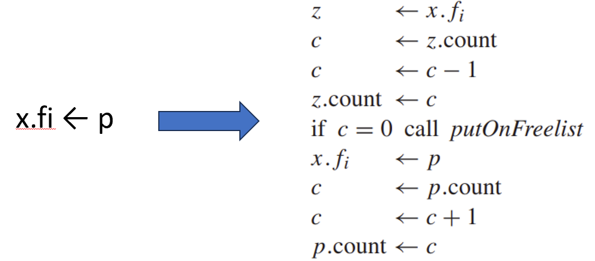

**赋值时的连锁反应**：

1. **旧爱减一**：`x.f_i` 原本指向的对象（代码中的 `z`），因为被主主人抛弃了，其引用计数必须减 $1$。
2. **即时释放**：如果扣减后 `z` 的计数降为 0，说明它彻底成了没人要的垃圾，立刻将其扔进 `freelist`。并且，它死之前还要去**连锁扣减**它所指向的其他对象的计数。
3. **新欢加一**：新指过来的指针 `p` 对应的对象，其引用计数必须加 $1$。

原本硬件层面只需要 $1$ 条简单的写入指令，现在直接膨胀成了 $10$ 行复杂的读取、判断、跳转和写入组合。

---

### Reference Counts (延迟扣减的工程优化)

* **级联删除的痛点**：在传统实现中，如果一个大型根节点的引用计数清零，会瞬间触发多米诺骨牌效应，导致底层疯狂递归去扣减子节点的计数并释放内存。这会造成程序**瞬间严重卡顿（Stop-the-world spike）**。

**延迟化整为零（Lazy/Recursive Decrementing in Allocator）**：

* **新做法**：当一个对象 $r$ 的计数变 0 被扔进 `freelist` 时，**先憋着**不扣减它引用的子节点 $r.f_i$ 的计数。
* **时机延迟**：直到未来的某一天，程序重新向内存分配器要空间，把 $r$ **从 `freelist` 拿出来重新使用时**，才顺手去扣减 $r.f_i$ 的计数。

**两大核心好处**：

1. 把密集的死工作分摊到了未来的每一次小分配中（Shorter pieces），让主程序运行得极其平滑，这对交互式系统或游戏等实时系统至关重要。
2. 极大地简化了编译器工作，因为递归扣减的复杂代码现在只需要收拢在**分配器（Allocator）这一个地方**写一次即可。

---

### Reference Counts: Problems (两大致命缺陷)

引用计数虽然看起来精妙、实时、直观，但在工业界却让人又爱又恨，因为它有两个绕不开的重大缺陷：

1. **循环引用无法回收（Cycles of garbage cannot be claimed）**：如果是死循环链表，引用计数直接抓瞎。
2.  assignment 开销极度昂贵（Very expensive）：每一次微小的指针改变都在疯狂消耗 CPU 周期。

---

#### Problem 1: Reference Cycle (致命伤：循环引用灾难)

* **循环引用定义**：一组对象之间互相指着对方，形成了一个闭环。
* **致命盲区**：引用计数只知道“有人指着我”，但它没有全局视野，分不清指着它的这个人到底是活着的主程序，还是同样已经死掉的孤岛。
* **图解分析**：图中的某些垃圾节点哪怕和主变量 `p`, `q`, `r`（根集）彻底断绝了父子关系（已经不可达了），但因为它们内部互相抱着对方，引用计数**永远不为 0**。
* **历史反面教材**：早期的 Perl 语言以及老旧的 Firefox 2 浏览器都因为使用纯引用计数而饱受这一内存泄漏折磨。

---

#### Problem 2 (昂贵的 CPU 性能代价)

* 原本在纯手动管理或标记清除中，给一个结构体字段换个指针，纯粹是硬件里**一条最基础的机器指令**：`x.f_i <- p`。
* 但在引用计数系统里，为了维持计数器的神圣不可侵犯，你必须一口气执行右边密密麻麻的这一大坨逻辑。程序的每一次指针赋值，运行开销直接翻了数倍甚至十倍，代价极其惨重。

---

### Analysis of Reference Counts (引用计数终极总结)

**主要优点**：

* **实现简单（Simple to implement）**：它不需要像标记清除那样去写复杂的图遍历算法，每个对象自己管好自己就行。

**三大致命缺点**：

* **能力有缺失**：无法回收任何不可达的循环引用对象（必须引入额外的环检测器或配合弱引用）。
* **可能引发大卡顿**：如果不做延迟优化，级联删除引发的大面积大清扫会瞬间卡死主线程。
* **显著拖慢基本运行期性能**：每一次日常的对象间指针赋值都被附加了沉重的代价。

---

## Copying Collection (复制算法)

* **核心点子（Idea）**：把堆内存一分为二（通常称为 `from-space` 和 `to-space`）。每次只使用其中的一半，垃圾回收时，把活对象直接**复制**到另一半干净的内存中。

**图论抽象**：同样将可达的堆内存看作有向图：

* **节点（nodes）**：内存记录（对象）。
* **边（edges）**：指针。
* **根（roots）**：主程序变量。

**具体回收流程**：

1. 图遍历只在当前使用的 **`from-space`** 中进行。
2. 一旦发现一个活对象，立刻在全新的 **`to-space`** 区域里为它构建一个一模一样的“克隆体”（同构复制，isomorphic copy）。

**无碎片化的紧凑复制（Compact）**：

* 由于克隆体在 `to-space` 里是**紧挨着、连续排列**存放的，因此搬家结束后，所有活对象完美靠拢，**彻底消除了外部和内部碎片**。

**一锅端交替**：

* 搬家完成后，让根变量全部改指到 `to-space` 的新地址上。
* 此时，整个 `from-space` 剩下的所有东西瞬间自动沦为不可达的垃圾。下一次 GC 时，两块空间角色对调（`from` 变 `to`，`to` 变 `from`）。

---

### Copying Collection (直观图解与分配优势)

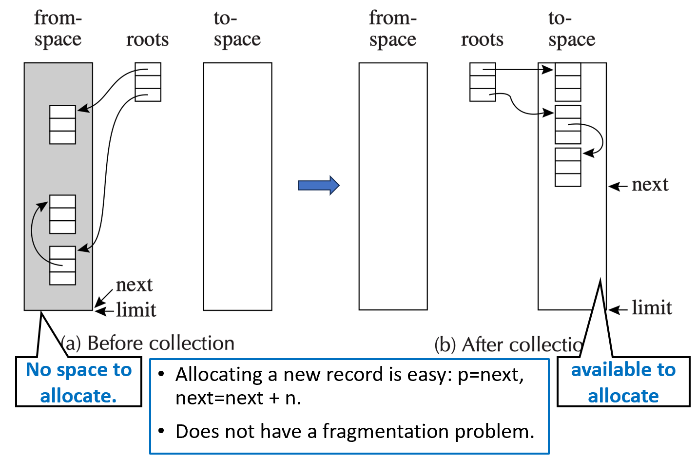

**（a）Before collection（回收前）**：

* 左侧的 `from-space` 此时塞满了对象，有些还活着（被 `roots` 指着），有些已经死了。此时可用空间已经见底（`No space to allocate`）。
* 右侧的 `to-space` 处于完全空闲、干净的状态。

**（b）After collection（回收后）**：

* 活对象被整整齐齐地复制到了 `to-space` 的最顶部，且彼此之间没有任何空隙！
* 系统使用两个指针来管理：**`next`** 指向当前连续空闲空间的起始位置，**`limit`** 标记堆的边界。

**无与伦比的分配优势（Allocating is easy）**：

* 在传统的动态内存分配中，为了找一块合适大小的空闲内存，系统要遍历链表、处理碎片，极度耗时。
* 但在复制算法下，由于内存绝对紧凑，程序想要分配大小为 `n` 的新对象时，只需要执行：

```c
p = next;
next = next + n;
```

这就是著名的指针碰撞（Bump-the-pointer）分配技术。分配内存快得就像在 CPU 寄存器里移动指针一样，性能达到了极致，并且从根本上消除了碎片。

---

### Copying Collection (转发机制与 Forward 算法)

* **初始化**：GC 开始时，`next` 指针被初始化并指向 `to-space` 的开头。

**转发指针（Forwarding）**：

* 一个对象可能被程序中的多个变量或其它对象同时引用。当它被第一次复制到 `to-space` 后，必须在它位于 `from-space` 的“老家旧址”里留下一个**转发指针（Forwarding Pointer）**，明确写着：“我已经搬到 `to-space` 的新家某某地址了”。
* 这样，当其它引用再次访问到老家时，就能顺着转发指针找到新家，而不会在 `to-space` 里再克隆一个 duplicate，从而避免了内存混乱。

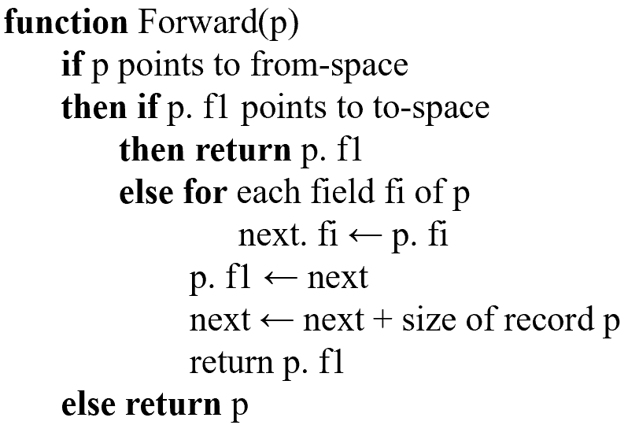

**`Forward(p)` 函数逻辑**：

* **情况 1（已复制过）**：如果指针 `p` 指向 `from-space`，且发现它的第一个字段 `p.f1` 已经是一个指向 `to-space` 的指针了。说明它已经被搬过了，直接返回 `p.f1`（即新家地址）。
* **情况 2（未复制过）**：如果它还没被复制。

1. 把它所有的字段搬运到 `next` 指向的新家：`next.fi <- p.fi`。
2. 在老家留下印记：`p.f1 <- next`（转发指针挂牌）。
3. 前移空闲边界：`next <- next + size`。
4. 返回新家地址。

* **情况 3**：如果 `p` 根本就没指向 `from-space`（比如是个外部常量或空指针），直接原样返回 `p`。

---

### Copying Collection - Cheney's Algorithm (切尼算法：无额外空间的广度优先)

复制算法最大的痛点在于：如果是用 DFS 遍历去搬家，要么面临递归栈溢出，要么面临显式栈浪费空间（在内存本来就折半的窘境下，这很致命）。

**切尼算法（Cheney's Algorithm）**，它实现了**不需要任何额外辅助空间**的广度优先遍历（BFS）搬家。

* **核心发明**：切尼算法惊人地发现，**已经被搬到 `to-space` 的对象，其自身所占据的那段连续内存空间，天然就可以组合成一个现成的 BFS 队列（Queue）**！

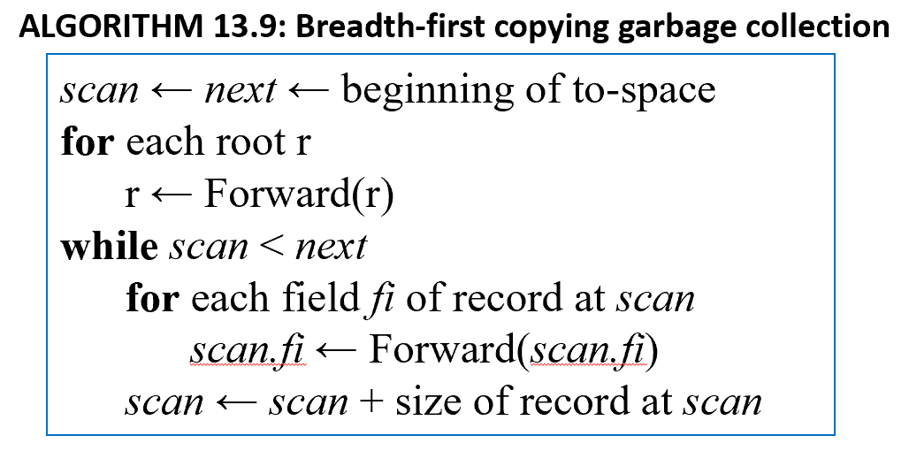

**双指针协同控制**：

* **`next`** 指针：指向 `to-space` 中当前空闲内存的尾部（所有刚搬过来的新对象都会排在 `next` 后面）。
* **`scan`** 指针：指向 `to-space` 中**虽然搬过来了、但其自身的内部子指针字段还没来得及扫描和修正**的对象。

**完美的逻辑区间**：

* 在 `to-space` 中，**`scan` 和 `next` 之间的这段内存，完美扮演了广度优先搜索的活跃队列**。
* 当 `scan` 赶上 `next` 时（`scan == next`），意味着队列变空，所有存活对象都已处理完毕，GC 完美收工！

---

### Breadth-First Copying Collection (切尼算法单步追踪)

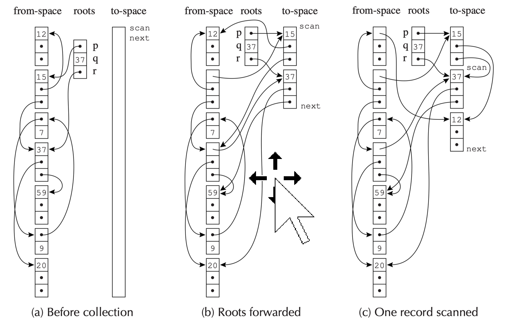

**（a）Before collection（回收前）**：

* 左侧 `from-space` 里是错综复杂、带环的树状和链表结构。右侧 `to-space` 完全空白，`scan` 和 `next` 并排停在起点。

**（b）Roots forwarded（根集搬家阶段）**：

* 首先，只去遍历主程序的 `roots` 变量。发现 `roots` 连着 `from-space` 里的 `15` 号和 `37` 号节点。
* 直接把这两个节点原封不动克隆到 `to-space` 头部。
* **指针变化**：`next` 被推到了 `37` 节点的后面。而 `scan` 保持在原地（指向 `15`）。此时，`15` 和 `37` 这段空间正式升级为 BFS 队列。

**（c）One record scanned（推进阶段）**：

* 现在 `scan < next`，GC 开始处理 `scan` 当前指向的 `15` 号节点。
* 检查发现，老 `15` 号节点在 `from-space` 里其实还指着 `12` 号节点（子节点）。
* 于是，顺藤摸瓜把 `12` 号节点也抓过来，克隆排在 `next` 的后面。
* 处理完 `15` 的所有子指针后，`scan` 前移，指向下一个排队的 `37` 号节点。
* 这个过程周而复始，直到 `scan` 指针一路扫描，把后面陆续进队的子节点的关联项全部拉过来，最终与 `next` 重合。

---

### Locality of Reference (引用局部性问题)

**兄弟对象分天下，父子对象隔千山**：

* 因为切尼算法采用的是广度优先遍历（BFS），它会优先把同一层级的“兄弟节点”全部密集的复制在一起（比如把 `15` 和 `37` 塞在了一起）。
* 然而，**真正有父子包含关系、需要高频互相调用的对象（例如地址 `a` 的对象内部紧密引用着地址 `b` 的对象），却在搬家过程中被远远地隔开了**。

**为什么局部性差会导致程序变慢？**

* 现代计算机底层高度依赖硬件高速缓存（CPU Cache）和虚拟内存的分页机制（Virtual Memory）。
* 缓存的黄金法则是：“当你读取了地址 `a`，硬件会预期你马上要读取 `a` 附近的内存，并把整块内存一起打包加载到缓存中。”
* 如果父子对象在内存中离得十万八千里，CPU 每顺着指针找一次子对象，就会遭遇一次严重的**缓存缺失（Cache Miss）或页面调度（Page Fault）**，导致程序运行效率雪崩。

**广度 vs 深度**：

* 相比之下，深度优先复制（DFS）能让父子对象紧挨着排列，具备极佳的局部性。但正如前面所说，工程上搞 DFS 复制需要极其恶心的指针逆转技术，速度慢且难以驾驭。

---

## A Hybrid Algorithm (混合算法)

为了融合“切尼算法的无空间开销”与“DFS 的完美局部性”，这一页给出了垃圾回收领域里非常著名的一个**混合算法（Hybrid Algorithm）**，在底层也常被称为 **引诱/追猎算法（Chase algorithm）**。

**基本核心思想**：

* 大框架上，依然延续切尼算法的**广度优先复制**来作为主队列。
* **关键魔改（Chase）**：每当一个新对象被成功复制到 `to-space` 时，算法不会像老切尼那样转头去管别人，而是立刻化身深度优先的猎犬，自顶向下看看这个刚搬过来的新对象**有没有尚未被复制的“亲生子节点”**。如果有，顺手把它也捞过来，紧挨着安排在父亲的身边！

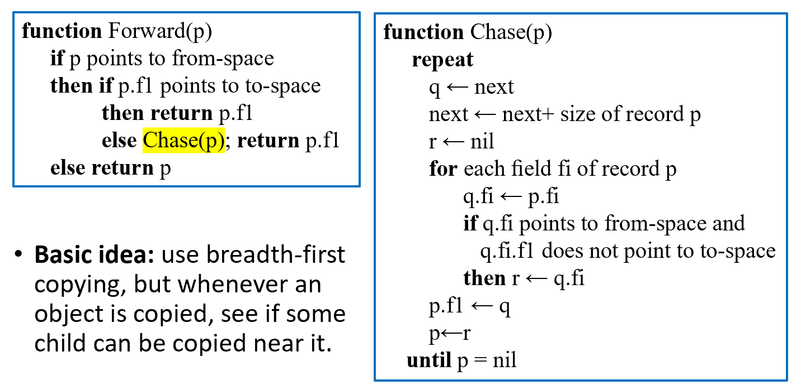

**算法伪代码解读**：

* 在 `Forward(p)` 阶段，如果发现对象还没有被复制，不再是简简单单搬完就走，而是会立刻触发一个临时的 `Chase(p)` 循环。
* 在 `Chase(p)` 内部，通过一个 `repeat...until p == nil` 的循环，沿着对象的首个未复制的子指针一路“往下啃”（Chasing the pointers），强行在 `to-space` 里拉出一条纵向的、具备极佳局部性的 DFS 依赖链。

**最终效果**：不需要任何额外的系统运行栈或复杂的指针逆转，仅靠原生的 `scan` 和 `next` 指针，就在局部做到了深度优先的亲子紧凑排列，在极低的算法代价下实现了非常优秀的局部性。

---

## Interface to the Compiler (编译器与 GC 的契约)

语言编译器与 GC 交互的核心职责：

* **生成分配记录的代码**：主程序在运行时需要创建新对象，编译器必须负责生成这些分配内存的底层机器指令。
* **描述每个 GC 周期的根引用位置**：当 GC 启动时，它需要知道哪些寄存器和栈帧里的变量是“根（Roots）”。编译器会生成一份 **安全点映射表（Stack Map / Root Map）**，明确标记在代码运行到哪一步时，哪些位置存的是活指针。
* **描述堆中数据记录的布局**：GC 在遍历堆时，看到一串二进制数据，它怎么知道哪些字节是普通的整数，哪些字节是指向别处的指针？编译器必须为对象设计统一的头部布局（元数据），供 GC 识别。

---

## Fast Allocation (快速分配的红利)

传统的 `malloc` 在分配内存时，需要在“空闲链表（Free List）”里大费周章地搜索大小合适的垃圾空闲块（如 First-fit 或 Best-fit 算法），开销巨大。

而复制算法（Copying Collection）为编译器带来了一个无与伦比的天然优势：

* 搬家结束后，所有的活对象被紧密推到了一侧，剩下的整个分配空间是一块**绝对连续的干净区域（Contiguous free region）**。
* 系统只需要维护两个极其轻量级的指针：`next`（指向当前空闲区域的起始物理地址）和 `limit`（指向该区域的末尾边界）。

在一个没有经过任何优化的幼稚系统里，分配一个大小为 $N$ 的新对象所需的标准步骤：

1. **Call the allocate function**：调用分配内存的函数。
2. **Test $next + N < limit$ ?**：进行安全边界检查。如果内存不够了，就紧急调用 GC 腾地方。
3. **Move $next$ to $result$**：把当前空闲地址暂存到临时变量 `result` 中（作为对象的返回地址）。
4. **Clear $M[next], \dots$**：将这块大小为 $N$ 的物理内存全部清零初始化。
5. **$next \leftarrow next + N$**：把空闲指针向后挪动 $N$ 个位置。
6. **Return from the allocate function**：从分配函数中返回。

接下来的 **A** 和 **B** 两步是用户程序拿到对象后的后续操作（把对象存入有用地方、向里面写入真实数据），它们不属于分配本身的开销。

---

### 优化步骤 1 —— 内联展开 (Inline Expansion)

* **消除步骤 1 和 6**：函数调用需要压栈、出栈、跳转、保护寄存器，开销沉重。编译器直接使用内联展开（Inline Expansion）技术，把分配对象的这段微型逻辑直接“复制粘贴”到用户业务代码的上下文里。
* **结果**：函数调用的外壳（步骤 1 和 6）被彻底抹去。

---

### 优化步骤 2 —— 复写传播 (Copy Propagation)

* **消除步骤 3**：在原始逻辑中，步骤 3 先把 `next` 赋给 `result`，随后步骤 A 再把 `result` 挪到真正要用它的寄存器里。
* **结果**：通过**复写传播与寄存器分配优化**，直接将步骤 3 与步骤 A 合并——让 `next` 的值直接一步到位写入用户程序真正想使用它的目标位置，步骤 3 成功退役。

---

### 优化步骤 3 —— 消除冗余死存储 (Dead Store Elimination)

* **消除步骤 4**：步骤 4 辛辛苦苦用垃圾数据或零值把内存刷一遍（清零），然而紧接着用户程序在步骤 B 里就会立刻写进自己想要的业务真实数据。
* **结果**：对同一块内存连续写入两次（先写零，再覆盖）是极大的多余开销。编译器经过数据流分析，直接**消除了步骤 4 的显式清零操作**，允许用户程序在步骤 B 写入时直接完成初始化。

---

### 最后的留存与跨对象合并

经过这一轮大刀阔斧的裁剪，原始的 6 个步骤中，**只有步骤 2（安全边界检查）和步骤 5（空闲指针后移）是绝对无法被消除的核心防线**。

然而编译器还能更进一步：

* 在程序的一个基本块（Basic Block，即一段没有跳转的纯线性代码）中，往往会连续创建多个对象（比如连续 `new` 三个对象，大小分别为 $N_1, N_2, N_3$）。
* **合并优化**：编译器不会傻傻地为每个对象都生成一次步骤 2 和 5。它会把它们合并，只做一次总的边界检查：

$$\text{Test } next + (N_1 + N_2 + N_3) < limit?$$

通过之后，指针也只需一步挪到位。这种跨对象的**批量合并**让开销进一步摊薄。

---

### Fast Allocation (终极量化分析：4条指令的奇迹)

* **寄存器神效**：如果编译器把最核心的 `next` 指针和 `limit` 指针直接锁死在 CPU 的**高效率寄存器**中。
* **三条指令分配内存**：在机器码层面，步骤 2（检查）和步骤 5（指针后移）最终只需要区区**共计 3 条汇编指令**（例如：一条加法、一条比较、一条条件跳转）就能完美搞定。
* **最终代价（4条指令）**：把“分配内存的 3 条指令”加上“未来垃圾回收时搬运它所平摊的微弱开销”，在高度优化的复制回收算法下，**创建一个对象直到它被回收的完整生命周期成本，被硬生生压低到了大约 4 条机器指令！**

---

## Describing Data Layouts 

### 描述数据布局

**GC 的核心诉求**：垃圾回收器必须能够操作程序声明的任何类型的记录。这意味着，当 GC 扫描到堆中的某块内存时，它必须有能力准确判定：

1. 这个对象内部一共有**多少个字段（Number of fields）**。
2. 其中**哪一个字段是一个指针（Whether each field is a pointer）**，以便决定是否顺着它继续向下追踪。

* **如何获取这些情报？**：这属于编译器的语义分析（Semantic analysis）范畴。
* **统一对象模型解决方案**：对于静态类型语言（如 Tiger、Pascal）或面向对象语言（如 Java），编译器通常会在生成的机器码中采用一种标准设计：**让每一个对象的第一个字（First word，即对象头）指向一个特殊的“类型描述符（Type-descriptor）”或“类描述符（Class-descriptor）”记录**。

**类型描述符里存了什么？**：

* 该对象的**总大小（Total size）**（复制算法搬家和清除算法线性扫描时必用）。
* 内部**每一个指针字段的确切偏移位置（Location of each pointer field）**（通常是一个位图 Bitmap）。

**生成时机**：这些描述符是由编译器在编译期的语义分析阶段，根据静态类型信息直接硬编码生成并嵌入到最终的运行时数据区中的。

---

### 空间开销分析

**对于纯静态类型语言（如 C 语言式的结构体扩展）**：

* 由于原本的结构体只需要存放纯业务数据，为了支持自动 GC，现在每个对象都必须强行剥离出第一个字来存放类型描述符指针。
* 这会带来每个记录额外多消耗一个字（An overhead of one word per record）的空间惩罚。

**对于面向对象语言（如 Java, C#）**：

* 结论非常惊人：**面向对象语言为了实现垃圾回收，在对象上引入这个描述符指针，带来了“零额外空间开销”（No additional per-object overhead）！**
* **原因**：面向对象语言为了实现**动态方法多态查找（Dynamic method lookup / 虚函数表分发）**，其对象头本来就**必须**自带一个指向类元数据（vtable 指针）的字。GC 只需要直接复用、嫁接在这个现成的指针上，顺便读取 GC 布局信息即可，因此没有为 GC 付出任何额外的每对象空间代价。

---

### Pointer Map (指针映射表 / 安全点机制)

堆里的对象布局搞定了，那么**栈和寄存器（根集 Roots）里的指针该如何识别？** 

**指针映射表（Pointer Map，在工业界常被称为栈映射 Stack Map）**。

**编译器的责任**：编译器必须向垃圾回收器明确指出一份指针映射表，内容包括：

* 当前哪些临时变量（Temporaries）和局部变量（Local variables）里面正装着指针。
* 这些指针此时此刻究竟是被分配在某一个 **CPU 寄存器**里，还是被压在栈帧（Activation record）的某个具体偏移位置。

* **动态变化的挑战**：程序在每一条汇编指令执行完后，寄存器和栈的内容都在疯狂变化，活跃的临时变量集合也在不停改变。如果为每一条机器指令都生成一份指针映射表，数据量会大到把硬盘和内存撑爆。
* **安全点（Safepoints）工程优化**：编译器采取了一种折中方案——只在**允许触发全新垃圾回收的点（Points where a new GC can begin）**才生成指针映射表。这些特定的代码位置在现代虚拟机中被称为**安全点（Safepoints）**。

**哪些地方是安全点？**：

1. 显式调用内存分配函数 `alloc` 的地方。
2. **任何普通的函数调用处（Any function-call）**：因为你调用的这个函数内部，可能会间接调用其它函数，并最终调用 `alloc` 触发 GC。因此，所有的 call 指令之后都必须是一个安全点。

**以返回地址（Return Addresses）为索引 Key**：

* 当程序在某个深层函数（如 $h$）中因为 `alloc` 内存不足中断并触发 GC 时，GC 运行时引擎会开始**从栈顶向栈底进行逐层扫描（Stack Unwinding）**。
* GC 往下一看，当前栈帧里留着上一层函数调用完后挂起的**返回地址（Return Address）**。这个返回地址天然就是最好的索引 Key！编译器正是以返回地址为 Key，在映射表里精准查出该函数在挂起的那一瞬间，它的栈帧里哪些位置是指针。

**被调用者保存寄存器（Callee-save registers）的特殊大坑**：

* 假设函数 $f$ 调用了 $g$，而 $g$ 又调用了 $h$。在 CPU 中，$g$ 为了自己使用，把 $f$ 留下的某些寄存器临时“备份”到了 $g$ 的栈帧里（即 Callee-save 机制）。
* 当在 $h$ 内部触发 GC 时，GC 扫描到 $g$ 的栈帧，它必须能够“解释”这些备份的寄存器：它们现在装的到底是 $f$ 当年留下的一串纯数字，还是一个活指针？
* 因此，编译器生成的 $g$ 的指针映射表必须具备**追踪继承链**的能力，能够明确说出哪些被调用者保存寄存器是从父函数 $f$ 那里“继承”过来的指针，从而保证根集扫描的绝对精确。

??? note
    1. 为什么要有指针映射表（Stack Map）？

    简单来说，是为了实现**准确式垃圾回收（Exact GC / Precise GC）**，避免**把整数误当成指针**。

    在 CPU 和内存的底层，**所有的数据都是一串二进制的 0 和 1**。

    * 一个 64 位的寄存器（比如 `RAX`）或者栈上的一个 8 字节空间，里面存着 `0x7fff5fbff610`。

    * **这到底是什么？** 它可能是一个指向堆中某个对象的**内存指针**，也可能只是一个普通的**大整数（如游戏得分、时间戳）**。

    如果没有指针映射表（保守式 GC）：GC 只能猜。它看到这个值长得像堆地址，就只能“保守”地认为它是个指针，并把它指向的对象判为活对象。

    * **代价**：如果它其实只是一个整数，那它指向的“垃圾对象”就永远无法被回收（造成**内存泄漏**）。更致命的是，**你无法使用复制算法（Copying GC）搬家**，因为如果你给对象搬了家，你就得修改这个“指针”的值，但它其实是个整数，你把用户的整数改了，程序逻辑就彻底崩溃了。

    有了指针映射表：GC 扫描到这一行代码时，查表便知：“哦，当前 `RAX` 寄存器里装的是纯数字，不用管；而栈偏移 `[RBP-16]` 的位置装的是个真指针。” 这样，GC 就能精准、放心地移动对象并修改指针了。

    ---

    2. 指针映射表是通过类型描述符知道并存进去的吗？

    **不完全是。你需要区分“堆对象”和“栈/寄存器”。**

    * **堆对象**（比如你 `new` 出来的对象）：确实是靠你提到的**类型描述符（Type Descriptor / 元数据）**。因为堆对象的结构在类定义好后就固定了（比如第 1 个字段是 int，第 2 个字段是指针），GC 查类信息就知道。

    * **栈和寄存器（动态变量）**：**不能**只靠类型描述符。

    为什么栈不能只靠类型描述符？

    因为栈和寄存器是**极度重用、瞬息万变**的。

    看下面这段 C++ / Java 伪代码：

    ```cpp
    void foo() {
        Object* ptr = alloc(); // 此时这个寄存器/栈空间 存的是【指针】
        // ... 做一些事情 ...
        
        long long num = 99999;  // 编译器为了省空间，把刚才那个寄存器复用了，改存【整数】
        // ... 触发了 GC ...
    }
    ```

    在同一个函数里，同一个寄存器 `RAX`，前半段存的是指针，后半段存的是整数。光靠变量的静态类型描述符根本搞不定。

    真正是怎么存进去的？

    编译器在编译这期代码（前端语义分析 + 寄存器分配阶段）时，它对每一步谁在用寄存器、谁在用栈了如指掌。

    当编译器生成完机器码后，它会顺便写一份“机密报告”（即 **Stack Map**）打包进最终的可执行文件里：

    > “当程序运行到机器码第 `0x401050` 行（安全点）时，`RAX` 是指针，栈 `-8` 是指针；运行到第 `0x401080` 行时，`RAX` 变成整数了，只有栈 `-8` 还是指针。”

    垃圾回收器（GC）在运行时，就是直接去读这份由编译器提前准备好的报告。

    ---

    3. 为什么要以返回地址（Return Address）为索引 Key？

    当 GC 因为内存不足被触发时，当前正在运行的函数（比如 $h$）中断了。但 GC 不能只扫描 $h$ 的栈帧，它必须顺着栈往下，把调用 $h$ 的父函数 $g$、爷函数 $f$ 的栈帧全部扫一遍。

    此时 GC 怎么知道父函数 $g$ 运行到了哪一行？

    当 $g$ 调用 $h$ 的时候，CPU 会自动执行 `CALL` 指令，把 $g$ 紧接着的下一条指令的地址——**返回地址（Return Address）**——强行压入栈中，然后才跳转到 $h$。

    所以，当 GC 坐在 $h$ 的栈帧里往回看 $g$ 的栈帧时，它**唯一能百分之百拿到的线索，就是这个躺在栈里的返回地址**。

    * **完美的 Key**：返回地址是一个确定的内存绝对地址（比如 `0x402345`）。

    * **精准查表**：编译器在生成指针映射表时，直接用这个 `CALL` 指令后面的返回地址作为 Key。GC 拿到这个地址，去表里一查，就能瞬间知道：“哦！原来父函数 $g$ 当年是在这一行挂起去调用 $h$ 的，那它现在的栈里哪些是指针我就全知道了！”

    ---

    4. 被调用者保存寄存器（Callee-save）大坑：不说明会怎么样？

    要理解这个，先懂什么是 **Callee-save（被调用者保存）**：CPU 寄存器数量有限。父函数 $f$ 把一个重要的**活指针**存在了 `RBX` 寄存器里。接着 $f$ 调用了 $g$。根据 CPU 规矩，$g$ 如果也想用 `RBX`，就必须先在自己的栈帧里开个小客房，把 $f$ 的 `RBX` **原封不动地备份进去**。等 $g$ 完事了，再从客房里倒腾回 `RBX` 还给 $f$。

    现在，在 $g$ 还在运行的时候，触发了 GC。

    现状：$f$ 的那个活指针，现在正**老老实实地躺在 $g$ 的栈帧的那个“小客房”（备份区域）里**。

    如果 $g$ 的映射表不说明（不追踪继承链）：GC 扫描到 $g$ 的栈帧时，看到小客房里有一串二进制数。因为 $g$ 的映射表没写这个备份是啥，GC 就会**漏掉这个指针**（或者不敢动它）。接着，GC 开始搬家，把堆里的对象全部换了新地址。等到 GC 结束，程序恢复。$g$ 运行完了，把小客房里那个**没被 GC 更新过、依然指向老地址的旧指针**弹回了 `RBX`，还给了 $f$。接下来 $f$ 一用 `RBX` —— **野指针崩溃，或者数据彻底错乱！**

    如果 $g$ 的映射表说清楚了（追踪继承链）：$g$ 的指针映射表明确标注：“我栈帧里偏移量 `-16` 的位置，备份的是我老爹 $f$ 的 `RBX` 寄存器，而且我相信 $f$ 留在这的是个**活指针**。”

    GC 一看，懂了！

    1. 顺着 $g$ 栈帧 `-16` 找到这个指针，发现它指向堆对象 A。

    2. 把对象 A 复制到新家 A'。

    3. **直接修改 $g$ 栈帧 `-16` 位置的值**，让它改成新家 A' 的地址。

    当 GC 结束， $g$ 浑然不知地继续运行，最后执行恢复指令，把 `-16` 位置上**已经被 GC 修正好的新指针**弹回 `RBX` 还给 $f$。$f$ 醒来继续用 `RBX`，完美无缝衔接！

---

## Derived Pointers (导出指针)

* **什么是导出指针**：有时，编译后的机器码为了追求极致的计算速度，会生成一个**既不指向对象头部，也不指向对象尾部，而是直接指向堆记录身体中间某处的指针**。

**典型场景：数组下标循环外提优化**：

* 假设代码里要高频访问数组 $a[i-2000]$。编译器内部做地址计算时，发现可以用基地址 $a$ 减去 $2000$ 个单位作为一个固定基准：$t_1 \leftarrow a - 2000$。
* 随后在循环体内，只需要做轻量级的加法即可：$t_2 \leftarrow t_1 + i$。
* 为了省去每次循环都重复减去 $2000$ 的开销，优化编译器（如带有循环不变量外提 LICM 优化）会决绝地把 $t_1 \leftarrow a - 2000$ 这行计算**强行提到循环体外面执行**。

**灾难降临**：如果这个循环体内部恰好包含了一个 `alloc` 函数，并且不幸在某次循环时触发了垃圾回收。此时，临时变量 $t_1$ 处于活跃状态。但可怕的是，**$t_1$ 指向的根本不是任何对象的开头，它指在物理内存中距离数组 $a$ 开头还要往前 2000 个字的位置（可能是一个风马牛不相及的其它对象内部，甚至是一块未分配的荒芜内存）**！GC 这时候去扫描 $t_1$，直接就会陷入精神错乱。

---

### Derived Pointers (导出指针的修正救赎)

* **术语定义**：我们称这种被优化出来的怪异指针 $t_1$ 为**导出指针（Derived pointer）**，称它原本赖以生成的那个真正的合法对象首地址指针 $a$ 为**基指针（Base pointer）**。
* **解决思路**：解铃还须系铃人。编译器既然在优化时创造了导出指针，就必须在指针映射表（Pointer Map）里**白纸黑字地建立绑定关系**，明确告诉 GC：“$t_1$ 是一个导出指针，它的亲生父亲是基指针 $a$”。

**动态相对偏移修正**：

* 如果这次 GC 恰好是一个**复制算法回收器**，它把数组 $a$ 的物理地址整体搬迁到了全新的新家地址 $a'$。
* 搬完家后，GC 必须根据绑定关系，对大水冲了龙王庙的 $t_1$ 执行**相对偏移量同步修正**，将其强行扭转到正确的新关联位置：

$$t_1 \leftarrow t_1 + a' - a$$

* **存活强绑原则**：这带来了一个非常反常的数据流分析规则——**只要导出指针 $t_1$ 还需要存活，那么它的基指针 $a$ 无论在业务逻辑上是否已经不再被使用了，都必须被强行判定为“活着的（Live）”**，否则 GC 就会失去修正 $t_1$ 的参照物。

---

###  Derived Pointers (中间代码 Trace 实例证明)

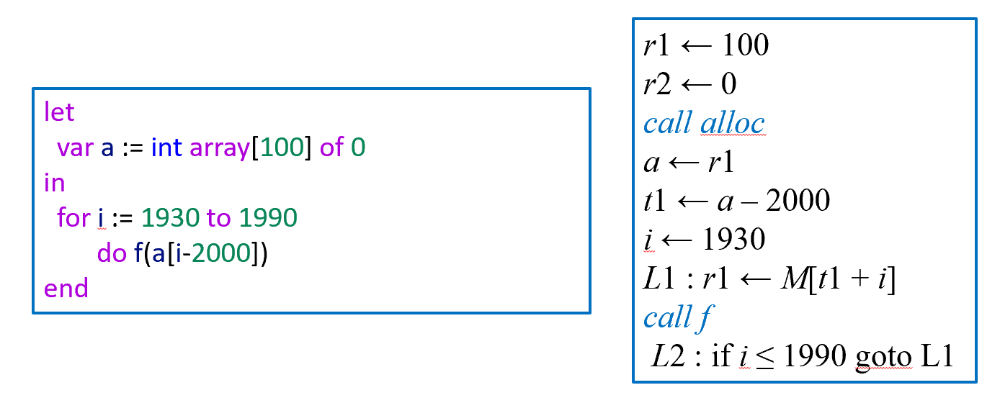

**左侧源码**：声明一个大小为 100 的数组 $a$，然后运行一个从 1930 到 1990 的循环，不断读取 $a[i-2000]$。

**右侧中间代码（IR）分析**：

* `call alloc` 创建数组后，地址存在 `a` 寄存器里。
* 紧接着，优化编译器把减法提到了循环外面：`t1 <- a - 2000`。
* 随后程序进入 `L1` 到 `L2` 的高频内层循环。在循环体内部，程序通过 `r1 <- M[t1 + i]` 极快地读取数组，并紧接着 `call f` 调用函数。

**致命漏洞暴露**：

* 根据传统的**活跃性分析（Liveness Analysis）**算法来看，变量 `a` 在执行完 `t1 <- a - 2000` 之后，在整个 `L1` 循环体内**再也没有被任何一句指令读取过**。按照常规死代码消除优化，变量 `a` 此时已经是死变量（Dead）了，它占用的寄存器随时可以被别的变量强占抹去。
* 然而，如果在 `call f` 处不幸爆发了 GC（对应返回地址 `L2`），GC 需要修复当前存活的导出指针 `t1`。如果此时基指针 `a` 早就被判定为死亡并遭到了销毁，GC 将彻底失去重算 `t1` 的基准，程序直接崩溃。

**终极结论**：因此，**导出指针在逆境中隐式地强行维系了其基指针的生命（A derived pointer implicitly keeps its base pointer live）**。编译器在做数据流垃圾分析时，必须为 GC 的尊严做出妥协，强行让 `a` 陪着 `t1` 一起活到循环结束。

---