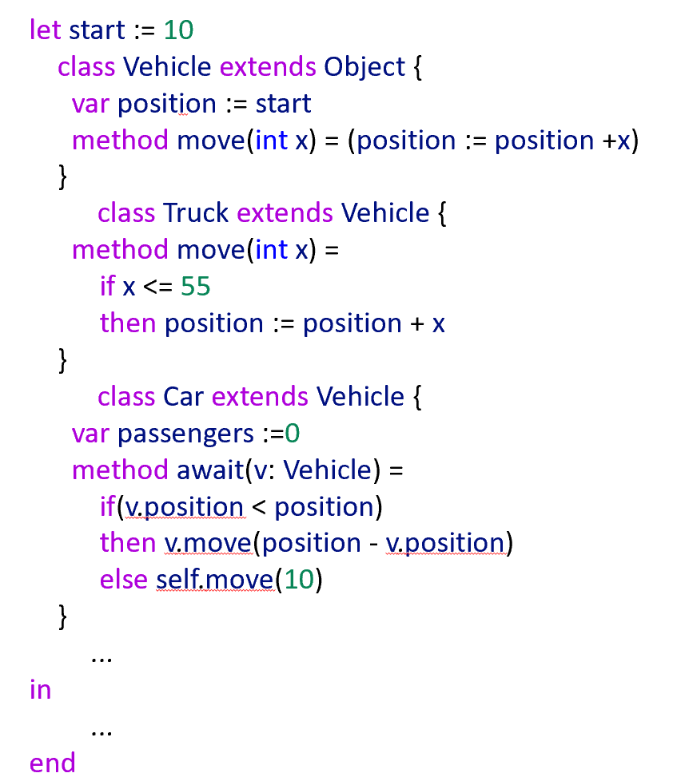
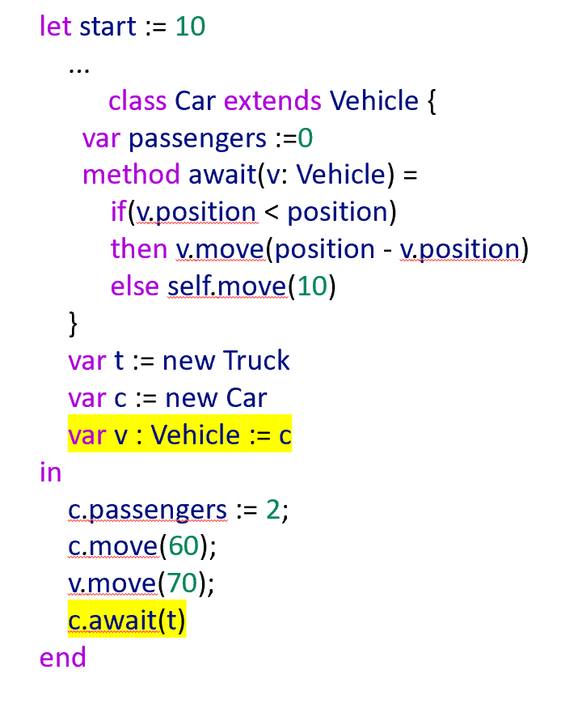
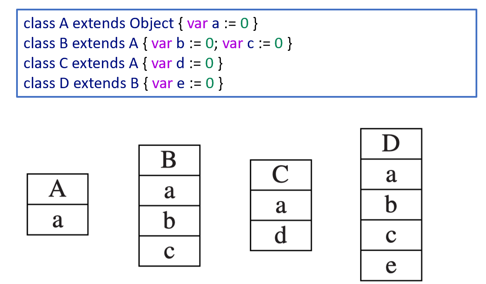
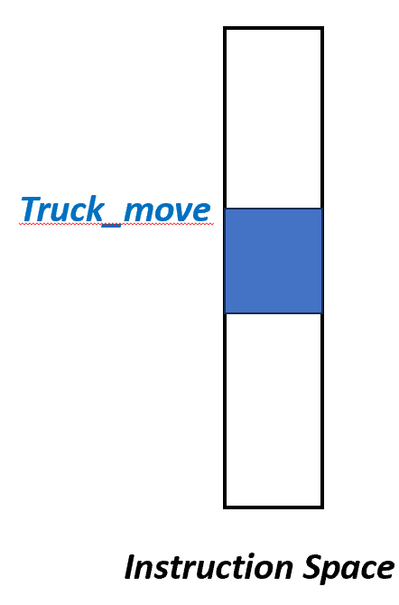
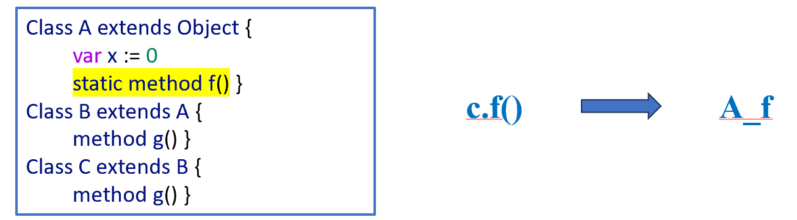
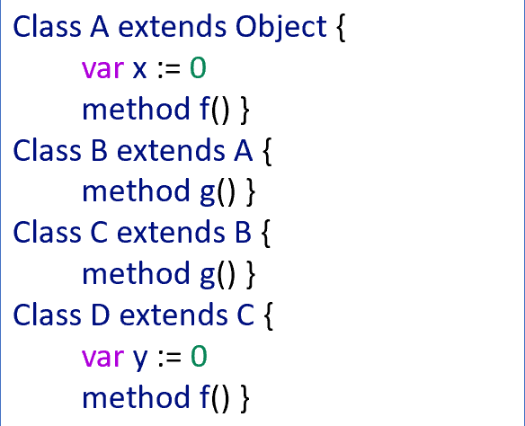
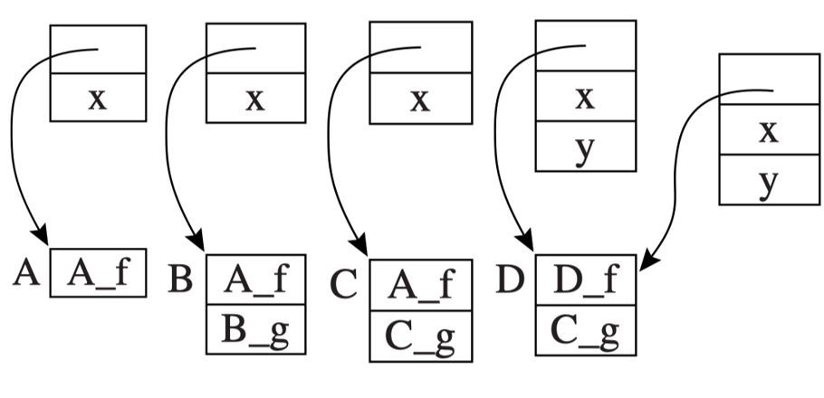
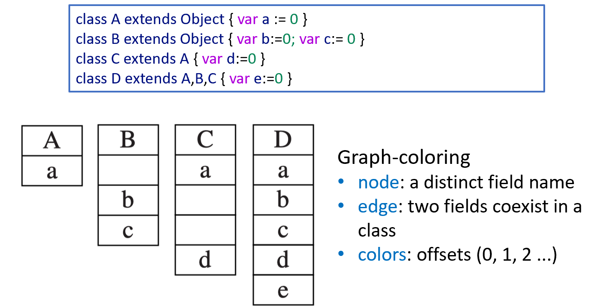
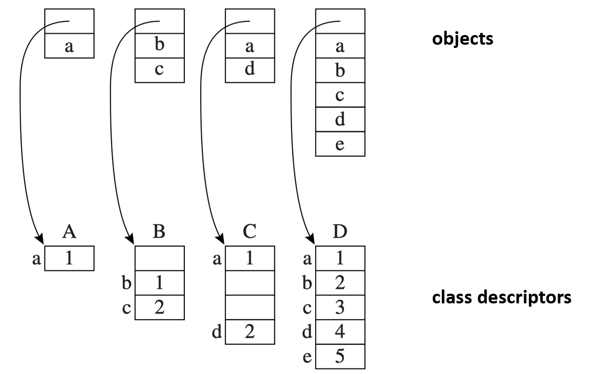
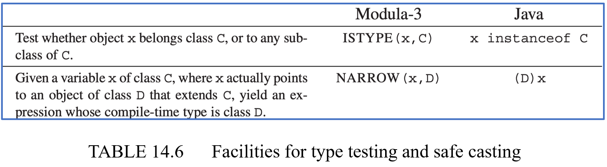

# Chapter 14 | Obj.-Ori. Languages

## Overview

Some characteristics of object-oriented languages（面向对象语言的一些特性）

面向对象（OO）语言的两个核心概念：**封装**和**继承**。

**信息隐藏或封装（Information hiding or encapsulation）**

* 一个模块可以提供某种给定类型的值，但是该类型的具体内部实现（表达方式）只有该模块自己知道。
* 客户端（外部使用者）只能通过该模块提供的操作（operations）来操作这些值。
* 在面向对象中：值（values） $\rightarrow$ 映射为**对象（objects）**；操作（operations） $\rightarrow$ 映射为**方法（methods）**。

**扩展或继承（Extension or inheritance）**

* 如果某个程序上下文（例如函数或方法的形参）期望一个支持方法 `m1, m2, m3` 的对象，那么它同样可以接受一个支持 `m1, m2, m3, m4` 的子类对象。

**代码示例**：

```java
int foo(A a1) {
    a1.m1(); a1.m2(); a1.m3();
}
```

函数 `foo` 接收 `A` 类型的对象 `a1` 并调用了三个方法。根据继承的特性，任何继承自 `A` 且拥有更多方法（如 `m4`）的子类对象都可以安全地传给 `foo`。

---

## Classes

### Object-Tiger 语法扩展

通过扩展 Tiger 语言的声明语法（declaration syntax）来支持类的创建。

这里使用的是上下文无关文法（CFG）的产生式形式：

* `dec -> classdec`：声明（dec）可以是一个类声明（classdec）。
* `classdec -> class class-id extends class-id { {classfield} }`：类声明的语法结构。定义一个名为 `class-id` 的类，继承自另一个 `class-id`，大括号内包含零个或多个类字段（classfield）。
* `classfield -> vardec | method`：类字段可以是**变量声明（vardec）**（即成员变量/属性），也可以是**方法（method）**。

**方法的两种语法**：

* `method -> method id(tyfields) = exp`：无返回值（或隐式类型）的方法，主体为表达式 `exp`。
* `method -> method id(tyfields) : type-id = exp`：显式指定返回值类型 `type-id` 的方法。

---

### Object-Tiger 类与方法规则

`class B extends A { ... }`

**继承与作用域**：

* 声明了一个继承自类 `A` 的新类 `B`。
* 类 `B` 的声明必须在声明类 `A` 的 `let-expression` 的**作用域内**（即必须先声明父类，才能声明子类）。
* 类 `A` 的所有字段和方法都**隐式地属于**类 `B`。

**方法重写（Overriding）与字段限制**：

* `A` 中的某些方法可以在 `B` 中被**重写（overridden）**（即重新声明）。重写时，参数类型和返回值类型**必须完全一致**。
* 但是，**字段（fields）不能被重写**。

??? note "字段不能被重写是什么意思？"
    在面向对象编程（比如 Java 或 C++）中，“字段（Fields / 实例变量）不能被重写”的意思是：子类无法像覆盖父类方法那样去“替换”父类的同名字段。

    当你在子类中声明了一个与父类同名的字段时，并不会覆盖掉父类的字段，而是会发生“字段隐藏”（Field Hiding）。

    内存中存在两个独立的字段

    当你用子类创建一个对象时，这个对象的内存空间里同时存在两个字段：父类的字段和子类的字段。它们互不干扰，只是名字恰好一样。

    * **方法重写**：子类方法会**覆盖**父类方法。无论你用什么视角（引用类型）去看，执行的都是子类的方法。
    * **字段隐藏**：子类字段**隐藏**了父类字段。你通过哪个类型的引用去访问，拿到的就是哪个类型定义的字段。

* **基类**：存在一个预定义的根类 `Object`，它没有任何字段和方法。

**`self` 关键字**：

* 类 `B` 中的每个方法都有一个隐式的形参 `self`，其类型为 `B`。
* `self` 是一个在每个方法中**自动绑定**的标识符（类似于 Java/C++ 中的 `this`）。

---

### Object-Tiger 表达式语法

用于**创建对象**和**调用方法**的新表达式语法：

* `new B`：创建一个类型为 `B` 的新对象。
* `b.x`：访问对象 `b` 的字段 `x`。
* `b.f(x, y)`：调用对象 `b` 的 `f` 方法，传入显式实参 `x` 和 `y`。同时，值 `b` 会作为隐式参数传给方法 `f` 的 `self` 变量。

**文法产生式**：

* `exp -> new class-id`（创建对象）
* `exp -> lvalue . id()`（无参方法调用）
* `exp -> lvalue . id(exp {, exp})`（带参方法调用）

---

### An Object-Oriented Program 代码示例与作用域提问



`What are the variables in scope on entry to await?`（在进入 `await` 方法时，有哪些变量在作用域内？）

1. 最高层级定义了全局变量 `let start := 10`。
2. 类 `Vehicle` 内部定义了 `var position := start`。
3. 类 `Car` 继承自 `Vehicle`，内部定义了 `var passengers := 0`。
4. 在 `Car` 的 `method await(v: Vehicle) = ...` 中：

* 形参是 `v`（高亮了 `v`）。
* 隐式参数是 `self`（高亮了 `self`）。

**因此，进入 `await` 方法时的作用域内的变量包括**：

* 全局变量：`start`
* 当前类及其父类的成员变量（通过 `self` 隐式或显式访问）：`passengers`、`position`
* 方法参数：`v`、以及隐式绑定的 `self`

方法参数（Method Parameters / Arguments）是你在定义方法时，声明在括号内的变量。它们的作用是接收外部传进来的数据。



该程序的 `in ... end` 表达式部分（即主执行程序），引出了编译器需要解决的静态类型与运行时动态类型的问题。

**变量声明**：

* `var t := new Truck`
* `var c := new Car`
* `var v : Vehicle := c` （这里将一个 `Car` 类型的对象赋值给了一个声明为 `Vehicle` 类型的变量 `v`。这是多态的体现）。

**表达式执行**：

* `c.passengers := 2;`
* `c.move(60);`
* `v.move(70);`
* `c.await(t);`

1. 因为 `Car` 类中**完全没有声明或重写** `move` 方法，所以它直接、完完全全地继承了父类 `Vehicle` 的 `move` 方法。因此，执行 `c.move(60)` 时，调用的就是 `Vehicle` 类中定义的那个 `move`。
2. 对于 `c.await(t)`，传入的是 `Trunck` 类型的对象 `t`，而 `await` 方法的参数类型是 `Vehicle`。在运行时，系统会检查 `v` 实际指向的对象的“真实身份”。如果 `v` 实际上是一个 `Truck`，由于 `Truck` 显式重写了 `move` 方法，程序**会去调用 `Truck` 类中重写后的 `move**`（即包含 `if x <= 55` 限制的那个版本），而不是 `Vehicle` 的版本。

---

### 题目：Generate Code to Fetch Fields（生成获取字段的代码）

如何为字段访问（如 `v.position`）生成汇编/中间代码。

* **已知条件**：静态分析时，编译器知道变量 `v` 属于 `Vehicle` 类。
* **核心任务**：为了求值 `v.position`，编译器必须生成代码，从 `v` 指向的对象（在内存中通常是一个结构体/记录 Record）中获取 `position` 字段。

**天真的简单想法（Simple idea）**：

1. 从变量 `v` 的环境条目（Environment entry）中获取 `Vehicle` 的**类描述符（class descriptor）**。
2. 从该类描述符中获取 `position` 字段的**偏移量（offset）**。

**运行时的严峻现实（But at run time）**：

* 在运行时，变量 `v` 实际上可能包含一个指向 `Car` 或 `Truck` 对象的指针。
* **关键问题**：既然 `v` 指向的具体对象在运行时是可变的，那么 **`position` 字段在内存中的偏移量还会是一样的吗？编译器该如何保证无论 `v` 指向什么子类对象，都能正确找到 `position`？**

---

## Single Inheritance of Data Fields

### Single Inheritance

* **单继承语言的定义**：每个类都**有且仅有一个**直接父类（Each class extends just one parent class）。例如 Java、Tiger，而 C++ 则支持多继承。
* **抛出核心问题**：对于单继承语言，编译器到底该**如何生成代码来获取字段（fetch fields）**？

---

### Fields（字段的内存布局）

**Prefixing 的核心规则**：

* 如果类 `B` 继承自类 `A`，那么在类 `B` 的内存记录（record）中，**从父类 `A` 继承来的字段必须原封不动地排在最前面（at the beginning）**。
* 这些继承字段的**排列顺序、相对偏移量，必须与它们在父类 `A` 中的顺序完全一致**。
* 类 `B` 自己新定义的字段，则依次**追加在后面（placed afterward）**。



* **带来的巨大好处**：无论静态类型为 `A` 的指针在运行时实际指向的是 `A`、`B`、`C` 还是 `D`，编译器只要想访问字段 `a`，**直接去偏移量 0 的位置拿准没错！**

---

### Methods（方法与指令空间）

* **方法的本质**：在底层，一个方法实例被编译出来的形式和普通函数（function）几乎一模一样。
* 它会变成一段机器码，存放在内存的**指令空间（Instruction Space）**中，并拥有一个特定的**首地址（particular address）**。



* **示例**：类 `Truck` 的 `move` 方法在编译后，会在机器码中生成一个叫做 `Truck_move` 的标签（Label），这个标签代表了该方法在指令空间的入口地址。
* **类描述符（Class Descriptor）**：除了指令本身，编译器还会为每个类在内存中维护一个“类描述符”结构体，里面包含**指向父类的指针**，以及一张**方法实例的列表**。

---

#### Static Methods（静态方法）

有些面向对象语言支持将方法声明为 `static`。这里的 static 指的是**不能被子类重写、在编译期就能完全确定调用对象**的方法，类似于 C++ 中的非虚函数或 Java 中的 final/static 方法。

**编译期决定（Compile time）**：

对于 `c.f()` 形式的静态方法调用，编译器的查找逻辑非常简单：

1. 看变量 `c` 的静态类型是什么。假设 `c` 被声明为 `class C`。
2. 在 `class C` 中查找有没有方法 `f`。如果没有，就去它的父类 `B` 找；如果还没找到，就去祖先类 `A` 找。
3. 一旦在某个祖先类（比如 `A`）中找到了这个 `static method f()`，编译器在编译期就能一拍大腿完全确定：**这次调用必然触发 `A` 里面定义的那个 `f`！**



* **代码转换**：直接将代码中的 `c.f()` 编译并重写为对固定标签 `A_f` 的普通函数调用（即**早绑定/静态绑定**）。

---

#### Dynamic Methods（动态方法/虚函数）

如果方法 `f` 不是静态的，而是**动态方法（Dynamic method / 虚函数）**，情况就完全变了。

**多态带来的难题**：

* 看下方代码：`class A` 定义了 `method f()`。`class D` 继承自 `C`（`C` 继承 `B`，`B` 继承 `A`），并且 `D` **重写（overridden）** 了 `method f()`。
* 如果我们在代码里写 `c.f()`，而在运行期间，变量 `c`（静态类型可能只是 `A`）实际指向的可能是一个 `class C` 的对象，也可能是一个重写了该方法的 `class D` 的对象。
* **编译器在编译期间根本无法预知 `c` 此时此刻到底指向谁**，因此它不知道这里应该调用 `A_f` 还是 `D_f`。



* **提出问题**：如何解决这个运行时动态查找正确方法的问题？

??? note "一些关于静态类型的问题"
    静态类型（Static Type）就是指在代码中**显式声明（或者编译器隐式推导）变量时所使用的那个类型**。

    它之所以叫“静态”，是因为它在**编译期（Compile-time）**就已经确定了，而且在程序运行的整个生命周期中**绝对不会改变**。

    1. 静态类型 vs 动态类型

    ```java
    Vehicle v = new Truck();
    ```

    在这行代码中，发生了两件事：

    1. **静态类型（Static Type）**：是 `Vehicle`。这是你写在左边、用来**声明**变量 `v` 的类型。编译器在编译阶段只认这个类型。

    2. **动态类型（Dynamic Type）**：是 `Truck`。这是你写在右边、在程序**运行起来后**在堆内存中实际创建出来的对象类型。

    规则一：静态类型决定了你能“看到”什么（编译期检查）

    编译器在编译代码时，眼睛只盯着**静态类型**。

    * 如果你写 `v.move(70)`，编译器会去 `Vehicle`（静态类型）里面找有没有 `move` 这个方法。有，编译通过；没有，直接报编译错误。

    * 如果 `Truck` 类里自己定义了一个特有的方法叫 `openCargoDoor()`（开启货箱门），你用 `v.openCargoDoor()` 就会报错。因为在编译器的视角里，`v` 只是一个普通的 `Vehicle`，它不知道里面其实装了一辆 `Truck`。

    规则二：静态类型决定了“字段”的访问（静态绑定）

    正如你第一题所问，**字段不能被重写**。

    * 当你访问 `v.position` 时，系统会直接根据 `v` 的**静态类型**（`Vehicle`）去类描述符或内存偏移量里找字段。哪怕 `Truck` 里面也定义了一个同名的 `position`，此时也会被无视。

    规则三：动态类型决定了“重写方法”的执行（动态绑定）

    * 当程序真正运行到 `v.move(70)` 时，虚函数表机制就起作用了。系统会绕过静态类型，去看看 `v` 此时此刻在运行期的**动态类型**到底是谁。
    * 发现动态类型是 `Truck`，且 `Truck` 重写了 `move`，于是就去执行 `Truck` 里的机器码。

为了解决上面的难题，引入了面向对象里最经典的底层机制——**虚函数表（Method Table / VMT）**。

* **核心解决方案**：每个类的**类描述符**里必须包含一个**向量/数组（vector/table）**，用来存放该类所有可用的（非静态）方法实例的入口地址。

**方法表的前缀法排列**：

* 当类 `B` 继承自 `A` 时，`B` 的方法表**首先完整复制 `A` 的方法表条目**（保持完全相同的顺序和偏移量）。
* 如果 `B` **没有**重写某个方法，就直接继承 `A` 的方法地址（如类 `B` 和 `C` 里面的 `f` 依然指向 `A_f`）。
* 如果 `B` **新增加**了方法，就追加在方法表的后面（例如 `B` 增加了 `g`，增加了 `B_g` 条目）。
* 如果某个子类（如 `D`）**重写**了父类的方法 `f`，那么在 `D` 的方法表中，原本存放 `f` 的那个槽位（Slot），其指针会被替换（覆盖）为 `D_f` 的地址！



* 在 `A`、`B`、`C`、`D` 的方法表中，方法 `f` **永远占据着第一个槽位（偏移量 0）**。
* `A`、`B`、`C` 表的第一个槽位里填的都是 `A_f`。
* 而 `D` 虚表里的第一个槽位被改写成了 `D_f`。

有了设计好的虚表（Method Table），运行时只需要执行简单的三步“顺藤摸瓜”：

1. **取类描述符**：从对象 `c` 的内存结构中，获取它的类描述符指针 `d`（类描述符指针通常存放在对象的头部，即偏移量 0 的位置）。
2. **取方法地址**：从类描述符 `d` 中，根据方法 `f` 的**固定偏移量**，取出对应的方法实例指针 `p`。

* 此时如果 `c` 实际是 `C` 对象，取出的就是 `A_f`；如果实际是 `D` 对象，取出的就是 `D_f`。

3. **跳转执行**：直接跳转到地址 `p` 去执行机器码，同时保存返回地址（即执行一辆函数调用 `call p`）。

通过这种虚表机制，编译器在编译期只需要生成“**去对应偏移量的槽位里找指针并调用**”的间接跳转指令，就能在运行时完美实现多态。

??? note "类描述符"
    ```text
    第一层：【 类描述符 (Class Descriptor) 】（每个类在静态区有且仅有一个）
    │
    ├─> 1. 其他类信息（如：指向父类描述符的指针、类名等）
    │
    └─> 2. 【 虚函数表 (vtable) 】（这就是类描述符里装的核心表格）
                │
                ├─> 槽位 0: [ 标签/函数指针 ] ───> 第三层：指向【 指令空间 (Instruction Space) 】中的 Truck_move 机器码
                ├─> 槽位 1: [ 标签/函数指针 ] ───> 第三层：指向【 指令空间 (Instruction Space) 】中的 Car_await 机器码
                └─> ...
    ```

---

## Multiple Inheritance

### Multiple Inheritance 的困境

* **核心矛盾**：在允许类 `D` 同时继承多个父类（如 `A`、`B` 和 `C`）的语言中，静态确定字段偏移量和方法实例会变得异常困难。
* **前缀法失效**：在单继承中，我们靠前缀法把父类字段排在子类最前面。
* 但在多继承中：

> **“既想把 `A` 的所有字段放在 `D` 的开头，又想把 `B` 的所有字段放在 `D` 的开头，这在物理上是不可能实现的。”**

* **抛出问题**：当多继承打破了“空间连续且偏移固定”的完美假设后，编译器该如何破局？

---

### Global Graph Coloring - Fields（全局图着色法 - 字段）

为了让不同类里的同名字段尽量复用同一个偏移量，引入了**全局图着色算法（Graph-Coloring Algorithm）**。

* **核心思想**：同时对系统中的所有类进行静态全局分析。将字段排列问题抽象为图的着色问题，为每个字段名分配一个全局偏移量，使得**在同一个类中共同存在的字段拥有不同的偏移量**。

**图模型构建规则**：

* **节点（Node）**：每个独立的字段名（distinct field name）是一个节点。
* **边（Edge）**：如果两个字段在同一个类中**共存（coexist）**，它们之间就连接一条边（表示它们不能用同一个偏移量）。
* **颜色（Colors）**：分配的颜色对应最终的内存偏移量 `(0, 1, 2, ...)`。



**实例分析**：

* 代码中：`A` 有 `a`；`B` 有 `b, c`；`C` 继承 `A` 并定义 `d`（共存 `a, d`）；`D` 继承 `A, B, C` 并定义 `e`（共存 `a, b, c, d, e`）。
* 经过全局图着色后，分配结果如条形图所示：`a` 占偏移量 0；`b` 占 1；`c` 占 2；`d` 占 3；`e` 占 4。
* **看 `C` 的对象布局**：因为 `a` 分配了 0，`d` 分配了 3，导致中间的 1 和 2 变成了**空洞**！

---

#### Global Graph Coloring - Fields（空洞问题与间接查找）

* **产生的问题（Problem）**：图着色会导致某些对象的内部出现大量的**空槽/空洞（empty slots）**。这造成了严重的内存浪费。

**改进的解决方案（Solution）**：

* **压缩对象（Pack the fields）**：在内存中，让每个对象的字段紧凑排列，**不留空洞**。
* **借助类描述符（Class Descriptor）定位**：因为对象紧凑排布后，字段的偏移量在不同子类里不再固定，所以让**类描述符**来记录并告诉程序，每个字段在当前类对象中的具体偏移量是多少。



**看图解**：

* 顶部的 `objects` 被压缩得整整齐齐（如 `C` 里面 `a` 紧挨着 `d`）。
* 底部的 `class descriptors` 充当了“路由表”：类 `C` 的描述符中记录着，在 `C` 对象里 `a` 的偏移量是 1，`d` 的偏移量是 2。

---

#### Global Graph Coloring - Fields（空间与时间的权衡）

* **空间上的权衡（Acceptable）**：在这个方案中，类描述符（Class Descriptors）内部现在包含了空槽（因为要实现全局索引），但对象（Objects）本身非常紧凑。
* 编译原理公认这在空间上是**完全可接受的**，因为在运行时：$\text{对象的数量} \gg \text{类描述符的数量}$。

* **时间上的代价**：天下没有免费的午餐。对象空间被省下来了，但**每一次字段的读取（或写入）从原本的一条指令变成了三条指令**！

1. **第一步**：先从对象中取出类描述符指针。
2. **第二步**：去类描述符里，查询该字段在当前类中的**具体偏移量值**。
3. **第三步**：拿着这个算出来的偏移量，再次访问对象，去读取（或写入）真正的字段数据。

* *总结*：多继承导致字段访问多了一层间接寻址，带来了运行期的时间开销。

---

### Global Graph Coloring - Method Lookup（全局图着色法 - 方法查找）

如何将图着色法同样延伸应用到多继承下的方法查找（Method Lookup）中。

* **统一建模**：全局图着色方法不仅能处理字段，还能完美应用到方法上。
* **混合构建干扰图**：我们可以把**方法名**和**字段名**混合在一起，共同作为节点，去构建一个巨大的干扰图（Interference Graph）。

**类描述符中的分工**：

* 类描述符中属于**字段的条目**：存放的是该字段在对象内部的**位置偏移量**。
* 类描述符中属于**方法的条目**：存放的是该方法实例在指令空间中的**机器码入口地址**（也就是虚函数表条目）。

---

### Global Graph Coloring - Problem（动态链接问题）

尽管全局图着色法理论上很漂亮，但存在**致命死穴**。

* **致命问题**：全局图着色算法有一个核心前提——它必须在链接期（link-time）把所有的类聚集在一起，进行一次性的全局静态分析。
* **现代语言的冲突**：然而，现代面向对象系统（如 Java 等）都普遍拥有一项核心能力——支持在系统运行过程中**动态加载新类（Dynamic incremental linking）**。程序运行着运行着，突然从网络上或者本地磁盘里加载了一个全新的类 NewClass.class，这个类实现了一个新的接口，带有一些新的方法。
* **结论**：因为动态加载时无法重新对整个世界进行“全局重新着色”，所以**全局图着色法对支持动态增量链接的系统来说是一场灾难**。

---

### Hashing（哈希表法）

为了彻底解决动态链接的难题，现代多继承或动态语言通常采用哈希表（Hash Table）来取代固定的数组虚表。

* **核心设计**：在每个类描述符中直接嵌入一个哈希表。将“字段名”或“方法名”作为 Key，映射到它们对应的偏移量或方法实例地址上。
* 这种设计完美天然地支持了**独立编译**和**动态链接**。

**引入两个关键表**：

* `Ftab`（Field/Function table）：存放真正的字段偏移量和方法实例指针。
* `Ktab`（Key table）：存放字段名/方法名的指针（专门用来做**哈希冲突检测**）。

**深入理解：获取对象 `c` 的字段 `x` 的运行时代码生成步骤**：

1. **取类描述符**：从对象 `c` 的头部（偏移量 0）获取类描述符 `d`。
2. **定位哈希槽**：计算字段名 `x` 的哈希值 $hash_x$，在类描述符中通过公式 $d + Ktab + hash_x$ 找到对应的键（Key）槽位，取出里面存的字段名 `f`。
3. **冲突检测（验证 Key）**：测试取出的 `f` 是否真的等于我们想要的 `ptr_x`（即 `f == ptr_x`）：如果相等（Hit），说明哈希命中了！
4. **取偏移量**：从对应的数据槽位 $d + Ftab + hash_x$ 中，取出真实的字段偏移量值 `k`。
5. **读取数据**：通过公式 $c + k$（对象首地址 + 偏移量），最终拿到字段里的数据。

* 总结：虽然哈希表法在运行时需要处理哈希计算和冲突校验，步骤变多了，但它换来了现代编程语言最不可或缺的灵活性——**动态扩展能力**。

---

## Testing Class Membership

### Testing Class Membership（测试类成员资格）

面向对象语言在运行期（Runtime）检查一个对象是否属于某个类的语法设施。

* **核心概念**：允许程序在运行时动态测试一个对象是否是某个类或其子类的实例。

* **语言对比表格**：

**类型测试**：

* Modula-3 使用内置函数：`ISTYPE(x, C)`
* Java 使用运算符：`x instanceof C`
* *语义*：测试对象 `x` 是否属于类 `C`，或者属于 `C` 的任何子类。

**安全向下转型（Safe Downcasting）**：

* Modula-3：`NARROW(x, D)`
* Java：`(D) x`
* *语义*：已知变量 `x` 的静态类型是父类 `C`，但运行时实际指向子类 `D` 的对象，将其转换为编译期类型 `D`。



在**单继承**架构下，实现 `x instanceof C` 最直观、最简单的低级代码生成方案。

* **算法思想（通过运行时循环）**：从对象 `x` 当前的类描述符开始，顺着父类指针（`super`）一路向上追溯，直到找到目标类 `C`（返回 `true`）或者追溯到根节点 `nil`（返回 `false`）。
* **生成的底层伪代码（三地址码/汇编结构）**：

```text
t1 ← x.descriptor          // 1. 获取对象 x 的运行时类描述符
L1: if t1 = C goto true    // 2. 如果当前类就是 C，测试成功！
    t1 ← t1.super          // 3. 顺藤摸瓜：取当前类的父类描述符
    if t1 = nil goto false // 4. 如果顶头了（没有父类了），说明不属于 C，失败！
    goto L1                // 5. 否则循环继续往上找

```

* **致命缺陷（Can be slow）**：如果类的继承链很深（例如子类和父类隔了十几层），这个 `goto` 循环在运行时会变得非常慢。

---

#### esting Class Membership - Display

为了消除运行时循环，引入了显示表（Display of parent classes）优化技术。

* **核心思路（空间换时间）**：既然单继承下，一个类所有的祖先类在编译期就是完全确定的，那么我们为什么不直接把它们存成一个数组（Display 表）放在类描述符里呢？
* **基本假设**：假设语言限制类的最大嵌套深度（Nesting depth）为一个常数（例如最多 20 层）。那么就在每个类的类描述符里预留一个大小为 20 的指针数组（20-word block）。

**Display 数组的填充规则**：

假设类 `D` 的继承深度为 $j$（这在编译期完全已知）：

* `display[j] = D` （最后一槽指向自己）
* `display[j-1] = D.super` （倒数第二槽指向父类）
* `display[j-2] = D.super.super` （指向祖父类）
* ...
* `display[0] = Object` （根类永远在 0 号槽位）
* `display[k] = nil`（对于所有 $k > j$ 的空闲槽位）

基于 Display 技术后，运行时检查 `x instanceof D` 如何变成**$O(1)$ 常数时间**。

* **数学原理**：如果对象 `x` 的真实类型是 `D` 或者 `D` 的任何子类，那么根据前述的排布规则，在 `x` 的类描述符的 Display 数组中，**第 $j$ 个槽位（`display[j]`）里存放的指针必然是 `D**`。

**最终生成的 $O(1)$ 指令步骤**：

1. **取类描述符**：从对象 `x` 的偏移量 0 处获取它运行时的类描述符 `d`。
2. **直接按索引取槽**：根据目标类 `D` 已知的编译期深度 $j$，直接从 `d` 的 Display 数组中取出第 $j$ 个槽位里的类指针。
3. **单次比较**：直接判断取出的指针是否等于 `D` 的描述符地址。

* *总结*：通过引入 Display 数组，原本需要循环向上遍历的动态操作，简化为了**两次指针跳转和一次比较**，极其高效。

---

### Type Coercions（类型强转风险）

类型强转（Type Coercions / Downcasting）的安全问题。

* **向上转型（Upcasting）**：将一个子类变量 `c` 赋值给父类类型 `B`。这是绝对合法且安全（legal and safe）的。
* **向下转型（Downcasting）**：将父类变量 `b` 赋值给子类类型 `C`（$c \leftarrow b$）。
* **核心风险（The reverse is not true）**：这种赋值只有在运行期 `b` 真的指向一个 `C`（或 `C` 的子类）的对象时才是安全的。但编译器在编译阶段无法打包票。
* **不检查的后果（Unpredictable behavior）**：如果编译器盲目允许这种强转而不做任何运行时拦截（比如早期的 C 语言强制类型转换），一旦运行时 `b` 只是个普通的 `B` 对象，后续代码执行 `c.some_field_of_C` 时就会访问到非法的内存越界区域，导致程序**行为不可预测（崩溃或数据损坏）**。

---

#### Type Coercions - 安全转型的运行时检查

现代安全的面向对象语言在编译向下转型时，都会**强制加入运行时类型检查（run-time type-check）**。

* **抛出异常机制**：当进行向下转型时，运行时系统会暗中先执行一次类似 `instanceof` 的测试。如果发现类型不匹配，直接抛出异常（Exception），阻止程序继续作死。

* **Modula-3**：

```text
IF ISTYPE(b, C) THEN f(NARROW(b, C)) ELSE ...
```

* **Java**：

```java
if (b instanceof C) { f((C)b); } else { ... }
```

* **对比 C++**：C++ 的普通静态转型（`static_cast` 或隐式强转）是不带运行时检查的，因此是 **不安全（unsafe）** 的（除非显式使用带有运行时类型识别的 `dynamic_cast`）。

---

### Typecase

Modula-3 中一种非常优雅的语法结构——`TYPECASE`（类似于现代一些语言如 Swift/Scala 中的基于类型的模式匹配 `match`）。

* **设计目的**：将“**测试类型（test）**”和“**安全转型（narrow）**”这两个原本分立的步骤融合在一起，让代码更美观、更高效。

**语法结构**：

```text
TYPECASE expr
OF C1 (v1) => S1   // 如果 expr 运行时是 C1 类型，将其绑定到变量 v1 并执行 S1
 | C2 (v2) => S2
...
 | Cn (vn) => Sn
ELSE S0            // 都不匹配时执行
END

```

**多重匹配规则**：

* 如果 `expr` 同时匹配多个分支（例如 `C1` 是 `C2` 的父类），**严格按照代码顺序，只执行第一个匹配成功的分支（only the first matching clause is taken）**。所以在写 TYPECASE 时，必须把具体的子类写在上面，把宽泛的父类写在下面（从特殊到一般）。
* 若全都不匹配，走 `ELSE` 分支。

编译器如何将高级的 `TYPECASE` 语法糖翻译成低级的可执行结构。

* **翻译策略**：`TYPECASE` 在编译器后端会被直接展平并转换成一条`if-else if-else` 的链条。

**每个分支（if）内部默默完成的三件事**：

1. **类型测试（an instance test）**：利用前面学到的 $O(1)$ Display 技术，判断当前对象是否属于 `Ci`。
2. **类型收窄（a narrowing）**：安全地将对象指针的静态类型提升为 `Ci`。
3. **局部变量声明（a local variable declaration）**：在当前分支的作用域内，声明局部变量 `vi` 并将转型后的指针赋值给它，供分支体 `Si` 使用。

---

## Private Fields and Methods（私有字段与方法）

**面向对象语言中的 `private`（私有）限制，在运行时往往是不存在的，它完全由编译器在编译期静态卡死。**

**封装的语言定义**：

* 真正的面向对象语言能够保护对象的字段，防止它们被其他对象的方法直接操作。
* **私有字段（private field）**：不能在对象外部声明的任何函数或方法中被获取（fetched）或更新（updated）。
* **私有方法（private method）**：不能在对象外部被调用。

* **核心编译机制：静态类型检查（Static Enforcement）**
* > **“Privacy is enforced by the type-checking phase of the compiler statically.”**
* 也就是说，私有属性的保护**完全是由编译器在类型检查（Type-checking）阶段静态完成的**。
* 一旦通过了编译期检查，生成了目标机器码，在底层的内存布局中，`private` 字段和 `public` 字段没有任何区别（它们都只是结构体里的一个偏移量）。在运行时，如果你直接用汇编指令去读那个偏移量，硬件是不会阻止你的。

**符号表（Symbol Table）的底层实现**：

* 为了在编译期实现这种私有性检查，编译器的**符号表（Symbol Table）**在记录类的成员时，除了记录每个字段的偏移量（field offset）和方法的偏移量（method offset）之外，还会额外包含一个**布尔标记（Boolean flag）**。
* 这个布尔标记专门用来静态指示该字段/方法是否为私有（`is_private = true/false`）。
* **检查逻辑**：当编译器遇到 `obj.x` 这样的表达式时，首先去类的符号表里查 `x`。如果发现 `x` 的 `is_private` 标记为 `true`，编译器就会立刻检查当前正在编译的代码是否属于该类内部。如果不属于，编译器直接当场报错（例如抛出 "Field x is private" 的语义错误），从而把违规行为拦截在编译阶段。

---