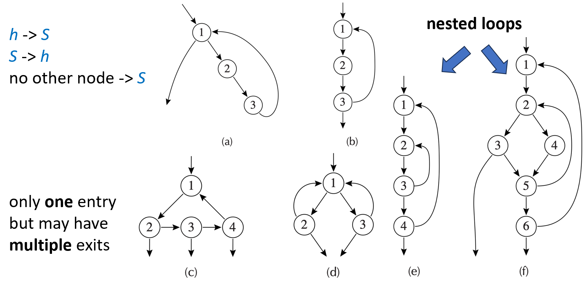
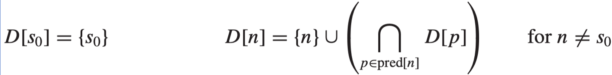
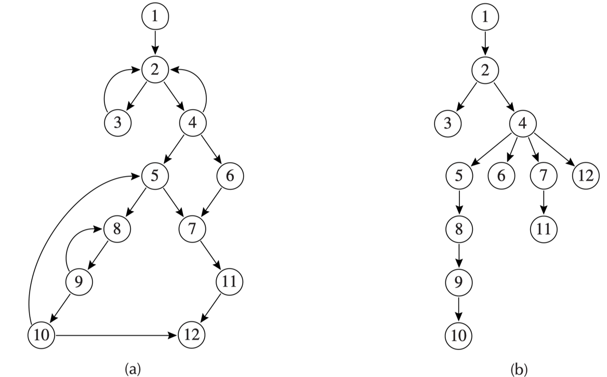
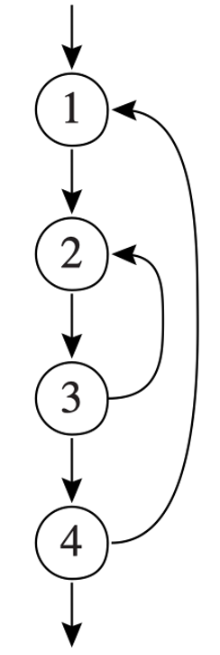
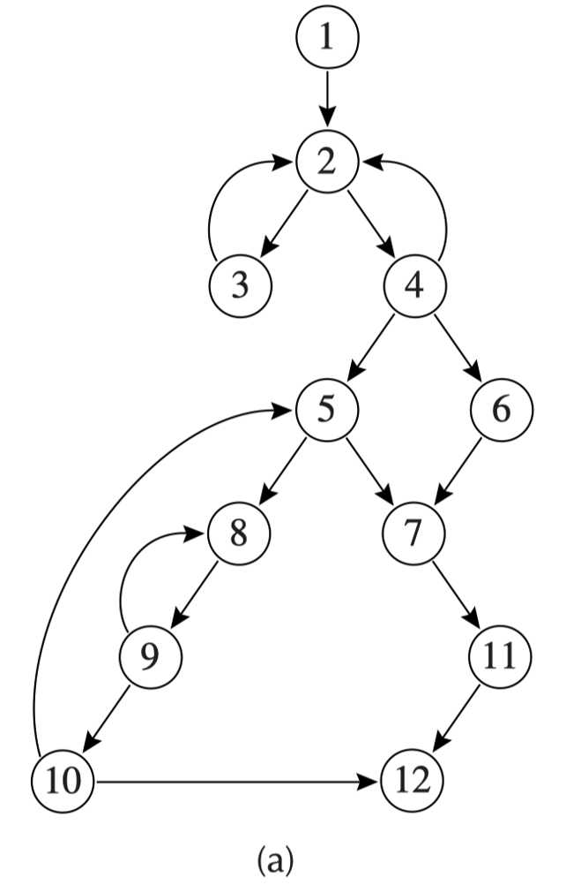
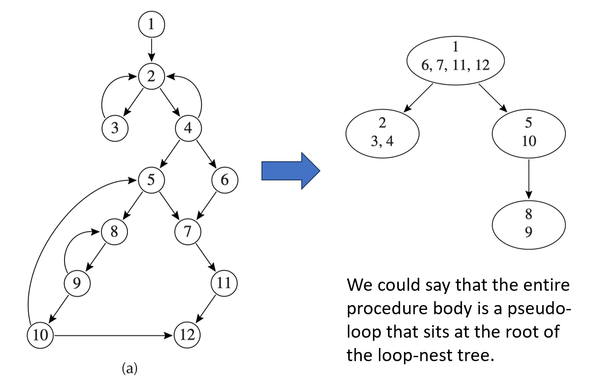
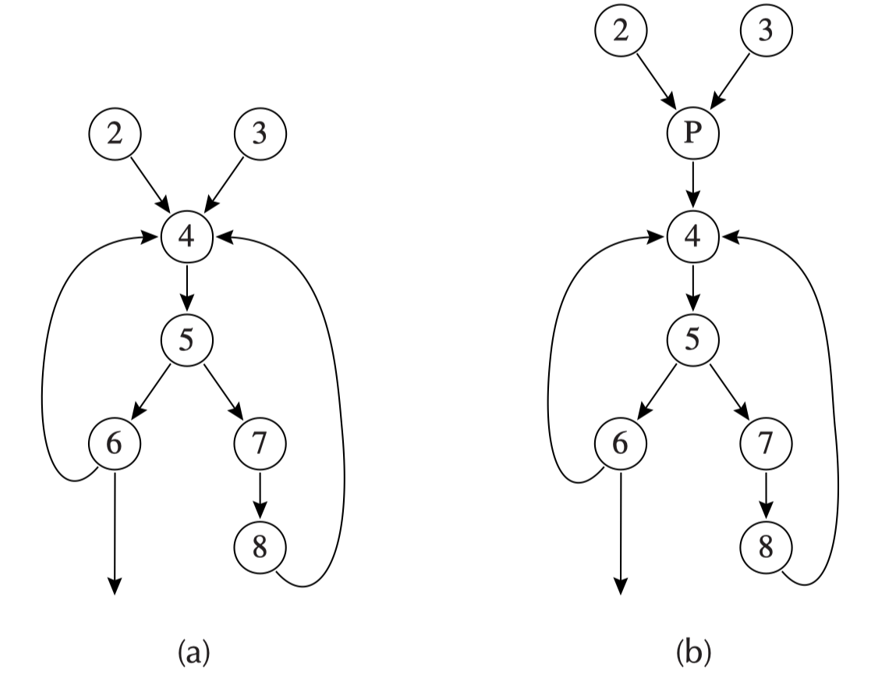
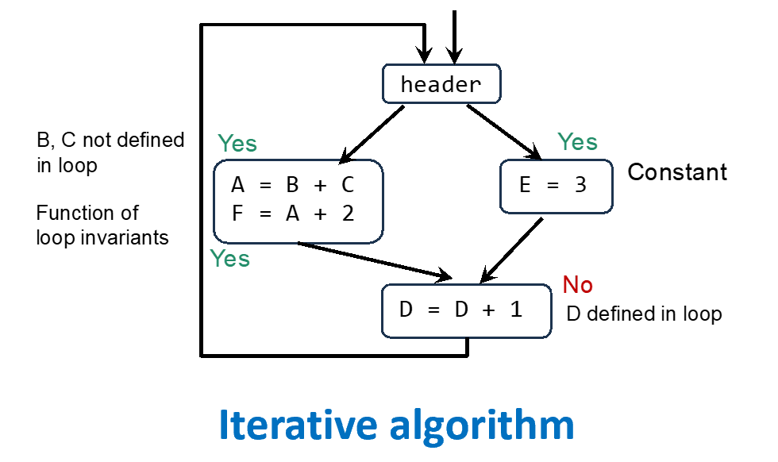
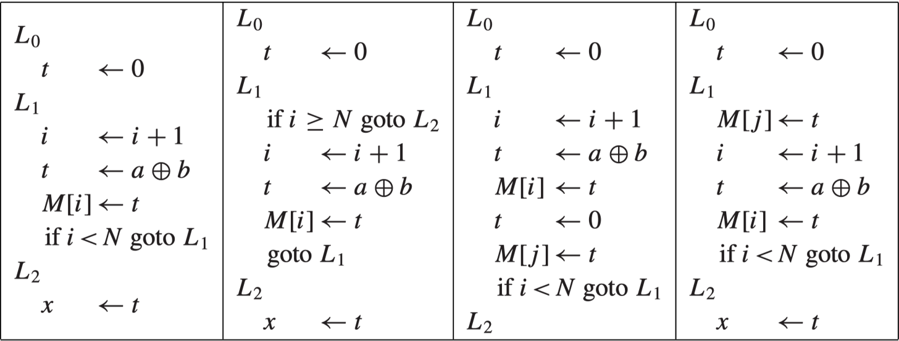
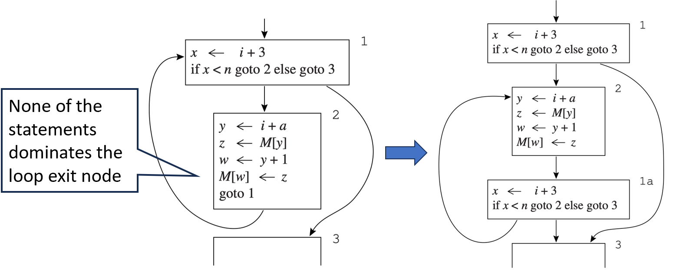

# Chapter 18 | Loop Optimizations

## 为什么要优化循环？ (Why to Optimize a Loop?)

* **帕累托法则（Pareto Principle / 80/20 法则）：**

> “Most computer programs spend 80% of the wall time executing only 20% of the code.”
> （大多数计算机程序在运行过程中，80% 的时间都花在执行那 20% 的核心代码上。）

**常见的循环优化技术（Loop optimization techniques）：**

* **hoisting (code motion，代码外提)：** 把循环中那些每次循环计算结果都相同的表达式（循环不变代码）提到循环外面去执行，避免重复计算。
* **strength reduction (强度削减)：** 将循环中开销较大的操作（如乘法或除法）替换为开销较小的等价操作（如加法或位移）。
* **loop unrolling (循环展开)：** 通过复制循环体来减少循环迭代的次数，从而减少循环控制开销（如条件跳转指令），并提高指令级并行度。

---

## 循环的定义 (Loop)

* **日常通用定义（韦氏词典）：**一连串重复执行的指令，直到达到终止条件为止。

**控制流图（CFG）中的数学/结构化定义：**

在控制流图中，一个循环是由一组节点集合 $S$ 和一个**头节点（Header Node）** $h$ 组成的集合，且必须满足以下三个严苛的性质：

1. **$S \rightarrow h$：** 从集合 $S$ 中的任意一个节点出发，都存在一条由有向边构成的路径能够到达头节点 $h$。
2. **$h \rightarrow S$：** 从头节点 $h$ 出发，存在一条有向路径可以到达集合 $S$ 中的任意一个节点。
3. **唯一入口性（核心）：** 没有任何一条来自集合 $S$ 外部的边，可以指向 $S$ 中除头节点 $h$ 以外的任何节点。也就是说，**外部想要进入这个循环，必须且只能从头节点 $h$ 进入**。

---

### Loop - Example

**基本概念拓展：**

* **Loop entry node（循环入口节点）：** 拥有来自循环外部“前驱节点”的节点（即循环的起点，也就是上一页提到的 Header $h$）。
* **Loop exit node（循环出口节点）：** 拥有指向循环外部“后继节点”的节点（即从这里可以跳出循环）。

**黄金法则：**

> **"only one entry but may have multiple exits"**（只能有一个入口，但可以有多个出口）

**图例分析 (a) 到 (f)：**

* **(a) 和 (b)：** 最基础的单回路循环。节点 1 是唯一的入口（Header），数据在内部循环后，(a) 从节点 1 出口，(b) 从节点 3 出口。
* **(c)：** 演示了**多出口**的情况。入口只有节点 1，但节点 2、3、4 都有向下的箭头可以跳出循环。这在代码中对应带有多个 `break` 或 `return` 的循环。
* **(d)：** 属于多回路但共享同一个入口。1->2->1 和 1->3->1 是两条不同的循环路径，但因为它们唯一的外部入口都是节点 1，所以它们被视为同一个大循环。
* **(e)：** 较为复杂的控制流。虽然内部有交错的边（如 3->2），但只要外部指针只指向节点 1，它依然满足单入口的循环定义。
* **(f) 嵌套循环 (Nested loops)：** 这是一个典型的大循环嵌套小循环的结构。外层循环是 1 变到 6 再回到 1；内层则在 2、3、4、5 之间形成更小的闭环。

---

## Dominator

* **引入目的：** 为了优化循环，首先必须在控制流图中准确地找到它们。**支配者（Dominators）** 的概念正是为此服务的。
* **核心定义：** > 如果从控制流图的起始节点 $s_0$ 到节点 $n$ 的**每一条**有向路径都必须经过节点 $d$，那么就称节点 $d$ **支配（Dominate）** 节点 $n$，记作 $d \text{ dom } n$。

**支配关系的特性：**

* $s_0$ 是控制流图的唯一入口起始节点。
* **自反性：** 每个节点都支配它自己（Every node dominates itself）。
* **多重性：** 一个节点 $n$ 可以拥有多个支配者。

**寻找支配者的经典算法（数据流方程）：**

$$D[s_0] = \{s_0\}$$

$$D[n] = \{n\} \cup \left( \bigcap_{p \in \text{pred}[n]} D[p] \right) \quad \text{for } n \neq s_0$$

* **含义：** 起始节点的支配者只有它自己。对于其他任意节点 $n$，它的支配者集合等于它自身，再加上它所有**前驱节点（Predecessors）** 的支配者集合的**交集**（即所有能到达 $n$ 的路径的共同必经点）。
* **求解方法：** 采用**迭代法**求解。初始化时，除了起始节点外，将所有其他节点的 $D[n]$ 全都初始化为包含图中所有的节点，然后不断迭代直至方程组收敛（不变点）。

---

### Immediate Dominators

* **定理（Theorem）：**在一个连通图中，如果节点 $d$ 和节点 $e$ 都支配节点 $n$，那么必然满足 $d$ 支配 $e$ 或者 $e$ 支配 $d$。这说明支配关系不会出现交错分叉，它在结构上天然具有**线性的嵌套性**。

??? note "proof"
    这个定理的证明非常经典且优雅，我们可以直接通过**支配（Dominance）的定义**以及**反证法**来证明。

    为了让推导更严密，我们首先明确定义：

    > **定义：** 在控制流图（CFG）中，如果从入口节点 $Entry$ 到节点 $n$ 的**每一条**路径都包含节点 $d$，则称 $d$ 支配 $n$（记作 $d \ dom \ n$）。

    已知 $d \ dom \ n$ 且 $e \ dom \ n$。我们要证明：$d \ dom \ e$ 或 $e \ dom \ d$ 必有一个成立。

    假设结论不成立，即 **$d$ 不支配 $e$** 且 **$e$ 不支配 $d$**。

    1. **根据 “$d$ 不支配 $e$”：** 既然 $d$ 不支配 $e$，说明从起点 $Entry$ 到 $e$ 存在至少一条**不经过 $d$** 的路径，我们把这条路径记为 $P_1$。

    $$P_1: Entry \xrightarrow{\text{不经过 } d} e$$

    2. **根据 “$e$ 不支配 $d$”：** 同理，从起点 $Entry$ 到 $d$ 存在至少一条**不经过 $e$** 的路径，我们把这条路径记为 $P_2$。

    $$P_2: Entry \xrightarrow{\text{不经过 } e} d$$

    3. **根据 “$e$ 支配 $n$”：** 因为 $e \ dom \ n$，所以从 $e$ 到 $n$ 必然存在某条路径。我们取其中一条路径记为 $P_3$。

    由于 $d$ 和 $e$ 是不同的节点，且我们假设 $d$ 不支配 $e$，那么在整个 $Entry \xrightarrow{P_1} e \xrightarrow{P_3} n$ 的完整路径中，**$d$ 是否一定出现呢？**

    不一定。因为 $P_1$ 明确不包含 $d$，如果 $P_3$ 恰好也不包含 $d$，那么这条连通的路径 $Entry \to e \to n$ 就不包含 $d$。这会直接与已知条件 “$d$ 支配 $n$” 矛盾。

    4. **构造绝对矛盾的路径：**

    为了做出无可辩驳的推导，我们注意到，既然 $d \ dom \ n$，那么**任何**到达 $n$ 的路径都得经过 $d$。

    我们现在组装一条新路径：

    * 先沿着 $P_1$ 从 $Entry$ 走到 $e$（此段绝对不经过 $d$）。

    * 再沿着已知存在的某条路径从 $e$ 走到 $n$。因为 $d \ dom \ n$，这条从 $e$ 到 $n$ 的后半段路径里**必然会遇到 $d$**（否则整条路就漏掉 $d$ 了）。

    * 也就是说，从 $e$ 到 $n$ 的过程中，必然是先走到 $d$，再走到 $n$。

    这就意味着，我们实际上拼出了一条这样的路径：

    $$Entry \xrightarrow{P_1 \text{ (无 } d)} e \rightarrow \dots \rightarrow d$$

    这条路径从 $Entry$ 出发，经过 $e$ 达到了 $d$，并且**前半段 $Entry \to e$ 没有 $d$**。

    关键点来了：由于整条路径的终点是 $d$，如果我们看它中间有没有经过 $e$——显然它经过了 $e$。

    但是，这与我们一开始的**定义/路径 $P_2$ 的存在性**产生了冲突。因为我们前面通过“$e$ 不支配 $d$”断定，存在一条完全避开 $e$ 也能到达 $d$ 的路径 $P_2$。而现在我们发现，任何想利用 $e$ 来构建到 $n$ 的路径，都会逼迫 $e$ 走到 $d$ 之前，从而形成了 $e$ 在 $d$ 前面的拓扑结构。

    证毕。

* **直接支配者（Immediate Dominator, 简称 $idom(n)$）的定义：**每一个除了起始节点 $s_0$ 以外的节点 $n$，有且仅有一个**直接支配者** $idom(n)$，它必须严格满足以下三点：

1. $idom(n)$ 不是 $n$ 自身。
2. $idom(n)$ 支配 $n$。
3. $idom(n)$ 不支配 $n$ 的任何其他支配者。换句话说，它是所有支配 $n$ 的节点中，在路径上**离 $n$ 最近**的那一个（相当于树结构中的直接父亲节点）。

---

### 支配树 (Dominator Tree)

* **定义：** 对于流图中的每一个节点 $n$，画一条从它的直接支配者 $idom(n)$ 指向 $n$ 的有向边，这样构建出来的图必然是一棵**树**（即支配树）。

**实例分析（对比图 a 与图 b）：**

* **图 (a) 是原控制流图：** 包含了 1 到 12 个节点，存在多条复杂的交错路径和回指边。
* **图 (b) 是推导出的支配树：** * 节点 1 是起点，所以是树根。
* 到达 3 和 4 必须经过 2，因此 2 是 3 和 4 的父亲。
* 观察图 (a) 可以发现，无论怎么绕，要到达 5、6、7、12，都必须先通过 4。因此在支配树中，4 是 5、6、7、12 的直接父亲。
* 同理，要到达 10 必须通过 9，到达 9 必须通过 8，到达 8 必须通过 5，因此在树中形成了 $5 \rightarrow 8 \rightarrow 9 \rightarrow 10$ 的单线支配链。

---

### 自然循环 (Natural Loops)

* **为什么强调单入口？**

编译器非常关心循环是否只有**单入口**。如果是，意味着每次进入循环时，某些初始条件（如循环变量初始化）能够被完全确定，这极大地方便了后续的代码优化。

* **回边（Back edge）的定义：**如果控制流图中存在一条有向边 $n \rightarrow h$，并且头节点 $h$ 支配尾节点 $n$（即 $h \text{ dom } n$），那么这条边就被称为**回边**。

* **自然循环的严格定义：**

对应于一条回边 $n \rightarrow h$ 的**自然循环**是一个节点的集合，满足：

1. $h$ 支配该集合中的所有节点。
2. 存在一条不经过 $h$ 就能到达 $n$ 的路径。
3. 该循环的头节点（Header）就是 $h$。

* 图中 $3 \rightarrow 2$ 是一条回边（因为 2 支配 3），它对应一个局部小循环；$4 \rightarrow 1$ 也是一条回边（因为 1 支配 4），对应一个更大的循环。

给定一条回边 $Y \to X$（其中 $X$ 支配 $Y$），这条回边所对应的自然循环是一个满足以下条件的最小节点集合：

1. 它包含 $X$（头节点）和 $Y$（尾节点）。
2. 对于集合中的任意节点（除了 $X$），如果在 CFG 中有一条路径能到达它，那么这条路径上的所有节点也必须在这个集合里。

换个**好理解的算法描述**： 自然循环就是在不经过 $X$ 的情况下，能够到达 $Y$ 的所有节点的集合，再加上 $X$ 本身。

---

#### 自然循环示例 (Natural Loops - Example)

* **分析回边 $10 \rightarrow 5$：**

节点 5 支配节点 10，因此 $10 \rightarrow 5$ 是一条合法的回边。它构成的自然循环包含节点 $\{5, 8, 9, 10\}$。同时，内部还嵌套了一个由回边 $9 \rightarrow 8$ 构成的子循环 $\{8, 9\}$。

**一个头节点拥有多个自然循环：**图中的节点 2 同时是两条回边的终点：

* 回边 $3 \rightarrow 2 \Rightarrow$ 对应自然循环 $\{2, 3\}$
* 回边 $4 \rightarrow 2 \Rightarrow$ 对应自然循环 $\{2, 4\}$

* **反例警示：**集合 $\{2, 3, 4\}$ 连起来在视觉上确实是一个环，但它**不是一个独立的自然循环**。因为它是由两条不同的回边杂糅在一起的，在编译器处理时，必须把它们识别为以 2 为共同头节点的两个独立自然循环的组合。

---

### 嵌套循环 (Nested Loop)

**定义：**

假设有两个循环 $A$ 和 $B$，它们的头节点分别为 $a$ 和 $b$。如果 $a \neq b$，且头节点 $b$ 包含在循环 $A$ 的节点集合中，那么循环 $B$ 的所有节点必然是循环 $A$ 的节点的**真子集**（$B \subset A$）。

此时，我们称**循环 $B$ 嵌套在循环 $A$ 之中**，或者称 $B$ 是**内层循环（Inner Loop）**。

---

#### 循环嵌套树 (Loop-Nest Tree)

##### 构建步骤

1. 计算流图 $G$ 的所有支配者。
2. 构建支配树。
3. 找出所有的回边和它们对应的自然循环，从而确定所有的循环头节点（Loop-headers）。
4. **合并：** 对于拥有相同循环头节点 $h$ 的多个自然循环，将它们合并为一个单一的大循环，记为 $loop[h]$。
5. **建树：** 如果循环头 $h2$ 包含在 $loop[h1]$ 内部，则在树结构中将 $h1$ 连向 $h2$（即 $h1$ 是 $h2$ 的父节点）。

##### 实例映射展示

* **根节点（1 号伪循环）：** 整个过程体（Procedure Body）被视为一个最大的“伪循环”作为树根，它剥离掉子循环后，独占的节点有 $\{1, 6, 7, 11, 12\}$。
* **左子树：** 以 2 为头节点的循环，合并了 $\{2,3\}$ 和 $\{2,4\}$，形成了节点集合 $\{2, 3, 4\}$。
* **右子树：** 以 5 为头节点的循环，除去更深层的嵌套后，自身剩下 $\{5, 10\}$。而以 8 为头节点的内层循环 $\{8, 9\}$ 则作为叶子节点，垂直挂在 5 的下面。

---

### 循环前置头 (Loop Preheader)

**动机（Motivation）：**

许多循环优化（最典型的就是**循环不变代码外提 hoisting**）需要把一些计算语句从循环内部抽离出来，并在**循环刚刚要开始执行之前**立即执行。

* **面临的问题：** 如果原流图中有很多条从外部进入循环头的边（如图 a 中的 2->4 和 3->4），我们很难找到一个唯一的、合适的地方去安放这些外提的代码。
* **解决方案——插入 Preheader：**

1. 在循环头节点（图中的 4）之前，人为插入一个全新的、初始为空的代码块，称为**前置头节点 $P$（Preheader node）**。
2. 把所有**从循环外部**指向原循环头的边（$2 \rightarrow 4$ 和 $3 \rightarrow 4$），全部重定向改为指向 $P$。
3. 让 $P$ 成为原循环头（4）的唯一前驱。

4. **注意：** 循环内部的回边（如 $6 \rightarrow 4$ 和 $8 \rightarrow 4$）保持不变，依然直接连到 4。

变换后的图 (b) 中，新引入的节点 $P$ 就成了一个完美的“置放区”，所有从循环里提出来的代码都可以安全地塞进 $P$ 中，只执行一次，从而实现了性能优化。

---

## 循环不变计算 (Loop-Invariant Computations)

* **核心概念：**如果循环内部包含一条赋值语句 $t \leftarrow a \oplus b$（其中 $\oplus$ 代表某种算术或逻辑运算符），并且操作数 $a$ 在循环的每次迭代中都保持**相同的值**，操作数 $b$ 在每次迭代中也保持**相同的值**，那么显而易见，计算结果 $t$ 在每次迭代中也必然是一样的。
* **优化目标——提升（Hoist）：**既然每次算出来的结果都一模一样，在循环里面重复执行成千上万次就是纯粹的性能浪费。我们希望把这个计算提升（Hoist，或称外提）到循环外面，让它只执行一次。
* **留下的伏笔：**一个核心问题是**编译器该如何严谨地知道操作数 $a$ 在每次迭代中的值都是相同的呢？**

---

### 循环不变性的判定规则与迭代算法 (Rules & Algorithm)

* **判定准则：**对于循环 $L$ 中的一条定义语句 $d: t \leftarrow a_1 \oplus a_2$，如果它的每一个操作数 $a_i$ 都满足以下三个条件之一，那么它就是**循环不变的（Loop-invariant）**：

1. $a_i$ 是一个**常数（Constant）**。
2. 该循环内**所有**能够到达该数据流位置的对 $a_i$ 的定义，全部位于循环的**外部**（即循环内部没有修改过 $a_i$）。
3. 该循环内**有且仅有一个**对 $a_i$ 的定义能够到达此处，并且那个定义本身也已经被判定为**循环不变的**（属于链式依赖）。

**为什么要用“迭代算法（Iterative algorithm）”？**

因为规则 3 允许“循环不变性”进行多级传导（比如 $F$ 依赖 $A$，$A$ 依赖外部变量）。编译器需要通过多次扫描循环体，像滚雪球一样把所有隐蔽的不变表达式都挖掘出来，直到某一次扫描发现没有新的不变表达式为止（达到不动点）。

**具体分析：**

* `E = 3`：满足条件 1（常数），是循环不变的（**Yes**）。
* `A = B + C`：由于 $B$ 和 $C$ 在循环内部都没有被重新赋值，它们来自循环外部，满足条件 2，因此是循环不变的（**Yes**）。
* `F = A + 2`：虽然 $A$ 是个变量且在循环内定义，但由于 $A$ 的定义已经确定是循环不变的，满足条件 3，因此 `F` 也是循环不变的（**Yes**）。
* `D = D + 1`：因为它依赖它自己，而 $D$ 在循环内部不断被自增修改，不满足任何一条，所以**不是**循环不变的（**No**）。

---

### 代码外提的安全性/正确性挑战 (Hoisting - Correctness)

**哪怕一个表达式是循环不变的，我们就能随心所欲地把它提到循环外面吗？答案是：不能。**

* **案例 (a) [correct faster]：** 正常的循环，$t \leftarrow a \oplus b$ 在循环体内每轮都必然执行，提到外面完全安全，且程序变快。
* **案例 (b) [incorrect: not always execute the def]：** 这是一个带有分支的循环。如果初始条件 `i >= N` 成立，循环体本该**一次都不执行**。如果盲目把 $t \leftarrow a \oplus b$ 提到循环外面，就会导致该语句被强行执行了一次。如果这行代码包含“除以 0”或“数组越界”等潜在错误，就会引发程序无故崩溃。
* **案例 (c) [incorrect: more than one def of t]：** 在循环体内，变量 $t$ 被赋予了多次值（后面还有一句 `t <- 0`）。如果把前一个 $t$ 的定义提到外面，就会打乱 $t$ 在循环内部的局部赋值逻辑，导致后续依赖 $t$ 的语句（如 `M[j] <- t`）拿到错误的值。
* **案例 (d) [incorrect: a use of t before the def]：** 在循环内部，语句 `M[j] <- t` 在 $t \leftarrow a \oplus b$ 的前面被执行。这意味着在第一轮迭代中，`M[j]` 应该使用的是循环前 $t$ 的初始值（即 $t \leftarrow 0$）。如果把后面的定义提到循环外部，那么第一轮迭代时 `M[j]` 就会直接拿到 $a \oplus b$ 的值，篡改了原程序的业务逻辑。

> 其实有点像循环不变表达式和循环不变语句的区别。前者只关心表达式的值是否在循环内保持不变；后者则还要考虑它在程序中的位置关系（是否会被跳过，是否会被覆盖，是否会被提前使用），因此需要更严格的安全性检查。

---

#### 代码外提的三个安全准则 (Hoisting Criteria)

将语句 $d: t \leftarrow a \oplus b$ 外提到 **Loop Preheader（循环前置头）** 时，必须**同时满足**的三个严格准则（Criteria）：

1. **准则一（消除案例 b 的隐患）：**

定义点 $d$ 必须支配（Dominate）所有“变量 $t$ 在其出口处活跃（Live-out）”的循环出口节点。

* *含义：* 只要程序通过某个出口跳出循环且后续还要用 $t$，那么在跳出前就**必定执行过** $d$。这确保了提到外面提前执行不会变成“多此一举”或者引发不必要的空指针/除零异常。

2. **准则二（消除案例 c 的隐患）：**

整个循环体内，有且仅有 $d$ 这一个地方对变量 $t$ 进行了定义（赋值）。这消除了多个定义之间相互干扰的冲突。

3. **准则三（消除案例 d 的隐患）：**

变量 $t$ 在循环前置头（Preheader）的出口处不能是活跃的（Not live-out）。也就是说，进入循环之前，原程序不应该期望使用 $t$ 刚才在外面被提到前置头里的那个新值，避免破坏“先使用、后定义”的初始状态。

---

### 隐式副作用与 While 循环转换 (Implicit Side Effects & While Loops)

* **隐式副作用（Implicit side effects）：**如果 $t \leftarrow a \oplus b$ 包含可能引发算术异常（如除以零）的操作，上面的规则还需要更加谨慎地修改，防止优化反而改变了程序的异常抛出行为。

**While 循环面临的尴尬困境：**

* 看左边的控制流图（这是一个标准的 `while` 循环结构）：代码块 1 是条件判定，代码块 2 是循环体，代码块 3 是循环出口。
* 因为从块 1 可以直接跳到块 3（当循环条件一开始就不满足时），这意味着**循环体（块 2）根本不支配循环的出口（块 3）**！
* 根据上一页的**准则一**，块 2 里面的任何语句都无法通过安全性检查。这意味着，对于最常用的 `while` 循环，编译器**几乎无法直接外提任何循环不变代码**。

**编译器的妙手回春——转换为 repeat-until 结构：**

* 为了打破这个僵局，编译器会在优化前对控制流图进行**结构改造**（如右图所示）。
* 它将第一次条件判定（块 1）留在外面，当条件满足时才进入内部。而在内部，循环体（块 2）执行完毕后，直接连到一个新的尾部判定块（块 1a）。
* 通过复制一次条件判定代码（这种技术被称为 Loop Peeling 或 Duplication），使得块 2 在这个新形成的内部核心环路中变成了“必经之路”（完美支配了后续的循环出口），从而成功绕过了准则一的限制，让代码外提（Hoisting）得以顺利实施。

---