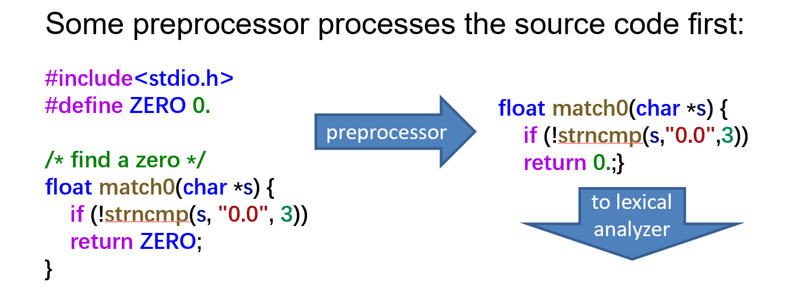
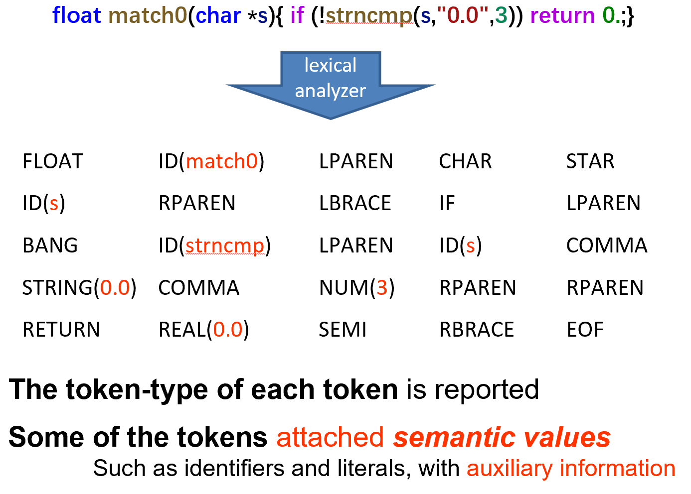
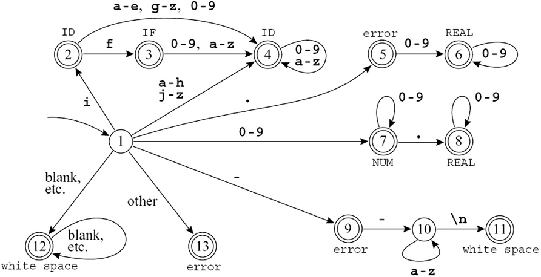
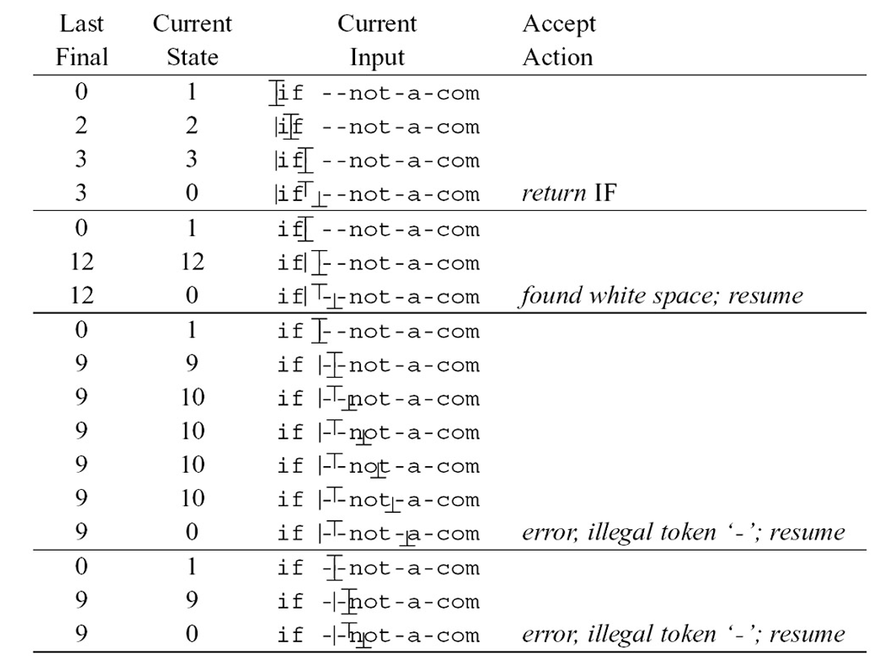
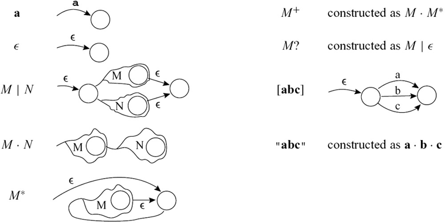
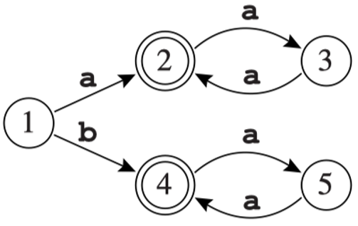
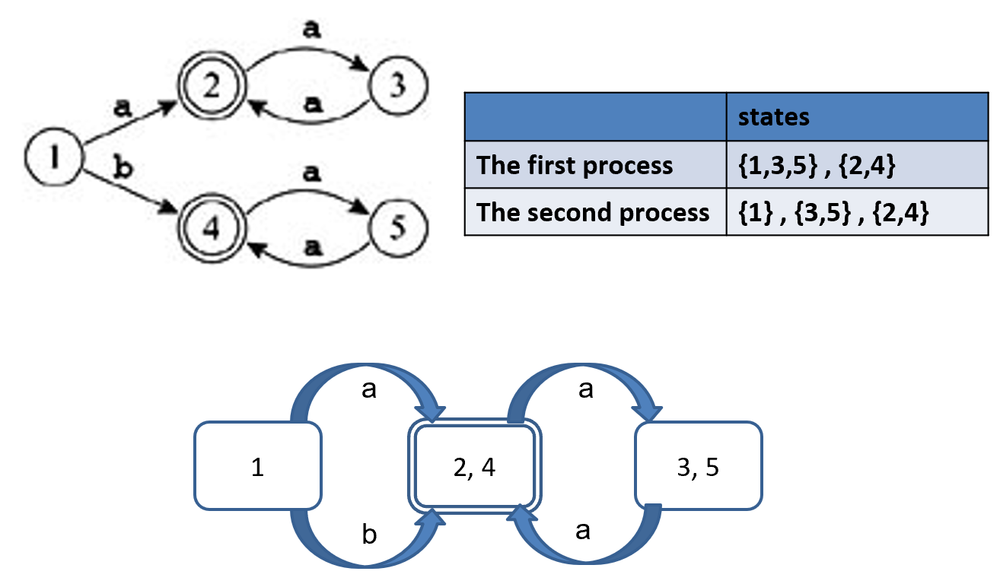

# Chapter 2 | Lexical Analysis

## Lexical Token

A lexical token: A sequence of characters; A unit in the grammar of a programming language (e.g., terminal symbol)

**词法记号**是字符序列，是程序设计语言语法中的最小单位（通常称为终结符）。

分类：记号被分为有限的几种类型，并给出了具体示例：

- `ID`（标识符）：如变量名 foo, n14。
- `NUM`/`REAL`（数字/实数）：如 73, 66.1, 1e67 等。
- `RESERVED_WORD`（保留字）：如 if, void, return。这类词具有特殊含义，不能用作普通标识符。

- `SYMBOL`（符号）：如逗号 `,`、不等号 `!=`、左右括号 `( )` 等。

**非记号**（Non-tokens）：这些内容会被编译器忽略或过滤掉，包括：

- `COMMENT`（注释）：如 `/* ... */`。
- `PREPROCESSOR_DIRECTIVE`（预处理指令）：如 `#include`, `#define`。
- `MACRO`（宏）：如 `#define MAX 100`。
- `WHITESPACE`（空白字符）：如空格、制表符、换行符。

**预处理器**（Preprocessor）的作用：展示了原始代码（包含注释和宏定义）如何经过预处理，变成“干净”的代码（剥离了注释和宏），然后才移交给词法分析器。



---

演示了词法分析器如何将代码转换成记号流（Token Stream）：

输入代码：`float match0(char *s) { if (!strncmp(s, "0.0", 3)) return 0.; }`

转换结果：展示了代码被切分成一个个 Token 的过程。例如：

- 关键字 `float` 被识别为 `FLOAT` 类型。
- 函数名 `match0` 被识别为 `ID(match0)`。
- 操作符和分隔符如 `( * ) { !` 等都被赋予了相应的记号类型。

核心概念：

1. 报告每个记号的类型（Token-type）。
2. 为某些记号附加语义值（Semantic values），例如标识符的名称或字面量的值（如 REAL(0.0)）。



---

## Regular Expression


**字母表** (Alphabet)：符号的有限集合（如 $\{a, b, c, ... , z\}$）。

**字符串** (String)：来自字母表的符号的有穷序列。

**语言** (Language)：字符串的集合（可以是无限集）。

---

### Symbol

- 记作 $a$，表示字母表中的某个符号。
- 每个符号 $a$ 的正则表达式 $a$ 表示只包含字符串 $a$ 的语言。例如：正则表达式 $a$ 表示语言 $\{a\}$。

---

### Alternation

- 用竖线 $|$ 表示。
- 给定两个正则表达式 $M$ 和 $N$，$M|N$ 表示“$M$ 或 $N$”。
- 形式化定义：$M|N$ 的语言是 $M$ 的语言与 $N$ 的语言的并集。
- 例子：$a|b$ 表示语言 $\{a, b\}$。

---

### Concatenation
- 用点号 $\cdot$（有时省略）表示。
- 给定两个正则表达式 $M$ 和 $N$，$M \cdot N$ 表示“先 $M$ 后 $N$”。
- 形式化定义：$M \cdot N$ 的语言是所有形式为 $\alpha\beta$ 的字符串，其中 $\alpha$ 属于 $M$ 的语言，$\beta$ 属于 $N$ 的语言。
- 例子：$(a|b) \cdot a$ 表示语言 $\{aa, ba\}$。

---

### Epsilon, $\epsilon$

- $\epsilon$ 表示只包含空串的语言 $\{\epsilon\}$。
- 例子：$(a \cdot b) | \epsilon$ 表示语言 $\{ab, \epsilon\}$。

---

### Kleene 闭包, Repetition

- 给定正则表达式 $M$，$M^*$ 表示 $M$ 的 Kleene 闭包。
- $M^*$ 的语言是 $M$ 的零个或多个字符串的连接。
- 例子：$((a|b) \cdot a)^*$ 表示所有由 $a$ 或 $b$ 开头、以 $a$ 结尾的字符串的任意重复，包括空串。
- 例如：$\{\epsilon, aa, baa, aaaa, baaa, aaba, baba, aaaaaa, ...\}$。

---

### 常用缩写与扩展（Abbreviations & Extensions）

正则表达式在实际应用中常用一些缩写和扩展形式，便于表达复杂的模式:

**字符集**：

- `[abcd]` 等价于 $a|b|c|d$，表示“a、b、c、d 之一”。
- `[b-g]` 表示 $b|c|d|e|f|g$。
- `[b-gM-Qkr]` 表示 $b|c|d|e|f|g|M|N|O|P|Q|k|r$。

- $M?$ 等价于 $M|\epsilon$，表示 $M$ 出现 0 次或 1 次。
- $M^+$ 等价于 $M \cdot M^*$，表示 $M$ 至少出现 1 次。

> 这些扩展形式**仅仅是书写上的便利**，并没有增加正则表达式的表达能力。任何用这些缩写描述的字符串集合，都可以用基本的正则表达式运算符（选择、连接、闭包）来描述。

---

### 常见正则表达式符号表

| 记号         | 含义                                                         |
|:------------:|:------------------------------------------------------------:|
| $a$          | 普通字符 a 本身                                              |
| $\epsilon$   | 空串                                                         |
| $M|N$        | 选择，$M$ 或 $N$                                             |
| $M \cdot N$  | 连接，$M$ 后跟 $N$                                           |
| $MN$         | 连接的另一种写法                                             |
| $M^*$        | 闭包，$M$ 出现零次或多次                                     |
| $M^+$        | 正闭包，$M$ 出现一次或多次                                   |
| $M?$         | 可选，$M$ 出现零次或一次                                     |
| $[a-zA-Z]$   | 字符集，表示 a 到 z 或 A 到 Z 之一                           |
| .            | 任意单个字符（除换行符）                                     |
| "a.+*"       | 引号内字符串按字面意义匹配                                   |

---

### Regular expressions for some tokens

| 词法单元 | 正则表达式                  | 说明                       |
|:---------:|:----------------------------|:---------------------------|
| if       | if                         | 关键字 if                  |
| ID       | [a-z][a-z0-9]*             | 以字母开头，后跟字母或数字  |
| NUM      | [0-9]+                     | 一个或多个数字             |
| REAL     | ([0-9]+\".\"[0-9]*)|([0-9]*\".\"[0-9]+) | 实数（小数点前后有数字）|
| /*do nothing*/ | ("--"[a-z]*"\n")|(" "|"\n"|"\t")+ | 注释或空白符，编译器忽略 |
| error()    | .                          | 其他未定义的单个字符       |

---

### 规则的二义性与消歧原则

在实际的词法分析中，正则表达式规则有时会出现**二义性**（ambiguous），即同一个输入串可以被多条规则匹配。例如：

- 输入 `if8`，既可以整体作为标识符 `ID(if8)`，也可以被分解为关键字 `IF` 和数字 `NUM(8)`。
- 输入 `if 89`，`if` 应被识别为关键字，`89` 为数字。

这种二义性如何解决？主流词法分析器（如 Lex、JavaCC 等）采用如下两条消歧规则：

1. 最长匹配原则（Longest match）：总是选取**能够匹配的最长前缀**作为下一个 token。
2. 规则优先级（Rule priority）：如果有多个规则都能匹配同一最长前缀，则选择**规则表中靠前的**（即先写的）规则。

**举例说明：**

- `if8` 整体能被 `ID` 规则匹配（最长），所以识别为 `ID(if8)`。
- `if 89`，`if` 能被 `IF` 规则和 `ID` 规则同时匹配，但 `IF` 规则在前，所以识别为 `IF`。

---

## Finite Automata

这部分有关内容参考编译原理，以下是便于原理没有的部分。



---

### 规则优先级是如何实现的？

**状态2** 兼具 `IF` 自动机的状态2 和 `ID` 自动机的状态2 的特性；由于后者是终结状态，因此合并后的状态也必须是终结状态。

**状态3** 类似于 `IF` 自动机的状态3 和 `ID` 自动机的状态2；

为了解决两个终结状态的歧义，采用*规则优先级*：将状态3标记为 `IF`，因为我们希望该记号被识别为保留字（reserved word），而不是标识符（identifier）。

---

### 用转移矩阵实现有限自动机

**将自动机编码为“转移矩阵”**：

- 用二维数组（向量的向量）表示，按“状态编号”和“输入字符”下标。
- 通常会有一个“死状态”（如 state 0），对所有字符都自环，表示“无边”。

```c
int edges[][] = { /* ... 0,1,2... e f g h i j ... */
/* state 0 */           {0,0,0,0...0,0,0,0,0,0},
/* state 1 */           {0,7,7,7...4,4,4,2,4...},
/* state 2 */           {0,4,4,4...0,4,3,4,4,4...},
/* state 3 */           {0,4,4,4...0,4,4,4,4,4...},
/* state 4 */           {0,4,4,4...0,4,4,4,4,4...},
/* state 5 */           {0,6,6,6...0,0,0,0,0,0...},
/* state 6 */           {0,6,6,6...0,0,0,0,0,0...},
/* state 7 */           {0,7,7,7...0,0,0,0,0,0...},
/* state 8 */           {0,8,8,8...0,0,0,0,0,0...},
// ...et cetera
};
```

此外还需一个“终结性”数组（finality array），将状态编号映射到动作（如：最终状态2映射到某个action ID）。

---

### 识别最长匹配（Longest Match）

**词法分析器的核心任务**：找到输入串的最长前缀，使其为某个合法token。

实现要点：

1. 维护两个变量：

- `Last-Final`：最近一次到达的终结状态编号
- `Input-Position-at-Last-Final`：最近一次到达终结状态时的输入位置

2. 每次进入终结状态时，更新这两个变量。
3. 如果进入“死状态”（无输出转移的非终结状态），就用这两个变量确定匹配的token及其结束位置。

---

在有限自动机（DFA）实现词法分析时，常用如下三组变量（或称三指针）来追踪识别过程：

1. **输入指针（input position）**：指向当前正在读取的输入字符。
2. **自动机状态指针（automaton position）**：指示当前自动机所处的状态。
3. **最近终结状态指针（last final）**：记录最近一次到达的终结状态编号。

在识别过程中，自动机会根据输入字符和当前状态，不断进行状态转移。每当进入一个终结状态时，就更新“最近终结状态指针”和“输入指针”。

当遇到无法继续转移（进入死状态）时，自动机会回溯到最近一次终结状态，认定此前的输入为一个合法token，并据此采取相应动作（如输出token、恢复输入指针等）。



表中符号说明：

- `|` ：输入指针所在位置（input position）
- `⎯` ：自动机状态指针（automaton position）
- `T` ：最近终结状态（last final）

---

## Nondeterministic Finite Automata 





观察图中的状态 $2$ 和状态 $4$，它们显然在逻辑上是等价的（都是接受状态，且接收字符 $a$ 后都在各自的循环中），但是 $trans[2, a] = 3$，而 $trans[4, a] = 5$。因为 $3$ 和 $5$ 是不同的编号，用初级定义无法认出 $2$ 和 $4$ 是等价的。

---

### Hopcroft 算法或等价类划分法

**核心思想反转**：正向去寻找所有等价的状态很困难，但是反向去寻找“不等价”的状态并把它们区分开却很容易。

算法的四个步骤：

1. 初始分组：先做最粗略的假设，把所有状态分为两大组：一组是所有的接受状态 (final states)，另一组是所有的非接受状态 (non-final states)。
2. 分裂组 (Kick out non-equivalent states)：在同一个组内挑选状态进行测试。如果组内的两个状态 $s$ 和 $t$，在接收同一个字符 $a$ 后，跳转到了不同的组，这就证明它们本质上是不等价的，必须把这个组拆分开来。
3. 迭代循环：不断重复步骤 2 对所有的组进行检查和分裂，直到没有任何组可以再被拆分为止。
4. 构建新 DFA：最终稳定下来的每一个组，就合并成为了最小化 DFA 中的一个单一状态。

示例：



按照步骤 1，根据是否为双圈（接受状态），将原图分为两个初始组：非接受状态组：$\{1, 3, 5\}$接受状态组：$\{2, 4\}$

- 测试组 $\{2, 4\}$：状态 $2$ 遇 $a$ 去 $3$，状态 $4$ 遇 $a$ 去 $5$。因为 $3$ 和 $5$ 目前都同属于 $\{1, 3, 5\}$ 这个组，所以 $2$ 和 $4$ 表现一致，不分裂，保留 $\{2, 4\}$。
- 测试组 $\{1, 3, 5\}$：仔细观察状态 $1$，它遇到字符 $b$ 会转移到状态 $4$（属于接受状态组）。而状态 $3$ 和 $5$ 遇到字符 $b$ 并没有定义转移（通常视为转移到死状态，不属于 $\{2, 4\}$ 组）。因为状态 $1$ 在面对输入 $b$ 时的“去向组”与 $3$ 和 $5$ 不同，因此 $1$ 被踢出，单独成组。$3$ 和 $5$ 表现一致，保留在一起。

最终结果：分组稳定在 $\{1\}$, $\{3, 5\}$, $\{2, 4\}$。最下方的图展示了最终的最小化 DFA：原本的 5 个状态被精简成了 3 个状态（方框表示），且完美保留了原有的语言识别能力。

---

## Lex: A Lexical Analyzer Generator

### Lex 是什么？

在编译器的工作流程中，第一步是“词法分析”，也就是把程序员写的一大串代码字符，切分成一个个有意义的“单词”（Token）。

* 手动编写程序去识别这些单词（即手动构建 DFA，确定性有限状态自动机）是非常繁琐且容易出错的机械性劳动。
* **Lex 的解决方案**：它是一个**代码生成器 (Generator)**。你只需要用人类容易理解的**正则表达式 (Regular Expression)** 告诉它你想匹配什么规则，Lex 就能自动在后台帮你生成出那个复杂的 DFA，并最终输出一段可以执行的 **C 语言代码**。

**Lex 作为一个程序的输入和输出：**

* **输入**：一个 `.l` 后缀的文本文件。里面包含了正则表达式规则，以及当你匹配到这些规则时，想要执行的 C 语言动作。
* **输出**：一个包含了 C 语言源码的文件（通常叫 `lex.yy.c`）。这个文件里包含了一个名为 `yylex` 的核心函数。你可以把 `yylex` 理解为一个获取下一个 Token 的机器 (`getToken` procedure)，它是一个基于表格驱动的 DFA 实现。

---

### Lex 文件的经典“三段式”结构

Lex 的输入文件有着极其严格的语法格式，用两个 `%%` 符号将文件硬性分割为三个部分：

```lex
{ definitions }   // 第一部分：定义区
%%
{ rules }         // 第二部分：规则区
%%
{ auxiliary routines } // 第三部分：用户辅助函数区

```

**Definitions**：

* 这里用于定义正则表达式的宏（比如给 `[0-9]` 命名为 `digit`，方便后面复用）。
* **特别注意**：如果你想在这里直接写普通的 C 语言代码（比如 `#include` 头文件、声明全局变量），这些代码必须被包裹在 `%{` 和 `%}` 这两个特定的定界符之间，并且这两个符号的字符顺序绝对不能写反。

**Rules**：

* 这是 Lex 文件的核心。每一行由“正则表达式”和配套的“C 语言动作”组成。当 Lex 匹配到左侧的正则时，就会直接执行右侧的 C 代码。

**Auxiliary routines**：

* 如果你在第二部分的动作中调用了一些自己写的复杂函数，这些函数的具体 C 语言实现就写在这里。这些代码会被 Lex 原封不动地拷贝到最终生成的 C 文件末尾。

---

### 代码拆解：十进制转十六进制

一个完整且真实的 Lex 程序，它的功能是：**读取文本，把里面所有的十进制数字替换为十六进制打印出来，并统计总共替换了多少个大于 9 的数字。**

我们结合三段式结构逐行拆解：

**第一部分：定义区**

```c
%{
/* 这是一个 C 语言注释 */
#include <stdlib.h>  // 为了使用 atoi() 函数
#include <stdio.h>   // 为了使用 printf() 等标准输入输出
int count = 0;       // 定义一个全局变量，用于统计替换次数
%}
digit [0-9]          // 正则宏：digit 代表 0 到 9 的任意一个数字
number {digit}+      // 正则宏：number 代表一个或多个 digit
```

**`%%` (分割线)**

**第二部分：规则区**

```c
{number} { 
    int n = atoi(yytext);  // yytext 是 Lex 的内置变量，存放着当前匹配到的具体文本字符串
    printf("%x", n);       // 将十进制整数以十六进制小写 (%x) 打印出来
    if (n > 9) count++;    // 如果这个数字大于 9，统计次数加 1
}

```

*(注意：这里的意思是，只要文本中出现了符合 `{number}` 规则的字符串，就会触发花括号里的 C 代码动作。)*

**`%%` (分割线)**

**第三部分：辅助函数区**

```c
main() 
{ 
    yylex(); // 启动词法分析引擎，它会不断读取标准输入，直到文件结束
    // 顺带一提：幻灯片上的 stdeer 应该是一个拼写错误，正确的 C 语言标准错误输出流是 stderr
    fprintf(stderr, "number of replacements = %d", count); 
    return 0; 
}

```

---