# Chapter 3 | Syntax Analysis

## What is Syntax Analysis?

语法分析是编译原理中的一个重要阶段，主要任务是分析单词（token）如何组合成短语、子句或句子，即分析程序结构是否符合语言的语法规则。

- Syntax（句法）：指单词如何组合成短语、子句或句子。
- 语法分析的目标是解析程序的短语结构。

---

### **语法分析的流程**

1. 词法分析（Lexer）：

- 输入：如 `1 + 2 * 3` 这样的表达式。
- 输出：将输入分解为一系列记号（token），如 `num(1) plus num(2) times num(3)`。

2. 语法分析（Parser）：

- 输入：词法分析得到的 `token` 序列。
- 依据**文法（grammar）**规则，将 token 组织成语法树（如抽象语法树 AST）。
- 输出：程序的抽象语法结构。

---

### **文法（Grammar）**

文法定义了语言的结构规则。例如：`E := num | E plus E | E times E`

语法分析器（Parser）就是根据文法规则来判断 token 序列是否符合语法，并构建语法树。

---

### **语法树（Abstract Syntax Tree）**

语法分析的结果通常是一棵树，称为抽象语法树（AST）。

例如表达式 `1 + 2 * 3` 的语法树：

```
      E
     /|\
    E plus E
   /     /|\
num(1)  E times E
         |     |
      num(2) num(3)
```

---

## Why do we need syntax analysis?（为什么需要语法分析？）

### 语法分析的必要性

- 词法分析只能识别单词（token），无法发现结构性错误。
- 语法分析能够检测出程序结构上的错误（如括号不匹配、缺少分号等），这些错误无法通过词法分析发现。
 
示例：

```c
int foo(int x){
            int y;
            if ((x > 0)
                        y = 1;
            else
                        y = 0
            return y;
}
```

上述代码中，词法分析不会报错，但语法分析会发现：

- 第4行缺少右括号 `)`
- 第6行缺少分号 `;`

编译器会给出如下语法错误提示：

- `error: expected ')'`
- `error: expected ';' after expression`

---

### 语法分析的作用

- 语法分析可以发现和定位结构性错误，保证程序结构的正确性。
- 语法分析不仅仅是检查错误，还能将 token 序列组织成语法树，反映表达式的结构。

---

### 语法树与表达式求值

- 例如 token 序列 `num(1) plus num(2) times num(3)`，如果只看 token 顺序，无法正确反映运算优先级。
- 通过语法树：

```
      E
     /|\
    E plus E
   /     /|\
num(1)  E times E
         |     |
      num(2) num(3)
```

- 这样可以正确地按照语法树结构进行表达式求值，而不是简单地按 token 顺序。

---

## How to build a parser?

### 1. 用 CFG 指定语言语法

- 首先用上下文无关文法（CFG）描述语言的句法，这是描述“哪些 token 串是合法”的语言规范。

---

### 2. 基于 CFG 构建解析器：两大路线

解析器实现常见的两条路线分别是自顶向下（Top-Down）和自底向上（Bottom-Up）。选择取决于文法特性与实现复杂度。

---

#### 2.1 自顶向下解析（Top-Down Parsing）

1. 核心思想：从开始符号出发，尝试推导出输入串。常见实现：递归下降（recursive-descent）与预测解析（predictive parsing）。
2. 预测解析（Predictive Parsing / LL(k)）要点：

- 使用有限的向前符号（k）决定用哪个产生式，因此常见的是 LL(1)（仅向前看 1 个 token）。
- 需要计算 FIRST 和 FOLLOW 集合以构建预测解析表。
- 文法要求：不能含有左递归，常需要做左递归消除和左因子化（left-factoring）。
- 优点：实现相对简单，便于手工编写（递归下降）；错误定位通常直观。
- 缺点：无法处理某些左递归或需要更多上下文的文法。

---

#### 2.2 自底向上解析（Bottom-Up Parsing）

1. 核心思想：从输入 token 开始，逐步执行归约（reduce）操作，将输入串归约为开始符号。常见实现：LR、LALR、SLR。
2. 关键概念：移入-归约（shift-reduce）机制，通过分析栈和解析表决定“移入（shift）”或“归约（reduce）”。
3. LR 系列（LR(0), SLR, LALR, LR(1)）区别：

- LR(1) 精确但解析表大；LALR 在实用上折中（Bison/Yacc 使用 LALR），表更小而能处理大部分语言。
- 解析表冲突（shift/reduce 或 reduce/reduce）是实现中的常见问题，需要通过修改文法或引入优先级/结合性规则解决。

4. 优点：能处理更广泛的文法（包括很多左递归情形），适合自动生成器实现。
5. 缺点：实现复杂度高，手工实现难度较大。

---

### 3. 实现细节

- 文法转换：为适配某种解析方法，通常需要对原始文法做变换（去左递归、左因子化、引入优先级或析出二义性规则）。
- FIRST/FOLLOW 与预测表：对于 LL(1)，必须计算每个非终结符的 FIRST 和 FOLLOW 集合以构造解析表。
- 状态与项目集（item sets）：对于 LR，需构造项目集族并基于它生成 ACTION/GOTO 表。

---

### 4. 自动生成器（Automatic Parser Generation）
- 常见工具：
      - Yacc / Bison：基于 LALR 的生成器，接受文法并生成 C 语言风格的解析器。
      - ANTLR：基于 LL(*) / LL(k) 的现代生成器，支持多语言目标（Java、Python、C# 等），并带有词法/语法合一的描述语言和丰富的运行时库。
      - 还有许多小型库（如 Lemon、Menhir 等），选择依据语言与项目需要。
- 使用生成器的优点：减少手写解析代码、自动生成解析表与错误处理钩子、通常提供语义动作插入点（用于构建 AST）。

---

### 5. 错误恢复（Error Recovery）

1. 目标：在发现语法错误时能尽量继续解析以发现更多错误并给出有用提示。
2. 常见策略：

- 恐慌模式（panic mode）：跳过输入直到遇到同步标记（如分号）再恢复。
- 短语级恢复（phrase-level）：尝试局部插入/删除 token 来修复并继续（通常通过错误产生式实现）。
- 全局最小编辑（global correction）：尝试找到最小编辑序列使输入合法（代价高，常用于教学或交互式场景）。

3. 实战建议：为关键位置设计同步集合（synchronization sets），并在解析器中加入清晰的错误记录和上下文信息以便报错给用户。

---

## Context-Free Grammars（上下文无关文法）详解

### 问题陈述

并非所有的 token 串都是有效程序；解析器需要区分“有效的 token 串”和“无效的 token 串”。

为此我们需要：

- 一个用于描述哪些 token 串是合法的“语言”（language）；
- 一个用于判别合法/不合法 token 串的方法（method）。

---

### 为什么使用 CFG？

- 上下文无关文法（Context-Free Grammar, CFG）是一种能方便描述大多数编程语言语法结构的形式系统。
- CFG 由终结符（terminals，通常是 token 类别）、非终结符（nonterminals）、产生式（productions）和开始符号（start symbol）组成。

---

### CFG 的组成

- 终结符：词法分析器输出的 token 类别，例如 `INT`, `ID`, `LP`, `RP`, `SEMI` 等。
- 非终结符：用于描述结构的抽象符号，例如 `Program`, `Stmt`, `Expr`。
- 产生式：形如 `A -> α` 的规则，表示非终结符 `A` 可以被符号串 `α`（由终结符和/或非终结符组成）替换。
- 开始符号：表明从哪个非终结符开始推导（通常是 `Program` 或 `S`）。

**示例**

- 令 `E` 表示“表达式”，一个简单的算术表达式文法：

```
E -> E plus E
E -> E times E
E -> num
```

给定 token 串 `num(1) plus num(2) times num(3)`，CFG 能告诉我们哪些推导序列是合法的，并由此构建出正确的解析树（parse tree / AST），从而反映运算优先级与结构。

---

### 从词法到语法的分工

- 词法分析器（Lexer）负责将源代码拆成 token（基于正则表达式等）。
- 语法分析器（Parser）负责根据 CFG 判定 token 序列是否在语言中，并生成语法树。

---

### 语法 vs 方法

- CFG 是“语言的说明”（language），定义了哪些 token 串是合法的。
- 解析算法（如 LL、LR）是“判别的方法”（method），实现如何根据 CFG 来识别或拒绝输入，并同时构建语法树。

---

## Regular languages 与递归结构（正则语言与递归结构）

### 正则语言的局限

正则语言是可用正则表达式或有限自动机（DFA/NFA）描述的语言类，表达能力有限，不能处理任意深度的嵌套或需要匹配计数的结构。

示例：平衡括号语言

考虑语言 L = { $'('^n$ $')' ^n$ | n ≥ 0 }，即：

`{ ε, (), (()), ((())), ... }`

这类字符串要求左右括号个数相等且嵌套匹配，呈现递归结构。

---

为什么 L 不是正则的?

1. 有限自动机（DFA）只有有限状态，无法记住任意数量的未配对左括号，因此无法验证任意深度的匹配。
2. 正式上可用抽样引理（Pumping Lemma）证明：对足够长的平衡括号串，任意分割都会导致“抽取”或“泵入”部分破坏平衡，从而得出矛盾，证明 L 非正则。

递归嵌套（如括号、块结构、表达式嵌套）在编程语言中非常常见，单靠正则/词法分析无法捕捉这些结构。

因此我们用 CFG 来描述语法，并用语法分析器（Parser）来识别和构建语法树，从而正确处理递归结构与优先级问题。

----

## CFG 的形式定义与示例（Formal definition & example）

### 形式定义

一个上下文无关文法（CFG）通常定义为四元组 G = (N, T, P, S)：

- `N`：非终结符集合（non-terminals），用于表示语言的抽象结构，如 `Program`, `Stmt`, `Expr`。
- `T`：终结符集合（terminals），通常对应词法分析器输出的 token 类别（例如 `INT`, `ID`, `LP(左括号)`, `RP(右括号)`, `SEMI(分号)` 等）。
- `P`：产生式集合（productions），每条产生式形如 `A -> α`，其中 `A ∈ N`，`α ∈ (N ∪ T)*`（即由若干终结符和/或非终结符组成，可能包含空串 ε）。
- `S`：开始符（start symbol），`S ∈ N`，表示从哪个非终结符开始推导整个程序。

产生式的含义是：在推导过程中可以用 `α` 替换 `A`，这就是“替换”或“归约”的直观操作。

示例：平衡括号的 CFG

为了描述语言 L = { $'('^n$ $')' ^n$ | n ≥ 0 }（平衡括号），可以用一个非常简单的 CFG：

```
N = { S }
T = { '(', ')' }
S -> ( S )
S -> ε
```

解释与推导：

- `S -> ε` 表示可以推导出空串（n=0）。
- `S -> ( S )` 表示通过在 `S` 外层包一对括号可以得到更深一层的嵌套。
- 例如，要推导 `(())`：

1. `S => ( S )`
2. `=> ( ( S ) )`
3. `=> ( ( ε ) ) = (())`

在解析器中，基于该文法可以构建出表示嵌套结构的解析树（parse tree / AST），每个 `S -> ( S )` 对应一层节点嵌套。

1. 额外说明：二义性与优先级

有些 CFG 可能是二义性的（ambiguous），即同一输入串可以有多个不同的解析树。实际语言设计中常通过重写文法或引入优先级/结合性规则来消除或指定期望的解析行为。

2. 与解析方法的关系

上述 CFG 可被 LL 或 LR 系列的解析器处理（视具体变换与细节而定）。实现时可能需对文法做小变换以满足特定解析器的要求（例如去左递归或左因子化）。

??? note "LL & LR"
    LL：从左到右扫描输入，按**最左推导（Leftmost derivation）**构造句子（Left-to-right, Leftmost）。常见形式 LL(k) 表示向前看 k 个 token 的预测解析（top-down），典型实现：递归下降 / 预测解析（如 ANTLR 使用的风格）。适合手写、直观但对文法有要求（不能含左递归，常需左因子化）。

    LR：从左到右扫描输入，按**最右推导的逆序（Rightmost derivation in reverse）**进行归约（Left-to-right, Rightmost）。属于自底向上解析（bottom-up），常见有 LR(0)、SLR、LALR、LR(1) 等变体。优点是能处理更广的文法（包括左递归），典型工具：Yacc/Bison（LALR）。

---

### 左推导与右推导（Leftmost / Rightmost derivation）

- **左推导（leftmost derivation）**：每一步总是替换当前句型中最左边的非终结符。LL 风格的解析器（如 LL(k)）通常对应左推导的构造顺序。
- **右推导（rightmost derivation）**：每一步总是替换最右边的非终结符。LR 风格的自底向上解析器归约顺序通常对应某个右推导的逆序。

这两种推导对于是否能构造唯一的解析树没有影响（如果文法无二义性），但会影响构造解析表或解析器实现的细节。

示例：用 `S -> ( S ) | ε` 推导 `(())`

左推导步骤举例：

1. S
2. -> ( S )         (使用 S -> ( S ))
3. -> ( ( S ) )     (再次对句型中最左的 S 应用 S -> ( S ))
4. -> ( ( ε ) )     (将剩余的 S 替换为 ε)
5. => (())          （得到全部终结符的字符串）

对应的解析树（parse tree）每次替换都会在树中形成一个子树节点，最终树的叶子从左到右就是输出的终结符串。

---

### 推导与解析器的联系

1. 推导是文法“生成”字符串的正向视角；解析（parsing）是反向过程：给定终结符串，找出一系列替换（或归约）使其能从开始符号得到该串。
2. LL 解析器尝试模拟左推导（从上到下、左到右展开）；LR 解析器通过移入-归约动作在栈上进行归约，其动作序列等价于某个右推导的逆序。

- **终结符是永久的**：一旦句型中某位置被替换为终结符（token），该位置不再变化。
- **二义性（ambiguity）**：某些文法允许多种不同的推导（或解析树）产生同一终结符串；这会导致解析器在没有额外优先级/结合性信息时产生歧义，实际语言设计通常避免或通过规则消除二义性。

---

## L(G) 与 S ⇒* α 的形式含义

### L(G) 的定义解释

设 G 为一个上下文无关文法，其开始符号为 `S`。文法 G 生成的语言记为 `L(G)`，定义为：

$$L(G) = { a_1 ... a_n | each a_i ∈ T 且 S ⇒* a_1 ... a_n }$$

也就是说，`L(G)` 包含所有可以从开始符号 `S` 通过若干次（零次或多次）产生式替换得到的终结符串。每个元素都是只包含终结符的字符串（即最终的 token 序列）。

---

### 符号 `⇒*`（零次或多次推导）的含义

`S ⇒* α` 表示存在一系列零次或多次的推导步骤：

$$S ⇒ ... ⇒ α_0 ⇒ α_1 ⇒ α_2 ⇒ ... ⇒ α_n = α$$

- 这里的 `⇒` 是一次推导步骤（用一条产生式替换句型中的某个非终结符），而 `⇒*` 表示可以进行任意多次这样的步骤（包括 0 次，即 α 可能就是 S 本身）。

---

- 在推导过程中，当某个位置被替换为终结符（terminal）后，该位置不会再被产生式替换；终结符最终构成了语言中的输出字符串。
- 在编译器实现中，终结符对应词法分析器（Lexer）输出的 token 类型或具体 token，语法分析器只处理这些终结符流。

---

## 推导（Derivations）与解析树（Parse Tree）

**推导的左右最先/最晚原则**：

- **左推导（left-most derivation）**：每一步总是替换当前句型中最左边的非终结符；这与 LL（自顶向下）解析器的展开顺序一致。
- **右推导（right-most derivation）**：每一步总是替换句型中最右边的非终结符；自底向上的 LR 解析器的归约序列相当于某个右推导的逆序。
- 在文法无二义性的情况下，最左推导和最右推导会产生相同的解析树（parse tree），但中间步骤不同。

**有些推导既不是最左也不是最右**：

- 从 `E` 出发可以得到一系列句型（例如 `E -> E + E -> E * E + E -> E * id + E -> id * id + id`），其中某些中间推导既非严格最左也非严格最右，但最终仍能推导出同一终结符串。

**解析树（parse tree）的性质**：

- 叶子节点是终结符（terminals）；内部节点是非终结符（non-terminals）。
- 对二叉/算术表达式类文法，按中序（in-order）遍历叶子可以恢复原始输入串（例如 `id * id + id`）。
- 解析树明确表示了运算的结合性与优先级（association of operations），这是原始线性输入无法直接给出的信息。

**二义性（ambiguity）示例与影响**：

- 若文法二义（例如同时允许 `E -> E + E` 和 `E -> E * E`，且未定义优先级），则同一终结符串（如 `id * id + id`）可能对应两棵不同的解析树（不同结合方式），从而在语义上不唯一。
- 二义性会给解析器带来冲突（shift/reduce 或 reduce/reduce），实际工程中通常通过重写文法或引入优先级/结合性规则来消除二义性。

---

## 二义性消除方法

**我们期望的语义：优先级与结合性**

- **优先级（precedence）**：例如 `*` 应比 `+` 绑定更紧，意味着 `a * b + c` 应解析为 `(a * b) + c`。
- **结合性（associativity）**：例如算术运算通常为左结合（left-assoc），`1 - 2 - 3` 应解析为 `(1 - 2) - 3`。

**通过重写文法消除二义性（常见做法）**

- 直接方法是将二义产生式按优先级分层，常把 `E` 拆分为 `E`（expression）、`T`（term）、`F`（factor）：

```
E -> E + T
E -> E - T
E -> T

T -> T * F
T -> T / F
T -> F

F -> id
F -> num
F -> ( E )
```

这个分层规则保证了 `*`/`/` 在 `T` 层被完全处理，从而比 `+`/`-`（在 `E` 层）具有更高的优先级；同时使用**左递归**（例如 `E -> E + T`）实现左结合。

**为何该重写有效**

- 在重写后，处理 `E` 时遇到 `+`/`-` 必须以 `T` 为操作数，而 `T` 本身会优先处理所有 `*`/`/` 的结合，这样就强制了 `*` 优先于 `+`。
- 左递归的结构会导致连续的同级运算按左侧优先归约，从而实现左结合语义。

---

## 不可消除的二义性与 EOF 标记

**有些语言是不可消除二义的（inherently ambiguous）**：

- 存在一些语言，它们虽有二义文法却不存在任何等价的无二义文法。这样的语言若作为编程语言会带来问题，因为相同的源代码可能有多种语义解释。
- 如果语言本质上二义且无法通过重写文法或优先级声明解决，那么编译器/解释器必须在语义层面规定一套消解规则（比如显式优先级、约定或警告），否则可能导致不可预测的行为。

**EOF（`$`）标记的用途**：

- 在解析器实现中常用特殊符号 `$` 表示文件结束（EOF）。把 `$` 加入文法并强制其出现在输入末尾，可以明确要求“整个输入必须被一个完整的 S-短语覆盖”。
- 具体做法：新增一个新的开始符号 `S'`，并加入产生式 `S' -> S $`（或写作 `S' -> S$`），这样解析器在看到 `$` 且归约到 `S'` 时即可判定输入已被完整接受。

**示例**：

0. `S -> E$`

1. `E -> E + T`
2. `E -> E - T`
3. `E -> T`
4. `T -> T * F`
5. `T -> T / F`
6. `T -> F`
7. `F -> id`
8. `F -> num`
9. `F -> ( E )`

说明：在该改写后的文法中第 0 条将 `$` 明确为必须出现在完整表达式之后，便于解析器构造接受条件（尤其在 LR 表或自动机中常用 `$` 作为接受/归约的触发）。

??? note "为何需要 `$`"
    在自动机/解析表中，`$` 作为输入结束标记可以用来区分“输入尚未结束但当前句型已可归约”的场景，帮助解析器正确触发接受动作（accept）而不是误判或继续等待更多输入。

    对于交互式解释器或流式解析器，明确 EOF 语义也有助于错误报告（例如在文件结束时报告“未闭合括号”之类的错误）。

---

## 自顶向下解析（Top‑Down Parsing）

**为什么需要专门的解析算法？**

- 完全通用地解析所有上下文无关文法（CFG）在复杂度和实现上都很昂贵；编译器作者通常只需处理一类可控的文法，因此提出了多种专用、高效的解析算法。
- 在实际编译流程中，语法分析有时占编译时间的较大比重（可达若干分之一），所以性能和错误报告能力都很重要。

**自顶向下解析的核心思想**

- 自顶向下解析从开始符号出发，按产生式逐步展开非终结符以尝试匹配输入（相当于按“最左推导”方向构造解析树，从根向叶构建）。
- 递归下降（Recursive Descent）是最常见的自顶向下实现方式；若能用有限的向前符号（lookahead）决定产生式，则称为预测解析（predictive parsing）。

---

### **LL(1) 与预测解析**

- LL(1) 表示：从左到右扫描输入（Left-to-right）、按最左推导（Leftmost derivation）、向前看 1 个符号（1-symbol lookahead）。
- 若文法是 LL(1)，可以自动构建预测解析表，使得解析器在每一步仅凭当前非终结符与 1 个向前符号就能确定使用哪个产生式。
- 构建预测解析表需要计算每个非终结符的 FIRST 与 FOLLOW 集合。

---

### 自顶向下解析示例

文法（Grammar 3.11）：

```
S -> if E then S else S
S -> begin S L
S -> print E

L -> end
L -> ; S L

E -> num = num
```

示例输入串：

```
begin print num = num end
```

自顶向下（从根到叶、从左到右）推导的关键步骤（概念性展开）：

1. 先用 `S -> begin S L` 展开 `S`：`begin S L`
2. 再对第一个 `S` 用 `S -> print E`：`begin print E L`
3. 展开 `E -> num = num`：`begin print num = num L`
4. 对 `L` 选 `L -> end`：`begin print num = num end`

---

### 将文法映射为递归下降解析器

**主要思想：** 为每个非终结符写一个递归函数；在函数内部根据当前的向前符号（lookahead）和预测规则选择对应产生式并按右侧符号顺序匹配/调用相应处理函数或终结符匹配函数（如 `eat(tok)`）。

**每个产生式对应一个分支/分句：** 在实现中常用 `switch`（或 `if`）判定当前 `tok` 落在哪个产生式的预测集合（FIRST/FOLLOW 决定），然后执行相应分支。

**示例：**

```c
void L(void) {
    switch (tok) {
        case END:
            eat(END);
            break;
        case SEMI:
            eat(SEMI);
            S();
            L();
            break;
        default:
            error();
    }
}
```

说明：`L()` 函数根据当前 `tok` 决定是匹配 `end`（终止分支）还是匹配分号后递归地解析后续语句序列。`S()`、`E()` 等非终结符同理实现。

---

### 自顶向下解析实现细化

#### Step 1: 表示 token

- 要先定义解析器使用的终结符集合（token 枚举），这通常直接对应词法分析器输出的 token 类型。

示例

```c
enum token { IF, THEN, ELSE, BEGIN, END, PRINT, SEMI, NUM, EQ };
```

---

#### Step 2: 构建从 lexer 读取 token 的基础设施

- 解析器与词法器分工：词法器负责扫描字符并返回 `enum token`，解析器按 token 流做语法匹配。
- 常见接口：词法器提供 `getToken()`（或类似函数），解析器维护当前 token 变量 `tok`，并用 `advance()`/`eat()` 操作推进与匹配。

示例：

```c
extern enum token getToken(void); // 从词法器取得下一个 token
enum token tok;                  // 当前 token

void advance(void) { tok = getToken(); }

void eat(enum token t) {
    if (tok == t) advance();
    else error(); // 简单错误处理：报告并尝试恢复
}
```

说明：

- `advance()` 仅从 lexer 读取并设置 `tok`，不做语义动作。
- `eat(t)` 在当前 token 等于期望时消费它（并读取下一个），否则报错。
- 在实际工程中，`error()` 应记录位置信息并采用同步集合来恢复解析。

---

#### Step 3: 为每个非终结符构建对应函数

- 核心思想：每个非终结符 `N` 对应一个函数 `void N(void)`；函数内部根据当前 `tok`（或预测集）选择产生式分支并依次匹配右侧符号。
- 常用结构：`switch(tok)` 或按 FIRST/FOLLOW 集合的 `if` 分支以决定使用哪个产生式。

示例

```c
void S(void) {
    switch (tok) {
        case IF:
            eat(IF);
            E();
            eat(THEN);
            S();
            eat(ELSE);
            S();
            break;
        case BEGIN:
            eat(BEGIN);
            S();
            L();
            break;
        case PRINT:
            eat(PRINT);
            E();
            break;
        default:
            error();
    }
}

void L(void) {
    switch (tok) {
        case END:
            eat(END);
            break;
        case SEMI:
            eat(SEMI);
            S();
            L();
            break;
        default:
            error();
    }
}

void E(void) { eat(NUM); eat(EQ); eat(NUM); }
```

---

### 预测解析（LL(1)）判别与左递归消除

“this grammar is very special”：其含义是对于某些文法，“对每个非终结符，其各产生式右侧的第一个符号 Y1 都是互不相同的终结符”。

当成立时，预测解析（仅凭当前 `tok`）即可唯一决定应选择哪条产生式——这是 LL(1) 解析器理想的情形。

举例说明问题所在与改写方法：

原始算术类文法通常写作：

```
S -> E $
E -> E + T
E -> E - T
E -> T

T -> T * F
T -> T / F
T -> F

F -> id
F -> num
F -> ( E )
```

问题：该文法含有**左递归**（如 `E -> E + T`），因此不能直接用于手写递归下降解析器：如果直接把 `E` 映射为 `E()` 并在 `E()` 内对 `E -> E + T` 直接递归，会导致无限递归而无法消费输入。

另外，从预测解析角度看：若当前 `tok == num`，解析器如何在 `E` 的多个产生式中作选择？原始写法中 `E -> T` 与经过若干归约后 `E -> E + T` 等都可能产生相同的首符号（最终会由 `F -> num` 产生），这使得单凭一个 token 难以决定。

---

### FIRST 与 FOLLOW

#### FIRST 的定义：

- 直观：`FIRST(γ)` 是所有可能出现在由符号串 `γ` 推导出的字符串首位的终结符集合。换言之，若 `γ ⇒* tβ`（t 为终结符），则 `t ∈ FIRST(γ)`。
- 形式：若存在推导 `γ ⇒* tβ`，则 `t ∈ FIRST(γ)`；若 `γ` 能推导出 ε，则 ε ∈ FIRST(γ)。

---

#### FOLLOW 的定义：

- 直观：`FOLLOW(A)` 是所有可以紧跟在非终结符 `A` 之后出现的终结符集合（在某些推导的中间/最终字符串中）。即若存在 `S ⇒* α A t β`，则 `t ∈ FOLLOW(A)`。
- 形式：若文法的某个推导包含 `X t`（X 为非终结符，t 为终结符）或 `X Y Z` 且 `Y,Z ⇒* ε`，则相应终结符入 `FOLLOW(X)`；此外把 `$`（EOF）放入开始符号的 FOLLOW。

---

#### 用法：如何根据 `FIRST`/`FOLLOW` 选择产生式

- 对某个产生式 `X -> γ`，预测集合（Predict 集合）定义为：

`Predict(X -> γ) = FIRST(γ) \ {ε}`

并且——如果 `ε ∈ FIRST(γ)`（即 `γ` 能推导出空串），还要把 `FOLLOW(X)` 中的终结符并入预测集合：

`Predict(X -> γ) = (FIRST(γ) \ {ε}) ∪ (FOLLOW(X) if ε ∈ FIRST(γ))`

下面按步骤把上面的公式变成可执行的判断流程，并用具体示例说明：

1. 计算 `FIRST` 和 `FOLLOW`（迭代法）

FIRST(X):

- 若 `X` 为终结符，则 `FIRST(X) = {X}`。
- 若 `X` 为非终结符且有产生式 `X -> Y1 Y2 ... Yn`，把 `FIRST(Y1)`（去掉 ε）加入 `FIRST(X)`；若 `Y1` 能推导出 ε，则继续加入 `FIRST(Y2)`，以此类推；若所有 `Yi` 都能推导出 ε，则加入 ε。

FOLLOW(X):

- 把 `$` 加入开始符号的 `FOLLOW`。
- 对每个产生式 `A -> α X β`，把 `FIRST(β)`（去掉 ε）加入 `FOLLOW(X)`；如果 `β` 能推导出 ε，或 `β` 为空串，则把 `FOLLOW(A)` 加入 `FOLLOW(X)`。

- 以上集合通过迭代直到不再变化为止（固定点计算）。

2. 计算每条产生式的 `Predict`（可用于填预测表或写 `switch(tok)` 的分支条件）

- 对产生式 `X -> γ`，先取 `FIRST(γ)` 中除了 ε 的所有终结符，作为 `Predict` 的初始元素；
- 若 `ε ∈ FIRST(γ)`，还要把 `FOLLOW(X)` 中的每个终结符加入 `Predict(X->γ)`。

3. 判定 LL(1) 冲突

- 对同一非终结符 `X` 的任意两条不同产生式 `X->γ1` 和 `X->γ2`，检查 `Predict(X->γ1)` 和 `Predict(X->γ2)` 是否相交。
- 若存在交集（非空交），说明对于某些 `tok` 解析器无法唯一选择产生式，文法不是 LL(1)，需要改写或增加 lookahead/回溯。

具体示例（使用改写后的算术文法）：

文法（已去左递归）：

```
E  -> T E'
E' -> + T E' | - T E' | ε
T  -> F T'
T' -> * F T' | / F T' | ε
F  -> id | num | ( E )
```

1. 计算 `FIRST`（先考虑直接生成终结符的非终结符）：

- `FIRST(F)` 包含 `{ id, num, ( }`。
- 因此 `FIRST(T)` = `FIRST(F)`（因为 `T -> F T'` 且 `F` 非空）。
- `FIRST(E)` = `FIRST(T)`（同理）。
- `FIRST(E')` 包含 `{ +, - }`，且 `ε ∈ FIRST(E')`。

2. 计算 `FOLLOW`：

- 把 `$` 加入 `FOLLOW(E)`（E 是开始符号或由 S -> E $ 引入）。
- 在产生式 `E -> T E'` 中，`FOLLOW(T)` 包含 `FIRST(E') \ {ε}` = `{ +, - }`；因为 `E'` 可空，还要把 `FOLLOW(E)` 加入 `FOLLOW(T)`（即 `{ +, -, $ }`）。

3. 构造 `Predict`：

- `Predict(E -> T E') = FIRST(T E') \ {ε}`。因为 `FIRST(T)` 含 `num`，所以 `num ∈ Predict(E->T E')`。
- `Predict(E' -> + T E') = { + }`；`Predict(E' -> - T E') = { - }`；`Predict(E' -> ε) = FOLLOW(E')`（通常包含 `)` 与 `$` 等）。

---

#### `tok == num` 时如何选？

- 步骤一：计算 `FIRST`（例如 `FIRST(T)` 包含 `num`、`id`、`(` 等）。
- 步骤二：对 `E` 的每条产生式 `E -> ...` 看其 `Predict` 集合：如果 `num ∈ Predict(E->T E')`（通常成立，因为 `num ∈ FIRST(T)`），则当当前 `tok == num` 时应选 `E -> T E'`。如果存在其它产生式其预测集合也含 `num`，说明需要重写文法（左因子化或消除左递归）或增加 lookahead。

---

### **First 集合与 Follow 集合的定义与计算**

**First(X) 的归纳定义**：

- 基本情形：若 $X$ 为终结符，则 $\mathrm{FIRST}(X)=\{X\}$。
- 归纳情形：若存在产生式 $X\to Y_1\,Y_2\,...\,Y_k$，则

$$\mathrm{FIRST}(X)=\bigcup_{i=1}^k F_i$$

其中若 $Y_1\dots Y_{i-1}\Rightarrow^*\varepsilon$（即前缀 $Y_1...Y_{i-1}$ 都可空），则

$$F_i=\mathrm{FIRST}(Y_i)\setminus\{\varepsilon\},$$

否则

$$F_i=\varnothing$$

这里把 $\varepsilon$ 从 $\mathrm{FIRST}(Y_i)$ 中去掉，是因为 $\mathrm{FIRST}$ 集合用于记录能够作为“首终结符”出现的符号；是否能够产生空串由可空性（Nullable）或另外的规则单独处理。若所有 $Y_i$ 都可空，则 $\varepsilon\in\mathrm{FIRST}(X)$。

- 直观：$\mathrm{FIRST}(\gamma)$ 表示符号串 $\gamma$ 能导出的字符串首位终结符集合（以及是否能导出 $\varepsilon$）。

**Follow(X) 的迭代定义**：

- 初始化：对所有非终结符设 `FOLLOW` 为空集合，并把 `$` 加入开始符号的 `FOLLOW`（表示文件结束）。
- 规则：若存在产生式 $A\to \alpha X \beta$，则把 $\mathrm{FIRST}(\beta)\setminus\{\varepsilon\}$ 加入 $\mathrm{FOLLOW}(X)$；若 $\beta\Rightarrow^*\varepsilon$，还应把 $\mathrm{FOLLOW}(A)$ 加入 $\mathrm{FOLLOW}(X)$。

??? note "why?"
    因为若在某个产生式 A -> α X β 中，β 能推导出空串（β ⇒* ε），那么在某些推导序列里 X 右侧的 β 会“消失”，此时紧跟在 A 之后的符号就会直接跟在 X 之后。因此凡是可以出现在 A 之后的终结符（即 FOLLOW(A) 中的符号），在这种情形下也能出现在 X 之后，故应把 FOLLOW(A) 并入 FOLLOW(X)。

- 采用迭代（fixed-point）计算直到集合不再变化。

**为何要计算 FIRST/FOLLOW**：

- 在构造 LL(1) 预测表时，对产生式 $X\to\gamma$ 使用

$$\mathrm{PREDICT}(X\to\gamma)=(\mathrm{FIRST}(\gamma)\setminus\{\varepsilon\})\ \cup\ (\mathrm{FOLLOW}(X)\ \text{若}\ \varepsilon\in\mathrm{FIRST}(\gamma)).$$

- 若同一非终结符的不同产生式预测集合相交，则文法非 LL(1)，需要改写或增加 lookahead。

---

### **Computing Nullable Sets（计算可空性）**

`Nullable(X) = True` 当且仅当存在推导 `X ⇒* ε`（即非终结符 `X` 能推导出空串）。

详细解释与操作步骤：

定义：`Nullable(X)` 表示非终结符 `X` 是否能导出空串（ε）。形式上，`Nullable(X)=True` 当且仅当存在若干步推导使得 `X ⇒* ε`。

为何要先算可空性：在计算 `FIRST`/`FOLLOW` 时，需要知道哪些非终结符可以为空，以决定是否把后继符号的 `FIRST` 或 `FOLLOW` 传播到当前符号。可空性通常先于 `FIRST`/`FOLLOW` 计算。

算法直观思路（迭代法、固定点计算）：

1. 对所有非终结符 `X` 初始化 `Nullable(X)=False`。
2. 重复遍历所有产生式 `A -> Y1 Y2 ... Yk`：

如果对该产生式的右侧每个符号 `Yi` 都满足“要么是终结符且等于 ε（通常不存在），要么是非终结符且 `Nullable(Yi)=True`”，则将 `Nullable(A)=True`。

3. 重复步骤 2 直到一轮遍历再也没有任何 `Nullable` 值发生变化（达到固定点）。

伪代码：

```text
for each nonterminal X:
    Nullable(X) = False
repeat
    changed = False
    for each production A -> Y1 Y2 ... Yk:
        // 如果所有 Yi 都可空，则 A 可空
        if for all i in 1..k: (Yi is nonterminal and Nullable(Yi) == True) or (Yi == ε):
            if not Nullable(A):
                    Nullable(A) = True
                    changed = True
until not changed
```

复杂度与收敛性：

- 每轮遍历会把“可空”属性从已知的非终结符传播到依赖它的非终结符；集合单调递增且上界有限（非终结符个数），因此算法必然在有限步内收敛。复杂度近似为 O(#productions × #nonterminals) 在最坏情形下的多轮迭代。

示例：

若有 `Y -> ε`，首先把 `Nullable(Y)=True`；若 `X -> Y`，则在下一轮把 `Nullable(X)=True`；若 `Z -> X Y W` 且 `W` 也可空，则 `Z` 在后续轮次也会被标为可空。即可空性沿着产生式依赖传播。

---

#### 要点与陷阱

产生式右侧可能包含终结符：当右侧包含任何不可空终结符（不是 ε），该产生式不能令左侧可空；终结符不会因为别的产生式而变为可空（除非记作 ε）。

循环依赖（例如 `A -> B` 和 `B -> A`）不会导致无限循环，因为 `Nullable` 集合是单调递增的，迭代会在有限步停止。

---

### FIRST / FOLLOW 集合的逐步计算

文法 G：

```
Z -> X Y Z
Z -> d
Y -> c
Y -> ε
X -> a
X -> Y
```

说明：终结符为 `{a, c, d}`，非终结符为 `{Z, Y, X}`，假定 `Z` 为开始符。

目标：计算每个非终结符的 `Nullable`（能否推导出 ε）、`FIRST` 集合与 `FOLLOW` 集合，并在每一步写出为什么加入或不加入某元素。

---

#### 步骤 1 — 初始化 Nullable

1. 对所有非终结符先设 `Nullable` = False。
2. 检查存在直接产生 ε 的非终结符：`Y -> ε`，因此把 `Nullable(Y) = True`。
3. 检查 `X`：有 `X -> Y`，而 `Nullable(Y) = True`，因此 `Nullable(X) = True`。
4. 检查 `Z`：有 `Z -> d`（直接导出终结符 d），因此该产生式不能推导 ε；另一个产生式 `Z -> X Y Z` 包含自身 `Z`，需要依赖 `Z` 是否可空，因此不能因为循环而设为 True。经过迭代后 `Z` 仍为 False。

结果（最终固定点）：

- `Nullable(Z) = False`
- `Nullable(Y) = True`
- `Nullable(X) = True`

理由简述：只有 `Y` 直接含 ε，`X` 能通过 `X->Y` 得到 ε；`Z` 没有不含自身的全空产生式（`Z->d` 阻止 Z 成为可空）。

---

#### 步骤 2 — 计算 FIRST

规则回顾：

- 若 `t` 为终结符，则 `FIRST(t) = {t}`。
- 若 `A -> B1 B2 ... Bn`，先把 `FIRST(B1) \ {ε}` 加入 `FIRST(A)`；若 `B1` 可空，再把 `FIRST(B2) \ {ε}` 加入，以此类推；若所有 `Bi` 可空，则把 `ε` 加入 `FIRST(A)`。

初始化：对直接能产生终结符的非终结符，加入对应终结符。

1. `FIRST(a) = {a}`；`FIRST(c) = {c}`；`FIRST(d) = {d}`（终结符规则）。
2. `X` 有产生式 `X -> a`，因此把 `a` 加入 `FIRST(X)`。`X -> Y` 使得 `FIRST(Y)` 的元素（除了 ε）也应加入 `FIRST(X)`，但此时先把 `a` 写入：`FIRST(X) ⊇ {a}`。
3. `Y` 有 `Y -> c` 与 `Y -> ε`，所以 `FIRST(Y) ⊇ {c}` 且 `ε ∈ FIRST(Y)`。
4. 因 `Y` 的 FIRST 包含 `c`，回到 `X -> Y`，把 `c` 也加入 `FIRST(X)`。因此现在 `FIRST(X) = {a, c}`（`ε` 不放入 FIRST，FIRST 只收终结符，ε 使用 Nullable 表示）。
5. `Z` 有两条产生式：`Z -> X Y Z` 与 `Z -> d`。其中 `Z -> d` 明确给出 `d ∈ FIRST(Z)`。`Z -> X Y Z` 的首符号是 `X`，所以把 `FIRST(X)`（除 ε）加入 `FIRST(Z)`，因此还要把 `{a, c}` 加入。最终 `FIRST(Z) = {d, a, c}`。

结果：

- `FIRST(X) = {a, c}`
- `FIRST(Y) = {c}`  （并且 `Nullable(Y) = True`）
- `FIRST(Z) = {d, a, c}`

---

#### 步骤 3 — 计算 FOLLOW

回顾规则：对每个产生式 `A -> α B β`：

- 把 `FIRST(β) \ {ε}` 加入 `FOLLOW(B)`。
- 若 `β` 可空（或 `β` 为空），把 `FOLLOW(A)` 加入 `FOLLOW(B)`。

初始化：先把所有 `FOLLOW` 设空集。

第一次迭代（遍历所有产生式）：

1. 产生式 `Z -> X Y Z`：

对 `X`：后面跟 `Y Z`，计算 `FIRST(Y Z)` 并去掉 ε，加入 `FOLLOW(X)`。

* `FIRST(Y Z)` = `FIRST(Y)`（去 ε） ∪ （若 `Y` 可空 则 FIRST(Z)）
* `FIRST(Y) = {c}`，且 `Nullable(Y)=True`，因此还要把 `FIRST(Z)={d,a,c}` 加入。
* 结果 `FIRST(Y Z) \ {ε} = {c, d, a}` → `FOLLOW(X)` 加入 `{c,d,a}`。

对 `Y`：后面跟 `Z`，把 `FIRST(Z) \ {ε}` 加入 `FOLLOW(Y)`。

* `FIRST(Z) = {d,a,c}`，所以 `FOLLOW(Y)` 加入 `{d,a,c}`。

对右侧最后的 `Z`：后面无符号，把 `FOLLOW(左侧 Z)` 加入 `FOLLOW(右侧 Z)`。

2. 其他产生式（`Z -> d`、`Y -> c`、`Y -> ε`、`X -> a`、`X -> Y`）在本轮只对 `X -> Y` 有作用：因为 `Y` 在 `X -> Y` 为最右符，把 `FOLLOW(X)` 加入 `FOLLOW(Y)`（但此时 `FOLLOW(X)` 刚在本轮被更新，需下一轮迭代再传播）。

第一轮结果：

- `FOLLOW(X) = {c, d, a}`
- `FOLLOW(Y) = {d, a, c}`
- `FOLLOW(Z) = {}`

第二轮（传播因 `X -> Y` 引起的 FOLLOW）

- 把 `FOLLOW(X)`（{c,d,a}）加入 `FOLLOW(Y)`：`FOLLOW(Y)` 已包含这些元素，无改变。
- 检查是否有其它能从 `FOLLOW(某非终结符)` 传播到新非终结符的产生式，没有新增元素。

固定点（停止迭代）结果：

- `FOLLOW(Z) = {}`
- `FOLLOW(Y) = {d, a, c}`
- `FOLLOW(X) = {c, d, a}`

附注：若在初始化时把 `$`（EOF）加入 `FOLLOW(Z)`，那么最终会在某些 `Predict(…->ε)` 的情況下把 `$` 考虑进去，但对于内部 FIRST/FOLLOW 的集合推导过程没有本质影响。

---

#### 步驟 4 — 对每条产生式构造 Predict 集合

按照公式 `Predict(A -> γ) = (FIRST(γ) \ {ε}) ∪ (FOLLOW(A) if ε ∈ FIRST(γ))`：

- `Z -> X Y Z`：`FIRST(X Y Z)` 结果为 `{a,c,d}`；该右侧不能推到 ε（因为最后的 Z 不能为 ε），因此 `Predict(Z->X Y Z) = {a, c, d}`。
- `Z -> d`：`Predict(Z->d) = {d}`。
- `Y -> c`：`Predict(Y->c) = {c}`。
- `Y -> ε`：因 `ε ∈ FIRST(ε)`，`Predict(Y->ε) = FOLLOW(Y) = {d, a, c}`。
- `X -> a`：`Predict(X->a) = {a}`。
- `X -> Y`：`Predict(X->Y) = FIRST(Y) \ {ε} ∪ (FOLLOW(X) if ε ∈ FIRST(Y)) = {c} ∪ FOLLOW(X) = {a, c, d}`。

观察：注意 — 上述计算实际上产生了交集（冲突）。具体地，

- 对 `X`：`Predict(X->a) = {a}`，而 `Predict(X->Y) = {c} ∪ FOLLOW(X) = {a,c,d}`，两者在 `a` 上相交；
- 对 `Z`：`Predict(Z->X Y Z) = {a,c,d}` 与 `Predict(Z->d) = {d}` 在 `d` 上相交。

因此该原始文法在构造 LL(1) 预测表时会出现冲突（某些表格单元含多条产生式），文法**不是**严格的 LL(1)。要消除冲突需重写文法（如左因子化、消除 ε-产生式或重构产生式）或改用能处理冲突的解析器（如 LR/LALR）。

---

### **Predictive Parsing — 逐步构造预测表**

下面把构造预测解析表（parsing table）的步骤逐一说明。

---

#### 1. 文法与符号表述

文法：

```
Z -> X Y Z
Z -> d
Y -> c
Y -> ε
X -> a
X -> Y
```

- 记号：终结符集合 `{a,c,d}`，非终结符 `{Z,Y,X}`，并假定 `Z` 为开始符。

---

#### 2. 汇总 nullable / FIRST / FOLLOW

- `Nullable`：`Y` 可空（`Y -> ε`），因此 `X` 也可空（`X -> Y`）；`Z` 不可空（因为 `Z -> d` 保证非空）。
- `FIRST(X) = {a,c}`（`X->a` 和 `X->Y` 使得 `c` 也进入）；`FIRST(Y) = {c}`（并含 ε）；`FIRST(Z) = {d,a,c}`（来自 `Z->d` 与 `Z->X Y Z`）。
- `FOLLOW`（通过迭代传播得出）：`FOLLOW(X)={a,c,d}`，`FOLLOW(Y)={a,c,d}`，`FOLLOW(Z)={}`（如图所示）。

---

#### 3. 填表的规则

对每条产生式 `A -> γ`：

- 对每个 `t ∈ FIRST(γ) \ {ε}`，在表格的 (row `A`, col `t`) 写入产生式 `A -> γ`。
- 若 `ε ∈ FIRST(γ)`，则对每个 `t ∈ FOLLOW(A)`，在 (row `A`, col `t`) 写入 `A -> γ`。

---

#### 4. 按列逐条填入

行 `Z`：

- `FIRST(X Y Z) = {a,c,d}`，所以在列 `a,c,d` 放 `Z -> X Y Z`。
- `Z -> d` 则因 `FIRST(d)={d}` 在列 `d` 放 `Z -> d`。结果：列 `d` 中出现两个产生式（`Z->X Y Z` 与 `Z->d`）。

行 `Y`：

- `Y -> c` 在列 `c` 放 `Y -> c`；
- `Y -> ε`（可空），需把 `FOLLOW(Y)={a,c,d}` 对应的列 `a,c,d` 都放入 `Y -> ε`（即在这些列把 `Y -> ε` 作为可空分支）。因此在列 `a` 和 `d` 会看到 `Y -> ε`。在列 `c` 同时有 `Y->c` 与 `Y->ε`（两者可能出现在同一列，视实现是否把 ε-产生式单独处理）。

行 `X`：

- `X -> a` 在列 `a` 放 `X -> a`；
- `X -> Y` 因 `FIRST(Y) = {c}` 将 `c` 列放 `X -> Y`，且因为 `Y` 可空（`ε ∈ FIRST(Y)`），还要把 `FOLLOW(X)={a,c,d}` 的列 `a,c,d` 都放上 `X -> Y`。
- 因此列 `a` 最终既有 `X -> a`（来自 FIRST(`a`)）也有 `X -> Y`（来自 ε 且 `a ∈ FOLLOW(X)`），列 `c`、`d` 也分别包含相应项。图片中 `X` 行的三个列都标出 `X->a` 与/或 `X->Y`。

---

#### 为什么会有“冲突”（两个产生式位于同一格）？

冲突的本质：预测解析（LL(1)）要求表中每个格子最多有一条可选产生式；若某格子由两条或多条产生式被放入，则解析器无法仅靠 1 个 lookahead 决定使用哪条产生式，文法对于 LL(1) 来说就不合格。

本例中具体冲突点：

- 在 (row `Z`, col `d`)：既有 `Z -> X Y Z`（因为 `d ∈ FIRST(X Y Z)`）又有 `Z -> d`（因为 `d ∈ FIRST(d)`），因此该格含两条产生式。即使 `Z->X Y Z` 的来源是通过 `FIRST(Z)` 的传播，也不会自动覆盖 `Z->d`。
- 在 (row `X`, col `a`)：`X -> a`（显式）和 `X -> Y`（因为 `ε ∈ FIRST(Y)` 且 `a ∈ FOLLOW(X)`）同时被写入，产生冲突。

---

如果一个格子中有空格，则表示当输入符号为该列的终结符时没有对应的产生式，解析器会报错或尝试错误恢复；如果有多条产生式，则解析器无法确定使用哪条，导致语法分析失败。

---

#### 如何修复或处理冲突

若目标是获得 LL(1) 文法，可采取：

- 消除二义或重写产生式，使同一非终结符的不同产生式的 Predict 集合互不相交（例如把 `X->Y` 展开为具体替代选项并重写使用处以消除 FOLLOW 中的重叠）；
- 左因子化（left-factoring）：若多条产生式在前缀处相同，可以提取公共前缀以消除预测冲突；
- 消除 ε-产生式或把可空性转移到其它非终结符处（有时可通过引入新的中间非终结符实现）。

另一种实际做法是放弃纯 LL(1) 实现，改用自底向上的解析器（如 LR、LALR 或 GLR），这些方法能在很多情况下处理以上类型的冲突而无需重写文法。

---

### LL(1) 文法 (LL(1) Grammar)

这是自顶向下分析（Top-Down Parsing）中最常用的文法类型。

定义： 如果根据文法构造出的预测分析表（Predictive Parsing Table）中没有重复条目（即每个表格单元格内最多只有一个产生式），那么该文法就是 $LL(1)$ 文法。

---

### LL(k) 文法 (LL(k) Grammar)

当 1 个前瞻符号不足以区分产生式时，就需要扩展到 $k$ 个符号。

分析表的变化： 在 $LL(k)$ 分析表中，列标题不再是单个终结符，而是所有可能的长度为 $k$ 的终结符序列。

非 LL(1) 情况： 如果在构造 $LL(1)$ 分析表时发现同一个单元格有多个可选的产生式（即发生冲突），则说明该文法不是 $LL(1)$ 的。

每一个 $LL(k)$ 文法同时也是一个 $LL(k+n)$ 文法（其中 $n \ge 0$）。

---

### **消除左递归（Elimination of Left-Recursion）**的具体方法和通用公式

核心目标：重写文法，使其解析相同的语言，但使用不同的产生式。

左递归之所以有害，是因为它会让 $LL(1)$ 解析器陷入无限循环，且无法通过观察下一个符号来决定动作。消除左递归的本质是将左递归（Left-Recursion）转换为右递归（Right-Recursion）。

原始文法（左递归）：

$$E \rightarrow E + T \mid T$$

转换后的文法（右递归）：

$$E \rightarrow T E'$$

$$E' \rightarrow + T E' \mid \epsilon$$

通过引入一个新的非终结符 $E'$，我们先强制解析器匹配一个 $T$，然后再去处理后面可能存在的多个 $+ T$。

---

#### 处理任何直接左递归的模版

原始形式：

$$A \rightarrow A \alpha \mid \beta$$

（其中 $\alpha$ 是紧跟在 $A$ 后面的内容，$\beta$ 是不以 $A$ 开头的候选式）

转换后形式：

$$A \rightarrow \beta A'$$

$$A' \rightarrow \alpha A' \mid \epsilon$$

生成的语言逻辑：

这个文法生成的序列是 $\{ \beta, \beta\alpha, \beta\alpha\alpha, \beta\alpha\alpha\alpha, \dots \}$。

- 在左递归中，它是通过“向左堆叠”产生的。
- 在右递归中，它是通过“先写下开头的 $\beta$，再向右不断重复 $\alpha$”产生的。

---

#### 注意事项

虽然右递归解决了 $LL(1)$ 解析的问题，但它也有一个副作用：它改变了运算的结合性（Associativity）。

- 左递归通常对应左结合（如 $1 + 2 + 3$ 解析为 $(1 + 2) + 3$）。
- 右递归倾向于右结合。

在编译器设计中，通常需要在后续的语义分析阶段（或通过抽象语法树 AST 构造）来修正这个结合性问题。

---

### 左因子提取 (Left Factoring)

问题所在： 如果一个非终结符的多个产生式以相同的符号序列开头，解析器在只看一个符号的情况下无法做出选择，会导致分析表冲突。

典型案例： 悬空 else 问题。

- $S \rightarrow \text{if } E \text{ then } S \text{ else } S$
- $S \rightarrow \text{if } E \text{ then } S$

两者都以 if E then S 开头。

解决方法： 提取公共前缀，将后续差异部分放入一个新的产生式 $X$。

- $S \rightarrow \text{if } E \text{ then } S X$
- $X \rightarrow \text{else } S \mid \epsilon$

---

### 错误恢复 (Error Recovery)

当输入流中出现语法错误（即在分析表中查到了空白格）时，解析器该怎么办？

最简单的处理方式：

- **抛出异常并退出**： 在代码实现（如 switch-case）中，如果匹配不到任何合法 case，直接进入 default 报错并终止。

---

#### 恢复策略的对比

解析器可以尝试“修补”输入以继续分析：

- 插入 (Inserting)： 假装输入了缺失的符号。**风险**： 如果逻辑不当，可能会导致解析器陷入死循环（不断插入却无法消耗输入）。
- 删除 (Deleting)： 忽略掉这个错误的符号，继续读下一个。**优点**： 比较安全，因为随着符号的消耗，最终总会到达文件末尾 (EOF)，程序必然终止。

---

#### 恐慌模式恢复 (Panic Mode)

这是最常用的恢复技术：

- **逻辑**： 持续跳过（删除）输入中的符号，直到遇到一个属于当前非终结符 $FOLLOW$ 集合 中的符号。
- **原理**： 一旦遇到 $FOLLOW$ 集合中的符号，解析器就可以认为当前的非终结符已经“强行完成”，从而尝试恢复到正常的分析轨道。

---

## 自底向上解析（Bottom-Up / LR）

- **核心思想（Idea）**：自底向上解析的目标是把输入串逐步归约（reduce）为开始符号；直观上相当于从语法树的叶子向根逐步合并短语。

**LR(k) 的含义**：

- `L`：从左至右读取输入（Left-to-right）。
- `R`：基于最右推导的逆序（Rightmost derivation in reverse）。
- `k`：使用最多 $k$ 个向前看的终结符（k‑token lookahead）来判定动作。

**移入（shift）与归约（reduce）**：

- 移入（shift）：把当前输入符号和对应状态压栈，读取下一个输入符号。
- 归约（reduce）：当栈顶符号序列匹配某产生式的右侧（RHS）时，把这些符号弹出并压入产生式左侧（LHS），同时根据 GOTO 表跳转到下一个状态。
- 接受（accept）：在恰当状态遇到 EOF（$）时接受输入，表示解析成功。

**解析表与状态机**：

- 构造 LR 解析器需要先构造项目（item）与项目集族（canonical collection of LR items），再据此生成 ACTION（驱动 shift/reduce/accept）和 GOTO 表。
- LR(1) 的表最精确但通常较大；LALR 通过合并具有相同 LR(0) 样式但不同 lookahead 的状态来压缩表格，是工程上常用的折中（如 Yacc/Bison）。

**冲突（conflicts）**：

- shift/reduce 冲突：在某状态对某输入既可 shift 也可 reduce；常用优先级/结合性规则或改写文法来解决。
- reduce/reduce 冲突：同一格出现多条可归约产生式，通常说明文法有二义或需要重写。

**示例**：

文法如下：

1. $E \to T + E$

2. $E \to T$

3. $T \to \text{int} * T$

4. $T \to \text{int}$

解析 int * int + int 的具体步骤如下：

|当前符号串|采取的操作|匹配的产生式|
|:--:|:--:|:--:|
|int * int + int|将第二个 int 归约为 T|T → int|
|int * T + int|将 int * T 归约为 T|T→int∗T|
|T + int|将最后的 int 归约为 T|T → int|
|T + T|将第二个 T 归约为 E|E → T|
|T + E|将 T + E 归约为 E|E → T+E|
|E|解析成功（到达起始符号）| |

相比于自顶向下解析（如 $LL(1)$），自底向上解析（如 $LR(1)$ 或 $LALR$）：

- 能够处理更广泛的文法： 它不需要消除左递归，也能处理一些复杂的结合律问题。
- 效率高： 大多数现代工业级编译器（以及你可能正在使用的 Bison）都采用这种方式。

---

### LR 解析 (LR Parsing) 的具体运行机制

**$\alpha \cdot \beta$ 记法**

- **点 ($\cdot$) 左侧的 $\alpha$：** 表示解析器已经扫描过并存储在**栈**中的内容。它可以包含终结符（如 `int`）和非终结符（如 $T, E$）。
- **点 ($\cdot$) 右侧的 $\beta$：** 表示解析器尚未处理、仍在**输入缓冲**中的终结符。
- **\$ 符号：** 输入结束的标记。

解析的过程，本质上就是不断地将点 $(\cdot)$ 向右移动，并适时进行归约，直到整个表达式变成起始符号。

---

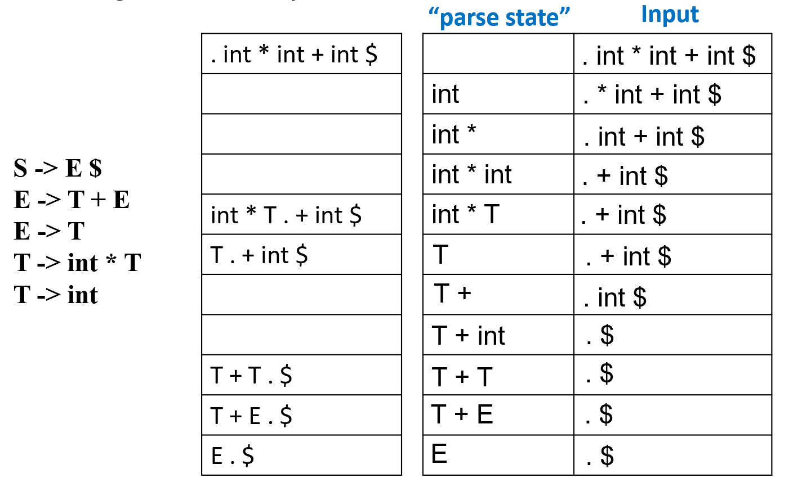

通过观察图中“Stack”和“Input”两列的变化，你可以看到解析器在交替执行以下两个动作：

1. **移进 (Shift)**: 将输入缓冲区最左边的符号移动到栈顶。

- **表现：** 点 $(\cdot)$ 向右越过一个终结符。
- **例子：** 从 `. int * int + int $` 变为 `int . * int + int $`。

2. **归约 (Reduce)**: 当栈顶的符号串匹配某个产生式的右部（RHS）时，将其替换为该产生式的左部（LHS）。

- **表现：** 栈顶的一部分内容被一个新的非终结符取代。
- **例子：** 栈里的 `int * T` 归约为 $T$（基于产生式 $T \to \text{int} * T$）。

解析器根据“当前状态”和“下一个输入字符”查表，决定是执行 **Shift** 还是 **Reduce**。

---

### 解析器如何做出决策

#### 1. 解析器维护的两个核心数据结构

LR 解析器是一个**有状态**的自动机，它时刻盯着两个地方：

1. **当前输入的位置 (Position in current input)：** 这是一个指针，指向待处理的下一个终结符。解析器需要知道接下来该“吃进”哪个符号。
2. **符号栈 (Stack)：** 这是解析器的“记忆”。

* 它存储了已经扫描过的终结符（Terminals）和通过归约得到的非终结符（Non-terminals）。
* 栈里的内容代表了**“到目前为止的解析进度” (parse so far)**。

---

#### 2. 解析器的四种动作 (Actions)

解析器根据当前的状态和看到的输入符号，只能做以下四件事之一：

1. **Shift (移进)：**

* 动作：从输入区取出一个符号，压入栈顶。
* 意义：这意味着解析器认为当前的符号是某个产生式的一部分，还没攒够，得继续往后看。

2. **Reduce R (归约)：**

* 动作：如果栈顶的符号串正好匹配某个文法规则 $R$ (例如 $X \to A B C$) 的右部，就把 $C, B, A$ 从栈里弹出，然后把左部的 $X$ 压进去。
* 意义：这意味着解析器识别出了一个完整的语法结构。

3. **Error (报错)：**

* 如果当前栈里的内容加上接下来的输入符号，不符合任何文法规则，解析器就会报错。

4. **Accept (接受)：**

* 当输入读到了结束符 `$`，且栈里通过不断的归约最终只剩下了起始符号（如 $S$），解析成功。

---

#### 3. 核心问题：解析器如何决定 Shift 还是 Reduce？

解析器并不是瞎猜的，它依靠两样东西：

* **DFA (有限状态自动机)：** 编译器会预先根据你的文法生成一个状态机。栈里其实不仅存符号，还存了**状态编号**。
* **解析表 (Parsing Table)：** 这张表通过 `(当前状态, 下一个输入符号)` 查表得到指令。

---

### **LR(0) 解析器的自动化构建**

#### 将文法规则转化为 NFA

首先需要 $S' \to \cdot S \$$ 这个特殊的起始规则：当点移动到最后变成 $S' \to S \cdot \$$ 时，意味着整个输入字符串已经被完美匹配，解析器可以大声宣布 `Accept` 了。

**实例演示**：

假设你有文法：

1. $S \to ( S )$
2. $S \to a$

**自动生成逻辑如下：**

1.  **初始：** 从增广文法 $S' \to \cdot S$ 开始。
2.  **$\epsilon$ 边：** 因为点在 $S$ 前，连出两条 $\epsilon$ 线到 $S \to \cdot ( S )$ 和 $S \to \cdot a$。
3.  **符号边：** 

- 从 $S \to \cdot ( S )$ 接收到 `(`，连线到 $S \to ( \cdot S )$。
- 从 $S \to \cdot a$ 接收到 `a`，连线到 $S \to a \cdot$。

4.  **递归循环：** 在 $S \to ( \cdot S )$ 状态，因为点又在 $S$ 前了，再次连出 $\epsilon$ 线回到 $S$ 的那些初始状态。

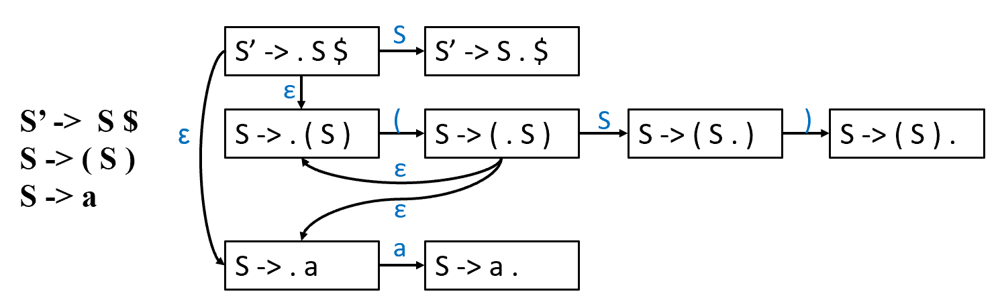

---

#### 子集构造法 Subset Construction

在实际的编译器工具（如 Bison）中，它不会真的在内存里画这个乱糟糟的 NFA。它会直接利用子集构造法。

**核心概念**：DFA 的状态是一组项目的集合

在之前的 NFA 中，每一个项目（Item，即带点的产生式）都是一个独立的状态。但在实际解析时，我们可能同时处于多个进度中。

* **为什么要打包？** 比如当你看到一个左括号 `(` 时，你既可能是在解析 $S \to (S)$ 的开头，也可能是因为 $S$ 可以推导出其他东西。DFA 把这些“并行的可能性”合并到一个大方框里。
* **结论：** 每一个大方框就是一个 **DFA 状态**。

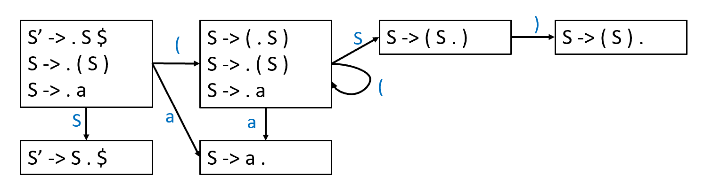

---

#### Closure（闭包）运算

> **闭包规则：** 如果一个状态里包含 $A \to \alpha \cdot S \beta$，且 $S$ 是一个非终结符，那么解析器会自动“联想”：既然我在等一个 $S$，那么我也在等所有能推导出 $S$ 的开头。因此，要把所有 $S \to \cdot \gamma$ 形式的项目都加入这个状态。

**看图中的第一个状态（最左边的方框）：**

1. 初始项目是 $S' \to \cdot S \$$。
2. 因为点在 $S$ 前面，触发 **Closure**：把 $S$ 的所有产生式开头（$S \to \cdot (S)$ 和 $S \to \cdot a$）都加进来。
3. 这三个项目合在一起，构成了 **State 0**。

**状态转移（点向右移）：**

* **输入 `(`：** 状态 0 中只有 $S \to \cdot (S)$ 能处理它。处理后，点向右移，变成 $S \to ( \cdot S)$。
* **再次触发 Closure：** 在新状态里，点又到了非终结符 $S$ 前面，于是又把 $S \to \cdot (S)$ 和 $S \to \cdot a$ 拉了进来。这就是为什么第二个方框里有三个项目。
* **输入 `a`：** 直接跳到 $S \to a \cdot$。点已经在最后了，这意味着解析器在这个状态下可以进行**归约（Reduce）**。
* **输入 `S`：** 只有 $S' \to \cdot S \$$ 能处理，点向右移变成 $S' \to S \cdot \$$，这时解析器就可以**接受（Accept）**了。

---

#### **计算机程序的逻辑实现**

定义三个关键部分：`Closure`（闭包）、`Goto`（跳转）以及**主循环**。

##### 1. 符号定义 (The Symbols)

首先看右上角的定义，这是算法的“变量名”：

* **$I$：** 一个项目的集合（Set of items），比如 $\{S \to \cdot (S), S \to \cdot a\}$。
* **$X$：** 一个符号，可以是**终结符**（如 `a`, `(`）或**非终结符**（如 $S$）。
* **$T$：** 状态的集合（Set of states），即 DFA 中所有大方框的集合。
* **$E$：** 边的集合（Set of edges），即连接方框的箭头。

##### 2. Closure($I$)：联想逻辑

这是用来补全一个状态的函数。

* **逻辑：** 如果项目集合 $I$ 中有一个项目点在非终结符 $X$ 前面（$A \to \alpha \cdot X \beta$），说明我们正在等待一个 $X$。既然在等 $X$，那么 $X$ 能推导出的所有产生式的开头（$X \to \cdot \gamma$）都得加进来。
* **算法特征：** 这是一个 `repeat-until` 循环。它会不断向集合里加东西，直到再也加不出新东西为止（达到饱和）。

##### 3. Goto($I, X$)：移动逻辑

这是用来计算“吃掉”一个符号后会跳到哪个状态的函数。

**逻辑：**

1.  从当前集合 $I$ 中，找出所有点在 $X$ 前面的项目。
2.  把这些项目的点向右移动一位（变成 $A \to \alpha X \cdot \beta$），放入新集合 $J$。
3.  对这个新集合 $J$ 调用一次 `Closure`，把后续的预判也补全。

##### 4. 构建 DFA 的主算法 (The Main Loop)

1. **初始化：**

* 创建第一个状态（状态 0），它是增广文法初始项目的闭包：`Closure({S' -> .S$})`。
* 把这个初始状态放进状态集 $T$。

2. **扩张：**

* 对于 $T$ 中的每一个已经存在状态 $I$，尝试给它所有可能的输入符号 $X$。
* 计算 `Goto(I, X)`。如果得到的是一个**新状态**（之前没出现过），就把它加进 $T$。
* 记录下一条从 $I$ 到 $J$ 标记为 $X$ 的边。

3. **停止：** 当再也找不到新状态、也连不出新边时，算法结束。

---

#### 一个案例

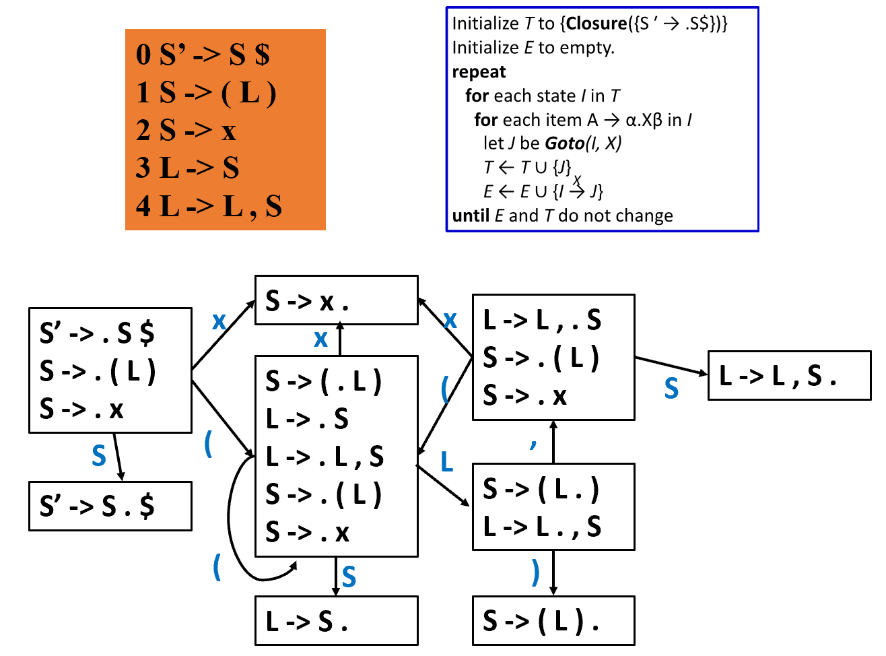

LR 解析器的两个核心动作：

1. **Shift（移进）：** 像吃豆子一样，把输入里的符号吃进**符号栈**，同时把对应的新**状态**压入状态栈。
2. **Reduce（归约）：** 像拼图一样，发现符号栈顶的几个零件能拼成一个大零件（非终结符），就把零件拿走，换成大的，同时状态栈也要回退并重新根据“大零件”跳转。

??? note "关于Shift、Reduce、Goto和Accept的符号"
    1. 当 DFA 状态 $i$ 有一条标为终结符 $t$ 的线指向状态 $n$ 时，就在表的第 $i$ 行、$t$ 列填入 $sn$。

    2. 当 DFA 状态 $i$ 有一条标为非终结符 $X$ 的线指向状态 $n$ 时，就在表的第 $i$ 行、$X$ 列填入 $gn$（图中简写为 $g4, g7$ 等）。

    3. 如果状态 $i$ 包含一个点在最后的项目（例如 $X \to A B C \cdot$），说明已经攒够了零件。找到这条产生式的编号 $k$，在表的第 $i$ 行的所有终结符列填入 $rk$。

    - 这是 $LR(0)$ 的特征——它不看下一个符号是什么，只要点在最后，就全行归约。

    4. 如果状态 $i$ 包含增广文法的结束状态 $S' \to S \cdot \$$。在表的第 $i$ 行、$ 列填入 $a$ (accept)。

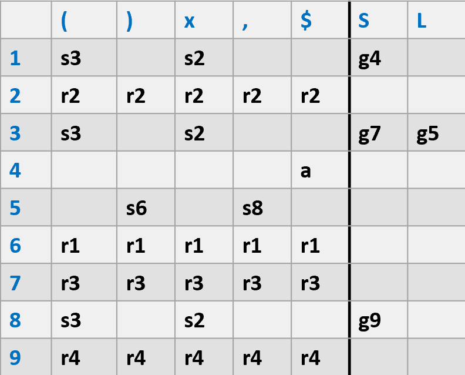

场景设定：解析字符串 `( x ) $`

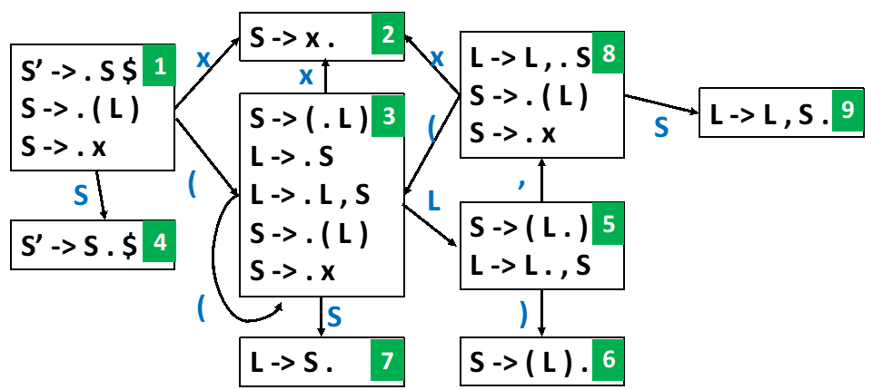

##### **第一步：初始状态**

* **状态栈：** `1`（解析器从状态 1 开始）
* **符号栈：** 空
* **剩余输入：** `( x ) $`
* **动作：** 查表 $T[1, (]$ 得到 **s3**。
* **为什么：** 解析器看到左括号，意识到这可能是 $S \to (L)$ 的开始，于是把 `(` 存起来，跳到状态 3（状态 3 就是专门处理“已经看到左括号”的情况）。

---

##### **第二步：处理 `x`**

* **状态栈：** `1, 3`
* **符号栈：** `(`
* **剩余输入：** `x ) $`
* **动作：** 查表 $T[3, x]$ 得到 **s2**。
* **为什么：** 在左括号后面看到了 `x`。根据规则 2，$S \to x$。解析器先把 `x` 拿进来，跳到状态 2。状态 2 的含义是：“我刚刚看到了一个完整的 `x`”。

---

##### **第三步：第一次归约 (Reduce)**

* **状态栈：** `1, 3, 2`
* **符号栈：** `( x`
* **剩余输入：** `) $`
* **动作：** 查表 $T[2, )]$。因为状态 2 包含 $S \to x \cdot$（点在最后），所以执行 **r2** ($S \to x$)。
* **关键逻辑：**

1.  **弹出：** 产生式 $S \to x$ 右边有 1 个符号，所以从两个栈各弹出 1 个元素。符号栈弹出 `x`，状态栈弹出 `2`。
2.  **压入：** 符号栈压入左部的 $S$。
3.  **跳转：** 此时状态栈顶是 `3`。查 **Goto 表** $T[3, S]$ 得到 **g7**，压入状态 `7`。

* **结果：** 栈变为 `1, 3, 7`，符号栈变为 `( S`。

---

##### **第四步：第二次归约 (List 的开始)**

* **状态栈：** `1, 3, 7`
* **符号栈：** `( S`
* **剩余输入：** `) $`
* **动作：** 状态 7 包含 $L \to S \cdot$，执行 **r3** ($L \to S$)。
* **关键逻辑：**

1.  弹出 1 个符号 $S$ 和状态 7。
2.  状态栈顶回到 3，符号栈压入 $L$。
3.  查 Goto 表 $T[3, L]$ 得到 **g5**，压入状态 `5`。

* **为什么：** 文法规定 $L \to S$，解析器意识到这个孤立的 $S$ 其实是一个列表 $L$ 的第一个元素。

---

##### **第五步：闭合括号**

* **状态栈：** `1, 3, 5`
* **符号栈：** `( L`
* **剩余输入：** `) $`
* **动作：** 查表 $T[5, )]$ 得到 **s6**。
* **为什么：** 列表 $L$ 后面跟了 `)`，这完美匹配了规则 $S \to (L)$。解析器把 `)` 吞进去，进入状态 6。

---

##### **第六步：最终大归约**

* **状态栈：** `1, 3, 5, 6`
* **符号栈：** `( L )`
* **剩余输入：** `$`
* **动作：** 状态 6 包含 $S \to (L) \cdot$，执行 **r1** ($S \to (L)$)。
* **关键逻辑：**

1.  **弹出：** 产生式右边有 3 个符号 `(`, `L`, `)`，所以弹出 3 组。
2.  状态栈从 `1, 3, 5, 6` 变回 `1`。
3.  符号栈压入最终的 $S$。
4.  查 Goto 表 $T[1, S]$ 得到 **g4**。

* **结果：** 状态栈 `1, 4`，符号栈 `S`。

---

##### **第七步：接受 (Accept)**

* **状态栈：** `1, 4`
* **符号栈：** `S`
* **剩余输入：** `$`
* **动作：** 查表 $T[4, \$]$ 得到 **accept**。
* **为什么：** 状态 4 代表 $S' \to S \cdot$，且输入已空。任务圆满完成！

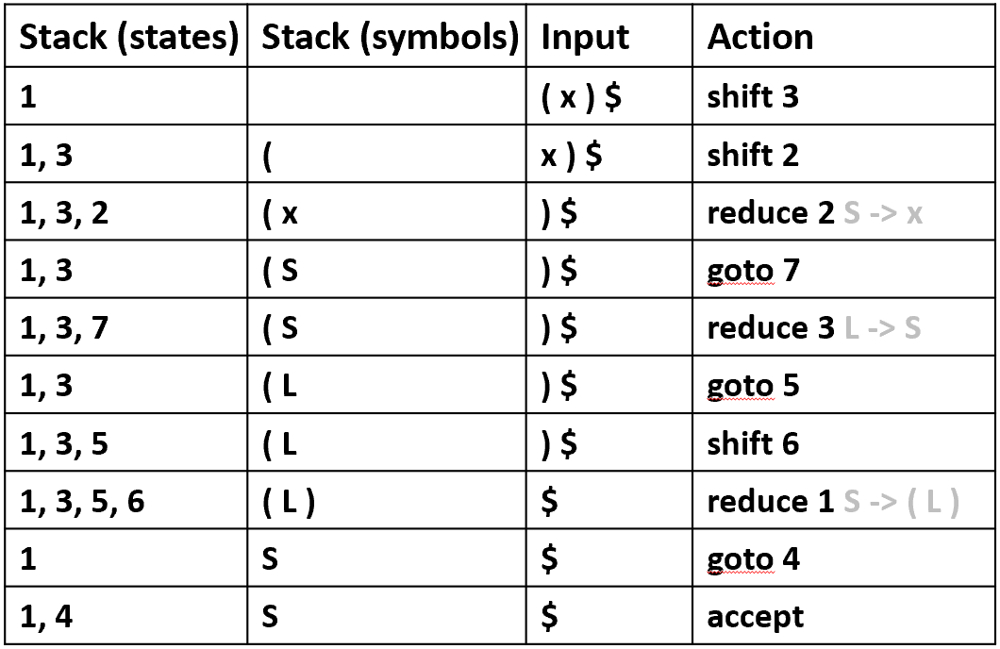

---

??? note "一点疑惑"
    1. 关于 Reduce 的触发

    - 不是因为没路走才归约，而是只要“攒够了”就归约。

    - 如果一个状态（DFA 的方框）中包含一个点在最后的项目（比如 $S \to x \cdot$），在 LR(0) 的规则下，解析器只要进入这个状态，就会立即执行归约，它甚至都不看下一个输入字符是什么。

    - 如果一个状态里既能“往前走”（Shift）（也就是有输入然后可以转移），又有“攒够了”的项目（Reduce）（也就是点在最后），或者有两个“攒够了”的项目，解析器就会“死机”。 

    2. 解析表的生成

    完全是自动生成的。

    生成流程如下：
    
    - 输入： 文法规则（比如在 Bison 里的 .y 文件）。

    - 生成 DFA： 计算机运行算法，算出所有的状态方框（States）和它们之间的连线（Edges）。

    - 填表（机械映射）：
    
    如果状态 $i$ 连出一条线到状态 $j$，标记是终结符，表里就填 sj（Shift $j$）。
    
    如果状态 $i$ 里有一个已经完成的项目（点在最后），那么表里这一行就填 rk（用第 $k$ 条规则归约）。
    
    如果连出的线标记是非终结符，填入 Goto 区。

    3. 回退状态的确定

    弹出数量如何确定？看你使用的那条产生式的右部长度。

    例如产生式是：$S \to ( L )$ ，右边有 3 个符号（左括号、$L$、右括号）。
    
    那么在执行归约时：
    
    - 符号栈： 弹出最顶端的 3 个符号。
    
    - 状态栈： 对应地弹出最顶端的 3 个状态。

    因为状态栈记录的是“你走过的路径”。如果你回退了 3 个符号，意味着你也要把这 3 步“路”给撤销，**回到你还没有看到这三个符号之前所在的那个状态**。

    回到之前的状态后，解析器会把刚才归约出来的“大零件”（比如 $S$）看作是一个刚读入的符号，根据 Goto 表重新跳到一个新状态。

---

### 拓展到 $LR(k)$

#### 1. 解析器的核心动作循环

解析器不断重复以下逻辑：**查看（栈顶状态, 当前输入符号） $\rightarrow$ 查表 $\rightarrow$ 执行动作。**

##### **A. Shift(n)：移进**

* **操作：** 消费掉当前的一个输入符号（Token），然后把状态 $n$ 压入栈。
* **直观理解：** “读入一个单词，并根据地图走到下一个路口 $n$。”

##### **B. Reduce(r)：归约**

1. **出栈：** 根据规则 $r$ 的右部（RHS）有多少个符号，就从栈中弹出多少次状态。
2. **找左部：** 确定该规则的左部非终结符 $X$（比如 $S$ 或 $L$）。
3. **查 Goto 表：** 看一眼**此时**弹完后的栈顶状态，查表得知遇到非终结符 $X$ 该跳往哪个状态 $n$。
4. **入栈：** 把状态 $n$ 压入栈顶。

##### **C. Accept & Error：终局**

* **Accept：** 查到 `a`，解析圆满完成。
* **Error：** 查到的格子是空的，说明代码写错了（语法错误），立即停止并报故障。

---

#### 2. 三个重要的“冷知识”点

* **Only the state stack is used（仅使用状态栈）：**虽然我们在推演时习惯画一个“符号栈”，但在计算机程序内部，**只维护状态栈就足够了**。因为状态本身就隐含了“我已经看到了哪些符号”的信息。
* **This is a general algorithm（通用算法）：**不管是基础的 $LR(0)$ 还是复杂的 $LR(k)$，它们的运行逻辑完全一样。区别仅仅在于**查的那张表是怎么生成的**。
* **For LR(0), we do not need lookahead（LR(0) 不需要向后看）：**$LR(0)$ 只要看到点在最后，就会直接归约，它根本不关心下一个字符是什么。

---

### **移进-归约冲突 (Shift-Reduce Conflict)**

简单来说，就是解析器在某个时刻**左右为难**了：

* **Shift (移进)：** 它觉得现在的符号只是大拼图的一部分，得继续往后读。
* **Reduce (归约)：** 它觉得现在的符号已经拼好了一个完整的零件，得赶紧合体。

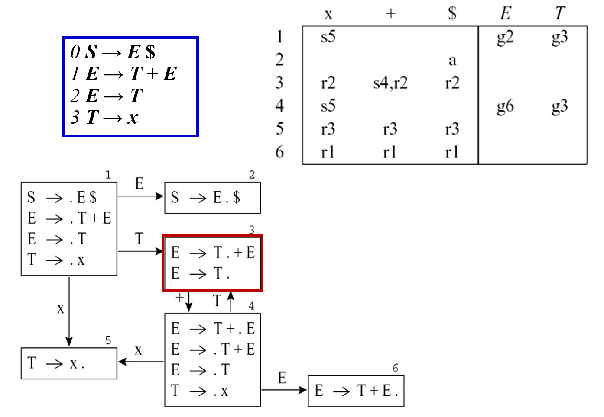

在状态3里，解析器有两个选项：

1.  $E \to T \cdot + E$ ：点在中间，意味着如果看到 `+`，我就该 **Shift** 到状态 4。
2.  $E \to T \cdot$ ：点在最后，意味着我已经攒够了一个 $T$，可以 **Reduce** 成 $E$。

**在 $LR(0)$ 解析表中：**

因为 $LR(0)$ 不看下一个输入符号，它会在状态 3 的整行都填上 $r2$。但同时，它看到 `+` 又想填 $s4$。

结果：在 `(状态 3, +)` 这个格子里，出现了 **`s4, r2`**。解析器不知道该听谁的，这就是 **Conflict**。所以**这个文法不是 $LR(0)$ 文法。**

---

### SLR (Simple LR)

上面问题的解决方案：**向后看一个符号 (Lookahead)**

**核心逻辑：**

* **LR(0) 的问题：** 只要一个状态里有“点在最后”的项目（$A \to \alpha \cdot$），它就在整行填入“归约”。
* **SLR 的改进：** 只有当下一个输入符号 $X$ 确实可能出现在非终结符 $A$ 的后面时（即 $X \in FOLLOW(A)$），才执行归约。

---

#### **算法拆解：**

```
R ← {} 
for each state I in T 
     for each item A → α. in I 
           for each token X in FOLLOW(A) 
              R ← R ∪ {(I, X, A → α)} 
```

1. 遍历 DFA 中的每个状态 $I$。
2. 检查状态 $I$ 中的每个项目。如果项目是 $A \to \alpha \cdot$（意味着零件已凑齐）。
3. **看一眼 `FOLLOW(A)`：** 只有当当前的输入符号 $X$ 属于这个集合时，才在表里的 $[I, X]$ 位置填入 Reduce A -> $\alpha$。

**意义：** 这大大减少了解析表中的冲突，因为它排除了那些在语法上根本不可能出现的归约情况。

**举例详细说明**：

1. **计算 $Follow(E)$：** 在这个文法中，非终结符 $E$ 后面能跟什么？

* 根据 $S \to E \$$， $E$ 后面可以跟结束符 `$`。
* 检查所有产生式，$E$ 后面没有其他符号了。
* 所以，$Follow(E) = \{\$\}$。

2. **精准归约：** 只有当下一个符号是 `$` 时，执行 $r2$ 才有意义。如果下一个符号是 `+`，那说明这个 $T$ 肯定还没完，不能归约！
3. **结果：** 在表中的 `(状态 3, +)` 格子里，原本的 $r2$ 被剔除了，只剩下 **$s4$**。冲突消失了！

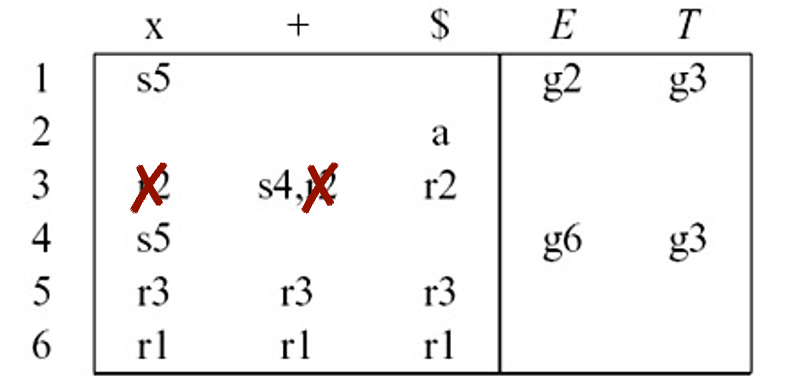

---

### 进一步的冲突：SLR 的局限性

#### **案例分析：赋值语句文法**

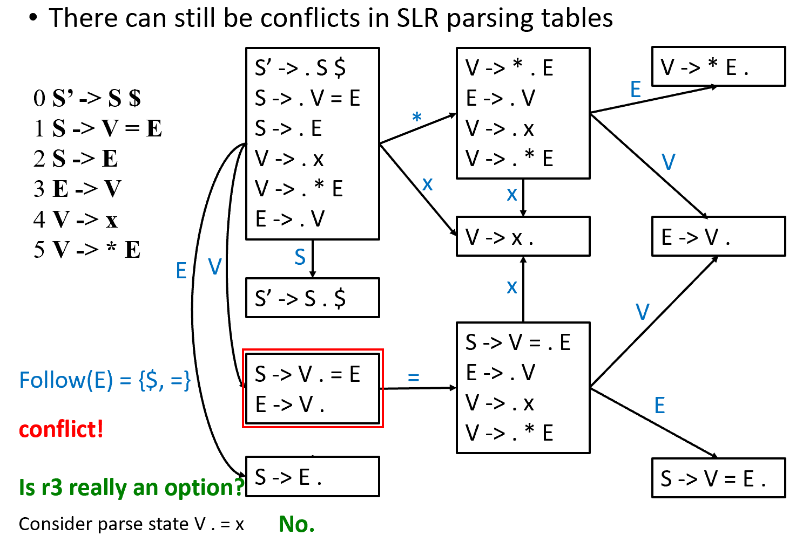

这个文法模拟了 C 语言中的指针赋值（如 `*p = x`）：

* $S \to V = E$
* $E \to V$
* $V \to x \mid * E$

**冲突点：**

在某个状态中，解析器同时拥有这两个项目：

1.  $S \to V \cdot = E$ （我想 **Shift**，因为后面可能有个 `=`）
2.  $E \to V \cdot$ （我想 **Reduce**，根据规则 2 把 $V$ 变成 $E$）

**为什么 SLR 失效了？**

* 解析器抬头看了一眼输入符号，发现是 `=`。
* 它去查 `FOLLOW(E)`，惊讶地发现 `=` 确实在里面（因为在 $S \to V = E$ 中，$V$ 可以推导出 $E$，所以 `=` 确实可以跟在 $E$ 后面）。
* **结果：** 表格里的这个格子依然同时出现了 **Shift（移进 `=`）** 和 **Reduce（归约 $E \to V$）**。

**SLR 错在哪了？**

SLR 失败的原因在于它太“大局观”了，以至于分不清具体的场合。它只看一个非终结符“全局”后面可能跟什么，而无视了在“当前这一行代码”里它后面能不能跟这个符号。

如果解析器选择了 Reduce（把 $V$ 变成 $E$），那么栈里的内容就变成了 $E$。

那么接下来的句子结构就变成了：$S \to E = \dots$

但是！ 翻遍整个文法规则，没有哪一条允许 $E$ 后面直接跟 = 。

---

### LR(1)

LR(1) 的核心思想是：**不再只看全局的 $Follow$ 集，而是为每一个项目（Item）随身携带一个“展望符”（Lookahead）**。

---

#### LR(1) 项目的构成

一个 LR(1) 项目形如：$[A \to \alpha \cdot \beta, a]$

* $A \to \alpha \cdot \beta$ 是传统的项目。
* $a$ 是展望符（Lookahead），它代表了：**当这个产生式完全被归约后，后面紧跟着的那个符号必须是什么**。
* **物理意义**：当前进进度到达 $\alpha$ 时，我们期望接下来能看到可以推导出 $\beta a$ 的字符串。

---

#### 核心算法：闭包 (Closure) 的进化

这是最容易出错的地方。在 LR(1) 中，当我们从 $[A \to \alpha \cdot X \beta, z]$ 展开非终结符 $X$ 时，新项目的展望符是什么？

* **规则**：对于 $X \to \gamma$，新项目为 $[X \to \cdot \gamma, w]$，其中 $w \in First(\beta z)$。
* **直观理解**：因为我们要解析的是 $X$ 后面的部分。如果 $X$ 解析完了，接下来的符号要么是 $\beta$ 的开头，如果 $\beta$ 为空，则是原来的展望符 $z$。

---

#### 解决冲突

还记得之前 SLR 无法处理的赋值语句冲突吗？

* 在 LR(1) 的 DFA 中，状态 3 包含了 $[E \to V \cdot, \$]$。
* 这意味着：**只有当下一个符号是 $\$$ 时，才允许将 $V$ 归约为 $E$**。
* 如果下一个符号是 `=`，因为 `=` 不在展望符里，解析器会理直气壮地拒绝归约，从而选择了 **Shift**。冲突被完美解决！

---

### LALR(1) 

虽然 LR(1) 非常强大，但它有一个致命弱点：**状态爆炸**。LR(1) 的解析表可能会非常巨大。

---

#### LALR 的核心：合并同类项

LALR (Look-Ahead LR) 的做法非常简单粗暴：

* 观察 LR(1) 的所有状态，如果两个状态的“核心”（即除了展望符以外的部分）完全相同，就把它们**强行合并**。
* 合并后，新状态的展望符集是原来两个状态展望符集的**并集**。

---

#### 实例对比：LR(1) vs LALR(1) 

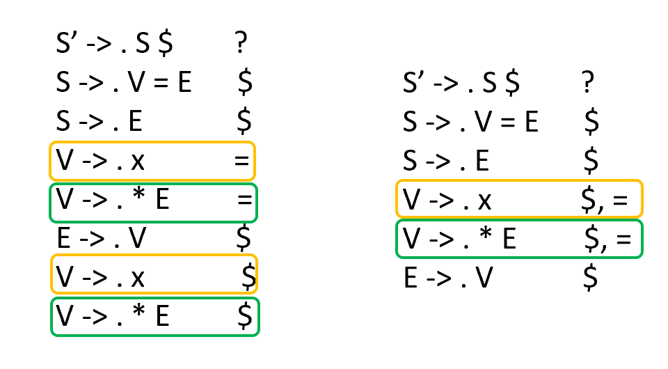

观察两张表的差异：

* **LR(1) 表**：状态 6 和 状态 13 是分开的。
* **LALR(1) 表**：状态 6 和 状态 13 被合并成了新的状态 6。
* **结果**：LALR(1) 的状态数回到了与 LR(0)/SLR 相同的量级，但其能力远超 SLR。

---

#### 潜在代价：归约-归约冲突

合并状态是一把双刃剑：

* **Shift-Reduce 冲突**：如果 LR(1) 没有移进-归约冲突，合并后也**绝不会**产生移进-归约冲突。
* **Reduce-Reduce 冲突**：不幸的是，合并可能引入原本不存在的**归约-归约冲突**。但在处理实际的编程语言文法时，这种情况极少发生。

---

### Hierarchy of Grammar Classes

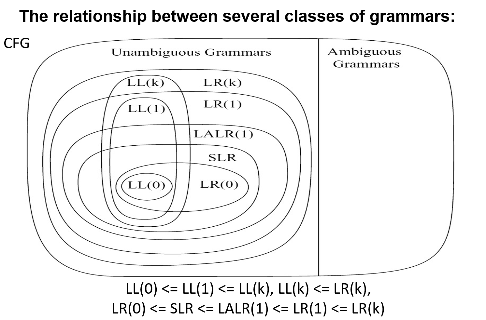

* **无歧义文法 (Unambiguous Grammars)**：我们讨论的所有 $LL$ 和 $LR$ 算法（如 $LL(1)$, $SLR$, $LR(1)$ 等）都只能处理这部分。它们要求对于任何合法的输入，必须有且仅有一棵语法树。
* **歧义文法 (Ambiguous Grammars)**：没有任何确定性的解析算法能直接处理它们。比如著名的“悬空 else”问题，如果不引入额外的优先级规则，它就是歧义的。

图中最核心的结论是：**$LL(k) \subset LR(k)$**。

* 这代表：**任何能用 $LL$ 方式（自顶向下）解析的文法，一定能用对应的 $LR$ 方式（自底向上）解析。**
* 反之则不然。这就是为什么 $LR$ 解析器在现代编译器中更受欢迎的原因。

$$LR(0) \subset SLR \subset LALR(1) \subset LR(1) \subset LR(k)$$

* **$LR(0)$**：最基础，完全不看后面符号。
* **$SLR$**：利用 $Follow$ 集进行简单的归约过滤。
* **$LALR(1)$**：这是**工业界平衡点**。它比 $SLR$ 强得多，但状态数比 $LR(1)$ 少。**Bison 和 Yacc 默认使用的就是这个级别。**
* **$LR(1)$**：理论上的“满级”能力（对于 1 个向前看符号而言），它能处理几乎所有无歧义的文法，但状态数可能多到爆炸。

$$LL(0) \subset LL(1) \subset LL(k)$$

* **$LL(1)$**：这是手动编写解析器（如递归下降解析）时的黄金标准。虽然它能力不如 $LR(1)$，但代码逻辑非常直观，易于调试。

---

### **歧义文法的处理** (LR Parsing of Ambiguous Grammars)

#### 核心矛盾：悬空 else (Dangling Else)

文法中定义了两种 `if` 语句：

1. $S \to \text{if } E \text{ then } S \text{ else } S$ （全量版）
2. $S \to \text{if } E \text{ then } S$ （精简版）

当我们遇到 `if a then if b then s1 else s2` 时，计算机产生了**认知分裂**：

* **解释 (1)：** `else s2` 属于最近的 `if b`。这是大多数编程语言（如 C, Java）的做法。
* **解释 (2)：** `else s2` 属于最外层的 `if a`。

**解析器视角的“左右为难”**

在 $LR$ 解析器的栈里，当它读完 `if a then if b then s1` 后，点 $(\cdot)$ 停在了这里：

* **想归约 (Reduce)：** 按照规则 (2)，把 `if b then s1` 变成一个完整的 $S$。这样 `else` 就会被迫属于外层的 `if a`。
* **想移进 (Shift)：** 暂时不归约，把 `else` 吃进来，继续走规则 (1)。这样 `else` 就被锁死在了内层的 `if b` 里。

这就是 **Shift-Reduce Conflict（移进-归约冲突）**。

---

#### 解决方案 A：重写文法（理论派）

通过引入辅助非终结符来从根本上消除歧义。这种方法将语句分为两类：

* **$M$ (Matched)：** 所有的 `then` 都有对应的 `else`。
* **$U$ (Unmatched)：** 存在没有被匹配的 `then`。

**核心逻辑：**

规则规定，在一个带有 `else` 的 `if` 语句中，`then` 和 `else` 中间的那部分必须是“全匹配”的（$M$）。这样就强制要求 `else` 必须精准寻找它前面的 `then`，而不会跳过任何一个未匹配的 `if`。

虽然这种方法在理论上很完美，但它会让文法变得异常复杂且难以阅读。

---

#### 解决方案 B：解析器策略（实践派）

**直接在解析表中规定“移进优先”**。

* **原则：** 当遇到移进-归约冲突时，默认选择 **Shift（移进）**。
* **结果：** 由于选择了移进，解析器会倾向于让 `else` 与最近的 `then` 结合，这正好符合大多数编程语言的语义。
* **优点：** 不需要修改文法，保持代码简洁。

**警告**：

> **Caution:** 虽然“移进优先”能解决悬空 else，但并不是所有的冲突都能靠这种“默认动作”蒙混过关。
* **Reduce-Reduce 冲突**通常意味着你的文法设计得一塌糊涂，必须重写。
* **Shift-Reduce 冲突**有时可以通过设定 **优先级（Precedence）** 和 **结合性（Associativity）** 来优雅解决。

---

## Parser Implementation

**从头写一个解析器（Write a parser from scratch）**：手写解析器通常采用递归下降（recursive-descent）或手工实现的移入-归约解析逻辑。优点是可按需定制、便于学习与调试；缺点是当文法复杂或含有左递归/二义性时，手写实现会变得繁琐甚至不可行。

**能否自动生成解析器？（Can we automatically generate parsers?）**：答案是肯定的。常见的自动生成器基于两大类表驱动算法：自顶向下的 LL(k)（需要 FIRST/FOLLOW 等集合）和自底向上的 LR(k)（通过项目集族构造 ACTION/GOTO 表）。不同文法会产生不同的解析表，生成器负责将文法转为可执行的表与状态机。

- LL(k) 与 LR(k) 都可以用自动化的表驱动方法生成解析器，但各自的适用语法类和工程折中不同；
- 文法的写法会影响生成的解析表（例如左递归会阻止直接生成 LL(1) 的递归下降解析器）；
- 我们已经学习了如何自动构造这些解析表（如 FIRST/FOLLOW、项目集构造与闭包/转移函数）。

**使用 Parser Generator（使用解析器生成器）**：常见工具（如 Bison/Yacc、ANTLR 等）能从文法描述自动生成解析器代码。优点是通用、健壮、能自动处理大部分语法细节并提供错误处理钩子；缺点是相对于精心手写的解析器在性能或错误信息可定制性上有时不及手工实现，但对大多数编译器作者而言这是更高效的方案。

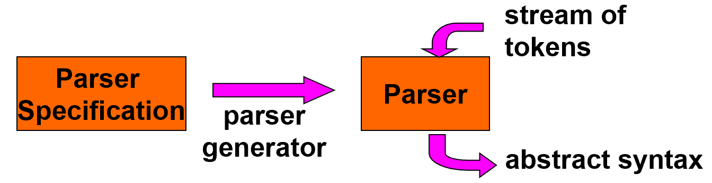

- `Parser Specification`（文法/语法规范）作为输入；
- `parser generator`（生成器）读取规范并生成 `Parser`（解析器实现，通常是表驱动或代码化的解析器）；
- 运行时解析器从`stream of tokens`（来自词法分析器的 token 流）中读取，输出 `abstract syntax`（抽象语法树或中间表示）。

---

## Yacc

Yacc 全称为 "Yet Another Compiler-Compiler"，是早期广泛使用的解析器生成器之一（BSD/Unix 生态里常见）。现代中常用 GNU Bison 作为兼容且功能更强的替代品，但 Yacc 的概念与工作流仍然具有代表性。

**输入（Input）**：

- Yacc 的输入是一个规范文件，通常以 `.y` 为后缀。该文件包含文法产生式、终结符声明、优先级/结合性声明、以及在匹配产生式时要执行的 C 语言语句（语义动作）。

**输出（Output）**：

- 运行 Yacc（或 Bison）会生成用于解析的 C 源代码文件（传统上名为 `y.tab.c` 或 `parser.tab.c`），并通常会生成一个头文件（如 `y.tab.h`）保存 token 定义。生成器同时会构造 LALR 的解析表（ACTION/GOTO），并把表与驱动代码输出为 C 代码。

**.y 文件的基本格式（A Yacc specification file has the basic format）**：

一个典型的 Yacc `.y` 文件由三部分用 `%%` 分隔：

1. `{definitions}` — 定义区

在此区可以放置 C 语言的 include、类型定义，以及 Yacc 的声明指令，例如：

- `%token` 声明终结符（token）名称；
- `%left` / `%right` / `%nonassoc` 用于声明运算符优先级与结合性，解决 shift/reduce 冲突；
- `%union` 定义语义值（`yylval`）的联合类型（当不同产生式携带不同类型的语义值时使用）；
- `%type` 标注非终结符对应的语义值类型。

还常包含 `#include`、全局变量声明和辅助函数的原型（这些 C 代码会被复制到生成的 C 文件的顶部或合适位置）。

2. `%%` （规则区开始）

3. `{rules}` — 产生式与语义动作

这里是最核心的部分，每条产生式的右侧可以跟随花括号包裹的 C 代码（语义动作），在该产生式被规约（reduce）时执行。语义动作中可访问 `$1, $2, ...`（对应右侧各符号的语义值）以及 `$$`（对应左侧非终结符的语义值）。

示例：

```yacc
expr: expr '+' expr { $$ = make_node(PLUS, $1, $3); }
        | NUM           { $$ = make_num($1); }
;
```

4. `%%` （规则区结束）

5. `{auxiliary routines}` — 辅助例程（C 代码区）

- 在最后一部分放置辅助函数（如 `yyerror()`），以及通常需要由用户提供的词法分析器函数 `yylex()` 的实现或引用（例如由 `lex`/`flex` 生成的 `yylex()`）。
- 也可以放置 `main()`，用于将词法分析器和解析器连接起来并驱动解析流程。

**常见使用流程（简要）**：

1. 编写 `lexer.l`（供 `flex`/`lex` 使用）与 `parser.y`（供 Yacc/Bison 使用）。
2. 运行 `lex lexer.l` 生成 `lex.yy.c`（或 `flex lexer.l`）；运行 `yacc -d parser.y` 或 `bison -d parser.y` 生成 `y.tab.c` / `parser.tab.c` 和 `.h` 文件。
3. 编译并链接：例如 `cc y.tab.c lex.yy.c -o parser -ly -ll`（具体链接库名视平台与实现而定）。

**解析冲突与解决方式**：

在生成 LALR 表时可能会出现 `shift/reduce` 或 `reduce/reduce` 冲突。常用解决方法：

- 使用 `%left`/`%right` 指令声明运算符优先级与结合性（例如给 `+` 和 `*` 不同优先级）；
- 手工调整文法（重写产生式、左因子化或消除二义性）；
- 使用 `%expect` 或 `%expect-rr` 告知编译器某些预期冲突（较少用）。

**语义值（semantic values）与 %union**：

当不同产生式需要携带不同类型的语义信息时，用 `%union` 定义一个联合类型，并通过 `%type` 或在 `%token` 后声明类型，Yacc/Bison 会使用 `yylval` / `$$` 来传递这些值。

---

### Yacc: An Example

示例文法：

```
exp   -> exp addop term | term
addop -> + | -
term  -> term mulop factor | factor
mulop -> *
factor -> ( exp ) | number
```

逐条说明：

- `exp`：表示算术表达式，使用 `exp -> exp addop term | term` 表示加/减操作在表达式层处理；这是**左递归**写法，适用于自底向上的解析器（如 Yacc/Bison），并隐含了加法的左结合性（例如 `1-2-3` 解析为 `(1-2)-3`）。
- `addop`：加法运算符，终结符为 `+` 或 `-`。在 Yacc 中通常把 `+`/`-` 定义为 token（例如 `%token PLUS MINUS` 或直接用字符）。
- `term`：表示乘法/除法这一优先级更高的层次，采用 `term -> term mulop factor | factor` 同样是左递归，保证乘法的左结合性。
- `mulop`：乘法运算符（示例只列出 `*`），可扩展为 `* | /`。
- `factor`：最底层的因子，可以是带括号的子表达式 `( exp )` 或一个数字 `number`（通常由词法器返回一个 `NUMBER` token）。

优先级与结合性：

- 该分层式文法（`exp` 包含 `term`，`term` 包含 `factor`）自然地把乘法绑定在比加法更紧的层级上——因此表达式 `1 + 2 * 3` 会被解析为 `1 + (2 * 3)`，满足常见的算术优先级。
- 左递归的产生式实现了**左结合**（left-associative），这是处理 `1-2-3`、`1/2/3` 等运算时常用的策略。

---

### Yacc: Auxiliary Routines（辅助例程）

```
%%
int main() {
  return yyparse();
}

int yylex(void){
  int c;
  // eliminate blanks
  while ( (c=getchar()) == ' '); 
  if (isdigit(c)) {
    ungetc(c, stdin);
    scanf("%d", &yylval);
    return (NUMBER);
  }
  if (c == '\n')
    return 0; // stop the parse 
  return c;
}

int yyerror (char * s){ 
  fprintf (stderr, "%s\n",s ) ; 
  return 0;
}
```

* **`yyparse()`**: 这是 Yacc 生成的主解析函数。

* 返回 `0` 表示解析成功。
* 返回 `1` 表示解析失败（语法错误）。

* **`yylex()`**: 解析器本身不读字符，它不断调用 `yylex()` 来获取下一个 **Token**（记号）。
* **输入结束标志**: 当 `yylex()` 返回 `0` 或负数时，Yacc 认为输入已结束。
* **语义值传递**: `yylex` 返回的是 Token 的类型（如 `NUMBER`），而该 Token 的具体数值（如 `42`）必须存放在全局变量 **`yylval`** 中。
* **`yyerror()`**: 当解析器遇到语法错误时会调用这个函数。你可以在这里定义自己的错误处理逻辑，比如打印错误信息、记录日志，或者直接退出程序。

**代码示例解析**:

* `main()` 函数简单的调用 `yyparse()`。
* 自定义的 `yylex()`：跳过空格，识别数字。如果识别到数字，用 `scanf` 把值存入 `yylval`，并返回 `NUMBER` 标签；如果读到换行符 `\n`，返回 `0` 结束解析。

---

### Yacc: Definitions（定义部分）

```
%%
int main() {
  return yyparse();
}

int yylex(void){
  int c;
  // eliminate blanks
  while ( (c=getchar()) == ' '); 
  if (isdigit(c)) {
    ungetc(c, stdin);
    scanf("%d", &yylval);
    return (NUMBER);
  }
  if (c == '\n')
    return 0; // stop the parse 
  return c;
}

int yyerror (char * s){ 
  fprintf (stderr, "%s\n",s ) ; 
  return 0;
}
```

Yacc 文件通常以 `.y` 结尾，由 `%{%}` 包含的 C 代码、定义区和规则区组成。

**符号声明**:

* `%token NUMBER`: 告诉 Yacc，`NUMBER` 是一个由词法分析器返回的终结符。
* `%start symbol`: 指定文法的起始符。

**Token 的两种识别方式**:

* **单引号字符**: 如 `'+'` 或 `'*'`。你不需要额外声明，直接在规则里用就行。
* **符号 Token**: 如 `NUMBER`，必须先用 `%token` 声明。

---

### Yacc: Rules (Action Code)（规则与动作代码）

Yacc 不仅仅是检查语法，还能在匹配到规则时执行 C 代码。

* **动作执行时机**: 动作代码（花括号 `{}` 里的内容）会在解析器执行 **归约（Reduce）** 操作时立即执行。
* **放置位置**: 通常放在规则的末尾。例如 `exp: exp '+' term { $$ = $1 + $3; }`。
* **嵌入式动作**: 动作也可以写在规则中间，但那会引入隐藏的非终结符，稍复杂一些。

---

### Yacc: Rules (Pseudo variables)（伪变量）

* **`$$`**: 代表产生式左部（LHS）的语义值。
* **`$i`**: 代表产生式右部（RHS）第 $i$ 个元素的语义值。

例如 `exp '+' term`：`$1` 是 `exp` 的值，`$2` 是 `'+'` 的值（通常不用），`$3` 是 `term` 的值。

* **传递过程**: 解析器通过这些伪变量在堆栈上移动数据，实现从局部到整体的计算。

---

### Yacc: Rules (Example: 3 * 4)（实例演算）

 **移进-归约（Shift-Reduce）** 算法如何处理 `3 * 4`:

1. **Shift Num**: 将数字 3 压入符号栈，其值 `yylval` (3) 进入值栈。
2. **Reduce factor**: 根据 `factor: NUMBER` 归约。此时符号栈变 `factor`，值栈顶仍是 3。
3. **Reduce term**: 根据 `term: factor` 归约。
4. **Shift '*'**: 运算符进入符号栈，默认值 `0` 进入值栈。
5. **Shift Num**: 数字 4 进入。
6. **Reduce factor**: 4 归约为 `factor`。
7. **Reduce term '*' factor**: 这是核心步骤！执行动作 `$$ = $1 * $3`。

* `$1` 是第一个 `term` 的值 (3)。
* `$3` 是 `factor` 的值 (4)。
* 计算结果 `12` 存入 `$$`，并压回值栈顶。

8. **后续归约**: 最终归约为起始符 `command`。

---

### Yacc: Rules (YYSTYPE)（语义值类型）

* **`YYSTYPE`**: 这是值栈中每个元素的 C 数据类型。
* **默认类型**: 默认情况下，Yacc 假设所有值都是 `int`（即 `#define YYSTYPE int`）。
* **自定义**: 如果你需要处理浮点数或抽象语法树（AST）节点指针，你可以重新定义 `YYSTYPE` 为一个 `union`（联合体），以便让不同类型的符号持有不同类型的数据。

文法示例：

* $exp \to exp \text{ op } term \mid term$
* $op \to \text{ '+' } \mid \text{ '-' }$

**问题：**

* `exp` 的值通常是一个数值（比如 `double` 或 `int`），代表计算结果。
* `op` 的值通常是一个字符（比如 `char`），代表运算符本身。
* **YYSTYPE 默认只能有一种类型**（比如默认是 `int`），那么如何让一个堆栈既能存 `double` 又能存 `char` 呢？

---

#### 解决方案一：使用 `%union` 声明

这是 Yacc 提供的一种原生且最常用的方法。

**原理**：利用 C 语言中的 `union`（联合体）。联合体允许在同一块内存空间存储不同类型的数据。

**代码示例解析**：

```c
%union {
    double val;  // 用于存放数值（如 exp, term, factor）
    char op;    // 用于存放运算符（如 addop, mulop）
}
```

**效果**：一旦定义了 `%union`，Yacc 产生的 `YYSTYPE` 就会变成这个联合体类型。

**后续步骤**：定义完 union 后，你还需要在声明区告诉 Yacc 哪个符号用哪个成员。例如：

* `%token <val> NUMBER`
* `%type <val> exp term`
* `%type <op> addop`

---

#### 解决方案二：自定义数据类型并重定义 `YYSTYPE`

如果你不想用 Yacc 自动生成的 union，或者你的需求更复杂（比如要构建抽象语法树 AST），你可以完全自定义类型。

**原理**：在 Yacc 定义部分或头文件中定义一个结构体或类，然后通过 `#define` 将 `YYSTYPE` 指向它。

**代码示例解析**：`#define YYSTYPE ASTNode`：这意味着值栈中的每一个元素现在都是一个 `ASTNode` 对象（或指针）。

**手动构造（By hand）**：这意味着在动作代码中，你需要自己编写逻辑来创建和填充这些复杂的结构。

例如：`exp: exp '+' term { $$ = new_node('+', $1, $3); }`


---

### Yacc: `%union` & `%type` 

```
%token NUMBER
%union { double val;
         char op;}
%type <val> exp term NUMBER 
%type <op> op
%%
command : exp { printf("%f\n",$1);}
;
exp : exp op term { 
      switch ($2){
        case '+' : $$=$1+$3; break;
        case '-' : $$=$1-$3; break; 
      }
     }
    | term {$$ = $1;}
;
op : '+' {$$ = $1;}
   | '-' {$$ = $1;}
;
```

在 `%{%}` 之后的定义区，可以看到两个关键动作：

**`%union`**: 定义了所有可能的语义值类型集合。

* `double val;`：用于存储计算结果。
* `char op;`：用于存储运算符。

**`%type` (关键步骤)**: 这是 Yacc 的“类型分配器”。它告诉解析器，特定的符号应该使用 `union` 中的哪一个成员。

* `%type <val> exp term NUMBER`：指定 `exp`、`term` 和终结符 `NUMBER` 的语义值都使用 `double val` 类型。
* `%type <op> op`：指定非终结符 `op` 的语义值使用 `char op` 类型。

---

#### **运算符的捕获 (op)**

```c
op : '+' { $$ = $1; } 
   | '-' { $$ = $1; }
```

* 这里 `$1` 是字符 `'+'` 或 `'-'`。
* 由于我们声明了 `%type <op> op`，这里的 `$$` 实际上会自动对应到 `union` 里的 `op` 成员。

---

#### **逻辑分支的处理 (exp)**

```c
exp : exp op term {
    switch ($2) {
        case '+': $$ = $1 + $3; break;
        case '-': $$ = $1 - $3; break;
    }
}
```

* **`$1` 和 `$3`**: Yacc 知道它们是 `<val>` 类型（`double`）。
* **`$2`**: Yacc 知道它是 `<op>` 类型（`char`）。
* 解析器自动处理了类型提取，你可以在 `switch` 语句中直接把 `$2` 当作字符来比较。

---

**非终结符 (Non-terminals)**: 它们的值（如 `exp` 的结果）完全由用户编写的 **Action Code**（动作代码）决定。

**记号 (Tokens/Terminals)**: 它们的值是在 **Lexer（词法分析器）** 中通过给 `yylval` 赋值来确定的。

**工具职责**:

* 使用 `%union` 来**定义**所有可能的类型。
* 使用 `%type` 来**关联**每个文法符号的具体类型。

---

### **嵌入式动作（Embedded Actions）**

在 Yacc 的标准逻辑中，动作代码通常放在规则的**末尾**。这意味着动作只有在整条规则被完全匹配并执行“归约（Reduce）”时才会运行。

考虑变量声明的文法：

* $decl \to type \text{ var-list}$
* $type \to \text{int} \mid \text{float}$
* $var\text{-}list \to var\text{-}list, id \mid id$

**问题所在：**

当我们解析到 `var-list` 中的每一个 `id` 时，我们需要把这个变量存入符号表，并记录它的类型。但是，按照标准的自底向上解析顺序，`type` 的信息在解析 `id` 的时候已经“漂”在栈里了，如果动作只在 `decl` 规则结束时执行，我们就无法在遇到每个 `id` 的那一刻实时地知道它的类型。

在解析过程中，有必要在完全识别语法规则之前执行某些代码。

所谓“嵌入式动作”，就是把花括号 `{ ... }` 里的 C 代码直接插在产生式中间，而不是末尾。

那么，如何记录每个 id 的 type？即如何利用 **嵌入式动作（Embedded Actions）** 在变量声明中实时传递类型信息。

这是 Yacc 编程中非常经典的一个模式。我们将代码分为三个部分来逐步拆解：

1. 核心逻辑：捕获类型并存储

```c
decl: type {current_type = $1;} var-list ;
```

* **执行时机**：当解析器读完 `type`（即识别出 `int` 或 `float`）之后，在处理 `var-list` 之前，会**立即执行**花括号里的代码。
* **作用**：它将 `type` 返回的语义值（`$1`）保存到一个全局变量 `current_type` 中。这就解决了“上下文丢失”的问题。

2. 基础组件：定义类型值

```c
type: INT {$$ = INT_TYPE;} 
    | FLOAT {$$ = FLOAT_TYPE;} ;
```

* 这里定义了具体的类型。当词法分析器返回 `INT` 记号时，`type` 的语义值 `$$` 会被设置为 `INT_TYPE`（这通常是一个预定义的常数）。
* 这个值随后会被上一层 `decl` 的 `$1` 获取，并存入 `current_type`。

3. 应用逻辑：为每个 ID 设置类型

```c
var_list: var_list ',' ID {setType(tokenString, current_type);}
        | ID {setType(tokenString, current_type);} ;
```

* 无论变量列表有多长（例如 `int a, b, c;`），每当解析器识别到一个 `ID` 时，都会执行 `setType` 函数。
* **`tokenString`**：当前变量的名字（如 "a"）。
* **`current_type`**：它利用了我们在第一步存下的全局变量。
* **结果**：通过这种方式，即使 `int` 关键字只出现一次，后面的 `a`, `b`, `c` 都能被正确地标记为整数类型。

4. 进阶：嵌入式动作中的伪变量索引

一个非常容易出错的知识点：

```c
list: item1 { do_item1($1); } item2 { do_item2($3); } item3
```

**伪变量 `$n` 的位置计算**：在 Yacc 中，**嵌入式动作本身也占据一个位置**。

在这条规则中：

* `$1` 指向 `item1`。
* **`$2` 实际上指向第一个花括号里的动作的值**（虽然通常不用）。
* **`$3` 指向 `item2`**。

**注意**：如果你想在 `do_item2` 里引用 `item2` 的值，你必须用 `$3` 而不是 `$2`。这是因为中间那个嵌入式动作把位置“挤”占了一个。

---

### **冲突（Conflicts）**

* **移进-归约冲突 (Shift-Reduce Conflict)**：解析器面临两个选择：是把当前的记号（Token）**移进**栈里（等待更长的匹配），还是根据现有规则把栈里的内容**归约**为一个非终结符？
* **归约-归约冲突 (Reduce-Reduce Conflict)**：解析器发现当前内容可以同时匹配两条不同的语法规则。这是非常严重的问题，通常意味着文法逻辑有误。

Yacc 的默认处理策略：虽然有冲突，但 Yacc 还是会生成解析器，它有一套固定的“生存法则”来强行平息争端：

* **遇到 Shift-Reduce 冲突**：默认选择 **Shift（移进）**。
* **遇到 Reduce-Reduce 冲突**：默认选择在文法文件中**出现位置更靠前**的那条规则。

> **警告**：虽然 Yacc 能强行跑起来，但这种默认选择可能不是你想要的逻辑，所以：**应该通过重写文法来消除这些冲突。**

---

#### 经典案例解析：悬空 Else 问题 (Dangling Else)

**场景：** `if (a) if (b) s1 else s2`

* 这个 `else` 应该属于第一个 `if` 还是第二个 `if`？

**解析器状态分析（state 17）：**

* **规则 1 (Reduce 4)**: `stm : IF ID THEN stm .` （如果到此为止，就完成了一个没有 else 的 if）
* **规则 2 (Shift 19)**: `stm : IF ID THEN stm . ELSE stm` （如果要匹配包含 else 的完整 if）

**冲突点：**

当解析器读到 `ELSE` 时，它可以选择：

1.  **Reduce**：把 `IF ID THEN stm` 看作一个整体，把 `else` 留给外层的 `if`。
2.  **Shift**：把 `else` 吞进来，作为当前这个 `if` 的一部分。

**Yacc 的处理**：它会选择 **Shift**。这正好符合大多数编程语言的习惯——**else 总是与最近的 if 结合**。

---

### **优先级指令（Precedence Directives）**

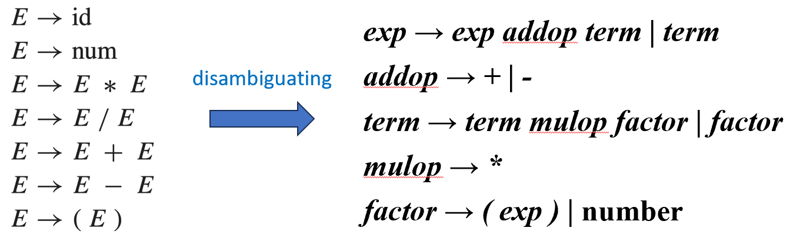

这张图解释了为什么要引入优先级指令。

* **左侧文法 ($E \to E + E$ 等)**：非常自然，符合人类直觉，但它是**二义性**的。对于 `1+2*3`，它既可以先算加法也可以先算乘法，这会导致大量的移进-归约冲突。
* **右侧文法 (`exp`, `term`, `factor`)**：这是我们之前讨论的分层文法，它虽然没有歧义，但**写起来很繁琐**，层次多了之后很难维护。
* **核心问题**：有没有一种方法，既能写左边这种简单的文法，又能强制执行优先级？
* **答案**：有，就是 Yacc 的内置优先级指令（Disambiguating rules）。

---

#### 通过 Shift/Reduce 解决歧义

通过设置优先级和结合性，Yacc 能在遇到冲突时自动做出正确的选择：

**优先级 (Precedence)**：

* 当遇到 `E -> E + E .`（准备归约加法）且下一个 Token 是 `*` 时。
* 如果 `*` 的优先级更高，解析器选择 **Shift**（移进），即保留加法，先去处理乘法。

**结合性 (Associativity)**：

* 当遇到 `E -> E + E .` 且下一个 Token 又是 `+` 时（如 `1+2+3`）。
* 如果是**左结合**，解析器选择 **Reduce**（归约），即先算出 `1+2` 的值。

如果 `a != b != c` 是不合法的，那么 `!=` 就是不可结合的（non-associative）。在这种情况下，如果解析器遇到 `E -> E != E .` 且下一个 Token 又是 `!=`，它会因为没有明确的优先级和结合性而报错。

---

#### 如何在 Yacc 中编写指令

```
%nonassoc EQ NEQ 
%left PLUS MINUS 
%left TIMES DIV 
%right EXP
```

**指令类型**：

* `%left`：左结合（最常用，如加减乘除）。
* `%right`：右结合（如赋值运算 `=` 或幂运算 `^`）。
* `%nonassoc`：不可结合。例如 `a < b < c` 在某些语言中是非法的，就可以用这个。

**优先级顺序**：

* `EXP` (幂) > `TIMES/DIV` (乘除) > `PLUS/MINUS` (加减) > `EQ/NEQ` (等于/不等)。

---

#### 解析器冲突解决算法

1. **比较优先级**：如果 Token 的优先级高于当前规则，则 Shift；反之则 Reduce。
2. **优先级相等时看结合性**：

* `%left`：倾向于 **Reduce**（先算左边的）。
* `%right`：倾向于 **Shift**（先算右边的）。

3. **规则的优先级定义**：一条规则的优先级，默认由它最右边的**终结符**决定。

---

#### 一元运算符与 `%prec`


处理**一元负号**（如 `-6 * 8`）。

**挑战**：减号 `-` 有两个身份。作为减法优先级低，作为负号优先级必须比乘法还高。

```
%{ // declarations of yylex and yyerror 
%} 
%token INT PLUS MINUS TIMES UMINUS 
%start exp 
%left PLUS MINUS 
%left TIMES 
%left UMINUS 
%% 
exp : INT
| exp PLUS exp 
| exp MINUS exp
| exp TIMES exp
| MINUS exp %prec UMINUS 
```

**解决方案**：

1.  声明一个虚拟 Token：`%token UMINUS`。
2.  把它放在优先级声明的最高位（图中 `%left UMINUS` 在 `TIMES` 之后）。
3.  **`%prec` 指令**：在规则 `| MINUS exp %prec UMINUS` 中，强制将这条规则的优先级“伪装”成 `UMINUS` 的级别，而不是普通的 `MINUS`。

> 有了 %prec UMINUS：规则 exp : MINUS exp 的优先级 = UMINUS 的优先级。
> 
> %prec 就像是一个优先级修改插件。

**效果**：这样 `-6 * 8` 就会被正确解析为 `(-6) * 8` 而不是 `-(6 * 8)`。

---

### Yacc: Syntax v.s. Semantics

简单来说，**语法**关乎“句子结构是否正确”，而**语义**关乎“这个句子是否有意义”（比如类型是否匹配）。

```
%{ //declarations of yylex and yyerror 
%} 
%token ID ASSIGN PLUS MINUS AND EQUAL 
%start stm 
%left OR 
%left AND 
%left PLUS 
%%
stm : ID ASSIGN ae
| ID ASSIGN be
be : be OR be
| be AND be
| ae EQUAL ae
| ID 
ae : ae PLUS ae
| ID 
```

这里展示了一个常见的尝试：程序员想在 Yacc 文法中直接区分**算术表达式（ae）**和**布尔表达式（be）**。

1. 文法设计意图：

* **`ae` (Arithmetic Expression)**：处理加法 `ae PLUS ae` 和数字/变量。
* **`be` (Boolean Expression)**：处理逻辑运算 `OR`, `AND` 以及比较运算 `ae EQUAL ae`。

**设计目标**：

* 算术运算符（如 `+`）比布尔运算符（如 `AND`）结合更紧。
* **禁止混合运算**：你不应该能写出 `5 + (a > b)`，因为布尔值不能加数字。

2. 隐藏的危机：

文法中定义了：

* `be : ID`
* `ae : ID`

这就是问题的根源。当解析器看到一个 `ID`（变量名）时，它**根本无法通过语法**判断这个变量到底是布尔型的还是数值型的。

**不要试图在语法分析（Parsing）阶段解决所有问题，应该推迟到语义分析（Semantic Phase）阶段。**

**策略调整**：

* **语法上放宽限制**：写一个通用的表达式文法 `E -> E + E | E & E | id`。这个文法允许 `a + 5 & b` 这种在结构上合法的表达式。
* **语义上严加检查**：在解析树构建好之后，再去检查类型。如果发现 `+` 号两边一个是数字一个是布尔值，再报错。

为什么这样做更好？

1.  **消除冲突**：通用的 `E` 文法不会产生刚才那种 `ae/be` 的归约冲突。
2.  **错误提示更友好**：解析器报错通常只能说 "Syntax Error"，而语义分析阶段可以明确告诉用户 "Type mismatch: cannot add a boolean to an integer"。

---

## **错误恢复（Error Recovery）**

当编译器在你的代码中发现一个语法错误时，它有两种选择：要么立即停止工作（这会让开发者很痛苦，因为你得改一个错、编译一次，再改下一个），要么尝试“跳过”或“修复”这个错误，继续寻找后面的错误。

> **"Developers would like to have all the errors in the program reported, not just the first error."**

* **效率**：一次性报出所有错误，能让开发者在一次修改循环中搞定所有问题。
* **用户体验**：优秀的编译器（如现代的 GCC 或 Clang）能像医生一样，虽然发现你有病，但还是坚持帮你做完整个全身检查。

错误恢复技术（Techniques）

**A. 局部错误恢复 (Local Error Recovery)**

这是最常用的策略，也是 Yacc/Bison 默认采用的思路。

* **原理**：当解析器在某个位置遇到错误时，它会局部地调整状态。
* **常见做法（恐慌模式 Panic Mode）**：

1. **跳过 Token**：不断抛弃输入中的记号，直到遇到一个“同步记号”（Synchronizing Token），比如分号 `;` 或右花括号 `}`。
2. **插入 Token**：假装输入中多了一个缺失的符号（例如自动补全一个丢失的右括号）。

* **特点**：实现简单，但可能会引发“连锁反应”（由于跳过了关键符号，导致后面原本正确的代码也报出假错误）。

**B. 全球错误修复 (Global Error Repair)**

这是一个理论上更完美但代价更高昂的方案。

* **原理**：将错误的源程序转换成一个最接近它的、语法正确的程序。
* **实现**：通常使用算法计算“最小编辑距离”（Minimum Edit Distance）。它会考虑插入、删除或替换哪些符号能用最少的改动让程序变合法。
* **特点**：由于计算量巨大（对于长程序来说，搜索空间呈爆炸式增长），这种方法在实际的工业级编译器中较少完整使用，更多作为理论参考。

---

### **局部错误恢复（Local Error Recovery）**

**核心逻辑**：通过**调整解析栈**和**输入流**，在检测到错误的位置寻找一个可以“重启”解析的状态。

**Yacc 的特殊 Token: `error`**：

* 你可以手动在文法中加入 `error` 这个符号。
* 示例规则：`exp -> ( error )`。这意味着如果在括号中间发生了语法错误，解析器可以匹配这条规则，假装括号里是一个合法的表达式，从而继续解析括号外的内容。

**同步记号 (Synchronizing Tokens)**：如分号 `;` 或右括号 `)`。它们是解析器用来“重新找回节奏”的锚点。

`error` 在解析器眼里是什么？

* **`error` 是一个终结符 (Terminal Symbol)**。
* 解析器生成器（如 Yacc）会像对待普通记号（如 `NUMBER`）一样，在分析表中为 `error` 生成 **Shift** 动作。
* 这意味着错误恢复本质上是**将解析过程切换到一条包含 `error` 符号的备用路径上**。

---

#### 实例演算 (Step-by-Step)

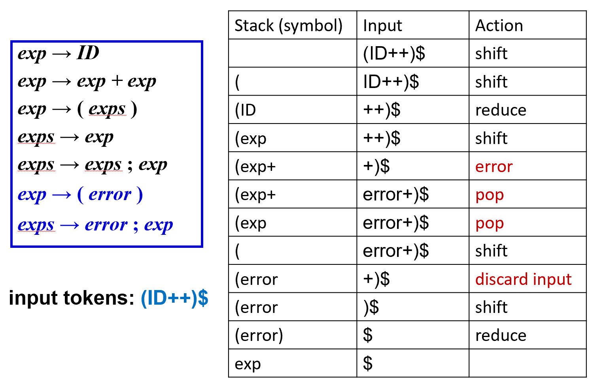

1. **正常解析阶段**：

* 移进 `(`，移进 `ID`。
* 将 `ID` 归约为 `exp`。此时栈内为 `( exp`。

2. **触发错误**：

* 下一个输入是 `+`。但文法规则中 `exp` 后面只能接 `+ exp` 或者 `)`。
* 解析器发现没有合法动作，报错 `error`。

3. **恢复过程 (核心逻辑)**：

* **Pop Stack (出栈)**：解析器开始弹出栈顶元素，寻找一个能处理 `error` 记号的状态。
* 它弹出了 `exp`，回到了刚读完 `(` 的状态。
* 在 `exp -> ( exps )` 规则中，它发现可以匹配 `exp -> ( error )`。
* **Shift error**：将 `error` 压入栈。

4. **同步输入**：

* **Discard Input (丢弃输入)**：解析器跳过不匹配的 `+` 和下一个 `+`，直到遇到 `)`。
* 匹配到 `)`，完成 `( error )` 的归约。解析成功重启。

---

#### LR 解析器的恢复四部曲

1. **退栈 (Pop)**：弹出栈顶，直到当前状态有针对 `error` 的 **Shift** 动作。
2. **移进 (Shift)**：将 `error` 记号压入栈。
3. **跳过输入 (Discard)**：丢弃当前的输入符号，直到遇到一个在当前状态下有**合法动作**（非 error 动作）的符号。
4. **恢复 (Resume)**：恢复正常的解析流程。

---

#### **语义动作的副作用**

假设你在解析左括号时执行了 `nest = nest + 1`，解析右括号时执行 `nest = nest - 1`。

**问题所在**：

* 如果在括号中间发生了错误，解析器会直接 **Pop Stack**。
* **退栈是物理操作，它不会自动撤销你之前执行的 C 代码！**
* 这意味着 `nest + 1` 执行了，但由于右括号被跳过或出栈，`nest - 1` **永远不会被执行**。
* **结果**：错误恢复后，你的全局变量 `nest` 的值变乱了，导致后续逻辑连锁崩溃。

**解决方案**：尽量编写 **Side-effect-free (无副作用)** 的语义动作，或者在错误处理规则中手动编写补偿代码。

---

### **全局错误修复（Global Error Repair）**

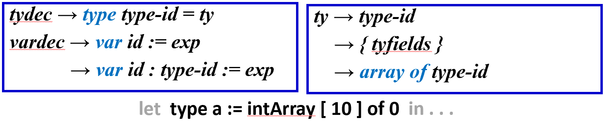

方框定义了两类规则：

* **`tydec` (类型声明)**：格式为 `type 类型名 = 类型定义`。注意中间用的是 **`=`**。
* **`vardec` (变量声明)**：格式为 `var 变量名 := 初始值`。注意中间用的是 **`:=`**。

看中间这行代码：

`let type a := intArray [ 10 ] of 0 in ...`

用户写了关键字 `type`（表示我要定义一个类型），但后面却用了变量赋值号 `:=`。

* 如果它是类型声明，应该用 `=`。
* 如果它是变量声明，应该以 `var` 开头。

这种“张冠李戴”会让解析器非常困惑。

局部错误恢复（Local Recovery）的表现:

局部恢复通常在发现错误的那一点（即看到 `:=` 时）才开始“恐慌”：

**策略一（删除）**：它可能会把从 `type` 到 `0` 之间的所有内容全部删掉，假装这里发生了一个 `error`，然后寻找下一个同步记号 `in`。
    
* *结果*：虽然跳过了错误，但这一整行有用的信息都丢失了。

**策略二（简单替换）**：尝试把 `:=` 换成 `=`。

* *结果*：换完之后，解析器继续往后读，发现后面跟着 `intArray [ 10 ]`（这是数组创建，通常用于变量初始化），在类型定义 `ty` 的文法里依然是不合法的。于是刚恢复解析，马上又遇到了第二个语法错误。

---

全局错误修复（Global Repair）的优势

**核心定义**：寻找**最小的插入和删除集合（Smallest set of insertions and deletions）**，将错误的字符串转变为合法的字符串。

**它是如何思考的？**

全局修复不会死盯着 `:=` 不放，它会通盘考虑整行代码。它可能会发现：
> “噢！用户其实是想写一个变量声明，只是不小心把开头的 `var` 写成了 `type`。”

**超越解析器限制**：全局修复甚至能在 **LL 或 LR 解析器报错之前**（即在解析器意识到有问题之前）就定位到更好的修改点。

* 在上面的例子中，它可能会建议把开头的 `type` 改成 `var`。这样整行代码就完美合法了，且保留了所有语义信息。

---

### **Burke-Fisher 错误修复**

它属于“全局修复”思想的一种简化实现。它的核心逻辑是：**“如果我现在发现错了，可能早在几个词之前就已经埋下了祸根。让我回退几步，试着修改一下过去，看看能不能改变未来。”**

**核心动作**：在报错点之前的 **$K$ 个 Token** 范围内，尝试所有的单 Token **插入、删除或替换**。

**如何评价“修复成功”？**

* 解析器会尝试用修改后的序列重新运行。
* 如果某种修改能让解析器在原报错点之后**推行得最远**，那它就是最佳修复方案。
* **“足够好”标准**：通常如果修复后能让解析器多走 $R = 4$ 个 Token 而不再报错，我们就认为修复成功。

**代价**：解析引擎必须具备“回滚（Back up）” $K$ 个 Token 并重新解析的能力。

---

#### 双栈与队列（数据结构实现）

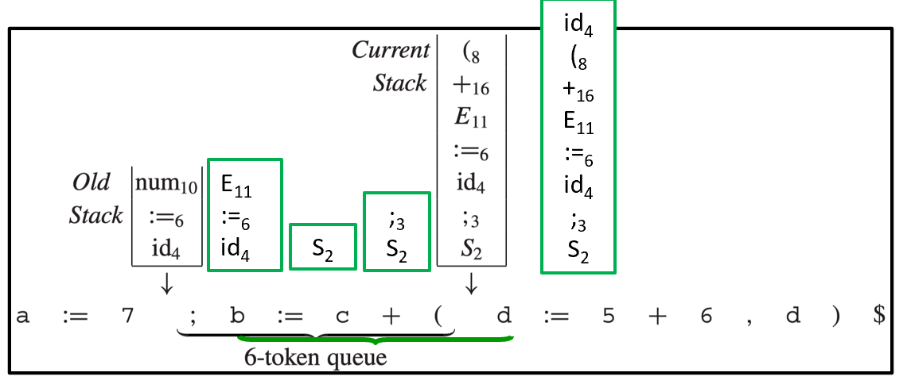

为了实现这种“回滚”，Burke-Fisher 引入了一套巧妙的结构：

1. **Current Stack（当前栈）**：解析器实时工作的栈，遇到新 Token 就正常处理。
2. **Old Stack（旧栈）**：这是一个**落后 $K$ 个步骤**的解析快照。
3. **K-token Queue（长度为 K 的队列）**：记录了从“旧状态”到“当前状态”之间经过的所有 Token。图中展示的是一个 **6-token queue**。

**工作流程**：

* 每当解析器移进（Shift）一个新 Token：

1. 压入 **Current Stack**。
2. 放入 **Queue** 的末尾。
3. **Queue** 头部弹出一个 Token，并移进到 **Old Stack** 中。

* 这样，**Old Stack 始终保存着 $K$ 个 Token 之前的解析现场**。

当解析器在 `current token` 发现语法错误时，Burke-Fisher 开始大显身手：

1. **穷举修改**：它会对队列（Queue）中的每一个位置尝试修改（插入、删除或替换一个 Token）。
2. **模拟解析**：对于每一种修改方案，解析器都会**从 Old Stack 出发**，配合修改后的队列内容进行重新解析。
3. **成功判定**：如果模拟解析能顺利越过原报错点，并且能继续往后解析 3 到 4 个 Token，解析器就会正式采纳这个修改，并向用户报告一个建议（例如：“你是不是在第 X 行漏掉了一个分号？”）。

---

#### 最大的优点：文法零修改

* **对比**：传统的 Yacc 恢复需要你手动在文法里塞满 `error` 产生式，这会让文法变得臃肿且难以维护。
* **Burke-Fisher**：**完全不需要修改文法**。它只修改了解析引擎本身。解析器在报错时自动回退并尝试修改 Token 序列。

---

#### 如何处理“副作用”（Semantic Actions）

Burke-Fisher 频繁回退和重新解析，如果每次归约都执行 `{nest++}`，全局变量岂不是乱套了？

**解决方案**：**延迟执行**。

* 解析器维护两个栈：**Current Stack**（领先的、用于试错）和 **Old Stack**（落后的、确定的）。
* **Current Stack 只做“物理归约”**：它会为了验证修复方案而不断进行 Shift 和 Reduce，但**绝对不执行**任何花括号里的 C 代码动作。
* **Old Stack 执行“永久归约”**：只有当一个 Token 序列被确认正确（或者修复成功），并从队列头部移进到 Old Stack 时，相关的语义动作才会被执行。

* **结果**：这完美解决了副作用问题。因为 Old Stack 永远不会回退，它走过的每一步都是“确定”的，所以 `nest++` 和 `nest--` 永远是成对平衡的。

---

#### 插入符号的语义值来源

Burke-Fisher 的修复手段包括**插入（Insertion）**。例如，如果发现你漏了一个变量名或数字，它会帮你“变”一个出来。

如果解析器决定插入一个 `INT`（整数），那么这个 `INT` 的语义值（`yylval`）应该是多少？如果没有值，后续的计算（如 `$1 + $3`）就会因为引用了空指针或野数值而导致编译器崩溃。

解决方案：`%value` 指令

ML-Yacc（以及其他高级解析器生成器）提供了专门的指令来定义这些“备胎值”：

* **`%value ID ("bogus")`**：如果需要插入一个标识符，默认名字叫 "bogus"（伪造的）。
* **`%value INT (1)`**：如果缺个数字，默认补个 1。
* **`%value STRING ("")`**：如果缺个字符串，默认补个空串。

**为什么要这么做？**这样做的目的不是为了算出正确的结果（毕竟代码已经错了），而是为了让解析器能**顺利跑完语义检查**。只要编译器不崩溃，它就能继续往后找更多的语法错误。

---

### 人工干预：%change 指令

即使有了 Burke-Fisher 这种自动修复技术，解析器有时还是会“猜错”。程序员可以利用 `%change` 指令提供人工干预。

**核心功能**：预定义一些常见的输入错误，并告诉解析器：“如果你看到左边的序列，优先把它换成右边的，再试试看。”

**常见示例解析**：

* `%change EQ -> ASSIGN`：如果用户在需要赋值的地方写了 `==`，尝试换成 `:=`。
* `%change ASSIGN -> EQ`：反之亦然。
* `| -> IN INT END`：这是一种**插入建议**。如果在某些结构中解析失败，尝试自动补全一个“作用域结束符”（Scope closer）。如果用户忘了写 `end`，解析器可以根据 `%change` 规则自动补上，从而关闭当前作用域。

---

#### 错误恢复的实战跟踪 (Stack Trace)

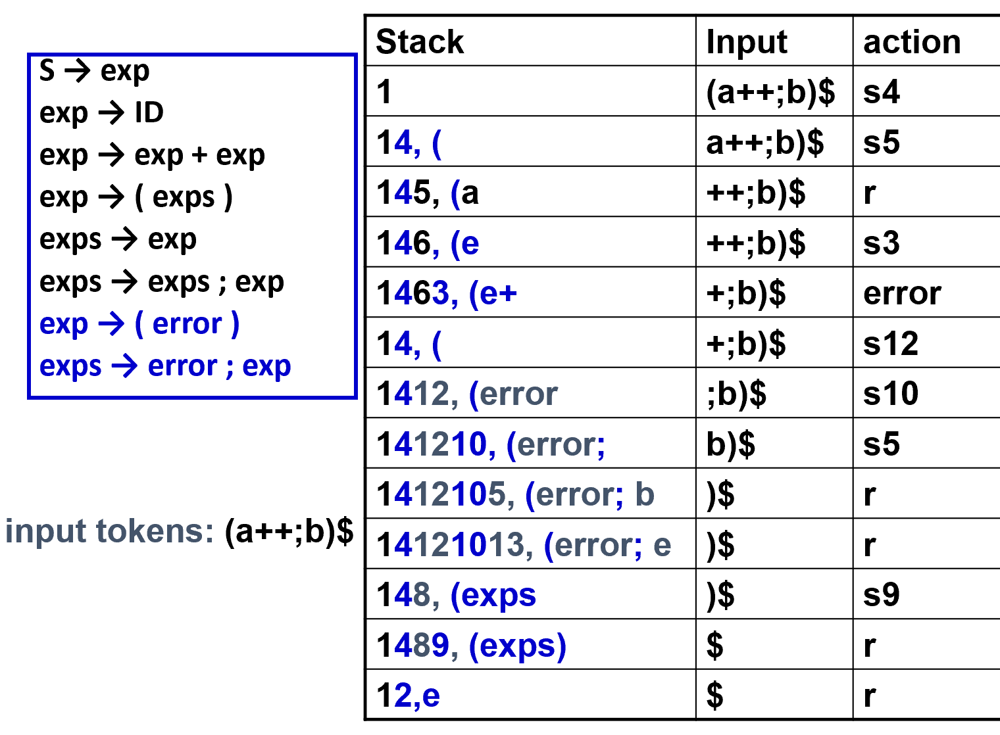

这张图通过处理输入 `(a++;b)$` 详细展示了栈（Stack）的变化。请注意，输入中 `++` 是一个明显的语法错误。

1. **错误发生**：当栈内为 `1463, (e+` 时，输入遇到了第二个 `+`。根据文法，加号后面不能直接跟加号，于是触发 **action: error**。
2. **寻找恢复点（s12）**：解析器开始**退栈（Pop）**。它丢弃了 `3` (即对应的 `+`) 和 `6` (即对应的 `e`)，回到了状态 `4`（刚读完左括号的状态）。
3. **移进 error**：状态 `4` 下遇到 `error` 符号，执行 **s12**，将 `error` 压入栈。
4. **同步输入（discard）**：解析器跳过输入中的 `+`，直到遇到 `;`。
5. **重启解析**：

* 在状态 `12` 遇到 `;`，执行 **s10**，将 `;` 压栈。
* 随后正常处理 `b` 和 `)`。

6. **最终归约**：最后将 `(error; b)` 成功归约为 `exp`。

---

#### 底层的 DFA 状态机视图

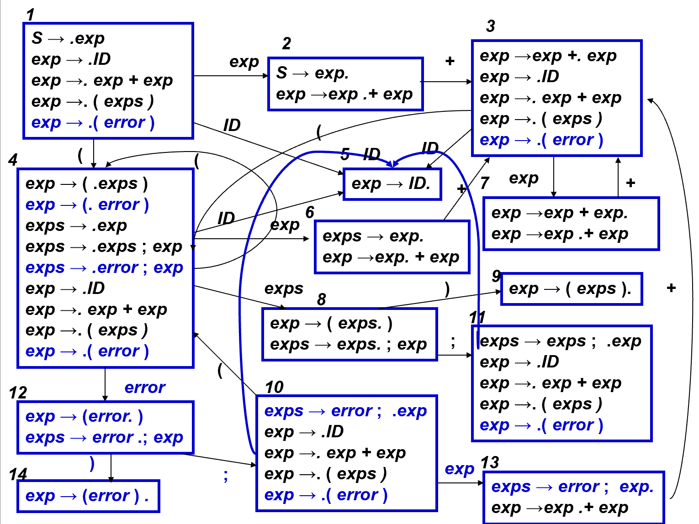

展示了各个状态（State）是如何通过 Token 转换的。**蓝色部分**是专门处理 `error` 的路径。

**状态 4（核心调度点）**：

* 如果一切正常，它走 `exp` 路径。
* 如果发生错误，它有一条 **蓝色线条** 指向 **状态 12**（标记为 `error`）。

**状态 12（恢复状态）**：

* 它在等待两个救命稻草：一个是 `)`（直接走向状态 14 完成归约），另一个是 `;`（走向状态 10 开启列表解析）。

**意义**：这张图展示了 `error` 在文法中并不是虚无的，它在编译器的有限自动机里占据了真实的物理状态。当错误发生时，解析器就像在迷宫里“瞬移”到了蓝色的应急通道上。

---