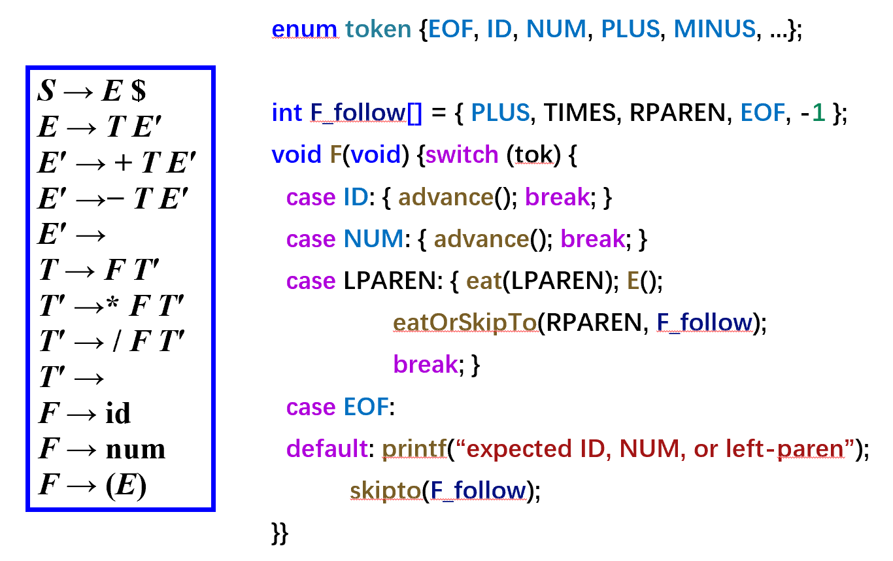
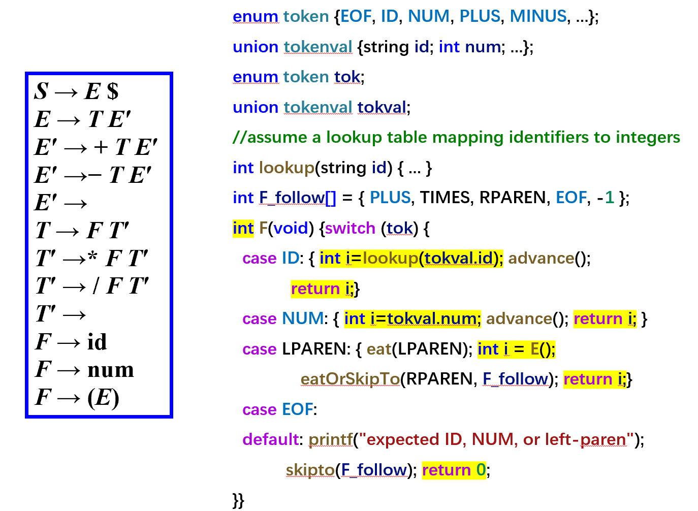
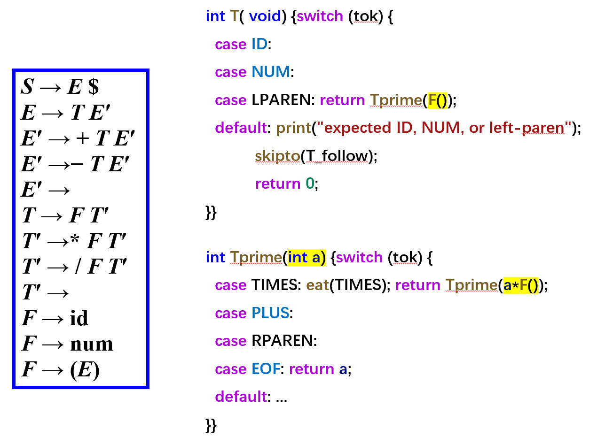
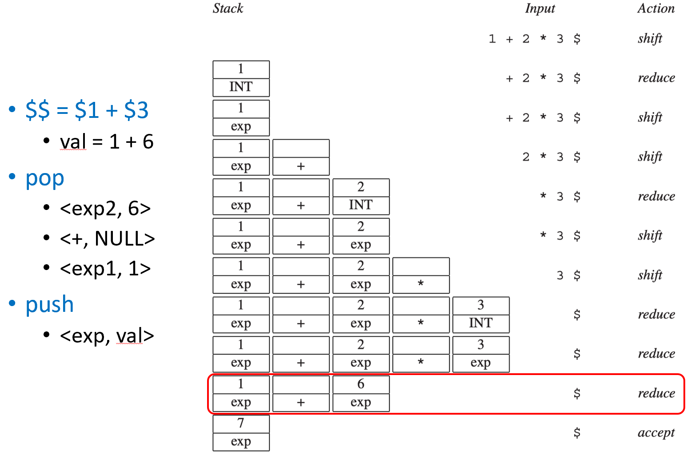
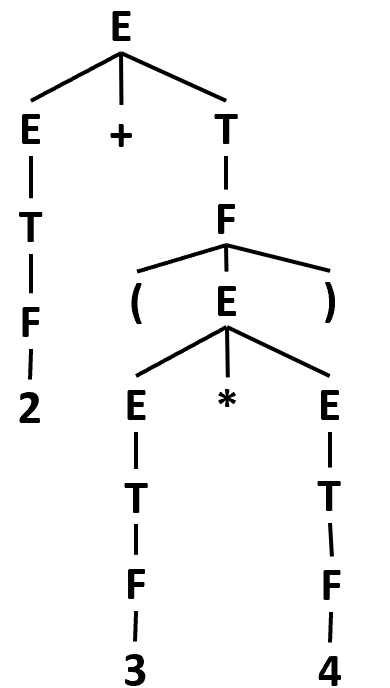
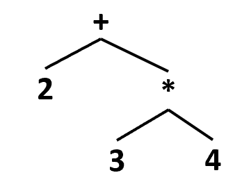
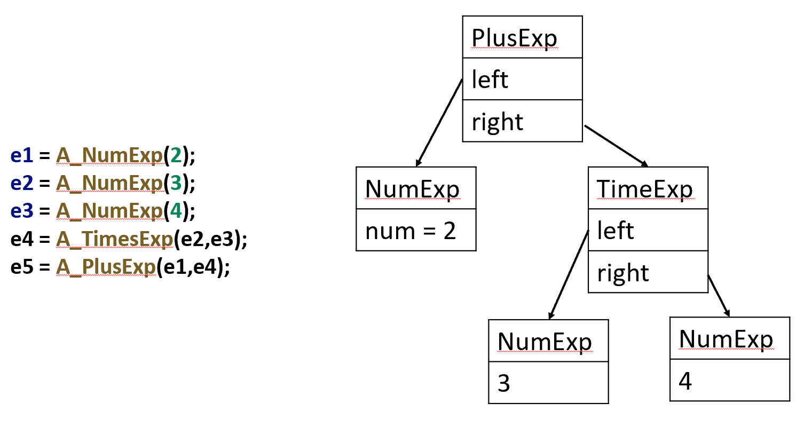

# Chapter 4 | Abstract Syntax

## Semantic Actions

### 解析器（Parser）的本职工作

解析器的基础功能：

* **输入**：Token 流（stream of tokens）。
* **核心**：语法分析（Syntax Analysis），即 **Parser**。它依赖你编写的文法（grammar）。
* **输出**：抽象语法（abstract syntax），即确认这组 Token 是否符合某种结构。

**简单来说：** Parser 就像一个交警，只管查验你的“通行证”（Token 序列）是否合法。

---

### 编译器的进阶任务

一个真正的编译器不能止步于“检查通过”，它必须做更多更有用的事：

* **构建抽象语法树 (AST)**：将扁平的 Token 序列变成有层次的数据结构。
* **执行语义分析**：检查变量是否定义、类型是否匹配。
* **生成中间表示 (IR)**：将源代码翻译成一种更接近机器、但又保持通用的代码格式。

---

> **"The semantic actions of a parser can do useful things with the phrases that are parsed."**

语义动作就是**嵌入在解析器中的代码片段**。当解析器识别出一段特定的语法结构（短语）时，就会触发这些动作。

---

### 语义动作的两种实现方式

#### ** 递归下降解析器 (Recursive Descent)**

* 这是**手工编写**解析器的方法。
* 语义动作直接写在处理每个非终结符的函数里。
* 灵活性极高，你可以直接在函数返回时传值。

---

#### **Yacc 生成的解析器 (Yacc-Generated Parsers)**

* 这是**工具生成**的方法。
* 语义动作写在花括号 `{ ... }` 里，利用 `$1, $2, $$` 等伪变量在值栈上操作。

---

这组课件通过对比和演进，深入讲解了如何在**递归下降（Recursive Descent）**解析器中实现**语义动作（Semantic Actions）**，即如何让解析器不仅仅是“检查语法”，还能实际“计算结果”或“产生副作用”。

---

### Recursive Descent (纯语法解析)



**文法基础**：左侧蓝框是经典的消除左递归后的算术表达式文法。

**代码逻辑**：以函数 `F()`（处理因子）为例：

* 通过 `switch(tok)` 判断当前 Token。
* 如果是 `ID` 或 `NUM`，调用 `advance()` 跳过。
* 如果是左括号，调用 `eat(LPAREN)` 并递归调用 `E()`。

**局限性**：这些函数返回类型是 `void`。它能告诉你语法对不对，但无法告诉你 `3 + 5` 等于几。

---

### Semantic Actions (引入语义值)



这张图对代码进行了升级，使其能够返回数值。

**返回值改变**：函数 `F()` 的返回类型从 `void` 变成了 `int`。

**值的获取**：

* `case ID`: 调用 `lookup(tokval.id)` 从符号表中查找变量的数值。
* `case NUM`: 直接返回 `tokval.num`。

**递归求值**：在括号的情况下，`int i = E()` 捕获了子表达式的计算结果并返回。

---

#### Side Effects (副作用)

除了返回值，语义动作还可以产生“副作用”，指不直接体现在函数返回值上的操作，通常是修改全局状态。

**典型例子**：

1. **记录**：遇到赋值语句 `id := num`，动作是将 `id -> num` 的映射记录到符号表（Lookup table）中。
2. **输出**：遇到 `print(id)`，动作是在屏幕上打印出变量的值。

---

#### 左递归消除带来的挑战

**如何处理 $T \to F T'$ 这种结构？**

* **直观情况**：如果文法是 $T \to T * F$，逻辑很简单：`int a = T(); eat(TIMES); int b = F(); return a * b;`。
* **困境**：但为了避免死循环，我们被迫改写成了 $T \to F T'$。在 `T()` 函数里，我们先解析了 `F`（得到了第一个乘数），但乘法符号和第二个乘数都在 `T'` 里面。
* **问题**：`T'` 作为一个独立的函数，如何知道它前面那个被解析掉的 `F` 是多少？

---

#### 参数传递解决语义依赖



**`T()` 的职责**：它先解析 `F()` 得到结果 `a`，然后把 `a` 作为**参数**传给 `Tprime(a)`。

**`Tprime(int a)` 的逻辑**：

* 它就像一个“接力手”，拿到了前面的计算结果 `a`。
* 如果遇到了 `*`：它解析下一个因子 `F()`，计算出当前的乘积 `a * F()`，然后**继续递归地**把这个新结果传给下一个 `Tprime`：`return Tprime(a * F())`。
* 如果遇到了空产生式（即乘法链结束）：直接返回累积的结果 `a`。

---

## Yacc 中的语义动作语法

```
%{ … %}
%union {int num; string id;}
%token <num> INT
%token <id> ID
%type <num> exp
...
%left UMINUS
%%

exp: INT {$$ = $1;}
   | exp PLUS exp {$$ = $1 + $3;}
   | exp MINUS exp {$$ = $1 - $3;}
   | exp TIMES exp {$$ = $1 * $3;}
   | MINUS exp %prec UMINUS {$$ = -$2;}
```

* **`{ ... }`**: 嵌入在文法规则后的 C 代码，即**语义动作**。
* **`$i` (核心伪变量)**：代表产生式右部（RHS）第 $i$ 个符号的语义值。
* **`$$` (目标伪变量)**：代表产生式左部（LHS）非终结符最终要获得的语义值。
* **`%union`**: 允许定义多种可能的语义值类型（如 `int`, `string` 等）。
* **`<variant>`**: 在声明 `%token` 或 `%type` 时使用，指定其对应的 `union` 成员类型。

**代码示例**：

* `exp: exp PLUS exp { $$ = $1 + $3; }`
* 这里的 `$1` 是左边 `exp` 的值，`$3` 是右边 `exp` 的值，`$2` 是 `PLUS` 字符本身的值（通常不携带数值）。计算结果存入 `$$`。

---

### 如何实现语义值？（并行栈机制）

**并行栈 (Parallel Stacks)**：Yacc 生成的解析器实际上维护了两个大小一致的栈：

1.  **状态栈 (State Stack)**：存储解析器的 DFA 状态和符号。
2.  **语义值栈 (Semantic Value Stack)**：专门存储对应的数值（即 `$i` 所指代的东西）。

**归约时的动作 (Reduction)**：

* 当解析器执行 $A \to Y_1 ... Y_k$ 的归约时，它会从栈顶取出 $k$ 个元素。
* 此时，它会同步从**语义值栈**中取出这 $k$ 个值，供你在 C 代码中使用 `$1 ... $k` 来访问。
* 执行完 C 动作后，计算出的 `$$` 会被**压入语义值栈**的栈顶，与符号 $A$ 在状态栈中的位置一一对应。

---

#### 实例演算——处理 `1 + 2 * 3`



这张图通过一个实际的解析序列，生动地展示了两个栈是如何同步工作的。

1. **Shift 1 & Reduce to exp**:状态栈压入 `exp`，语义值栈压入 `1`。
2. **Shift + & Shift 2 & Reduce to exp**:此时栈内结构下层是 `1/exp`，中间是 `+/NULL`，上层是 `2/exp`。
3. **优先级处理**：因为乘法优先级高，解析器不急着归约 `1 + 2`，而是继续移进 `*` 和 `3`。
4. **关键归约**：解析器识别出 `exp * exp`，执行归约。从值栈取出 `2` 和 `3`，算出 `6`，压回值栈。
5. **最终归约 ($$ = $1 + $3)**：现在栈顶是 `exp(1) + exp(6)`。弹出 3 个元素（exp, +, exp）。执行 `$1 + $3` 即 `1 + 6 = 7`。将结果 `7` 压入值栈，将 `exp` 压入状态栈。
6.  **Accept**: 解析完成，最终结果为 `7`。

---

## Semantic Actions

**语义动作的执行顺序与解析树（Parse Tree）的遍历顺序是完全对应的。**

---

### 语义值的关联与传递

符号与值的对应关系：

* **符号关联类型**：文法中的每一个终结符（如 `int`）和非终结符（如 `E`, `T`）都可以关联自己特有的语义值类型（通过之前讲过的 `%union` 实现）。
* **产生式逻辑 $A \to B \ C \ D$**：

1. 语义动作必须返回一个值给左部的非终结符 $A$。
2. 这个值是由右部已匹配好的 $B, C, D$ 的值“构建”而来的。
3. **对应 Yacc 语法**：`$$` 就是 $A$ 的值，`$1, $2, $3` 分别是 $B, C, D$ 的值。

---

### 确定性的执行顺序：自底向上 (Bottom-up)

一个 LR 解析器（如 Yacc 生成的解析器）执行语义动作的顺序是**确定且可预测的**。

* **遍历方式**：它按照**自底向上（Bottom-up）**、**从左到右（Left-to-right）**的顺序遍历解析树。
* **后序遍历 (Postorder Traversal)**：这种遍历方式在计算机科学中被称为“后序遍历”。这意味着：

1. 必须先处理完子节点（叶子节点）。
2. 只有当一个产生式右边的所有符号都处理完了，才会执行该产生式的归约（Reduction）。
3. 归约发生的瞬间，执行对应的语义动作。

---

### 为什么“后序遍历”很重要？

* **数据依赖**：如果父节点在子节点之前执行动作，它就拿不到子节点算出的值。后序遍历保证了当你需要执行 `$$ = $1 + $3` 时，`$1` 和 `$3` 已经在之前的步骤中计算完毕并存放在栈里了。
* **逻辑一致性**：这确保了复杂的表达式（嵌套很深的树）能够像剥洋葱一样，从最内层开始，一层一层地把计算结果向上传递到根节点。

---

## Abstract Parse Trees

### 为什么要分离语法与语义？

为什么不能把所有代码都写在 Yacc 的花括号 `{}` 里。

* **全能 Yacc 的弊端**：如果你在解析时直接生成机器码，代码会变得极其难读且难以维护。
* **解析顺序的限制**：Yacc 是严格按扫描顺序解析的。比如 `foo()` 调用了还没定义的 `bar()`。如果在解析 `foo()` 时就想生成代码，解析器会因为还没见过 `bar()` 而报错。
* **解决方案**：分离**语法分析**（Parsing）和**语义分析**（类型检查、代码生成）。解析器只负责产出一棵**树**，让后面的阶段（Later phases）去慢慢遍历。

---

### 对比：语法树（Parse Tree） vs. 抽象语法树（AST）

**语法树 (Concrete Parse Tree)**：

* **太啰嗦**：每一个 Token 都是一个叶子，每一个文法规则都是一个节点。
* **冗余**：包含了很多对计算无用但对语法必须的符号（如括号 `( )`）。
* **依赖文法**：文法变了，树的结构就变了，对后期处理不友好。



**抽象语法树 (Abstract Syntax Tree, AST)**：

* **简洁**：去掉了括号等杂质，只保留核心运算。
* **接口清晰**：它是解析器提供给后续编译器阶段的“干净接口”。
* **结构**：图中展示了 `2 + 3 * 4`。根节点是 `+`，左孩子是 `2`，右孩子是 `*` 的子树。



---

### 如何用 C 语言表示一棵树？

解析树在代码里其实就是**结构体（Struct）**。

**数据结构定义**：

* 使用 `typedef struct A_exp_ *A_exp;` 定义指针。
* 使用 `enum` 来标记这个节点是什么类型（数字、加法还是乘法）。
* 使用 `union` 来节省空间（同一个节点要么存数字，要么存两个子树的指针）。

**构造函数**：

* 展示了 `A_PlusExp` 的实现：申请内存 -> 设置类型为 `A_plusExp` -> 挂载左右子树 -> 返回。

---

### 构建 AST

**手动连接**：展示了通过调用 `A_NumExp` 和 `A_PlusExp` 函数，手动组合出 `2 + 3 * 4` 的 AST 过程。这对应了图中 `e1` 到 `e5` 的赋值逻辑。



**自动构建**：

```
%left PLUS
%left TIMES

%%
exp : NUM       		{$$=A_NumExp($1);}
     | exp PLUS exp  	{$$=A_PlusExp($1,$3);}
     | exp TIMES exp 	{$$=A_TimesExp($1,$3);}
```

* 将 Yacc 的语义动作（Semantic Actions）与 AST 构造函数结合。
* **原理**：解析器在“自底向上”归约时，不断调用构造函数。小树合并成大树，最终归约为根节点时，整棵 **AST** 就构建完成了。

---

## **位置信息（Positions）**

当你写的代码报错时，编译器会告诉你是“第 5 行第 10 个字符”出错了。现在要解决的是在引入了**抽象语法树（AST）**后，如何把这些行号信息带到编译的后期阶段。

---

### 为什么位置信息会丢失？

**One-pass 编译器（单遍编译）**：

* 词法、语法、语义分析同时进行。
* 此时词法分析器（Lexer）的当前位置就是报错位置。报错非常容易，直接读全局变量即可。

**基于 AST 的编译器（多遍编译）**：

* **问题所在**：解析器（Parser）在构建完整棵树后，词法分析器早已读到了文件末尾（EOF）。
* **挑战**：如果在语义分析阶段（比如类型检查）发现 `a + 1` 有错，此时 Lexer 已经指在文件最后了，如果不提前保存，编译器就没法告诉用户错误具体在哪一行。

---

### 在 AST 节点中“撒入”位置信息

既然以后还要用，那就把位置存进树里。

* **核心思路**：抽象语法树的每一个节点都必须记住它在源代码中的位置。
* **实现方式**：在 AST 的数据结构中增加一个 `pos` 字段。

**实例演示**：

* 对于 `2 + 3 * 4` 中的数字 `3`。
* 它的 `NumExp` 节点除了存储数值 `3`，还会存储 `(line 1, pos 3)`。
* 这样无论解析进行到哪一步，只要拿着这个节点，就能找回它的出处。

---

### 如何设置 pos 字段？

这是一个跨部门协作的过程：

1. **词法分析器（Lexer）**：必须把每个记号（Token）的起始和结束位置传给解析器。
2. **解析器（Parser）**：

* **理想情况**：解析器应该维护一个**位置栈（Position Stack）**，与语义值栈并行。这样在归约时，位置信息就像 `$1, $2` 一样随取随用。
* **工具限制**：**Bison** 能够自动管理位置栈，但原生的 **Yacc** 不行。

---

### Yacc 中的解决方案（技巧）

既然 Yacc 不自动管理位置，程序员就得用一点“黑科技”：定义一个专门代表位置的非终结符。

**定义 `pos` 非终结符**：

* `pos: { $$ = EM_tokpos; }`
* 这里 `EM_tokpos` 是 Lexer 中的全局变量。

**在规则中嵌入 `pos`**：

* `exp: exp PLUS pos exp { $$ = A_OpExp($1, A_plus, $4, $3); }`
* **注意索引偏移**：因为中间插入了一个 `pos`，原本应该是 `$3` 的右操作数现在变成了 **`$4`**，而 **`$3`** 则是我们捕获到的位置信息。

**传递过程**：

1. 解析到 `PLUS` 时，紧接着触发 `pos` 规则。
2. `pos` 规则读取 Lexer 的当前位置并返回。
3. 父规则 `exp` 拿到这个位置值（即 `$3`），传给 AST 构造函数 `A_OpExp`。

---