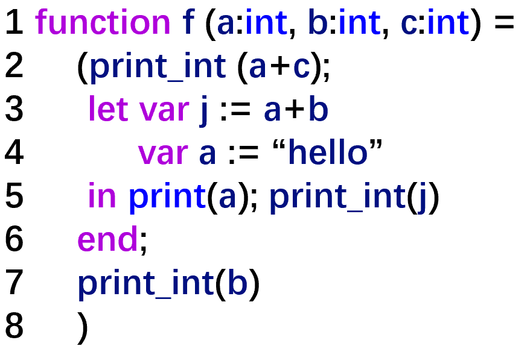
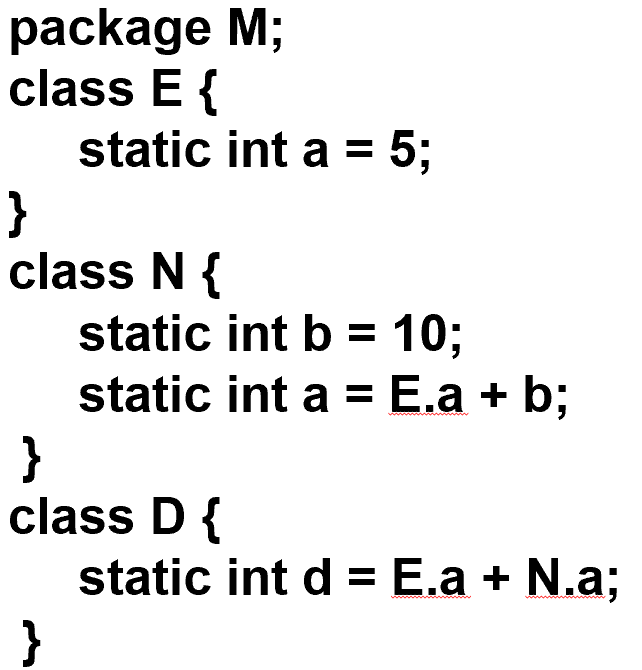
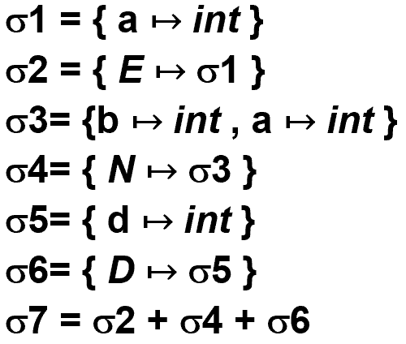
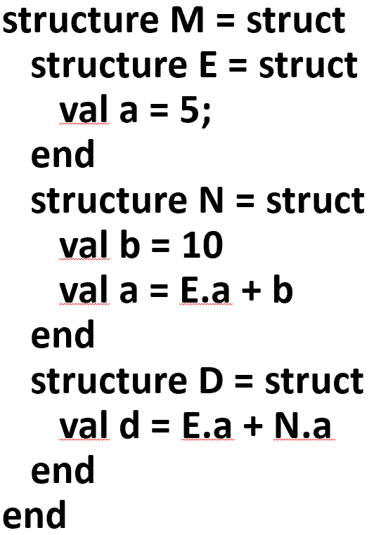
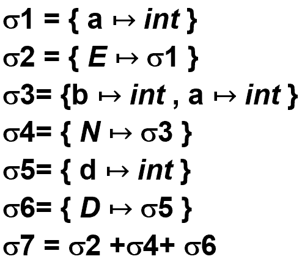
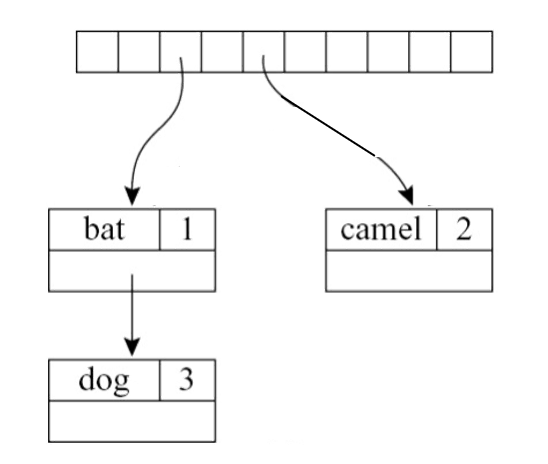
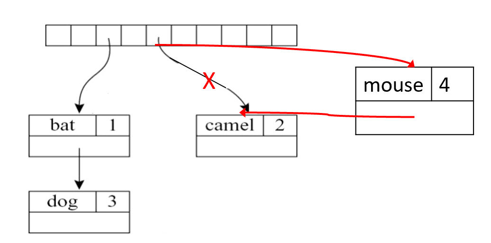
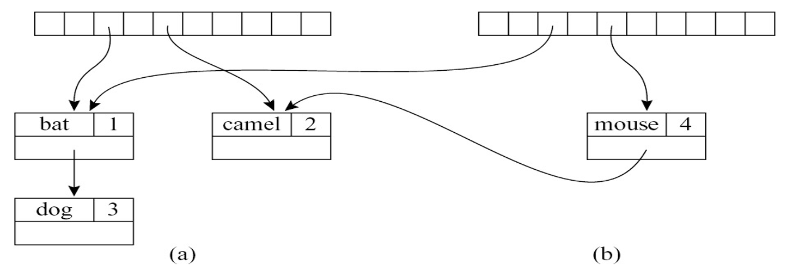
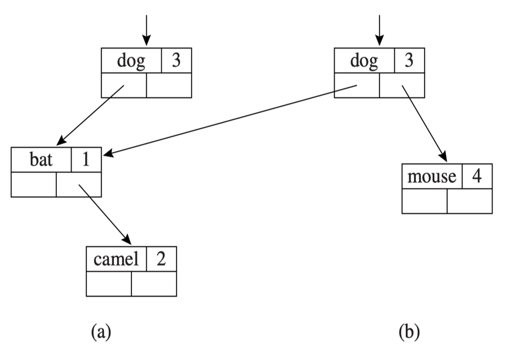

# Chapter 5 | Semantic Analysis

## 什么是符号表（Symbol Tables）

**符号表（Symbol Tables）**，也常被称为**环境（Environments）**。

符号表是编译器在语义分析阶段维护的一种数据结构，它的核心作用是：**建立标识符（变量名、函数名等）与其属性（如类型、内存位置等）之间的映射关系**。

* **符号表 = 环境（Environment）**：在理论上，我们常把符号表看作一个环境，用数学符号 $\sigma$（Sigma）表示。
* **绑定（Binding）**：环境由一组“绑定”组成。例如，$a \mapsto \text{int}$ 表示标识符 $a$ 被绑定到了整型（int）。
* **声明 vs 使用**：编译器需要区分标识符的“声明”（定义它是什么）和“使用”（根据之前的声明来确定其意义）。

代码示例：



假设初始环境为 $\sigma_0$。

1. **Line 1 (进入函数 `f`)**：

定义了参数 `a, b, c` 为 `int`。此时环境变为：

$$\sigma_1 = \sigma_0 + \{a \mapsto \text{int}, b \mapsto \text{int}, c \mapsto \text{int}\}$$

2. **Line 3 (定义局部变量 `j`)**：

编译器需要知道 `j` 的类型。它通过计算表达式 `a+b` 得到。因为在 $\sigma_1$ 中 `a` 和 `b` 都是 `int`，所以 `j` 也是 `int`。环境更新为：

$$\sigma_2 = \sigma_1 + \{j \mapsto \text{int}\}$$

3. **Line 4 (变量遮蔽/重定义 `a`)**：

代码中出现了 `var a := "hello"`。注意此时 `a` 的类型变成了 `string`。

$$\sigma_3 = \sigma_2 + \{a \mapsto \text{string}\}$$

**关键特性：遮蔽（Shadowing）**

**$X + Y$ 不等于 $Y + X$**。

* 在 $\sigma_3$ 中，标识符 `a` 同时存在两个绑定：来自 $\sigma_1$ 的 `int` 和来自 Line 4 的 `string`。
* **规则**：右侧的绑定会覆盖（Override）左侧的。因此在 $\sigma_3$ 中查找 `a` 时，结果是 `string`。这就是所谓的“局部变量遮蔽了全局变量或同名外部变量”。

---

### 作用域（Scope）与销毁

* **进入作用域**：添加新的绑定。
* **离开作用域**：当语义分析到达作用域尽头（如代码中的 `end;`）时，该作用域内定义的标识符绑定必须被**丢弃（Discarded）**。

示例中的退出过程：

* **Line 6 (`end;`)**：局部作用域结束。编译器丢弃 $\sigma_3$，恢复到进入该 block 之前的状态 $\sigma_1$。
* **Line 7 (`print_int(b)`)**：此时在 $\sigma_1$ 中查找 `b`，它是合法的。
* **Line 8 (函数结束)**：丢弃 $\sigma_1$，回到初始环境 $\sigma_0$。

---

### 符号表的两种实现风格

#### 函数式风格 (Functional Style)

* **原理**：使用**持久化数据结构**（Persistent Data Structure）。当你往环境中添加新绑定时，不修改旧表，而是创建一个指向旧表的新节点。
* **优点**：非常容易恢复旧环境。你只需要保留指向旧表（如 $\sigma_1$）的指针，即使创建了 $\sigma_2$ 和 $\sigma_3$，$\sigma_1$ 的内容依然完好无损。

---

#### 命令式风格 (Imperative Style)

* **原理**：只维护一个**全局的符号表**（通常是一个哈希表）。

**操作**：

* **修改**：直接在表中添加或更新绑定。
* **撤回**：为了在退出作用域时能找回旧状态，需要配合一个**“撤销栈”（Undo Stack）**。
* 当进入新作用域并修改了变量 `a` 时，先把 `a` 之前的值压入栈中。当退出作用域时，从栈中弹出旧值并写回哈希表。

---

## 多重符号表（Multiple Symbol Tables）

在实际编程中，程序往往由多个模块、类或结构组成，每个部分都有自己独立的环境。这里通过对比 **Java** 和 **ML** 两种语言，讲解了编译器如何处理模块间的标识符可见性。

---

### 嵌套与组合环境

当程序包含包（Package）、类（Class）或模块时，每个实体都会产生自己的 $\sigma$。

* **私有环境**：类内部的变量。
* **导出环境**：该类暴露给外部查看的映射关系（例如 `E.a` 中的 `a`）。

---

### Java 风格：前向引用与全局可见性





Java 允许**前向引用（Forward Reference）**，即你可以在定义一个类之前就使用它。

**编译策略**：编译器会先扫描所有的声明，将 $E, N, D$ 全部放入一个大的环境 $\sigma_7$ 中。

**环境推导**：

* $\sigma_1 = \{a \mapsto \text{int}\}$ （类 $E$ 的内容）
* $\sigma_3 = \{b \mapsto \text{int}, a \mapsto \text{int}\}$ （类 $N$ 的内容，注意它有两个变量）
* $\sigma_7 = \{E \mapsto \sigma_1, N \mapsto \sigma_3, D \mapsto \sigma_5\}$

在 Java 中，编译 $E, N, D$ 中的任何一个时，都可以看到整个 $\sigma_7$。因此，即便 $E$ 在代码最前面，它理论上也能引用后面定义的 $D$ 中的静态成员。最终结果是整个包 $M$ 映射到了这个综合环境 $\sigma_7$。


---

### ML 风格：严格的顺序依赖





ML（一种函数式语言）通常不允许前向引用，它遵循**“先定义，后使用”**的严格顺序。

**编译策略**：环境是随着编译进度逐步“生长”的。

**环境推导过程**：

1.  编译 `structure E` 时，环境只有初始的 $\sigma_0$。编译完后得到 $\sigma_2 = \{E \mapsto \sigma_1\}$。
2.  编译 `structure N` 时，它**只能看到** $\sigma_0 + \sigma_2$。因此它可以使用 `E.a`，但如果此时引用 `D` 就会报错。
3.  编译 `structure D` 时，它能看到 $\sigma_0 + \sigma_2 + \sigma_4$。它可以同时使用 `E` 和 `N` 的成员。

虽然最终 $M$ 的映射结果也是 $\sigma_7$，但编译过程中的**可见性（Visibility）**是受限且单向的。

---

### 符号表的层级结构

无论是哪种语言，这都意味着符号表不再是一个简单的扁平 Map，而是一个**树状或图状结构**：

* 环境 $\sigma$ 的值可以指向另一个环境 $\sigma'$。
* 例如在 $\sigma_7$ 中查找 `E.a` 的逻辑是：先在 $\sigma_7$ 找到 `E` 对应的环境 $\sigma_1$，再在 $\sigma_1$ 中查找 `a`。

---

这部分内容进入了符号表实现的**工程细节**，重点讨论了如何在**命令式（Imperative）**和**函数式（Functional）**两种风格下实现**高效**的查找与维护。

---

## 高效的命令式符号表（Efficient Imperative Symbol Tables）

在命令式风格中，我们通常使用**哈希表（Hash Table）**来实现 $O(1)$ 的平均查找速度。



---

### 哈希表结构与哈希函数

为了处理成千上万个标识符，编译器使用了**拉链法（External Chaining）**来解决哈希冲突。

**哈希函数**：示例给出了一个典型的字符串哈希算法：

$$h = (\alpha^{n-1}c_1 + \alpha^{n-2}c_2 + \dots + \alpha c_{n-1} + c_n)$$

其中 $\alpha$ 通常取一个质数（如代码中的 `65599`），这能有效减少不同字符串映射到相同位置的概率。

**Bucket 结构**：每个哈希槽位指向一个链表，链表节点（Bucket）存储了 `key`（变量名）、`binding`（类型信息等）和 `next` 指针。

```c
struct bucket { string key; void *binding; struct bucket *next; };
#define SIZE 109
struct bucket *table[SIZE];
unsigned int hash(char *s0) {
  unsigned int h=0; char *s;
  for(s=s0; *s; s++)
    h=h*65599 + *s; 
  return h; 
}

struct bucket *Bucket (string key, void *binding, struct bucket *next) {
  struct bucket *b=checked_malloc(sizeof(*b));
  b->key = key; b->binding = binding; b->next = next;
  return b; 
}
```

??? note "映射到同一个地方怎么办"
    如果两个不同的字符串 `key1` 和 `key2` 计算出的 `hash` 值相同，它们会排在同一个槽位的链表中。

    这就是为什么在 lookup 函数代码中，不仅要计算 `index`，还需要使用 `strcmp(b->key, key)` 来逐个对比字符串的原因。只有 `index` 相同且 `key` 字符串内容也完全一致，才算找到了目标。

---

### Insert, Lookup, Pop

* **`insert`**：将新绑定插入到对应哈希槽位的**链表头部**。
* **`lookup`**：遍历对应槽位的链表，找到第一个匹配的 `key`。
* **`pop`**：删除链表的头节点。

由于新定义的变量总是插入头部，`lookup` 总是能先找到“最近”定义的变量。这完美实现了**变量遮蔽（Shadowing）**。当退出作用域时，调用 `pop` 即可恢复之前的绑定。

```c
void insert(string key, void *binding) {
  int index=hash(key)%SIZE;
  table[index]=Bucket(key, binding, table[index]); 
}
void *lookup(string key) {
  int index=hash(key)%SIZE 
  struct bucket *b;
  for (b = table[index]; b; b=b->next) 
    if (0==strcmp(b->key,key)) 
      return b->binding; 
  return NULL; 
}
void pop(string key) { 
  int index=hash(key)%SIZE
  table[index]=table[index].next; 
} 
```

---

### 有效的命令式管理（Effective Imperative）

如何利用哈希表的链表来实现“栈”的功能：

* **插入时**：假设环境 $\sigma$ 已有 $a \mapsto \tau_1$。新插入 $a \mapsto \tau_2$ 后，链表变为 `hash(a) -> <a, τ2> -> <a, τ1>`。此时查找 $a$，结果是 $\tau_2$。
* **退出作用域时**：执行 `pop(a)`，移除头部的 $\tau_2$，环境自动恢复为 $\sigma$（即 $a \mapsto \tau_1$）。

命令式风格通过“哈希表 + 辅助栈（记录哪些变量需要被 pop）”来实现高效的 $O(1)$ 环境切换。

??? note "辅助栈的作用"
    假设我们有如下代码：
    
    ```c
    {
        int a = 1;
        int b = 2;
        int c = 3;
        // ...
    } // 这里退出作用域
    ```

    当编译器扫描到 `}` 时，它必须从全局哈希表中移除 a, b, c 的当前绑定。

    如果没有辅助栈，编译器必须遍历整个哈希表（数千个槽位）去寻找哪些变量是在这个作用域定义的，这会把 $O(1)$ 的退出操作变成 $O(N)$。

    有了辅助栈（Undo Stack）：

    1. 进入作用域：每当编译器遇到一个新声明（如 int a），它不仅把 a 插入哈希表，还会把变量名 "a" 压入一个专门的辅助栈。

    2. 执行 Pop：在当前 block 结束时，编译器查看辅助栈。栈顶显示最近定义了 c, b, a。

    3. 精准恢复：编译器只需要根据栈里的名字，对哈希表中对应的 table[hash("c")], table[hash("b")] 等执行 pop 操作。

---

## 高效的函数式符号表（Efficient Functional）

函数式风格的要求是：**不修改旧表**，而是创建一个包含新绑定且能访问旧绑定的“新环境”。

### 哈希表的局限性

1. **直接修改**



如果直接在哈希表里修改指针指向 `mouse`，旧的环境 $m1$ 就被破坏了（Destructive update）。

2. **拷贝数组**



为了保持 $m1$ 不变，你可以拷贝整个哈希表的索引数组，但链表节点可以共享。

**问题**：虽然实现了非破坏性更新，但哈希表数组通常很大，每次定义一个新变量都要拷贝整个数组（$O(\text{TableSize})$），**非常低效**。

---

### 基于搜索树的解决方案（Efficient Functional Symbol Table）

为了真正实现高效的函数式符号表，通常弃用哈希表，改用**平衡二叉搜索树（Balanced BST）**。



**路径拷贝（Path Copying）**：

* 当你插入一个新节点（如 `mouse`）到深度为 $d$ 的位置时，你不需要拷贝整棵树。
* 你只需要创建从**根节点到该新节点路径上**的 $d$ 个新节点。
* 这些新节点会指向原有的、未受影响的子树分支。

**优势**：

* **时间复杂度**：插入和查找均为 $O(\log n)$。
* **空间复杂度**：每次插入只需 $O(\log n)$ 的新空间。
* **持久性**：旧环境 $m1$ 完全保持不变，且可以随时回溯，没有任何副作用。

??? note "如何处理冲突？"
    如果你的二叉树是按变量名的字典序排列的：

    1. 你要插入一个已经存在的名字 `a`

    2. 路径拷贝会一直向下查找到原来存储 `a` 的那个位置

    3. 在路径的最末端，我们不指向旧的 `a` 节点，而是创建一个全新的 `a'` 节点

    4. 向上追溯拷贝路径

    此时，旧树的路径依然指向旧 `a`，新树的路径指向新 `a'`。这在编译器中非常有用，因为如果你需要回滚到上一个版本，你只需要切回到旧的根节点指针即可。

---

## Tiger 编译器（The Tiger Compiler）

### 现有方案的瓶颈

在之前的通用哈希实现中，存在两个明显的效率问题：

1. **哈希计算慢**：每次查找变量名时，都必须遍历字符串 `s` 的每一个字符来计算哈希值（`for(s=s0; *s; s++)`）。
2. **字符串比较慢**：即便哈希值匹配了，在处理冲突时，还需要调用 `strcmp` 逐个字符比较字符串内容（`0==strcmp(b->key,key)`）。

**How to improve?** 答案是：**字符串驻留（String Interning）**，即引入 `Symbol`（符号）概念。

---

### 引入 Symbol 概念

编译器不再直接使用原始字符串，而是将每个唯一的字符串映射到一个唯一的 **`Symbol`** 对象（通常是一个结构体指针）。

这种做法带来了巨大的性能优势：

* **极速哈希**：由于每个 `Symbol` 对象在内存中只有一份，我们可以直接使用 **`Symbol` 对象的指针地址** 作为哈希键。这样哈希计算从 $O(\text{length of string})$ 变成了 $O(1)$。
* **极速比较**：判断两个符号是否相等，不再需要 `strcmp`，只需比较两个**指针是否相等**（`ptr1 == ptr2`）。
* **极速排序**：在平衡二叉树中，可以直接比较指针地址的大小来维持某种任意但固定的顺序。

---

### 符号与符号表的接口

Tiger 编译器中 `Symbol` 模块的具体接口设计分为两个层次：


1. 符号管理（Symbol 映射）

* `S_symbol(string)`：**核心函数**。将字符串转换为 `Symbol`。如果字符串已存在，返回现有指针；否则创建新的。
* `S_name(S_symbol)`：反向操作，从符号获取原始字符串名。

```c
typedef struct S_symbol_ *S_symbol;
S_symbol S_symbol (string);     // string -> symbol
string S_name(S_symbol);     // symbol -> string
```

2. 符号表操作（TAB 接口）

* `S_empty()`：创建一个空的符号表。
* `S_enter(table, symbol, value)`：在表中插入一个绑定（Binding）。注意这里传入的是 `S_symbol` 而非 `string`。
* `S_look(table, symbol)`：在表中查找符号对应的绑定。由于使用了 `Symbol`，这个操作极快。

**作用域管理**：

* `S_beginScope(t)`：开始一个新作用域（相当于压入一个标记到辅助栈）。
* `S_endScope(t)`：结束当前作用域，自动回滚到上一个 `beginScope` 之后的状态。

```c
typedef struct TAB_table_ *S_table;
S_table S_empty(void);     // create an empty symbol table
void S_enter(S_table t, S_symbol sym, void *value);  // enter binding
void *S_look(S_table t, S_symbol sym);  // look up symbol
void S_beginScope(S_table t);  // remember current table state
void S_endScope(S_table t);  // restore to most recent beginScope that is not closed yet
```

---

### The Implementation of Symbols

如何将字符串转化为唯一的 `S_symbol`。

* **`mksymbol` 内部函数**：这是一个基础的构造函数，负责分配内存并填充 `name` 和 `next` 指针。
* **`S_symbol` 主函数**：

1. **哈希与定位**：通过 `hash(name) % SIZE` 找到哈希表中的槽位（桶）。
2. **查找现有符号**：遍历链表。如果 `strcmp` 发现字符串已存在，直接返回现有符号的指针。**这就是“驻留”过程**，确保同一个字符串只有一个地址。
3. **新建符号**：如果没找到，调用 `mksymbol` 创建新符号，并将其插入到哈希桶的**头部**。

* **意义**：这一层保证了后续所有的符号表操作都可以直接使用指针比较。

```c
static S_symbol mksymbol (string name , S_symbol next) {
  S_symbol s = checked_malloc(sizeof(*s));
  s->name = name; s->next = next;
  return s;
}
S_symbol S_symbol (string name) {
    int index = hash(name)%SIZE;
    S_symbol syms = hashtable[index].sym;
    for (sym = syms; sym; sym = sym->next)
      if (0 == strcmp(sym->name, name)) return sym;
    sym = mksymbol(name, syms);
    hashtable[index] = sym;
   return sym;
}
string S_name (S_symbol sym) {
  return sym->name;
}
```

??? note "一些冲突问题的思考"
    1. 物理层面的“冲突”：哈希表中的 String Interning

    `S_symbol` 函数的目标是实现 **“字符串驻留”**。

    * **如何应对哈希冲突？**

    如果两个不同的字符串（如 `"abc"` 和 `"xyz"`）恰好计算出了相同的哈希 `index`，它们会通过 `S_symbol` 结构体中的 `next` 指针，以 **链表** 的形式存在于同一个哈希桶中。

    * **查找验证**：代码中的 `for` 循环配合 `strcmp` 确保了即使在同一个桶里，我们也只会返回那个内容完全匹配的符号地址。

    **结论**：在这个阶段，目的是让 **“名字”** 变成 **“唯一的指针”**。无论你的变量定义了多少次，只要名字叫 `"a"`，它的 `S_symbol` 指针地址就是永恒唯一的。

    2. 逻辑层面的“定义”：不同作用域的同名变量

    当你在不同作用域定义两次 `a` 时（例如全局一个 `a`，局部一个 `a`），这**不是**哈希表的冲突，而是**符号表的绑定切换**。

    编译器使用了另一套数据结构（`TAB_table` 和 `Binder`）来处理这件事。

    运作过程验证：

    假设你在局部作用域又定义了一次 `a`：
    1.  **获取符号**：调用 `S_symbol("a")`。无论在哪里调用，返回的都是同一个内存地址 $P_a$。

    2.  **创建绑定**：调用 `S_enter(table, sym_Pa, value_new)`。

    3.  **链表遮蔽**：在符号表内部，它会创建一个新的 `Binder` 节点。这个节点会被插入到以符号 $P_a$ 为键的桶的**头部**。

    4.  **查找逻辑**：当你调用 `S_look` 查找 $P_a$ 时，它会从桶的头部开始找。由于头部的 `Binder` 是刚才新建的局部定义，它会先被找到。

    5.  **旧定义保留**：全局定义的那个 `Binder` 节点依然在链表的后方，只是被“遮住”了。

??? note "思考引出的 Symbol 的作用"
    **引入 `Symbol` 这一层抽象的核心目的就是为了“工程上的极致性能优化”**。

    我们可以从以下三个维度来验证这个结论：

    1. 将 O(L) 降为 O(1)

    如果没有 `Symbol`，你每次查找变量名都要经历以下代价：

    * **哈希代价**：计算哈希值需要遍历字符串的所有字符，时间复杂度是 $O(L)$（$L$ 是字符串长度）。
    * **冲突代价**：如果哈希桶里有多个名字，你需要用 `strcmp` 一个个比对，这又是多次 $O(L)$。

    引入 `Symbol` 后，一旦初始化完成：

    * **查找代价**：直接拿指针地址做哈希（或者干脆把哈希值缓存在 `Symbol` 结构体里），时间复杂度降为 $O(1)$。
    * **比对代价**：只需要判断两个指针地址是否相等（`ptrA == ptrB`），这是 CPU 指令级别的 $O(1)$ 操作。

    2. 内存的“唯一性”保证（String Interning）

    引入 `Symbol` 还带来了一个副作用（但很有用）：**内存去重**。

    在大型程序中，同一个变量名 `i` 可能会出现几万次。

    * **不引入 Symbol**：你可能需要存储几万次字符串 `"i"`，或者在管理这些字符串的生命周期上耗费大量精力。
    * **引入 Symbol**：整个编译器运行期间，字符串 `"i"` 在内存中只占用一份空间，所有用到它的地方都指向同一个 `S_symbol` 指针。

    3. 逻辑上的解耦

    引入 `Symbol` 让“名字”和“意义”分开了：

    * **Symbol 层**：只负责维护“名字的唯一性”。它像是一个**身份证中心**，保证每个名字领到的身份证（指针地址）是全球唯一的。
    * **Table 层**：负责维护“在这个作用域下，这张身份证代表什么”。它像是一个**岗位分配表**，决定了此时此刻这个名字是 `int` 变量还是 `function`。

---

### 符号表（Symbol Tables）的封装

Tiger 编译器在 C 语言中采用了**命令式（Destructive-update）**风格。

这一页的代码展示了符号表接口对底层哈希表（TAB）的简单包装：

* `S_empty`：初始化哈希表。
* `S_enter`：向表中添加绑定。
* `S_look`：从表中查找绑定。

这里的“Destructive-update”意味着它会直接修改哈希表的内容，而不是像函数式那样生成新树。

```c
// make a new S_Table
S_table S_empty(void) {
  return TAB_empty(); 
}
// insert a binding
void S_enter(S_table t, S_symbol sym, void *value){ 
  TAB_enter(t,sym,value);
} 
// look up a symbol
void *S_look(S_table t, S_symbol sym) { 
  return TAB_look(t,sym); 
}
```

---

### 如何标记作用域的边界：`<mark>`

* **特殊的标记 `marksym`**：定义了一个特殊的符号指针，其名字为 `"<mark>"`。
* **`S_beginScope`**：当进入新作用域时，调用 `S_enter(t, &marksym, NULL)`。这相当于在符号表中插入了一个“特殊的占位符”，告诉编译器：“从这里开始是新的作用域”。

**`S_endScope`**：这是回滚的核心。

* 它启动一个 `do-while` 循环，不断调用 `TAB_pop(t)`。
* **停止条件**：直到弹出的符号正好是那个特殊的 `&marksym` 指针。
* **验证**：这保证了在当前 block 中定义的所有变量（它们都在 `marksym` 之后被插入）都会被精准地移除，不多也不少。

```c
static struct S_symbol_ marksym = { “<mark>”, 0 };
void S_beginScope (S_table t) { 
  S_enter(t, &marksym, NULL); 
}
void S_endScope(S_table t) {
  S_symbol s;
  do 
    s= TAB_pop(t); 
  while (s != &marksym);
}
```

---

### 辅助栈（Auxiliary Stack）的逻辑

* **入栈顺序**：符号被压入符号表（及其背后的链表结构）的顺序反映了定义的先后。
* **Pop 逻辑**：当一个符号从表中弹出时，它在哈希桶链表头部的绑定也随之移除，旧的绑定自然浮现。
* **Marker 的作用**：`beginScope` 压入标记，`endScope` 弹出直到标记，这完美地定义了“块（Block）”的生命周期。

---

### 将辅助栈集成到 Binder

* **`TAB_table_` 结构**：它包含一个 `binder` 数组（哈希表）和一个 `top` 指针。
* **`Binder` 结构体**：除了常见的 `key`, `value`, `next`（指向哈希桶中的下一个），它多了一个关键字段：**`prevtop`**。

**优化逻辑**：

* `top` 始终指向“最近一次创建的 Binder”。
* 当创建新的 Binder `b` 时，我们将当前的全局 `top` 存入 `b->prevtop`，然后更新全局 `top` 指向 `b`。
* **验证结果**：这样，所有的 Binder 节点除了分布在哈希桶里，还通过 `prevtop` 指针串成了一个**全局的单向栈**。
* **好处**：`S_endScope` 不需要搜索，只需要沿着 `top -> prevtop` 这一条链条往回走，直到遇到 `marksym` 即可，极大提高了销毁作用域的速度。

```c
struct TAB_table_ {
  binder table[TABSIZE];
  void *top;
};
static binder Binder(void *key, void *value, binder next, void *prevtop) {
  binder b = checked_malloc(sizeof(*b));
  b->key = key; b->value=value; b->next=next; 
  b->prevtop = prevtop; 
  return b;
}
```

---

### Bindings for the Tiger Compiler

Tiger 编译器在逻辑上维护了**两个并行**的符号表：

1. **类型环境（Type Environment）**：存储 `type` 定义的标识符。
2. **值环境（Value Environment）**：存储 `var` 变量和 `function` 函数名。

语义规则验证：

* **Case 1（独立性）**：你可以同时定义 `type a = int` 和 `var a := 1`。因为它们处于不同的符号表，编译器不会报错，且互不干扰。
* **Case 2（冲突性）**：变量和函数名在**同一个**值环境中。如果你先定义了函数 `a`，再在同作用域定义变量 `a`，变量会**遮蔽（Overwrite）**函数。

---

### 类型绑定的定义与实现

类型分类：

* **内置类型（Primitive）**：如 `int`, `string`。
* **构造类型（Constructed）**：通过 `record`（类似 C 的 struct）和 `array` 构建。

编译器使用一个名为 `Ty_ty` 的结构体来统一表示所有类型。

* **`kind` 枚举**：区分当前是哪种类型（`Ty_int`, `Ty_record`, `Ty_array` 等）。
* **`union u`**：根据 `kind` 存储具体信息。例如，如果是 `record`，则存储字段列表 `fieldList`；如果是 `array`，则存储指向基本类型的指针。

```c
typedef struct Ty_ty_ *Ty_ty;
struct Ty_ty_ {
  enum {Ty_record, Ty_nil, Ty_int, Ty_string,
        Ty_array, Ty_name, Ty_void} kind;
  union {
    Ty_fieldList record;
    Ty_ty array;
    struct {S_symbol sym; Ty_ty ty;} name;
  } u;
};
```

---

### Tiger 的类型等价原则（Name Equivalence）

Tiger 采用的是**“名称等价（Name Equivalence）”**，而非“结构等价（Structural Equivalence）”。

**“每一次 record 类型表达式的出现，都会创建一个全新的、唯一的类型。”**

1. **错误示例（Illegal）**：

```tiger
type a = {x: int, y: int}
type b = {x: int, y: int}
var i : a := ...
var j : b := ...
i := j  // 非法！
```

虽然 `a` 和 `b` 的内部结构一模一样，但因为它们是通过两个不同的 `type` 语句定义的，编译器认为它们是**完全不同**的类型。

2. **正确示例（Legal）**：

```tiger
type a = {x: int, y: int}
type b = a
```

这里 `b = a` 只是为类型 `a` 创了一个别名。它们指向的是符号表里**同一个类型对象的内存地址**。

---

### 环境（Environments）

Tiger 编译器在进行语义分析时，并行维护两个环境。这种分离是为了支持“同一名字在不同语境下代表不同含义”。

---

#### 两个命名空间（Separate Name Spaces）

* **类型环境（Type Environment, tenv）**：映射 `symbol` 到 `Ty_ty`。

例如：`type a = int`。此时在 `tenv` 中，符号 `a` 绑定到表示 `int` 的类型结构体。

**值环境（Value Environment, venv）**：映射 `symbol` 到变量或函数的描述。

* **变量（Variable）**：绑定到其类型 `Ty_ty`。
* **函数（Function）**：绑定到其参数列表（`Ty_tyList`）和返回值类型（`Ty_ty result`）。

---

#### 语境识别（Syntactic Contexts）

编译器如何知道代码中的 `a` 是类型还是变量？

**基于语法位置**：

* 在 `var x : a` 中，冒号后面的 `a` 必须从 **Type environment** 中查找。
* 在 `x := a + 1` 中，表达式里的 `a` 必须从 **Value environment** 中查找。

---

### 环境条目的具体实现

如何用 C 语言的结构体来表示“值环境”中的条目，即 **`E_enventry`**。

```c
typedef struct E_enventry_ *E_enventry;
struct E_enventry_ {
  enum {E_varEntry, E_funEntry} kind;
  union {
    struct {Ty_ty ty;} var;
    struct {Ty_tyList formals; Ty_ty result;} fun;
  } u;
};
E_enventry E_VarEntry(Ty_ty ty); 
E_enventry E_FunEntry(Ty_tyList formals, Ty_ty result);
S_table E_base_tenv(void);   // Ty_ty environment
S_table E_base_venv(void);   // E_enventry environment
```

---

#### `E_enventry` 结构体

由于“值环境”中既要存变量也要存函数，编译器使用了一个**带标签的联合体（Tagged Union）**：

* **`kind` 枚举**：区分是 `E_varEntry` 还是 `E_funEntry`。
* **`union u`**：

1. 如果是变量：只存一个 `Ty_ty` 指针（表示变量类型）。
2. 如果是函数：存一个 `formals`（参数类型链表）和一个 `result`（返回类型）。

---

####  构造函数

* `E_VarEntry(Ty_ty ty)`：创建一个变量条目。
* `E_FunEntry(Ty_tyList formals, Ty_ty result)`：创建一个函数条目。

---

#### 基础环境初始化（Base Environments）

* `E_base_tenv()`：创建一个包含**内置类型**（如 `int`, `string`）的初始类型环境。
* `E_base_venv()`：创建一个包含**内置函数**（如 `print`, `flush`, `ord` 等标准库函数）的初始值环境。

---

## 类型检查（Type-Checking）

编译器通过 `Semant` 模块（对应 `semant.c` 和 `semant.h`）对抽象语法树（AST）进行递归遍历，验证程序是否符合 Tiger 语言的类型规则。

---

### 类型检查的核心函数

类型检查本质上是一个对抽象语法树（AST）进行**递归处理**的过程。编译器定义了四个核心函数来完成这项工作：

* **`transVar`**：处理变量引用（lvalues），如 `a`, `a.x`, `a[i]`。
* **`transExp`**：处理表达式，如 `a + b`, `if...then...`。
* **`transDec`**：处理声明，如 `var`, `type`, `function`。
* **`transTy`**：将 AST 中的类型标识符转换成编译器内部的 `Ty_ty` 结构。

---

#### `transExp` 的输入与输出

* **输入**：当前的值环境 `venv`、类型环境 `tenv` 以及要处理的表达式 `a`。
* **输出**：`struct expty {Tr_exp exp; Ty_ty ty;};`

一个结构体 `expty`，包含两个部分：

1. `exp`：翻译后的表达式（用于后续生成代码）。
2. `ty`：该表达式在 Tiger 语言中的**实际类型**。

---

##### 表达式类型检查示例（加法运算）

对加法表达式 `a + b` 进行非重载的类型检查：

1. **递归获取子表达式类型**：分别对左操作数（`left`）和右操作数（`right`）调用 `transExp`。
2. **类型匹配验证**：

* 检查 `left.ty` 是否为 `Ty_int`。如果不是，调用 `EM_error` 报错。
* 检查 `right.ty` 是否为 `Ty_int`。

3. **结果反馈**：如果检查通过，返回一个类型为 `Ty_int` 的结果；如果报错，为了让编译器能继续分析下去，通常返回一个默认的 `Ty_int`。

```c
struct expty transExp(S_table venv, S_table tenv, A_exp a) {
switch(a->kind) {
   ...
   case A_opExp: {
     A_oper oper = a->u.op.oper;
     struct expty left =transExp(venv,tenv,a->u.op.left);
     struct expty right=transExp(venv,tenv,a->u.op.right); 
     if (oper==A_plusOp) {
       if (left.ty->kind!=Ty_int)
         EM_error(a->u.op.left->pos, "integer required");
       if (right.ty->kind!=Ty_int)
         EM_error(a->u.op.right->pos,"integer required");
       return expTy(NULL,Ty_Int()); 
     }...
   }
 } 
 assert(0); /* should have returned from some clause of the switch */
}
```

---

#### 变量引用的类型检查

```tiger
lvalue → id
    → lvalue . id
    → lvalue [ exp ]
```

对于变量引用（`lvalue`），编译器需要从环境（Environment）中提取信息：

* **简单变量（`A_simpleVar`）**：调用 `S_look(venv, v->u.simple)` 在值环境中查找。
* **验证条目**：查找到的条目必须是一个变量条目（`E_varEntry`）。
* **处理别名（`actual_ty`）**：这是个很关键的步骤。由于 Tiger 允许 `type a = b` 这种别名定义，`actual_ty` 函数会顺着链条找到最底层的真实类型（如 `int` 或 `record`），跳过所有的占位符或别名。

```c
struct expty transVar(S_table venv, S_table tenv, A_var v ) {
switch(v->kind) {
  case A_simpleVar: {
    E_enventry x = S_look(venv, v->u.simple);
    if (x && x->kind == E_varEntry)   // v is a defined var in value env
      return expTy(NULL, actual_ty(x->u.var.ty));   // skip placeholders
    else {
      EM_error(v->pos, “undefined variable %s”, S_name(v->u.simple));
      return expTy(NULL, Ty_Int());}
  }
  case A_fieldVar:
    ...
 }
```

---

#### 声明的类型检查（Declarations）

在 Tiger 语言中，所有的声明都出现在 `let` 表达式中。

`let` 表达式的处理逻辑：

1. **开启新作用域**：调用 `S_beginScope` 增加作用域标记（之前提到的 `<mark>` ）。
2. **处理声明列表**：遍历 `let` 中的所有声明，调用 `transDec`。
    
**重要**：这些声明会修改/增强当前的 `venv` 和 `tenv`。

3. **处理 Body**：在增强后的环境下，对 `let...in` 之间的 `body` 表达式调用 `transExp`。
4. **关闭作用域**：调用 `S_endScope` 撤销这一层所有的绑定，恢复环境。
5. **返回结果**：`let` 表达式的类型就是其 `body` 的类型。

```c
struct expty transExp (S_table venv, S_table tenv, A_exp a) {
  switch(a->kind) {
    ...
    case A_letExp: {
      struct expty exp; 
      A_decList d; 
      S_beginScope(venv); S_beginScope(tenv);
      for (d = a->u.let.decs; d; d=d->tail)
        transDec(venv,tenv,d->head);
      exp = transExp(venv,tenv,a->u.let.body); 
      S_endScope(tenv); S_endScope(venv); 
      return exp;    }
  }...
}
```

---

##### 变量声明（无类型约束）

当代码写成 `var x := exp` 时，编译器需要执行以下逻辑：

1. **推导类型**：调用 `transExp(venv, tenv, d->u.var.init)` 来分析初始化表达式 `exp`。
2. **获取结果**：得到的 `struct expty e` 包含了 `exp` 的类型 `e.ty`。
3. **登记绑定**：使用 `S_enter` 在值环境 `venv` 中将变量名 `x` 绑定为一个新的变量条目 `E_VarEntry(e.ty)`。

**结论**：在这种情况下，变量 `x` 的类型完全**继承**自初始表达式 `exp` 的类型。

```c
void transDec(S_table venv, S_table tenv, A_dec d) {
  switch(d->kind) { 
    case A_varDec: { 
      struct expty e = transExp(venv,tenv,d->u.var.init);
      S_enter(venv, d->u.var.var, E_VarEntry(e.ty));
    }
  ...
  }
  ...
```

---

##### 变量声明（有类型约束）

当代码写成 `var x : type-id := exp` 时，逻辑变得更严谨：

1. **语义检查**：编译器必须检查 `type-id`（约束类型）与 `exp`（实际初始值类型）是否**兼容**。
2. **Nil 的特殊限制**：在 Tiger 中，如果初始值是 `nil`（空指针），它必须显式地被约束为一个 `Record` 类型。

*验证*：`var a : myRecord := nil` 是合法的；但 `var a := nil` 是非法的，因为编译器无法推导出 `a` 到底属于哪个 Record 结构。

---

##### 类型声明（非递归）

处理 `type type-id = ty` 的过程：

1. **翻译类型**：调用 **`transTy`** 函数。它将抽象语法（`A_ty`）递归地转换为编译器内部的类型表示（`Ty_ty`）。
2. **登记类型**：在类型环境 `tenv` 中添加从 `type-id` 到生成的 `Ty_ty` 的映射。

* *注意*：下面的是简化版代码，仅处理了列表中的第一个类型声明（不支持一次性定义多个互相引用的类型）。

```c
void transDec(S_table venv, S_table tenv, A_dec d) { 
  ...
  case A_typeDec: { 
    S_enter
    (tenv, d->u.type->head->name, transTy(d->u.type->head->ty)); 
  }
  ...
}
```

---

##### 函数声明

函数声明 `function id (params) : type-id = body` 是最复杂的，涉及两个环境的协同：

1. **外部登记（函数的“壳”）**：

* 通过 `S_look` 在 `tenv` 中找到返回类型 `resultTy`。
* 通过 `makeFormalTyList` 得到参数类型列表 `formalTys`。
* 在 `venv` 中登记该函数名，绑定为 `E_FunEntry`。这使得函数可以被其他地方调用。

2. **内部处理（函数的“体”）**：

* **开启新作用域**：`S_beginScope(venv)`。
* **参数入栈**：遍历参数列表，将每个参数作为“局部变量”存入 `venv`。
* **分析函数体**：在包含参数的环境下，对 `body` 调用 `transExp`。
* **结束作用域**：`S_endScope(venv)`。

```c
void transDec(S_table venv, S_table tenv, A_dec d) { 
  switch(d->kind) {
    ...
    case A_functionDec: {
      A_fundec f = d->u.function->head;
      Ty_ty resultTy = S_look(tenv, f->result); 
      Ty_tyList formalTys = makeFormalTyList(tenv,f->params); 
      S_enter(venv, f->name, E_FunEntry(formalTys,resultTy));
      S_beginScope(venv); 
      {A_fieldList l; Ty_tyList t;
       for(l=f->params, t=formalTys; l; l=l->tail, t=t->tail)
         S_enter(venv,l->head->name,E_VarEntry(t->head));
      } 
      transExp(venv, tenv, d->u.function->body); 
      S_endScope(venv); 
      break; 
    } 
    ...
```

??? note "**声明（Declarations）**的共同模式"
    1. 从当前环境中提取已知信息。
    2. 通过递归函数（`transExp`, `transTy`）分析新定义的内容。
    3. 将新产生的映射（绑定）回填到相应的符号表（`venv` 或 `tenv`）中。

    这种设计保证了变量、函数和类型在后续被使用时，编译器能够通过简单的 `S_look` 快速获取它们的全部属性。

---

##### 递归声明（Recursive Declarations）

在定义链表等数据结构时，我们常写：`type list = {first: int, rest: list}`。

按照之前的逻辑，编译器在处理 `{... rest: list}` 时，需要去 `tenv`（类型环境）中查找 `list`。但此时 `list` 还没定义完，环境里找不到它，编译器会报错：**undefined type!**

为了解决这个问题，编译器引入了 **“占位符（Header/Placeholder）”** 机制：

1. **填入“壳（Header）”**。先在 `tenv` 中存入一个空的 `Ty_Name` 类型。它只包含名字 `list`，但内部的 `ty` 指针暂时设为 `NULL`。
2. **第二步：处理“体（Body）”**。现在环境里已经有 `list` 这个名字了。编译器调用 `transTy` 处理 `{first: int, rest: list}`。
3. **第三步：绑定（Binding）**。将 `transTy` 返回的真实 Record 类型填入刚才那个 `Ty_Name` 的 `ty` 字段中。

通过这种方式，递归关系被成功建立，`list` 内部的指针最终指向了它自己。

**非法循环与类型检查**

虽然允许递归，但 Tiger 严禁**“无意义的无限别名循环”**。

核心规则验证：**“每一个互递归类型定义的循环中，必须至少包含一个 record 或 array 声明。”**

**非法示例**：

```tiger
type a = b
type b = a
```

这种情况在内存中形成了一个死循环：$a \to b \to a$。当编译器尝试通过 `actual_ty` 寻找其底层基础类型（int, string 等）时，会陷入死循环永远停不下来。

**合法示例**：

```tiger
type a = b
type b = {i: a}
```

由于 `b` 是一个 Record 类型，循环被打破了。`a` 最终指向的是一个具体的结构，而不是另一个别名。

编译器必须在语义分析阶段检测并报错这些非法的类型循环。

---

**互递归函数（Mutually Recursive Functions）**

当函数 `f` 调用 `g`，且 `g` 同时也调用 `f` 时，同样需要两阶段处理：

1. **第一遍扫描（First Pass）**：

* 只收集所有函数的 **“头部信息（Headers）”**：包括函数名、参数列表类型、返回类型。
* 将这些信息存入值环境 `venv`。此时，`f` 和 `g` 的“存在”已经备案，但它们的函数体代码还没看。

2. **第二遍扫描（Second Pass）**：

* 在已经知道 `f` 和 `g` 签名的环境下，递归地处理所有函数的 **“函数体（Bodies）”**。
* 此时在 `f` 的体内调用 `g` 是合法的，因为 `g` 的签名已经在第一步中存入环境了。

---