# Chapter 6 | Activation Records

## Storage Organization

### 逻辑地址空间（Logical Address Space）

编译器将执行中的目标程序视为运行在自己的**逻辑地址空间**中。在这个空间里，程序中的每一个“值”（Value）都有一个确定的位置（Location）。这意味着编译器在生成代码时，必须规划好不同类型的数据应该存放在内存的哪个区域。

---

### 运行时的内存划分

目标程序的运行时表示通常由**数据（Data）**和**程序（Program）**两大区域组成。

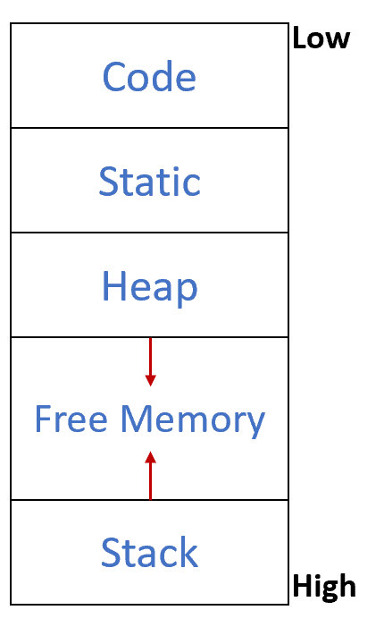

图表展示了一种典型的内存细分方式，从低地址（Low）到高地址（High）排列如下：

1. **代码区（Code）：**

* 存储可执行的目标机器代码。
* 通常在程序运行期间大小固定且是只读的。

2. **静态区（Static）：**

* 存储在**编译时就能确定大小**的数据对象。
* **例子：** 全局常量、全局变量，以及由编译器生成的元数据（例如为垃圾回收 GC 准备的数据）。

3. **堆区（Heap）：**

* 用于在**程序控制下**动态分配和释放的数据。
* **例子：** 在 C 语言中使用 `malloc` 申请、用 `free` 释放的空间。
* **增长方向：** 如图中箭头所示，堆通常向高地址方向（向下）增长。

4. **空闲内存（Free Memory）：**

* 堆和栈之间的未分配区域，供两者动态扩展。

5. **栈区（Stack）：**

* 存储被称为**活动记录（Activation Records）**的数据结构。
* 每当发生**过程调用（Procedure Calls）**时，就会生成对应的活动记录（包含局部变量、返回地址等）。
* **增长方向：** 栈通常从高地址向低地址方向（向上）增长。

---

## 活动记录（Activation Records）

**为什么需要活动记录？**

```verilog
function f(x:int): int = 
  let var y :== x+x
   in if y<10 
     then f(y)
     else return y-1
  end 
```

1. 递归与变量的多重实例

* **代码示例：** 函数 `f(x)` 内部又调用了 `f(y)`。
* **核心矛盾：** 在递归调用中，同一个函数被多次调用但尚未返回。这意味着内存中会同时存在多个参数 `x` 的实例。
* **结论：** 每次调用函数 `f` 时，都会创建一个新的 `x` 实例（由调用者初始化）。

2. 局部变量的生命周期

* 在 C、Java 等大多数语言中，局部变量在函数返回时被销毁。
* **如何保存这些变量？** 既然函数调用遵循**后进先出（LIFO）**的模式（最后被调用的函数最先执行完并返回），那么使用 **栈（Stack）** 这种数据结构来管理局部变量是最理想的选择。

**活动记录的具体运行机制**

1. 控制栈（Control Stack）

* 函数（过程）的调用和返回由一个名为**控制栈**的运行时栈来管理。
* **入栈（Push）：** 每当一个过程被**调用**时，系统会在栈顶为其局部变量分配空间。
* **出栈（Pop）：** 当过程**终止（返回）**时，这部分空间会被释放。

2. 活动记录（Activation Record / Frame）

* **定义：** 每一个正在执行中的过程（Live Activation）在控制栈上占据的一块连续空间，就称为**活动记录**，也常被称为**栈帧（Frame）**。

**包含内容：**

* **参数**（传给函数的输入）。
* **返回地址**（函数结束后程序该跳回到哪执行）。
* **局部变量**（函数内部定义的临时数据）。
* **控制链/状态值**（用于恢复调用者的环境）。

---

### 高阶函数（Higher-Order Functions）

当函数可以作为返回值或者嵌套定义时，传统的“栈”结构可能就不够用了。

1. 栈的前提假设

* **栈的局限：** 我们之所以能使用栈，是基于一个假设——**局部变量在函数返回后就不再需要了**。
* **冲突点：** 在支持 **嵌套函数（Nested Functions）** 和 **函数作为变量（Function-valued variables）** 的语言中，函数返回后，它的局部变量可能仍然需要被访问。

2. 闭包（Closure）的例子

```ML
fun f(x) =
  let fun g(y) = x+y 
    in g 
  end
 
val h = f(3) 
val j = f(4)
 
val z = h(5) 
val w = j(7) 
```

* 函数 `f(x)` 内部定义了 `g(y)`，并且 `f` 返回了函数 `g`。
* 注意 `g` 内部使用了 `f` 的参数 `x`（即 `x + y`）。
* 当执行 `val h = f(3)` 时，`f` 已经执行完毕并返回了。
* 但当我们随后调用 `h(5)` 时，它仍然需要用到之前 `f` 调用时的 `x = 3`。

此时局部变量 `x` 的**生命周期（Lifetime）**比创建它的函数调用更长。如果 `x` 存在栈上，`f` 返回时 `x` 就被销毁了，导致 `h(5)` 无法正常工作。

---

#### 语言特性对比与存储选择

| 特性 | Pascal | Tiger | C | ML | Scheme |
| :--- | :---: | :---: | :---: | :---: | :---: |
| **嵌套函数** | ✓ | ✓ | ✗ | ✓ | ✓ |
| **返回函数** | ✗ | ✗ | ✓ | ✓ | ✓ |

* **Pascal / Tiger：** 支持嵌套但不允许返回函数。这意味着局部变量永远不会“逃逸”出定义域，因此**可以使用栈**。
* **C 语言：** 不支持嵌套函数（虽然可以返回函数指针，但函数指针指向的是全局代码段），因此也**可以使用栈**。
* **ML / Scheme：** 既支持嵌套又支持返回函数。这意味着会产生“闭包”，**不能仅依靠栈来保存所有局部变量**。

**Pascal/Tiger/C：** 局部变量的生命周期与函数调用完全同步，使用栈分配效率最高。

**ML/Scheme：** 由于存在高阶函数，必须将那些“逃逸”的变量分配在**堆（Heap）**上，或者使用更复杂的逃逸分析（Escape Analysis）来决定分配位置。

---

### Stack Frame

虽然逻辑上栈只能 `push` 和 `pop`，但实际运行中：

* **大批量处理：** 局部变量不是一个一个入栈的，而是在进入函数时“砰”地一下分配出一大块空间。
* **随机访问需求：** 编译器需要随时读写栈深处的某个变量，而不仅仅是栈顶。

我们把栈看作一个**巨大的数组（Big Array）**。

* **Stack Pointer (SP)：** 一个专门的寄存器，指向当前已分配空间的边界（栈顶）。如图所示，SP 以上是已分配的数据，以下是垃圾数据（空闲空间）。

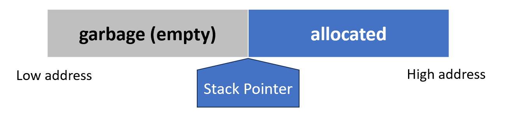

函数调用的宏观行为：

* **进入函数（Entry）：** 栈指针向下移动（在 x86 等架构中栈向低地址增长），预留出足够装下所有局部变量的空间。这个动作叫“增长”。
* **退出函数（Exit）：** 在返回之前，栈指针向上回退相同的偏移量。这个动作叫“收缩”。
* **定义：** 这一块被分配出来的、专门给某个函数使用的区域，就叫**活动记录（Activation Record）**或**栈帧（Stack Frame）**。

---

#### 栈帧的典型布局

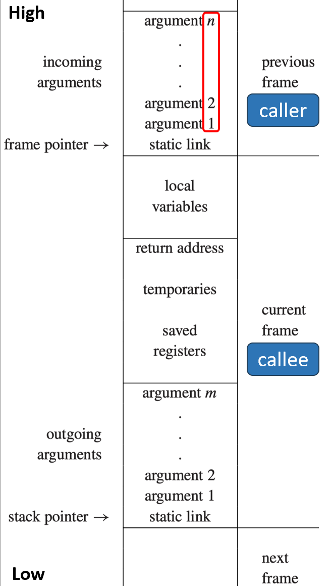

从高地址到低地址排列如下：

1. **Incoming Arguments（输入参数）：** 由调用者（Caller）传进来的参数。
2. **Frame Pointer (FP)：** 指向栈帧的一个固定基准点。
3. **Local Variables（局部变量）：** 函数内部定义的变量。
4. **Return Address（返回地址）：** 记录函数执行完后该跳回代码的哪一行。
5. **Temporaries（临时变量）：** 复杂的表达式计算（如 `(a+b)*(c+d)`）产生的中间结果。
6. **Saved Registers（保存的寄存器）：** 如果该函数要用某些通用寄存器，必须先备份调用者之前存在里面的值，等执行完再恢复。
7. **Outgoing Arguments（输出参数）：** 如果该函数又要调用别的函数，它会在这里准备好给下一个函数的参数。
8. **Static Link（静态链）：** 用于访问嵌套函数外层的变量（解决我们之前讨论的闭包/嵌套问题）。每当一个嵌套函数（比如 $g$）被调用时，系统会在它的栈帧里存一个额外的指针，这个指针指向它逻辑上的“父亲”（定义它的那个函数）的栈帧基准点（FP）。

---

#### 全局视野下的栈帧

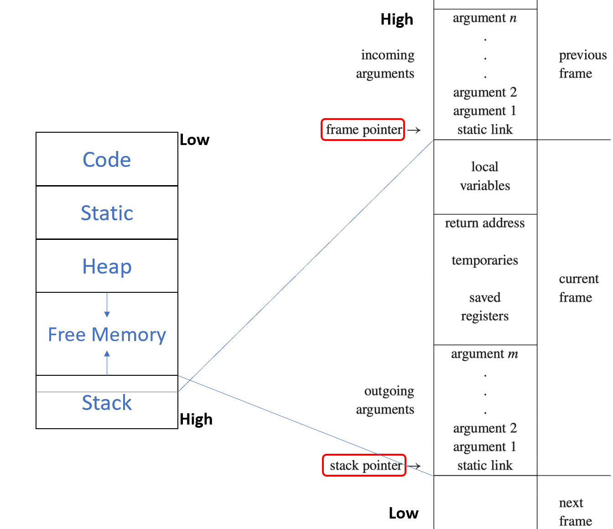

**左图：** 宏观地图。你可以看到 **Stack（栈）** 位于高地址区，并向上（朝向低地址的堆）增长。

**右图：** 局部放大。它展示了 `frame pointer` 和 `stack pointer` 之间的区域正好就是一个完整的 `current frame`。
    
* **Frame Pointer (FP)：** 像一个“锚点”，它是固定的，编译器通过 `FP + 偏移量` 来找参数，通过 `FP - 偏移量` 来找局部变量。
* **Stack Pointer (SP)：** 始终指向栈的最底端（当前分配的极限）。

---

### Frame Pointer (FP)

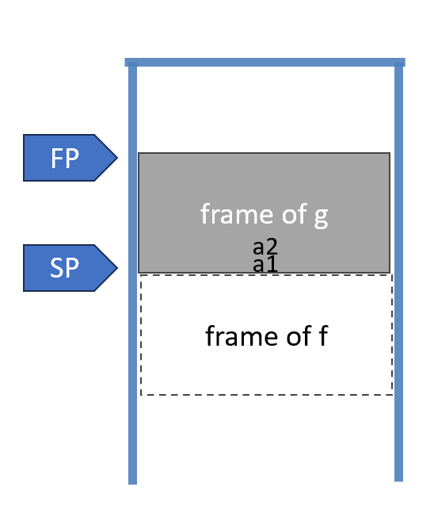

调用发生时（g 调用 f）：

* **初始状态：** `FP` 指向 `g` 的基准位置，`SP` 指向 `g` 栈帧的末尾。
* **传递参数：** `g` 在自己的 `outgoing arguments` 区域放好参数 $a_1 \dots a_n$。
* **指针位置：** 此时 `SP` 恰好指向 `g` 传给 `f` 的第一个参数的位置。
* **即将发生的动作：** `f` 将会被分配一个大小为 `framesize` 的新空间。

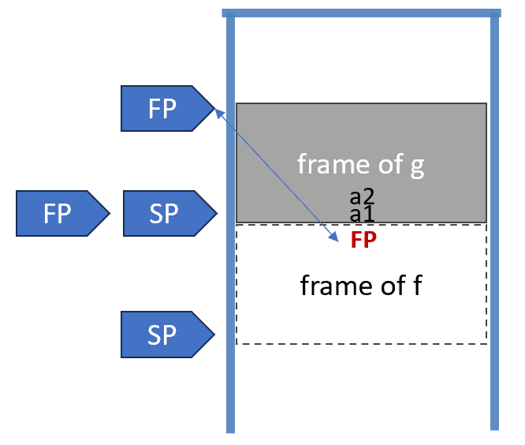

进入与退出（FP 的维护逻辑）

**当进入 f 时 (Enter f):**

1. **保存旧 FP：** `f` 第一件事就是把 `g` 的 `FP` 值存到内存里（通常就在当前 `SP` 指向的位置，也就是说把值（旧 FP）放进 SP 指向的地址，因为这是栈上目前唯一确定的、还没被占用的空位）。**这是为了以后能“回得去”**。
2. **更新 FP：** `FP = SP`。现在 `FP` 正式指向 `f` 的起始基准点。
3. **分配空间：** `SP = SP - #framesize`。栈指针向下移动，为 `f` 的局部变量开辟空间。

**当 f 返回时 (Exit f):**

1. **回收空间：** `SP = FP`。直接把 `SP` 拨回到基准点，`f` 的局部变量瞬间“失效”。
2. **恢复旧 FP：** 从内存中把刚才存的 `g` 的 `FP` 值读取回来，重新赋给 `FP` 寄存器。这样一来，控制权交回 `g` 时，`FP` 和 `SP` 都恢复到了调用前的样子。*

**特殊情况：**如果帧大小是固定的，编译器可以省点事，让 `FP` 成为一个“虚拟”寄存器，直接通过 `SP + 固定偏移量` 来计算，不需要专门存取。

---

### Registers

现代 CPU 通常有 32 个左右的寄存器，但程序中会有成百上千个变量，因此必须有一套规则来决定谁能占用寄存器，以及冲突了怎么办。

* **保存规则（Save/Restore）：** 如果函数 $f$ 正在用寄存器 $r$，而它要调用的 $g$ 也要用 $r$，那么 $r$ 的值必须先存入栈（内存）中，用完再取回。
* **Caller-save (调用者保存)：** 由 $f$ 负责。$f$ 想：“我不放心 $g$，我先把我的值存好。”
* **Callee-save (被调用者保存)：** 由 $g$ 负责。$g$ 想：“我要用这个寄存器，但我得先把 $f$ 留下的值存好，等我走的时候再还给它。”

---

### Parameter Passing

以前的编译器把所有参数都压入栈，这会产生大量的内存往返（Traffic）。现代机器的约定是：

* **前 $k$ 个参数进寄存器：** 通常前 4 到 6 个参数直接放在寄存器（如 $r_1 \dots r_k$）里。
* **剩下的进栈：** 只有参数太多放不下时，才动用内存。
* **潜在问题：** 如果 $f$ 收到参数在 $r_1$ 里，但它又要调用 $h$ 且把新参数传给 $h$（也得占 $r_1$），那么 $f$ 还是得先把旧值存到栈帧里。

**寄存器如何节省时间？**

1. **叶子过程（Leaf procedures）：** 那些不再调用别人的函数。它们收到的参数可以直接在寄存器里处理，处理完直接返回，**全程不碰内存**。
2. **跨过程寄存器分配（Interprocedural register allocation）：** 编译器分析整个程序，给不同的函数分配不同的寄存器，让它们尽量互不干扰。
3. **死变量（Dead variable）：** 如果变量 $x$ 在调用 $h(z)$ 后就再也不用了，那 $f$ 就不需要保存它，直接让 $h$ 覆盖掉即可。
4. **寄存器窗口（Register windows）：** 某些架构（如 SPARC）在硬件上提供多组寄存器，切换函数时就像转动转盘一样切换到新的一组，彻底消除内存往返。

---

### Return Address

当函数 $f$ 执行完，它得知道跳回哪儿（通常是 $g$ 中 `call` 指令的下一条地址 $a+1$）。

* **寄存器存放：** 现代机器通常先把返回地址存在一个**专用寄存器**里（例如 MIPS 的 `$ra`）。
* **栈存放：** 

1. **非叶子过程：** 如果 $f$ 还要调别的函数，它必须把当前的 `$ra` 存入栈，否则新的调用会覆盖掉它。
2. **叶子过程：** 还是那句话，它不调别人，所以 `$ra` 留在寄存器里就行，省去了存取内存的开销。

---

### Frame-Resident Variables

编译器总是希望：

* **参数、返回地址、函数结果**全部走寄存器。
* **局部变量和中间结果**也尽量塞进寄存器。

但总有一些变量，寄存器装不下或者不方便装。

变量必须“下放”到内存的 6 种情况：

1. **引用传递（Passed by reference）：** 如果变量要传给另一个函数做引用（比如 C 语言的 `scanf("%d", &a)`），它必须有一个**确定的内存地址**。寄存器是没有地址的。
2. **嵌套访问（Accessed by nested procedure）：** 如果外层函数的变量要被内层嵌套函数访问，通常需要把它放在内存里，方便内层函数顺着链条去找。
3. **体积太大（Too big）：** 变量是个大结构体或大对象，一个寄存器（通常 4/8 字节）根本装不下。
4. **数组（Array）：** 数组涉及下标运算（寻址），寄存器无法像内存那样进行基址+偏移量的索引操作。
5. **寄存器被挪作他用：** 有些寄存器有特殊使命（如传参或保存返回地址）。如果为了完成这些使命必须清空寄存器，原来的变量就得临时回内存“躲一躲”。
6. **寄存器溢出（Spilling）：** 这是最常见的原因。寄存器就那么 32 个，如果你有 100 个局部变量，剩下的 68 个只能“溢出”到栈帧里。

---

#### Escape Analysis

如果一个变量符合以下特征，我们就说它**“逃逸”了**：

* 它是通过引用传递的。
* 它的地址被取走了（使用了 C 的 `&` 运算符）。
* 它被一个嵌套函数访问了。

**核心准则：凡是“逃逸”的变量，必须写回内存。**

---

### Block Structure

* **块结构语言：** 如 Pascal、ML、Tiger 等，允许在函数内部声明函数。
* **核心需求：** 内部函数必须能够访问外部函数声明的变量。这在代码层面看（静态看）是很自然的，但在运行时（动态看），这些变量可能散落在栈的不同位置。

---

#### Implementing Block Structures

**1. 静态链 (Static Link)**

* **做法：** 每次调用函数 $f$ 时，额外传一个指针给它。
* **指向：** 这个指针指向在代码文本中“包围” $f$ 的那个函数的栈帧。
* **特点：** 简单直接，但如果要访问很外层的变量，需要沿着链条走好几步（多次内存间接寻址）。

**2. Display 表 (Display)**

* **做法：** 维护一个全局数组（即 Display 表）。
* **内容：** `Display[i]` 指向当前嵌套深度为 $i$ 的最活跃函数的栈帧。
* **特点：** 访问变量速度极快（一次索引即可），但函数进入和退出时维护这个全局数组的开销较大。

**3. Lambda 提升 (Lambda Lifting)**

* **做法：** 既然内部函数要用外部的变量，干脆把这些变量变成参数传给它。
* **过程：** 如果 $f$ 嵌套在 $g$ 中且用到了 $g$ 的变量，$g$ 调用 $f$ 时就把这些变量当做**额外参数**传进去。
* **特点：** 彻底消除了嵌套寻址的麻烦，但在深层嵌套或变量很多时，会导致参数列表变得非常臃肿。

---

### Static Link

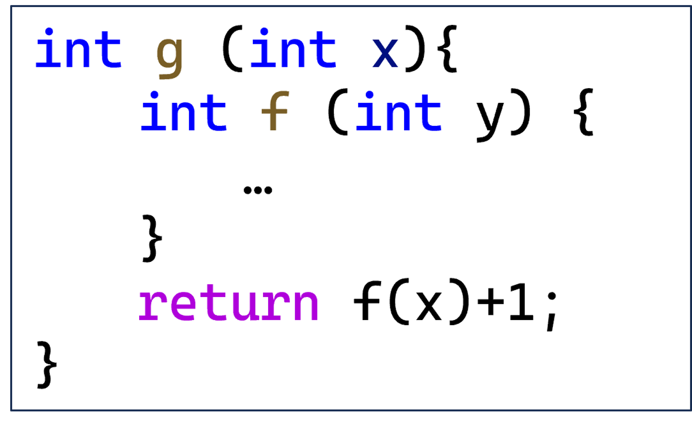

* **代码场景：** 函数 $f$ 被定义在函数 $g$ 内部。
* **运行逻辑：** 当 $g$ 内部执行 `return f(x) + 1` 时：

1. $g$ 正在运行，它有自己的栈帧。
2. $g$ 调用 $f$，除了传参数 $x$，还会偷偷传一个**指向 $g$ 自己栈帧开头（FP）的指针**给 $f$。
3. $f$ 拿到这个指针后，存入自己的 `static link` 区域。

* **结果：** 以后 $f$ 只要想用 $g$ 里的东西，看一眼自己的静态链就知道往哪跳了。

---

#### Example

```c
type tree = {key: string, left: tree, right: tree}
function prettyprint(tree: tree) : string =
  let
    var output := “”  
    function write(s: string) = 
      output := concat(output,s)

    function show(n:int, t: tree) =
      let function indent(s: string) =
            (for i := 1 to n
             do write(“ ”));
             output := concat(output, s);
             write("\n"))
      in if t=nil 
         then indent(".")
         else (indent(t.key));
               show(n+1, t.left);
               show(n+1, t.right))
      end
    in show(0, tree); output
  end
```

这里的嵌套结构是：`prettyprint` -> `show` -> `indent`。

1. 静态链的建立（直接嵌套）

内部函数（如 `write` 和 `indent`）如何访问外层的变量 `output` 和参数 `n`？

* **动作：** `prettyprint` 调用 `show`。
* **逻辑：** 因为 `show` 在代码文本里是直接写在 `prettyprint` 里面的，所以 `prettyprint` 就是 `show` 的“直系父亲”。
* **实现：** `prettyprint` 在调用 `show` 时，会把**自己的帧指针（FP）**传给 `show` 作为静态链。

---

2. 静态链的使用（跨层访问）

* **场景：** `indent` 需要访问 `show` 里的参数 `n`。
* **路径：** `indent` 的栈帧里存着指向 `show` 栈帧的静态链。它只需要根据这个指针，再加上一个确定的偏移量（Offset），就能精准捞到 `n`。
* **更难的挑战：** `indent` 如果要访问最外层的 `output` 怎么办？
    * **步骤：** `indent` 先看自己的静态链找到 `show`，再看 `show` 栈帧里的静态链找到 `prettyprint`，最后在 `prettyprint` 里的固定位置取回 `output`。这就是**沿着链条回溯**。

3. 静态链的“接力”

* **背景：** `indent` 和 `write` 是“叔侄”关系（`write` 是 `prettyprint` 的儿子，`indent` 是 `show` 的儿子）。
* **难题：** `indent` 调用 `write` 时，必须给 `write` 传一个指向 `prettyprint` 的指针。
* **解决：** `indent` 知道自己的“父亲”是 `show`，“爷爷”是 `prettyprint`。所以它从自己的静态链（指向 `show`）出发，找到 `show` 里的静态链（指向 `prettyprint`），然后把这个“爷爷的地址”传给 `write`。

4. 递归调用中的静态链

当 `show` 递归调用自己（`show(n+1, ...)`）时：

* **关键点：** 它传给下一个 `show` 的静态链，**不是它自己的 FP，而是它当前的静态链（即指向 `prettyprint` 的那个指针）**。
* **原因：** 所有的 `show` 实例（无论递归多少层）在文本上都被 `prettyprint` 包围，它们的“父亲”始终是同一个 `prettyprint` 实例。

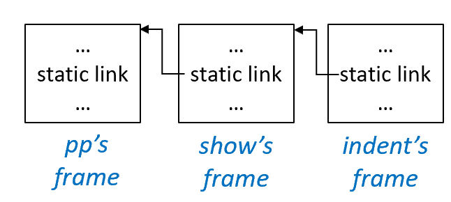

> 静态链的根本目的是帮助内部函数找到它所在的外层作用域中的变量。

---

### 运行时维护

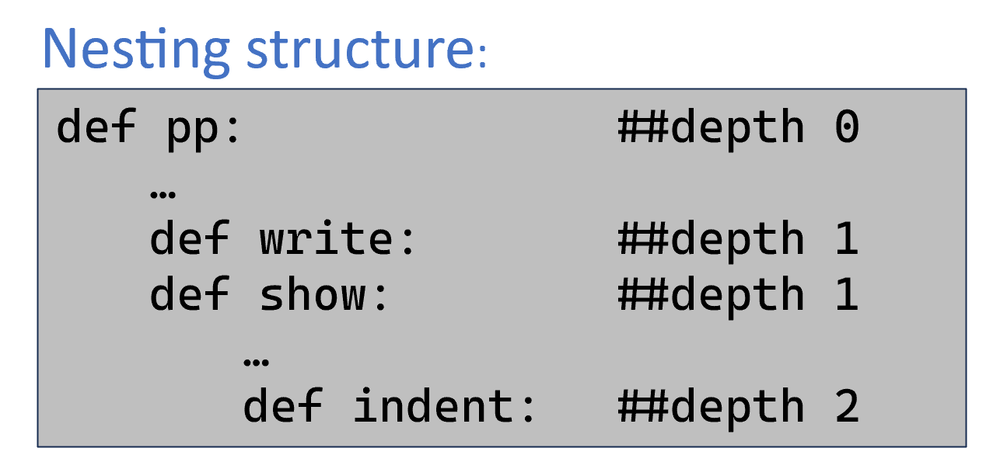

**核心结论：** 访问链的长度（即需要 fetch 的次数）等于 **两个相关函数之间静态嵌套深度的差值**。

**场景 A：pp 调用 show**

* **深度差：** $1 (\text{show}) - 0 (\text{pp}) = 1$。
* **操作：** 虽然深度差是 1，但由于这是直接调用嵌套子函数，`pp` 只需要直接把自己的 `FP` 传给 `show` 即可。对于 `show` 来说，它获取“父亲”环境的步数是 **0**（因为它直接拿到了）。

**场景 B：indent 调用 write**

* **计算：** `indent` 深度为 2，`write` 所在的嵌套层级（由 `pp` 包围）深度为 1。
* **逻辑：** `indent` 必须给 `write` 传递 `pp` 的地址。
* **跳转：** $2 (\text{indent}) - 0 (\text{pp}) = 2$。
* **过程：** `indent` 先通过自己的静态链找到 `show`（第 1 跳），再从 `show` 的静态链找到 `pp`（第 2 跳）。拿到的这个 `pp` 地址就是传给 `write` 的静态链。

**场景 C：write 访问 pp 中的变量**

* **计算：** $1 (\text{write}) - 0 (\text{pp}) = 1$。
* **过程：** `write` 只需要沿着自己的静态链“跳” **1** 次，就能到达 `pp` 的栈帧并取出 `output`。

**场景 D：show 递归调用 show**

* **计算：** $1 (\text{show}) - 0 (\text{pp}) = 1$。
* **过程：** 当前的 `show` 想要给下一个 `show` 传静态链。它需要传的是 `pp` 的地址。
* **逻辑：** 同样是跳 **1** 次拿到 `pp` 的地址传给新栈帧。

---

## Frames in The Tiger Compiler

```c
/* frame.h */
typedef struct F_frame_ *F_frame;
typedef struct F_access_ *F_access;
typedef struct F_accessList_ *F_accessList;
struct F_accessList_ {F_access head; F_accessList tail;};
F_frame F_newFrame(Temp_label name, U_boolList formals);
Temp_label F_name(F_frame f);
F_accessList F_formals(F_frame f);
F_access F_allocLocal(F_frame f, bool escape);
```

* **`frame.h`：** 这是一个**抽象接口**。它定义了编译器后端（IR 生成阶段）所需要的通用操作，而不关心具体的 CPU 是 MIPS 还是 x86。
* **模块化：** 具体的机器相关代码（如 `mipsframe.c`）会实现这个接口。这样做的好处是，当你想要支持新的 CPU 架构时，只需要更换对应的 `.c` 实现文件，而不需要改动编译器的主逻辑。

---

### 创建新栈帧 (`F_newFrame`)

* **`F_frame` 结构：** 它负责保存一个函数在运行时的所有关键信息（参数、局部变量等）。
* **`U_boolList formals`：** 这是一个布尔列表。
    * **TRUE：** 代表该参数**逃逸了**（必须存在内存栈里）。
    * **FALSE：** 代表该参数**没逃逸**（可以尝试留在寄存器里）。
* **示例：** 第一个参数逃逸，后两个不逃逸。

```c
F_newFrame(g, U_BoolList(TRUE, U_BoolList(FALSE,  U_BoolList(FALSE, NULL))))
```

---

### 访问方式 (`F_access`)

这是最重要的数据结构之一，它描述了一个变量到底被存在了哪里。

* **`InFrame(offset)`：** 变量存在内存中，相对于帧指针（FP）的偏移量是 `offset`。
* **`InReg(temp)`：** 变量存在一个名为 `temp` 的寄存器中。
* **抽象数据类型：** `F_access_` 的具体内部结构对外部是不可见的，只有 `Frame` 模块自己知道怎么读。

---

### `Shift of View`

同一个参数，从**调用者（Caller）**和**被调用者（Callee）**的角度看是不一样的：

1. **在栈上传递时：**

* 调用者通过**栈指针（SP）**计算偏移量来存。
* 被调用者通过**帧指针（FP）**计算偏移量来取。

2. **在寄存器上传递时：**

* 调用者可能觉得它放在了第 6 号寄存器。
* 被调用者因为内部逻辑，可能需要把它挪到第 13 号寄存器再用。

编译器在 `newFrame` 阶段必须计算并完成两件事：

1. **确定最终位置：** 决定这个参数到底该呆在寄存器还是栈帧内存里。
2. **生成转换指令：** 产生必要的代码指令，把参数从“调用者放置的位置”挪到“被调用者预期的位置”。

---

### Representation of Frame Descriptions

这里展示了 `F_frame` 结构体在不同硬件架构（Pentium, MIPS, Sparc）下的具体差异。

**F_frame 包含的内容：**

* 所有形式参数（formals）的存放位置。
* 实现“视角转换”（View Shift）所需的指令序列。
* 当前已分配的局部变量数量。
* 该函数机器代码起始处的标签（Label）。

**架构差异对比：** * **Pentium (x86)：** 参数主要通过栈传递（`InFrame`），偏移量从 8 开始。

* **MIPS：** 第一个参数可能在栈里（如果逃逸），后续参数则尽量放在寄存器（`InReg`）里。
* **视角转换指令：** 可以看到 MIPS 和 Sparc 需要显式地将寄存器参数（如 `r4`, `r5`）移动到编译器分配的临时变量（`t157`, `t158`）中。

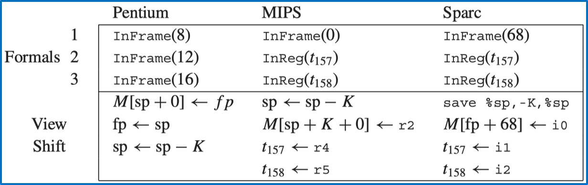

---

### Local Variables

**分配接口：** 调用 `F_allocLocal(f, escape)`。

* 如果 `escape` 为真，在栈帧内存中开辟空间。
* 如果为假，则分配一个虚拟寄存器。

**块结构中的变量复用：** 变量 `v` 在不同的 `{}` 块中被多次声明。

* **朴素做法：** 为每一个声明都分配独立的栈空间。
* **优化做法：** 寄存器分配器（Register Allocator）或聪明的编译器会发现，由于不同块里的 `v` 生命周期不重叠，它们可以**共用同一个寄存器或同一个栈槽（Stack Slot）**。这能显著缩小栈帧体积。

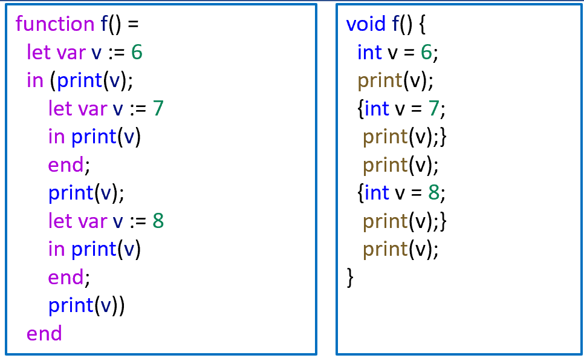

---

### Calculating Escapes

1. 遍历整个**抽象语法树（AST）**。
2. 维护一个环境（Environment），记录每个变量声明时的**嵌套深度 $d$**。
3. **判定规则：** * 当变量 $a$ 在深度 $d$ 被声明。

* 如果在深度 $d' > d$ 的地方使用了 $a$（即被内层嵌套函数引用了）。
* 则将该变量的 `escape` 标记设为 **True**。

**其他情况：** 显式取地址（`&a`）或传引用参数也会导致变量逃逸。

---

### Temporaries and Labels

在编译的早期阶段，我们还不知道变量最终会进哪个物理寄存器，也不知道代码最终会加载到内存的哪个具体地址，因此需要这些“占位符”。

1. 临时变量 (Temporaries)

* **定义：** 它是局部变量的**抽象名称**。
* **用途：** 在语义分析和中间代码生成阶段，我们假设机器有无限多个寄存器。每一个局部变量或表达式的中间结果都分配给一个唯一的 `Temp`。
* **后续处理：** 只有到了最后的“寄存器分配（Register Allocation）”阶段，编译器才会尝试把这些成千上万个 `Temp` 映射到有限的（如 32 个）物理寄存器上。
* **接口：** `Temp_newtemp()` 用于生成一个全新的、不重复的临时变量。

2. 标签 (Labels)

* **定义：** 它是静态内存地址（如函数入口、跳转目标、全局变量）的**抽象名称**。
* **用途：** 当你写 `if` 语句跳转或者调用函数时，目标地址在编译时是未知的。编译器先给这些地方贴上“标签”。
* **后续处理：** 汇编器（Assembler）或链接器（Linker）最后会把这些标签替换为真实的机器地址。
* **接口：**
    * `Temp_newlabel()`：生成一个唯一的匿名标签（用于循环、分支）。
    * `Temp_namedlabel(string)`：生成一个带名字的标签（用于函数名，方便调试和链接）。

> 在不同作用域中可能有同名的函数。通过标签机制，编译器可以给它们加上前缀或后缀，确保在最终的汇编代码里，每一个地址引用都是**全球唯一**的。

---

### Two Layers of Abstraction

简单来说，编译器通过 `Frame` 模块处理**机器相关**的细节（如寄存器、栈偏移），而通过 `Translate` 模块处理**语言相关**的逻辑（如嵌套作用域、静态链）。

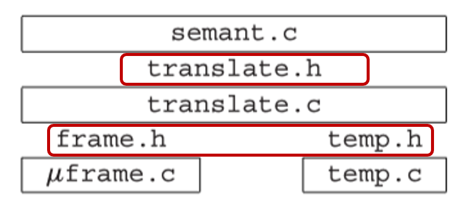

这张图展示了编译器后端各个模块的依赖关系：

* **`semant.c` (语义分析)**：位于最顶层，负责逻辑判断。
* **`translate.h/c` (翻译层)**：作为中介，增加了处理**嵌套作用域（Nested Scopes）**的能力。
* **`frame.h` & `temp.h` (物理抽象层)**：底层的基石，屏蔽了具体硬件（如 MIPS 或 x86）的差异。
* **`μframe.c` & `temp.c`**：具体机器码的实现。

为什么需要 `Translate` 层？

之前的 `Frame` 模块只管“给变量找个坑”，但它不知道这些坑之间在代码逻辑上的父子关系。

* **核心目标：** 处理**嵌套作用域**。
* **必要性：**

1. **实现块结构**：让内部函数能通过静态链找到外部函数的变量。
2. **计算逃逸变量**：在不同嵌套深度之间传递引用时，确定变量是否必须进栈。

* **实现手段：** 创建**嵌套层次（Nesting Levels）**，并将每一个函数和变量都关联到一个特定的 Level 上。

---

### Managing Static Links

* **解耦原则**：`Frame` 模块的目标是与具体的源语言无关。许多语言（如 C 语言）并没有嵌套函数，因此不需要静态链。
* **Translate 的角色**：`Translate` 了解源语言（如 Tiger 或 Pascal）是否有嵌套结构。

**实现方式**：

* `Translate` 会把**静态链当作一个普通的隐藏参数**来处理。
* 在调用函数时，静态链通过寄存器传递，并最终存储在栈帧（Frame）中。
* **结论**：编译器会尽可能地**将静态链视为该函数的第一个参数**（即第 0 个实参）。

---

#### 获取参数列表 (`Tr_formals`)

`Semant`（语义分析）模块如何通过 `Translate` 获取参数信息。

* **`Tr_formals(level)`**：这个接口函数会返回该层级下所有参数的访问信息（`Tr_accessList`）。
* **包含隐藏参数**：由于静态链被视为参数，`Tr_formals` 返回的列表开头通常就是静态链的访问信息，随后才是程序员在代码中定义的原始参数。
* **意义**：这让 `Semant` 在处理函数体时，可以像访问普通局部变量一样，通过这组 `access` 值找到静态链和参数。

---

### Keeping Track of Levels

在一个复杂的嵌套结构中，必须有一个“根部”。

* **`Tr_outermost()`**：返回编译环境的最顶层（Outermost Level）。
* **主程序的位置**：Tiger 语言的主程序就嵌套在这个最外层级之中。
* **库函数（Library functions）**：所有的内置库函数（如 `print`, `concat`）都声明在这个层级。
* **特殊性**：最外层是一个逻辑上的“容器”，它本身**不包含**物理栈帧（Frame），也没有形式参数列表。

---