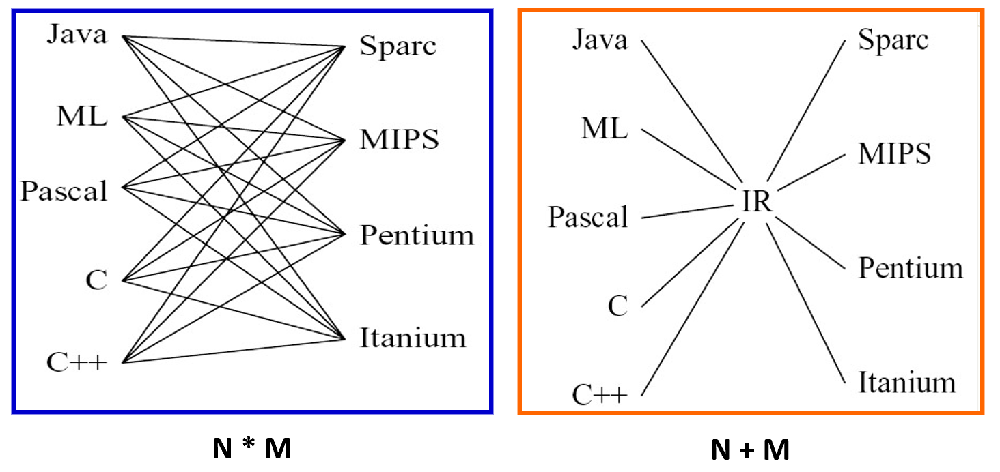
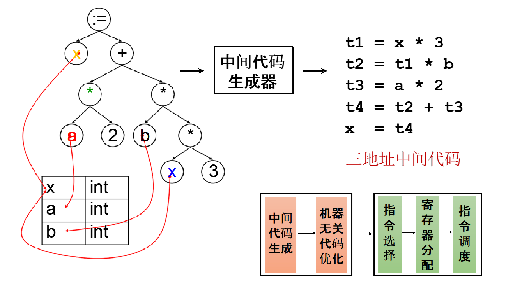
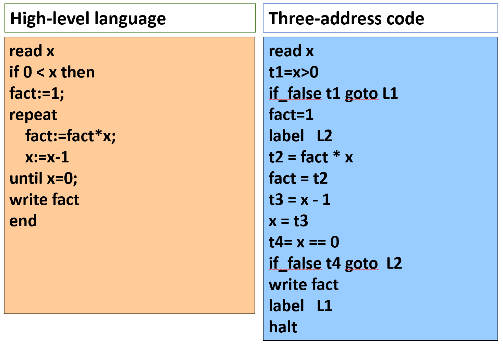

# Chapter 7 | Interm. Code

## What is Intermediate Representation?

### IR 的定义：一种“抽象机器语言”

IR 位于源代码（如 C++, Java）和机器代码（如 x86, ARM 汇编）之间。

* **抽象性**：它表达了目标机器的操作（如加法、跳转、内存加载），但**不会陷入特定机器的细节**（比如具体有多少个寄存器、指令的二进制编码格式等）。
* **独立性**：它既不依赖于具体的源语言语法，也不依赖于特定的硬件架构。这使得 IR 成为连接前端（语言解析）和后端（代码生成）的“桥梁”。

---

### 常见的 IR 类型

编译器根据不同的优化需求，会使用不同形态的 IR：

* **三地址码 (Three-Address Code, TAC)**：每条指令最多包含三个操作数（例如 `x = y + z`）。这种形式非常接近汇编，便于进行简单的代码优化。
* **静态单赋值 (Static Single-Assignment, SSA)**：要求每个变量只能被赋值一次。这是现代编译器（如 LLVM, GCC）最常用的 IR，极大地方便了复杂的流分析和优化。
* **控制流图 (Control Flow Graph, CFG)**：用图结构表示程序执行的所有可能路径，节点通常是基本块（Basic Blocks）。
* **抽象语法树 (Abstract Syntax Tree, AST)**：更接近源代码结构的树状表示，常用于前端语法检查。
* **表达式树 (Expression Trees / IR Tree)**：Tiger 编译器（经典的编译器教材《Modern Compiler Implementation》中的示例）使用这种形式。

---

## Motivation

### 直接翻译的弊端

如果让每种编程语言直接翻译成每种硬件的机器码，会面临两个严重问题：

* **模块化差 (Hinders modularity)**：前端（理解语言）和后端（生成代码）耦合在一起，修改一个就得动另一个。
* **可移植性差 (Hinders portability)**：每增加一种新语言或一种新芯片，工作量都会呈爆炸式增长。

---

### 效率的对比：$N \times M$ vs $N + M$



**左图 ($N \times M$ 模式)**：

* 假设有 $N$ 种语言（Java, ML, Pascal, C, C++）和 $M$ 种处理器（Sparc, MIPS, Pentium, Itanium）。
* 如果没有中间表示，你需要为每一对“语言-机器”组合编写一个独立的编译器。
* **总工作量 = $N \times M$**。如果你有 5 种语言和 4 种机器，你需要写 20 个编译器。

**右图 ($N + M$ 模式)**：

* 引入 **IR** 作为核心标准。
* **前端工作**：只需将 $N$ 种语言分别翻译成同一种 IR。
* **后端工作**：只需将这一种 IR 翻译成 $M$ 种机器码。
* **总工作量 = $N + M$**。同样的情况下，只需要 5 个前端 + 4 个后端 = 9 个组件。

---

## Three-Address Code

### 什么是三地址码？



图示展示了从高级抽象到低级表示的转化。

* **核心定义**：每条指令最多只能包含 **3个操作数地址**（通常是两个源操作数和一个目标操作数）。

**转化过程**：

* **左侧图**：是一个语法树（AST），代表一个复杂的算术表达式。
* **中间框**：中间代码生成器将这棵树“压平”。
* **右侧代码**：转化后的 TAC。你会发现复杂的表达式被拆解成了 `t1` 到 `t4` 等临时变量。例如 `t1 = x * 3`，这就是标准的三地址格式。

**符号表连接**：左下角的表格显示了变量 `x, a, b` 的类型信息（int），这是为了在生成 TAC 时进行类型检查和空间分配。

---

### 基本指令与灵活性

* **基本形式**：$x = y \text{ op } z$。
* **临时变量**：为了处理像 `2 * a + (b - 3)` 这样的一行表达式，TAC 必须引入**临时操作数**（Temporary operands），将其分步拆解为 $t1, t2, t3$。
* **非标准性**：TAC 没有全球统一的标准格式。不同的编译器会根据需要增加特殊的指令形式（如一元运算符 `t2 = -t1`），以支持特定语言的奇特特性。

---

### Example



这部分通过一个计算阶乘的程序片段，演示了如何将高级语言的**控制流**转化为 TAC。

* **输入输出**：`read x` 和 `write fact` 被直接映射为同名的 TAC 指令。
* **条件判断 (if)**：高级语言的 `if 0 < x` 被转化为：

1.  计算布尔值：`t1 = x > 0`
2.  跳转指令：`if_false t1 goto L1`（如果条件不成立，跳过中间部分）。

* **循环结构 (repeat...until)**：

1. 使用 `label L2` 标记循环体的开始。
2. 在循环末尾使用 `if_false t4 goto L2` 来决定是否继续循环。

**关键注释**：从 AST 构建 TAC 非常容易，因为它不需要太多上下文，且生成后的 TAC 方便后续进行机器无关的代码优化。

---

### Three-Address Code - Implementation

**存储结构**：通常使用**数组**或**链表**。

**四元组 (Quadruples)**：这是最常用的实现方式。

* 每个条目包含 4 个字段：**op**（操作符）, **arg1**, **arg2**, **result**。

**示例**：

* `t1 = x > 0` 在内部存储为 `(gt, x, 0, t1)`。
* 对于不足 3 个地址的指令（如跳转或赋值），多余的字段填入 `null` 或下划线 `_`。

```
t1=x>0                  (gt, x, 0, t1)
if_false t1 goto L1     (if_f, t1, L1, _)
fact=1                  (asn, 1, fact, _)
label L2                (lab, L2, _, _)
```

**其他实现**：

* **三元组 (Triples)**：不显式存储临时变量名，而是通过引用指令的编号来获取结果。
* **间接三元组 (Indirect Triples)**：在三元组的基础上增加了一个索引表，方便在优化阶段挪动指令顺序。

---

## Intermediate Representation Trees

### 为什么需要 IR 树？

1. **好的 IR 具备的品质：**

* **易于生成**：语义分析阶段能轻松产出。
* **易于翻译**：能顺利转化为任何目标机器语言。
* **含义简单清晰**：每个结构必须有明确的定义，这样优化器才好对其进行变形。

2. **处理“复杂效应”（Complex Effects, CE）：**

* **现状**：高级语言有复杂的结构（如数组下标计算、过程调用），而机器语言也有复杂的指令（如向量操作、张量指令）。但这两者的“复杂”是不对等的，不能直接对接。
* **解决方案**：IR 应该足够简单，像一堆**基础拼图块**（add, fetch, store, jump）。
* **过程**：先将 AST 的复杂指令“拆解”成简单的 IR 块，然后再将这些 IR 块“重新组合”成目标机器的高效指令。

---

### 表达式类（T_exp）

在 IR 树中，**表达式（Expressions）** 的特点是：**每个表达式都会返回一个值**，但也可能产生副作用。

* **CONST(i)**：整数常量。
* **NAME(n)**：汇编语言中的符号常量（标签）。
* **TEMP(t)**：临时变量，类似于机器里的虚拟寄存器。
* **BINOP(o, e1, e2)**：二元运算（如加减乘除、位运算、移位）。
* **MEM(e)**：**内存访问**。当它在 `MOVE` 的左边时代表“存入（Store）”，在其他地方代表“取回（Fetch）”。
* **CALL(f, l)**：函数调用。
* **ESEQ(s, e)**：这是一个组合块，先执行语句 `s`（产生副作用），再计算并返回表达式 `e` 的值。

---

### 语句类（T_stm）

**语句（Statements）** 的特点是：**只执行动作（副作用或控制流），不返回值**。

* **MOVE(TEMP t, e)**：将表达式 `e` 的结果存入临时变量 `t`。
* **MOVE(MEM(e1), e2)**：将 `e2` 的结果存入内存地址 `e1`。
* **EXP(e)**：计算表达式 `e` 并**丢弃结果**（只利用它的副作用，比如调用一个没有返回值的函数）。
* **JUMP(e, labs)**：无条件跳转到地址 `e`。
* **CJUMP(o, e1, e2, t, f)**：**条件跳转**。比较 `e1` 和 `e2`，满足条件 `o` 跳到标签 `t`，否则跳到 `f`。
* **SEQ(s1, s2)**：语句序列，先执行 `s1` 再执行 `s2`。
* **LABEL(n)**：定义一个位置标签，类似于汇编里的 `L1:`。

---