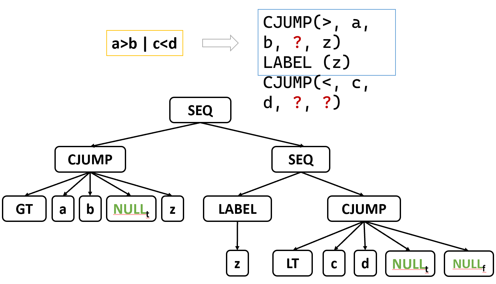
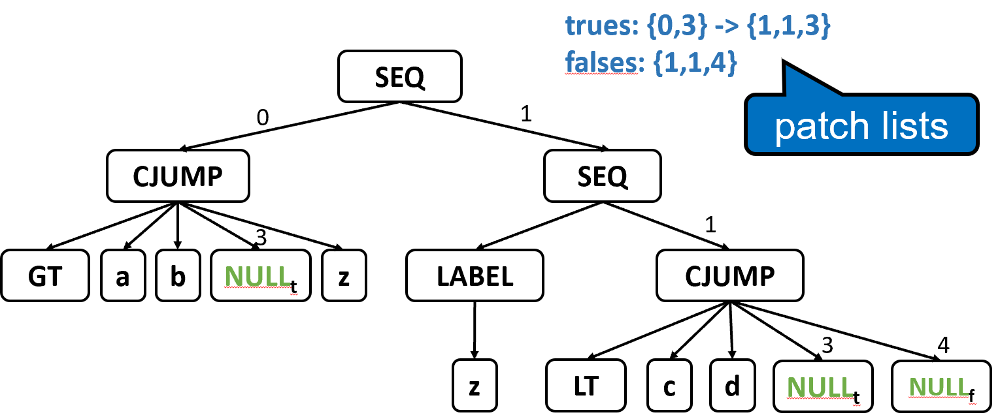
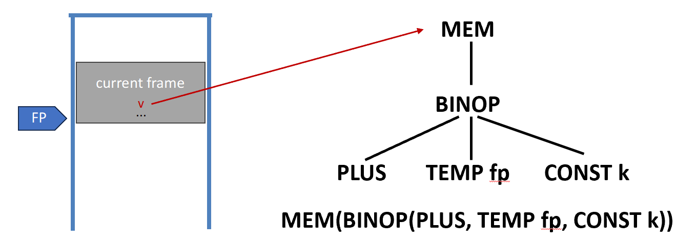
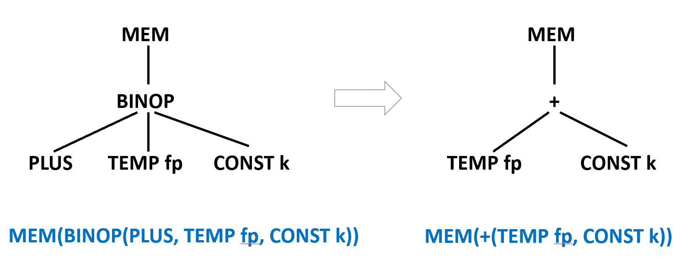
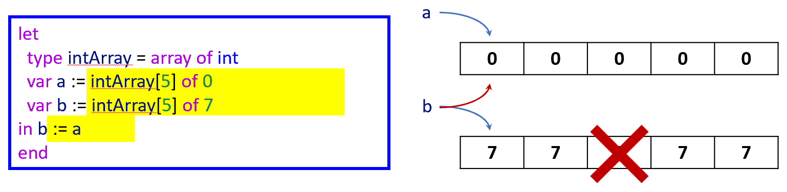
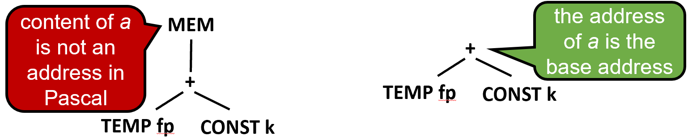
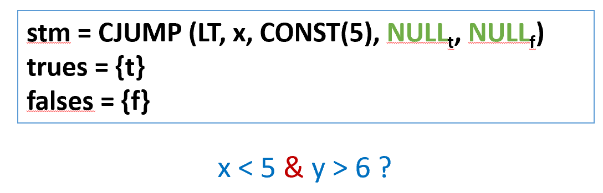

# Chapter 7 | Interm. Code

## What is Intermediate Representation?

### IR 的定义：一种“抽象机器语言”

IR 位于源代码（如 C++, Java）和机器代码（如 x86, ARM 汇编）之间。

* **抽象性**：它表达了目标机器的操作（如加法、跳转、内存加载），但**不会陷入特定机器的细节**（比如具体有多少个寄存器、指令的二进制编码格式等）。
* **独立性**：它既不依赖于具体的源语言语法，也不依赖于特定的硬件架构。这使得 IR 成为连接前端（语言解析）和后端（代码生成）的“桥梁”。

---

### 常见的 IR 类型

编译器根据不同的优化需求，会使用不同形态的 IR：

* **三地址码 (Three-Address Code, TAC)**：每条指令最多包含三个操作数（例如 `x = y + z`）。这种形式非常接近汇编，便于进行简单的代码优化。
* **静态单赋值 (Static Single-Assignment, SSA)**：要求每个变量只能被赋值一次。这是现代编译器（如 LLVM, GCC）最常用的 IR，极大地方便了复杂的流分析和优化。
* **控制流图 (Control Flow Graph, CFG)**：用图结构表示程序执行的所有可能路径，节点通常是基本块（Basic Blocks）。
* **抽象语法树 (Abstract Syntax Tree, AST)**：更接近源代码结构的树状表示，常用于前端语法检查。
* **表达式树 (Expression Trees / IR Tree)**：Tiger 编译器（经典的编译器教材《Modern Compiler Implementation》中的示例）使用这种形式。

---

## Motivation

### 直接翻译的弊端

如果让每种编程语言直接翻译成每种硬件的机器码，会面临两个严重问题：

* **模块化差 (Hinders modularity)**：前端（理解语言）和后端（生成代码）耦合在一起，修改一个就得动另一个。
* **可移植性差 (Hinders portability)**：每增加一种新语言或一种新芯片，工作量都会呈爆炸式增长。

---

### 效率的对比：$N \times M$ vs $N + M$


**左图 ($N \times M$ 模式)**：

* 假设有 $N$ 种语言（Java, ML, Pascal, C, C++）和 $M$ 种处理器（Sparc, MIPS, Pentium, Itanium）。
* 如果没有中间表示，你需要为每一对“语言-机器”组合编写一个独立的编译器。
* **总工作量 = $N \times M$**。如果你有 5 种语言和 4 种机器，你需要写 20 个编译器。

**右图 ($N + M$ 模式)**：

* 引入 **IR** 作为核心标准。
* **前端工作**：只需将 $N$ 种语言分别翻译成同一种 IR。
* **后端工作**：只需将这一种 IR 翻译成 $M$ 种机器码。
* **总工作量 = $N + M$**。同样的情况下，只需要 5 个前端 + 4 个后端 = 9 个组件。

---

## Three-Address Code

### 什么是三地址码？


图示展示了从高级抽象到低级表示的转化。

* **核心定义**：每条指令最多只能包含 **3个操作数地址**（通常是两个源操作数和一个目标操作数）。

**转化过程**：

* **左侧图**：是一个语法树（AST），代表一个复杂的算术表达式。
* **中间框**：中间代码生成器将这棵树“压平”。
* **右侧代码**：转化后的 TAC。你会发现复杂的表达式被拆解成了 `t1` 到 `t4` 等临时变量。例如 `t1 = x * 3`，这就是标准的三地址格式。

**符号表连接**：左下角的表格显示了变量 `x, a, b` 的类型信息（int），这是为了在生成 TAC 时进行类型检查和空间分配。

---

### 基本指令与灵活性

* **基本形式**：$x = y \text{ op } z$。
* **临时变量**：为了处理像 `2 * a + (b - 3)` 这样的一行表达式，TAC 必须引入**临时操作数**（Temporary operands），将其分步拆解为 $t1, t2, t3$。
* **非标准性**：TAC 没有全球统一的标准格式。不同的编译器会根据需要增加特殊的指令形式（如一元运算符 `t2 = -t1`），以支持特定语言的奇特特性。

---

### Example


这部分通过一个计算阶乘的程序片段，演示了如何将高级语言的**控制流**转化为 TAC。

* **输入输出**：`read x` 和 `write fact` 被直接映射为同名的 TAC 指令。
* **条件判断 (if)**：高级语言的 `if 0 < x` 被转化为：

1.  计算布尔值：`t1 = x > 0`
2.  跳转指令：`if_false t1 goto L1`（如果条件不成立，跳过中间部分）。

* **循环结构 (repeat...until)**：

1. 使用 `label L2` 标记循环体的开始。
2. 在循环末尾使用 `if_false t4 goto L2` 来决定是否继续循环。

**关键注释**：从 AST 构建 TAC 非常容易，因为它不需要太多上下文，且生成后的 TAC 方便后续进行机器无关的代码优化。

---

### Three-Address Code - Implementation

**存储结构**：通常使用**数组**或**链表**。

**四元组 (Quadruples)**：这是最常用的实现方式。

* 每个条目包含 4 个字段：**op**（操作符）, **arg1**, **arg2**, **result**。

**示例**：

* `t1 = x > 0` 在内部存储为 `(gt, x, 0, t1)`。
* 对于不足 3 个地址的指令（如跳转或赋值），多余的字段填入 `null` 或下划线 `_`。

```
t1=x>0                  (gt, x, 0, t1)
if_false t1 goto L1     (if_f, t1, L1, _)
fact=1                  (asn, 1, fact, _)
label L2                (lab, L2, _, _)
```

**其他实现**：

* **三元组 (Triples)**：不显式存储临时变量名，而是通过引用指令的编号来获取结果。
* **间接三元组 (Indirect Triples)**：在三元组的基础上增加了一个索引表，方便在优化阶段挪动指令顺序。

---

## Intermediate Representation Trees

### 为什么需要 IR 树？

1. **好的 IR 具备的品质：**

* **易于生成**：语义分析阶段能轻松产出。
* **易于翻译**：能顺利转化为任何目标机器语言。
* **含义简单清晰**：每个结构必须有明确的定义，这样优化器才好对其进行变形。

2. **处理“复杂效应”（Complex Effects, CE）：**

* **现状**：高级语言有复杂的结构（如数组下标计算、过程调用），而机器语言也有复杂的指令（如向量操作、张量指令）。但这两者的“复杂”是不对等的，不能直接对接。
* **解决方案**：IR 应该足够简单，像一堆**基础拼图块**（add, fetch, store, jump）。
* **过程**：先将 AST 的复杂指令“拆解”成简单的 IR 块，然后再将这些 IR 块“重新组合”成目标机器的高效指令。

---

### 表达式类（T_exp）

在 IR 树中，**表达式（Expressions）** 的特点是：**每个表达式都会返回一个值**，但也可能产生副作用。

* **CONST(i)**：整数常量。
* **NAME(n)**：汇编语言中的符号常量（标签）。
* **TEMP(t)**：临时变量，类似于机器里的虚拟寄存器。
* **BINOP(o, e1, e2)**：二元运算（如加减乘除、位运算、移位）。
* **MEM(e)**：**内存访问**。当它在 `MOVE` 的左边时代表“存入（Store）”，在其他地方代表“取回（Fetch）”。
* **CALL(f, l)**：函数调用。
* **ESEQ(s, e)**：这是一个组合块，先执行语句 `s`（产生副作用），再计算并返回表达式 `e` 的值。

---

### 语句类（T_stm）

**语句（Statements）** 的特点是：**只执行动作（副作用或控制流），不返回值**。

* **MOVE(TEMP t, e)**：将表达式 `e` 的结果存入临时变量 `t`。
* **MOVE(MEM(e1), e2)**：将 `e2` 的结果存入内存地址 `e1`。
* **EXP(e)**：计算表达式 `e` 并**丢弃结果**（只利用它的副作用，比如调用一个没有返回值的函数）。
* **JUMP(e, labs)**：无条件跳转到地址 `e`。
* **CJUMP(o, e1, e2, t, f)**：**条件跳转**。比较 `e1` 和 `e2`，满足条件 `o` 跳到标签 `t`，否则跳到 `f`。
* **SEQ(s1, s2)**：语句序列，先执行 `s1` 再执行 `s2`。
* **LABEL(n)**：定义一个位置标签，类似于汇编里的 `L1:`。

---

## Translation into IR Trees

### 表达式的种类 (Kinds of Expressions)

AST 表达式在中间代码层面的三种基本抽象：

**Ex (Expressions with return values):**

* 代表有返回值的表达式。
* 它会被翻译成 `T_exp` 指令。例如：`a + b`。

**Nx (No value):**

* 代表不返回值的表达式（或称为语句）。
* 它会被翻译成 `T_stm` 指令。例如：`while` 循环、不返回值的过程调用。

**Cx (Conditional jumps):**

* 代表布尔表达式（如 `a > b`）。
* 它不仅仅是一个简单的 0 或 1，而是一个**条件跳转**。
* 其内部表示包含：一条中间代码指令 `stm`，以及两个名为 `trues` 和 `falses` 的 **PatchList（回填列表）**。这些列表记录了当表达式为“真”或“假”时，程序应该跳往的目标标签。

---

#### 布尔表达式的 IR 树示例 (OR 逻辑)

逻辑“或”表达式 `a > b | c < d` 如何转化为 IR 树：

* **短路逻辑 (Short-circuiting):** 在 IR 层面，逻辑运算通常通过跳转实现。
* **左侧 `a > b`:** 使用 `CJUMP(GT, a, b, NULL_t, z)`。如果 `a > b` 为真，本应跳往真正的 `trues` 目标（目前填 `NULL`）；如果为假，则跳往标签 `z`。
* **右侧 `c < d`:** 标签 `z` 之后紧跟着对 `c < d` 的判断。如果 `c < d` 为真，跳往 `NULL_t`；为假，跳往 `NULL_f`。
* **结构:** 整个逻辑通过 `SEQ`（序列）节点连接，体现了“先判断左边，若失败再判断右边”的顺序。



---

#### 回填列表 (Patch Lists)

**核心矛盾:** 在翻译 `a > b` 时，编译器还不知道如果它是“真”，代码最终该跳到哪里（因为后面可能还有其他的逻辑判断或控制流）。

**解决方案:** * 编译器先留个空位（用 `NULL` 表示）。

* 维护两个列表：`trues` 列表记录了所有需要填入“真目标”的跳转指令位置；`falses` 列表记录“假目标”的位置。
* 图中展示了这些位置的索引（如 0, 3, 4），等到后续确定了具体的 `Label` 后，再统一将这些 `NULL` 替换掉。



---

### 表达式类型转换 (Conversion)

在实际代码中，不同种类的表达式经常需要互相转换。

**场景:** 比如 `flag := (a > b | c < d)`。

* 右边是一个 `Cx`（跳转逻辑）。
* 左边的 `flag` 需要一个具体的值（`Ex`，即 0 或 1）。

**方法:** 编译器需要一个专门的函数 `toEx(Cx)`，将原本用于跳转的逻辑“包装”成一个能产出 0 或 1 的 IR 片段。

---

#### 如何实现 toEx(Cx)

```
MOVE(TEMP r, 1)
Cx
LABEL(f)
MOVE(TEMP r, 0)
LABEL(t)
TEMP(r)
```

`toEx(Cx)` 的具体翻译模板，它使用了**临时寄存器 (Temporary Register)**：

1. **初始化:** 先把临时寄存器 `r` 设为 1（假设为真）。
2. **执行 Cx:** 运行那个条件跳转逻辑。
3. **假分支 (Label f):** 如果跳转逻辑走到了“假”的分支，则执行 `MOVE(TEMP r, 0)`，把寄存器改为 0。
4. **真分支 (Label t):** 无论走哪个分支，最后都会汇合。
5. **返回:** 最终这个表达式的值就是 `TEMP r`。

通过跳转和修改寄存器，把“控制流”变回了“数据流”。

---

#### 综合示例 (Complete Example)

将 `e = (a > b | c < d)` 完整翻译后的 IR 指令序列：

通用的 `toEx` 结构。

```
MOVE(TEMP r, 1)
e 
LABEL(fa)
MOVE(TEMP r, 0)
LABEL(t)
TEMP(r)
```

把具体的 `a > b | c < d` 逻辑填入 `e` 的位置。

```
MOVE(TEMP r, 1)
CJUMP(GT, a, b, t, z)
LABEL(z)
CJUMP(LT, c, d, t, f)
LABEL(f)
MOVE(TEMP r, 0)
LABEL(t)
TEMP(r)
```

* 首先 `MOVE(TEMP r, 1)`。
* 接着是第一个判断 `a > b`：如果真，跳往 `t`（直接保留 1）；如果假，跳往 `z`（去判断第二个条件）。
* 标签 `z` 处判断 `c < d`：如果真，跳往 `t`；如果假，跳往 `f`。
* 标签 `f` 处将 `r` 置 0。
* 最后通过标签 `t` 汇合，输出 `TEMP r`。

---

### 简单变量（Simple Variables）的地址访问

在 Tiger 编译器中，变量要么存储在**栈帧（Stack Frame）**里，要么存储在**寄存器（Register）**里。

---

#### 当前栈帧中的变量访问

如何访问一个在当前过程中定义的简单变量 $v$。



* **物理模型**：左侧图示展示了内存中的栈。`FP`（Frame Pointer，栈帧指针）指向当前活动记录（Active Record）的起始位置。变量 $v$ 就在这个范围内。
* **计算公式**：要找到 $v$，需要知道它相对于 `FP` 的**偏移量（Offset）**，记为 $k$。$v$ 的内存地址 = 栈帧指针的内容 + 偏移量 $k$。

**IR 树表示**：

* 使用 $TEMP\ fp$ 获取当前帧指针的值。
* 使用 $CONST\ k$ 表示偏移量。
* 通过 $BINOP(PLUS, \dots)$ 进行加法运算。
* 最后用 $MEM(\dots)$ 包裹，表示“取出该地址处存放的数据”。

**Tiger 编译器的假设**：为了简化，Tiger 假设所有基本变量（整数、指针）的大小都等于机器的字长（Natural word size），比如在 32 位机器上就是 4 字节。

---

#### 变量访问的抽象实现

代码实现层面的抽象。编译器在翻译表达式时，不应该关心变量到底是在栈里还是在寄存器里，这由 `Frame` 模块负责封装。

**机器相关性**：`F_FP()` 和 `F_wordSize` 的具体数值取决于你生成的是哪种机器码（如 x86 或 ARM）。

**Access 接口**：编译器会为每个变量创建一个 `access`（访问方式）。

* **InFrame(k)**：如果变量在栈里。调用 `F_Exp(a, T_Temp(F_FP()))` 会返回：

$$MEM(BINOP(PLUS, TEMP\ FP, CONST(k)))$$

* **InReg($t_{832}$)**：如果变量被分配到了寄存器里（出于性能考虑，编译器经常这样做）。它直接返回该寄存器的临时号：

$$TEMP\ t_{832}$$

这种设计实现了**关注点分离**：前端只管调用接口，而后端（Frame 模块）决定变量的具体物理位置。

---

#### IR 树的记号简化

定义了一种为了方便人类阅读而采用的“缩写”。



* **简化规则**：将冗长的 $BINOP(PLUS, e_1, e_2)$ 简写为 $+(e_1, e_2)$。

**对比展示**：

* **标准写法**：$MEM(BINOP(PLUS, TEMP\ fp, CONST\ k))$
* **简写形式**：$MEM(+(TEMP\ fp, CONST\ k))$

* 在后续的讲义或你的实验文档中，这种简写会让复杂的 IR 树看起来更加清晰，重点在于展示逻辑结构而非具体的函数调用名。

---

### 数组和记录（Record/Struct）变量

#### 不同语言对数组的处理 (Pascal vs C)

**Pascal 风格（值语义）：**

* 在 Pascal 中，数组变量代表的是数组的**全部内容**。
* 当你执行 `b := a` 时，编译器会生成代码，将 `a` 中的所有 12 个整数物理地拷贝到 `b` 的空间中。
* **代价：** 如果数组很大，这种拷贝操作会非常耗时。

**C 语言风格（指针常量）：**

* 在 C 语言中，数组名 `a` 通常被视为指向数组首元素的**常量指针**。
* `int a[12], b[12]; b = a;` 是**非法**的。因为 `b` 是一个常量指针，它的地址在编译时就固定了，不能指向别处。
* 如果你想实现类似的效果，必须声明 `b` 为指针类型 `int *b;`，这时执行 `b = a` 才是合法的，且 `b` 现在指向 `a` 的开头。

---

#### Tiger 语言中的数组 (指针语义)

* **核心特性：** 数组变量的行为像**指针**。

**数组创建：** 使用 `t_a [n] of i` 语法。

* `t_a`: 数组类型名。
* `n`: 元素个数。
* `i`: 每个元素的初始值。

**赋值行为 (`b := a`)：**

* 这仅仅是一个**指针赋值**。
* **效果：** 变量 `b` 现在指向了与 `a` 相同的内存块。
* **视觉图示：** 右下角的图展示了关键点——原来的 `b` 指向的一排 `7` 并不会被更新为 `0`，而是 `b` 这个“箭头”直接改指向了 `a` 所在的内存。
* **后果：** 此时修改 `a[0]`，`b[0]` 也会跟着改变（这就是所谓的 **Aliasing/别名**）。



---

#### Tiger 中的记录 (Record Variables)

将同样的逻辑推广到了记录类型（类似于 C 的 `struct`）。

**Tiger Record = 指针：**

* 和数组一样，Tiger 中的 Record 变量也是指针。
* **记录赋值：** 只是拷贝了指针地址。它是一种**浅拷贝（Shallow Copy）**，不会拷贝记录内部的各个字段。

在 C 语言中，执行 `struct_b = struct_a;` 会发生**深拷贝**（除非你使用的是结构体指针）。编译器会逐字段地将 `struct_a` 的内容搬运到 `struct_b` 中。

---

### 左值（L-Values）

### 左值与右值 (L-Values & R-Values)

**左值 (L-value)：**

* **定义：** 指能够出现在赋值语句**左侧**的表达式结果。
* **核心含义：** 它代表了一个具体的**存储位置（Location）**，而不仅仅是一个值。
* **例子：**
    * 变量名 `x`。
    * 记录/结构体的成员访问 `p.y`。
    * 数组元素的访问 `a[i+2]`。
* **特性：** 左值既可以作为目标被赋值（出现在左边），也可以作为普通值被读取（出现在右边）。

**右值 (R-value)：**

* **定义：** 指只能出现在赋值语句**右侧**的表达式结果。
* **核心含义：** 它代表一个临时的、不具有持久存储位置的**数据值**。
* **例子：**
    * 算术运算 `a + 3`。
    * 函数调用 `f(x)`。
* **特性：** 你不能写出类似 `a + 3 := 5` 这样的代码，因为 `a + 3` 计算完后并没有一个明确的内存地址供你写入。

---

### 结构化左值 (Structured L-Values)

* **标量 (Scalar) 的定义：**整数或指针通常被称为标量。它们通常只占用一个“字（Word）”的大小。
* **Tiger 语言的策略（简化版）：**
    * 在 Tiger 语言中，**所有的变量和左值本质上都是标量**。
    * **关键点：** 数组和记录变量实际上是**指针**。既然是地址，它们就只需要 1 个字的空间。这极大地简化了编译器的翻译工作，因为处理所有变量的 IR 树逻辑都是统一的。
* **C 或 Pascal 的策略（复杂版）：**
    * 这些语言支持**结构化左值**。例如在 C 中，你可以直接拷贝整个 `struct`，或者在栈上分配一个巨大的数组。
    * 这些对象不是标量，它们的大小可能远超 1 个字。
* **中间表示 (IR) 的扩展：**
    * 为了支持不同大小的数据访问，编译器需要更新 `T_Mem` 指令。
    * 新增加了一个参数 **$S$**（Size），表示要获取或存储的对象的大小。
    * **IR 树形式：** $$MEM(+(TEMP\ fp, CONST\ k_n), S)$$
    * 这里的 $S$ 告诉后端：不仅要访问这个地址，还要根据大小处理后续的内存拷贝或加载。

---

### 计算数组下标（Subscripting）和记录字段（Field Selection）的内存地址

#### 地址计算的基本公式

在中间代码（IR）层面，所有的复杂数据结构最终都要转化为“基地址 + 偏移量”的计算。

访问数组元素 $a[i]$ 和记录字段 $f$ 的数学模型：

**数组 $a[i]$ 的地址公式：**

$$(i - l) \times s + a$$

* $l$：索引下界（许多语言是 0，但 Pascal 等语言可以是任意值）。
* $s$：每个元素的大小（字节）。
* $a$：数组元素的起始基地址。

**优化：** 公式可以重写为 $(i \times s) + (a - l \times s)$。如果 $a$ 是全局变量且 $l, s$ 是常数，那么 $(a - l \times s)$ 在**编译时**就能算出来，运行时只需一次乘法和一次加法。

**记录字段 $f$ 的地址：**

$$offset(f) + a$$

这比数组简单，因为字段的偏移量 $offset(f)$ 在编译时通过类型定义就完全确定了。

---

#### Pascal 中的左值翻译冲突

**左值到底该代表“地址”还是“内容”？**



* **核心矛盾：** 如果要把 $a$ 作为数组基址来算 $a[i]$，我们需要的是 $a$ 的**地址**。
* **左图错误：** 如果按照普通变量翻译，将 $a$ 翻译成 $MEM(+(TEMP\ fp, CONST\ k))$，这代表的是 $a$ 里的**内容**。你没法对内容做地址加法来找下标。
* **结论：** 在翻译过程中，**左值（L-value）必须被翻译成它代表的“地址”**（即右图的加法树），而不是它所含的值。

---

#### 左值的上下文强制转换 (Coercion)

既然左值在 IR 里代表地址，那么当它出现在不同地方时，需要进行“转换”：

1. **作为下标基址：** 保持为地址，在其基础上加上偏移量 $(i - l) \times s$。
2. **作为右值（R-value）：** 比如执行 `b := a`。此时我们需要 $a$ 的内容。编译器必须自动应用一个 **MEM 节点**，把“地址”强制转换为“值”。
    
* 这个过程在编译器设计中称为 **Coercion（强制转换）**。

---

#### Tiger 语言的数组 IR 树

Tiger 语言（以及 Java/Python）与 C/Pascal 的最大区别在于：**数组变量本身就是一个指针。**

* **关键差异：** 在 Tiger 中，变量 $a$ 的内容本身就是一个地址。

**IR 树结构：** 访问 $a[i]$ 的 IR 树是：

$$MEM(+(MEM(e), BINOP(MUL, i, CONST\ s)))$$

注意看这里有**两个 MEM**：

1. 内部的 $MEM(e)$：先取出变量 $a$ 里存的那个地址（即数组的起始位置）。
2. 外部的 $MEM(\dots)$：在计算好的偏移地址处，取出真正的元素值。

* *假设：* 这里假设下界 $l=0$。

---

#### 总结与 MEM 的双重身份

**左值 vs 右值：**

* **左值** = 地址（不带最顶层的 MEM）。
* **右值** = 从地址取值（带 MEM）。

**MEM 的双重含义：**

* **Store（存）：** 当 `MEM` 节点作为 `MOVE(dst, src)` 指令的**左子节点**时，它代表“往这个地址存数”。
* **Fetch（取）：** 当 `MEM` 出现在其他任何地方时，它代表“从这个地址读数”。

---

### 算术运算（Arithmetic）

#### 整数运算的映射

* **Tree 运算符：** 大多数二元算术运算符（如加、减、乘、除）在 IR 树中都有直接对应的节点。
* **核心特点：** Tree 语言**没有**专门的一元算术运算符（如负号 `-` 或按位取反 `~`）。为了保持指令集的精简，它强制要求使用二元运算来模拟一元运算。

---

#### 如何模拟一元整数运算？

由于没有直接的“负号”指令，编译器会进行如下转换：

**一元负号 (`-n`)：** 翻译为从零减去该数，即 $$0 - n$$。

* 在 IR 中表示为：`BINOP(MINUS, CONST 0, n)`。

**按位取反 (`~n`)：** 翻译为与全 1（即 -1 的补码表示）进行异或运算。

* 在 IR 中表示为：`BINOP(XOR, n, CONST -1)`。

---

#### 浮点数负号的特殊挑战

这是一个非常微妙的陷阱，也是为什么“Tree 语言对一元取负支持得不好”的原因：

* **不能简单减零：** 在 IEEE 754 浮点数标准中，存在 **正零 (+0.0)** 和 **负零 (-0.0)**。
* **逻辑失效：** 如果你执行 $$0.0 - 0.0$$，结果通常是 $$+0.0$$。但如果你原本是要对 $$+0.0$$取负，理论上应该得到$$-0.0$$。使用 `0 - n` 的技巧在浮点数世界里会丢失“负零”的符号信息，这在某些高精度科学计算或特定的数学边界处理中会导致错误。

---

#### 设计哲学总结

* **Tree 语言的局限：** 它非常偏向于整数运算。这种“用二元模拟一元”的策略在整数上很完美（因为省去了一个指令类型），但在处理浮点数时显得捉襟见肘。
* **结论：** 在实现翻译器时，如果你处理的是浮点数，你不能简单地套用整数的 `0 - n` 模板，可能需要后端生成专门的底层机器指令（如 x86 的 `fchs` 指令）来处理浮点数取负。

---

### 条件表达式（Conditionals）的优化翻译

#### 条件表达式与 Cx 的引入

* **核心定义**：比较运算符（如 `<`, `>`, `==`）的结果不是一个简单的值，而是一个 `Cx` 表达式。它本质上是一个带出口的语句，会根据结果跳往“真目标”或“假目标”。
* **组合优势**：使用 `Cx` 的主要原因是方便处理**短路逻辑**。例如 $a > b\ |\ c < d$，如果 $a > b$ 为真，我们根本不需要计算后面的部分，直接跳往真目标即可。

**翻译示例**：

* 对于 $x < 5$，它被翻译为一个 `CJUMP` 指令。
* 注意图中绿色的 `NULL`，这代表此时我们还不知道具体的跳转标签，需要通过回填列表（Patch Lists）`trues` 和 `falses` 在后续阶段填入。



---

#### 处理 if-then-else（常规法）

这一页展示了翻译 `if e1 then e2 else e3` 的最直观（但低效）的方法：

**逻辑流程**：

1. 把 $e1$ 翻译成 `Cx`。
2. 创建两个标签 $t$（真分支）和 $f$（假分支）。
3. 分别把 $e2$ 和 $e3$ 翻译成有值的 `Ex`。
4. 使用一个临时变量 $r$ 来保存最终结果。

```
toCx(e1)
LABEL t
r = toEx(e2)
JUMP join
LABEL f
r = toEx(e3)
JUMP join
…
LABEL join
TEMP r
…
```

**生成的伪代码**：

* 先跑 $e1$ 的判断逻辑。
* 在 $t$ 分支，计算 $e2$ 并存入 $r$，然后跳到 $join$。
* 在 $f$ 分支，计算 $e3$ 并存入 $r$，然后跳到 $join$。

这种方法虽然正确，但并不高效。它强行把逻辑判断变成了数值赋值，产生了多余的跳转和寄存器移动。


---

#### 嵌套逻辑的尴尬（The Tangle）

**场景**：如果 $e2$ 或 $e3$ 本身又是逻辑表达式。例如：`if x < 5 then a > b else 0`。

**问题**：如果我们强行用 `toEx(a > b)` 把 $a > b$ 变成 0 或 1，生成的 IR 会变成一团乱麻（Horrible tangle）。

**后果**：

* 代码逻辑变成：判断 $x < 5$ $\rightarrow$ 如果真，跳转 $\rightarrow$ 判断 $a > b$ $\rightarrow$ 把 1 存入 $r$ $\rightarrow$ 跳转 $\rightarrow$ 返回 $r$。
* 这对于 CPU 来说简直是噩梦，充满了不必要的条件分支，严重阻碍流水线并行。

---

#### 特殊识别优化 (Recognize Specially)

**直接合并控制流**

* **优化思路**：不要把 $a > b$ 翻译成“值”，而是把它依然看作“逻辑”。

**翻译逻辑**：

* 将 `if x < 5 then a > b else 0` 等价视为逻辑运算 `x < 5 & a > b`。
* 如果 $x < 5$ 为真，直接跳到标签 $z$ 去检查 $a > b$。
* 如果 $x < 5$ 为假，直接跳到最终的假出口 $f$。

**IR 树结构**：

* 不再需要临时变量 $r$，也不再需要把布尔值加载进寄存器。
* 整段代码变成了一组纯粹的、连续的跳转指令。

**公式表达**：

$$SEQ(S1(z, f), SEQ(LABEL\ z, S2(t, f)))$$

---

### While 循环的翻译 (While Loops)

#### While 循环的通用布局

```
test:
     if not(condition) goto done 
     body 
     goto test 
done: 
```

* **`test:` 标签**：循环的入口。首先评估条件（condition）。
* **条件检查**：如果条件为假（`not condition`），则直接跳到 `done` 标签，退出循环。
* **`body`**：循环体代码。
* **`goto test`**：执行完循环体后，必须跳回 `test` 重新评估条件。
* **`done:` 标签**：循环结束后的汇合点。

---

#### 处理 `break` 语句

`break` 语句的引入打破了循环的自然闭环。

* **核心逻辑**：在 IR 层面，`break` 简单地被翻译为一个指向当前循环 **`done` 标签**的无条件跳转指令（`JUMP`）。
* **作用域限制**：`break` 只能跳出它**直接所属**的那一层循环。

---

#### 嵌套循环中的挑战：如何识别正确的 `done` 标签？

当出现循环嵌套（Nested Loops）时，问题就变得复杂了：

```tiger
while (condition1) do
    while (condition2) do
        if (x) then break  /* 这里应该跳到哪？ */
```

翻译器在处理内部的 `break` 时，必须知道它应该跳往哪个 `done`。

---

#### 解决方案：传递 `break` 标签环境

为了让 `break` 找到“回家的路”，翻译函数需要额外的上下文信息：

* **新增参数**：在翻译表达式的函数（如 `transExp`）中，增加一个正式参数（通常命名为 `break`）。
* **参数内容**：这个参数保存了**最近一层外层循环**的 `done` 标签。

**递归传递**：

* 当进入一个新的 `while` 循环时，编译器生成一个新的 `done` 标签，并将这个标签作为参数传递给其循环体的翻译过程。
* 当遇到 `break` 语句时，直接使用当前环境中的这个 `break` 标签生成跳转指令。
* 如果代码不在任何循环中，这个参数通常为 `NULL`（此时语义分析阶段应当报错，因为非循环体内的 `break` 是非法的）。

---

### For 循环的翻译 (For Loops)

#### 常规翻译思路：语法糖转换

编译器处理 `for` 循环最简单的方法是将其视为“语法糖”，并在翻译成中间代码（IR）之前，将其重写为已经实现的 `let` 和 `while` 表达式。

**原始代码**：

```tiger
for i := lo to hi do body
```

**重写后的抽象语法**：

```tiger
let var i := lo
    var limit := hi
in while i <= limit do
    (body; i := i + 1)
end
```

这种“降级”处理方式非常优雅，因为它复用了现有的 `while` 循环翻译逻辑。

---

#### 潜在的问题：边界值溢出

虽然上面的转换逻辑看起来很完美，但在底层实现中隐藏着一个巨大的陷阱：**当 $limit = maxint$ 时会发生什么？**

* **场景**：假设我们要遍历到整数能表示的最大值（例如 32 位带符号整数的 **2147483647**）。

**执行过程**：

1. 当循环进行到最后一次，即 $i$ 刚好等于 $limit$ 时，程序执行 `body`。
2. 随后执行 `i := i + 1`。
3. **溢出发生**：在计算机补码运算中，$maxint + 1$ 会变成该类型能表示的最小值（$minint$）。
4. **死循环**：回到 `while i <= limit` 的判断时，由于溢出后的 $i$ 变成了一个极小的负数，条件依然成立。循环将永远进行下去。

---

#### 解决方案：调整控制流结构

为了解决这个问题，我们需要重新设计 IR 的布局，确保在 $i$ 达到 $limit$ 后**不再执行加法**。

```
if lo > hi goto done
i := lo
limit := hi
test:
    body
    if i >= limit goto done
    i := i+1
    goto test
done:
```

* **`i := lo`** 且 **`limit := hi`**：初始化。
* **`test:` 标签**：循环开始。
* **`body`**：首先执行循环体。
* **关键的提前退出判断**：
    * 使用 `if i >= limit goto done`。
    * **逻辑**：在执行加法 *之前* 检查。如果当前 $i$ 已经到达（或超过）了上限，说明这是最后一次迭代，直接跳出。
* **`i := i + 1`**：只有在确认还没到上限时，才安全地进行递增。
* **`goto test`**：跳回开始。
* **`done:` 标签**：循环结束。

---

### 函数调用 (Function Call)**

### 翻译的核心逻辑

将 AST 中的函数调用 $f(a_1, \dots, a_n)$ 翻译成 IR 树时，绝大多数情况下是直接对应的，但有一个关键的例外：必须添加**静态链（Static Link）**作为第一个参数。

---

#### IR 树结构

函数调用被翻译为一个 `CALL` 节点：

$$CALL(NAME\ l_f, [sl, e_1, e_2, \dots, e_n])$$

**$l_f$ (The label of f)**：这是函数 $f$ 的**入口地址标签**。在汇编层面，它对应着函数定义的起始位置。

**$sl$ (The static link)**：

* **这是最核心的部分**。静态链是一个指向“定义该函数的上一层函数栈帧”的指针。
* **作用**：它允许被调用函数访问其外层作用域中定义的变量。如果你调用的函数是在当前函数内部定义的，或者是同级定义的，编译器必须正确计算并传递这个指针。

**$e_1, e_2, \dots, e_n$**：这些是函数真正的参数。在翻译过程中，它们已经从 AST 表达式翻译成了各自的 IR 子树。

---

#### 什么是“隐式”参数？ (Implicit Arguments)

**implicit means normally we do not write it out as part of IR instructions**

* **含义**：在你的编译器前端语法树（AST）中，`CallExp` 节点只包含函数名和参数列表。
* **编译器的职责**：翻译模块（`Translate`）在构建 `CALL` 节点时，会自动计算出正确的静态链，并把它“塞”进参数列表的最前面。对于程序员来说，这是透明的；但对于机器来说，这是定位变量的生命线。

---

### 声明（Declarations）

处理不同类型声明的基本规则：

* **函数体内的变量声明**：每当在函数体内声明一个变量时，编译器必须在当前的栈帧（frame）中为其预留额外的空间。
* **函数声明**：对于每一个函数声明，编译器会生成并保留一段新的“中间表示树代码片段（fragment）”，用于表示该函数的函数体。

---

#### 变量声明 (Variable Declarations)

变量声明的翻译逻辑，特别是针对 `let` 表达式：

* **环境更新**：`transDec` 函数负责更新 `let` 表达式体内的值环境（value environment）和类型环境（type environment）。
* **初始化逻辑**：变量的初始化过程会被翻译成中间表示树（Tree）表达式，且必须放置在 `let` 表达式体的内容之前执行。
* **赋值转换**：`transDec` 实际上将变量的初始化过程转换成了赋值表达式（assignment expressions）。
* **特殊情况**：如果 `transDec` 应用于函数或类型声明，其结果是一个“无操作（no-op）”表达式，例如 $Ex(CONST(0))$。

---

#### 函数声明

##### 入口处理 (Function Declarations - Prologue)

函数会被翻译成三个部分：**入口处理代码（prologue）**、**函数体（body）**和**出口处理代码（epilogue）**。入口代码包含：

1. **伪指令**：用于在特定的汇编语言中标记函数的开始。
2. **标签定义**：定义函数名的标签。
3. **调整栈指针**：指令用于分配新的栈帧空间。
4. **参数处理**：将“逃逸”参数（包括静态链）存入栈帧，并将非逃逸参数移动到新的临时寄存器中。
5. **寄存器保护**：存储指令以保存函数内使用的任何被调用者保存寄存器（callee-save registers），包括返回地址寄存器。

---

##### 体与出口 (Function Declarations - Body & Epilogue)

**函数体**：对于 Tiger 语言函数，其主体是一个表达式，即翻译后的中间表示树表达式。

**出口处理代码**：包含一系列收尾指令：

7. 将函数计算的结果（返回值）移动到指定寄存器。
8. 加载指令以恢复之前保存的被调用者保存寄存器。
9. 重置栈指针以释放（deallocate）该栈帧。
10. 返回指令（跳转回返回地址）。
11. 必要时使用伪指令宣告函数结束。

---