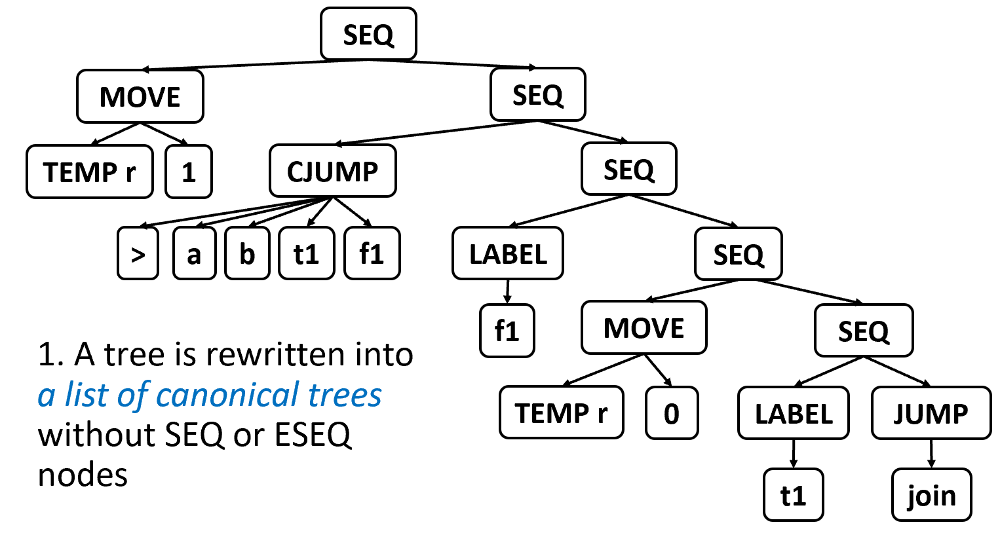
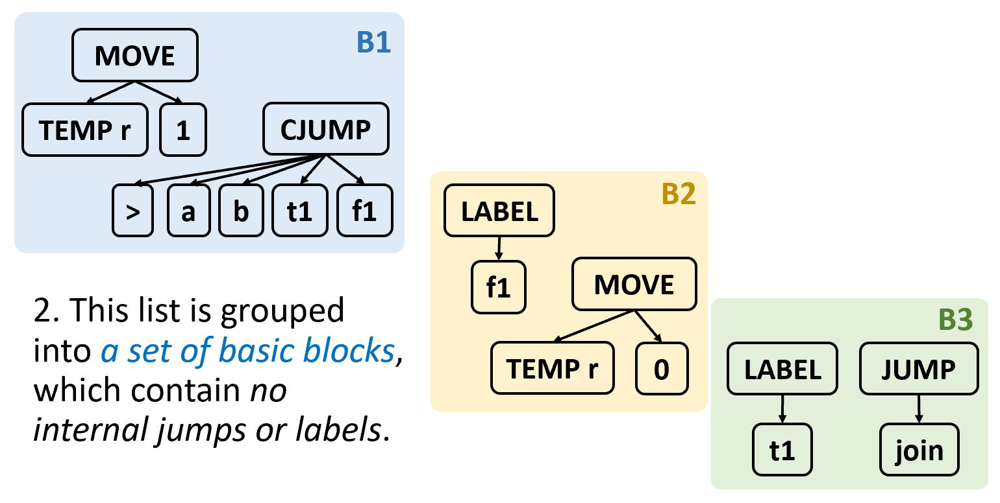
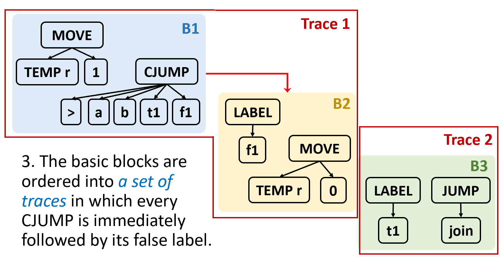
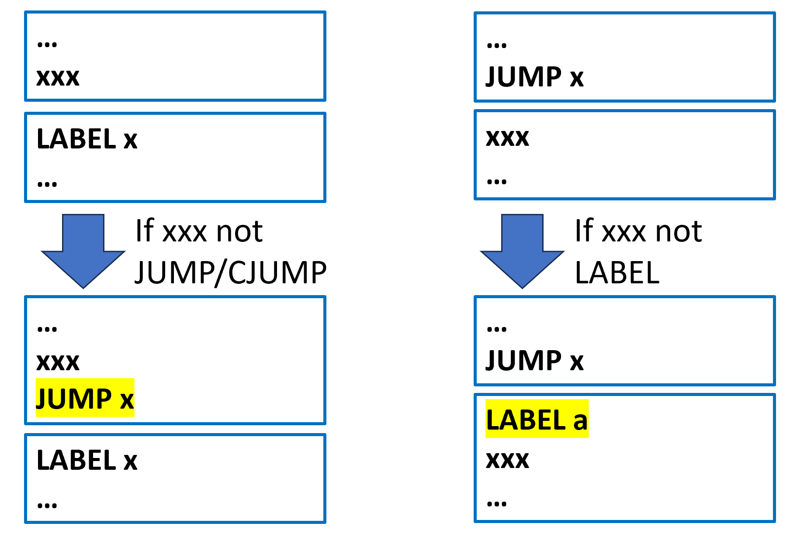
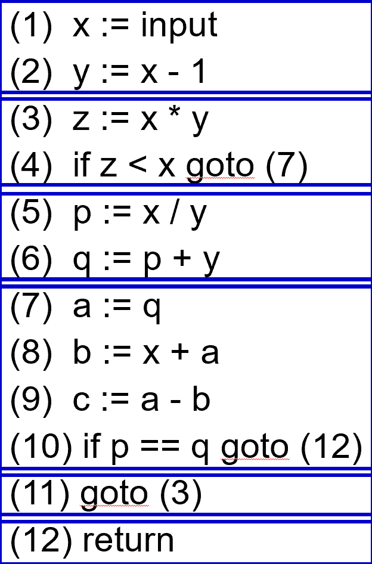
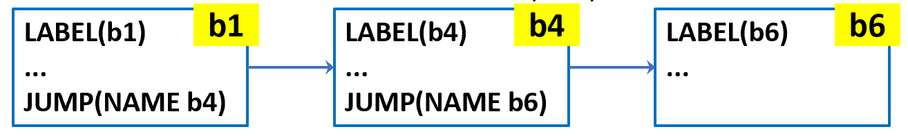
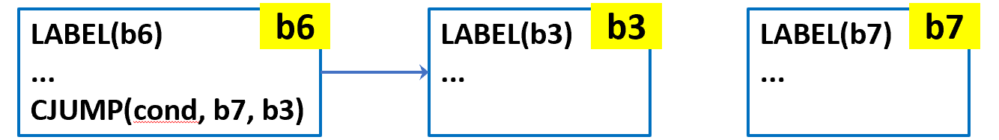
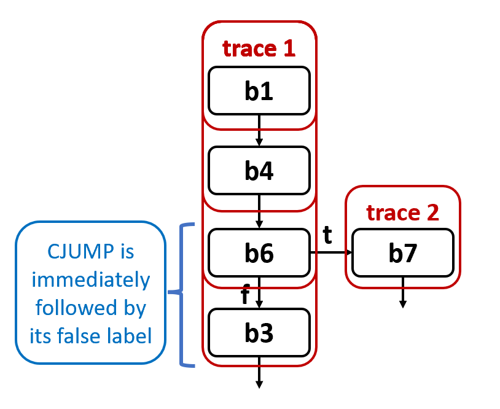
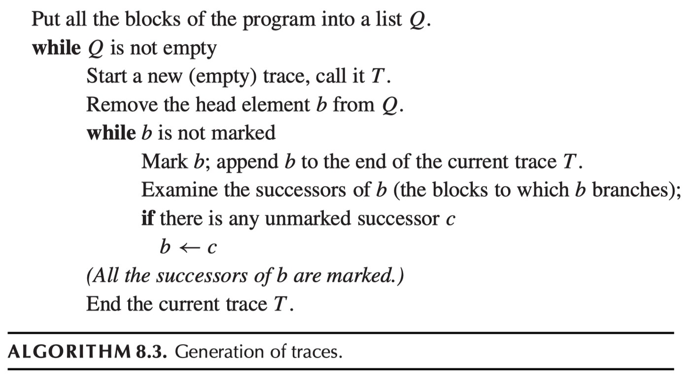
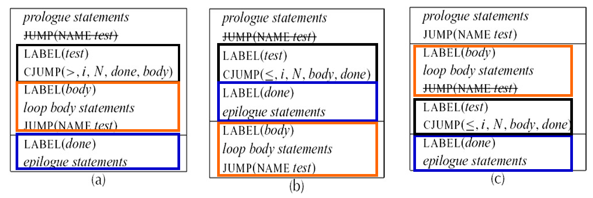

# Chapter 8 | Blocks & Traces

## Motivation

为什么我们不能直接把语义分析生成的 IR 树翻译成机器码。

* **核心任务**：语义分析产生的 IR 树最终必须翻译成汇编或机器语言。
* **设计初衷**：IR 树的运算符（Tree language operators）在设计时尽量匹配大多数机器的能力。

**面临的问题**：

1. **不完全匹配**：树形语言的某些特性与真实的机器语言并不完全对应。
2. **优化障碍**：IR 树的一些结构（比如嵌套的表达式）会干扰编译时的优化分析。

四个主要的不匹配点：

1. **CJUMP（条件跳转）**：在 IR 树中，`CJUMP` 直接指向两个标签（真和假）。但真实的机器指令通常是：如果条件为假，则**直接执行下一条指令**（Fall through）。
2. **ESEQ 节点**：`ESEQ(s, e)` 表示先执行语句 `s` 再求值 `e`。这种嵌套在表达式里的语句非常麻烦，因为不同的求值顺序可能导致不同的结果（副作用），而编译器优化往往希望能够自由交换子表达式的顺序。
3. **CALL 节点**：在表达式内部的函数调用也会产生类似 `ESEQ` 的副作用问题。
4. **嵌套调用**：如果一个 `CALL` 的参数里还包含另一个 `CALL`（例如 `f(e1, g(e2))`），在分配寄存器传递参数时会产生冲突。

---

## Solution

为了解决上述问题，我们需要对树进行三步转换。

### 第一步是线性化

* **目标**：将一颗复杂的 IR 树重写成一个**规范树列表（List of canonical trees）**。
* **关键动作**：消除所有的 `SEQ`（序列）和 `ESEQ`（带语句的表达式）节点。

**图中示例**：原本左侧是一个巨大的、深层嵌套的树。通过规则转换（比如提升 `ESEQ`），将其拉平。让代码变成没有嵌套 `SEQ/ESEQ` 的线性结构。



---

### 第二步是将线性化的树列表分组

**定义**：**基本块（Basic Block）**是一段直来直去（Straight-line）的代码。

* 它必须以一个 `LABEL`（标签）开始。
* 它必须以一个 `JUMP` 或 `CJUMP` 结束。
* **中间不能有任何跳转或标签**（即不能中途跳进来，也不能中途跳出去）。



**图中示例**：代码被分成了三个块：

* **B1**（蓝色）：以 `MOVE` 开始，以 `CJUMP` 结束。
* **B2**（黄色）：以 `LABEL f1` 开始，以 `MOVE` 结尾（虽然图上没画最后的跳转，但逻辑上它会连接到下一部分）。
* **B3**（绿色）：以 `LABEL t1` 开始，以 `JUMP` 结束。

---

### 最后一步是确定这些基本块在内存/文件中的物理排列顺序

* **任务**：将基本块排序成**追踪（Traces）**。
* **核心规则**：为了匹配机器指令的特性，**每一个 `CJUMP` 后面应该紧跟它的假标签（False Label）**。



**图中示例**：

* **Trace 1**：将 B1 和 B2 连接在一起。为什么？因为 B1 的 `CJUMP` 的假目标是 `f1`，而 B2 正好是以 `f1` 开头的。这样在生成机器码时，如果条件不成立，就可以直接“滑进”（Fall through）B2，无需额外的跳转指令。
* **Trace 2**：剩下的 B3 形成另一个追踪。

---

## Canonical Trees

简单来说，规范树就是**“没有副作用、结构极简”**的树。

**规范树的两大核心属性**：

1. **禁令**：绝对不允许出现 `SEQ`（语句序列）或 `ESEQ`（带语句的表达式）。
2. **CALL 的限制**：函数调用（`CALL`）必须“老老实实”呆在最顶层。它的父节点只能是 `EXP(...)` 或者赋值给临时变量的 `MOVE(TEMP t, ...)`。

**Property 1 (属性1)**：每棵规范树只能包含**一个**语句节点，且必须是根节点。其他的节点全是纯粹的表达式节点。

* *直白点说*：这一小棵树只干一件事（比如一次赋值或一个跳转）。

**Property 1 & 2 (属性1与2的结合)**：

* `CALL` 节点不能嵌套在复杂的数学运算里。
* 每棵树只能有一个 `CALL`。这样可以避免两个函数调用由于执行顺序不同而产生的竞态条件或寄存器冲突。

---

### Transformation Tasks (转换任务)

既然知道了目标，这一页就列出了从普通的 IR 树转换到规范树的“任务清单”：

* **消除 ESEQs**：这是最难的一步。要把藏在表达式深处的副作用语句“提溜”出来。
* **将 CALL 提升到顶层**：如果 `CALL` 嵌套在加法里，比如 `a + CALL(f)`，需要把它拆解成 `t = CALL(f); a + t`。
* **消除 SEQs**：把长长的语句链拆开，变成一个一个独立的、只有根节点是语句的规范树列表。

---

### Transformations on ESEQ

#### ESEQ 的基本变换

消除 `ESEQ` 节点的核心思路：**提升（Lifting）**。

* **定义回顾**：$ESEQ(s, e)$ 表示先计算具有副作用的语句 $s$，然后再计算表达式 $e$ 并返回其结果。
* **核心思路**：将 `ESEQ` 节点在 IR 树中不断向上提升，直到它的父节点是一个语句节点，此时它可以与父节点合并成一个 `SEQ` 节点。
* **嵌套处理**：对于嵌套的 `ESEQ`，应用左结合律变换：

$$ESEQ(s_1, ESEQ(s_2, e)) \Rightarrow ESEQ(SEQ(s_1, s_2), e)$$

这表示将所有的副作用语句（$s_1$ 和 $s_2$）按顺序合并在一起。

---

#### 算术运算与内存访问中的提升

当 `ESEQ` 出现在二元运算或内存访问的左侧时，提升相对简单。

* **二元运算（左侧）**：如果 `ESEQ` 是 `BINOP` 的左操作数，可以直接提取：

$$BINOP(op, ESEQ(s, e_1), e_2) \Rightarrow ESEQ(s, BINOP(op, e_1, e_2))$$

* **其他节点**：对于 `MEM`、`JUMP` 或 `CJUMP` 节点，如果其内部包含 `ESEQ`，提取逻辑一致，即先执行语句 $s$，再执行原本的指令。
* **通用规则**：提取 $s$，并使用 $s$ 与原父节点重新构建一个 `ESEQ` 或 `SEQ`。

---

#### 提升中的潜在问题（右侧操作数）

当 `ESEQ` 出现在 `BINOP` 的**右侧**时，情况变得复杂，因为必须保护求值顺序（Order of evaluation）。

* **冲突场景**：考虑 $BINOP(op, e_1, ESEQ(s, e_2))$。
* **求值顺序**：原本的顺序是先计算 $e_1$，再执行 $s$，最后计算 $e_2$。
* **副作用干扰**：如果直接把 $s$ 提到最前面，变成 $ESEQ(s, BINOP(op, e_1, e_2))$，那么 $s$ 的执行就在 $e_1$ 之前了。

**具体例子**：假设 $s = MOVE(MEM(x), y)$，而 $e_1 = MEM(x)$。

* **原顺序**：$e_1$ 读取的是修改前的值。
* **错误提升**：$s$ 先修改了内存，$e_1$ 读取的就是修改后的值，导致结果错误。

**结论**：为了保持语义一致，必须将 $e_1$ 从 `BINOP` 中提前拉出来，确保它在 $s$ 执行之前完成计算。

---

#### 右侧提升的通用解决方法

为了解决上述求值顺序问题，编译器会引入**临时变量（Temporary）**。

**解决方案**：使用一个新创建的临时变量 $t$ 来保存 $e_1$ 的值：

$$BINOP(op, e_1, ESEQ(s, e_2)) \Rightarrow ESEQ(MOVE(TEMP \ t, e_1), ESEQ(s, BINOP(op, TEMP \ t, e_2)))$$

**执行流分析**：

1. 先计算 $e_1$ 并存入 $t$。
2. 执行具有副作用的语句 $s$。
3. 最后计算二元运算，此时使用的是 $t$ 中保存的“旧”值。

这一步骤确保了即便 $s$ 会修改 $e_1$ 所依赖的内存或寄存器，逻辑依然是正确的。

---

##### 交换性优化（Commuting）

引入临时变量会增加额外的 `MOVE` 开销。如果语句 $s$ 和表达式 $e_1$ 是**可交换的（Commute）**，则可以跳过临时变量。

**优化规则**：若 $s$ 与 $e_1$ 满足交换性，则：

$$BINOP(op, e_1, ESEQ(s, e_2)) = ESEQ(s, BINOP(op, e_1, e_2))$$

**交换性的定义**：

1. 语句 $s$ 赋值（修改）的临时变量或内存地址，没有被 $e_1$ 引用。
2. $s$ 和 $e_1$ 都不会执行外部输入输出（I/O）操作。

---

##### 交换性的判定方法

在编译时精确判定交换性是非常困难的（例如指针别名问题），因此编译器采取**保守估计**策略。

**保守判定准则**：

* **常量**：$CONST(i)$ 或 $NAME(n)$ 与任何语句都满足交换性。
* **空语句**：例如 $EXP(CONST(i))$ 这种没有实际副作用的语句，与任何表达式都满足交换性。
* **其他情况**：一律假定为**不满足**交换性（False），并乖乖地引入临时变量以保证安全性。

---

#### 通用重写规则 (General Rewriting Rules - Overview)

**核心操作**：

* **提取 (Extract)**：将语句 $s$ 从表达式中剥离出来。
* **重写父节点**：根据父节点的类型，使用 $ESEQ$（如果父节点是表达式）或 $SEQ$（如果父节点是语句）重新连接提取出的语句 $s$。

**递归提升**：对于给定的 Tiger 程序（起始为一个语句 $T\_stm$），算法会递归地执行这种变换，直到所有的 $ESEQ$ 节点都被提升为顶层的 $SEQ$ 节点。

**提出的问题**：如何针对每种具体的语句或表达式进行重写？

---

##### 子表达式的处理与交换性 (Handling Subexpressions)

**基本场景**：假设有一个子表达式列表 $[e_1, e_2, ESEQ(s, e_3)]$。

**三种变换情况**：

1. **完全交换**：如果 $s$ 与之前的 $e_1, e_2$ 都满足交换性，则直接提取 $s$，结果变为 $(s; [e_1, e_2, e_3])$。
2. **不满足交换性**：如果 $s$ 与 $e_2$ 不满足交换性，为了保护求值顺序，必须将 $e_1$ 和 $e_2$ 的值存入临时变量 $t_1, t_2$，然后再执行 $s$。
3. **部分交换**：如果 $s$ 与 $e_2$ 交换但与 $e_1$ 不交换，则只需将 $e_1$ 存入临时变量。

---

#### 重写算法的两步走 (The Rewriting Algorithm)

**步骤 1：子表达式提取 (subexpression-extraction)**：

* 遍历每个子表达式，提取其中的“语句”部分。
* 将每个子表达式转换为不含 $ESEQ$ 的“干净”版本。

**步骤 2：子表达式插入 (subexpression-insertion)**：

* 使用步骤 1 得到的“干净”子表达式，构建一个全新版本的原语句或表达式节点。

---

#### 实例分析 (Example: CJUMP Transformation)

**原始节点**：$CJUMP(<, CONST \ 343, MEM(ESEQ(sx, TEMP \ a)), t, f)$。

**处理子表达式**：

* $CONST(343)$：本身就是干净的，提取出的语句为空语句（用 $EXP(CONST(0))$ 表示）。
* $MEM(ESEQ(sx, TEMP \ a))$：递归提升后，提取出语句 $sx$，剩余表达式变为 $MEM(TEMP \ a)$。

**交换性检查**：由于 $CONST(343)$ 与任何语句都满足交换性，因此 $sx$ 可以直接提到最前面，无需为常量引入临时变量。

**最终结果**：$SEQ(sx, CJUMP(<, CONST \ 343, MEM(TEMP \ a), t, f))$。


??? note "总结"
    我们可以用一张表来总结 $s$ 是否能从 $OP(e_1, ESEQ(s, e_2))$ 中提到 $e_1$ 之前的判断逻辑：

    |情况|e1​ 的属性|s 的属性|是否可以直接提取？|处理办法|
    |:--|:--|:--|:--|:--|
    |常量|CONST, NAME|任何语句|可以|直接提到最前面|
    |无冲突|TEMP x|不修改 TEMP x|可以|直接提到最前面|
    |写后读|TEMP x|MOVE(TEMP x, ...)|不可以|为 e1​ 创建 TEMP t，存下值|
    |内存隐患|MEM(x)|MOVE(MEM(y), ...)|不可以||为 e1​ 创建 TEMP t，存下值|
    |调用冲突|CALL(...)|任何语句|不可以|必须引入临时变量保护 e1​|

    当我们说 MOVE(MEM(y), ...) 时，虽然表面上写的是 y，但副作用实际上发生在了内存里。如果另一个表达式也在读写内存，就会产生“交通冲突”。

    在编译器眼中，MEM(x) 和 MEM(y) 可能会指向同一个物理内存位置。假设有以下情况：$e_1$ 是 MEM(TEMP x)（读取 x 指向的地址）。$s$ 是 MOVE(MEM(TEMP y), CONST 1)（向 y 指向的地址写入 1）。

    如果此时寄存器 x 和 y 的值恰好相同（即它们是指向同一个地址的指针），那么：
    
    - 原始顺序：先计算 $e_1$。你会读到内存里的旧值。
    
    - 提取后的顺序（如果把 $s$ 提到 $e_1$ 前面）：先执行 $s$。内存被改成了 1，接着计算 $e_1$，你会读到新值 1。

    由于编译器在静态分析阶段往往无法确定 x 和 y 是否指向同一块地盘，为了保险起见，只要 $s$ 涉及 MOVE(MEM...)，它就不能越过任何包含 MEM 的表达式。

---

### Move CALLs to Top Level

直接使用 `CALL` 节点所带来的“寄存器冲突”隐患。

**设计现状**：在树语言（Tree language）的定义中，允许 `CALL` 节点作为子表达式存在（例如作为加法的操作数）。

**物理限制**：然而，在真实的机器架构中，每个函数通常都约定将返回值放在一个**特定的专用寄存器**中，如被称为 `$TEMP(RV)$`。

**冲突示例**：考虑表达式 `$BINOP(PLUS, CALL(...), CALL(...))$`。

* 按照求值顺序，编译器会先执行第一个 `CALL`，其结果存入 `$RV$` 寄存器。
* 但在执行 `$PLUS$` 指令之前，必须先计算第二个 `CALL`。此时，第二个函数的返回值会**覆盖**掉 `$RV$` 寄存器中的第一个值。

**核心挑战**：如果不加处理，第一个函数的返回值就会丢失。那么该如何解决这个问题呢？

利用我们之前学到的 `$ESEQ$` 变换，将返回值立刻“抢救”出来。

**核心思路**：一旦函数返回，立即将其返回值从 `$RV$` 寄存器转移到一个**全新的临时寄存器**（fresh temporary register）中。

**变换公式**：

$$CALL(fun, args) \rightarrow ESEQ(MOVE(TEMP \ t, CALL(fun, args)), TEMP \ t)$$

* 这里，$t$ 是一个新的临时变量。
* 这条指令的意思是：先执行函数调用，并立刻把结果 `$MOVE$` 到一个新的寄存器 `$t$` 中，然后整个表达式的结果就是 `$t$`。

**后续处理**：完成这一步转换后，我们之前讨论过的 **ESEQ 消除器（ESEQ-eliminator）** 就会发挥作用。它会自动将这个 `$MOVE$` 语句向上提升，穿过包含它的 `$BINOP$` 等表达式，直到将其放置在顶层。

---

### eliminate SEQs

#### 线性语句列表 (A Linear List of Statements)

如何将处理后的函数体转化为最终的线性序列。

**处理后的初始状态**：

* 当整个函数体 $s_0$ 处理完毕后，得到的是一棵树 $s_0'$。
* 此时，所有的 $SEQ$ 节点都集中在树的顶部，形成类似 $SEQ(SEQ(SEQ(..., s_x), s_y), s_z)$ 的结构。这种结构虽然没有了嵌套的表达式副作用，但在物理存储上仍然是嵌套的。

**重写规则：利用结合律**：

* `linearize` 函数会反复应用以下代数变换规则：
    
$$SEQ(SEQ(a, b), c) = SEQ(a, SEQ(b, c))$$

* **直观理解**：这就像是把一个“左结合”的树结构强行扭转为“右结合”。通过这个变换，所有的语句都被推到了树的右侧分支上。

**最终形态：右斜脊柱**：

*  $s_0'$ 最终被线性化为一个固定格式的语句：$SEQ(s_1, SEQ(s_2, ..., SEQ(s_{n-1}, s_n)...))$。
*  最后所有的语句 $s_1, s_2, s_3, s_4 \dots$ 挂在一条由 $SEQ$ 组成的“脊柱”上。
*  这种形态**不再提供任何深层的结构化信息**，它本质上就是一串按顺序执行的指令。

**简化的列表表示**：

* 我们可以直接把这个结构看作一个简单的语句列表：$S_1, S_2, \dots, S_{n-1}, S_n$。
* **关键约束**：在这些最终的语句 $S_i$ 中，**不再包含任何 $SEQ$ 或 $ESEQ$ 节点**。它们现在是真正的“规范型”语句。

---

## Taming Conditional Branches (CJUMP)

### Basic Blocks

* **控制流（Control Flow）分析**：在编译器设计中，我们需要确定程序在运行时的跳转走向，这种分析被称为控制流分析。

**定义**：控制流是程序中指令执行的顺序。在分析控制流时，我们通常：

* 忽略寄存器和内存中的具体数据值。
* 忽略具体的算术运算过程。

* **核心思想**：对于控制流分析来说，任何“非跳转”指令的行为都是“乏味”的（因为它们只是按顺序执行）。因此，我们将一连串**非分支指令**组合在一起，形成一个**基本块（Basic Block）**。这样，我们只需要分析基本块之间的跳转逻辑，而不需要关注块内部的每一行指令。

一个基本块是一个指令序列，它必须满足以下特征：**从序列的第一条指令进入，从最后一条指令退出**。具体要求如下：

1. **第一条语句**必须是一个标签（$LABEL$）。
2. **最后一条语句**必须是一个跳转指令（$JUMP$ 或 $CJUMP$）。
3. **中间部分**不能包含任何其他的 $LABEL$、$JUMP$ 或 $CJUMP$。

---

#### 划分算法

1. **扫描**：从头到尾扫描代码序列。
2. **识别开始**：每当遇到一个 $LABEL$ 时，就启动一个新块（并结束之前的块）。
3. **识别结束**：每当遇到一个 $JUMP$ 或 $CJUMP$ 时，当前块结束（并在下一行启动新块）。
4. **补全跳转**：如果某个块的末尾不是 $JUMP$ 或 $CJUMP$，算法会自动在该块末尾添加一个指向下一个块标签的 $JUMP$。
5. **补全标签**：如果某个块的开头没有 $LABEL$，算法会发明一个新 $LABEL$ 并放置在开头。

---

#### 补全逻辑图解



**左侧情况（补全 JUMP）**：

* 如果代码序列中，一部分指令 $xxx$ 后面紧跟着 $LABEL\ x$，但 $xxx$ 本身不是跳转指令。
* 为了符合“基本块必须以跳转结束”的定义，我们需要在 $xxx$ 后面显式添加一条 $JUMP\ x$。

**右侧情况（补全 LABEL）**：

* 如果一条跳转指令 $JUMP\ x$ 后面跟着一段普通指令 $xxx$，但 $xxx$ 之前没有标签。
* 为了符合“基本块必须以标签开始”的定义，我们需要在 $xxx$ 之前发明并插入一个新标签 $LABEL\ a$。

---

#### TAC（三地址代码）实例分析



**识别到的标签目标**：语句 (3)、(7) 和 (12) 被识别为跳转目标。

**识别到的跳转指令**：

* (4) 的 $if\ z < x\ goto\ (7)$
* (10) 的 $if\ p == q\ goto\ (12)$
* (11) 的 $goto\ (3)$

**块的划分（蓝色方框）**：

* **块 1**：(1) 到 (2)。由于 (3) 是跳转目标，所以块 1 在 (2) 结束。注意，在后续处理中，块 1 可能需要补全 $JUMP$ 指向 (3)。
* **块 2**：(3) 到 (4)。以 (3) 开始（虽然原代码没写 LABEL，但它是目标），以 (4) 的条件跳转结束。
* **块 3**：(5) 到 (6)。
* **块 4**：(7) 到 (10)。以 (10) 的条件跳转结束。
* **块 5**：(11) 是一个无条件跳转。
* **块 6**：(12) 是一个返回语句（在控制流中通常视作结束或带有隐含标签）。

在 TAC 阶段可以暂时忽略这些显式的 $LABEL$ 和 $JUMP$ 补全，但当转换到更底层的“树语言（Tree language）”时，必须严格执行补全操作。

---

### Traces

**基本原理**：基本块可以按**任何顺序**排列，只要每个块内部的逻辑和块间的跳转逻辑保持不变，程序执行的结果就是相同的。

**优化目标 1（针对 $CJUMP$）**：我们可以选择一种排序方式，使得每一个条件跳转指令 $CJUMP(op, a, b, lt, lf)$ 后面紧跟着它的**假分支标签（false label）** $lf$。
    
* *逻辑*：如果条件不成立，程序可以直接进入下一行，而不需要执行额外的跳转指令。

**优化目标 2（针对 $JUMP$）**：通过排列，让无条件跳转 $JUMP$ 后面直接跟着它的目标标签。
    
* *结果*：这种情况下，$JUMP$ 指令本身就变得多余了，可以将其**删除**。这能减少指令数量，让程序运行得更快。

---

#### 定义与目标

* **定义**：一个轨迹（Trace）是一组可以**连续执行**的语句序列。它反映了程序执行时可能走过的一条路径，其中可以包含条件分支。

**覆盖集（Covering Set）**：在编译器排列 $CJUMP$ 和标签时，我们的目标是找到一组轨迹，使它们**完全覆盖**程序：

1. **唯一性**：每个基本块必须且仅能出现在一个轨迹中。
2. **最小化**：我们希望轨迹的数量越少越好。

* **核心逻辑**：轨迹越少，轨迹之间的跳转就越少。
* **注意**：轨迹本身的定义并不强求 $CJUMP$ 后面必须跟 $False\ Label$，但这通常是覆盖算法为了优化而追求的目标。

---

#### 如何寻找轨迹覆盖集

从某个块开始（作为轨迹的起点），然后顺着一条可能的执行路径向下寻找。

**示例 1（无条件跳转）**：

* 假设块 $b1$ 以 $JUMP\ b4$ 结束，而 $b4$ 以 $JUMP\ b6$ 结束。
* 我们可以将它们串联成一个轨迹：$(b1, b4, b6)$。



**示例 2（条件跳转）**：

* 假设块 $b6$ 以 $CJUMP(cond, b7, b3)$ 结束。
* 我们可以选择将 $b3$（假分支目标）接在 $b6$ 后面，继续这个轨迹。而 $b7$ 则会成为另一个轨迹的起点。
* *准则*：确保 $CJUMP(cond, lt, lf)$ 后面紧跟着 $LABEL(lf)$。



**轨迹 1（Trace 1）**：包含块 $b1 \to b4 \to b6 \to b3$。

* 在 $b6$ 处，算法选择了 $f$（假）路径，将 $b3$ 拉入当前轨迹。
* 这样，$b6$ 末尾的条件跳转如果失败，直接进入 $b3$，效率最高。

**轨迹 2（Trace 2）**：包含块 $b7$。

* 因为 $b7$ 是 $b6$ 的另一个分支目标，它无法被放入 Trace 1（在生成轨迹时， $b6$ 后面只能排一个块，算法必须做选择。那么如果 $b7$ 不排在 $b6$ 后边，就需要自己成为新的轨迹起点），所以它开启了一个新轨迹。



---

#### 生成轨迹的伪代码



生成轨迹的标准算法，它本质上是对**控制流图（Control-Flow Graph）执行深度优先搜索（DFS）**。

1. 将程序中所有的基本块放入一个列表 $Q$。
2. 当 $Q$ 不为空时：

* 开始一个新轨迹 $T$。
* 从 $Q$ 中移除首个元素 $b$。
* **循环（如果 $b$ 未被标记）**：
    * 标记 $b$，将其加入轨迹 $T$。
    * 检查 $b$ 的后继块（跳转目标）。
    * 如果存在任何**未被标记**的后继块 $c$，则令 $b \leftarrow c$，继续循环。

3.  当所有后继块都被标记后，结束当前轨迹 $T$。

---

#### 总结与局限性

* **运行机制**：算法从一个块开始，沿着跳转链不断标记并加入轨迹，直到遇到已经处理过的块或没有后继块为止，然后换一个未处理的块继续。

**重要缺陷**：在算法生成的原始轨迹中，**$CJUMP$ 后面并不一定能保证跟着它的假分支标签（false label）**。

* *原因*：DFS 可能会先走真分支（$lt$）路径，导致 $lt$ 对应的块接在 $CJUMP$ 后面。
* *后续处理*：为了解决这个问题，通常需要在算法结束后进行一次“清理（Finishing Up）”，通过翻转条件或增加额外跳转来修正。

---

#### Finishing Up

在将所有的轨迹（Traces）平铺（Flatten）成一个长指令列表后，我们需要对 $CJUMP$ 指令进行最后的调整，以确保它们符合物理执行逻辑（即“假”分支紧跟其后）。

针对 $CJUMP(cond, lt, lf)$，有三种处理情况：

1. **情况一：$CJUMP$ 后紧跟 $lf$**

这是最理想的情况。我们什么都不用做。如果条件为假，程序直接“掉进（fall through）”下一行的 $lf$ 块。

2. **情况二：$CJUMP$ 后紧跟 $lt$**

* **处理方法**：将条件取反，并交换真假标签。
* **变换**：将 $CJUMP(cond, lt, lf)$ 变为 $CJUMP(\neg cond, lf, lt)$。
* 这样，原来的真分支变成了现在的假分支，且 $lt$ 依然紧跟在其后，符合优化原则。

3. **情况三：$CJUMP$ 后既不是 $lt$ 也不是 $lf$**

* **处理方法**：发明一个全新的假标签 $lf'$。
* **变换方式**：

$$
\begin{aligned}
&CJUMP(cond, lt, lf') \\
&LABEL\ lf' \\
&JUMP(NAME\ lf)
\end{aligned}
$$

* 这样强制让 $CJUMP$ 后面跟着一个标签，确保了逻辑的严密性。

??? note "情况3的详细讲解"
    这是一个非常深入的问题。要理解“情况三”，我们需要把视野从单个“基本块”放大到**整个程序的内存布局**。

    **为什么会出现“情况三”？**

    之所以会出现“既不是 $lt$ 也不是 $lf$”的情况，是因为**算法 8.3（DFS 遍历）的局限性**。

    想象一下你的程序有很多分支，算法在生成轨迹（Traces）时是“贪婪”的：它从一个块开始，沿着一条路一直走下去。

    * **例子**：假设块 $b1$ 有一个条件跳转，指向 $lt=b2$ 和 $lf=b3$。

    * 但是，$b2$ 和 $b3$ 可能在之前的步骤中，**已经被其他的轨迹（Traces）“抢走”了**。

    * 当算法处理到 $b1$ 时，发现它的两个后继者（$b2$ 和 $b3$）都已经标记过了。根据规则，$b1$ 只能原地结束，成为 Trace A 的终点。

    * 接着，算法从列表 $Q$ 中随手抓了一个还没标记过的块 $b99$，开始 Trace B。

    **结果**：在最终生成的代码列表（Flattened List）中，$b1$ 的下一行紧跟着的是 $b99$。

    $$b1 \text{ (末尾是 } CJUMP \text{)} \rightarrow b99 \text{ (毫不相关的块)}$$

    这时，如果 $CJUMP$ 的条件不成立（即走 $lf$ 分支），CPU 会“掉进”下一行执行 $b99$。**但这完全是错的！** 因为它本来应该去执行 $b3$。

    **这种情况是如何进行变化的？**

    为了解决这个“掉进错误块”的问题，编译器必须插入一个**中转站**。这就是幻灯片蓝框里那个复杂的变换：

    **变换前的逻辑：**

    ```text
    CJUMP(cond, lt, lf)
    // 此时下一行是 b99，如果条件不满足，程序会错误地执行 b99
    ```

    **变换后的逻辑（插入“中转桥梁”）：**

    编译器把原来的那一行 $CJUMP$ 拆成了三行：

    1. **修改跳转指令**：`CJUMP(cond, lt, lf')`：我们将“假分支”的目标暂时改成一个新发明的标签 $lf'$。
    2.  **插入标签**：`LABEL lf'`：这个标签就放在 $CJUMP$ 的正下方。这意味着如果条件不满足，CPU 依然会“掉”到这一行。
    3.  **强制跳转回原目标**：`JUMP(NAME lf)`：带回到它原本该去的 $lf$ 块。

---

#### 最优轨迹（Optimal Traces）

* **核心原则**：将**频繁执行的指令序列**（例如循环体 $loop\ body$）放在同一个轨迹中。

**优化的好处**：

* **减少无条件跳转**：尽量让代码在物理存储上连续，从而减少 $JUMP$ 指令的数量。
* **辅助其他优化**：
    * **寄存器分配（Register Allocation）**：连续的块更有利于分析变量的生命周期。
    * **指令调度（Instruction Scheduling）**：有助于处理器流水线更好地预取指令。



**(a) 方案**：$test \to body \to done$。这是典型的 `while` 循环结构，测试在最前面。

**(b) 方案**：$test \to done \to body$。如果测试通过，需要跳过 $done$ 块去执行 $body$，效率较低。

**(c) 方案**：$body \to test \to done$。这通常被称为“循环倒置（Loop Inversion）”。
    
* **为什么 (c) 通常更好？** 在循环内部执行时，它将测试放在了末尾。对于现代处理器，这种结构在循环跳转时通常只需要一次条件跳转指令，而方案 (a) 在循环体结束处往往还需要一个无条件的 $JUMP$ 跳回 $test$ 标签。

---