# Chapter 9 | Instruction Selection

## 为什么以及是什么 (Why and What)

* **IR 树的特点**：中间表示通常非常简单，树中的每个节点只表达一个原始操作，例如取值（fetch）、存储（store）、加法（addition）等。
* **机器指令的特点**：真实的机器指令往往具有更强的表达能力，一条指令可以同时执行多个原始操作。

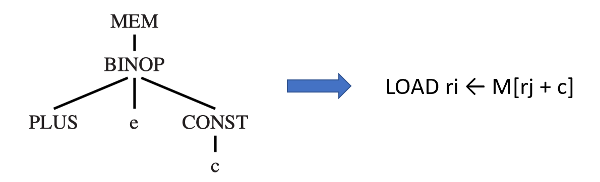

**示例**：

* 左侧是一个 IR 树片段：`MEM` 下方连接 `BINOP (PLUS)`，再下方是变量 `e` 和常量 `CONST c`。这代表“读取内存中地址为 $e + c$ 的值”。
* 右侧是对应的机器指令：`LOAD ri <- M[rj + c]`。

**定义**：指令选择的过程就是为给定的 IR 树寻找最合适的机器指令序列。

---

## 树模式 (Tree Patterns)

**树模式（Tree Pattern）**：每条机器指令都可以表示为 IR 树的一个片段。

**指令选择即“铺瓷砖”**：

* **Tiling（平铺）**：用一组互不重叠的“树模式”（瓷砖）覆盖整棵 IR 树。
* **目标**：寻找一组成本最小的指令集合来覆盖整棵树。

**Jouette 架构**：为了方便教学，课程引入了一个名为 "Jouette"（法语中意为“玩具”）的虚拟指令集架构。

---

### Jouette 架构 (The Jouette Architecture)

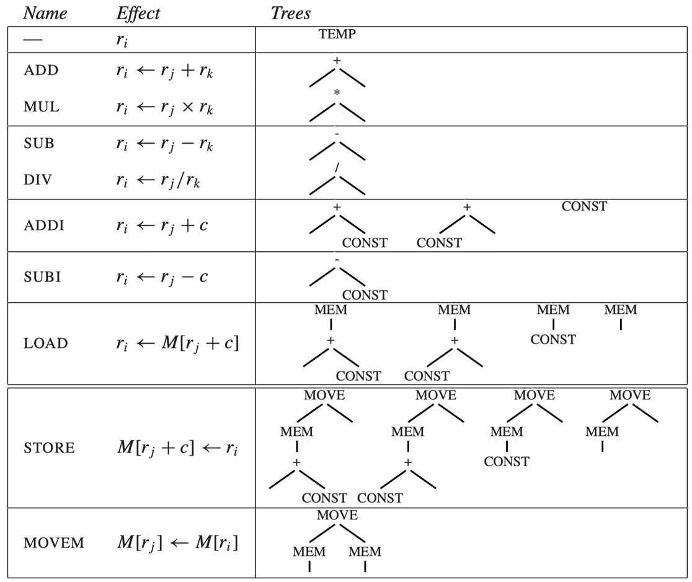

**表格内容**：

* **ADD/MUL/SUB/DIV**：对应的树模式是 `BINOP` 节点（+、*、-、/）。
* **ADDI/SUBI**：对应加/减常量的操作。
* **LOAD**：展示了多种内存加载模式，包括 $M[r_j + c]$。
* **STORE**：将寄存器内容存入内存。
* **MOVEM**：内存到内存的移动。

**特别说明**：$r_0$ 始终为 $0$；常量 $c$ 可以为 $0$。

---

### Tree Patterns - Example

通过一个具体的代码赋值语句 `a[i] := x` 展示其对应的完整 IR 树结构。

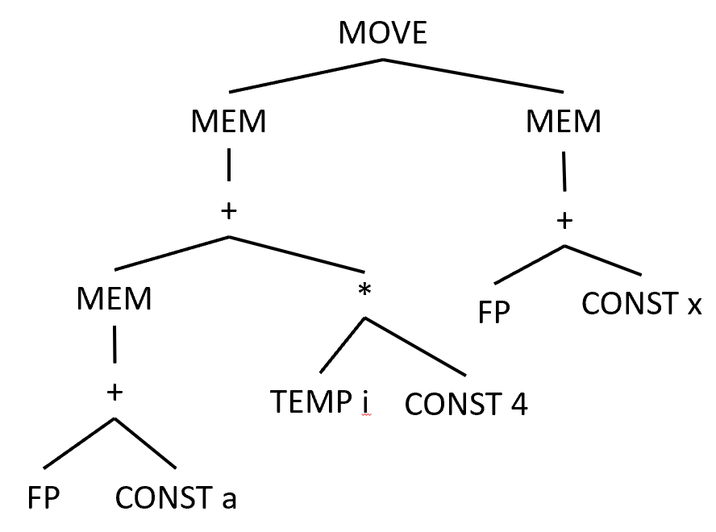

* **代码逻辑**：将变量 $x$ 的值存入数组 $a$ 的第 $i$ 个位置。
* **树结构分析**：
    * 根节点是 `MOVE`。
    * **左子树**（目标地址）：计算数组下标。基地址 $a$ 加偏移量（索引 $i$ 乘以 $4$，因为假设每个元素占 4 字节）。这里使用了寄存器 `FP`（帧指针）和 `TEMP i`。
    * **右子树**（源数据）：从变量 $x$ 所在的内存位置读取数据。

---

**左侧方案 (a)**：展示了一组具体的指令序列，如 `LOAD`、`ADDI`、`MUL` 等。

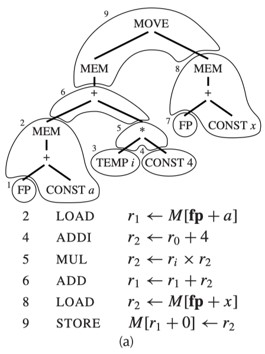

**右侧方案 (b)**：使用了不同的瓷砖组合。

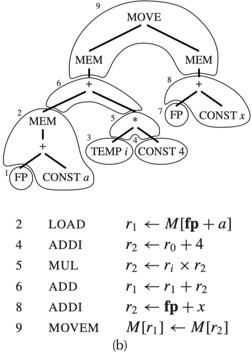

* **关键点**：图中带编号的圈代表一个“瓷砖”。有些节点（如 `TEMP` 或 `FP`）不需要指令，因为它们代表寄存器。

---

#### 微型瓷砖 (Tiny Tiles)

展示了最极端的平铺情况：**微型平铺（Tiny Tiling）**。

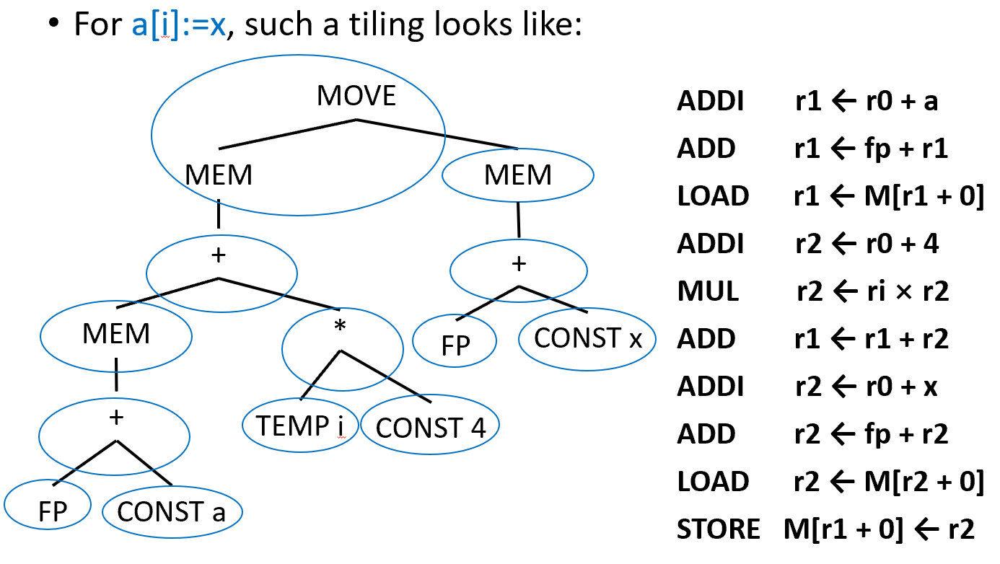

* **概念**：如果每个瓷砖只覆盖树中的一个节点（`MOVE` 除外），会发生什么？
* **结果**：生成了极其冗长的指令序列。对于 `a[i] := x` 这样一个简单的操作，使用了 10 条指令。
* 这证明了虽然任何树都可以被分解为最简单的指令，但指令选择的目标应该是寻找**更大、更高效**的模式（瓷砖），以减少指令总数和运行成本。

---

### Optimal and Optimum Tilings

衡量指令序列质量的两个重要概念：**Optimum**（全局极优）和 **Optimal**（局部最优）。

**最佳平铺（Best tiling）的定义**：

* 通常指**成本最低**的指令序列。
* 成本可以是指令的数量（最少指令），也可以是执行时间（如果不同指令的执行时间不同，则计算总时长）。

**Optimum tiling（全局极优）**：

* **定义**：所有可能的平铺方案中，平铺块（瓷砖）成本总和**绝对最低**的那一个。
* **关键词**：**Global（全局）**。它代表了理论上的极限。

**Optimal tiling（局部最优）**：

* **定义**：在这个平铺方案中，**没有任何两个相邻的瓷砖**可以合并成一个成本更低的新瓷砖。
* **关键词**：**Local（局部）**。这意味着你不能通过简单的局部替换来改进它。

**二者的关系**：

* **每一个全局极优（Optimum）方案一定也是局部最优（Optimal）的**。
* 但反之不成立：一个局部最优的方案不一定是全局性能最好的。

---

#### 最优与极优平铺 - 示例

**设定条件**：

* 假设大多数指令的成本都是 **1 个单位**。
* 唯一的例外是 `MOVEM` 指令（内存到内存的移动），它的成本设为 **$m$ 个单位**。

**方案 (a) 分析**：

* 使用了 6 条基本指令（LOAD, ADDI, MUL, ADD, LOAD, STORE）。
* **总成本 = 6 个单位**。

**方案 (b) 分析**：

* 使用了 5 条基本指令加上一条 `MOVEM` 指令。
* **总成本 = $5 + m$ 个单位**。

**结论与对比**：

* **都是 Optimal（局部最优）**：因为在各自的逻辑下，你都无法通过简单的局部合并来减少成本。
* **谁是 Optimum（全局极优）取决于 $m$ 的值**：
    * 如果 $m < 1$（`MOVEM` 非常快），那么方案 (b) 是全局极优。
    * 如果 $m > 1$（`MOVEM` 比较慢），那么方案 (a) 是全局极优。

**核心启发**：指令选择算法（如**最大吞噬算法 Maximal Munch** 产生局部最优，而**动态规划算法**产生全局极优）的选择，取决于目标机器指令集的复杂程度和具体的成本模型。

---

## 指令选择算法 (Algorithms for Instruction Selection)

* **算法复杂度**：计算“局部最优（Optimal）”平铺的算法通常比计算“全局极优（Optimum）”的算法更简单。

**CISC（复杂指令集，如 x86）**：

* **特点**：一条指令可以完成多项操作。
* **结论**：在这种架构下，局部最优和全局极优的差距非常明显。由于指令功能复杂，寻找全局最佳组合更有意义。

**RISC（精简指令集，如 ARM、MIPS）**：

* **特点**：指令通常较小、功能单一且执行成本（Cost）相对统一。
* **结论**：局部最优和全局极优之间通常**几乎没有区别**。

**总结**：对于 RISC 架构，使用较简单的平铺算法（如贪心算法）就足够了。

---

### 最大吞噬算法 (Maximal Munch)

一种经典的贪心算法（Greedy Algorithm），用于获得**局部最优（Optimal）**平铺。

**核心思想**：“大口吞噬”。

1. 从树的**根节点**开始。
2. 寻找能覆盖根节点且**匹配面积最大**（节点数最多）的瓷砖。
3. 用这块瓷砖覆盖根节点及附近的节点，剩下的部分形成若干棵子树。
4. 对每一棵子树重复上述过程。

**如何定义“最大”**：拥有最多节点的瓷砖。

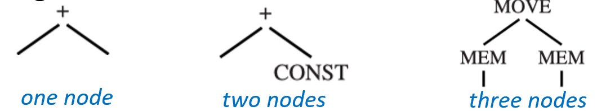

* 示例：图中展示了一个节点、两个节点和三个节点的瓷砖。算法会优先选择右侧覆盖 $MOVE$、$MEM$、$MEM$ 三个节点的瓷砖。

**决策冲突**：如果两块同样大小的瓷砖都能匹配根节点，则随机选择其中一块。

**生成顺序**：该算法生成的指令是**逆序**的。算法从根（最后执行的操作）开始寻找，但程序执行是从叶子（最先执行的操作）开始的。因此，先“吞掉”的根节点指令实际上是汇编序列中最后执行的。

---

#### 实现 (Implementation)

* **递归函数**：
    * `munchStm`：处理“语句（Statements）”，通常没有返回值。
    * `munchExp`：处理“表达式（Expressions）”，通常返回一个存放结果的寄存器。
* **优先级（Biggest tiles first）**：
    * 代码逻辑会按照瓷砖从大到小的顺序进行模式匹配。

**示例匹配**：

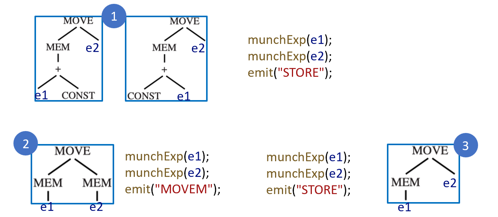

* **模式 1**：匹配一个复杂的 `STORE` 操作。它会先递归调用 `munchExp(e1)` 和 `munchExp(e2)` 来计算操作数，最后 `emit("STORE")`。
* **模式 2**：匹配 `MOVEM`（内存到内存移动）。
* **模式 3**：如果大瓷砖都不匹配，最后才会退而求其次选择简单的 `STORE` 瓷砖。

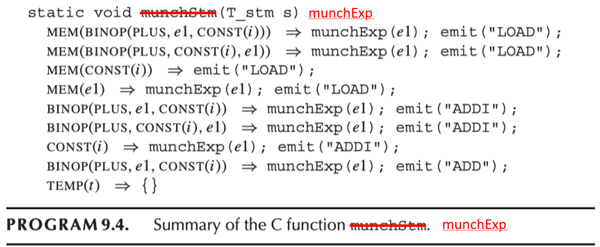

**代码逻辑分析**：

* 使用类似 `switch-case` 或模式匹配的结构。
* 比如 `MEM(BINOP(PLUS, e1, CONST(i)))`：如果匹配到这种模式（即内存加载基址加偏移量），它会先处理 `e1`，然后发出一条 `LOAD` 指令。
* 这种结构清晰地展示了 IR 树节点是如何一步步被“消耗”并转化为汇编助记符的。

---

### 动态规划 (Dynamic Programming)

* **Maximal Munch 的局限**：
    * 它采用**自顶向下（Top-down）**的贪心策略。
    * 虽然总能找到局部最优（Optimal），但因为它“走一步看一步”，往往会错过全局更好的组合。
* **动态规划（DP）的优势**：
    * **核心逻辑**：通过解决每一个子问题的极优解，推导出整体的极优解。
    * **方向**：采用**自底向上（Bottom-up）**的顺序。
* **成本定义**：
    * 一个节点 $n$ 的成本 $=$ 该节点本身的指令成本 $+$ 以该节点为根的子树中所有指令的成本之和。

---

#### 动态规划 - 细节 (Details)

对于 IR 树中的每一个节点 $n$：

1. **递归求解**：首先通过递归找到所有子节点（以及孙子节点等）的最小成本。
2. **模式匹配**：将所有可能的指令模式（瓷砖）与当前节点 $n$ 进行匹配。
3. **计算总成本**：对于每一个匹配成功的模式 $t$（假设模式本身成本为 $c_t$），其总成本计算公式为：

$$Total Cost = c_t + \sum_{i \in leaves(t)} c_i$$

其中 $c_i$ 是该模式叶子节点处对应子树已经计算出的最小成本。

4.  **择优录取**：在所有匹配成功的模式中，选择**总成本最小**的那一个。

---

#### 动态规划 - 示例：CONST 节点 (Example - CONST)

目标树是一个简单的内存加载操作：`MEM(+(CONST 1, CONST 2))`。

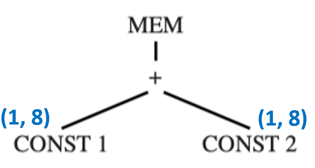

* **第一步：处理叶子节点**。
* 考察左下角的 `CONST 1` 节点。
* 查表发现模式 (8) 匹配 `CONST`，指令成本为 $1$。
* 因为它是叶子，没有进一步的子树（Leaves Cost = 0），所以**总成本为 1**。
* 标记为 `(1, 8)`，意思是“最小成本为 1，使用的模式编号是 8”。

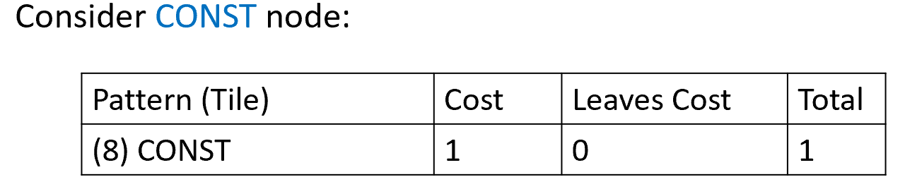

---

#### 动态规划 - 示例：+ 节点 (Example - +)

现在我们向上移动到 `+`（加法）节点。

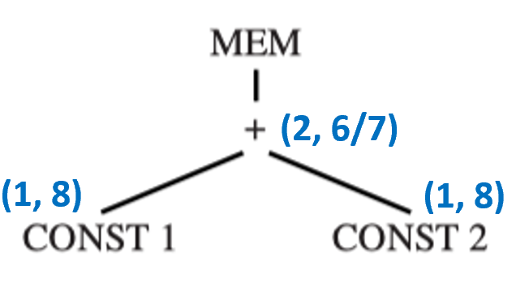

* **匹配尝试**：
    * **模式 (2) `+(e1, e2)`**：指令成本 $1$ + 两个子节点成本 $(1+1)$ = **总成本 3**。
    * **模式 (6) `+(CONST, e1)`**：指令成本 $1$ + 右子节点成本 $(1)$ = **总成本 2**。
    * **模式 (7) `+(e1, CONST)`**：指令成本 $1$ + 左子节点成本 $(1)$ = **总成本 2**。
* **决策**：成本 $2$ 小于 $3$。算法会记录下最小成本 $2$，并记住可以选择模式 (6) 或 (7)。
* 标记为 `(2, 6/7)`。

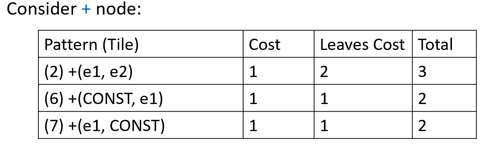

---

#### 动态规划 - 示例：MEM 节点 (Example - MEM)

最后到达根节点 `MEM`。

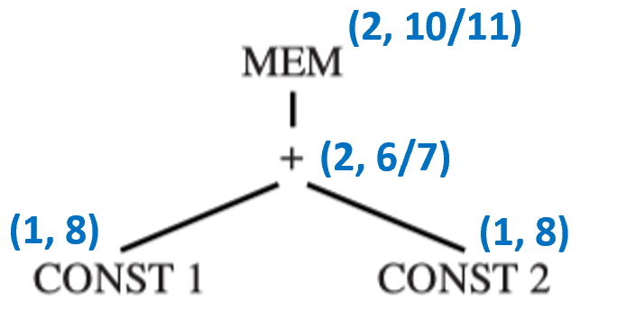

* **匹配尝试**：
    * **模式 (13) `MEM(e1)`**：指令成本 $1$ + 下方 `+` 节点的成本 $(2)$ = **总成本 3**。
    * **模式 (10) `MEM(+(e1, CONST))`**：这种模式直接跨越了加法节点。指令成本 $1$ + 对应叶子节点 `CONST 1` 的成本 $(1)$ = **总成本 2**。
    * **模式 (11) `MEM(+(CONST, e1))`**：同上，指令成本 $1$ + `CONST 2` 的成本 $(1)$ = **总成本 2**。
* **决策**：总成本 $2$ 是目前的最优解。
* 标记为 `(2, 10/11)`。

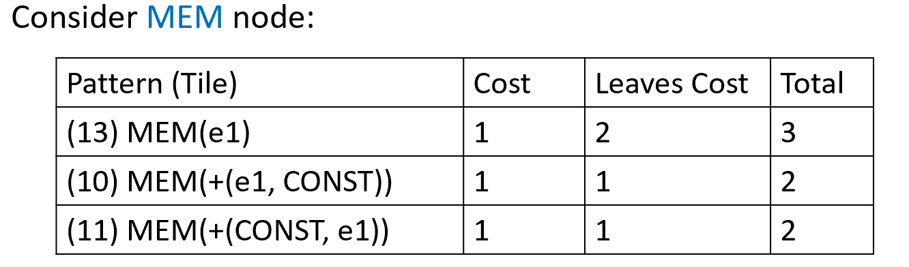

---

#### 动态规划 - 指令发射 (Instruction Emission)

当整棵树的成本都填好后，我们开始“发射”指令。这一步是**自顶向下**进行的。

**过程**：

1. 查看根节点选中的模式。
2. 先递归地为该模式的每一个叶子节点（即子树接入点）发射指令。
3. 最后发射当前模式对应的汇编指令。

**本例结果**：

* 假设根节点选了模式 (10)，它的叶子是 `CONST 1`。
* 先为 `CONST 1` 发射指令：`ADDI r1 <- r0 + 1`。
* 再发射模式 (10) 本身的指令：`LOAD r1 <- M[r1 + 2]`。

---

## 树语法(Tree Grammars)

**背景**：之前的 Jouette 架构非常理想化，但在现实中，机器通常拥有：

* **复杂的指令集**（CISC 特性）。
* **多种类寄存器**：例如专门用于地址运算的寄存器和专门用于数据运算的寄存器。
* **多种寻址模式**。

**核心观点**：为了处理这些复杂性，我们需要对动态规划算法进行**泛化（Generalization）**。这种泛化正是通过“树语法”来实现的。

---

### Jouette 架构的“魔改”版 (The brain-damaged version of Jouette)

* **寄存器分类**：
    * **$a$ 寄存器**：专门用于**寻址（Addressing）**。
    * **$d$ 寄存器**：专门用于**数据（Data）**。
* **规则变化**：
    * 每一块“瓷砖”的根节点和叶子节点现在必须明确标记为 $a$ 或 $d$。
    * 例如：某些指令的结果只能存入 $d$ 寄存器，而某些内存加载指令的地址输入必须来自 $a$ 寄存器。
* **算法调整**：
    * 动态规划算法现在不能只记录每个节点的“最小成本”。
    * 它必须为**每一类寄存器**分别记录最小成本。即：在该节点生成一个 $a$ 寄存器结果的最小成本是多少？生成一个 $d$ 寄存器结果的最小成本又是多少？

---

### 形式化 (Tree Grammars - Formalization)

* **非终结符（Nonterminals）**：
    * $s$：代表语句（Statements）。
    * $a$：代表计算结果存入 $a$ 寄存器的表达式。
    * $d$：代表计算结果存入 $d$ 寄存器的表达式。
* **语法规则示例**：
    * $d \to MEM(+(a, CONST))$：表示如果把地址（$a$）加常量（$CONST$）后的内存内容加载到 $d$ 寄存器，可以使用 `LOAD` 指令。
    * $d \to a$ 和 $a \to d$：代表寄存器之间的移动指令（`MOVEA` 和 `MOVED`）。
* **意义**：将指令选择问题转化为了一个**语法解析（Parsing）**问题。

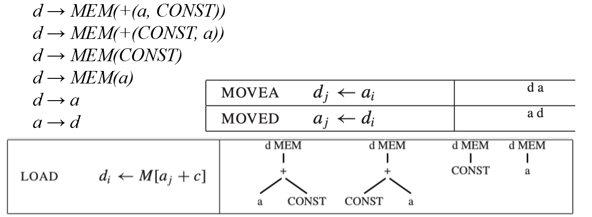

---

### 特性与算法 (Properties & Algorithm)

* **高度歧义性（Highly Ambiguous）**：
    * 同一个 IR 树表达式可以通过许多不同的指令序列来实现。语法树的解析路径不唯一。
* **解析技术的差异**：
    * 编译器前端常用的语法分析技术（如第 3 章讲的 LR 解析）在这里不太适用，因为指令选择不仅要“通”，还要“省”（追求最低成本）。
* **解决方案**：
    * 动态规划的泛化版运行良好。
    * **算法逻辑**：在树的每一个节点上，为语法的**每一个非终结符**（如 $s, a, d$ 等）计算出匹配该节点所需的最小成本。
    * 这样，我们最终就能在根节点处，针对目标类型（通常是语句 $s$）选出全局成本最低的推导路径。

---

### 快速匹配 (Fast Matching)

在前面的例子中，我们看到一个节点可能匹配多个“瓷砖（Tiles）”。如果每次都暴力遍历所有可能的指令模式，效率会很低。

* **匹配的本质**：一个瓷砖要能匹配树中的某个节点，必须满足：该瓷砖的所有**非叶子节点**的运算符（如 `MEM`, `CONST`, `PLUS` 等）必须与 IR 树中对应位置的节点标签完全一致。
* **决策树（Decision Tree）实现**：
    * 为了快速找到匹配的指令，我们可以使用类似 `switch-case` 的结构（本质上是构造一棵决策树）。
    * 通过检查节点 $n$ 的标签（`label(n)`），直接跳转到对应的匹配逻辑分支。
* **最终目标**：理想情况下，我们希望 **IR 树中的每个节点被访问的次数不超过两次**。一次是自底向上计算成本（DP），一次是自顶向下发射指令。

---

#### 平铺算法的效率 (Efficiency of Tiling Algorithms)

**符号定义**：

* $T$：指令集中不同瓷砖的总数。
* $K$：一个匹配瓷砖中平均包含的非叶子节点数量。
* $K'$：为了确定是否匹配，在一个子树中需要检查的最大节点数。
* $T'$：平均每个树节点能匹配上的不同瓷砖模式的数量。
* $N$：输入的 IR 树中的节点总数。

**性能公式**：

* **Maximal Munch**：复杂度正比于 $\frac{(K' + T') N}{K}$。因为它每次吞掉 $K$ 个节点，所以步数较少。
* **Dynamic Programming**：复杂度正比于 $(K' + T') N$。因为它需要为每个节点计算所有可能的匹配。

**结论**：

* 由于对于一个特定的机器架构，$K, K', T'$ 都是常数（由指令集决定，与代码规模无关）。
* 因此，这两种算法的时间复杂度在本质上都是 **线性时间（Linear Time, $O(N)$）**。这意味着编译器在做指令选择时是非常高效的，处理时间随代码长度成比例增加。

---

## CISC (Complex Instruction Set Computer) Machines

| 特性 | RISC 机器 (如 ARM, MIPS) | CISC 机器 (如 x86) |
| :---: | :---: | :---: |
| **寄存器数量** | 较多（通常 32 个） | 较少（16, 8, 甚至 6 个） |
| **寄存器类别** | 通用型，只有一类 | 分为不同类别，某些操作只能用特定寄存器 |
| **算术运算** | 仅限寄存器之间 | 可以直接访问寄存器或内存（通过寻址模式） |
| **指令格式** | “三地址”：$r1 \leftarrow r2 \oplus r3$ | “二地址”：$r1 \leftarrow r1 \oplus r2$ |
| **寻址模式** | 简单（通常只有 $M[reg+const]$） | 多种多样、极其复杂 |
| **指令长度** | 固定长度（如 32 bits） | 变长指令，编码非常复杂 |
| **指令效果** | 每条指令产生一个结果/副作用 | 指令可能有副作用（如自动增量） |

---

### CISC 的问题与对策 - 寄存器受限

* **寄存器过少**：在指令选择阶段，不要担心寄存器不够用，直接自由地生成 `TEMP` 节点（虚拟寄存器）。把这个难题丢给后面的**寄存器分配器（Register Allocator）**，相信它能处理好。

**特定的寄存器类别**：

* **典型案例**：Pentium 的乘法指令。它要求左操作数必须在 `eax` 中，结果的高位放在 `edx`，低位放在 `eax`。
* **对策**：显式地使用移动指令（move）将数据搬进搬出。
* **例子**：实现 $t1 \leftarrow t2 \times t3$

1. `mov eax, t2` （搬入）
2. `mul t3` （执行乘法，`edx` 会被“污染”，产生废数据）
3. `mov t1, eax` （搬出结果）

---

### CISC 的问题与对策 - 二地址指令

* **问题**：CISC 经常要求目标寄存器必须和第一个源寄存器是同一个（即 $r1 = r1 + r2$），这会覆盖掉原始数据。
* **解决方案**：额外增加一条移动指令。

**例子**：实现 $t1 \leftarrow t2 + t3$

* 首先 `mov t1, t2`（拷贝一份副本）
* 然后 `add t1, t3`（在副本上做加法）

**优化期望**：如果 `t1` 和 `t2` 最终被寄存器分配器分配到了同一个物理寄存器，那么这条额外的 `mov` 指令就会被自动删除。

---

### CISC 的问题与对策 - 操作内存

* **背景**：在指令选择时生成的许多 `TEMP` 节点，最后可能因为寄存器不够而被分配到内存位置。
* **对策对比**：
    * **左侧方案（RISC 风格）**：先把操作数从内存 load 到寄存器，算完再 store 回去。
    * **右侧方案（CISC 风格）**：直接使用支持内存操作的指令，如 `add [ebp - 8], ecx`。
* **结论**：右侧方案更简洁。左侧方案虽然看起来更“标准”，但它有一个显著缺点：它会**破坏（trash）**寄存器（如 `eax`）中原本存放的值。

---

### CISC 的问题与对策 - 寻址模式与指令长度

* **多种寻址模式**：
    * 有些复杂的寻址模式一条指令顶六条，但执行起来可能也需要六步，并不一定更快。
    * **优点**：可以少占用寄存器，且指令编码更短（节省内存空间）。
    * **实施**：通过树模式匹配（tree-matching），我们可以让编译器自动识别并利用这些复杂的寻址模式。
* **变长指令**：
    * 这对编译器来说其实**不是问题**。一旦指令选好了，生成二进制编码的工作交给汇编器（Assembler）去头疼就行了，虽然繁琐但逻辑很简单。

---

### CISC 的问题与对策 - 副作用指令

* **问题**：有些机器有“自动增量”内存取值指令，一条指令干两件事：

$$r2 \leftarrow M[r1]$ 且 $r1 \leftarrow r1 + 4$$

* **难点**：我们之前的“树模式”匹配通常假设一棵树（或一个模式）只有一个根节点，即产生一个结果。这种产生两个结果的指令很难用简单的树结构来建模。

**解决方案**：

1. **无视它**：假装这些指令不存在，简单省事。
2. **特例处理**：在代码生成器中写死一些特殊的逻辑来匹配这种模式。
3. **升级模型**：不再使用“树（Tree）”模式，而是改用**有向无环图（DAG）**模式进行匹配。这在著名的《龙书》（Dragon Book）中有详细介绍。

---