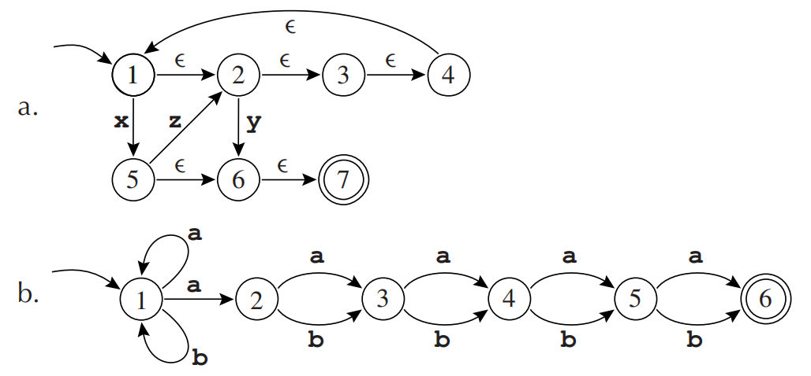
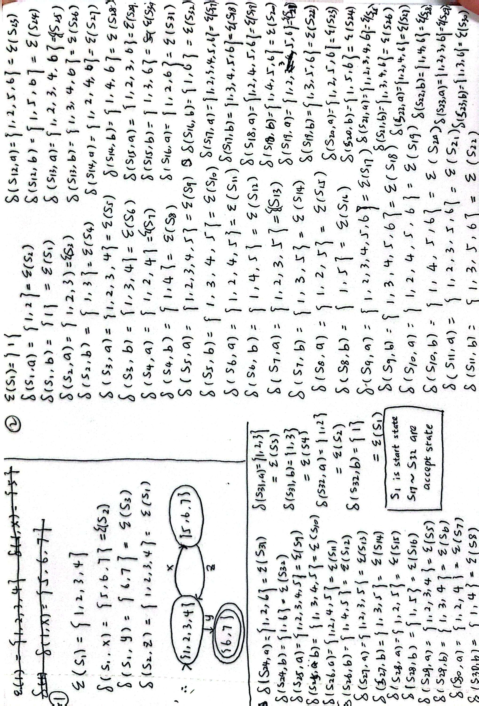
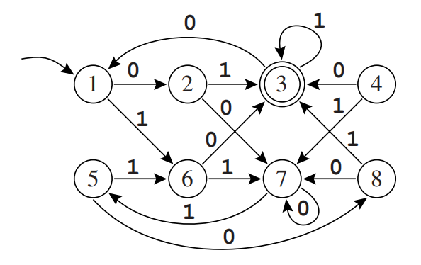
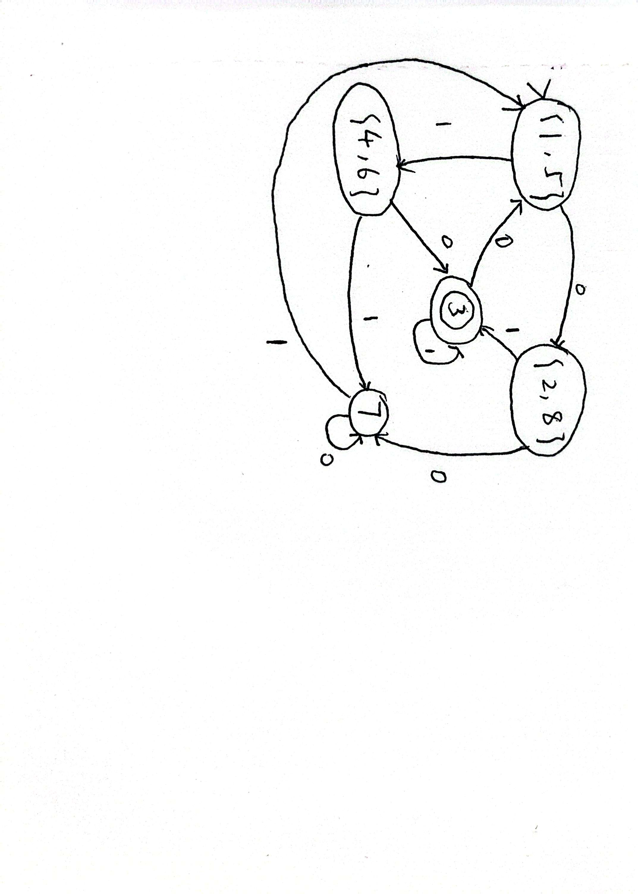

# HW1

## 2.1

???+ question
    Write regular expressions for each of the following.

    a. Strings over the alphabet {a, b, c} where the first a precedes the first b.

    b. Strings over the alphabet {a, b, c} with an even number of a’s.

    c. Binary numbers that are multiples of four.

    d. Binary numbers that are greater than 101001.

    e. Strings over the alphabet {a, b, c} that don’t contain the contiguous substring baa.

    f. The language of nonnegative integer constants in C, where numbers beginning with 0 are octal constants and other numbers are decimal constants.

    g. Binary numbers n such that there exists an integer solution of $a^n + b^n = c^n$ .

??? note "answer"
    a. $(c^* a (a|c)^* b (a|b|c)^*)$

    b. $(b|c)^* (a (b|c)^* a (b|c)^*)^* (b|c)^*$

    c. $(0|1)^* (00)$

    d. There are two cases: numbers with a length of at least 7 digits; and numbers with a length of 6 digits but greater than 101001.
    
    $(0|1)^*1(0|1)^*(0|1)(0|1)(0|1)(0|1)(0|1)(0|1)(0|1)^* \mid 11(0|1)(0|1)(0|1)(0|1) \mid 1011(0|1)(0|1) \mid 10101(0|1)$

    e. The character $b$ can repeat itself, but once it is followed by $a$ to become $ba$, it can only be followed by $b$ or $c$ to get safe or the string can be terminated directly.
    
    $((a|c) \mid b(b|ab)^*(c|ac))^* (\varepsilon \mid b(b|ab)^*(\varepsilon|a))$

    f. Octal constants begin with 0 and can only be followed by digits from 0 to 7; decimal constants begin with 1 to 9 and can only be followed by digits from 0 to 9.
    
    $(00 | 0(1|2|3|4|5|6|7)^+(0|1|2|3|4|5|6|7)^*) \mid (0 | (1|2|3|4|5|6|7|8|9)(0|1|2|3|4|5|6|7|8|9)^*)$

    g. Fermat's Last Theorem tells us that when $n > 2$, the equation $a^n + b^n = c^n$ has no integer solutions, so the binary numbers that satisfy this condition can only be $1$ and $10$.
---

## 2.2

???+ question
    For each of the following, explain why you’re not surprised that there is no regular expression defining it.

    a. Strings of a’s and b’s where there are more a’s than b’s.

    b. Strings of a’s and b’s that are palindromes (the same forward as backward).

    c. Syntactically correct C programs.

??? note "answer"
    The definition of regular expressions reveals that no operation can count letters. Nor can any operation recall previous fields.

    a. To determine whether the quantity of $a$ is greater than that of $b$, a regular expression is needed to remember the difference in quantity. So, there is no regular expression can define it.

    b. Palindrome matching requires the machine to completely record and recall the first half of a string of arbitrary length in reverse order. So, there is no regular expression can define it.

    c. Regarding the problem of matching brackets in C, the finite state machine corresponding to the regular expression, as mentioned in the two questions above, cannot remember how many brackets there are, and these brackets can be nested infinitely.

---

## 2.5(a,b) 

???+ question
    Convert these NFAs to deterministic finite automata.

    

??? note "answer"
    

---

## 2.6

???+ question
    Find two equivalent states in the following automaton, and merge them to produce a smaller automaton that recognizes the same language. Repeat until there are no longer equivalent states.

    

    Actually, the general algorithm for minimizing finite automata works in reverse. First, find all pairs of inequivalent states. States X, Y are inequivalent if X is final and Y is not or (by iteration) if $X \xrightarrow{a} X'$ and $Y \xrightarrow{a} Y'$ and $X'$ and $Y'$ are inequivalent. After this iteration ceases to find new pairs of inequivalent states, then X, Y are equivalent if they are not inequivalent. See Hopcroft and Ullman [1979], Theorem 3.10.

??? note "answer"
    

---