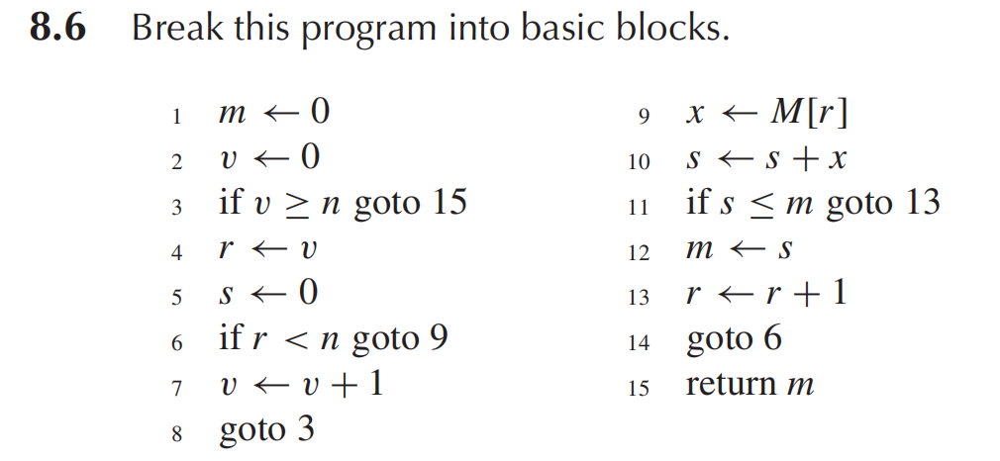

# HW10

## 10.1

???+ question
    Perform flow analysis on the program of Exercise 8.6:

    a. Draw the control-flow graph.

    b. Calculate live-in and live-out at each statement.

    c. Construct the register interference graph.

    

??? note "answer"
    a. Draw the control-flow graph

    ```
    - 1 -> 2
    - 2 -> 3
    - 3 -> 15 (if True)
    - 3 -> 4 (if False)
    - 4 -> 5
    - 5 -> 6
    - 6 -> 9 (if True)
    - 6 -> 7 (if False)
    - 7 -> 8
    - 8 -> 3
    - 9 -> 10
    - 10 -> 11
    - 11 -> 13 (if True)
    - 11 -> 12 (if False)
    - 12 -> 13
    - 13 -> 14
    - 14 -> 6
    - 15 -> End
    ```

    b. Calculate live-in and live-out at each statement

    对于节点 $n$:

    1. $in[n] = use[n] \cup (out[n] - def[n])$

    2. $out[n] = \bigcup_{s \in succ[n]} in[s]$

    | **语句 (n)** | **Instruction** | def $n$ | use $n$ | succ $n$ |
    | :--------:| :------------------: | :------: | :------: | :-------: |
    | 1 | $m \leftarrow 0$ | $\{m\}$ | $\emptyset$ | $\{2\}$ |
    | 2 | $v \leftarrow 0$ | $\{v\}$ | $\emptyset$ | $\{3\}$ |
    | 3 | if $v \ge n$ goto 15 | $\emptyset$ | $\{v, n\}$ | $\{4, 15\}$ |
    | 4 | $r \leftarrow v$ | $\{r\}$ | $\{v\}$ | $\{5\}$ |
    | 5 | $s \leftarrow 0$ | $\{s\}$ | $\emptyset$ | $\{6\}$ |
    | 6 | if $r < n$ goto 9 | $\emptyset$ | $\{r, n\}$ | $\{7, 9\}$ |
    | 7 | $v \leftarrow v + 1$ | $\{v\}$ | $\{v\}$ | $\{8\}$ |
    | 8 | goto 3 | $\emptyset$ | $\emptyset$ | $\{3\}$ |
    | 9 | $x \leftarrow M[r]$ | $\{x\}$ | $\{r\}$ | $\{10\}$ |
    | 10 | $s \leftarrow s + x$ | $\{s\}$ | $\{s, x\}$ | $\{11\}$ |
    | 11 | if $s \le m$ goto 13 | $\emptyset$ | $\{s, m\}$ | $\{12, 13\}$ |
    | 12 | $m \leftarrow s$ | $\{m\}$ | $\{s\}$ | $\{13\}$ |
    | 13 | $r \leftarrow r + 1$ | $\{r\}$ | $\{r\}$ | $\{14\}$ |
    | 14 | goto 6 | $\emptyset$ | $\emptyset$ | $\{6\}$ |
    | 15 | return $m$ | $\emptyset$ | $\{m\}$ | $\emptyset$ (Exit) |

    后向迭代计算:

    Initialization: 全部为空 $\emptyset$。

    Iteration 1:

    按照 $15 \rightarrow 1$ 的顺序扫描。

    15: $out[15] = \emptyset$; $in[15] = \{m\} \cup (\emptyset - \emptyset) = \{m\}$

    14: $out[14] = in[6] = \emptyset$; $in[14] = \emptyset \cup (\emptyset - \emptyset) = \emptyset$

    13: $out[13] = in[14] = \emptyset$; $in[13] = \{r\} \cup (\emptyset - \{r\}) = \{r\}$

    12: $out[12] = in[13] = \{r\}$; $in[12] = \{s\} \cup (\{r\} - \{m\}) = \{s, r\}$

    11: $out[11] = in[12] \cup in[13] = \{s, r\} \cup \{r\} = \{r, s\}$; $in[11] = \{s, m\} \cup (\{r, s\} - \emptyset) = \{m, r, s\}$

    10: $out[10] = in[11] = \{m, r, s\}$; $in[10] = \{s, x\} \cup (\{m, r, s\} - \{s\}) = \{m, r, s, x\}$

    9: $out[9] = in[10] = \{m, r, s, x\}$; $in[9] = \{r\} \cup (\{m, r, s, x\} - \{x\}) = \{m, r, s\}$

    8: $out[8] = in[3] = \emptyset$; $in[8] = \emptyset$

    7: $out[7] = in[8] = \emptyset$; $in[7] = \{v\} \cup (\emptyset - \{v\}) = \{v\}$

    6: $out[6] = in[7] \cup in[9] = \{v\} \cup \{m, r, s\} = \{m, r, s, v\}$; $in[6] = \{r, n\} \cup (\{m, r, s, v\} - \emptyset) = \{m, n, r, s, v\}$

    5: $out[5] = in[6] = \{m, n, r, s, v\}$; $in[5] = \emptyset \cup (\{m, n, r, s, v\} - \{s\}) = \{m, n, r, v\}$

    4: $out[4] = in[5] = \{m, n, r, v\}$; $in[4] = \{v\} \cup (\{m, n, r, v\} - \{r\}) = \{m, n, v\}$

    3: $out[3] = in[4] \cup in[15] = \{m, n, v\} \cup \{m\} = \{m, n, v\}$; $in[3] = \{v, n\} \cup (\{m, n, v\} - \emptyset) = \{m, n, v\}$

    2: $out[2] = in[3] = \{m, n, v\}$; $in[2] = \emptyset \cup (\{m, n, v\} - \{v\}) = \{m, n\}$

    1: $out[1] = in[2] = \{m, n\}$; $in[1] = \emptyset \cup (\{m, n\} - \{m\}) = \{n\}$

    Iteration 2:

    再次按照 $15 \rightarrow 1$ 的顺序扫描。我们对比新计算的值和 Iteration 1 的值，如果不同就更新。以下就展示有变化的部分：

    14: $out[14] = in[6] = \{m, n, r, s, v\}$; $in[14] = \emptyset \cup (\{m, n, r, s, v\} - \emptyset) = \{m, n, r, s, v\}$

    13: $out[13] = in[14] = \{m, n, r, s, v\}$; $in[13] = \{r\} \cup (\{m, n, r, s, v\} - \{r\}) = \{m, n, r, s, v\}$

    12: $out[12] = in[13] = \{m, n, r, s, v\}$; $in[12] = \{s\} \cup (\{m, n, r, s, v\} - \{m\}) = \{n, r, s, v\}$

    11: $out[11] = in[12] \cup in[13] = \{n, r, s, v\} \cup \{m, n, r, s, v\} = \{m, n, r, s, v\}$; $in[11] = \{s, m\} \cup (\{m, n, r, s, v\} - \emptyset) = \{m, n, r, s, v\}$

    10: $out[10] = in[11] = \{m, n, r, s, v\}$; $in[10] = \{s, x\} \cup (\{m, n, r, s, v\} - \{s\}) = \{m, n, r, s, v, x\}$

    9: $out[9] = in[10] = \{m, n, r, s, v, x\}$; $in[9] = \{r\} \cup (\{m, n, r, s, v, x\} - \{x\}) = \{m, n, r, s, v\}$

    8: $out[8] = in[3] = \{m, n, v\}$; $in[8] = \emptyset \cup (\{m, n, v\} - \emptyset) = \{m, n, v\}$

    7: $out[7] = in[8] = \{m, n, v\}$; $in[7] = \{v\} \cup (\{m, n, v\} - \{v\}) = \{m, n, v\}$

    6: $out[6] = in[7] \cup in[9] = \{m, n, v\} \cup \{m, n, r, s, v\} = \{m, n, r, s, v\}$; $in[6] = \{r, n\} \cup (\{m, n, r, s, v\} - \emptyset) = \{m, n, r, s, v\}$

    5: $out[5] = \{m, n, r, s, v\}$; $in[5] = \{m, n, r, v\}$

    接下来我们再次按照 $15 \rightarrow 1$ 的顺序扫描，会发现没有任何一个集合发生变化。我们达到了不动点。

    最终的表格:

    | **Statement** | **Live-In (in)** | **Live-Out (out)** |
    | :--------: | :----------------: | :-----------------: |
    | 1. $m \leftarrow 0$ | $\{n\}$ | $\{m, n\}$ |
    | 2. $v \leftarrow 0$ | $\{m, n\}$ | $\{m, n, v\}$ |
    | 3. if $v \ge n$ goto 15 | $\{m, n, v\}$ | $\{m, n, v\}$ |
    | 4. $r \leftarrow v$ | $\{m, n, v\}$ | $\{m, n, r, v\}$ |
    | 5. $s \leftarrow 0$ | $\{m, n, r, v\}$ | $\{m, n, r, s, v\}$ |
    | 6. if $r < n$ goto 9 | $\{m, n, r, s, v\}$ | $\{m, n, r, s, v\}$ |
    | 7. $v \leftarrow v + 1$ | $\{m, n, v\}$ | $\{m, n, v\}$ |
    | 8. goto 3 | $\{m, n, v\}$ | $\{m, n, v\}$ |
    | 9. $x \leftarrow M[r]$ | $\{m, n, r, s, v\}$ | $\{m, n, r, s, v, x\}$ |
    | 10. $s \leftarrow s + x$ | $\{m, n, r, s, v, x\}$ | $\{m, n, r, s, v\}$ |
    | 11. if $s \le m$ goto 13 | $\{m, n, r, s, v\}$ | $\{m, n, r, s, v\}$ |
    | 12. $m \leftarrow s$ | $\{n, r, s, v\}$ | $\{m, n, r, s, v\}$ |
    | 13. $r \leftarrow r + 1$ | $\{m, n, r, s, v\}$ | $\{m, n, r, s, v\}$ |
    | 14. goto 6 | $\{m, n, r, s, v\}$ | $\{m, n, r, s, v\}$ |
    | 15. return $m$ | $\{m\}$ | $\emptyset$ |

    c. Construct the register interference graph

    变量集合：$V = \{m, n, v, r, s, x\}$

    检查每一条语句的 Live-Out 集合，将集合中的所有变量互相连接：

    - $out[1] = \{m, n\} \implies$ Edge(m, n)

    - $out[2] = \{m, n, v\} \implies$ Clique $\{m, n, v\}$ (Edges: m-n, m-v, n-v)

    - $out[3] = \{m, n, v\} \implies$ 包含在上述中

    - $out[4] = \{m, n, r, v\} \implies$ Clique $\{m, n, r, v\}$ (Edges add: r-m, r-n, r-v)

    - $out[5, 6, 11, 12, 13, 14] = \{m, n, r, s, v\} \implies$ Clique $\{m, n, r, s, v\}$ (Edges add: s-m, s-n, s-r, s-v)

    - $out[7, 8] = \{m, n, v\} \implies$ 包含在上述中

    - $out[9] = \{m, n, r, s, v, x\} \implies$ Clique $\{m, n, r, s, v, x\}$ (Edges add: x-m, x-n, x-r, x-s, x-v)
    
    - $out[10] = \{m, n, r, s, v\}$

    由于 $\{m, n, r, s, v, x\}$ 出现在指令 9 的 $out$ 中，这意味着在这一刻，所有的这些变量都是活跃的并且互相冲突。

    因此，这个干扰图是一个完全图，包含节点 $\{m, n, r, s, v, x\}$，每一对节点之间都有一条边。