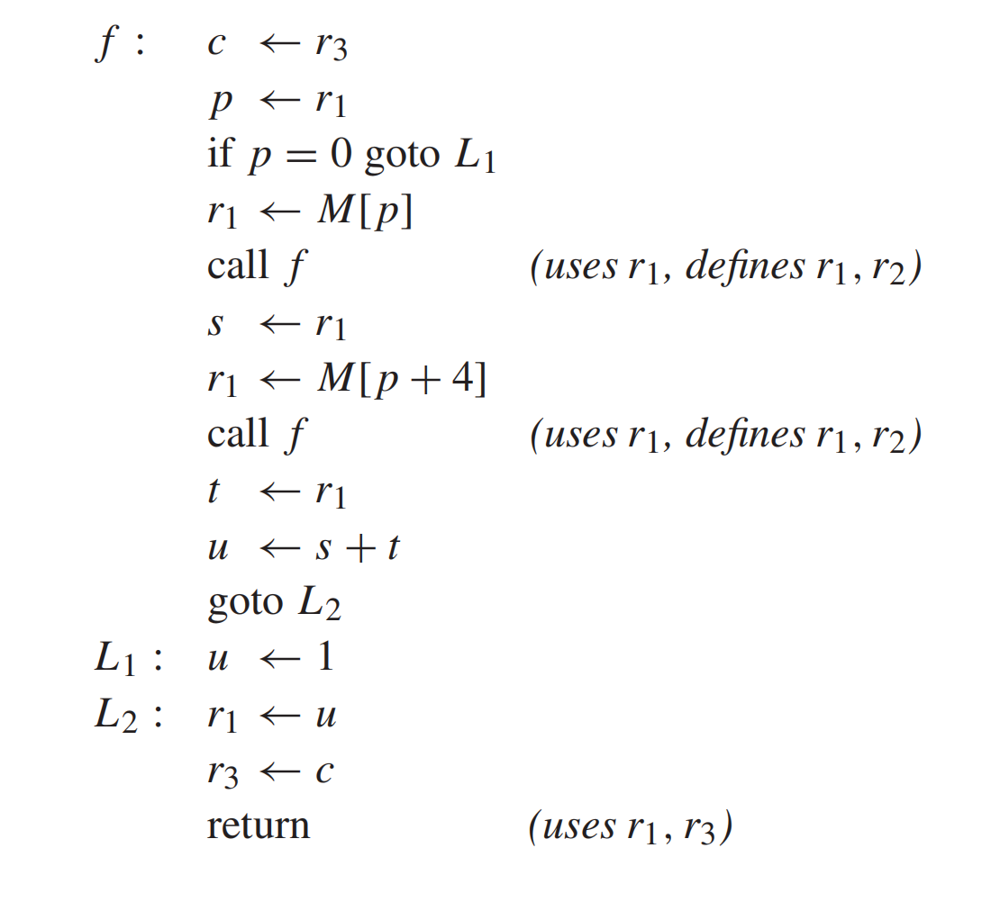
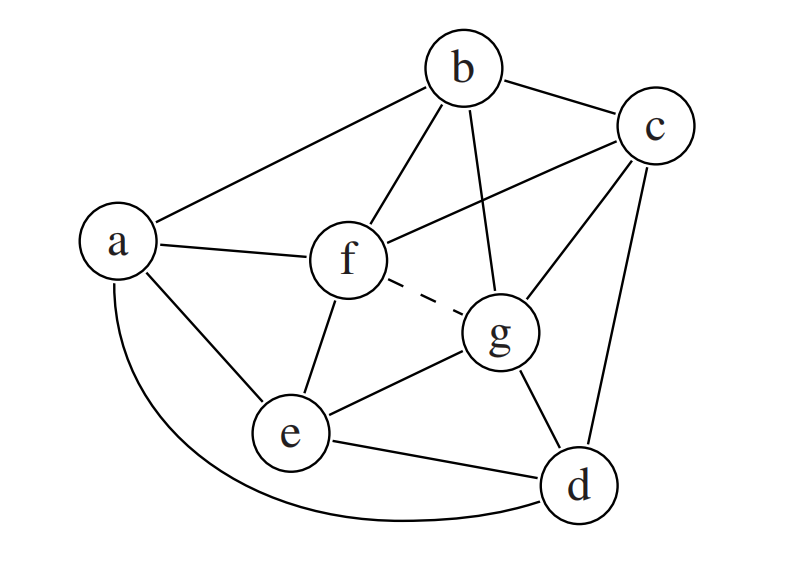

# HW11

## 11.1

???+ question
    The following program has been compiled for a machine with three registers r1,r2,r3; r1 and r2 are (caller-save) argument registers and r3 is a callee-save register. Construct the interference graph and show the steps of the register allocation process in detail, as on pages 244–248. When you coalesce two nodes, say whether you are using the Briggs or George criterion.

    Hint: When two nodes are connected by an interference edge and a move edge, you may delete the move edge; this is called constrain and is accomplished by the first else if clause of procedure Coalesce.

    

??? note "answer"
    1. **$out[n] = \bigcup_{s \in succ[n]} in[s]$**
    2. **$in[n] = use[n] \cup (out[n] \setminus def[n])$**

    `15: return (uses r1, r3)`

    * $out[15] = \emptyset$
    * $use[15] = \{r_1, r_3\}$, $def[15] = \emptyset$
    * $in[15] = use[15] \cup (out[15] \setminus def[15]) = \{r_1, r_3\} \cup (\emptyset \setminus \emptyset) = \{r_1, r_3\}$

    `14: r3 <- c`

    * $out[14] = in[15] = \{r_1, r_3\}$
    * $use = \{c\}$ ，$def = \{r_3\}$
    * $in[14] = \{c\} \cup (\{r_1, r_3\} \setminus \{r_3\}) = \{c\} \cup \{r_1\} = \{r_1, c\}$

    `13: L2: r1 <- u`

    * $out[13] = in[14] = \{r_1, c\}$
    * $use = \{u\}$ ， $def = \{r_1\}$
    * $in[13] = \{u\} \cup (\{r_1, c\} \setminus \{r_1\}) = \{u\} \cup \{c\} = \{u, c\}$

    `12: L1: u <- 1`

    * $out[12] = in[13] = \{u, c\}$
    * $use = \emptyset$ ， $def = \{u\}$
    * $in[12] = \emptyset \cup (\{u, c\} \setminus \{u\}) = \{c\}$

    `11: goto L2`

    * $out[11] = in[13] = \{u, c\}$
    * $use = \emptyset, def = \emptyset$
    * $in[11] = \emptyset \cup (\{u, c\} \setminus \emptyset) = \{u, c\}$

    `10: u <- s + t`

    * $out[10] = in[11] = \{u, c\}$
    * $use = \{s, t\}$ ， $def = \{u\}$
    * $in[10] = \{s, t\} \cup (\{u, c\} \setminus \{u\}) = \{s, t\} \cup \{c\} = \{s, t, c\}$

    `9: t <- r1`

    * $out[9] = in[10] = \{s, t, c\}$
    * $use = \{r_1\}$ ， $def = \{t\}$
    * $in[9] = \{r_1\} \cup (\{s, t, c\} \setminus \{t\}) = \{r_1\} \cup \{s, c\} = \{r_1, s, c\}$

    `8: call f (uses r1, defines r1, r2)`

    * $out[8] = in[9] = \{r_1, s, c\}$
    * $use = \{r_1\}$ ， $def = \{r_1, r_2\}$
    * $in[8] = \{r_1\} \cup (\{r_1, s, c\} \setminus \{r_1, r_2\}) = \{r_1\} \cup \{s, c\} = \{r_1, s, c\}$

    `7: r1 <- M[p + 4]`

    * $out[7] = in[8] = \{r_1, s, c\}$
    * $use = \{p\}$ ， $def = \{r_1\}$
    * $in[7] = \{p\} \cup (\{r_1, s, c\} \setminus \{r_1\}) = \{p\} \cup \{s, c\} = \{p, s, c\}$

    `6: s <- r1`

    * $out[6] = in[7] = \{p, s, c\}$
    * $use = \{r_1\}$ ， $def = \{s\}$
    * $in[6] = \{r_1\} \cup (\{p, s, c\} \setminus \{s\}) = \{r_1\} \cup \{p, c\} = \{r_1, p, c\}$

    `5: call f (uses r1, defines r1, r2)`

    * $out[5] = in[6] = \{r_1, p, c\}$
    * $use = \{r_1\}$ , $def = \{r_1, r_2\}$
    * $in[5] = \{r_1\} \cup (\{r_1, p, c\} \setminus \{r_1, r_2\}) = \{r_1\} \cup \{p, c\} = \{r_1, p, c\}$

    `4: r1 <- M[p]`

    * $out[4] = in[5] = \{r_1, p, c\}$
    * $use = \{p\}$ ， $def = \{r_1\}$
    * $in[4] = \{p\} \cup (\{r_1, p, c\} \setminus \{r_1\}) = \{p\} \cup \{p, c\} = \{p, c\}$

    `3: if p = 0 goto L1`

    * $out[3] = in[4] \cup in[12] = \{p, c\} \cup \{c\} = \{p, c\}$
    * $use = \{p\}$ ， $def = \emptyset$
    * $in[3] = \{p\} \cup (\{p, c\} \setminus \emptyset) = \{p, c\}$

    `2: p <- r1`

    * $out[2] = in[3] = \{p, c\}$
    * $use = \{r_1\}$ ， $def = \{p\}$
    * $in[2] = \{r_1\} \cup (\{p, c\} \setminus \{p\}) = \{r_1\} \cup \{c\} = \{r_1, c\}$

    `1: c <- r3`

    * $out[1] = in[2] = \{r_1, c\}$
    * $use = \{r_3\}$ ， $def = \{c\}$
    * $in[1] = \{r_3\} \cup (\{r_1, c\} \setminus \{c\}) = \{r_3\} \cup \{r_1\} = \{r_1, r_3\}$

    1. Precolored Nodes $r_1, r_2, r_3$
    2. Interference Edges

    * $c$ 冲突：$r_1, r_2 , p , s , t , u$
    * $p$ 冲突：$c, r_1, r_2 , s$
    * $s$ 冲突：$c, p, r_1, r_2 , t$
    * $t$ 冲突：$c, s$。
    * $u$ 冲突：$c$。

    3. Move Edges and Constrain

    * $c \leftrightarrow r_3$
    * $p \leftrightarrow r_1$
    * $s \leftrightarrow r_1$
    * $t \leftrightarrow r_1$
    * $u \leftrightarrow r_1$

    $p$ 和 $r_1$ 已有冲突边，因此 constrain，删除 move edge。

    $s$ 和 $r_1$ 已有冲突边，因此 constrain，删除 move edge。

    所以剩下的是：

    * $c \leftrightarrow r_3$
    * $t \leftrightarrow r_1$
    * $u \leftrightarrow r_1$

    此时节点的初始度数：

    * $c$ 度 = 6
    * $p$ 度 = 4
    * $s$ 度 = 5
    * $t$ 度 = 2
    * $u$ 度 = 1

    由于 $r_1$ 是预着色节点，必须使用 George ：

    * $t$ 的邻居是 $c$ 和 $s$。
    * $c$ 与 $r_1$ 存在冲突。
    * $s$ 与 $r_1$ 存在冲突。

    满足 George 标准。合并 $t$ 到 $r_1$ 。

    $t$ 从图中移除。$c$ 的度数变为 5，$s$ 的度数变为 4。

    针对 $u \leftrightarrow r_1$ ，使用George 启发式标准：

    * $u$ 的唯一邻居是 $c$。
    * $c$ 与 $r_1$ 存在冲突。

    满足 George 标准。合并 $u$ 到 $r_1$ 。

    $u$ 从图中移除。$c$ 的度数减为 4。

    针对 $c \leftrightarrow r_3$ ，使用George 启发式标准：

    目前图中剩余未着色节点为 $c, p, s$。它们的度数均为 4。

    * $c$ 的邻居为 $p, s, r_1, r_2$。
    * 邻居 $p$ 的度数为 4（$\ge K$），且 $p$ 不与 $r_3$ 冲突。

    因此 George 标准失败。

    $c$ 和 $r_3$ 无法合并，此传送指令被搁置。

    现在没有可 `simplify` 的节点，也没有可立即 `coalesce` 的 `move`，于是需要 `SelectSpill`。

    我们可以看到代码中不包含循环。对于未着色节点 $c, p, s$ 来说：

    * **Cost(c)** = $(1 + 1) \times 1 = 2$
    * **Cost(p)** = $(1 + 3) \times 1 = 4$
    * **Cost(s)** = $(1 + 1) \times 1 = 2$

    代入 Chaitin 代价公式：

    $$\text{Spill Priority} = \frac{\text{Uses} + \text{Defs}}{\text{Degree}}$$

    * $\text{Priority}(c) = \frac{2}{4} = 0.5$
    * $\text{Priority}(p) = \frac{4}{4} = 1.0$
    * $\text{Priority}(s) = \frac{2}{4} = 0.5$

    此时选 $c$ 或者 $s$ 都可以，我选择将 $c$ 从图中移除并压栈。

    移除 $c$ 后，$p$ 和 $s$ 失去了一个邻居，它们的度数分别降为 3。

    由于 $p, s$ 度数依然 $\ge 3$，继续选择溢出候选。选择 $s$ 移除并压栈。

    移除 $s$ 后，$p$ 失去了一个邻居，度数降为 2。

    $p$ 的度数变为 $2 < K$，将 $p$ 移除并压栈。

    出栈顺序为：$p \to s \to c$。

    1. 弹出 $p$ ，恢复邻居为 $r_1, r_2, c, s$。可用颜色有 $r_3$。
    2. 弹出 $s$ ，恢复邻居为 $r_1, r_2, p, c$。这三个邻居分别占用了颜色 $r_1, r_2, r_3$。无颜色可用，$s$ 成为 Actual Spill 。
    3. 弹出 $c$ ，图中恢复邻居为 $r_1, r_2, p, s$。无颜色可用，$c$ 成为 Actual Spill 。

---

## 11.3

???+ question
    Conservative coalescing is so called because it will not introduce any (potential) spills. But can it avoid spills? Consider this graph, where the solid edges represent interferences and the dashed edge represents a MOVE:

    

    a. 4-color the graph without coalescing. Show the select-stack, indicating the order in which you removed nodes. Is there a potential spill? Is there an actual spill?

    b. 4-color the graph with conservative coalescing. Did you use the Briggs or George criterion? Is there a potential spill? Is there an actual spill?

??? note "answer"
    * $a$ 的邻居: $\{b, d, e, f\}$ $\Rightarrow$ $deg(a) = 4$
    * $b$ 的邻居: $\{a, c, f, g\}$ $\Rightarrow$ $deg(b) = 4$
    * $c$ 的邻居: $\{b, d, f, g\}$ $\Rightarrow$ $deg(c) = 4$
    * $d$ 的邻居: $\{a, c, e, g\}$ $\Rightarrow$ $deg(d) = 4$
    * $e$ 的邻居: $\{a, d, f, g\}$ $\Rightarrow$ $deg(e) = 4$
    * $f$ 的邻居: $\{a, b, c, e\}$ $\Rightarrow$ $deg(f) = 4$
    * $g$ 的邻居: $\{b, c, d, e\}$ $\Rightarrow$ $deg(g) = 4$

    a.

    当前 $K=4$，而图中所有节点的度数均为 4（$deg \ge K$）

    那我们选可以择节点 $f$ 作为潜在溢出节点，移除 $f$，入栈

    栈：$[f]$

    移除 $f$ 后，其邻居 $\{a, b, c, e\}$ 的度数均减 1，变为 3

    现在 $\{a, b, c, e\}$ 的 $deg < 4$，可以继续 Simplify，移除 $a$，入栈

    栈：$[f, a]$

    $a$ 的邻居 $\{b, d, e\}$ 度数减 1。此时 $deg(b)=2, deg(d)=3, deg(e)=2$。移除 $b$，入栈。

    栈：$[f, a, b]$

    $b$ 的邻居 $\{c, g\}$ 度数减 1。此时 $deg(c)=2, deg(g)=3$。移除 $c$，入栈。

    栈：$[f, a, b, c]$

    $c$ 的邻居 $\{d, g\}$ 度数减 1。此时 $deg(d)=2, deg(g)=2$。移除 $d$，入栈。

    栈：$[f, a, b, c, d]$

    $d$ 的邻居 $\{e, g\}$ 度数减 1。此时 $deg(e)=1, deg(g)=1$。移除 $e$，入栈。

    栈：$[f, a, b, c, d, e]$

    $e$ 的邻居 $\{g\}$ 度数减 1。此时 $deg(g)=0$。移除 $g$，入栈。

    栈：$[f, a, b, c, d, e, g]$

    接着再按照出栈顺序尝试为节点分配颜色 $\{1, 2, 3, 4\}$：

    * 弹出 $g$，无已着色邻居。分配 1。
    * 弹出 $e$，邻居 $g(1)$。分配 2。
    * 弹出 $d$，邻居 $g(1), e(2)$。分配 3。
    * 弹出 $c$，邻居 $g(1), d(3)$。分配 2。
    * 弹出 $b$，邻居 $g(1), c(2)$。分配 3。
    * 弹出 $a$，邻居 $b(3), d(3), e(2)$。分配 1。
    * 弹出 $f$，邻居 $a(1), b(3), c(2), e(2)$。

    此时我们可以看到，$f$ 虽然在最开始是由于 $deg \ge 4$ 被标记为潜在溢出的，但当我们把它加回图时，它的 4 个邻居用的颜色是 $\{1, 2, 3\}$）。因此还剩下第 4 种颜色可用。所以可以分配 4。

    所以是存在潜在溢出的，但是没有实际溢出。

    b.

    我们有 $MOVE$ 边 $f \leftrightarrow g$。

    **测试 George 准则:** 

    * $g$ 的邻居是 $\{b, c, d, e\}$。
    * $d$ 与 $f$ 不冲突，且当前 $deg(d) = 4 \not< 4$。George 准则失败。

    **测试 Briggs 准则:** 

    要求合并后的新节点 $fg$ ，其度数 $\ge K$ (即 $\ge 4$) 的邻居数量必须严格小于 $K$ (即 $<4$)。

    * 合并 $f$ 和 $g$ 成为新节点 $fg$。$fg$ 的邻居是 $\{a, b, c, d, e\}$。

    * $deg(a)$: 连向 $\{b, d, e, fg\}$ $\Rightarrow$ $deg(a) = 4$
    * $deg(b)$: 连向 $\{a, c, fg\} \Rightarrow$ $deg(b) = 3$
    * $deg(c)$: 连向 $\{b, d, fg\}$ $\Rightarrow$ $deg(c) = 3$
    * $deg(d)$: 连向 $\{a, c, e, fg\}$ $\Rightarrow$ $deg(d) = 4$
    * $deg(e)$: 连向 $\{a, d, fg\}$ $\Rightarrow$ $deg(e) = 3$

    在新节点 $fg$ 的邻居中，只有 $a$ 和 $d$ 的度数 $\ge 4$。

    度数 $\ge K$ 的邻居数量为 $2 < 4$，Briggs 准则成功。

    成功合并后，当前图的节点为 $\{a, b, c, d, e, fg\}$。

    此时存在度数 $< 4$ 的节点。

    * 移除 $b \Rightarrow deg(a)\to 3, deg(c)\to 2, deg(fg)\to 4$
    * 移除 $c \Rightarrow deg(d)\to 3, deg(fg)\to 3$
    * 移除 $a \Rightarrow deg(d)\to 2, deg(e)\to 2, deg(fg)\to 2$
    * 移除 $d \Rightarrow deg(e)\to 1, deg(fg)\to 1$
    * 移除 $e \Rightarrow deg(fg)\to 0$
    * 移除 $fg$

    接着再按照出栈顺序尝试为节点分配颜色 $\{1, 2, 3, 4\}$：

    * 弹出 $fg$，无已着色邻居。分配 1。
    * 弹出 $e$，邻居 $fg(1)$。分配 2。
    * 弹出 $d$, 邻居 $fg(1) , e(2)$。分配 3。
    * 弹出 $a$, 邻居 $fg(1) , e(2) , d(3)$。分配 4。
    * 弹出 $c$, 邻居 $fg(1) , d(3)$。分配 2。
    * 弹出 $b$, 邻居 $fg(1) , c(2) , a(4)$。分配 3。

    拆开 $f$ 和 $g$ 都是分配 1。

    所以我使用了 Briggs 准则。并且没有潜在溢出也没有实际溢出。