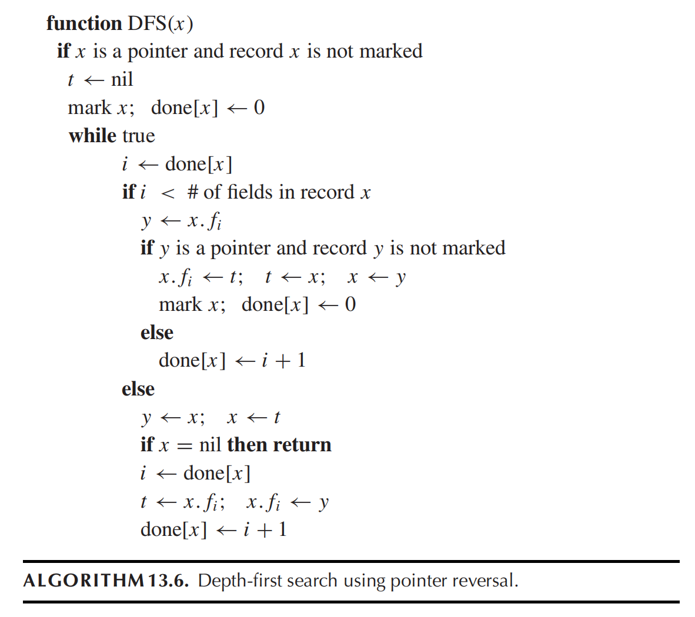
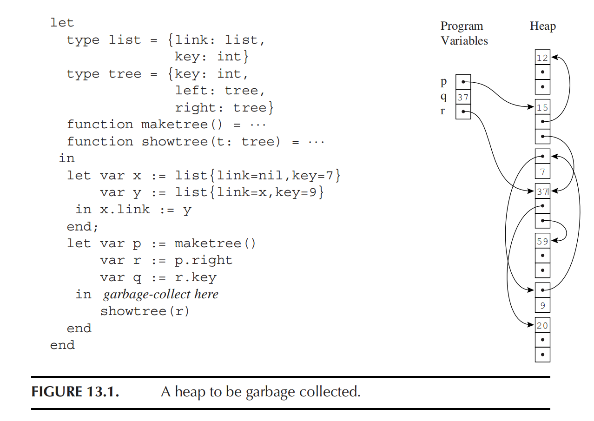

# HW13

## 13.2

???+ question
    Run Algorithm 13.6 (pointer reversal) on the heap of Figure 13.1. Show the state of the heap, the done flags, and variables t, x, and y at the time the node containing 59 is first marked.

    

    

??? note "answer"
    假设 `tree` 记录的字段按代码顺序排列：

    * $f_0$：`key` (非指针)
    
    * $f_1$：`left` (指针)

    * $f_2$：`right` (指针)

    垃圾回收从根节点变量 `p` 开始，调用 $DFS(Node_{15})$。

    处理节点 15 的所有字段：

    $x \leftarrow Node_{15}$，$t \leftarrow nil$

    `mark x` ，$done[15] \leftarrow 0$

    循环开始，$i \leftarrow done[15]$

    $y \leftarrow 15.f_0$ 不是指针，进入 `else` 分支， $done[15] \leftarrow 0 + 1 = 1$

    $i \leftarrow done[15]$

    $y \leftarrow 15.f_1$ ， $Node_{12}$ ，是指针且未被标记

    触发指针反转向下遍历：

    $15.f_1 \leftarrow t$ ，变为 $nil$

    $t \leftarrow x$ ，更新为 $Node_{15}$

    $x \leftarrow y$ ，更新为 $Node_{12}$

    `mark x` ，$done[12] \leftarrow 0$

    处理节点 12 的所有字段：

    $i = 0$ ， $y \leftarrow 12.f_0$ ，值为 12，非指针，$done[12] \leftarrow 1$

    $i = 1$ ， $y \leftarrow 12.f_1$ ，值为 $nil$，非有效且是未标记的指针，$done[12] \leftarrow 2$

    $i = 2$ ， $y \leftarrow 12.f_2$ ，和上面一样，$done[12] \leftarrow 3$

    触发回溯：

    此时 $i = 3$，不再满足 $i < 3$ ，进入外层 `else` 分支

    $y \leftarrow x$ ，为 $Node_{12}$

    $x \leftarrow t$ ，为 $Node_{15}$

    检查 $x \neq nil$，继续执行恢复逻辑：

    $i \leftarrow done[15]$ ，为 1

    $t \leftarrow 15.f_1$ ，恢复为 $nil$

    $15.f_1 \leftarrow y$ ，指向 $Node_{12}$

    $done[15] \leftarrow 1 + 1 = 2$。

    此时 $y \leftarrow 15.f_2$ ，即 $Node_{37}$ ，是指针且未标记

    触发指针反转向下遍历：

    $15.f_2 \leftarrow t$ ，变为 $nil$

    $t \leftarrow x$ ，为 $Node_{15}$

    $x \leftarrow y$ ，为 $Node_{37}$

    `mark x` ，$done[37] \leftarrow 0$

    $i \leftarrow done[37]$

    $y \leftarrow 37.f_0$ ，值为 37，非指针，$done[37] \leftarrow 0 + 1 = 1$

    $i \leftarrow done[37]$

    $y \leftarrow 37.f_1$ ，即 $Node_{20}$ ，是指针且未标记

    触发指针反转向下遍历：

    $37.f_1 \leftarrow t$ ，指向 $Node_{15}$

    $t \leftarrow x$ ，更新为 $Node_{37}$

    $x \leftarrow y$ ，更新为 $Node_{20}$

    `mark x; done[x] <- 0`，标记 20，且 $done[20] \leftarrow 0$

    $i = 0$ ， $y \leftarrow 20.f_0$ ，非指针，$done[20] \leftarrow 1$

    $i = 1$ ， $y \leftarrow 20.f_1$ ，为 $nil$，非有效指针，$done[20] \leftarrow 2$

    $i = 2$ ， $y \leftarrow 20.f_2$ ，为 $nil$，非有效指针，$done[20] \leftarrow 3$

    触发回溯：

    此时 $i = 3$，跳出内层 `if`，进入外层 `else`

    $y \leftarrow x$ ，变为 $Node_{20}$

    $x \leftarrow t$ 变为 $Node_{37}$

    $i \leftarrow done[37]$ ，为 1

    $t \leftarrow 37.f_1$ ，即 $Node_{15}$

    $37.f_1 \leftarrow y$ 变为 $Node_{20}$

    $done[37] \leftarrow 1 + 1 = 2$

    $i \leftarrow done[37]$

    $y \leftarrow 37.f_2$ ，即 $Node_{59}$ ，是指针且未标记

    向下遍历并反转：

    $37.f_2 \leftarrow t$ ，即 $Node_{15}$

    $t \leftarrow x$ 更新为 $Node_{37}$

    $x \leftarrow y$ 更新为 $Node_{59}$

    `mark x; done[x] <- 0`，标记 59，且 $done[59] \leftarrow 0$

    到这里就是第一次标记 59 的时刻了

    1. variables t, x, and y

    * $t = Node_{37}$

    * $x = Node_{59}$

    * $y = Node_{59}$

    2. Done Flags

    * $done[15] = 2$

    * $done[12] = 3$

    * $done[37] = 2$

    * $done[20] = 3$

    * $done[59] = 0$

    3. Heap State

    15:

    - marked = true

    - $left = 12$

    - $right = nil$

    12:

    - marked = true

    - $left = nil$

    - $right = nil$

    37:

    - marked = true

    - $left = 20$

    - $right = 15$

    20:

    - marked = true

    - $left = nil$

    - $right = nil$

    59:

    - marked = true

    - $left = nil$

    - $right = nil$