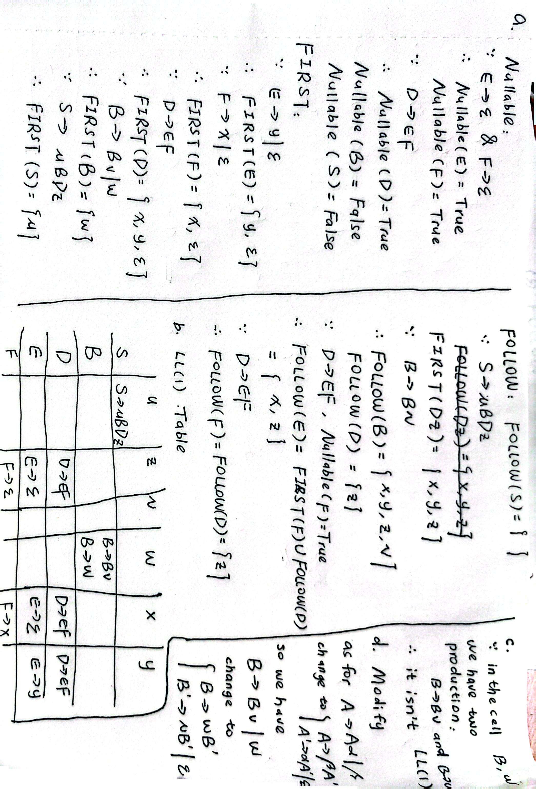

# HW2

## 3.6

???+ question
    a. Calculate nullable, FIRST, and FOLLOW for this grammar:

    ```
    S → uBDz
    B → B v
    B → w
    D → E F
    E → y
    E →
    F → x
    F →
    ```

    b. Construct the LL(1) parsing table.

    c. Give evidence that this grammar is not LL(1).

    d. Modify the grammar as little as possible to make an LL(1) grammar that accepts the same language.

??? note "answer"
    a. 计算 Nullable, FIRST, 和 FOLLOW 集合

    1. 计算 Nullable (可空集)

    * **$E$ 和 $F$**：都有直接推导为空串的产生式 $E \rightarrow \varepsilon$ 和 $F \rightarrow \varepsilon$，所以 $Nullable(E) = true$, $Nullable(F) = true$。

    * **$D$**：由 $D \rightarrow EF$，且 $E$ 和 $F$ 都可以为空，所以 $D$ 也能推导为空串，$Nullable(D) = true$。

    * **$B$ 和 $S$**：产生式中都不包含能完全消去推导为空的组合（如 $S$ 必含 $u, z$，$B$ 必含 $w$ 或 $v$），所以不可空。

    2. 计算 FIRST 集合

    * **$FIRST(E)$**：由 $E \rightarrow y \mid \varepsilon$，得 $FIRST(E) = \{y, \varepsilon\}$。

    * **$FIRST(F)$**：由 $F \rightarrow x \mid \varepsilon$，得 $FIRST(F) = \{x, \varepsilon\}$。

    * **$FIRST(D)$**：由 $D \rightarrow EF$。因为 $E$ 是可空的，所以 $F$ 的 $FIRST$ 集也要加入进来。$FIRST(D) = (FIRST(E) \setminus \{\varepsilon\}) \cup FIRST(F) = \{y\} \cup \{x, \varepsilon\} = \{x, y, \varepsilon\}$。

    * **$FIRST(B)$**：由 $B \rightarrow Bv \mid w$（这是左递归）。推导必然以 $w$ 开头，随后跟着若干个 $v$。因此 $FIRST(B) = \{w\}$。

    * **$FIRST(S)$**：由 $S \rightarrow uBDz$，显然以终结符 $u$ 开头，得 $FIRST(S) = \{u\}$。

    3. 计算 FOLLOW 集合

    * **$FOLLOW(S)$**：$S$ 是起始符号，默认包含结束符 $\{\$\}$。

    * **$FOLLOW(B)$**：找 $B$ 在产生式右部出现的位置。

    a) 在 $S \rightarrow uBDz$ 中，$B$ 后面跟着 $Dz$。所以 $FIRST(Dz)$ 的非空元素加入 $FOLLOW(B)$。$FIRST(Dz) = \{x, y\} \cup \{z\} = \{x, y, z\}$。
    
    b) 在 $B \rightarrow Bv$ 中，$B$ 后面跟着 $v$。所以 $v$ 加入 $FOLLOW(B)$。
    
    c) 综合得 $FOLLOW(B) = \{v, x, y, z\}$。

    * **$FOLLOW(D)$**：在 $S \rightarrow uBDz$ 中，$D$ 后面跟着 $z$，所以 $FOLLOW(D) = \{z\}$。

    * **$FOLLOW(E)$**：在 $D \rightarrow EF$ 中，$E$ 后面跟着 $F$。所以 $FIRST(F)$ 的非空元素 $\{x\}$ 加入 $FOLLOW(E)$。又因为 $F$ 是可空的（$\varepsilon \in FIRST(F)$），所以 $FOLLOW(D)$ 也要加入 $FOLLOW(E)$。综合得 $FOLLOW(E) = \{x, z\}$。

    * **$FOLLOW(F)$**：在 $D \rightarrow EF$ 中，$F$ 在最末尾。所以 $FOLLOW(D)$ 加入 $FOLLOW(F)$。得 $FOLLOW(F) = \{z\}$。

    b. 构建 LL(1) 预测分析表 (Parsing Table)

    填表规则：对于产生式 $A \rightarrow \alpha$

    1. 对 $FIRST(\alpha)$ 中的每个终结符 $a$，将 $A \rightarrow \alpha$ 填入表项 $[A, a]$。

    2. 若 $\alpha$ 可空，对 $FOLLOW(A)$ 中的每个终结符 $b$，将 $A \rightarrow \alpha$ 填入表项 $[A, b]$。

    **逐个填写：**

    * **$S \rightarrow uBDz$**：$FIRST(uBDz) = \{u\}$，填入 $[S, u]$。

    * **$B \rightarrow Bv$**：$FIRST(Bv) = FIRST(B) = \{w\}$，填入 $[B, w]$。

    * **$B \rightarrow w$**：$FIRST(w) = \{w\}$，填入 $[B, w]$。**(注意：这里产生了冲突！)**

    * **$D \rightarrow EF$**：$FIRST(EF) = \{x, y\}$，且 $EF$ 可空（$FOLLOW(D)=\{z\}$）。因此将 $D \rightarrow EF$ 填入 $[D, x]$, $[D, y]$, $[D, z]$。

    * **$E \rightarrow y$**：填入 $[E, y]$。

    * **$E \rightarrow \varepsilon$**：因为可空，看 $FOLLOW(E) = \{x, z\}$，将 $E \rightarrow \varepsilon$ 填入 $[E, x]$ 和 $[E, z]$。

    * **$F \rightarrow x$**：填入 $[F, x]$。

    * **$F \rightarrow \varepsilon$**：因为可空，看 $FOLLOW(F) = \{z\}$，将 $F \rightarrow \varepsilon$ 填入 $[F, z]$。

    c. 给出该文法不是 LL(1) 的证据

    **证据**：在构建好的 LL(1) 预测分析表中，非终结符 $B$ 和终结符 $w$ 的交叉单元格 $[B, w]$ 中包含了**两个**产生式：$B \rightarrow Bv$ 和 $B \rightarrow w$。
    由于 LL(1) 文法要求分析表中的任何一个单元格最多只能有一条产生式（不能有冲突），存在重复条目（冲突）说明该文法不是 LL(1) 文法。这是由 $B \rightarrow Bv$ 引起的**直接左递归**造成的 FIRST/FIRST 冲突。

    d. 尽可能少地修改文法，使其成为接受相同语言的 LL(1) 文法

    我们需要消除非终结符 $B$ 的直接左递归：$B \rightarrow Bv \mid w$。

    *标准消除左递归公式*：对于 $A \rightarrow A\alpha \mid \beta$，转换为 $A \rightarrow \beta A'$ 和 $A' \rightarrow \alpha A' \mid \varepsilon$。
    这里 $\alpha = v$，$\beta = w$。

    **消除左递归后的产生式：**

    * $B \rightarrow wB'$

    * $B' \rightarrow vB' \mid \varepsilon$

    将其替换原有的 $B$ 产生式即可，其余保持不变。

    