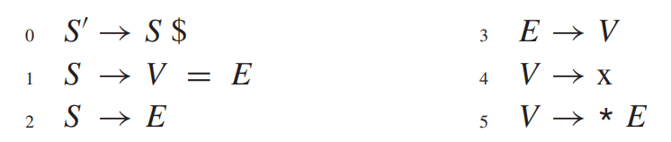
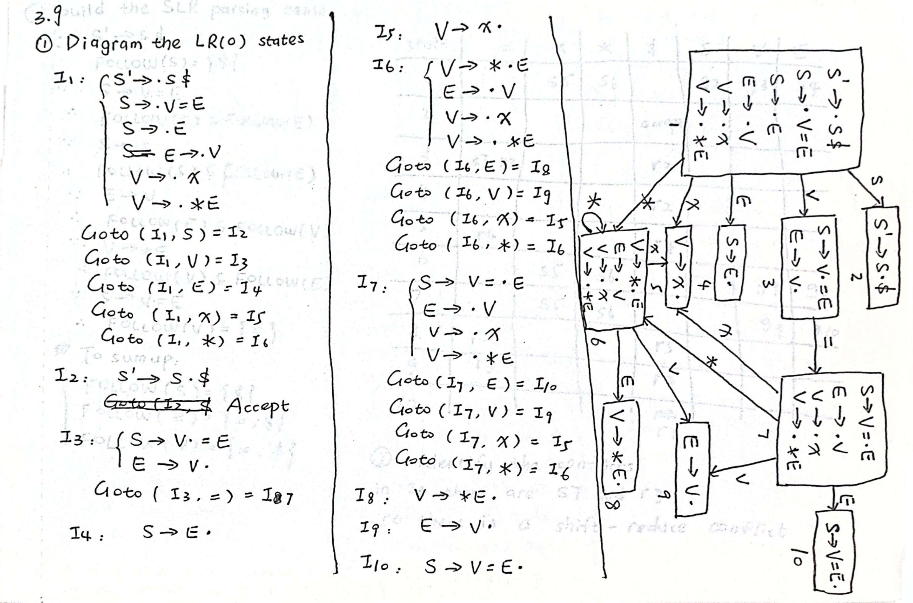
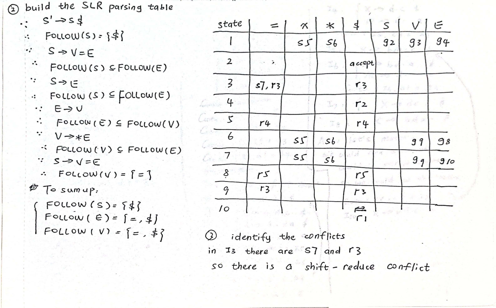
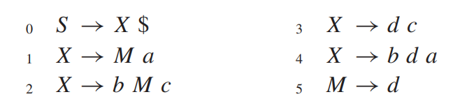
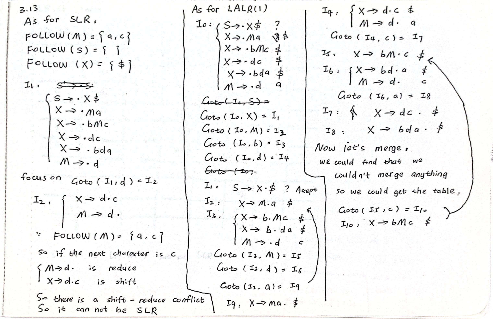
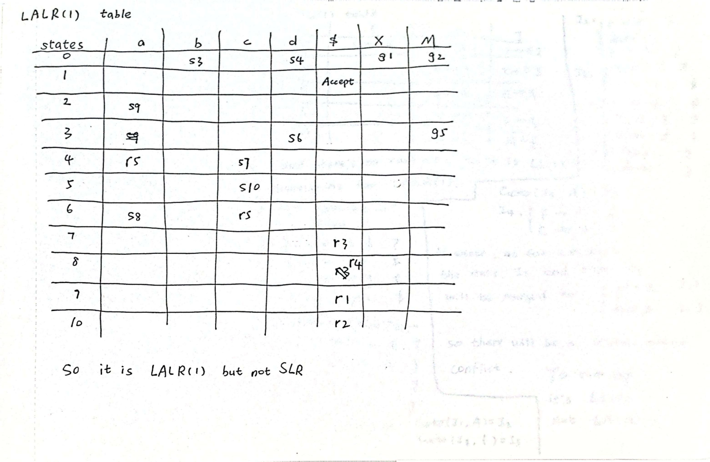
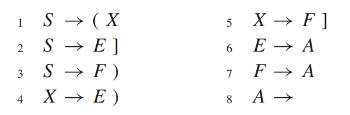
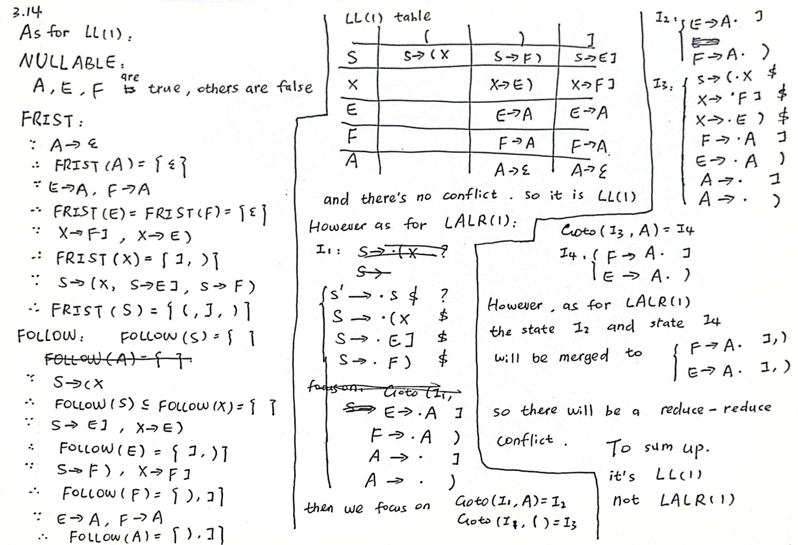

# HW3

## 3.9

???+ question
    Diagram the LR(0) states for Grammar 3.26, build the SLR parsing table, and identify the conflicts.

    > GRAMMAR 3.26. A grammar capturing the essence of expressions, variables, and pointer-dereference (by the *) operator in the C language.
    > 
    > 

??? note "answer"
    

    

    第一步：计算 FIRST 和 FOLLOW 集合

    为了构建 SLR 分析表，我们首先需要计算各个非终结符的 FOLLOW 集合。

    1.  **FIRST 集合计算**：

    * $FIRST(V) = \{\text{x}, *\}$ （从规则 4 和 5 得到）

    * $FIRST(E) = FIRST(V) = \{\text{x}, *\}$ （从规则 3 得到）

    * $FIRST(S) = FIRST(V) \cup FIRST(E) = \{\text{x}, *\}$ （从规则 1 和 2 得到）

    2.  **FOLLOW 集合计算**：

    * $FOLLOW(S')$ 包含概念上的结束，但由于文法引入了 $\$$，我们从 $S$ 开始看。

    * 从 $0.\; S' \rightarrow S \$$ 可以得出：$\$$ 必定在 $FOLLOW(S)$ 中。因此 **$FOLLOW(S) = \{\$\}$**。

    * 从 $1.\; S \rightarrow V = E$ 可以得出：$=$ 必然在 $FOLLOW(V)$ 中。同时，$E$ 在句尾，所以 $FOLLOW(S) \subseteq FOLLOW(E)$。

    * 从 $2.\; S \rightarrow E$ 可以得出：$FOLLOW(S) \subseteq FOLLOW(E)$。

    * 从 $3.\; E \rightarrow V$ 可以得出：$FOLLOW(E) \subseteq FOLLOW(V)$。

    * 从 $5.\; V \rightarrow * E$ 可以得出：$FOLLOW(V) \subseteq FOLLOW(E)$。

    ---

    第二步：构造 LR(0) 状态机 (图解项目集规范族)

    我们将逐步展开 LR(0) 状态机的闭包 (Closure) 和转移 (Goto) 函数。

    **状态 $I_0$**：

    从 $Closure(\{ S' \rightarrow \cdot S \$ \})$ 展开：

    * $S' \rightarrow \cdot S \$$

    * $S \rightarrow \cdot V = E$

    * $S \rightarrow \cdot E$

    * $E \rightarrow \cdot V$

    * $V \rightarrow \cdot \text{x}$

    * $V \rightarrow \cdot * E$

    转移：

    * $Goto(I_0, S) \Rightarrow \mathbf{I_1}$

    * $Goto(I_0, V) \Rightarrow \mathbf{I_2}$

    * $Goto(I_0, E) \Rightarrow \mathbf{I_3}$

    * $Goto(I_0, \text{x}) \Rightarrow \mathbf{I_4}$

    * $Goto(I_0, *) \Rightarrow \mathbf{I_5}$

    **状态 $I_1$**：

    * $S' \rightarrow S \cdot \$$

    转移：$Goto(I_1, \$) \Rightarrow \mathbf{I_6}$

    **状态 $I_2$**：

    * $S \rightarrow V \cdot = E$

    * $E \rightarrow V \cdot$

    转移：$Goto(I_2, =) \Rightarrow \mathbf{I_7}$

    **状态 $I_3$**：

    * $S \rightarrow E \cdot$

    **状态 $I_4$**：

    * $V \rightarrow \text{x} \cdot$

    **状态 $I_5$**：

    * $V \rightarrow * \cdot E$

    * $E \rightarrow \cdot V$

    * $V \rightarrow \cdot \text{x}$

    * $V \rightarrow \cdot * E$

    转移：

    * $Goto(I_5, E) \Rightarrow \mathbf{I_8}$

    * $Goto(I_5, V) \Rightarrow \mathbf{I_9}$

    * $Goto(I_5, \text{x}) \Rightarrow \mathbf{I_4}$

    * $Goto(I_5, *) \Rightarrow \mathbf{I_5}$

    **状态 $I_6$**：

    * $S' \rightarrow S \$ \cdot$ （接受状态 / Accept）

    **状态 $I_7$**：

    * $S \rightarrow V = \cdot E$

    * $E \rightarrow \cdot V$

    * $V \rightarrow \cdot \text{x}$

    * $V \rightarrow \cdot * E$

    转移：

    * $Goto(I_7, E) \Rightarrow \mathbf{I_{10}}$

    * $Goto(I_7, V) \Rightarrow \mathbf{I_9}$

    * $Goto(I_7, \text{x}) \Rightarrow \mathbf{I_4}$

    * $Goto(I_7, *) \Rightarrow \mathbf{I_5}$

    **状态 $I_8$**：

    * $V \rightarrow * E \cdot$

    **状态 $I_9$**：

    * $E \rightarrow V \cdot$

    **状态 $I_{10}$**：

    * $S \rightarrow V = E \cdot$

    第三步：构建 SLR 分析表

    根据 SLR(1) 构表规则：

    1. 若 $A \rightarrow \alpha \cdot a \beta$ 属于 $I_k$ 且 $Goto(I_k, a) = I_j$ ($a$ 为终结符)，则置 `Action[k, a] = sj` (移进)。

    2. 若 $A \rightarrow \alpha \cdot$ 属于 $I_k$，则对任何 $a \in FOLLOW(A)$，置 `Action[k, a] = rn` (规约，用第 n 条产生式)。

    3. 若 $S' \rightarrow S \$ \cdot$ 属于 $I_k$，则置 `Action[k, EOF]` 为 `acc`（由于文法显式包含了 $\$$ 作为结束符，$\$$ 的移进代表了接受过程的开始，我们在到达 $I_6$ 时接受）。

    | 状态 (State) | x | * | = | $ | S | E | V |
    | :---: | :---: | :---: | :---: | :---: | :---: | :---: | :---: |
    | **0** | s4 | s5 | | | 1 | 3 | 2 |
    | **1** | | | | s6 | | | |
    | **2** | | | **s7 / r3** | r3 | | | |
    | **3** | | | | r2 | | | |
    | **4** | | | r4 | r4 | | | |
    | **5** | s4 | s5 | | | | 8 | 9 |
    | **6** | | | | acc | | | |
    | **7** | s4 | s5 | | | | 10 | 9 |
    | **8** | | | r5 | r5 | | | |
    | **9** | | | r3 | r3 | | | |
    | **10** | | | | r1 | | | |

    *说明：s 代表 Shift (移进)，r 代表 Reduce (规约)，数字代表状态编号或产生式编号。*

    第四步：识别并分析冲突 (Identify the Conflicts)

    从上面构建的 SLR 分析表中我们可以清晰地看到，**状态 2 (State 2) 在遇到终结符 `=` 时存在移进-规约冲突 (Shift/Reduce Conflict)**。

    **冲突的具体表现：**

    在 $I_2$ 中存在以下两个项目：

    1.  $S \rightarrow V \cdot = E$ （期望移进 `=` 并进入状态 7）

    2.  $E \rightarrow V \cdot$ （期望进行规约）

    在 SLR 构表法中，如果当前 Lookahead (向前看的符号) 属于 $FOLLOW(E)$，就会执行规约操作。我们在第一步验证过，$FOLLOW(E) = \{=, \$\}$，这意味着当遇到 `=` 时，分析器被指令按照 $3.\; E \rightarrow V$ 进行规约操作 (`r3`)。
    
    但同时，项目 $S \rightarrow V \cdot = E$ 指示遇到 `=` 时应当移进 (`s7`)。由于在一个单元格 `Action[2, =]` 中同时出现了 `s7` 和 `r3`，SLR 分析表无法做出唯一决定。

    > **冲突本质的深度验证 (Rethink & Verification)**:
    >
    > 为什么会出现这个冲突？这是因为 SLR 算法的固有缺陷，它过度泛化了 FOLLOW 集合。
    >
    > 尽管在全局文法中，$E$ 后面确实可以跟着 `=` （例如在推导 `*x = y` 的过程中，会有中间形态 `*E = E`），但是在当前状态 2 的**特定局部上下文**中（对应于刚看到一个左部的 $V$），如果我们在此将 $V$ 规约为 $E$，得到的将是类似 $S \rightarrow E \cdot = E$ 的荒谬结构，这在我们的文法中是不合法的（$E$ 后面在这个特定的句型中只能是 $\$$ 结束符）。
    > 
    > 如果我们使用更精确的 **LR(1)** 算法，状态 2 中 $E \rightarrow V \cdot$ 所携带的特定前瞻符 (Lookahead) 仅仅只有 $\$$，而不包含 $=$。因此在 LR(1) 中，遇到 `=` 只有移进操作，冲突自动消失。这一深度验证确信了该文法虽然不是 SLR(1) 文法，但它是 LALR(1) / LR(1) 文法。

---

## 3.13

???+ question
    Show that this grammar is LALR(1) but not SLR:

    

??? note "answer"
    

    

    第一部分：证明该文法不是 SLR (Not SLR)

    要证明它不是 SLR，我们只需要构建 LR(0) 状态机，并证明在构建 SLR 分析表时存在**移进-规约冲突 (Shift/Reduce Conflict)**。

    **1. 计算 FOLLOW 集合**

    我们重点计算非终结符 $M$ 的 $FOLLOW$ 集合，因为产生式 $M \rightarrow d$ 是潜在的规约项。

    * 根据规则 $1.\; X \rightarrow M a$，$a$ 紧跟在 $M$ 后面，因此 $a \in FOLLOW(M)$。

    * 根据规则 $2.\; X \rightarrow b M c$，$c$ 紧跟在 $M$ 后面，因此 $c \in FOLLOW(M)$。
    所以，**$FOLLOW(M) = \{a, c\}$**。

    **2. 构造相关的 LR(0) 项目集**

    为了找到冲突，我们从初始状态 $I_0$ 开始推导（引入增广文法 $S' \rightarrow S$）：

    **状态 $I_0$**:

    $S' \rightarrow \cdot S$

    $S \rightarrow \cdot X \$$

    $X \rightarrow \cdot M a$

    $X \rightarrow \cdot b M c$

    $X \rightarrow \cdot d c$

    $X \rightarrow \cdot b d a$

    $M \rightarrow \cdot d$

    我们来看从 $I_0$ 接收终结符 $d$ 的转移状态 $I_4$：

    **状态 $I_4 = Goto(I_0, d)$**:

    * $X \rightarrow d \cdot c$  （由 $X \rightarrow \cdot d c$ 移进产生）

    * $M \rightarrow d \cdot$   （由 $M \rightarrow \cdot d$ 移进产生）

    ---

    第二部分：证明该文法是 LALR(1)

    要证明它是 LALR(1)，我们需要引入 LR(1) 项目集（带有特定的 Lookahead 向前看符号），并证明更精确的 Lookahead 化解了上述冲突，同时状态的合并不会产生新的冲突。

    **1. 构造引发冲突路径的 LR(1) 项目集**

    **初始状态 $I_0$ (LR(1)版本)**:

    这里我们假设增广文法的结束符为 $\#$（为了不与文法本身自带的 $\$$ 混淆，其实处理逻辑一致）。

    $S' \rightarrow \cdot S \quad [\#]$

    $S \rightarrow \cdot X \$ \quad [\#]$

    $X \rightarrow \cdot M a \quad [\$]$  (因为 $S \rightarrow \cdot X \$$)

    $X \rightarrow \cdot b M c \quad [\$]$

    $X \rightarrow \cdot d c \quad [\$]$

    $X \rightarrow \cdot b d a \quad [\$]$

    *关键的闭包推导*：求 $M \rightarrow \cdot d$ 的 Lookahead。由于点在 $M$ 前面的项目只有 $X \rightarrow \cdot M a \quad [\$]$，其 Lookahead 是 $FIRST(a \$) = \{a\}$。

    因此：

    **$M \rightarrow \cdot d \quad [a]$**

    我们再次查看接收终结符 $d$ 的转移状态 $I_4$：

    **状态 $I_4 = Goto(I_0, d)$ (LR(1)版本)**:

    * $X \rightarrow d \cdot c \quad [\$]$

    * $M \rightarrow d \cdot \quad [a]$

    **2. 验证另一条对称路径**

    为了严谨，我们检查遇到 $b$ 的分支：

    **状态 $I_3 = Goto(I_0, b)$**:

    $X \rightarrow b \cdot M c \quad [\$]$

    $X \rightarrow b \cdot d a \quad [\$]$

    *闭包推导*：这里由于是 $X \rightarrow b \cdot M c \quad [\$]$，Lookahead 取决于 $FIRST(c \$) = \{c\}$。

    所以添加：**$M \rightarrow \cdot d \quad [c]$**

    接着接收 $d$ 进入 $I_8$：

    **状态 $I_8 = Goto(I_3, d)$**:

    * $X \rightarrow b d \cdot a \quad [\$]$

    * $M \rightarrow d \cdot \quad [c]$

    在这个状态中：遇到 $a$ 执行**移进**；遇到 $c$ 执行**规约**。二者完美错开，同样没有冲突。

    **3. LALR(1) 的同心集（同核心状态）验证**

    LALR(1) 的特点是会把**核心（Core，即不带 Lookahead 的项目集合）相同**的状态合并，以减少状态机大小。

    * $I_4$ 的核心是：$\{ X \rightarrow d \cdot c, \quad M \rightarrow d \cdot \}$

    * $I_8$ 的核心是：$\{ X \rightarrow b d \cdot a, \quad M \rightarrow d \cdot \}$

    显然，$I_4$ 和 $I_8$ 的核心是**不相同的**（一个含有 $dc$，一个含有 $bda$）。因此，在 LALR(1) 构表过程中，这两个状态**不会被合并**。这确保了它们各自精确的 Lookahead（$I_4$ 的 $[a]$ 和 $I_8$ 的 $[c]$）不会被混合而产生所谓的“伪规约-规约”冲突。

---

## 3.14

???+ question
    Show that this grammar is LL(1) but not LALR(1):

    

??? note "answer"
    

    第一部分：证明该文法是 LL(1) 文法

    要证明一个文法是 LL(1) 文法，我们需要计算所有非终结符的 $FIRST$ 和 $FOLLOW$ 集合，并构建 LL(1) 预测分析表。如果分析表中没有任何一个单元格包含多个产生式（即没有多重定义冲突），则该文法就是 LL(1) 的。

    1. 计算 FIRST 集合

    * $A \rightarrow \epsilon$，所以 **$FIRST(A) = \{\epsilon\}$**

    * $E \rightarrow A$，所以 **$FIRST(E) = FIRST(A) = \{\epsilon\}$**

    * $F \rightarrow A$，所以 **$FIRST(F) = FIRST(A) = \{\epsilon\}$**

    * 对于 $X$ 的产生式：

        * $X \rightarrow E )$：因为 $\epsilon \in FIRST(E)$，所以 $FIRST(E ))$ 包含 $)$。

        * $X \rightarrow F ]$：因为 $\epsilon \in FIRST(F)$，所以 $FIRST(F ])$ 包含 $]$。

        * 因此，**$FIRST(X) = \{ ), ] \}$**

    * 对于 $S$ 的产生式：

        * $S \rightarrow ( X$：$FIRST(( X) = \{ ( \}$

        * $S \rightarrow E ]$：由于 $E \rightarrow \epsilon$，所以 $FIRST(E ]) = \{ ] \}$

        * $S \rightarrow F )$：由于 $F \rightarrow \epsilon$，所以 $FIRST(F )) = \{ ) \}$

        * 因此，**$FIRST(S) = \{ (, ], ) \}$**

    2. 计算 FOLLOW 集合

    * 开始符号 $S$，所以 $\$$ 加入 $FOLLOW(S)$。**$FOLLOW(S) = \{ \$ \}$**

    * 从 $S \rightarrow ( X$ 可知，$X$ 在句尾，所以 $FOLLOW(X) \supseteq FOLLOW(S)$。**$FOLLOW(X) = \{ \$ \}$**

    * 计算 $E$ 的 FOLLOW：

        * 从 $S \rightarrow E ]$ 可知，$] \in FOLLOW(E)$

        * 从 $X \rightarrow E )$ 可知，$) \in FOLLOW(E)$

        * 因此，**$FOLLOW(E) = \{ ], ) \}$**

    * 计算 $F$ 的 FOLLOW：

        * 从 $S \rightarrow F )$ 可知，$) \in FOLLOW(F)$
        
        * 从 $X \rightarrow F ]$ 可知，$] \in FOLLOW(F)$

        * 因此，**$FOLLOW(F) = \{ ), ] \}$**

    * 计算 $A$ 的 FOLLOW：

        * 从 $E \rightarrow A$ 可知，$FOLLOW(A) \supseteq FOLLOW(E)$

        * 从 $F \rightarrow A$ 可知，$FOLLOW(A) \supseteq FOLLOW(F)$

        * 综合得出，**$FOLLOW(A) = \{ ], ) \}$**

    ---

    第二部分：证明该文法不是 LALR(1) 文法

    要证明它不是 LALR(1) 文法，我们需要构建 LR(1) 项目集规范族，然后执行 LALR(1) 的合并同心集（合并具有相同核心但 Lookahead 不同的状态）操作，并证明合并后的状态中出现了**规约-规约冲突 (Reduce/Reduce Conflict)**。

    1. 构建引发冲突的 LR(1) 状态路径

    引入增广文法 $S' \rightarrow S$。

    **状态 $I_0$ (初始状态)**:

    $S' \rightarrow \cdot S \quad [ \$ ]$

    $S \rightarrow \cdot ( X \quad [ \$ ]$

    $S \rightarrow \cdot E ] \quad [ \$ ]$

    $S \rightarrow \cdot F ) \quad [ \$ ]$

    由于点在 $E$ 前面，求 $E \rightarrow \cdot A$ 的 Lookahead：$FIRST(] \$) = \{ ] \}$。

    $E \rightarrow \cdot A \quad [ ] ]$

    由于点在 $F$ 前面，求 $F \rightarrow \cdot A$ 的 Lookahead：$FIRST() \$) = \{ ) \}$。

    $F \rightarrow \cdot A \quad [ ) ]$

    接着对 $A$ 求闭包：

    $A \rightarrow \cdot \quad [ ] ]$

    $A \rightarrow \cdot \quad [ ) ]$

    我们考察从 $I_0$ 接收非终结符 $A$ 的转移状态，记为 **状态 $I_2 = Goto(I_0, A)$**:

    * $E \rightarrow A \cdot \quad [ ] ]$

    * $F \rightarrow A \cdot \quad [ ) ]$

    *(注意：在纯 LR(1) 下，这里没有冲突。遇到 $]$ 用 $E \rightarrow A$ 规约，遇到 $)$ 用 $F \rightarrow A$ 规约。)*

    2. 构建另一条导致相同核心的路径

    回到 $I_0$，我们考察接收终结符 `(` 的转移状态，记为 **状态 $I_1 = Goto(I_0, () $**:

    $S \rightarrow ( \cdot X \quad [ \$ ]$

    对 $X$ 求闭包：

    $X \rightarrow \cdot E ) \quad [ \$ ]$

    $X \rightarrow \cdot F ] \quad [ \$ ]$

    求 $E$ 的闭包（此时后面跟着的是 $)$ ）：

    $E \rightarrow \cdot A \quad [ ) ]$

    求 $F$ 的闭包（此时后面跟着的是 $]$ ）：

    $F \rightarrow \cdot A \quad [ ] ]$

    求 $A$ 的闭包：

    $A \rightarrow \cdot \quad [ ) ]$

    $A \rightarrow \cdot \quad [ ] ]$

    现在，我们考察从 $I_1$ 接收非终结符 $A$ 的转移状态，记为 **状态 $I_3 = Goto(I_1, A)$**:

    * $E \rightarrow A \cdot \quad [ ) ]$

    * $F \rightarrow A \cdot \quad [ ] ]$

    *(注意：在纯 LR(1) 下，这里也没有冲突。)*

    **冲突显现**：

    在状态 $I_{23}$ 中，如果向前看的符号 (Lookahead) 是 `]`，分析器应该按照 $E \rightarrow A$ 规约呢，还是按照 $F \rightarrow A$ 规约呢？如果前看符号是 `)`，同样无法确定该用哪条产生式进行规约。
    这产生了一个典型的无法消解的 **规约-规约冲突 (Reduce/Reduce Conflict)**。

---