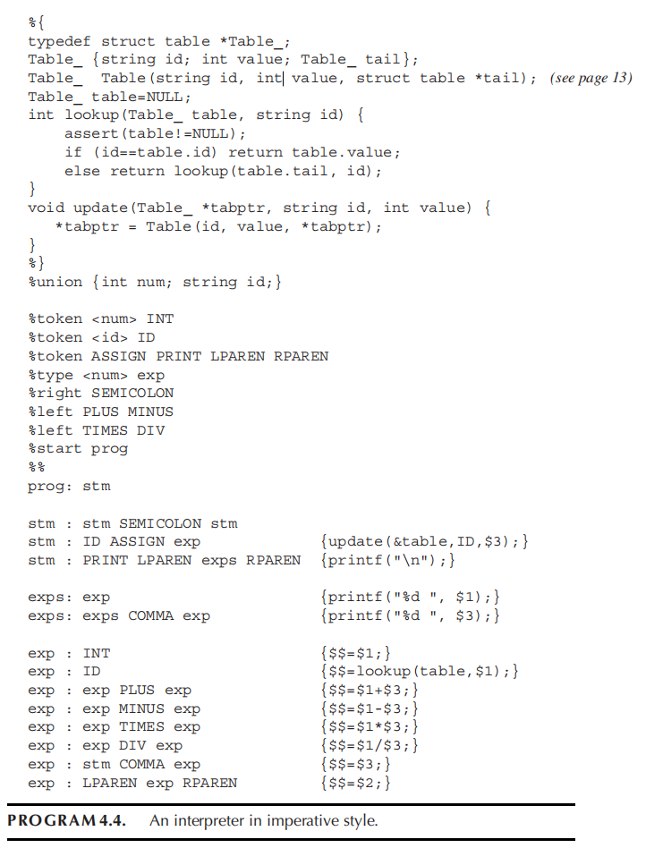

# HW4

## 4.2

???+ question
    Implement Program 4.4 as a recursive-descent parser, with the semantic actions embedded in the parsing functions.

    

??? note "answer"
    ```
    typedef struct table *Table_;

    struct table { 
        char* id;
        int value; 
        Table_ tail;
    };

    Table_ table=NULL;

    int lookup(Table_ table, string id) {
        assert(table!=NULL);
        if (id==table.id) return table.value;
        else return lookup(table.tail, id);
    }

    int lookup(Table_ t, char* id) {
        if (t == NULL) {
            fprintf(stderr, "Error: Undefined variable '%s'\n", id);
            exit(1);
        }
        if (strcmp(id, t->id) == 0) {
            return t->value;
        } else {
            return lookup(t->tail, id);
        }
    }

    void update(Table_ *tabptr, char* id, int value) {
        *tabptr = Table(id, value, *tabptr);
    }

    typedef enum {
        TOK_INT, TOK_ID, TOK_ASSIGN, TOK_PRINT, TOK_LPAREN, TOK_RPAREN,
        TOK_SEMI, TOK_PLUS, TOK_MINUS, TOK_TIMES, TOK_DIV, TOK_COMMA, TOK_EOF
    } TokenKind;

    typedef struct {
        TokenKind kind;
        int int_val;     // 当 kind 为 TOK_INT 时使用
        char id_name[64];// 当 kind 为 TOK_ID 时使用
    } Token;

    Token current_token;
    Token next_token;
    char* source_code;
    int current_pos = 0;

    // 从源码中提取下一个 Token 的基础函数
    Token get_next_token() {
        Token t;
        while (isspace(source_code[current_pos])) {
            current_pos++;
        }
        
        char c = source_code[current_pos];
        if (c == '\0') { 
            t.kind = TOK_EOF; 
            return t; 
        }
        
        if (isdigit(c)) {
            int val = 0;
            while (isdigit(source_code[current_pos])) {
                val = val * 10 + (source_code[current_pos] - '0');
                current_pos++;
            }
            t.kind = TOK_INT; 
            t.int_val = val; 
            return t;
        }
        
        if (isalpha(c)) {
            int i = 0;
            while (isalnum(source_code[current_pos])) {
                t.id_name[i++] = source_code[current_pos++];
            }
            t.id_name[i] = '\0';
            if (strcmp(t.id_name, "print") == 0) {
                t.kind = TOK_PRINT;
            } else {
                t.kind = TOK_ID;
            }
            return t;
        }
        
        current_pos++;

        switch(c) {
            case '=': 
                t.kind = TOK_ASSIGN; 
                break;
            case '(': 
                t.kind = TOK_LPAREN; 
                break;
            case ')': 
                t.kind = TOK_RPAREN; 
                break;
            case ';': 
                t.kind = TOK_SEMI; 
                break;
            case '+': 
                t.kind = TOK_PLUS; 
                break;
            case '-': 
                t.kind = TOK_MINUS; 
                break;
            case '*': 
                t.kind = TOK_TIMES; 
                break;
            case '/': 
                t.kind = TOK_DIV; 
                break;
            case ',': 
                t.kind = TOK_COMMA; 
                break;
            default:  
                fprintf(stderr, "Lexer error: Unknown char '%c'\n", c); 
                exit(1);
        }
        return t;
    }

    // 获取当前Token，向下看一个Token(peek)，以及前进
    void advance() {
        current_token = next_token;
        next_token = get_next_token();
    }

    TokenKind tok() { 
        return current_token.kind; 
    }

    TokenKind peek() { 
        return next_token.kind; 
    }

    void match(TokenKind expected) {
        if (tok() == expected) { 
            advance(); 
        } else { 
            fprintf(stderr, "Syntax Error: Unexpected token.\n"); 
            exit(1); 
        }
    }

    void parse_stm();
    void parse_single_stm();
    void parse_exps();
    int parse_exp();
    int parse_term();
    int parse_factor();

    // 程序入口
    void parse_prog() {
        parse_stm();

        // 如果解析完后还有剩余输入，说明语法错误
        if (tok() != TOK_EOF) {
            fprintf(stderr, "Syntax Error: Expected EOF.\n"); 
            exit(1);
        }
    }

    // 处理多条语句，语句之间用分号分隔
    void parse_stm() {
        parse_single_stm();

        // 如果接下来的 Token 是分号，说明还有下一条语句
        while (tok() == TOK_SEMI) {
            advance(); // 消耗分号
            parse_single_stm();
        }
    }

    // 这里分为赋值语句和打印语句两种情况
    void parse_single_stm() {

        // 如果是 ID，说明是赋值语句
        if (tok() == TOK_ID) {
            char id_buf[64];

            // 先缓存变量名，再消耗掉 ID Token 和 '=' Token
            strcpy(id_buf, current_token.id_name);
            advance();
            match(TOK_ASSIGN);

            // 调用表达式解析器，计算等号右边 exp 的最终结果。
            int val = parse_exp();
            
            // update(&table, ID, $3);
            update(&table, id_buf, val); 
        }

        // 如果是 PRINT，说明是打印语句
        else if (tok() == TOK_PRINT) {
            advance();
            match(TOK_LPAREN);

            // 去解析括号里面的参数列表 exps
            parse_exps();
            match(TOK_RPAREN);
            
            // printf("\n");
            printf("\n");
        } 
        else {
            fprintf(stderr, "Syntax Error: Expected ID or PRINT in statement.\n");
            exit(1);
        }
    }

    // 用于处理 print(a, b, c) 中由逗号分隔的表达式列表
    void parse_exps() {
        // 对应 exps: exp {printf("%d ", $1);}
        int val = parse_exp();
        printf("%d ", val);
        
        // 对应 exps: exps COMMA exp {printf("%d ", $3);}
        // 如果遇到逗号，说明还有参数
        while (tok() == TOK_COMMA) {
            advance();
            val = parse_exp();
            printf("%d ", val);
        }
    }

    // 处理数学表达式
    // 由于加减法的优先级最低，所以它放在最顶层
    int parse_exp() {
        int val = parse_term();

        // 处理连续的加减法
        while (tok() == TOK_PLUS || tok() == TOK_MINUS) {
            TokenKind op = tok();
            advance();

            // 解析加减号右侧可能有的乘除法项
            int val2 = parse_term();
            
            // {$$=$1+$3;} 或 {$$=$1-$3;}
            if (op == TOK_PLUS) {
                val = val + val2;
            } else {
                val = val - val2;
            }
        }
        return val;
    }

    // 处理乘除法
    int parse_term() {
        int val = parse_factor();
        while (tok() == TOK_TIMES || tok() == TOK_DIV) {
            TokenKind op = tok();
            advance();
            int val2 = parse_factor();
            
            // {$$=$1*$3;} 或 {$$=$1/$3;}
            if (op == TOK_TIMES) {
                val = val * val2;
            } else {
                if (val2 == 0) { 
                    fprintf(stderr, "Error: Division by zero\n"); 
                    exit(1); 
                }
                val = val / val2;
            }
        }
        return val;
    }

    // 处理最基础的原子: INT | ID | LPAREN exp RPAREN | stm COMMA exp
    int parse_factor() {

        // 如果是纯数字
        // 直接提取出 Lexer 存好的整数值，吃掉 Token，并返回该值
        if (tok() == TOK_INT) {
            int val = current_token.int_val;
            advance();
            // {$$=$1;}
            return val;
        } 

        // 如果是左括号 (
        // 吃掉左括号，重新回到顶层调用 parse_exp() 计算括号内的复杂表达式，匹配右括号，将计算结果当作一个原子返回
        else if (tok() == TOK_LPAREN) {
            advance();
            int val = parse_exp();
            match(TOK_RPAREN);
            // {$$=$2;}
            return val;
        } 

        // 如果当前是变量名，且下一个 Token 不是等号，这说明它只是在使用变量，而不是在赋值
        else if (tok() == TOK_ID && peek() != TOK_ASSIGN) {
            char id_buf[64];
            strcpy(id_buf, current_token.id_name);
            advance();
            // {$$=lookup(table,$1);}
            return lookup(table, id_buf);
        } 
        else {
            // 余下的唯一合法分支就是: stm COMMA exp
            // 例如:  a = 5, a + 1
            parse_stm();
            match(TOK_COMMA);
            int val = parse_exp();
            // 【{$$=$3;}
            return val;
        }
    }
    ```