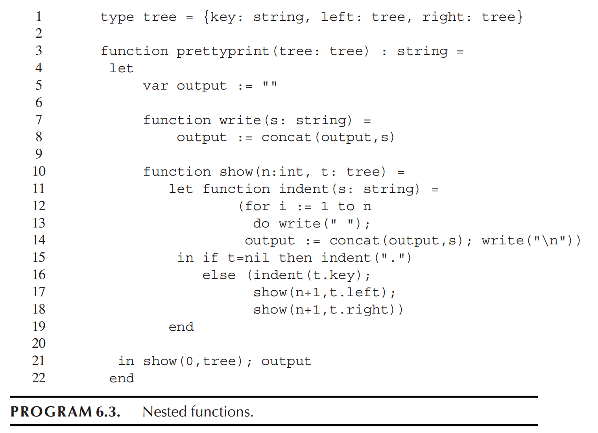
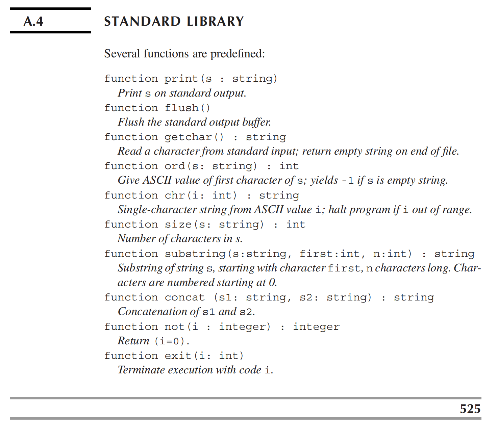
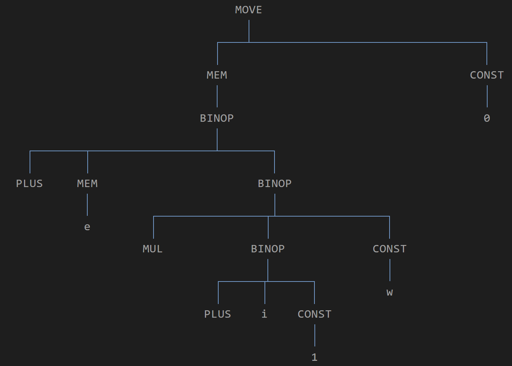
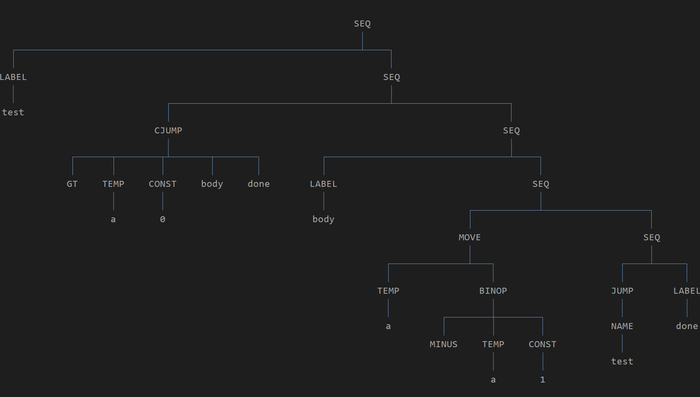
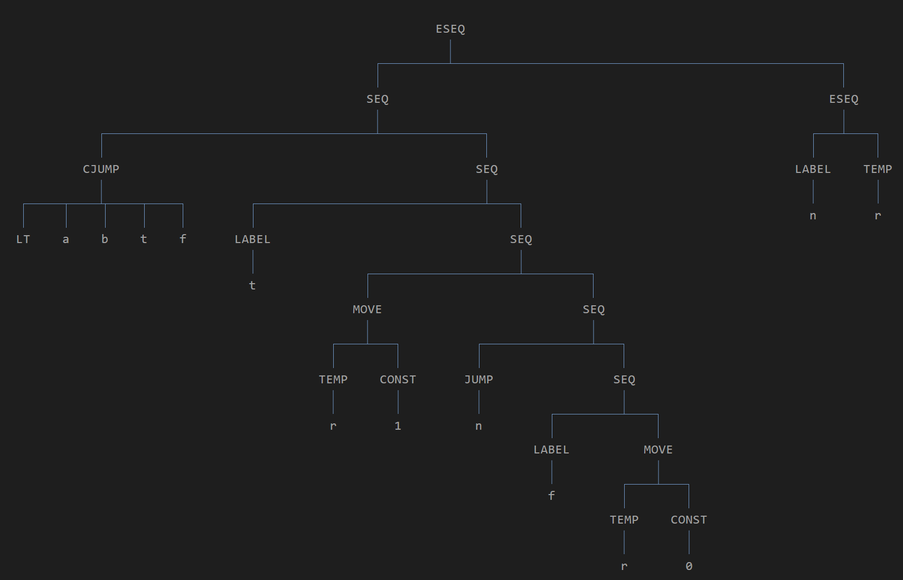

# HW7

## 7.2

???+ question
    Translate each of these expressions into IR trees, but using the Ex, Nx, and Cx constructors as appropriate. In each case, just draw pictures of the trees; an Ex tree will be a Tree exp, an Nx tree will be a Tree stm, and a Cx tree will be a stm with holes labeled true and false into which labels can later be placed.

    a. a+5

    b. output := concat(output,s), as it appears on line 8 of Program 6.3. The concat function is part of the standard library (see page 525), and for purposes of computing its static link, assume it is at the same level of nesting as the prettyprint function.

    c. b[i+1]:=0

    d. (c:=a+1; c*c)

    e. while a>0 do a := a-1

    f. a<b moves a 1 or 0 into some newly defined temporary, and whose right-hand side is the temporary.

    g. if a then b else c, where a is an integer variable (true if $\neq$ 0).

    h. a := x+y

    i. if a<b then a else b

    j. if a<b then c:=a else c:=b

    

    

??? note "answer"
    a. 

    ```mermaid
    graph TD
    classDef default fill:none,stroke:none,color:#000,font-size:16px;
    linkStyle default stroke:#6699cc,stroke-width:1px;

    BINOP --- PLUS
    BINOP --- TEMP
    TEMP --- a
    BINOP --- CONST
    CONST --- 5
    ```

    b. 

    Let the offset of the output in prettyprint to be k_out, the offset of the static chain in the current frame to be k_sl

    And contat is in the same level with prettyprint

    We need dereference the static chain to find the outer file descriptor (fp), then add the offset to get the address of the output.

    Since `concat` is a Level 1 function, anyone calling it must pass it a Level 0 frame pointer. Furthermore, the compiler's calling convention dictates that the stack frame structure of each function must be consistent. This means that, regardless of the function's stack frame, the offset of the pointer to the outer static chain is always fixed.

    ```mermaid
    graph TD
    classDef default fill:none,stroke:none,color:#000,font-size:16px;
    linkStyle default stroke:#6699cc,stroke-width:1px;

    MOVE --- MEM_OUT[MEM]
    MOVE --- CALL

    MEM_OUT --- BINOP_OUT[BINOP]
    BINOP_OUT --- PLUS_OUT[PLUS]
    BINOP_OUT --- MEM_SL1[MEM]
    BINOP_OUT --- CONST_KOUT[CONST]
    CONST_KOUT --- k_out[k_out]

    MEM_SL1 --- BINOP_SL1[BINOP]
    BINOP_SL1 --- PLUS_SL1[PLUS]
    BINOP_SL1 --- TEMP_FP1[TEMP]
    TEMP_FP1 --- fp1[fp]
    BINOP_SL1 --- CONST_KSL1[CONST]
    CONST_KSL1 --- k_sl1[k_sl]

    CALL --- NAME
    CALL --- ARG1_SL[MEM]
    CALL --- ARG2_OUT[MEM]
    CALL --- ARG3_S[TEMP]

    NAME --- concat[concat]

    ARG1_SL --- BINOP_SL2[BINOP]
    BINOP_SL2 --- PLUS_SL2[PLUS]
    BINOP_SL2 --- MEM_SL2[MEM]
    BINOP_SL2 --- CONST_KSL2[CONST]
    CONST_KSL2 --- k_sl2[k_sl]

    MEM_SL2 --- BINOP_SL3[BINOP]
    BINOP_SL3 --- PLUS_SL3[PLUS]
    BINOP_SL3 --- TEMP_FP2[TEMP]
    TEMP_FP2 --- fp2[fp]
    BINOP_SL3 --- CONST_KSL3[CONST]
    CONST_KSL3 --- k_sl3[k_sl]

    ARG2_OUT --- BINOP_ARG_OUT[BINOP]
    BINOP_ARG_OUT --- PLUS_ARG_OUT[PLUS]
    BINOP_ARG_OUT --- MEM_SL3[MEM]
    BINOP_ARG_OUT --- CONST_KOUT2[CONST]
    CONST_KOUT2 --- k_out2[k_out]

    MEM_SL3 --- BINOP_SL4[BINOP]
    BINOP_SL4 --- PLUS_SL4[PLUS]
    BINOP_SL4 --- TEMP_FP3[TEMP]
    TEMP_FP3 --- fp3[fp]
    BINOP_SL4 --- CONST_KSL4[CONST]
    CONST_KSL4 --- k_sl4[k_sl]

    ARG3_S --- s[s]
    ```

    c. 

    If $e$ represents an expression for calculating its stack frame address, then the operation to get its base address is MEM(e).

    Because of Mermaid, this diagram always places `const` to the left of `mem`, which is incorrect. Therefore, I used a different method instead of continuing to draw this diagram using Mermaid.

    

    d. 

    ```mermaid
    graph TD
    classDef default fill:none,stroke:none,color:#000,font-size:16px;
    linkStyle default stroke:#6699cc,stroke-width:1px;

    ESEQ --- MOVE
    ESEQ --- BINOP1[BINOP]

    MOVE --- TEMP1[TEMP]
    TEMP1 --- c1[c]
    MOVE --- BINOP2[BINOP]

    BINOP2 --- PLUS[PLUS]
    BINOP2 --- TEMP2[TEMP]
    TEMP2 --- a[a]
    BINOP2 --- CONST[CONST]
    CONST --- 1[1]

    BINOP1 --- MUL[MUL]
    BINOP1 --- TEMP3[TEMP]
    TEMP3 --- c2[c]
    BINOP1 --- TEMP4[TEMP]
    TEMP4 --- c3[c]
    ```

    e. 

    

    f. 

    

    g. 

    ```mermaid
    graph TD
    classDef default fill:none,stroke:none,color:#000,font-size:16px;
    linkStyle default stroke:#6699cc,stroke-width:1px;

    SEQ --- CJUMP
    CJUMP --- NEQ[NEQ]
    CJUMP --- TEMPa[TEMP]
    TEMPa --- a[a]
    CJUMP --- CONST0[CONST]
    CONST0 --- 0[0]
    CJUMP --- lbl_t1[t]
    CJUMP --- lbl_f1[f]
    SEQ --- SEQ2[SEQ]

    SEQ2 --- LABEL1[LABEL]
    LABEL1 --- t[t]
    SEQ2 --- SEQ3[SEQ]

    SEQ3 --- b[b]
    SEQ3 --- SEQ4[SEQ]

    SEQ4 --- JUMP
    JUMP --- NAME[NAME]
    NAME --- end1[end]
    SEQ4 --- SEQ5[SEQ]

    SEQ5 --- LABEL2[LABEL]
    LABEL2 --- f[f]
    SEQ5 --- SEQ6[SEQ]

    SEQ6 --- c[c]
    SEQ6 --- LABEL3[LABEL]
    LABEL3 --- end2[end]
    ```

    h. 

    ```mermaid
    graph TD
    classDef default fill:none,stroke:none,color:#000,font-size:16px;
    linkStyle default stroke:#6699cc,stroke-width:1px;

    MOVE --- TEMPa[TEMP]
    TEMPa --- a[a]
    MOVE --- BINOP
    BINOP --- PLUS[PLUS]
    BINOP --- TEMPx[TEMP]
    TEMPx --- x[x]
    BINOP --- TEMPy[TEMP]
    TEMPy --- y[y]   
    ```

    i. 

    ```mermaid
    graph TD
    classDef default fill:none,stroke:none,color:#000,font-size:16px;
    linkStyle default stroke:#6699cc,stroke-width:1px;

    SEQ --- CJUMP
    CJUMP --- LT[LT]
    CJUMP --- TEMPa1[TEMP]
    TEMPa1 --- a1[a]
    CJUMP --- TEMPb1[TEMP]
    TEMPb1 --- b1[b]
    CJUMP --- lbl_t1[t]
    CJUMP --- lbl_f1[f]
    SEQ --- SEQ2[SEQ]

    SEQ2 --- LABEL1[LABEL]
    LABEL1 --- t[t]
    SEQ2 --- SEQ3[SEQ]

    SEQ3 --- a2[a]
    SEQ3 --- SEQ4[SEQ]

    SEQ4 --- JUMP
    JUMP --- NAME[NAME]
    NAME --- end1[end]
    SEQ4 --- SEQ5[SEQ]

    SEQ5 --- LABEL2[LABEL]
    LABEL2 --- f[f]
    SEQ5 --- SEQ6[SEQ]

    SEQ6 --- MOVE2[MOVE]
    MOVE2 --- TEMPr2[TEMP]
    TEMPr2 --- r2[r]
    MOVE2 --- TEMPb2[TEMP]
    TEMPb2 --- b2[b]
    SEQ6 --- LABEL3[LABEL]
    LABEL3 --- end2[end]
    ```

    j. 

    ```mermaid
    graph TD
    classDef default fill:none,stroke:none,color:#000,font-size:16px;
    linkStyle default stroke:#6699cc,stroke-width:1px;

    SEQ1[SEQ] --- CJUMP
    CJUMP --- LT[LT]
    CJUMP --- TEMPa1[TEMP]
    TEMPa1 --- a1[a]
    CJUMP --- TEMPb1[TEMP]
    TEMPb1 --- b1[b]
    CJUMP --- lbl_t1[t]
    CJUMP --- lbl_f1[f]
    SEQ1 --- SEQ2[SEQ]

    SEQ2 --- LABEL1[LABEL]
    LABEL1 --- t[t]
    SEQ2 --- SEQ3[SEQ]

    SEQ3 --- MOVE1[MOVE]
    MOVE1 --- TEMPc1[TEMP]
    TEMPc1 --- c1[c]
    MOVE1 --- TEMPa2[TEMP]
    TEMPa2 --- a2[a]
    SEQ3 --- SEQ4[SEQ]

    SEQ4 --- JUMP
    JUMP --- NAME[NAME]
    NAME --- end1[end]
    SEQ4 --- SEQ5[SEQ]

    SEQ5 --- LABEL2[LABEL]
    LABEL2 --- f[f]
    SEQ5 --- SEQ6[SEQ]

    SEQ6 --- MOVE2[MOVE]
    MOVE2 --- TEMPc2[TEMP]
    TEMPc2 --- c2[c]
    MOVE2 --- TEMPb2[TEMP]
    TEMPb2 --- b2[b]
    SEQ6 --- LABEL3[LABEL]
    LABEL3 --- end2[end]
    ```