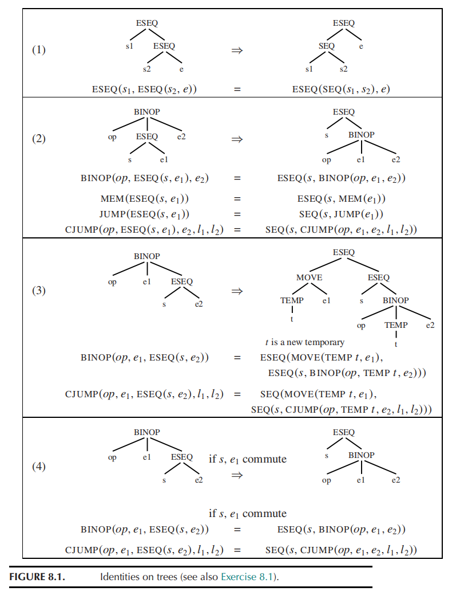
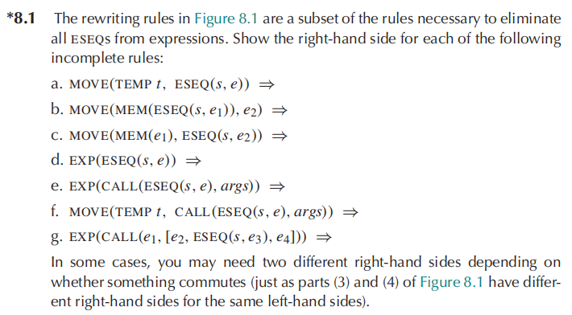
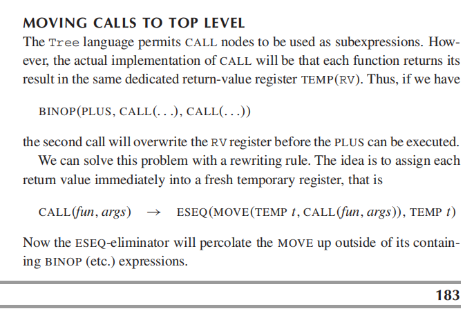
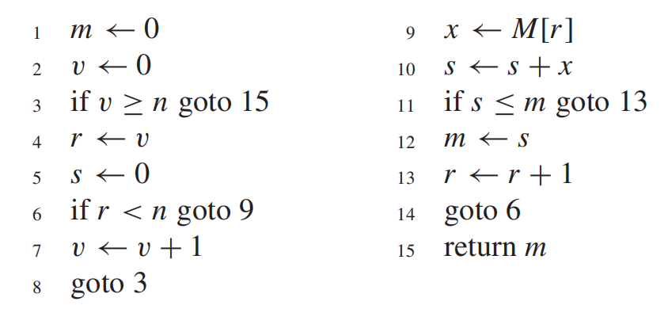
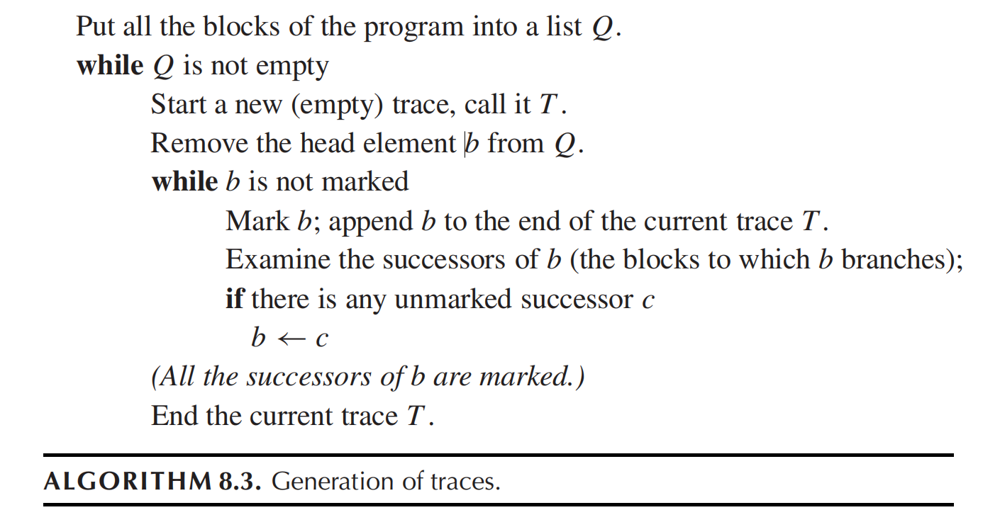

# HW8

## 8.2

???+ question
    Draw each of the following expressions as a tree diagram, and then apply the rewriting rules of Figure 8.1 and Exercise 8.1, as well as the CALL rule on page 183.

    a. MOVE(MEM(ESEQ(SEQ(CJUMP(LT, $TEMP_i$, $CONST_0$, $L_{out}$, $L_{ok}$), $LABEL_{ok}$), $TEMP_i$)), $CONST_1$)

    b. MOVE(MEM(MEM($NAME_a$)), MEM(CALL($TEMP_f$ , [])))

    c. BINOP(PLUS, CALL($NAME_f$ , [$TEMP_x$]), CALL($NAME_g$, [ESEQ(MOVE($TEMP_x$ , $CONST_0$), $TEMP_x$)]))

    

    

    

??? note "answer"
    a. 表达式 A

    **原始表达式**:`MOVE(MEM(ESEQ(SEQ(CJUMP(LT, TEMP_i, CONST_0, L_out, L_ok), LABEL_ok), TEMP_i)), CONST_1)`

    1. 树状图 (Tree Diagram)

    ```text
    MOVE
    ├── MEM
    │   └── ESEQ
    │       ├── SEQ
    │       │   ├── CJUMP
    │       │   │   ├── LT
    │       │   │   ├── TEMP_i
    │       │   │   ├── CONST_0
    │       │   │   ├── L_out
    │       │   │   └── L_ok
    │       │   └── LABEL_ok
    │       └── TEMP_i
    └── CONST_1
    ```

    2. 重写与验证过程 (Rewriting & Verification)

    * **分析**：观察树的结构，这是一个 `MOVE` 操作，其目标地址包含一个 `ESEQ`。其基本模式匹配 Exercise 8.1 中的 **规则 (b)**：`MOVE(MEM(ESEQ(s, e1)), e2)`。

    * **应用规则**：根据规则 (b)，我们应该将副作用 $s$ 提取到外层：

    $$MOVE(MEM(ESEQ(s, e_1)), e_2) \Rightarrow SEQ(s, MOVE(MEM(e_1), e_2))$$

    * **变量代入**：

    * $s =$ `SEQ(CJUMP(LT, TEMP_i, CONST_0, L_out, L_ok), LABEL_ok)`

    * $e_1 =$ `TEMP_i`

    * $e_2 =$ `CONST_1`

    * **转换结果**：`SEQ(SEQ(CJUMP(LT, TEMP_i, CONST_0, L_out, L_ok), LABEL_ok), MOVE(MEM(TEMP_i), CONST_1))`

    * **逻辑验证 (Verification)**：原始表达式在写入 `CONST_1` 之前，会先执行 `ESEQ` 中的 $s$（即边界检查的 `CJUMP` 逻辑），然后返回 `TEMP_i` 作为内存地址。重写后的表达式同样先严格执行 $s$，随后将 `CONST_1` 写入 `MEM(TEMP_i)`。两者执行顺序和语义完全等价。

    ---

    b. 表达式 B

    **原始表达式**:

    `MOVE(MEM(MEM(NAME_a)), MEM(CALL(TEMP_f , [])))`

    1. 树状图 (Tree Diagram)

    ```text
    MOVE
    ├── MEM
    │   └── MEM
    │       └── NAME_a
    └── MEM
        └── CALL
            ├── TEMP_f
            └── []
    ```

    2. 重写与验证过程 (Rewriting & Verification)

    * **分析**：表达式右侧包含一个 `CALL`。根据教材第 183 页的规则（Image 8-3），为防止嵌套调用覆盖返回值寄存器，所有的 `CALL` 必须被提升，将其结果存入一个新的临时寄存器中。

    * **Step 1：处理 CALL**

    $$CALL(fun, args) \rightarrow ESEQ(MOVE(TEMP\ t, CALL(fun, args)), TEMP\ t)$$

    代入后，右侧变为 `MEM(ESEQ(MOVE(TEMP t1, CALL(TEMP_f, [])), TEMP t1))`，其中 $t_1$ 是新生成的临时变量。

    * **Step 2：将 ESEQ 移出 MEM**

    根据 Figure 8.1 的 **规则 (2)**，`MEM(ESEQ(s, e)) => ESEQ(s, MEM(e))`。

    应用后右侧变为：`ESEQ(MOVE(TEMP t1, CALL(TEMP_f, [])), MEM(TEMP t1))`。

    此时整体表达式为：`MOVE(MEM(MEM(NAME_a)), ESEQ(MOVE(TEMP t1, CALL(TEMP_f, [])), MEM(TEMP t1)))`

    * **Step 3：处理 MOVE 中的 ESEQ**

    当前结构匹配 Exercise 8.1 的 **规则 (c)**：`MOVE(MEM(e1), ESEQ(s, e2))`。

    其中 $e_1 =$ `MEM(NAME_a)`， $s =$ `MOVE(TEMP t1, CALL(TEMP_f, []))`， $e_2 =$ `MEM(TEMP t1)`。

    我们需要判断 $e_1$ 与 $s$ 是否满足交换律 (commute)。由于 $s$ 包含一个函数调用 `CALL`，函数内部可能会修改任意内存状态，而 $e_1$ 是对内存 `MEM(NAME_a)` 的读取。因此，它们**不满足交换律 (do not commute)**。

    * **Step 4：应用非交换规则**

    对于不满足交换律的情况，规则 (c) 的右侧为：

    $$SEQ(MOVE(TEMP\ t_2, e_1), SEQ(s, MOVE(MEM(TEMP\ t_2), e_2)))$$

    代入我们的子表达式（$t_2$ 为新的临时变量）：

    `SEQ(MOVE(TEMP t2, MEM(NAME_a)), SEQ(MOVE(TEMP t1, CALL(TEMP_f, [])), MOVE(MEM(TEMP t2), MEM(TEMP t1))))`

    * **逻辑验证 (Verification)**：不满足交换律时，必须严格遵守从左到右的求值顺序。上面的结果首先计算目标内存地址 `MEM(NAME_a)` 并将其保存在安全的地方（$t_2$）；接着执行具有未知副作用的 `CALL` 并将其返回值保存在 $t_1$；最后将值 `MEM(t1)` 写入之前保存的目标地址 `MEM(t2)` 中。语义严格一致，验证通过。

    ---

    c. 表达式 C

    **原始表达式**:

    `BINOP(PLUS, CALL(NAME_f , [TEMP_x]), CALL(NAME_g, [ESEQ(MOVE(TEMP_x , CONST_0), TEMP_x)]))`

    1. 树状图 (Tree Diagram)

    ```text
    BINOP
    ├── PLUS
    ├── CALL
    │   ├── NAME_f
    │   └── [TEMP_x]
    └── CALL
        ├── NAME_g
        └── [ESEQ]
            ├── MOVE
            │   ├── TEMP_x
            │   └── CONST_0
            └── TEMP_x
    ```

    2. 重写与验证过程 (Rewriting & Verification)

    * **分析**：这个二元操作包含两个 `CALL`，并且第二个 `CALL` 的参数中嵌套了一个 `ESEQ`。我们需要消除所有的 `ESEQ` 并提取 `CALL`。

    * **Step 1：提取所有的 CALL (Page 183 规则)**左侧 (`L`) 变为：`ESEQ(MOVE(TEMP t1, CALL(NAME_f, [TEMP_x])), TEMP t1)`右侧 (`R`) 变为：`ESEQ(MOVE(TEMP t2, CALL(NAME_g, [ESEQ(MOVE(TEMP_x, CONST_0), TEMP_x)])), TEMP t2)`

    * **Step 2：清理右侧 (R) 中的参数 ESEQ**对于 `R` 中的函数调用 `CALL(NAME_g, [ESEQ(...)])`，因为这是唯一的参数，它前面没有其他参数产生副作用冲突，所以根据 Exercise 8.1(g) 的泛化规则，我们可以直接将 `ESEQ` 提出来：
        
    `CALL(NAME_g, [ESEQ(MOVE(TEMP_x, CONST_0), TEMP_x)])` $\Rightarrow$ `ESEQ(MOVE(TEMP_x, CONST_0), CALL(NAME_g, [TEMP_x]))`

    把它代回到 `R` 的赋值语句中，`R` 变为：

    `ESEQ(MOVE(TEMP t2, ESEQ(MOVE(TEMP_x, CONST_0), CALL(NAME_g, [TEMP_x]))), TEMP t2)`

    * **Step 3：消除 R 内部的 ESEQ**观察 `R` 内部语句：`MOVE(TEMP t2, ESEQ(s, e))`。根据 Exercise 8.1(a)，这会被重写为 `SEQ(s, MOVE(TEMP t2, e))`。因此 `R` 彻底化简为：

    `ESEQ(SEQ(MOVE(TEMP_x, CONST_0), MOVE(TEMP t2, CALL(NAME_g, [TEMP_x]))), TEMP t2)`

    * **Step 4：合并到 BINOP 中**现在的顶层表达式是 `BINOP(PLUS, L, R)`。

    将化简后的 `L` 代入：`BINOP(PLUS, ESEQ(s_L, TEMP t1), R)`

    （其中 $s_L =$ `MOVE(TEMP t1, CALL(NAME_f, [TEMP_x]))`）

    应用 Figure 8.1(2) 提取左侧 `ESEQ`：

    `ESEQ(s_L, BINOP(PLUS, TEMP t1, R))`

    * **Step 5：提取右侧的 ESEQ** 将化简后的 `R` 代入 `BINOP`：`BINOP(PLUS, TEMP t1, ESEQ(s_R, TEMP t2))` （其中 $s_R =$ `SEQ(MOVE(TEMP_x, CONST_0), MOVE(TEMP t2, CALL(NAME_g, [TEMP_x])))`）

    根据 Figure 8.1(4)，由于左操作数 `TEMP t1` 是我们刚才生成的一个全新临时寄存器，它与任何后续运算（即 $s_R$）**满足交换律 (commute)**。

    应用交换规则：`BINOP(op, e1, ESEQ(s, e2)) => ESEQ(s, BINOP(op, e1, e2))`。

    结果变为：`ESEQ(s_R, BINOP(PLUS, TEMP t1, TEMP t2))`。

    * **Step 6：合并所有的 ESEQ**

    结合 Step 4 和 Step 5：`ESEQ(s_L, ESEQ(s_R, BINOP(PLUS, TEMP t1, TEMP t2)))`

    根据 Figure 8.1(1) 合并嵌套：`ESEQ(SEQ(s_L, s_R), BINOP(PLUS, TEMP t1, TEMP t2))`

    * **最终结果代入**： `ESEQ(SEQ(MOVE(TEMP t1, CALL(NAME_f, [TEMP_x])), SEQ(MOVE(TEMP_x, CONST_0), MOVE(TEMP t2, CALL(NAME_g, [TEMP_x])))), BINOP(PLUS, TEMP t1, TEMP t2))`

    * **逻辑验证 (Verification)**：树的最外层 `SEQ` 完美保留了执行顺序。先调用 `NAME_f` 保存至 $t_1$；接着处理右侧参数，将 `CONST_0` 赋给 `TEMP_x`；然后使用修改后的 `TEMP_x` 调用 `NAME_g` 保存至 $t_2$；最后通过 `BINOP` 相加两个安全纯净的临时变量 $t_1, t_2$。逻辑无懈可击，验证通过。

---

## 8.6

???+ question
    Break this program into basic blocks.

    

??? note "answer"
    **1. 什么是基本块？**

    基本块是代码的直线型序列，它具有以下两个特点：

    * 控制流只能从基本块的第一条指令进入。
    * 控制流只能从基本块的最后一条指令离开（不能在中间发生跳转，也不能有跳转目标指向基本块的中间）。

    **2. 划分基本块的算法（寻找首指令/Leaders）**

    我们要找到所有基本块的第一条指令（我们称之为 **Leader**），规则如下：

    * **规则 A**：程序的第一条指令是一个 Leader。
    * **规则 B**：任何条件或无条件跳转指令（`goto`）的**目标指令**是一个 Leader。
    * **规则 C**：任何紧跟在条件或无条件跳转指令（`goto`）**之后的指令**是一个 Leader。

    **3. 按照规则分析给定的程序**

    我们逐行扫描这 15 行代码，寻找 Leaders：

    * 根据 **规则 A**：第 $1$ 行是 Leader。

    寻找跳转目标 (根据 **规则 B**)：

    * 第 $3$ 行 `goto 15` $\rightarrow$ 第 $15$ 行是 Leader。
    * 第 $6$ 行 `goto 9` $\rightarrow$ 第 $9$ 行是 Leader。
    * 第 $8$ 行 `goto 3` $\rightarrow$ 第 $3$ 行是 Leader。
    * 第 $11$ 行 `goto 13` $\rightarrow$ 第 $13$ 行是 Leader。
    * 第 $14$ 行 `goto 6` $\rightarrow$ 第 $6$ 行是 Leader。

    寻找跳转语句后面的指令 (根据 **规则 C**)：

    * 第 $3$ 行是跳转 $\rightarrow$ 第 $4$ 行是 Leader。
    * 第 $6$ 行是跳转 $\rightarrow$ 第 $7$ 行是 Leader。
    * 第 $8$ 行是跳转 $\rightarrow$ 第 $9$ 行是 Leader (前面已包含)。
    * 第 $11$ 行是跳转 $\rightarrow$ 第 $12$ 行是 Leader。
    * 第 $14$ 行是跳转 $\rightarrow$ 第 $15$ 行是 Leader (前面已包含)。

    **4. 汇总所有的 Leaders**

    将上述找到的行号从小到大排序，我们得到的 Leaders 集合为：

    $\{1, 3, 4, 6, 7, 9, 12, 13, 15\}$

    **5. 构造基本块**

    一个基本块由一个 Leader 开始，包含所有后续指令，直到（但不包含）下一个 Leader。

    * $B_1$: 第 $1$ 行到第 $2$ 行
    * $B_2$: 第 $3$ 行
    * $B_3$: 第 $4$ 行到第 $5$ 行
    * $B_4$: 第 $6$ 行
    * $B_5$: 第 $7$ 行到第 $8$ 行
    * $B_6$: 第 $9$ 行到第 $11$ 行
    * $B_7$: 第 $12$ 行
    * $B_8$: 第 $13$ 行到第 $14$ 行
    * $B_9$: 第 $15$ 行

    逻辑验证无误。以下是为您整理的详细解答。

    ---

    ### 中文详细讲解

    将这段程序划分为基本块，我们需要先找出所有的**首指令 (Leaders)**。首指令是每个基本块的入口。

    **寻找首指令的规则如下：**

    1.  程序的第一条指令（第 $1$ 行）。
    2.  所有 `goto` 语句跳转的目标位置（第 $3, 6, 9, 13, 15$ 行）。
    3.  紧跟在条件或无条件 `goto` 语句后面的那条指令（第 $4, 7, 9, 12, 15$ 行）。

    综合以上规则，我们的首指令所在的行号为：**$1, 3, 4, 6, 7, 9, 12, 13, 15$**。

    从一个首指令开始，直到下一个首指令之前的所有代码，构成一个基本块。最终划分的 9 个基本块如下：

    * **基本块 $B_1$** (指令 $1-2$)

    1: $m \leftarrow 0$

    2: $v \leftarrow 0$

    * **基本块 $B_2$** (指令 $3$)

    3: if $v \ge n$ goto 15

    * **基本块 $B_3$** (指令 $4-5$)

    4: $r \leftarrow v$

    5: $s \leftarrow 0$

    * **基本块 $B_4$** (指令 $6$)

    6: if $r < n$ goto 9

    * **基本块 $B_5$** (指令 $7-8$)

    7: $v \leftarrow v + 1$

    8: goto 3

    * **基本块 $B_6$** (指令 $9-11$)

    9: $x \leftarrow M[r]$

    10: $s \leftarrow s + x$

    11: if $s \le m$ goto 13

    * **基本块 $B_7$** (指令 $12$)

    12: $m \leftarrow s$

    * **基本块 $B_8$** (指令 $13-14$)

    13: $r \leftarrow r + 1$

    14: goto 6

    * **基本块 $B_9$** (指令 $15$)

    15: return $m$

---

## 8.7

???+ question
    Express the basic blocks of Exercise 8.6 as statements in the Tree intermediate form, and use Algorithm 8.3 to generate a set of traces.

    

??? note "answer"
    在规范的 Tree IR 中，每一个基本块都必须以一个 `LABEL` 开始，并且**必定**以一个 `JUMP` 或 `CJUMP` 结束。原本的自然流入(fall-through)都需要被显式地加上 `JUMP` 指令。

    * **$B_1$**

    ```
    LABEL(L1)
    MOVE(TEMP(m), CONST(0))
    MOVE(TEMP(v), CONST(0))
    JUMP(NAME(L3), [L3])
    ```

    **$B_2$**

    ```
    LABEL(L3)
    CJUMP(GE, TEMP(v), TEMP(n), L15, L4)
    ```

    **$B_3$**

    ```
    LABEL(L4)
    MOVE(TEMP(r), TEMP(v))
    MOVE(TEMP(s), CONST(0))
    JUMP(NAME(L6), [L6])
    ```

    **$B_4$**

    ```
    LABEL(L6)
    CJUMP(LT, TEMP(r), TEMP(n), L9, L7)
    ```

    **$B_5$**

    ```
    LABEL(L7)
    MOVE(TEMP(v), BINOP(PLUS, TEMP(v), CONST(1)))
    JUMP(NAME(L3), [L3])
    ```

    **$B_6$**

    ```
    LABEL(L9)
    MOVE(TEMP(x), MEM(TEMP(r)))
    MOVE(TEMP(s), BINOP(PLUS, TEMP(s), TEMP(x)))
    CJUMP(LE, TEMP(s), TEMP(m), L13, L12)
    ```

    **$B_7$**

    ```
    LABEL(L12)
    MOVE(TEMP(m), TEMP(s))
    JUMP(NAME(L13), [L13])
    ```

    **$B_8$**

    ```
    LABEL(L13)
    MOVE(TEMP(r), BINOP(PLUS, TEMP(r), CONST(1)))
    JUMP(NAME(L6), [L6])
    ```

    **$B_9$**

    ```
    LABEL(L15)
    MOVE(TEMP(RV), TEMP(m))
    JUMP(NAME(L_done), [L_done])
    ```

    3. 使用算法 8.3 生成 Traces (轨迹)

    算法 8.3 的核心思想是贪心策略：将所有基本块放入列表 $Q$，只要 $Q$ 不为空，就取出未标记的块作为轨迹起点，并不断将未标记的**后继块**（Successors）加入当前轨迹中，直到所有后继均已标记为止。

    **优化准则**：在遇到 `CJUMP` 时，通常会有 True 和 False 两个后继。为了生成最高效的机器码，编译器实践中会**优先选择 False 分支**（即条件不成立时的 fall-through 分支）作为下一个后继，这样在后续指令选择时可以省去一条无条件 `JUMP` 指令。

    **执行过程：**

    **初始列表**：$Q = [B_1, B_2, B_3, B_4, B_5, B_6, B_7, B_8, B_9]$

    **生成 $Trace_1$**：

    * 从队列头取出 $B_1$，标记它。$T_1 = [B_1]$
    * $B_1$ 的后继是 $B_2$（未标记）。标记 $B_2$。$T_1 = [B_1, B_2]$
    * $B_2$ 有两个后继 $B_9, B_3$。优先选取 False 分支 $B_3$。标记 $B_3$。$T_1 = [B_1, B_2, B_3]$
    * $B_3$ 的后继是 $B_4$。标记 $B_4$。$T_1 = [B_1, B_2, B_3, B_4]$
    * $B_4$ 有两个后继 $B_6, B_5$。优先选取 False 分支 $B_5$。标记 $B_5$。$T_1 = [B_1, B_2, B_3, B_4, B_5]$
    * $B_5$ 的后继是 $B_2$。但 $B_2$ **已被标记**。没有其他未标记的后继了。
    * **结束 $Trace_1$**：$T_1 = [B_1, B_2, B_3, B_4, B_5]$

    **生成 $Trace_2$**：

    * 跳过队列中已标记的块，下一个未标记的块是 $B_6$。标记 $B_6$。$T_2 = [B_6]$
    * $B_6$ 的后继有 $B_8, B_7$。选取 False 分支 $B_7$。标记 $B_7$。$T_2 = [B_6, B_7]$
    * $B_7$ 的后继是 $B_8$。标记 $B_8$。$T_2 = [B_6, B_7, B_8]$
    * $B_8$ 的后继是 $B_4$。$B_4$ **已被标记**。
    * **结束 $Trace_2$**：$T_2 = [B_6, B_7, B_8]$

    **生成 $Trace_3$**：

    * 队列中唯一剩余未标记的块是 $B_9$。标记 $B_9$。$T_3 = [B_9]$
    * $B_9$ 没有后继。
    * **结束 $Trace_3$**：$T_3 = [B_9]$

    至此，队列 $Q$ 中所有基本块均被标记，算法完成。