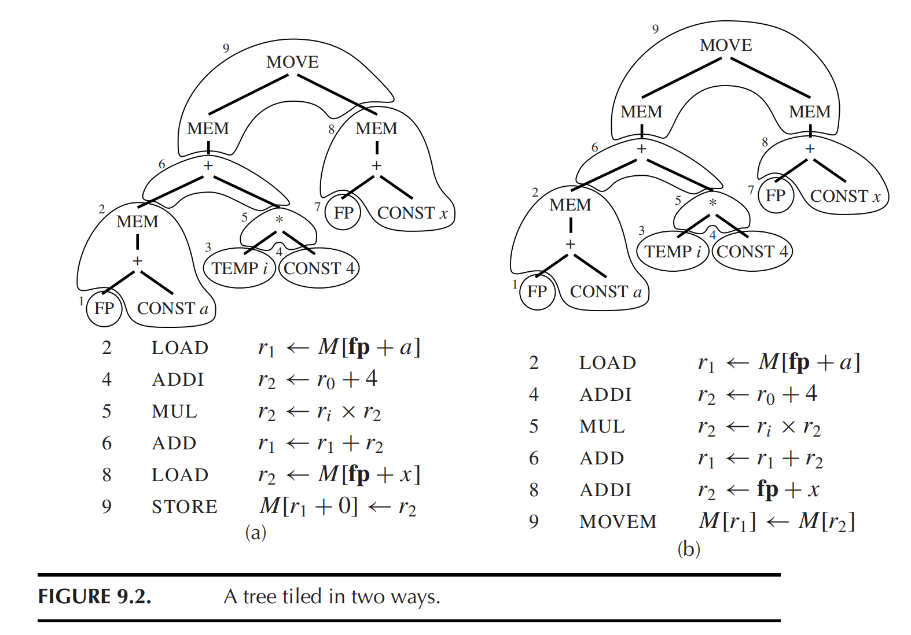

# HW9

## 9.1

???+ question
    For each of the following expressions, draw the tree and generate Jouette-machine instructions using Maximal Munch. Circle the tiles (as in Figure 9.2), but number them in the order that they are munched, and show the sequence of Jouette instructions that results.

    a. MOVE(MEM(+(+($CONST_{1000}$, MEM($TEMP_x$ )), $TEMP_{fp}$)), $CONST_0$)

    b. BINOP(MUL, $CONST_5$, MEM($CONST_{100}$))

    

??? note "answer"
    a. 表达式: `MOVE(MEM(+(+($CONST_{1000}$, MEM($TEMP_x$ )), $TEMP_{fp}$)), $CONST_0$)`

    **1. 树形结构与 Tile 划分 (按后序遍历编号)**

    我使用方括号 `[Tile N: ...]` 来表示每个 Tile。编号 $1 \sim 7$ 代表 Maximal Munch 算法递归返回时实际吞噬并生成代码的顺序（自底向上）。

    ```text
                            [Tile 7: MOVE, MEM]
                            /               \
                [Tile 5: +]                 [Tile 6: CONST_0]
                /       \
    [Tile 3: +, CONST_1000] [Tile 4: TEMP_fp]
                /
        [Tile 2: MEM]
                |
        [Tile 1: TEMP_x]
    ```

    **2. 匹配与吞噬顺序解析 (Munching Order)**

    按照后序遍历（先左子树，再右子树，最后父节点）：

    * **Tile 1**: 遍历到最左下角的 `$TEMP_x$`。它匹配 `TEMP` 模式，不需要生成指令，直接提供寄存器 $r_x$。
    * **Tile 2**: 回溯到其父节点 `MEM`。匹配模式 `MEM(TEMP)`，吞噬 `MEM`。
    * **Tile 3**: 回溯到加法节点 `+`，它的左子节点是 `$CONST_{1000}$`。该节点匹配 Jouette 的加立即数模式 `+(CONST, TEMP)`（或等价的 `+(TEMP, CONST)`）。因此 `+` 和 `$CONST_{1000}$` 被作为一个 Tile 一起吞噬。
    * **Tile 4**: 遍历到右侧的 `$TEMP_{fp}$`。匹配 `TEMP` 模式，提供帧指针寄存器 $fp$。
    * **Tile 5**: 回溯到外层的 `+` 节点。左右子树都已经处理为寄存器，匹配 `+(TEMP, TEMP)` 模式，吞噬外层 `+`。
    * **Tile 6**: 遍历到 `MOVE` 节点的右子树 `$CONST_0$`。因为 `STORE` 指令需要一个源寄存器，必须匹配 `CONST` 模式将其单独吞入。
    * **Tile 7**: 最后回到根节点 `MOVE`。由于左子树的根是一个 `MEM`，它可以匹配 Jouette 的内存写模式 `MOVE(MEM(TEMP), TEMP)`。因此 `MOVE` 和其左孩子的 `MEM` 被一起吞噬。

    **3. Jouette 指令序列 (Sequence of Instructions)**

    代码生成的顺序与 Tile 的编号完全一致。假设 $r_0$ 恒为 0：

    1. *(Tile 1 提供 $r_x$)*
    2. `LOAD  r_1 <- M[r_x + 0]`  *(由 Tile 2 生成)*
    3. `ADDI  r_2 <- r_1 + 1000`  *(由 Tile 3 生成)*
    4. *(Tile 4 提供 fp)*
    5. `ADD   r_3 <- r_2 + fp`    *(由 Tile 5 生成)*
    6. `ADDI  r_4 <- r_0 + 0`     *(由 Tile 6 生成，将 0 加载到寄存器)*
    7. `STORE M[r_3 + 0] <- r_4`  *(由 Tile 7 生成，执行写入)*

    b. 表达式: `BINOP(MUL, $CONST_5$, MEM($CONST_{100}$))`

    **1. 树形结构与 Tile 划分 (按后序遍历编号)**

    ```text
                    [Tile 3: MUL]
                    /           \
            [Tile 1: CONST_5]    [Tile 2: MEM, CONST_100]
    ```

    **2. 匹配与吞噬顺序解析 (Munching Order)**

    同样按照先左后右的后序遍历：

    * **Tile 1**: 左子树 `$CONST_5$`。由于 `MUL` 指令需要寄存器操作数，这里匹配 `CONST` 模式。
    * **Tile 2**: 右子树 `MEM($CONST_{100}$)`。在匹配 `MEM` 时，发现其子节点是常数，这符合 Jouette 的基址寻址（以 $r_0$ 为基址偏移 100）。匹配 `MEM(CONST)` 模式，吞噬 `MEM` 和 `$CONST_{100}$`。
    * **Tile 3**: 根节点 `MUL`。左右子节点的结果都在寄存器中，匹配 `*(TEMP, TEMP)` 模式，吞噬 `MUL` 本身。

    **3. Jouette 指令序列 (Sequence of Instructions)**

    1. `ADDI r_1 <- r_0 + 5`      *(由 Tile 1 生成)*
    2. `LOAD r_2 <- M[r_0 + 100]` *(由 Tile 2 生成，也可写为 LOAD r_2 <- M[100])*
    3. `MUL  r_3 <- r_1 * r_2`    *(由 Tile 3 生成)*