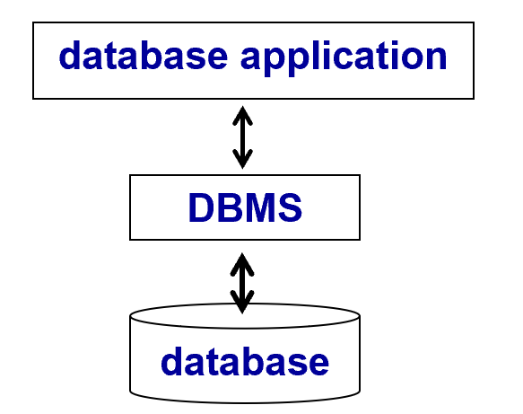
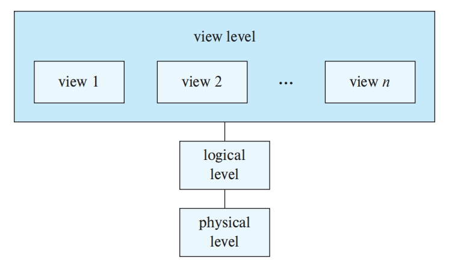
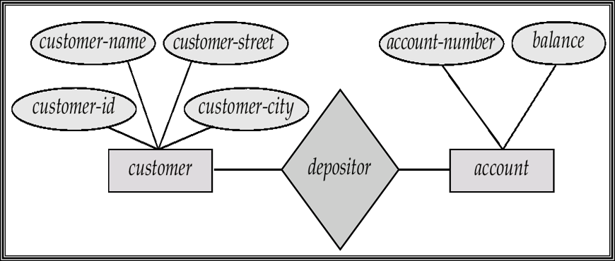
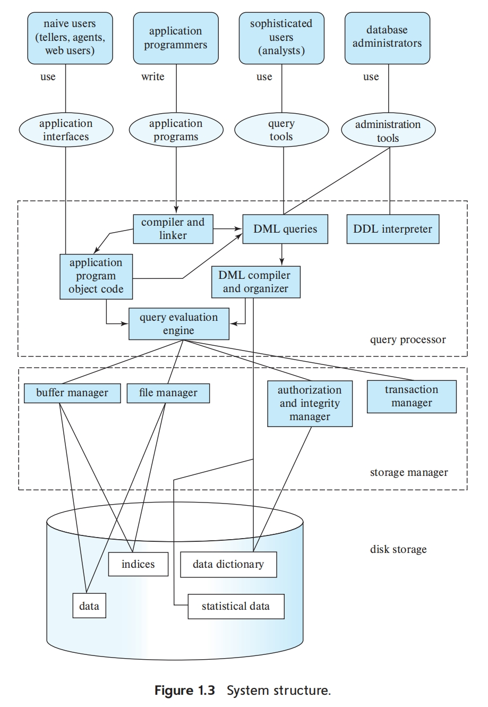
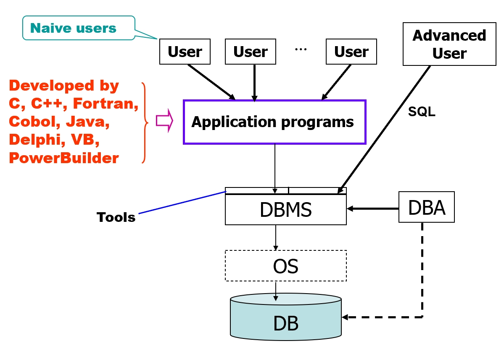
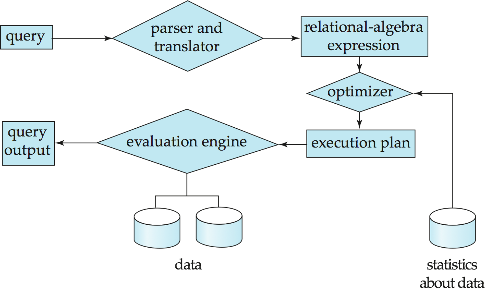
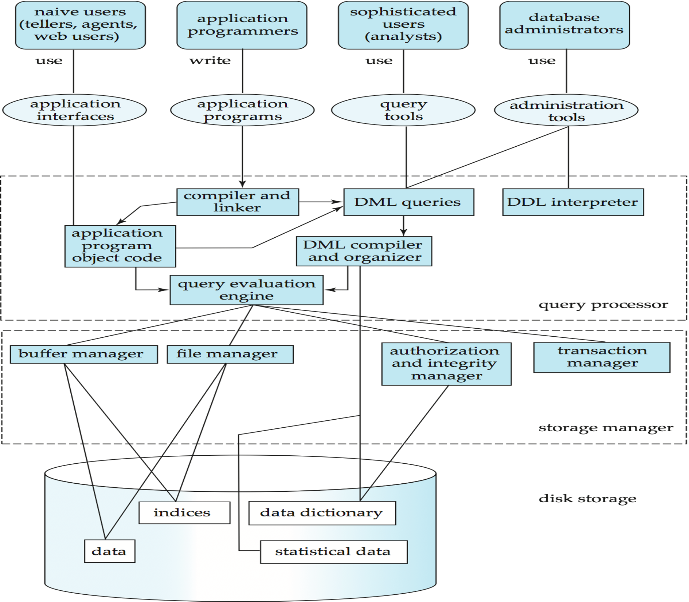
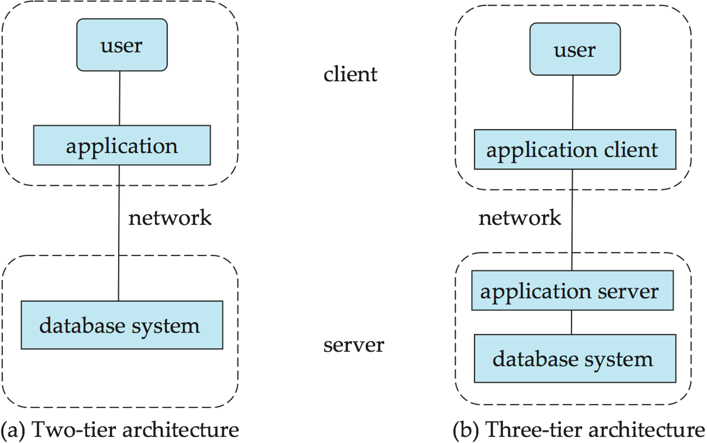

# Chapter 1 | Introduction

??? Abstract "Table of Contents"
    - Purpose of Database Systems
    
    - View of Data 
    
    - Database Language 
    
    - Database Design 
    
    - Database Users and Administrators 
    
    - Transaction Management 
    
    - Database Architecture 
    
    - History of Database Systems 
    
    - Summary 

Database is a collection of interrelated data about a enterprise, which is managed by a DBMS(Database Management System).

A database-management system (**DBMS**) is a collection of interrelated data and a set of programs to access those data.

数据库管理系统由一个互相关联的数据的集合和一组用以访问这些数据的程序组成。



## Purpose of Database Systems

### Database-System Applications

Data processing and management are the most important fields of computer applications. 

Database systems are used to manage collections of data that:

- are highly valuable 具有很高价值的数据集合
- are relatively large 相对庞大的数据集合
- are accessed by multiple users and applications, often at the same time 常常同时被多个用户和应用系统访问的数据集合

---

#### classic Database Applications 

- Banking: all transactions
- Airlines: reservations, schedules
- Universities:  registration, grades
- Sales: customers, products, purchases
- Manufacturing: production, inventory, orders, supply chain
- Human resources: employee records, salaries, tax deductions 

---

### Database Access Approaches

**Method 1:**

Access database by using interactive tools (e.g., Query Analyzer of SQL Server, Sql*Plus and Work Sheet of ORACLE, etc.) provided by DBMS. 

**Method 2:**

Invoke ODBC/JDBC to access database by using development tools (e.g., VC++, PB, Delphi, ASP, JSP, PHP, etc.). 

---

Broadly speaking, there are two modes in which databases are used.

- The first mode is to support online transaction processing, where a large number of users use the database, with each user retrieving relatively small amounts of data, and performing small updates. This is the primary mode of use for the vast majority of users of database applications such as those that we outlined earlier.

第一种方式是支持联机事务处理，即大量的用户使用数据库，每个用户检索相对少量的数据，进行小的更新。这是数据库应用系统的绝大多数用户(诸如我们前面列举过的那些用户)的主要使用方式。

- The second mode is to support data analytics, that is, the processing of data to draw conclusions, and infer rules or decision procedures, which are then used to drive business decisions.

第二种方式是支持数据分析(dataanalytics)，即审阅数据，给出结论，并推导出规则或决策程序，以用于驱动业务决策。

---

### Characteristics of DBMS

- Efficiency and scalability in data access. 

    The primary goal of a DBMS is to provide a way to store and retrieve database information that is both convenient and efficient. 使得存取更加有效和可扩展

- Reduced application development time.

- Data independence (including physical data independence and logical data independence). 

- Data integrity and security.

    The database system must ensure the safety of the information stored, despite system crashes or attempts at unauthorized access.

- Concurrent access and robustness (i.e., recovery). 

    If data are to be shared among several users, the system must provideconcurrency control mechanisms to avoid possible anomalous results.

---

### File-Processing System

File-processing system is supported by a conventional operating system. The system stores permanent records in various files, and it needs different application programs to extract records from, and add records to, the appropriate files.

Keeping organizational information in a file-processing system has a number of major disadvantages:

- 数据的冗余和不一致性(**data redundancy and inconsistency**)。

    由于文件和程序是在很长的一段时间内由不同的程序员创建的，不同文件可能有不同的结构，不同程序可能采用不同的程序设计语言编写。此外，相同的信息可能在几个地方(文件)重复存储。例如，如果某学生有两个专业(例如音乐和数学)，该学生的地址和电话号码就可能既出现在包含音乐系学生记录的文件中，又出现在包含数学系学生记录的文件中。这种冗余除了导致存储和访问开销增大，还可能导致数据不一致(data imconsistency)，即同一数据的不同副本不一致。例如，学生地址的更改可能在音乐系记录中得到了反映而在系统的其他地方却没有。

- 数据访问困难(**diffculty in accessing data**)。
    
    假设大学的某个办事人员需要找出居住在某个特定邮政编码区域内的所有学生的姓名。于是他要求数据处理部门生成这样的一个列表。由于原始系统的设计者并未预料到会有这样的需求，因此没有现成的应用程序去满足这个需求。然而，系统中有一个产生所有学生列表的应用程序。这时该办事人员有两种选择:一种是取得所有学生的列表并从中手工抽取所需信息；另一种是要求某个程序员编写所需的应用程序。这两种方案显然都不太令人满意假设编写了这样的程序，几天以后这个办事人员可能又需要将该列表减少到只列出至少选修了 60 学时的那些学生。可以预见，产生这样一个列表的程序又不存在，这个职员就再次面临前面那两种都不尽人意的选择。

- 数据孤立，数据孤岛(**data isolation**)。
    
    由于数据分散在不同文件中，这些文件又可能具有不同的格式，因此编写新的应用程序来检索适当数据是很困难的。

- 完整性问题(**integrity problem**)。

    数据库中所存储数据的值必须满足某些特定类型的一致性约束(consistency constraint)。假设大学为每个系维护一个账户，并且记录各个账户的余额。我们还假设大学要求每个系的账户余额永远不能低于零。开发人员通过在不同的应用程序中加入适当的代码来强制系统中的这些约束。然而，当新的约束加入时，通过修改程序来体现这些新的约束是很困难的。尤其是当约束涉及不同文件中的多个数据项时，问题就变得更加复杂了。

- 原子性问题(**atomicity problem**)。

    如同任何别的设备一样，计算机系统也会发生故障。一旦故障发生，数据就应被恢复到故障发生以前的一致的状态，对很多应用来说，这样的保证是至关重要的。考虑一个银行系统，它有一个把账户 A 的 500 美元转入账户 B 的程序。假设在程序的执行过程中发生了系统故障，很可能账户 A 的余额中减去了 500 美元，但还没有存人账户B的余额中，这就造成了数据库状态的不一致。显然，为了保证数据库的一致性，这里的借和贷两个操作必须是要么都发生要么都不发生。也就是说，转账这个操作必须是原子的——**它要么全部发生要么根本不发生**。在传统的文件处理系统中，保持原子性是很难做到的。

- 并发访问异常(**concurrent-access anomaly**)。

    为了提高系统的总体性能以及加快响应速度，许多系统允许多个用户同时更新数据。实际上，如今最大的互联网零售商每天就可能有来自购买者对其数据的数百万次访问。在这样的环境中，并发的更新操作可能相互影响，有可能导致数据的不一致。设账户A的余额是 10000 美元，假设两个银行职员几乎同时从账户中取款(例如分别取出 500 美元和 100 美元)，这样的并发执行就可能使账户处于一种错误的(或不一致的)状态。假设每个取款操作对应执行的程序是读取旧的账户余额，在其上减去取款的金额，然后将结果写回。如果两次取款的程序并发执行，可能它们读到的余额都是 10000 美元，并将分别写回 9500 美元和 9900 美元。账户A的余额中到底剩下 9500 美元还是 9900 美元视哪个程序最后写回结果而定，而实际上正确的值应该是 9400 美元。为了消除这种情况发生的可能性，系统必须进行某种形式的监管。但是，由于数据可能被多个不同的应用程序访问，这些程序相互间事先又没有协调，这种监管就很难提供。

- 安全性问题(**security problem**)。
    
    并非数据库系统的每一个用户都可以访问所有数据。例如在大学中，工资管理人员只需要看到数据库中关于财务信息的那个部分。他们不需要对关于学术记录的信息进行访问。但是，由于应用程序总是即席地加入文件处理系统中，这样的安全性约束难以实现。

    Hard to provide user access to some, but not all
    
    - data Authentication(认证)
    - Priviledge(权限)
    - Audit(审计)

**Database systems offer solutions to all the above problems!**

<div id = 'Characteristics'>Characteristics of Databases:</div>

- data persistence(数据持久性)
- convenience in accessing data(数据访问便利性)
- data integrity(数据完整性)
- concurrency control for multiple user(多用户并发控制)
- failure recovery(故障恢复)
- security control(安全控制)

---

### data model

Underlying the structure of a database is the data model: a collection of conceptual tools for describing data, data relationships, data semantics, and consistency constraints.

数据库结构的基础是数据模型(data model):一个描述数据、数据联系、数据语义以及致性约束的概念工具的集合。

- 关系模型(**relational model**)。

    关系模型用表的集合来表示数据和数据间的联系。每个表有多个列，每列有唯一的列名。表也称作关系。关系型是基于记录的模型的一种。基于记录的模型的名称的由来是数据库是由若干种固定格式的记录构成的每个表包含某种特定类型的记录。每个记录类型定义了固定数目的字段或属性。表的列对应于记录类型的属性。关系数据模型是使用最广泛的数据模型，当今大量的数据库系统都基于这种关系模型。

- 实体-联系模型(**entity-relationship model**)

- 半结构化数据模型(XML)(**semi-structured data model**)

- 基于对象的数据模型(**object-based data model**)
    - Object-oriented (面向对象数据模型)
    - Object-relational (对象-关系模型模型)

- Other older models:
    - Network model (网状模型)
    - Hierarchical model (层次模型)

---

## View of Data

For the system to be usable, it must retrieve data efficiently. The need for efficiency has led database system developers to use complex data structures to represent data in the database. Since many database-system users are not computer trained, developers hide the complexity from users through several levels of data abstraction, to simplify users’ interactions with the system:

- <div id = 'Physicallevel'> 物理层 (physical level)。</div> 
    最低层次的抽象，描述数据实际上是怎样存储的。物理层详细描述复杂的底层数据结构。
- 逻辑层(logical level)。

    比物理层层次稍高的抽象，描述数据库中存储什么数据以及这些数据间存在什么联系。这样逻辑层就通过少量相对简单的结构描述了整个数据库。虽然逻辑层的简单结构的实现可能涉及复杂的物理层结构，但逻辑层的用户不必意识到这样的复杂性。这称作物理数据独立性(physical data independence)。数据库管理员使用抽象的逻辑层，他必须确定数据库中应该保存哪些信息。
- 视图层(view level)。

    最高层次的抽象，它只描述整个数据库的某个部分。尽管在逻辑层使用了相对简单的结构，但由于一个大型数据库中所存信息的多样性，仍存在一定程度的复杂性。数据库系统的很多用户并不需要所有的这些信息，而只需要访问数据库的一部分。视图层抽象的存在正是为了使这些用户与系统的交互更简单系统可以为同一数据库提供多个视图。



??? Example
    ```
    type instructor = record 
        ID: string;
        name: string;
        dept_name: string;
        salary: integer;
    end 
    ```

    在物理层，一个 instructor 记录可能被描述为包含连续的字节的块。编译器对程序设计人员屏蔽了这一层的细节。与此类似，数据库系统对数据库程序设计人员屏蔽了许多最底层的存储细节。而数据库管理员可能了解数据物理组织的某些细节。例如，有许多种将表存储到文件中的可能的方法。一种方法是，将表存储为文件中的一系列记录，用一个特殊的字符(例如逗号)来区分开记录中不同的属性，用另一个特殊的字符(例如换行符)来区分开不同的记录。如果所有的属性都是固定长度的，那么可以另外存储属性的长度，而文件中的区分符就可以不用了。可变长度属性可以用先存储长度、后面紧跟数据的办法来解决。数据库使用一种称作索引的数据结构来支持对记录的高效检索;这些也是物理层的构成成分。

    在逻辑层，每个这样的记录通过类型定义进行描述，正如前面的代码段所示。在逻辑层上同时还要定义这些记录类型之间的相互关系;这样的相互关系的一个示例是，instructor 记录的 dept name 值必须出现在 department 表中。程序设计人员正是在这个抽象层次上使用某种程序设计语言进行工作。与此类似，数据库管理员通常也是在这个抽象层次上工作。
    
    最后，在视图层，计算机用户看见的是对其屏蔽了数据类型细节的一组应用程序。在视图层上定义了数据库的多个视图，数据库用户看到的是某些或所有视图。除了屏蔽数据库的逻辑层细节以外，视图还提供了防止用户访问数据库的某些部分的安全性机制。例如，大学注册办公室的职员只能看见数据库中关于学生的那部分信息，而不能访问涉及教师工资的信息。

---

## Schemas and Instances

随着时间的推移，信息会被插入或删除，数据库也就发生了改变。特定时刻存储在数据库中的信息的集合称作数据库的一个实例(instance)。而数据库的总体设计称作数据库模式(schema)。

!!! note
    instance: be like variable
    schema: be like type

- physical schema: 在物理层描述数据库的设计
- logical schema: 在逻辑层描述数据库的设计
- subschema: 在视图层描述数据库的设计

在这些模式中，因为程序员使用逻辑模式来构造数据库应用程序，从其对应用程序的影响来看，**逻辑模式**是目前最重要的一种模式。物理模式隐藏在逻辑模式之下，并且通常可以在应用程序丝毫不受影响的情况下被轻易地更改。应用程序如果不依赖于物理模式，即使物理模式改变了它们也无须重写，它们就被称为具有**物理数据独立性**(physical data independence)。<div id = "Physicaldataindependence"> </div>

Physical data independence – the ability to modify the physical schema without changing the logical schema. 

Logical data independence – protect application programs from changes in logical structure of data. 
    Logical data independence is hard to achieve as the application programs are heavily dependent on the logical structure of data. 

---

## Database Language 

Data Definition Language (**DDL**): Specification notation for defining the database schema. 

用于定义数据库架构的规范表示法。
Specifies a database scheme as a set of definitions of relational schema. 
Also specifies storage structure, access methods, and consistency constraints. 
DDL statements are compiled, resulting in a set of tables stored in a special file called data dictionary. 

---

Data dictionary contains metadata (i.e., the data about data) about 

- Database schema 
- Integrity constraints 
    - Primary Key 
    - Referential integrity
- Authorization 

DDL的输出放在数据字典(data dictionary)中，数据字典包含元数据(metadata)，元数据是关于数据的数据。可以把数据字典看作一种特殊的表，这种表只能由数据库系统本身(不是常规的用户)来访问和修改。

---

Data Manipulation Language (**DML**): Language for accessing and manipulating the data organized by appropriate data model. 
用于访问和作按适当数据模型组织的数据的语言。

- Retrieve data from the database 
- Insert / delete / update data in the database 
- DML also known as query language 

!!! note "Two classes of DMLs"
    - Procedural DML (过程化的) – user specifies what data is required and how to get those data  (e.g., C, Pascal, Java, etc.). 

    要求用户指定需要什么数据以及如何获得这些数据

    - Nonprocedural DML （声明式的/非过程化的）– user specifies what data is required without specifying how to get those data  (e.g., SQL, Prolog, etc.).

    只要求用户指定需要什么数据，而不必指明如何获得这些数据 
    
SQL = DDL+ DML + DCL

一个查询示例：

```sql
select instructor.name
from instructor
where instructor.dept name = 'History';
```

查询可以不止涉及一个表：

```sql
select instructor.ID, department.dept name
from instructor, department
where instructor.dept name= department.dept name and
department.budget > 95000;
```

!!! note "Three classes of SQL usage"
    1. Use it directly in the interactive environment, e.g., Query Analyzer of SQL Server, Sql*Plus and Work Sheet of Oracle, mysql command line client of MySQL, etc. 

    2. Use it by host language through ODBC / JDBC. 

    3. Use it by host language with embed-SQL. 

---

Data Control Language (**DCL**) 

---

## Database Design

Entity-Relationship (E-R) Model

- Entities (objects) 实体 (对象)

    Entities are described by a set of attributes(属性). 

- Relationships between entities 实体之间的关系

    Relationship set depositor associates customers with accounts.



一对一/一对多/多对一/多对多

---

## Database Users and Administrators





**Database administrator** (DBA): A special user having central control over database and programs accessing those data. 

- DBA has the highest privilege for the database. 
- DBA coordinates all the activities of the database system.  DBA 协调数据库系统的所有活动.
- DBA controls all users authority to the database. 
- DBA has a good understanding of the enterprise’s information resources and requirements. 

Database administrator's duties/functions include: 

- 模式定义(**schema definition**)。
    DBA 通过执行用 DDL 编写的一系列数据定义语句来创建最初的数据库模式。
- 存储结构及存取方法定义(**storage structure and access-method definition**)。
    DBA 可以具体说明与数据物理组织及索引创建相关的一些参数。
- 模式及物理组织的修改(**schema and physical-organization modification**)。
    由 DBA 对模式和物理组织进行修改，以反映机构的需求变化，或为提高性能选择不同的物理组织。
- 数据访问授权(**granting of authorization for data access**)。
    通过授予不同类型的权限数据库管理员可以规定不同的用户各自可以访问的数据库的部分。授权信息保存在一个特殊的系统结构中，一旦系统中有访问数据的要求，数据库系统就去查阅这些信息。
- 日常维护(**routine maintenance**)。
    数据库管理员的日常维护活动有:周期性地备份数据库到远程服务器上，以防止像洪水之类的灾难发生时数据丢失。确保在正常运转时有足够的空余磁盘空间，并且在需要时升级磁盘空间。监视数据库上运行的作业，并确保数据库的性能不因一些用户提交了时间花费较多的任务而降低。

---

## Transaction Management

A transaction is a collection of operations that performs a single logical function in a database application. 

事务是执行数据库应用中单个逻辑功能的一组操作。

Transaction requirements include atomicity, consistence, isolation, durability. 

Transaction-management component ensures that the database remains in a consistent (or correct) state, although system failures (e.g., power failures and operating system crashes) and transaction failures.

事务管理组件确保数据库在系统故障（例如，电源故障和作系统崩溃）和事务故障时保持一致（或正确）状态。

Concurrency-control manager controls the interaction among the concurrent transactions. 

并发控制管理器控制并发事务之间的交互。

---

The storage manager is the component of a database system that provides the interface between the low-level data stored in the database and the application programs and queries submitted to the system.

存储管理器是数据库系统中负责在数据库中存储的低层数据与应用程序以及向系统提交的查询之间提供接口的部件。

The storage manager is responsible for the interaction with the file manager. The raw data are stored on the disk using the file system provided by the operating system.

存储管理器负责与文件管理器进行交互原始数据通过操作系统提供的文件系统存储在磁盘上。存储管理器将各种 DML 语句翻译为底层文件系统命令。

Thus, the storage manager is responsible for storing, retrieving, and updating data in the database.

因此，存储管理器负责数据库中数据的存储、检索和更新。

The storage manager components include:

- Authorization and integrity manager
- Transaction manager
- File manager
- Buffer manager

!!! note "存储管理器组件功能"
    - 权限及完整性管理器(authorization and integrity manager),它检测是否满足完整性约束，并检查试图访问数据的用户的权限。
    
    - 事务管理器(transaction manager)，它保证即使系统发生了故障，数据库也保持在一致的(正确的)状态，并保证并发事务的执行不发生冲突。
    
    - 文件管理器(file manager)，它管理磁盘存储空间的分配，管理用于表示磁盘上所存储信息的数据结构。

    - 缓冲区管理器(buffer manager)，它负责将数据从磁盘上取到内存中，并决定哪些数据应被缓冲存储在内存中。缓冲区管理器是数据库系统的一个关键部分，因为它使数据库可以处理比内存大得多的数据。

作为系统物理实现的一部分，存储管理器实现了以下几种数据结构:

- 数据文件(**datafle**)，它存储数据库自身。
- 数据字典(**data dictionary**)，它存储关于数据库结构的元数据，特别是数据库模式
- 索引(**index**)，它提供对数据项的快速访问。数据库索引提供了指向包含特定值的数据项的指针。

---

## Query Processor 

The query processor components include:

- **DDL interpreter**, which interprets DDL statements and records the definitions in the data dictionary.(*Parsing and translation*)
- **DML compiler**, which translates DML statements in a query language into an evaluation plan consisting of low-level instructions that the query-evaluation engine understands.
    A query can usually be translated into any of a number of alternative evaluation plans that all give the same result. The DML compiler also performs query optimization; that is, it picks the lowest cost evaluation plan from among the alternatives. (*Optimization*)
- **Query evaluation engine**, which executes low-level instructions generated by the DML compiler. (*Evaluation*)



---

## Database System Internals



## Database Architecture

The architecture of a database system is greatly influenced by the underlying computer system on which the database is running: 

- Centralized 
- Client-server 
- Parallel (multi-processor) 
- Distributed 



---

## History

- 1973 Turing Award: Charles W. Bachman (father of databases)
- 1981 Turing Award: Edgar F. Codd
- 1998 Turing Award: Jim Gray
- 2014 Turing Award: Michael Stonebraker

---