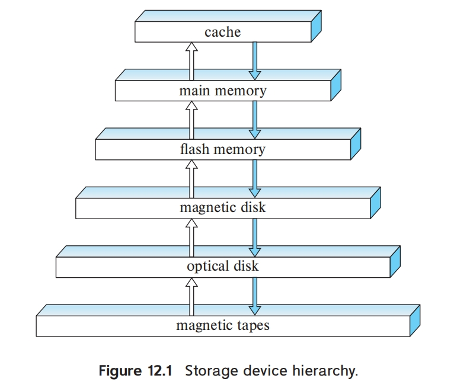

# Chapter 12 | Physical Storage Systems

## Classification of Physical Storage Media

Can differentiate storage into: **volatile** and **non-volatile**.

- volatile storage(易失存储): loses contents when power is switched off
- non-volatile storage（非易失存储）:
    - Contents persist even when power is switched off.
    - Includes secondary and tertiary storage, as well as batter-backed up main-memory.

---

## Storage Hierarchy

**primary storage**: Fastest media but volatile (cache, main memory).

**secondary storage**: next level in hierarchy, non-volatile, moderately fast access time, also called **on-line storage**
    - E.g. flash memory, magnetic disks

**tertiary storage**: lowest level in hierarchy, non-volatile, slow access time, also called **off-line storage**
    - E.g. magnetic tape, optical storage

最快的存储介质(例如高速缓存和主存)称为主存储器(primary storage)。层次结构中主存储介质的下一层介质(例如闪存和磁盘)称为辅助存储器(secondary storage)，或在线存储器(online storage)。层次结构中最底层的介质(如磁带和光盘)称为三级存储器(tertiary storage)，或离线存储器(offine storage)。

---

## Magnetic Disks

在使用磁盘时，驱动电机以恒定的高速旋转磁盘，通常是每分钟5400到10000转，具体取决于型号。

**Read-write head**: Positioned very close to the platter surface (almost touching it). Reads or writes magnetically encoded information.

有一个读写头正好位于盘片表面的上方。为了增大记录密度，读写头尽可能地靠近磁盘盘片的表面。读写头一般悬浮于离盘片表面仅数微米的位置上;磁盘的旋转会产生微风，而磁头装置的形状使其在微风作用下恰好浮于盘片表面之上。因为读写头离盘片表面非常近，所以盘片必须制作得非常平。

Surface of platter divided into circular **tracks**（磁道）Over 50K-100K tracks per platter on typical hard disks.

盘片的表面被逻辑地划分为磁道(track)。

Each track is divided into **sectors**（扇区）. A sector is the smallest unit of data that can be read or written. Sector size typically 512 bytes. Typical sectors per track: 500 to 1000 (on inner tracks) to 1000 to 2000 (on outer tracks)

磁道又被划分为扇区(sector)。扇区(sector)是从磁盘读出和写入信息的最小单位。扇区的大小通常为512字节，并且当今的磁盘具有20亿到240亿个扇区。内侧磁道(离转轴更近的地方)比外侧磁道的长度更短，且外侧磁道比内侧磁道拥有更多的扇区。

To read/write a sector, disk arm swings to position head on right track，platter spins continually; data is read/written as sector passes under head.

Head-disk assemblies, multiple disk platters on a single spindle (1 to 5 usually), one head per platter, mounted on a common arm.

**Cylinder**（柱面） i consists of $i^{th}$ track of all the platters.

磁盘盘片的每一面都有一个读写头，读写头通过在盘片上移动来访问不同的磁道。一张磁盘通常包括很多个盘片，所有磁道的读写头被安装在一个被称为磁盘臂(disk arm)的单独装置上，并且一起移动。

安装在转轴上的磁盘盘片和安装在磁盘臂上的读写头合在一起被称为磁头-磁盘装置(head-disk assembly)。

因为所有盘片上的读写头是一起移动的，所以当一个盘片上的读写头位于第 i 条磁道上时，所有其他盘片的读写头也都在它们相应盘片的第 i 条磁道上。由此，所有盘片的第 i 条磁道合在一起被称为第 i 个柱面(cylinder)。

**Disk controller**(磁盘控制器) – interfaces between the computer system and the disk drive hardware.

- accepts high-level commands to read or write a sector, initiates actions such as moving the disk arm to the right track and actually reading or writing the data
- Computes and attaches checksums to each sector to verify that data is read back correctly
    - If data is corrupted, with very high probability stored checksum won't match recomputed checksum
    - Ensures successful writing by reading back sector after writing it
- Performs remapping of bad sectors

磁盘控制器(disk controller)作为计算机系统和实际的磁盘驱动器硬件之间的接口。在现代磁盘系统中，磁盘控制器在磁盘驱动单元内部实现。

- 磁盘控制器接受高层次的读或写扇区的命令，然后开始操作，如将磁盘臂移动到正确的磁道，并实际地对数据进行读或写。
- 磁盘控制器为它所写的每个扇区附加校验和(check sum)，校验和是根据写到扇区中的数据计算得出的。当从扇区读回数据时，磁盘控制器用读到的数据再一次计算校验和，并将其与存储的校验和进行比较。
    - 如果数据被破坏，则新计算出的校验和与存储的校验和不匹配的可能性就很高。如果发生了这样的错误，磁盘控制器就会重读几次;如果错误继续发生，磁盘控制器就会发出一个读取失败的信号。
- 磁盘控制器执行的另一个有趣的任务是坏扇区的重映射(remapping of bad sector)。如果磁盘控制器在磁盘初始格式化或尝试写入一个扇区时检测到该扇区已损坏，它会把这个扇区在逻辑上映射到一个不同的物理位置(从为此目的而留出的额外扇区池中分配)。重映射被记录在磁盘上或非易失性存储器中，并且写操作在新的位置上执行。

---

### Performance Measures of Disks

磁盘质量的主要度量指标是容量、访问时间、数据传输率和可靠性。

**Access time**(访问时间) – the time it takes from when a read or write request is issued to when data transfer begins. Consists of:

**访问时间**(access time)是从发出读或写请求到数据开始传输之间的时间。

1. **Seek time**（寻道时间） – time it takes to reposition the arm over the correct track.

- Average seek time is 1/2 the worst case seek time.
- 4 to 10 milliseconds on typical disks

为了访问(即读或写)磁盘上指定扇区的数据，磁盘臂必须先移动到正确磁道的上方，然后等待磁盘旋转，直到指定的扇区出现在它下方。磁盘臂重定位的时间称为**寻道时间**(seek time)，并且它随磁盘臂必须移动距离的增大而增大。

如果所有的磁道包含相同数量的扇区，同时我们忽略读写头开始移动和结束移动所花费的时间，那么我们可以得到平均寻道时间是最坏情况下寻道时间的三分之一。考虑到前面忽略的那些因素，平均寻道时间大约是最大寻道时间的一半。

2. **Rotational latency** （旋转延迟）– time it takes for the sector to be accessed to appear under the head.

- Average latency is 1/2 of the worst case latency.
- 4 to 11 milliseconds on typical disks (5400 to 15000 r.p.m.)

一旦读写头到达所需的磁道，等待被访问的扇区出现在读写头下所花费的时间称为旋转延迟时间(rotational latency time)。在平均情况下，磁盘需要旋转半周才能使所要访问的扇区的开始处出现在读写头的下方。因此磁盘的平均延迟时间(average latency time)是磁盘旋转一整周时间的一半。

3. **Data-transfer rate**（数据传输率） – the rate at which data can be retrieved from or stored to the disk.

- 25 to 100 MB per second max rate, lower for inner tracks
- Multiple disks may share a controller, so rate that controller can handle is also important

数据传输率(data-transfer rate)是从磁盘获取数据或者向磁盘存储数据的速率。

---

**Disk block** is a logical unit for storage allocation and retrieval, 4 to 16 kilobytes typically.

- Smaller blocks: more transfers from disk
- Larger blocks: more space wasted due to partially filled blocks

磁盘 I/O 请求通常由文件系统产生，但可以由数据库系统直接产生。每个请求都指定要引用的磁盘上的地址;该地址采用**块号**(block number)的形式。**磁盘块**(disk block)是存储分配和检索的逻辑单元，而当今的块规模通常在 4KB 到 16KB 之间。数据以块为单位在磁盘和主存之间传输。术语**页面**(page)通常用来指块。

**Sequential access pattern**(顺序访问模式)

- Successive requests are for successive disk blocks
- Disk seek required only for first block

- 第一个块需要磁盘寻道
- 后续的请求要么不需要寻道，要么需要向相邻的磁道寻道

这比向更远的磁道寻道要快。在顺序访问模式下，数据传输速率是最高的，因为寻道时间最短。

**Random access pattern**（随机访问模式）

- Successive requests are for blocks that can be anywhere on disk
- Each access requires a seek
- Transfer rates are low since a lot of time is wasted in seeks

在随机访问(random access)模式中，连续的请求是针对随机分布在磁盘上的块的。每一个这样的请求都需要一次寻道。

**I/O operations per second** (IOPS ，每秒I/O操作数)

- Number of **random block** reads that a disk can support per second
- 50 to 200 IOPS on current generation magnetic disks

每秒 I/O 操作(I/O Operations per Second，IOPS)数，即在一秒钟内可以由磁盘满足的随机块访问数量，取决于磁盘的访问时间、块的规模和数据传输速率。

**Mean time to failure** (MTTF，平均故障时间) – the average time the disk is expected to run continuously without any failure.

- Typically 3 to 5 years
- Probability of failure of new disks is quite low, corresponding to a "theoretical MTTF" of 500,000 to 1,200,000 hours （57 to 136 years）for a new disk
- An MTTF of 1,200,000 hours for a new disk means that given 1000 relatively new disks, on an average one will fail every 1200 hours(50 days)
- MTTF decreases as disk ages

---

### Optimization of Disk-Block Access

- Buffering: in-memory buffer to cache disk blocks
- Read-ahead(Prefetch): Read extra blocks from a track in anticipation that they will be requested soon
- Disk-arm-scheduling algorithms **re-order block requests** so that disk arm movement is minimized
    - elevator algorithm

- File organization
    - Allocate blocks of a file in as contiguous a manner as possible
    - Allocation in units of **extents**(盘区)
    - Files may get **fragmented**
        - E.g., if free blocks on disk are scattered, and newly created file has its blocks scattered over the disk
        - Sequential access to a fragmented file results in increased disk arm movement
        - Some systems have utilities to defragment the file system, in order to speed up file access

- **Nonvolatile write buffers** （非易失性写缓存）—— speed up disk writes by writing blocks to a non-volatile RAM buffer immediately
    - Non-volatile RAM: **battery backed up RAM** or **flash memory**
    - Even if power fails, the data is safe and will be written to disk when power returns
    - Controller then writes to disk whenever the disk has no other requests or request has been pending for some time
    - Database operations that require data to be safely stored before continuing can continue without waiting for data to be written to disk
    - Writes can be reordered to minimize disk arm movement

- **Log disk**（日志磁盘）—— a disk devoted to writing a sequential log of block updates
    - Used exactly like nonvolatile RAM
    - Write to log disk is very fast since no seeks are required
    - No need for special hardware (NV-RAM)

---

## Flash Storage

NAND flash - used widely for storage, cheaper than NOR flash
    - requires page-at-a-time read (page: 512 bytes to 4 KB)
    - Not much difference between sequential and random read
    - **Page can only be written once**
    - Must be erased to allow rewrite

**SSD**(Solid State Disks)

Use standard block-oriented disk interfaces, but store data on multiple flash storage devices internally

| |Magnetic Disk|Solid State Disk|
|:---:|:---:|:---:|
|Retrieve a page|5-10 milliseconds|20-100 microseconds|
|Random access|50 to 200 IOPS|reads: 10,000 IOPS writes: 40,000 IOPS|
|Data transfer rate|200M|500M(SATA), 3G(NVMe)|
|Power consumption|higher|lower|
|Update mode|in place|erase $\rightarrow$ rewrite|
|Realiability|MTTF : 500,000 to 1,200,000 hours|erase blocks: 100,000 to 1,000,000 erases|

---

Erase happens in units of erase block

- Takes 2 to 5 milliseconds
- Erase block typically 256 KB to 1 MB (128 to 256 pages)
- After 100,000 to 1,000,000 erases, erase block becomes unreliable and cannot be used

闪存的写入稍有些复杂。写一个闪存页面通常需要花费大约100微秒。但是，一旦写入，就不能直接重写闪存页。相反，必须先将其擦除然后再重写。擦除操作必须在一组页(称为擦除块(erase block)，即擦除块中的所有页)上执行，并花费 2 到 5 毫秒。一个擦除块(在闪存文献中通常就只称为"块")通常为 256KB 到1MB，并包含 128 到 256 个页。另外，一个闪存页可以被擦除的次数是有限的，通常约为 100000 到 1000000 次。一旦达到这个限制，在存储位中就可能发生错误。

**Remapping** of logical page addresses to physical page addresses avoids waiting for erase

**Flash translation table** tracks mapping also stored in a label field of flash page, remapping carried out by **flash translation layer**

闪存系统通过将**逻辑页号**映射到**物理页号**来限制慢的擦除速度和更新限制的影响。当一个逻辑页被更新时，它可以被重新映射到已被擦除的任何物理页，并且它原来的位置可以随后被擦除。每个物理页都有一个小的存储区域来保存它的逻辑地址;如果逻辑地址被重新映射到一个不同的物理页，则原来的物理页被标记为已删除。因此，通过扫描物理页，我们可以发现每个逻辑页的位置。为了快速访问，逻辑到物理的页面映射被复制到内存中的转换表(translation table)中。

**wear leveling**(磨损均衡)- evenly distributed erase operators across physical blocks

包含多个删除页的块将定期被擦除，要注意先将这些块中未被删除的页复制到一个不同的块(转换表会对这些未删除的页面进行更新)中。由于每个物理页只能更新固定的次数，因此被擦除多次的物理页被指定给"冷数据"，即很少被更新的数据;而尚未被擦除多次的页用于存储"热数据"，即被频繁更新的数据。这种跨物理块均匀分布擦除操作的原则称作损耗均衡(wear leveling)，而且通常是由**闪存控制器**透明地执行的。如果一个物理页由于过量更新被损坏，它可以不再被使用，而不影响整个闪存。

所有上述动作通过一个叫作**闪存转换层**(fashtranslation layer)的软件层执行。在这一层之上，闪存看起来和磁盘存储器一样，都提供同样的面向页/扇区的接口，只不过闪存存储要快得多。因此，文件系统和数据库存储结构可以看到相同的底层存储结构的逻辑视图，无论它是闪存还是磁盘存储器。

---

## Storage Class Memory(NVM)

3D-XPoint memory technology pioneered by Intel

Available as Intel Optane:

- **SSD interface** shipped from 2017
    - Allows lower latency than flash SSDs
- **Non-volatile memory interface** announced in 2018
    - Supports direct access to words, at speeds comparable to main-memory speeds

|DRAM|NVM|SSD|HDD|
|:---:|:---:|:---:|:---:|
|Read Latency|1x|2-4x|500x|105x|
|Write Latency|1x|2-8x|5000x|105x|
|Persistence|No|Yes|Yes|Yes|
|Byte-Addressable|Yes|Yes|No|No|
|Endurance|Yes|No|No|Yes|

---