# Chapter 13 | Data Storage Structures

## File Organization

The **database** is stored as a collection of **files**.

Each file is a sequence of **records**.

A record is a sequence of **fields**.

One approach:

- assume record size is fixed
- each file has records of one particular type only
- different files are used for different relations

This case is easiest to implement; will consider variable length records later.

We assume that records are smaller than a disk block

---

## Fixed-Length Records

Simple approach:

Store record `i` starting from byte `n * (i – 1)`, where n is the size of each record.

Record access is simple but records may cross blocks

- Modification: do not allow records to cross block boundaries

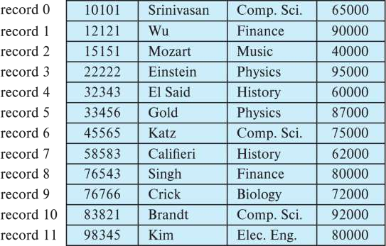

**Deletion** of record i: 

alternatives:(e.g. delete record 3)

1. move records i + 1, ..., n to i, ... , n – 1

2. move record n to i

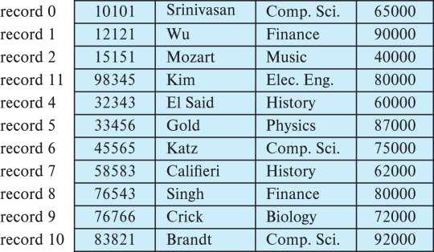

3. do not move records, but link all free records on a free list

在文件的开头，我们分配特定数量的字节作为文件头(file header)。文件头将包含有关文件的各种信息。

到目前为止，我们需要在文件头中存储的只有内容被删除的第一条记录的地址。我们用这第一条记录来存储第二条可用记录的地址，依次类推。

我们可以直观地把这些存储的地址看作指针(pointer)，因为它们指向一条记录的位置。于是，被删除的记录形成了一条链表，通常称为自由链表(free list)。

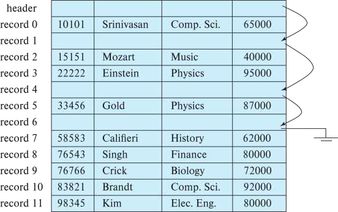

---

## Variable-Length Records

Variable-length records arise in database systems in several ways:

- Storage of multiple record types in a file.
- Record types that allow variable lengths for one or more fields such as strings (varchar)
- Record types that allow repeating fields (used in some older data models).

Attributes are stored in order.

Variable length attributes represented by **fixed size** (offset, length), with actual data stored after all fixed length attributes.

具有变长属性的记录的表示通常包含两个部分:

1. 带有定长信息的初始部分，其结构对于相同关系的所有记录都是一样的，诸如数字值、日期或定长字符串那样的固定长度的属性，被分配存储它们的值所需的字节数。
2. 变长属性的内容，诸如可变长字符串类型那样的变长属性，在记录的初始部分中被表示为一个(偏移量，长度)对，其中偏移量表示在记录中该属性的数据开始的位置，而长度表示变长属性的字节长度。

在记录的初始定长部分之后，变长属性的值是连续存储的。因此，无论是固定长度还是可变长度，记录的初始部分都存储着有关每个属性的固定长度的信息。

Null values represented by null-value bitmap（空位图）

e.g. 

Instructor(id，name, dept_name, salary)

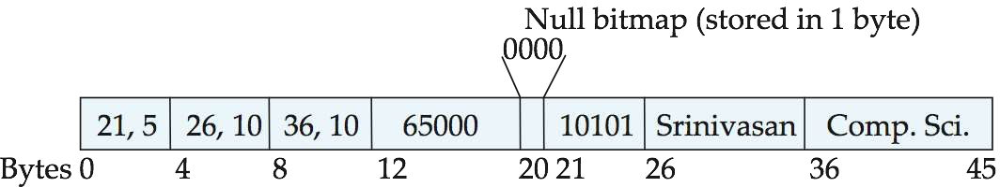

这个图也说明了空位图(null bitmap)的使用，它表示记录的哪个属性是空值。在这个特定的记录中，如果 salary 是空值，位图的第四位将被设置为 1 (也就是 0001) ，存储在第 12 至 19 字节之间的 salary 值将被忽略。

由于记录有四个属性，尽管更多属性可能需要更多字节，但该记录的空位图只占用1个字节。

在某些表示中，空位图存储在记录的开头，并且对于取空值的属性，根本不存储数据(值或偏移量/长度)。这种表示以提取记录属性的额外工作为代价来节省一些存储空间。对于记录拥有大量字段并且大多数字段都是空的某些应用来说，这样的表示特别有用。

---

### Variable-Length Records: Slotted Page Structure

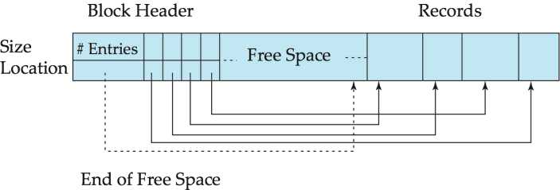

**Slotted page**（分槽页） header contains:

- number of record entries
- end of free space in the block
- location and size of each record

我们接下来处理在块中存储变长记录的问题，分槽的页结构(slotted-page structure)般用于在块中组织记录，每个块的开始处有一个块头，其中包含以下信息:

- 块头中记录项的数量;
- 块中自由空间的末尾处;
- 一个由包含每条记录的位置和大小的项组成的数组。

Records can be moved around within a page to keep them contiguous with no empty space between them; entry in the header must be updated.

实际上记录从块的末尾处开始在块中连续分配空间。块中的自由空间是连续的，位于块头数组的最后一项和第一条记录之间。如果插入一条记录，在自由空间的尾部给这条记录分配空间，并且将包含这条记录的大小和位置的项加到块头中。

如果一条记录被删除，它所占用的空间被释放，并且它的项被置为 deleted (比如这条记录的大小被置为 -1 )。此外，块中位于被删除记录之前的记录将被移动，使得由删除而产生的自由空间能被重新使用，并且所有自由空间仍然存在于块头数组的最后一项和第一条记录之间。块头中的自由空间末尾指针也要做适当修改。

只要块中还有空间，使用类似的技术可以使记录增长或缩短。移动记录的代价并不太高，因为块的大小是有限的:典型的值为 4KB 到 8KB。

**Record pointers** should not point directly to record — instead they should point to the entry for the record in header.

分槽的页结构要求没有指针直接指向记录。取而代之，指针必须指向块头中记有记录实际位置的项(也就是指向块头，然后从块头内得到位置后再走)。在支持指向记录的间接指针的同时，这种间接层次允许移动记录以防止在块的内部出现碎片空间。

---

## Organization of Records in Files

1. **Heap** – record can be placed anywhere in the file where there is space
2. **Sequential** – store records in sequential order, based on the value of the search key of each record

3. **multitable clustering file organization** — records of several different relations can be stored in the same file

- Motivation: store related records on the same block to minimize I/O

4. B+-tree file organization

- Ordered storage even with inserts/deletes

5. **Hashing** – a hash function computed on search key; the result specifies in which block of the file the record should be placed

---

### Heap File Organization

Records can be placed anywhere in the file where there is free space

Records usually do not move once allocated

Important to be able to efficiently find free space within file

**Free-space map:**

Array with 1 entry per block. Each entry is a few bits to a byte, and records fraction of block that is free

In example below, 3 bits per block, value divided by 8 indicates

大多数数据库使用一种叫作自由空间图(free-space map)的节省空间的数据结构，以便跟踪具有自由空间来存储记录的块。自由空间图通常被表示成一个数组，对关系中的每个块，该数组都包含一个项。每个项表示一个比例,即在块中至少有比例为 f 的空间是自由的。

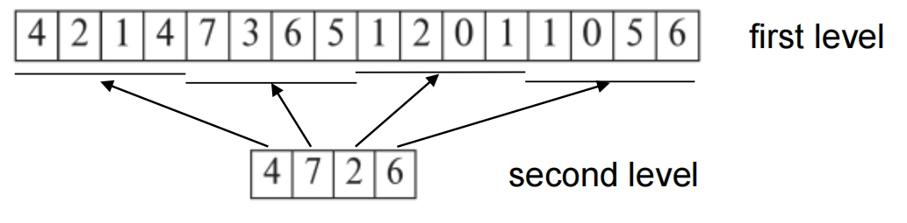

为了找到一个可以存储给定大小的新记录的块，数据库可以扫描自由空间图以找到一个具有足够自由空间的块来存储那条记录。如果不存在那样的块，将给关系分配一个新块，并更新自由空间图以反映新块的存在。

Can have second-level free-space map.

尽管这种扫描比实际获取块来找到自由空间要快得多，但对于大型文件它仍然非常慢为了进一步加速定位具有足够自由空间的块的任务，我们可以创建二级自由空间图，比如它的每个项表示主自由空间图的 100 个项。每个项存储了其对应的主自由空间图中 100 个项之内的最大值。

In example above, each entry stores maximum from 4 entries of first-level free-space map

Free space map written to disk periodically, OK to have wrong (old) values for some entries (will be detected and fixed)

每当图中一个项被更新就将自由空间图写入磁盘，这将是非常昂贵的。取而代之，自由空间图被周期性地写入磁盘;因此，磁盘上的自由空间图可能是过时的，当数据库启动时它可能会得到关于自由空间的过时数据。为了修正这些错误，关系被定期扫描，错误空间图被重新计算并写到磁盘。

---

### Sequential File Organization

Suitable for applications that require **sequential processing** of the entire file

The records in the file are ordered by a **search-key**

顺序文件(sequential file)是为了高效处理按某个搜索码的顺序排序的记录而设计的。搜索码(search key)是任意的属性或者属性的集合。

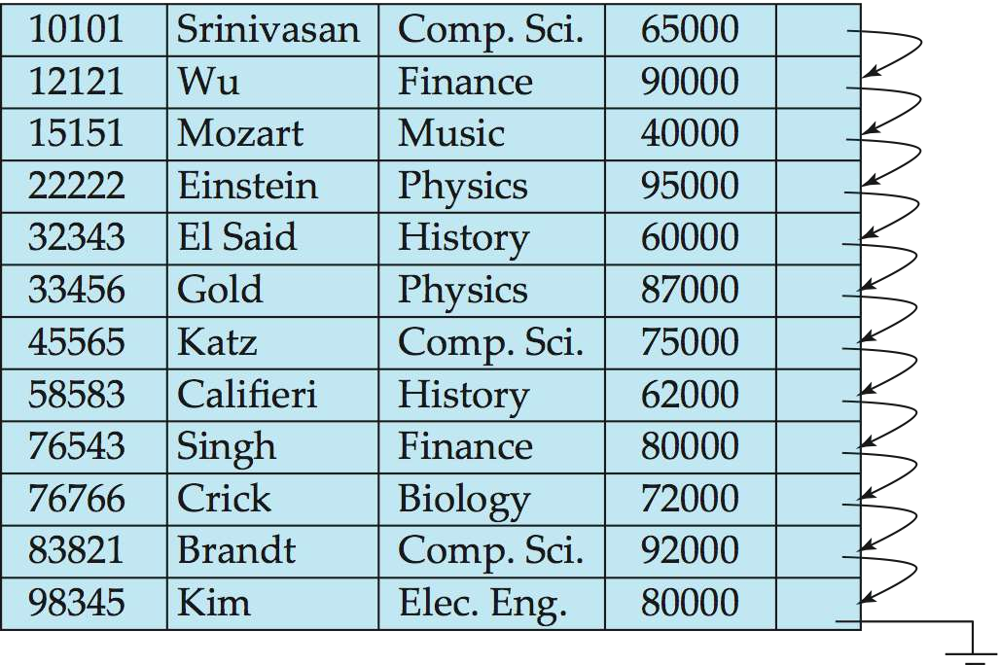

**Deletion** – use pointer chains

**Insertion** – locate the position where the record is to be inserted

- if there is free space insert there 
- if no free space, insert the record in an overflow block
- In either case, pointer chain must be updated

1. 在文件中定位按搜索码顺序位于待插入记录之前的那条记录。
2. 如果在这条记录所在块中有一条自由的记录(即删除后留下来的空间)，就在这里插入新的记录。否则，将新记录插入一个溢出块(overflow block)中。
3. 无论哪种情况都要调整指针，使其能按搜索码顺序把记录链接在一起。

Need to reorganize the file from time to time to restore sequential order.

当搜索码顺序和物理顺序之间的相似性丧失到一定程度时，文件应该被重组(reorganized)，使得它再次在物理上按顺序存放。这种重组的代价是很高的，并且必须在系统负载低的时候执行。需要重组的频率依赖于新记录插入的频率。在插入很少发生的极端情况下，使文件在物理上总保持有序是可能的。此时也可以不需要指针域。

---

### Multitable Clustering File Organization

Store several relations in one file using a **multitable clustering file organization**

针对特定 dept_name 的所有 instructor 元组被存储在该 dept_name 所对应的 department 元组的附近。我们说这两个关系在 dept_name 码上是聚簇的。

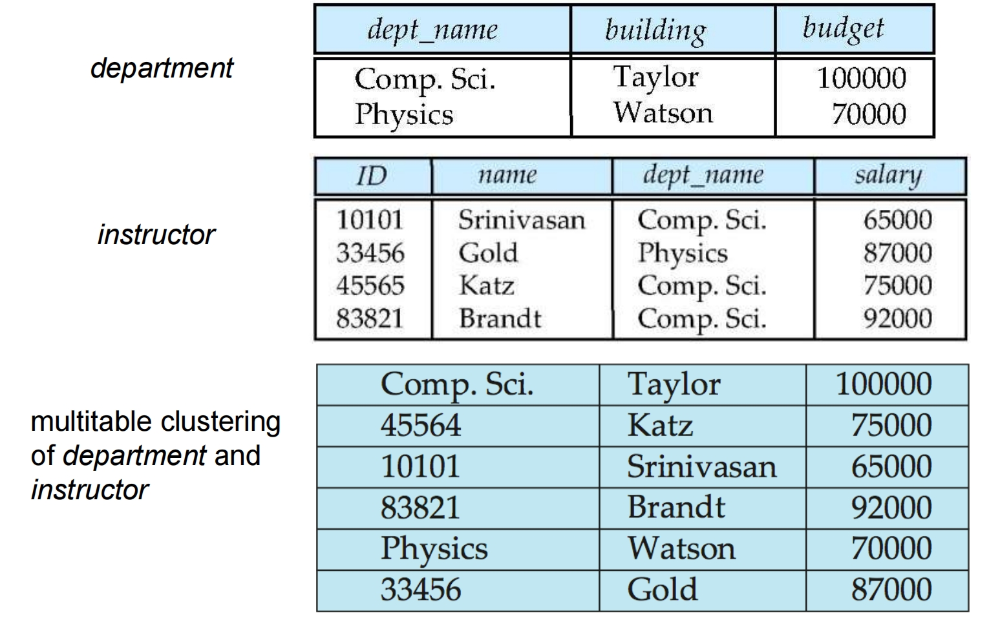

good for queries involving join department $\bowtie$ instructor, and for queries involving one single department and its instructors

bad for queries involving only department

results in variable size records

Can add pointer chains to link records of a particular relation

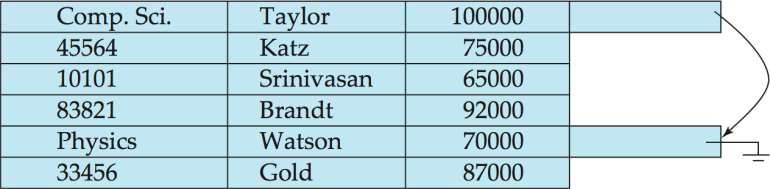

---

### Table Partitioning

Table partitioning: Records in a relation can be partitioned into smaller relations that are **stored separately**

E.g., transaction relation may be partitioned into transaction_2018, transaction_2019, etc.

许多数据库允许将一个关系中的记录划分为更小的关系，这些关系分别进行存储。这种表划分(table partitioning)通常基于一个属性值来完成。

Queries written on transaction must access records in all partitions

Unless query has a selection such as `year=2019`, in which case only one partition in needed

**Partitioning:**

- Reduces costs of some operations such as free space management
- Allows different partitions to be stored on different storage devices
    - E.g., transaction partition for current year on SSD, for older years on magnetic disk

某些操作的代价随关系的规模一同增长，比如找到一条记录的自由空间;通过缩小每个关系的规模，划分有助于减少这种开销。

划分也可以用来将一个关系的不同部分存储到不同的存储设备上。

---

### Data Dictionary Storage

到目前为止，我们只考虑了关系本身的表示。一个关系数据库系统需要维护关于关系的数据，比如关系的模式。一般来说，这种"关于数据的数据"被称为元数据(metadata)。

The **Data dictionary** (also called **system catalog**) stores **metadata**; that is, data about data, such as

Information about **relations**

- names of relations 关系的名称
- names, types and lengths of attributes of each relation 每个关系中属性的名称，属性的域和长度
- names and definitions of views 在数据库上定义的视图的名称，以及这些视图的定义
- integrity constraints 完整性约束
- User and accounting information, including passwords
- Statistical and descriptive data : number of tuples in each relation
- Physical file organization information:
    - How relation is stored (sequential/hash/...)
    - Physical location of relation
- Information about indices

---

### Relational Representation of System Metadata

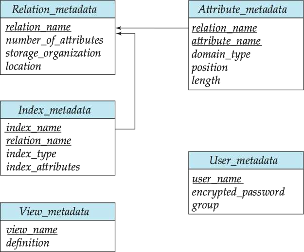

---

## Storage Access

**Blocks** are units of both storage allocation and data transfer.

Database system seeks to minimize the number of block transfers between the disk and memory. We can reduce the number of disk accesses by keeping as many blocks as possible in main memory.

因为从磁盘访问数据远比从内存访问数据要慢，所以数据库系统的一个主要目标就是尽量减少在磁盘和内存之间传输的块数量。

减少磁盘访问次数的一种方式是在主存中保留尽可能多的块。这样做的目标是最大化要访问的块已经在主存中的概率，这样就不需要访问磁盘。

因为在主存中保留所有块是不可能的，我们需要管理主存中用于存储块的可用空间的分配。

**Buffer** – portion of main memory available to store copies of disk blocks.

缓冲区(buffer)是主存中用于存储磁盘块的拷贝的那部分。每个块总有一份拷贝存放在磁盘上，但是磁盘上的拷贝可能比缓冲区中的版本旧。

**Buffer manager** – subsystem responsible for allocating buffer space in main memory.

负责缓冲区空间分配的子系统称为缓冲区管理器(buffer manager)。

---

### Buffer Manager in DBMS

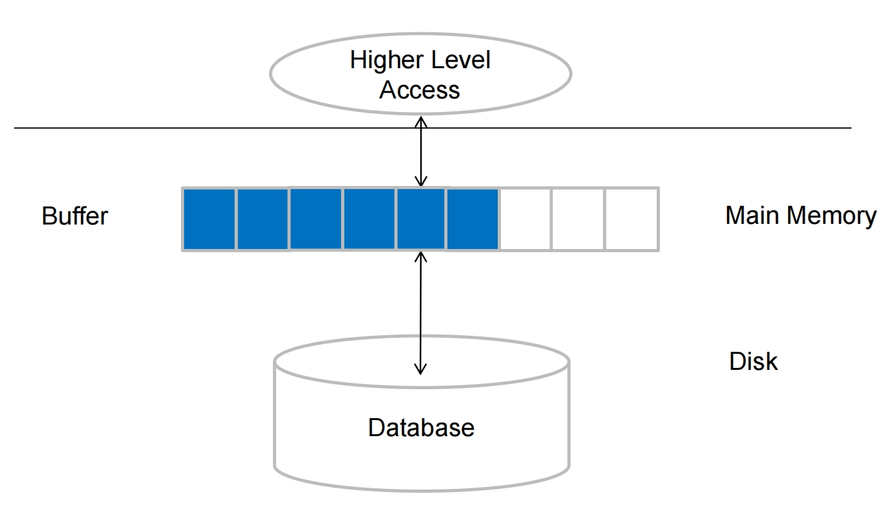

---

#### LRU Example

当缓冲区中没有剩余空间时，一个块必须被移出(evicted)，即在新块读入缓冲区之前，必须把一个块从缓冲区中去除。多数操作系统使用最近最少使用(Least Recently Used.LRU)方案，即最近最少访问的块被写回磁盘，并从缓冲区中移走。

- Supposing there are 4 buffer pages. 
- Initial is empty occupied。
- The access sequence is 1, 4, 8, 1, 5, 2, 3, 2, 4. 
- According to the LRU policy , there are 3 times replacement occurred.

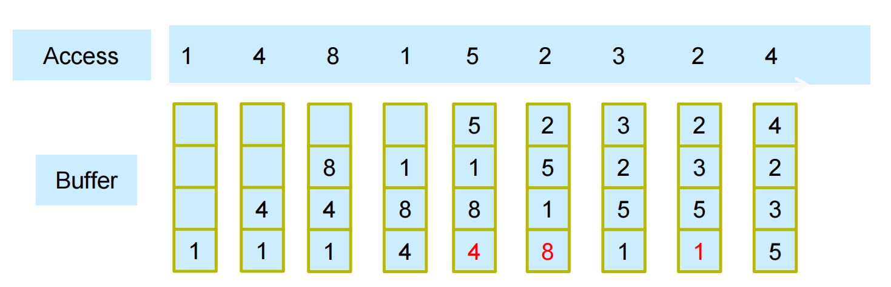

---

### Buffer Manager

Programs call on the buffer manager when they need a block from disk.

1. If the block is already in the buffer, buffer manager returns the address of the block in main memory
2. If the block is not in the buffer, the buffer manager
    - Allocates space in the buffer for the block
        - Replacing (throwing out) some other block, if required, to make space for the new block.
        - Replaced block **written back to disk** only if it was modified since the most recent time that it was written to/fetched from the disk.
    - Reads the block from the disk to the buffer, and returns the address of the block in main memory to requester.

当数据库系统中的程序需要磁盘上的块时，它向缓冲区管理器发出请求(即调用)。

1. 如果这个块已经在缓冲区中，则缓冲区管理器将这个块在主存中的地址传给请求者。
2. 如果这个块不在缓冲区中，则缓冲区管理器:
    - 首先在缓冲区中为这个块分配空间:
        - 如果需要，可能会把一些其他块移出主存，为这个新块腾出空间。
        - 被移出的块仅当它在最近一次写回磁盘后被修改过才被写回磁盘(也就是说如果这个块在上一次被读入缓冲区当中，一直到被移出这段时间内都没有被修改过，那么就不写回磁盘，可以直接丢掉)。
    - 然后，缓冲区管理器把被请求的块从磁盘读入缓冲区，并将这个块在主存中的地址传给请求者。

缓冲区管理器的内部动作对发出磁盘块请求的程序是透明的。

**Buffer replacement strategy** (details coming up!)

---

#### **pin**

一旦一个块被读入缓冲区，数据库进程就可以从缓冲存储器中读取该块的内容。然而，当块正在被读取时，如果一个并发进程移出了这个块，并把它替换成另一个不同的块，那么读原来块的内容的读取操作将读到不正确的数据;如果一个块被移出时它正在被写入，那么写入操作将最终损坏被替换的块的内容。

**Pinned block**: memory block that is not allowed to be written back to disk

因此，在一个进程从缓冲块中读取数据之前，确保此块不会被移出是很重要的。

- **Pin** done before reading/writing data from a block
- **Unpin** done when read /write is complete
- Multiple concurrent pin/unpin operations possible: Keep a pin count, buffer block can be evicted only if **pin count = 0**

- 钉住(pin)操作:缓冲区管理器绝不会移出一个被钉住的块。
- 当进程完成数据读取后，它将执行解除钉住(unpin)操作，允许该块在必要时被移出。
- 多个进程能从缓冲区的一个块中读取数据。要求每个进程在访问数据前执行钉住操作并在完成访问后执行解除钉住操作。直到所有对块执行了钉住操作的进程都解除钉住之后该块才能被移出。一种简单的方式可以确保这个性质，那就是为每个缓冲块维护钉住计数(pin count)。对每个钉住操作增加该计数，且对每个解除钉住操作减少该计数。仅当一个页面的钉住计数等于 0 时，它才能被移出。

---

#### **Shared and exclusive locks on buffer**

从页面增加或删除元组的进程可能需要移动此页面的内容;在此期间，任何其他进程都不应读取该页的内容，因为这些内容可能是不一致的。数据库缓冲区管理器允许进程获取缓冲区上的共享排他锁。

- Needed to prevent concurrent operations from reading page contents as they are moved/reorganized, and to ensure only one move/reorganize at a time
- Readers get **shared lock**, updates to a block require **exclusive lock**
- Locking rules:
    - Only one process can get exclusive lock at a time
    - Shared lock cannot be concurrently with exclusive lock
    - Multiple processes may be given shared lock concurrently

---

### Buffer-Replacement Policies

1. **LRU strategy** - replace the block least recently used.

**Idea behind LRU** – use past pattern of block references as a predictor of future references

Queries have well-defined **access patterns** (such as sequential scans), and a database system can use the information in a user's query to **predict future references**

**LRU can be a bad strategy** for certain access patterns involving repeated scans of data

For example: when computing the join of 2 relations r and s by a nested loops

for each tuple tr of r do 
    for each tuple ts of s do 
        if the tuples tr and ts match ...

Mixed strategy with hints on replacement strategy provided by the query optimizer is preferable

2. **Toss-immediate strategy** – frees the space occupied by a block as soon as the final tuple of that block has been processed

3. **Most recently used (MRU) strategy** – system must pin the block currently being processed. After the final tuple of that block has been processed, the block is unpinned, and it becomes the most recently used block.

Buffer managers also support **forced output** of blocks for the purpose of recovery

---