# Chapter 14 | Indexing

## Basic Concepts

Indexing mechanisms used to speed up access to desired data.

**Search Key** - attribute to set of attributes used to look up records in a file.

An **index file** consists of records (called index entries) of the form

索引项(index entry)或索引记录(index record)由一个搜索码值和指针构成。

- 这些指针指向具有该搜索码值的一条或多条记录。
- 指向一条记录的指针由磁盘块的标识和标识出块内记录的磁盘块内偏移量所组成。


Index files are typically much smaller than the original file

Two basic kinds of indices:

1. **Ordered indices**: search keys are stored in sorted order
2. **Hash indices**: search keys are distributed uniformly across "buckets" using a "hash function".

---

## Index Evaluation Metrics

Access types supported efficiently.

1. **Point query**: records with a specified value in the attribute
2. **Range query**: or records with an attribute value falling in a specified range of values.

衡量指标:

1. Access time
2. Insertion time
3. Deletion time
4. Space overhead

---

### Ordered Indices

In an ordered index, index entries are stored sorted on the search key value.

1. **Primary index**（主索引）also called **clustering index**（聚集索引）: in a sequentially ordered file, the index whose search key specifies the sequential order of the file.

- 物理文件按照一个顺序排放，search-key 的顺序与物理文件的顺序一致。也就是搜索码定义了文件的次序。
- The search key of a primary index is usually but not necessarily the primary key.

2. **Secondary index**（辅助索引）: an index whose search key specifies an order different from the sequential order of the file. Also called non-clustering index.

搜索码指定的次序与文件的排列次序不同的索引被称为非聚集索引(non-clustering index)或辅助索引(secondary index)。

**Index-sequential file**（索引顺序文件）: ordered sequential file with a primary index.

---

#### Primary index Example

- primary index on ID attribute of instructor


---

#### Secondary index Example

- Secondary index on salary attribute of instructor

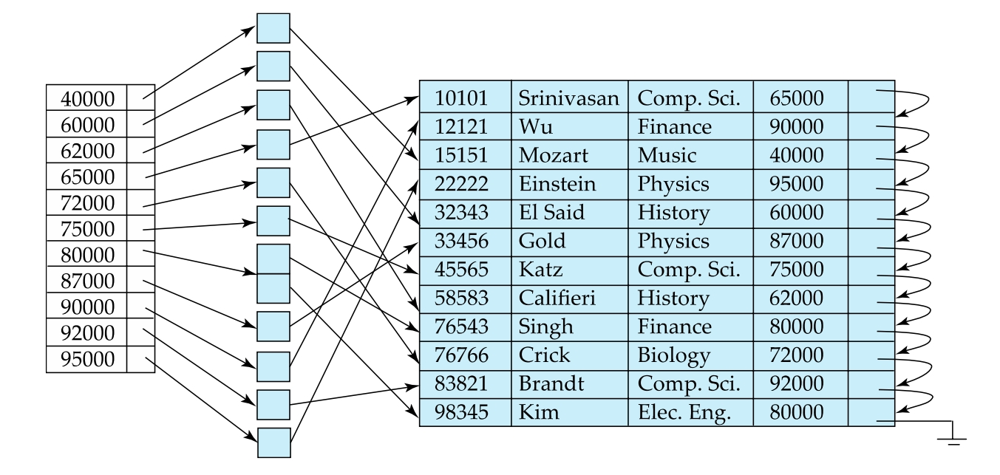

---

#### Dense Index Files

- **Dense index**(稠密索引) — Index record appears for every search-key value in the file.

稠密索引中，对于文件中的每个搜索码值都有一个索引项。

在稠密聚集索引中，索引记录包括搜索码值以及指向具有该搜索码值的第一条数据记录的指针。具有相同搜索码值的其余记录会顺序地存储在第一条记录之后由于该索引是聚集索引，因此记录是根据相同的搜索码值排序的。

在稠密非聚集索引中，索引必须存储指向具有相同搜索码值的所有记录的指针
列表。

E.g. index on ID attribute of instructor relation

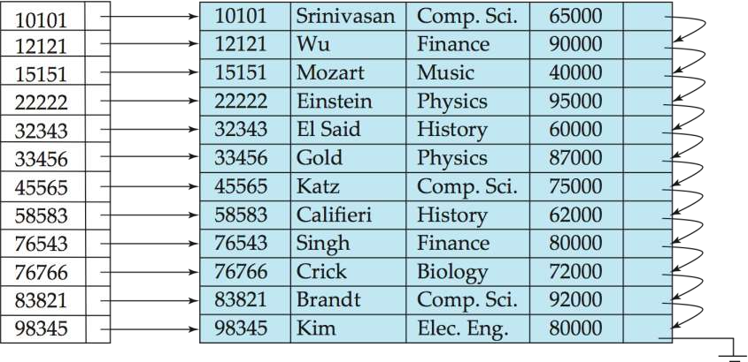

E.g. Dense index on dept_name, with instructor file sorted on dept_name

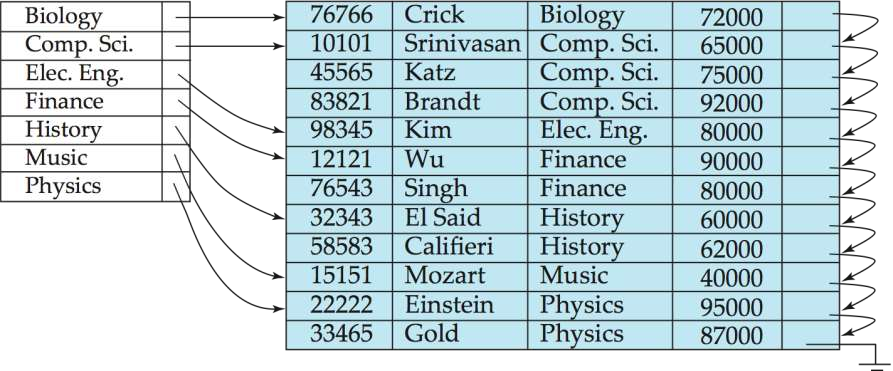

---

#### Sparse Index Files

**Sparse Index**（稀疏索引）: contains index records for only some search-key values.

在稀疏索引中，只为某些搜索码值建立索引项。

Applicable when records are sequentially ordered on search-key.

只有当关系按搜索码排列次序存储时才能使用稀疏索引。换句话说，只有索引是聚集索引时才使用稀疏索引。

和稠密索引中的情况一样，每个索引项也包括一个搜索码值和指向具有该搜索码值的第一条数据记录的指针。

To locate a record with search-key value K we:

1. Find index record with largest search-key value < K
2. Search file sequentially starting at the record to which the index record points

为了定位一条记录:

1. 我们找到所具有的最大搜索码值小于或等于我们所找记录的搜索码值的索引项。
2. 我们从该索引项指向的记录开始，然后沿着文件中的指针查找，直到找到所需记录为止。

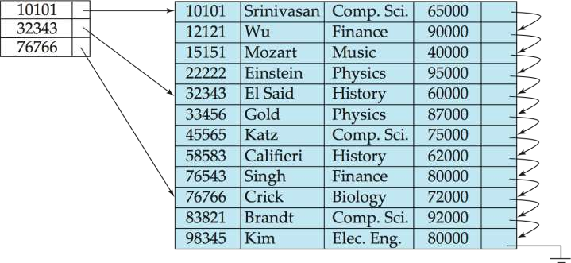

**Compared to dense indices:**

1. Less space and less maintenance overhead for insertions and deletions. 空间和维护成本小。
2. Generally slower than dense index for locating records. 查找记录的速度一般比稠密索引慢。
3. Good tradeoff: sparse index with an index entry for every block in file, corresponding to least search-key value in the block. 索引的规模比较小。

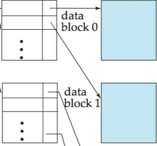

---

#### Multilevel Index（多级索引）

If primary index does not fit in memory, access becomes expensive.

Solution: treat primary index kept on disk as a sequential file and construct a sparse index on it.

为了处理这个问题，我们像对待其他任何顺序文件那样对待索引，并且在原始的索引上构造一个稀疏的外层索引，现在我们把原始索引称为内层索引。

1. **outer index** – a sparse index of primary index
2. **inner index** – the primary index file

If even outer index is too large to fit in main memory, yet another level of index can be created, and so on.

Indices at all levels must **be updated** on insertion or deletion from the file.

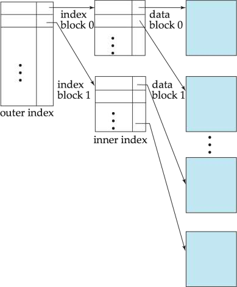

---

## B+ Tree 

### B+ Tree Index

A B+ tree is a rooted tree satisfying the following properties:

1. All paths from root to leaf are of the same length
2. Inner node(not a root or a leaf): between $\lceil \frac{n}{2} \rceil$ and $n$ children
3. Leaf node: between $\lceil \frac{n-1}{2} \rceil$ and $n - 1$ keys
4. Special cases:
    - If the root is not a leaf : at least 2 children.
    - If the root is a leaf : between 0 and (n–1) values.

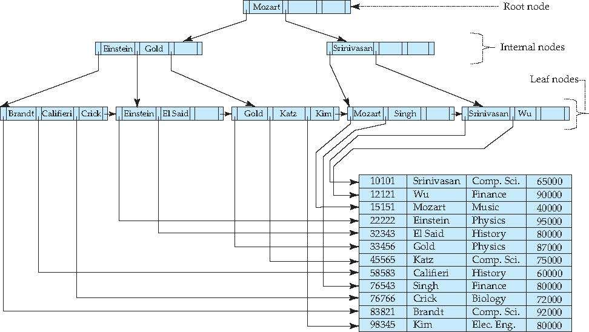

!!! note "B+ tree 的最低高度与最高高度计算"
    对于一个一页是 4KB 的磁盘，一共是 4096 B。一个指针假设是 int 类型的，也就是 4B ，存放的内容假设是 10B 的。那么对于此时的 B+ 树，最低高度和最高高度如下：

    - 最高高度：$\lfloor \frac{4096 - 4}{10 + 4} \rfloor + 1 = 293$
    - 最低高度：$\lfloor \frac{4096 - 4}{(10 + 4) * 2} \rfloor + 1 = 147$

---

### B+ Tree Node Structure

Typical node


- $K_i$ are the search-key values
- $P_i$ are pointers to children (for non-leaf nodes) or pointers to records or buckets of records (for leaf nodes).

The search-keys in a node are ordered $K_1 < K_2 < \cdots < K_{n-1}$.

---

### Leaf Nodes in B+ Trees

Properties of a leaf node:

For i = 1, 2, ..., n-1, pointer $P_i$ points to a file record with search-key value $K_i$ , if $L_i$ , $L_j$ are leaf nodes and i < j, $L_i$ 's search-key values are less than or equal to $L_j$ 's search-key values

$P_n$ points to next leaf node in search-key order


---

### Non-Leaf Nodes in B+-Trees

Non leaf nodes form a multi-level sparse index on the leaf nodes. 

For a non-leaf node with m pointers:

$P_1$ : all the search-keys in the subtree to which $P_1$ points are 
less than $K_1$

$P_i$ : (2 $\le$ i $\le$ n – 1): all the search-keys in the subtree to which $P_i$ points have values greater than or equal to $K_{i–1}$ and less than $K_i$

$P_n$ : All the search-keys in the subtree to which $P_n$ points have values greater than or equal to $K_{n–1}$

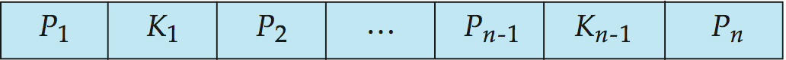

---

#### Observations about B+-trees

Since the inter-node connections are done by pointers, "logically"  close blocks need not be "physically" close.

The non-leaf levels of the B+-tree form a hierarchy of sparse indices.

The B+-tree contains a relatively small number of levels

- Level below root has at least $2 \times \lceil \frac{n}{2} \rceil$ values
- Next level has at least $2 \times \lceil \frac{n}{2} \rceil \times \lceil \frac{n}{2} \rceil$ values
- If there are K search-key values in the file, the tree height is no more than $\lceil\log_{\lceil \frac{n}{2} \rceil} (K) \rceil$ ~ $\lceil\log_{\lceil \frac{n}{2} \rceil} (\frac{K}{2}) \rceil + 1$

thus searches can be conducted efficiently.

Insertions and deletions to the main file can be handled efficiently, as the index can be restructured in logarithmic time.

---

### Query on B+-Tree

```
function find(v) // Find record with search-key value V 
1. C = root
2. While C is not a leaf node {
  1. Let i be least value s.t. $V \le K_i$.
  2. If no such exists, set C = last non-null pointer in C
  3. Else { if (V = $K_i$ ) Set C = $P_{i+1}$ else set C = $P_i$}
}
3. Let i be least value s.t. $K_i$ = V
4. If there is such a value i, follow pointer $P_i$ to the desired record.
5. Else no record with search-key value k exists.
```

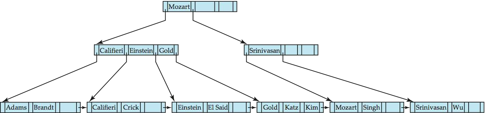

If there are K search-key values in the file, the height of the tree is no more than $\lceil\log_{\lceil \frac{n}{2} \rceil} (K) \rceil$

A node is generally the same size as a disk block, typically 4 KB and n is typically around 100 (40 bytes per index entry).

With 1 million search key values and n = 100, at most $log_{50}(1,000,000) = 4$ nodes are accessed in a lookup.

Contrast this with a balanced binary tree with 1 million search key values — around 20 nodes are accessed in a lookup.

above difference is significant since every node access may need a disk I/O, costing around 20 milliseconds.

---

### Insert on B+-Trees

```
function insert (pr, v)
/* Assume record already added to the file. Let 
  pr be pointer to the record, and let 
  v be the search key value of the record */
1.Find the leaf node in which the search-key value would appear
  1. If there is room in the leaf node, insert (v, pr) pair in the leaf node
  2. Otherwise, split the node (along with the new (v, pr) entry) as discussed in the next slide, and propagate updates to parent nodes.
```

Splitting a leaf node:

```
take the n (search-key value, pointer) pairs (including the one being inserted) in sorted order. Place the first $\lceil \frac{n}{2} \rceil$ in the original node, and the rest in a new node.

let the new node be p, and let k be the least key value in p. Insert (k,p) in the parent of the node being split.

If the parent is full, split it and propagate the split further up.
```

Splitting of nodes proceeds upwards till a node that is not full is found.

In the worst case the root node may be split increasing the height of the tree by 1.

---

### Delete on B+-Tree

```
Function delete(pr, v)
/*Assume record already deleted from file. Let v be the search key value of the record, and pr be the pointer to the record. */
  Remove (pr, v) from the leaf node 
  If the node has too few entries due to the removal, and the entries in the node and a sibling fit into a single node, then merge siblings:
    Insert all the search-key values in the two nodes into a single node (the one on the left), and delete the other node.
    Delete the pair ($K_{i–1} , P_i$), where $P_i$ is the pointer to the deleted node, from its parent, recursively using the above procedure.
```

Otherwise, if the node has too few entries due to the removal, but the entries in the node and a sibling do not fit into a single node, then redistribute pointers:

    Redistribute the pointers between the node and a sibling such that both have more than the minimum number of entries.

    Update the corresponding search-key value in the parent of the node.

The node deletions may cascade upwards till a node which has $\lceil \frac{N}{2} \rceil$ or more pointers is found.

If the root node has only one pointer after deletion, it is deleted and the sole child becomes the root.

---

### Complexity of Updates

Cost (in terms of number of I/O operations) of insertion and deletion of a single entry proportional to height of the tree

With K entries and maximum fanout of n, worst case  complexity of insert/delete of an entry is $O(\log_{\lceil \frac{n}{2} \rceil}K)$

In practice, number of I/O operations is less:

- Internal nodes tend to be in buffer
- Splits/merges are rare, most insert/delete operations only affect a leaf node

Average node occupancy depends on insertion order

$\frac{2}{3}$ with random, $\frac{1}{2}$ with insertion in sorted order

虽然 B+ 树上的插入和删除操作比较复杂，但它们需要的 I/O 操作相对较少，这是一个重要的优点，因为 I/O 操作很昂贵。可以看出，在最坏情况下一次插入所需的 I/O 操作数与 $\lceil\log_{\lceil \frac{n}{2} \rceil} (N) \rceil$ 其中 n 是节点中指针的最大数量，而 N 是被索引文件中的记录数量。

只要搜索码没有重复值，在最坏情况下删除过程的复杂度也与 $\lceil\log_{\lceil \frac{n}{2} \rceil} (N) \rceil$ 成正比。

换言之，从 I/O 操作这方面来说，插入和删除操作的代价与 B+ 树的高度呈正比，因此代价较低。正是 B+ 树上的操作速度使它成为数据库实现中常用的索引结构。

尽管 B+ 树只保证节点至少是半满的，但如果按随机顺序插入项，则平均来说节点可能超过三分之二是满的。另一方面，如果有序地插入项，则节点将仅为半满的。

!!! note "Prove"
    1. 有序插入的情况

    当数据按有序（如递增或递减）方式插入时，所有新元素会连续地插入到同一节点（如最右侧的叶子节点）。每当该节点填满（达到最大容量 $M$ ）时，必须分裂为两个节点。分裂后，每个新节点包含约 $M/2$ 个元素。由于后续插入仍集中在分裂后的新节点，这一过程反复发生，导致每个节点在分裂前仅被填充到 $M$，分裂后立即回到半满状态（$M/2$）。因此，节点的平均填充率始终为半满（50%）。
    
    2. 随机插入的情况
    
    当数据以随机顺序插入时，每个节点的插入概率均等。此时，节点的填充行为可通过概率模型分析：

    - **分裂时机与概率**：设节点最大容量为 $M$。当节点被随机插入时，其元素数从 $M/2$（分裂后的初始状态）逐渐增加到 $M$。假设每次插入到该节点的概率为 $p = 1/S$（$S$ 为当前节点总数），则节点需要约 $M/2$ 次插入才能填满并分裂。
      
    - **稳态分析**：在稳态下，节点数目 $S$ 足够大，插入操作分散到多个节点。每个节点在被分裂前平均积累的插入次数为 $M/2$，但填充数的期望值更高。根据概率分析（如泊松过程或马尔可夫链稳态），**平均填充率约为 $\ln 2 \approx 69\%$**，超过三分之二。

    - **数学推导**：  

    假设节点从半满（$M/2$）开始，每次插入到该节点的概率为 $p$。当节点填满时分裂为两个半满节点。通过计算稳态下的期望填充数，可得：
    $$\text{平均填充率} = \frac{\sum_{k=M/2}^{M-1} k \cdot \text{概率}(k)}{M}$$
    其中，概率分布由随机插入的均匀性决定，最终结果趋近于 \(\ln 2 \cdot M\)。

---

### Non-Unique Search Keys

If a search key $a_i$ is not unique, create instead an index on a 
composite key ($a_i, A_p$) , which is unique

$A_p$ could be a primary key, record ID, or any other attribute that 
guarantees uniqueness

Search for $a_i = v$ can be implemented by a range search on  composite key, with range $(v, -\infty)$ to $(v, +\infty)$

- Extra storage overhead for keys
- Simpler code for insertion/deletion
- More I/O operations are needed to fetch the actual records

1. If the index is clustering, all accesses are sequential
2. If the index is non-clustering, each record access may need an I/O operation
3. Widely used

---

### B+- tree : height and size estimation

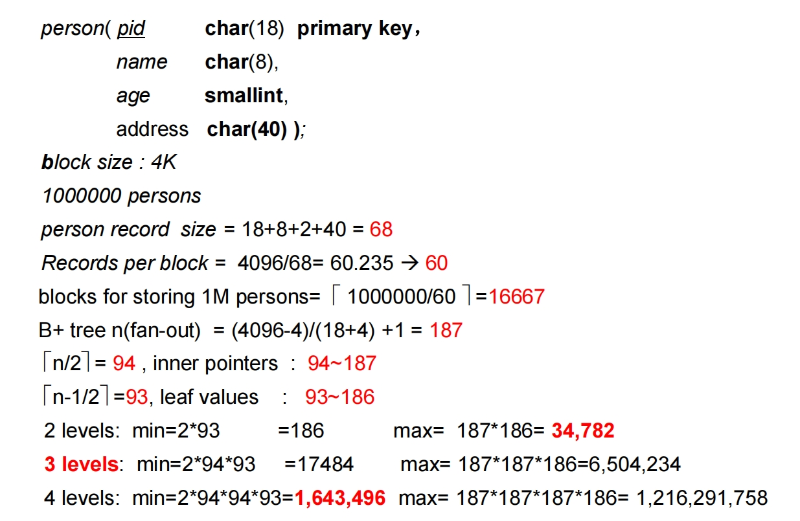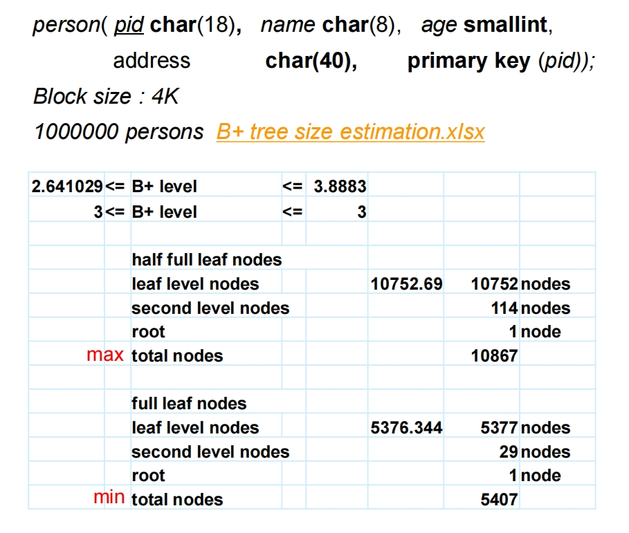

---

### B+-Tree File Organization

B+-Tree File Organization:

Leaf nodes in a B+-tree file organization store **records**, instead of pointers

Helps keep data records clustered even when there are insertions/deletions/updates

Leaf nodes are still required to be half full

Since records are larger than pointers, the maximum number of  records that can be stored in a leaf node is less than the number of pointers in a nonleaf node.

Insertion and deletion are handled in the same way as insertion and  deletion of entries in a B+-tree index.

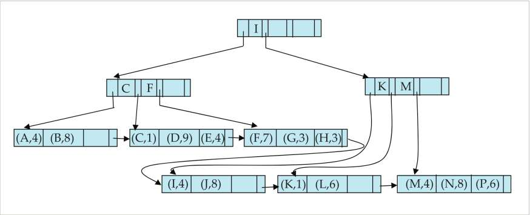

$$\text{Example of B+-tree File Organization}$$

Good space utilization important since records use more space than  pointers.

To improve space utilization, involve more sibling nodes in redistribution during splits and merges

Involving 2 siblings in redistribution (to avoid split / merge where possible) results in each node having at least $\lfloor \frac{2n}{3} \rfloor$ entries

---

### Other Issues in Indexing

**Record relocation and secondary indices**

If a record moves, all secondary indices that store record pointers  have to be updated

Node splits in B+-tree file organizations become very expensive

Solution: use primary-index search key instead of record pointer in  secondary index

- Extra traversal of primary index to locate record
    - Higher cost for queries, but node splits are cheap
- Add record-id if primary-index search key is non-unique

---

#### Indexing Strings

Variable length strings as keys

- Variable fanout
- Use space utilization as criterion for splitting, not number of pointers

Prefix compression

- Key values at internal nodes can be prefixes of full key
  - Keep enough characters to distinguish entries in the subtrees separated by the key value
- Keys in leaf node can be compressed by sharing common prefixes

---

#### Bulk Loading and Bottom-Up Build

Inserting entries one-at-a-time into a B+-tree requires $\ge  1$ IO per entry

- assuming leaf level does not fit in memory
- can be very inefficient for loading a large number of entries at a time (bulk loading)

Efficient alternative 1: Insert in sorted order

- sort entries first (using efficient external-memory sort algorithms)
- insert in sorted order
  - insertion will go to existing page (or cause a split)
  - much improved IO performance, but most leaf nodes half full

Efficient alternative 2: Bottom-up B+-tree construction

- As before sort entries
- And then create tree layer-by-layer, starting with leaf level
- Implemented as part of bulk-load utility by most database systems

---

##### Bottom-Up B+-tree Build

对于这一种生成的存放方式:一层层放置。

叶子放在一起。

存放的时候只有一次读写定位,然后可以直接移动过去,可以一边生成一遍写入磁盘,一次顺序写即可。

读和查找的时候,范围查找十分高效,scan的时候也很高效。

**Bottom-up B+-tree construction**

1. First sort index entries
2. Then create B+-tree layer-by-layer, starting with leaf level
3. The built B+-tree is written to disk using sequential I/O operations

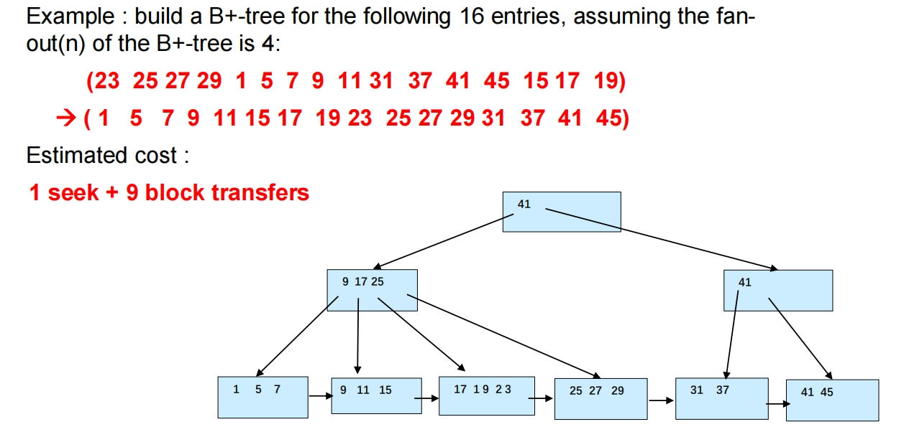

**Bulk insert index entries**

一次 seek 是把要插入的东西排序后再插入。要是插入的很多还能新建 B+ 树再合并。

两行数组进行 merging 就是一行新的叶子。

一次 seek 是要把老的读进去。

合起来的有13个块，再加上把六个老的叶子块送到新的这边，一共十九。

Build a new B+-tree using the Bottom-UP Build algorithm

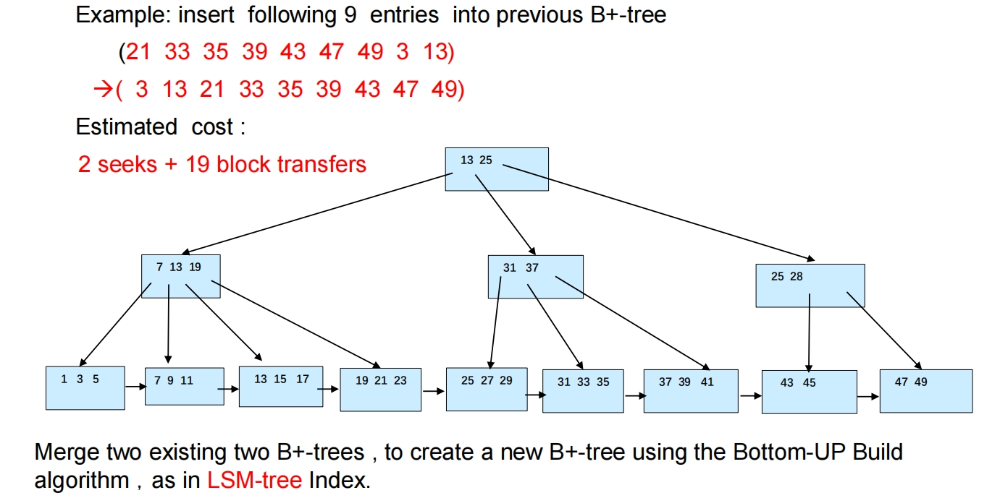

---

##### Multiple-Key Access

Use multiple indices for certain types of queries.

Example: 
select ID
from instructor
where dept_name = "Finance" and salary = 80000

Possible strategies for processing query using indices on single attributes:

1. Use index on dept_name to find instructors with department name Finance; test salary = 80000 
2. Use index on salary to find instructors with a salary of $80000; test dept_name = "Finance".
3. Use dept_name index to find pointers to all records pertaining to the "Finance" department. Similarly use index on salary. Take intersection of both sets of pointers obtained.

1. 可以建立两个索引。
2. 或者建立一个索引,找出满足一个条件的。

只要 search-key 可以比较大小就可以建立 B+ 树索引

---

##### Indices on Multiple Keys

Composite search keys are search keys containing more than one attribute

E.g. (dept_name, salary)

Lexicographic ordering:

$(a_1, a_2) < (b_1, b_2)$ if $a_1 < b_1$ or $a_1 = b_1$ and $a_2 < b_2$

1. 可以在二元组上建立索引,只要能比较大小。
2. 哪个作为第一个属性还是很重要的，对于 range-search 还是很有用的。

---

### Indexing in Main Memory

Random access in memory

- Much cheaper than on disk/flash, but still expensive compared to cache read
- Binary search for a key value within a large B+-tree node results in many cache misses
- Data structures that make best use of cache preferable – cache conscious

4K 大小的节点是因为磁盘内存交互就是 4K ,为了减小 I/O。

在内存中到 CPU 中还是存在数据传输的问题的，所以其实二分查找找了要读取另一部分的时间是没有很好地利用。

cache的结构的对于有序数组无论顺序查找或者二分查找都不高效。

B+- trees with small nodes that fit in cache line are preferable to reduce cache misses

局部可以成树形结构，把这个结构读到CPU里面。

**Key idea**:

- use large node size to optimize disk access
- but structure data within a node using a tree with small node size, instead of using an array, to optimize cache access.

例如可以学生的名字、学号分别数组，然后按照学生顺序这样放。

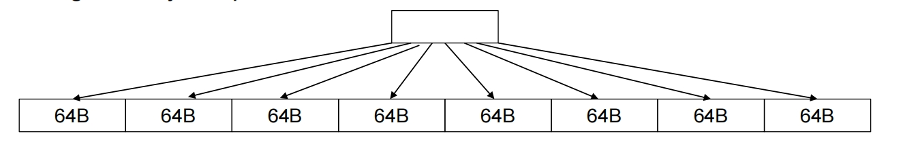

---

### Indexing on Flash

Random I/O cost much lower on flash —— 20 to 100 microseconds for read/write

Writes are not in-place, and (eventually) require a more expensive erase. flash上面的擦会影响寿命。

Optimum page size therefore much smaller

Bulk-loading still useful since it minimizes page erases

Write-optimized tree structures (i.e., LSM-tree) have been adapted to minimize page writes for flash-optimized search trees

---

### Write Optimized Indices

Performance of B+-trees can be poor for write-intensive workloads

- One I/O per leaf, assuming all internal nodes are in memory
- With magnetic disks, < 100 inserts per second per disk
- With flash memory, one page overwrite per insert

Two approaches to reducing cost of writes

1. Log-structured merge tree (LSM-tree)
2. Buffer tree

---

#### Log Structured Merge (LSM) Tree

日志归并树，先在内存构建结构，内存里写满了之后再写入 Disk 就行，满了之后再 merge ，并再往下写(磁盘更深处)。

Consider only inserts/queries for now

Records inserted first into inmemory tree($L_0$ tree)

When in-memory tree is full, records moved to disk ($L_1$ tree)

- B+-tree constructed using bottom-up build by merging existing $L_1$ tree with records from $L_0$ tree

When $L_1$ tree exceeds some threshold, merge into $L_2$ tree

And so on for more levels

Size threshold for $L_{i+1}$ tree is k times size threshold for $L_i$ tree

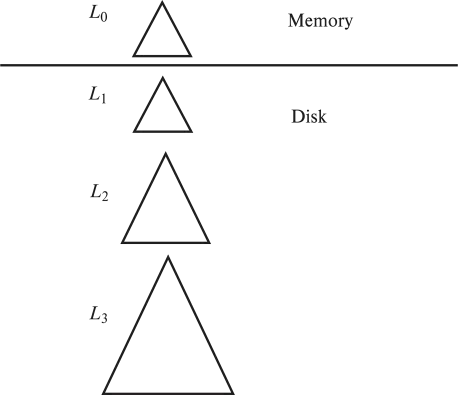

Benefits of LSM approach

- Inserts are done using only sequential I/O operations
- Leaves are full, avoiding space wastage
- Reduced number of I/O operations per record inserted as compared to normal B+-tree (up to some size)

Drawback of LSM approach

- Queries have to search multiple trees
- Entire content of each level copied multiple times

Stepped-merge index

- Variant of LSM tree with multiple trees at each level
- Reduces write cost compared to LSM tree
- But queries are even more expensive, Bloom filters to avoid lookups in most trees

---

#### Stepped Merge Index

Stepped-merge index: variant of LSM tree with k trees at each level on disk

1. When all k indices exist at a level, merge them into one index of next level.
2. Reduces write cost compared to LSM tree

But queries are even more expensive since many trees need to be queries

Optimization for point lookups

1. Compute Bloom filter for each tree and store in-memory
2. Query a tree only if Bloom filter returns a positive result

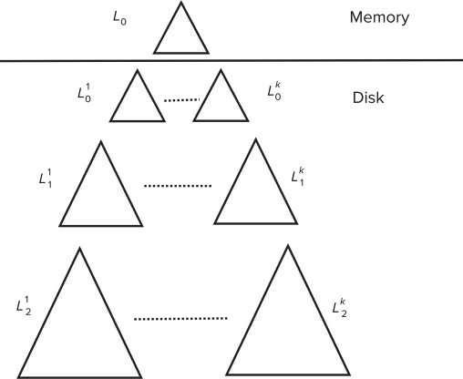

Deletion handled by adding special "delete" entries

1. Lookups will find both original entry and the delete entry, and must return only those entries that do not have matching delete entry
2. When trees are merged, if we find a delete entry matching an  original entry, both are dropped.

Update handled using insert+delete

LSM trees were introduced for disk-based indices, but useful to minimize erases with flash-based indices

The stepped-merge variant of LSM trees is used in many BigData  storage systems

##### LSM树和阶梯式合并索引的关系

在LSM树或阶梯式合并索引等写入优化的结构中，数据仅在层满时合并到下一层。这种策略虽然降低了写入放大，但可能导致读取时需要查询多个层级和文件，尤其在读取密集但无更新的场景中，性能瓶颈会显现。

**1. LSM树的核心设计**

LSM树是一种针对**写优化**的数据结构，核心思想是通过分层存储和异步合并来平衡读写性能。其基本结构包括：

- **内存层（MemTable）**：接收写入操作，数据首先写入内存中的可变结构（如跳表或B+树）。
- **磁盘层（SSTable层级）**：内存数据刷写到磁盘后形成不可变的**有序字符串表（SSTable）**，并按层级组织（如Level 0到Level N）。
- **合并操作（Compaction）**：当某一层数据量达到阈值时，将其与下一层的数据合并，逐步下沉到更深层级。

**2. 阶梯式合并索引的本质**

阶梯式合并索引（stepped-merge）是 LSM 树中**合并策略**的一种具体实现方式，而非独立的数据结构。它的核心目标是：

- **减少单次合并的数据量**：通过将合并分解为多个步骤，逐步迁移数据，避免全量合并的延迟和资源占用。
- **优化写入放大和读取性能**：通过更细粒度的合并控制，平衡写入开销与查询时需要访问的文件数量。

---

### Buffer Tree

Buffer Tree 是一种改进的 B+ 树结构，**通过在内部节点（非叶子节点）添加缓冲区（buffer）来优化插入性能**，适用于**写入密集型**场景（如数据库、文件系统等）。  

Key idea: each internal node of B+-tree has a buffer to store inserts

1. Inserts are moved to lower levels when buffer is full
2. With a large buffer, many records are moved to lower level each  time
3. Per record I/O decreases correspondingly

1. **缓冲插入操作**  

   - 传统 B+ 树：每次插入必须立即递归向下找到叶子节点，可能导致频繁的节点分裂和 I/O 操作。  
   - Buffer Tree：插入操作**先暂存在内部节点的缓冲区**，直到缓冲区满时才批量向下传递（flush），减少 I/O 开销。  

2. **批量下推（Flushing）**  

   - 当某个内部节点的缓冲区满时，其中的所有插入操作会**一次性下推到子节点**（可能触发子节点缓冲区的递归下推）。  
   - **每次下推的 I/O 成本分摊到多条记录**，降低单条记录的 I/O 开销。  

3. **查询处理**  

   - 查询时需要检查路径上所有缓冲区的未下推操作，确保数据一致性（可能增加少量查询开销）。  

**Benefits**

1. Less overhead on queries
2. Can be used with any tree index structure
3. Used in PostgreSQL Generalized Search Tree (GiST) indices

**优点**

1. **减少查询干扰**  
   - 插入操作被缓冲，避免频繁的节点分裂和磁盘写入，使得查询性能更稳定。  
2. **通用性**  
   - 可适配多种树结构（如 B+ 树、R 树等），PostgreSQL 的 GiST 索引就使用了类似技术。  
3. **适合写入密集型场景**  
   - 缓冲区满时批量下推，减少随机 I/O 次数（相比传统 B+ 树）。  

**Drawback**: more random I/O than LSM tree

**缺点**

1. **随机 I/O 仍存在**  
   - 虽然比传统 B+ 树优化，但下推操作仍涉及随机磁盘访问，**不如 LSM 树（Log-Structured Merge Tree）的顺序写入高效**。  
   - LSM 树通过追加写入（顺序 I/O）+ 后台合并（compaction）进一步优化写入吞吐。  

2. **查询延迟**  
   - 查询时需要合并缓冲区中的未下推操作，可能增加少量 CPU 和内存开销。  

1. 优化I/O
2. 代价是 buffer 会占据 fan-out 的位置
3. buffer 大小难以计算

**适用场景**

- **中等写入负载**：需要平衡读写性能的场景（如传统数据库索引）。  
- **无法完全避免随机 I/O**：但相比纯 B+ 树，能显著降低写入放大（write amplification）。  

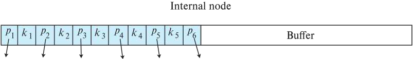

---

### Bitmap Indices

Bitmap indices are a special type of index designed for efficient querying on multiple keys

位图索引是一种**针对低基数（low-cardinality）属性**（即属性取值较少，如性别、国家、状态等）设计的特殊索引结构，通过**位运算**高效支持多属性查询（如 `gender='M' AND income_level='L1'`）。

Records in a relation are assumed to be numbered sequentially from, say, 0

Given a number n it must be easy to retrieve record n. Particularly easy if records are of fixed size.

Applicable on attributes that take on a relatively small number of distinct values

E.g., gender, country, state, ...

A bitmap is simply an array of bits

In its simplest form a bitmap index on an attribute has a bitmap for each value of the attribute

- Bitmap has as many bits as records 
- In a bitmap for value v, the bit for a record is 1 if the record has the value v for the attribute, and is 0 otherwise

比特数组比起原来的还是小很多，对于gender只有两个值建立索引用常规结构还是有点难度的但是对于 bitmap 就很容易。

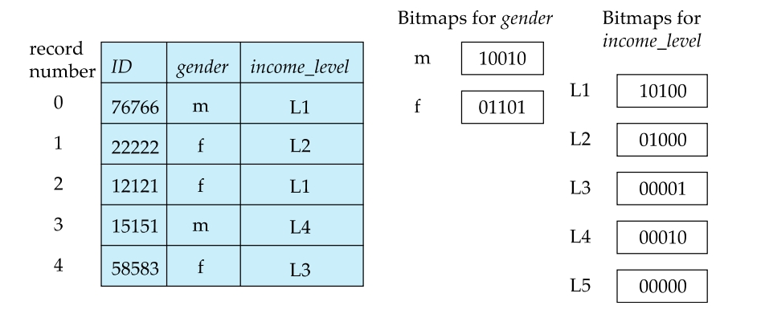

统计一万个字有多少个 1 : 比如取 256 ,然后 256 就是 256 个 1 , 255 就是 255 个 1,然后加上去。对大数据分析很有用。

Bitmap indices are useful for queries on multiple attributes, not particularly useful for single attribute queries.

Queries are answered using bitmap operations

- Intersection (and)
- Union (or)

Each operation takes two bitmaps of the same size and applies the  operation on corresponding bits to get the result bitmap

E.g., 100110 AND 110011 = 100010
      100110 OR 110011 = 110111
      NOT 100110 = 011001

Males with income level L1: 10010 AND 10100 = 10000

- Can then retrieve required tuples.
- Counting number of matching tuples is even faster

Bitmap indices generally very small compared with relation size

E.g., if record is 100 bytes, space for a single bitmap is 1/800 of 
space used by relation.

- If number of distinct attribute values is 8, bitmap is only 1% of relation size

**位图索引的优势**

**(1) 空间效率高**

- 位图是**紧凑的二进制数组**，每条记录仅用 1 bit 表示。
- 对比传统索引（如 B+ 树），存储开销极低：
  - 若记录大小为 100 字节，单个位图仅占 `1/800` 的空间。
  - 若属性有 8 个不同值，位图总大小仅为表的 **1%**。

**(2) 多属性查询高效**

通过**位运算**（AND/OR/NOT）快速组合多个条件的查询：

- **AND（交集）**：`gender='M' AND income_level='L1'`  
  ```plaintext
  'M'    : 1 0 1 1 0
  'L1'   : 1 0 0 1 0
  ------------------- AND
  Result: 1 0 0 1 0（匹配行 0 和 3）
  ```
- **OR（并集）**：`gender='M' OR gender='F'`  
  ```plaintext
  'M'    : 1 0 1 1 0
  'F'    : 0 1 0 0 1
  ------------------- OR
  Result: 1 1 1 1 1（匹配所有行）
  ```

**(3) 统计计数极快**

- 直接计算位图中 `1` 的个数即可得到匹配的记录数。
- 优化技巧：
  - 预计算**每个字节（8 bit）的 1 的个数**，查表累加。  
    （例如，`0xFF` 对应 8，`0x0F` 对应 4）
  - 对 1-million 位的位图，仅需约 31,250 次 CPU 指令即可完成 AND 操作。

---

#### Efficient Implementation of Bitmap Operations

Bitmaps are packed into words; a single word and (a basic CPU  instruction) computes and of 32 or 64 bits at once

E.g., 1-million-bit maps can be and-ed with just 31,250 instruction

Counting number of 1s can be done fast by a trick:

- Use each byte to index into a precomputed array of 256 elements  each storing the count of 1s in the binary representation

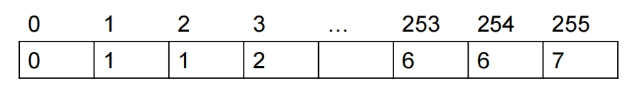

Can use pairs of bytes to speed up further at a higher memory cost

Add up the retrieved counts

---