# Chapter 15 | Query Processing

## Basic Steps in Query Processing

The steps involved in processing a query appear in Figure 15.1. The basic steps are:

1. Parsing and translation. 语法分析与翻译

translate the query into its internal form. This is then translated into relational algebra.

Parser checks syntax, verifies relations

2. Optimization. 优化

Amongst all equivalent evaluation plans choose the one with lowest cost.

3. Evaluation. 执行

The query-execution engine takes a query-evaluation plan, executes that plan, and returns the answers to the query.

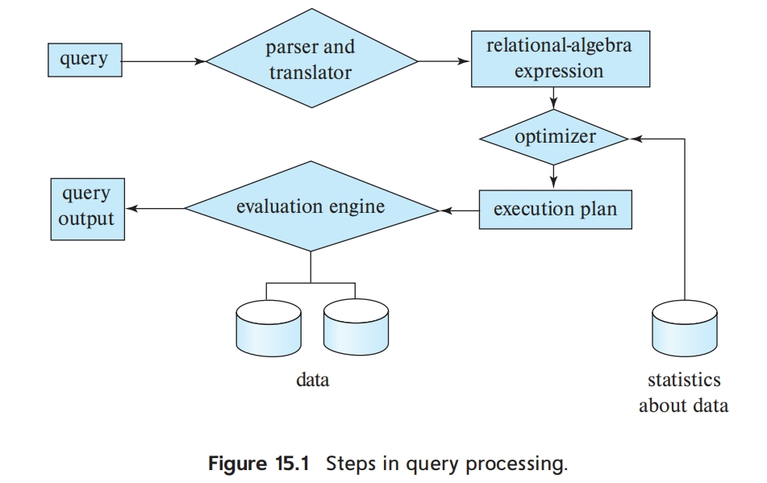

An evaluation plan defines exactly what algorithm is used for each operation, and how the execution of the operations is coordinated.

为了全面说明如何执行一个查询，我们不仅要提供关系代数表达式，还要对表达式加上带指令的注释来说明如何执行每种运算。

这些注释可以说明为一种具体运算所采用的算法或要使用的一个具体索引或多个索引。带有"如何执行"注释的关系代数运算称为执行原语(evaluation primitive)。用于执行一个查询的原语操作序列称为查询执行计划(query-execution plan或query-evaluation plan)。

查询执行引擎(query-execution engine)接受一个查询执行计划，执行该计划并把结果返回给查询。

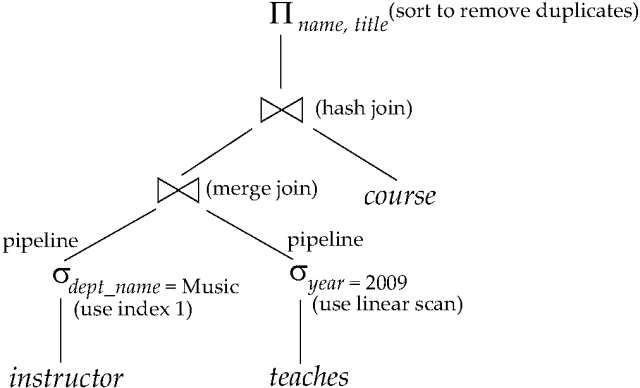

??? note "sjl's explanation"
    1. 选择运算到叶子上面，早点执行

    2. hash join 把哈希值相同的放在一起

    3. 这个算子生成一个临时表，两个临时表连接再存储... 因为要把中间结果存储起来，写回去再读出来，会比较低效

    4. 可以采用流水线的思想，因为磁盘的读写是时间的大头

---

## Measures of Query Cost

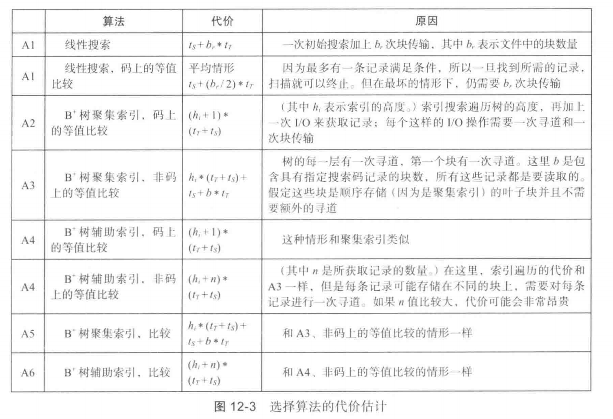

??? note "about 聚集索引和辅助索引"
   假设我们有一个 `students` 表，存储学生的信息，结构如下：

    | **学号（sid）** | **姓名（name）** | **年龄（age）** | **班级（class）** |
    |:------------:|:------------:|:-----------:|:-------------:|
    | 101          | 张三         | 18          | 1班           |
    | 102          | 李四         | 19          | 2班           |
    | 103          | 王五         | 20          | 1班           |
    | 104          | 赵六         | 18          | 3班           |

    1. 聚集索引（Clustered Index）
    
    在 MySQL InnoDB 中，**主键默认是聚集索引**。假设我们以 `学号（sid）` 作为主键，那么数据行在磁盘上**按 `学号` 顺序存储**。

    - **B+树结构**：
        - **叶子节点**：存储**完整的数据行**（`sid, name, age, class`）。
        - **非叶子节点**：存储键值（`sid`）和指向下一层的指针。
    
    2. 辅助索引（Secondary Index）

    假设我们在 `姓名（name）` 字段上创建一个辅助索引，辅助索引的 B+树**独立于数据存储**，叶子节点不存完整数据，而是存**主键值（sid）**。

    - **B+树结构**：
        - **叶子节点**：存储 `name` 和对应的 `sid`（如 `('张三', 101)`）。
        - **非叶子节点**：存储 `name` 和指向下一层的指针。

    **关键区别对比**

    | **查询场景**               | **聚集索引（sid）**                          | **辅助索引（name）**                          |
    |:-------------------------:|:-------------------------------------------:|:-------------------------------------------:|
    | **查询 `WHERE sid=102`**  | 直接定位数据行，**无需回表**，速度快。       | 不适用（除非覆盖索引）。                     |
    | **查询 `WHERE name='李四'`** | 需全表扫描（除非优化器选择索引）。           | 先查 `name` 索引得 `sid`，再回表，**多一步**。 |
    | **插入数据**              | 数据按 `sid` 排序插入，可能引起页分裂。      | 只需更新 `name` 索引树，不影响数据物理顺序。  |

---

Cost is generally measured as total elapsed time for answering query

Typically disk access is the predominant cost, and is also relatively easy to estimate.

Measured by taking into account

- Number of seeks
- Number of blocks read
- Number of blocks written

!!! info
    Cost to write a block is greater than cost to read a block.

    data is read back after being written to ensure that the write was successful

For simplicity we just use the number of **block transfers from disk** and the number of **seeks** as the cost measures

- $t_T$ ——time to transfer one block
- $t_S$ ——time for one seek
- Cost for b block transfers plus S seeks is $b \cdot t_T + S \cdot t_S$

!!! note
    $t_S$ and $t_T$ depend on where data is stored; with 4 KB blocks:

    High end magnetic disk: $t_S = 4$ msec, $t_T = 0.1$ msec, $t_S / t_T \approx 40$

    SSD: $t_S$ = 20-90 microsec and $t_T$ = 2-10 microsec for 4KB, $t_S / t_T \approx 10$

We ignore CPU costs for simplicity, while real systems do take CPU cost into account.

We ignore cost to writing output to disk in our cost formulae.

Several algorithms can reduce disk IO by using extra buffer space 

Amount of real memory available to buffer depends on other concurrent queries and OS processes, known only during execution. We often use worst case estimates, assuming only the minimum amount of memory needed for the operation is available.

Required data may be buffer resident already, avoiding disk I/O. But hard to take into account for cost estimation.

---

### Selection Operation

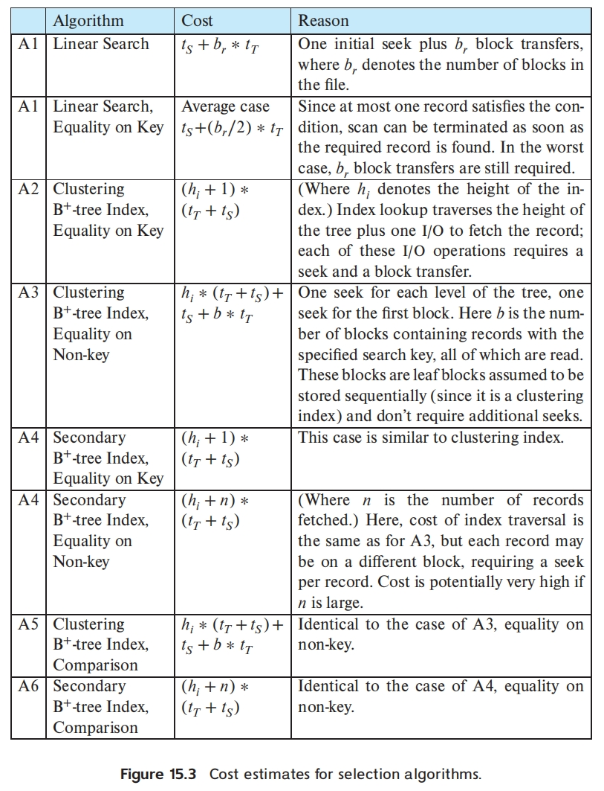

#### File scan / Algorithm A1 (linear search).

Scan each file block and test all records to see whether they satisfy the selection condition.

worst cost = $b_r \times t_T + t_S$

- $b_r$ denotes number of blocks containing records from relation r

If selection is on a key attribute, can stop on finding record

average cost = $(\frac{b_r}{2}) \times t_T + t_S$

Linear search can be applied regardless of

- selection condition or
- ordering of records in the file, or
- availability of indices

**Note**: binary search generally does not make sense since data is not stored consecutively, except when there is an index available, and binary search requires more seeks than index search.

---

#### Index scan / A2 (primary B+-tree index / clustering B+-tree index, equality on key)

Index scan – search algorithms that use an index selection condition must be on search-key of index.

Retrieve a single record that satisfies the corresponding equality condition

Cost = $(h_i + 1) \times (t_S + t_T)$

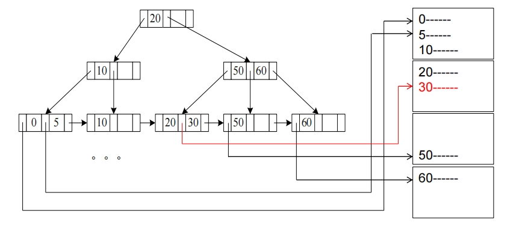

---

#### A3 (primary B+-tree index/ clustering B+-tree index, equality on nonkey)

Retrieve multiple records.

Records will be on consecutive blocks.

Let b = number of blocks containing matching records

Cost = $h_i \times (t_T + t_S) + t_S + t_T \times b$

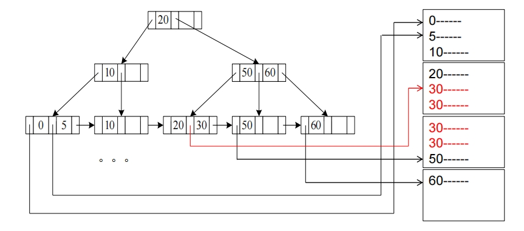

---

#### A4 (secondary B+-tree index , equality on key)

Cost = $(h_i + 1) \times (t_S + t_T)$

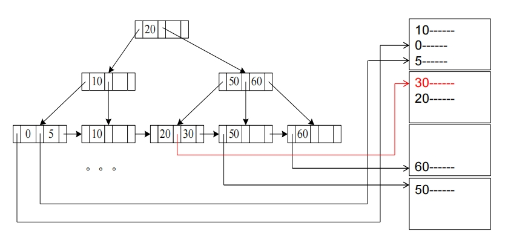

---

#### A4' (secondary B+-index on nonkey, equality)

Each of n matching records may be on a different block

n pointers may be stored in m blocks

Cost = $(h_i + m + n) \times (t_S + t_T)$

Can be very expensive!

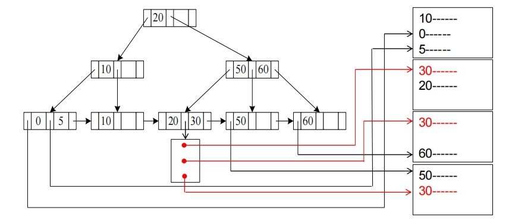

---

Can implement selections of the form $\sigma_{A \le V}(r)$ or $\sigma_{A \ge V}(r)$ by using

a linear file scan or binary search, or by using indices in the following ways:

#### A5 (primary B+-index / clustering B+-index index, comparison)

(Relation is sorted on A)

- For $\sigma_{A \ge V}(r)$ use index to find first tuple $\ge V$ and scan relation sequentially from there.
- Cost is identical to the case of A3 $\rightarrow \ Cost \ = \ h_i \times (t_T + t_S) + t_S + t_T \times b$
- For $\sigma_{A \le V}(r)$ just scan relation sequentially till first tuple > V; do not use index

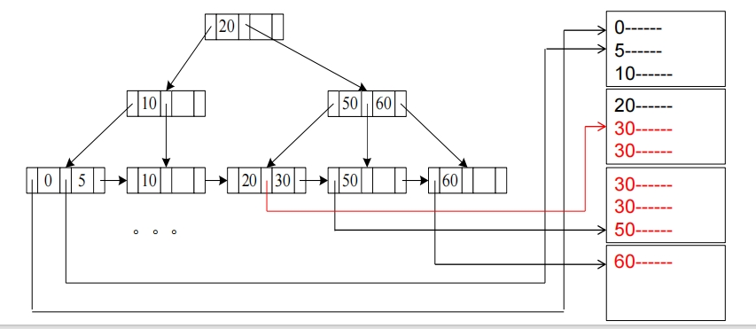

---

#### A6 (secondary B+-tree index, comparison)

- For $\sigma_{A \ge V}(r)$ use index to find first ndex entry $\ge V$ and scan index sequentially from there, to find pointers to records.
- For $\sigma_{A \le V}(r)$ just scan eaf pages of index finding pointers to records, till first entry > V.
- In either case, retrieve records that are pointed to
    - requires an I/O for each record
    - Linear file scan may be cheaper

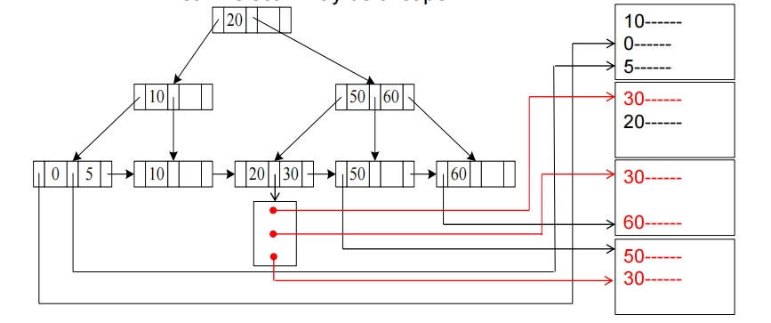

---

Conjunction: $\sigma_{\theta_1 \land \theta_2 \land \ldots \land \theta_n}(r)$

#### A7 (conjunctive selection using one index)

Select a combination of $\theta_i$ and algorithms A1 through A6 that results in the least cost for $\sigma_{\theta_i}(r)$

Test other conditions on tuple after fetching it into memory buffer.

---

#### A8 (conjunctive selection using composite index)

Use appropriate composite (multiple-key) index if available

---

#### A9 (conjunctive selection by intersection of identifiers)

Requires indices with record pointers.

Use corresponding index for each condition, and take intersection 
of all the obtained sets of record pointers. 

Then fetch records from file.

If some conditions do not have appropriate indices, apply test in 
memory.

---

Disjunction: $\sigma_{\theta_1 \lor \theta_2 \lor \ldots \lor \theta_n}(r)$

#### A10 (disjunctive selection by union of identifiers)

Applicable if all conditions have available indices. Otherwise use linear scan.

Use corresponding index for each condition, and take union of all the obtained sets of record pointers.

Then fetch records from file

---

Negation: $\sigma_{\neg \theta}(r)$

Use linear scan on file

If very few records satisfy $\neg \theta$ , and an index is applicable to $\theta$ , find satisfying records using index and fetch from file

---

## Sorting

We may build an index on the relation, and then use the index to read the relation in sorted order. May lead to one disk block access for each tuple.

For relations that fit in memory, techniques like quicksort can be used. 

For relations that don’t fit in memory, external sort-merge is a good choice.

---

### External Sort-Merge

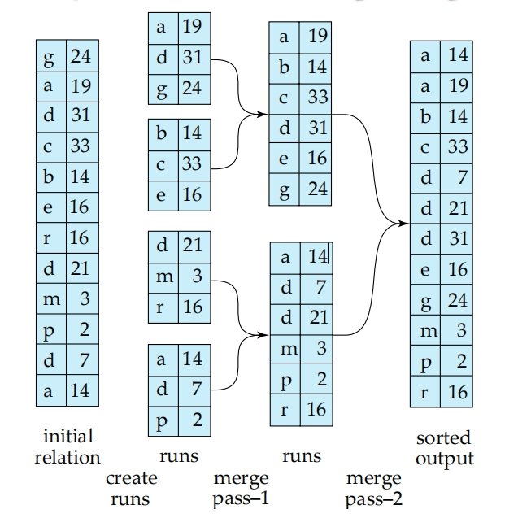

Let M denote memory size (in pages).

1. Create sorted runs (归并段).

Let i be 0 initially.

Repeatedly do the following till the end of the relation:

(a) Read M blocks of relation into memory
(b) Sort the in-memory blocks
(c) Write sorted data to run $R_i$ ; increment i.

Let the final value of i be N

---

2. Merge the runs (N-way merge).

If N < M, single merge pass is required (如果归并段少于可用内存页)

a. Use N blocks of memory to buffer input runs, and 1 block to buffer output. Read the first block of each run into its buffer page
b. repeat
    (1) Select the first record (in sort order) among all buffer pages
    (2) Write the record to the output buffer. If the output buffer is full write it to disk.
    (3) Delete the record from its input buffer page. If the buffer page becomes empty then read the next block (if any) of the run into the buffer.
c. until all input buffer pages are empty:

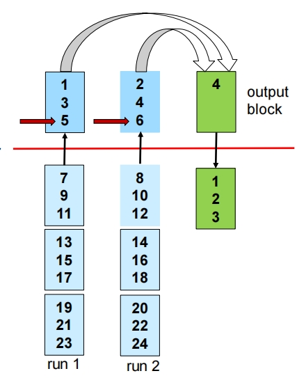

---

If N $\ge$ M, several merge passes are required.

In each pass, contiguous groups of M - 1 runs are merged.

A pass reduces the number of runs by a factor of M -1, and creates runs longer by the same factor.

- E.g. If M=11, and there are 90 runs, one pass reduces the number of runs to 9, each 10 times the size of the initial runs

Repeated passes are performed till all runs have been merged into one.

---

#### **Cost analysis**: (simple version)

Total number of runs : $\lceil b_r / M \rceil$

Total number of merge passes required: $\lceil \log_{M-1} (b_r / M) \rceil$

Block transfers for initial run creation as well as in each pass is $2b_r$

For final pass, we don’t count write cost. We ignore final write cost for all operations since the output of an operation may be sent to the parent operation without being written to disk.

Thus total number of block transfers for external sorting:

$$2b_r \lceil \log_{M-1} (b_r / M) \rceil + b_r = b_r(2 \lceil \log_{M-1} (b_r / M) \rceil + 1)$$

---

#### **Cost of seeks**: (simple version)

During run generation: one seek to read each run and one seek to write each run

- $2 \lceil b_r / M \rceil \rightarrow 2 \times [\text{the number of runs}]$

During the merge phase

Need 2 $b_r$ seeks for each merge pass, except the final one which does not require a write

There are $\lceil \log_{M-1} (b_r / M) \rceil$ merge passes

Total number of seeks:

$$2 \lceil b_r / M \rceil + b_r(2 \lceil \log_{M-1} (b_r / M) \rceil - 1)$$

??? note "prove"
    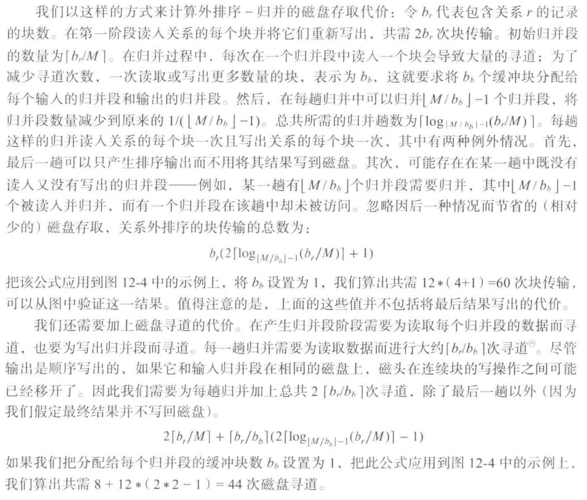

---

#### **Cost analysis**: (advanced version)

1 block per run leads to too many seeks during merge

Instead use $b_b$ buffer blocks per run $\rightarrow$ read/write $b_b$ blocks at a time

Can merge $\lfloor M /b_b \rfloor - 1$ runs in one pass

Total number of merge passes required:

$$\lceil \log_{\lfloor M / b_b \rfloor - 1} (b_r / M) \rceil$$

Block transfers for initial run creation as well as in each pass is 2 $b_r$

For final pass, we don’t count write cost, we ignore final write cost for all operations since the output of an operation may be sent to the parent operation without being written to disk.

Thus total number of block transfers for external sorting:

$$b_r (2 \lceil \log_{\lfloor M / b_b \rfloor - 1} (b_r / M) \rceil + 1)$$

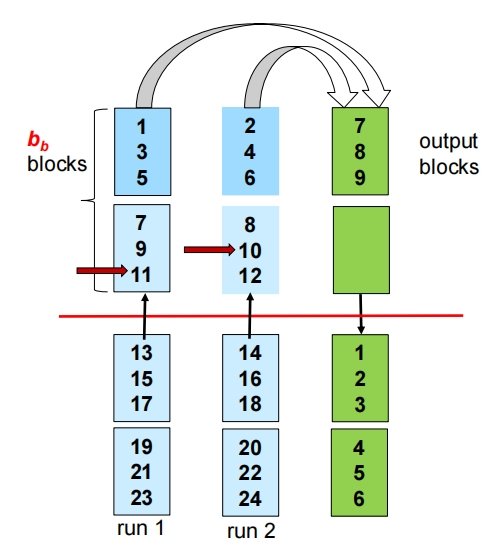

---

#### **Cost of seeks**: (advanced version)

During run generation: one seek to read each run and one seek to write each run

- 2 $\lceil b_r / M \rceil \rightarrow 2 \times [\text{the number of runs}]$

During the merge phase

Need 2 $\lceil b_r / b_b \rceil$ seeks for each merge pass, except the final one which does not require a write

There are $\lceil \log_{\lfloor M / b_b \rfloor - 1} (b_r / M) \rceil$ merge passes

Total number of seeks:

$$2 \lceil b_r / M \rceil + \lceil b_r / b_b \rceil (2 \lceil \log_{\lfloor M / b_b \rfloor - 1} (b_r / M) \rceil - 1)$$

---

## Join Operation

### Nested-Loop Join

In the worst case, if there is enough memory only to hold one block of each relation, the estimated cost is

$n_r \times b_s + b_r$ block transfers, plus $n_r + b_r$ seeks

If the smaller relation fits entirely in memory, use that as the inner relation.

Reduces cost to $b_r + b_s$ block transfers and 2 seeks

---

### Block Nested-Loop Join

Variant of nested-loop join in which every block of inner relation is paired with every block of outer relation.

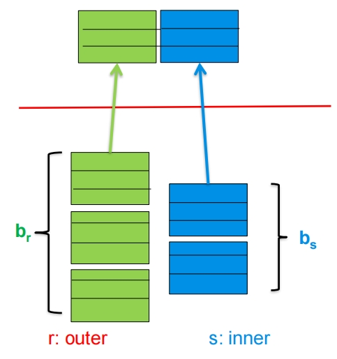

for each block $B_r$ of r do begin
    for each block $B_s$ of s do begin
        for each tuple $t_r$ in $B_r$ do begin
            for each tuple $t_s$ in $B_s$ do begin
                Check if ($t_r$ , $t_s$) satisfy the join condition 
                if they do, add $t_r \times t_s$ to the result.
            end
        end
    end
end

Worst case estimate: $b_r \times b_s + b_r$ block transfers + $2 \times b_r$ seeks

Each block in the inner relation s is read once for each block
in the outer relation

Best case: $b_r + b_s$ block transfers + 2 seeks

Improvements to block nested loop algorithms:

Use M-2 disk blocks as blocking unit for outer relations, where M = memory size in blocks; use remaining two blocks to buffer inner relation and output

Cost = $\lceil b_r / (M - 2) \rceil \times b_s + b_r$ block transfers + $2 \lceil b_r / (M - 2) \rceil$ seeks

If r fits in memory ( $b_r \le$ M-2)

Cost = $b_s + b_r$ block transfers + 2 seeks

If equi-join attribute forms a key on the inner relation, stop inner loop on first match

Scan inner loop forward and backward alternately, to make use of the blocks remaining in buffer (with LRU replacement)

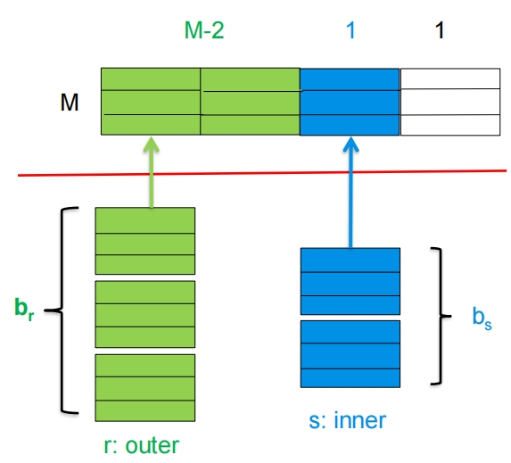

??? note "improving and proving"
    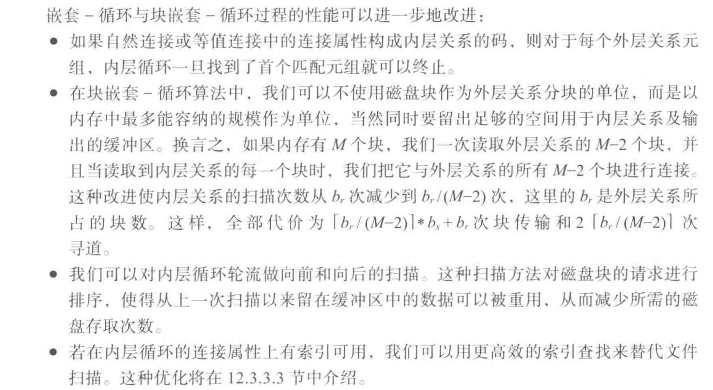

---

### Indexed Nested-Loop Join

Index lookups can replace file scans if

- join is an equi-join or natural join and
- an index is available on the inner relation's join attribute(Can construct an index just to compute a join.)

For each tuple $t_r$ in the outer relation r, use the index to look up tuples in s that satisfy the join condition with tuple $t_r$

Worst case: buffer has space for only one page of r, and, for each tuple in r, we perform an index lookup on s.

Cost of the join: $b_r(t_T + t_S) + n_r \times c$

??? note "prove"
    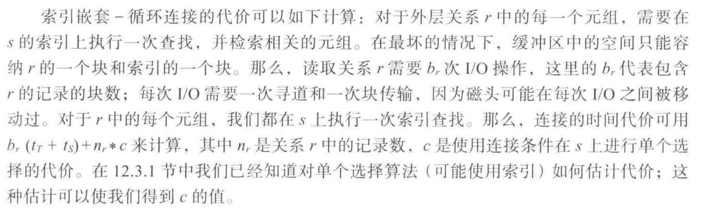

Where c is the cost of traversing index and fetching all matching s tuples for one tuple or r

c can be estimated as cost of a single selection on s using the join condition.

If indices are available on join attributes of both r and s, use the relation with fewer tuples as the outer relation.

---

### Merge-Join

1. Sort both relations on their join attribute (if not already sorted on the join attributes).
2. Merge the sorted relations to join them

- Join step is similar to the merge stage of the sort-merge algorithm.
- Main difference is handling of duplicate values in join attribute — every pair with same value on join attribute must be matched
- Detailed algorithm in book

Can be used only for equi-joins and natural joins

Each block needs to be read only once (assuming all tuples for any given value of the join attributes fit in memory)

Thus the cost of merge join is:

$b_r + b_s$ block transfers + $\lceil b_r / b_b \rceil + \lceil b_s / b_b \rceil$ seeks + the cost of sorting if relations are unsorted.

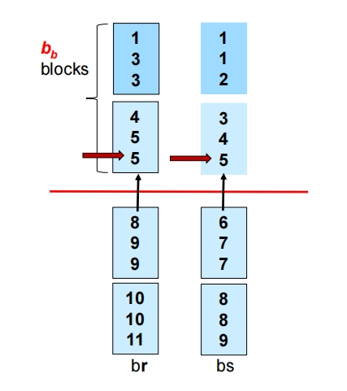

??? note "what about cost?"
    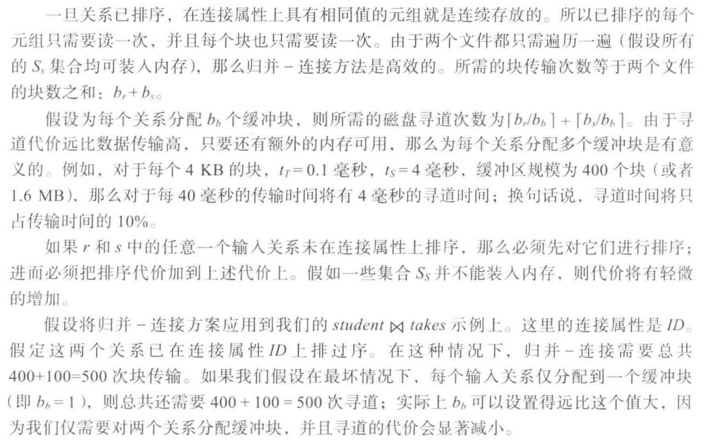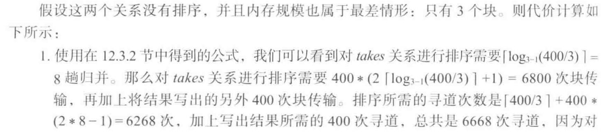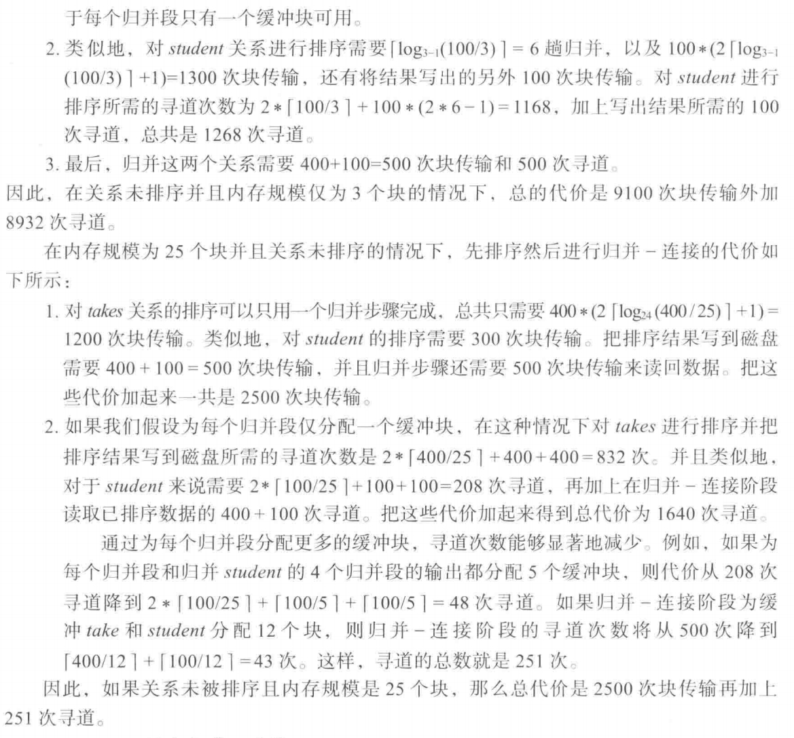

---

If the buffer memory size is M pages, in order to minimize the cost of merge join, how to assign M blocks to r and s respectively?

The estimated cost is

$b_r + b_s$ block transfers + $\lceil b_r / x_r \rceil + \lceil b_s / x_s \rceil$ seeks

with ($x_r + x_s = M$)

$x_r = \sqrt{b_r} \times M / (\sqrt{b_r} + \sqrt{b_s})$ and $x_s = \sqrt{b_s} \times M / (\sqrt{b_r} + \sqrt{b_s})$

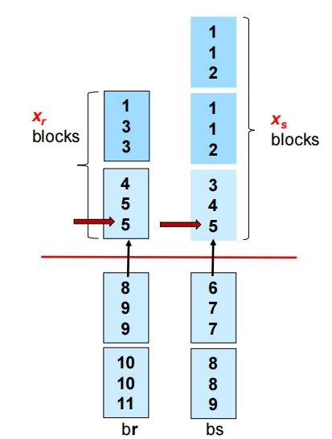

---

hybrid merge-join: If one relation is sorted, and the other has a secondary B+-tree index on the join attribute

Merge the sorted relation with the leaf entries of the B+-tree

Sort the result on the addresses of the unsorted relation's tuples

Scan the unsorted relation in physical address order and merge with previous result, to replace addresses by the actual tuples

Sequential scan more efficient than random lookup

当两个关系在连接属性上都存在辅助索引时，可以对未排序的元组执行归并——连接运算的一个变种。该算法通过索引来扫描记录，从而按顺序检索记录。但这种变种有一个很大的缺陷，因为记录可能分散在文件的多个块中，所以每个元组的存取都可能导致一个磁盘块的访问，这样的代价是很大的。

为避免这种代价，我们可以使用一种混合的归并——连接技术，该技术把索引与归并——连接结合在一起。假设有一个关系已排序，另一个未排序，但在连接属性上有 B+ 树辅助索引。混合归并——连接算法(**hybrid merge-join algorithm**)把已排序关系与 B+ 树辅助索引的叶子项进行归并。所得到的结果文件包含已排序关系的元组和未排序关系的元组地址。然后，将该结果文件按未排序关系的元组地址进行排序，从而能够对相关元组按照物理存储顺序进行高效的检索，以最终完成连接。对此技术进行扩展以处理两个未排序关系的工作留给读者作为练习。

??? note "举例说明混合归并——连接算法 & 处理两个未排序关系的工作"
    假设有两个表:

    - **`students`（学生表）**：未按任何顺序存储，但在 `class_id` 上有 B+树辅助索引。
    - **`classes`（班级表）**：已按 `class_id` 排序（比如按主键聚集索引存储）。

    现在需要执行如下连接查询:

    ```sql
    SELECT * FROM students JOIN classes ON students.class_id = classes.class_id;
    ```

    **混合归并-连接步骤（一表已排序，一表未排序）**

    **1. 已排序表（classes）与未排序表的索引叶子项归并**

    - **classes表**：已按 `class_id` 排序（假设存储顺序为 `[1班, 2班, 3班]`）。
    - **students表的辅助索引**：B+树索引的叶子节点按 `class_id` 排序，存储的是 `(class_id, 学生记录的物理地址)`，例如：

    ```plaintext
    (1班, addr1) → (1班, addr3) → (2班, addr2) → (3班, addr4)
    ```

    **归并过程**：
    1. 同时扫描已排序的 `classes` 表和 `students` 的辅助索引叶子节点（两者均按 `class_id` 有序）。
    2. 对匹配的 `class_id`，生成中间结果：`(classes表的班级记录, students表记录的物理地址)`  

    ```plaintext
    (1班数据, addr1), (1班数据, addr3), (2班数据, addr2), (3班数据, addr4)
    ```

    **2. 按物理地址排序中间结果**

    将中间结果按 `students` 表记录的物理地址（如 `addr1, addr2, addr3, addr4`）排序，目的是让后续对 `students` 表的读取**按物理存储顺序进行**（减少磁盘随机I/O）。

    **3. 按物理顺序读取students表并完成连接**

    按排序后的物理地址顺序，高效（连续读取）地从 `students` 表中获取完整记录，与 `classes` 表的数据组合成最终结果。

    ---

    **扩展到两个未排序的关系**
    如果两个表均未排序，但**各自在连接属性上有辅助索引**，可以按以下方式处理：

    **1. 利用两个表的辅助索引叶子项归并**

    - 对 `students` 和 `classes` 表的 `class_id` 辅助索引叶子节点（均已按 `class_id` 排序）执行归并。
    - 生成中间结果: `(students表记录的物理地址, classes表记录的物理地址)`,例如：

    ```plaintext
    (addr1, addrA), (addr3, addrA), (addr2, addrB), (addr4, addrC)
    ```

    **2. 按物理地址排序**

    - **方案1**：先按 `students` 表地址排序，读取 `students` 表数据后，再按 `classes` 表地址排序读取 `classes` 表数据。
    - **方案2**（更高效）：将中间结果按**其中一个表（如students）的物理地址排序**，然后：

    1. 按顺序读取 `students` 表记录，缓存到内存。
    2. 再按 `classes` 表地址排序，读取 `classes` 表记录并与缓存的学生记录匹配。

    **3. 生成最终连接结果**

    通过排序后的物理地址顺序，最小化磁盘随机访问，完成连接。

---

### Hash-Join

??? note "自然连接 v.s. 等值连接"
    假设有两个表：

    - **`students`（学生表）**  
    | **sid** | **name** | **class_id** |
    |--------|----------|-------------|
    | 1      | 张三     | 101         |
    | 2      | 李四     | 102         |

    - **`classes`（班级表）**  
    | **class_id** | **class_name** |
    |-------------|---------------|
    | 101         | 1班           |
    | 102         | 2班           |

    **1. 自然连接（Natural Join）**

    ```sql
    SELECT * FROM students NATURAL JOIN classes;
    ```

    **结果**（自动匹配 `class_id` 并去重）：  

    | **sid** | **name** | **class_id** | **class_name** |
    |:------:|:--------:|:-----------:|:-------------:|
    | 1      | 张三     | 101         | 1班           |
    | 2      | 李四     | 102         | 2班           |

    **2. 等值连接（Equi-Join）**

    ```sql
    SELECT * FROM students JOIN classes ON students.class_id = classes.class_id;
    ```

    **结果**（保留所有列）：  
    | **sid** | **name** | **students.class_id** | **classes.class_id** | **class_name** |
    |:------:|:--------:|:--------------------:|:--------------------:|:-------------:|
    | 1      | 张三     | 101                  | 101                  | 1班           |
    | 2      | 李四     | 102                  | 102                  | 2班           |

    **关键区别总结**

    1. **隐式 vs 显式**  
    - 自然连接隐式匹配同名列，可能意外关联无关列（如两表都有 `created_at` 字段）。  
    - 等值连接显式指定条件，更安全可控。

    2. **结果列处理**  
    - 自然连接自动去重同名列。  
    - 等值连接保留所有列，需手动处理重复列名（如 `SELECT students.*, classes.class_name`）。

    3. **灵活性**  
    - 等值连接可以关联不同名的列（如 `students.sid = scores.student_id`），自然连接无法做到。

Applicable for equi-joins and natural joins.

A hash function h is used to partition tuples of both relations with common JoinAttrs

h maps JoinAttrs values to {0, 1, ..., n}

$r_0, r_1, ..., r_{n}$ denote partitions of r tuples

- Each tuple $t_r \in r$ is put in partition $r_i$ where i = h($t_r$ [JoinAttrs])

$s_0, s_1, ..., s_{n}$ denote partitions of s tuples

- Each tuple $t_s \in s$ is put in partition $s_i$ where i = h($t_s$ [JoinAttrs])

而我们也需要在 $s_i$ 上构建索引，这个散列索引是在内存中构造的，因此并不需要访问磁盘以检索元组。用于构造此散列索引的散列函数与前面使用的散列函数 h 必须是不同的，但仍然只应用于连接属性上。在索引嵌套——循环连接的过程中，系统使用此索引来检索与探查用输入中的记录相匹配的那些记录。

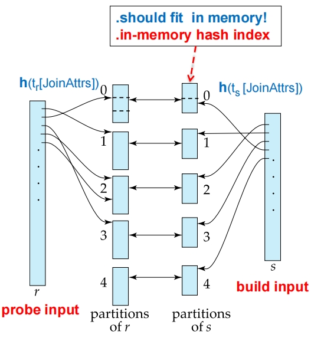

**Note**: the value n and the hash function h is chosen such that each $s_i$ should fit in memory.

$$n \ge \lceil b_s / M \rceil$$

**Note**: In book, $r_i$ is denoted as $H_{r_i}$ and $s_i$ is denoted as $H_{s_i}$ and n is denoted as $n_h$

---

r tuples in $r_i$ need only to be compared with s tuples in $s_i$

Need not be compared with s tuples in any other partition, since:

- an r tuple and an s tuple that satisfy the join condition will have the same value for the join attributes.
- If that value is hashed to some value i, the r tuple has to be in $r_i$ and the s tuple in $s_i$ .

散列——连接算法背后的思想是这样的:

假设一个 r 元组与一个 s 元组满足连接条件，那么它们对于连接属性就会取相同的值。若该值被散列成某个值 i ，则 r 元组必在 $r_i$ 中且 s 元组必在 $s_i$ 中。因此， $r_i$ 中的 r 元组只需与 $s_i$ 中的 s 元组相比较， $r_i$ 中的 r 元组没有必要与其他任何分区里的 s 元组相比较。

---

#### Hash-Join Algorithm

The hash-join of r and s is computed as follows.

1. Partition s using hashing function h. When partitioning a relation, one block of memory is reserved as the output buffer for each partition.
2. Partition r similarly.
3. For each i:

(a) Load $s_i$ into memory and build an in-memory hash index on it using the join attribute. This hash index uses a different hash function than the earlier one h.
(b) Read the tuples in $r_i$ from the disk one by one. For each 
tuple $t_r$ locate each matching tuple $t_s$ in $s_i$ using the inmemory hash index. Output the concatenation of their attributes.

Relation s is called the build input

Relation r is called the probe input

在对关系进行分区后，散列——连接代码的其余部分在各个分区上对 i (i=0,1,...,$n_h$) 执行单独的索引嵌套——循环连接。为此，算法先在每个 $s_i$ 上构造(**build**)散列索引，然后用 $r_i$ 的元组进行探查(**probe**)(即在 $s_i$ 中查找)。关系 s 就是构造用输入(**build input**)，而 r 是探查用输入(**probe input**)。

The value n and the hash function h is chosen such that each build input relation partitions $s_i$ should fit in memory.

Typically n is chosen as $\lceil b_s / M \rceil \times f$ where f is a "fudge factor(修正因子)", typically around 1.2

The probe input relation partitions $r_i$ need not fit in memory

??? note "why need fudge factor"
    必须选择足够大的 $n_h$ 值，使得对于每个 i ，在内存中可以容纳构造关系的 $s_i$ 分区中的元组以及分区上的散列索引。内存中可以不必容纳探查用关系的分区。最好用较小的输入关系作为构造关系。如果构造关系的规模是 $b_s$ 个块，那么要使每个 $n_h$ 分区的规模都小于或等于 M ， $n_h$ 必须至少是 $b_s / M$。更准确地说，我们还必须考虑该分区上散列索引占用的额外空间，因此 $n_h$ 应当相应地取得更大一点。为了简单起见，在分析中我们有时忽略了散列索引所需的空间。

---

##### Recursive partitioning

Recursive partitioning required if number of partitions n is greater than number of pages M of memory.

Instead of partitioning n ways, use M – 1 partitions for s

Further partition the M – 1 partitions using a different hash function

Use same partitioning method on r

A relation does not need recursive partitioning if M > $n_h$ + 1, or equivalently M > ($b_s$ / M) + 1, which simplifies (approximately) to M > $\sqrt{b_s}$

如果 $n_h$ 的值大于或等于内存块数，因为没有足够的缓冲块，关系的分区就不可能一趟完成。这时，完成关系的分区需要重复多趟。在每一趟中，输入能够被划分的最多分区数与可用于输出的缓冲块数同样多。一趟产生的每个桶在下一趟中被单独读入并再次分区以产生更小的分区。一趟中使用的散列函数与上一趟中使用的散列函数不同。系统不断重复对输入的这种分区过程直到构造用输人的每个分区都能被内存容纳为止。这种分区被称为递归分区(recursive partitioning)。

??? note "Example"
    consider a memory size of 12M bytes, divided into 4K bytes blocks; it would contain a total of 3K (3072) blocks. We can use a memory of this size to partition relations of size up to 3K ∗ 3K blocks, which is 36G (3K ∗ 3K ∗ 4K ) bytes.

    Similarly, a relation of size 1 gigabyte requires just over $\sqrt{256}$ blocks, or 2 megabytes, to avoid recursive partitioning

---

#### Cost of Hash-Join

If recursive partitioning is not required:

cost of hash join is: $3(b_s + b_r) + 4 \times n_h$ block transfers + $2(\lceil b_r / b_b \rceil + \lceil b_s / b_b \rceil) + 2 \times n_h$ seeks

Block transfers : The partitioning of the two relations r and s calls for a complete reading of both relations, and a subsequent writing back of them. This operation requires $2(b_r + b_s)$ block transfers. The build and probe phases read each of the partitions once, calling for further $b_s + b_r$ block transfers. The number of blocks occupied by partitions could be slightly more than $b_s + b_r$ , as a result of partially filled blocks. Accessing such partially filled blocks can add an overhead of at most 2$n_h$ h for each of the relations, since each of the $n_h$ partitions could have a partially filled block that has to be written and read back. Thus, a hash join is estimated to require: $3(b_r + b_s) + 4 n_h$ block transfers.

Seeks: Assuming $b_b$ b blocks are allocated for the input buffer and each output buffer, partitioning requires a total of $w(b_r / b_b + b_s / b_b)$ seeks. The build and probe phases require only one seek for each of the $n_h$ partitions of each relation, since each partition can be read sequentially. The hash join thus requires $2(b_r / b_b + b_s / b_b) + 2 n_h$ seeks.

If recursive partitioning required:

number of passes required for partitioning build relation s to less than M blocks per partition is $\lceil \log_{\lfloor M / b_b \rfloor - 1} (b_s / M) \rceil$

best to choose the smaller relation as the build relation.

Total cost estimate is: $2(b_r + b_s) \lceil \log_{\lfloor M / b_b \rfloor - 1} (b_s / M) \rceil + b_s + b_r$ block transfers + $2(\lceil b_r / b_b \rceil + \lceil b_s / b_b \rceil) \lceil \log_{\lfloor M / b_b \rfloor - 1} (b_s / M) \rceil$ seeks

If the entire build input can be kept in main memory no partitioning is required

Cost estimate goes down to $b_r + b_s$

??? note "Chinese version"
    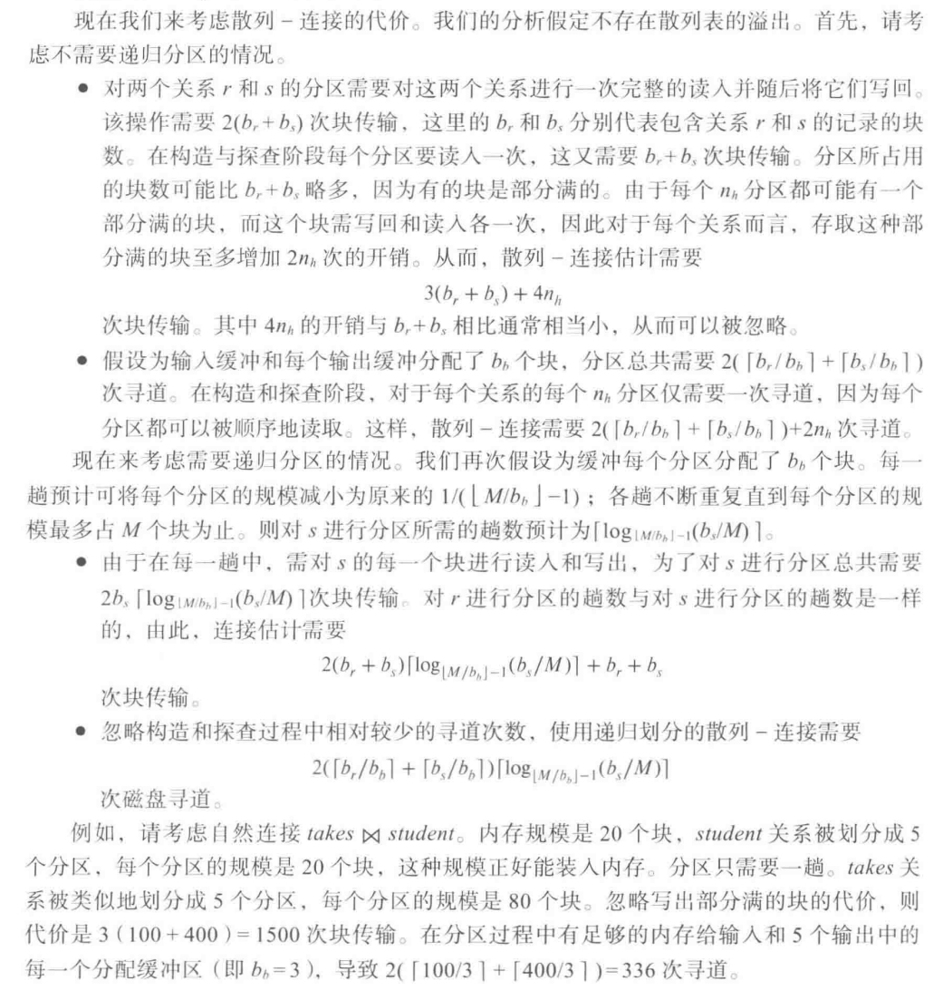

---

## Other Operations

**Duplicate elimination** can be implemented via hashing or sorting.

On sorting duplicates will come adjacent to each other, and all but one set of duplicates can be deleted.

我们可以通过排序的方法来容易地实现去重。作为排序的结果，相同的元组会彼此邻近地出现，那就删除所有相同元组只保留一个副本即可。对于外排序——归并而言，在创建归并段时就可以发现重复元组，并在将归并段写到磁盘之前去除重复元组，从而减少块传输的次数。剩余的重复元组可在归并过程中去除，并且最后的有序归并段是没有重复元组的。在最坏情形下，去重的估计代价与对该关系进行排序的最坏情形下的估计代价是一样的。

Optimization: duplicates can be deleted during run generation as well as at intermediate merge steps in external sort-merge.

Hashing is similar – duplicates will come into the same bucket.

我们也可通过散列来实现去重，就像在散列-连接算法里一样。首先，基于整个元组上的一个散列函数对关系进行分区。接下来读入每个分区，并创建一个内存散列索引。在创建散列索引时，只有不在索引中的元组才被插入:否则，该元组就被丢弃。在分区中的所有元组都被处理完后，将散列索引中的元组写到结果中。其估计代价与在散列-连接中处理构造关系(分区并读入每个分区)的代价是一样的。

**Projection**:

perform projection on each tuple followed by duplicate elimination.

**Aggregation** can be implemented in a manner similar to duplicate elimination.

聚集运算可以用与去重相同的方式来实现。我们或者使用排序或者使用散列，就像我们在去重中所做的那样，只不过基于分组属性。但是，我们不是去除对于分组属性取值相同的元组，而是将它们聚集成组，并对每一组应用聚集运算以得到结果。

Sorting or hashing can be used to bring tuples in the same group together, and then the aggregate functions can be applied on each group.

Optimization: combine tuples in the same group during run generation and intermediate merges, by computing partial aggregate values

对于诸如 `min、max、sum、count` 和 `avg` 那样的聚集函数而言，实现聚集运算的估计代价和去重的代价是一样的。

For count, min, max, sum: keep aggregate values on tuples found so far in the group. When combining partial aggregate for count, add up the aggregates

For avg, keep sum and count, and divide sum by count at the end

**Set operations** ($\cap, \cup and ——$) can either use variant of merge-join after sorting, or variant of hash-join.

对于所有这些运算，两个排好序的输入关系仅需扫描一次，因此如果两个关系按相同的次序排好序，其代价为 $b_r + b_s$ 次块传输。假设最坏情况下每个关系只有一个缓冲块，则总共需要 $b_r + b_s$ 次磁盘寻道再加上 $b_r + b_s$ 次块传输。通过分配额外的缓冲块可以减少寻道的次数。若关系一开始并未排序，则还要包含排序的代价。在执行集合运算时，任何排序次序均可使用，只要两个输入具有相同的排序次序即可。

E.g., Set operations using hashing:

1. Partition both relations using the same hash function
2. Process each partition i as follows.

(a) Using a different hashing function, build an in-memory hash index on $r_i$
(b) Process $s_i$ as follows

散列提供了实现这些集合运算的另一种方式。对于每种运算的第一步使用相同的散列函数对两个关系进行分区，并由此创建出分区 $r_0, r_1, \cdots, r_{n_h}$ 以及 $s_0, s_1, \cdots, s_{n_h}$。然后根据运算的不同，系统对 i = 0, 1, ..., $n_h$ 中的每个分区执行不同运算步骤。

$r \cup s$: 

a. Add tuples in $s_i$ to the hash index if they are not already in it.
b. At end of $s_i$ add the tuples in the hash index to the result.

???+ note "others"
    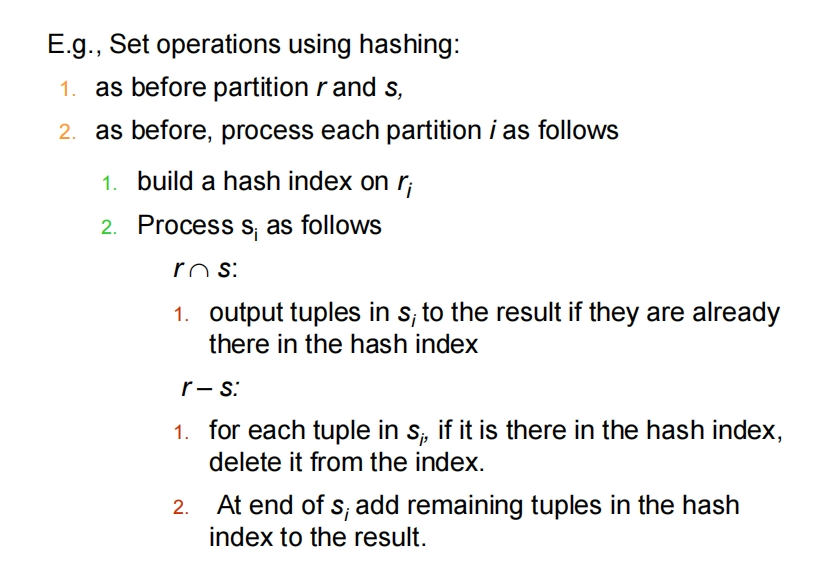

    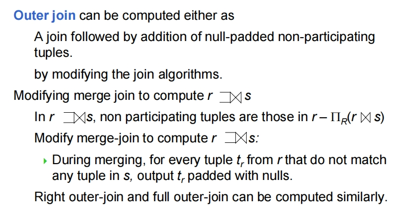

    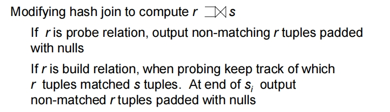

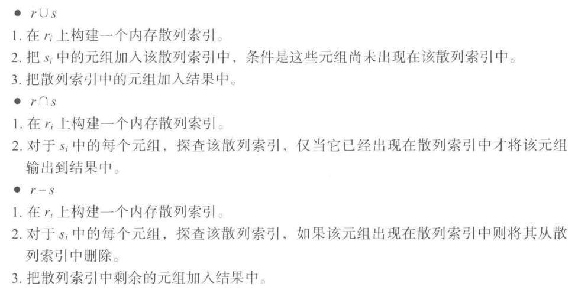

---

## Evaluation of Expressions

目前为止，我们只学习了如何执行单个关系运算。现在我们考虑如何执行包含多种运算的表达式。一种显而易见的表达式执行方式是以一种恰当的次序每次只执行一个运算;每次执行的结果被物化(materialized)到一个临时关系中以备后用。这种方式的缺点是需要构造临时关系，这些临时关系(除非它们非常小)必须写到磁盘上。另一种可替代方式是在流水线(pipeline)中同时执行多个运算，将一个运算的结果传递给下一个，而不必保存临时关系。

---

### Materialization

为了直观地理解如何执行一个表达式，最容易的方式是看一看以算子树(operator tree)对表达式所做的图形化表示。

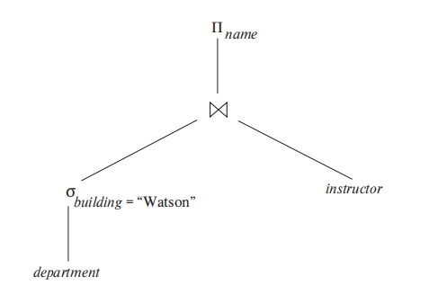

如果应用物化方法，我们从表达式中的最底层运算(在树的底部)开始。在我们的示例中，只有一个这样的运算: deparment 上的选择运算。最底层运算的输入是数据库中的关系。我们使用前面学习过的算法来执行这些运算，并且将结果存储在临时关系中。我们可以使用这些临时关系来执行树中更高一层的运算:这时的输入要么是临时关系，要么是存储在数据库中的关系。在我们的示例中，连接的输入是 instructor 关系以及在 deparment 上通过选择建立的临时关系。现在可以执行连接，并创建另一个临时关系。

通过重复该过程，我们最终可以执行位于树的根节点处的运算，从而得到表达式的最终结果。在我们的示例中，通过使用由连接创建的临时关系作为输人来执行根节点处的投影运算投影，就得到了最终的结果。

刚才描述的执行方式被称为物化执行(materialized evaluation)，因为每个中间运算的结果都被创建(物化)，然后用于下一层运算的执行。

物化执行的代价不单单是所涉及的运算代价的总和。当计算算法的估计代价时，我们忽略了将运算结果写到磁盘的代价。为了计算按这种方式执行一个表达式的代价，必须把所有运算的代价相加，还要加上把中间结果写到磁盘的代价。假设结果记录在缓冲区中积累，并且当缓冲区已满时，再把它们写到磁盘上。写出的块数 $b_r$ ,可按 $n_r/f_r$ 来估计，其中 $n_r$ 是结果关系 r 中元组的估计数，$f_r$ 是结果关系的块因子(blocking factor)，也就是每个块中可容纳的 r 的记录数。除了传输时间之外，还可能需要一些磁盘寻道，因为磁头在连续的写操作之间可能会进行移动。寻道的次数可以估计为 $b_r/b_b$ ，其中 $b_b$ 是输出缓冲块的规模(以块数计算)。

**双缓冲**(double buffering)(使用两块缓冲区，其中一块用于连续执行算法，而另一块用于写出结果)通过并行执行 CPU 活动与 I/O 活动，允许算法执行得更快。通过为输出缓冲区分配额外的块以及一次写出多个块，可以减少寻道的次数。

---

### Pipelining

通过减少产生的临时文件数，我们可以提高查询执行的效率。减少临时文件数是通过将多个关系运算组合成一个运算的流水线来实现的，其中一个运算的结果将传送到流水线中的下一个运算。刚刚描述的这种执行方式叫作流水线执行(pipelined evaluation)。

如果采用物化方式，执行中将涉及创建存放连接结果的临时关系，然后为了执行投影又将此连接结果读回。这些运算可按如下方式组合:当连接运算产生一个它的结果元组时，马上将该元组传送给投影运算去处理。通过将连接与投影组合起来，我们避免了中间结果的创建，从而直接产生最终结果。

创建运算的流水线可以带来两种好处:

1. 它消除了读和写临时关系的代价，从而减少了查询执行代价。请注意，我们前面看到过的用于每个运算的代价公式都包括从磁盘读取结果的代价。如果运算 $o_i$ 的输入是从前面的运算 $o_j$ 流水线化而来的，则 $o_i$ 的代价就不应包括从磁盘读取输入的代价;我们前面看到过的代价公式可以做相应的修改。
2. 如果一个查询执行计划的根算子及其输入被合并在流水线中，那么就可以迅速开始产生查询结果。如果在结果生成时就把它们显示给用户，这可能相当有用，因为否则在用户看到任何查询结果之前可能会存在一个长时间的延迟。

Pipelines can be executed in either of two ways:

1. demand-driven pipeline

在一条需求驱动流水线(demand-driven pipeline)中，系统不停地向位于流水线顶端的运算发出需要元组的请求。每当一个运算收到需要元组的请求时，它就计算待返回的下一个(若干个)元组并返回这些元组。若该运算的输入不是流水线化的，则待返回的下一个(若干个)元组可以从输人关系计算出来，同时系统跟踪到目前为止已经返回了哪些元组。若该运算具有一些流水线化的输入，那么它也发出请求以获得来自其流水线输人的元组。该运算使用它从其流水线输入接收到的元组，并为其输出计算这些元组，然后把它们上传到它的父节点。

2. producer-driven pipeline

在一条生产者驱动流水线(producer-drivenpipeline)中，各运算并不等待产生元组的请求，而是积极地(eagerly)生产元组。生产者驱动流水线中的每一个运算都被建模成系统中一个单独的进程或线程，它从其流水线化的输入中取出元组流，并产生一个元组流作为其输出

---

??? Question "为什么顺序扫描比随机查找更高效？"
    - **减少磁盘寻道时间：** 磁盘读取数据时，磁头需要移动到正确的磁道（寻道）和扇区（旋转延迟）。随机查找意味着磁头需要在磁盘上频繁地跳跃，导致大量的寻道时间和旋转延迟，从而降低了 I/O 性能。
    - **利用磁盘预读：** 当按物理地址顺序扫描时，操作系统和磁盘控制器通常会进行预读操作，即预测即将需要的数据并提前加载到缓冲区中。这样一来，后续的读取操作很可能直接从缓冲区中获取，而无需再次访问磁盘，显著提高了数据读取速度。

    **总结：**

    混合归并连接的策略充分利用了一个关系已经排序的优势以及另一个关系上的 B+ 树索引。通过先将排序关系与索引叶子节点归并，然后对未排序关系的地址进行排序，最后以物理地址顺序扫描未排序关系并完成连接，该算法旨在最小化磁盘的随机访问，从而提高连接操作的效率。与完全随机地根据地址查找未排序关系的元组相比，顺序扫描能够更有效地利用磁盘 I/O，从而提升整体性能。