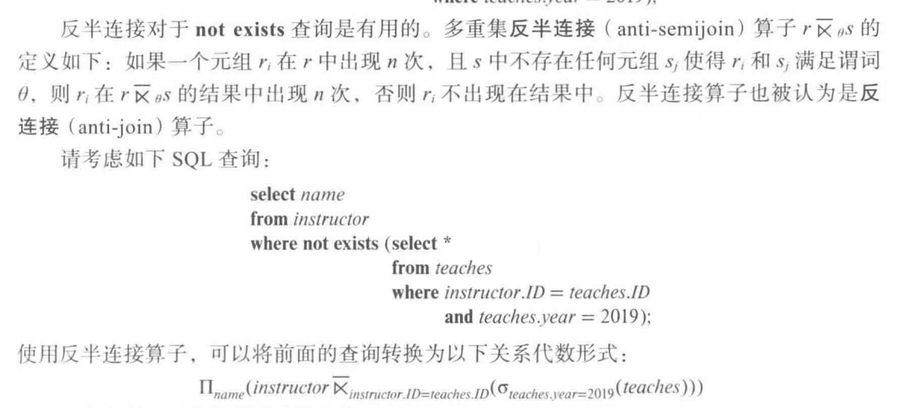

# Chapter 16 | Query Optimization

Alternative ways of evaluating a given query

- Equivalent expressions
- Different algorithms for each operation


An evaluation plan defines exactly what algorithm is used for each operation, and how the execution of the operations is coordinated.

Cost difference between evaluation plans for a query can be enormous.

Steps in cost-based query optimization:

1. Generate logically equivalent expressions using equivalence rules
2. Annotate resultant expressions in alternative ways to get alternative query plans
3. Choose the cheapest plan based on estimated cost

为了找到代价最小的查询执行计划，查询优化器需要产生一些能与给定表达式得到相同结果的备选计划，并选出代价最小的一个。

查询执行计划的产生涉及三个步骤:

(1)产生逻辑上与给定表达式等价的表达式;

(2)以可替代的方式对所产生的表达式做注释，以产生备选的查询计划;

(3)估计每个执行计划的代价，并选择估计代价最小的那一个。

Estimation of plan cost based on:

- Statistical information about relations. e.g. number of tuples, number of distinct values for an attribute
- Statistics estimation for intermediate results 中间结果的规模估计 (**Cardinality Estimation** 基数估计) e.g. to compute cost of complex expressions
- Cost formulae for algorithms, computed using statistics

---

## Viewing Query Evaluation Plans

Most database support `explain` evaluation plan for a query

Some syntax variations between databases:

- PostgreSQL : `explain <query>`
- Oracle: `explain plan for <query> followed by select * from table (dbms_xplan.display)`
- SQL Server: `set showplan_text on`

---

## Generating Equivalent Expressions

Two relational algebra expressions are said to be equivalent if the two expressions generate the same set of tuples on every legal database instance

An equivalence rule says that expressions of two forms are equivalent, can replace expression of first form by second, or vice versa

---

### Equivalence Rules

1. Conjunctive selection operations can be deconstructed（分解）into a sequence of individual selections.

$$\sigma_{\theta_1 \land \theta_2} (E) = \sigma_{\theta_1} (\sigma_{\theta_2} (E))$$

2. Selection operations are commutative（可交换的）.

$$\sigma_{\theta_1} (\sigma_{\theta_2} (E)) = \sigma_{\theta_2} (\sigma_{\theta_1} (E))$$

3. Only the last in a sequence of projection operations is needed, the others can be omitted（可省略的）.

$$\Pi_{L_1}(\Pi_{L_2}(\ldots \Pi_{L_n}(E))) = \Pi_{L_n}(E)$$

4. Selections can be combined with Cartesian products and theta joins.

a. 

$$\sigma_{\theta}(E_1 \times E_2) = E_1 \bowtie_{\theta} E_2$$

b. 

$$\sigma_{\theta_1}(E_1 \bowtie_{\theta_2} E_2) = E_1 \bowtie_{\theta_1 \land \theta_2} E_2$$

5. Theta-join operations (and natural joins) are commutative（可交换的）.

$$E_1 \bowtie_{\theta} E_2 = E_2 \bowtie_{\theta} E_1$$

6. 

a. Natural join operations are associative（可结合的）:

$$(E_1 \bowtie E_2) \bowtie E_3 = E_1 \bowtie (E_2 \bowtie E_3)$$

b. Theta joins are associative in the following manner:

$$(E_1 \bowtie_{\theta_1} E_2) \bowtie_{\theta_2 \land \theta_3} E_3 = E_1 \bowtie_{\theta_1 \land \theta_3} (E_2 \bowtie_{\theta_2} E_3)$$

where $\theta_2$ involves attributes from only $E_2$ and $E_3$.

7. The selection operation distributes（分配） over the theta join
operation under the following two conditions:

a. When all the attributes in $\theta_0$ involve only the attributes of one of the expressions ($E_1$) being joined.

$$\sigma_{\theta_0}(E_1 \bowtie_{\theta} E_2) = (\sigma_{\theta_0}(E_1)) \bowtie_{\theta} E_2$$

b. When $\theta_1$ involves only the attributes of $E_1$ and $\theta_2$ involves only the attributes of $E_2$.

$$\sigma_{\theta_1 \land \theta_2}(E_1 \bowtie_{\theta} E_2) = (\sigma_{\theta_1}(E_1)) \bowtie_{\theta} (\sigma_{\theta_2}(E_2))$$

8. The projection operation distributes（分配） over the theta join operation as follows:

a. if $\theta$ involves only attributes from $L_1 \cup L_2$.

$$\Pi_{L_1 \cup L_2}(E_1 \bowtie_{\theta} E_2) = (\Pi_{L_1}(E_1)) \bowtie_{\theta} (\Pi_{L_2}(E_2))$$

b. Consider a join $E_1 \bowtie_{\theta} E_2$

Let $L_1$ and $L_2$ be sets of attributes from $E_1$ and $E_2$ respectively

Let $L_3$ be attributes of $E_1$ that are involved in join condition $\theta$, but are not in $L_1 \cup L_2$ and

Let $L_4$ be attributes of $E_2$ that are involved in join condition $\theta$, but are not in $L_1 \cup L_2$

$$\Pi_{L_1 \cup L_2}(E_1 \bowtie_{\theta} E_2) = \Pi_{L_1 \cup L_2}((\Pi_{L_1 \cup L_3}(E_1)) \bowtie_{\theta} (\Pi_{L_2 \cup L_4}(E_2)))$$

9. The set operations union and intersection are commutative

$$E_1 \cup E_2 = E_2 \cup E_1$$

$$E_1 \cap E_2 = E_2 \cap E_1$$

(set difference is not commutative).

10. Set union and intersection are associative.

$$(E_1 \cup E_2) \cup E_3 = E_1 \cup (E_2 \cup E_3)$$

$$(E_1 \cap E_2) \cap E_3 = E_1 \cap (E_2 \cap E_3)$$

11. The selection operation distributes over $\cup$, $\cap$ and $-$

$$\sigma_{\theta}(E_1 - E_2) = \sigma_{\theta}(E_1) - \sigma_{\theta}(E_2)$$

and similarly for $\cup$ and $\cap$ in place of $-$

Also:

$$\sigma_{\theta}(E_1 - E_2) = \sigma_{\theta}(E_1) - E_2$$

and similarly for $\cap$ in place of $-$ but not for $\cup$

12. The projection operation distributes over union

$$\Pi_{L}(E_1 \cup E_2) = \Pi_{L}(E_1) \cup \Pi_{L}(E_2)$$

13. Selection distributes over aggregation as below

$$\sigma_{\theta}(_G\gamma_{A}(E)) = _G\gamma_{A}(\sigma_{\theta}(E))$$

provided $\theta$ only involves attributes in G

14. 

a. Full outerjoin is commutative:

$$E_1 ⟗ E_2 = E_2 ⟗ E_1$$

b. Left and right outerjoin are not commutative, but:

$$E_1 ⟕ E_2 = E_2 ⟖ E_1$$

15. Selection distributes over left and right outer joins as below, provided $\theta_1$ only involves attributes of $E_1$

a. 

$$\sigma_{\theta_1}(E_1 ⟕_{\theta} E_2) = (\sigma_{\theta_1}(E_1)) ⟕_{\theta} E_2$$

b. 

$$\sigma_{\theta_1}(E_2 ⟖_{\theta} E_1) = E_2 ⟖_{\theta} (\sigma_{\theta_1}(E_1))$$

16. Outerjoins can be replaced by inner joins under some conditions

a. 

$$\sigma_{\theta_1}(E_1 ⟕_{\theta} E_2) = \sigma_{\theta_1}(E_1 \bowtie_{\theta} E_2)$$

b. 

$$\sigma_{\theta_1}(E_2 ⟖_{\theta} E_1) = \sigma_{\theta_1}(E_2 \bowtie_{\theta} E_1)$$

provided $\theta_1$ is null rejecting on $E_2$

即，如果 $\theta_1$ 涉及 $E_2$ 的列，那么它必须要求这些列不能为 NULL（否则该行会被过滤掉）。

If $\theta_1$ has the property that it evaluates to false or unknown whenever the attributes of $E_2$ are null

对于 $E_1$ 中未匹配的行， $E_2$ 的所有属性会被填充为 NULL。

如果 $\theta_1$ 对这些 NULL 值返回 false/unknown，则这些行会被 $\sigma_{\theta_1}$ 过滤掉。

因此，最终结果仅保留 $E_1$ 和 $E_2$ 成功匹配的行，等价于直接内连接后过滤。

---

## Statistics for Cost Estimation

Cost of each operator: Need statistics of input relations

Inputs can be results of sub-expressions

---

### Statistical Information for Cost Estimation

$n_r$ number of tuples in a relation r 关系 r 中的元组的数量

$b_r$ number of blocks containing tuples of r 关系 r 中的元组的块数

$l_r$ size of a tuple of r 关系 r 中一个元组的字节数

$f_r$ blocking factor of r — i.e., the number of tuples of r that fit into one block. 关系 r 的块因子（一个块中能容纳的关系 r 的元组数）

$V(A, r)$ number of distinct values that appear in r for attribute A; same as the size of $\Pi_{A}(r)$ 关系 r 中出现的对于属性 A 的非重复值的数量。该值与 $\Pi_{A}(r)$ 的规模相同。

如果 A 是关系 r 的码，则 V(A,r) 等于 $n_r$。

V(A, R) 非常重要，用于决定可以采取哪种算法

If tuples of r are stored together physically in a file, then:

如果我们假设关系 r 的元组在物理上被共同存储在一个文件中，则下面的等式成立:

$$b_r = \lceil \frac{n_r}{f_r} \rceil$$

---

### Histograms

Histogram on attribute age of relation person


- Equi-width histograms 等宽直方图，它将值的范围划分为规模相等的区间。
- Equi-depth histograms 等深直方图，调整了区间的边界，使得每个区间具有相同数量的值。因此，等深直方图仅存储区间划分的边界，而不需要存储值的数量。

---

### Selection Size Estimation

$\sigma_{A = V}(r)$

- $n_r / V(A, r)$ number of records that will satisfy the selection
- Equality condition on a key attribute: size estimate = 1

- 如果 a 是一个出现次数有可用统计值的频繁出现的值，则可以直接使用该值作为选择的规模估计。
- 否则，如果没有可用的直方图，我们假设取值是均匀分布的(即每个值以同样的概率出现)，并假设 r 的一些记录在属性 A 上的取值为 a ，则选择结果估计有 $n_r / V(A, r)$ 个元组。
- 如果在属性 A 上有一个直方图可用，则可以定位出包含值 a 的区间，然后用该区间的频率计数代替 $n_r$ ,并用该区间中出现的不同值的数量代替 V(A, r) 来修改上面提到的估算公式 $n_r$/V(A, r)。

$\sigma_{A \leq V}(r)$ (case of $\sigma_{A \geq V}(r)$ is symmetric)

Let c denote the estimated number of tuples satisfying the condition.

If min(A,r) and max(A,r) are available in catalog

- c = 0 if V < min(A,r)
- else, c = $n_r \times \frac{V - min(A,r)}{max(A,r) - min(A,r)}$

If histograms available, can refine above estimate

In absence of statistical information c is assumed to be $n_r / 2$

---

The selectivity（中选率） of a condition $\theta_{i}$ is the probability that a tuple in the relation r satisfies $\theta_{i}$

If $s_i$ is the number of satisfying tuples in r, the selectivity of $\theta_{i}$ is given by $s_i / n_r$

Conjunction: 

$$\sigma_{\theta_{1} \land \theta_{2} \land \cdots \land \theta_{n}}(r)$$

Assuming indepdence, estimate of tuples in the result is:

$$n_r \times \prod_{i = 1}^{n} \frac{s_i}{n_r}$$

Disjunction:

$$\sigma_{\theta_{1} \lor \theta_{2} \lor \cdots \lor \theta_{n}}(r)$$

Estimated number of tuples:

$$n_r \times (1 - \prod_{i = 1}^{n} (1 - \frac{s_i}{n_r}))$$

Negation:

$$\sigma_{\neg \theta}(r)$$

Estimated number of tuples:

$$n_r - size(\sigma_{\theta}(r))$$

---

### Estimation of the Size of Joins

The Cartesian product $r \times s$ contains $n_r \times n_s$ tuples; each tuple occupies $s_r + s_s$ bytes

1. If $R \cap S = \emptyset$ then $r \bowtie s$ is the same as $r \times s$

2. If $R \cap S$ is a key for R, then a tuple of s will join with at most one tuple from r

therefore, $(\text{the number of tuples in } r \bowtie s ) \leq n_s$

3. If $R \cap S$ is a foreign key in S referencing R, then the number of tuples in $r \bowtie s$ = the number of tuples in s

- 如果 foreign key 不是空的
- The case for $R \cap S$ S being a foreign key referencing S is symmetric.

4. If $R \cap S$ = {A} is not a key for R or S.

If we assume that every tuple t in R produces tuples in $R \bowtie S$ , the number of tuples in $R \bowtie S$ is estimated to be:

$$\frac{n_r \times n_s}{V(A,s)}$$

If the reverse is true, the estimate obtained will be:

$$\frac{n_r \times n_s}{V(A,r)}$$

The lower of these two estimates is probably the more accurate one.

Can improve on above if histograms are available : Use formula similar to above, for each cell of histograms on the two relations

A 不是  或 S 的键（key），这意味着：

- A 在 R 中可能有重复值（即 V(A, R) < $n_R$）。
- A 在 S 中也可能有重复值（即 V(A, S) < $n_S$）。

(1) 假设 R 的每个元组都能匹配 S 的元组
- 即，R 的所有 A 值都存在于 S 中（$\Pi_A(R) \subseteq \Pi_A(S)$）。
- 此时，$R \bowtie S$ 的元组数量估算为：

$$\text{Tuples} = \frac{n_R \times n_S}{V(A, S)}$$

**直观理解**：R 的每个元组 t 在 S 中平均匹配 $\frac{n_S}{V(A, S)}$ 个元组（因为 A 在 S 中有 V(A, S) 个不同值，每个值平均出现 $\frac{n_S}{V(A, S)}$ 次）。

同理:

(2) 假设 S 的每个元组都能匹配 R 的元组

$$\text{Tuples} = \frac{n_R \times n_S}{V(A, R)}$$

由于我们不知道 $\Pi_A(R)$ 和 $\Pi_A(S)$ 的包含关系（即哪个关系的 $A$ 值范围更广），通常 **取两个估计值的较小者**：

$$\text{Tuples} = \min \left( \frac{n_R \times n_S}{V(A, R)}, \frac{n_R \times n_S}{V(A, S)} \right)$$

如果数据库存储了 属性 A 在 R 和 S 上的直方图，可以 **按值域分桶计算**，再汇总：

1. 将 A 的值域划分为多个区间（buckets）。
2. 对每个 bucket，计算：
   
$$\text{Matches in bucket } i = \frac{n_{R,i} \times n_{S,i}}{\max(V(A, R)_i, V(A, S)_i)}$$

3. 对所有 bucket 的结果求和：

$$\text{Total Tuples} = \sum_i \text{Matches in bucket } i$$

更重要的是，前面的估计取决于这样的假设:每个值是等概率出现的。

---

### Size Estimation for Other Operations

**Projection**: estimated size of $\Pi_A(r) = V(A, r)$

**Aggregation**: estimated size of $_A g_F(r) = V(A, r)$

**Set operations**:

For unions/intersections of selections on the same relation: rewrite and use size estimate for selections

E.g. $\sigma_{\theta_1}(r) \cup \sigma_{\theta_2}(r)$ can be rewritten as $\sigma_{\theta_1 \lor \theta_2}(r)$

For operations on different relations:

- estimated size of $r \cup s$ = size of r + size of s
- estimated size of $r \cap s$ = minimum size of r and size of s
- estimated size of r – s = r
- All the three estimates may be quite inaccurate, but provide upper bounds on the sizes.

**Outer join**:

- estimated size of $r ⟕ s$ = size of $r \bowtie s$ + size of r
- Case of right outer join is symmetric
- Estimated size of $r ⟗ s$ = size of $r \bowtie s$ + size of r + size of s

---

The size estimates often depend on the number of distinct values for an attribute. Need to compute the distinct vales for intermediate results.

**Selections**: $\sigma_{\theta}(r)$ estimate $V(A, \sigma_{\theta}(r))$

If $\theta$ forces A to take a specified value: $V(A, \sigma_{\theta}(r)) = 1$

If $\theta$ forces A to take on one of a specified set of values: $V(A, \sigma_{\theta}(r)) = \text{number of specified values}$

If the selection $\theta$ is of the form $A \ op \ v$ estimated $V(A, \sigma_{\theta}(r)) = V(A, r) \times s$ , where s is the selectivity of the selection.

In all the other cases, use approximate estimate: $V(A, \sigma_{\theta}(r)) = min(V(A, r), n_{\sigma_{\theta}}(r))$

??? note "Chinese Version"
    

More accurate estimate can be got using probability theory, but this one works fine generally

**Joins**: $r \bowtie s$ estimate $V(A, r \bowtie s)$

If all attributes in A are from r, the estimated

$$V(A, r \bowtie s) = min(V(A, r), n_{r \bowtie s}(r))$$

If A contains attributes $A_1$ from r and $A_2$ from s, then estimated

$$V(A, r \bowtie s) = min(V(A_1, r) \times V(A_2 - A_1, s), V(A_1 - A_2, r) \times V(A_2, s), n_{r \bowtie s}(r))$$

??? note "Chinese Version"
    

More accurate estimate can be got using probability theory, but this one works fine generally

Estimation of distinct values are straightforward for projections.

对于投影来说不同取值的估计是直截了当的:它们在 $\Pi_{A(r)}$ 中是和在 r 中一样的。这一点对于聚集的分组属性也同样成立。

They are the same in $\Pi_{A(r)}$ as in $r$.

The same holds for grouping attributes of aggregation.

For aggregated values

- For min(A) and max(A), the number of distinct values can be estimated as min(V(A,r), V(G,r)) where G denotes grouping attributes.
- For other aggregates, assume all values are distinct, and use V(G,r)

---

## Choice of Evaluation Plans

Must consider the interaction of evaluation techniques when choosing evaluation plans

choosing the cheapest algorithm for each operation independently may not yield best overall algorithm.

- merge-join may be costlier than hash-join, but may provide a sorted output which reduces the cost for an outer level aggregation.
- nested-loop join may provide opportunity for pipelining

Practical query optimizers incorporate elements of the following two broad approaches:

1. Search all the plans and choose the best plan in a cost-based fashion.
2. Uses heuristics to choose a plan.

---

### Cost-Based Join-Order Selection

Consider finding the best join-order for $r_1 \bowtie r_2 \bowtie \cdots \bowtie r_n$

There are $\frac{2(n-1)!}{(n-1)!}$ different join orders for above expression.

No need to generate all the join orders. Using dynamic programming, the least-cost join order for any subset of {$r_1, r_2, \cdots, r_n$} is computed only once and stored for future use.

---

#### Join Order Optimization Algorithm

To find best join tree for a set of n relations:

1. To find best plan for a set S of n relations, consider all possible plans of the form: $S_1 \bowtie (S - S_1)$ where $S_1$ is any non-empty subset of S.
2. Recursively compute costs for joining subsets of S to find the cost of each plan. Choose the cheapest of the $2^n - 2$ alternatives.
3. Base case for recursion: single relation access plan

- Apply all selections on $R_i$ using best choice of indices on $R_i$

When plan for any subset is computed, store it and reuse it when it is required again, instead of recomputing it

- Dynamic programming

??? note "Dynamic programming"
    

---

### Left Deep Join Trees

In left-deep join trees, the right-hand-side input for each join is a **relation**, not the result of an intermediate join.


---

### Cost of Optimization

With dynamic programming:

- time complexity of optimization with bushy trees is $O(3^n)$
- Space complexity is $O(2^n)$

To find best left-deep join tree for a set of n relations:

Consider n alternatives with one relation as right-hand side input and the other relations as left-hand side input.

Modify optimization algorithm:

- Replace "for each non-empty subset S1 of S such that S1 $\neq$ S"
- By: for each relation r in S , let S1 = S – r .

If only left-deep trees are considered,

- Time complexity of finding best join order is $O(n \cdot 2^{n})$
- Space complexity remains at $O(2^n)$

---

### Heuristic Optimization (启发式优化)

基于代价优化的一个缺点是优化本身的代价。虽然查询优化的代价可以通过巧妙的算法来降低，但一个查询的不同执行计划的数量可能非常大，并且从这个集合里找到最优计划仍需要很多计算代价。因此，查询优化器使用启发式方法(heuristic)来减少优化的代价。

Cost-based optimization is expensive, even with dynamic programming.

Systems may use heuristics to reduce the number of choices that must be made in a cost-based fashion.

Heuristic optimization transforms the query-tree by using a set of rules that typically (but not in all cases) improve execution performance:

- Perform selection early (reduces the number of tuples)
- Perform projection early (reduces the number of attributes)
- Perform most restrictive selection and join operations (i.e. with smallest result size) before other similar operations. 选出来的比例越小越好
- Perform left-deep join order

下述规则是启发式规则的一个示例，此规则用于对关系代数查询进行转换:

- 尽早执行选择。
- 尽早执行投影。
- 采取左深连接次序。

Some systems use only heuristics, others combine heuristics with partial cost-based optimization.

---

## Additional Optimization Techniques

Nested query example:

```sql
select name 
from instructor
where exists (select *
            from teaches
            where instructor.ID = teaches.ID and teaches.year = 2022)
```

SQL conceptually treats nested subqueries in the where clause as functions that take parameters and return a single value or set of values

通过将嵌套子查询作为函数来调用的方式执行嵌套子查询的技术称为相关执行(correlated evaluation)。相关执行的效率不是很高，因为子查询对于外层查询中的每一个元组都进行单独的运算。这可能导致大量的随机磁盘 I/O 操作。

因此，SQL优化器尽可能地试图将嵌套子查询转换成连接的形式。高效的连接算法有助于避免昂贵的随机 I/O。在不能进行转换的情况下，优化器将子查询当作一个单独的表达式，单独优化它们，然后再通过相关执行来执行它们。

Parameters are variables from outer level query that are used in the nested subquery; such variables are called correlation variables（相关变量）(e.g. 上述的 instructor)

Conceptually, nested subquery is executed once for each tuple in the cross-product generated by the outer level from clause

Such evaluation is called correlated evaluation （相关执行）

Note: other conditions in where clause may be used to compute a join (instead of a cross-product) before executing the nested subquery

Correlated evaluation may be quite inefficient since a large number of calls may be made to the nested query. There may be unnecessary random I/O as a result

SQL optimizers attempt to transform nested subqueries to joins where possible, enabling use of efficient join techniques

E.g.: earlier nested query can be rewritten as

```sql
select name
from instructor, teaches
where instructor.ID = teaches.ID and teaches.year = 2022
```

$$\Pi_{name}(instructor \bowtie_{instructor.ID = teaches.ID \land teaches.year = 2022} teaches)$$

Note: the two queries generate different numbers of duplicates

1. teaches can have duplicate IDs
2. Can be modified to handle duplicates correctly using semijoin operators.

The semijoin（半连接） operator ⋉ is defined as follows

If a tuple $r_i$ appears n times in r, it appears n times in the result of $r ⋉_{\theta} s$ , if there is at least one tuple $s_i$ in s matching with $r_i$

E.g.: earlier nested query can be rewritten as

$$\Pi_{name}(instructor ⋉_{instructor.ID = teaches.ID \land teaches.year = 2022} teaches)$$

Or even as:

$$\Pi_{name}(instructor ⋉_{instructor.ID = teaches.ID} (\sigma_{teaches.year = 2022} teaches))$$

Now the duplicate count is correct!

The above relational algebra query is also equivalent to

```sql
select name
from instructor
where ID in (select teaches.ID 
            from teaches
            where teaches.year = 2022)
```

半连接只需要 teaches.ID 读进来，而不需要整个 teaches 表。

??? note "Chinese Version"
    


---

In general, SQL queries of the form below can be rewritten as shown

Rewrite:

select A
from $r_1, r_2, \cdots, r_n$
where $P_1$ and exists (select *
                        from $s_1, s_2, \cdots, s_m$
                        where $P_2^1$ and $P_2^2$)

To:

$$\Pi_{A}(\sigma_{P_1} (r_1 \times r_2 \times \cdots \times r_n) ⋉_{P_2^2} (\sigma_{P_2^1} (s_1 \times s_2 \times \cdots \times s_m)))$$

- $P_2^1$ contains predicates that do not involve any correlation variables
- $P_2^2$ contains predicates involving correlation variables

The process of replacing a nested query by a query with a join/semijoin (possibly with a temporary relation) is called **decorrelation** (去除相关)

用带有连接、半连接或反半连接的查询去替换嵌套查询的过程称为去除相关。

把嵌套查询相关的东西转换成不含嵌套的执行。这是数据库处理嵌套查询相关的思路。

Decorrelation is more complicated in several cases

- The nested subquery uses aggregation, or
- The nested subquery is a scalar subquery

Correlated evaluation used in these cases

---

Decorrelation of scalar aggregate subqueries can be done using groupby/aggregation in some cases

```sql
select name
from instructor
where 1 < (select count(*)
            from teaches
            where instructor.ID = teaches.ID 
            and teaches.year = 2022)
```

$$\Pi_{name} (instructor ⋉_{instructor.ID = TID \land 1 < cnt}(_{ID as TID} \gamma_{count(*) as cnt} (\sigma_{taches.year = 2022} (teaches))))$$

---

## Materialized Views

A materialized view is a view whose contents are computed and stored.

物化视图(Materialized View)是一种预先计算并存储结果的视图，与普通视图不同，它实际保存了查询结果数据。

普通视图只是保存查询定义，每次访问时都需要重新计算。而物化视图则将查询结果实际存储起来，例如：

```sql
create view department_total_salary(dept_name, total_salary) as
select dept_name, sum(salary)
from instructor
group by dept_name
```

Materializing the above view would be very useful if the total salary by department is required frequently. Saves the effort of finding multiple tuples and adding up their amounts.

如果经常需要查询各部门的薪资总额，物化这个视图会非常有用，因为它避免了每次查询时都要从多条记录中查找并求和的开销。

---

### Materialized View Maintenance

The task of keeping a materialized view up-to-date with the underlying data is known as materialized view maintenance

- Materialized views can be maintained by recomputation on every update
- A better option is to use **incremental view maintenance** (增量视图维护)

保持物化视图与底层数据同步的过程称为**物化视图维护**。维护方式主要有两种：

1. **完全重新计算**：每次数据更新时都重新计算整个视图
2. **增量视图维护**：只计算受数据变化影响的部分视图内容

显然，增量维护效率更高。

- Changes to database relations are used to compute changes to the materialized view, which is then updated

增量维护通过计算**差分**(differential)来实现，即只处理数据变化带来的影响。

The changes (inserts and deletes) to a relation or expressions are referred to as its **differential**（差分）

对于连接操作，当有插入和删除时：

for **inserts** $V^{new} = V^{old} \cup (i_r \bowtie S)$

Similarly for **deletes** $V^{new} = V^{old} - (d_r \bowtie S)$


对于选择操作，当有插入和删除时：

**Selection**: Consider a view $v = \sigma_{\theta}(r)$

$V^{new} = v^{old} \cup \sigma_{\theta}(i_r)$

$V^{new} = v^{old} - \sigma_{\theta}(d_r)$

**Aggregation Operations**: 对组内有影响的改变即可。

聚合操作(如`sum`, `count`, `avg`等)的维护：
- 只需要更新受影响的组。
- 对于 `avg` 操作，通常分别维护 `sum` 和 `count` ，最后再相除。
- `min` 和 `max` 操作在删除时可能代价较高，因为需要检查同组的其他元组来确定新的极值。

To handle the case of avg, we maintain the sum and count aggregate values separately, and divide at the end.

Maintaining the aggregate values **min** and **max** on deletions may be more expensive. We have to look at the other tuples of r that are in the same group to find the new minimum.

物化视图特别适用于：
- 频繁执行的复杂查询
- 对实时性要求不高的统计分析
- 数据仓库和决策支持系统

通过预先计算和存储结果，物化视图可以显著提高查询性能，特别是在涉及大量数据聚合或复杂连接的情况下。

---